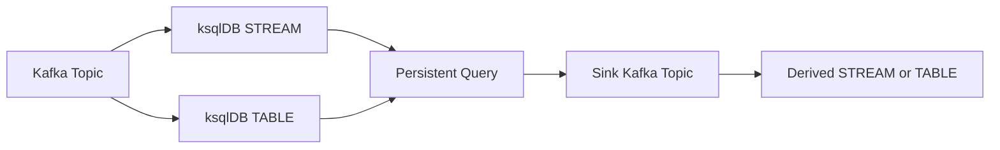
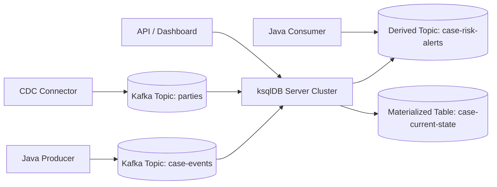
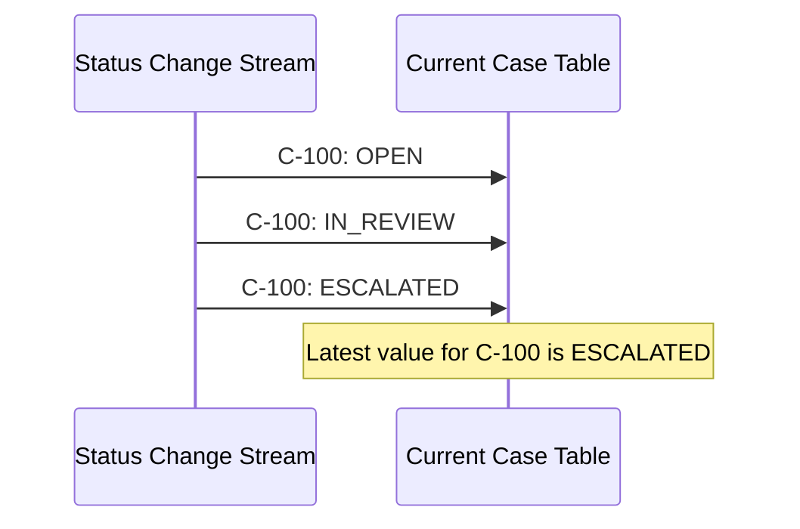
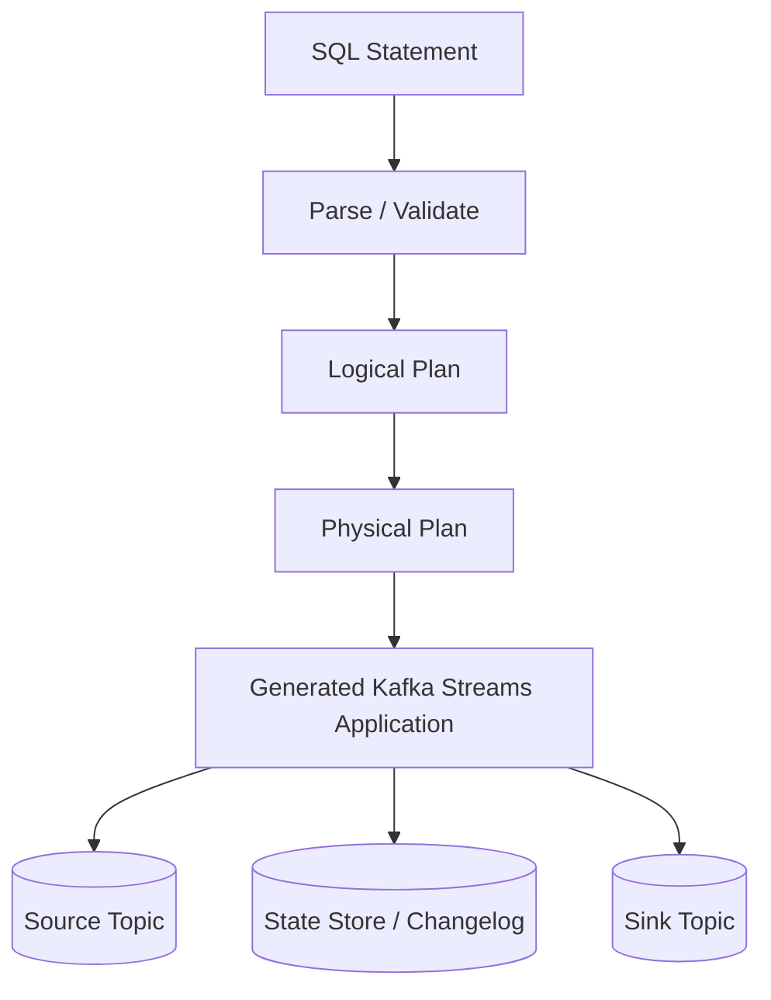
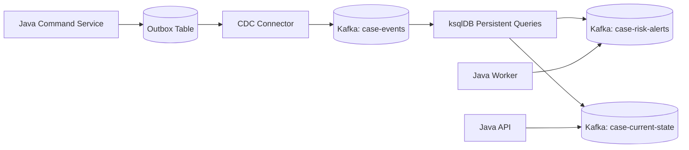
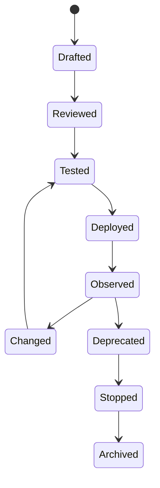
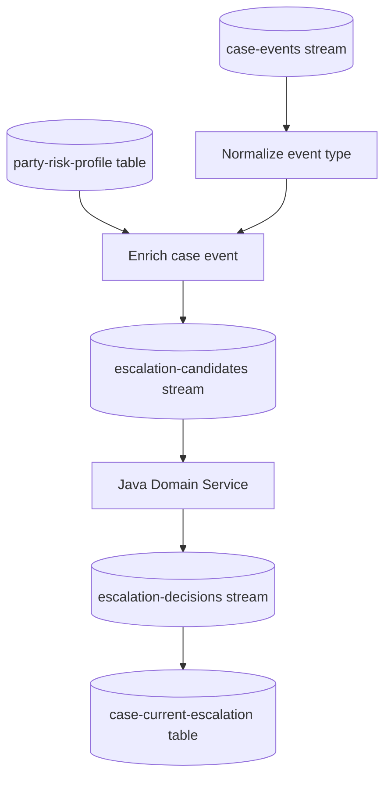

------
title: Learn Java Messaging and Event Streaming - Part 025
description: ksqlDB mental model: declarative stream processing on Kafka, streams, tables, materialized views, persistent queries, push queries, pull queries, and when SQL-based streaming is or is not the right abstraction.
series: learn-java-messaging-event-streaming
seriesTitle: Learn Java Messaging and Event Streaming
order: 25
partTitle: ksqlDB Mental Model
tags:
- java
- kafka
- ksqldb
- stream-processing
- streaming-sql
- materialized-views
- event-driven-architecture
date: 2026-06-28
---

# Part 025 — ksqlDB Mental Model

## 1. Why This Part Exists

At this point in the series, we already have the mental models for:

- broker vs log
- queue vs topic vs stream
- offset vs acknowledgement
- consumer group vs subscription
- retries, DLQ, idempotency, and schema discipline
- Kafka Streams as a Java library for stream processing

This part introduces **ksqlDB**.

The important shift is this:

> ksqlDB is not "Kafka with SQL syntax".
>
> ksqlDB is a server-side stream-processing runtime that lets us define continuously running transformations over Kafka topics using SQL-like statements.

That distinction matters.

If we only see ksqlDB as "SQL for Kafka", we will overuse it for ad hoc querying, underdesign its operational model, and forget that every persistent query is effectively a running stream-processing application.

A senior engineer should be able to answer:

- Is this transformation better as Kafka Streams Java code, ksqlDB, Kafka Connect SMT, Flink, a database query, or application code?
- Is the result a stream, a table, or a materialized view?
- What is the key?
- What is the changelog?
- What happens on replay?
- How does this scale?
- What breaks during schema evolution?
- Who owns the query lifecycle?
- How will we observe lag, state, and failure?

---

## 2. Kaufman Deconstruction

Following Josh Kaufman's skill acquisition approach, we deconstruct ksqlDB into subskills.

| Subskill | What We Need to Learn | Why It Matters |
|---|---|---|
| Collection model | Stream vs table | Prevents wrong query semantics |
| Query model | Persistent, push, pull | Prevents using the wrong interaction style |
| Storage model | Kafka topic, internal topic, state store | Explains durability and recovery |
| Runtime model | ksqlDB server generates Kafka Streams apps | Explains scaling and failure behavior |
| Key model | Kafka key, primary key, repartitioning | Determines joins and aggregations |
| Schema model | key/value format, schema registry | Determines compatibility |
| Operational model | query lifecycle, lag, metrics, scaling | Makes it production-safe |
| Governance model | ownership, review, deploy, rollback | Prevents SQL-as-shadow-production-code |

The first useful thing to learn is not syntax.

The first useful thing to learn is the difference between these four objects:



A Kafka topic is storage.

A ksqlDB stream/table is a logical schema and semantic interpretation over that topic.

A persistent query is a continuously running transformation.

A sink topic is the durable output of that transformation.

---

## 3. The Core Mental Model

ksqlDB sits between **raw Kafka topics** and **streaming applications**.

A simplified deployment looks like this:



ksqlDB can be used to:

1. Register existing topics as streams or tables.
2. Transform streams into new streams.
3. Aggregate streams into tables.
4. Join streams and tables.
5. Create materialized views.
6. Serve push and pull queries.
7. Build derived topics consumed by Java services.

It should not be thought of as a replacement for all Java stream-processing logic. It is an abstraction that trades expressive control for declarative speed and operational consistency.

---

## 4. Stream vs Table

This is the central concept.

### 4.1 Stream

A **stream** represents an unbounded sequence of immutable events.

Example:

```text
CaseOpened
CaseAssigned
EvidenceSubmitted
RiskScoreChanged
NoticeIssued
```

A stream answers:

> What happened?

A stream is appropriate when each record is a fact/event that should be processed as it arrives.

Example event stream:

| offset | case_id | event_type | occurred_at |
|---:|---|---|---|
| 0 | C-100 | CASE_OPENED | 2026-06-28T09:00:00Z |
| 1 | C-100 | CASE_ASSIGNED | 2026-06-28T09:03:00Z |
| 2 | C-100 | EVIDENCE_SUBMITTED | 2026-06-28T09:15:00Z |

The records are not "updates" to one row. They are an event history.

### 4.2 Table

A **table** represents current state.

Example:

```text
case_id -> current_status
case_id -> current_owner
party_id -> latest_risk_rating
```

A table answers:

> What is true now?

A table is often backed by a compacted topic, where each key has a latest value.

Example table interpretation:

| key | latest value |
|---|---|
| C-100 | `{ "status": "IN_REVIEW", "owner": "analyst-17" }` |
| C-101 | `{ "status": "ESCALATED", "owner": "supervisor-2" }` |

### 4.3 Why This Matters

Suppose we have a topic named `case-status`.

If each message is:

```json
{
  "caseId": "C-100",
  "previousStatus": "OPEN",
  "newStatus": "IN_REVIEW",
  "changedAt": "2026-06-28T09:03:00Z"
}
```

Then it is naturally a stream.

If each message is:

```json
{
  "caseId": "C-100",
  "status": "IN_REVIEW",
  "owner": "analyst-17",
  "lastUpdatedAt": "2026-06-28T09:03:00Z"
}
```

and the key is `caseId`, then it can be interpreted as a table.

The same Kafka topic infrastructure can hold both patterns, but ksqlDB semantics are different.

Wrong modelling leads to wrong output.

---

## 5. Stream-Table Duality

A table can be seen as the result of applying a stream of changes.



This is not merely academic.

It explains:

- why table keys matter
- why compaction matters
- why tombstones matter
- why a join to a table is a lookup into the latest state
- why replay can rebuild state
- why late events can corrupt state if timestamps and ordering are not controlled

In regulatory systems, this distinction is critical. A table may show current enforcement status, but the stream is the audit trail explaining how the status was reached.

Never replace an audit stream with a mutable table.

---

## 6. Three Query Types

ksqlDB exposes three query interaction models.

### 6.1 Persistent Query

A persistent query runs continuously and writes output to a Kafka topic.

Example:

```sql
CREATE STREAM high_risk_cases AS
SELECT case_id, risk_score, event_time
FROM case_risk_events
WHERE risk_score >= 80
EMIT CHANGES;
```

This is not an ad hoc query. It is a continuously running application.

It has:

- source topics
- sink topic
- generated topology
- state, if stateful
- resource usage
- lifecycle
- failure behavior
- compatibility concerns

Use a persistent query when the output is a reusable stream/table.

### 6.2 Push Query

A push query streams results to the client as changes happen.

Example:

```sql
SELECT case_id, status
FROM case_current_state
WHERE status = 'ESCALATED'
EMIT CHANGES;
```

Use it for:

- live dashboards
- operational monitoring
- development exploration
- lightweight subscriptions

Do not use it as a replacement for a durable integration contract between services unless you understand connection lifecycle and operational constraints.

### 6.3 Pull Query

A pull query reads the current value from a materialized table.

Example:

```sql
SELECT case_id, status, owner
FROM case_current_state
WHERE case_id = 'C-100';
```

Use it for:

- lookup APIs
- serving current state
- dashboards
- operational drill-down

A pull query depends on a materialized view. It is not the same as scanning arbitrary Kafka history.

---

## 7. Persistent Query as Deployed Application

A persistent query should be reviewed like application code.



Operationally, this means every persistent query needs:

- owner
- purpose
- source topic contract
- sink topic contract
- key design
- schema evolution plan
- resource estimate
- rollback plan
- observability
- replay expectation
- test data
- production review

A persistent query is not harmless because it is short.

A one-line SQL statement can create repartition topics, state stores, large changelogs, and expensive joins.

---

## 8. Materialized Views

A materialized view is a continuously maintained result of a query.

For example, we can derive current case counts by status:

```sql
CREATE TABLE case_count_by_status AS
SELECT status, COUNT(*) AS case_count
FROM case_status_events
GROUP BY status
EMIT CHANGES;
```

The result is not recomputed from scratch every time. It is updated incrementally as new events arrive.

This is powerful for:

- live operational metrics
- SLA dashboards
- case queues
- current assignment views
- risk bucket counts
- latest party profile
- enforcement status lookup

But materialized views also introduce hard questions:

- What is the source of truth?
- What is the replay cost?
- What happens if the query logic changes?
- Can downstream users tolerate correction events?
- How do we handle late or out-of-order input?
- How do we validate that the view matches expected business state?

For regulatory systems, materialized views are excellent for operational efficiency but should not become the only record of why something happened.

---

## 9. ksqlDB vs Kafka Streams Java

ksqlDB and Kafka Streams are related, but they serve different engineering needs.

| Concern | ksqlDB | Kafka Streams Java |
|---|---|---|
| Expression style | SQL-like | Java DSL / Processor API |
| Deployment | ksqlDB server | Application deployment |
| Best for | Common transformations, joins, aggregations, materialized views | Complex logic, custom state, custom error handling |
| Skill requirement | SQL + streaming semantics | Java + Kafka Streams internals |
| Operational ownership | Platform/data streaming team often involved | Service team often owns app |
| Testing | Query tests, integration tests | Unit, topology, integration tests |
| Custom behavior | Limited | High |
| Code review | SQL artifacts | Code repository |
| Debugging | Query plan, server logs, metrics | Application logs, metrics, debugger |

Use ksqlDB when the logic is:

- declarative
- explainable as stream/table transformations
- owned by data/platform/service team with query lifecycle discipline
- reusable by multiple downstream services
- not deeply entangled with domain-specific Java code

Use Kafka Streams Java when the logic needs:

- custom state transition rules
- external service coordination
- complex exception handling
- advanced testing
- custom state stores
- domain model integration
- sophisticated deployment controls

A good rule:

> If the hard part is expressing a transformation, ksqlDB may help.
>
> If the hard part is enforcing business invariants under failure, Java code may be safer.

---

## 10. ksqlDB vs Database SQL

ksqlDB syntax looks familiar, but the execution model is different.

| Relational Database SQL | ksqlDB |
|---|---|
| Query finite tables | Query unbounded streams and changing tables |
| Result usually completes | Persistent/push queries can run indefinitely |
| Transactional storage engine | Kafka topics + state stores |
| Joins over stored tables | Joins over streams/tables with key/partition constraints |
| Query optimizer manages much | Engineer must reason about keys, repartitioning, and retention |
| Late data usually not a concept | Event-time and windowing matter |
| Mutations via INSERT/UPDATE/DELETE | Streams of records and changelog semantics |

The misleading phrase is:

> "It's just SQL."

It is SQL-shaped, but it is distributed stream processing.

---

## 11. Collection Registration vs Derivation

ksqlDB distinguishes registering an existing topic from creating a derived collection.

### 11.1 Register Existing Topic

```sql
CREATE STREAM case_events (
  case_id STRING KEY,
  event_type STRING,
  occurred_at BIGINT,
  payload STRING
) WITH (
  KAFKA_TOPIC='case-events',
  VALUE_FORMAT='JSON'
);
```

This does not create a new processing pipeline. It tells ksqlDB how to interpret an existing topic.

### 11.2 Derive New Stream

```sql
CREATE STREAM case_opened_events AS
SELECT case_id, occurred_at, payload
FROM case_events
WHERE event_type = 'CASE_OPENED'
EMIT CHANGES;
```

This creates a persistent query and a sink topic.

### 11.3 Register Existing Table

```sql
CREATE TABLE case_current_state (
  case_id STRING PRIMARY KEY,
  status STRING,
  owner STRING,
  updated_at BIGINT
) WITH (
  KAFKA_TOPIC='case-current-state',
  VALUE_FORMAT='JSON'
);
```

This interprets records as current state keyed by `case_id`.

### 11.4 Derive New Table

```sql
CREATE TABLE case_counts_by_status AS
SELECT status, COUNT(*) AS count
FROM case_status_events
GROUP BY status
EMIT CHANGES;
```

This creates a stateful persistent query.

---

## 12. What Is the Key?

In ksqlDB, key design is not optional.

The key controls:

- partitioning
- grouping
- joins
- table primary key
- lookup performance
- output topic partitioning
- ordering by entity
- repartitioning cost

A common mistake is to model records like this:

```json
{
  "caseId": "C-100",
  "eventType": "CASE_ESCALATED"
}
```

but leave the Kafka key as null.

This produces a topic that is harder to join, aggregate, and scale correctly.

A better design:

```text
Kafka key: C-100
Kafka value:
{
  "caseId": "C-100",
  "eventType": "CASE_ESCALATED",
  "occurredAt": "2026-06-28T10:15:00Z"
}
```

For ksqlDB:

```sql
CREATE STREAM case_events (
  case_id STRING KEY,
  event_type STRING,
  occurred_at STRING
) WITH (
  KAFKA_TOPIC='case-events',
  VALUE_FORMAT='JSON'
);
```

The value can repeat the key for readability and compatibility, but the Kafka key is still the operational partitioning mechanism.

---

## 13. ksqlDB in a Java Architecture

A common integration pattern:



ksqlDB is useful here because:

- Java services publish domain events.
- ksqlDB derives operational views and alert streams.
- Java consumers handle actions that require domain logic.
- APIs can query materialized views or consume derived topics.

The split is clean:

- Java owns commands, invariants, transactions, and side effects.
- Kafka owns durable event distribution.
- ksqlDB owns declarative projections and stream derivations.

Do not let ksqlDB become a hidden domain service with unreviewed business rules.

---

## 14. Good Use Cases

ksqlDB is a strong fit for:

### 14.1 Real-Time Filtering

```sql
CREATE STREAM high_priority_case_events AS
SELECT *
FROM case_events
WHERE priority = 'HIGH'
EMIT CHANGES;
```

### 14.2 Event Enrichment

```sql
CREATE STREAM enriched_case_events AS
SELECT
  e.case_id,
  e.event_type,
  p.party_type,
  p.risk_segment
FROM case_events e
LEFT JOIN party_profiles p
  ON e.party_id = p.party_id
EMIT CHANGES;
```

### 14.3 Aggregation

```sql
CREATE TABLE escalation_count_by_region AS
SELECT region, COUNT(*) AS count
FROM case_escalation_events
GROUP BY region
EMIT CHANGES;
```

### 14.4 Materialized Operational View

```sql
CREATE TABLE current_case_assignment AS
SELECT case_id, LATEST_BY_OFFSET(owner) AS owner
FROM case_assignment_events
GROUP BY case_id
EMIT CHANGES;
```

### 14.5 Routing Derived Events

```sql
CREATE STREAM supervisor_notifications AS
SELECT case_id, owner, reason
FROM case_escalation_events
WHERE severity IN ('HIGH', 'CRITICAL')
EMIT CHANGES;
```

---

## 15. Poor Use Cases

Avoid ksqlDB when:

### 15.1 The Logic Is a Complex State Machine

If the rule is:

```text
A case can move from Investigation to Enforcement only if:
- evidence threshold is met,
- supervisor approved,
- statutory clock has not expired,
- no active legal hold exists,
- jurisdiction-specific policy is satisfied,
- and prior reversal window is closed.
```

This belongs in domain code or a workflow/state-machine system, not in an opaque SQL transformation.

### 15.2 The Query Calls External Systems

ksqlDB is not a good place for arbitrary external calls.

A query should not depend on:

- REST APIs
- mutable database lookups outside Kafka
- third-party services
- per-record synchronous I/O

Use ksqlDB to produce a derived stream, then let Java workers perform controlled side effects.

### 15.3 The Team Cannot Operate It

If no one owns:

- query deployment
- schema evolution
- state cleanup
- observability
- incident response
- cost management

then ksqlDB will become unowned production infrastructure.

### 15.4 The Data Needs Strict Transactional Consistency With External Writes

ksqlDB operates over Kafka records. It does not make external database writes exactly-once with Kafka unless you design a broader transactional/outbox/inbox boundary.

---

## 16. Deployment and Ownership Model

A mature ksqlDB deployment should treat queries as versioned artifacts.

Recommended repository layout:

```text
streaming/
  ksqldb/
    001-register-case-events.sql
    002-register-party-profiles.sql
    003-create-case-risk-alerts.sql
    004-create-case-current-state.sql
    tests/
      case-risk-alerts.input.json
      case-risk-alerts.expected.json
    docs/
      ownership.md
      runbook.md
```

Each persistent query should have metadata:

```yaml
name: case-risk-alerts
owner: enforcement-platform
sources:
  - case-events
  - party-profiles
sinks:
  - case-risk-alerts
stateful: true
businessCriticality: high
replaySupported: true
rollbackStrategy: deploy previous query and sink topic version
pii: true
```

This is boring, but it prevents shadow data pipelines from becoming undocumented business logic.

---

## 17. Query Lifecycle

A persistent query lifecycle:



Each state needs checks.

### Drafted

- Is the stream/table model correct?
- Are keys explicit?
- Are formats explicit?
- Is the output topic named and versioned?

### Reviewed

- Are joins legal and bounded?
- Will repartitioning happen?
- Are schemas compatible?
- Does it leak PII?

### Tested

- Are sample events realistic?
- Are late/out-of-order events tested?
- Are nulls tested?
- Are tombstones tested if tables are involved?

### Deployed

- Is the query ID tracked?
- Are sink topics created intentionally?
- Are internal topics named predictably?

### Observed

- Is lag monitored?
- Are errors monitored?
- Is output volume expected?
- Are state stores healthy?

### Deprecated

- Are downstream consumers migrated?
- Is the sink topic still needed?
- Is retention adjusted?

---

## 18. Event-Time, Processing-Time, and Business-Time

ksqlDB stream processing can appear correct while business time is wrong.

Three clocks often exist:

| Clock | Meaning | Example |
|---|---|---|
| Event time | When the event occurred | Evidence submitted at 09:00 |
| Processing time | When ksqlDB processed it | Record consumed at 09:05 |
| Business time | Domain-specific effective time | Notice effective at next business day |

Do not conflate them.

For regulatory systems, business-time may depend on:

- jurisdiction
- holidays
- business days
- statutory clocks
- appeal windows
- retroactive corrections
- policy effective dates

ksqlDB can help process event-time windows, but complex business-time semantics are often better handled in domain services or dedicated rules/workflow components.

---

## 19. State, Replay, and Correction

Because Kafka topics are durable logs, we can replay records through ksqlDB queries.

Replay is not automatically safe.

Ask:

- Does the query use deterministic functions?
- Does it depend on wall-clock time?
- Does it use latest-by-offset semantics where historical order matters?
- Are source topics retained long enough?
- Are schemas still readable?
- Are old bad events still present?
- Are correction events modelled explicitly?
- Will downstream consumers treat replayed output as duplicate business events?

For derived operational views, replay is usually acceptable.

For action-triggering streams, replay needs explicit idempotency and suppression strategy.

Example risk:

```sql
CREATE STREAM enforcement_notice_commands AS
SELECT case_id, 'SEND_NOTICE' AS command_type
FROM case_risk_events
WHERE risk_score >= 90
EMIT CHANGES;
```

If replayed, this may re-emit commands that send notices again unless the downstream command handler is idempotent and aware of replay.

A safer pattern is to emit **facts** or **candidates**, then let a domain service decide side effects.

```sql
CREATE STREAM notice_required_candidates AS
SELECT case_id, risk_score, event_id
FROM case_risk_events
WHERE risk_score >= 90
EMIT CHANGES;
```

---

## 20. Designing ksqlDB Output Contracts

A ksqlDB output topic is a contract.

It should include:

- stable key
- explicit schema
- event or table semantics
- versioned topic name when breaking changes occur
- timestamps
- source provenance
- correlation ID or causation ID when available
- deterministic field definitions
- null/tombstone policy
- retention policy
- downstream ownership

Example output envelope:

```json
{
  "eventId": "evt-901",
  "eventType": "CASE_RISK_ALERT_CREATED",
  "schemaVersion": 1,
  "caseId": "C-100",
  "riskScore": 93,
  "alertReason": "HIGH_RISK_PARTY_MATCH",
  "sourceQuery": "case-risk-alerts-v1",
  "sourceEventIds": ["evt-100", "evt-344"],
  "createdAt": "2026-06-28T10:00:00Z"
}
```

For regulatory defensibility, derived events should be explainable:

- Which source events contributed?
- Which rule version was used?
- When was the derived result generated?
- Can we reproduce it?
- Can we identify if a later correction invalidates it?

---

## 21. Anti-Patterns

### 21.1 SQL as Hidden Business Logic

A query is created manually in a console and forgotten.

Later, production behavior depends on it.

Symptoms:

- no code review
- no owner
- no tests
- no versioning
- no rollback plan
- no documented output contract

Correction:

- manage SQL in source control
- deploy through pipeline
- require ownership metadata
- test with representative event fixtures

### 21.2 Stream/Table Confusion

A topic of events is registered as a table because the team wants "latest state".

This can produce wrong results if the topic does not have stable keys or update semantics.

Correction:

- model event stream and state table separately
- derive table explicitly
- validate key semantics

### 21.3 Repartitioning Surprise

A join or group by triggers internal repartitioning, causing unexpected cost, lag, and internal topics.

Correction:

- design keys up front
- inspect query plan
- test with realistic volume
- monitor internal topic growth

### 21.4 Materialized View as Source of Legal Truth

A derived current-state table becomes the only record used in audit.

Correction:

- preserve immutable source events
- store query versions
- document derivation
- keep replay capability

### 21.5 One Giant Query

A single query performs filtering, normalization, enrichment, aggregation, and output routing.

Correction:

- split into named stages
- persist meaningful intermediate streams
- make each transformation explainable
- test each contract

---

## 22. Practical Evaluation Rubric

Before choosing ksqlDB, score the use case.

| Question | Good Signal | Bad Signal |
|---|---|---|
| Is the logic declarative? | Filter/join/aggregate/projection | Complex state machine |
| Is the key known? | Stable entity key | Null/random key |
| Is replay safe? | Derived view or idempotent output | Triggers side effects |
| Is schema managed? | Schema Registry/compatibility rules | Ad hoc JSON |
| Is ownership clear? | Query has team owner | Console-created query |
| Is data volume understood? | Tested with realistic traffic | Unknown cardinality |
| Is late data handled? | Event-time model documented | Assumes arrival order |
| Is rollback planned? | Versioned sink topic/query | In-place mutation |

A senior answer is rarely "ksqlDB is good" or "ksqlDB is bad".

A senior answer is:

> ksqlDB fits this projection because the logic is declarative, the key is stable, the output is a derived stream, replay is safe, and the owning team can operate the query lifecycle.

---

## 23. Regulatory Case-Management Example

Suppose we have:

- case events
- party risk profile table
- enforcement policy events
- assignment events

We want a real-time stream of high-risk escalations.

A good split:



ksqlDB can handle:

- normalization
- enrichment
- filtering
- aggregation
- candidate generation
- current-state projection

Java domain service should handle:

- policy version selection
- statutory-clock rules
- side effects
- task creation
- command validation
- enforcement lifecycle transition

This division keeps ksqlDB powerful but not overburdened.

---

## 24. Mental Checklist

When reading any ksqlDB design, ask:

1. Is this a stream or a table?
2. What Kafka topic backs it?
3. What is the key?
4. What is the value format?
5. Is the query persistent, push, or pull?
6. Does it create a sink topic?
7. Does it create internal topics?
8. Is it stateful?
9. What happens on replay?
10. What happens with late data?
11. What happens with schema evolution?
12. Who owns the query?
13. How is it deployed?
14. How is it observed?
15. How is it rolled back?
16. Is the output a fact, a command, a view, or a candidate?
17. Is downstream idempotency required?
18. Is PII included?
19. Is retention correct?
20. Can the result be explained in an audit?

---

## 25. Summary

ksqlDB is a powerful abstraction for declarative stream processing over Kafka, but it is still distributed stream processing.

The mental model is:

- Kafka topics are durable logs.
- ksqlDB streams represent unbounded event sequences.
- ksqlDB tables represent changing keyed state.
- Persistent queries are deployed stream-processing applications.
- Push queries stream live results.
- Pull queries read materialized state.
- Materialized views are continuously maintained projections.
- Keys, schemas, and query lifecycle determine production safety.

The strongest engineers do not treat ksqlDB as "easy Kafka SQL".

They treat it as a production runtime that deserves the same design review as Java services, Kafka Streams apps, or database migration scripts.

---

## References

- Confluent Documentation — ksqlDB Overview: https://docs.confluent.io/platform/current/ksqldb/overview.html
- Confluent Documentation — Stream Processing Concepts in ksqlDB: https://docs.confluent.io/platform/current/ksqldb/concepts/overview.html
- Confluent Documentation — Queries in ksqlDB: https://docs.confluent.io/platform/current/ksqldb/concepts/queries.html
- Confluent Documentation — Materialized Views in ksqlDB: https://docs.confluent.io/platform/current/ksqldb/concepts/materialized-views.html
- Confluent Documentation — Architecture of ksqlDB: https://docs.confluent.io/platform/current/ksqldb/operate-and-deploy/how-it-works.html
