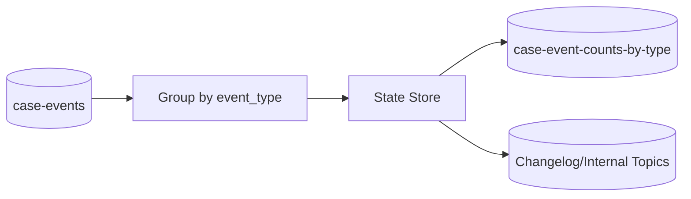
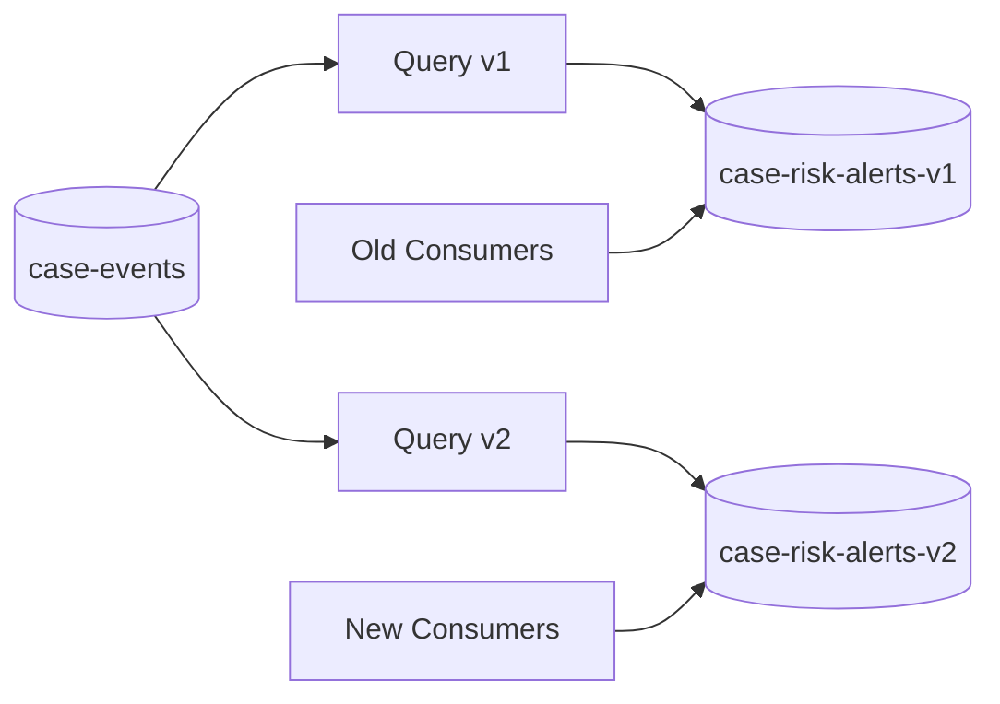
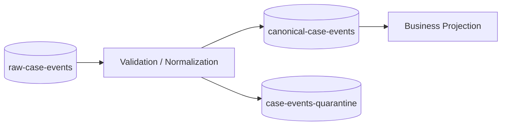
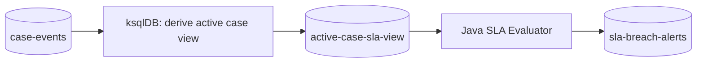

------
title: Learn Java Messaging and Event Streaming - Part 026
description: ksqlDB query design for streams, tables, joins, aggregations, repartitioning, key formats, value formats, query plans, output contracts, and production-safe SQL design.
series: learn-java-messaging-event-streaming
seriesTitle: Learn Java Messaging and Event Streaming
order: 26
partTitle: ksqlDB Query Design
tags:
- java
- kafka
- ksqldb
- streaming-sql
- stream-processing
- joins
- aggregations
- repartitioning
- schema-registry
date: 2026-06-28
---

# Part 026 — ksqlDB Query Design

## 1. What We Are Designing

A ksqlDB query is not only a piece of SQL.

It is an operational object with:

- input topics
- output topics
- schemas
- keys
- partitioning
- state stores
- internal topics
- query lifecycle
- scaling behavior
- failure behavior
- downstream contracts

This part is about designing ksqlDB queries that survive production, not just queries that pass a demo.

We will use a regulatory case-management domain throughout:

- `case-events`
- `case-assignment-events`
- `party-risk-profiles`
- `evidence-events`
- `case-risk-alerts`
- `case-current-state`
- `escalation-candidates`

---

## 2. Query Design Principles

Before syntax, use these principles.

### 2.1 Name the Semantic Type

Every ksqlDB collection must be one of:

| Type | Meaning |
|---|---|
| Source stream | Existing event topic interpreted as unbounded facts |
| Source table | Existing compacted/current-state topic interpreted as keyed state |
| Derived stream | New event stream produced by a persistent query |
| Derived table | New materialized state produced by a persistent query |
| Intermediate stream/table | Internal-but-named stage used to make logic explainable |
| Serving table | Materialized view used by applications or dashboards |

Never create `STREAM x` without being able to explain what domain fact it represents.

### 2.2 Design Key First

A correct query usually starts with:

> What is the entity identity?

For case-management:

| Topic | Natural Key |
|---|---|
| `case-events` | `case_id` |
| `party-risk-profiles` | `party_id` |
| `case-assignment-events` | `case_id` |
| `evidence-events` | `case_id` or `evidence_id`, depending on use case |
| `case-risk-alerts` | `case_id` or `alert_id`, depending on semantics |

Choose `case_id` if we need per-case ordering or aggregation.

Choose `alert_id` if each alert is independently processed.

### 2.3 Make Output Contracts Explicit

Every `CREATE STREAM AS SELECT` or `CREATE TABLE AS SELECT` creates a new Kafka topic unless configured otherwise.

That topic is a contract.

Define:

- topic name
- key
- value schema
- retention
- compaction
- ownership
- version
- compatibility
- downstream consumers

### 2.4 Avoid Accidental Repartitioning

Repartitioning is not bad. Accidental repartitioning is bad.

A query may need repartitioning when grouping or joining by a column that is not the key.

Ask:

- Is the grouping column the Kafka key?
- Are the join inputs co-partitioned?
- Will ksqlDB create internal repartition topics?
- Is the cardinality safe?
- Is the repartitioned key the key we want downstream?

### 2.5 Prefer Explainable Stages

Instead of one giant query:

```text
raw -> normalize -> enrich -> score -> aggregate -> alert
```

Prefer named, reviewable stages:

```text
raw-case-events
  -> normalized-case-events
  -> enriched-case-events
  -> case-risk-scores
  -> case-risk-alerts
```

This gives better observability, replay, and auditability.

---

## 3. Registering a Source Stream

Suppose Java services publish case lifecycle events to Kafka.

Topic: `case-events`

Example value:

```json
{
  "event_id": "evt-100",
  "case_id": "C-100",
  "party_id": "P-900",
  "event_type": "CASE_OPENED",
  "priority": "HIGH",
  "occurred_at": "2026-06-28T09:00:00Z",
  "correlation_id": "corr-88"
}
```

Kafka key:

```text
C-100
```

Register the topic:

```sql
CREATE STREAM case_events (
  case_id STRING KEY,
  event_id STRING,
  party_id STRING,
  event_type STRING,
  priority STRING,
  occurred_at STRING,
  correlation_id STRING
) WITH (
  KAFKA_TOPIC = 'case-events',
  VALUE_FORMAT = 'JSON'
);
```

Important points:

- `case_id STRING KEY` means the Kafka record key is part of the logical schema.
- `VALUE_FORMAT='JSON'` means the value is interpreted as JSON.
- This does not create a new Kafka topic.
- This registers an existing topic as a ksqlDB stream.

### 3.1 Source Stream Checklist

| Check | Why |
|---|---|
| Key declared | Required for joins/grouping correctness |
| Value format declared | Required for deserialization |
| Timestamp strategy known | Required for window correctness |
| Null handling understood | Required for robust queries |
| Schema evolution governed | Required for long-lived consumers |
| Topic retention known | Required for replay expectation |

---

## 4. Registering a Source Table

Suppose party risk profiles are published as latest state.

Topic: `party-risk-profiles`

Kafka key:

```text
P-900
```

Value:

```json
{
  "party_id": "P-900",
  "risk_segment": "HIGH",
  "sanctions_match": true,
  "last_reviewed_at": "2026-06-20T00:00:00Z"
}
```

Register table:

```sql
CREATE TABLE party_risk_profiles (
  party_id STRING PRIMARY KEY,
  risk_segment STRING,
  sanctions_match BOOLEAN,
  last_reviewed_at STRING
) WITH (
  KAFKA_TOPIC = 'party-risk-profiles',
  VALUE_FORMAT = 'JSON'
);
```

A table should be backed by keyed records. Often, the underlying topic should be compacted.

### 4.1 Table Checklist

| Check | Why |
|---|---|
| Primary key matches Kafka key | Required for table semantics |
| Tombstone behavior known | Required for deletes |
| Compaction policy considered | Required for latest-state storage |
| Late updates handled | Required for correctness |
| Source of truth identified | Avoids derived state becoming ungoverned truth |

---

## 5. Creating a Derived Stream

A derived stream uses `CREATE STREAM AS SELECT`.

Example: high-priority case events.

```sql
CREATE STREAM high_priority_case_events
WITH (
  KAFKA_TOPIC = 'high-priority-case-events',
  VALUE_FORMAT = 'JSON',
  PARTITIONS = 12
) AS
SELECT
  case_id,
  event_id,
  party_id,
  event_type,
  priority,
  occurred_at,
  correlation_id
FROM case_events
WHERE priority = 'HIGH'
EMIT CHANGES;
```

This creates:

- a persistent query
- a sink Kafka topic
- a new ksqlDB stream over that sink topic

### 5.1 Design Notes

This is a good ksqlDB use case because:

- it is declarative
- it is stateless
- it has clear input and output
- replay is safe
- no external side effects occur

### 5.2 Anti-Pattern

Do not name the output:

```text
temp_filtered_events
```

Production topics should not be named like scratch work.

Use a domain name:

```text
high-priority-case-events
```

or versioned name:

```text
high-priority-case-events-v1
```

---

## 6. Creating a Derived Table

A derived table is usually created from aggregation or latest-state projection.

Example: count case events by type.

```sql
CREATE TABLE case_event_counts_by_type
WITH (
  KAFKA_TOPIC = 'case-event-counts-by-type',
  VALUE_FORMAT = 'JSON'
) AS
SELECT
  event_type,
  COUNT(*) AS event_count
FROM case_events
GROUP BY event_type
EMIT CHANGES;
```

This produces a materialized table keyed by `event_type`.

### 6.1 What Happens Internally



The query is stateful.

It needs:

- state store
- changelog
- memory/disk resources
- restore behavior
- cardinality control

### 6.2 Cardinality Warning

Grouping by `event_type` is low-cardinality.

Grouping by `correlation_id` may be very high-cardinality.

High-cardinality aggregations can create:

- large state stores
- large changelog topics
- slow restore
- disk pressure
- memory pressure
- expensive rebalances

---

## 7. Projection and Normalization

ksqlDB is useful for shaping raw events into stable contracts.

Raw event:

```json
{
  "event_id": "evt-100",
  "case_id": "C-100",
  "type": "OPENED",
  "ts": "2026-06-28T09:00:00Z",
  "payload": {
    "priority": "High"
  }
}
```

Normalize:

```sql
CREATE STREAM normalized_case_events
WITH (
  KAFKA_TOPIC = 'normalized-case-events',
  VALUE_FORMAT = 'JSON'
) AS
SELECT
  case_id,
  event_id,
  UCASE(type) AS event_type,
  UCASE(payload->priority) AS priority,
  ts AS occurred_at
FROM raw_case_events
WHERE case_id IS NOT NULL
EMIT CHANGES;
```

Use normalization to:

- standardize names
- remove unnecessary fields
- enforce required fields
- separate raw ingestion from canonical domain events

Do not use normalization to hide poor producer contracts forever. Fix producers when possible.

---

## 8. Filtering

Filtering is straightforward:

```sql
CREATE STREAM escalation_related_events AS
SELECT *
FROM normalized_case_events
WHERE event_type IN (
  'CASE_ESCALATED',
  'SUPERVISOR_REVIEW_REQUESTED',
  'ENFORCEMENT_ACTION_PROPOSED'
)
EMIT CHANGES;
```

### 8.1 Filter Safety

Ask:

- Is the predicate stable?
- Does it depend on evolving enum values?
- What happens to unknown event types?
- Should filtered-out records be auditable elsewhere?
- Is this filtering creating a new legal/business boundary?

For compliance systems, filtered topics can become perceived as "the universe" of relevant records. Document what was excluded.

---

## 9. Re-Keying and Repartitioning

Suppose `evidence-events` is keyed by `evidence_id`, but we need aggregation by `case_id`.

Input:

| Kafka Key | Value |
|---|---|
| E-1 | `{ "evidence_id": "E-1", "case_id": "C-100" }` |
| E-2 | `{ "evidence_id": "E-2", "case_id": "C-100" }` |

We can re-key:

```sql
CREATE STREAM evidence_events_by_case
WITH (
  KAFKA_TOPIC = 'evidence-events-by-case',
  VALUE_FORMAT = 'JSON'
) AS
SELECT
  case_id,
  evidence_id,
  evidence_type,
  submitted_at
FROM evidence_events
PARTITION BY case_id
EMIT CHANGES;
```

Now records with the same `case_id` are co-located.

### 9.1 Re-Keying Rule

Re-key when the next operation needs entity affinity.

Examples:

| Next Operation | Required Key |
|---|---|
| Count evidence per case | `case_id` |
| Join evidence to case table | `case_id` |
| Process each evidence independently | `evidence_id` |
| Route to region queue | `region_id` |

### 9.2 Repartitioning Cost

Repartitioning means records are written to a new topic with a new key.

Cost:

- network I/O
- broker storage
- extra latency
- additional topic
- schema/key contract
- operational monitoring

It is acceptable when intentional.

It is dangerous when hidden.

---

## 10. Stream-Table Join

Use a stream-table join to enrich events with latest state.

Example:

```sql
CREATE STREAM enriched_case_events
WITH (
  KAFKA_TOPIC = 'enriched-case-events',
  VALUE_FORMAT = 'JSON'
) AS
SELECT
  e.case_id,
  e.event_id,
  e.party_id,
  e.event_type,
  e.priority,
  p.risk_segment,
  p.sanctions_match,
  e.occurred_at
FROM case_events e
LEFT JOIN party_risk_profiles p
  ON e.party_id = p.party_id
EMIT CHANGES;
```

### 10.1 Semantics

The stream record is enriched with the table's current value at processing time.

This is powerful but requires care:

- table must be keyed by `party_id`
- stream must provide `party_id`
- late table updates do not necessarily rewrite past stream outputs
- missing table rows need handling
- table restore time affects availability
- out-of-order source updates can affect enrichment correctness

### 10.2 Good Use Case

A case event arrives.

We need to attach the latest known risk segment.

This is a lookup enrichment.

### 10.3 Bad Use Case

We need to answer:

> What was the party's risk segment at the exact time the case event occurred?

That is historical/as-of-time semantics. A simple stream-table join may not be enough unless the table is modelled as temporal history and the query handles time explicitly.

---

## 11. Stream-Stream Join

Use stream-stream joins when combining two event streams in a time window.

Example: join case opening with evidence submission within one hour.

```sql
CREATE STREAM fast_evidence_after_opening AS
SELECT
  c.case_id,
  c.event_id AS case_event_id,
  e.evidence_id,
  c.occurred_at AS case_opened_at,
  e.submitted_at AS evidence_submitted_at
FROM case_opened_events c
JOIN evidence_events_by_case e
  WITHIN 1 HOUR
  ON c.case_id = e.case_id
EMIT CHANGES;
```

### 11.1 Why Window Is Required

Two streams are unbounded.

Without a window, the engine would need to remember everything forever.

The window defines how long records wait for matching records.

### 11.2 Design Questions

- What is the business meaning of the window?
- Is one hour based on event time or processing time?
- What happens to late evidence?
- Is duplicate evidence possible?
- What if case open event arrives after evidence event?
- Is the join inner, left, or outer?
- What is the expected match cardinality?

---

## 12. Table-Table Join

Use table-table joins to combine current states.

Example:

```sql
CREATE TABLE case_assignment_with_state AS
SELECT
  s.case_id,
  s.status,
  a.owner,
  a.team,
  s.updated_at
FROM case_current_state s
LEFT JOIN current_case_assignment a
  ON s.case_id = a.case_id
EMIT CHANGES;
```

### 12.1 Semantics

A table-table join emits updates as either side changes.

This is useful for current operational views.

Be careful:

- both tables must be keyed appropriately
- update storms can happen
- tombstones need handling
- downstream consumers receive changelog-like updates
- output may be compacted rather than append-only event history

---

## 13. Aggregation

Aggregation turns many events into state.

Example: open cases by owner.

```sql
CREATE TABLE open_case_count_by_owner AS
SELECT
  owner,
  COUNT(*) AS open_case_count
FROM case_current_state
WHERE status = 'OPEN'
GROUP BY owner
EMIT CHANGES;
```

However, this example is subtly dangerous if `case_current_state` is not modelled correctly.

If it is a table, changes should increment/decrement counts as cases move in and out of OPEN.

If it is a stream of status-change events, a simple count counts events, not current open cases.

### 13.1 Count Events vs Count Entities

| Question | Correct Input |
|---|---|
| How many escalation events occurred today? | Stream |
| How many cases are currently escalated? | Table |
| How many unique parties generated alerts? | Stream with distinct/window or table projection |
| How many open cases does each analyst own now? | Current-state table |

The input semantic type determines correctness.

---

## 14. Windowed Aggregation

Example: escalations per region every 15 minutes.

```sql
CREATE TABLE escalation_count_15m AS
SELECT
  region,
  WINDOWSTART AS window_start,
  WINDOWEND AS window_end,
  COUNT(*) AS escalation_count
FROM case_escalation_events
WINDOW TUMBLING (SIZE 15 MINUTES)
GROUP BY region
EMIT CHANGES;
```

### 14.1 Window Types

| Window | Use Case |
|---|---|
| Tumbling | Fixed non-overlapping periods |
| Hopping | Rolling metrics with overlap |
| Session | Activity separated by inactivity gap |

### 14.2 Grace and Late Events

Late events are unavoidable in distributed systems.

Reasons:

- network delay
- producer retry
- mobile/offline clients
- CDC lag
- replay
- broker recovery
- clock skew

Design questions:

- How late can events arrive?
- Should late events update prior windows?
- Do dashboards need final or continuously updated results?
- Should downstream consumers receive corrections?
- Is the statutory report based on event time or processing time?

---

## 15. Suppression and Final Results

For some use cases, we do not want every intermediate aggregate update.

Example:

- During a 15-minute window, count may change from 1 to 2 to 3 to 4.
- Downstream only wants the final result after the window closes.

Suppression can be used to emit final results after a window is complete.

Conceptually:

```text
raw events -> windowed aggregation -> hold intermediate updates -> emit final result
```

Use suppression carefully:

- it may buffer state
- it adds latency
- it depends on window close/grace
- large windows can increase memory/disk pressure
- "final" only means final under the configured lateness policy

---

## 16. CTAS and CSAS

ksqlDB commonly uses:

- `CREATE STREAM AS SELECT` or CSAS
- `CREATE TABLE AS SELECT` or CTAS

### 16.1 CSAS

Use CSAS when output is an event stream.

```sql
CREATE STREAM critical_case_events AS
SELECT *
FROM case_events
WHERE priority = 'CRITICAL'
EMIT CHANGES;
```

Output semantics:

- each matching input emits a new output event
- topic is append-oriented
- downstream consumers see event flow

### 16.2 CTAS

Use CTAS when output is current state or aggregation.

```sql
CREATE TABLE latest_case_priority AS
SELECT
  case_id,
  LATEST_BY_OFFSET(priority) AS priority
FROM case_events
GROUP BY case_id
EMIT CHANGES;
```

Output semantics:

- each key has evolving state
- output may be compacted
- downstream consumers see changelog updates

### 16.3 Choosing CSAS vs CTAS

| Desired Result | Use |
|---|---|
| Filtered events | CSAS |
| Enriched events | CSAS |
| Alert candidates | CSAS |
| Count by key | CTAS |
| Latest state by key | CTAS |
| Materialized lookup | CTAS |

---

## 17. Key and Value Formats

A production query should be explicit about serialization.

Examples:

```sql
WITH (
  KAFKA_TOPIC = 'case-events',
  KEY_FORMAT = 'KAFKA',
  VALUE_FORMAT = 'JSON'
)
```

or:

```sql
WITH (
  KAFKA_TOPIC = 'case-events-avro',
  KEY_FORMAT = 'AVRO',
  VALUE_FORMAT = 'AVRO'
)
```

### 17.1 Format Selection

| Format | Strength | Weakness |
|---|---|---|
| JSON | Human-readable, easy development | Weak schema discipline unless JSON Schema is used |
| Avro | Strong schema evolution, compact | Needs registry discipline |
| Protobuf | Strong contracts, broad language support | Evolution rules must be understood |
| Delimited | Simple | Usually too weak for serious event contracts |

### 17.2 Key Format Matters

The key is not just a routing artifact.

It is part of the data contract.

If key format changes, joins and consumers can break.

---

## 18. Naming Conventions

Use names that reveal semantics.

### 18.1 Streams

```text
case-events
normalized-case-events
high-priority-case-events
case-escalation-candidates
```

### 18.2 Tables

```text
case-current-state
party-risk-profiles
case-count-by-status
current-case-assignment
```

### 18.3 Internal Stages

```text
stage-normalized-case-events-v1
stage-case-events-by-party-v1
```

### 18.4 Avoid

```text
test-topic
tmp-events
new-output
ksql-stream-1
final-final-stream
```

In regulated systems, naming is part of auditability.

---

## 19. Versioning Query Outputs

Breaking output changes require versioning.

Examples:

```text
case-risk-alerts-v1
case-risk-alerts-v2
```

Use a new topic when:

- key changes
- event semantic changes
- required fields change
- aggregation meaning changes
- timestamp interpretation changes
- downstream consumers cannot safely handle the old and new shape together

Avoid in-place mutation of heavily consumed topics.

A safer migration:



Then migrate consumers deliberately.

---

## 20. Query Plan Review

Before deploying a stateful or join query, inspect the query plan.

Look for:

- source topics
- sink topics
- repartition steps
- stateful operators
- changelog topics
- join type
- key columns
- timestamp usage
- internal topic names
- partition count
- format conversions

A simple review table:

| Plan Feature | Risk |
|---|---|
| Repartition | Additional topic and network cost |
| Stateful aggregation | State store size and restore time |
| Stream-stream join | Window store and late event behavior |
| Table join | Key correctness and tombstone semantics |
| High cardinality group | Large state |
| Format conversion | Serialization compatibility risk |
| Sink topic auto-created | Incorrect partitions/retention risk |

---

## 21. Query Testing

A ksqlDB query needs tests.

Minimum fixtures:

```text
input/
  case-events.001.json
  party-risk-profiles.001.json
expected/
  enriched-case-events.001.json
```

Test cases:

- happy path
- null key
- missing optional field
- unknown enum
- late event
- duplicate event
- tombstone
- schema evolution
- empty join result
- high-cardinality group
- replay scenario
- old event with new schema reader

### 21.1 Example Test Matrix

| Scenario | Expected Behavior |
|---|---|
| Case event with known party | Emits enriched event |
| Case event with unknown party | Emits event with null enrichment or routes elsewhere |
| Duplicate event ID | Downstream handles idempotency |
| Party profile updated | Future stream-table joins use new value |
| Case event missing key | Dropped, quarantined, or explicitly handled |
| Late evidence event | Included/excluded based on window/grace policy |

---

## 22. Nulls, Tombstones, and Deletes

Kafka table semantics often use tombstones to represent deletes.

A tombstone is a record with key and null value.

ksqlDB query design must define:

- Are tombstones expected?
- Are tombstones propagated?
- Do aggregations decrement?
- Do joins remove values?
- Do downstream consumers understand delete semantics?

For regulatory systems, deletion may be restricted. Often, instead of tombstones, we use:

```json
{
  "case_id": "C-100",
  "status": "CLOSED",
  "closed_at": "2026-06-28T11:00:00Z",
  "closure_reason": "RESOLVED"
}
```

Tombstone may still be valid for caches or derived views, but legal record retention may require immutable closure facts.

---

## 23. Error Handling in ksqlDB Query Design

ksqlDB is not where we do arbitrary try/catch logic.

Design queries to avoid ambiguous behavior:

- validate required fields upstream
- normalize raw inputs into canonical streams
- route bad records to quarantine before critical joins
- use schema registry compatibility
- avoid unsupported casts in critical paths
- monitor query errors
- separate parsing from business derivation

A useful pattern:



If validation is complex, put it in Java or Kafka Streams rather than forcing it into SQL.

---

## 24. Designing for Replay

Every persistent query should have a replay story.

### 24.1 Replay-Safe Queries

Usually safe:

- projections
- filters
- deterministic transformations
- aggregations into derived tables
- enrichment views
- candidate streams consumed idempotently

Potentially unsafe:

- command streams
- notification streams
- payment/action streams
- topics consumed by non-idempotent systems
- queries using wall-clock-dependent logic

### 24.2 Replay Checklist

| Question | Reason |
|---|---|
| Are source topics retained? | Replay requires source history |
| Are schemas still readable? | Old records must deserialize |
| Is the query deterministic? | Same input should produce same output |
| Are downstream consumers idempotent? | Replay duplicates output |
| Is sink topic reset or versioned? | Avoid mixing old/new output |
| Are timestamps preserved? | Window results depend on time |
| Are correction events supported? | Recomputed views may differ |

---

## 25. Example: Escalation Candidate Pipeline

Now we design a small pipeline.

### 25.1 Source Streams and Tables

```sql
CREATE STREAM case_events (
  case_id STRING KEY,
  event_id STRING,
  party_id STRING,
  event_type STRING,
  priority STRING,
  occurred_at STRING,
  correlation_id STRING
) WITH (
  KAFKA_TOPIC='case-events',
  VALUE_FORMAT='JSON'
);

CREATE TABLE party_risk_profiles (
  party_id STRING PRIMARY KEY,
  risk_segment STRING,
  sanctions_match BOOLEAN,
  last_reviewed_at STRING
) WITH (
  KAFKA_TOPIC='party-risk-profiles',
  VALUE_FORMAT='JSON'
);
```

### 25.2 Normalize Relevant Events

```sql
CREATE STREAM escalation_relevant_case_events
WITH (
  KAFKA_TOPIC='escalation-relevant-case-events',
  VALUE_FORMAT='JSON'
) AS
SELECT
  case_id,
  event_id,
  party_id,
  UCASE(event_type) AS event_type,
  UCASE(priority) AS priority,
  occurred_at,
  correlation_id
FROM case_events
WHERE event_type IN (
  'CASE_OPENED',
  'EVIDENCE_SUBMITTED',
  'RISK_SCORE_CHANGED',
  'CASE_ESCALATED'
)
EMIT CHANGES;
```

### 25.3 Re-Key by Party for Enrichment if Needed

If the stream is keyed by `case_id` but we join to party table by `party_id`, we may need to think carefully about key and partitioning.

Depending on ksqlDB join support and query plan, repartitioning may occur.

We can explicitly stage:

```sql
CREATE STREAM escalation_events_by_party
WITH (
  KAFKA_TOPIC='escalation-events-by-party',
  VALUE_FORMAT='JSON'
) AS
SELECT
  party_id,
  case_id,
  event_id,
  event_type,
  priority,
  occurred_at,
  correlation_id
FROM escalation_relevant_case_events
PARTITION BY party_id
EMIT CHANGES;
```

### 25.4 Enrich

```sql
CREATE STREAM enriched_escalation_events
WITH (
  KAFKA_TOPIC='enriched-escalation-events',
  VALUE_FORMAT='JSON'
) AS
SELECT
  e.case_id,
  e.event_id,
  e.party_id,
  e.event_type,
  e.priority,
  p.risk_segment,
  p.sanctions_match,
  e.occurred_at,
  e.correlation_id
FROM escalation_events_by_party e
LEFT JOIN party_risk_profiles p
  ON e.party_id = p.party_id
EMIT CHANGES;
```

### 25.5 Candidate Generation

```sql
CREATE STREAM escalation_candidates
WITH (
  KAFKA_TOPIC='escalation-candidates',
  VALUE_FORMAT='JSON'
) AS
SELECT
  case_id,
  event_id,
  party_id,
  event_type,
  priority,
  risk_segment,
  sanctions_match,
  occurred_at,
  correlation_id,
  CASE
    WHEN sanctions_match = TRUE THEN 'SANCTIONS_MATCH'
    WHEN risk_segment = 'HIGH' AND priority = 'HIGH' THEN 'HIGH_RISK_HIGH_PRIORITY'
    ELSE 'REVIEW_REQUIRED'
  END AS candidate_reason
FROM enriched_escalation_events
WHERE
  sanctions_match = TRUE
  OR risk_segment = 'HIGH'
  OR priority = 'HIGH'
EMIT CHANGES;
```

### 25.6 Why This Is a Candidate, Not a Command

The output is called `escalation-candidates`, not `create-escalation-tasks`.

A Java service can consume candidates and decide:

- Is the case already escalated?
- Is there a legal hold?
- Is policy version applicable?
- Has a supervisor already reviewed it?
- Is the candidate duplicated?
- Should a human task be created?

ksqlDB produces a derived fact/candidate. Domain code makes command decisions.

---

## 26. Example: Current Case State Table

Suppose we receive status events:

```sql
CREATE STREAM case_status_events (
  case_id STRING KEY,
  event_id STRING,
  status STRING,
  owner STRING,
  changed_at STRING
) WITH (
  KAFKA_TOPIC='case-status-events',
  VALUE_FORMAT='JSON'
);
```

Create latest state:

```sql
CREATE TABLE case_current_state
WITH (
  KAFKA_TOPIC='case-current-state',
  VALUE_FORMAT='JSON'
) AS
SELECT
  case_id,
  LATEST_BY_OFFSET(status) AS status,
  LATEST_BY_OFFSET(owner) AS owner,
  LATEST_BY_OFFSET(changed_at) AS updated_at
FROM case_status_events
GROUP BY case_id
EMIT CHANGES;
```

### 26.1 Warning About Latest-By-Offset

`LATEST_BY_OFFSET` means latest by Kafka offset in the grouped stream, not necessarily latest by domain event time.

If events can arrive out of order, this may be wrong.

Example:

| Arrival Order | Event Time | Status |
|---:|---|---|
| 1 | 10:00 | ESCALATED |
| 2 | 09:55 | OPEN |

Latest-by-offset would produce `OPEN`, even though domain-time latest is `ESCALATED`.

Possible corrections:

- enforce per-case ordered publishing
- key by case and preserve event order
- use sequence numbers
- validate monotonic transitions in Java
- model corrections explicitly
- avoid deriving legal state from arrival order alone

---

## 27. Example: SLA Breach Monitoring

Suppose case lifecycle events include SLA deadlines.

We want cases approaching breach.

A pure ksqlDB approach may be insufficient if business calendar logic is complex.

A better split:



ksqlDB can maintain active case views.

Java can calculate:

- business days
- holidays
- jurisdiction rules
- pause/resume clocks
- statutory exceptions
- policy effective dates

This is the right abstraction boundary.

---

## 28. Production Review Template

Before deployment, review:

```yaml
queryName: escalation-candidates-v1
queryType: persistent
outputType: stream
owner: enforcement-platform
sources:
  - escalation-relevant-case-events
  - party-risk-profiles
sinks:
  - escalation-candidates
stateful: true
joinType: stream-table
keyStrategy:
  inputKey: case_id
  repartitionedKey: party_id
  outputKey: party_id
schema:
  keyFormat: JSON
  valueFormat: JSON
  compatibility: backward
replay:
  supported: true
  downstreamIdempotencyRequired: true
pii:
  containsPii: true
  fields:
    - party_id
observability:
  dashboards:
    - ksqldb-query-lag
    - output-rate
    - error-rate
rollback:
  strategy: stop query and run previous version to previous sink topic
```

This kind of metadata is not bureaucracy. It is operational memory.

---

## 29. Operational Metrics Per Query

Track at least:

| Metric | Meaning |
|---|---|
| Input rate | Whether source traffic changed |
| Output rate | Whether query behavior changed |
| Consumer lag | Whether query is falling behind |
| Error rate | Whether deserialization/query failures occur |
| State store size | Whether state grows unexpectedly |
| Rebalance frequency | Whether runtime is unstable |
| Internal topic size | Whether repartition/changelog growth is expected |
| End-to-end latency | Whether business process is delayed |

For materialized views, also track:

- pull query latency
- query availability
- restore time
- state-store disk usage
- changelog topic retention/compaction

---

## 30. Query Evolution

Changing a query can mean changing a running application.

### 30.1 Safe Changes

Usually safe:

- adding optional output fields
- adding derived fields with defaults
- filtering additional non-critical records into a new version
- improving naming in a new sink topic
- increasing partitions if downstream supports it carefully

### 30.2 Dangerous Changes

Dangerous:

- changing key
- changing join semantics
- changing window size
- changing aggregation grouping
- changing timestamp interpretation
- changing event meaning while keeping same topic name
- removing fields
- changing value format

### 30.3 Versioned Migration

Use parallel versioning for important changes:

```text
case-current-state-v1
case-current-state-v2
```

Run both during migration.

Compare outputs.

Migrate consumers.

Retire v1.

---

## 31. Common Anti-Patterns

### 31.1 Query Console Engineering

Creating production persistent queries manually through an interactive console.

Correction:

- source-controlled SQL
- CI validation
- migration process
- query inventory

### 31.2 Null Key Aggregation

Grouping or joining records with null/unstable keys.

Correction:

- reject/quarantine null-key records
- fix producer keying
- add canonical normalization stage

### 31.3 Unbounded Cardinality Aggregation

Grouping by request ID, event ID, correlation ID, or free-text value.

Correction:

- group by stable bounded business dimensions
- window high-cardinality aggregations
- cap retention
- monitor state size

### 31.4 Business Commands From SQL

Generating irreversible commands directly from query output.

Correction:

- emit candidates/facts
- let domain service validate and command
- enforce idempotency

### 31.5 Silent Repartition Explosion

A query accidentally creates internal topics and large network traffic.

Correction:

- inspect plan
- make repartition explicit
- name intermediate stages
- load test

### 31.6 Latest-By-Offset as Domain Truth

Using offset order as business-time truth.

Correction:

- use event sequence or domain timestamp
- validate order upstream
- apply domain state machine outside ksqlDB when needed

---

## 32. ksqlDB Query Design Checklist

Before merging a query:

1. Is the collection a stream or a table?
2. Is the key explicit?
3. Is the input topic known?
4. Is the output topic named explicitly?
5. Is the value format explicit?
6. Is the key format explicit if non-default?
7. Is the query stateless or stateful?
8. Does it repartition?
9. Does it create internal topics?
10. Does it create a materialized view?
11. Is cardinality bounded?
12. Are null keys handled?
13. Are tombstones handled?
14. Are late events handled?
15. Is replay safe?
16. Are downstream consumers idempotent?
17. Is schema evolution safe?
18. Is PII handled?
19. Is retention correct?
20. Is the query owner documented?
21. Is rollback possible?
22. Is it tested with representative data?
23. Are metrics and alerts defined?
24. Is the output a fact, view, candidate, or command?
25. Should this be Java/Kafka Streams instead?

---

## 33. Exercises

### Exercise 1 — Stream or Table

Classify each topic:

1. `case-events`
2. `case-current-state`
3. `party-risk-profiles`
4. `case-assignment-events`
5. `case-count-by-status`
6. `escalation-candidates`

For each, identify:

- key
- value format
- retention/compaction expectation
- replay expectation
- downstream consumers

### Exercise 2 — Repartition Review

Given:

```sql
CREATE STREAM alerts AS
SELECT *
FROM case_events e
JOIN party_risk_profiles p
  ON e.party_id = p.party_id
WHERE p.risk_segment = 'HIGH'
EMIT CHANGES;
```

Answer:

- What is the key of `case_events`?
- What is the key of `party_risk_profiles`?
- Will repartitioning be needed?
- What should the output key be?
- Is the output an event stream or a command stream?

### Exercise 3 — Latest State Risk

Given status events can arrive out of order, evaluate:

```sql
CREATE TABLE case_current_state AS
SELECT
  case_id,
  LATEST_BY_OFFSET(status) AS status
FROM case_status_events
GROUP BY case_id
EMIT CHANGES;
```

Answer:

- When is this safe?
- When is it unsafe?
- What alternatives exist?

### Exercise 4 — Query Ownership

Write metadata for a query that derives `sla-breach-candidates`.

Include:

- owner
- source topics
- sink topic
- query type
- key
- statefulness
- replay behavior
- rollback strategy
- PII classification

---

## 34. Summary

ksqlDB query design is production design.

The syntax is compact, but the architecture is not trivial.

A strong query design makes these things explicit:

- stream/table semantics
- key and partitioning
- schema and formats
- source and sink contracts
- state and changelog behavior
- join and aggregation semantics
- replay and correction behavior
- ownership and deployment lifecycle
- observability and rollback

The most important habit is to treat every persistent query as a deployed stream-processing application.

Do not ask only:

> Does the SQL run?

Ask:

> Is the output semantically correct under replay, late data, schema evolution, failure, and downstream consumption?

That is the difference between demo-level ksqlDB and production-grade streaming SQL.

---

## References

- Confluent Documentation — CREATE STREAM: https://docs.confluent.io/platform/current/ksqldb/developer-guide/ksqldb-reference/create-stream.html
- Confluent Documentation — CREATE TABLE: https://docs.confluent.io/platform/current/ksqldb/developer-guide/ksqldb-reference/create-table.html
- Confluent Documentation — CREATE STREAM AS SELECT: https://docs.confluent.io/platform/current/ksqldb/developer-guide/ksqldb-reference/create-stream-as-select.html
- Confluent Documentation — CREATE TABLE AS SELECT: https://docs.confluent.io/platform/current/ksqldb/developer-guide/ksqldb-reference/create-table-as-select.html
- Confluent Documentation — Joins in ksqlDB: https://docs.confluent.io/platform/current/ksqldb/developer-guide/joins/overview.html
- Confluent Documentation — Partition Data to Enable Joins: https://docs.confluent.io/platform/current/ksqldb/developer-guide/joins/partition-data.html
- Confluent Documentation — Quick Reference for ksqlDB: https://docs.confluent.io/platform/current/ksqldb/developer-guide/ksqldb-reference/quick-reference.html
