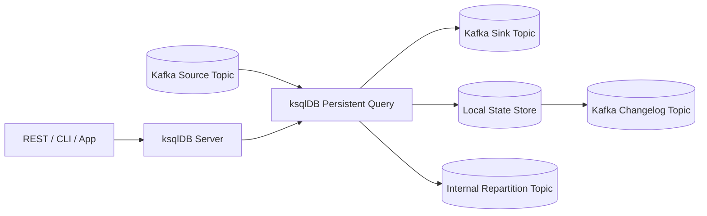
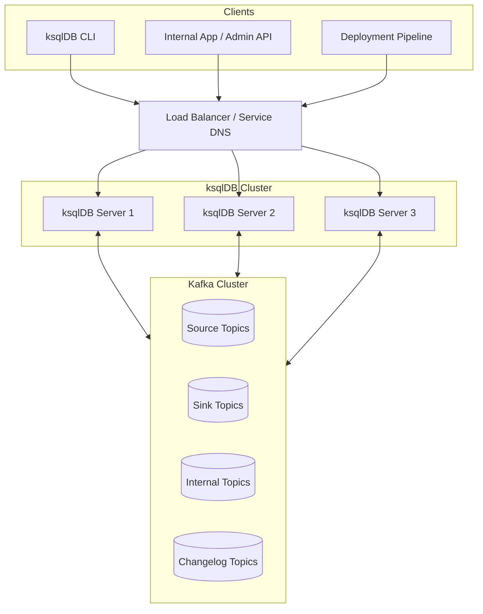
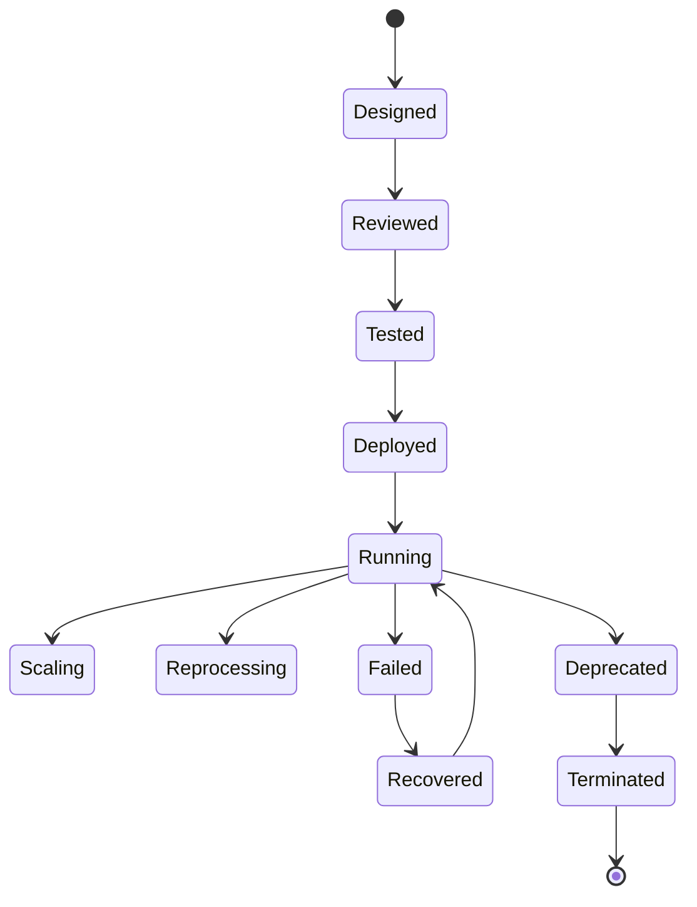
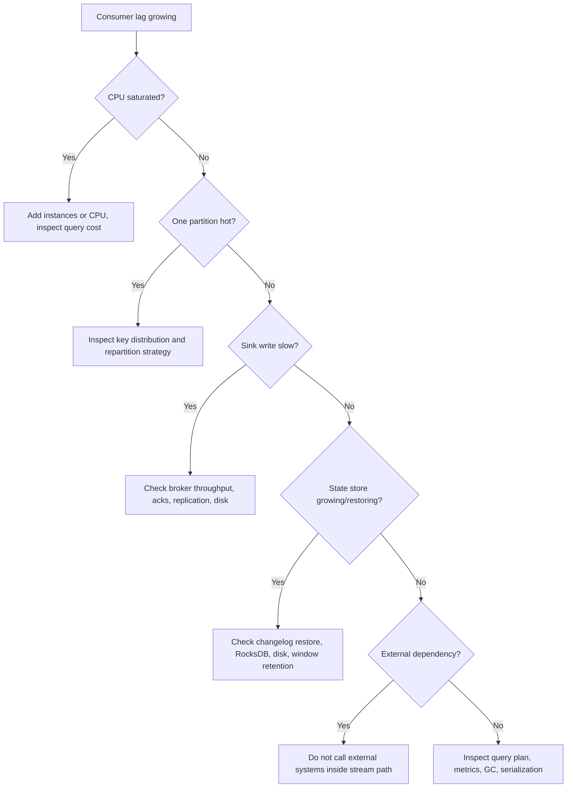
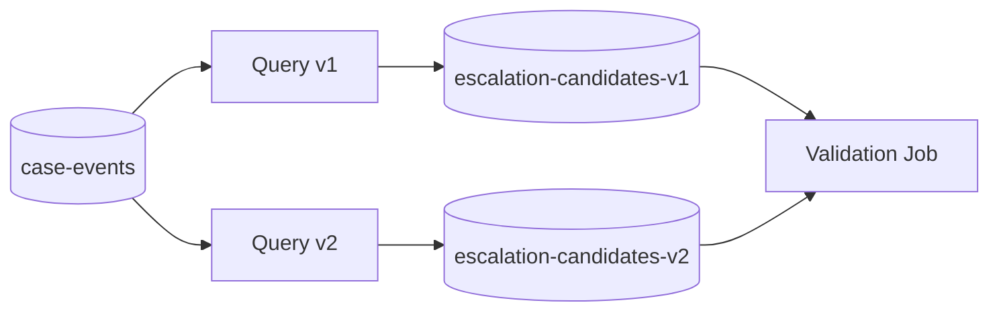

------
title: Learn Java Messaging and Event Streaming - Part 027
description: ksqlDB operations for deployment, scaling, state management, lag, metrics, high availability, recovery, rollout discipline, and production runbooks.
series: learn-java-messaging-event-streaming
seriesTitle: Learn Java Messaging and Event Streaming
order: 27
partTitle: ksqlDB Operations, Scaling, State, Lag, and Metrics
tags:
- java
- kafka
- ksqldb
- operations
- observability
- state-store
- consumer-lag
- scaling
- production
- stream-processing
date: 2026-06-28
---

# Part 027 — ksqlDB Operations: Deployment, Scaling, State, Lag, and Metrics

## 1. What We Are Solving

In Part 025 and Part 026, we treated ksqlDB as a way to express stream processing with SQL.

In this part, we treat ksqlDB as a **production runtime**.

That means the questions change.

Instead of asking:

> Can this SQL produce the right result?

we ask:

> Can this query keep producing the right result under load, schema change, rebalance, node failure, replay, and operational rollout?

That shift matters because a ksqlDB persistent query is not just SQL.

It is a deployed stream-processing application with:

- Kafka source topics
- Kafka sink topics
- consumer groups
- internal repartition topics
- changelog topics
- local state stores
- JVM memory
- RocksDB/native memory
- network usage
- disk usage
- schema contracts
- operational lifecycle
- owner accountability

A weak ksqlDB operation model turns elegant SQL into an opaque incident generator.

A strong model makes ksqlDB safe enough for case-management, alerting, monitoring, enrichment, and current-state projections.

---

## 2. The ksqlDB Runtime Mental Model

A ksqlDB server is not a database server in the traditional relational sense.

It is closer to a managed Kafka Streams runtime with a REST interface and SQL language.

A persistent query behaves like this:



The important consequence:

> ksqlDB state is not only inside the ksqlDB server. It is distributed across Kafka topics, local disks, and query metadata.

So operational review must include:

- Kafka topic configuration
- query topology
- state-store size
- local disk capacity
- internal-topic lifecycle
- schema compatibility
- consumer lag
- failure recovery time
- query owner
- deployment mechanism

---

## 3. Core Operational Objects

In production, track these as first-class objects.

| Object | Why It Matters |
|---|---|
| ksqlDB cluster | Hosts query execution and exposes REST API |
| Persistent query | Long-running stream-processing job |
| Source topic | Input contract and throughput source |
| Sink topic | Output contract for downstream consumers |
| Internal topic | Repartition/changelog mechanics used by query |
| State store | Local materialized state used for tables, joins, windows, aggregations |
| Consumer group | Used to track query consumption and lag |
| Schema subject | Governs key/value compatibility |
| Query ID | Unit of explainability, troubleshooting, termination, and ownership |
| Application ID | Kafka Streams identity underneath query execution |

The operational mistake is to monitor only the ksqlDB process.

The correct approach is to monitor the **whole query execution chain**.

---

## 4. Deployment Topology

A minimal production ksqlDB deployment has multiple ksqlDB server instances behind a stable access path.



A production deployment should define:

- number of ksqlDB nodes
- CPU and memory allocation
- local state directory
- persistent volume strategy
- service discovery strategy
- TLS/authentication to Kafka
- TLS/authentication to ksqlDB REST endpoint
- schema registry connectivity
- Kafka ACLs
- query deployment process
- monitoring and alert routing

ksqlDB is easy to start locally.

It is not automatically easy to operate safely.

---

## 5. Deployment Modes

### 5.1 Interactive Development Mode

Useful for:

- learning
- prototyping
- query exploration
- validating stream/table semantics

Risk:

- ad-hoc queries become production behavior
- query ownership is unclear
- rollback is manual
- naming is inconsistent

Use this mode only outside production or in tightly controlled admin environments.

### 5.2 GitOps / Migration-Based Production Mode

Preferred for production.

Treat ksqlDB statements like database migrations or service deployment manifests.

A production change should include:

- SQL file
- query name
- topic contract
- schema references
- owner
- rollout plan
- rollback plan
- expected lag impact
- expected state size
- data replay behavior
- test evidence

Example directory:

```text
ksqldb/
  001-create-source-streams.sql
  002-create-case-current-state.sql
  003-create-escalation-candidates-v1.sql
  004-create-escalation-candidates-v2.sql
  rollback/
    003-terminate-escalation-candidates-v1.sql
  tests/
    case-current-state-inputs.json
    case-current-state-expected.json
```

The goal is not ceremony.

The goal is reproducibility.

### 5.3 Platform-Managed Mode

In larger organizations, a platform team may operate ksqlDB clusters and product teams submit query definitions.

This requires clear boundaries:

| Concern | Owner |
|---|---|
| ksqlDB cluster uptime | Platform team |
| Kafka cluster health | Data platform team |
| Query semantics | Product/domain team |
| Schema compatibility | Producer + consumer owners |
| Sink topic contract | Query owner |
| Alert response | Query owner + platform on-call |
| Data governance | Domain/data governance team |

Without ownership, ksqlDB becomes shared mutable infrastructure.

Shared mutable infrastructure becomes operational debt.

---

## 6. Query Lifecycle

A persistent query has lifecycle stages.



### 6.1 Designed

Define:

- source collections
- output collection
- key semantics
- join semantics
- window semantics
- schema compatibility
- expected throughput
- expected state size
- failure behavior

### 6.2 Reviewed

Review should include both SQL and runtime effects.

Ask:

- Does this create an internal repartition topic?
- Does this create a changelog topic?
- Does this maintain unbounded state?
- Does this depend on event time or processing time?
- Is the output idempotent for downstream consumers?
- Is the query safe to replay?

### 6.3 Tested

Test with:

- normal events
- duplicate events
- out-of-order events
- late events
- schema version changes
- missing fields
- null keys
- tombstones
- high-cardinality keys
- skewed keys

### 6.4 Deployed

Deploy using versioned SQL.

Avoid manually pasting production SQL unless this is explicitly an emergency operation.

### 6.5 Running

Monitor:

- query status
- consumer lag
- throughput
- error rate
- processing latency
- state-store growth
- JVM memory
- disk utilization
- broker-side topic health

### 6.6 Deprecated

Deprecation must include downstream migration.

A query is not safe to terminate just because the SQL is old.

It may still own a sink topic used by downstream services.

---

## 7. Capacity Planning Mental Model

Capacity planning starts with the shape of the query.

### 7.1 Stateless Queries

Example:

```sql
CREATE STREAM high_priority_case_events AS
SELECT *
FROM case_events
WHERE priority = 'HIGH';
```

Main cost drivers:

- input rate
- output rate
- serialization/deserialization
- predicate cost
- network throughput
- sink topic partitions

Stateless queries are usually easier to scale.

### 7.2 Stateful Aggregations

Example:

```sql
CREATE TABLE case_event_counts AS
SELECT case_id, COUNT(*) AS event_count
FROM case_events
GROUP BY case_id;
```

Main cost drivers:

- key cardinality
- update frequency per key
- state-store size
- changelog traffic
- restore time
- compaction behavior
- local disk

Stateful queries need disk and restore planning.

### 7.3 Windowed Aggregations

Example:

```sql
CREATE TABLE hourly_case_alert_counts AS
SELECT case_id, COUNT(*) AS alert_count
FROM case_alerts
WINDOW TUMBLING (SIZE 1 HOUR, GRACE PERIOD 10 MINUTES)
GROUP BY case_id;
```

Main cost drivers:

- key cardinality
- window count
- grace period
- retention
- late events
- suppression behavior
- state cleanup

Windowed state can be much larger than expected.

A query with 1 million cases and 24 active hourly windows can create a very different state profile than a simple current-state table.

### 7.4 Joins

Main cost drivers:

- co-partitioning
- table materialization
- repartitioning
- join window size
- table update rate
- stream event rate
- skewed keys

A join is not just a lookup.

A join creates operational load on state stores, changelog topics, and possibly repartition topics.

---

## 8. Scaling Model

ksqlDB scales through Kafka Streams partition assignment.

The simplified rule:

> Parallelism is bounded by the number of input partitions and the topology shape.

If a source topic has 6 partitions, running 20 ksqlDB servers does not automatically create 20-way parallelism for that query.

### 8.1 Horizontal Scaling

Add ksqlDB servers when:

- CPU is saturated
- consumer lag grows steadily
- query tasks can be redistributed
- partitions allow additional parallelism
- state restore time is acceptable

Do not add servers blindly if the actual bottleneck is:

- one hot partition
- slow sink topic
- broker throttling
- schema registry latency
- network saturation
- disk pressure
- state-store compaction

### 8.2 Partition Count as Scaling Boundary

For a query that consumes a topic with 12 partitions:

| ksqlDB Servers | Possible Effect |
|---:|---|
| 1 | One process owns all tasks |
| 2 | Tasks may split across two processes |
| 3 | Better distribution if partitions are balanced |
| 12 | Upper-bound one active task per partition shape |
| 20 | Extra instances may be idle or underused |

The exact task distribution depends on topology, query shape, and assignment.

But the invariant remains:

> You cannot scale beyond the partitioning model without changing the data model or topology.

### 8.3 Vertical Scaling

Scale vertically when:

- state store needs more disk throughput
- RocksDB/native memory needs more headroom
- query CPU is high but partition count is low
- rebalancing cost is too high with too many small nodes

Vertical scaling is not failure-proof.

A very large stateful task on one machine can increase recovery time.

### 8.4 Scaling Stateful Queries

Stateful scaling is harder than stateless scaling.

When a stateful query task moves to another node, state may need to be restored from changelog topics.

That means scaling can temporarily increase:

- broker read load
- network load
- local disk writes
- processing latency
- consumer lag

Scaling itself can become an incident if performed during peak load without capacity headroom.

---

## 9. High Availability and Pull Queries

ksqlDB can serve pull queries from materialized state.

For availability, consider:

- multiple ksqlDB nodes
- state replication through changelog topics
- standby replicas where supported/configured
- Kafka topic replication
- load balancer behavior
- query routing behavior
- read staleness tolerance

A pull query reads current materialized state, not a relational database table.

So define:

- expected freshness
- allowed staleness
- behavior during restore
- behavior during rebalance
- behavior when key is missing
- timeout behavior
- retry behavior

For a regulatory dashboard, stale state may be acceptable for a few seconds.

For enforcement deadline decisions, stale state may be unacceptable.

Do not use the same availability model for both.

---

## 10. Consumer Lag in ksqlDB

Consumer lag is the most important early warning signal for many ksqlDB incidents.

But lag must be interpreted carefully.

### 10.1 What Lag Means

Lag means the query is behind the source topic.

A simple mental model:

```text
lag = latest topic offset - query consumed offset
```

If lag keeps growing, the query is not keeping up.

If lag spikes and then falls, the query may be recovering after a burst.

If lag is low but output is wrong, the problem is not throughput; it is logic, schema, keying, or data quality.

### 10.2 Types of Lag

| Lag Type | Meaning |
|---|---|
| Source lag | Query behind input topic |
| Repartition lag | Query behind internal repartition topic |
| Changelog restore lag | State store being rebuilt from changelog |
| Sink consumer lag | Downstream service behind ksqlDB output topic |
| End-to-end lag | Delay from source event creation to final derived output |

Do not collapse all lag into one number.

### 10.3 Getting Query Consumer Group

In many workflows, use `EXPLAIN` to inspect query metadata and locate the underlying consumer group.

Example:

```sql
EXPLAIN CSAS_ESCALATION_CANDIDATES_17;
```

Then monitor the consumer group lag with your Kafka monitoring system.

This matters because a persistent ksqlDB query is a Kafka consumer application.

It is not magic outside Kafka operational mechanics.

### 10.4 Lag Diagnosis Tree



---

## 11. Metrics That Matter

Good ksqlDB monitoring combines:

- ksqlDB metrics
- Kafka client metrics
- Kafka broker metrics
- topic metrics
- JVM metrics
- OS/disk metrics
- downstream consumer metrics

### 11.1 Query Health Metrics

Track:

- query status
- query error count
- processing rate
- input records/sec
- output records/sec
- skipped records
- deserialization errors
- production errors
- processing latency
- commit latency

### 11.2 Lag Metrics

Track:

- consumer lag per query
- lag trend
- lag by partition
- maximum partition lag
- end-to-end event latency

Averages hide hot partitions.

Always inspect lag by partition when troubleshooting.

### 11.3 State Metrics

Track:

- state-store size
- changelog topic size
- restore progress
- restore duration
- RocksDB memory/disk signals where available
- local disk free space
- compaction pressure

### 11.4 JVM Metrics

Track:

- heap usage
- GC pause time
- thread count
- direct/native memory symptoms
- CPU usage
- open file descriptors

Stateful stream processing often stresses disk and native memory, not just heap.

### 11.5 Kafka Topic Metrics

Track for source, sink, repartition, and changelog topics:

- partition count
- replication factor
- under-replicated partitions
- offline partitions
- produce rate
- consume rate
- retained bytes
- compaction health
- min ISR risk

A ksqlDB query can look unhealthy because Kafka topics underneath are unhealthy.

---

## 12. Alerting Rules

Good alerts describe symptoms that require action.

Poor alerts describe numbers that are merely interesting.

### 12.1 Useful Alerts

| Alert | Why It Matters |
|---|---|
| Lag increasing for N minutes | Query cannot keep up |
| Max partition lag much higher than average | Hot partition or skew |
| Query not running | Output may stop |
| Deserialization errors > 0 | Schema/data contract broken |
| State dir disk usage high | Node may fail or corrupt local availability |
| Restore time exceeds threshold | Recovery objective at risk |
| Sink topic produce failures | Output contract broken |
| Internal topic missing | Query cannot recover correctly |
| DLQ/quarantine output spike | Upstream data quality or logic failure |

### 12.2 Avoid Noisy Alerts

Avoid alerting only on:

- instantaneous lag spike
- CPU above 70% for 1 minute
- one-time rebalance
- low-volume topic no output
- query restart during planned deploy

Noise trains engineers to ignore the system.

---

## 13. State Management

State is the core operational difference between simple filtering and serious stream processing.

ksqlDB state can exist as:

- local state store
- Kafka changelog topic
- sink compacted topic
- internal repartition topic
- materialized table for pull queries

### 13.1 Local State Directory

The local state directory must be treated as important runtime storage.

It should have:

- enough disk capacity
- predictable I/O performance
- monitoring
- safe cleanup procedure
- recovery strategy

Do not place large state stores on ephemeral disks unless restore time is acceptable.

### 13.2 Changelog Topics

Changelog topics allow state reconstruction.

But they also add:

- write amplification
- broker storage usage
- replication traffic
- compaction requirements
- restore-time dependency

A very large changelog topic can make node recovery slow.

### 13.3 Repartition Topics

Repartition topics appear when ksqlDB must reorganize data by key.

They are not harmless temporary details.

They can affect:

- throughput
- broker storage
- latency
- query recovery
- access control
- observability

If a query creates repartition topics unexpectedly, revisit key design.

### 13.4 State Size Estimation

Estimate state size before production.

For table aggregation:

```text
state size ≈ number_of_keys × average_state_per_key × overhead_factor
```

For windowed aggregation:

```text
state size ≈ number_of_keys × active_windows_per_key × average_state_per_window × overhead_factor
```

The overhead factor accounts for serialization, RocksDB metadata, changelog compaction, and implementation overhead.

Use measured load tests to refine the estimate.

---

## 14. Internal Topics Are Production Topics

ksqlDB internal topics are easy to ignore because they are not part of the domain language.

That is dangerous.

Internal topics may include:

- repartition topics
- changelog topics
- command topics
- processing log topics

They require:

- replication factor
- retention/compaction correctness
- ACLs
- monitoring
- backup/DR consideration
- naming policy

Never delete internal topics casually.

Deleting the wrong internal topic can force state rebuild, break query execution, or lose recovery history.

---

## 15. Query Deployment Patterns

### 15.1 Immutable Derived Topic Pattern

Instead of mutating a query output contract in place, create a versioned output.

```sql
CREATE STREAM escalation_candidates_v2 AS
SELECT ...
FROM case_events
...
EMIT CHANGES;
```

Then migrate downstream consumers from `v1` to `v2`.

Benefits:

- safer rollback
- parallel validation
- no sudden downstream contract break
- easier audit trail

Cost:

- temporary duplicate compute
- extra topics
- migration coordination

### 15.2 Shadow Query Pattern

Run a new query alongside the old one.

Compare outputs before switching consumers.



Use this for high-risk logic changes.

### 15.3 Blue/Green Output Pattern

Useful when downstream consumers can switch topic names or aliases.

- Blue query produces current production output.
- Green query produces next output.
- Consumers switch after validation.

### 15.4 Terminate and Recreate Pattern

Use carefully.

Terminating and recreating a query may be acceptable for:

- stateless derived streams
- non-critical projections
- development environments

It is risky for:

- stateful queries
- materialized views used by applications
- long-retention output topics
- audit-sensitive projections

---

## 16. Rollback Strategy

A rollback plan must be written before deployment.

Rollback options:

| Strategy | Use When |
|---|---|
| Re-point consumers to old topic | Versioned output exists |
| Terminate new query | New query has no required downstream dependency |
| Pause downstream consumer | Output is unsafe but source data can be replayed |
| Recreate from earlier offset | Replay is deterministic and source retained |
| Deploy compensating query | Bad output needs correction stream |

A rollback that destroys forensic evidence is not acceptable in regulated systems.

Preserve:

- bad outputs
- source offsets
- query version
- schema version
- deployment timestamp
- operator action
- correction event

---

## 17. Processing Log and Bad Records

ksqlDB can surface processing errors through logs and processing-log mechanisms depending on deployment configuration.

Operationally, classify bad records into:

| Bad Record Type | Example | Response |
|---|---|---|
| Deserialization failure | Invalid Avro/JSON/Protobuf payload | Quarantine producer/schema issue |
| Null key | Aggregation requires key | Fix producer or filter/rekey explicitly |
| Invalid semantic value | Negative SLA duration | Quarantine and domain validation |
| Late event | Event outside grace period | Review event-time model |
| Unknown enum | New status not recognized | Schema compatibility/process issue |
| Tombstone surprise | Table receives delete marker | Validate table semantics |

Do not treat all bad records as query bugs.

Some are upstream contract violations.

Some are valid domain exceptions.

Some are signs the query model is too strict.

---

## 18. Security and Access Control

ksqlDB needs access to:

- source topics
- sink topics
- internal topics
- schema registry
- Kafka consumer groups
- Kafka transactional/idempotent behavior where relevant
- REST endpoint users

Use least privilege.

For a query that reads `case-events` and writes `case-current-state`, it should not have broad access to unrelated evidence, payment, identity, or enforcement topics.

Security review should include:

- topic ACLs
- consumer group ACLs
- schema registry ACLs
- service account rotation
- TLS configuration
- REST endpoint authentication
- audit logs for query changes
- PII handling
- retention policy

ksqlDB makes data transformation easy.

That also makes accidental data propagation easy.

---

## 19. Multi-Tenancy and Isolation

There are two common models.

### 19.1 Shared ksqlDB Cluster

Multiple teams run queries in one cluster.

Pros:

- efficient infrastructure usage
- simpler platform management
- centralized governance

Cons:

- noisy neighbor risk
- complex ownership
- shared blast radius
- harder performance isolation

### 19.2 Dedicated ksqlDB Cluster per Domain

Each domain or product area gets its own cluster.

Pros:

- clearer ownership
- better isolation
- easier chargeback
- smaller blast radius

Cons:

- more infrastructure
- more operational overhead
- possible duplication

For regulatory systems, prefer isolation around data sensitivity and operational criticality.

For example:

- enforcement-critical projections
- public dashboard projections
- analytics enrichment
- experimentation

should not necessarily share the same runtime blast radius.

---

## 20. Disaster Recovery and Replay

Replay is only safe if the full chain is replay-safe.

A ksqlDB replay plan must define:

- source topic retention
- source schema availability
- query SQL version
- sink topic handling
- offset reset behavior
- state-store cleanup
- internal topic handling
- downstream consumer behavior
- external side effects
- audit evidence

### 20.1 Replay Modes

| Replay Mode | Meaning |
|---|---|
| Rebuild projection | Recreate materialized view from source topics |
| Reprocess into new topic | Produce corrected output to versioned sink |
| Backfill missing period | Process selected historical data into output |
| Compensating stream | Emit correction events for prior bad output |

### 20.2 Replay Risk

Replay can create duplicates downstream.

Downstream consumers must be idempotent if replayed outputs represent commands or trigger side effects.

Better:

- derived facts can be replayed
- materialized views can be rebuilt
- candidate events can be recomputed

Riskier:

- email notifications
- enforcement task creation
- payment operations
- irreversible external API calls

Do not let ksqlDB directly produce irreversible commands unless the downstream boundary is explicitly idempotent and audited.

---

## 21. Upgrade Discipline

ksqlDB upgrades may involve:

- ksqlDB server version
- Kafka broker version
- Kafka Streams version
- Java runtime version
- schema registry version
- connector ecosystem version
- SQL syntax behavior
- serialization behavior

Before upgrade:

1. Export query definitions.
2. Inventory persistent queries.
3. Inventory internal topics.
4. Check compatibility notes.
5. Run staging replay.
6. Validate materialized outputs.
7. Measure restore time.
8. Test rollback.
9. Verify ACLs.
10. Verify metrics and alerts.

Never upgrade a stateful stream-processing runtime as if it were a stateless web server.

---

## 22. Performance Testing

A useful ksqlDB performance test resembles production.

It should include:

- realistic payload sizes
- realistic key distribution
- realistic partition count
- realistic schema format
- realistic window/grace configuration
- realistic retention/compaction
- realistic downstream consumers
- failure injection
- restart/rebalance test
- state restore measurement

### 22.1 What to Measure

Measure:

- input records/sec
- output records/sec
- p50/p95/p99 processing latency
- consumer lag trend
- CPU
- heap
- GC pauses
- disk throughput
- state-store size
- changelog topic growth
- restore time
- rebalance duration

### 22.2 Skew Test

Always test skew.

Example:

- 90% of events belong to 10% of cases
- one `case_id` receives a burst of 100,000 events
- one party appears in thousands of cases
- one region produces most alerts

Average throughput benchmarks are misleading if production has skew.

---

## 23. Common Failure Modes

### 23.1 Query Cannot Keep Up

Symptoms:

- increasing consumer lag
- delayed sink output
- downstream stale views

Causes:

- insufficient CPU
- insufficient partitions
- hot partition
- expensive join/aggregation
- slow broker writes
- state-store pressure

Response:

1. Identify whether lag is uniform or partition-specific.
2. Check CPU and disk.
3. Inspect query plan.
4. Check repartition topics.
5. Scale only if partitioning allows it.
6. Redesign key if skew is structural.

### 23.2 State Restore Takes Too Long

Symptoms:

- node restart causes long unavailability
- high changelog consumption
- query remains degraded

Causes:

- huge state store
- insufficient standby replicas
- slow disk
- changelog topic too large
- broker read throttling

Response:

1. Measure restore duration.
2. Compare to RTO.
3. Tune state and retention.
4. Consider standby replicas.
5. Reduce state size or split query.

### 23.3 Internal Topic Explosion

Symptoms:

- many internal topics
- unexpected broker storage
- hard-to-debug query plan

Causes:

- accidental repartitioning
- too many intermediate queries
- poor key design
- experimentation in shared cluster

Response:

1. Inventory internal topics by query.
2. Review `EXPLAIN` output.
3. Consolidate or version intentionally.
4. Clean only after verifying ownership.

### 23.4 Schema Compatibility Failure

Symptoms:

- deserialization errors
- query stops or skips records
- output missing fields

Causes:

- incompatible producer change
- wrong subject naming
- default missing
- enum evolution mistake

Response:

1. Freeze producer rollout if needed.
2. Identify offending schema ID/version.
3. Quarantine bad records if possible.
4. Deploy compatible query or schema fix.
5. Backfill/replay if output gap matters.

### 23.5 Wrong Key, Correct SQL

Symptoms:

- join misses valid records
- aggregation splits state incorrectly
- duplicate rows per entity
- lag in repartition topic

Cause:

- SQL appears semantically correct, but Kafka key semantics are wrong.

Response:

1. Inspect key format and value fields.
2. Verify co-partitioning.
3. Re-key explicitly.
4. Version output topic if contract changes.

This is one of the most common senior-level mistakes.

---

## 24. Regulatory Case-Management Example

Assume we maintain current escalation candidates.

Inputs:

- `case-events`
- `case-assignment-events`
- `case-risk-scores`
- `case-deadline-events`

Outputs:

- `case-current-state`
- `case-escalation-candidates`
- `case-escalation-dashboard-view`

Operational questions:

| Question | Why It Matters |
|---|---|
| Can the projection be rebuilt from retained source topics? | Audit and disaster recovery |
| Is output a fact or a candidate? | Prevent accidental enforcement action |
| Is query logic policy-versioned? | Regulatory defensibility |
| Can late evidence change prior escalation state? | Temporal correctness |
| Are deadlines event-time or processing-time based? | Legal correctness |
| Does replay create duplicate tasks? | Side-effect safety |
| Are PII fields minimized? | Governance |
| Is lag alert tied to SLA impact? | Operational relevance |

A strong design separates:

- **facts**: durable domain events
- **views**: rebuildable projections
- **candidates**: computed suggestions
- **commands**: explicit intent to act
- **side effects**: performed by idempotent services, not hidden inside SQL

---

## 25. Production Readiness Checklist

Before deploying a ksqlDB query, answer these.

### 25.1 Semantics

- What business fact or view does the query represent?
- Is the output stream/table named according to meaning?
- Is the key correct?
- Are null keys handled?
- Are tombstones expected?
- Is event time handled correctly?
- Is late data handled explicitly?

### 25.2 Runtime

- What source topics are read?
- What sink topic is written?
- What internal topics are created?
- What state stores are created?
- What is the expected state size?
- What is the expected restore time?
- What is the expected throughput?
- What is the expected lag under peak load?

### 25.3 Operations

- Who owns the query?
- How is it deployed?
- How is it rolled back?
- What alerts exist?
- What dashboards exist?
- How are processing errors surfaced?
- How are bad records quarantined?
- What happens during node failure?

### 25.4 Governance

- Are schemas registered?
- Is compatibility mode correct?
- Are ACLs least privilege?
- Is PII minimized?
- Is retention correct?
- Is output used for decisions or merely visibility?
- Can the result be explained to auditors?

---

## 26. Anti-Patterns

### 26.1 Production SQL by Console

Manually pasting SQL into production without version control creates invisible infrastructure.

Avoid it.

### 26.2 No Query Owner

If a query has no owner, it has no reliable responder during incidents.

### 26.3 Treating ksqlDB as a Stateless SQL Engine

Stateful queries require state-store, changelog, restore, and disk planning.

### 26.4 Ignoring Internal Topics

Internal topics are part of the query runtime.

Monitor them.

### 26.5 Using ksqlDB for Irreversible Side Effects

ksqlDB should produce derived streams/views/candidates.

External side effects should be executed by idempotent services.

### 26.6 Scaling Before Understanding Skew

Adding nodes does not fix a hot key.

### 26.7 No Replay Test

A stream-processing system that has never been replay-tested is not truly understood.

---

## 27. A Minimal On-Call Runbook

When ksqlDB output is delayed:

1. Identify affected query ID.
2. Check query status.
3. Run or inspect `EXPLAIN` metadata.
4. Identify consumer group.
5. Check lag by partition.
6. Check source topic produce rate.
7. Check sink topic produce errors.
8. Check ksqlDB server CPU/heap/GC.
9. Check local disk/state directory.
10. Check internal topic health.
11. Check schema/processing errors.
12. Check recent deployments.
13. Decide: wait, scale, rollback, pause downstream, or replay.

When query output is wrong:

1. Preserve source offsets and output records.
2. Identify query version.
3. Identify schema version.
4. Reproduce with sample records.
5. Determine whether error is source data, SQL logic, keying, schema, or timing.
6. Stop unsafe downstream side effects.
7. Deploy corrected versioned output.
8. Backfill or emit compensating correction.
9. Document audit trail.

---

## 28. Summary

ksqlDB operations require thinking like a stream-processing operator, not like a SQL user.

The core model is:

- persistent queries are deployed applications
- streams and tables are backed by Kafka topics
- stateful queries create state stores and changelog topics
- repartitioning is a runtime cost
- lag is the primary throughput health signal
- internal topics are production assets
- deployment must be versioned
- rollback must preserve auditability
- replay must be designed, not improvised

ksqlDB is powerful because it compresses a lot of stream-processing work into SQL.

That compression is safe only when the runtime mechanics remain visible.

Top-tier engineers keep both views in mind:

1. the declarative SQL model
2. the distributed runtime model underneath

---

## References

- Confluent Documentation — ksqlDB Overview: https://docs.confluent.io/platform/current/ksqldb/overview.html
- Confluent Documentation — How ksqlDB Works: https://docs.confluent.io/platform/current/ksqldb/operate-and-deploy/how-it-works.html
- Confluent Documentation — Capacity Planning with ksqlDB: https://docs.confluent.io/platform/current/ksqldb/operate-and-deploy/capacity-planning.html
- Confluent Documentation — High Availability in ksqlDB: https://docs.confluent.io/platform/current/ksqldb/operate-and-deploy/high-availability.html
- Confluent Documentation — Monitoring and Metrics in ksqlDB: https://docs.confluent.io/platform/current/ksqldb/operate-and-deploy/monitoring.html
- Confluent Documentation — Monitor ksqlDB Persistent Queries: https://docs.confluent.io/cloud/current/ksqldb/monitoring-ksqldb.html
- Apache Kafka Documentation — Monitoring: https://kafka.apache.org/41/operations/monitoring/
