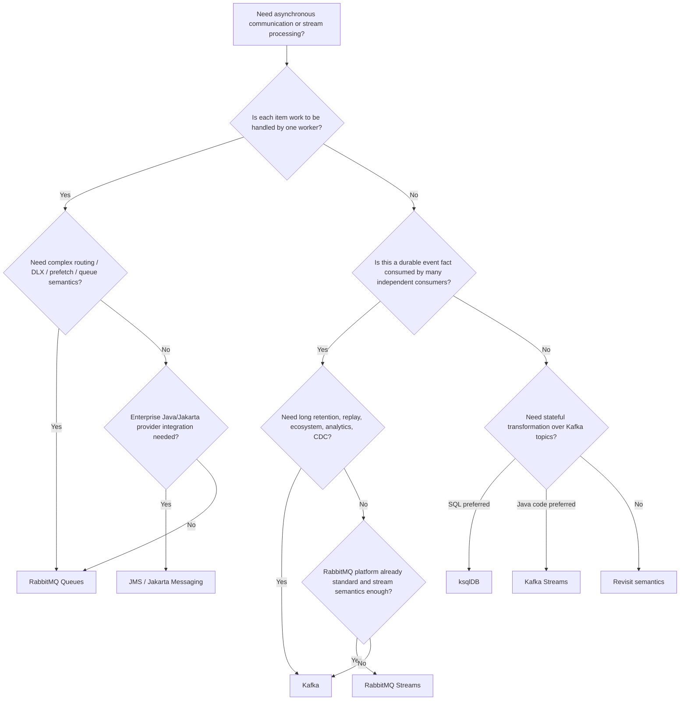
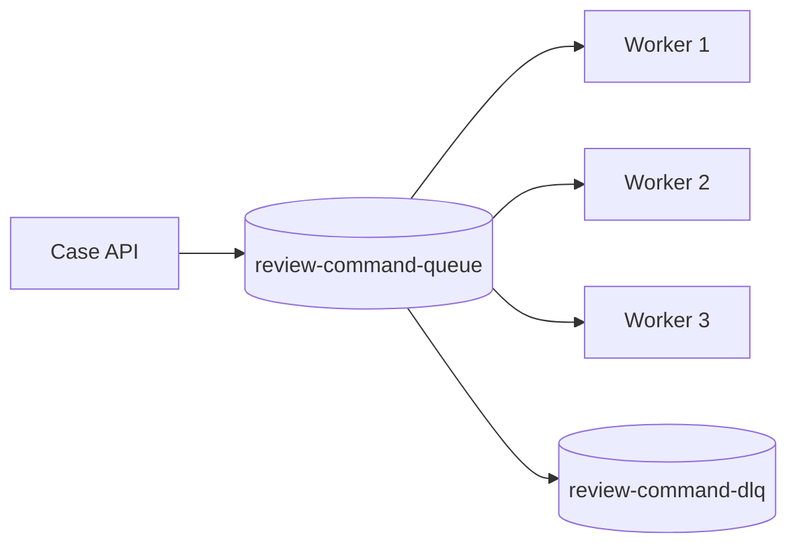
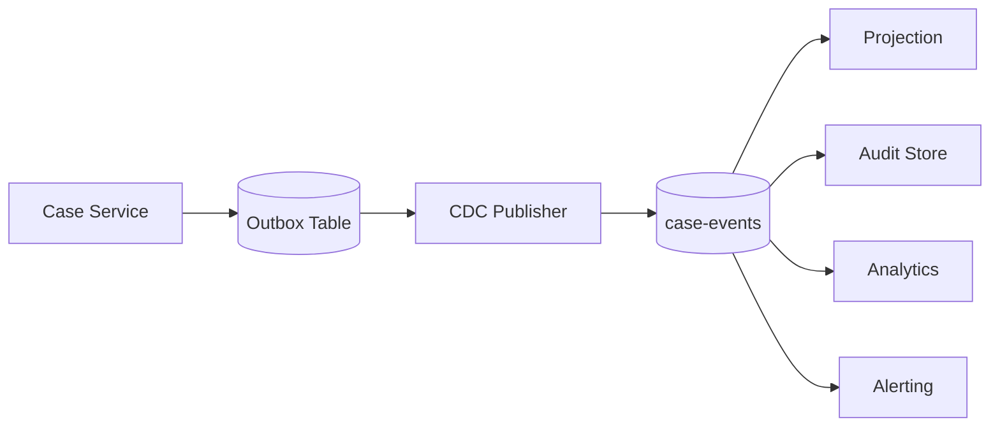
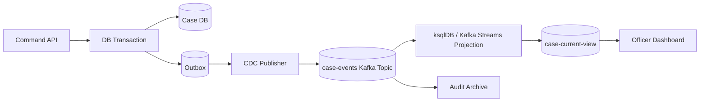
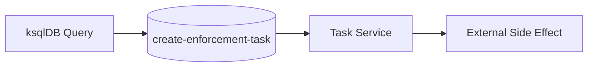
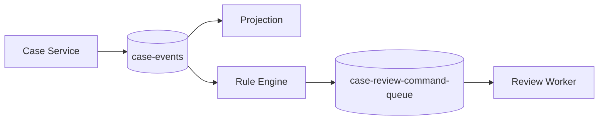
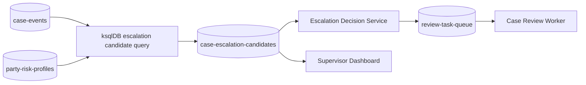

------
title: Learn Java Messaging and Event Streaming - Part 028
description: Decision matrix for choosing between Jakarta Messaging/JMS, Kafka, RabbitMQ queues, RabbitMQ Streams, and ksqlDB based on semantics, reliability, replay, routing, ordering, throughput, governance, and operational trade-offs.
series: learn-java-messaging-event-streaming
seriesTitle: Learn Java Messaging and Event Streaming
order: 28
partTitle: Technology Decision Matrix
tags:
- java
- messaging
- event-driven-architecture
- jms
- jakarta-messaging
- kafka
- rabbitmq
- rabbitmq-streams
- ksqldb
- architecture
date: 2026-06-28
---

# Part 028 — Event-Driven Architecture Decision Matrix: JMS vs Kafka vs RabbitMQ vs RabbitMQ Streams vs ksqlDB

## 1. What We Are Solving

Technology choice in messaging is often framed poorly.

Weak question:

> Should we use Kafka or RabbitMQ?

Better question:

> What communication semantics, retention model, replay requirement, routing complexity, ordering guarantee, operational model, and team capability does this use case need?

This part gives you a decision matrix.

Not because architecture can be reduced to a table.

But because a table forces you to make trade-offs explicit.

We will compare:

- Jakarta Messaging/JMS
- Kafka
- RabbitMQ queues
- RabbitMQ Streams
- ksqlDB

We will also include surrounding concepts such as Kafka Streams, outbox, inbox, CDC, workflow, and command handlers where needed.

---

## 2. First Principle: Choose Semantics Before Technology

Before naming a platform, classify the communication.

| Question | Why It Matters |
|---|---|
| Is this a command or an event? | Commands imply responsibility; events imply observation |
| Is consumption destructive or replayable? | Queue vs log/stream model |
| Is routing dynamic or key-partitioned? | Exchange/binding vs partition key |
| Is ordering per entity required? | Key design and partition count |
| Is the output a durable fact? | Retention and governance |
| Do many independent consumers need history? | Kafka/stream model often fits better |
| Does each message represent work to be completed once? | Queue model often fits better |
| Is stateful stream processing needed? | Kafka Streams or ksqlDB may fit |
| Is SQL-based transformation preferred? | ksqlDB may fit |
| Is enterprise transaction integration required? | JMS may fit in app-server environments |

A technology chosen before semantics usually becomes a constraint disguised as architecture.

---

## 3. Technology One-Liners

### 3.1 Jakarta Messaging/JMS

Use JMS/Jakarta Messaging when you want a standardized Java messaging API in enterprise environments, often with managed destinations, provider-backed queues/topics, request-reply, container integration, and transaction participation.

JMS is an API/specification abstraction.

It is not one broker implementation.

### 3.2 RabbitMQ Queues

Use RabbitMQ queues when you need flexible brokered messaging, exchange-based routing, work queues, command distribution, request-reply, delayed/retry topology, DLX patterns, and backpressure with acknowledgement/prefetch.

RabbitMQ excels at routing and work distribution.

### 3.3 RabbitMQ Streams

Use RabbitMQ Streams when you want append-only stream semantics, replay, retention, offset-based consumption, and high-throughput stream use cases inside the RabbitMQ ecosystem.

RabbitMQ Streams are not traditional queues.

### 3.4 Kafka

Use Kafka when you need a durable distributed event log, many independent consumers, replay, high-throughput ingestion, event sourcing adjacent workloads, CDC pipelines, stream processing ecosystem, and long-lived data products.

Kafka excels when events are durable facts used by multiple consumers over time.

### 3.5 ksqlDB

Use ksqlDB when you already use Kafka and need declarative stream processing: filtering, enriching, joining, aggregating, materializing tables, and serving real-time views with SQL.

ksqlDB is not a replacement for all application code.

It is a SQL interface over Kafka stream processing.

---

## 4. High-Level Decision Tree

This tree is not absolute.

It is a forcing function.

---

## 5. Capability Matrix

| Capability | JMS / Jakarta Messaging | RabbitMQ Queues | RabbitMQ Streams | Kafka | ksqlDB |
|---|---|---|---|---|---|
| Primary model | Messaging API | Brokered queues/routing | Append-only stream | Distributed log | SQL stream processing |
| Consumption | Usually queue/topic consumer semantics | Destructive queue consumption | Non-destructive offset consumption | Non-destructive offset consumption | Reads/writes Kafka topics |
| Replay | Provider-dependent, not main model | Limited for queues | Native retention/replay | Native retention/replay | Via Kafka source topics |
| Routing | Destination/selectors/provider features | Strong exchange/binding routing | Partition/routing model | Key/partition/topic | SQL/filter/repartition |
| Work queue | Good | Excellent | Not primary | Possible but often awkward | Not primary |
| Event log | Not primary | Not primary | Good | Excellent | Depends on Kafka |
| Many independent consumers | Topic support, provider-dependent | Fanout possible, queue-per-consumer | Good | Excellent | Output topics/views |
| Stateful processing | Application/provider dependent | Application side | Limited compared with Kafka ecosystem | Kafka Streams/Flink/etc. | Built-in SQL stateful processing |
| Java ecosystem | Strong enterprise Java | Strong Java client/Spring ecosystem | Java stream client | Strong Java APIs | SQL + REST, Kafka ecosystem |
| Operational weight | Provider/app-server dependent | Moderate | Moderate | High | Moderate-high on Kafka |
| Best fit | Enterprise Java messaging | Commands/tasks/routing | Rabbit-native stream use cases | Event backbone/data products | Kafka-derived views and transformations |

---

## 6. Decision by Communication Intent

### 6.1 Command to One Handler

Example:

> Assign this case review task to one available worker service.

Best candidates:

- RabbitMQ queue
- JMS queue

Kafka can do it, but it is often not the cleanest model.

Why:

- commands usually want one handler
- acknowledgement/retry/DLQ semantics matter
- prefetch/backpressure is natural
- work completion matters more than replay

Preferred pattern:

Use RabbitMQ if routing/DLX/prefetch is central.

Use JMS if you are inside a Jakarta EE/MOM environment where provider integration and transaction participation are central.

### 6.2 Domain Event Fact

Example:

> Case 123 was escalated under policy version 2026.04.

Best candidate:

- Kafka
- RabbitMQ Streams if RabbitMQ is already the platform and requirements fit

Why:

- events are durable facts
- multiple consumers may appear later
- replay is valuable
- auditability matters
- historical reconstruction matters

Preferred pattern:

### 6.3 Real-Time Projection

Example:

> Maintain current case status by consuming case lifecycle events.

Best candidates:

- Kafka Streams
- ksqlDB

Use ksqlDB when:

- logic is mostly filtering/joining/aggregating
- SQL is more readable than Java
- output is a materialized view or derived topic
- team can operate ksqlDB safely

Use Kafka Streams when:

- logic needs rich Java code
- custom state handling is needed
- testing/debugging in Java is preferred
- the processing app needs service-level control

### 6.4 Complex Routing

Example:

> Route messages by region, severity, case type, and processing capability.

Best candidate:

- RabbitMQ queues with exchanges and bindings

Kafka can route by topic/key, but RabbitMQ exchange topology is more natural for dynamic broker-side routing.

### 6.5 Request-Reply

Example:

> Submit a request and wait for a correlated async response within 5 seconds.

Best candidates:

- JMS request-reply
- RabbitMQ direct reply-to/reply queue pattern

Kafka can implement request-reply, but it is usually not ideal for low-latency correlated RPC-like flows.

If the interaction is truly synchronous from the user's perspective, ask whether HTTP/gRPC is simpler.

---

## 7. Decision by Data Lifetime

| Data Lifetime Need | Best Fit | Reason |
|---|---|---|
| Delete after one successful handler | RabbitMQ queue / JMS queue | Work item semantics |
| Retain for hours for replay/debug | Kafka / RabbitMQ Streams | Offset-based consumption |
| Retain for months/years | Kafka | Durable log ecosystem and retention model |
| Retain current state only | Kafka compacted topic / ksqlDB table | Keyed latest value |
| Retain audit-grade facts | Kafka plus governed storage/archive | Replay and evidence |
| Retain only retry failures | RabbitMQ DLQ / Kafka DLT | Failure isolation |

A queue is not a long-term archive.

A log is not automatically a work queue.

---

## 8. Decision by Ordering Requirement

| Ordering Requirement | Recommended Model |
|---|---|
| No ordering needed | Any, choose by other semantics |
| Per-worker FIFO enough | Queue with controlled concurrency |
| Per-entity order required | Kafka/RabbitMQ Streams keyed partition or single queue per ordering domain |
| Global total order required | Usually avoid; use single partition/queue only if throughput and availability trade-off are accepted |
| Order plus replay | Kafka or RabbitMQ Streams |
| Order plus complex broker routing | RabbitMQ topology with careful queue design |

Kafka ordering is per partition.

RabbitMQ queue ordering can be affected by multiple consumers, redelivery, priorities, and requeue behavior.

JMS ordering is provider/configuration dependent beyond the API-level concepts.

Do not write “must preserve order” in an architecture document without saying:

- order of what entity?
- under what failure condition?
- across how many consumers?
- during retry?
- during replay?

---

## 9. Decision by Failure Handling

### 9.1 Poison Message Handling

| Platform | Typical Strategy |
|---|---|
| JMS | Redelivery policy + DLQ/provider config + idempotent consumer |
| RabbitMQ queue | Nack/reject + DLX + retry topology + parking lot |
| RabbitMQ Streams | Consumer offset control + quarantine stream/topic + idempotent processing |
| Kafka | Retry topics + DLT + quarantine + replay tooling |
| ksqlDB | Processing log + filtering/quarantine output + corrected replay/versioned query |

### 9.2 Backpressure

| Platform | Primary Signal/Control |
|---|---|
| JMS | Consumer concurrency, provider flow control, redelivery behavior |
| RabbitMQ queue | Prefetch, ack rate, queue depth, connection/channel flow |
| RabbitMQ Streams | Consumer offset progress, credit/flow behavior, stream lag |
| Kafka | Consumer lag, fetch/poll behavior, producer buffer pressure |
| ksqlDB | Query consumer lag, task throughput, state-store pressure |

Backpressure is not a feature checkbox.

It is a control loop.

---

## 10. Decision by Throughput and Latency

### 10.1 Low-Latency Work Dispatch

RabbitMQ is usually strong for low-latency work dispatch with acknowledgement and routing.

JMS providers can also be strong in enterprise MOM environments.

### 10.2 High-Throughput Event Ingestion

Kafka is usually the default candidate for high-throughput durable event ingestion with many consumers and replay.

RabbitMQ Streams can be compelling when RabbitMQ is already the operational standard and stream requirements fit.

### 10.3 Micro-Batch Stream Processing

Kafka Streams and ksqlDB work well when processing is continuous and partitioned.

Do not use queue workers to manually rebuild a stream processor unless the semantics are truly work-item based.

---

## 11. Decision by Team and Operational Capability

Technology fit includes people.

| Team Capability | Better Fit |
|---|---|
| Strong Jakarta EE/MOM background | JMS/Jakarta Messaging |
| Strong RabbitMQ operations | RabbitMQ queues/streams |
| Strong Kafka platform team | Kafka + Kafka Streams/ksqlDB |
| SQL-heavy data/application team | ksqlDB for suitable workloads |
| Low platform maturity | Avoid over-complex multi-broker architecture |
| Need strict governance | Kafka with schema registry and disciplined ownership, or JMS/MOM with enterprise controls |

A team with weak Kafka operations can make Kafka unreliable.

A team with weak RabbitMQ topology discipline can make RabbitMQ unreadable.

A team with weak query ownership can make ksqlDB dangerous.

---

## 12. Decision by Regulatory Defensibility

For regulatory/case-management systems, defensibility requires:

- durable fact history
- explainable decisions
- replay capability
- schema evolution record
- audit trail
- idempotent side effects
- policy versioning
- correlation and causality
- data minimization

### 12.1 Strong Pattern

Key design principle:

> Use the log for facts, projections for views, and services for side effects.

### 12.2 Weak Pattern

This can work only if carefully designed.

But it is risky if replay creates duplicate commands.

Prefer producing **candidates** and letting an idempotent command service decide action.

---

## 13. Common Use Cases and Recommended Choices

| Use Case | Recommended First Choice | Rationale |
|---|---|---|
| Background email sending | RabbitMQ queue / JMS queue | Work item handled once |
| Case lifecycle audit events | Kafka | Durable replayable facts |
| Current case dashboard view | ksqlDB or Kafka Streams | Derived materialized state |
| Complex routing by severity/team | RabbitMQ | Exchange/binding model |
| CDC from database to downstream services | Kafka | Log/event backbone |
| Request-reply between Java services | JMS/RabbitMQ or HTTP/gRPC | Correlation and timeout semantics |
| Long-term event replay | Kafka | Retention and ecosystem |
| RabbitMQ-native replayable stream | RabbitMQ Streams | Stream model inside RabbitMQ |
| Real-time SQL alerting over Kafka | ksqlDB | SQL streaming queries |
| Custom stateful Java processor | Kafka Streams | Code-level control |
| Per-message retry with DLX topology | RabbitMQ | Natural queue retry topology |
| Multi-team event data product | Kafka | Independent consumers and governance |

---

## 14. Anti-Decision Matrix

### 14.1 Do Not Choose Kafka Just Because It Is Popular

Kafka is heavy machinery.

Do not choose it for a simple one-worker task queue unless replay, fan-out, or event log semantics are valuable.

### 14.2 Do Not Choose RabbitMQ Queues for Long-Term Event History

Queues are excellent for work distribution.

They are not a substitute for a durable event backbone with replayable independent consumers.

### 14.3 Do Not Choose ksqlDB for Arbitrary Business Logic

ksqlDB is excellent for declarative stream processing.

It is not the right home for every rule, workflow, policy engine, or external side effect.

### 14.4 Do Not Choose JMS as a Portability Illusion

JMS gives a standard API.

Provider behavior still matters for clustering, failover, redelivery, ordering, selectors, DLQ, management, and performance.

### 14.5 Do Not Choose RabbitMQ Streams as “Kafka But Simpler” Without Checking Ecosystem Needs

RabbitMQ Streams may fit well in a RabbitMQ-centered organization.

But Kafka has a broader event-streaming ecosystem for Connect, Schema Registry, stream processing, governance, and data platform integration.

---

## 15. Java Implementation Implications

### 15.1 JMS Java Service

Typical Java shape:

- `JMSContext`
- `Queue`/`Topic`
- message listener or MDB
- transaction boundary
- redelivery/DLQ policy
- idempotent handler
- correlation ID propagation

Good for:

- Jakarta EE container-managed messaging
- enterprise MOM integration
- provider-managed transactions

### 15.2 RabbitMQ Java Service

Typical Java shape:

- connection/channel lifecycle
- exchange/queue declaration
- publisher confirms
- manual ack/nack
- prefetch
- DLX/retry topology
- worker pool
- idempotency table

Good for:

- work queues
- routing topology
- backpressure with prefetch
- command handling

### 15.3 Kafka Java Service

Typical Java shape:

- producer with idempotence
- consumer poll loop
- manual offset commit
- retry/DLT strategy
- schema registry serializers/deserializers
- key design
- idempotent sink

Good for:

- durable event facts
- multi-consumer event streams
- outbox/CDC architecture
- replayable projections

### 15.4 Kafka Streams Java Service

Typical Java shape:

- `StreamsBuilder`
- topology definition
- `KStream`/`KTable`
- state stores
- changelog topics
- serde configuration
- topology tests
- exactly-once processing where applicable

Good for:

- custom stateful Java processing
- local state
- rich transformation logic

### 15.5 ksqlDB Processing

Typical shape:

- SQL migration files
- source stream/table definitions
- CSAS/CTAS persistent queries
- schema registry integration
- query monitoring
- versioned output topics

Good for:

- declarative streaming transformations
- materialized views
- real-time SQL analytics
- enrichment and aggregation

---

## 16. Hybrid Architectures

Real systems often use more than one technology.

That is not automatically wrong.

It is wrong when boundaries are unclear.

### 16.1 Kafka + RabbitMQ

Common split:

- Kafka for domain events and replayable facts
- RabbitMQ for commands/work distribution

This can be strong if:

- facts and commands are separated
- IDs/correlation are propagated
- side effects are idempotent
- ownership is clear

### 16.2 Kafka + ksqlDB

Common split:

- Kafka stores source event facts
- ksqlDB computes derived streams/tables
- Java services consume derived outputs

Strong for:

- dashboards
- enrichment
- alert candidates
- monitoring views

Risk:

- hidden business rules in SQL
- replay causing command duplication
- query sprawl

### 16.3 JMS + Kafka

Common during modernization.

- legacy Java/Jakarta EE systems use JMS
- new platform uses Kafka event backbone
- bridge publishes selected facts to Kafka

Risks:

- semantic mismatch between messages and events
- duplicate publication
- transaction boundary gaps
- inconsistent IDs

Use outbox/CDC where possible.

### 16.4 RabbitMQ + RabbitMQ Streams

Common when organization already operates RabbitMQ.

- queues for commands/work
- streams for replayable facts or high-throughput event streams

Risk:

- confusing queue and stream semantics
- assuming queue retry patterns map directly to streams
- underestimating partition/superstream design

---

## 17. Migration Strategy

### 17.1 JMS to Kafka

Do not simply mirror JMS messages into Kafka.

First classify:

- Which messages are commands?
- Which are domain events?
- Which are integration documents?
- Which are transient signals?

Migration steps:

1. Identify durable facts worth preserving.
2. Define Kafka event schema.
3. Add stable event IDs and correlation IDs.
4. Publish through outbox/CDC if source of truth is database-backed.
5. Keep JMS for command workflows until replaced intentionally.
6. Migrate consumers gradually.
7. Retire bridge after consumers move.

### 17.2 RabbitMQ Queue to Kafka

Use Kafka when the queue was actually being abused as an event log.

Signs:

- many consumers need copies
- messages are archived externally
- consumers ask for replay
- downstream analytics needs history
- ordering per entity matters

Do not migrate if the use case is simply work dispatch.

### 17.3 Kafka Consumer Logic to ksqlDB

Good candidates:

- filtering
- projection
- aggregation
- stream-table enrichment
- simple alert candidate generation

Bad candidates:

- complex imperative workflows
- external API calls
- rich domain validation with many dependencies
- side effects
- policy logic requiring code-level test harness

### 17.4 ksqlDB Back to Java

Sometimes SQL becomes too complex.

Move to Kafka Streams or a Java service when:

- query is unreadable
- business logic needs abstraction
- custom state access is needed
- testing requires richer fixtures
- versioning policy logic in SQL becomes dangerous

Moving away from ksqlDB is not failure.

It is choosing the right abstraction.

---

## 18. Architecture Review Checklist

Before approving a messaging/streaming design, ask these.

### 18.1 Semantics

- Is each payload a command, event, document message, or signal?
- Is consumption destructive or replayable?
- Is the message/event immutable?
- Who owns the schema?
- Who owns the topic/queue?

### 18.2 Correctness

- What ordering is required?
- What duplicate behavior is expected?
- What happens on retry?
- What happens on replay?
- What happens on partial failure?
- What is the idempotency key?

### 18.3 Operations

- What is monitored?
- What alert fires first?
- How is lag/queue depth interpreted?
- How is poison data isolated?
- How is backpressure applied?
- How is disaster recovery tested?

### 18.4 Governance

- Does the payload contain PII?
- What is retention?
- What is the audit requirement?
- What is the schema compatibility mode?
- Can a decision be reconstructed?
- Can a bad output be corrected without hiding evidence?

### 18.5 Human Factors

- Can the team operate this technology?
- Is the topology understandable?
- Is there one clear owner?
- Is the design too clever?
- Can on-call engineers debug it at 03:00?

---

## 19. Decision Rubric

Score each candidate from 1 to 5.

| Criterion | Weight | JMS | RabbitMQ | RabbitMQ Streams | Kafka | ksqlDB |
|---|---:|---:|---:|---:|---:|---:|
| Matches communication semantics | 5 |  |  |  |  |  |
| Operational maturity in team | 5 |  |  |  |  |  |
| Replay requirement | 4 |  |  |  |  |  |
| Routing complexity | 3 |  |  |  |  |  |
| Ordering model fit | 4 |  |  |  |  |  |
| Schema governance | 4 |  |  |  |  |  |
| Failure isolation | 5 |  |  |  |  |  |
| Backpressure model | 4 |  |  |  |  |  |
| Observability | 4 |  |  |  |  |  |
| Cost/complexity | 3 |  |  |  |  |  |
| Regulatory defensibility | 5 |  |  |  |  |  |

The table is not meant to produce fake precision.

It is meant to reveal disagreement.

If two senior engineers score Kafka differently for “matches semantics”, that is the architecture conversation.

---

## 20. Example Decision: Escalation Candidate Pipeline

Requirement:

- consume case events
- join risk profile
- compute escalation candidate
- expose dashboard
- allow replay
- avoid duplicate enforcement task creation

Decision:

- Kafka for source facts
- ksqlDB or Kafka Streams for candidate projection
- compacted Kafka topic for current candidate state
- Java service for actual task creation command
- RabbitMQ optional for worker task distribution

Why:

- facts need replay
- derived state can be rebuilt
- SQL may be enough for candidate logic
- side effects must be idempotent and explicit
- task execution is work distribution, not event history

Architecture:

Key invariant:

> ksqlDB produces candidates. A service owns irreversible decisions.

---

## 21. Example Decision: Legacy Jakarta EE Case Notifications

Requirement:

- existing Jakarta EE application
- send notification messages after DB transaction
- one notification handler should process each message
- no long-term replay required
- provider already supports transactions and DLQ

Decision:

- JMS queue is reasonable

Why:

- enterprise Java integration matters
- queue semantics match work item
- replay is not primary
- existing operational maturity exists

But add:

- idempotency key
- correlation ID
- DLQ handling
- redelivery policy
- audit event published separately if notification is legally meaningful

---

## 22. Example Decision: Cross-Team Case Event Backbone

Requirement:

- many teams consume case lifecycle events
- consumers appear after producer is deployed
- replay/backfill needed
- schema evolution must be governed
- analytics and projections need same facts

Decision:

- Kafka as event backbone

Why:

- durable event log
- independent consumer groups
- retention/replay
- schema registry integration
- stream processing ecosystem

Avoid:

- one RabbitMQ queue shared by all consumers
- point-to-point JMS messages for durable domain facts
- direct synchronous callbacks to every consumer

---

## 23. Example Decision: Complex Routing to Specialized Workers

Requirement:

- messages routed by case type, jurisdiction, severity, and specialist capability
- each work item should be processed once
- failed work goes to DLQ/retry topology
- no broad replay requirement

Decision:

- RabbitMQ queues with exchange/binding topology

Why:

- routing model is natural
- prefetch controls worker pressure
- DLX/TTL retry fits well
- competing consumers process work items

Avoid:

- creating many Kafka topics only to emulate routing keys
- relying on consumer-side filtering for all routing

---

## 24. Final Heuristics

Use these as fast mental shortcuts.

### 24.1 Choose JMS When

- you are in Jakarta EE/enterprise MOM context
- standardized Java messaging API matters
- provider-managed queues/topics are already operationally mature
- transaction integration matters
- request-reply/correlation is common

### 24.2 Choose RabbitMQ Queues When

- the problem is work distribution
- complex routing matters
- per-message ack/reject/requeue matters
- DLX/retry topology matters
- worker backpressure with prefetch matters

### 24.3 Choose RabbitMQ Streams When

- the problem is replayable stream data
- RabbitMQ is already the platform standard
- stream retention and offset consumption are needed
- Kafka ecosystem breadth is not required
- superstream partitioning fits the scaling model

### 24.4 Choose Kafka When

- events are durable facts
- replay matters
- multiple independent consumers exist
- retention and schema governance matter
- high-throughput ingestion is needed
- stream processing/data platform integration matters

### 24.5 Choose ksqlDB When

- Kafka is already the source of truth
- transformation is naturally expressed as SQL
- output is derived stream/table/materialized view
- query ownership and operations are mature
- business logic is not too imperative or side-effect-heavy

---

## 25. Summary

The right messaging technology follows from semantics.

The condensed model:

- JMS is a Java enterprise messaging API and integration contract.
- RabbitMQ queues are excellent for routed work distribution.
- RabbitMQ Streams provide replayable stream/log semantics inside RabbitMQ.
- Kafka is a durable distributed event log and event backbone.
- ksqlDB is declarative stream processing over Kafka.

For top-tier engineering, the question is not which product is “best”.

The question is:

> Which failure modes are we choosing, and are they the right ones for this business process?

A good architecture makes those choices explicit.

A bad architecture discovers them during incident response.

---

## References

- Jakarta Messaging Specification: https://jakarta.ee/specifications/messaging/
- Jakarta Messaging API Documentation: https://jakarta.ee/specifications/messaging/3.1/apidocs/jakarta.messaging/jakarta/jms/package-summary
- Apache Kafka Documentation: https://kafka.apache.org/documentation/
- Apache Kafka Design Documentation: https://kafka.apache.org/43/design/design/
- RabbitMQ Exchanges Documentation: https://www.rabbitmq.com/docs/exchanges
- RabbitMQ Queues Documentation: https://www.rabbitmq.com/docs/queues
- RabbitMQ Consumer Acknowledgements and Publisher Confirms: https://www.rabbitmq.com/docs/confirms
- RabbitMQ Streams and Superstreams Documentation: https://www.rabbitmq.com/docs/streams
- Confluent Documentation — ksqlDB Overview: https://docs.confluent.io/platform/current/ksqldb/overview.html
- Confluent Documentation — ksqlDB Queries: https://docs.confluent.io/platform/current/ksqldb/concepts/queries.html
