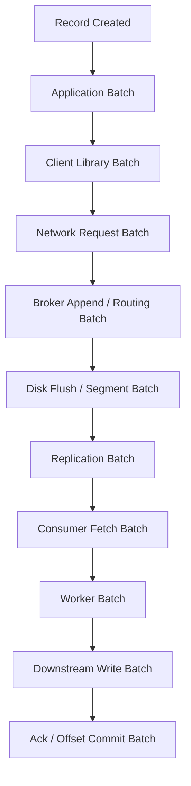
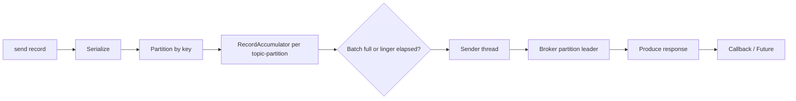
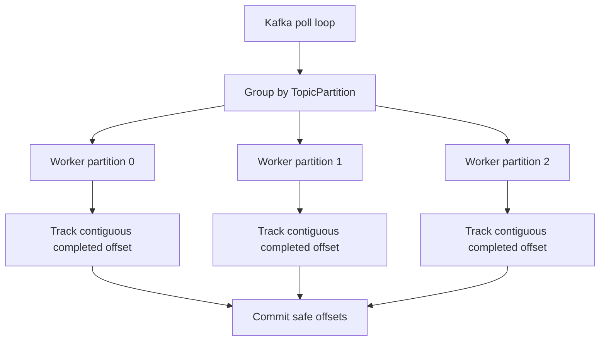
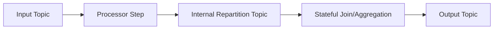
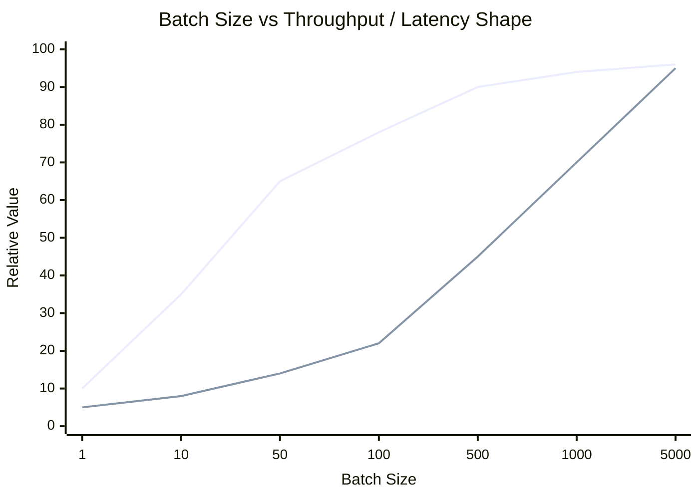
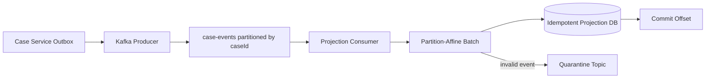

------
title: Learn Java Messaging and Event Streaming - Part 029
description: Throughput engineering across JMS/Jakarta Messaging, Kafka, RabbitMQ queues, RabbitMQ Streams, Kafka Streams, and ksqlDB using pipelining, batching, compression, buffering, concurrency, and realistic benchmark discipline.
series: learn-java-messaging-event-streaming
seriesTitle: Learn Java Messaging and Event Streaming
order: 29
partTitle: Pipelining and Batching: Throughput Engineering Across Messaging Systems
tags:
- java
- messaging
- event-streaming
- kafka
- rabbitmq
- rabbitmq-streams
- jms
- jakarta-messaging
- batching
- pipelining
- performance
- throughput
date: 2026-06-28
---

# Part 029 — Pipelining and Batching: Throughput Engineering Across Messaging Systems

## 1. What We Are Solving

This part is about a simple production question that becomes complex quickly:

> How do we move more messages per second without destroying latency, reliability, ordering, memory, or operability?

The shallow answer is usually:

> Increase batch size.

That answer is incomplete.

Throughput in messaging systems is not controlled by one setting. It is the result of several queues, buffers, flush boundaries, network round trips, disk writes, replication, serialization cost, compression, acknowledgement strategy, consumer parallelism, downstream capacity, and failure recovery behavior.

A top-tier engineer does not tune `batch.size` or `prefetch` in isolation. They identify the bottleneck, choose the batching layer intentionally, protect tail latency, and define what happens when the pipeline becomes full.

In this part, we will build the mental model that applies across:

- JMS / Jakarta Messaging
- Kafka producer and consumer
- Kafka Streams and ksqlDB
- RabbitMQ queues
- RabbitMQ Streams and Superstreams
- application-level side effects such as database writes, HTTP calls, search indexing, and audit logging

---

## 2. The Core Mental Model

A messaging pipeline is a sequence of stages.

Each stage has:

- input rate
- output rate
- service time
- queue/buffer capacity
- batch boundary
- flush trigger
- failure mode
- observability signal

```mermaid
flowchart LR
    App[Application Producer] --> PBuf[Client Buffer / Accumulator]
    PBuf --> Net[Network Request]
    Net --> Broker[Broker Append / Route / Replicate]
    Broker --> Store[Disk / Log / Queue Storage]
    Store --> Fetch[Consumer Fetch / Delivery]
    Fetch --> CBuf[Consumer Buffer]
    CBuf --> Proc[Business Processing]
    Proc --> Side[External Side Effect]
    Side --> Ack[Offset Commit / Ack / Tx Commit]
```



Throughput is limited by the slowest stable stage.

If the producer can emit 100,000 events/sec but the consumer-side database can safely process 8,000 writes/sec, the system is an 8,000/sec system unless you buffer, shed, partition, aggregate, or redesign the side effect.

The key invariant:

> Batching increases efficiency by amortizing fixed cost, but it also increases latency, memory exposure, duplicate/replay surface, and blast radius per failure.

---

## 3. Pipelining vs Batching

These terms are often mixed together. They are related but different.

### 3.1 Batching

Batching groups multiple units of work into one operation.

Examples:

- sending 500 Kafka records in one produce request
- committing one Kafka offset after processing 1,000 records
- acknowledging multiple RabbitMQ deliveries with one `basicAck(..., multiple=true)`
- committing one JMS transacted session after 100 messages
- writing 1,000 rows using JDBC batch insert
- compressing a group of records together

Batching reduces per-message overhead.

But it creates waiting time.

A record may wait in a buffer until:

- batch is full
- linger timeout expires
- transaction commits
- poll loop returns
- consumer worker accumulates enough items
- downstream writer flushes

### 3.2 Pipelining

Pipelining allows multiple operations to be in flight at the same time.

Examples:

- Kafka producer sends request N+1 before response N completes
- RabbitMQ publisher has multiple outstanding confirm-sequence numbers
- consumer fetches more records while workers process previous records
- stream processor overlaps deserialize, process, write, and commit phases
- application keeps several HTTP side-effect calls in flight with bounded concurrency

Pipelining reduces idle time.

But it increases the number of records that are not yet durably completed.

### 3.3 The Difference

| Mechanism | Improves | Main Cost | Common Failure |
|---|---:|---|---|
| Batching | efficiency per operation | added latency and memory | larger duplicate/retry batch |
| Pipelining | resource utilization | more in-flight uncertainty | out-of-order completion |
| Concurrency | parallelism | coordination and contention | hot keys, race conditions |
| Compression | bandwidth/storage | CPU | latency spike under CPU pressure |
| Buffering | burst absorption | delayed failure visibility | memory exhaustion |

High-throughput systems usually need all five, but with explicit bounds.

---

## 4. Throughput Equation for Practical Engineers

You do not need a perfect mathematical model. You need a useful one.

A rough upper bound:

```text
throughput ≈ effective_parallelism × batch_size / batch_cycle_time
```

Where:

- `effective_parallelism` = partitions, consumers, workers, connections, streams, shards, or database writers that can truly operate independently
- `batch_size` = number of records per durable operation
- `batch_cycle_time` = time to fill, send, persist, replicate, process, and acknowledge one batch

A more operational version:

```text
stable_throughput = min(
  producer_capacity,
  broker_ingest_capacity,
  broker_replication_capacity,
  broker_storage_capacity,
  consumer_fetch_capacity,
  business_processing_capacity,
  downstream_side_effect_capacity,
  ack_or_commit_capacity
)
```

Throughput tuning starts by finding the minimum.

If you do not know the bottleneck, do not tune blindly.

---

## 5. Batch Boundaries Across the Pipeline

A record can be batched multiple times before it is “done”.



A common mistake is stacking batch boundaries without realizing it.

Example:

- producer has `linger.ms=50`
- broker replication adds 20–80 ms under load
- consumer fetch waits for larger fetches
- consumer processes 1,000 records before commit
- database writer flushes every 2,000 rows
- alerting only sees lag after several minutes

This may produce great benchmark throughput and terrible operational latency.

The tuning question is not “how large can the batch be?”

It is:

> Which layer should batch, how large, for what workload, with what latency SLO, and what happens when that layer fails?

---

## 6. Kafka Producer Batching

Kafka producer batching is one of the most important throughput levers in Java event streaming.

The producer does not usually send each record immediately as an isolated network request. It groups records by topic-partition in an internal accumulator, then sends produce requests to brokers.

Simplified flow:



### 6.1 Key Producer Settings

| Setting | What It Controls | Engineering Meaning |
|---|---|---|
| `batch.size` | upper bound for records accumulated per partition batch | larger batch can improve throughput if enough records hit same partition |
| `linger.ms` | wait time before sending a not-yet-full batch | adds latency to improve batch formation |
| `compression.type` | compression codec | reduces network/storage; increases CPU |
| `buffer.memory` | total producer buffer memory | bounds unsent data; protects JVM only if handled correctly |
| `max.block.ms` | how long `send()` can block waiting for metadata/buffer | backpressure boundary to application thread |
| `acks` | broker acknowledgement requirement | durability vs latency trade-off |
| `retries` | resend on retriable error | needed for reliability; interacts with ordering/idempotence |
| `delivery.timeout.ms` | upper bound for successful send completion | prevents infinite in-flight attempts |
| `max.in.flight.requests.per.connection` | pipeline depth per connection | affects throughput and ordering under retry |

The producer setting most often misunderstood is `batch.size`.

It does not mean every request will contain that many bytes. It is a per-partition batch upper bound. If traffic is spread thinly across many partitions, increasing it may do little unless `linger.ms` also allows time for batches to fill.

### 6.2 The `linger.ms` Trade-Off

`linger.ms` is a deliberate small delay.

Low value:

- lower latency at low traffic
- smaller batches
- more requests/sec
- more CPU/network overhead

Higher value:

- larger batches
- better compression
- fewer network requests
- better broker efficiency
- added waiting latency

For high-volume systems, a modest linger often improves both throughput and p99 latency because it reduces broker/network pressure. For low-latency command systems, a high linger can violate responsiveness.

### 6.3 Compression

Compression works best when messages in a batch are similar.

For event streams with repeated field names, similar schemas, and similar values, compression can reduce network and disk pressure significantly.

But compression is not free.

It consumes CPU on producer and broker/consumer side. Under CPU pressure, compression can turn a bandwidth bottleneck into a CPU bottleneck.

The engineering rule:

> Enable compression only with real workload measurement: payload shape, broker CPU, producer CPU, consumer CPU, p95/p99 latency, and failure recovery time.

### 6.4 Idempotence and Pipelining

Kafka’s idempotent producer protects against duplicate writes caused by producer retries within Kafka’s broker protocol boundaries.

But high throughput often pushes engineers to increase in-flight requests.

More in-flight requests improve throughput, but under retries they can interact with ordering and failure behavior. Modern Kafka defaults and idempotence make many cases safer, but the architectural rule remains:

> Never tune producer pipeline depth without verifying ordering requirements, retry behavior, and idempotence configuration.

### 6.5 Producer Callback Discipline

Bad callback pattern:

```java
producer.send(record);
```

This can hide failures if the application never observes the returned future or callback.

Better pattern:

```java
producer.send(record, (metadata, exception) -> {
    if (exception != null) {
        // classify: retriable? fatal? serialization? authorization? timeout?
        failureCounter.increment();
        errorHandler.handle(record, exception);
        return;
    }
    successCounter.increment();
    latencyRecorder.record(metadata.timestamp());
});
```

For very high throughput, callback work must be lightweight. Do not perform blocking database or network calls inside the producer callback.

### 6.6 Application-Level Kafka Producer Batch

Sometimes the application itself creates a batch before sending records.

Example:

```java
List<CaseEvent> events = outboxRepository.fetchReadyBatch(500);

for (CaseEvent event : events) {
    ProducerRecord<String, CaseEvent> record = new ProducerRecord<>(
        "case-events.v1",
        event.caseId(),
        event
    );
    producer.send(record, callbackFor(event));
}

producer.flush();
outboxRepository.markAttempted(events);
```

Be careful with `flush()`.

It can be useful at explicit boundaries, such as shutdown, tests, or outbox batch loops.

It is harmful if called after every record because it prevents producer batching and pipelining.

---

## 7. Kafka Consumer Batching

Kafka consumers fetch records in batches.

The application sees batches through `poll()`.

```java
while (running.get()) {
    ConsumerRecords<String, CaseEvent> records = consumer.poll(Duration.ofMillis(500));

    for (ConsumerRecord<String, CaseEvent> record : records) {
        process(record);
    }

    consumer.commitSync();
}
```

This simple loop hides several batch decisions.

### 7.1 Consumer Batch Settings

| Setting | What It Controls | Engineering Meaning |
|---|---|---|
| `max.poll.records` | maximum records returned per `poll()` | bounds application processing batch |
| `fetch.min.bytes` | broker waits for at least this much data before responding | improves fetch efficiency at cost of wait |
| `fetch.max.wait.ms` | max wait for `fetch.min.bytes` | latency bound for fetch batching |
| `fetch.max.bytes` | max data per fetch request | memory and throughput boundary |
| `max.partition.fetch.bytes` | max data returned per partition | protects memory; must support largest batch |
| `max.poll.interval.ms` | max time between polls for group membership | prevents slow processing from looking dead |
| `session.timeout.ms` | group failure detection window | affects rebalance sensitivity |

High throughput consumers usually tune both fetch size and processing architecture.

But the main risk is poll-loop starvation.

If you fetch a large batch and process it synchronously for longer than `max.poll.interval.ms`, the consumer can be considered failed and the group can rebalance.

### 7.2 Manual Commit Batch

Manual commit after every record is safe but inefficient.

Manual commit after too many records improves throughput but increases duplicate replay on crash.

A common strategy:

- process records partition-aware
- track highest safely processed offset per partition
- commit offsets periodically or after a safe batch
- commit only records whose side effects are durable

For simple sequential processing:

```java
while (running.get()) {
    ConsumerRecords<String, CaseEvent> records = consumer.poll(Duration.ofMillis(250));
    if (records.isEmpty()) {
        continue;
    }

    for (ConsumerRecord<String, CaseEvent> record : records) {
        processor.process(record);
    }

    consumer.commitSync();
}
```

For concurrent processing, this gets harder. You must avoid committing past unfinished records in the same partition.

### 7.3 Partition-Aware Worker Batching

A safer concurrent model is partition-affine processing.



This preserves per-partition order while allowing parallelism across partitions.

### 7.4 Consumer Batch and Database Batch

Consumer batching becomes much more valuable when downstream side effects support batching.

Example: instead of 1 DB transaction per event, write 500 state transitions in one transaction.

But batch DB writes change failure semantics.

If one row violates a constraint, does the whole batch fail?

Options:

| Strategy | Benefit | Risk |
|---|---|---|
| all-or-nothing DB batch | simple atomicity | one bad event blocks batch |
| split-on-failure | isolates poison record | more code and retry complexity |
| per-record fallback | stable recovery | slower under bad data |
| quarantine invalid record | protects pipeline | requires governance and replay |

---

## 8. RabbitMQ Queue Throughput

RabbitMQ queue throughput is shaped by:

- exchange routing cost
- queue type
- durability
- publisher confirm mode
- consumer acknowledgement mode
- prefetch
- message size
- persistence
- replication/quorum behavior
- consumer side-effect speed

### 8.1 Publisher Confirms as Pipeline

Publisher confirms are not just reliability. They are also a pipeline control mechanism.

Low-throughput but simple:

```java
channel.basicPublish(exchange, routingKey, props, body);
channel.waitForConfirmsOrDie(5_000);
```

This waits after every publish.

Better throughput uses multiple outstanding publishes and then waits for confirms in batches:

```java
channel.confirmSelect();

int batchSize = 500;
int inBatch = 0;

for (OutboundMessage msg : messages) {
    channel.basicPublish(msg.exchange(), msg.routingKey(), msg.properties(), msg.body());
    inBatch++;

    if (inBatch == batchSize) {
        channel.waitForConfirmsOrDie(10_000);
        inBatch = 0;
    }
}

if (inBatch > 0) {
    channel.waitForConfirmsOrDie(10_000);
}
```

This improves throughput but increases the number of messages whose final publish status is unknown during failure.

The production version tracks publish sequence numbers and handles async confirms, nacks, and timeouts explicitly.

### 8.2 Consumer Prefetch as Batch Window

RabbitMQ prefetch limits unacknowledged deliveries per consumer.

Prefetch is not just “performance”. It is a backpressure and fairness control.

Small prefetch:

- lower memory per consumer
- fairer distribution
- lower duplicate exposure
- potentially lower throughput

Large prefetch:

- better throughput for slow round-trip ack workloads
- more messages buffered on consumer
- higher duplicate/requeue burst on crash
- worse fairness if processing time varies

For CPU-bound short tasks, prefetch can often be close to worker concurrency.

For I/O-bound tasks, it may be larger, but only if memory and duplicate exposure are acceptable.

### 8.3 RabbitMQ Ack Batching

AMQP acknowledgements can acknowledge multiple deliveries with the `multiple` flag.

Conceptually:

```java
long lastDeliveryTag = envelope.getDeliveryTag();
channel.basicAck(lastDeliveryTag, true);
```

This can reduce ack overhead.

But it is only safe if all prior delivery tags on that channel are safely processed.

Do not use `multiple=true` with unordered concurrent processing unless you track contiguous completion correctly.

### 8.4 RabbitMQ Batch Anti-Pattern: Giant Consumer Transaction

Bad pattern:

- prefetch 10,000
- process all messages
- ack all at the end
- database commit at the end

This appears efficient until:

- one poison message blocks the whole batch
- consumer crashes and requeues 10,000 messages
- retry storm starts
- queue head-of-line blocking grows
- memory spikes
- operator cannot see which item is bad

Better pattern:

- bounded prefetch
- bounded batch size
- per-message idempotency
- split-on-failure logic
- DLQ/quarantine after retry budget
- ack only after durable side effect

---

## 9. RabbitMQ Streams Throughput

RabbitMQ Streams uses a log-like model and has throughput tools closer to Kafka than classic queues.

Important concepts:

- stream append
- offset-based consumption
- retention
- producer confirmation
- server-side offset tracking
- superstream partitioning
- sub-entry batching
- compression
- deduplication based on producer identity and publishing ID

### 9.1 Sub-Entry Batching

Sub-entry batching groups messages inside publishing frames to improve throughput.

It can reduce protocol and storage overhead.

But it has explicit costs:

- increased latency
- more memory pressure
- more CPU if compressed
- duplicate semantics can become more complex

Use it when:

- throughput matters more than very low latency
- payloads are small and numerous
- message similarity makes compression effective
- consumers can tolerate the duplicate/replay implications

### 9.2 Stream Offset Commit Batch

Broker-provided offset tracking can persist offsets in the stream itself.

Commit too often:

- more overhead
- lower throughput

Commit too rarely:

- more replay after crash
- larger duplicate window

A practical rule:

> Offset tracking frequency is a business duplicate-window decision, not only a performance setting.

For enforcement/case-management workloads, replaying 5 seconds of duplicate notifications may be acceptable; replaying 30 minutes of irreversible external actions probably is not.

---

## 10. JMS / Jakarta Messaging Batching

JMS does not expose Kafka-style producer accumulator settings as part of the portable API. Batching is usually expressed through:

- transacted sessions
- provider-specific tuning
- asynchronous send behavior
- message listener concurrency
- acknowledgement mode
- container transaction boundaries
- application-level grouping

### 10.1 Transacted Session Batch

A transacted JMS session groups sends and receives into one transaction boundary.

Conceptual producer batch:

```java
try (JMSContext ctx = connectionFactory.createContext(JMSContext.SESSION_TRANSACTED)) {
    JMSProducer producer = ctx.createProducer();

    for (CaseCommand command : commands) {
        producer.send(destination, serialize(command));
    }

    ctx.commit();
} catch (JMSRuntimeException ex) {
    // transaction rolled back or commit uncertain depending on failure point
    throw ex;
}
```

This reduces commit overhead but creates an uncertainty window.

If commit status is unknown after failure, the application must reconcile using idempotency keys, outbox state, or provider-specific transaction recovery.

### 10.2 Consumer Batch with Transacted Session

```java
try (JMSContext ctx = connectionFactory.createContext(JMSContext.SESSION_TRANSACTED)) {
    JMSConsumer consumer = ctx.createConsumer(queue);

    for (int i = 0; i < 100; i++) {
        Message message = consumer.receive(500);
        if (message == null) {
            break;
        }
        process(message);
    }

    ctx.commit();
}
```

This is efficient only if:

- all messages can be processed safely in the same transaction
- processing time is bounded
- poison message isolation is handled
- duplicate replay after rollback is acceptable
- transaction timeout is configured correctly

### 10.3 MDB Concurrency

In Jakarta EE, MDB concurrency is controlled by container/provider configuration. You tune throughput through pool size, destination configuration, transaction behavior, and downstream capacity.

The danger is hidden concurrency.

A handler may look single-threaded in code, while the container runs many instances in parallel.

If the message key requires per-case ordering, unconstrained MDB concurrency can violate the business invariant unless the provider supports message grouping or you partition destinations by entity.

---

## 11. Kafka Streams and ksqlDB Batching

Kafka Streams and ksqlDB batch indirectly through Kafka consumer/producer behavior, internal buffers, state-store caching, commit intervals, and topology design.

Important throughput dimensions:

- number of input partitions
- number of stream threads
- repartition topics
- state store write amplification
- changelog topic traffic
- cache size
- commit interval
- window retention
- RocksDB I/O behavior
- output topic partition count

### 11.1 Stateful Processing Batch Cost

Stateful stream processing has more hidden work than stateless mapping.

A single input event may cause:

- deserialize input
- read state store
- update state store
- write changelog record
- write output record
- maybe write repartition record
- maybe update window store
- maybe emit suppression result later

Batching helps, but stateful correctness constraints limit how aggressively you can batch.

### 11.2 Repartitioning as Throughput Tax

Every repartition introduces an internal topic and another produce/consume hop.



Repartitioning may be necessary for correctness, especially joins and group-by operations. But it is never free.

Decision rule:

> Repartition for correctness deliberately; do not accidentally repartition because keys are unclear.

---

## 12. Downstream Side-Effect Batching

The broker is often not the bottleneck.

The bottleneck is usually:

- relational database writes
- Elasticsearch/OpenSearch indexing
- remote HTTP APIs
- object storage writes
- notification providers
- audit/event persistence
- encryption/decryption
- schema validation

### 12.1 Database Batch Example

Bad:

```java
for (CaseEvent event : events) {
    repository.insertProjection(event); // one transaction each
}
```

Better:

```java
repository.insertProjectionBatch(events);
```

But the correctness requirement must be explicit:

- Is the batch atomic?
- Can partial success occur?
- Are events idempotent?
- Is ordering required inside the batch?
- What is the retry unit?
- What is the quarantine unit?

### 12.2 HTTP Side Effects

HTTP calls rarely support large atomic batches.

For HTTP side effects, pipelining is often more useful than batching.

Use bounded concurrency:

```java
Semaphore limit = new Semaphore(32);

for (NotificationCommand command : commands) {
    limit.acquire();
    executor.submit(() -> {
        try {
            notificationClient.send(command);
        } finally {
            limit.release();
        }
    });
}
```

But this must be integrated with offset/ack discipline.

Never ack/commit the message before the side effect is durably completed or recorded as pending in an outbox.

---

## 13. Latency-Throughput Curve

Batching has a typical curve.



The exact curve varies by workload.

But the shape matters:

- throughput gains usually flatten
- latency keeps rising
- memory exposure rises
- duplicate/retry blast radius rises

The best batch size is rarely the largest possible batch.

It is the smallest batch that reaches the required throughput while preserving latency and recovery SLOs.

---

## 14. What to Measure

Before tuning, define baseline measurements.

### 14.1 Producer Metrics

Measure:

- records/sec
- bytes/sec
- request rate
- batch size average
- batch split rate
- buffer available bytes
- time blocked on buffer
- request latency
- record queue time
- retries
- errors by category
- compression ratio

### 14.2 Broker Metrics

Measure:

- ingress bytes/sec
- egress bytes/sec
- disk write latency
- disk utilization
- replication lag
- queue depth
- stream lag
- memory usage
- flow-control activation
- partition leadership distribution
- request handler saturation

### 14.3 Consumer Metrics

Measure:

- records/sec consumed
- processing latency
- end-to-end latency
- lag by partition
- commit latency
- rebalance count
- poll idle ratio
- worker queue depth
- unacked deliveries
- redelivery count

### 14.4 Downstream Metrics

Measure:

- DB transaction latency
- batch write latency
- lock wait time
- deadlock count
- HTTP response latency
- error rate
- connection pool saturation
- retry count
- idempotency conflict count

The anti-pattern:

> Measuring broker throughput only and declaring the system ready.

The system is ready only when producer, broker, consumer, and side-effect path are stable together.

---

## 15. Benchmark Discipline

A benchmark that cannot predict production behavior is worse than no benchmark because it creates false confidence.

### 15.1 Benchmark Dimensions

Use realistic values for:

- payload size distribution
- key distribution
- partition count
- producer count
- consumer group count
- replication factor
- durability settings
- ack/confirm settings
- compression
- schema serialization
- TLS/SASL overhead
- downstream side effects
- retry/DLQ behavior
- deployment topology
- disk type
- network latency
- multi-AZ replication if applicable

### 15.2 Benchmark Scenarios

Minimum scenarios:

| Scenario | Purpose |
|---|---|
| steady state normal load | baseline |
| peak load | capacity |
| burst load | buffer and backpressure behavior |
| slow consumer | lag/queue growth |
| downstream degradation | containment |
| broker restart | durability and recovery |
| consumer crash | duplicate window |
| poison message | isolation |
| schema error | contract failure |
| replay backlog | catch-up capacity |

### 15.3 Benchmark Output

A useful benchmark report includes:

- throughput
- p50/p95/p99/p999 latency
- end-to-end latency
- CPU, memory, disk, network
- broker metrics
- consumer lag/queue depth
- retry/DLQ counts
- duplicate count
- message loss count
- recovery time
- exact configuration
- test data shape
- failure assumptions

---

## 16. Common Anti-Patterns

### 16.1 “Just Increase Batch Size”

Increasing batch size can hide the real bottleneck.

If the consumer cannot process fast enough, larger producer batches only make lag grow faster.

### 16.2 `flush()` After Every Kafka Send

This destroys batching.

It turns Kafka into a synchronous request system and often creates unnecessary latency.

### 16.3 Infinite Producer Buffering

If the application keeps accepting writes while the broker is unavailable, memory eventually becomes the failure boundary.

Bound the buffer.

Define what fails fast.

### 16.4 Huge RabbitMQ Prefetch

Large prefetch can make dashboards look healthy while consumers secretly hold thousands of unacked messages.

When a consumer dies, all those messages return at once.

### 16.5 Batch Commit Before Side Effect Is Safe

If you commit offset or ack message before side effect is durable, you have created at-most-once behavior for the business action.

### 16.6 Benchmark Without Failure

A throughput benchmark that excludes broker restart, consumer crash, downstream slowdown, and poison messages does not represent production.

---

## 17. Decision Heuristics

### 17.1 When to Increase Batch Size

Increase batch size when:

- per-request overhead dominates
- latency SLO has room
- memory exposure is acceptable
- duplicate window is acceptable
- downstream can process batches safely
- observability can explain batch delay

Do not increase batch size when:

- p99 latency is already near limit
- failures are hard to isolate
- poison messages occur often
- ordering constraints are unclear
- consumer lag is already growing

### 17.2 When to Increase Pipeline Depth

Increase pipeline depth when:

- resources are idle waiting for round trips
- ordering does not depend on completion order, or ordering is protected by partition/key discipline
- in-flight messages are bounded
- retry behavior is understood

Do not increase pipeline depth when:

- side effects are non-idempotent
- callbacks are slow
- failures cannot be attributed to a specific record
- resource limits are unknown

### 17.3 When to Add Partitions/Consumers

Add partitions/consumers when:

- processing is parallelizable by key
- consumer group has fewer active consumers than useful partitions
- broker and downstream capacity can handle more parallelism
- hot partitions are not the main bottleneck

Do not add consumers when:

- one hot key dominates
- downstream database is saturated
- consumer processing is serialized by global lock
- ordering requires single-threaded business handling

---

## 18. Case-Management Example

Imagine a regulatory case-management platform with events:

- `CaseOpened`
- `EvidenceSubmitted`
- `RiskScoreChanged`
- `EscalationTriggered`
- `NoticeIssued`
- `CaseClosed`

### 18.1 Bad Throughput Design

- one topic for all events
- random keys
- large producer batches
- consumer commits before updating projection
- projection writes one row per transaction
- no idempotency
- no poison event isolation
- no end-to-end latency metric

This may pass a synthetic producer benchmark but fail during audit replay.

### 18.2 Better Throughput Design

- key by `caseId` for per-case ordering
- producer uses moderate batching and compression
- consumer processes partition-affine batches
- projection writes batched idempotent upserts
- offset commits after DB transaction
- poison event goes to quarantine with full metadata
- replay runbook includes throughput target and duplicate handling
- latency is measured from event occurrence time, not consume time



---

## 19. Tuning Playbook

Use this sequence.

### Step 1 — Define the SLO

Write down:

- target records/sec
- p95/p99 end-to-end latency
- maximum duplicate replay window
- recovery time objective
- data-loss tolerance
- max backlog catch-up time

### Step 2 — Baseline Without Tuning

Run normal configuration with realistic workload.

Capture all metrics.

### Step 3 — Identify Bottleneck

Find which stage saturates first:

- producer CPU?
- producer buffer?
- broker CPU?
- broker disk?
- replication?
- consumer CPU?
- downstream DB?
- network?

### Step 4 — Tune One Layer

Change one dimension:

- batch size
- linger/wait
- compression
- prefetch
- fetch size
- worker concurrency
- DB batch size

Measure again.

### Step 5 — Add Failure Scenarios

Repeat with:

- broker restart
- consumer crash
- downstream slowdown
- poison message
- replay backlog

### Step 6 — Document the Envelope

Record:

- safe operating range
- known saturation point
- failure behavior
- recommended alerts
- rollback settings
- tuning rationale

---

## 20. Engineering Checklist

Before increasing throughput in production, confirm:

- [ ] Message key and ordering requirement are documented.
- [ ] Producer callback/error path is implemented.
- [ ] Batching layer is intentionally selected.
- [ ] Latency budget includes all batch waits.
- [ ] Compression CPU cost is measured.
- [ ] Consumer does not starve poll/heartbeat loop.
- [ ] Ack/commit happens after durable side effect.
- [ ] Duplicate window is known.
- [ ] Poison message path exists.
- [ ] Replay path is tested.
- [ ] Backpressure behavior is defined.
- [ ] Broker disk/memory limits are monitored.
- [ ] Downstream side-effect capacity is measured.
- [ ] Configuration is documented with rationale.

---

## 21. Summary

Batching and pipelining are throughput tools, not correctness tools.

They can make a good design efficient.

They can also make a weak design fail faster and with larger blast radius.

The advanced mental model is:

- batching amortizes fixed cost
- pipelining hides round-trip latency
- concurrency increases parallel service capacity
- compression trades CPU for bandwidth/storage
- buffering absorbs bursts but delays failure visibility
- every in-flight record must have a known recovery story

For a top-tier engineer, the question is not:

> What is the best `batch.size`?

The better question is:

> Where is the fixed cost, what is the bottleneck, what is the latency budget, what duplicate window can the business tolerate, and how does the system fail when the batch does not complete?

In the next part, we will move from throughput to stability: backpressure and flow control.

---

## References

- Apache Kafka Documentation — Producer API, Consumer API, design, producer/consumer configuration.
- RabbitMQ Documentation — consumer acknowledgements, publisher confirms, consumer prefetch, flow control, streams, stream Java client.
- Jakarta Messaging / JMS API Documentation — sessions, transactions, producers, consumers, acknowledgement.
- Confluent ksqlDB Documentation — operations, query processing, monitoring, and deployment concepts.
