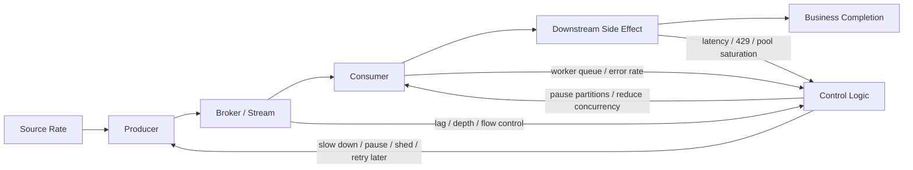
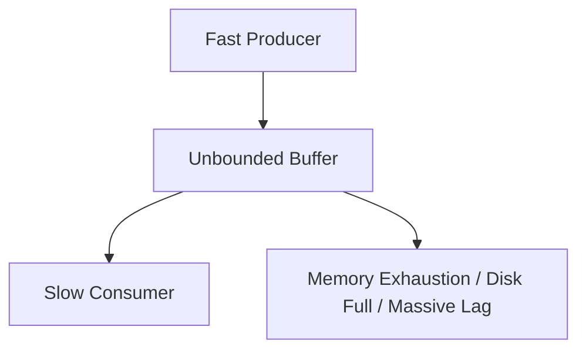
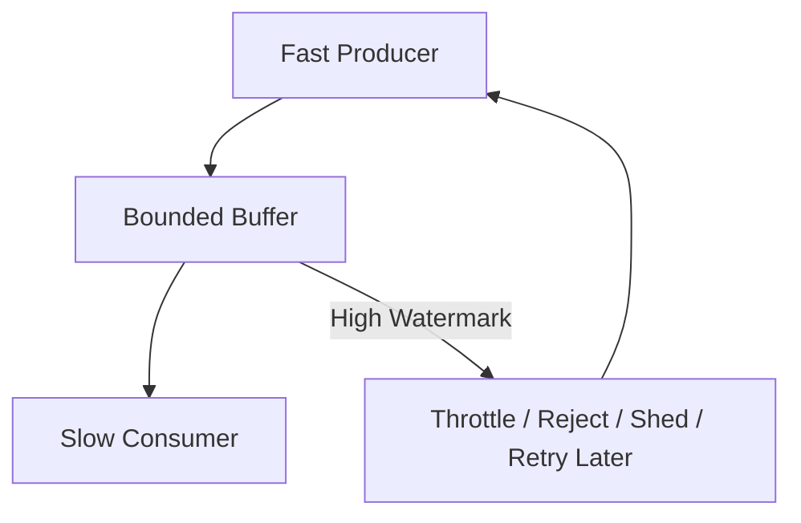
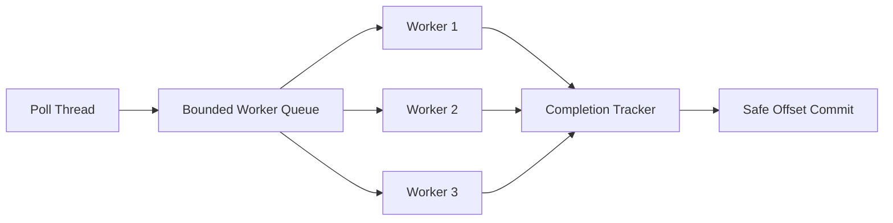
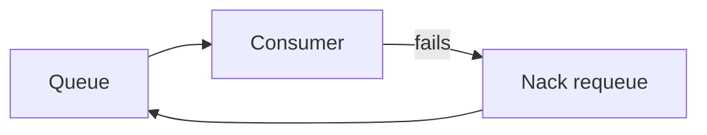
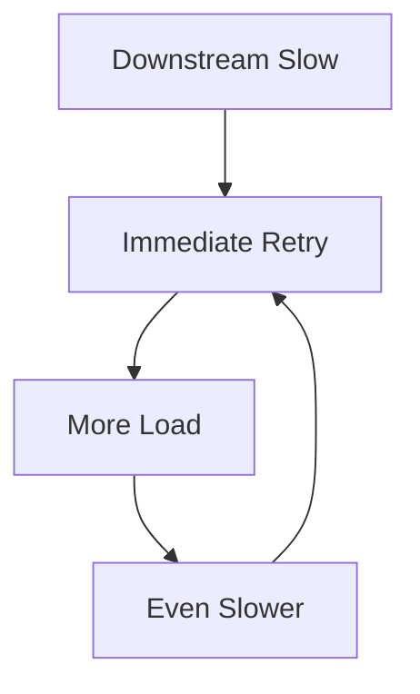
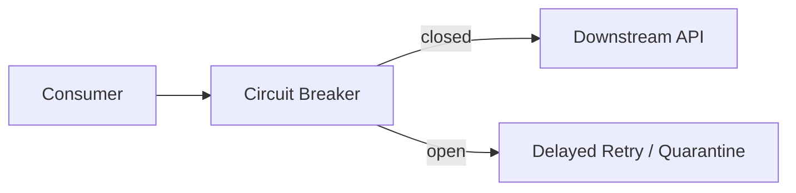

------
title: Learn Java Messaging and Event Streaming - Part 030
description: Backpressure and flow-control stability across Kafka, RabbitMQ, RabbitMQ Streams, JMS/Jakarta Messaging, Kafka Streams, and ksqlDB, with control-loop reasoning, metrics, alerts, and production runbooks.
series: learn-java-messaging-event-streaming
seriesTitle: Learn Java Messaging and Event Streaming
order: 30
partTitle: Backpressure and Flow Control: Keeping the System Stable Under Load
tags:
- java
- messaging
- event-streaming
- kafka
- rabbitmq
- rabbitmq-streams
- jms
- jakarta-messaging
- backpressure
- flow-control
- reliability
- operations
date: 2026-06-28
---

# Part 030 — Backpressure and Flow Control: Keeping the System Stable Under Load

## 1. What We Are Solving

Throughput tuning asks:

> How fast can the system move work?

Backpressure asks:

> What happens when some part of the system cannot keep up?

A messaging system without backpressure is not asynchronous. It is just delayed failure.

Backpressure is the set of mechanisms that prevents a fast upstream from overwhelming a slow downstream.

It can appear as:

- producer blocking
- send failure
- broker flow control
- queue depth growth
- Kafka consumer lag
- RabbitMQ unacknowledged deliveries
- stream offset lag
- worker queue saturation
- HTTP 429 / 503 from downstream
- database connection pool exhaustion
- load shedding
- circuit breaking
- retry budget exhaustion

A senior engineer treats backpressure as a control-loop problem, not as a single broker feature.

---

## 2. The Control-Loop Mental Model

A stable pipeline has feedback.



The feedback loop must answer:

1. What signal indicates pressure?
2. Where should pressure be applied?
3. How quickly should the system react?
4. What should be dropped, delayed, retried, or rejected?
5. How does the system recover when pressure subsides?

No single metric is enough.

Queue depth without consumer processing latency is ambiguous.

Consumer lag without downstream latency is ambiguous.

Broker memory without ingress/egress rate is ambiguous.

---

## 3. Stability Invariants

A system is stable when these invariants hold under expected load:

1. **Arrival rate does not permanently exceed service rate.**
2. **Buffers are bounded.**
3. **Retries do not amplify failure faster than recovery.**
4. **Consumer progress is observable.**
5. **Slow downstreams cannot exhaust broker/client memory.**
6. **Commit/ack happens only after durable processing.**
7. **Poison messages cannot block unrelated traffic forever.**
8. **Recovery after backlog is faster than normal arrival rate.**

The last invariant is often forgotten.

If the system receives 10,000 events/sec and can only process 10,200 events/sec, a one-hour outage may take days to catch up.

Recovery capacity matters.

---

## 4. Pressure Signals

Backpressure starts with measurement.

### 4.1 Kafka Signals

| Signal | Meaning | Warning |
|---|---|---|
| consumer lag by partition | records behind committed offset | average lag hides hot partitions |
| records-lag-max | worst partition lag | often better than group average |
| poll latency | time between polls | high value can trigger rebalances |
| processing latency | business work time | reveals downstream bottleneck |
| commit latency | offset commit cost | can affect progress visibility |
| rebalance count | group instability | may be caused by slow processing |
| producer buffer wait | producer blocked by buffer/metadata | upstream pressure |
| request latency | broker response time | broker or network pressure |
| under-replicated partitions | replication health | durability risk |

### 4.2 RabbitMQ Queue Signals

| Signal | Meaning | Warning |
|---|---|---|
| ready messages | messages waiting in queue | backlog |
| unacknowledged messages | delivered but not acked | consumer-side pressure |
| publish rate | producer ingress | compare with ack rate |
| deliver/get rate | broker egress | compare with ack rate |
| ack rate | completed processing | business progress proxy |
| redelivery rate | retries/requeues | poison or consumer instability |
| memory alarm | broker memory pressure | publishers may be blocked |
| disk alarm | broker disk pressure | publishers may be blocked |
| connection/channel count | client pressure | leaks or overload |

### 4.3 RabbitMQ Stream Signals

| Signal | Meaning |
|---|---|
| offset lag | consumer behind stream tail |
| publish confirm latency | producer write pressure |
| chunk/store latency | broker storage pressure |
| stream retention usage | replay horizon risk |
| superstream partition skew | key distribution problem |
| consumer active/inactive state | single-active-consumer behavior |

### 4.4 JMS Signals

JMS is an API, so signals depend on provider, but the model is consistent:

- destination depth
- delivery rate
- consumer count
- redelivery count
- transaction rollback count
- DLQ count
- session/thread pool usage
- connection pool usage
- transaction timeout
- MDB pool saturation
- provider memory/disk pressure

If your JMS provider dashboards do not expose these, you are operating partially blind.

---

## 5. Backpressure vs Buffering

Buffering is not backpressure.

Buffering says:

> I will hold excess work for later.

Backpressure says:

> I will slow or stop upstream because downstream cannot keep up.

A buffer without a pressure response only postpones failure.



A stable design has bounded buffers and explicit response.



---

## 6. Kafka Backpressure

Kafka backpressure appears in several places.

### 6.1 Producer-Side Pressure

Kafka producer has internal buffers. When records are produced faster than they can be sent and acknowledged, the buffer fills.

Possible symptoms:

- `send()` blocks waiting for buffer
- `max.block.ms` exceeded
- request latency increases
- retries increase
- record queue time increases
- application threads pile up

Engineering response:

- bound application ingress
- monitor producer buffer wait
- tune batching only after measuring
- fail fast when pressure exceeds SLA
- use outbox for durable local acceptance
- avoid unbounded in-memory queues in front of producer

Bad pattern:

```java
while (true) {
    inboundQueue.add(event); // unbounded
    producer.send(toRecord(event));
}
```

Better pattern:

```java
BlockingQueue<CaseEvent> inbound = new ArrayBlockingQueue<>(10_000);

boolean accepted = inbound.offer(event, 50, TimeUnit.MILLISECONDS);
if (!accepted) {
    throw new ServiceUnavailableException("event pipeline saturated");
}
```

The exact response depends on business semantics. A public API may return 503. An internal case-management command may persist to an outbox and process later. A telemetry system may shed low-priority events.

### 6.2 Consumer Lag Is a Symptom, Not a Diagnosis

Kafka lag means the consumer group has not committed offsets near the log end.

It does not tell you why.

Possible causes:

- consumer instances down
- processing slower than input
- downstream database saturated
- hot partition
- rebalance loop
- poison event blocks partition
- consumer commits disabled or failing
- `max.poll.records` too large for processing time
- insufficient partitions for parallelism
- state store/changelog pressure

Lag investigation must look at partition distribution, processing latency, and downstream health.

### 6.3 Pause/Resume

Kafka consumers can pause partitions.

This is useful when downstream capacity is temporarily saturated.

Conceptual pattern:

```java
while (running.get()) {
    if (workerQueue.remainingCapacity() < LOW_WATERMARK) {
        consumer.pause(consumer.assignment());
    } else if (workerQueue.remainingCapacity() > HIGH_WATERMARK) {
        consumer.resume(consumer.assignment());
    }

    ConsumerRecords<String, CaseEvent> records = consumer.poll(Duration.ofMillis(200));
    dispatch(records);
    commitSafeOffsets();
}
```

But pause/resume is not enough by itself.

The poll loop must keep running to maintain group membership. Paused partitions do not mean the consumer can stop polling indefinitely.

### 6.4 Bounded Worker Queue

A common high-throughput consumer architecture:



The queue must be bounded.

If it is unbounded, the application can OOM while Kafka lag appears lower than reality because records have been fetched into application memory.

This is a dangerous illusion:

> Moving backlog from Kafka into heap is not progress.

### 6.5 Commit Discipline Under Pressure

Under pressure, some teams commit offsets early to reduce lag.

This is wrong.

Committed offset means:

> This consumer group does not need these records again.

If the business side effect is not durable, early commit converts pressure into data loss.

Correct response under pressure:

- slow down consumption
- pause partitions
- scale consumers if safe
- shed low-priority work if business allows
- write to durable outbox/inbox
- quarantine poison events
- increase downstream capacity

Not:

- commit unprocessed work
- disable retries silently
- drop records without audit

---

## 7. RabbitMQ Backpressure

RabbitMQ has both consumer-side and broker-side pressure mechanisms.

### 7.1 Prefetch as Consumer Backpressure

Prefetch limits how many unacknowledged messages can be outstanding for a consumer/channel.

```java
int prefetch = 32;
channel.basicQos(prefetch);
```

A useful starting point:

```text
prefetch ≈ worker_concurrency × small_multiplier
```

For CPU-bound work:

```text
prefetch ≈ worker_count
```

For I/O-bound work:

```text
prefetch may be 2x-5x worker_count, if memory and duplicate exposure are acceptable
```

Do not choose prefetch only by throughput.

Choose it by:

- memory per message
- processing time variance
- duplicate replay window
- fairness across consumers
- downstream concurrency limit
- poison message behavior

### 7.2 Ready vs Unacked

RabbitMQ exposes two different forms of backlog:

- ready messages: waiting in queue
- unacked messages: delivered to consumers but not acknowledged

If ready grows, consumers are not receiving enough or not fast enough.

If unacked grows, consumers received messages but have not completed them.

These imply different fixes.

| Symptom | Likely Cause | Response |
|---|---|---|
| ready high, unacked low | not enough consumers or delivery limited | scale consumers, inspect prefetch/connectivity |
| ready low, unacked high | consumers slow or stuck | inspect processing/downstream |
| ready high, unacked high | total service rate below ingress | throttle producers, scale, shed, fix bottleneck |
| redelivered high | crash/requeue/poison | DLQ/quarantine, retry budget |

### 7.3 Requeue Storm

Bad pattern:

```java
channel.basicNack(deliveryTag, false, true); // requeue=true
```

If the failure is deterministic, the same message is immediately redelivered.

This can create a tight loop:



Better pattern:

- classify error
- retry with delay
- limit attempts
- dead-letter after budget
- quarantine poison messages
- avoid immediate infinite requeue

### 7.4 Broker Flow Control

RabbitMQ can apply flow control to publishing connections when internal components fall behind. It can also trigger memory or disk alarms, blocking publishers to protect the broker.

This is broker self-protection.

It is not a substitute for application-level admission control.

If broker flow control activates often, treat it as a capacity or design incident.

Possible causes:

- producers faster than queues can persist
- consumers too slow
- quorum replication under pressure
- disk I/O saturation
- huge messages
- excessive queue backlog
- too many connections/channels
- inefficient routing topology

Application response:

- observe blocked connection notifications where client supports them
- fail fast or persist to local outbox
- reduce publish concurrency
- shed optional traffic
- scale consumers if downstream allows
- increase broker/storage capacity if truly necessary

### 7.5 Queue Length Limits

Queue length limits are a form of hard pressure boundary.

They force a decision:

- reject new publishes
- drop/dead-letter older messages
- overflow by policy

Do not configure queue limits without business semantics.

For regulatory systems, silently dropping oldest messages is usually unacceptable.

Prefer:

- reject publish with visible failure
- route to DLX if explicitly approved
- apply upstream admission control
- classify lower-priority/non-audit telemetry separately

---

## 8. RabbitMQ Streams and Superstreams Backpressure

RabbitMQ Streams have stream-specific pressure concerns.

### 8.1 Offset Lag and Retention Horizon

In streams, backlog is usually offset lag.

But lag must be compared with retention.

A slow consumer is not only behind; it may eventually fall behind the retention horizon.

The dangerous condition:

```text
consumer_lag_time > remaining_retention_time
```

Then replay is no longer possible from the broker.

For audit or regulatory replay, this is a serious data-governance issue.

### 8.2 Superstream Skew

Superstreams partition data across streams.

If one partition receives most traffic, total consumer count does not matter much.

Symptoms:

- one partition lag grows
- other partitions idle
- single active consumer for hot partition saturated
- global throughput below expected capacity

Fixes:

- improve partition key
- split hot entity if business allows
- increase partition count with migration plan
- isolate high-volume tenant/entity
- use separate stream for special workload

### 8.3 Producer Confirm Latency

Stream producers should observe confirm latency.

If confirm latency rises, the producer may be outpacing broker append/replication/storage.

Increasing client-side batching may improve efficiency, but if disk or replication is saturated, it may only create larger bursts.

---

## 9. JMS / Jakarta Messaging Backpressure

JMS itself is an API. Backpressure behavior is provider/container-specific.

But the architectural levers are familiar:

- destination depth
- connection/session pool
- MDB pool size
- transaction timeout
- redelivery policy
- DLQ policy
- provider memory/disk limits
- producer send timeout
- consumer concurrency

### 9.1 MDB Pool Saturation

In Jakarta EE, MDBs hide consumer threading behind container configuration.

Symptoms:

- destination depth grows
- MDB active count reaches max
- transaction duration rises
- redelivery count increases
- database pool saturated

Bad fix:

> Increase MDB pool size.

Maybe this helps.

Maybe it destroys the database.

Correct analysis:

- Is the bottleneck CPU, DB, remote API, lock contention, or provider delivery?
- Does increasing concurrency preserve ordering?
- Does transaction timeout still hold?
- Is redelivery policy causing retry amplification?

### 9.2 Send-Side Pressure

Some JMS providers block or fail producers when broker resources are constrained.

Application code must not assume `send()` is always cheap.

For critical commands:

- persist command/event locally in outbox
- publish asynchronously from outbox worker
- mark publish status
- retry with bounded policy
- expose backlog as an operational metric

For optional notifications:

- reject or shed when saturated
- do not block core case lifecycle indefinitely

---

## 10. Kafka Streams and ksqlDB Backpressure

Stream processors have their own pressure dynamics.

### 10.1 Stateful Processor Pressure

Stateful topologies can be slowed by:

- state store I/O
- changelog topic writes
- repartition topics
- RocksDB compaction
- window retention
- large joins
- skewed keys
- output topic pressure

Input lag alone is insufficient.

You need:

- per-task lag
- processing rate
- commit latency
- state store metrics
- changelog lag
- restore time
- rebalance count
- output producer latency

### 10.2 ksqlDB Query Pressure

ksqlDB pressure can appear as:

- persistent query lag
- server CPU saturation
- state store growth
- internal topic backlog
- pull query latency
- failed query state
- rebalance/restore after scaling

Do not treat ksqlDB as “just SQL”.

Every persistent query is an always-running stream processor with state, offsets, internal topics, and failure behavior.

### 10.3 Scaling Is Not Always Immediate Relief

Adding instances can trigger rebalancing and state restore.

During restore, lag may temporarily worsen.

For stateful workloads, scale-out must account for:

- state size
- changelog throughput
- restore bandwidth
- standby replicas
- partition count
- host disk performance

---

## 11. Retry Amplification

Retries are a major source of instability.

If a downstream service slows down, naive consumers retry immediately.

This increases load on the failing dependency.



This is positive feedback.

Stable systems use negative feedback:

- exponential backoff with jitter
- retry budget
- circuit breaker
- delayed retry topic/queue
- DLQ/quarantine
- pause consumption
- reduce concurrency
- shed low-priority work

### 11.1 Retry Budget

Define retry budget explicitly:

```text
max_attempts = 5
initial_delay = 30s
max_delay = 30m
jitter = true
after_budget = quarantine
```

Do not retry forever in the hot consumer path.

### 11.2 Retry Placement

| Retry Placement | Works For | Risk |
|---|---|---|
| in-memory immediate retry | transient tiny failures | blocks partition/thread |
| delayed topic/queue | recoverable downstream issue | more topology complexity |
| DLQ/quarantine | poison or governance issue | needs replay tooling |
| outbox retry worker | external side effects | local backlog must be monitored |

---

## 12. Admission Control

Backpressure should start at the edge when possible.

If a service receives a command that will produce events, it needs admission control.

Options:

- synchronous rejection with 429/503
- local durable outbox acceptance
- priority queue
- tenant quota
- per-entity rate limit
- bulkhead by workload
- shed optional events

### 12.1 Regulatory Case Example

Not all events have the same priority.

| Workload | Backpressure Response |
|---|---|
| enforcement deadline event | preserve, queue, alert, never silently drop |
| audit event | preserve durably, fail closed if required |
| search projection update | delay acceptable |
| dashboard aggregation | delay or recompute acceptable |
| email notification | retry with budget, human-visible failure after budget |
| debug telemetry | shed under pressure |

A top-tier design classifies work before pressure happens.

---

## 13. Load Shedding

Load shedding means intentionally dropping or rejecting lower-value work to protect higher-value work.

It is not failure if it is part of the contract.

Examples:

- drop duplicate telemetry samples
- reject new batch import while enforcement events are overloaded
- delay report materialization
- reduce notification fan-out
- disable expensive enrichments temporarily

Never shed:

- audit trail events
- legal deadline state changes
- irreversible financial/regulatory decisions
- security-sensitive facts

Unless the business explicitly accepts that behavior and it is auditable.

---

## 14. Circuit Breakers and Bulkheads

Backpressure often crosses service boundaries.

If a consumer calls external services, add circuit breakers.



Bulkheads isolate failure.

Examples:

- separate consumer groups for high-priority and low-priority events
- separate queues per workload class
- separate executor pools per downstream dependency
- separate DB connection pools for ingestion vs query API
- separate Kafka topics for audit vs projection updates

Without bulkheads, a slow notification provider can consume all workers and delay legal case updates.

---

## 15. Watermarks and Hysteresis

A common control bug is oscillation.

Example:

- pause when worker queue > 80%
- resume when worker queue < 80%

This can flap rapidly.

Use hysteresis:

```text
pause when queue_usage >= 80%
resume when queue_usage <= 40%
```

```java
if (!paused && queueUsage() >= 0.80) {
    consumer.pause(consumer.assignment());
    paused = true;
}

if (paused && queueUsage() <= 0.40) {
    consumer.resume(consumer.assignment());
    paused = false;
}
```

Hysteresis makes the system stable.

---

## 16. Backpressure Design by Platform

### 16.1 Kafka

Primary levers:

- producer `buffer.memory`, `max.block.ms`, request timeout, delivery timeout
- consumer `pause()` / `resume()`
- bounded worker queue
- partition count and consumer count
- retry topics
- DLQ/quarantine
- admission control at producing service
- scaling consumer groups
- downstream concurrency limit

Primary signals:

- lag by partition
- records consumed/sec
- processing latency
- commit latency
- rebalance count
- producer buffer wait
- request latency
- under-replicated partitions

### 16.2 RabbitMQ Queues

Primary levers:

- prefetch
- manual ack
- consumer concurrency
- queue length limit
- publisher confirms
- mandatory routing
- flow-control/block notifications
- DLX and delayed retry
- separate queues by workload class

Primary signals:

- ready messages
- unacked messages
- publish/deliver/ack rates
- redelivery rate
- memory/disk alarms
- blocked connection state
- queue growth rate

### 16.3 RabbitMQ Streams

Primary levers:

- consumer offset tracking interval
- superstream partition count
- single active consumer grouping
- producer batching/sub-entry batching
- retention configuration
- partition key design

Primary signals:

- offset lag
- confirm latency
- partition skew
- retention horizon
- stream disk usage

### 16.4 JMS / Jakarta Messaging

Primary levers:

- provider destination limits
- producer send timeout
- consumer concurrency
- MDB pool size
- transaction timeout
- redelivery policy
- DLQ policy
- connection/session pool

Primary signals:

- destination depth
- redelivery count
- DLQ count
- transaction rollback
- MDB active/max pool usage
- provider memory/disk pressure

### 16.5 Kafka Streams / ksqlDB

Primary levers:

- partition count
- application instances
- stream threads
- state-store cache
- commit interval
- repartition avoidance
- standby replicas
- query decomposition

Primary signals:

- task lag
- processing rate
- state store size
- changelog lag
- restore time
- query status
- output producer latency

---

## 17. Runbook: Consumer Lag Explosion

### Symptom

Kafka consumer lag grows quickly.

### Questions

1. Is lag growing on all partitions or one partition?
2. Did ingress increase?
3. Did consumer processing latency increase?
4. Did downstream DB/API latency increase?
5. Did rebalances start?
6. Are there poison events?
7. Are commits succeeding?
8. Did deployment/config change?

### Actions

1. Check partition-level lag.
2. Check consumer logs for processing exceptions.
3. Check downstream dependency saturation.
4. Check rebalance metrics.
5. Pause affected partitions if downstream is overloaded.
6. Route poison events to quarantine if deterministic.
7. Scale consumers only if partitions and downstream allow it.
8. Estimate catch-up time:

```text
catch_up_time = backlog / (processing_rate - arrival_rate)
```

If processing rate is not greater than arrival rate, scaling or shedding is required.

---

## 18. Runbook: RabbitMQ Queue Growth

### Symptom

Queue ready count grows.

### Questions

1. Is publish rate higher than ack rate?
2. Are consumers connected?
3. Is unacked count high?
4. Are consumers blocked on downstream?
5. Is redelivery rate high?
6. Are memory/disk alarms active?
7. Did prefetch or consumer count change?

### Actions

1. Compare publish/deliver/ack rates.
2. Inspect ready vs unacked.
3. If unacked high, inspect consumer processing and downstream.
4. If ready high and unacked low, inspect delivery/consumer count/prefetch.
5. If redelivery high, stop requeue storm and quarantine poison messages.
6. If broker alarms active, reduce publish pressure and inspect disk/memory.
7. Scale consumers only if downstream capacity is available.

---

## 19. Runbook: Downstream Database Saturation

### Symptom

Consumer lag or queue depth grows, while DB connection pool and write latency are high.

### Bad response

- increase consumer count
- increase prefetch
- increase batch size blindly

This makes the database worse.

### Better response

1. Reduce consumer concurrency or pause consumption.
2. Preserve unprocessed work in broker/log.
3. Enable delayed retry for transient write failures.
4. Increase DB batch efficiency if safe.
5. Add indexes/partitioning only after query/write analysis.
6. Split read/write workloads.
7. Add idempotent projection writes.
8. Catch up after DB recovers using controlled concurrency.

---

## 20. Backpressure Testing

You must test pressure deliberately.

### 20.1 Test Cases

| Test | Expected Behavior |
|---|---|
| consumer slowed to 10% speed | lag/depth grows, producer remains bounded |
| downstream returns 503 | retry budget used, no infinite hot loop |
| broker disk near full | publishers blocked/rejected visibly |
| worker queue full | consumer pauses or rejects new work |
| one hot key dominates | one partition/stream shows skew |
| poison event appears | isolated to DLQ/quarantine |
| consumer crashes with unacked batch | duplicate window matches design |
| backlog replay | catch-up time within target |

### 20.2 What Good Looks Like

A good test proves:

- buffers do not grow unbounded
- critical work is preserved
- optional work is shed or delayed
- dashboards identify bottleneck
- alerts fire before data loss risk
- recovery is controlled
- duplicate/retry behavior is acceptable

---

## 21. Alert Design

Alert on leading indicators, not only user-visible failure.

### 21.1 Kafka Alerts

- partition lag above threshold for N minutes
- lag growth rate positive for N minutes
- consumer processing latency above SLO
- rebalance count spike
- commit failures
- producer buffer exhaustion
- request timeout spike
- under-replicated partitions

### 21.2 RabbitMQ Alerts

- ready messages above threshold
- unacked messages above threshold
- redelivery rate spike
- memory alarm
- disk alarm
- blocked connection
- DLQ growth
- queue growth rate above ack rate

### 21.3 Stream Processing Alerts

- query/task failed
- state restore taking too long
- changelog lag high
- state store disk usage high
- output topic lag/producer latency high

### 21.4 Business Alerts

Technical lag is not enough.

Add business-level alerts:

- enforcement deadline events not processed within SLA
- audit event persistence delay
- notice issuance delay
- escalation projection stale
- case status materialized view lag

---

## 22. The Regulatory Defensibility Angle

In regulatory systems, pressure handling is not merely performance engineering.

It affects defensibility.

You need to prove:

- which events were accepted
- which were delayed
- which were retried
- which were quarantined
- which were rejected
- why a deadline-related action was delayed
- whether audit events were preserved
- whether projections were stale at decision time

Therefore, pressure response must be auditable.

A dashboard saying “lag was high” is not enough.

You need event-level and workflow-level causality.

---

## 23. Common Anti-Patterns

### 23.1 Unbounded In-Memory Queue

This moves broker backlog into JVM heap.

It reduces visible lag while increasing crash risk.

### 23.2 Early Ack to Reduce Queue Depth

This creates business data loss when processing fails after ack.

### 23.3 Infinite Immediate Retry

This turns downstream failure into retry amplification.

### 23.4 Scaling Consumers Against a Saturated Database

This increases concurrency against the bottleneck and worsens latency.

### 23.5 Ignoring Hot Partitions

Average lag can look fine while one entity class is hours behind.

### 23.6 Treating DLQ as Trash

DLQ/quarantine is part of the operational workflow, not a garbage bin.

### 23.7 No Retention-Horizon Alert

For streams/logs, slow consumers can fall behind retention and lose replay capability.

---

## 24. Design Checklist

Before production, confirm:

- [ ] Every buffer has a size limit.
- [ ] Every retry has a budget.
- [ ] Every pressure signal has an owner.
- [ ] Consumer commit/ack happens after durable processing.
- [ ] Producer pressure is visible.
- [ ] Broker flow control is alerted.
- [ ] Downstream saturation reduces consumption.
- [ ] Optional work can be shed or delayed.
- [ ] Critical work is preserved durably.
- [ ] Hot partition/key detection exists.
- [ ] DLQ/quarantine has replay tooling.
- [ ] Retention horizon is monitored.
- [ ] Catch-up time is estimated and tested.
- [ ] Runbooks include pressure-specific actions.
- [ ] Business-level lag is visible.

---

## 25. Summary

Backpressure is the difference between graceful degradation and uncontrolled collapse.

The mature mental model:

- lag is a symptom, not the root cause
- queue depth is a buffer, not progress
- unacked messages are in-flight risk
- retries can amplify failure
- broker flow control is self-protection, not architecture
- bounded buffers are mandatory
- pressure must propagate to the correct upstream boundary
- critical and optional work must be classified before overload

The best messaging systems are not the ones that never slow down.

They are the ones that slow down safely, visibly, and according to business priority.

In the next part, we will go deeper into idempotency, deduplication, inbox/outbox, and transactional messaging—the correctness foundation that makes batching, retry, replay, and backpressure survivable.

---

## References

- Apache Kafka Documentation — producer/consumer configuration, consumer groups, offset management, and event streaming design.
- RabbitMQ Documentation — consumer acknowledgements, publisher confirms, consumer prefetch, flow control, memory and disk alarms, streams and superstreams.
- Jakarta Messaging / JMS API Documentation — session, transaction, acknowledgement, producer/consumer contracts.
- ksqlDB Documentation — monitoring, persistent query lag, high availability, and operations.
