------
title: Learn Java Messaging and Event Streaming - Part 031
description: Idempotency, deduplication, inbox/outbox, transactional messaging, external side-effect protection, and regulatory-grade reliability across JMS, Kafka, RabbitMQ, RabbitMQ Streams, Kafka Streams, and ksqlDB.
series: learn-java-messaging-event-streaming
seriesTitle: Learn Java Messaging and Event Streaming
order: 31
partTitle: Idempotency, Deduplication, Inbox/Outbox, and Transactional Messaging
tags:
- java
- messaging
- event-streaming
- idempotency
- deduplication
- outbox
- inbox
- kafka
- rabbitmq
- jms
- transactional-messaging
- reliability
- distributed-systems
date: 2026-06-28
---

# Part 031 — Idempotency, Deduplication, Inbox/Outbox, and Transactional Messaging

## 1. What We Are Solving

A messaging system can acknowledge delivery.

It cannot automatically prove that the business effect happened exactly once.

That distinction is the center of this part.

When a service consumes a message, it usually performs one or more side effects:

- update a database
- call another service
- publish another message
- send an email
- create a payment instruction
- update a search index
- advance a case state
- write an audit entry
- trigger an SLA timer

The broker can help with transport safety, but the application owns the business invariant.

The invariant is not:

> The broker delivered once.

The invariant is:

> For the same business operation, the system converges to one correct business effect, even if the message is delivered, processed, retried, replayed, or observed multiple times.

That is why senior messaging design starts with idempotency.

---

## 2. Kaufman Deconstruction

Using Kaufman's skill acquisition approach, this part decomposes transactional messaging into small subskills.

| Subskill | What To Learn | Practice Output |
|---|---|---|
| Identify side effects | Find every irreversible action after message consumption | Side-effect map |
| Design message identity | Separate event ID, command ID, aggregate ID, sequence, correlation ID | Envelope contract |
| Make consumers idempotent | Ensure duplicate delivery does not duplicate business effect | Inbox table or natural idempotency |
| Avoid dual writes | Persist state and outgoing event atomically | Outbox table |
| Relay safely | Publish outbox rows using polling or CDC | Relay runbook |
| Understand transaction boundaries | Know what Kafka/JMS/RabbitMQ transactions do and do not cover | Boundary matrix |
| Protect external effects | Prevent duplicate email/payment/API calls | External idempotency strategy |
| Replay safely | Reprocess events without corrupting state | Replay checklist |

The deliberate practice is not writing a generic helper class. It is taking one end-to-end business flow and forcing it through failure scenarios.

---

## 3. Core Mental Model: Messages Are Not State Changes

A message is evidence that something should be processed or that something happened.

A state change is the durable result in the owning system.

A side effect is any externally visible action caused by processing.

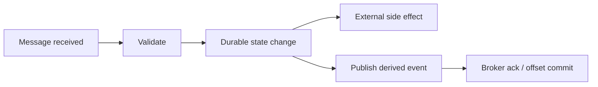

There are many crash points:

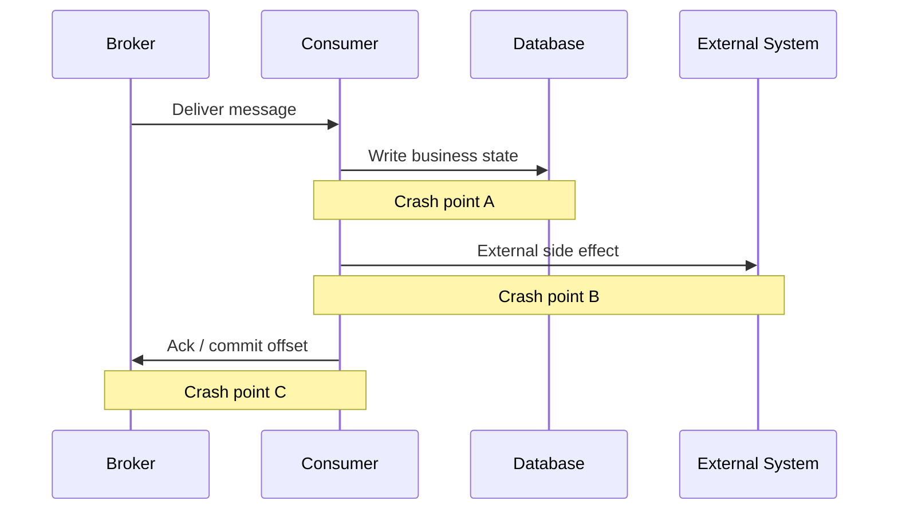

If the consumer crashes after the database write but before the ack, the broker may redeliver.

If the consumer crashes after an email is sent but before the processed marker is stored, the email may be sent again.

If the producer writes database state but crashes before publishing an event, the rest of the system may never learn about the state change.

These are not edge cases. These are normal distributed-system states.

---

## 4. Vocabulary That Must Stay Separate

| Term | Meaning | Common Mistake |
|---|---|---|
| Message ID | Identity of this physical message/envelope | Treating broker message ID as business operation ID |
| Event ID | Identity of a domain fact | Generating a new event ID on retry |
| Command ID | Identity of a requested operation | Missing idempotency for repeated command submission |
| Aggregate ID | Entity whose ordered history matters | Using random key and losing per-entity order |
| Correlation ID | Groups related work under one business journey | Using it as dedup key |
| Causation ID | Identifies the event/command that caused this one | Omitting it, making debugging causal chains difficult |
| Sequence number | Per-aggregate ordering/version marker | Assuming broker offset equals business version |
| Idempotency key | Key used to detect duplicate operation | Making it too broad or too narrow |
| Offset | Consumer position in a log/stream | Treating it as business completion proof |
| Ack | Consumer confirmation to broker | Treating it as external side-effect completion proof |

A production-grade event envelope should make these identities explicit.

```json
{
  "eventId": "01JZK8K3SX6N2QZ1M9F3H4R7C2",
  "eventType": "CaseEscalated",
  "eventVersion": 3,
  "aggregateType": "RegulatoryCase",
  "aggregateId": "CASE-2026-000981",
  "aggregateVersion": 42,
  "correlationId": "CORR-2026-06-28-00017",
  "causationId": "01JZK8JZ91S4T85X3VK7T9YHF6",
  "idempotencyKey": "case:CASE-2026-000981:escalate:v42",
  "occurredAt": "2026-06-28T10:15:30Z",
  "producer": "case-lifecycle-service",
  "payload": {
    "fromStatus": "UNDER_REVIEW",
    "toStatus": "ESCALATED",
    "reasonCode": "SLA_BREACH"
  }
}
```

For regulatory systems, `aggregateVersion`, `correlationId`, and `causationId` are not decoration. They are how you later prove why a state transition happened.

---

## 5. Idempotency: The Algebraic View

An operation is idempotent when applying it multiple times has the same effect as applying it once.

```text
f(f(x)) = f(x)
```

Examples:

| Operation | Idempotent? | Why |
|---|---:|---|
| `set case.status = ESCALATED` | Usually yes | Repeating the same assignment preserves the same value |
| `insert audit row with random ID` | No | Duplicate rows appear |
| `increment violation_count` | No | Counter increments again |
| `create payment instruction` | No unless keyed | Duplicate payment instruction may be created |
| `upsert projection by eventId` | Yes | Same event replaces same row |
| `send email` | No unless external provider supports idempotency key | Same email may be delivered repeatedly |
| `publish event with same eventId` | Transport may duplicate, but business identity can remain dedupable | Consumers need eventId discipline |

There are two broad forms.

### 5.1 Natural Idempotency

The business operation is naturally a convergent assignment.

```sql
UPDATE cases
SET status = 'ESCALATED',
    status_reason = 'SLA_BREACH'
WHERE case_id = 'CASE-2026-000981'
  AND status <> 'ESCALATED';
```

Natural idempotency is good, but rarely enough. You still need to prove whether a duplicate was ignored or whether a stale command was rejected.

### 5.2 Recorded Idempotency

The system stores a marker for a processed operation.

```sql
CREATE TABLE processed_message (
    consumer_name      VARCHAR(120) NOT NULL,
    message_id         VARCHAR(120) NOT NULL,
    aggregate_type     VARCHAR(80)  NOT NULL,
    aggregate_id       VARCHAR(120) NOT NULL,
    first_seen_at      TIMESTAMP    NOT NULL,
    processed_at       TIMESTAMP,
    status             VARCHAR(32)  NOT NULL,
    result_hash        VARCHAR(128),
    error_code         VARCHAR(80),
    PRIMARY KEY (consumer_name, message_id)
);
```

A duplicate delivery attempts to insert the same key. The database rejects it. The consumer can then safely skip or inspect status.

---

## 6. Deduplication Is Not Idempotency

Deduplication detects that two deliveries represent the same operation.

Idempotency ensures the operation can be applied safely more than once.

You often need both.

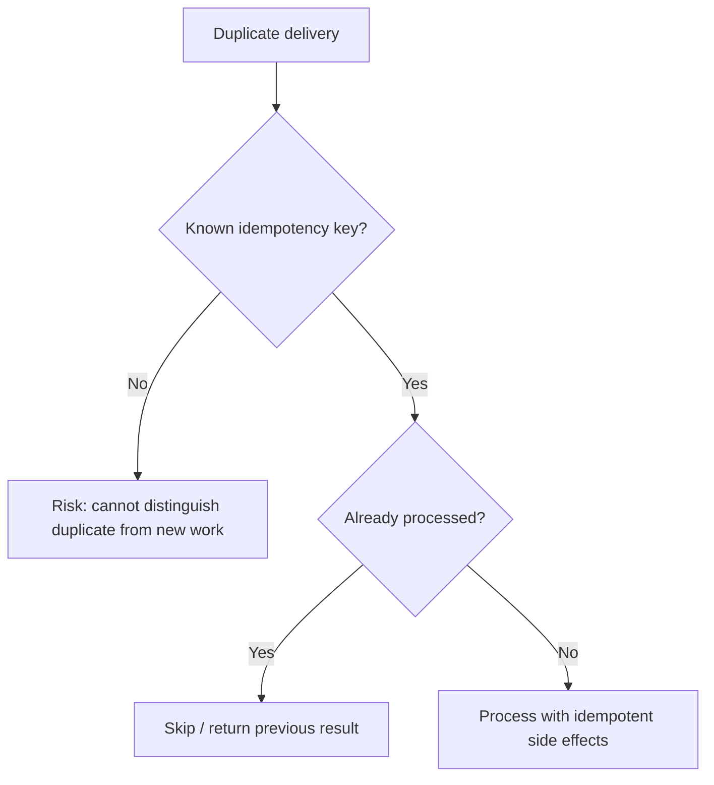

Dedup without idempotency is fragile. A dedup store can fail, expire too early, or miss a semantically duplicate operation with a new physical message ID.

Idempotency without dedup can be expensive. The system may repeatedly recompute expensive work.

The target design is:

> Stable identity + duplicate detection + idempotent state transition + safe side-effect boundary.

---

## 7. The Dual-Write Problem

The dual-write problem appears when a service must update local state and publish a message, but those writes are not in the same atomic transaction.

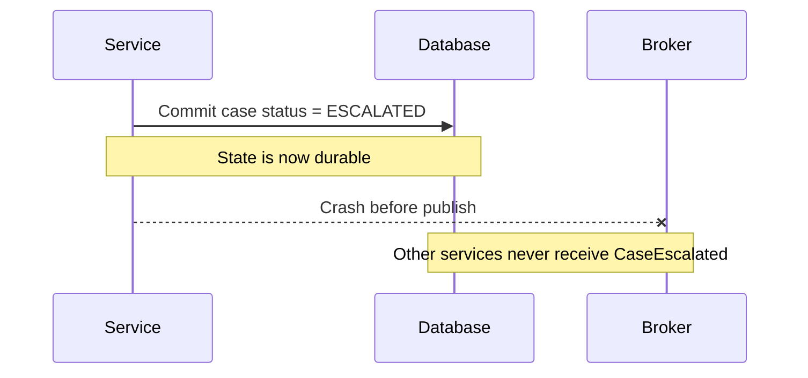

The reverse failure also exists.

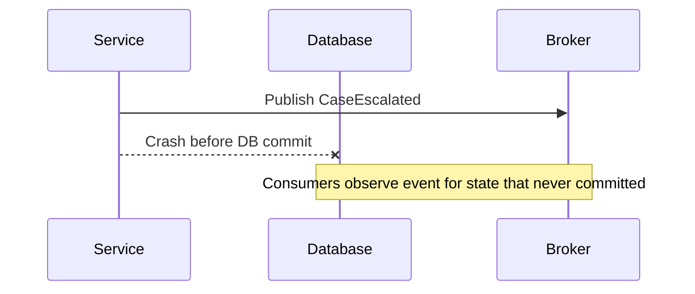

This is why “just publish after save” is not a reliability strategy.

---

## 8. Outbox Pattern

The outbox pattern stores the outgoing event in the same database transaction as the business state change.

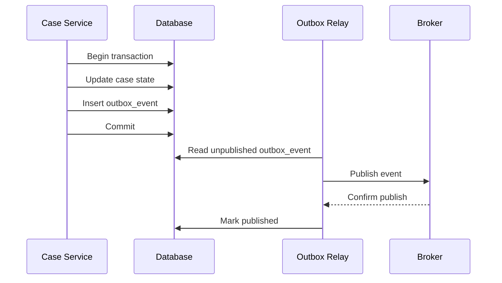

The crucial invariant:

> If the business state commits, the event to describe it also commits.

A typical outbox schema:

```sql
CREATE TABLE outbox_event (
    event_id           VARCHAR(120) PRIMARY KEY,
    aggregate_type     VARCHAR(80)  NOT NULL,
    aggregate_id       VARCHAR(120) NOT NULL,
    aggregate_version  BIGINT       NOT NULL,
    event_type         VARCHAR(120) NOT NULL,
    event_version      INT          NOT NULL,
    correlation_id     VARCHAR(120),
    causation_id       VARCHAR(120),
    partition_key      VARCHAR(120) NOT NULL,
    payload_json       CLOB         NOT NULL,
    headers_json       CLOB,
    created_at         TIMESTAMP    NOT NULL,
    published_at       TIMESTAMP,
    publish_attempts   INT          NOT NULL DEFAULT 0,
    last_error         VARCHAR(4000),
    status             VARCHAR(32)  NOT NULL DEFAULT 'PENDING'
);

CREATE INDEX idx_outbox_pending
ON outbox_event(status, created_at);

CREATE UNIQUE INDEX uq_outbox_aggregate_version
ON outbox_event(aggregate_type, aggregate_id, aggregate_version, event_type);
```

The unique aggregate/version index prevents accidental double event creation for the same state transition.

---

## 9. Java Service Boundary With Outbox

This example is intentionally plain Java style. The important part is not the framework; the important part is transaction shape.

```java
public final class EscalateCaseHandler {
    private final CaseRepository caseRepository;
    private final OutboxRepository outboxRepository;
    private final Clock clock;

    public void handle(EscalateCaseCommand command) {
        // Must run in one database transaction.
        CaseRecord current = caseRepository.findForUpdate(command.caseId())
                .orElseThrow(() -> new IllegalArgumentException("case not found"));

        if (current.status() == CaseStatus.ESCALATED) {
            return; // natural idempotency
        }

        long nextVersion = current.version() + 1;

        CaseRecord updated = current.escalate(
                command.reasonCode(),
                command.requestedBy(),
                nextVersion,
                clock.instant()
        );

        caseRepository.save(updated);

        OutboxEvent event = OutboxEvent.builder()
                .eventId(command.eventId())
                .eventType("CaseEscalated")
                .eventVersion(3)
                .aggregateType("RegulatoryCase")
                .aggregateId(command.caseId())
                .aggregateVersion(nextVersion)
                .partitionKey(command.caseId())
                .correlationId(command.correlationId())
                .causationId(command.commandId())
                .payloadJson(toJson(new CaseEscalatedPayload(
                        command.caseId(),
                        current.status().name(),
                        updated.status().name(),
                        command.reasonCode(),
                        clock.instant()
                )))
                .createdAt(clock.instant())
                .build();

        outboxRepository.insert(event);
    }
}
```

The handler does not publish directly.

It produces durable intent to publish.

---

## 10. Outbox Relay Options

There are two common relay models.

### 10.1 Polling Publisher

A worker polls pending outbox rows, publishes them, waits for broker confirmation, then marks them published.

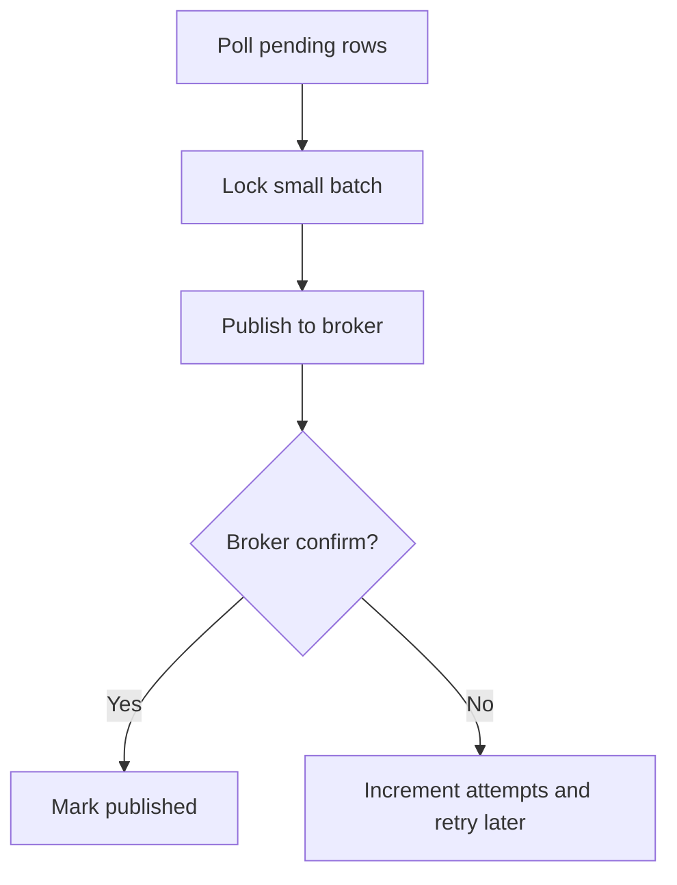

Example SQL pattern:

```sql
SELECT *
FROM outbox_event
WHERE status = 'PENDING'
ORDER BY created_at
FETCH FIRST 100 ROWS ONLY
FOR UPDATE SKIP LOCKED;
```

The relay must be idempotent because it can publish and crash before marking a row as published. Consumers must deduplicate by `event_id`.

### 10.2 CDC Relay

A change data capture connector reads database transaction logs and emits inserted outbox rows.

This avoids high-frequency polling and can preserve commit order better depending on database and connector configuration.

Typical CDC outbox shape:

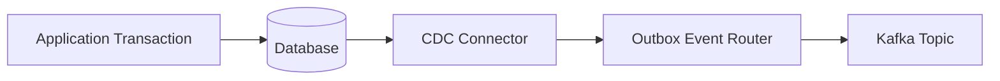

CDC does not remove the need for consumer idempotency. It improves publication reliability by making the database log the source of truth for outgoing events.

---

## 11. Outbox Relay Failure Matrix

| Failure | Result | Required Protection |
|---|---|---|
| App commits state but crashes before direct publish | Event lost | Outbox |
| App publishes before DB commit then DB rolls back | Phantom event | Outbox |
| Relay publishes then crashes before marking published | Duplicate publish later | Stable event ID + consumer dedup |
| Relay marks published before broker confirm | Event may be lost | Confirm before mark published |
| Broker accepts publish but downstream duplicate occurs | Duplicate business effect | Consumer inbox/idempotency |
| Outbox table grows without cleanup | Storage incident | Retention/archive policy |
| Relay stuck on poison row | Head-of-line blocking | Attempt budget + quarantine |
| CDC connector down | Publication lag grows | Outbox lag alert |

The outbox pattern changes the problem from “lost event” to “event may be published more than once”. That is a good trade because duplicates are manageable with idempotency; lost state-change events are often unrecoverable without audit reconstruction.

---

## 12. Inbox Pattern

The inbox pattern stores the identity of consumed messages before or during processing.

It is the consumer-side counterpart to outbox.

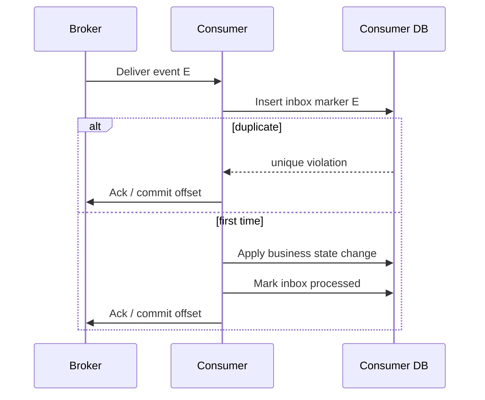

Basic schema:

```sql
CREATE TABLE inbox_message (
    consumer_name      VARCHAR(120) NOT NULL,
    message_id         VARCHAR(120) NOT NULL,
    source_system      VARCHAR(120) NOT NULL,
    aggregate_type     VARCHAR(80),
    aggregate_id       VARCHAR(120),
    correlation_id     VARCHAR(120),
    received_at        TIMESTAMP    NOT NULL,
    started_at         TIMESTAMP,
    processed_at       TIMESTAMP,
    status             VARCHAR(32)  NOT NULL,
    retry_count        INT          NOT NULL DEFAULT 0,
    result_hash        VARCHAR(128),
    error_code         VARCHAR(80),
    error_message      VARCHAR(1000),
    PRIMARY KEY (consumer_name, message_id)
);
```

The `consumer_name` is part of the key because two independent consumers may legitimately process the same event.

---

## 13. Inbox Processing Strategies

### 13.1 Insert-First Strategy

1. Insert inbox marker with `RECEIVED`.
2. Apply business change.
3. Mark `PROCESSED`.
4. Ack/commit.

Good for detecting duplicates early.

Risk: crash after inserting marker but before business update. You need a recovery rule for `RECEIVED` or `STARTED` rows.

### 13.2 Insert-and-Process in One Transaction

1. Begin DB transaction.
2. Insert inbox marker.
3. Apply business change.
4. Mark processed.
5. Commit DB transaction.
6. Ack/commit broker.

This is usually the default for database-local side effects.

### 13.3 Claim-and-Resume Strategy

Use status transitions:

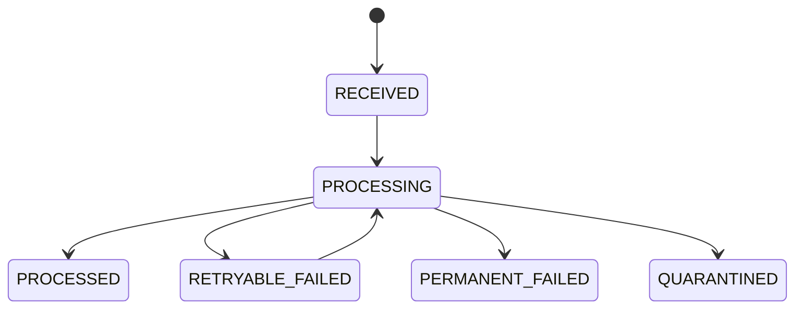

This is useful when processing may take longer than one transaction or involves external side effects.

---

## 14. Idempotent Consumer Algorithm

A robust consumer follows a predictable shape.

```java
public final class CaseProjectionConsumer {
    private final InboxRepository inboxRepository;
    private final CaseProjectionRepository projectionRepository;

    public ProcessingResult handle(EventEnvelope<CaseEscalatedPayload> event) {
        try {
            inboxRepository.insertReceived(
                    "case-projection-consumer",
                    event.eventId(),
                    event.aggregateType(),
                    event.aggregateId(),
                    event.correlationId()
            );
        } catch (DuplicateKeyException duplicate) {
            return ProcessingResult.duplicateAlreadyHandled();
        }

        try {
            projectionRepository.upsertCaseStatus(
                    event.aggregateId(),
                    event.payload().toStatus(),
                    event.aggregateVersion(),
                    event.occurredAt()
            );

            inboxRepository.markProcessed("case-projection-consumer", event.eventId());
            return ProcessingResult.processed();
        } catch (RuntimeException e) {
            inboxRepository.markFailed("case-projection-consumer", event.eventId(), classify(e), e.getMessage());
            throw e;
        }
    }
}
```

For Kafka, offset commit happens after this function succeeds.

For RabbitMQ, `basicAck` happens after this function succeeds.

For JMS, acknowledgement or transaction commit happens after this function succeeds.

---

## 15. External Side Effects Are the Hard Part

Database-local idempotency is relatively easy. External side effects are harder.

Examples:

- send email
- submit payment
- call third-party regulatory gateway
- send SMS
- create ticket in another SaaS system
- trigger manual review workflow in a remote system

You need one of these strategies.

### 15.1 External Idempotency Key

Many APIs accept an idempotency key.

```http
POST /payment-instructions
Idempotency-Key: case:CASE-2026-000981:penalty-payment:v3
```

The external system returns the same result for retries with the same key.

### 15.2 Local Side-Effect Ledger

When the external system does not support idempotency, store local intent and result.

```sql
CREATE TABLE side_effect_ledger (
    effect_id          VARCHAR(120) PRIMARY KEY,
    effect_type        VARCHAR(80)  NOT NULL,
    aggregate_id       VARCHAR(120) NOT NULL,
    idempotency_key    VARCHAR(200) NOT NULL UNIQUE,
    status             VARCHAR(32)  NOT NULL,
    request_hash       VARCHAR(128) NOT NULL,
    external_ref       VARCHAR(200),
    first_attempt_at   TIMESTAMP    NOT NULL,
    completed_at       TIMESTAMP,
    last_error         VARCHAR(1000)
);
```

The consumer first claims the side effect, then executes it, then records the external reference.

This does not magically prevent duplicates if the external call succeeds and the response is lost. It gives you a reconciliation point.

### 15.3 Human-Reconciled Effects

For irreversible regulatory actions, the correct design may be:

1. create pending side-effect record
2. require review/approval
3. send once
4. reconcile with external receipt
5. mark evidence in audit trail

Do not automate irreversible actions behind invisible retries unless the external idempotency contract is strong.

---

## 16. Kafka Transactional Messaging

Kafka supports idempotent producers and transactions.

The useful consume-process-produce shape is:

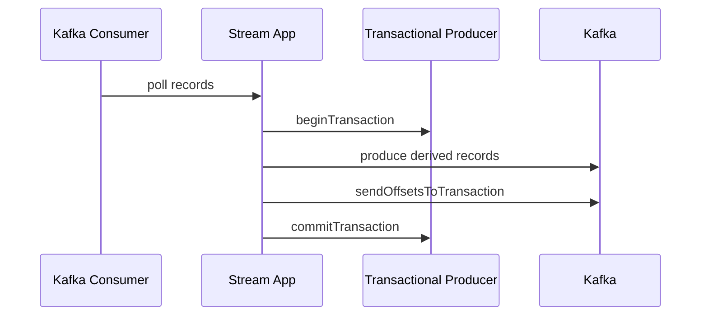

This can atomically commit produced Kafka records and consumed offsets within Kafka.

It does not automatically include:

- your application database
- an HTTP call
- an email provider
- a payment provider
- a file write
- a search index outside the transaction

Therefore:

| Work Shape | Kafka Transaction Enough? | Why |
|---|---:|---|
| consume Kafka → produce Kafka | Usually yes | Offsets and output records can be committed together |
| consume Kafka → update database | No | Database is outside Kafka transaction |
| consume Kafka → call external API → produce Kafka | No | External API is outside Kafka transaction |
| database transaction → publish Kafka | No by itself | Use outbox/CDC or XA-like infrastructure with caution |
| Kafka Streams state store/changelog processing | Often yes within Streams boundary | State, changelog, and offsets are coordinated by Streams runtime |

Exactly-once semantics are scoped. They are not universal immunity against duplicates.

---

## 17. JMS Transaction Boundaries

JMS/Jakarta Messaging can use:

- non-transacted session with acknowledgement modes
- transacted session
- container-managed transaction in Jakarta EE
- XA/JTA transaction when broker and database participate

A local JMS transaction can coordinate send/receive acknowledgement within the JMS provider.

A JTA/XA transaction can coordinate broker and database, but it introduces operational cost:

- two-phase commit complexity
- heuristic outcomes
- blocking resource managers
- transaction recovery configuration
- broker/provider-specific behavior
- hard-to-debug production failures

For many modern systems, outbox/inbox is operationally simpler than broad XA.

Use XA when the organization already has mature operational support and the consistency requirement justifies the cost.

---

## 18. RabbitMQ Reliability Boundary

RabbitMQ has publisher confirms and consumer acknowledgements.

They are orthogonal.

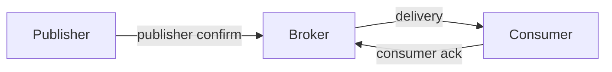

Publisher confirms prove broker-side acceptance according to queue/stream semantics.

Consumer acknowledgements prove the consumer tells the broker the delivery was handled.

Neither proves your database write happened unless your code orders operations correctly.

Correct consumer ordering:

1. receive delivery
2. validate
3. apply idempotent durable side effect
4. commit local transaction
5. ack message

Wrong consumer ordering:

1. receive delivery
2. ack message
3. try side effect
4. crash

The wrong ordering loses work.

---

## 19. RabbitMQ Streams and Deduplication

RabbitMQ Streams support stream-oriented publishing/consuming, offset tracking, and publisher-side deduplication concepts based on producer identity and publishing sequence.

That helps prevent some producer duplicate writes into a stream.

It does not remove consumer idempotency because:

- consumers can be restarted
- offsets can be reset
- multiple consumer applications may process the same stream
- business duplicate semantics may differ from physical publish duplicate semantics
- external side effects are still outside stream storage

Use stream dedup as transport-level optimization. Use inbox/idempotency as business-level protection.

---

## 20. Idempotency Key Design

A good idempotency key should be:

- stable across retries
- scoped to the business operation
- not reused across different operations
- easy to audit
- available before side effects begin
- independent of broker-generated delivery identity

Examples:

| Use Case | Good Key | Bad Key |
|---|---|---|
| Escalate case once for version 42 | `case:CASE-1:escalate:v42` | random UUID generated on each retry |
| Submit penalty payment | `penalty:ORDER-9:submit:v1` | Kafka offset |
| Send SLA breach email | `email:case:CASE-1:sla-breach:v3` | recipient email only |
| Build projection row | `eventId` or `aggregateId + version` | current timestamp |
| Create audit entry | `eventId + auditType` | auto-increment row ID only |

Do not use correlation ID as idempotency key. Correlation ID groups a journey; it is too broad.

---

## 21. Aggregate Version as a Defensive Boundary

For ordered domain flows, use aggregate version.

```sql
UPDATE case_projection
SET status = ?,
    aggregate_version = ?,
    updated_at = ?
WHERE case_id = ?
  AND aggregate_version < ?;
```

This makes stale or duplicate events harmless.

Rules:

- `version = current + 1` means next valid event
- `version <= current` means duplicate or stale
- `version > current + 1` means gap; hold, alert, or repair

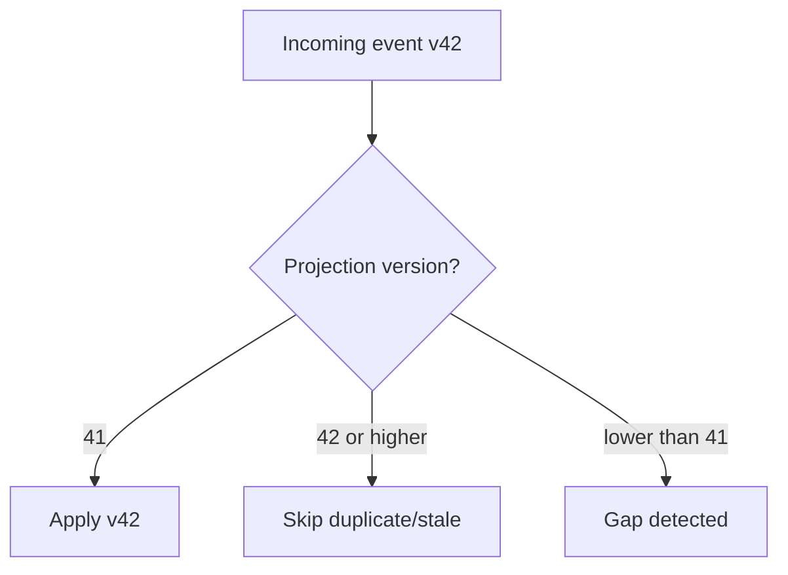

For regulatory lifecycle state, this is a defensibility mechanism. It proves that a case did not skip from `UNDER_REVIEW` to `SANCTIONED` without required intermediate transitions.

---

## 22. Replay Safety

Replay is one reason to use event logs and streams.

Replay is dangerous when consumers are not idempotent.

Replay-safe consumers separate:

- projection rebuilds
- business command execution
- external side effects
- audit writes
- notifications

A projection rebuild may safely replay historical events into a new table.

A notification consumer should usually not resend historical emails during replay.

Use mode flags and consumer identity.

```text
consumer.name = case-email-notifier-live
consumer.mode = LIVE_ONLY

consumer.name = case-dashboard-projection-rebuild-20260628
consumer.mode = REBUILD
```

Do not reuse the same consumer group and side-effect policy for live handling and replay.

---

## 23. Dedup Store Retention

A dedup store cannot grow forever. But expiring dedup records too early allows duplicates to re-enter.

Retention depends on:

- broker retention
- maximum replay window
- maximum retry window
- legal/audit replay requirement
- business operation irreversibility
- storage cost

| Event Type | Suggested Dedup Retention |
|---|---|
| Dashboard projection event | Broker retention + rebuild plan |
| Notification command | Long enough to prevent accidental resend during replay |
| Payment/penalty instruction | Often years, or align with financial audit retention |
| Case lifecycle transition | Align with case audit retention |
| Temporary technical metric event | Short retention may be acceptable |

For high-stakes workflows, dedup records are part of audit evidence, not just cache entries.

---

## 24. Anti-Patterns

### 24.1 Broker Offset as Business Dedup Key

Kafka offset is location, not business identity.

If topic is repartitioned, compacted, mirrored, or replayed through another topic, offsets change.

### 24.2 Random UUID on Every Retry

If a retry generates a new event ID or idempotency key, the duplicate looks like new work.

### 24.3 Ack Before Commit

This loses work if the consumer crashes after ack and before side effect.

### 24.4 Infinite Retry on Non-Idempotent Side Effects

If the side effect is not idempotent, every retry may make the incident worse.

### 24.5 Outbox Without Consumer Dedup

Outbox can duplicate publish on relay crash. Consumers still need dedup.

### 24.6 Dedup Only in Memory

In-memory dedup disappears on restart and does not work across replicas.

### 24.7 One Global Idempotency Table Without Scope

A message ID may collide across producers or environments. Scope dedup keys by consumer and source.

### 24.8 Treating Exactly-Once as a Product Requirement Without Boundary

Ask: exactly once for what side effect, in which system, under which failure model?

---

## 25. Testing Idempotency

Unit tests are not enough. Use failure-injection tests.

### 25.1 Duplicate Delivery Test

Given the same event delivered twice, assert one business effect.

```java
@Test
void duplicateCaseEscalatedEventDoesNotDuplicateProjectionOrAudit() {
    EventEnvelope<CaseEscalatedPayload> event = fixtures.caseEscalated("CASE-1", 42);

    consumer.handle(event);
    consumer.handle(event);

    assertThat(projectionRepository.find("CASE-1").status()).isEqualTo("ESCALATED");
    assertThat(auditRepository.countByEventId(event.eventId())).isEqualTo(1);
    assertThat(inboxRepository.countProcessed(event.eventId())).isEqualTo(1);
}
```

### 25.2 Crash After DB Commit Before Ack

Simulate:

1. process event
2. commit local DB
3. crash before ack/offset commit
4. redeliver event
5. assert no duplicate side effect

### 25.3 Relay Crash After Publish Before Mark Published

Simulate:

1. relay publishes outbox event
2. broker confirms
3. relay crashes before marking published
4. relay restarts and republishes
5. assert consumer dedup absorbs duplicate

### 25.4 Replay Test

Replay a full historical topic into a clean projection. Then replay again. Final state must be identical.

---

## 26. Metrics

| Metric | Why It Matters |
|---|---|
| `outbox.pending.count` | Publication backlog |
| `outbox.oldest.pending.age.seconds` | Whether state changes are stuck unpublished |
| `outbox.publish.attempts` | Broker or serialization instability |
| `outbox.quarantined.count` | Poison event in relay |
| `inbox.duplicate.count` | Duplicate delivery/replay rate |
| `inbox.processing.age.seconds` | Stuck consumer processing |
| `idempotency.conflict.count` | Same key with different payload/result |
| `side_effect.pending.count` | External action backlog |
| `side_effect.unknown_result.count` | Dangerous reconciliation required |
| `replay.suppressed_side_effect.count` | Replay safety control working |

The dangerous metric is not duplicate count alone. It is duplicate count plus non-idempotent side-effect attempts.

---

## 27. Incident Runbook: Duplicate Storm

Symptoms:

- sudden increase in inbox duplicate count
- Kafka consumer reprocessing old offsets
- RabbitMQ redelivery count increases
- JMS redelivery flag observed
- external provider reports duplicate requests
- DLQ receives already-processed events

Immediate actions:

1. Identify source: replay, rebalance, retry, relay, broker failover, deployment bug.
2. Pause non-idempotent consumers first.
3. Keep idempotent projection consumers running if they help recovery.
4. Verify dedup store health.
5. Check whether idempotency keys changed after deployment.
6. Inspect outbox relay publish attempts.
7. Reconcile external side-effect ledger.
8. Resume with rate limit and enhanced logging.

Do not purge topics/queues as first response unless you have proven the data is safely reconstructable.

---

## 28. Regulatory Defensibility Checklist

For a regulatory case-management platform, every event-driven side effect should be explainable.

Ask:

- What event caused this transition?
- What command or human action caused the event?
- Was the operation processed more than once?
- If duplicate delivery happened, how was it suppressed?
- Was an external notice sent once or multiple times?
- What evidence proves the external system accepted the request?
- Can we replay the case lifecycle without resending irreversible actions?
- Does the outbox prove that every committed state transition emitted a corresponding event?
- Does the inbox prove that every consumed event was processed or rejected?
- Are dedup records retained long enough for legal review?

The audit trail should record causality, not just final state.

---

## 29. Design Review Questions

Before approving a messaging design, ask:

1. What is the idempotency key?
2. Who creates it?
3. Is it stable across retries?
4. Is it too broad or too narrow?
5. What happens if the broker redelivers after local commit?
6. What happens if the producer publishes twice?
7. What happens if the consumer processes a historical replay?
8. What side effects are irreversible?
9. Which transaction boundary protects each side effect?
10. Is there an outbox for database-to-broker publication?
11. Is there an inbox for broker-to-database consumption?
12. What metrics prove the mechanism is healthy?
13. How do we reconcile unknown external side-effect outcomes?
14. What records are retained for audit?

If these answers are vague, the design is not production-ready.

---

## 30. Key Takeaways

- Messaging reliability is not just delivery. It is convergence to the correct business effect.
- Idempotency must be designed around business operation identity, not broker delivery identity.
- Outbox prevents lost events when database state and outgoing messages must change together.
- Inbox prevents duplicate business effects when messages are redelivered, replayed, or retried.
- Kafka transactions are powerful but scoped to Kafka records and offsets.
- JMS transactions and XA can help but increase operational complexity.
- RabbitMQ confirms and consumer acks solve different halves of the reliability chain.
- External side effects require idempotency keys, ledgers, or reconciliation.
- Replay safety must be explicit. Live consumers and rebuild consumers often need different policies.
- For regulatory systems, idempotency and causality are audit controls, not just engineering optimizations.

