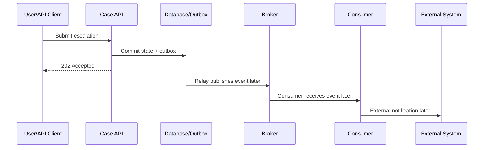
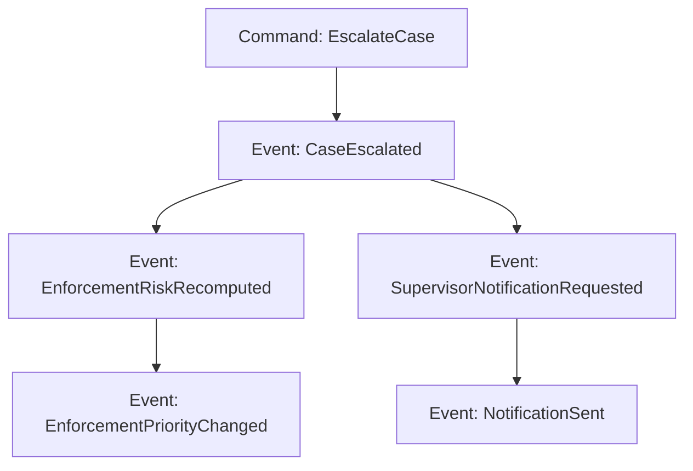
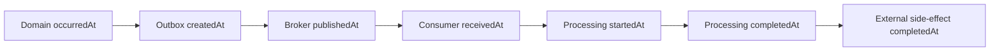
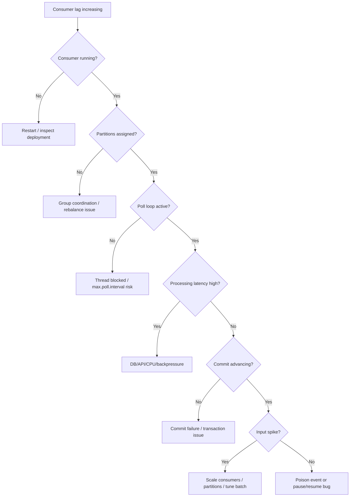
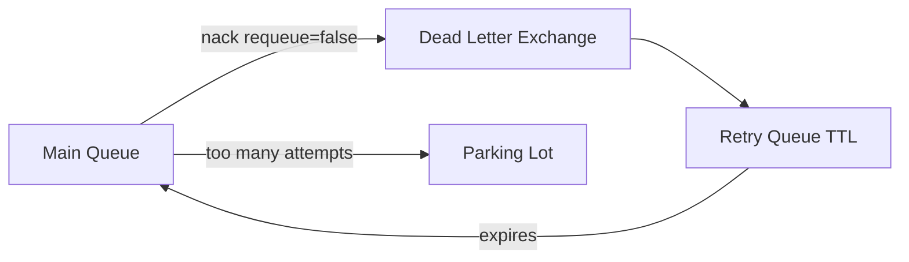
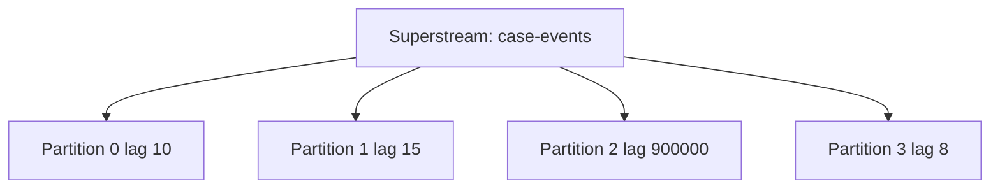
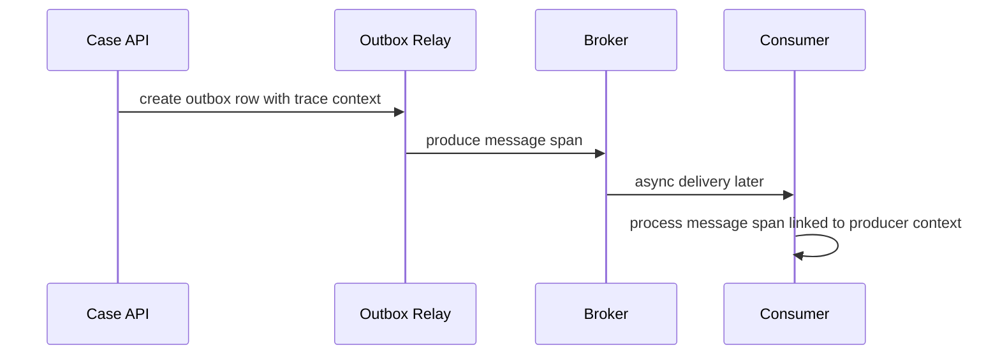
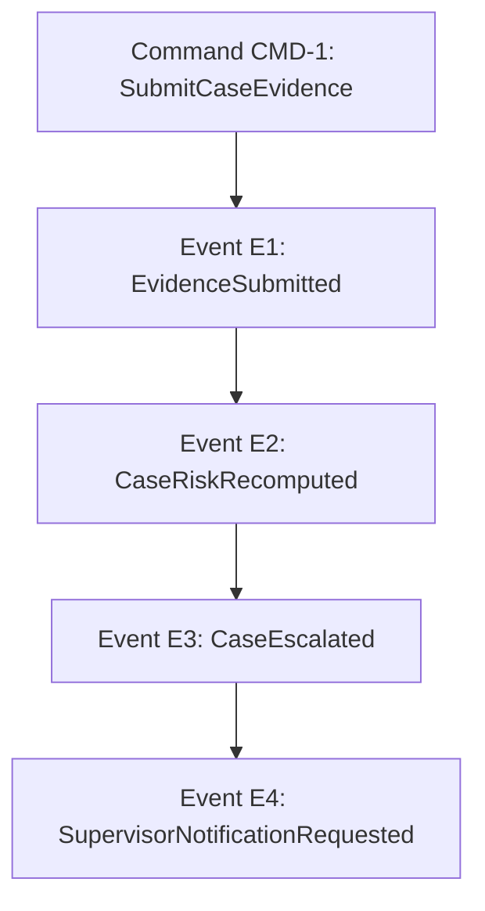

------
title: Learn Java Messaging and Event Streaming - Part 032
description: Observability for asynchronous Java messaging and event-streaming systems: metrics, logs, traces, lag, queue depth, correlation, causality, dashboards, alerts, and production diagnosis across Kafka, RabbitMQ, JMS, RabbitMQ Streams, Kafka Streams, and ksqlDB.
series: learn-java-messaging-event-streaming
seriesTitle: Learn Java Messaging and Event Streaming
order: 32
partTitle: Observability: Metrics, Logs, Traces, Lag, Correlation, and Causality
tags:
- java
- messaging
- event-streaming
- observability
- metrics
- logs
- traces
- kafka
- rabbitmq
- jms
- rabbitmq-streams
- ksqldb
- opentelemetry
- operations
date: 2026-06-28
---

# Part 032 — Observability: Metrics, Logs, Traces, Lag, Correlation, and Causality

## 1. What We Are Solving

Synchronous systems fail loudly.

Asynchronous systems often fail quietly.

A request may return `202 Accepted`, while the actual business work fails five minutes later in a consumer nobody is watching.

A producer may publish successfully, while all consumers are lagging behind.

A queue may drain, but only because messages are being dead-lettered.

A Kafka consumer may show low CPU, but it is actually paused, stuck behind a poison event, or repeatedly rebalancing.

Observability is the ability to answer:

> Where is the work, why is it there, how old is it, what caused it, who is waiting for it, and what business outcome is at risk?

In event-driven systems, this requires more than logs.

It requires a causal model.

---

## 2. Observability Signals

A production messaging system emits several kinds of evidence.

| Signal | Answers | Example |
|---|---|---|
| Metrics | How much, how fast, how old, how healthy | lag, queue depth, publish rate, error rate |
| Logs | What happened at a point in time | event rejected due to schema version |
| Traces | How work moved across services | HTTP request → outbox → Kafka → consumer → DB |
| Audit events | What business decision happened | case escalated due to SLA breach |
| Broker metadata | What the infrastructure is doing | rebalances, leader elections, channel flow control |
| Dead-letter records | What failed permanently or exceeded retry policy | poison event with validation error |
| Outbox/inbox records | What publication/consumption state is durable | pending outbox rows, duplicate inbox markers |

The mistake is expecting one signal to do every job.

Metrics detect.

Logs explain local detail.

Traces reconstruct path.

Audit records prove business causality.

---

## 3. Why Async Observability Is Different

In synchronous request/response systems, the caller waits.

In asynchronous systems, time separates cause and effect.



The user-facing request may succeed before the downstream work starts.

Therefore, you need observability over:

- the initiating request
- the outbox row
- the broker record
- the consumer attempt
- the external side effect
- the final business status

Otherwise, you only observe the first 10% of the workflow.

---

## 4. The Causality Envelope

A well-designed event envelope is the cheapest observability tool.

Recommended fields:

```json
{
  "messageId": "physical-message-id-if-needed",
  "eventId": "01JZKJ74BSBRSS4FQ8Z7G2WKZN",
  "eventType": "CaseEscalated",
  "eventVersion": 3,
  "aggregateType": "RegulatoryCase",
  "aggregateId": "CASE-2026-000981",
  "aggregateVersion": 42,
  "correlationId": "CORR-2026-06-28-00017",
  "causationId": "01JZKJ5YVQWHQBCM2FK4G8D6ZS",
  "traceparent": "00-4bf92f3577b34da6a3ce929d0e0e4736-00f067aa0ba902b7-01",
  "producer": "case-lifecycle-service",
  "producerInstance": "case-lifecycle-service-6cc4d7d6f5-jtm4g",
  "occurredAt": "2026-06-28T10:15:30Z",
  "publishedAt": "2026-06-28T10:15:31Z"
}
```

Identity roles:

| Field | Purpose |
|---|---|
| `eventId` | Dedup and event-level audit |
| `aggregateId` | Entity-level ordering and lookup |
| `aggregateVersion` | Stale/gap detection |
| `correlationId` | Groups the entire business journey |
| `causationId` | Connects this event to the immediate cause |
| `traceparent` | Connects distributed trace context |
| `producer` | Ownership and support routing |
| `occurredAt` | Domain time |
| `publishedAt` | Messaging publication time |

Never rely only on broker offset or delivery tag for business observability.

---

## 5. Causality Graph

Event-driven systems form a graph, not a call stack.



To debug an incident, you need to traverse:

- from command to resulting event
- from event to downstream events
- from event to side effects
- from event to inbox/outbox records
- from event to trace spans
- from event to audit records

A good observability design makes this traversal possible with identifiers, not guesswork.

---

## 6. Metrics Taxonomy

Messaging metrics should be grouped by layer.

| Layer | Metrics |
|---|---|
| Producer | publish rate, error rate, retry rate, batch size, send latency, buffer exhaustion |
| Broker | queue depth, partition bytes, retention, disk, replication, leader changes, flow control |
| Consumer | consume rate, processing rate, lag, processing latency, commit latency, ack latency, error rate |
| Business | pending cases, overdue escalations, notification backlog, SLA breach risk |
| Reliability | outbox age, inbox duplicate count, DLQ count, retry attempts, poison count |
| Runtime | CPU, memory, GC, threads, DB pool, HTTP client pool |

Do not build dashboards that only show infrastructure. The most important question is usually business impact.

---

## 7. Lag, Queue Depth, and Age Are Different

| Concept | Applies To | Meaning | Risk |
|---|---|---|---|
| Queue depth | Queue systems | Messages ready/unacked in queue | Backlog or stuck consumers |
| Consumer lag | Kafka/streams/logs | Difference between end offset and committed/current offset | Consumer behind log head |
| Offset age | Logs/streams | Age of record at current consumer position | Business staleness |
| Outbox age | Outbox pattern | Oldest unpublished state change | Event publication stuck |
| Inbox processing age | Inbox pattern | Message started but not completed | Stuck side effect |
| DLQ count | Error handling | Failed/quarantined messages | Lost business work if ignored |

A system can have low queue depth but high business risk if messages are being dead-lettered.

A Kafka consumer can have moderate lag but severe risk if the oldest lagged event is tied to a regulatory SLA.

Age is often more important than count.

---

## 8. End-to-End Latency Decomposition

Do not track only consumer processing time.

Track each segment.



Metrics:

| Metric | Formula |
|---|---|
| domain-to-outbox latency | `outbox.createdAt - event.occurredAt` |
| outbox publication lag | `broker.publishedAt - outbox.createdAt` |
| broker residence age | `consumer.receivedAt - broker.publishedAt` |
| scheduling delay | `processing.startedAt - consumer.receivedAt` |
| processing latency | `processing.completedAt - processing.startedAt` |
| side-effect latency | `effect.completedAt - processing.completedAt` |
| end-to-end latency | `effect.completedAt - event.occurredAt` |

Without decomposition, every incident becomes “Kafka is slow” or “RabbitMQ is slow”, even when the actual issue is DB pool exhaustion or a stuck external API.

---

## 9. Kafka Observability

Key producer metrics:

- record send rate
- record error rate
- request latency
- batch size average
- compression rate
- buffer available bytes
- buffer exhaustion / blocked time
- retry rate
- record queue time

Key broker/topic metrics:

- bytes in/out
- under-replicated partitions
- offline partitions
- leader election rate
- ISR shrink/expand rate
- request handler idle percent
- disk usage
- produce/fetch latency

Key consumer metrics:

- records consumed rate
- bytes consumed rate
- records lag max
- committed offset
- current position
- poll latency
- processing latency
- commit latency
- rebalance count/frequency
- assigned partitions
- paused partitions

Operational rule:

> Consumer lag is a symptom. Diagnose whether the cause is low consumption, slow processing, stuck processing, frequent rebalance, downstream backpressure, or intentional pause.

---

## 10. Kafka Lag Diagnosis Tree



Useful labels for every lag alert:

- topic
- consumer group
- partition
- current offset
- end offset
- lag count
- oldest lagged record timestamp
- consumer instance
- application version
- deployment region

The oldest lagged timestamp is critical. A count of 10,000 can be harmless for low-value telemetry and severe for case enforcement deadlines.

---

## 11. RabbitMQ Observability

RabbitMQ queue systems expose different signals than Kafka.

Key queue metrics:

- messages ready
- messages unacknowledged
- total messages
- publish rate
- deliver/get rate
- ack rate
- redeliver rate
- consumer count
- consumer capacity/utilisation
- memory usage
- disk free
- flow control state
- channel count
- connection count
- queue leader/replica status for quorum queues

Interpretation:

| Pattern | Likely Meaning |
|---|---|
| ready increasing, unacked low | not enough consumers or routing to inactive queue |
| unacked increasing, ready low | consumers received work but are slow/stuck |
| redeliver rate high | failures, nacks, connection churn, or retry storm |
| publish blocked/flow control | broker memory/disk pressure |
| DLQ increasing | poison message or downstream permanent error |
| consumer count zero | deployment/configuration issue |
| ack rate below publish rate | backlog growing |

For RabbitMQ, queue depth alone is not enough. You must distinguish ready vs unacked.

---

## 12. RabbitMQ Retry and DLQ Observability

For retry topologies, track:

- messages in main queue
- messages in retry queues by delay bucket
- messages in DLQ/parking lot
- `x-death` count/reason
- retry age
- final failure reason
- dead-letter publish failures if available

A healthy retry system has bounded retry age and bounded DLQ inflow.

An unhealthy retry system has retry cycles.



Alert on cycle amplification:

```text
retry_in_rate > successful_processing_rate
AND oldest_retry_age_seconds increasing
```

---

## 13. RabbitMQ Streams Observability

For RabbitMQ Streams and Superstreams, observe:

- stream publish rate
- stream confirm latency
- offset lag per consumer
- committed/stored offset per consumer
- chunk/segment storage usage
- retention pressure
- superstream partition imbalance
- single active consumer assignment
- consumer failover time
- dedup publishing errors
- stream leader/replica health

Superstreams require partition-level visibility.

A logical stream may look healthy while one partition is hot.



Partition skew is an observability finding, not just a scaling issue.

---

## 14. JMS/Jakarta Messaging Observability

JMS metrics depend heavily on provider and application server, but the observability model is consistent.

Track:

- destination depth
- consumers per destination
- message delivery rate
- redelivery count
- expired message count
- DLQ count
- session/connection errors
- transaction rollback count
- MDB invocation count
- MDB exception count
- transaction duration
- thread pool saturation
- database transaction latency

For MDB/container-driven consumers, application logs must include:

- destination name
- message ID
- correlation ID
- redelivery flag/count if available
- transaction outcome
- exception classification
- processing duration

Container-managed messaging can hide the poll loop. You must make lifecycle and transaction outcomes visible explicitly.

---

## 15. Kafka Streams Observability

Kafka Streams adds stateful runtime concerns.

Track:

- task assignment
- active vs standby tasks
- state store restore progress
- changelog topic lag
- repartition topic lag
- processing latency per processor node
- punctuator latency
- dropped records
- skipped records
- deserialization errors
- commit latency
- rebalance time
- RocksDB metrics if applicable
- local disk usage for state stores

A Streams app may be “up” but unavailable for correct query results during state restoration.

Dashboard section:

| Panel | Why |
|---|---|
| Task assignment by instance | Detect imbalance |
| State restore remaining records | Understand recovery time |
| Changelog lag | State recovery health |
| Repartition topic lag | Internal topology bottleneck |
| Dropped late records | Event-time correctness risk |
| Processing latency by node | Find topology hotspot |

---

## 16. ksqlDB Observability

ksqlDB hides some Java code but does not remove operational complexity.

Track:

- persistent query status
- query error rate
- consumer lag per query
- input/output row rate
- pull query latency
- push query client count
- state store size
- internal topic lag
- server CPU/memory
- rebalances
- task assignment
- RocksDB/state restore metrics
- schema/serialization errors

Important operational questions:

- Is the persistent query running?
- Is it processing current input?
- Are output topics receiving rows?
- Is a stateful query restoring?
- Did repartitioning create an unexpected internal topic bottleneck?
- Are pull queries reading stale materialized state?

ksqlDB makes stream processing easier to express, not automatically easier to operate.

---

## 17. Structured Logging

Messaging logs must be structured.

Minimum fields:

```json
{
  "timestamp": "2026-06-28T10:16:03.421Z",
  "level": "WARN",
  "service": "case-notification-consumer",
  "eventId": "01JZKJ74BSBRSS4FQ8Z7G2WKZN",
  "eventType": "CaseEscalated",
  "aggregateId": "CASE-2026-000981",
  "aggregateVersion": 42,
  "correlationId": "CORR-2026-06-28-00017",
  "causationId": "01JZKJ5YVQWHQBCM2FK4G8D6ZS",
  "topic": "case.lifecycle.events",
  "partition": 7,
  "offset": 91827364,
  "consumerGroup": "case-notification-v2",
  "attempt": 3,
  "errorClass": "DownstreamTimeout",
  "action": "scheduled_retry"
}
```

Rules:

- log event identity once at receive
- log processing outcome once at completion
- log retries with attempt and next delay
- log DLQ/quarantine with reason and operator instruction
- do not log full PII payloads
- hash or redact sensitive identifiers where policy requires
- include broker coordinates for infrastructure debugging
- include business coordinates for case debugging

Avoid free-text logs that cannot be joined by `eventId` or `correlationId`.

---

## 18. Trace Context in Messaging

Distributed tracing in messaging is tricky because producer and consumer are temporally decoupled.

The producer span and consumer span may not be parent/child in the same way as HTTP calls.

A practical model:



Use headers to propagate:

- `traceparent`
- `tracestate`
- `correlationId`
- `causationId`
- `eventId`

A trace should answer:

- where was the event produced?
- how long did it wait in outbox?
- when was it published?
- when did the consumer receive it?
- what downstream calls did processing make?
- what failed?

Do not rely on tracing alone for audit. Traces are operational evidence; audit records are business/legal evidence.

---

## 19. Span Naming

Recommended span names:

```text
case.lifecycle publish
case.lifecycle relay
case.lifecycle consume
case.notification process
case.notification external.send
case.projection update
```

Attributes:

```text
messaging.system=kafka
messaging.destination.name=case.lifecycle.events
messaging.operation.type=send
messaging.kafka.consumer.group=case-notification-v2
messaging.kafka.partition=7
messaging.kafka.offset=91827364
app.event.id=01JZKJ74BSBRSS4FQ8Z7G2WKZN
app.event.type=CaseEscalated
app.aggregate.id=CASE-2026-000981
app.aggregate.version=42
app.correlation.id=CORR-2026-06-28-00017
```

Use standard semantic conventions where they exist, then add application-specific attributes with a clear namespace such as `app.*` or `domain.*`.

---

## 20. Cardinality Discipline

Metrics labels must not explode cardinality.

Bad metric label:

```text
consumer_processing_latency{case_id="CASE-2026-000981"}
```

Good metric labels:

```text
consumer_processing_latency{service="case-notification", event_type="CaseEscalated", outcome="success"}
```

Use high-cardinality identifiers in logs/traces, not aggregate metrics.

| Data | Metrics Label? | Logs? | Traces? |
|---|---:|---:|---:|
| service name | Yes | Yes | Yes |
| topic/queue | Yes | Yes | Yes |
| consumer group | Yes | Yes | Yes |
| partition | Sometimes | Yes | Yes |
| event type | Yes | Yes | Yes |
| event ID | No | Yes | Yes |
| case ID | Usually no | Yes with policy | Yes with policy |
| user ID | Usually no | Redacted/hash | Redacted/hash |
| error class | Yes | Yes | Yes |

High-cardinality metrics can break observability systems during incidents.

---

## 21. Alert Design

Bad alert:

```text
Kafka lag > 10000
```

Better alert:

```text
consumer_group="case-notification-v2"
AND oldest_lagged_record_age_seconds > 300
AND lag_slope_positive_for > 10m
```

Best alert includes business impact:

```text
oldest_unnotified_escalated_case_age_seconds > 300
AND notification_consumer_lag_age_seconds > 300
```

Alert dimensions:

- symptom
- impact
- owner
- likely first diagnostic query
- safe first action
- escalation path

Every alert should have a runbook.

If there is no action, it is not an alert. It is a dashboard panel.

---

## 22. Dashboard Structure

A useful messaging dashboard is layered.

### 22.1 Executive/Business Panel

- cases pending escalation
- oldest pending notification age
- overdue SLA count
- regulatory deadline risk count
- failed irreversible side effects

### 22.2 Flow Panel

- ingress rate
- outbox pending age
- broker publish rate
- consumer processing rate
- output/side-effect completion rate

### 22.3 Reliability Panel

- retry count
- DLQ count
- poison/quarantine count
- duplicate suppression count
- idempotency conflict count

### 22.4 Broker Panel

- Kafka lag / RabbitMQ depth / stream offset lag
- partition or queue skew
- broker resource pressure
- replication/quorum health
- flow control

### 22.5 Runtime Panel

- JVM CPU/memory/GC
- thread pools
- DB connection pool
- HTTP client pool
- error budget burn

Dashboards should guide diagnosis from business impact to technical root cause.

---

## 23. Causal Query Examples

A good system lets an operator ask precise questions.

### 23.1 Given a Case ID, What Happened?

Query dimensions:

- `aggregateId = CASE-2026-000981`
- all events by aggregate version
- all inbox records for those events
- all outbox records caused by those events
- all traces with correlation ID
- all DLQ records with same event ID

Expected result:

```text
CASE-2026-000981
v40 CaseReviewed
v41 EvidenceRequested
v42 CaseEscalated
  caused by: EscalateCaseCommand CMD-917
  produced by: case-lifecycle-service
  consumed by: case-notification-v2 SUCCESS
  consumed by: enforcement-risk-v4 SUCCESS
  consumed by: dashboard-projection-v3 SUCCESS
  side effect: supervisor email sent EXT-99192
```

### 23.2 Given a DLQ Message, What Broke?

Query dimensions:

- event ID
- event type/version
- consumer name/version
- error class
- original topic/partition/offset or queue
- retry attempts
- first failure time
- last failure time
- payload schema version
- deployment version

Expected answer:

```text
CaseEscalated v3 failed in case-notification-v2 because payload.reasonCode=SLA_BREACH_UNKNOWN was not mapped by deployment 2026.06.27.4. Event was retried 5 times, then quarantined. No external notification was sent. Replay after deploying mapping fix is safe.
```

---

## 24. Observability for Outbox/Inbox

Outbox metrics:

- pending rows
- oldest pending age
- publish attempts
- publish failures by class
- rows published per second
- relay batch size
- relay lock wait time
- relay duplicate publish count
- quarantined outbox rows

Inbox metrics:

- received rows
- processing rows
- processed rows
- failed rows
- duplicate rows
- oldest processing age
- idempotency conflicts
- processing duration by event type

Outbox/inbox tables are not just reliability mechanisms. They are observability indexes.

A system without outbox/inbox has to infer publication and consumption from broker logs and application logs. That is much weaker during audit or incident response.

---

## 25. Error Classification

Do not log every exception as generic failure.

Use a small classification taxonomy.

| Class | Retry? | Example | Action |
|---|---:|---|---|
| `TRANSIENT_DOWNSTREAM` | Yes | HTTP 503, timeout | Retry with budget |
| `BROKER_TRANSIENT` | Yes | temporary publish failure | Retry relay |
| `VALIDATION_PERMANENT` | No | required payload field missing | DLQ/quarantine |
| `SCHEMA_INCOMPATIBLE` | No until fix | unknown event version | quarantine + deploy consumer fix |
| `AUTHORIZATION` | Usually no | ACL denied | operator fix |
| `IDEMPOTENCY_CONFLICT` | No | same key, different payload | stop and investigate |
| `RESOURCE_EXHAUSTED` | Maybe | DB pool exhausted | backpressure/scale/fix leak |
| `BUG` | No until fix | null pointer in deterministic path | quarantine + patch |

Error classification powers retry policy, alert routing, and replay safety.

---

## 26. Logging Around Retries

Retry logs must make the next state explicit.

Bad:

```text
failed to process message
```

Good:

```json
{
  "level": "WARN",
  "message": "message processing failed; scheduled retry",
  "eventId": "01JZKJ74BSBRSS4FQ8Z7G2WKZN",
  "eventType": "CaseEscalated",
  "consumer": "case-notification-v2",
  "attempt": 3,
  "maxAttempts": 5,
  "errorClass": "TRANSIENT_DOWNSTREAM",
  "nextAction": "retry",
  "nextDelaySeconds": 300
}
```

Final failure:

```json
{
  "level": "ERROR",
  "message": "message moved to quarantine",
  "eventId": "01JZKJ74BSBRSS4FQ8Z7G2WKZN",
  "eventType": "CaseEscalated",
  "consumer": "case-notification-v2",
  "attempt": 5,
  "errorClass": "SCHEMA_INCOMPATIBLE",
  "quarantineTopic": "case-notification.quarantine.v1",
  "operatorAction": "deploy consumer supporting CaseEscalated v3, then replay by eventId"
}
```

Operator action is part of observability.

---

## 27. Correlation vs Causation

Correlation ID answers:

> What broader business journey does this belong to?

Causation ID answers:

> What immediate event or command caused this?

Example:



All events may share the same `correlationId`.

Each event has a different `causationId`:

| Event | Correlation ID | Causation ID |
|---|---|---|
| EvidenceSubmitted | CORR-1 | CMD-1 |
| CaseRiskRecomputed | CORR-1 | E1 |
| CaseEscalated | CORR-1 | E2 |
| SupervisorNotificationRequested | CORR-1 | E3 |

Without causation ID, you can group logs but not explain the chain of decisions.

---

## 28. Regulatory Audit vs Operational Observability

Operational observability is optimized for diagnosis.

Audit is optimized for evidence.

| Concern | Observability | Audit |
|---|---|---|
| Retention | Days/weeks/months | Often years |
| Mutability | Logs may expire/reindex | Append-only or controlled correction |
| Audience | Engineers/SRE | Regulators/auditors/business |
| Detail | Technical events | Business decisions and approvals |
| Identifiers | trace/span/event IDs | case ID, actor, authority, policy basis |
| Privacy | Redaction/tokenization | Strict access controls and retention policy |

Do not assume traces satisfy audit requirements.

A trace can show that a notification service called an SMTP API.

An audit record should show that the system sent a specific legally relevant notice for a specific case, under a specific rule, at a specific time, with a specific result.

---

## 29. Observability Anti-Patterns

### 29.1 Only Monitoring Broker Health

Brokers can be healthy while business workflows are stuck.

### 29.2 Alerting on Lag Count Only

Count ignores event age and business priority.

### 29.3 Missing Correlation ID in Async Boundary

The trace breaks exactly where asynchronous work starts.

### 29.4 Logging Payloads With PII

Debugging convenience becomes governance risk.

### 29.5 No DLQ Ownership

A DLQ without owner, alert, and replay process is a data graveyard.

### 29.6 High-Cardinality Metrics

Putting event IDs or case IDs into metric labels can damage the monitoring system.

### 29.7 No Deployment Version in Logs

You cannot correlate failures with releases.

### 29.8 Treating Replay as Invisible

Replay should be observable and tagged. Otherwise, historical processing looks like live business activity.

---

## 30. Incident Diagnosis: Case Notification Missing

Symptom:

> Supervisor says case `CASE-2026-000981` escalated, but no notification arrived.

Diagnosis path:

1. Query case audit by `aggregateId`.
2. Find `CaseEscalated` event ID and aggregate version.
3. Check outbox row for that event.
4. Check broker publication coordinates.
5. Check consumer group lag at that time.
6. Check inbox record for notification consumer.
7. Check side-effect ledger for email/API call.
8. Check DLQ/quarantine by event ID.
9. Check traces by correlation ID.
10. Check external provider receipt.

Possible findings:

| Finding | Root Cause |
|---|---|
| No outbox row | producer transaction bug |
| Outbox pending old | relay stopped |
| Published but consumer lagged | consumer/downstream bottleneck |
| Inbox failed permanently | validation/schema issue |
| Side-effect pending | external provider outage |
| External sent but no receipt | provider reconciliation issue |
| DLQ contains event | poison mapping bug |

This is why every stage needs identifiers and durable state.

---

## 31. Minimal Observability Contract for Every Consumer

Every consumer should expose:

Metrics:

- messages received
- messages processed
- messages failed by class
- processing latency
- duplicate suppressed count
- retry scheduled count
- DLQ/quarantine count
- oldest unprocessed age
- downstream latency

Logs:

- receive log with event identity
- success log with duration and outcome
- failure log with error class and next action
- DLQ/quarantine log with replay instruction

Traces:

- consume span
- processing span
- downstream spans
- links to producer context where possible

Durable records:

- inbox marker
- side-effect ledger if external action exists
- audit event for business-significant outcome

---

## 32. Minimal Observability Contract for Every Producer

Every producer should expose:

Metrics:

- events created
- outbox rows pending
- outbox oldest age
- publish attempts
- publish success/failure
- broker publish latency
- serialization/schema failures

Logs:

- business state transition committed
- outbox event created
- publish success with broker coordinates
- publish failure with retry action

Traces:

- command handling span
- database transaction span
- outbox relay span
- publish span

Durable records:

- outbox row
- aggregate version update
- audit entry if business-significant

---

## 33. Production Readiness Checklist

Before going live, verify:

- Every event has `eventId`, `eventType`, `aggregateId`, `correlationId`, `causationId`.
- Every message crossing async boundaries propagates trace context where policy allows.
- Every consumer logs receive/success/failure with stable identifiers.
- Every consumer has metrics for processing rate, error rate, latency, lag/age, and DLQ.
- Every producer has metrics for outbox age and publish failure.
- Dashboards show business impact first, broker symptoms second.
- Alerts use age and slope, not only count.
- DLQ/quarantine has owner and replay process.
- Replay mode is tagged and suppresses irreversible side effects.
- PII is not emitted into unrestricted logs/metrics/traces.
- Deployment version is present in telemetry.
- Runbooks link from alerts.

---

## 34. Key Takeaways

- Async systems require observability over time, not just request latency.
- Lag, queue depth, age, DLQ count, and business backlog are different signals.
- Correlation ID groups work; causation ID explains why each event happened.
- Event envelopes are observability infrastructure.
- Metrics detect symptoms; logs explain details; traces reconstruct paths; audit records prove business decisions.
- Outbox and inbox tables are also observability indexes.
- Kafka, RabbitMQ, JMS, RabbitMQ Streams, Kafka Streams, and ksqlDB each expose different operational signals; dashboards must respect the model.
- High-cardinality identifiers belong in logs/traces, not metric labels.
- A DLQ without ownership and replay process is silent data loss.
- Regulatory systems need both operational observability and audit-grade causal evidence.

