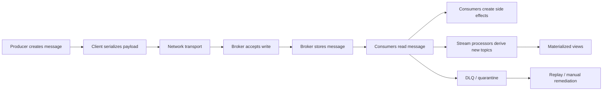
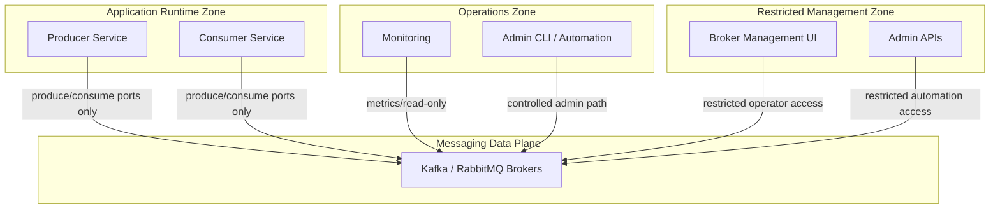
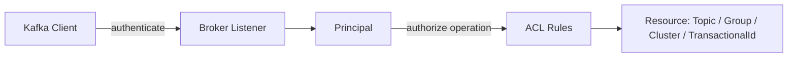
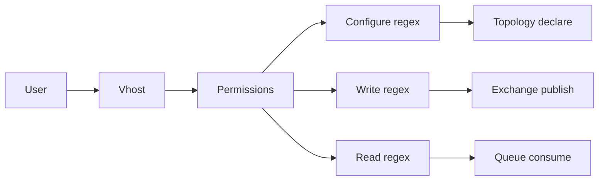
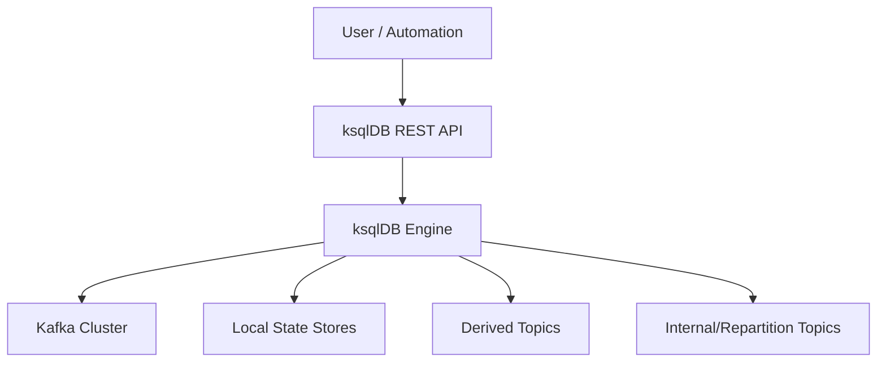
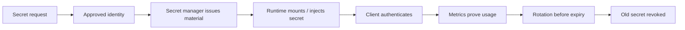

------
title: Learn Java Messaging and Event Streaming - Part 033
description: Security and governance for Java messaging and event-streaming systems: TLS, SASL, ACLs, vhosts, secrets, PII, retention, multi-tenancy, tenant isolation, auditability, and regulatory defensibility across JMS, Kafka, RabbitMQ, RabbitMQ Streams, Kafka Streams, and ksqlDB.
series: learn-java-messaging-event-streaming
seriesTitle: Learn Java Messaging and Event Streaming
order: 33
partTitle: Security and Governance: TLS, SASL, ACL, Secrets, PII, and Multi-Tenancy
tags:
- java
- messaging
- event-streaming
- kafka
- rabbitmq
- jms
- rabbitmq-streams
- ksqldb
- security
- governance
- tls
- sasl
- acl
- pii
- multitenancy
- operations
date: 2026-06-28
---

# Part 033 — Security and Governance: TLS, SASL, ACL, Secrets, PII, and Multi-Tenancy

## 1. What We Are Solving

Messaging security is not only about encrypting a socket.

In a synchronous HTTP system, we often reason in terms of one request, one identity, one authorization decision, one response, and one audit record.

In a messaging system, the security boundary becomes more distributed:

- a producer may publish now;
- a broker may store data for minutes, days, months, or years;
- many consumers may read later;
- a stream processor may create derived topics;
- a DLQ may retain failed records longer than the main topic;
- replay may re-execute old data under new code;
- operators may inspect payloads while debugging;
- schemas may reveal sensitive semantics even when payloads are encrypted.

So the real problem is not merely:

> Can client A connect to broker B?

The production-grade question is:

> Can we prove that only the right actors can produce, consume, route, transform, replay, retain, inspect, and delete the right messages under the right business context?

That proof is the difference between basic integration and defensible event-driven engineering.

---

## 2. Mental Model: Security as a Data Lifecycle Control Plane

For messaging systems, every event has a lifecycle:



Security controls must exist at each stage.

| Lifecycle stage | Main risk | Control family |
|---|---:|---|
| Message creation | Wrong actor emits event | producer authorization, service identity, contract validation |
| Serialization | Sensitive data embedded | schema governance, field classification, encryption, minimization |
| Transport | Sniffing or MITM | TLS, mTLS, certificate validation |
| Broker accept | Unauthorized write | ACL, vhost permissions, topic permissions, exchange permissions |
| Broker storage | Excessive data exposure | encryption at rest, retention limits, tenant isolation |
| Consumption | Unauthorized read | consumer ACL, queue permissions, group authorization |
| Transformation | Derived data leakage | query authorization, derived-topic governance, masking |
| Retry/DLQ | Sensitive failed payloads retained | DLQ retention policy, redaction, restricted access |
| Replay | Re-running old facts under new context | replay authorization, audit, dry-run mode, idempotency |
| Deletion | Impossible or unsafe delete | retention policy, compaction policy, legal hold process |

A strong engineer does not treat security as a separate document. They make it part of the topic/queue/event contract.

---

## 3. Security Layers

### 3.1 Network Boundary

Network security answers:

- which subnets can reach the broker;
- which ports are exposed;
- which listeners are internal vs external;
- whether management APIs are reachable from application networks;
- whether replication traffic is separated from client traffic;
- whether observability tools have read-only access.

For production, avoid a flat network model where every service can reach every broker port.

A simple segmentation model:



Do not expose broker admin endpoints just because application clients need broker data-plane access.

### 3.2 Transport Security

Transport security answers:

- is data encrypted in transit;
- is the broker certificate validated;
- is mutual TLS required;
- who can issue certificates;
- how certificates are rotated;
- what happens to long-running consumers during certificate rotation.

TLS without identity governance is incomplete. It protects the wire, but does not automatically prove that service identity maps to the right authorization policy.

### 3.3 Authentication

Authentication answers:

> Who is this client?

Common mechanisms:

| Platform | Common mechanisms |
|---|---|
| Kafka | SSL client certificates, SASL mechanisms, OAuth/OIDC in some distributions |
| RabbitMQ | username/password, TLS peer certificate authentication, plugin-backed authn |
| JMS providers | provider-specific user/password, container identity, JAAS, app-server security realm, mTLS depending on provider |
| ksqlDB | HTTP Basic over HTTPS, mTLS/internal listener patterns, Confluent security integration |

Authentication should use service identities, not shared application passwords.

Bad:

```text
username = messaging_app
password = one-secret-used-by-20-services
```

Better:

```text
principal = svc.enforcement-case-writer.prod
principal = svc.enforcement-escalation-reader.prod
principal = svc.audit-replay-operator.prod
```

A service identity should reveal:

- environment;
- workload;
- bounded context;
- deployment ownership;
- intended access class.

### 3.4 Authorization

Authorization answers:

> What can this identity do?

At minimum, model these separately:

- produce/write;
- consume/read;
- create topic/queue/stream;
- delete topic/queue/stream;
- alter config;
- describe metadata;
- read consumer group state;
- manage offsets;
- read DLQ;
- replay;
- inspect payloads;
- run stream-processing queries.

The most dangerous anti-pattern is a single “application user” with broad broker rights.

### 3.5 Payload Governance

Payload governance answers:

> What data is allowed to exist in this message?

This includes:

- PII classification;
- confidential case details;
- enforcement evidence;
- legal privilege indicators;
- cross-tenant fields;
- derived risk scores;
- internal-only operational details;
- identifiers that can be joined to reconstruct sensitive profiles.

A payload can be technically secure and still governance-broken.

Example:

```json
{
  "caseId": "CASE-98231",
  "subjectName": "...",
  "nationalId": "...",
  "investigatorNotes": "...",
  "recommendedPenalty": "...",
  "riskScore": 91
}
```

If this is published to a broad event topic consumed by many services, TLS and ACLs do not solve the design mistake. The event has excessive disclosure.

---

## 4. Kafka Security Model

Kafka security is usually composed from:

- listener configuration;
- TLS/SSL;
- SASL authentication where applicable;
- broker-side authorization;
- ACLs on resources;
- client configuration;
- secret management;
- topic naming and ownership governance.

### 4.1 Kafka Principal Model

In Kafka, a client authenticates as a principal. ACLs authorize that principal against resource patterns and operations.

Conceptually:



Common resources to govern:

| Resource | Why it matters |
|---|---|
| Topic | controls read/write access to event data |
| Group | controls consumer group access and offset ownership |
| Cluster | controls administrative operations |
| TransactionalId | controls transactional producer identity |
| Delegation token | if used, controls delegated access |

Important design point: topic access and group access are separate concerns.

A consumer may need:

- `Read` on topic;
- `Describe` on topic;
- `Read` on consumer group;
- sometimes `Describe` on group.

A producer may need:

- `Write` on topic;
- `Describe` on topic;
- `IdempotentWrite` at cluster level in older/newer policy contexts depending on configuration;
- `Write`/`Describe` on transactional ID for transactional producers.

Exact operations depend on Kafka version/distribution and security configuration, but the architectural principle is stable: minimize each principal's resource operations.

### 4.2 Topic ACL Design

Do not grant wildcard access to application principals unless the principal is explicitly a platform automation account.

Bad:

```text
User:svc.case-api.prod has Write on Topic:*
User:svc.case-api.prod has Read on Topic:*
```

Better:

```text
User:svc.case-command-writer.prod
  Write on Topic:reg.case.command.v1
  Describe on Topic:reg.case.command.v1

User:svc.case-escalation-worker.prod
  Read on Topic:reg.case.command.v1
  Read on Group:reg.case-escalation-worker.prod
  Write on Topic:reg.case.escalation-event.v1
```

Separate writer, reader, and processor identities. The same deployment can technically use one service account, but governance improves when high-risk flows have explicit identities.

### 4.3 Consumer Group as Security Boundary

Consumer groups are not merely scaling constructs. They are also operational ownership boundaries.

If two different applications share the same group ID:

- they split partitions unexpectedly;
- offsets become ambiguous;
- lag metrics become misleading;
- one app can commit offsets for another;
- audit ownership is broken.

Group ID should encode ownership:

```text
<domain>.<capability>.<component>.<environment>
```

Example:

```text
reg.enforcement.case-escalation-consumer.prod
reg.enforcement.audit-projection.prod
```

Avoid:

```text
consumer-group-1
case-service
prod-consumer
```

### 4.4 TransactionalId Governance

Kafka transactional producers use `transactional.id`. Treat it as a stateful identity, not just a config string.

Risks:

- two app instances accidentally share the same transactional ID when not designed for it;
- a rogue producer uses another service's transactional ID;
- transactions are fenced unexpectedly;
- replay jobs interfere with production processors.

A good naming pattern:

```text
<env>.<domain>.<app>.<processor-name>.<instance-slot>
```

For horizontally scaled Kafka Streams, transactional IDs are normally managed by the runtime. For custom producer transactions, be explicit.

### 4.5 Kafka Topic Naming and Data Classification

Topic names should reveal enough for governance without leaking sensitive payload details.

Recommended shape:

```text
<org-domain>.<bounded-context>.<data-class>.<event-name>.v<major>
```

Example:

```text
reg.enforcement.internal.case-status-changed.v1
reg.enforcement.restricted.evidence-uploaded.v1
reg.enforcement.public.enforcement-action-published.v1
```

Data class examples:

| Class | Meaning | Example control |
|---|---|---|
| public | safe to distribute broadly | broad read allowed |
| internal | internal operational event | internal services only |
| restricted | sensitive case/regulatory data | narrow ACL, shorter retention |
| confidential | high-risk data | explicit approval, encryption, no DLQ payload dump |
| audit | evidential trail | immutable retention, strict replay/access |

### 4.6 Kafka Retention as Governance Control

Retention is not only storage tuning.

It is a legal and data-risk control.

Questions to ask per topic:

- How long must this event remain replayable?
- Is the topic a source of truth or derived view?
- Does the event contain PII?
- Does the event contain evidence or enforcement decision data?
- Is there a legal hold process?
- Is compaction appropriate?
- Is deletion acceptable after retention?
- Can consumers reconstruct state from another source?

Example policy:

| Topic type | Suggested governance direction |
|---|---|
| Operational command topic | short retention, DLQ monitored |
| Domain fact topic | long retention if replay/audit required |
| Projection topic | rebuildable; retention can be shorter |
| DLQ topic | short-to-medium retention, restricted access |
| Audit event topic | long retention, strong immutability controls |
| Sensitive evidence topic | prefer reference event, not full payload |

Do not use infinite retention just because Kafka supports retention. Infinite retention without classification is a liability.

---

## 5. RabbitMQ Security Model

RabbitMQ security commonly involves:

- users;
- virtual hosts;
- permissions;
- TLS;
- plugin-backed authentication/authorization;
- management UI access;
- exchange/queue naming governance;
- policy governance.

### 5.1 Virtual Hosts as Isolation Boundary

A RabbitMQ vhost is a logical namespace for exchanges, queues, bindings, permissions, and policies.

Use vhosts to isolate:

- environments;
- tenants;
- bounded contexts;
- regulated domains;
- test vs production traffic;
- high-risk data flows.

Example:

```text
/reg/enforcement/prod
/reg/enforcement/staging
/reg/publication/prod
/reg/audit/prod
```

Do not put unrelated domains in a single default `/` vhost.

### 5.2 RabbitMQ Permissions

RabbitMQ permissions are commonly expressed as configure/write/read regexes within a vhost.

Conceptual model:



Separate runtime application permissions from topology-management permissions.

Bad:

```text
configure = .*
write = .*
read = .*
```

Better for a producer:

```text
configure = ^$
write     = ^reg\.enforcement\.case\.exchange$
read      = ^$
```

Better for a consumer:

```text
configure = ^$
write     = ^$
read      = ^reg\.enforcement\.case-escalation\.queue$
```

Topology declaration can be handled by deployment automation instead of app runtime, especially in regulated systems.

### 5.3 Exchange and Queue Naming Governance

RabbitMQ topology is an architecture artifact.

Names should encode:

- domain;
- environment;
- purpose;
- ownership;
- queue type;
- sensitivity;
- lifecycle.

Example:

```text
Exchange:
reg.enforcement.case.events.x
reg.enforcement.case.commands.x
reg.enforcement.case.dlx.x

Queues:
reg.enforcement.case-escalation.q
reg.enforcement.case-escalation.retry.5m.q
reg.enforcement.case-escalation.retry.1h.q
reg.enforcement.case-escalation.dlq
```

Avoid:

```text
events
queue1
deadletter
case
```

### 5.4 RabbitMQ Management UI Security

Management UI/API is highly sensitive because operators can often inspect topology, publish messages, purge queues, close connections, and change policies depending on tags/permissions.

Governance controls:

- restrict management UI network path;
- use named operator identities;
- avoid shared admin user;
- separate monitoring-only access from admin access;
- log management actions;
- disable default credentials in production;
- monitor queue purge/delete operations;
- make emergency admin access break-glass and audited.

### 5.5 RabbitMQ Streams Security

RabbitMQ Streams inherit security concerns from RabbitMQ and add stream-specific governance:

- stream retention controls;
- offset access;
- stream creation/deletion permissions;
- superstream topology governance;
- consumer identity per partition;
- replay authorization;
- deduplication producer name governance.

A stream with long retention is closer to Kafka governance than to a short-lived queue.

---

## 6. JMS/Jakarta Messaging Security Model

JMS/Jakarta Messaging defines a Java messaging API, but security is largely provider/container-specific.

That matters.

If your team says:

> We are secure because we use JMS.

That statement is incomplete. You must identify:

- provider;
- transport protocol;
- authentication mechanism;
- authorization model;
- destination permissions;
- container-managed identity propagation;
- app-server security realm;
- JNDI exposure;
- admin console controls;
- DLQ access;
- audit trail.

### 6.1 JMS Destination Permissions

Treat each destination as a protected resource:

| Destination | Access questions |
|---|---|
| Queue | who can send, receive, browse, purge, create, delete |
| Topic | who can publish, subscribe, create durable subscription |
| Temporary destination | who can create, consume, and whether leakage is possible |
| DLQ | who can inspect, replay, purge |
| Admin destination | who can manage provider internals |

### 6.2 JMS and Application Server Security

In Jakarta EE deployments, security may be governed by:

- app server realm;
- JNDI resource mapping;
- connection factory configuration;
- MDB activation spec;
- container-managed transaction;
- deployment descriptor or annotation security;
- provider-specific destination ACLs.

The dangerous assumption is that deployment-time injection of a `ConnectionFactory` means runtime authorization is solved. It only means the application can obtain a configured resource.

You still need destination-level access control.

### 6.3 ObjectMessage Governance

`ObjectMessage` deserves special suspicion.

Problems:

- Java serialization risk;
- classpath coupling;
- versioning fragility;
- deserialization vulnerability surface;
- unreadable audit payloads;
- language lock-in.

For modern systems, prefer explicit data formats:

- JSON with schema governance;
- Avro;
- Protobuf;
- a canonical envelope with explicit content type and schema version.

---

## 7. ksqlDB Security and Governance

ksqlDB sits above Kafka, but it creates new governance risks.

A ksqlDB query is not merely a query. A persistent query can create derived Kafka topics, state stores, repartition topics, and materialized views.

### 7.1 Security Surfaces

ksqlDB surfaces:

- REST API;
- CLI;
- query execution engine;
- Kafka cluster access;
- internal topics;
- sink topics;
- state stores;
- pull query access;
- persistent query administration.



Securing Kafka but leaving ksqlDB broadly accessible is equivalent to creating a privileged SQL gateway into the streaming platform.

### 7.2 Query Governance

Govern every persistent query with:

- owner;
- source topics;
- sink topics;
- data classification;
- business purpose;
- replay semantics;
- expected cardinality;
- retention of output;
- rollback plan;
- compatibility review;
- operational dashboard.

Example query registry entry:

```yaml
queryId: reg-enforcement-case-sla-breach-v1
ownerTeam: enforcement-platform
purpose: detect case SLA breach candidates
sourceTopics:
  - reg.enforcement.internal.case-status-changed.v1
  - reg.enforcement.internal.case-assigned.v1
sinkTopic: reg.enforcement.restricted.case-sla-breach-candidate.v1
dataClass: restricted
containsPII: false
retention: 30d
replayAllowed: true
replayApproval: enforcement-platform-lead
rollbackPlan: terminate query and reset sink from last approved snapshot
```

### 7.3 Pull Query Governance

Pull queries can expose materialized data directly.

Questions:

- Who can run pull queries?
- Are results subject to row-level or tenant-level constraints?
- Can query users infer data from keys?
- Is result access logged?
- Are materialized views classified?

Do not treat pull queries as harmless because they “only read derived state”. Derived state can be more sensitive than source events.

---

## 8. Secrets Management

### 8.1 Anti-Patterns

Avoid:

- credentials in Git;
- credentials in image layers;
- credentials in app logs;
- same password across environments;
- manually copied keystores with no expiry tracking;
- shared admin credentials;
- never-rotated service accounts;
- using personal credentials for service workloads;
- exposing JAAS config through debug endpoints;
- printing broker config during startup.

### 8.2 Better Pattern

A good secret lifecycle:



Minimum controls:

- secret owner;
- rotation interval;
- last-used telemetry;
- emergency revoke path;
- environment separation;
- no shared service accounts;
- automated rollout capability;
- validation after rotation.

### 8.3 Certificate Rotation Failure Mode

Certificate rotation often fails not because TLS is complex, but because teams forget long-lived clients.

Check:

- Do producers reconnect cleanly?
- Do consumers reconnect without losing assignment stability?
- Does Kafka producer retry hide certificate failures until buffer exhaustion?
- Does RabbitMQ client auto-recovery recreate channels and consumers correctly?
- Does JMS provider reconnect or require app restart?
- Are old and new CAs trusted during overlap?
- Does monitoring alert before certificate expiry?

Rotation is an operational workflow, not a one-time config.

---

## 9. PII and Sensitive Data in Events

### 9.1 Data Minimization

The safest sensitive field is the field never published.

Before publishing a field, ask:

- Does any current consumer require it?
- Is it required for event meaning or just convenience?
- Can consumers fetch it from an authorized API when needed?
- Can the event contain a reference instead?
- Can it be tokenized?
- Can it be hashed?
- Does the hash create re-identification risk?
- Does the field become more sensitive when joined with other topics?

### 9.2 Reference Event Pattern

Instead of publishing full evidence payload:

```json
{
  "eventType": "EvidenceUploaded",
  "caseId": "CASE-98231",
  "fileBytes": "... massive sensitive content ..."
}
```

Prefer:

```json
{
  "eventType": "EvidenceUploaded",
  "caseId": "CASE-98231",
  "evidenceId": "EVD-7812",
  "storageRef": "evidence://restricted/EVD-7812",
  "classification": "restricted",
  "uploadedAt": "2026-06-28T10:15:30Z"
}
```

Then enforce data access at the evidence storage layer.

### 9.3 Tokenization and Redaction

Possible approaches:

| Approach | Use case | Risk |
|---|---|---|
| Redaction | logs/DLQ/debug output | may remove needed diagnosis context |
| Tokenization | reversible identity lookup | token vault becomes sensitive system |
| Hashing | dedup/matching | vulnerable if low-entropy values |
| Encryption field-level | highly sensitive fields | key management and search limitations |
| Reference only | large or restricted payloads | consumers need extra fetch path |

### 9.4 DLQ Sensitivity

DLQs often contain the most dangerous data because failed messages can include:

- invalid payloads;
- unexpected sensitive fields;
- stack traces;
- headers;
- raw source records;
- rejected external requests;
- partial transformation output.

DLQ access should be narrower than main-topic access, not broader.

---

## 10. Multi-Tenancy Models

### 10.1 Tenant Isolation Options

| Model | Isolation strength | Operational cost | Use case |
|---|---:|---:|---|
| Shared topic/queue with tenant field | low | low | low-risk internal partitioning |
| Topic/queue per tenant | medium | medium/high | tenants with different retention or access |
| Vhost per tenant in RabbitMQ | medium/high | medium | RabbitMQ domain isolation |
| Cluster per tenant | high | high | strict regulatory or blast-radius boundary |
| Account/project per tenant | high | high | cloud governance boundary |

The key principle:

> If a tenant must not be able to affect another tenant's availability, use an isolation boundary that also isolates capacity and failure.

A `tenantId` field is not sufficient isolation for noisy-neighbor risk.

### 10.2 Shared Topic Risks

Shared topic with tenant field:

```json
{
  "tenantId": "T-001",
  "caseId": "CASE-1",
  "eventType": "CaseOpened"
}
```

Risks:

- consumer reads all tenants unless filtered correctly;
- replay may leak tenant data;
- DLQ mixes tenants;
- retention applies globally;
- hot tenant can dominate partitions;
- per-tenant deletion is hard;
- per-tenant audit is harder.

Use shared topics only when data classification and operational impact are acceptable.

### 10.3 Tenant Partitioning in Kafka

Common key options:

| Key | Pros | Cons |
|---|---|---|
| `tenantId` | tenant-level ordering, easier tenant isolation | hot tenant hotspot |
| `caseId` | case-level ordering, better distribution | tenant data spread across partitions |
| `tenantId + caseId` | balances tenant grouping and entity order | still hot if tenant has huge volume |
| synthetic shard key | better distribution | weaker business reasoning |

For regulatory case management, `caseId` is often the best event-ordering key, while tenant isolation is handled by topic/cluster/ACL boundaries when required.

### 10.4 Tenant Isolation in RabbitMQ

RabbitMQ gives more topology choices:

- vhost per tenant;
- exchange per tenant;
- queue per tenant;
- routing key per tenant;
- policy per tenant;
- stream/superstream per tenant.

For high-risk tenants, prefer vhost or cluster isolation. Routing-key-only isolation is easy to misconfigure.

---

## 11. Governance of Replay

Replay is powerful and dangerous.

A replay can:

- re-trigger external side effects;
- repopulate deleted data;
- bypass current business authorization;
- flood downstream systems;
- produce audit confusion;
- expose old sensitive fields to new consumers;
- violate retention expectations.

Replay requires explicit governance.

### 11.1 Replay Approval Checklist

Before replay:

- What topics/queues/streams are involved?
- What time range or offset range?
- Which consumers will run?
- Are external side effects disabled or idempotent?
- Is replay going to production outputs or shadow outputs?
- Is schema compatible with historical messages?
- Is the output sink empty, append-only, or upserted?
- Is there a rollback plan?
- Who approved?
- How will results be reconciled?

### 11.2 Replay Modes

| Mode | Description | Safety |
|---|---|---:|
| Dry run | consume and validate without side effects | high |
| Shadow output | write to separate topic/table | high |
| Backfill projection | rebuild derived view | medium |
| Production reprocess | write into live topic | low/medium |
| Side-effect replay | call external systems again | high risk |

Never allow side-effect replay without idempotency and approval.

---

## 12. Governance of Admin Operations

Admin operations should be treated like production changes.

Examples:

- create topic;
- delete topic;
- alter retention;
- increase partitions;
- purge queue;
- delete queue;
- bind exchange;
- change DLX policy;
- reset consumer offsets;
- terminate ksqlDB query;
- create persistent query;
- change ACLs;
- rotate secrets;
- grant DLQ access.

For each operation, capture:

```yaml
changeId: CHG-2026-06-28-001
operation: reset-consumer-offset
resource: reg.enforcement.internal.case-status-changed.v1
principal: svc.audit-rebuild-tool.prod
requestedBy: enforcement-platform
approvedBy: platform-owner
reason: rebuild audit projection after projection bug fix
window: 2026-06-28T13:00:00Z/2026-06-28T14:00:00Z
rollback: restore projection snapshot from 2026-06-28T12:30:00Z
observability:
  - consumer lag
  - output count
  - duplicate count
  - projection reconciliation diff
```

---

## 13. Security-by-Contract Template

Every topic/queue/stream should have a contract.

```yaml
resource: reg.enforcement.restricted.case-escalation-event.v1
type: kafka-topic
ownerTeam: enforcement-platform
dataClass: restricted
containsPII: false
containsEvidence: false
retention: 90d
compaction: false
allowedProducers:
  - svc.case-escalation-worker.prod
allowedConsumers:
  - svc.case-audit-projection.prod
  - svc.notification-orchestrator.prod
allowedReplayPrincipals:
  - svc.audit-replay-tool.prod
schema:
  format: avro
  compatibility: BACKWARD
  subject: reg.enforcement.restricted.case-escalation-event.v1-value
key:
  field: caseId
  orderingScope: per-case
security:
  transport: TLS
  authn: service-principal
  authz: explicit-acl
  dlqAccess: restricted
  piiReview: approved
operations:
  dashboard: grafana/reg-enforcement-case-escalation
  alerts:
    - lag-age-over-5m
    - dlq-count-over-0
    - publish-error-rate-over-1pct
```

For RabbitMQ:

```yaml
resource: reg.enforcement.case-escalation.q
type: rabbitmq-quorum-queue
vhost: /reg/enforcement/prod
ownerTeam: enforcement-platform
dataClass: restricted
allowedPublishers:
  - svc.case-routing.prod
allowedConsumers:
  - svc.case-escalation-worker.prod
exchange: reg.enforcement.case.commands.x
routingKey: case.escalation.requested
ackMode: manual
prefetch: 50
dlx: reg.enforcement.case.dlx.x
retryPolicy:
  - delay: 5m
    maxAttempts: 3
  - delay: 1h
    maxAttempts: 2
quarantine: reg.enforcement.case-escalation.dlq
```

---

## 14. Common Anti-Patterns

### 14.1 Shared God Principal

One service account has access to all topics and queues.

Symptoms:

- easy onboarding;
- impossible audit;
- no least privilege;
- one leaked secret compromises platform;
- no meaningful ownership boundary.

Fix:

- service-specific principals;
- domain-level ACLs;
- automation for grants;
- periodic access review.

### 14.2 Topic Names Without Ownership

```text
customer-events
case-events
new-events
output-topic
```

Symptoms:

- nobody knows who owns schema;
- retention is arbitrary;
- consumers appear without review;
- incident responders cannot find accountable team.

Fix:

- ownership metadata;
- naming standard;
- registry;
- policy-as-code.

### 14.3 Sensitive Payload in Broad Event

Symptoms:

- convenient for consumers;
- impossible to control downstream propagation;
- many teams cache sensitive data;
- DLQ contains sensitive values;
- retention violates minimization.

Fix:

- reference event;
- data classification;
- field-level review;
- narrow topics for restricted data.

### 14.4 Uncontrolled ksqlDB Persistent Queries

Symptoms:

- anyone can create derived topics;
- derived topics have no owner;
- internal topics grow unexpectedly;
- ACLs on source topics are bypassed through query results;
- materialized views expose sensitive joins.

Fix:

- restrict query creation;
- query registry;
- sink-topic approval;
- persistent query CI/CD;
- output schema review.

### 14.5 DLQ as Data Lake

Symptoms:

- DLQ retained indefinitely;
- operators inspect raw payloads;
- no owner;
- no replay process;
- no redaction;
- same DLQ for multiple domains.

Fix:

- DLQ per domain/flow;
- short retention;
- restricted access;
- replay tooling;
- quarantine classification;
- alert on first DLQ message.

---

## 15. Regulatory Defensibility Model

For regulatory/case-management systems, security and governance should support defensible answers to these questions:

1. Who emitted this event?
2. Was the emitter authorized at that time?
3. What data was included?
4. Was the data allowed in that channel?
5. Who consumed it?
6. What side effects occurred?
7. Was any event replayed?
8. Who approved the replay?
9. Was a DLQ message inspected or modified?
10. How long was the event retained?
11. Was the event derived from restricted data?
12. Can we reconstruct the causal chain?

A defensible platform is not merely secure. It is explainable.

---

## 16. Production Design Checklist

For every messaging resource:

- [ ] owner team exists;
- [ ] data class defined;
- [ ] producer identities are explicit;
- [ ] consumer identities are explicit;
- [ ] transport encryption configured;
- [ ] authentication mechanism documented;
- [ ] authorization rules are least privilege;
- [ ] retention policy is justified;
- [ ] DLQ access is restricted;
- [ ] replay is governed;
- [ ] schema compatibility policy exists;
- [ ] secrets are rotated;
- [ ] admin operations are audited;
- [ ] metrics and alerts exist;
- [ ] PII review completed;
- [ ] multi-tenant blast radius understood;
- [ ] incident runbook linked.

---

## 17. Exercises

### Exercise 1 — Resource Classification

Pick five existing topics/queues in your system. For each, document:

- owner;
- data class;
- retention;
- producers;
- consumers;
- DLQ;
- replay policy;
- schema compatibility;
- current ACL risk.

If you cannot answer within 30 minutes, governance is incomplete.

### Exercise 2 — Least Privilege Rewrite

Take one broad service credential and split it into:

- producer principal;
- consumer principal;
- replay principal;
- admin automation principal.

Write the minimum permissions for each.

### Exercise 3 — DLQ Sensitivity Audit

Inspect one DLQ payload sample safely in a non-production copy.

Answer:

- Does it include PII?
- Does it include secrets?
- Does it include stack traces?
- Does it include raw external API responses?
- Who can read it today?
- Should retention be shorter?

### Exercise 4 — Replay Governance Drill

Design a replay of one week's events into a shadow topic.

Specify:

- offsets/time range;
- producer/consumer identities;
- output topic;
- idempotency guard;
- rollback plan;
- approval record;
- reconciliation metric.

---

## 18. Summary

Messaging security is lifecycle governance.

A top-tier engineer designs not only for connection security, but for controlled production, consumption, replay, retention, transformation, inspection, and deletion.

The critical mental models are:

- identity is per workload, not per team;
- authorization is per operation and resource;
- payload governance is as important as transport encryption;
- DLQ and replay are high-risk capabilities;
- ksqlDB and stream processors create new governed data products;
- tenant isolation must match regulatory and blast-radius requirements;
- security controls must be explainable during an incident or audit.

The next part turns this governance into incident response: what to do when the messaging system is already failing.

## References

- Apache Kafka documentation — Authorization and ACLs: https://kafka.apache.org/42/security/authorization-and-acls/
- Apache Kafka documentation — Security overview: https://kafka.apache.org/documentation/#security
- RabbitMQ documentation — Authentication, Authorisation, Access Control: https://www.rabbitmq.com/docs/access-control
- RabbitMQ documentation — TLS Support: https://www.rabbitmq.com/docs/ssl
- RabbitMQ documentation — Management Plugin: https://www.rabbitmq.com/docs/management
- RabbitMQ documentation — Streams: https://www.rabbitmq.com/docs/streams
- Confluent documentation — Configure Security in ksqlDB: https://docs.confluent.io/platform/current/ksqldb/operate-and-deploy/installation/security.html
