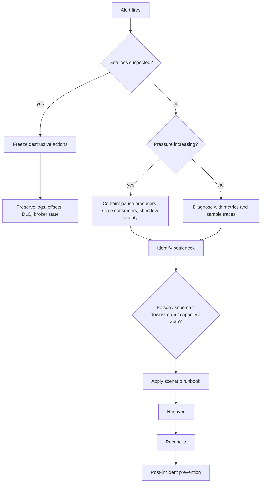
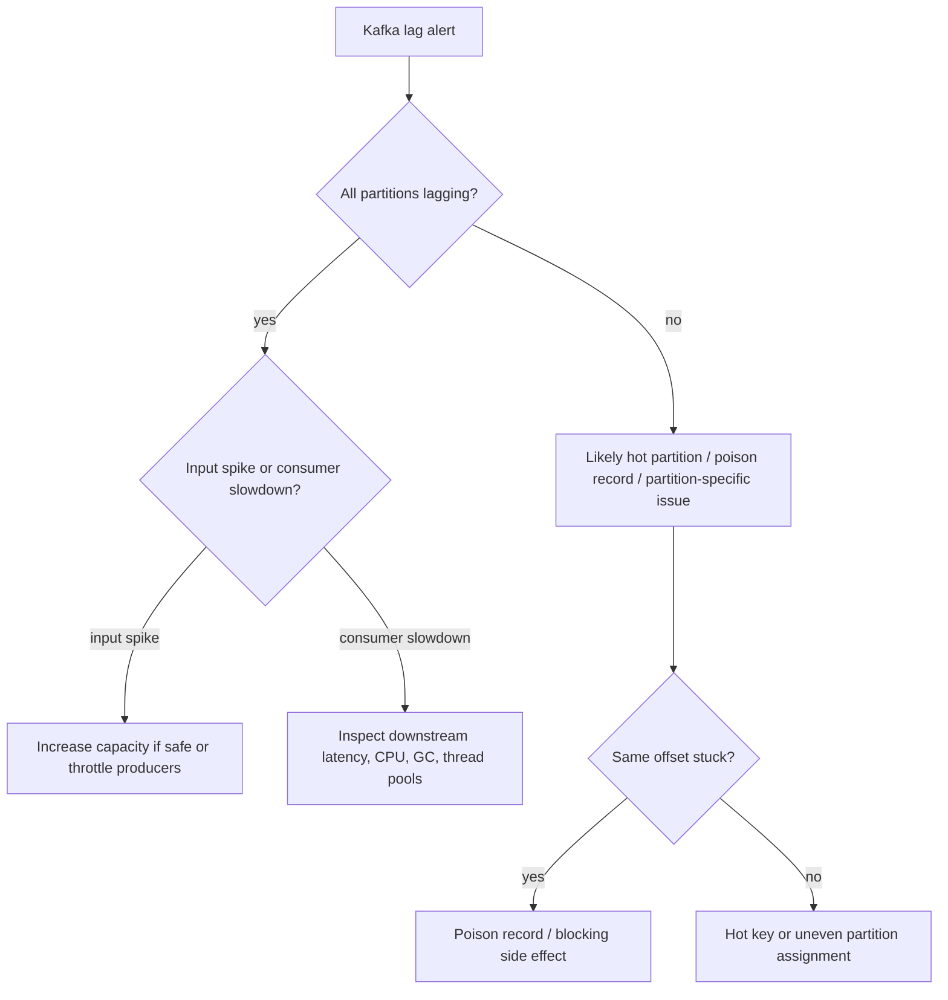
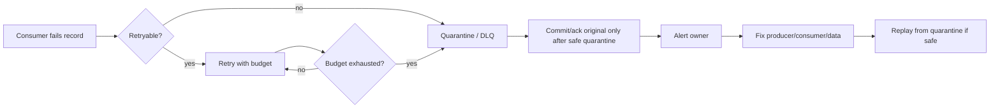

------
title: Learn Java Messaging and Event Streaming - Part 034
description: Production failure playbook for Java messaging and event-streaming systems: consumer lag explosion, broker disk full, rebalance storm, poison message, hot partition, DLQ flood, duplicate storm, schema incident, ksqlDB query failure, replay failure, and recovery drills across Kafka, RabbitMQ, JMS, RabbitMQ Streams, Kafka Streams, and ksqlDB.
series: learn-java-messaging-event-streaming
seriesTitle: Learn Java Messaging and Event Streaming
order: 34
partTitle: Production Failure Playbook: Incident Scenarios and Recovery Drills
tags:
- java
- messaging
- event-streaming
- kafka
- rabbitmq
- jms
- rabbitmq-streams
- kafka-streams
- ksqldb
- incident-response
- reliability
- runbook
- operations
- failure-modelling
date: 2026-06-28
---

# Part 034 — Production Failure Playbook: Incident Scenarios and Recovery Drills

## 1. What We Are Solving

Incident response in messaging systems is hard because the visible symptom is often not the root cause.

Examples:

- Kafka consumer lag grows, but the real cause is a downstream database lock.
- RabbitMQ queue depth grows, but the real cause is a consumer deployment stuck before `basicAck`.
- DLQ floods, but the real cause is a schema change in one producer.
- Kafka Streams restarts, but the real cause is a corrupt local state directory after disk pressure.
- ksqlDB query output stops, but the real cause is a source-topic authorization change.
- JMS messages redeliver forever, but the real cause is a non-idempotent side effect followed by rollback.

This part is a practical failure playbook.

The goal is not to memorize commands. The goal is to build a diagnostic frame:

```text
symptom -> blast radius -> invariant violation -> immediate containment -> root cause -> recovery -> prevention
```

---

## 2. Incident Triage Mental Model

When a messaging incident happens, do not start by changing random configs.

Start with four questions:

1. **Is the system losing data, duplicating data, delaying data, or corrupting meaning?**
2. **Is the failure local to one flow, one tenant, one partition, one broker, one consumer group, or global?**
3. **Is pressure increasing, stable, or decreasing?**
4. **Can we safely pause, shed, replay, or quarantine without violating business constraints?**

Use this triage graph:



---

## 3. Universal Incident Artifacts

Before making changes, capture enough state for investigation and recovery.

### 3.1 Kafka Capture

Capture:

- topic names;
- partitions affected;
- current end offsets;
- committed offsets per group;
- consumer lag and lag age;
- consumer group membership;
- rebalance frequency;
- broker health;
- under-replicated partitions;
- offline partitions;
- producer error metrics;
- recent topic config changes;
- schema versions;
- DLQ records sample;
- transaction-related errors if applicable.

### 3.2 RabbitMQ Capture

Capture:

- vhost;
- queue depth: ready and unacked;
- consumer count;
- consumer utilization;
- prefetch;
- publish rate;
- deliver/ack rate;
- redelivery rate;
- memory alarm;
- disk alarm;
- flow control state;
- connection blocked/unblocked events;
- channel errors;
- DLX routing;
- policy changes;
- node health.

### 3.3 JMS Capture

Capture:

- provider and version;
- destination;
- listener container/MDB concurrency;
- transaction mode;
- acknowledgement mode;
- redelivery count;
- DLQ route;
- connection/session errors;
- application server thread pool state;
- database transaction state;
- JTA/XA errors if applicable;
- recent deployment changes.

### 3.4 ksqlDB/Kafka Streams Capture

Capture:

- query ID or application ID;
- source topics;
- sink topics;
- internal topics;
- state directory health;
- task assignment;
- processing rate;
- process rate vs input rate;
- RocksDB/store metrics if available;
- commit latency;
- restore progress;
- rebalance events;
- deserialization exceptions;
- query status;
- recent query/config changes.

---

## 4. Severity Model

Define severity by business impact, not by broker metric alone.

| Severity | Messaging symptom | Business impact | Initial posture |
|---|---|---|---|
| SEV-1 | data loss, global broker outage, audit corruption | regulatory/business-critical failure | freeze destructive actions, incident commander |
| SEV-2 | major lag, DLQ flood, one critical workflow down | SLA breach or case processing blocked | contain pressure, isolate flow |
| SEV-3 | partial degradation, one tenant/consumer affected | delayed non-critical processing | diagnose and repair |
| SEV-4 | alert/noise/no customer impact | no immediate business impact | tune/cleanup during normal ops |

A million-message backlog can be SEV-3 if it is replayable and non-critical. Ten lost audit events can be SEV-1.

---

## 5. Scenario 1 — Kafka Consumer Lag Explosion

### 5.1 Symptoms

- consumer lag grows continuously;
- processing rate lower than input rate;
- lag concentrated in one partition or all partitions;
- consumer group appears stable but slow;
- downstream latency increases;
- retry topic grows;
- no obvious producer error.

### 5.2 Diagnosis

Ask:

- Is lag on all partitions or one partition?
- Is input rate abnormal?
- Did consumer deployment change?
- Did downstream dependency slow down?
- Is deserialization failing?
- Is processing blocked on synchronous I/O?
- Is `max.poll.interval.ms` being exceeded?
- Are commits happening?
- Is the consumer paused?
- Is there a hot key?

### 5.3 Decision Tree



### 5.4 Immediate Containment

Options:

- scale consumers if partitions allow;
- pause low-priority producers;
- pause only affected partitions if consumer supports it;
- route non-critical work to backlog;
- temporarily disable expensive enrichment;
- increase worker pool only if downstream can handle it;
- isolate poison record to DLQ if safely identified;
- create shadow consumer for diagnosis without committing offsets.

Do not simply increase `max.poll.records` or thread count without checking downstream capacity. You may convert lag into database failure.

### 5.5 Recovery

- Fix bottleneck.
- Confirm processing rate exceeds input rate.
- Estimate catch-up time.
- Monitor duplicate rate.
- Monitor side-effect error rate.
- Monitor lag age, not only message count.
- Reconcile processed event count against expected count.

### 5.6 Prevention

- alert on lag age;
- capacity test input spikes;
- enforce bounded worker queues;
- use pause/resume;
- separate critical and non-critical topics;
- design retry budget;
- track per-partition lag;
- detect hot keys.

---

## 6. Scenario 2 — RabbitMQ Queue Depth Explosion

### 6.1 Symptoms

- ready messages increasing;
- unacked messages high;
- consumers present but throughput low;
- redelivery rate high;
- consumer utilization low;
- publisher confirms slow;
- memory alarm or disk alarm may appear.

### 6.2 Interpret Ready vs Unacked

| Metric shape | Likely meaning |
|---|---|
| ready high, unacked low | not enough consumers or consumers not receiving |
| ready low, unacked high | consumers received but not acking |
| ready high, unacked high | consumers overwhelmed or blocked |
| redelivered high | requeue loop or failing consumer |
| publish high, ack flat | backlog forming |

### 6.3 Immediate Containment

- stop or slow non-critical publishers;
- scale consumers if downstream capacity exists;
- reduce prefetch if unacked is too high;
- increase prefetch if consumers are underutilized and safe;
- inspect consumer logs for processing failures;
- break requeue loops;
- route poison messages to DLQ;
- check memory/disk alarms;
- avoid queue purge unless business approves data loss.

### 6.4 Common Root Causes

- consumer deployment stuck;
- downstream DB slow;
- prefetch too high causing unfair distribution;
- prefetch too low causing underutilization;
- poison message requeued forever;
- DLX misconfigured;
- queue type unsuitable for workload;
- publisher surge;
- disk pressure;
- memory alarm flow control.

### 6.5 Recovery

- restore consumer ack rate above publish rate;
- watch ready/unacked decrease;
- inspect DLQ for poison pattern;
- verify no duplicate side-effect storm;
- check broker memory and disk after backlog drains;
- document whether ordering was affected.

---

## 7. Scenario 3 — RabbitMQ Memory/Disk Alarm and Flow Control

### 7.1 Symptoms

- publisher connections blocked;
- publish latency spikes;
- confirms delayed;
- broker reports memory alarm;
- broker reports disk free alarm;
- queues stop accepting new publish traffic;
- application logs show blocked connection or timeout.

### 7.2 Diagnosis

Check:

- which node raised alarm;
- memory high watermark;
- free disk threshold;
- largest queues;
- unacked messages;
- message TTL and length limit;
- stream retention;
- publisher rate;
- consumers missing or slow;
- replication overhead;
- queue leader distribution.

### 7.3 Immediate Containment

- slow or stop publishers;
- restore consumers;
- add disk if safe and supported by environment;
- reduce non-critical retention only after approval;
- move traffic away from overloaded node if supported;
- delete/purge only non-critical queues with explicit approval;
- avoid restarting blindly if disk/memory pressure will recur.

### 7.4 Prevention

- alert before alarm threshold;
- define queue length limits;
- define TTL;
- monitor unacked;
- use quorum queues intentionally;
- monitor stream retention footprint;
- capacity test publisher bursts;
- separate critical workloads.

---

## 8. Scenario 4 — Kafka Rebalance Storm

### 8.1 Symptoms

- repeated consumer group rebalances;
- processing pauses frequently;
- lag grows despite adequate capacity;
- logs show member leaving/joining;
- `max.poll.interval.ms` exceeded;
- session timeout;
- application pods restart;
- Kafka Streams tasks migrate frequently.

### 8.2 Root Causes

- processing takes longer than `max.poll.interval.ms`;
- consumer thread blocked;
- GC pauses;
- network instability;
- deployment rolling too aggressively;
- autoscaler flapping;
- too many consumers for partitions;
- slow state restore;
- bad liveness probe kills healthy-but-restoring app;
- cooperative rebalancing not used where beneficial.

### 8.3 Recovery

- stop autoscaler flapping;
- pause rollout;
- stabilize consumer count;
- increase processing capacity or reduce per-poll workload;
- separate poll thread from worker pool if design supports it;
- tune timeouts only after understanding processing duration;
- use static membership where appropriate;
- use cooperative rebalancing where appropriate;
- ensure graceful shutdown commits and leaves group cleanly.

### 8.4 Prevention

- measure max processing time per poll;
- keep poll loop alive;
- bound worker queue;
- tune `max.poll.records`;
- do rolling deploys with sufficient drain time;
- avoid scaling above partition count;
- alert on rebalance rate.

---

## 9. Scenario 5 — Poison Message

### 9.1 Symptoms

- same offset/message redelivers repeatedly;
- consumer crashes on same payload;
- DLQ receives one schema/type repeatedly;
- lag stuck at a specific partition;
- RabbitMQ redelivery count increases;
- JMS redelivery count increases;
- Kafka consumer cannot progress past one record if handled inline.

### 9.2 Poison Message Classes

| Class | Example | Fix |
|---|---|---|
| malformed | invalid JSON | DLQ and producer fix |
| schema-incompatible | missing required field | schema compatibility rollback |
| semantic invalid | status transition impossible | quarantine and business review |
| oversized | exceeds downstream limit | reference payload or split |
| security violation | unexpected PII/secrets | restrict access and remediate |
| side-effect poison | external API rejects always | retry budget then DLQ |

### 9.3 Recovery Pattern



### 9.4 Critical Rule

Do not allow one poison message to block an entire critical partition forever unless strict ordering requires it and business accepts the delay.

If ordering is mandatory, the incident must be escalated quickly because progress is intentionally blocked.

---

## 10. Scenario 6 — Hot Partition / Hot Key

### 10.1 Symptoms

- one Kafka partition has much higher lag;
- one consumer instance is overloaded;
- producer throughput uneven by partition;
- a small number of keys dominate traffic;
- consumer scaling does not help;
- p99 latency high while average looks acceptable.

### 10.2 Diagnosis

- identify top keys by count and bytes;
- compare partition input rate;
- compare partition lag age;
- inspect key design;
- check recent producer behavior;
- check tenant/case/event distribution;
- verify partitioner changes.

### 10.3 Recovery Options

| Option | Use when | Trade-off |
|---|---|---|
| throttle hot producer | hot key surge is temporary | delays source |
| split flow by priority | critical traffic blocked by noisy traffic | complexity |
| repartition by different key | current key not required for order | may break ordering semantics |
| shard hot key | one entity too large | application-level ordering complexity |
| increase partitions | future distribution helps | does not move existing keyed records uniformly without migration |
| special-case hot entity | rare huge tenant/case | bespoke routing |

Do not change partition key without understanding business ordering invariants.

---

## 11. Scenario 7 — DLQ Flood

### 11.1 Symptoms

- DLQ count rises rapidly;
- main consumer throughput appears healthy because failures are being offloaded;
- alert volume high;
- same exception repeats;
- many business entities missing downstream side effects.

### 11.2 Diagnosis

Ask:

- Are DLQ records from one producer version?
- One schema version?
- One tenant?
- One partition?
- One event type?
- One downstream error?
- Did a deployment or schema change occur?
- Is DLQ retention sufficient for recovery?
- Are failed messages safe to inspect?

### 11.3 Immediate Containment

- stop bad producer if active;
- disable broken consumer version;
- pause affected partitions if needed;
- preserve DLQ data;
- restrict DLQ access if sensitive payloads appeared;
- sample and classify failures;
- avoid replay until root cause fixed.

### 11.4 Recovery

- fix producer/consumer/schema;
- write replay plan;
- replay in batches;
- monitor duplicate side effects;
- reconcile affected entities;
- close DLQ records only after business confirmation.

### 11.5 Prevention

- compatibility gates;
- canary consumers;
- contract tests;
- alert on first DLQ record for critical flows;
- producer version header;
- schema ID/header in every event;
- DLQ dashboards by error class.

---

## 12. Scenario 8 — Duplicate Storm

### 12.1 Symptoms

- same business operation happens multiple times;
- duplicate notifications;
- duplicate database inserts;
- repeated external API calls;
- consumer logs show retries/redeliveries;
- producer retry metrics spike;
- network or broker timeout occurred.

### 12.2 Root Causes

- at-least-once delivery without idempotent consumer;
- producer retry after broker accepted write but ack was lost;
- RabbitMQ consumer processes side effect then crashes before ack;
- JMS transacted session rolls back after side effect;
- Kafka consumer processes and fails before commit;
- replay job not isolated;
- DLQ replay duplicates original successful side effect;
- transactional boundary does not include external system.

### 12.3 Immediate Containment

- stop replay jobs;
- pause affected consumers;
- identify idempotency key;
- disable non-idempotent side effects;
- switch to dry-run if possible;
- preserve duplicate samples;
- communicate business impact.

### 12.4 Recovery

- deduplicate downstream records;
- reconcile external effects;
- mark duplicate event IDs;
- rebuild projection if affected;
- add inbox/idempotency table;
- replay only missing records, not all records.

### 12.5 Prevention

- idempotency key in every command/event;
- unique constraint on side-effect table;
- inbox pattern;
- outbox pattern;
- external idempotency token;
- replay audit.

---

## 13. Scenario 9 — Schema Incompatibility Incident

### 13.1 Symptoms

- deserialization errors;
- consumer crashes after producer deployment;
- ksqlDB query fails;
- Kafka Streams task fails;
- DLQ fills with new schema version;
- older consumers cannot read new messages;
- new consumers cannot read old messages during replay.

### 13.2 Diagnosis

- identify schema ID/version;
- identify producer version;
- compare compatibility setting;
- inspect field additions/removals/type changes;
- check enum changes;
- check default values;
- check key schema changes;
- check data semantics, not only parser compatibility.

### 13.3 Immediate Containment

- roll back producer if still emitting bad records;
- pause affected consumers if crashing repeatedly;
- prevent more incompatible messages;
- preserve bad records;
- if safe, route to DLQ/quarantine;
- notify schema owner.

### 13.4 Recovery

- patch consumers to tolerate both versions;
- add defaults or compatibility transform;
- replay quarantined records;
- validate projection consistency;
- update schema governance rules.

### 13.5 Prevention

- schema registry compatibility;
- consumer-driven contract tests;
- canary topic;
- no breaking key changes without migration;
- enum evolution policy;
- explicit semantic versioning.

---

## 14. Scenario 10 — Kafka Streams State Store Failure

### 14.1 Symptoms

- Kafka Streams app restarts repeatedly;
- state restore takes too long;
- local disk full;
- RocksDB errors;
- changelog topic lag grows;
- tasks migrate repeatedly;
- output stops though input topics are healthy.

### 14.2 Diagnosis

- check local state directory disk;
- check changelog topic availability;
- check standby replica configuration;
- check restore bandwidth;
- inspect state store size;
- check repartition topic size;
- check rebalance frequency;
- inspect uncaught exception handler behavior;
- verify app version compatibility with serialized state.

### 14.3 Recovery

- stop flapping deployment;
- add disk or clear local state only if changelog can restore;
- scale restore carefully;
- verify changelog retention;
- redeploy with fixed state serializer if needed;
- rebuild state from source topics if possible;
- verify output from known checkpoints.

### 14.4 Prevention

- monitor state directory usage;
- monitor restore time;
- configure standby replicas where appropriate;
- keep changelog retention safe;
- test restore from empty state;
- avoid incompatible state schema changes.

---

## 15. Scenario 11 — ksqlDB Persistent Query Failure

### 15.1 Symptoms

- query status not running;
- sink topic stops receiving records;
- query lag grows;
- pull query returns stale state;
- processing log shows deserialization errors;
- internal topics grow;
- server restart causes long restore.

### 15.2 Diagnosis

- `DESCRIBE EXTENDED` query/source/sink;
- inspect processing log;
- check source topic ACLs;
- check sink topic ACLs;
- check schema compatibility;
- check repartition requirement;
- check state store size;
- check server capacity;
- check recent query changes.

### 15.3 Recovery

- fix source schema or query;
- terminate failed query only after preserving state expectations;
- create corrected query with new sink if output correctness is uncertain;
- rebuild materialized view if required;
- validate sink count and sample records;
- update query registry.

### 15.4 Prevention

- deploy ksqlDB queries through CI/CD;
- use query ownership metadata;
- test query against historical sample data;
- monitor query status and lag;
- restrict ad-hoc persistent query creation.

---

## 16. Scenario 12 — JMS Redelivery Loop

### 16.1 Symptoms

- same JMS message redelivered repeatedly;
- delivery count increases;
- MDB logs same exception;
- transaction rollbacks;
- DLQ not reached or delayed;
- downstream side effects may duplicate;
- application server thread pool saturated.

### 16.2 Diagnosis

- check acknowledgement/transaction mode;
- inspect `JMSRedelivered` and delivery count property if provider exposes it;
- identify exception class;
- check DLQ/redelivery policy;
- inspect container transaction boundary;
- verify whether side effect happens before rollback;
- inspect database locks/timeouts;
- check MDB concurrency.

### 16.3 Recovery

- stop bad consumer if duplicate side effects occur;
- route poison message to DLQ if provider supports admin move;
- fix root exception;
- make side effect idempotent;
- tune redelivery policy;
- resume consumption;
- reconcile duplicates.

### 16.4 Prevention

- idempotency table;
- bounded redelivery;
- DLQ policy;
- alert on redelivery count;
- avoid long blocking work in MDB;
- do not mix irreversible side effects inside rollback-prone transaction without idempotency.

---

## 17. Scenario 13 — Lost Message Suspicion

### 17.1 Symptoms

- business entity missing expected state;
- producer says event was sent;
- consumer says event was not received;
- no DLQ record;
- audit trail gap;
- offset/ack history unclear.

### 17.2 Investigation Order

Do not assume the broker lost the message. Most “lost message” incidents are actually one of:

- producer never sent;
- producer send failed but app ignored error;
- message sent to wrong topic/exchange/routing key;
- broker accepted but consumer skipped/committed incorrectly;
- consumer processed but side effect failed;
- side effect succeeded but audit missing;
- message expired due to TTL;
- message compacted/deleted by retention;
- DLX route missing;
- wrong consumer group inspected;
- tenant filter excluded it.

### 17.3 Evidence Chain

Build chain:

```text
business command accepted
-> producer outbox row created
-> broker append/publish confirmed
-> consumer fetched/delivered
-> processing started
-> side effect committed
-> offset/ack committed
-> audit record written
```

Any missing link tells you where to investigate.

### 17.4 Recovery

- if event never published: publish from outbox;
- if published but not consumed: reset/replay if safe;
- if consumed but side effect failed: repair side effect using idempotency key;
- if audit missing: reconstruct from immutable source if allowed;
- if retention deleted it: declare evidence gap and recover from source system.

---

## 18. Scenario 14 — Broker Node Failure

### 18.1 Kafka

Symptoms:

- broker down;
- leader elections;
- under-replicated partitions;
- offline partitions;
- producer errors;
- ISR shrink;
- controller logs noisy.

Immediate checks:

- are any partitions offline;
- are critical topics under-replicated;
- are producers using `acks=all` failing;
- is `min.insync.replicas` preventing unsafe writes;
- is broker disk healthy;
- is network partitioned;
- is controller stable.

Recovery:

- restore broker;
- do not force unsafe leader election unless data-loss trade-off is explicitly accepted;
- verify ISR recovery;
- verify consumer lag;
- verify no producer data-loss reports.

### 18.2 RabbitMQ

Symptoms:

- node down;
- queue leaders unavailable;
- quorum queue leader election;
- publishers blocked;
- consumers disconnected;
- management API degraded.

Recovery:

- restore node;
- verify quorum availability;
- check queue leader distribution;
- check unacked messages and redelivery;
- verify publisher confirms;
- watch memory/disk after recovery.

---

## 19. Scenario 15 — Bad Replay

### 19.1 Symptoms

- duplicate side effects;
- old events overwrite newer projections;
- notifications resent;
- derived topics contain unexpected historical state;
- downstream systems overloaded;
- audit confusion over original vs replayed event.

### 19.2 Immediate Containment

- stop replay job;
- pause affected consumers;
- identify replay range;
- identify output topics/tables;
- preserve logs;
- disable external side effects;
- notify business owner.

### 19.3 Recovery

- isolate replayed records using replay run ID;
- delete/rebuild derived projections if safe;
- reverse external side effects manually if necessary;
- reconcile entities by idempotency key and event time;
- document impacted records;
- update replay process.

### 19.4 Prevention

- replay requires approval;
- replay writes to shadow output by default;
- replay events include replay metadata;
- side effects disabled unless explicitly approved;
- idempotency keys mandatory;
- dry-run mode required.

---

## 20. Scenario 16 — Authorization Change Breaks Production

### 20.1 Symptoms

- producers suddenly fail authorization;
- consumers cannot join group;
- ksqlDB query fails reading/writing topics;
- RabbitMQ consumers receive access refused;
- JMS connection factory works but destination access fails;
- only one environment affected.

### 20.2 Diagnosis

- inspect recent ACL/permission changes;
- check principal name after certificate/SASL rotation;
- check topic/group/resource pattern;
- check RabbitMQ vhost permissions;
- check ksqlDB internal service account permissions;
- check transactional ID authorization;
- check management automation logs.

### 20.3 Recovery

- restore last known-good permissions;
- validate with least-privilege smoke test;
- restart only clients that need credential reload;
- verify no messages were lost during outage;
- catch up lag.

### 20.4 Prevention

- permission changes through CI/CD;
- preflight auth tests;
- environment-specific service principal registry;
- deny wildcard for apps;
- audit ACL changes.

---

## 21. Scenario 17 — Consumer Commit/Ack Bug

### 21.1 Symptoms

- messages skipped;
- duplicates after restart;
- offsets advance without side effects;
- side effects happen without offsets advancing;
- RabbitMQ unacked grows or messages reappear;
- JMS commits/rollbacks do not match business outcome.

### 21.2 Bad Kafka Pattern

```java
for (ConsumerRecord<String, Event> record : records) {
    consumer.commitSync(); // bad: commits before processing current record
    process(record);
}
```

Correct idea:

```java
for (ConsumerRecord<String, Event> record : records) {
    processIdempotently(record);
    markOffsetReady(record);
}
commitProcessedOffsets();
```

### 21.3 Bad RabbitMQ Pattern

```java
channel.basicAck(deliveryTag, false);
process(message); // bad: ack before durable side effect
```

Correct idea:

```java
processIdempotently(message);
channel.basicAck(deliveryTag, false);
```

### 21.4 Recovery

- identify offset/ack gap;
- replay from safe offset if possible;
- deduplicate side effects;
- rebuild projection from source-of-truth;
- add tests around commit/ack ordering.

---

## 22. Incident Command Checklist

### 22.1 First 10 Minutes

- [ ] declare incident severity;
- [ ] assign incident commander;
- [ ] identify affected business flow;
- [ ] freeze destructive admin actions;
- [ ] capture broker/consumer state;
- [ ] determine if data loss suspected;
- [ ] contain pressure if increasing;
- [ ] communicate initial impact.

### 22.2 First 30 Minutes

- [ ] identify root symptom class;
- [ ] identify affected topic/queue/stream/group;
- [ ] identify recent changes;
- [ ] check producer rate;
- [ ] check consumer rate;
- [ ] check DLQ/retry;
- [ ] check downstream dependencies;
- [ ] choose containment action;
- [ ] estimate recovery path.

### 22.3 Recovery Phase

- [ ] fix root cause;
- [ ] drain backlog safely;
- [ ] replay/quarantine with approval;
- [ ] reconcile business entities;
- [ ] verify audit trail;
- [ ] verify no duplicate storm;
- [ ] restore normal producer/consumer rates;
- [ ] close incident only after business confirmation.

### 22.4 Post-Incident

- [ ] timeline;
- [ ] root cause;
- [ ] missed alerts;
- [ ] missing dashboards;
- [ ] missing contract tests;
- [ ] missing idempotency;
- [ ] governance gaps;
- [ ] runbook update;
- [ ] drill scheduled.

---

## 23. Recovery Math

Backlog drain time:

```text
catch_up_time_seconds = backlog_messages / max(consumer_rate_per_sec - producer_rate_per_sec, 1)
```

But use business-weighted backlog, not only count.

A million tiny low-priority events may be less urgent than 500 delayed enforcement deadlines.

For Kafka, compute per partition:

```text
partition_catch_up_time = partition_lag / net_processing_rate_for_that_partition
```

For RabbitMQ:

```text
queue_catch_up_time = ready_messages / max(ack_rate - publish_rate, 1)
```

Also track oldest message age. A queue with only 1,000 messages can be severe if oldest age is 4 hours for a 5-minute SLA.

---

## 24. Drill Catalog

Practice incidents before production creates them.

### Drill 1 — Kafka Poison Record

- inject one semantically invalid event;
- verify retry budget;
- verify DLQ record;
- verify partition progresses;
- verify alert;
- replay fixed record.

### Drill 2 — RabbitMQ Consumer Crash Before Ack

- process side effect;
- crash before `basicAck`;
- verify redelivery;
- verify idempotency prevents duplicate side effect;
- verify metrics.

### Drill 3 — Schema Compatibility Failure

- produce incompatible schema in staging;
- verify compatibility gate blocks it;
- if bypassed, verify consumer fails safely;
- verify DLQ and alert.

### Drill 4 — ksqlDB Query Failure

- break a source schema;
- observe query failure;
- fix query;
- rebuild output;
- verify query registry updated.

### Drill 5 — Certificate Rotation

- rotate client cert;
- verify long-running producers reconnect;
- verify consumers maintain group stability;
- verify old cert revoked.

### Drill 6 — Replay Safety

- replay historical events to shadow output;
- verify no external side effects;
- reconcile output count;
- promote only after approval.

---

## 25. Anti-Patterns During Incidents

### 25.1 Purge First, Ask Later

Purging a queue or deleting a topic may destroy evidence and make reconciliation impossible.

Only purge when:

- data is confirmed non-critical;
- owner approves;
- impact is documented;
- snapshot/sample is preserved if needed.

### 25.2 Blind Scaling

Scaling consumers can worsen incidents if downstream is the bottleneck.

Scale only after checking:

- database capacity;
- external API rate limit;
- idempotency;
- partition count;
- consumer thread model;
- message ordering constraints.

### 25.3 Infinite Retry

Infinite retry hides failures, blocks progress, and amplifies load.

Use retry budgets and quarantine.

### 25.4 Offset Reset Without Evidence

Resetting offsets can duplicate side effects or skip records.

Require:

- current offset snapshot;
- target offset rationale;
- side-effect safety;
- rollback plan;
- approval.

### 25.5 Restart Storm

Repeated restarts can cause:

- Kafka rebalance storm;
- state restore loops;
- RabbitMQ redelivery storm;
- lost in-memory batch context;
- worse pressure.

Stabilize before restarting repeatedly.

---

## 26. Production Runbook Template

```yaml
runbook: reg-enforcement-case-escalation-consumer
ownerTeam: enforcement-platform
severityDefault: SEV-2
resources:
  kafkaTopics:
    - reg.enforcement.internal.case-status-changed.v1
    - reg.enforcement.restricted.case-escalation-event.v1
  consumerGroups:
    - reg.enforcement.case-escalation-consumer.prod
  dlqTopics:
    - reg.enforcement.restricted.case-escalation-event.dlq.v1
businessSLA:
  maxEventAge: 5m
  maxEscalationDelay: 15m
symptoms:
  lagHigh:
    alert: kafka_consumer_lag_age_seconds > 300
    firstActions:
      - check input rate
      - check processing rate
      - check downstream DB latency
      - check DLQ rate
  dlqHigh:
    alert: dlq_records_total > 0
    firstActions:
      - sample DLQ safely
      - classify error
      - identify producer version
containment:
  allowed:
    - pause affected partition
    - disable notification side effect
    - replay to shadow topic
  approvalRequired:
    - reset offsets
    - replay to production sink
    - purge DLQ
recovery:
  checks:
    - lag age below 60s
    - DLQ stable at 0 new records
    - duplicate side effects reconciled
    - case escalation count matches expected
```

---

## 27. Regulatory Case-Management Incident Example

### Situation

A case escalation pipeline is delayed.

Symptoms:

- Kafka lag age: 47 minutes;
- DLQ count: 12,490;
- producer version changed two hours ago;
- downstream SLA breach dashboard missing new candidates;
- event type: `CaseRiskScoreUpdated`;
- new producer field: `riskTier` changed from string to object.

### Correct Response

1. Declare SEV-2 because escalation deadlines are affected.
2. Stop or roll back bad producer.
3. Preserve DLQ records.
4. Confirm no data loss: compare producer outbox count, Kafka topic count, DLQ count.
5. Patch consumer to tolerate both schema shapes or restore compatible producer schema.
6. Replay DLQ in controlled batches.
7. Reconcile escalation candidates.
8. Update schema compatibility test.
9. Add canary consumer for future schema changes.

### Wrong Response

- Delete DLQ to clear dashboard.
- Reset consumer offsets to latest.
- Increase consumers without fixing deserialization.
- Tell business “Kafka was slow” without causal chain.

The top-tier response explains the causal chain and preserves evidentiary integrity.

---

## 28. Summary

Messaging incidents are rarely solved by one magic command.

A strong failure playbook follows a consistent discipline:

- classify the symptom;
- preserve evidence;
- contain pressure;
- identify the invariant violation;
- avoid destructive shortcuts;
- recover with idempotency and replay controls;
- reconcile business state;
- update governance and automation.

The next and final part uses everything from the series to design a full regulatory case-management event platform: event contracts, escalation flows, replay, observability, idempotency, security, and production runbooks.

## References

- Apache Kafka documentation — Operations and security documentation entry points: https://kafka.apache.org/documentation/
- Apache Kafka documentation — Producer configuration: https://kafka.apache.org/41/configuration/producer-configs/
- Apache Kafka documentation — Consumer configuration: https://kafka.apache.org/41/configuration/consumer-configs/
- Apache Kafka documentation — Authorization and ACLs: https://kafka.apache.org/42/security/authorization-and-acls/
- RabbitMQ documentation — Flow Control: https://www.rabbitmq.com/docs/flow-control
- RabbitMQ documentation — Memory and Disk Alarms: https://www.rabbitmq.com/docs/alarms
- RabbitMQ documentation — Consumer Acknowledgements and Publisher Confirms: https://www.rabbitmq.com/docs/confirms
- RabbitMQ documentation — Dead Lettering: https://www.rabbitmq.com/docs/dlx
- RabbitMQ documentation — Access Control: https://www.rabbitmq.com/docs/access-control
- Confluent documentation — ksqlDB operations and deployment: https://docs.confluent.io/platform/current/ksqldb/operate-and-deploy/overview.html
