------
title: Learn Java Messaging and Event Streaming - Part 035
description: Capstone architecture for a regulatory case-management event platform using Java messaging and event-streaming concepts: Kafka, JMS/Jakarta Messaging, RabbitMQ, RabbitMQ Streams, Kafka Streams, ksqlDB, outbox/inbox, audit trail, replay, SLA escalation, observability, security, governance, and failure modelling.
series: learn-java-messaging-event-streaming
seriesTitle: Learn Java Messaging and Event Streaming
order: 35
partTitle: Capstone: Regulatory Case-Management Event Platform
tags:
- java
- messaging
- event-streaming
- kafka
- rabbitmq
- rabbitmq-streams
- jms
- jakarta-messaging
- kafka-streams
- ksqldb
- architecture
- regulatory-systems
- case-management
- audit
- governance
- capstone
date: 2026-06-28
---

# Part 035 — Capstone: Regulatory Case-Management Event Platform

## 1. What We Are Building

This final part turns the whole series into one concrete architecture.

The system is a **regulatory case-management event platform**.

It supports:

- intake of complaints, alerts, referrals, suspicious activity, inspections, and supervisory findings;
- case creation and case lifecycle tracking;
- risk scoring;
- assignment and workload routing;
- investigation tasks;
- enforcement decisioning;
- escalation and SLA monitoring;
- cross-entity impact propagation;
- audit-grade event history;
- replayable projections;
- reporting and analytics;
- integration with legacy Java/Jakarta EE systems;
- integration with external agencies and notification channels.

The system is not only a CRUD application.

It is an operational and evidentiary platform.

That means the architecture must answer questions like:

- Who knew what, when?
- Which facts triggered the case?
- Which rules were evaluated?
- Which SLA was breached?
- Which officer or unit owned the case at each point?
- Which entity was affected by which related case?
- Which events were replayed, corrected, quarantined, or redelivered?
- Can we reconstruct the decision path months or years later?

A regulatory system fails not only when it is unavailable. It also fails when it cannot explain itself.

---

## 2. Design Philosophy

The platform is built around a few hard rules.

### 2.1 Use Events for Facts, Commands for Intent

A command asks something to happen.

An event records that something happened.

Examples:

| Type | Example | Meaning |
|---|---|---|
| Command | `OpenCaseCommand` | Request to open a case |
| Event | `CaseOpened` | Case was opened |
| Command | `AssignCaseCommand` | Request to assign a case |
| Event | `CaseAssigned` | Case was assigned |
| Command | `EscalateCaseCommand` | Request to escalate |
| Event | `CaseEscalated` | Case was escalated |
| Command | `IssueNoticeCommand` | Request to issue formal notice |
| Event | `NoticeIssued` | Notice was issued |

Commands can be rejected.

Events should be treated as durable facts. If an event is wrong, do not silently mutate history. Emit a correction, reversal, supersession, or administrative annotation.

### 2.2 Use State Machines for Lifecycle, Not Free-Form Status Strings

A case platform needs lifecycle control.

Bad model:

```text
case.status = "waiting approval maybe reopened?"
```

Good model:

```text
case.state = UNDER_INVESTIGATION
case.version = 17
last_transition = EvidenceSubmitted -> InvestigationCompleted
```

The event platform should publish state transitions, not vague status updates.

### 2.3 Separate Operational Flow from Evidentiary History

Operational flow is about doing work.

Evidentiary history is about reconstructing truth.

Those are related, but not identical.

Operational queues can expire, retry, dead-letter, or route by workload.

Audit events must be retained according to policy, immutable in practice, access-controlled, and replay-aware.

### 2.4 Make Replay a First-Class Requirement

Replay is not a backup plan. It is a design constraint.

A replayable system needs:

- stable event schemas;
- deterministic projection logic where possible;
- idempotent consumers;
- explicit event versioning;
- correction events;
- time-window semantics;
- access control on historical data;
- replay runbooks;
- replay blast-radius control.

### 2.5 Do Not Use Every Tool Everywhere

This capstone uses multiple technologies, but not as a recommendation to deploy everything in every project.

The point is to show how each technology fits when its semantics are needed.

A simpler platform might use only Kafka.

Another platform might use RabbitMQ only.

An enterprise Jakarta EE estate might keep JMS for internal asynchronous integration and introduce Kafka only for event history.

Architecture maturity means choosing by invariant, not by trend.

---

## 3. Platform Technology Roles

The capstone uses the following split.

| Concern | Recommended Role | Why |
|---|---|---|
| Canonical event backbone | Kafka | Durable partitioned event log, replay, consumer groups, ecosystem |
| Stateful stream processing | Kafka Streams | Java-native topology, local state, joins, windows, exactly-once Kafka boundary |
| Declarative operational projections | ksqlDB | SQL-based stream/table derivation, materialized views, analyst/operator-friendly |
| Task dispatch and work routing | RabbitMQ queues | Flexible routing, work queues, prefetch, manual ack, DLX retry |
| High-throughput append-only stream inside RabbitMQ estate | RabbitMQ Streams / Superstreams | Stream semantics where RabbitMQ is the operational platform |
| Legacy Java/Jakarta EE integration | Jakarta Messaging/JMS | Existing app-server integration and enterprise messaging abstraction |
| Database-to-event consistency | Outbox + CDC or transactional publisher discipline | Avoid dual-write inconsistency |
| Duplicate protection | Inbox/idempotency table | At-least-once delivery is normal |
| Audit reconstruction | Event log + audit projection + immutable write policy | Regulatory defensibility |

The important principle:

```text
Kafka is the canonical event memory.
RabbitMQ is the operational work router.
JMS is the enterprise integration boundary.
ksqlDB/Kafka Streams are derived-state engines.
Outbox/inbox patterns protect state consistency.
```

---

## 4. Bounded Contexts

The platform is split into bounded contexts.

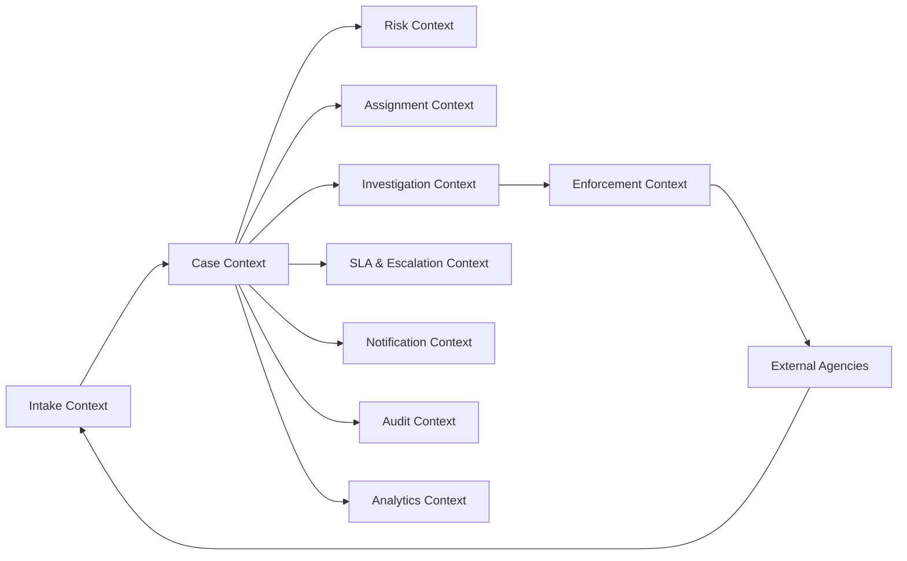

### 4.1 Intake Context

Responsible for:

- receiving external signals;
- validating minimum required data;
- deduplicating intake;
- classifying source type;
- creating intake record;
- emitting `IntakeReceived`, `IntakeValidated`, `IntakeRejected`, `IntakeLinkedToExistingCase`.

It should not own investigation workflow.

### 4.2 Case Context

Responsible for:

- case identity;
- lifecycle state;
- transitions;
- case versioning;
- ownership link;
- relationship between cases and regulated entities.

It emits canonical events such as:

- `CaseOpened`;
- `CaseClassified`;
- `CasePriorityChanged`;
- `CaseStateTransitioned`;
- `CaseClosed`;
- `CaseReopened`.

### 4.3 Risk Context

Responsible for:

- risk rules;
- scoring;
- risk explanation;
- model version;
- threshold changes;
- impact factor calculation.

It emits:

- `RiskScoreCalculated`;
- `RiskBandChanged`;
- `HighRiskCaseDetected`;
- `RiskModelVersionApplied`.

### 4.4 Assignment Context

Responsible for:

- unit assignment;
- officer assignment;
- workload balancing;
- skill-based routing;
- conflict-of-interest checks.

It may use RabbitMQ for dispatching work tasks because work routing can be operationally dynamic.

It emits:

- `CaseAssignmentRequested`;
- `CaseAssigned`;
- `CaseAssignmentRejected`;
- `CaseReassigned`.

### 4.5 Investigation Context

Responsible for:

- evidence requests;
- document reviews;
- interview tasks;
- field inspection tasks;
- investigation findings.

It emits:

- `EvidenceRequested`;
- `EvidenceReceived`;
- `FindingRecorded`;
- `InvestigationCompleted`.

### 4.6 Enforcement Context

Responsible for:

- enforcement recommendation;
- legal review;
- notice issuance;
- sanction proposal;
- final decision;
- appeal linkage.

It emits:

- `EnforcementRecommended`;
- `LegalReviewCompleted`;
- `NoticeIssued`;
- `SanctionProposed`;
- `DecisionIssued`;
- `AppealReceived`.

### 4.7 SLA and Escalation Context

Responsible for:

- SLA clock start;
- SLA pause/resume;
- deadline calculation;
- breach detection;
- escalation routing.

It emits:

- `SlaClockStarted`;
- `SlaClockPaused`;
- `SlaClockResumed`;
- `SlaDeadlineApproaching`;
- `SlaBreached`;
- `CaseEscalated`.

### 4.8 Audit Context

Responsible for:

- immutable audit projection;
- event-chain reconstruction;
- actor/action/resource/time capture;
- evidence of replay/correction;
- audit export.

It should not be coupled to operational queues.

---

## 5. Lifecycle State Machine

A regulatory case should have explicit states and controlled transitions.

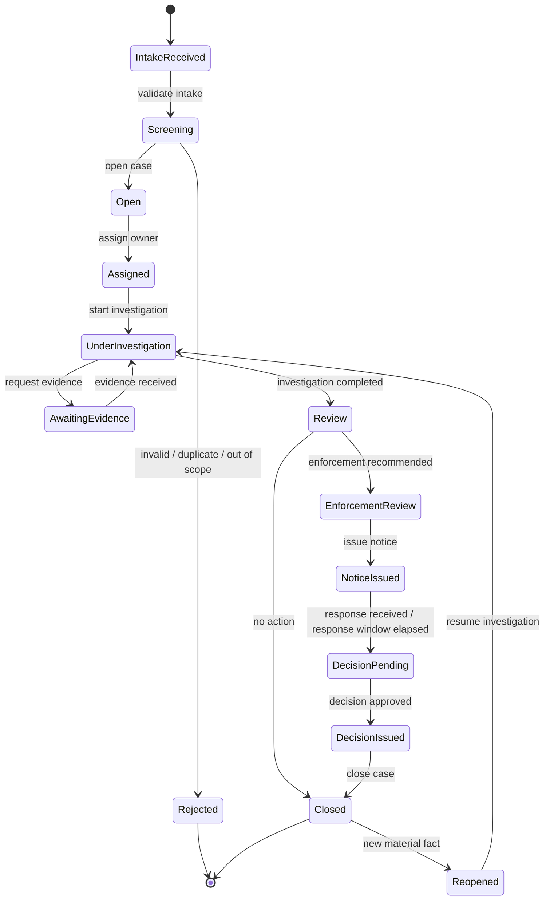

The event platform must enforce transition discipline.

Bad event:

```json
{
  "eventType": "CaseUpdated",
  "status": "something changed"
}
```

Good event:

```json
{
  "eventType": "CaseStateTransitioned",
  "caseId": "CASE-2026-0000192",
  "fromState": "UNDER_INVESTIGATION",
  "toState": "REVIEW",
  "transitionReason": "INVESTIGATION_COMPLETED",
  "transitionedBy": "user:officer-481",
  "occurredAt": "2026-06-28T09:30:11Z",
  "caseVersion": 42
}
```

The second event is replayable, auditable, and semantically useful.

---

## 6. Event Taxonomy

Do not put every event into one flat bucket.

Use taxonomy.

| Event Family | Meaning | Example |
|---|---|---|
| Intake event | External or internal signal received/validated | `IntakeReceived` |
| Case lifecycle event | Case state or classification changed | `CaseStateTransitioned` |
| Assignment event | Ownership/work routing changed | `CaseAssigned` |
| Risk event | Score or risk band changed | `RiskScoreCalculated` |
| Investigation event | Evidence/finding/progress changed | `FindingRecorded` |
| Enforcement event | Formal enforcement process changed | `NoticeIssued` |
| SLA event | Deadline/escalation state changed | `SlaBreached` |
| Audit event | Audit annotation or administrative correction | `AuditAnnotationAdded` |
| Integration event | External agency/system interaction | `ExternalReferralSent` |

### 6.1 Event Naming Rules

Use past-tense facts:

- `CaseOpened`, not `OpenCase`;
- `EvidenceReceived`, not `ReceiveEvidence`;
- `RiskScoreCalculated`, not `CalculateRiskScore`.

Use explicit domain meaning:

- `CasePriorityChanged`, not `CaseUpdated`;
- `SlaClockPaused`, not `StatusChanged`;
- `NoticeIssued`, not `DocumentSent`.

Use reason fields when the same transition can occur for multiple reasons:

```json
{
  "eventType": "CaseClosed",
  "closeReason": "NO_BREACH_FOUND"
}
```

### 6.2 Event Granularity

Too coarse:

```text
CaseUpdated
```

Too fine:

```text
CaseTitleCharacterChanged
```

Useful granularity:

```text
CaseClassified
CasePriorityChanged
CaseOwnerChanged
CaseStateTransitioned
FindingRecorded
```

A good event should usually answer:

```text
What business fact changed?
For which entity?
Who or what caused it?
When did it occur?
What version of the entity was produced?
What should downstream systems be allowed to infer?
```

---

## 7. Canonical Event Envelope

A capstone platform needs an event envelope.

Example:

```json
{
  "eventId": "01J1S4A8P9QF9YH6K7P7WE9A1V",
  "eventType": "CaseAssigned",
  "eventVersion": 3,
  "occurredAt": "2026-06-28T09:30:11.123Z",
  "publishedAt": "2026-06-28T09:30:11.891Z",
  "producer": "case-service",
  "producerVersion": "2.17.4",
  "tenantId": "regulator-id",
  "jurisdiction": "ID",
  "correlationId": "corr-8b1c4d",
  "causationId": "event-previous-123",
  "traceId": "4bf92f3577b34da6a3ce929d0e0e4736",
  "actor": {
    "type": "USER",
    "id": "officer-481",
    "unit": "enforcement-east"
  },
  "subject": {
    "type": "CASE",
    "id": "CASE-2026-0000192",
    "version": 17
  },
  "classification": {
    "dataSensitivity": "CONFIDENTIAL",
    "retentionClass": "REGULATORY_CASE_7Y",
    "legalHold": false
  },
  "payload": {
    "caseId": "CASE-2026-0000192",
    "assignedUnit": "enforcement-east",
    "assignedOfficer": "officer-481",
    "assignmentReason": "SKILL_AND_WORKLOAD_MATCH",
    "previousOwner": null
  }
}
```

### 7.1 Envelope Field Rules

| Field | Rule |
|---|---|
| `eventId` | Globally unique, stable across retry |
| `eventType` | Past-tense domain fact |
| `eventVersion` | Schema version for this event type |
| `occurredAt` | Business time when fact occurred |
| `publishedAt` | Time producer published event |
| `correlationId` | Groups related messages across workflow |
| `causationId` | Points to command/event that caused this event |
| `traceId` | Observability trace context |
| `subject` | Main aggregate/entity affected |
| `classification` | Security, retention, legal hold |
| `payload` | Event-specific business data |

Do not put sensitive data in headers just because headers feel “metadata-like”. Headers are often logged more casually than payloads.

---

## 8. Topic and Queue Topology

The platform uses different messaging primitives for different invariants.

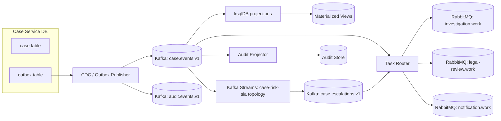

### 8.1 Kafka Topics

Suggested topic families:

```text
case.events.v1
case.commands.v1
case.escalations.v1
case.audit.v1
case.deadletter.v1
case.retry.5m.v1
case.retry.1h.v1
entity.events.v1
risk.events.v1
notification.events.v1
```

Rules:

- canonical facts go to event topics;
- operational retry topics are not audit truth;
- DLQ topics must include enough context to replay safely;
- topic names should encode domain and purpose, not implementation class names;
- version suffix should represent compatibility boundary, not every minor schema change.

### 8.2 Kafka Partitioning

Use keys based on ordering invariants.

| Event Type | Key | Reason |
|---|---|---|
| `CaseOpened` | `caseId` | All case lifecycle facts ordered per case |
| `CaseAssigned` | `caseId` | Assignment should follow case lifecycle |
| `EvidenceReceived` | `caseId` | Investigation ordering per case |
| `EntityRiskChanged` | `entityId` | Risk ordering per regulated entity |
| `SlaBreached` | `caseId` | Escalation ordering per case |

Do not key by officer if the invariant is case lifecycle order.

Do not key by tenant only unless you want one tenant to become a hot partition.

### 8.3 RabbitMQ Exchanges and Queues

RabbitMQ handles operational work dispatch.

Example topology:

```text
exchange: case.work.topic

routing keys:
  investigation.high.priority
  investigation.normal.priority
  legal.review.required
  notification.email
  notification.sms
  enforcement.notice.issue

queues:
  q.investigation.high
  q.investigation.normal
  q.legal.review
  q.notification.email
  q.notification.sms
  q.enforcement.notice
```

Routing can include:

- unit;
- skill;
- priority;
- jurisdiction;
- work type;
- legal review requirement.

RabbitMQ queues are good when the question is:

```text
Which worker should do this task now?
```

Kafka topics are better when the question is:

```text
What happened, and who may need to know or replay it later?
```

### 8.4 JMS Destinations

JMS/Jakarta Messaging is used for legacy Java/Jakarta EE integration.

Example:

```text
jms/queue/LegacyInspectionRequest
jms/topic/LegacyCaseEvents
```

Do not make JMS the hidden source of truth if Kafka is the canonical event backbone.

Use an adapter:

```text
Kafka event -> JMS adapter -> legacy destination
JMS message -> validation adapter -> Kafka canonical event
```

The adapter must be idempotent.

---

## 9. Write Path: Case Opening

The case opening path demonstrates the outbox pattern.

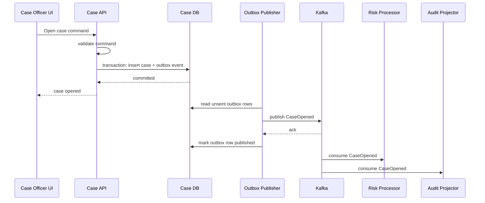

### 9.1 Why Outbox Exists

Without outbox:

```text
1. Insert case into database.
2. Publish event to Kafka.
```

Failure between step 1 and step 2 creates a case without event.

Alternative failure:

```text
1. Publish event to Kafka.
2. Insert case into database.
```

Failure between step 1 and step 2 creates an event without case.

With outbox:

```text
1. In one DB transaction: insert case + insert outbox event.
2. Outbox publisher eventually publishes the event.
3. Outbox publisher marks event as published only after broker confirmation.
```

At-least-once publish is expected. Consumers must be idempotent.

### 9.2 Outbox Table Shape

Example:

```sql
CREATE TABLE outbox_event (
    id              VARCHAR(64) PRIMARY KEY,
    aggregate_type  VARCHAR(80) NOT NULL,
    aggregate_id    VARCHAR(120) NOT NULL,
    aggregate_version BIGINT NOT NULL,
    event_type      VARCHAR(120) NOT NULL,
    event_version   INT NOT NULL,
    payload_json    JSONB NOT NULL,
    headers_json    JSONB NOT NULL,
    occurred_at     TIMESTAMP WITH TIME ZONE NOT NULL,
    published_at    TIMESTAMP WITH TIME ZONE,
    publish_status  VARCHAR(30) NOT NULL,
    retry_count     INT NOT NULL DEFAULT 0,
    last_error      TEXT
);

CREATE UNIQUE INDEX ux_outbox_aggregate_version
ON outbox_event(aggregate_type, aggregate_id, aggregate_version);
```

The unique aggregate-version index protects lifecycle ordering.

### 9.3 Java Transaction Sketch

```java
@Transactional
public CaseId openCase(OpenCaseCommand command) {
    CaseRecord caseRecord = CaseRecord.open(
        command.intakeId(),
        command.entityId(),
        command.classification(),
        command.actor()
    );

    caseRepository.insert(caseRecord);

    CaseOpened event = CaseOpened.from(caseRecord, command);

    outboxRepository.insert(OutboxEvent.from(
        event.eventId(),
        "CASE",
        caseRecord.caseId().value(),
        caseRecord.version(),
        "CaseOpened",
        1,
        event
    ));

    return caseRecord.caseId();
}
```

Important:

- the API does not publish directly inside the same method unless using a proven transactional boundary;
- the outbox row uses the same database transaction as the aggregate change;
- the event ID is stable;
- the aggregate version is explicit;
- duplicate publish is allowed but duplicate business effect is not.

---

## 10. Read Path: Materialized Case Overview

Operators need fast case overview screens.

Do not make the UI reconstruct everything from raw events on every request.

Create projections.

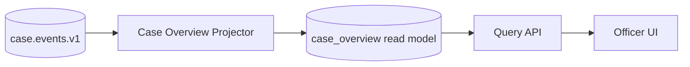

Projection example:

```sql
CREATE TABLE case_overview (
    case_id           VARCHAR(120) PRIMARY KEY,
    entity_id         VARCHAR(120) NOT NULL,
    current_state     VARCHAR(80) NOT NULL,
    priority          VARCHAR(30) NOT NULL,
    risk_band         VARCHAR(30),
    owner_unit        VARCHAR(120),
    owner_officer     VARCHAR(120),
    opened_at         TIMESTAMP WITH TIME ZONE NOT NULL,
    last_event_id     VARCHAR(64) NOT NULL,
    last_event_at     TIMESTAMP WITH TIME ZONE NOT NULL,
    projection_version BIGINT NOT NULL
);
```

Projection consumer rule:

```text
Apply event only if event.subject.version > projection_version.
Ignore event if already applied.
Reject/quarantine event if version gap is detected and gap cannot be recovered automatically.
```

This protects against duplicates and out-of-order delivery.

---

## 11. SLA and Escalation Flow

SLA logic is stateful.

It depends on case priority, state, pause/resume events, holidays, jurisdiction rules, and elapsed time.

A simplified flow:

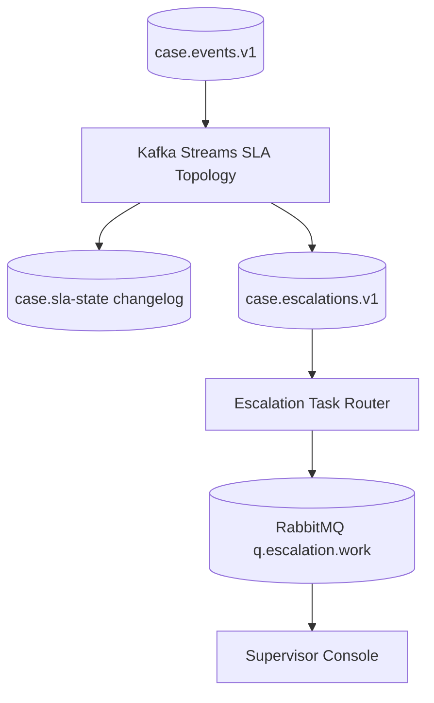

### 11.1 SLA Input Events

The SLA processor consumes:

- `CaseOpened`;
- `CasePriorityChanged`;
- `CaseStateTransitioned`;
- `SlaClockPaused`;
- `SlaClockResumed`;
- `EvidenceRequested`;
- `EvidenceReceived`;
- `CaseClosed`.

### 11.2 SLA State

Example state:

```json
{
  "caseId": "CASE-2026-0000192",
  "slaPolicyId": "HIGH_RISK_INVESTIGATION_V4",
  "clockState": "RUNNING",
  "deadlineAt": "2026-07-03T17:00:00Z",
  "pausedDurationSeconds": 0,
  "lastEvaluatedEventId": "01J1...",
  "lastEvaluatedAt": "2026-06-28T09:31:00Z",
  "breachEmitted": false
}
```

### 11.3 Kafka Streams Sketch

```java
StreamsBuilder builder = new StreamsBuilder();

KStream<String, CaseEvent> events = builder.stream(
    "case.events.v1",
    Consumed.with(Serdes.String(), caseEventSerde)
);

KTable<String, SlaState> slaState = events
    .filter((caseId, event) -> event.affectsSla())
    .groupByKey(Grouped.with(Serdes.String(), caseEventSerde))
    .aggregate(
        SlaState::empty,
        (caseId, event, state) -> state.apply(event),
        Materialized.<String, SlaState, KeyValueStore<Bytes, byte[]>>as("case-sla-store")
            .withKeySerde(Serdes.String())
            .withValueSerde(slaStateSerde)
    );

slaState
    .toStream()
    .filter((caseId, state) -> state.shouldEmitEscalation())
    .mapValues(SlaState::toEscalationEvent)
    .to("case.escalations.v1", Produced.with(Serdes.String(), escalationEventSerde));
```

The hard part is not the syntax.

The hard part is making `state.apply(event)` deterministic and versioned.

### 11.4 Escalation Invariant

For each case and SLA policy:

```text
emit at most one SlaBreached event per breach window
```

Enforce with:

- state store flag;
- event ID derived from `caseId + slaPolicyId + breachWindow`;
- idempotent downstream task creation;
- inbox table in escalation service.

---

## 12. Assignment and Work Routing

Case assignment has different semantics from event history.

A case assignment event is durable history.

A work item is operational work.

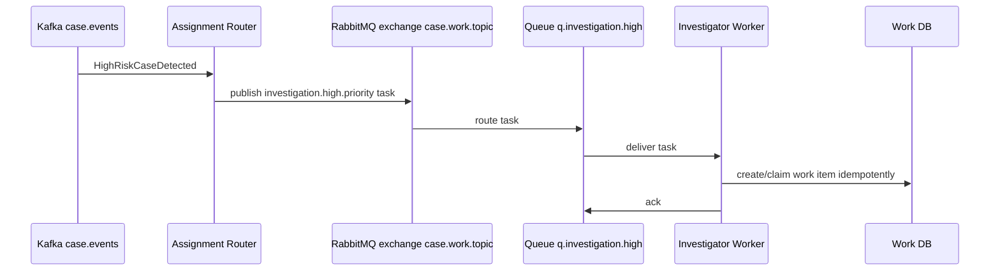

### 12.1 Why RabbitMQ Here

RabbitMQ is a strong fit when:

- many workers compete for tasks;
- prefetch controls worker pressure;
- routing keys encode priority/skill/jurisdiction;
- manual ack protects task completion;
- DLX can isolate failed work tasks;
- operational messages do not need long-term replay as canonical history.

### 12.2 Work Task Payload

```json
{
  "taskId": "TASK-2026-0000911",
  "taskType": "INVESTIGATE_HIGH_RISK_CASE",
  "caseId": "CASE-2026-0000192",
  "priority": "HIGH",
  "jurisdiction": "ID-JK",
  "requiredSkills": ["FINANCIAL_CRIME", "FIELD_INSPECTION"],
  "dueAt": "2026-07-01T17:00:00Z",
  "sourceEventId": "01J1S4A8P9QF9YH6K7P7WE9A1V",
  "correlationId": "corr-8b1c4d"
}
```

### 12.3 Worker Ack Rule

A worker must ack only after the work item is durably created or updated.

```text
consume task
validate task
begin transaction
  insert work_item if not exists task_id
  link work_item to case
commit
ack message
```

If the worker crashes before ack, the message can redeliver.

The unique `task_id` protects against duplicate work item creation.

---

## 13. Cross-Entity Impact Propagation

Regulatory systems often need cross-entity reasoning.

Example:

- one regulated entity is part of a group;
- a finding against one branch affects parent risk;
- a director appears across multiple entities;
- a sanction triggers monitoring for related entities.

Model this as event-driven graph impact.

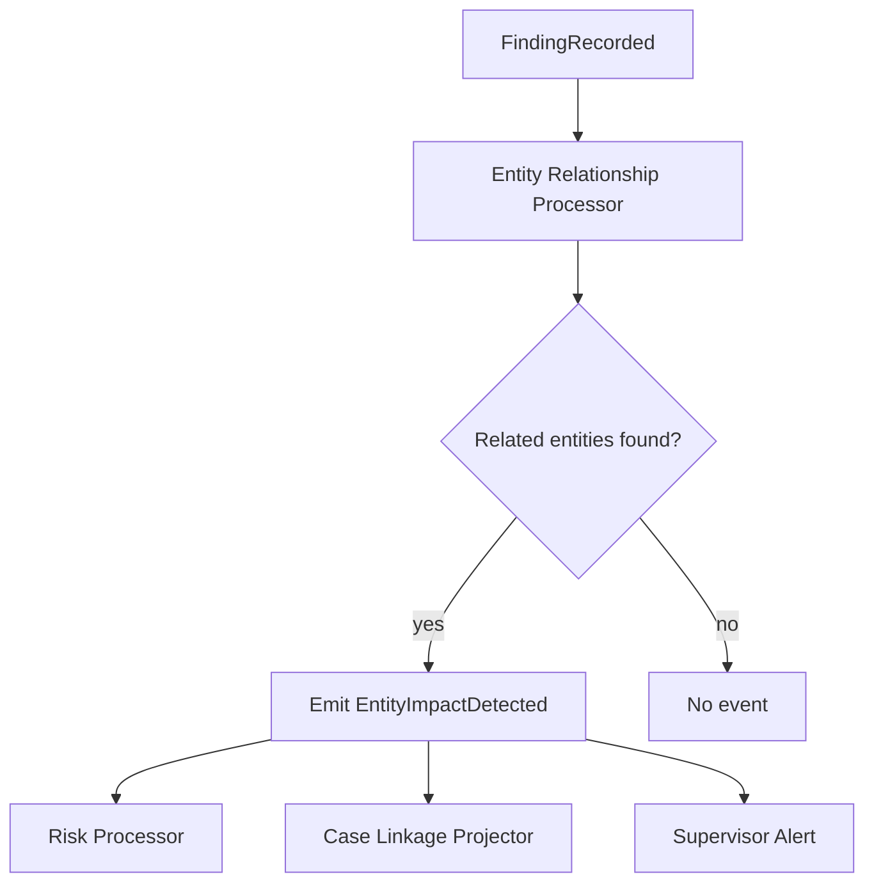

### 13.1 Impact Event Example

```json
{
  "eventType": "EntityImpactDetected",
  "eventVersion": 1,
  "payload": {
    "sourceCaseId": "CASE-2026-0000192",
    "sourceEntityId": "ENTITY-123",
    "impactedEntityId": "ENTITY-987",
    "relationshipType": "COMMON_DIRECTOR",
    "relationshipConfidence": "HIGH",
    "impactReason": "ADVERSE_FINDING_RELATED_PARTY",
    "requiresReview": true
  }
}
```

### 13.2 Graph Consistency Rule

Do not emit impact events from stale relationship data without marking the relationship snapshot version.

Include:

```text
relationshipGraphVersion
relationshipSnapshotAt
relationshipSource
```

Otherwise, an investigator cannot later understand why the impact was detected.

---

## 14. Audit Trail Design

Audit is not just application logging.

A good audit trail is:

- structured;
- queryable;
- immutable in practice;
- tied to actor and authority;
- tied to evidence and source event;
- time-consistent;
- replay-aware;
- correction-aware.

### 14.1 Audit Projection

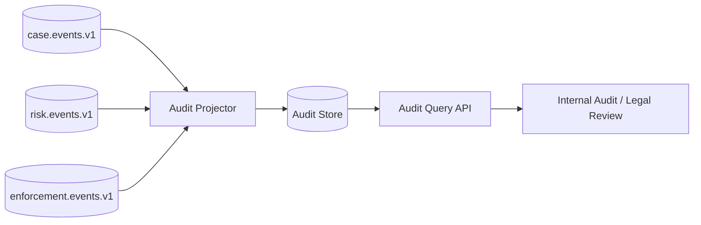

### 14.2 Audit Record Shape

```json
{
  "auditId": "AUD-2026-000000991",
  "eventId": "01J1S4A8P9QF9YH6K7P7WE9A1V",
  "eventType": "CaseAssigned",
  "subjectType": "CASE",
  "subjectId": "CASE-2026-0000192",
  "actorType": "USER",
  "actorId": "officer-481",
  "authority": "CASE_ASSIGNMENT_PRIVILEGE",
  "action": "ASSIGN_CASE",
  "before": {
    "owner": null
  },
  "after": {
    "owner": "officer-481"
  },
  "occurredAt": "2026-06-28T09:30:11.123Z",
  "recordedAt": "2026-06-28T09:30:12.000Z",
  "correlationId": "corr-8b1c4d",
  "retentionClass": "REGULATORY_CASE_7Y"
}
```

### 14.3 Audit Invariants

Audit projector invariants:

```text
1. One audit record per auditable source event.
2. Audit record eventId is unique.
3. Audit store never silently overwrites existing audit record.
4. Correction creates a new audit annotation or correction record.
5. Replay is marked with replayRunId when applicable.
```

### 14.4 Replay-Aware Audit

When replaying events into a projection, do not create false “new user action” audit records.

Use metadata:

```json
{
  "replay": {
    "isReplay": true,
    "replayRunId": "REPLAY-2026-06-28-001",
    "reason": "REBUILD_CASE_OVERVIEW_PROJECTION",
    "approvedBy": "platform-owner-12"
  }
}
```

Operational replay should be visible to platform audit, but it should not distort business audit.

---

## 15. ksqlDB Projections for Operational Insight

ksqlDB is useful for quick operational projections when SQL semantics are enough.

Example: high-risk open cases by unit.

```sql
CREATE STREAM CASE_EVENTS (
    eventType VARCHAR,
    caseId VARCHAR,
    entityId VARCHAR,
    state VARCHAR,
    priority VARCHAR,
    riskBand VARCHAR,
    ownerUnit VARCHAR,
    occurredAt VARCHAR
) WITH (
    KAFKA_TOPIC = 'case.events.v1',
    VALUE_FORMAT = 'JSON',
    KEY_FORMAT = 'KAFKA'
);

CREATE TABLE HIGH_RISK_OPEN_CASES_BY_UNIT AS
SELECT
    ownerUnit,
    COUNT(*) AS openHighRiskCaseCount
FROM CASE_EVENTS
WHERE eventType IN ('CaseOpened', 'CasePriorityChanged', 'CaseClosed')
  AND riskBand = 'HIGH'
  AND state <> 'CLOSED'
GROUP BY ownerUnit
EMIT CHANGES;
```

This example is intentionally simplified.

Real production query design must handle:

- event-type-specific payloads;
- lifecycle transitions;
- tombstones;
- state reconstruction;
- keying;
- schema registry integration;
- exactly which events can update which materialized view.

### 15.1 Good ksqlDB Use Cases

Use ksqlDB for:

- operational dashboards;
- materialized counts;
- simple stream/table joins;
- SLA monitoring views;
- notification eligibility views;
- incident investigation queries;
- data product prototypes that may later become Kafka Streams services.

### 15.2 Bad ksqlDB Use Cases

Avoid ksqlDB for:

- deeply imperative legal decision workflows;
- complex exception-heavy state machines;
- logic requiring rich Java domain libraries;
- logic needing external side effects inside processing;
- workflows requiring human approval steps directly in the query path.

---

## 16. RabbitMQ Streams in This Platform

RabbitMQ Streams can be useful if the organization already has a RabbitMQ-centric operational estate and needs stream semantics for selected flows.

Example use cases:

- high-volume notification event stream;
- operational telemetry stream;
- append-only work history stream;
- regional stream distribution inside RabbitMQ estate;
- consumer replay for recent operational events.

Do not introduce RabbitMQ Streams only because the word “stream” sounds modern.

Use it when its operational model fits.

### 16.1 Example Superstream Use

Notification events may be partitioned by recipient or entity.

```text
superstream: notification.events
partitions:
  notification.events-0
  notification.events-1
  notification.events-2
  notification.events-3
routing key: recipientId or entityId
```

Ordering rule:

```text
All notification state transitions for the same recipient must use the same partition key.
```

---

## 17. Legacy JMS Integration

Many real regulatory platforms have legacy Java/Jakarta EE modules.

A modernization architecture should not pretend those systems disappear.

Use adapters.

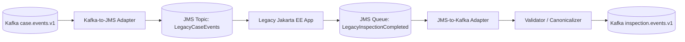

### 17.1 JMS Adapter Rules

The adapter must:

- preserve correlation ID;
- map event ID to JMS message property;
- avoid using `ObjectMessage` for cross-boundary contracts;
- handle redelivery idempotently;
- map JMS rollback to retry policy;
- quarantine malformed legacy messages;
- never let a legacy message become canonical without validation.

### 17.2 Example Mapping

| Canonical Event Field | JMS Mapping |
|---|---|
| `eventId` | `StringProperty("eventId")` |
| `eventType` | `StringProperty("eventType")` |
| `correlationId` | `JMSCorrelationID` or property, depending on standardization |
| payload | `TextMessage` JSON |
| sensitivity | `StringProperty("dataSensitivity")` |

Prefer JSON/Avro/Protobuf payloads over Java serialization.

---

## 18. Inbox Pattern for Consumers

Every service with side effects needs idempotency.

Example consumer-side table:

```sql
CREATE TABLE inbox_event (
    event_id        VARCHAR(64) PRIMARY KEY,
    consumer_name   VARCHAR(120) NOT NULL,
    received_at     TIMESTAMP WITH TIME ZONE NOT NULL,
    processed_at    TIMESTAMP WITH TIME ZONE,
    status          VARCHAR(30) NOT NULL,
    last_error      TEXT
);
```

Processing rule:

```text
begin transaction
  insert inbox_event(event_id, consumer_name, status='PROCESSING')
  if duplicate key:
      skip or resume based on status
  apply business side effect
  mark inbox_event processed
commit
commit broker offset / ack message
```

Kafka offset commits, RabbitMQ acknowledgements, and JMS acknowledgements are not a replacement for business idempotency.

---

## 19. Error Handling Strategy

The platform separates error types.

| Error Type | Example | Action |
|---|---|---|
| Transient technical | DB timeout, broker timeout | bounded retry |
| Slow dependency | document service degraded | pause/resume, circuit breaker |
| Poison message | invalid required field | DLQ/quarantine |
| Schema incompatibility | unknown enum breaks consumer | stop affected consumer, fix schema, replay |
| Authorization | producer lost topic permission | contain, restore access, replay from outbox |
| Business rejection | invalid transition | emit rejection event, do not retry forever |
| Duplicate | same event delivered again | idempotent skip |

### 19.1 Retry Policy

Retry must have a budget.

```text
immediate retry: 2 attempts
short delay: 5 minutes
long delay: 1 hour
parking lot: manual review
```

A retry without a budget is an outage amplifier.

### 19.2 DLQ Payload

DLQ records should include:

- original topic/queue;
- original partition/offset or delivery tag equivalent;
- original key;
- original event ID;
- consumer name;
- exception class;
- error category;
- retry count;
- first failure time;
- last failure time;
- payload hash;
- sanitized payload sample if allowed;
- replay eligibility;
- required owner.

DLQ without owner is just delayed data loss.

---

## 20. Security and Governance Model

The platform handles sensitive regulatory data.

Security is not an afterthought.

### 20.1 Topic and Queue Access

Access should be least-privilege.

Examples:

| Principal | Allowed |
|---|---|
| `case-service` | produce `case.events.v1`, consume `case.commands.v1` |
| `audit-projector` | consume selected event topics, write audit store |
| `notification-service` | consume notification events, not raw evidence payloads |
| `analytics-platform` | consume redacted or governed topics |
| `legacy-adapter` | consume/produce only adapter topics/destinations |

### 20.2 Data Classification

Every event should be classified.

```text
PUBLIC
INTERNAL
CONFIDENTIAL
RESTRICTED
LEGAL_PRIVILEGED
```

Classification affects:

- topic access;
- logging policy;
- tracing detail;
- retention;
- DLQ handling;
- replay permission;
- export permission.

### 20.3 PII Minimization

Avoid putting full PII in broadly consumed events.

Instead of:

```json
{
  "personName": "...",
  "nationalId": "...",
  "address": "..."
}
```

Prefer:

```json
{
  "personRef": "PERSON-123",
  "riskRelevantAttributes": {
    "ageBand": "40-50",
    "jurisdiction": "ID-JK"
  }
}
```

Use secure lookup APIs for sensitive details.

---

## 21. Observability Blueprint

A messaging platform must be observable at several levels.

### 21.1 Business Metrics

- cases opened per hour;
- high-risk cases opened;
- cases assigned within SLA;
- cases approaching deadline;
- SLA breaches;
- enforcement notices issued;
- reopened cases;
- DLQ events by domain;
- replayed events by reason.

### 21.2 Technical Metrics

Kafka:

- producer error rate;
- producer latency;
- consumer lag;
- lag age;
- rebalance count;
- under-replicated partitions;
- offline partitions;
- transaction abort rate.

RabbitMQ:

- ready messages;
- unacked messages;
- consumer count;
- deliver/ack rate;
- redelivery rate;
- memory alarm;
- disk alarm;
- publisher confirm latency.

JMS:

- destination depth;
- redelivery count;
- listener error rate;
- transaction rollback rate;
- DLQ depth.

Kafka Streams/ksqlDB:

- state restore time;
- processing rate;
- skipped records;
- task failures;
- persistent query lag;
- changelog topic growth.

### 21.3 Correlation Fields

Use these consistently:

```text
eventId
correlationId
causationId
traceId
caseId
entityId
tenantId
producer
consumer
replayRunId
```

Without correlation, async systems become archaeological projects.

---

## 22. Failure Modelling for the Capstone

### 22.1 Case Opened but Event Not Published

Expected protection:

- outbox table contains unpublished row;
- outbox publisher retries;
- alert on old unpublished rows;
- no manual database patch without event reconciliation.

### 22.2 Event Published Twice

Expected protection:

- stable event ID;
- consumer inbox table;
- idempotent projection;
- unique aggregate version.

### 22.3 SLA Breach Not Emitted

Possible causes:

- SLA topology down;
- lag too high;
- state store restore stuck;
- timestamp extractor bug;
- source topic authorization issue;
- invalid state transition event.

Response:

```text
check source topic end offsets
check consumer group lag
check topology errors
check state store/changelog status
run SLA backfill/replay with approved replayRunId
compare expected breach candidates against emitted breach events
```

### 22.4 Poison Event in Case Events

Response:

```text
pause affected consumer if it blocks progress
capture event id, key, partition, offset
classify poison type
quarantine if schema/business invalid
patch consumer if consumer bug
replay from safe offset or DLQ after fix
write correction event if source event is semantically wrong
```

### 22.5 RabbitMQ Work Queue Explosion

Possible causes:

- workers down;
- prefetch too high;
- workers stuck before ack;
- downstream DB slow;
- routing fanout misconfigured;
- retry loop requeue storm.

Containment:

```text
stop requeue storm
inspect ready vs unacked
scale workers only if downstream can absorb load
reduce prefetch if workers hold too many messages
route poison messages to DLX
shed non-critical work if policy allows
```

### 22.6 Bad Replay

Bad replay is dangerous because it can recreate old mistakes at high speed.

Replay safety checklist:

```text
1. Define replay purpose.
2. Define source topics and offset/time range.
3. Define target projection or side effect.
4. Disable external irreversible side effects unless explicitly required.
5. Attach replayRunId.
6. Dry-run on sampled data.
7. Monitor duplicates, lag, DLQ, and output deltas.
8. Produce reconciliation report.
```

---

## 23. Testing Strategy

### 23.1 Unit Tests

Test:

- state transition rules;
- event factory logic;
- schema evolution defaults;
- idempotency key generation;
- SLA deadline calculation;
- risk score classification;
- event-to-audit mapping.

### 23.2 Contract Tests

Test:

- producer schema compatibility;
- consumer tolerance for optional fields;
- enum evolution;
- header requirements;
- topic key format;
- DLQ format;
- JMS adapter mapping;
- RabbitMQ routing key rules.

### 23.3 Integration Tests

Test with real broker/container where possible:

- Kafka produce/consume and offset handling;
- Kafka transaction read-process-write;
- Kafka Streams topology test driver and integration restore;
- RabbitMQ ack/nack/DLX behavior;
- RabbitMQ prefetch behavior;
- JMS transaction rollback/redelivery;
- ksqlDB persistent query deployment.

### 23.4 Chaos and Failure Drills

Run drills:

- consumer crash after DB commit before offset commit;
- producer timeout after broker accepted record;
- duplicate event delivery;
- schema-incompatible event;
- broker disk pressure;
- RabbitMQ memory alarm;
- Kafka rebalance storm;
- state store restore after node loss;
- DLQ replay;
- outbox backlog.

---

## 24. Deployment Topology

A production-ish topology:

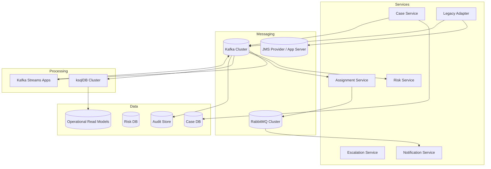

### 24.1 Deployment Invariants

- each service has a named consumer group;
- each consumer group has an owner;
- each topic/queue has an owner;
- every DLQ has an owner and SLO;
- every replay path has approval policy;
- every event schema has compatibility policy;
- every external side effect has idempotency key;
- every stateful processor has restore-time expectations;
- every critical flow has a dashboard and runbook.

---

## 25. Ownership Model

Messaging architecture fails when ownership is vague.

Define ownership explicitly.

| Artifact | Owner | Responsibility |
|---|---|---|
| `case.events.v1` | Case Platform Team | schema, retention, ACL, compatibility |
| `case.escalations.v1` | SLA/Escalation Team | semantics, alert policy, replay |
| `q.investigation.high` | Investigation Ops Team | worker health, backlog, DLQ |
| `case_overview` projection | Case UI Team | projection correctness, rebuild |
| `audit_store` | Audit Platform Team | retention, access, reconciliation |
| `LegacyInspectionAdapter` | Integration Team | JMS mapping, idempotency, quarantine |
| `CaseOpened` schema | Case Platform Team | evolution and compatibility |

No owner means no production system.

---

## 26. Architecture Decision Records

The capstone should maintain ADRs.

Example ADRs:

```text
ADR-001: Kafka is canonical event backbone for case lifecycle events.
ADR-002: RabbitMQ queues are used for operational work routing.
ADR-003: JMS is used only through explicit legacy adapters.
ADR-004: All database-originated canonical events use outbox.
ADR-005: All side-effect consumers use inbox/idempotency table.
ADR-006: Case lifecycle ordering is keyed by caseId.
ADR-007: Entity risk events are keyed by entityId.
ADR-008: ksqlDB is allowed for operational projections, not legal decision logic.
ADR-009: Replay requires replayRunId and approval for regulated topics.
ADR-010: DLQ messages require owner, classification, and replay eligibility metadata.
```

Each ADR should include:

- context;
- decision;
- alternatives;
- consequences;
- operational impact;
- failure modes;
- migration strategy.

---

## 27. Anti-Patterns in This Capstone

### 27.1 “Everything Is an Event”

Commands, tasks, audit records, logs, and events are not the same thing.

Treating all of them as generic messages destroys semantics.

### 27.2 “Kafka Replaces All Queues”

Kafka can be used for many task-like flows, but RabbitMQ-style work routing can be better when routing, ack control, and worker pressure are the dominant needs.

### 27.3 “RabbitMQ Stream Replaces Kafka Everywhere”

RabbitMQ Streams provide stream semantics, but Kafka has a broader event-streaming ecosystem and mature stream-processing integrations.

Choose by platform constraints and operational fit.

### 27.4 “JMS Makes Messaging Portable”

JMS/Jakarta Messaging provides an API abstraction, but provider behavior, operations, destination configuration, redelivery, DLQ, clustering, and transaction characteristics still matter.

### 27.5 “Exactly Once Means No Duplicates Anywhere”

Exactly-once processing has boundaries.

External side effects still require idempotency.

### 27.6 “DLQ Means Problem Solved”

DLQ means the problem has been moved.

Without ownership, diagnosis, replay tooling, and SLO, DLQ becomes silent data loss.

### 27.7 “Replay Is Just Resetting Offsets”

Replay can re-trigger side effects, duplicate audit, change projections, and expose old sensitive data.

Replay is an operational procedure, not a casual command.

---

## 28. Final Production Checklist

Before this platform is production-ready, check the following.

### 28.1 Event Contract

- [ ] every event has owner;
- [ ] every event has schema;
- [ ] every event has compatibility policy;
- [ ] every event has retention class;
- [ ] every event has data classification;
- [ ] every event has example payload;
- [ ] every event has replay policy.

### 28.2 Reliability

- [ ] producer has outbox or equivalent transactional discipline;
- [ ] consumer has inbox/idempotency where side effects exist;
- [ ] retry budget is defined;
- [ ] DLQ has owner;
- [ ] poison message handling is tested;
- [ ] duplicate delivery is tested;
- [ ] ordering assumptions are documented;
- [ ] partition key strategy is reviewed.

### 28.3 Operations

- [ ] dashboards exist;
- [ ] alerts have runbooks;
- [ ] lag and queue depth thresholds are meaningful;
- [ ] stateful processor restore time is measured;
- [ ] broker disk/memory pressure is monitored;
- [ ] schema incident runbook exists;
- [ ] replay runbook exists;
- [ ] DR assumptions are tested.

### 28.4 Governance

- [ ] topic/queue ACLs are least-privilege;
- [ ] PII policy is implemented;
- [ ] legal hold is supported;
- [ ] audit store access is controlled;
- [ ] replay approval is defined;
- [ ] data retention is enforced;
- [ ] tenant isolation is tested;
- [ ] external integration contracts are versioned.

---

## 29. Deliberate Practice Plan

To internalize the full series, build this capstone incrementally.

### Exercise 1 — Case Open Outbox

Build:

- `case` table;
- `outbox_event` table;
- `openCase` transaction;
- outbox publisher;
- Kafka topic `case.events.v1`.

Prove:

- duplicate publish does not duplicate projection;
- publisher crash recovers;
- old unpublished outbox row triggers alert.

### Exercise 2 — Case Overview Projection

Build:

- Kafka consumer;
- inbox table;
- `case_overview` projection;
- duplicate skip;
- version-gap detection.

Prove:

- replay rebuilds projection;
- out-of-order or missing version is detected;
- duplicate event is safe.

### Exercise 3 — RabbitMQ Work Routing

Build:

- topic exchange;
- high/normal priority queues;
- manual ack worker;
- DLX;
- retry queue;
- poison quarantine.

Prove:

- crash before ack redelivers;
- duplicate task does not duplicate DB work;
- poison task does not block queue forever.

### Exercise 4 — SLA Processor

Build:

- Kafka Streams topology;
- state store;
- SLA breach event;
- idempotent breach emission.

Prove:

- restart restores state;
- replay does not emit duplicate breach;
- late events behave according to defined policy.

### Exercise 5 — ksqlDB Dashboard

Build:

- stream/table definitions;
- persistent query for counts by unit;
- lag dashboard;
- query update plan.

Prove:

- query can be redeployed safely;
- materialized view matches sampled source events;
- schema change does not silently break query.

### Exercise 6 — Audit Reconstruction

Build:

- audit projector;
- event chain query by `caseId`;
- correlation query by `correlationId`;
- replay metadata handling.

Prove:

- audit can reconstruct who did what;
- correction event is visible;
- replay does not masquerade as new business action.

---

## 30. What Top Engineers Notice

A top engineer does not stop at “messages are delivered”.

They ask:

- What is the semantic difference between this message and a durable business fact?
- What is the ordering boundary?
- What happens if this event is delivered twice?
- What happens if this event is delayed for six hours?
- What happens if this consumer is down for three days?
- Can we replay without sending duplicate notices?
- Can we prove who approved the enforcement decision?
- Can a schema change break old consumers?
- Can a DLQ contain sensitive data?
- Can one tenant cause lag for another tenant?
- Can a hot entity destroy partition balance?
- Can an operational queue become hidden state?
- Can audit be reconstructed from source events?
- What is the owner of this topic, queue, schema, projection, and runbook?

These questions are the difference between knowing a messaging API and being trusted to design a regulatory-grade event platform.

---

## 31. Final Mental Model

A production messaging platform is not a pile of brokers.

It is a set of contracts:

```text
business contract: what happened and what it means
ordering contract: what must be seen in sequence
reliability contract: what can duplicate, retry, or disappear
schema contract: how meaning evolves safely
security contract: who may see or replay data
operational contract: who owns failure and recovery
audit contract: how truth is reconstructed
```

Kafka, RabbitMQ, RabbitMQ Streams, JMS, Kafka Streams, and ksqlDB are implementation tools.

The engineering discipline is in the contracts.

---

## 32. Series Completion

This is the final part of the series.

You have now covered:

- communication semantics;
- queue/topic/log/stream mental models;
- delivery guarantees and failure taxonomy;
- Jakarta Messaging/JMS;
- RabbitMQ queues;
- RabbitMQ Streams and Superstreams;
- Kafka architecture;
- Kafka producer and consumer internals;
- Kafka reliability and transactions;
- Kafka error handling and schema discipline;
- Kafka Streams;
- ksqlDB;
- technology decision matrix;
- batching and pipelining;
- backpressure and flow control;
- idempotency, inbox, and outbox;
- observability;
- security and governance;
- production failure playbooks;
- capstone regulatory case-management architecture.

The series is complete.

The next level is not more terminology.

The next level is implementation under failure:

```text
build small -> inject failure -> observe -> repair -> replay -> harden -> document the invariant
```

That is how messaging knowledge becomes engineering judgment.

---

## 33. Reference Notes

Primary references for the technical foundations used throughout this capstone:

- Jakarta Messaging specification and API documentation: `https://jakarta.ee/specifications/messaging/`
- Apache Kafka documentation: `https://kafka.apache.org/documentation/`
- Apache Kafka design documentation: `https://kafka.apache.org/documentation/#design`
- RabbitMQ documentation: `https://www.rabbitmq.com/docs`
- RabbitMQ Streams and Superstreams documentation: `https://www.rabbitmq.com/docs/streams`
- ksqlDB documentation: `https://docs.confluent.io/platform/current/ksqldb/`
- Debezium Outbox Event Router documentation: `https://debezium.io/documentation/reference/stable/transformations/outbox-event-router.html`
- OpenTelemetry documentation: `https://opentelemetry.io/docs/`
