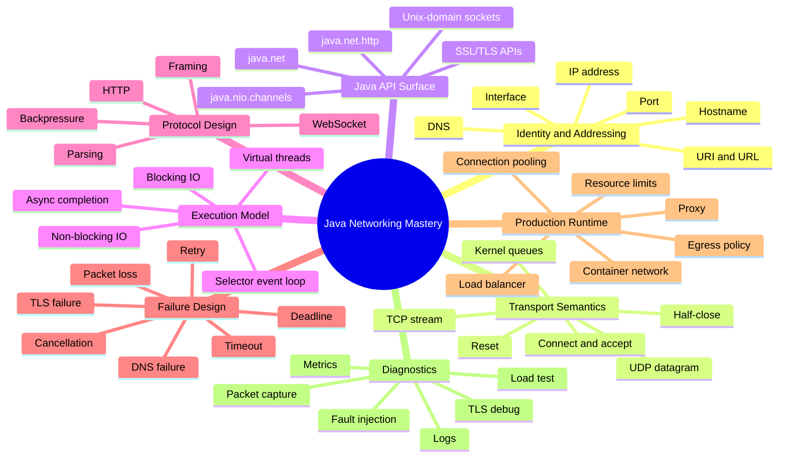
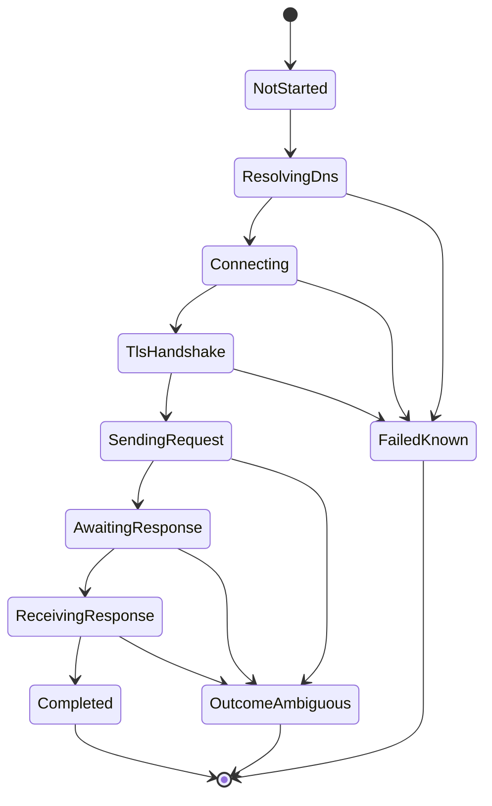
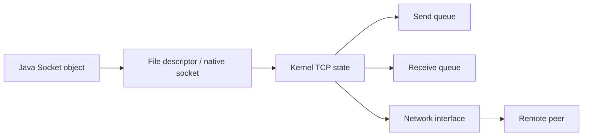
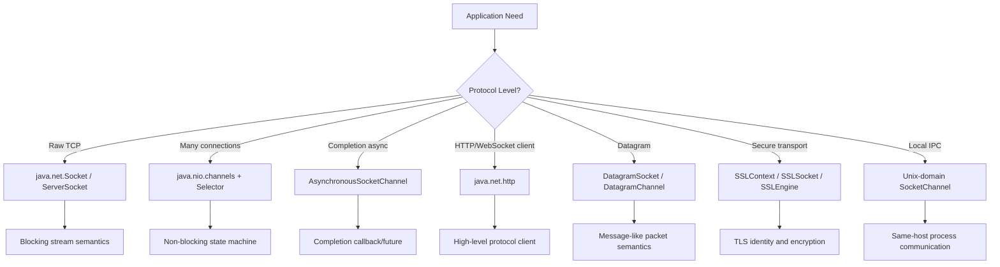
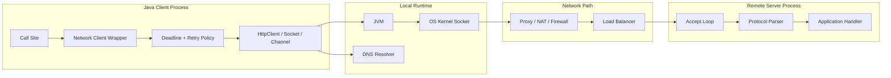

# Part 001 — Kaufman Skill Map for Java Networking

## 1. Tujuan Part Ini

Part ini bukan sekadar daftar topik. Tujuannya adalah membentuk **peta kemampuan** agar seluruh seri `learn-java-networking` tidak berubah menjadi kumpulan API tutorial yang terpisah-pisah.

Setelah menyelesaikan part ini, kamu harus bisa menjawab:

1. Apa yang sebenarnya dimaksud dengan *Java Networking* pada level senior/principal engineer?
2. Skill apa yang harus dikuasai agar tidak hanya bisa menulis `HttpClient.send()`, tetapi bisa mendesain network client/server yang aman, stabil, efisien, dan bisa di-debug?
3. Bagaimana framework Josh Kaufman dari *The First 20 Hours* diterapkan ke domain yang kompleks seperti networking?
4. Apa batas seri ini agar tidak mengulang REST/JAX-RS, messaging/event streaming, security umum, atau observability umum yang sudah dibahas di seri lain?
5. Bagaimana cara berlatih secara sengaja agar pengetahuan networking berubah menjadi intuisi engineering?

> Working definition: **Java Networking adalah kemampuan memahami, membangun, mengoperasikan, dan men-debug komunikasi antar proses menggunakan abstraksi Java di atas stack jaringan OS, dengan kontrol terhadap latency, failure, resource lifecycle, security boundary, dan production behavior.**

---

## 2. Scope Seri

Seri ini fokus pada **networking sebagai mekanisme komunikasi**, bukan hanya API komunikasi tingkat tinggi.

Yang masuk scope:

| Area | Fokus |
|---|---|
| Network model | Host, port, endpoint, IP, DNS, routing, loopback, interface, NAT, container network. |
| Transport | TCP stream semantics, UDP datagram semantics, socket lifecycle, kernel queues, close semantics. |
| Java low-level API | `InetAddress`, `Socket`, `ServerSocket`, `DatagramSocket`, `NetworkInterface`, `URI`, `URL`. |
| Java NIO | `ByteBuffer`, `SocketChannel`, `ServerSocketChannel`, `DatagramChannel`, `Selector`, non-blocking I/O. |
| Async networking | `AsynchronousSocketChannel`, completion model, trade-off dengan selector dan virtual thread. |
| Modern JDK networking | `java.net.http.HttpClient`, HTTP/1.1, HTTP/2, WebSocket, body streaming. |
| Local IPC | Unix-domain socket channel dan local process communication. |
| TLS transport | HTTPS, mTLS, truststore, keystore, SNI, ALPN, debugging handshake. |
| Failure design | Timeout, deadline, cancellation, retry, stale connection, reset, DNS failure, packet loss. |
| Production engineering | Backpressure, resource ownership, connection lifecycle, proxy, egress control, observability jaringan. |
| Practice | Packet-level debugging, fault injection, load testing, capstone client/server. |

Yang sengaja tidak dijadikan fokus utama karena sudah/sesuai dibahas di seri lain:

| Tidak menjadi fokus utama | Alasannya |
|---|---|
| REST endpoint design mendalam | Sudah masuk `learn-java-jakarta-restful-web-services`, Jersey, API design. |
| API/event contract governance | Sudah masuk `learn-java-api-event-contract-engineering-schema-governance`. |
| Kafka/RabbitMQ/event streaming | Sudah masuk `learn-java-messaging-event-streaming`. |
| General cryptography | Sudah masuk `learn-java-security-cryptography-integrity-hardening`. |
| General logging/metrics/tracing | Sudah masuk `learn-java-error-reliability-observability`. |
| General concurrency | Sudah masuk `learn-java-concurrency-correctness`. |

Namun, topik-topik tersebut bisa muncul sebagai **boundary concern**. Misalnya TLS akan dibahas bukan dari kriptografi matematisnya, melainkan dari sisi network handshake, certificate path, hostname verification, SNI, ALPN, dan debugging koneksi.

---

## 3. Mengapa Networking Sulit untuk Engineer Senior

Networking tampak mudah ketika contoh kodenya pendek:

```java
var client = HttpClient.newHttpClient();
var request = HttpRequest.newBuilder(URI.create("https://example.com")).GET().build();
var response = client.send(request, HttpResponse.BodyHandlers.ofString());
```

Namun kode seperti itu menyembunyikan banyak realitas:

1. `example.com` harus di-resolve oleh DNS.
2. Resolver bisa lambat, salah, di-cache, atau mengembalikan beberapa alamat.
3. OS harus memilih route dan source address.
4. Socket harus dibuat dan menggunakan ephemeral port.
5. TCP connect membutuhkan handshake.
6. HTTPS membutuhkan TLS handshake.
7. HTTP/2 bisa multiplex di atas satu TCP connection.
8. Request body dan response body bisa besar, lambat, atau tidak pernah selesai.
9. Koneksi bisa reset di tengah jalan.
10. Timeout bisa terjadi di fase berbeda, tetapi sering muncul sebagai exception yang mirip.
11. Proxy, firewall, NAT, service mesh, atau load balancer bisa mengubah behavior.
12. Retry yang kelihatannya aman bisa menggandakan side effect.
13. Resource leak kecil bisa menjadi port exhaustion, file descriptor exhaustion, atau thread starvation.

Top 1% engineer tidak hanya tahu “cara memanggil API”. Mereka punya **mental model operasional**:

> Ketika sebuah network call gagal, mereka bisa memperkirakan lapisan mana yang gagal, resource apa yang tertahan, timeout mana yang salah, retry mana yang berbahaya, dan observability apa yang dibutuhkan untuk membuktikannya.

---

## 4. Framework Kaufman untuk Java Networking

Josh Kaufman mengusulkan pendekatan belajar cepat dengan beberapa prinsip utama:

1. **Deconstruct the skill** — pecah skill besar menjadi sub-skill kecil.
2. **Learn enough to self-correct** — pelajari cukup teori untuk mendeteksi kesalahan sendiri.
3. **Remove practice barriers** — siapkan lingkungan latihan agar friction rendah.
4. **Practice deliberately** — latihan terarah pada kelemahan, bukan membaca pasif.
5. **Commit focused practice time** — alokasikan waktu intensif, bukan belajar acak.

Untuk Java Networking, prinsip ini perlu dinaikkan levelnya. Karena kamu sudah software engineer, targetnya bukan “bisa membuat socket echo server”, tetapi:

- bisa membaca stack trace networking sebagai gejala sistem,
- bisa mendesain timeout dan retry yang tidak merusak correctness,
- bisa memilih blocking I/O, virtual thread, selector, async channel, atau HTTP client berdasarkan constraint,
- bisa memahami TCP byte stream, UDP datagram, HTTP framing, TLS handshake, dan proxy behavior,
- bisa menulis network component yang punya lifecycle, boundary, observability, dan failure-mode matrix.

---

## 5. Deconstruct the Skill

Kita pecah Java Networking menjadi 8 capability cluster.



### 5.1 Capability 1 — Endpoint Identity and Addressing

Networking selalu dimulai dari pertanyaan sederhana: **kita sedang bicara dengan siapa?**

Namun “siapa” punya beberapa bentuk:

| Identity | Contoh | Makna |
|---|---|---|
| Logical service name | `payment-service` | Nama konseptual dalam sistem. |
| DNS name | `api.bank.example` | Nama yang harus di-resolve menjadi alamat IP. |
| IP address | `10.40.12.8`, `2001:db8::1` | Alamat network-layer. |
| Socket address | `10.40.12.8:443` | Endpoint transport. |
| URI | `https://api.bank.example/v1/accounts` | Identifier resource/protocol-level. |
| Certificate identity | SAN: `api.bank.example` | Identitas TLS untuk verifikasi peer. |
| Application identity | client id, tenant id, service account | Identitas layer aplikasi. |

Kesalahan umum: menganggap semua identitas itu sama.

Contoh bug production:

- DNS mengarah ke IP benar, tetapi certificate SAN tidak cocok.
- `localhost` dalam container menunjuk ke container sendiri, bukan host machine.
- service name resolve ke beberapa IP, tetapi client cache terlalu lama.
- allowlist mengecek hostname sebelum redirect, tetapi request final pergi ke private IP.
- mTLS berhasil, tetapi authorization service identity salah.

Dalam seri ini, endpoint identity akan diperlakukan sebagai **multi-layer identity**, bukan sekadar string URL.

### 5.2 Capability 2 — Transport Semantics

Java menyediakan API, tetapi semantik dasarnya berasal dari transport protocol dan kernel.

TCP bukan message queue. TCP adalah **ordered byte stream**.

UDP bukan “TCP yang lebih cepat”. UDP adalah **best-effort datagram** tanpa delivery guarantee.

Implikasinya:

| Salah paham | Realitas |
|---|---|
| Satu `write()` = satu `read()` | TCP tidak menjaga message boundary. |
| Koneksi idle berarti sehat | Idle TCP bisa sudah mati di NAT/firewall tanpa diketahui aplikasi. |
| `read()` lambat berarti server lambat | Bisa DNS, routing, TCP retransmit, TLS, proxy, atau flow control. |
| UDP cocok untuk semua low-latency system | UDP memindahkan tanggung jawab reliability ke aplikasi. |
| Close adalah event tunggal | Close bisa graceful FIN, half-close, abortive RST, timeout, atau leak. |

### 5.3 Capability 3 — Java API Surface

API networking Java bisa dilihat sebagai beberapa layer:

| Layer | API | Digunakan untuk |
|---|---|---|
| Addressing | `InetAddress`, `InetSocketAddress`, `NetworkInterface`, `URI` | Identity, address resolution, endpoint construction. |
| Classic socket | `Socket`, `ServerSocket`, `DatagramSocket` | Blocking TCP/UDP programming. |
| NIO channel | `SocketChannel`, `ServerSocketChannel`, `DatagramChannel` | Channel-based I/O, selectable/non-blocking operation. |
| Selector | `Selector`, `SelectionKey` | Multiplex banyak channel dalam sedikit thread. |
| Async channel | `AsynchronousSocketChannel` | Completion-based socket programming. |
| HTTP/WebSocket | `HttpClient`, `HttpRequest`, `HttpResponse`, `WebSocket` | Modern high-level protocol client. |
| TLS | `SSLContext`, `SSLSocket`, `SSLEngine` | Secure transport and TLS integration. |

Mental model yang benar:

> API Java bukan pengganti network knowledge. API Java adalah façade terhadap OS, protocol semantics, dan runtime execution model.

### 5.4 Capability 4 — Execution Model

Networking selalu menyentuh pertanyaan: **thread mana yang menunggu apa?**

Ada beberapa model:

| Model | Bentuk | Kekuatan | Risiko |
|---|---|---|---|
| Blocking thread-per-connection | `Socket` + platform thread | Sederhana | Mahal pada banyak koneksi. |
| Blocking virtual-thread-per-operation | `Socket`/`HttpClient` + virtual thread | Sederhana dan scalable untuk banyak blocking wait | Pinning, resource limit, over-parallelism. |
| Non-blocking selector | `SocketChannel` + `Selector` | Efisien untuk banyak koneksi | State machine kompleks, bug fairness/backpressure. |
| Completion-based async | `AsynchronousSocketChannel` | Callback/future completion | Harder lifecycle, cancellation complexity. |
| High-level HTTP async | `HttpClient.sendAsync()` | Nyaman untuk client HTTP | Executor, body streaming, cancellation perlu dipahami. |

Skill senior bukan menghafal “mana yang terbaik”, tetapi memilih model berdasarkan:

- jumlah koneksi,
- ukuran payload,
- latency target,
- complexity budget,
- resource limit,
- backpressure model,
- observability requirement,
- deployment environment.

### 5.5 Capability 5 — Protocol Design and Framing

Banyak engineer bisa membuat TCP server, tetapi gagal membuat protocol yang benar.

Pertanyaan wajib ketika mendesain protocol:

1. Bagaimana message boundary ditentukan?
2. Bagaimana partial read ditangani?
3. Bagaimana partial write ditangani?
4. Apakah payload length trusted?
5. Apakah ada max frame size?
6. Apakah versi protocol dikirim?
7. Bagaimana error frame direpresentasikan?
8. Bagaimana client/server menutup koneksi?
9. Apakah ada heartbeat?
10. Bagaimana backpressure disampaikan?

Contoh framing:

```text
+----------------+------------------+
| length: int32  | payload: bytes    |
+----------------+------------------+
```

Kesalahan fatal: membaca `InputStream.read(buffer)` lalu menganggap buffer itu selalu berisi satu message lengkap.

### 5.6 Capability 6 — Failure Design

Network failure bukan exception handling kecil. Ia bagian dari correctness.

Failure taxonomy awal:

| Fase | Contoh failure | Dampak design |
|---|---|---|
| Resolve | DNS timeout, NXDOMAIN, stale cache | Resolver policy, TTL, fallback, observability. |
| Connect | refused, timeout, no route | Retry mungkin aman jika belum ada side effect. |
| TLS | expired cert, unknown CA, hostname mismatch | Trust boundary, certificate rotation, debug. |
| Write | broken pipe, reset, slow send buffer | Idempotency dan partial write awareness. |
| Server processing | timeout after request sent | Ambiguous outcome. Retry bisa berbahaya. |
| Read | read timeout, EOF, malformed response | Response integrity, deadline, retry classification. |
| Pool reuse | stale connection, closed idle socket | Validation, retry-on-stale rules. |

Invariant penting:

> Setelah request keluar dari proses, hasilnya bisa menjadi ambiguous. Client belum tentu tahu apakah server menerima, memproses, atau commit side effect.

Itu sebabnya retry harus terkait dengan idempotency, request identity, deduplication, dan timeout phase.

### 5.7 Capability 7 — Production Runtime

Networking di production selalu berinteraksi dengan komponen eksternal:

- DNS server,
- corporate proxy,
- firewall,
- NAT gateway,
- load balancer,
- service mesh sidecar,
- Kubernetes service discovery,
- ingress/egress policy,
- certificate authority,
- OS kernel limits,
- container resource limit,
- remote peer overload.

Production-grade network code harus punya:

1. lifecycle yang eksplisit,
2. timeout lengkap,
3. deadline propagation,
4. bounded memory,
5. bounded concurrency,
6. retry policy yang aman,
7. observability per fase,
8. graceful shutdown,
9. egress safety,
10. failure-mode documentation.

### 5.8 Capability 8 — Diagnostics

Engineer top-tier tidak hanya menulis kode. Mereka bisa membuktikan hipotesis.

Contoh pertanyaan debugging:

| Gejala | Pertanyaan yang benar |
|---|---|
| `SocketTimeoutException` | Timeout fase apa? Connect, read, request, DNS, TLS, atau pool acquisition? |
| Banyak `Connection reset` | Peer reset? Load balancer idle timeout? Protocol violation? Client close terlalu agresif? |
| Latency p99 naik | DNS? Connect? TLS? Server processing? Queue? Retransmission? GC? |
| Error hanya di Kubernetes | DNS search path? NetworkPolicy? MTU? Sidecar? localhost semantics? |
| Hanya gagal di corporate network | Proxy, TLS interception, SNI, certificate chain, CONNECT tunnel. |
| Banyak ephemeral port | Connection churn, missing pool reuse, TIME_WAIT accumulation. |

---

## 6. Learn Enough to Self-Correct

Belajar networking efektif bukan berarti membaca seluruh RFC dari awal. Kita butuh teori secukupnya agar bisa self-correct.

Minimal theory stack:

| Teori | Kenapa wajib |
|---|---|
| IP addressing | Agar paham host, route, interface, private/public IP, IPv4/IPv6. |
| DNS | Karena hampir semua client production bergantung pada name resolution. |
| TCP | Karena mayoritas Java networking production berjalan di atas TCP/TLS/HTTP. |
| UDP | Karena beberapa discovery, telemetry, DNS, game/real-time system, dan multicast menggunakan datagram. |
| Socket lifecycle | Karena leak dan close semantics sering jadi akar masalah. |
| Buffering | Karena memory, throughput, partial I/O, dan backpressure bergantung pada buffer. |
| TLS basics | Karena HTTPS failure sering tampak seperti network failure. |
| HTTP mechanics | Karena `HttpClient` menyembunyikan koneksi, pooling, streaming, redirect, proxy, HTTP/2. |
| Kernel limits | Karena Java code bisa benar tetapi OS limit membuat sistem gagal. |
| Failure semantics | Karena timeout/retry salah bisa menggandakan side effect. |

Self-correction checklist ketika belajar:

1. Apakah saya tahu lapisan mana yang sedang saya gunakan?
2. Apakah saya tahu object Java mana yang mewakili resource OS?
3. Apakah saya tahu operasi mana yang bisa blocking?
4. Apakah saya tahu kapan data benar-benar keluar dari proses?
5. Apakah saya tahu siapa yang menutup resource?
6. Apakah saya punya timeout untuk setiap wait?
7. Apakah saya tahu outcome jika operasi timeout?
8. Apakah saya tahu apakah retry aman?
9. Apakah memory dan concurrency bounded?
10. Apakah behavior bisa diobservasi?

---

## 7. Remove Practice Barriers

Networking sulit dipelajari jika setiap eksperimen membutuhkan environment besar. Seri ini akan menggunakan beberapa level lab.

### 7.1 Level 1 — Local Loopback Lab

Cocok untuk:

- socket basics,
- protocol framing,
- partial read/write,
- graceful close,
- NIO selector,
- HTTP client local server.

Tools minimal:

```bash
java --version
jshell --version
curl --version
```

### 7.2 Level 2 — OS Diagnostics Lab

Cocok untuk:

- melihat listening port,
- melihat established connection,
- memeriksa ephemeral port,
- melihat DNS behavior,
- packet capture lokal.

Tools yang berguna:

```bash
ss -tanp
lsof -i
netstat -an
nc
curl -v
dig
nslookup
tcpdump
```

Di Windows, padanannya bisa berupa:

```powershell
netstat -ano
Get-NetTCPConnection
Resolve-DnsName
Test-NetConnection
```

### 7.3 Level 3 — Failure Injection Lab

Cocok untuk:

- latency,
- packet loss,
- reset,
- blackhole,
- DNS delay,
- TLS/certificate failure,
- server overload.

Tools umum:

- Linux `tc netem`,
- Toxiproxy,
- WireMock/MockWebServer untuk HTTP behavior,
- custom Java fake server,
- Docker network rules,
- expired/self-signed certificate lab.

### 7.4 Level 4 — Production-Like Lab

Cocok untuk:

- proxy,
- load balancer idle timeout,
- service discovery,
- container networking,
- mTLS,
- HTTP/2,
- connection pooling.

Contoh setup:

```text
Java client -> local proxy -> fake load balancer -> Java server
                         -> DNS override
                         -> injected latency/loss
```

Tujuannya bukan membuat environment rumit, tetapi membuat failure bisa direproduksi.

---

## 8. Practice Deliberately

Membaca networking tidak cukup. Kita akan menggunakan format latihan berulang:

1. **Predict** — prediksi behavior sebelum menjalankan kode.
2. **Run** — jalankan eksperimen kecil.
3. **Observe** — lihat logs, exception, socket state, packet trace.
4. **Explain** — jelaskan dengan layer model.
5. **Change one variable** — ubah timeout, buffer, close mode, DNS, proxy, payload size.
6. **Write invariant** — simpulkan aturan yang bisa dipakai di production.

Contoh drill awal:

| Drill | Prediksi yang diuji |
|---|---|
| TCP echo server dengan `read()` kecil | TCP tidak menjaga message boundary. |
| Client connect ke port tertutup | Bedakan refused vs timeout. |
| Server accept tapi tidak read | Apa yang terjadi ke send buffer client? |
| Client close tanpa membaca response | Apakah server melihat FIN atau RST? |
| DNS hostname multi-IP | Alamat mana yang dipilih client? |
| HTTP response body besar | Apakah body dimaterialisasi di memory? |
| Idle pooled connection | Apa yang terjadi setelah load balancer menutup koneksi? |

---

## 9. Mental Model Utama Seri

### 9.1 Network Call Is a Distributed State Transition

Network call bukan function call biasa.

Function call lokal:

```text
caller -> callee -> return/throw
```

Network call:

```text
local process -> JVM -> OS -> network -> remote OS -> remote process
              <- maybe response, maybe timeout, maybe reset, maybe duplicate
```

Sebuah request bisa berada di banyak state yang tidak sepenuhnya diketahui client.



Design implication:

- Failure sebelum request terkirim biasanya lebih aman untuk retry.
- Failure setelah request mungkin terkirim harus dianggap ambiguous.
- Timeout bukan bukti remote operation gagal.
- Idempotency dan request identity harus menjadi bagian desain.

### 9.2 Socket Is Not Just a Java Object

`Socket` di Java hanyalah handle ke resource yang lebih dalam.



Jika object Java tidak ditutup, resource kernel bisa tetap hidup sampai GC/finalization/cleaner atau process exit. Dalam service long-running, ini bukan detail kecil; ini bisa menjadi outage.

### 9.3 TCP Is Bytes, Not Messages

Jika client menulis:

```text
HELLO
WORLD
```

Server bisa membaca sebagai:

```text
HELLOWORLD
```

atau:

```text
HE
LLOW
ORLD
```

atau variasi lain. Message boundary harus dibuat oleh protocol aplikasi.

### 9.4 Timeout Is Part of Correctness

Timeout bukan sekadar konfigurasi performa. Timeout menentukan state machine.

Pertanyaan yang harus dijawab:

1. Apa yang terjadi jika DNS lookup terlalu lama?
2. Apa yang terjadi jika connect berhasil tetapi TLS handshake menggantung?
3. Apa yang terjadi jika request sudah terkirim tetapi response timeout?
4. Apakah caller boleh cancel?
5. Apakah cancel menutup socket?
6. Apakah retry boleh dilakukan?
7. Apakah remote side bisa menerima duplicate request?

### 9.5 DNS Is a Runtime Dependency

DNS bukan compile-time mapping.

Risiko DNS:

- cache stale,
- negative caching,
- split-horizon DNS,
- multiple A/AAAA records,
- IPv6 preference surprise,
- resolver delay,
- Kubernetes search domain expansion,
- corporate DNS override,
- DNS rebinding attack.

### 9.6 Connection Pool Is Shared State

HTTP client pooling terlihat seperti optimasi, tetapi sebenarnya shared state dengan lifecycle sendiri.

Risiko:

- stale connection reuse,
- connection leak karena body tidak dibaca/ditutup,
- pool starvation,
- idle timeout mismatch dengan load balancer,
- wrong proxy/certificate/client config reuse,
- hidden concurrency amplification.

### 9.7 Backpressure Is Correctness, Not Optimization

Jika producer lebih cepat dari consumer, sistem hanya punya beberapa pilihan:

1. buffer tanpa batas sampai OOM,
2. drop,
3. block,
4. reject,
5. slow down producer,
6. close connection.

Network server production harus memilih salah satu secara eksplisit.

---

## 10. Java Networking API Map



Decision table awal:

| Kebutuhan | Kandidat API | Catatan |
|---|---|---|
| Client HTTP biasa | `HttpClient` | Default untuk modern Java. |
| Client HTTP dengan streaming besar | `HttpClient` + custom body handler/publisher | Wajib kontrol memory dan cancellation. |
| WebSocket client | `HttpClient.newWebSocketBuilder()` | Listener model dan backpressure perlu dipahami. |
| TCP protocol custom sederhana | `Socket` + virtual thread | Sederhana jika koneksi tidak ekstrem dan protocol jelas. |
| Banyak koneksi long-lived | `SocketChannel` + `Selector` | Lebih kompleks, tetapi resource efficient. |
| UDP packet | `DatagramSocket`/`DatagramChannel` | Wajib desain loss/reorder/size. |
| TLS protocol custom | `SSLSocket` atau `SSLEngine` | `SSLEngine` sulit tetapi cocok untuk NIO. |
| Same-host IPC | Unix-domain socket channel | Berguna untuk sidecar/local daemon. |

---

## 11. Anti-Patterns yang Akan Kita Hindari

### 11.1 No Timeout Client

```java
HttpClient client = HttpClient.newHttpClient();
HttpRequest request = HttpRequest.newBuilder(uri).GET().build();
client.send(request, HttpResponse.BodyHandlers.ofString());
```

Masalah:

- tidak ada deadline eksplisit,
- caller bisa menggantung terlalu lama,
- sulit membedakan fase failure,
- tidak cocok untuk production service.

### 11.2 One Socket Per Request Without Reason

Membuka koneksi baru untuk setiap request bisa menyebabkan:

- latency tinggi karena connect/TLS handshake berulang,
- ephemeral port exhaustion,
- TIME_WAIT accumulation,
- CPU overhead,
- load balancer pressure.

### 11.3 Unbounded Buffering

```java
byte[] all = inputStream.readAllBytes();
```

Aman untuk payload kecil yang dikontrol. Berbahaya untuk payload besar/eksternal karena memory bisa tidak bounded.

### 11.4 Blind Retry

```java
for (int i = 0; i < 3; i++) {
    try {
        return call();
    } catch (IOException e) {
        // retry everything
    }
}
```

Masalah:

- duplicate side effect,
- retry storm,
- memperparah overload,
- menyembunyikan root cause,
- tidak menghormati deadline.

### 11.5 Protocol Without Max Frame Size

Protocol custom tanpa max frame size rentan terhadap:

- memory exhaustion,
- malicious payload,
- corrupt frame,
- slowloris-like behavior,
- parser stuck.

### 11.6 Selector Without Backpressure

NIO server yang selalu register `OP_WRITE` dan menambah queue tanpa batas akan berubah menjadi OOM generator.

### 11.7 Treating TLS as Just “HTTPS On”

TLS punya identity, certificate path, hostname verification, trust anchor, SNI, ALPN, mTLS, dan session reuse. Jika salah satu salah, network call bisa gagal walaupun TCP connect berhasil.

---

## 12. Learning Outcomes per Phase

### Phase 1 — Mental Model Foundation

Parts: 001–004

Kamu harus bisa:

- membedakan endpoint identity di layer DNS/IP/TCP/TLS/application,
- menjelaskan perjalanan network call dari Java code sampai remote process,
- memahami kapan DNS resolution terjadi,
- memprediksi masalah localhost/container/IPv6 dasar.

### Phase 2 — Raw Network Mechanics

Parts: 005–009

Kamu harus bisa:

- menjelaskan TCP byte stream,
- menulis socket client/server blocking dengan benar,
- mendesain protocol framing sederhana,
- membedakan FIN/RST/timeout,
- menggunakan UDP dengan sadar terhadap loss/reorder/MTU.

### Phase 3 — Java I/O Execution Models

Parts: 010–015

Kamu harus bisa:

- menggunakan `ByteBuffer` tanpa bug flip/compact,
- memahami `SocketChannel` dan `Selector`,
- membangun event-loop server kecil,
- memahami async socket channel,
- memilih virtual thread vs selector dengan argumen jelas.

### Phase 4 — Modern Protocol Client

Parts: 016–024

Kamu harus bisa:

- menggunakan `HttpClient` secara production-grade,
- streaming body tanpa memory explosion,
- memahami HTTP/2 pooling dan flow control secara praktis,
- memakai WebSocket dengan state machine benar,
- menangani proxy/TLS/IPv6/timeout/retry dengan model yang benar.

### Phase 5 — Production Hardening

Parts: 025–029

Kamu harus bisa:

- mendesain backpressure,
- mencegah SSRF dan unsafe egress,
- melakukan packet-level debugging,
- mengurangi GC/network overhead,
- membuat failure injection plan.

### Phase 6 — Architecture and Capstone

Parts: 030–032

Kamu harus bisa:

- mendesain network client seperti internal SDK,
- mendesain network server/gateway dengan admission control,
- membuat handbook keputusan dan checklist production.

---

## 13. The 20-Hour Practice Plan

Karena seri ini advanced, “20 jam” dipakai sebagai **minimum deliberate practice block**, bukan batas akhir penguasaan.

| Hour | Focus | Output |
|---:|---|---|
| 1 | Skill map and environment | Local lab siap. |
| 2 | Layer model | Diagram perjalanan request. |
| 3 | DNS and address | Eksperimen `InetAddress`, IPv4/IPv6, localhost. |
| 4 | TCP connect/read/write | Echo client/server. |
| 5 | Close semantics | FIN/RST/timeout experiment. |
| 6 | Framing | Length-prefixed protocol. |
| 7 | UDP | Datagram loss/size experiment. |
| 8 | ByteBuffer | Parser dengan partial frame. |
| 9 | Selector | Single-thread NIO echo server. |
| 10 | NIO backpressure | Write queue bounded. |
| 11 | Virtual thread socket | Thread-per-connection server. |
| 12 | HttpClient basics | Client with timeout/deadline. |
| 13 | HTTP streaming | Large download bounded memory. |
| 14 | HTTP/2/WebSocket | Multiplex/listener experiment. |
| 15 | TLS | Truststore/hostname failure lab. |
| 16 | Proxy | CONNECT/proxy selector experiment. |
| 17 | Failure taxonomy | Retry classification matrix. |
| 18 | Packet debugging | tcpdump/Wireshark observation. |
| 19 | Load/failure injection | Latency/loss/reset test. |
| 20 | Capstone | Production-grade client/server mini design. |

---

## 14. Engineering Invariants

Simpan invariant ini. Kita akan mengulangnya dalam konteks berbeda, tetapi bukan sebagai repetisi materi; setiap part akan membuktikan invariant dari layer yang berbeda.

### Invariant 1 — Every Wait Needs a Bound

Setiap operasi yang menunggu network harus punya batas:

- DNS wait,
- connect wait,
- TLS handshake wait,
- request write wait,
- response header wait,
- response body wait,
- pool acquisition wait,
- graceful shutdown wait.

### Invariant 2 — Every Resource Needs an Owner

Resource yang harus punya owner:

- socket,
- channel,
- selector,
- buffer,
- executor,
- HTTP client,
- response body stream,
- TLS context,
- connection pool,
- listener lifecycle.

### Invariant 3 — Every Protocol Needs Framing

Tanpa framing, receiver tidak tahu satu pesan berakhir di mana.

### Invariant 4 — Every Retry Needs a Correctness Argument

Retry harus dijawab dengan:

1. Apakah operation idempotent?
2. Apakah request sudah terkirim?
3. Apakah server bisa deduplicate?
4. Apakah deadline masih cukup?
5. Apakah retry memperparah overload?

### Invariant 5 — Every Buffer Needs a Bound

Buffer tanpa batas adalah deferred outage.

### Invariant 6 — Every Boundary Needs Identity Verification

Boundary jaringan harus memvalidasi:

- remote address,
- hostname,
- certificate,
- proxy behavior,
- redirect target,
- private/public network boundary.

### Invariant 7 — Every Production Failure Needs a Layer Hypothesis

Jangan debug network failure dengan menebak-nebak. Bentuk hipotesis layer:

```text
Application -> HTTP -> TLS -> TCP -> IP -> DNS -> OS -> Runtime -> Infrastructure
```

---

## 15. Failure-Mode Matrix Awal

| Symptom | Possible Layer | First Evidence to Collect |
|---|---|---|
| `UnknownHostException` | DNS/name resolution | Hostname, resolver config, TTL, cache, search domain. |
| `ConnectException: Connection refused` | TCP/connect/remote process | Target IP/port, listener status, firewall local/remote. |
| Connect timeout | Routing/firewall/blackhole/remote overload | Route, SYN/SYN-ACK packet trace, security group. |
| `SSLHandshakeException` | TLS/certificate/protocol | Cert chain, hostname, truststore, SNI, ALPN. |
| `SocketTimeoutException` during read | Server slow, network loss, wrong timeout | Phase timing, packet retransmit, server logs. |
| `Connection reset` | Peer abort, load balancer, protocol violation | Who sent RST, idle timeout, close behavior. |
| Broken pipe | Local write after peer close | Peer close timing, write path, retry policy. |
| High p99 latency | DNS/connect/TLS/server/queue/GC | Timing breakdown, pool stats, packet retransmit. |
| Port exhaustion | Connection churn/TIME_WAIT/leak | `ss`, ephemeral range, pool reuse, close pattern. |
| File descriptor exhaustion | Socket/channel leak | open fd count, heap references, lifecycle owner. |

---

## 16. Minimal Reference Architecture for the Series

Kita akan memakai beberapa mini-architecture selama seri.



Prinsip desain:

- Call site tidak boleh langsung menaruh semua detail networking.
- Network client wrapper harus mengandung policy.
- Deadline harus mengalir dari caller.
- Retry harus dekat dengan classification logic.
- Transport implementation bisa diganti tanpa mengubah business workflow.
- Observability harus menangkap fase, bukan hanya total duration.

---

## 17. Suggested Package Structure for Practice Code

Dalam latihan, struktur package bisa dibuat seperti ini:

```text
com.example.networking
  ├── lab
  │   ├── dns
  │   ├── tcp
  │   ├── udp
  │   ├── nio
  │   ├── http
  │   ├── tls
  │   └── failure
  ├── protocol
  │   ├── Frame.java
  │   ├── FrameDecoder.java
  │   ├── FrameEncoder.java
  │   └── ProtocolException.java
  ├── client
  │   ├── NetworkClient.java
  │   ├── Deadline.java
  │   ├── RetryPolicy.java
  │   └── FailureClassifier.java
  ├── server
  │   ├── AcceptLoop.java
  │   ├── ConnectionState.java
  │   └── AdmissionController.java
  └── diagnostics
      ├── PhaseTimer.java
      ├── SocketSnapshot.java
      └── NetworkEventLogger.java
```

Tujuannya bukan membuat framework baru, tetapi membiasakan separation of concerns:

- protocol berbeda dari transport,
- policy berbeda dari call site,
- diagnostics berbeda dari business logic,
- lifecycle resource eksplisit.

---

## 18. How to Read Java Networking Documentation

Dokumentasi Java networking sering tampak sebagai referensi class, bukan tutorial. Cara membacanya:

1. Mulai dari package summary.
2. Identifikasi abstraction: address, socket, channel, selector, client.
3. Baca lifecycle: create, configure, bind/connect, read/write, close.
4. Cari blocking behavior.
5. Cari thread-safety statement.
6. Cari exception semantics.
7. Cari relationship dengan OS atau system property.
8. Tulis invariant sendiri.

Contoh pertanyaan saat membaca `Socket`:

- Apakah object ini thread-safe?
- Operasi mana yang blocking?
- Apa beda `close()`, `shutdownInput()`, dan `shutdownOutput()`?
- Apa arti timeout?
- Apa yang terjadi jika satu thread blocked di read lalu socket ditutup dari thread lain?
- Apakah socket option harus diset sebelum connect/bind?

---

## 19. What “Top 1%” Means Here

Dalam konteks seri ini, “top 1%” bukan label status. Ia berarti kemampuan praktis berikut:

1. **Layer reasoning** — bisa menempatkan gejala di layer yang tepat.
2. **Protocol correctness** — tidak membuat asumsi salah tentang stream/datagram/framing.
3. **Resource discipline** — tidak leak socket, channel, buffer, selector, response body.
4. **Failure literacy** — paham ambiguous outcome, timeout phase, reset, stale connection.
5. **Production empathy** — sadar proxy, DNS, NAT, LB, service mesh, container, firewall.
6. **Performance realism** — tidak microbenchmark misleading; paham syscall, buffer, GC, pooling.
7. **Security boundary awareness** — tidak membuat SSRF/egress/TLS identity bug.
8. **Debugging skill** — bisa menggunakan logs, metrics, packet capture, TLS debug, OS tools.
9. **API design maturity** — network client/server punya policy dan lifecycle, bukan util static acak.
10. **Operational documentation** — punya checklist, failure matrix, dan runbook.

---

## 20. Part 001 Practice

### Exercise 1 — Draw Your Current Mental Model

Sebelum lanjut ke Part 002, gambar perjalanan request berikut:

```java
client.send(request, BodyHandlers.ofString())
```

Wajib ada:

- call site,
- `HttpClient`,
- DNS,
- socket,
- TCP,
- TLS,
- HTTP,
- proxy/load balancer jika ada,
- remote server,
- response body,
- close/reuse connection.

Bandingkan dengan diagram Part 002 nanti.

### Exercise 2 — Classify Failures

Ambil daftar exception berikut dan tulis kemungkinan layer:

```text
UnknownHostException
ConnectException
SocketTimeoutException
SSLHandshakeException
EOFException
Connection reset
Broken pipe
ProtocolException
InterruptedException
CancellationException
```

Untuk masing-masing, jawab:

1. Apakah request mungkin sudah sampai remote?
2. Apakah retry aman?
3. Evidence apa yang perlu dikumpulkan?

### Exercise 3 — Build a Personal Failure Matrix

Buat tabel pribadi:

```text
Symptom | Layer Hypothesis | Evidence | Safe Action | Unsafe Action
```

Isi minimal 10 baris. Matrix ini akan diperbaiki sepanjang seri.

---

## 21. Summary

Java Networking advanced bukan tentang menghafal class. Ia adalah kemampuan menghubungkan:

- API Java,
- semantik protocol,
- resource OS,
- model eksekusi JVM,
- production infrastructure,
- failure behavior,
- security boundary,
- observability,
- dan API design.

Framework Kaufman membantu kita belajar efisien: pecah skill, pelajari teori yang cukup untuk self-correct, hilangkan friction latihan, lalu lakukan deliberate practice pada gejala nyata.

Part berikutnya akan membangun model mental layer-by-layer: dari kode Java, JVM, OS kernel, socket, DNS, TCP/IP, TLS, HTTP, sampai remote process.

---

## 22. Reference Baseline

Referensi ini adalah baseline teknis yang akan digunakan sepanjang seri:

- Oracle Java SE 25 API — `java.net` package summary.
- Oracle Java SE 25 API — `java.nio.channels` package summary.
- Oracle Java SE 25 API — `java.net.http` module and package summary.
- OpenJDK JEP 353 — Reimplement the Legacy Socket API.
- OpenJDK JEP 380 — Unix-Domain Socket Channels.
- OpenJDK JEP 418 — Internet-Address Resolution SPI.
- OpenJDK JEP 444 — Virtual Threads.
- RFC 9293 — Transmission Control Protocol.
- RFC 768 — User Datagram Protocol.
- RFC 9110 — HTTP Semantics.
- RFC 8446 — The Transport Layer Security Protocol Version 1.3.
