# Part 002 — Networking Mental Model and Layered Stack

## 1. Tujuan Part Ini

Part ini membangun model mental yang akan dipakai di seluruh seri.

Setelah menyelesaikan part ini, kamu harus bisa:

1. Menjelaskan perjalanan data dari kode Java ke remote process.
2. Membedakan OSI model, TCP/IP model, dan model praktis yang dipakai engineer Java.
3. Memahami bahwa `Socket`, `HttpClient`, `Selector`, dan `SSLSocket` bukan magic; semuanya berdiri di atas OS networking.
4. Memetakan failure berdasarkan layer.
5. Membaca latency bukan sebagai angka tunggal, tetapi sebagai komposisi fase.
6. Menghindari simplifikasi berbahaya seperti “HTTP call lambat berarti server lambat”.

> Core idea: **Java Networking adalah koordinasi antara application code, JVM runtime, JDK networking API, OS kernel socket, name resolution, transport protocol, network path, dan remote process.**

---

## 2. The Practical Java Networking Stack

Model OSI berguna untuk terminologi, tetapi dalam pekerjaan Java sehari-hari kita membutuhkan model yang lebih operasional.

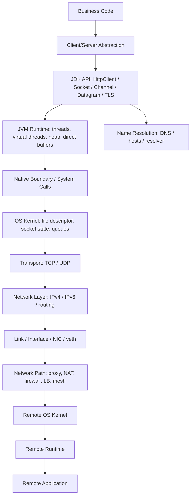

Layer ini tidak selalu linear. Misalnya DNS resolution bisa terjadi sebelum socket dibuat, TLS berjalan setelah TCP connect, dan HTTP/2 multiplexing bisa membuat beberapa logical request berbagi satu TCP connection.

---

## 3. OSI vs TCP/IP vs Java Practical Model

### 3.1 OSI Model

OSI model sering diajarkan sebagai 7 layer:

| OSI Layer | Contoh | Relevansi untuk Java |
|---|---|---|
| 7. Application | HTTP, WebSocket, custom protocol | `HttpClient`, protocol parser, application framing. |
| 6. Presentation | TLS, encoding, serialization | TLS, charset, compression, binary/text encoding. |
| 5. Session | Session management | Connection/session lifecycle, TLS session, WebSocket lifecycle. |
| 4. Transport | TCP, UDP | `Socket`, `ServerSocket`, `DatagramSocket`, channels. |
| 3. Network | IP, routing | `InetAddress`, source/destination address, route behavior. |
| 2. Data Link | Ethernet, Wi-Fi, veth | Mostly OS/container concern. |
| 1. Physical | Cable, radio, NIC hardware | Usually infrastructure concern. |

OSI berguna untuk vocabulary, tetapi sering terlalu akademis untuk debugging Java.

### 3.2 TCP/IP Model

TCP/IP model lebih dekat dengan realitas internet:

| TCP/IP Layer | Contoh | Java Concern |
|---|---|---|
| Application | HTTP, DNS, WebSocket, custom protocol | `java.net.http`, parsers, protocol state. |
| Transport | TCP, UDP | `Socket`, `DatagramSocket`, `SocketChannel`. |
| Internet | IPv4, IPv6, ICMP | `InetAddress`, route, address family. |
| Link | Ethernet, loopback, container bridge | `NetworkInterface`, deployment environment. |

### 3.3 Java Practical Model

Untuk Java engineer, model paling berguna adalah model berbasis **responsibility and failure boundary**.

| Practical Layer | Contoh Java/API | Failure yang sering muncul |
|---|---|---|
| Call site | service method, controller, job worker | No deadline, cancellation ignored, retry wrong. |
| Client wrapper | SDK/internal client | Bad policy, unbounded concurrency, config drift. |
| Protocol API | `HttpClient`, WebSocket, custom encoder | Bad headers, malformed frame, body leak. |
| TLS/security | `SSLContext`, truststore | Handshake fail, hostname mismatch, expired cert. |
| Transport API | `Socket`, `SocketChannel` | Connect timeout, reset, broken pipe, EOF. |
| JVM runtime | threads, virtual threads, buffers, GC | Thread starvation, pinning, direct memory pressure. |
| OS socket | fd, socket queues, TCP state | fd exhaustion, TIME_WAIT, backlog overflow. |
| Name resolution | `InetAddress`, resolver | Unknown host, stale cache, wrong address family. |
| Network path | proxy, NAT, firewall, LB, mesh | Blackhole, idle close, policy reject, MTU issue. |
| Remote side | server process, remote kernel | Refused, overload, slow read, protocol close. |

---

## 4. Journey of an Outbound Java HTTP Call

Mari pecah network call yang terlihat sederhana:

```java
HttpResponse<String> response = client.send(request, BodyHandlers.ofString());
```

Secara konseptual, perjalanan outbound request bisa seperti ini:

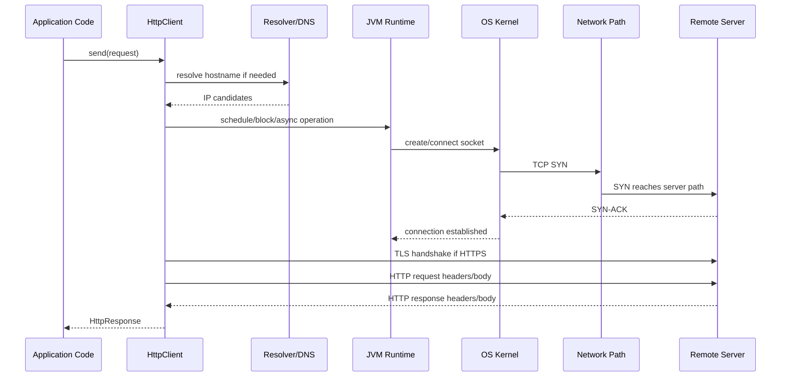

Namun real path bisa berbeda:

- `HttpClient` mungkin reuse existing pooled connection sehingga tidak ada DNS/connect/TLS baru.
- Request HTTPS via proxy bisa memakai `CONNECT` tunnel.
- HTTP/2 bisa multiplex beberapa request pada satu connection.
- DNS bisa mengembalikan beberapa IP dan client/OS memilih salah satu.
- IPv6 mungkin dicoba sebelum IPv4 tergantung konfigurasi.
- TLS bisa melakukan ALPN untuk memilih HTTP/2 atau HTTP/1.1.
- Response body bisa streaming, bukan langsung selesai saat header diterima.

---

## 5. Journey of an Inbound Java TCP Server Call

Untuk server TCP blocking sederhana:

```java
try (ServerSocket server = new ServerSocket(8080)) {
    while (true) {
        Socket socket = server.accept();
        handle(socket);
    }
}
```

Realitasnya:

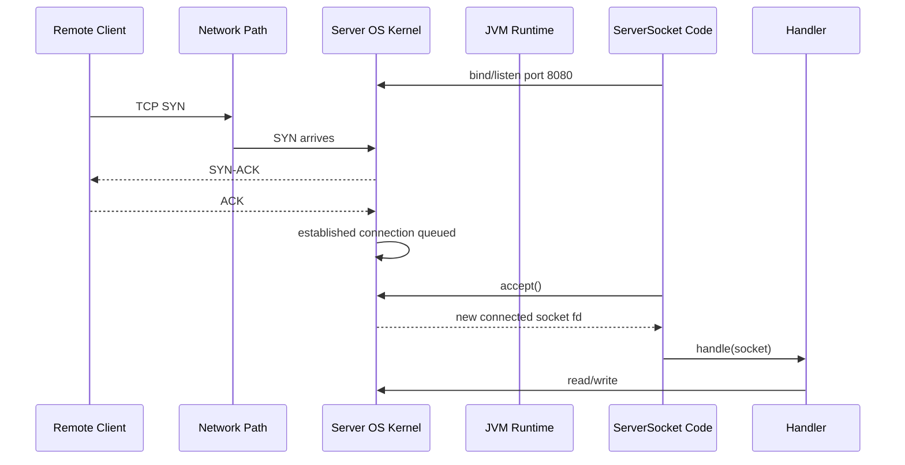

Important distinction:

- Kernel bisa menyelesaikan TCP handshake sebelum Java memanggil `accept()`.
- `accept()` mengambil established connection dari queue.
- Jika application lambat menerima connection, queue bisa penuh.
- Jika handler lambat read, receive buffer bisa penuh dan memberi backpressure ke peer.
- Jika handler lambat write, send buffer bisa penuh dan write bisa block atau partial.

---

## 6. Java Object vs OS Resource

Salah satu kesalahan mental model paling mahal adalah menyamakan object Java dengan koneksi jaringan.

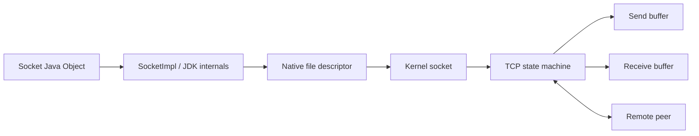

`Socket` object adalah representasi di heap. Koneksi sebenarnya dimiliki OS kernel melalui file descriptor/native handle.

Implikasi:

1. GC bukan lifecycle management yang benar untuk socket.
2. `try-with-resources` bukan style preference; ia correctness boundary.
3. Leak socket bisa muncul sebagai file descriptor exhaustion.
4. Socket yang tidak ditutup bisa membuat remote peer menunggu.
5. Closing dari satu thread bisa membangunkan thread lain yang sedang blocked di read/write.
6. Beberapa socket option harus diset sebelum connect/bind agar efektif.

---

## 7. Name Resolution Is Not Just DNS Lookup

Ketika Java menerima hostname, proses resolution bisa melibatkan:

- hosts file,
- OS resolver,
- DNS server,
- JVM cache,
- search domain,
- custom resolver provider,
- IPv4/IPv6 preference,
- security manager legacy behavior pada JDK lama,
- container DNS configuration.

Contoh:

```java
InetAddress address = InetAddress.getByName("api.example.com");
```

Hasilnya bukan sekadar IP tunggal secara konseptual. Hostname bisa punya beberapa record:

```text
api.example.com -> 10.0.4.10
api.example.com -> 10.0.7.12
api.example.com -> 2001:db8::42
```

Pertanyaan production:

1. Berapa lama hasil resolve di-cache?
2. Apakah negative result di-cache?
3. Apakah client mencoba semua IP atau hanya satu?
4. Apakah IPv6 didahulukan?
5. Apakah DNS berubah saat connection pool masih punya koneksi lama?
6. Apakah hostname diverifikasi terhadap certificate TLS?
7. Apakah redirect menyebabkan resolve hostname baru?
8. Apakah service discovery mengandalkan DNS TTL pendek?

### DNS as Runtime Dependency

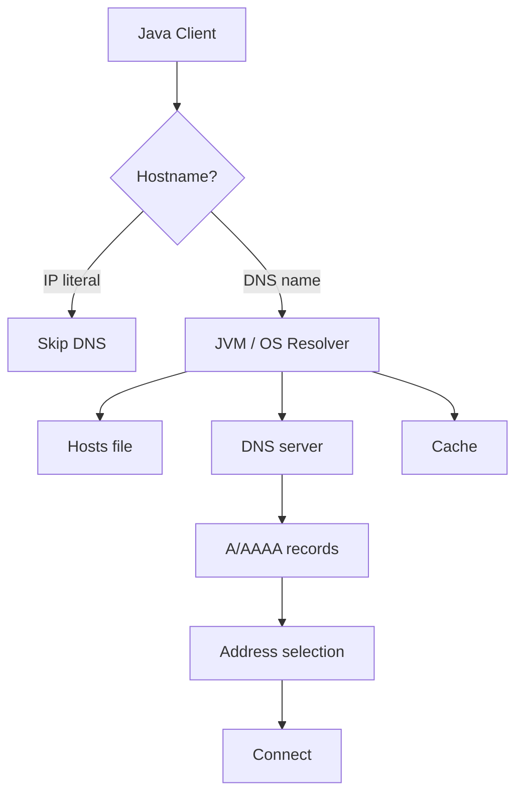

DNS failure bisa tampak seperti application failure, padahal aplikasi belum menyentuh remote server.

---

## 8. TCP: Connection-Oriented Byte Stream

TCP memberi beberapa properti penting:

- connection-oriented,
- reliable delivery dalam kondisi normal,
- ordered bytes,
- duplicate suppression,
- flow control,
- congestion control,
- retransmission,
- graceful close via FIN,
- abortive close via RST.

Tetapi TCP tidak memberi:

- message boundary,
- application-level timeout,
- semantic retry,
- encryption,
- authentication,
- guarantee bahwa remote app memproses request,
- guarantee bahwa idle connection masih valid melewati NAT/LB.

### TCP State Simplified

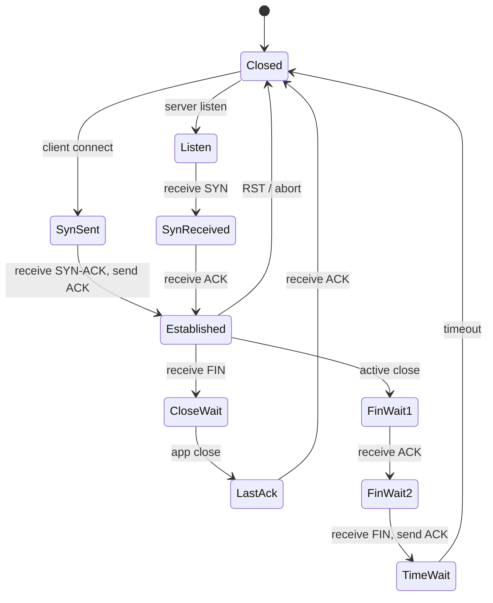

Java engineer tidak perlu menghafal semua detail TCP state untuk menulis aplikasi, tetapi wajib memahami konsekuensi:

- `TIME_WAIT` bisa meningkat ketika banyak koneksi singkat dibuat.
- `CLOSE_WAIT` sering menunjukkan aplikasi belum menutup socket setelah peer close.
- `SYN_SENT` banyak bisa menunjukkan remote blackhole/connect hang.
- `ESTABLISHED` banyak tidak selalu sehat; bisa idle, stuck, atau menunggu read/write.

---

## 9. UDP: Datagram-Oriented Best Effort

UDP berbeda total dari TCP.

| Aspect | TCP | UDP |
|---|---|---|
| Connection | Logical connection | No connection required. |
| Data model | Byte stream | Datagram packet. |
| Ordering | Ordered | Not guaranteed. |
| Delivery | Retransmission by TCP | Not guaranteed. |
| Duplication | Suppressed by TCP | Possible. |
| Flow control | Built in | Application responsibility. |
| Congestion control | Built in | Application responsibility. |
| Message boundary | No | Yes, per datagram. |

UDP punya message boundary, tetapi bukan berarti lebih mudah. Justru banyak tanggung jawab pindah ke aplikasi:

- retry,
- deduplication,
- ordering,
- loss detection,
- rate control,
- payload size/MTU management,
- security,
- amplification risk.

Di Java, API yang relevan:

- `DatagramSocket`,
- `DatagramPacket`,
- `MulticastSocket`,
- `DatagramChannel`.

Seri ini akan memakai UDP untuk melatih pemahaman datagram, bukan menjadikannya default untuk semua low-latency system.

---

## 10. TLS: Secure Transport Layer

HTTPS bukan hanya HTTP dengan port 443. HTTPS adalah HTTP di atas TLS di atas TCP.

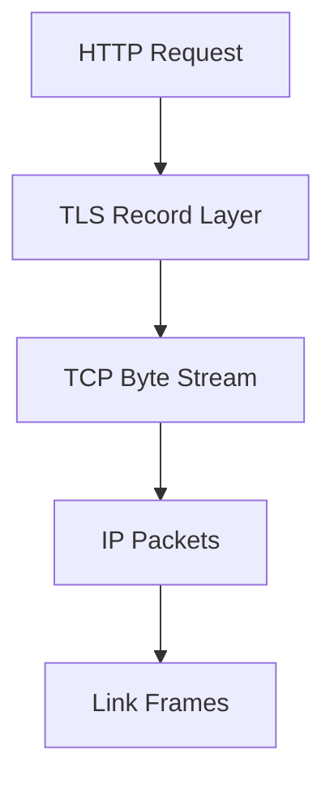

TLS menambahkan:

- encryption,
- server identity verification,
- optional client identity via mTLS,
- certificate chain validation,
- hostname verification,
- protocol negotiation via ALPN,
- SNI to select certificate/server config,
- session resumption.

Failure TLS sering terlihat seperti network failure:

```text
javax.net.ssl.SSLHandshakeException
java.security.cert.CertPathValidatorException
javax.net.ssl.SSLPeerUnverifiedException
```

Mental model yang benar:

> TCP connect success hanya berarti network path ke port terbuka. Itu belum berarti identity remote valid, certificate trusted, hostname cocok, atau protocol bisa dinegosiasikan.

---

## 11. HTTP Layer: Logical Request over Reusable Connections

HTTP modern tidak selalu “satu request = satu koneksi”.

| Mode | Behavior |
|---|---|
| HTTP/1.0 classic | Koneksi sering ditutup per request. |
| HTTP/1.1 keep-alive | Beberapa request sequential bisa memakai satu TCP connection. |
| HTTP/1.1 pipelining | Jarang dipakai secara luas karena head-of-line issues. |
| HTTP/2 | Banyak stream logical multiplex di atas satu TCP connection. |
| WebSocket | Upgrade/handshake lalu connection long-lived full-duplex. |

`HttpClient` menyembunyikan banyak detail:

- connection reuse,
- redirect,
- proxy,
- authenticator,
- cookie handler,
- HTTP version preference,
- body publisher/subscriber,
- async execution,
- TLS integration.

Namun hidden detail tetap punya consequence.

Contoh:

- Jika response body tidak dikonsumsi dengan benar, koneksi bisa tidak reusable.
- Jika pool reuse stale connection, request pertama setelah idle bisa gagal.
- Jika HTTP/2 stream flow control tertahan, request lain pada connection yang sama bisa terdampak.
- Jika request timeout terlalu besar, thread/virtual thread/caller bisa tertahan terlalu lama.

---

## 12. Blocking, Non-Blocking, Async, and Virtual Threads

Networking API tidak bisa dipisahkan dari execution model.

### 12.1 Blocking I/O

```text
thread calls read() -> OS has no data -> thread waits
```

Kelebihan:

- kode mudah dibaca,
- control flow natural,
- cocok dengan virtual threads,
- mudah untuk protocol sederhana.

Risiko:

- platform thread mahal jika ribuan koneksi,
- salah timeout bisa membuat thread tertahan,
- blocking pada resource lain bisa menyebabkan starvation.

### 12.2 Non-Blocking I/O

```text
channel.configureBlocking(false)
selector.select()
if key readable -> read what is available
```

Kelebihan:

- sedikit thread bisa handle banyak koneksi,
- cocok untuk server high-concurrency,
- kontrol event-loop eksplisit.

Risiko:

- state machine lebih sulit,
- partial read/write wajib benar,
- backpressure harus eksplisit,
- bug kecil bisa busy spin atau OOM.

### 12.3 Async Completion

```text
start read -> return immediately -> callback/future completed later
```

Kelebihan:

- tidak menulis selector loop sendiri,
- cocok untuk beberapa model async.

Risiko:

- callback lifecycle kompleks,
- cancellation semantics harus jelas,
- error propagation lebih sulit,
- debugging stack trace bisa kurang linear.

### 12.4 Virtual Threads

Virtual threads membuat blocking I/O kembali menarik untuk banyak use case.

Modelnya:

```text
one virtual thread per request/connection/operation
blocking call parks virtual thread
carrier thread can run other virtual threads
```

Namun virtual threads bukan penghapus semua limit:

- socket tetap resource OS,
- remote service tetap bisa overload,
- connection pool tetap terbatas,
- memory per task tetap ada,
- blocking dalam synchronized/pinning scenario tetap harus diperhatikan,
- concurrency harus tetap bounded.

---

## 13. Latency Is a Sum of Phases

Jangan membaca latency sebagai angka tunggal.

Outbound HTTPS request bisa terdiri dari:

```text
T_total = T_queue
        + T_dns
        + T_connect
        + T_tls
        + T_request_write
        + T_server_processing
        + T_response_header
        + T_response_body
        + T_client_processing
```

Jika connection reused:

```text
T_total = T_queue
        + T_request_write
        + T_server_processing
        + T_response_header
        + T_response_body
        + T_client_processing
```

Jika retry terjadi:

```text
T_total = attempt_1_duration
        + backoff
        + attempt_2_duration
        + backoff
        + attempt_3_duration
```

Design implication:

- Satu “request timeout” besar sering tidak cukup.
- Tanpa phase timing, root cause susah ditemukan.
- Retry harus menghormati total deadline.
- Pool acquisition latency perlu diukur terpisah.
- DNS latency perlu diobservasi jika resolver sering menjadi bottleneck.

---

## 14. Failure by Layer

### 14.1 Application/Call Site Layer

Failure:

- no timeout,
- no cancellation,
- retry all exceptions,
- duplicate side effect,
- no idempotency key,
- unbounded concurrency.

Evidence:

- call stack,
- request metadata,
- deadline config,
- retry logs,
- business operation id.

### 14.2 Protocol Layer

Failure:

- malformed request,
- invalid response,
- unsupported HTTP version,
- wrong content length,
- frame too large,
- body not consumed,
- WebSocket close protocol violation.

Evidence:

- wire log when safe,
- header/body size,
- protocol state,
- parser error,
- server access logs.

### 14.3 TLS Layer

Failure:

- unknown CA,
- expired certificate,
- hostname mismatch,
- missing client certificate,
- SNI mismatch,
- ALPN negotiation issue,
- protocol/cipher mismatch.

Evidence:

- certificate chain,
- truststore/keystore,
- `javax.net.debug`,
- SNI hostname,
- negotiated protocol.

### 14.4 Transport Layer

Failure:

- refused,
- timeout,
- reset,
- broken pipe,
- EOF,
- retransmission,
- keepalive issue,
- half-close confusion.

Evidence:

- OS socket state,
- packet capture,
- remote listener status,
- load balancer logs,
- TCP counters.

### 14.5 Network/Infrastructure Layer

Failure:

- no route,
- firewall drop,
- NAT issue,
- proxy reject,
- DNS policy,
- MTU blackhole,
- load balancer idle timeout,
- service mesh sidecar failure.

Evidence:

- route table,
- DNS result,
- proxy logs,
- network policy,
- packet trace,
- cloud load balancer metrics.

---

## 15. The “Remote Call Is Not a Local Call” Rule

Local method call has relatively clear semantics:

```java
Result result = service.calculate(input);
```

Network call has partial failure:

```java
Result result = remoteService.calculate(input);
```

This can mean:

1. Request never left process.
2. Request left process but never reached server.
3. Server received request but did not process.
4. Server processed but failed before commit.
5. Server committed but response was lost.
6. Client timed out while server continued processing.
7. Client retried and server processed twice.
8. Response arrived but body parsing failed.

State model:

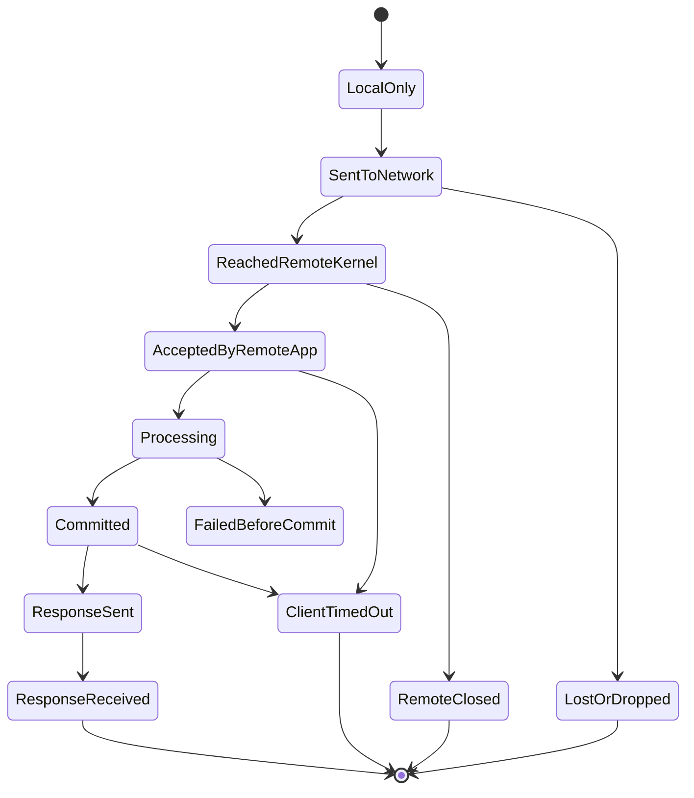

Retry policy harus mempertimbangkan state yang tidak terlihat ini.

---

## 16. Loopback, Localhost, and Container Reality

`localhost` sering dianggap sederhana. Dalam production-like environment, tidak selalu.

| Term | Meaning |
|---|---|
| `127.0.0.1` | IPv4 loopback address. |
| `::1` | IPv6 loopback address. |
| `localhost` | Hostname yang biasanya resolve ke loopback, bisa IPv4/IPv6. |
| `0.0.0.0` | Wildcard bind IPv4, menerima koneksi pada semua interface IPv4. |
| `::` | Wildcard bind IPv6. |
| Container `localhost` | Container sendiri, bukan host machine. |
| Kubernetes service name | DNS name dalam cluster. |

Common bug:

```text
Java app inside container connects to localhost:5432
```

Engineer berharap itu database di host machine. Realitasnya, itu menunjuk ke container yang sama. Jika database tidak berada di container itu, koneksi gagal.

Common server bind bug:

```java
new ServerSocket(8080, 50, InetAddress.getByName("127.0.0.1"));
```

Server hanya menerima koneksi dari loopback. Dari container lain atau host lain, port terlihat tidak terbuka.

Untuk development, ini bisa aman. Untuk service yang harus menerima traffic eksternal, bind address harus dipilih sadar.

---

## 17. Network Interfaces

Java menyediakan `NetworkInterface` untuk melihat interface OS.

Interface bisa berupa:

- loopback,
- Ethernet,
- Wi-Fi,
- VPN,
- Docker bridge,
- Kubernetes veth,
- tunnel,
- virtual interface cloud.

Interface penting ketika:

- memilih bind address,
- multicast,
- IPv6 scope,
- debugging route,
- service yang harus listen hanya pada private interface,
- host punya banyak NIC.

Mental model:

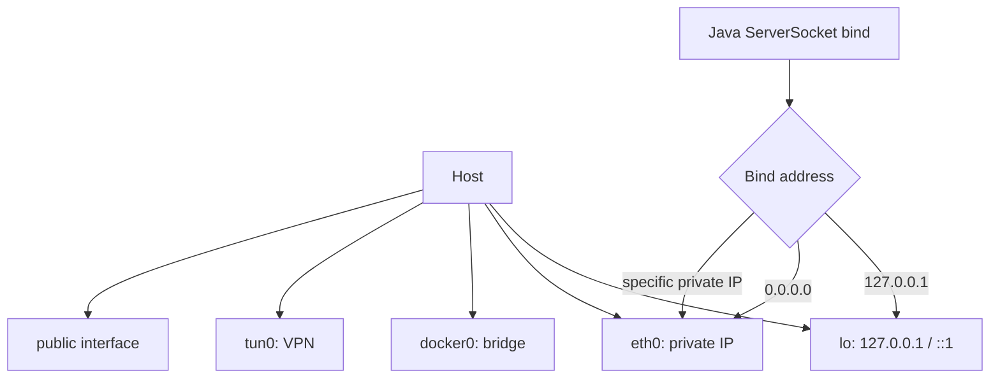

---

## 18. Kernel Queues and Backlog

Server networking memiliki queue sebelum Java code memproses connection.

Simplified:

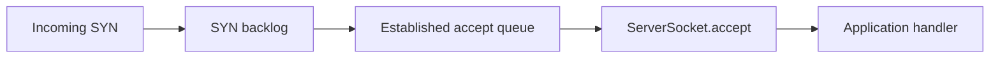

Jika queue penuh:

- connection bisa ditolak,
- SYN bisa di-drop,
- client melihat timeout atau refused tergantung OS/config,
- load balancer bisa menganggap backend tidak sehat,
- retry storm bisa memperparah.

Parameter `backlog` pada server socket bukan satu-satunya faktor; OS limit juga berperan.

Ini penting untuk Part 007 dan Part 031.

---

## 19. Resource Limits

Java networking dibatasi oleh banyak resource.

| Resource | Owned by | Failure symptom |
|---|---|---|
| File descriptor | OS/process | Too many open files. |
| Ephemeral port | OS/network namespace | Cannot assign requested address, connect failure. |
| Thread/platform thread | JVM/OS | Thread exhaustion, latency spike. |
| Virtual thread | JVM | Huge task count, memory/scheduler pressure. |
| Heap buffer | JVM heap | GC pressure, OOM. |
| Direct buffer | JVM/native memory | Direct buffer OOM, native memory pressure. |
| Socket send buffer | OS | write blocks, partial write. |
| Socket receive buffer | OS | peer backpressure, packet drop. |
| Connection pool slot | Client runtime | pool wait, timeout, head-of-line at client. |
| DNS resolver capacity | OS/DNS infra | resolution latency/failure. |

Top-tier networking design selalu bounded:

- bounded connection count,
- bounded request concurrency,
- bounded buffer size,
- bounded retry budget,
- bounded wait time,
- bounded queue depth.

---

## 20. Practical Debugging Model

Ketika network call gagal, gunakan urutan ini.

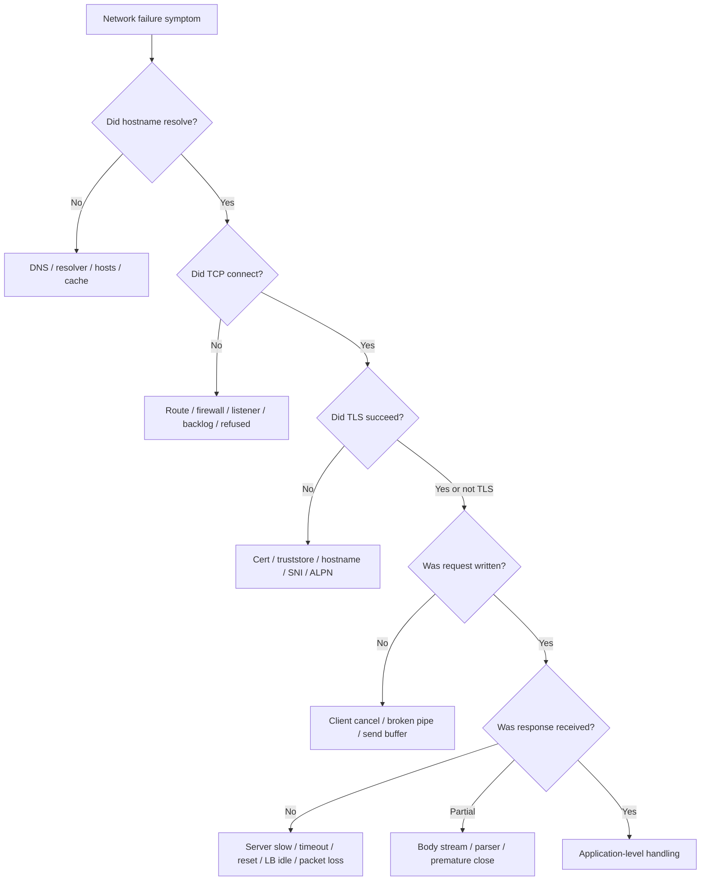

Gunakan model ini sebelum melihat code. Jangan mulai dengan mengganti library atau menaikkan timeout tanpa tahu layer.

---

## 21. Tiny Conceptual Example: Phase Timing Wrapper

Kita belum akan membangun full production client di part ini. Namun contoh kecil ini menunjukkan cara berpikir phase-based.

```java
public final class PhaseTimer {
    private final long startedAtNanos = System.nanoTime();
    private final Map<String, Long> marks = new LinkedHashMap<>();

    public void mark(String phase) {
        marks.put(phase, System.nanoTime() - startedAtNanos);
    }

    public Map<String, Duration> snapshot() {
        Map<String, Duration> result = new LinkedHashMap<>();
        for (var entry : marks.entrySet()) {
            result.put(entry.getKey(), Duration.ofNanos(entry.getValue()));
        }
        return Map.copyOf(result);
    }
}
```

Usage concept:

```java
PhaseTimer timer = new PhaseTimer();

timer.mark("request.created");
// resolve/connect/TLS may be hidden inside HttpClient if connection is not reused
timer.mark("send.before");
HttpResponse<InputStream> response = client.send(request, BodyHandlers.ofInputStream());
timer.mark("headers.received");

try (InputStream body = response.body()) {
    body.transferTo(OutputStream.nullOutputStream());
}
timer.mark("body.consumed");
```

Ini belum cukup untuk phase timing internal DNS/connect/TLS, tetapi sudah mengajarkan invariant:

> Jangan hanya ukur total time. Pisahkan minimal request creation, send start, response header, body consumption, dan post-processing.

---

## 22. What Java Can and Cannot Abstract Away

Java bisa membantu:

- menyediakan portable API,
- menyederhanakan socket creation,
- menyediakan HTTP client modern,
- mengelola TLS lewat JSSE,
- menyediakan NIO selector abstraction,
- membuat blocking I/O lebih scalable dengan virtual threads.

Java tidak bisa menghapus:

- network latency,
- partial failure,
- DNS inconsistency,
- packet loss,
- remote overload,
- proxy/firewall behavior,
- certificate expiry,
- kernel resource limits,
- idempotency problem,
- need for protocol framing,
- need for backpressure.

Senior engineer tahu batas abstraction.

---

## 23. Common Misleading Explanations

### 23.1 “Socket Is a Connection”

Lebih tepat:

> Socket adalah endpoint abstraction yang merepresentasikan resource komunikasi. Untuk TCP, ia terkait dengan connection state. Untuk UDP, ia bisa mengirim/menerima datagram tanpa connection semantic yang sama.

### 23.2 “HTTP Is Stateless”

HTTP semantics bisa stateless di application layer, tetapi transport-nya bisa stateful:

- TCP connection reused,
- TLS session reused,
- HTTP/2 streams share connection,
- cookies/session tokens exist,
- proxy and connection pool maintain state.

### 23.3 “Timeout Means Server Failed”

Timeout berarti caller berhenti menunggu. Remote side bisa tetap memproses.

### 23.4 “Retry Fixes Network Flakiness”

Retry bisa memperbaiki transient failure. Retry juga bisa:

- menggandakan side effect,
- memperparah overload,
- melanggar deadline,
- menyembunyikan bug,
- membuat traffic spike.

### 23.5 “NIO Is Always Faster”

NIO bisa lebih scalable untuk banyak koneksi, tetapi bukan otomatis lebih cepat untuk semua workload. Complexity, buffer management, state machine, dan backpressure bisa membuat implementasi buruk lebih lambat dan lebih berbahaya.

### 23.6 “Virtual Threads Remove the Need for Networking Design”

Virtual threads mengurangi biaya blocking wait, tetapi tidak menghapus:

- socket limit,
- connection pool limit,
- remote service capacity,
- timeout design,
- retry correctness,
- memory bound,
- backpressure.

---

## 24. Production Questions Before Writing Network Code

Sebelum menulis client/server networking, jawab:

1. Siapa remote peer secara logical dan cryptographic?
2. Apakah hostname bisa berubah saat process hidup?
3. Apakah request idempotent?
4. Berapa deadline total dari caller?
5. Berapa connect timeout?
6. Berapa response timeout?
7. Apakah body bisa besar?
8. Apakah streaming diperlukan?
9. Berapa concurrency maksimum?
10. Apakah connection pool dipakai?
11. Apakah proxy wajib?
12. Apakah TLS/mTLS diperlukan?
13. Apakah redirect diizinkan?
14. Apakah private IP boleh diakses?
15. Apa observability per fase?
16. Bagaimana shutdown?
17. Apa behavior saat remote overload?
18. Apa retry policy dan backoff?
19. Apa circuit/bulkhead/rate limit boundary?
20. Bagaimana failure diuji?

---

## 25. Practice: Draw Layered Failure Hypotheses

Gunakan scenario berikut:

```text
Service A menggunakan Java HttpClient untuk memanggil https://risk.internal.company/score.
Sejak deploy ke Kubernetes, p99 latency naik dari 80ms ke 2s.
Error sesekali: java.net.SocketTimeoutException dan SSLHandshakeException.
Di local laptop tidak terjadi.
```

Buat minimal 10 hypothesis berdasarkan layer:

| Layer | Hypothesis | Evidence |
|---|---|---|
| DNS | Kubernetes DNS search/latency | CoreDNS metrics, resolution timing. |
| IPv6 | Address preference berbeda | Resolved A/AAAA records, connect target. |
| TLS | SNI/cert chain berbeda | TLS debug, cert SAN. |
| Proxy | Cluster egress proxy | Env vars, proxy logs. |
| NetworkPolicy | Intermittent drop | Kubernetes policy, packet trace. |
| Load balancer | Idle connection close | LB logs, reset timing. |
| Client pool | Stale connection reuse | client connection logs. |
| Server | risk service overload | server metrics, queue time. |
| JVM | GC/direct buffer pressure | GC logs, memory metrics. |
| Retry | retry amplifies latency | attempt count, deadline logs. |

Tujuannya bukan langsung tahu jawaban, tetapi membangun discipline: **failure harus dimodelkan per layer**.

---

## 26. Checklist Part 002

Sebelum lanjut ke Part 003, pastikan kamu bisa menjelaskan:

- [ ] Perbedaan OSI, TCP/IP, dan Java practical layer model.
- [ ] Perjalanan outbound HTTP call dari Java code sampai remote process.
- [ ] Perjalanan inbound TCP server dari SYN sampai `accept()`.
- [ ] Perbedaan object Java dan OS socket resource.
- [ ] Peran DNS sebagai runtime dependency.
- [ ] TCP sebagai byte stream, bukan message protocol.
- [ ] UDP sebagai datagram best-effort.
- [ ] TLS sebagai secure transport dengan identity verification.
- [ ] HTTP sebagai logical request di atas reusable transport.
- [ ] Perbedaan blocking, non-blocking, async, dan virtual thread.
- [ ] Latency sebagai penjumlahan fase.
- [ ] Failure classification berdasarkan layer.
- [ ] Resource limit yang relevan untuk Java networking.

---

## 27. Summary

Part ini membangun model mental dasar:

1. Java networking berada di atas JDK API, JVM runtime, OS kernel, DNS, TCP/UDP, TLS, HTTP, dan infrastructure path.
2. Network call bukan local call; ia memiliki partial failure dan ambiguous outcome.
3. `Socket`/`Channel`/`HttpClient` adalah abstraction, bukan penghapus semantik jaringan.
4. Debugging networking harus dimulai dari layer hypothesis.
5. Latency harus dipecah menjadi fase.
6. Resource harus bounded dan punya owner.
7. Virtual threads, NIO, HTTP client, dan TLS adalah tools; correctness tetap berasal dari mental model.

Part berikutnya akan masuk ke **endpoint identity, addressing, dan routing basics**: host, port, socket address, IPv4/IPv6, loopback, wildcard bind, ephemeral port, NAT, dan bagaimana semua itu mempengaruhi desain Java application.

---

## 28. Reference Baseline

Referensi teknis untuk part ini:

- Oracle Java SE 25 API — `java.net` package summary.
- Oracle Java SE 25 API — `java.nio.channels` package summary.
- Oracle Java SE 25 API — `java.net.http` module and package summary.
- Oracle Java SE 25 API — `HttpClient` class documentation.
- OpenJDK JEP 353 — Reimplement the Legacy Socket API.
- OpenJDK JEP 444 — Virtual Threads.
- RFC 9293 — Transmission Control Protocol.
- RFC 768 — User Datagram Protocol.
- RFC 8446 — TLS 1.3.
- RFC 9110 — HTTP Semantics.
