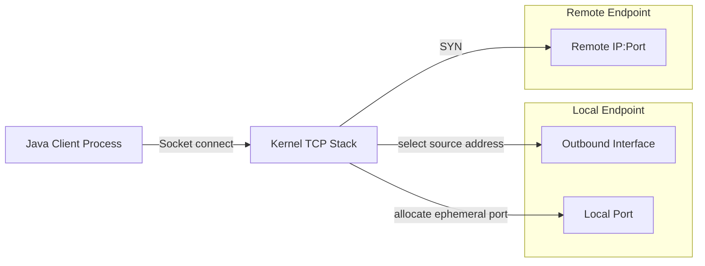
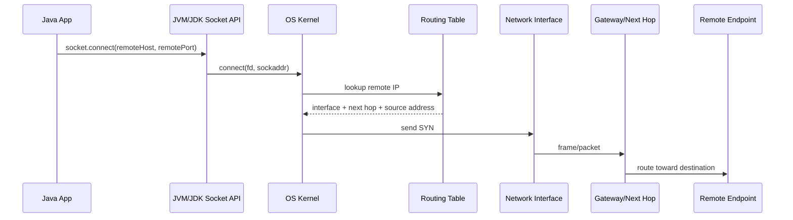
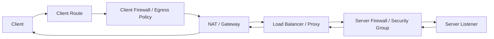
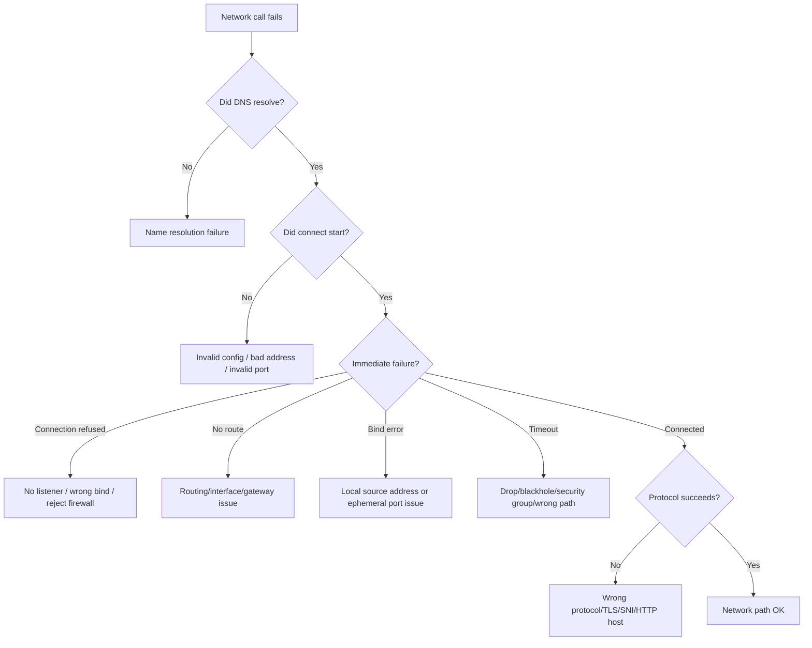

# Part 003 — Endpoint Identity, Addressing, and Routing Basics

## 1. Tujuan Part Ini

Di part sebelumnya kita membangun mental model bahwa Java networking adalah komunikasi antar proses melalui abstraksi JVM yang akhirnya turun ke kernel networking. Sekarang kita memperjelas satu pertanyaan dasar yang sering diremehkan:

> Ketika sebuah Java application berkata “connect ke service X” atau “listen di port Y”, sebenarnya **identitas endpoint** apa yang sedang digunakan, siapa yang memilihnya, dan failure apa yang bisa muncul dari pilihan itu?

Setelah menyelesaikan part ini, kamu harus mampu:

1. Membedakan **host identity**, **IP address**, **socket address**, **service identity**, dan **connection identity**.
2. Menjelaskan arti `host:port` secara tepat dalam konteks client, server, container, NAT, proxy, dan load balancer.
3. Memahami konsekuensi bind ke `127.0.0.1`, `0.0.0.0`, specific interface address, IPv6 loopback, dan wildcard address.
4. Mendiagnosis bug seperti “works locally but not in Docker/Kubernetes”, “connection refused”, “bind failed”, “wrong interface”, “ephemeral port exhaustion”, dan “service is listening but unreachable”.
5. Mendesain network configuration yang eksplisit, portable, dan aman untuk Java services.

Part ini masih belum masuk ke DNS secara detail. DNS akan dibahas di Part 004. Di sini kita fokus pada **endpoint identity dan addressing setelah nama berhasil diterjemahkan menjadi address**, atau ketika address diberikan langsung.

---

## 2. Mental Model Utama

Dalam aplikasi biasa, engineer sering berpikir endpoint sebagai string sederhana:

```text
https://api.company.internal:443
localhost:8080
10.20.30.40:9092
```

Namun di bawahnya ada beberapa level identitas:

| Level | Contoh | Makna |
|---|---|---|
| Service identity | `payment-api`, `core-banking-ledger`, `risk-scoring` | Entitas bisnis/operasional yang ingin dihubungi. |
| Name identity | `payment.internal.company` | Nama yang harus di-resolve menjadi address. |
| Network address | `10.12.4.21`, `2001:db8::10` | Lokasi host/interface pada network layer. |
| Transport endpoint | `10.12.4.21:443` | Kombinasi IP + port untuk TCP/UDP. |
| Socket identity | local IP + local port + remote IP + remote port + protocol | Identitas koneksi aktual di kernel. |
| Application protocol identity | HTTP `Host`, TLS SNI, mTLS certificate SAN | Identitas logical di atas transport. |

Java API merepresentasikan sebagian besar level tersebut melalui:

```java
InetAddress address = InetAddress.getByName("10.12.4.21");
InetSocketAddress endpoint = new InetSocketAddress(address, 443);
```

Tetapi `InetSocketAddress` bukan “service” secara penuh. Ia hanya mengatakan:

```text
connect/bind using this IP-like identity and this port number
```

Banyak bug production terjadi karena engineer mencampur level-level ini.

---

## 3. Deconstruction ala Kaufman

Menurut pendekatan Josh Kaufman, skill kompleks harus dibongkar menjadi sub-skill kecil. Untuk endpoint identity, skill-nya dapat didekomposisi seperti ini:

| Sub-skill | Pertanyaan yang harus bisa dijawab |
|---|---|
| Address reading | Apakah address ini loopback, private, public, link-local, multicast, wildcard, atau IPv6? |
| Port reasoning | Siapa yang memilih port? Static service port, ephemeral client port, atau port mapping? |
| Bind reasoning | Proses Java bind ke interface mana? Semua interface atau satu interface? |
| Reachability reasoning | Dari caller tertentu, apakah endpoint ini bisa dicapai secara routing/firewall/NAT? |
| Connection identity | Apa 5-tuple koneksi TCP aktualnya? |
| Container reasoning | Address ini bermakna dari host, container, pod, atau service network? |
| Failure classification | Apakah error berasal dari bind, connect, route, firewall, listener, NAT, atau protocol layer? |
| Configuration design | Bagaimana membuat endpoint config eksplisit dan tidak ambigu? |

Target part ini bukan hafal semua jenis IP, tetapi punya intuisi untuk bertanya:

> “Endpoint ini valid dari perspektif siapa?”

Pertanyaan itu lebih penting daripada sekadar “URL-nya benar atau tidak?”.

---

## 4. Core Vocabulary

### 4.1 Host

**Host** adalah entitas yang memiliki network stack. Bisa berupa:

- physical server,
- VM,
- laptop developer,
- Docker container,
- Kubernetes pod,
- network namespace,
- appliance,
- sidecar proxy.

Dalam konteks modern, “host” tidak selalu berarti mesin fisik. Container memiliki network namespace sendiri. Pod Kubernetes biasanya memiliki IP sendiri. Sidecar bisa menjadi proses berbeda dalam namespace yang sama.

### 4.2 Interface

**Network interface** adalah titik attachment host ke network.

Contoh:

```text
lo        loopback interface
eth0      ethernet interface
wlan0     wireless interface
docker0   Docker bridge
cni0      container network interface
```

Java menyediakan `NetworkInterface` untuk menginspeksi interface lokal:

```java
import java.net.NetworkInterface;
import java.util.Collections;

public class ListInterfaces {
    public static void main(String[] args) throws Exception {
        for (NetworkInterface ni : Collections.list(NetworkInterface.getNetworkInterfaces())) {
            System.out.printf("%s up=%s loopback=%s virtual=%s%n",
                    ni.getName(), ni.isUp(), ni.isLoopback(), ni.isVirtual());
            for (var addr : Collections.list(ni.getInetAddresses())) {
                System.out.printf("  %s%n", addr.getHostAddress());
            }
        }
    }
}
```

Hal yang harus diperhatikan:

- satu host bisa punya banyak interface,
- satu interface bisa punya banyak address,
- address bisa IPv4 atau IPv6,
- interface yang “up” belum tentu reachable dari semua caller,
- address di container tidak sama dengan address host.

### 4.3 IP Address

**IP address** adalah identifier di network layer. Untuk Java engineer, kategori praktisnya lebih penting daripada teori panjang.

| Kategori | Contoh | Makna praktis |
|---|---|---|
| IPv4 loopback | `127.0.0.1` | Hanya host/network namespace itu sendiri. |
| IPv6 loopback | `::1` | Loopback versi IPv6. |
| IPv4 wildcard | `0.0.0.0` | Bind ke semua local IPv4 interfaces; bukan remote destination normal. |
| IPv6 wildcard | `::` | Bind ke semua local IPv6 interfaces, tergantung dual-stack behavior OS/JDK. |
| Private IPv4 | `10.0.0.0/8`, `172.16.0.0/12`, `192.168.0.0/16` | Internal network; tidak globally routable di internet publik. |
| Link-local IPv4 | `169.254.x.x` | Local link auto-config; biasanya bukan endpoint service enterprise. |
| Link-local IPv6 | `fe80::/10` | Butuh scope/interface; sering membingungkan. |
| Multicast | `224.0.0.0/4`, `ff00::/8` | One-to-many delivery; bukan ordinary unicast service. |
| Public IP | `8.8.8.8` | Routable secara global, tergantung firewall/policy. |

### 4.4 Port

**Port** adalah identifier transport-layer untuk membedakan proses atau listener pada satu address/protocol.

```text
TCP 10.10.1.5:443
UDP 10.10.1.5:53
```

TCP port dan UDP port adalah namespace berbeda. Aplikasi bisa listen TCP `:8080` dan UDP `:8080` secara bersamaan karena protocol-nya berbeda.

Port tidak mengidentifikasi service secara universal. Ia hanya bermakna dalam kombinasi:

```text
protocol + IP address + port
```

### 4.5 Socket Address

Dalam Java, kombinasi address dan port direpresentasikan oleh `InetSocketAddress`.

```java
var endpoint = new InetSocketAddress("api.internal", 443);
```

Penting: constructor dengan `String host` dapat menghasilkan unresolved address tergantung cara dibuat. Ini berguna untuk API yang ingin menunda DNS resolution.

```java
InetSocketAddress unresolved = InetSocketAddress.createUnresolved("api.internal", 443);
System.out.println(unresolved.isUnresolved()); // true
```

Unresolved address bukan koneksi gagal. Ia hanya berarti host name belum diterjemahkan menjadi `InetAddress` pada saat object dibuat.

---

## 5. Java API Map untuk Endpoint Identity

| API | Fungsi | Risiko salah paham |
|---|---|---|
| `InetAddress` | IP address + name resolution facade | Dianggap sekadar wrapper IP, padahal bisa trigger DNS. |
| `Inet4Address` | IPv4 address | Mengunci IPv4 dan mengabaikan dual-stack. |
| `Inet6Address` | IPv6 address | Scope/interface penting untuk link-local. |
| `InetSocketAddress` | Address + port | Bisa resolved atau unresolved. |
| `SocketAddress` | Abstraksi address generic | Tidak selalu IP; Unix-domain socket juga punya address sendiri. |
| `NetworkInterface` | Interface lokal | Banyak environment punya interface virtual/container. |
| `Socket` | TCP client endpoint | Local endpoint sering dipilih otomatis. |
| `ServerSocket` | TCP server listener | Bind address menentukan siapa yang bisa connect. |
| `DatagramSocket` | UDP endpoint | Semantics-nya bukan connection stream. |
| `URI` | Identifier resource/protocol level | URI bukan socket; scheme/host/port/path punya makna berbeda. |
| `URL` | Legacy URL abstraction | Bisa melakukan network operation lewat handler; hati-hati. |

Rule praktis:

> Gunakan `URI` untuk application-level resource, `InetSocketAddress` untuk transport endpoint, dan `InetAddress` hanya ketika kamu memang sedang berurusan dengan address/resolution/interface-level logic.

---

## 6. Endpoint dari Perspektif Client

Saat Java client melakukan TCP connect ke remote service:

```java
try (var socket = new java.net.Socket()) {
    socket.connect(new InetSocketAddress("example.com", 443), 2_000);
    System.out.println(socket.getLocalSocketAddress());
    System.out.println(socket.getRemoteSocketAddress());
}
```

Ada dua endpoint:

```text
local endpoint  = local IP + local ephemeral port
remote endpoint = remote IP + remote service port
```

Contoh output:

```text
/192.168.1.25:53142
/example.com/93.184.216.34:443
```

Engineer sering hanya melihat remote endpoint. Kernel juga harus memilih local endpoint. Local endpoint dipengaruhi oleh:

- routing table,
- source address selection,
- outbound interface,
- ephemeral port range,
- NAT mapping,
- firewall policy,
- container network namespace.

### 6.1 The TCP Connection 5-Tuple

Identitas TCP connection umumnya dianggap sebagai 5-tuple:

```text
protocol, source IP, source port, destination IP, destination port
```

Contoh:

```text
TCP, 192.168.1.25, 53142, 93.184.216.34, 443
```

Dua koneksi berbeda ke remote service yang sama bisa dibedakan oleh local ephemeral port:

```text
TCP, 192.168.1.25, 53142, 93.184.216.34, 443
TCP, 192.168.1.25, 53143, 93.184.216.34, 443
```

Ini penting untuk connection pooling, port exhaustion, NAT capacity, dan debugging packet capture.



---

## 7. Endpoint dari Perspektif Server

Server tidak “connect” lebih dulu. Server **bind** dan **listen**.

```java
try (var server = new java.net.ServerSocket()) {
    server.bind(new InetSocketAddress("0.0.0.0", 8080), 100);
    System.out.println("Listening on " + server.getLocalSocketAddress());

    while (true) {
        var socket = server.accept();
        System.out.println("Accepted " + socket.getRemoteSocketAddress());
        socket.close();
    }
}
```

Server endpoint punya dua keputusan besar:

1. port berapa yang dipakai,
2. local address/interface mana yang menerima koneksi.

### 7.1 Bind Address

Bind address menentukan koneksi masuk dari interface mana yang diterima.

| Bind address | Arti praktis |
|---|---|
| `127.0.0.1` | Hanya caller dari host/network namespace yang sama. Tidak reachable dari luar. |
| `localhost` | Bisa resolve ke `127.0.0.1`, `::1`, atau keduanya tergantung OS/config. |
| `0.0.0.0` | Listen di semua IPv4 interfaces. |
| `::` | Listen di semua IPv6 interfaces; dual-stack behavior tergantung platform. |
| specific private IP | Listen hanya di interface/address tersebut. |
| public IP | Listen di public-facing interface, jika host memilikinya. |

Common mistake:

```text
Service bind ke 127.0.0.1 di container.
Host mencoba access port mapping.
Result: connection refused / unreachable.
```

Dalam container, `127.0.0.1` berarti loopback container, bukan loopback host.

### 7.2 Binding to Port 0

Port `0` berarti “pilihkan port available”. Java kemudian bisa mengambil port aktual:

```java
try (var server = new java.net.ServerSocket(0)) {
    int actualPort = server.getLocalPort();
    System.out.println("Assigned port: " + actualPort);
}
```

Use case:

- integration test,
- ephemeral local helper server,
- dynamic service registration,
- avoiding port collision in parallel test.

Anti-pattern:

```java
int port = findFreePort();
startServer(port);
```

Ini race-prone. Port bisa diambil proses lain setelah `findFreePort()` dan sebelum `bind()`. Lebih aman bind langsung ke port `0`, lalu baca actual port dari server socket.

---

## 8. Loopback, Wildcard, and Specific Bind

### 8.1 Loopback Bind

```java
new ServerSocket().bind(new InetSocketAddress("127.0.0.1", 8080));
```

Artinya:

- hanya local process dalam network namespace yang sama bisa connect,
- bagus untuk admin endpoint local-only,
- bagus untuk sidecar/local agent pattern,
- buruk kalau service harus diakses dari host/container lain.

### 8.2 Wildcard Bind

```java
new ServerSocket().bind(new InetSocketAddress("0.0.0.0", 8080));
```

Artinya:

- listen di semua IPv4 local addresses,
- caller dari network manapun yang routing/firewall-nya mengizinkan bisa reach,
- bagus untuk service server umum,
- berbahaya jika digunakan untuk admin/debug endpoint tanpa protection.

`0.0.0.0` sebagai bind address berbeda dari `0.0.0.0` sebagai remote destination. Sebagai destination, itu biasanya tidak bermakna untuk connect aplikasi biasa.

### 8.3 Specific Interface Bind

```java
InetAddress bindAddress = InetAddress.getByName("10.20.30.40");
new ServerSocket().bind(new InetSocketAddress(bindAddress, 8080));
```

Artinya server hanya menerima koneksi ke address tersebut. Ini berguna untuk:

- memisahkan internal dan external traffic,
- mengikat service ke management network,
- menghindari expose tidak sengaja,
- multi-homed host.

Risikonya:

- address berubah setelah redeploy,
- container/pod IP ephemeral,
- environment-specific config membuat deployment tidak portable,
- bind gagal jika address tidak ada di host.

---

## 9. `localhost` Is Not a Simple Constant

`localhost` terlihat sederhana, tapi production bug sering muncul dari asumsi ini.

`localhost` adalah nama. Ia perlu resolve. Biasanya melalui `/etc/hosts` atau OS resolver.

Contoh mapping umum:

```text
127.0.0.1 localhost
::1       localhost
```

Masalahnya:

- Java bisa mencoba IPv6 lebih dulu.
- Service mungkin hanya bind IPv4 loopback.
- Client connect ke `localhost` dan mendapat `::1`, lalu gagal.
- Test local lulus karena OS tertentu, CI gagal karena resolver order berbeda.

Praktik lebih eksplisit:

| Kebutuhan | Gunakan |
|---|---|
| IPv4 loopback pasti | `127.0.0.1` |
| IPv6 loopback pasti | `::1` |
| Any local loopback concept | `InetAddress.getLoopbackAddress()` |
| Production service config | hostname service/DNS, bukan hard-coded localhost |

Contoh:

```java
InetAddress loopback = InetAddress.getLoopbackAddress();
var endpoint = new InetSocketAddress(loopback, 8080);
```

---

## 10. IPv4 and IPv6 Dual Stack

Modern Java application harus siap melihat IPv4 dan IPv6 address. Minimal, jangan menulis code yang diam-diam mengasumsikan semua address berbentuk dotted decimal.

Bad:

```java
String[] parts = remoteAddress.split(":"); // broken for IPv6
```

Better:

```java
if (socket.getRemoteSocketAddress() instanceof InetSocketAddress isa) {
    InetAddress address = isa.getAddress();
    int port = isa.getPort();
    System.out.println(address.getHostAddress() + " port=" + port);
}
```

IPv6 literal dalam URI harus diberi bracket:

```text
http://[::1]:8080/health
```

Bukan:

```text
http://::1:8080/health
```

### 10.1 Dual-Stack Failure Example

```text
Client resolves api.internal -> [IPv6, IPv4]
Client tries IPv6 first
Network path IPv6 broken or firewalled
Client waits until timeout
Only then tries IPv4 or fails entirely
```

Gejalanya:

- latency tinggi sebelum connect,
- failure hanya di environment tertentu,
- curl mungkin berbeda dari Java karena resolver/address selection berbeda,
- logs hanya menampilkan hostname, bukan address yang dicoba.

Production-grade client harus log resolved remote address secara aman pada level debug ketika troubleshooting.

---

## 11. Port Semantics

### 11.1 Service Port

Service port adalah port yang dipilih server untuk listen.

```text
HTTP    80
HTTPS   443
App     8080
Admin   9090
Metrics 9100
```

Namun port sendiri tidak cukup untuk menentukan protocol. Aplikasi bisa menjalankan protocol custom di `443` atau HTTP di `8080`.

### 11.2 Ephemeral Port

Ephemeral port adalah local client port yang biasanya dipilih kernel ketika client melakukan outbound connect.

```java
try (var socket = new java.net.Socket()) {
    socket.connect(new InetSocketAddress("example.com", 443));
    System.out.println(socket.getLocalPort());
}
```

Dalam high-concurrency client, ephemeral port bisa menjadi bottleneck.

Kondisi yang meningkatkan risiko:

- membuat koneksi baru untuk setiap request,
- tidak memakai connection pooling,
- remote endpoint sama,
- banyak connection masuk `TIME_WAIT`,
- NAT gateway shared,
- short-lived burst traffic,
- retry storm.

### 11.3 Port Exhaustion Mental Model

Misalnya satu client host connect ke satu remote endpoint:

```text
source IP = 10.0.1.10
remote    = 10.0.2.20:443
```

Setiap koneksi butuh source port unik untuk tuple tersebut:

```text
10.0.1.10:40001 -> 10.0.2.20:443
10.0.1.10:40002 -> 10.0.2.20:443
10.0.1.10:40003 -> 10.0.2.20:443
```

Jika ephemeral port range dan TIME_WAIT behavior tidak cukup, connect bisa gagal meskipun server sehat.

Gejala umum:

```text
java.net.BindException: Address already in use: connect
java.net.SocketException: Cannot assign requested address
connect timeout under burst
NAT gateway port allocation errors
```

Engineering response:

- gunakan connection pooling,
- enable HTTP keep-alive / HTTP/2 multiplexing,
- batasi concurrency outbound,
- hindari retry storm,
- ukur active connection dan TIME_WAIT,
- pahami NAT gateway limits,
- jangan membuat client object baru untuk setiap request jika client menyimpan pool.

---

## 12. Routing Basics for Java Engineers

Routing menentukan interface mana yang dipakai untuk mencapai remote IP. Java biasanya tidak memilih route langsung; OS kernel yang memilih.

Saat client connect:

```text
remote IP -> routing table -> outbound interface -> source IP -> ARP/NDP/gateway -> packet leaves host
```



Java-level exception sering hanya mengatakan “connect failed”, tetapi root cause bisa berada di:

- no route,
- wrong source interface,
- firewall drop,
- security group deny,
- NAT missing,
- remote listener absent,
- proxy required,
- DNS resolved to wrong address.

### 12.1 Routing Failure Classes

| Symptom | Possible root cause | Java-facing signal |
|---|---|---|
| Immediate `Connection refused` | Remote host reached but no listener, or active reject | `ConnectException: Connection refused` |
| Long wait then timeout | Packet dropped, firewall, blackhole, wrong route | `SocketTimeoutException: Connect timed out` |
| No route | Missing route/gateway | `NoRouteToHostException` or socket exception |
| Network unreachable | Interface/route problem | `SocketException: Network is unreachable` |
| Host unreachable | Route exists partially but host unreachable | `NoRouteToHostException` / OS-specific |
| Bind failure on client connect | ephemeral port/source address problem | `BindException` / `SocketException` |

Do not overfit exact exception text across OS/JDK/container. Treat it as signal, then validate with route, listener, firewall, and packet-level evidence.

---

## 13. NAT and Port Mapping

**NAT** rewrites network addresses and/or ports. It is invisible to normal Java socket code but critical in production behavior.

### 13.1 Outbound NAT

Container or private subnet client may connect to internet through NAT:

```text
Java client 10.0.1.10:53142
  -> NAT gateway public.ip:62001
  -> api.external.com:443
```

Remote service sees NAT gateway address, not original private IP.

Consequences:

- IP allowlisting must allow NAT egress IP.
- Many clients share one NAT pool.
- NAT can become port bottleneck.
- Idle NAT mapping can expire before Java connection pool notices.

### 13.2 Inbound Port Mapping

Docker example:

```bash
docker run -p 8080:8080 my-service
```

This maps host port 8080 to container port 8080. But application inside container must listen on an address reachable inside container network, commonly `0.0.0.0:8080`, not only `127.0.0.1:8080`.

Wrong:

```text
container app listens 127.0.0.1:8080
host maps 8080:8080
external caller fails
```

Better:

```text
container app listens 0.0.0.0:8080
host maps 8080:8080
external caller reaches app if firewall allows
```

---

## 14. Container and Kubernetes Addressing

Container networking changes the meaning of “local”.

### 14.1 Docker Mental Model

```text
host network namespace
  - host loopback: 127.0.0.1
  - docker bridge: docker0

container network namespace
  - container loopback: 127.0.0.1
  - container eth0: 172.x.x.x
```

Inside container:

```text
localhost == container itself
```

Not the host. Not another container. Not the database on the host, unless special networking configuration exists.

### 14.2 Kubernetes Mental Model

In Kubernetes:

- pod has its own IP,
- containers in the same pod share network namespace,
- containers in the same pod can use `localhost` to reach each other,
- service DNS maps service name to virtual service IP or endpoint routing,
- pod IP is ephemeral,
- service identity should use DNS/service name, not pod IP.

Common mistake:

```text
App config points to localhost:5432 expecting database service.
Inside pod, localhost means the app pod itself.
Result: connection refused.
```

Correct model:

```text
postgres.default.svc.cluster.local:5432
or configured service DNS name
```

This series will discuss Kubernetes only as networking boundary, not full platform tutorial.

---

## 15. Listening vs Reachable

A service can be listening and still unreachable.

```text
Listening is local truth.
Reachability is path truth.
```

### 15.1 Listening Local Truth

On server:

```text
process bound to 0.0.0.0:8080
kernel listen queue exists
accept loop running
```

### 15.2 Reachability Path Truth

From client:

```text
client route exists
firewall allows source/destination
NAT mapping valid
load balancer forwards
server interface receives packet
service accepts
response path works
```

Diagram:



Debug implication:

- `netstat`/`ss` on server proves listener exists.
- It does not prove client can reach it.
- A successful `curl localhost` on server proves almost nothing about external reachability.
- Always test from the same network perspective as the failing client.

---

## 16. Connection Refused vs Timeout

Two classic signals:

### 16.1 Connection Refused

Usually means the packet reached a host that actively rejected the connection.

Common causes:

- no process listening on target port,
- service bound only to loopback but client uses external address,
- firewall actively rejects,
- container port not published,
- load balancer target port wrong,
- server is starting but listener not ready.

Java example:

```text
java.net.ConnectException: Connection refused
```

### 16.2 Connect Timeout

Usually means no timely response to connection attempt.

Common causes:

- firewall silently drops packets,
- wrong route,
- blackhole network path,
- security group deny,
- overloaded network device,
- remote host down without active reject,
- IPv6 path broken while client waits.

Java example:

```text
java.net.SocketTimeoutException: Connect timed out
```

The distinction matters. Retrying blindly on refused may hide deployment misconfig. Retrying on timeout may amplify network congestion if many clients retry together.

---

## 17. Java Code: Safe Endpoint Configuration Object

Avoid passing raw host and port everywhere. Use a validated config object.

```java
import java.net.InetSocketAddress;
import java.net.URI;
import java.util.Objects;

public record TcpEndpoint(String host, int port) {
    public TcpEndpoint {
        Objects.requireNonNull(host, "host");
        if (host.isBlank()) {
            throw new IllegalArgumentException("host must not be blank");
        }
        if (port < 1 || port > 65_535) {
            throw new IllegalArgumentException("port must be between 1 and 65535");
        }
    }

    public InetSocketAddress unresolvedSocketAddress() {
        return InetSocketAddress.createUnresolved(host, port);
    }

    public URI asHttpUri(String scheme) {
        if (!scheme.equals("http") && !scheme.equals("https")) {
            throw new IllegalArgumentException("unsupported scheme: " + scheme);
        }
        return URI.create(scheme + "://" + bracketIpv6IfNeeded(host) + ":" + port);
    }

    private static String bracketIpv6IfNeeded(String host) {
        if (host.indexOf(':') >= 0 && !host.startsWith("[")) {
            return "[" + host + "]";
        }
        return host;
    }
}
```

Why unresolved?

- config parsing should not perform network I/O,
- startup validation can choose when to resolve,
- DNS failure can be classified separately,
- tests can validate config without external dependency.

---

## 18. Java Code: Diagnostic Connect Probe

Ini bukan production client. Ini diagnostic utility untuk memahami endpoint behavior.

```java
import java.net.InetAddress;
import java.net.InetSocketAddress;
import java.net.Socket;
import java.time.Duration;
import java.util.Arrays;

public class ConnectProbe {
    public static void main(String[] args) throws Exception {
        String host = args.length > 0 ? args[0] : "example.com";
        int port = args.length > 1 ? Integer.parseInt(args[1]) : 443;
        int timeoutMillis = (int) Duration.ofSeconds(2).toMillis();

        InetAddress[] addresses = InetAddress.getAllByName(host);
        System.out.println("Resolved " + host + " -> " + Arrays.toString(addresses));

        for (InetAddress address : addresses) {
            InetSocketAddress remote = new InetSocketAddress(address, port);
            long start = System.nanoTime();
            try (Socket socket = new Socket()) {
                socket.connect(remote, timeoutMillis);
                long elapsedMs = (System.nanoTime() - start) / 1_000_000;
                System.out.printf("OK remote=%s local=%s elapsedMs=%d%n",
                        socket.getRemoteSocketAddress(),
                        socket.getLocalSocketAddress(),
                        elapsedMs);
            } catch (Exception e) {
                long elapsedMs = (System.nanoTime() - start) / 1_000_000;
                System.out.printf("FAIL remote=%s elapsedMs=%d type=%s message=%s%n",
                        remote,
                        elapsedMs,
                        e.getClass().getName(),
                        e.getMessage());
            }
        }
    }
}
```

Yang bisa dipelajari dari output:

- address mana yang dicoba,
- IPv4/IPv6 order,
- local source address/port,
- error per address,
- timeout vs refused,
- latency connect.

---

## 19. Endpoint Configuration Design

Production Java services sebaiknya memisahkan konfigurasi ini:

| Config | Contoh | Catatan |
|---|---|---|
| `bind.host` | `0.0.0.0` | Server listen address. |
| `bind.port` | `8080` | Server listen port. |
| `public.base-url` | `https://api.company.com` | URL yang dilihat caller, bisa lewat LB/proxy. |
| `admin.bind.host` | `127.0.0.1` | Admin/debug local-only jika memang local. |
| `dependency.host` | `ledger.internal` | Remote dependency identity. |
| `dependency.port` | `443` | Remote dependency port. |
| `dependency.scheme` | `https` | Application protocol. |
| `connect.timeout` | `2s` | Per connect attempt. |
| `request.deadline` | `5s` | End-to-end budget. |

Jangan mencampur:

```text
server bind address != public URL != dependency URL != advertised address
```

### 19.1 Common Anti-Pattern

```yaml
host: localhost
port: 8080
```

Tidak jelas apakah ini:

- server bind host,
- client target host,
- public host,
- admin host,
- test-only host.

Better:

```yaml
server:
  bindHost: "0.0.0.0"
  port: 8080
  publicBaseUrl: "https://orders.internal.company"

admin:
  bindHost: "127.0.0.1"
  port: 9090

dependencies:
  ledger:
    scheme: "https"
    host: "ledger.internal.company"
    port: 443
    connectTimeout: "2s"
    requestDeadline: "5s"
```

---

## 20. Failure Model: Endpoint and Addressing



Use this tree in incident response. Do not jump directly to “server is down”.

---

## 21. Senior-Level Invariants

Keep these invariants in your head:

1. **Endpoint identity is perspective-dependent.** `localhost` means “this network namespace”, not “my laptop” or “the host machine” universally.
2. **A listening socket is not proof of reachability.** It only proves local bind/listen succeeded.
3. **A host name is not an address.** DNS resolution can return multiple addresses, change over time, or differ per network.
4. **A port is not a service identity.** Protocol, routing, TLS/SNI, and application-level host also matter.
5. **A connection has two endpoints.** Local source address/port matters as much as remote address/port under load.
6. **Wildcard bind increases reachability and attack surface.** Use it intentionally.
7. **Loopback bind is safe only if callers are truly local.** In containers, local means container/pod namespace.
8. **Ephemeral ports are finite.** Short-lived high-concurrency outbound traffic can fail locally.
9. **NAT changes what the remote side sees.** IP allowlists and capacity planning must account for NAT.
10. **Debug from the failing perspective.** Server-local success does not disprove client-path failure.

---

## 22. Practice Drills

### Drill 1 — Bind Matrix

Write a tiny Java server that binds to each of:

```text
127.0.0.1
0.0.0.0
::1
::
```

Then test from:

- same process host,
- another process on same host,
- container if available,
- another machine if available.

Record:

| Bind | Caller | Result | Explanation |
|---|---|---|---|
| `127.0.0.1` | same host | OK | loopback same namespace |
| `127.0.0.1` | remote host | fail | not exposed externally |
| `0.0.0.0` | same host | OK | all IPv4 local interfaces |
| `0.0.0.0` | remote host | depends | firewall/routing required |

### Drill 2 — Local Endpoint Observation

Use `Socket.connect()` to the same remote endpoint 100 times. Log:

- local address,
- local port,
- remote address,
- elapsed connect time.

Observe whether local port changes.

### Drill 3 — Refused vs Timeout

Create three cases:

1. connect to closed local port,
2. connect to unroutable private IP,
3. connect to service blocked by firewall or blackhole if you can simulate safely.

Classify exception type and latency.

### Drill 4 — Container Localhost Trap

Run Java server inside Docker bound to `127.0.0.1:8080`, publish `-p 8080:8080`, then try from host.

Then change bind to `0.0.0.0:8080`.

Explain the difference.

---

## 23. Mini Project: Endpoint Inspector

Build a command-line Java tool:

```bash
java EndpointInspector api.company.internal 443
```

It should print:

- raw input host and port,
- whether host looks like IPv4, IPv6 literal, or name,
- `InetAddress.getAllByName()` results,
- address category rough classification,
- connect attempt per address,
- local endpoint used,
- exception classification,
- advice hint.

Example output:

```text
Input: api.internal:443
Resolved addresses:
  10.20.1.15 private IPv4
  10.20.1.16 private IPv4

Attempt 1: 10.20.1.15:443
  result: OK
  local: 10.10.4.9:53210
  elapsed: 18 ms

Attempt 2: 10.20.1.16:443
  result: FAIL connect timeout after 2000 ms
  hint: possible firewall/drop/route issue for this address
```

This tool will become useful again in Part 004 when DNS behavior is discussed.

---

## 24. Production Checklist

Before shipping a Java service or client, verify:

### Server-side

- [ ] Is bind host explicit?
- [ ] Is bind port explicit or intentionally dynamic?
- [ ] Are admin/debug endpoints bound differently from public endpoints?
- [ ] Is `0.0.0.0` intentional and protected by network/security layers?
- [ ] Does container deployment bind to an address reachable through port mapping/service mesh?
- [ ] Is readiness check testing the same listener as traffic path?
- [ ] Does advertised/public URL differ from bind address? If yes, documented?

### Client-side

- [ ] Is dependency endpoint represented as scheme + host + port, not ambiguous `host` string?
- [ ] Are IPv6 literals handled correctly?
- [ ] Are connect timeout and request deadline separated?
- [ ] Is local port exhaustion considered under burst traffic?
- [ ] Are connection pools reused instead of recreated per request?
- [ ] Are resolved addresses loggable under debug during incident response?
- [ ] Are NAT/proxy egress IPs known if remote side uses allowlists?

### Environment

- [ ] Does `localhost` mean what the config author thinks it means?
- [ ] Are Docker/Kubernetes network namespaces understood?
- [ ] Are firewall/security group rules checked from caller perspective?
- [ ] Are IPv4/IPv6 preferences tested in target runtime?
- [ ] Are private/public/link-local addresses treated differently in validation?

---

## 25. What Top 1% Engineers Do Differently

Average engineers ask:

> “Is the URL correct?”

Strong networking engineers ask:

1. Correct from whose perspective?
2. Does the name resolve to what we expect from that network?
3. Which address family is selected?
4. Which local source address and port are used?
5. Is the service listening on the target interface?
6. Does routing allow the packet out?
7. Does firewall/NAT/load balancer allow it through?
8. Does the response path work?
9. Does TLS/application protocol identity match the transport endpoint?
10. What happens under high concurrency when ephemeral ports, queues, or NAT mappings are exhausted?

That questioning pattern is the difference between “template user” and engineer who can debug production outages.

---

## 26. Summary

Endpoint identity is the foundation of Java networking. Before `Socket`, `HttpClient`, NIO, TLS, WebSocket, proxy, retry, or backpressure can be understood correctly, you need to be precise about:

- host,
- interface,
- IP address,
- port,
- bind address,
- local endpoint,
- remote endpoint,
- routing perspective,
- NAT/container namespace,
- service identity versus transport identity.

The core lesson:

> A network endpoint is not just `host:port`. It is a perspective-dependent coordinate in a layered system involving name resolution, address selection, local binding, routing, firewall, NAT, listener state, and protocol identity.

In Part 004, we go deeper into the first fragile step before most outbound network calls: **DNS and Java name resolution with `InetAddress`**.

---

## References

- Oracle Java SE 25 API, `java.net` package: `https://docs.oracle.com/en/java/javase/25/docs/api/java.base/java/net/package-summary.html`
- Oracle Java SE 25 API, `InetAddress`: `https://docs.oracle.com/en/java/javase/25/docs/api/java.base/java/net/InetAddress.html`
- Oracle Java SE API, `ServerSocket`: `https://docs.oracle.com/en/java/javase/25/docs/api/java.base/java/net/ServerSocket.html`
- Oracle Java SE API, `NetworkInterface`: `https://docs.oracle.com/en/java/javase/25/docs/api/java.base/java/net/NetworkInterface.html`
- RFC 1122, Requirements for Internet Hosts: `https://www.rfc-editor.org/rfc/rfc1122`
- RFC 8200, Internet Protocol Version 6 Specification: `https://www.rfc-editor.org/rfc/rfc8200`
