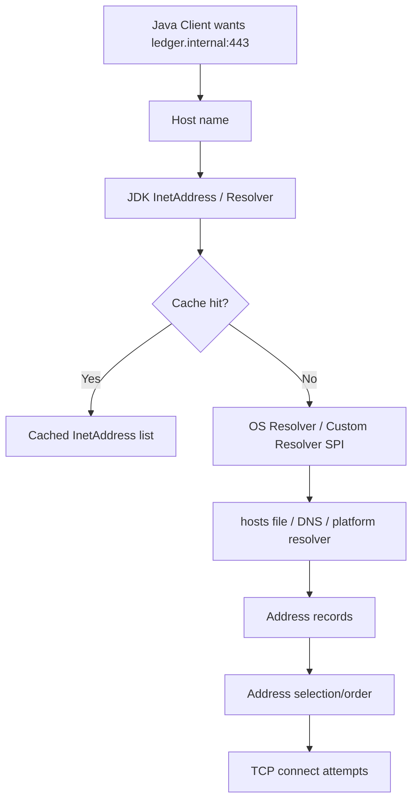
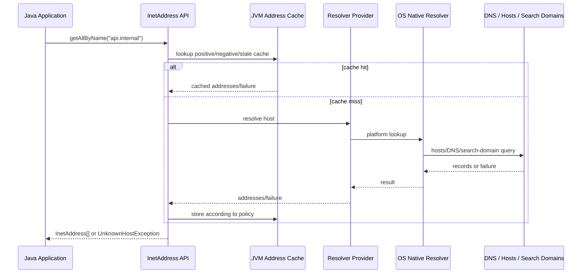
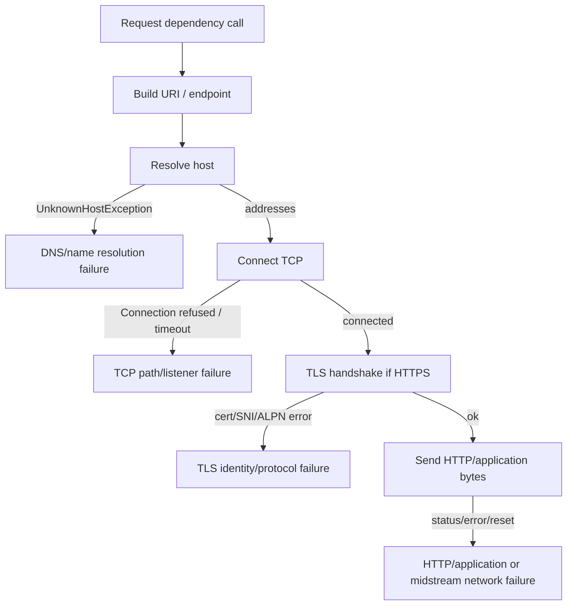

# Part 004 — DNS, `InetAddress`, and Name Resolution

## 1. Tujuan Part Ini

Sebagian besar Java network call tidak dimulai dari IP address. Ia dimulai dari nama:

```text
ledger.internal.company
api.partner.com
postgres.default.svc.cluster.local
localhost
```

Sebelum TCP connect, TLS handshake, HTTP request, atau WebSocket upgrade terjadi, Java harus mengubah nama itu menjadi satu atau lebih address. Proses ini terlihat kecil, tetapi sering menjadi sumber outage yang sulit dianalisis.

Setelah menyelesaikan part ini, kamu harus mampu:

1. Menjelaskan apa yang dilakukan `InetAddress` saat resolve host name.
2. Membedakan DNS failure, connect failure, TLS failure, dan HTTP failure.
3. Memahami JVM DNS cache, positive cache, negative cache, stale cache, dan konsekuensinya untuk failover.
4. Menjelaskan mengapa `networkaddress.cache.ttl` adalah **security property**, bukan system property biasa.
5. Mendesain Java client yang tidak salah memperlakukan DNS sebagai konfigurasi statis.
6. Mendiagnosis masalah split-horizon DNS, Kubernetes service DNS, corporate resolver, IPv6 ordering, dan stale address.
7. Membuat strategi resolution yang aman untuk production-grade client.

Part ini fokus pada DNS/name resolution dari sisi Java runtime dan production engineering, bukan implementasi DNS server secara mendalam.

---

## 2. Mental Model: Name Is Not Address

Core invariant:

> A host name is a **dynamic indirection**, not a permanent address.

Nama adalah logical identity. Address adalah network coordinate. Mapping dari nama ke address bisa berubah karena:

- load balancing,
- failover,
- blue/green deployment,
- Kubernetes service update,
- DNS TTL,
- split-horizon DNS,
- regional routing,
- CDN/edge routing,
- corporate DNS policy,
- hosts file override,
- resolver cache,
- JVM cache,
- OS cache.

Diagram:



Java code that looks harmless may perform resolution:

```java
InetAddress address = InetAddress.getByName("ledger.internal.company");
```

Resolution is a network-adjacent operation. It can block, fail, cache, return multiple addresses, and behave differently across environments.

---

## 3. Deconstruction ala Kaufman

Skill DNS untuk Java engineer dapat dibongkar menjadi sub-skill berikut:

| Sub-skill | Kemampuan yang ditargetkan |
|---|---|
| Resolution path | Tahu bagaimana Java meminta address dari name service/resolver. |
| Address multiplicity | Siap menerima banyak address, bukan satu IP. |
| Cache reasoning | Memahami positive, negative, stale, OS, resolver, JVM, dan client cache. |
| TTL reasoning | Mengetahui kapan Java mengikuti TTL dan kapan tidak sesuai konfigurasi. |
| Failure taxonomy | Bisa memisahkan NXDOMAIN, timeout, SERVFAIL, stale address, refused, TLS mismatch. |
| Environment reasoning | Bisa membedakan laptop, container, Kubernetes, corporate DNS, cloud VPC, service mesh. |
| Security reasoning | Mengerti DNS rebinding, SSRF via DNS, private IP resolution, redirect + DNS risk. |
| Design reasoning | Bisa menentukan kapan resolve eagerly, lazily, per request, per pool, atau via framework. |

Targetnya bukan menjadi DNS administrator, tetapi mampu membaca DNS sebagai bagian dari runtime behavior Java.

---

## 4. `InetAddress` Is More Than an IP Object

`InetAddress` merepresentasikan internet address, tetapi API-nya juga menjadi pintu name resolution.

```java
InetAddress one = InetAddress.getByName("example.com");
InetAddress[] all = InetAddress.getAllByName("example.com");
```

Perbedaan penting:

| Method | Behavior praktis |
|---|---|
| `getByName(host)` | Resolve host dan mengembalikan satu address, biasanya address pertama dari hasil resolver. |
| `getAllByName(host)` | Resolve host dan mengembalikan semua address yang diketahui. |
| `getHostAddress()` | Mengembalikan textual IP address. |
| `getHostName()` | Bisa melakukan reverse lookup tergantung kondisi. Jangan panggil sembarangan di hot path. |
| `getCanonicalHostName()` | Lebih eksplisit meminta canonical name; bisa mahal/blocking. |
| `isLoopbackAddress()` | Klasifikasi address. |
| `isAnyLocalAddress()` | Wildcard address seperti `0.0.0.0`/`::`. |
| `isSiteLocalAddress()` | Private/site-local classification. |
| `isReachable()` | Bukan general-purpose “ping”. Jangan jadikan health check utama. |

### 4.1 Resolved vs Unresolved `InetSocketAddress`

`InetSocketAddress` bisa resolved atau unresolved.

```java
InetSocketAddress resolved = new InetSocketAddress("example.com", 443);
System.out.println(resolved.isUnresolved());

InetSocketAddress unresolved = InetSocketAddress.createUnresolved("example.com", 443);
System.out.println(unresolved.isUnresolved());
```

Kenapa unresolved berguna?

- Config parsing tidak langsung bergantung pada DNS.
- Client library bisa menunda resolution sampai connect/send.
- Proxy use case kadang membutuhkan host name asli, bukan IP resolved lokal.
- Testing config tidak memerlukan network resolver.

Namun unresolved address juga berisiko kalau downstream API tidak mendukungnya atau resolution failure muncul lebih terlambat.

---

## 5. Resolution Path in Java

Secara konseptual, path resolution Java modern:

```text
Application code
  -> InetAddress API
  -> JDK name service / resolver mechanism
  -> platform resolver or configured resolver provider
  -> OS config: hosts file, DNS resolver, search domains, etc.
  -> address records returned to JVM
```

Sejak JDK 18, Java memiliki Internet-Address Resolution SPI melalui JEP 418 yang memungkinkan `InetAddress` memakai resolver selain resolver native platform. Namun default umum tetap platform resolver kecuali ada provider/resolver khusus yang dikonfigurasi.



Important implication:

> Java DNS behavior is not only DNS. It is the interaction of JVM cache, resolver implementation, OS configuration, DNS infrastructure, and application client behavior.

---

## 6. DNS Record Types You Need Practically

You do not need to memorize every DNS record. For Java networking, these are the core practical ones:

| Record | Meaning | Java relevance |
|---|---|---|
| `A` | Name to IPv4 address | Common result for `InetAddress`. |
| `AAAA` | Name to IPv6 address | Common result in dual-stack environments. |
| `CNAME` | Alias to another name | Resolver follows chain; canonical name may differ. |
| `SRV` | Service location with port/priority | Not directly consumed by plain `InetAddress`. Some frameworks use it. |
| `TXT` | Arbitrary text metadata | Used by service discovery/security mechanisms; not plain socket target. |
| `PTR` | Reverse DNS IP to name | Can be triggered by reverse lookup APIs. |

`InetAddress` primarily resolves host name to IP addresses. It does not give you a complete service-discovery abstraction with port, protocol, health, priority, and weight.

---

## 7. Multiple Address Results

`getAllByName()` can return multiple addresses:

```java
InetAddress[] addresses = InetAddress.getAllByName("example.com");
for (InetAddress address : addresses) {
    System.out.println(address.getHostAddress());
}
```

Multiple addresses can mean:

- simple DNS round-robin,
- IPv4 + IPv6 dual-stack,
- multiple load-balanced endpoints,
- regional failover,
- Kubernetes service endpoints via DNS,
- CDN edge selection.

A naive client may use only the first address forever if it resolves once at startup and stores the IP.

### 7.1 Bad Pattern: Resolve Once Forever

```java
public final class BadClient {
    private final InetAddress address;
    private final int port;

    public BadClient(String host, int port) throws Exception {
        this.address = InetAddress.getByName(host); // resolved once at startup
        this.port = port;
    }

    // later every connection uses same address
}
```

Why bad?

- DNS failover ignored.
- Rolling deployment address change ignored.
- Stale IP can persist until process restart.
- Kubernetes pod/service changes may not be respected.
- Regional routing changes ignored.

Better: preserve host name as identity and let the networking layer/client resolve according to its lifecycle and cache policy.

```java
public record DependencyEndpoint(String host, int port) {
    public InetSocketAddress unresolved() {
        return InetSocketAddress.createUnresolved(host, port);
    }
}
```

---

## 8. JVM DNS Caching

Java caches successful and unsuccessful name lookups according to security properties.

Important properties:

| Property | Meaning |
|---|---|
| `networkaddress.cache.ttl` | Cache policy for successful lookups. |
| `networkaddress.cache.negative.ttl` | Cache policy for unsuccessful lookups. |
| `networkaddress.cache.stale.ttl` | Stale-cache behavior in modern JDKs. |

Values generally use seconds:

| Value | Meaning |
|---|---|
| positive integer | cache for that many seconds |
| `0` | do not cache |
| `-1` | cache forever |

Critical detail:

> `networkaddress.cache.ttl` is a **security property**, not a normal `-D` system property.

This mistake is common:

```bash
java -Dnetworkaddress.cache.ttl=30 MyApp
```

Depending on JDK behavior/configuration, this may not do what the engineer thinks. Preferred configuration is through the `java.security` security property mechanism or programmatic security property setup early enough in bootstrap.

Example programmatic setup before resolution:

```java
import java.security.Security;

public final class DnsCacheBootstrap {
    public static void configure() {
        Security.setProperty("networkaddress.cache.ttl", "30");
        Security.setProperty("networkaddress.cache.negative.ttl", "5");
    }
}
```

Caveats:

- must happen before resolution is performed,
- libraries may resolve during startup,
- container base image/security file may override defaults,
- operational consistency is better via runtime image/config policy than scattered code.

---

## 9. Positive Cache, Negative Cache, and Stale Cache

### 9.1 Positive Cache

Successful lookup:

```text
api.internal -> 10.20.1.10
```

Cached result means subsequent `InetAddress` lookups may reuse address without asking resolver again until TTL expires.

Benefit:

- lower latency,
- less DNS load,
- less startup/request overhead.

Risk:

- stale IP after failover,
- slow recovery when endpoint changes,
- traffic stuck to removed backend.

### 9.2 Negative Cache

Unsuccessful lookup:

```text
api.internal -> NXDOMAIN / failure
```

Negative caching stores the failure for a period. Default negative TTL has historically been small, but you must verify target JDK/runtime policy.

Benefit:

- prevents repeated DNS hammering for invalid names,
- reduces latency for repeated bad config.

Risk:

- transient DNS outage becomes app-visible longer,
- service appears unavailable even after DNS recovers,
- startup ordering issue in container can poison app for TTL duration.

### 9.3 Stale Cache

Modern Java includes stale address caching behavior: stale cached addresses may be used when fresh lookup fails, depending on configuration. This can improve availability during resolver outages but can also keep traffic going to outdated endpoints.

Engineering trade-off:

| Approach | Benefit | Risk |
|---|---|---|
| No cache | follows DNS changes quickly | high resolver dependency/load |
| Long positive cache | low DNS dependency | slow failover |
| Short positive cache | balanced | more DNS traffic |
| Negative cache | avoids repeated bad lookup | transient failures stick |
| Stale cache | survive resolver outage | may use dead/decommissioned IP |

There is no universal best value. Values depend on platform, service discovery model, DNS TTL, failover requirements, resolver reliability, and client connection pooling.

---

## 10. DNS TTL vs Connection Pool TTL

Even if DNS cache expires, existing TCP connections may remain open.

Example:

```text
T0: DNS api.internal -> 10.0.1.10
T1: HttpClient opens connection to 10.0.1.10
T2: DNS changes api.internal -> 10.0.1.20
T3: JVM DNS cache expires
T4: existing pooled connection to 10.0.1.10 is still reused
```

DNS TTL controls name-to-address resolution, not existing connection lifetime.

Production implication:

- DNS failover alone may not drain existing pooled connections.
- Client connection pool may need max connection lifetime/idle timeout depending on library.
- HTTP/2 long-lived connections can amplify stickiness.
- Load balancers may close old connections to force migration.
- Application-level client may need retry-on-stale-connection behavior.

This is why DNS tuning and connection pool tuning must be designed together.

---

## 11. `UnknownHostException` Is Not Always “DNS Down”

Java commonly reports name-resolution failure as:

```text
java.net.UnknownHostException: api.internal
```

Possible causes:

| Cause | Explanation |
|---|---|
| Name truly does not exist | NXDOMAIN or missing record. |
| Search domain mismatch | `api` works in one environment but not another. |
| `/etc/hosts` missing | Local override not present in container/CI. |
| DNS server unreachable | Resolver timeout/failure. |
| Corporate VPN missing | Internal domain only resolvable on VPN. |
| Kubernetes namespace wrong | Service name valid only in namespace/domain context. |
| Negative cache | Previous failure cached. |
| Resolver config changed | Container inherited unexpected `/etc/resolv.conf`. |
| Typo or config interpolation failure | `${LEDGER_HOST}` not expanded, blank host, wrong env var. |

Incident response must ask:

1. What exact host string did Java try to resolve?
2. From which runtime environment/container/pod?
3. What does `/etc/resolv.conf` say there?
4. Does `getent hosts name` or equivalent resolve there?
5. Does Java resolve differently from OS tools due to cache/config?
6. Is negative cache involved?
7. Did this fail before or after deployment/DNS change?

---

## 12. Search Domains and Kubernetes DNS

Short names can behave differently because resolvers may apply search domains.

Example inside Kubernetes namespace `payments`:

```text
ledger
ledger.payments
ledger.payments.svc
ledger.payments.svc.cluster.local
```

Depending on resolver config, `ledger` may resolve by trying search suffixes.

Risks:

- same short name resolves to different service in different namespace,
- local development does not match cluster,
- typo triggers multiple DNS queries and latency,
- `ndots` configuration changes query behavior,
- external names may be tried with cluster suffixes first.

Production recommendation:

| Environment | Recommendation |
|---|---|
| In-cluster service-to-service | Use explicit service name and namespace when ambiguity matters. |
| Cross-namespace dependency | Prefer `service.namespace.svc.cluster.local` or platform convention. |
| External dependency | Use fully qualified domain name where appropriate. |
| Shared library config | Do not assume Kubernetes search domain unless documented. |

---

## 13. Split-Horizon DNS

Split-horizon DNS means the same name returns different answers depending on requester location/network.

Example:

```text
api.company.com from office network -> 10.20.1.10
api.company.com from public internet -> 203.0.113.50
api.company.com from cloud VPC -> 10.100.5.20
```

This is not necessarily wrong. It is often intentional.

Debug consequence:

- resolving from laptop proves little about pod resolution,
- resolving from production node proves little about CI,
- public DNS tool may show different result from internal resolver,
- IP allowlists and TLS SANs must match intended path.

Operational rule:

> Always resolve from the same execution environment as the Java process that fails.

---

## 14. IPv4/IPv6 Resolution Ordering

A name may resolve to both A and AAAA records:

```text
api.internal A    10.20.1.10
api.internal AAAA fd00::10
```

Java may receive both. Address ordering is influenced by OS/JDK/network configuration.

Potential failure:

```text
AAAA exists
IPv6 path broken
client tries IPv6 first
connect waits until timeout
then IPv4 succeeds or request fails
```

Symptoms:

- intermittent latency spike,
- only some environments affected,
- local curl works differently,
- disabling IPv6 “fixes” it but hides root cause.

Better diagnosis:

- log all resolved addresses in debug,
- test connect per address,
- verify IPv6 routing/firewall,
- verify service binds IPv6 if AAAA is advertised,
- avoid publishing AAAA records until path is real.

---

## 15. Reverse Lookup Pitfall

Some APIs can trigger reverse DNS lookup:

```java
InetAddress address = InetAddress.getByName("10.20.1.10");
System.out.println(address.getHostName());
```

If reverse lookup is slow or broken, logging code can become a hidden latency source.

Prefer:

```java
System.out.println(address.getHostAddress());
```

For hot-path logs, metrics labels, access logs, and network diagnostics, use numeric address unless you explicitly need reverse DNS.

---

## 16. `isReachable()` Is Not a Reliable Health Check

`InetAddress.isReachable()` sounds tempting:

```java
if (InetAddress.getByName("api.internal").isReachable(1000)) {
    // service is reachable?
}
```

Do not use this as service health check.

Why:

- It may use ICMP echo if allowed, or TCP echo fallback depending on permissions/platform.
- ICMP may be blocked even when TCP service works.
- Host reachability does not prove service port availability.
- Service port availability does not prove application protocol health.
- It may behave differently under container/security restrictions.

Better health model:

| Need | Better check |
|---|---|
| Name resolution | Resolve host and classify DNS result. |
| TCP path | Attempt TCP connect to exact port with timeout. |
| TLS path | Complete TLS handshake with hostname verification. |
| HTTP dependency | Send lightweight request to dependency health/readiness endpoint if contract allows. |
| Application readiness | Use domain-specific readiness signal. |

---

## 17. DNS Failure Taxonomy

Not all DNS failures are equivalent.

| Failure | Meaning | Java-facing symptom |
|---|---|---|
| NXDOMAIN | Name does not exist | `UnknownHostException` |
| NODATA | Name exists but no requested record type | `UnknownHostException` or no usable address |
| SERVFAIL | DNS server failed | often `UnknownHostException` after resolver failure |
| Timeout | Resolver did not answer in time | resolution delay then failure |
| Refused | DNS server refused query | failure, OS-specific visibility |
| Negative cache hit | previous failure reused | fast repeated `UnknownHostException` |
| Stale positive | old IP reused | connect/TLS/HTTP failure later |
| Split horizon mismatch | wrong answer for environment | connect to unexpected address |
| Search domain mistake | query expanded differently | wrong service or failure |

Java usually abstracts these into `UnknownHostException`, so you need external diagnostics and structured logs.

---

## 18. Classification: DNS vs Connect vs TLS vs HTTP

Many incidents get misclassified as “DNS issue”. Use boundary markers.



Good production logs should capture the phase:

```text
phase=dns host=ledger.internal result=ok addresses=2 durationMs=4
phase=tcp remote=10.20.1.10:443 result=timeout durationMs=2000
phase=tls sni=ledger.internal result=cert_path_failed durationMs=35
phase=http status=503 durationMs=120
```

Do not log sensitive data. But phase-level diagnostics are invaluable.

---

## 19. Production-Safe Resolution Strategy

A strong Java network client should treat resolution as a dependency with policy.

### 19.1 Preserve Name Identity

Do not collapse host name into IP too early.

Bad:

```java
InetAddress address = InetAddress.getByName(config.host());
this.remote = new InetSocketAddress(address, config.port());
```

Better:

```java
this.remote = InetSocketAddress.createUnresolved(config.host(), config.port());
```

Let the client resolve near connection time unless there is a specific reason to pre-resolve.

### 19.2 Set Cache Policy Deliberately

Decide DNS cache TTL based on:

- dependency discovery mechanism,
- expected failover time,
- resolver reliability,
- DNS infrastructure capacity,
- connection pool lifetime,
- Kubernetes/cloud behavior,
- security constraints.

Typical enterprise baseline:

```text
positive TTL: 30s to 60s for dynamic service discovery
negative TTL: 0s to 10s depending on resolver stability
stale TTL: considered only with explicit operational trade-off
```

Do not copy these blindly. They are starting points, not universal law.

### 19.3 Resolve All Addresses During Diagnostics

During incident diagnostics, use `getAllByName()` and test each address separately. Do not only test `getByName()`.

### 19.4 Avoid DNS on Hot Logging Path

Logging remote host names through reverse lookup can degrade performance and create cascading issues.

### 19.5 Coordinate DNS and Pooling

If using `HttpClient` or third-party clients, know:

- when hostname is resolved,
- how connection pooling works,
- whether failed addresses are retried,
- how idle connections expire,
- how HTTP/2 multiplexing affects stickiness,
- whether client honors DNS TTL or has its own cache.

---

## 20. Java Utility: DNS Inspector

```java
import java.net.InetAddress;
import java.net.UnknownHostException;
import java.security.Security;
import java.time.Duration;
import java.util.Arrays;

public class DnsInspector {
    public static void main(String[] args) {
        String host = args.length > 0 ? args[0] : "example.com";

        System.out.println("host=" + host);
        System.out.println("networkaddress.cache.ttl="
                + Security.getProperty("networkaddress.cache.ttl"));
        System.out.println("networkaddress.cache.negative.ttl="
                + Security.getProperty("networkaddress.cache.negative.ttl"));
        System.out.println("networkaddress.cache.stale.ttl="
                + Security.getProperty("networkaddress.cache.stale.ttl"));

        long start = System.nanoTime();
        try {
            InetAddress[] addresses = InetAddress.getAllByName(host);
            long elapsedMs = Duration.ofNanos(System.nanoTime() - start).toMillis();
            System.out.println("resolvedInMs=" + elapsedMs);
            Arrays.stream(addresses).forEach(DnsInspector::printAddress);
        } catch (UnknownHostException e) {
            long elapsedMs = Duration.ofNanos(System.nanoTime() - start).toMillis();
            System.out.println("failedInMs=" + elapsedMs);
            System.out.println("exception=" + e.getClass().getName());
            System.out.println("message=" + e.getMessage());
        }
    }

    private static void printAddress(InetAddress address) {
        System.out.printf("address=%s type=%s loopback=%s anyLocal=%s siteLocal=%s linkLocal=%s multicast=%s%n",
                address.getHostAddress(),
                address.getClass().getSimpleName(),
                address.isLoopbackAddress(),
                address.isAnyLocalAddress(),
                address.isSiteLocalAddress(),
                address.isLinkLocalAddress(),
                address.isMulticastAddress());
    }
}
```

Run it multiple times:

```bash
java DnsInspector example.com
java DnsInspector localhost
java DnsInspector does-not-exist.invalid
```

Observe:

- first lookup vs subsequent lookup timing,
- negative cache behavior,
- IPv4/IPv6 results,
- classification differences.

---

## 21. Java Utility: Resolve Then Connect Each Address

This extends Part 003’s connect probe.

```java
import java.net.InetAddress;
import java.net.InetSocketAddress;
import java.net.Socket;
import java.time.Duration;

public class ResolveConnectProbe {
    public static void main(String[] args) throws Exception {
        String host = args.length > 0 ? args[0] : "example.com";
        int port = args.length > 1 ? Integer.parseInt(args[1]) : 443;
        int timeoutMillis = args.length > 2 ? Integer.parseInt(args[2]) : 2000;

        long dnsStart = System.nanoTime();
        InetAddress[] addresses = InetAddress.getAllByName(host);
        long dnsMs = Duration.ofNanos(System.nanoTime() - dnsStart).toMillis();

        System.out.printf("host=%s port=%d dnsMs=%d count=%d%n",
                host, port, dnsMs, addresses.length);

        for (InetAddress address : addresses) {
            InetSocketAddress remote = new InetSocketAddress(address, port);
            long start = System.nanoTime();
            try (Socket socket = new Socket()) {
                socket.connect(remote, timeoutMillis);
                long elapsedMs = Duration.ofNanos(System.nanoTime() - start).toMillis();
                System.out.printf("OK address=%s local=%s remote=%s connectMs=%d%n",
                        address.getHostAddress(),
                        socket.getLocalSocketAddress(),
                        socket.getRemoteSocketAddress(),
                        elapsedMs);
            } catch (Exception e) {
                long elapsedMs = Duration.ofNanos(System.nanoTime() - start).toMillis();
                System.out.printf("FAIL address=%s connectMs=%d type=%s message=%s%n",
                        address.getHostAddress(),
                        elapsedMs,
                        e.getClass().getName(),
                        e.getMessage());
            }
        }
    }
}
```

This tool helps detect:

- one bad address among many,
- IPv6 path issue,
- load balancer DNS returning dead backend,
- split-horizon mismatch,
- address-specific firewall issue.

---

## 22. DNS and TLS Identity

DNS resolution gives an IP address. TLS identity validation usually validates the **host name**, not just the IP.

Example:

```text
Host name: api.partner.com
Resolved IP: 203.0.113.10
TLS certificate SAN: api.partner.com
```

If you bypass DNS and connect directly to IP:

```text
https://203.0.113.10/
```

TLS hostname verification may fail because certificate is issued for `api.partner.com`, not the IP literal.

Production implication:

- preserve original host name for HTTPS/TLS SNI and hostname verification,
- do not replace dependency URL with raw IP except for controlled diagnostics,
- if using custom socket/TLS layering, ensure SNI and endpoint identification are configured.

DNS is not security proof. TLS identity must still be validated.

---

## 23. DNS and Proxies

Proxy changes where DNS happens.

### 23.1 Direct Connection

```text
Java client resolves api.partner.com
Java client connects to resolved IP:443
```

### 23.2 HTTP Proxy with CONNECT

```text
Java client connects to proxy
Proxy may resolve api.partner.com
Proxy opens tunnel to target
```

Depending on proxy mode, the client might not resolve target IP locally. This matters for:

- split-horizon DNS,
- corporate egress,
- private domains,
- SSRF defense,
- audit logs,
- troubleshooting.

Do not assume local Java resolution always determines final destination when proxy is involved.

---

## 24. DNS Security Concerns for Network Clients

This overlaps lightly with security, but we focus only on network boundary behavior.

### 24.1 DNS Rebinding

DNS rebinding is when a name initially resolves to an allowed public IP, then later resolves to private/internal IP.

Risky pattern:

```text
Validate URL host resolves to public IP
Later perform request and resolve again
Second resolution returns 127.0.0.1 or 169.254.169.254
```

Safe pattern requires binding validation and use more carefully:

- resolve once for validation and connection if possible,
- validate every resolved address,
- block private/link-local/loopback where policy requires,
- revalidate after redirects,
- preserve host identity for TLS where applicable,
- consider proxy behavior.

### 24.2 Private IP Resolution

For outbound clients that accept user-supplied URL, do not only block textual host strings:

```text
http://127.0.0.1
http://localhost
http://internal.service
http://attacker.example -> resolves to 10.0.0.5
```

You must resolve and classify addresses according to policy. This becomes important in Part 026 on safe egress and SSRF prevention.

---

## 25. Resolver Behavior in Tests

Tests that depend on real DNS are often flaky.

Problems:

- external DNS outage,
- CI network restriction,
- different `/etc/hosts`,
- IPv6 availability differences,
- slow resolver,
- negative cache contamination between tests.

Better test strategy:

| Test type | Strategy |
|---|---|
| Pure config validation | Do not resolve. Use unresolved endpoint. |
| Address classification | Use literal IP fixtures. |
| DNS success path | Use controlled local resolver or hosts-style test fixture where possible. |
| DNS failure path | Use reserved invalid domain like `.invalid` for negative cases. |
| Client connect | Use local server bound to port `0`. |
| Multi-address behavior | Abstract resolver behind interface for unit test; integration test with controlled environment. |

Example abstraction:

```java
import java.net.InetAddress;
import java.net.UnknownHostException;

public interface HostResolver {
    InetAddress[] resolve(String host) throws UnknownHostException;
}

public final class JdkHostResolver implements HostResolver {
    @Override
    public InetAddress[] resolve(String host) throws UnknownHostException {
        return InetAddress.getAllByName(host);
    }
}
```

Use this abstraction only if your application needs explicit resolution policy. Do not wrap `InetAddress` everywhere just for ceremony.

---

## 26. Design Pattern: Resolution Policy Object

For high-value clients, model DNS policy explicitly.

```java
import java.time.Duration;

public record ResolutionPolicy(
        Duration positiveTtl,
        Duration negativeTtl,
        boolean allowStaleOnResolverFailure,
        boolean preferIpv4,
        boolean rejectPrivateAddresses,
        boolean resolveAtStartup
) {
    public ResolutionPolicy {
        if (positiveTtl.isNegative()) throw new IllegalArgumentException("positiveTtl < 0");
        if (negativeTtl.isNegative()) throw new IllegalArgumentException("negativeTtl < 0");
    }
}
```

This does not automatically change JVM global DNS caching. It documents application-level intent and can guide:

- startup validation,
- custom resolver/cache,
- diagnostics,
- deployment settings,
- security validation,
- operational runbook.

For many applications, JDK/default client behavior is enough. But for SDKs, gateways, crawlers, webhook fetchers, or regulated systems, explicit policy becomes valuable.

---

## 27. Operational Runbook: DNS Incident

When dependency calls fail with suspected DNS issue:

### Step 1 — Capture exact input

```text
scheme=https
host=ledger.internal.company
port=443
runtime=pod payments-api-7d9...
namespace=payments
node=ip-10-0-4-21
```

### Step 2 — Determine phase

Was failure:

- config parse,
- DNS resolution,
- TCP connect,
- TLS handshake,
- HTTP/application response?

### Step 3 — Resolve from same environment

Inside same container/pod/host:

```bash
getent hosts ledger.internal.company
nslookup ledger.internal.company
```

Tool availability varies by image. Minimal images may lack these commands. A Java DNS inspector jar can be useful.

### Step 4 — Check JVM cache policy

Print:

```java
Security.getProperty("networkaddress.cache.ttl")
Security.getProperty("networkaddress.cache.negative.ttl")
Security.getProperty("networkaddress.cache.stale.ttl")
```

Remember null may mean implementation/default policy, not necessarily no caching.

### Step 5 — Compare address-specific connect

Test each resolved address and port. One address may be dead while others work.

### Step 6 — Check recent changes

- DNS record update?
- service deployment?
- namespace change?
- VPC resolver issue?
- CoreDNS issue?
- VPN/corporate DNS change?
- certificate/SNI change misreported as DNS?

### Step 7 — Mitigation choice

| Finding | Mitigation |
|---|---|
| Negative cache from transient failure | wait TTL/restart only if justified; reduce negative TTL later. |
| Stale IP in positive cache | lower TTL; restart only as emergency; coordinate pool lifetime. |
| Wrong split-horizon answer | fix resolver/network path, not Java code first. |
| One bad address among many | remove bad DNS record/backend; improve retry/failover. |
| IPv6 advertised but broken | fix IPv6 path or remove AAAA until ready. |
| Pool stuck to old IP | drain/close old connections; adjust pool lifetime. |

---

## 28. Common Anti-Patterns

### Anti-pattern 1 — Resolve at Build Time

```java
static final InetAddress LEDGER = InetAddress.getByName("ledger.internal");
```

This can fail during class initialization and permanently couple class loading to DNS.

### Anti-pattern 2 — Treat UnknownHost as Permanent

```java
catch (UnknownHostException e) {
    disableDependencyForever();
}
```

DNS failure can be transient. Use retry/backoff/deadline policies carefully.

### Anti-pattern 3 — Infinite DNS Cache in Dynamic Environments

Long-lived Java process with forever DNS cache can ignore service failover.

### Anti-pattern 4 — Reverse Lookup in Access Logs

```java
remote.getHostName()
```

Can introduce blocking DNS calls into request path.

### Anti-pattern 5 — Validate Host String Only for SSRF

Blocking `localhost` string is not enough. Need resolve and classify addresses, account for redirects and rebinding.

### Anti-pattern 6 — Debug DNS from Laptop Only

Laptop DNS result does not prove production pod DNS result.

---

## 29. Deliberate Practice

### Drill 1 — Observe JVM DNS Cache

Write program that resolves a host repeatedly every second and measures latency.

Try with:

- default config,
- positive TTL set to `0`,
- positive TTL set to `30`,
- negative TTL set to `0`,
- negative TTL set to `10`.

Observe first lookup vs repeated lookup.

### Drill 2 — Multi-Address Connect

Pick a host with multiple A/AAAA records. Resolve all addresses and attempt TCP connect to each.

Record:

| Address | Type | Connect result | Latency | Notes |
|---|---|---|---|---|

### Drill 3 — Reverse Lookup Cost

Compare:

```java
address.getHostAddress()
address.getHostName()
address.getCanonicalHostName()
```

Measure latency for known public IPs, private IPs, and unresolved reverse zones.

### Drill 4 — Kubernetes Name Reasoning

Even without a cluster, sketch what these names mean:

```text
ledger
ledger.payments
ledger.payments.svc
ledger.payments.svc.cluster.local
```

Then explain which one you would put in production config and why.

### Drill 5 — DNS Failure Classification

Create cases for:

- invalid domain,
- valid domain wrong port,
- valid domain TLS mismatch via IP literal,
- host that resolves to multiple addresses.

Classify phase: DNS, TCP, TLS, or HTTP.

---

## 30. Mini Project: Production DNS Diagnostic CLI

Build a CLI:

```bash
java DnsDoctor --host ledger.internal.company --port 443 --scheme https --timeout 2s
```

It should output:

```text
Input
  scheme=https
  host=ledger.internal.company
  port=443

JVM DNS Policy
  networkaddress.cache.ttl=<value or default/unknown>
  networkaddress.cache.negative.ttl=<value or default/unknown>
  networkaddress.cache.stale.ttl=<value or default/unknown>

Resolution
  result=OK
  durationMs=4
  addresses:
    - 10.20.1.10 Inet4Address private=true
    - 10.20.1.11 Inet4Address private=true

Connect Probe
  10.20.1.10:443 OK connectMs=12 local=10.10.1.20:53100
  10.20.1.11:443 FAIL timeout connectMs=2001

Classification
  DNS: OK
  TCP: partial address failure
  Advice: remove bad backend or ensure client retries alternate addresses
```

Optional advanced features:

- JSON output for automation,
- redaction mode,
- IPv4/IPv6 filter,
- TLS handshake probe,
- proxy mode,
- Kubernetes environment metadata.

---

## 31. Senior-Level Invariants

1. **DNS is dynamic indirection.** Never assume a host name permanently maps to one IP.
2. **`InetAddress` can block and fail.** Treat resolution as a phase, not a free string conversion.
3. **`UnknownHostException` is a symptom, not a root-cause diagnosis.** Environment and resolver context matter.
4. **Positive cache improves latency but slows failover.** Tune based on discovery model.
5. **Negative cache can turn transient failure into repeated application failure.** Keep it intentional.
6. **DNS TTL does not close existing connections.** Coordinate with connection pool lifetime.
7. **Multiple addresses are normal.** A client should not assume one address equals one service.
8. **IPv6 presence must reflect real reachability.** Publishing AAAA without path readiness creates latency/failure.
9. **Reverse DNS is not safe for hot path.** Use numeric addresses unless reverse lookup is truly required.
10. **Resolve from the failing environment.** DNS answers are perspective-dependent.
11. **DNS does not replace TLS identity.** Preserve hostname for SNI and hostname verification.
12. **Proxy can move DNS resolution away from the Java process.** Debug accordingly.

---

## 32. Summary

Java name resolution is a hidden but critical part of networking. The important mental shift:

> A hostname is not a stable endpoint. It is a resolution instruction interpreted by JVM, resolver, OS, DNS infrastructure, network environment, and cache policy.

In production, many “network” failures are actually phase-confusion failures:

- DNS failure misread as service down,
- connect timeout misread as DNS failure,
- TLS hostname error misread as DNS error,
- stale connection misread as stale DNS,
- negative cache misread as ongoing outage,
- split-horizon DNS ignored during debugging.

A strong Java engineer keeps DNS explicit in the model:

```text
name -> addresses -> selected address -> TCP connect -> TLS identity -> application protocol
```

In Part 005, we move below DNS into the transport itself: **TCP fundamentals and stream semantics**.

---

## References

- Oracle Java SE 25 API, `InetAddress`: `https://docs.oracle.com/en/java/javase/25/docs/api/java.base/java/net/InetAddress.html`
- Oracle Java SE 25 API, `InetSocketAddress`: `https://docs.oracle.com/en/java/javase/25/docs/api/java.base/java/net/InetSocketAddress.html`
- Oracle Java SE 25 API, `java.net` package summary: `https://docs.oracle.com/en/java/javase/25/docs/api/java.base/java/net/package-summary.html`
- OpenJDK JEP 418, Internet-Address Resolution SPI: `https://openjdk.org/jeps/418`
- Oracle Java Networking Properties: `https://docs.oracle.com/javase/8/docs/technotes/guides/net/properties.html`
- AWS SDK for Java Developer Guide, JVM DNS TTL: `https://docs.aws.amazon.com/sdk-for-java/latest/developer-guide/jvm-ttl-dns.html`
- RFC 1034, Domain Names — Concepts and Facilities: `https://www.rfc-editor.org/rfc/rfc1034`
- RFC 1035, Domain Names — Implementation and Specification: `https://www.rfc-editor.org/rfc/rfc1035`
