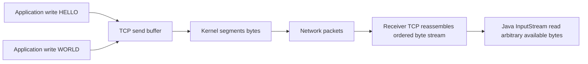
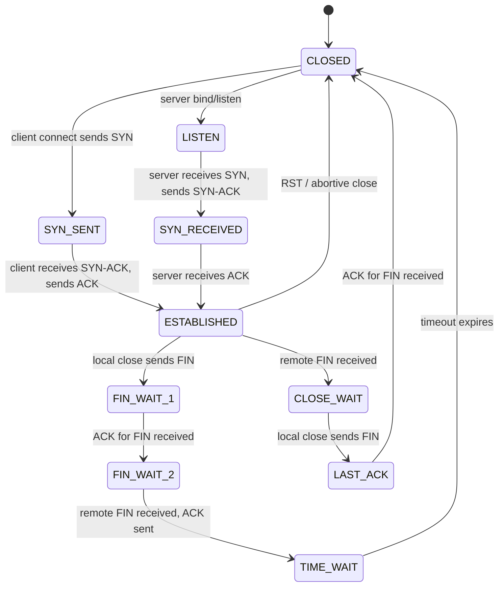
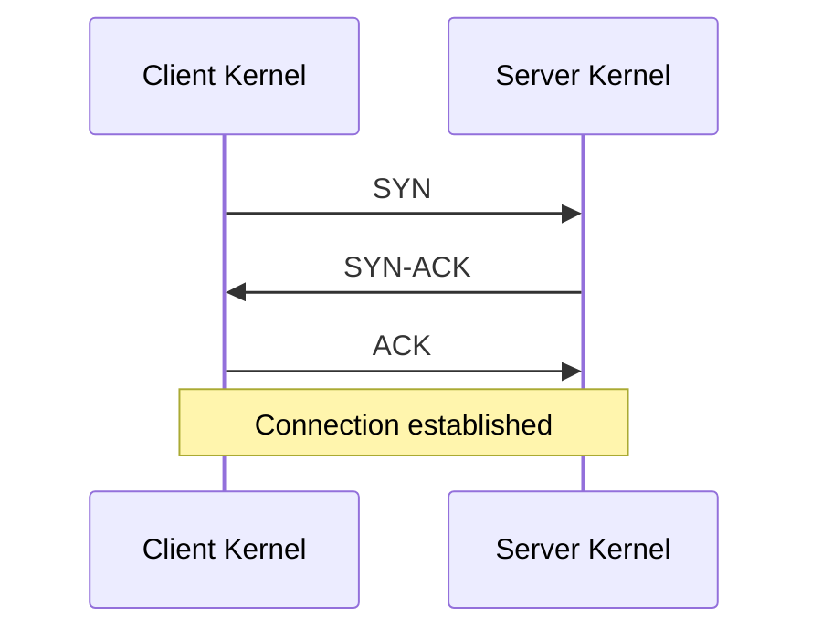
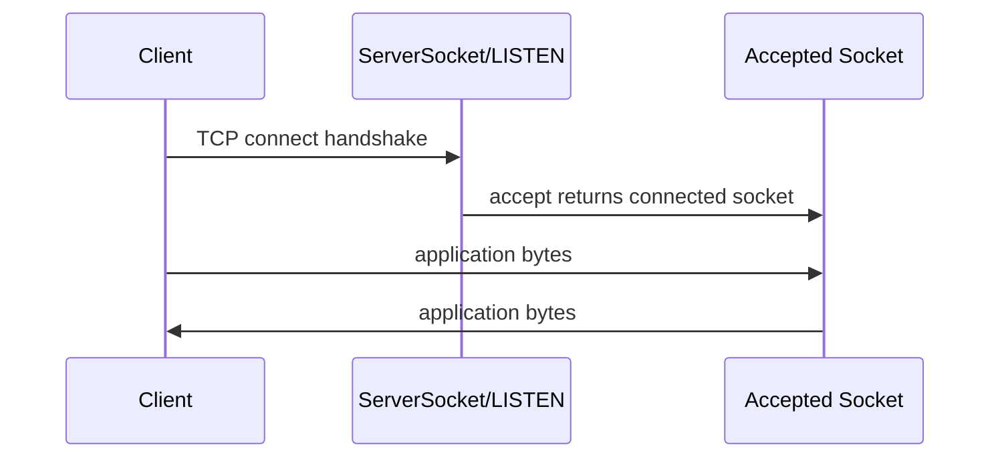
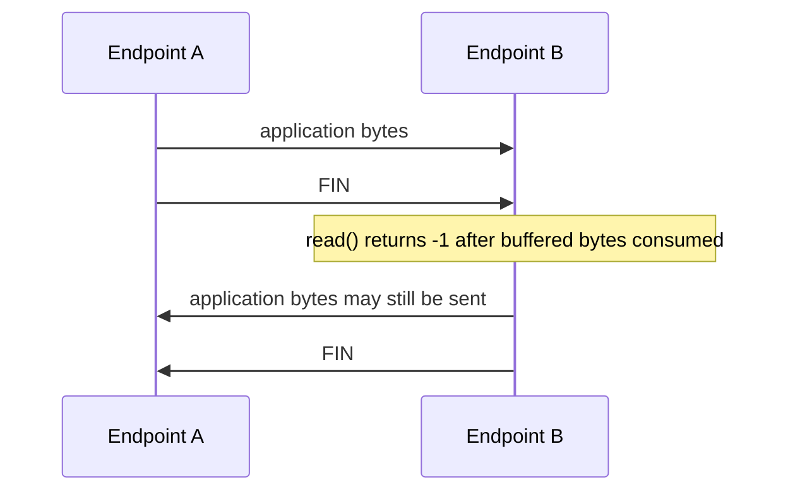
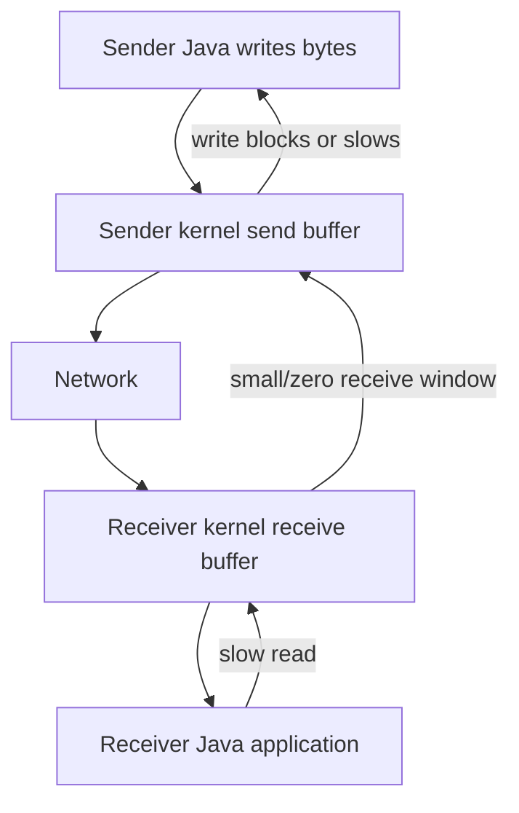
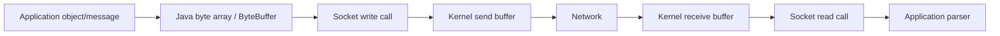
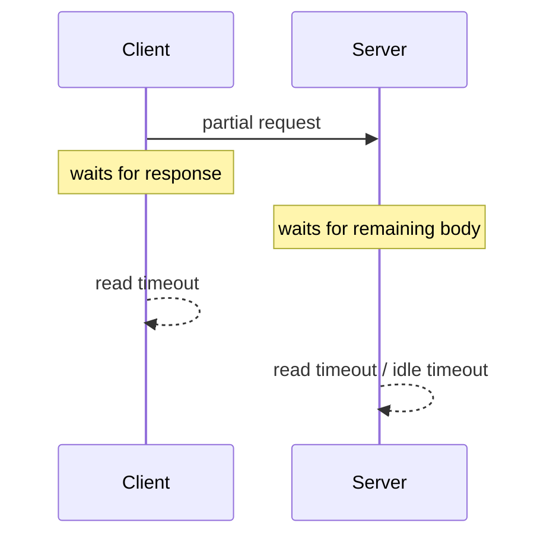

# Part 005 — TCP Fundamentals and Stream Semantics

## 1. Tujuan Part Ini

Di part sebelumnya kita sudah membangun fondasi tentang endpoint identity, routing dasar, dan DNS. Sekarang kita masuk ke protokol transport yang paling sering dipakai aplikasi enterprise Java: **TCP**.

Java developer sering memakai TCP secara tidak langsung melalui HTTP, JDBC, Redis client, Kafka client, gRPC, SMTP, LDAP, dan berbagai proprietary protocol. Tetapi ketika ada outage, gejalanya sering turun ke level TCP:

```text
Connection refused
Connection timed out
Connection reset
Broken pipe
Read timed out
EOF
Stale connection
Half-open connection
NoHttpResponseException
Unexpected end of stream
```

Masalahnya, banyak engineer memperlakukan TCP seolah-olah ia message queue. Itu salah. TCP bukan message protocol. TCP adalah **reliable ordered byte stream**.

Setelah menyelesaikan part ini, kamu harus mampu:

1. Menjelaskan TCP sebagai byte stream, bukan packet/message stream.
2. Memahami lifecycle koneksi: handshake, established, half-close, full close, reset.
3. Membedakan FIN, RST, timeout, EOF, dan broken pipe dari sisi aplikasi Java.
4. Menjelaskan mengapa `InputStream.read(...)` tidak sama dengan “membaca satu pesan”.
5. Mendesain framing sederhana di atas TCP tanpa mengandalkan asumsi packet boundary.
6. Membaca gejala production seperti connection reset, read timeout, dan EOF secara lebih akurat.
7. Memahami efek buffer, congestion, retransmission, Nagle, delayed ACK, dan head-of-line blocking pada aplikasi Java.

Part ini tidak membahas detail `Socket` API secara penuh. Itu masuk Part 006. Part ini fokus pada mental model TCP yang benar.

---

## 2. Kaufman Deconstruction: Skill yang Perlu Dipecah

Dalam kerangka Josh Kaufman, skill “menguasai TCP untuk Java engineer” perlu dipecah menjadi sub-skill kecil yang bisa dipraktikkan.

| Sub-skill | Pertanyaan yang harus bisa dijawab |
|---|---|
| Connection lifecycle | Kapan koneksi benar-benar ada? Apa beda connect, accept, established, close? |
| Stream semantics | Mengapa satu `write()` bisa dibaca sebagai beberapa `read()`? |
| Failure semantics | Apa beda refused, timeout, reset, EOF, broken pipe? |
| Flow control | Siapa yang menahan siapa ketika receiver lambat? |
| Congestion behavior | Mengapa jaringan sehat secara aplikasi bisa tetap lambat? |
| Shutdown semantics | Apa arti FIN, RST, half-close, dan graceful close? |
| Protocol design | Bagaimana membuat message boundary di atas byte stream? |
| Debugging | Gejala apa yang harus dicari di log, metric, packet capture, dan thread dump? |

Tujuan deliberate practice di part ini sederhana: setelah membaca, kamu harus bisa melihat kode TCP Java dan langsung menemukan asumsi stream yang berbahaya.

---

## 3. Core Mental Model: TCP Is a Reliable Ordered Byte Stream

Invariant utama:

> TCP preserves **byte order**, not **application message boundaries**.

Kalau client melakukan ini:

```java
out.write("HELLO".getBytes(UTF_8));
out.write("WORLD".getBytes(UTF_8));
out.flush();
```

Server tidak dijamin menerima dua event read terpisah.

Server bisa melihat:

```text
read #1: HELLOWORLD
```

atau:

```text
read #1: HEL
read #2: LOWORLD
```

atau:

```text
read #1: H
read #2: ELLOW
read #3: ORLD
```

Semua itu valid.

TCP hanya menjamin bahwa jika bytes `H E L L O W O R L D` berhasil dikirim dan diterima, urutannya tidak berubah. TCP tidak menjamin batas pesan `HELLO` dan `WORLD` dipertahankan.

Diagram:



Kesalahan umum:

```java
byte[] buf = new byte[1024];
int n = in.read(buf);
String message = new String(buf, 0, n, UTF_8);
handle(message); // WRONG if protocol expects one full logical message
```

Kode itu tidak membaca “satu message”. Ia membaca “sejumlah byte yang tersedia atau sampai blocking condition selesai”.

---

## 4. TCP vs UDP vs Message Protocol

TCP sering disebut reliable, tetapi kata “reliable” sering disalahpahami.

| Property | TCP | UDP | Message protocol di atas TCP |
|---|---:|---:|---:|
| Ordered delivery | Ya | Tidak dijamin | Bergantung desain |
| Retransmission | Ya | Tidak | Biasanya delegasi ke TCP |
| Duplicate handling | TCP stack menangani | Aplikasi harus menangani | Bisa ditambah di app layer |
| Message boundary | Tidak ada | Ada datagram boundary | Harus dibuat sendiri |
| Flow control | Ya | Tidak seperti TCP | Bisa ada application backpressure |
| Congestion control | Ya | Tidak built-in seperti TCP | Biasanya mengikuti TCP |
| Broadcast/multicast | Tidak | Bisa | Tidak natural |

TCP cocok ketika aplikasi membutuhkan stream ordered reliable. Tetapi jika aplikasi membutuhkan “record”, “frame”, “command”, atau “event”, maka aplikasi harus membangun boundary sendiri.

Contoh protocol yang membangun framing di atas TCP:

- HTTP/1.1: request line, headers, blank line, body length/chunked.
- HTTP/2: binary frames.
- TLS: records.
- PostgreSQL wire protocol: message type + length.
- Redis RESP: text/bulk framing.
- Kafka protocol: request/response frames with length prefix.

Mental model yang benar:

```text
TCP gives you a pipe.
Your protocol gives meaning to bytes inside the pipe.
```

---

## 5. Connection Lifecycle: From SYN to Close

TCP connection bukan sekadar “open socket”. Ia adalah state machine di kernel pada dua host.

Simplified lifecycle:



Untuk Java engineer, detail seluruh state tidak perlu dihafal. Yang penting adalah konsekuensi aplikatif:

| State/transition | Arti praktis |
|---|---|
| `LISTEN` | Server socket siap menerima connection indication. |
| `SYN_SENT` | Client sedang mencoba connect; bisa timeout. |
| `ESTABLISHED` | Dua endpoint punya koneksi TCP aktif. |
| `CLOSE_WAIT` | Remote sudah menutup sisi kirimnya; aplikasi lokal belum close. Banyak `CLOSE_WAIT` biasanya bug aplikasi lokal. |
| `TIME_WAIT` | Endpoint yang melakukan active close menahan tuple sementara untuk mencegah segment lama mengganggu koneksi baru. |
| `RST` | Koneksi di-abort; bukan graceful close. |

---

## 6. Three-Way Handshake dan Java `connect()`

TCP connection dimulai dengan handshake:



Dari sisi Java:

```java
Socket socket = new Socket();
socket.connect(new InetSocketAddress("ledger.internal", 443), 2_000);
```

`connect()` tidak hanya “membuat object”. Ia meminta OS membangun koneksi ke remote endpoint.

Kemungkinan hasil:

| Hasil | Makna umum |
|---|---|
| Success | Handshake berhasil; socket connected. |
| `UnknownHostException` | Nama host tidak resolve. Ini DNS/name resolution, bukan TCP. |
| `SocketTimeoutException` saat connect | Tidak ada koneksi established sebelum timeout. Bisa packet drop, firewall, routing, SYN tidak dijawab. |
| `ConnectException: Connection refused` | Remote host reachable tetapi tidak ada listener atau listener menolak. Biasanya RST terhadap SYN. |
| `NoRouteToHostException` | Routing/network path bermasalah. |
| `SocketException` | Kategori luas: socket closed, network error, reset, invalid state. |

Production reading:

- `Connection refused` sering lebih cepat muncul daripada timeout karena remote/kernel memberi jawaban eksplisit.
- `Connection timed out` sering berarti tidak ada jawaban, bukan remote berkata “tidak”.
- DNS sukses tidak berarti TCP connect akan sukses.
- TCP connect sukses tidak berarti TLS/HTTP request akan sukses.

Layering:

```text
name resolution -> connect -> TLS handshake -> application protocol request -> response decoding
```

Jangan gabungkan semua failure menjadi “service down”.

---

## 7. `accept()` Bukan `read()`

Server TCP melakukan dua hal berbeda:

1. Listen untuk connection request.
2. Berkomunikasi lewat socket hasil accept.

Diagram:



`ServerSocket.accept()` mengembalikan `Socket` baru untuk koneksi tersebut. `ServerSocket` tetap dipakai untuk menerima koneksi berikutnya.

Implikasi:

```text
ServerSocket = listening endpoint
Socket       = per-connection communication endpoint
```

Salah satu bug pemula adalah mencampur lifecycle listener dan lifecycle connection.

---

## 8. Stream Semantics: `read()` Menghasilkan Arbitrary Chunk

Java `InputStream.read(byte[])` pada socket mengembalikan:

- jumlah byte yang dibaca,
- `-1` jika end-of-stream karena remote melakukan graceful shutdown sisi output,
- exception jika terjadi error.

Ia tidak menjamin memenuhi seluruh buffer.

Contoh salah:

```java
byte[] header = new byte[8];
int n = in.read(header);
if (n != 8) {
    throw new IllegalStateException("Invalid header");
}
```

Masalahnya: `read(header)` boleh mengembalikan `3`, lalu read berikutnya mengembalikan `5`. Itu bukan invalid header. Itu normal TCP stream.

Contoh benar untuk membaca tepat N byte:

```java
static void readFully(InputStream in, byte[] target, int offset, int length) throws IOException {
    int remaining = length;
    while (remaining > 0) {
        int n = in.read(target, offset, remaining);
        if (n == -1) {
            throw new EOFException("Stream ended with " + remaining + " bytes still expected");
        }
        offset += n;
        remaining -= n;
    }
}
```

Core invariant:

> Every protocol parser over TCP must tolerate partial reads.

---

## 9. `write()` Tidak Sama dengan “Remote Sudah Menerima Message”

`OutputStream.write(...)` menulis bytes ke socket stream. Dalam praktik, bytes bergerak melewati beberapa buffer:

```mermaid
flowchart LR
    A[Java byte[]] --> B[JVM/native boundary]
    B --> C[Kernel send buffer]
    C --> D[NIC/network]
    D --> E[Receiver kernel buffer]
    E --> F[Receiver Java read]
```

Ketika `write()` return, itu biasanya berarti bytes berhasil diserahkan ke layer bawah lokal, bukan berarti remote application sudah memprosesnya.

`flush()` juga sering disalahpahami. Pada `SocketOutputStream`, tidak ada buffer Java besar seperti `BufferedOutputStream` kecuali kamu membungkusnya sendiri. Jika kamu memakai `BufferedOutputStream`, `flush()` mendorong bytes dari buffer Java ke socket stream. Namun tetap bukan acknowledgement aplikasi remote.

Konsekuensi:

- Jangan menganggap `write()` sukses berarti operasi bisnis sukses.
- Butuh application-level response/ACK jika operasi harus confirmed.
- Broken connection bisa baru terlihat pada write berikutnya.
- Remote bisa sudah mati tetapi local belum tahu sampai operasi I/O berikutnya.

---

## 10. FIN, EOF, dan Graceful Close

TCP graceful close memakai FIN. FIN berarti:

> “Saya tidak akan mengirim byte lagi pada arah ini.”

Karena TCP full-duplex, satu arah bisa ditutup sementara arah lain masih terbuka.

Diagram half-close:



Dari sisi Java:

```java
int n = input.read(buffer);
if (n == -1) {
    // remote gracefully closed its output side
}
```

`-1` bukan “tidak ada data sekarang”. `-1` adalah end-of-stream.

Salah:

```java
if (in.read(buf) == -1) {
    Thread.sleep(100); // WRONG: stream sudah selesai
}
```

Benar:

```java
int n = in.read(buf);
if (n == -1) {
    closeConnectionStatefully();
    return;
}
```

EOF berarti remote melakukan graceful shutdown atau connection sudah mencapai end-of-stream setelah buffered bytes habis. Untuk banyak request/response protocol, EOF di tengah frame berarti response/body corrupt atau remote abort setelah graceful close.

---

## 11. RST dan Abortive Close

RST berarti koneksi di-reset. Ini bukan graceful EOF.

Penyebab umum:

- remote process crash,
- remote socket close secara abortive,
- firewall/load balancer mengirim reset,
- aplikasi menulis ke koneksi yang sudah ditutup remote,
- protocol violation membuat server memutus koneksi,
- idle connection diputus oleh middlebox,
- local OS mendeteksi kondisi invalid.

Dari sisi Java, RST sering muncul sebagai:

```text
java.net.SocketException: Connection reset
java.net.SocketException: Broken pipe
java.io.IOException: Connection reset by peer
```

Interpretasi praktis:

| Gejala | Biasanya terjadi saat | Makna |
|---|---|---|
| `Connection reset` | read | Remote/middlebox reset koneksi. |
| `Broken pipe` | write | Local menulis ke koneksi yang sudah tidak valid. |
| EOF `-1` | read | Remote graceful close sisi output. |
| Read timeout | read | Tidak ada byte sebelum timeout; koneksi belum tentu mati. |
| Connect timeout | connect | Handshake tidak selesai dalam deadline. |

Jangan samakan `read timeout` dengan `connection reset`. Timeout adalah absence of progress. Reset adalah explicit abort.

---

## 12. Half-Open Connection

Half-open connection adalah kondisi ketika satu pihak mengira koneksi masih established, tetapi pihak lain sudah mati/hilang tanpa graceful close yang terlihat.

Contoh:

- client laptop suspend,
- container mati tanpa FIN terlihat,
- NAT/firewall drop state,
- mobile network berpindah,
- node crash,
- packet blackhole.

TCP tidak selalu langsung tahu remote hilang. Jika tidak ada traffic, koneksi bisa terlihat idle dalam waktu lama.

Strategi deteksi:

| Strategi | Layer | Catatan |
|---|---|---|
| Application heartbeat | App protocol | Paling eksplisit; bisa membawa semantic health. |
| Request deadline | App/client | Lebih baik daripada infinite wait. |
| TCP keepalive | OS/TCP | Berguna untuk idle detection, tetapi default OS sering terlalu lama. |
| Idle timeout di server/LB | Infrastructure | Harus diselaraskan dengan client pool. |
| WebSocket ping/pong | App/protocol | Cocok untuk long-lived connection. |

Core invariant:

> Absence of failure signal is not proof of liveness.

---

## 13. Flow Control: Receiver Bisa Memperlambat Sender

TCP memiliki flow control. Receiver mengiklankan receive window: berapa banyak byte yang bisa diterima.

Jika receiver lambat membaca, receive buffer penuh. Sender akhirnya tidak bisa terus mengirim dengan bebas.

Diagram:



Dari sisi Java blocking I/O:

- `write()` bisa block jika send buffer penuh.
- `flush()` pada wrapper buffer bisa block ketika mendorong bytes ke socket.
- thread yang menulis bisa stuck jika peer tidak membaca.

Ini penting untuk server:

```text
Slow client + unbounded write queue = memory leak / overload amplifier
```

Ini juga penting untuk client:

```text
Large upload + slow remote read = request thread blocked longer than expected
```

---

## 14. Congestion Control: Jaringan Bisa Membatasi Throughput

Flow control melindungi receiver. Congestion control melindungi network path.

Walaupun receiver cepat, jaringan di tengah bisa congestion. TCP mengurangi sending rate berdasarkan signal seperti packet loss, ACK timing, dan congestion algorithm.

Bagi Java engineer, konsekuensinya:

- throughput tidak hanya ditentukan ukuran buffer aplikasi,
- latency tinggi menurunkan throughput untuk window tertentu,
- packet loss kecil bisa berdampak besar pada throughput,
- single TCP connection bisa tidak cukup untuk beberapa transfer besar,
- banyak connection paralel bisa tidak adil atau membebani network,
- retry di atas congestion bisa memperburuk kondisi.

Mental model:

```text
application throughput = min(app producer rate, sender buffer, receiver window, congestion window, network capacity, remote processing rate)
```

Jangan tuning Java buffer tanpa memahami bottleneck sebenarnya.

---

## 15. Head-of-Line Blocking di TCP

TCP menjamin ordered byte stream. Ini berarti jika satu segment hilang, bytes setelahnya tidak boleh diserahkan ke aplikasi sampai gap diperbaiki.

Diagram:

```mermaid
sequenceDiagram
    participant S as Sender
    participant R as Receiver TCP
    S->>R: segment 1 bytes 0-999
    S--xR: segment 2 bytes 1000-1999 lost
    S->>R: segment 3 bytes 2000-2999
    Note over R: segment 3 held; app cannot read bytes 2000-2999 yet
    S->>R: retransmit segment 2
    Note over R: now app receives ordered bytes
```

Implikasi:

- Multiplexing banyak logical stream di atas satu TCP connection bisa terkena HOL di layer TCP.
- HTTP/2 multiplexing menghilangkan HOL di HTTP layer, tetapi masih berada di atas satu TCP connection sehingga packet loss tetap memblokir stream lain di TCP layer.
- Untuk low-latency systems, packet loss dan jitter harus dipantau, bukan hanya average latency aplikasi.

---

## 16. Nagle's Algorithm dan Delayed ACK

TCP bisa menggabungkan small writes untuk efisiensi. Nagle's algorithm mencoba mengurangi banyak packet kecil. Delayed ACK di sisi receiver bisa menunda ACK sebentar untuk efisiensi.

Bagi Java engineer, efeknya terlihat pada protocol kecil request/response:

```text
write tiny request -> wait response
```

Jika aplikasi melakukan banyak small writes tanpa framing/buffering yang baik, latency bisa memburuk.

`TCP_NODELAY` dapat menonaktifkan Nagle pada socket. Namun ini bukan tombol “make faster”. Trade-off:

| Setting | Cocok untuk | Risiko |
|---|---|---|
| Nagle enabled | Banyak small writes yang bisa digabung | Bisa menambah latency pada interactive protocol tertentu |
| `TCP_NODELAY=true` | Low-latency request/response kecil | Lebih banyak packet kecil; overhead jaringan naik |
| Application buffering | Protocol framing eksplisit | Harus disiplin flush di boundary yang tepat |

Rule praktis:

> Perbaiki application write pattern dulu. Baru tuning `TCP_NODELAY` berdasarkan measurement.

---

## 17. MTU, Segmentation, dan Fragmentation: Jangan Desain Berdasarkan Packet Size

Aplikasi Java biasanya tidak melihat segment TCP. Kernel memecah byte stream menjadi segment sesuai MSS/MTU dan kondisi path.

Jangan membuat asumsi seperti:

```text
Jika saya write 4096 bytes, receiver pasti read 4096 bytes.
```

Atau:

```text
Jika payload kurang dari MTU, pasti atomic.
```

Untuk TCP, application boundary tetap tidak ada.

Yang penting untuk aplikasi:

- batasi ukuran frame/payload,
- streaming untuk payload besar,
- hindari memuat body besar tanpa limit,
- jangan bergantung pada packetization,
- ukur throughput dan latency dengan payload realistis.

---

## 18. TCP Buffer: Kernel Boundary yang Sering Dilupakan

Ada buffer di beberapa tempat:



Beberapa konsekuensi:

1. Data bisa sudah “ditulis” aplikasi tetapi belum sampai remote application.
2. Data bisa sudah diterima kernel tetapi belum dibaca Java application.
3. Remote close bisa datang saat masih ada bytes buffered.
4. `available()` bukan ukuran message.
5. Send/receive buffer tuning harus mempertimbangkan bandwidth-delay product, memory, dan jumlah connection.

Production smell:

```text
High established connections + high memory + slow write = possible slow clients or downstream backpressure
```

---

## 19. Failure Taxonomy: Membaca Error TCP dengan Benar

Java networking error harus dipetakan ke layer dan fase.

| Fase | Error/gejala | Kemungkinan akar masalah |
|---|---|---|
| Resolve | `UnknownHostException` | DNS, cache, resolver, typo, search domain, split-horizon. |
| Connect | `ConnectException: refused` | No listener, wrong port, service not ready, firewall reset. |
| Connect | `SocketTimeoutException` | SYN drop, firewall, route, remote overloaded, security group. |
| Established read | `SocketTimeoutException` | Remote lambat, no response, protocol deadlock, packet loss. |
| Established read | `-1` EOF | Remote graceful close output. |
| Established read | `Connection reset` | RST from remote/middlebox, abort, stale pooled connection. |
| Established write | `Broken pipe` | Writing after remote closed/reset. |
| Long idle | first request fails | Idle LB/NAT timeout, stale pool, half-open connection. |
| Close | many `CLOSE_WAIT` | Application not closing accepted/connected sockets. |
| Reconnect | ephemeral port exhaustion | Too many outbound connections/TIME_WAIT/retry storm. |

Debugging heuristic:

```text
Always ask: which phase failed?
DNS? connect? TLS? first byte? full body? write? close?
```

---

## 20. `TIME_WAIT`: Bukan Selalu Bug

`TIME_WAIT` sering membuat engineer panik. Padahal ia bagian normal dari TCP close.

Endpoint yang melakukan active close masuk `TIME_WAIT` untuk sementara agar segment lama tidak mengganggu koneksi baru dengan tuple sama.

Yang perlu dipahami:

- Banyak `TIME_WAIT` bisa normal pada high connection churn.
- Banyak short-lived connection dari client bisa menghabiskan ephemeral port.
- Connection pooling mengurangi churn.
- Retry storm bisa memperbanyak `TIME_WAIT` dan connect pressure.
- Jangan sembarangan menurunkan setting OS tanpa memahami risiko.

Architecture implication:

```text
If the client creates a new TCP connection per operation at high QPS, the network stack becomes part of your scalability limit.
```

HTTP connection pooling, keep-alive, and long-lived clients are not micro-optimizations. They are resource-control mechanisms.

---

## 21. Protocol Implication: You Need Framing

Karena TCP tidak punya message boundary, aplikasi harus menambahkan framing.

Tiga framing umum:

| Framing | Cara kerja | Kelebihan | Risiko |
|---|---|---|---|
| Delimiter-based | Message diakhiri delimiter seperti `\n` | Mudah untuk text protocol | Escaping, payload binary sulit, line terlalu panjang |
| Length-prefix | Header berisi panjang body | Efisien, cocok binary | Harus validasi length, endian, partial read |
| Fixed-size | Semua record ukuran tetap | Simple parsing | Boros, tidak fleksibel |

Contoh length-prefix minimal:

```text
[4 bytes length][N bytes payload]
```

Parser harus:

1. baca header 4 byte secara `readFully`,
2. decode length,
3. reject length negatif/terlalu besar,
4. baca body N byte secara `readFully`,
5. decode payload.

Contoh:

```java
static byte[] readFrame(InputStream in, int maxFrameSize) throws IOException {
    byte[] header = new byte[4];
    readFully(in, header, 0, 4);

    int length = ByteBuffer.wrap(header).getInt();
    if (length < 0 || length > maxFrameSize) {
        throw new ProtocolException("Invalid frame length: " + length);
    }

    byte[] payload = new byte[length];
    readFully(in, payload, 0, length);
    return payload;
}
```

Part 008 akan membahas framing secara lebih dalam. Untuk part ini, cukup pegang invariant:

> TCP gives bytes. Protocol framing creates messages.

---

## 22. Protocol Deadlock: Dua Pihak Sama-Sama Menunggu

TCP stream tidak mencegah deadlock di level protocol.

Contoh bug:

```text
Client writes request header but waits before sending body.
Server waits for full body before responding.
Client waits for response before sending body.
```

Keduanya established, tidak ada RST, tidak ada EOF. Hanya timeout.

Diagram:



Solusi:

- definisikan protocol state machine,
- definisikan siapa mengirim apa dan kapan,
- gunakan length/body rules yang jelas,
- gunakan request deadline,
- jangan biarkan infinite read,
- log phase: reading header, reading body, writing response.

---

## 23. TCP and Java Threading: Blocking Is a Scheduling Decision

Pada blocking socket, read/write/accept bisa menahan thread sampai kondisi selesai.

Tradisional:

```text
one platform thread blocked per connection/operation
```

Dengan virtual threads, model blocking menjadi lebih scalable untuk banyak use case, tetapi semantics network tetap sama:

- `read()` tetap bisa menunggu byte,
- `write()` tetap bisa menunggu buffer/peer,
- `accept()` tetap menunggu connection,
- deadline tetap wajib,
- backpressure tetap nyata,
- protocol parser tetap harus benar.

Virtual thread tidak mengubah TCP menjadi message queue. Ia mengubah cost scheduling blocking operation.

---

## 24. Reading Production Logs: Examples

### Case 1: `Connection refused`

```text
java.net.ConnectException: Connection refused
```

Kemungkinan:

- wrong host/port,
- service belum listen,
- container ready probe salah,
- listener bound ke `127.0.0.1` bukan `0.0.0.0`,
- firewall actively rejects,
- rolling deploy gap.

Pertanyaan diagnosis:

```text
Apakah DNS resolve benar?
Apakah port listening di target?
Apakah service bind ke interface yang benar?
Apakah error terjadi cepat atau setelah timeout?
```

### Case 2: `Read timed out`

```text
java.net.SocketTimeoutException: Read timed out
```

Kemungkinan:

- server menerima request tetapi lambat merespons,
- protocol deadlock,
- packet loss,
- downstream server lambat,
- response body streaming berhenti,
- timeout terlalu kecil untuk payload,
- missing flush di server.

Pertanyaan diagnosis:

```text
Apakah server menerima request?
Apakah server menulis response?
Apakah client menunggu first byte atau body completion?
Apakah timeout per-read atau absolute deadline?
```

### Case 3: `Connection reset`

```text
java.net.SocketException: Connection reset
```

Kemungkinan:

- remote menutup abortively,
- idle LB membunuh stale connection,
- server crash,
- protocol violation,
- client menggunakan pooled connection yang sudah diputus,
- middlebox policy.

Pertanyaan diagnosis:

```text
Apakah terjadi pada first read setelah mengambil pooled connection?
Apakah idle time melebihi LB idle timeout?
Apakah server log menunjukkan request masuk?
Apakah ada RST di packet capture?
```

---

## 25. Engineering Invariants

Pegang invariant berikut sepanjang seri:

1. TCP is ordered bytes, not messages.
2. `read()` can return partial data.
3. `write()` success is not remote business success.
4. EOF is graceful end-of-stream, not temporary absence of data.
5. Timeout means lack of progress within time budget, not necessarily broken connection.
6. Reset means abortive close, often from remote or middlebox.
7. Idle connections can become stale without immediate signal.
8. Flow control can make write block.
9. Congestion can make healthy code slow.
10. Protocol state must be explicit.
11. Every network operation needs a timeout/deadline strategy.
12. Every parser needs size limits.
13. Every long-lived connection needs liveness and close policy.

---

## 26. Mini Lab: Observe Stream Boundary Breakage

Tujuan lab: membuktikan bahwa TCP tidak menjaga message boundary.

Server:

```java
try (ServerSocket server = new ServerSocket(9090)) {
    try (Socket socket = server.accept()) {
        InputStream in = socket.getInputStream();
        byte[] buf = new byte[3];
        int n;
        while ((n = in.read(buf)) != -1) {
            System.out.println("read " + n + " bytes: " + new String(buf, 0, n, UTF_8));
        }
    }
}
```

Client:

```java
try (Socket socket = new Socket("127.0.0.1", 9090)) {
    OutputStream out = socket.getOutputStream();
    out.write("HELLO".getBytes(UTF_8));
    out.write("WORLD".getBytes(UTF_8));
    out.flush();
}
```

Observed output bisa berbeda antar run/OS/timing, tetapi server membaca chunk berdasarkan buffer dan availability, bukan logical write boundary.

Variasi:

- ubah server buffer menjadi 1024,
- tambahkan `Thread.sleep(10)` antar client write,
- bungkus output dengan `BufferedOutputStream`,
- coba payload 1 byte berulang,
- aktif/nonaktifkan `TCP_NODELAY` pada part berikutnya.

Lesson:

```text
Never encode protocol assumptions from a single local experiment.
```

---

## 27. Self-Correction Checklist

Saat melihat kode TCP Java, cek ini:

- Apakah kode menganggap satu `read()` sama dengan satu message?
- Apakah kode mengabaikan return value `read()`?
- Apakah kode membedakan `-1`, timeout, dan exception?
- Apakah ada maximum frame/body size?
- Apakah write besar bisa membuat thread block terlalu lama?
- Apakah ada timeout untuk connect dan read?
- Apakah ada absolute deadline untuk operasi bisnis?
- Apakah close dilakukan pada semua path?
- Apakah protocol punya state machine eksplisit?
- Apakah retry aman terhadap partial write/partial response?
- Apakah logs mencatat phase network failure?
- Apakah idle connection policy sinkron dengan LB/proxy/NAT?

---

## 28. Common Anti-Patterns

### Anti-pattern 1: “One read equals one message”

```java
int n = in.read(buf);
handle(buf, n);
```

Masalah: partial read dan coalesced read.

Perbaikan: framing parser.

### Anti-pattern 2: Infinite read tanpa timeout

```java
int n = in.read(buf); // can block forever in bad network/protocol state
```

Perbaikan: `setSoTimeout`, deadline, cancellation/close strategy.

### Anti-pattern 3: Unbounded frame length

```java
int length = readInt(in);
byte[] body = in.readNBytes(length);
```

Masalah: remote bisa mengirim length besar dan membuat OOM.

Perbaikan: max frame size, streaming, quota.

### Anti-pattern 4: Treat reset as always remote bug

Reset bisa disebabkan server, client, middlebox, idle timeout, atau protocol violation. Tanpa phase dan packet evidence, jangan langsung menyalahkan satu sisi.

### Anti-pattern 5: Retry after unknown partial write

Jika client mengirim operasi non-idempotent lalu koneksi reset sebelum response, status operasi ambigu. Retry bisa menggandakan efek bisnis.

Perbaikan:

- idempotency key,
- operation id,
- query status endpoint,
- exactly-once illusion dihindari,
- explicit business acknowledgement.

---

## 29. Deliberate Practice

### Drill 1 — Error classification

Ambil 20 log networking dari aplikasi nyata. Klasifikasikan berdasarkan fase:

```text
resolve / connect / TLS / write / first-byte / body-read / close / idle-reuse
```

Target: jangan ada error yang hanya diberi label “network issue”.

### Drill 2 — Write a safe read loop

Implementasikan:

```java
byte[] readExactly(InputStream in, int n, Duration deadline)
```

Constraint:

- tidak boleh infinite wait,
- detect EOF,
- validate `n`,
- preserve cause exception,
- log expected vs actual.

### Drill 3 — Build tiny length-prefixed echo

Buat protocol:

```text
4-byte length + UTF-8 payload
```

Server harus:

- handle partial reads,
- reject frame > 64 KiB,
- close gracefully on EOF,
- log malformed frame,
- not crash entire server on one bad client.

### Drill 4 — Simulate slow reader

Buat server yang menerima koneksi tetapi membaca lambat. Amati client `write()` behavior untuk payload besar.

Target: pahami bahwa write bisa block karena flow control.

---

## 30. Ringkasan

TCP adalah fondasi besar Java networking, tetapi ia sering disalahpahami karena API Java terlihat seperti stream biasa.

Yang harus melekat:

- TCP bukan message protocol.
- TCP adalah reliable ordered byte stream.
- Aplikasi harus membuat framing sendiri.
- `read()` boleh partial.
- `write()` bukan remote acknowledgement.
- EOF, timeout, reset, dan broken pipe punya arti berbeda.
- Flow control dan congestion control berdampak langsung pada blocking, latency, dan throughput.
- Production-grade Java networking dimulai dari failure taxonomy yang benar.

Part berikutnya akan masuk ke API konkret: `Socket` dan `ServerSocket`, termasuk lifecycle object, connect/accept/read/write, blocking semantics, close, shutdown, thread-per-connection baseline, dan server/client implementation yang aman.

---

## 31. Referensi

- Oracle Java SE 25 API — `java.net.Socket`: https://docs.oracle.com/en/java/javase/25/docs/api/java.base/java/net/Socket.html
- Oracle Java SE 25 API — `java.net.ServerSocket`: https://docs.oracle.com/en/java/javase/25/docs/api/java.base/java/net/ServerSocket.html
- Oracle Java SE 25 API — `java.net` package summary: https://docs.oracle.com/en/java/javase/25/docs/api/java.base/java/net/package-summary.html
- OpenJDK JEP 353 — Reimplement the Legacy Socket API: https://openjdk.org/jeps/353
- RFC 9293 — Transmission Control Protocol: https://www.rfc-editor.org/rfc/rfc9293
