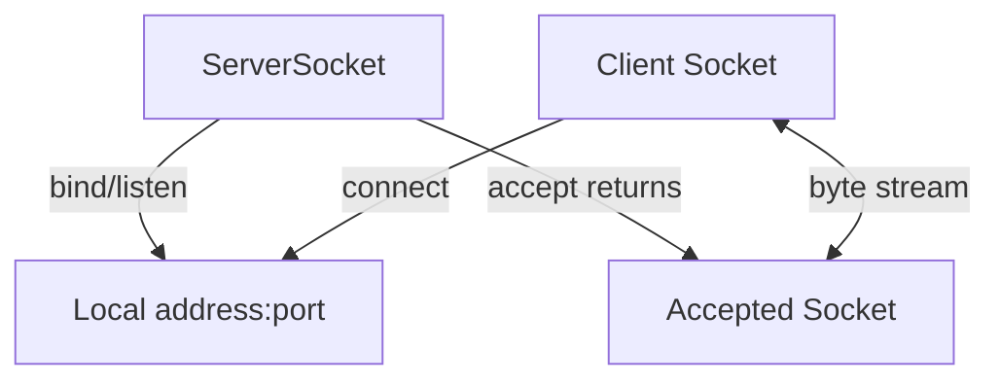
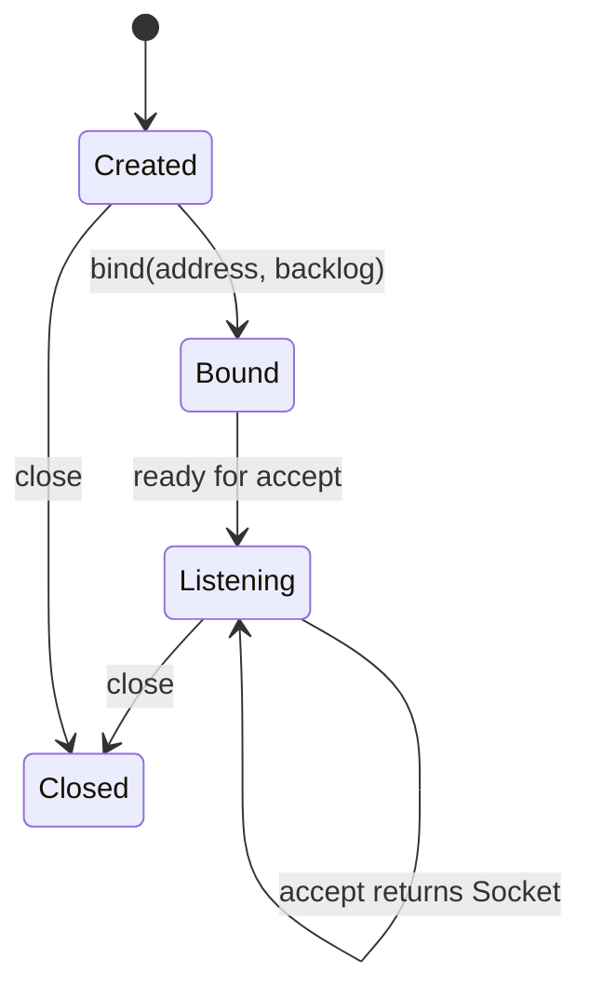
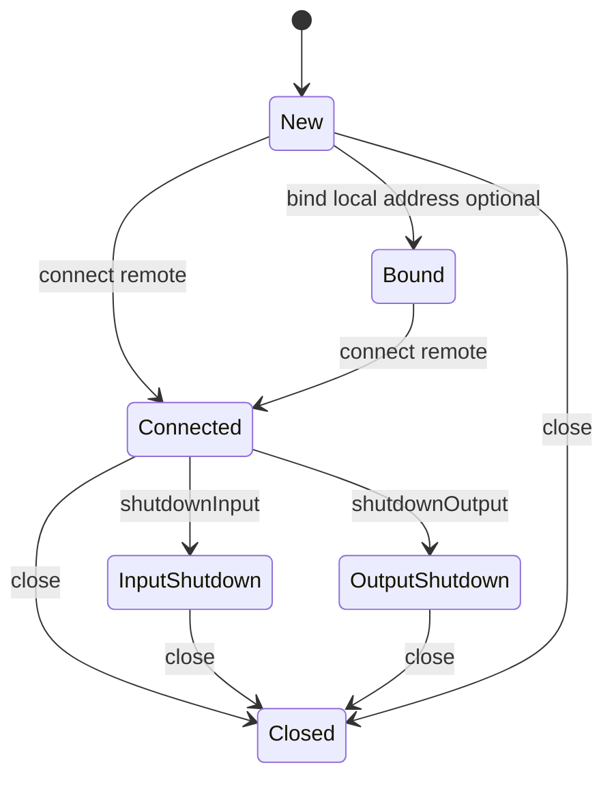
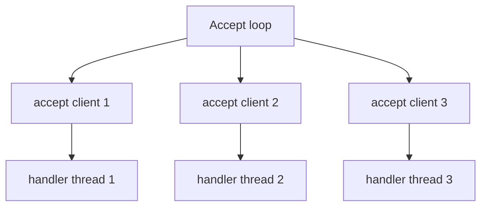

# Part 006 — Java `Socket` and `ServerSocket` Deep Dive

## 1. Tujuan Part Ini

Part sebelumnya membangun mental model TCP: reliable ordered byte stream, bukan message protocol. Sekarang kita masuk ke API konkret yang paling dasar dalam Java networking:

```java
java.net.Socket
java.net.ServerSocket
```

Kedua class ini terlihat sederhana, tetapi di baliknya ada banyak failure mode:

- connect tanpa timeout,
- server accept loop yang tidak bisa shutdown,
- read loop yang salah menganggap satu read adalah satu message,
- write yang bisa block karena peer lambat,
- socket yang tidak ditutup di semua path,
- `CLOSE_WAIT` menumpuk,
- error `Connection reset` yang dibaca terlalu dangkal,
- thread-per-connection yang tidak punya admission control,
- close/shutdown semantics yang salah dipakai,
- resource leak karena stream ownership tidak dipahami.

Setelah menyelesaikan part ini, kamu harus mampu:

1. Menjelaskan lifecycle object `Socket` dan `ServerSocket` dari unbound sampai closed.
2. Membedakan listener socket dan accepted socket.
3. Memakai `connect(SocketAddress, timeout)` dengan benar.
4. Membuat blocking TCP client/server baseline yang aman.
5. Memahami blocking behavior `accept()`, `read()`, dan `write()`.
6. Menjelaskan hubungan antara closing stream dan closing socket.
7. Memahami `shutdownInput()` dan `shutdownOutput()` untuk half-close.
8. Mendesain shutdown strategy untuk server blocking I/O.
9. Menghindari resource leak dan unbounded thread creation.
10. Membaca exception `SocketException`, `SocketTimeoutException`, `EOFException`, dan `ConnectException` sesuai fase.

Part ini tetap tidak membahas socket option secara sangat detail. Itu masuk Part 007. Fokus part ini adalah lifecycle, semantics, dan baseline implementation.

---

## 2. API Mental Model

Java blocking TCP terdiri dari dua role:

| Role | Class | Fungsi |
|---|---|---|
| Client endpoint | `Socket` | Membuka koneksi TCP ke remote endpoint dan melakukan read/write byte stream. |
| Server listener | `ServerSocket` | Bind/listen pada local address dan menerima koneksi masuk. |
| Per-connection server endpoint | `Socket` hasil `accept()` | Melakukan read/write dengan satu client tertentu. |

Diagram:



Core invariant:

> `ServerSocket` is not the communication channel. The accepted `Socket` is.

`ServerSocket` hanya menerima koneksi. Setelah `accept()` return, komunikasi dilakukan pada `Socket` yang dikembalikan.

---

## 3. Lifecycle `ServerSocket`

Simplified lifecycle:



Contoh paling sederhana:

```java
try (ServerSocket server = new ServerSocket(9090)) {
    while (true) {
        Socket client = server.accept();
        handle(client);
    }
}
```

Tetapi production-grade baseline tidak boleh berhenti di sini. Kode itu punya masalah:

- tidak ada shutdown condition,
- handler bisa block accept loop jika diproses inline,
- tidak ada timeout/idle policy,
- tidak ada admission control,
- tidak ada structured resource ownership,
- exception satu client bisa mematikan server jika tidak ditangani.

Lifecycle yang harus kamu desain:

```text
create -> bind -> accept loop -> per-connection lifecycle -> coordinated shutdown -> close listener -> close active connections
```

---

## 4. Lifecycle `Socket`

`Socket` punya beberapa state logis:



`Socket` dapat dibuat melalui:

1. client-side constructor/connect,
2. server-side `ServerSocket.accept()`,
3. `SocketChannel` bridge, yang akan dibahas di part NIO.

Contoh client yang lebih eksplisit:

```java
Socket socket = new Socket();
socket.connect(new InetSocketAddress("127.0.0.1", 9090), 2_000);
```

Kenapa lebih baik daripada constructor sederhana?

```java
new Socket("127.0.0.1", 9090);
```

Karena constructor sederhana tidak membuat timeout connect terlihat eksplisit di call site. Dalam production code, connect timeout adalah bagian dari contract.

---

## 5. Object State vs TCP State

Jangan menyamakan Java object state dengan semua TCP kernel state.

```java
socket.isConnected()
socket.isClosed()
socket.isInputShutdown()
socket.isOutputShutdown()
```

Method ini memberi state dari perspektif object Java, bukan health proof end-to-end.

Contoh:

```java
if (socket.isConnected() && !socket.isClosed()) {
    // Not a guarantee that remote is alive right now.
}
```

`isConnected()` tetap true setelah socket pernah connected, bahkan jika kemudian closed. Maka cek ini tidak boleh dipakai sebagai liveness check.

Mental model:

| Check | Aman dipakai untuk | Tidak aman untuk |
|---|---|---|
| `isConnected()` | Apakah socket pernah connect | Membuktikan peer masih hidup |
| `isClosed()` | Apakah Java socket sudah ditutup | Membuktikan remote state |
| `isInputShutdown()` | Local input shutdown flag | Membuktikan remote tidak akan kirim bytes |
| `isOutputShutdown()` | Local output shutdown flag | Membuktikan remote sudah menerima semua bytes |

Production invariant:

> Liveness is established by successful I/O under a deadline, not by boolean socket state alone.

---

## 6. Client Baseline: Explicit Timeout, Explicit Ownership

Minimal production-safe client skeleton:

```java
import java.io.*;
import java.net.*;
import java.nio.charset.StandardCharsets;
import java.time.Duration;

public final class BlockingTcpClient {
    private final InetSocketAddress remote;
    private final int connectTimeoutMillis;
    private final int readTimeoutMillis;

    public BlockingTcpClient(String host, int port, Duration connectTimeout, Duration readTimeout) {
        this.remote = new InetSocketAddress(host, port);
        this.connectTimeoutMillis = Math.toIntExact(connectTimeout.toMillis());
        this.readTimeoutMillis = Math.toIntExact(readTimeout.toMillis());
    }

    public String roundTrip(String request) throws IOException {
        try (Socket socket = new Socket()) {
            socket.connect(remote, connectTimeoutMillis);
            socket.setSoTimeout(readTimeoutMillis);

            OutputStream out = socket.getOutputStream();
            InputStream in = socket.getInputStream();

            byte[] payload = request.getBytes(StandardCharsets.UTF_8);
            out.write(payload);
            out.flush();

            byte[] buffer = new byte[1024];
            int n = in.read(buffer);
            if (n == -1) {
                throw new EOFException("Remote closed before response");
            }
            return new String(buffer, 0, n, StandardCharsets.UTF_8);
        }
    }
}
```

Ini masih belum protocol-safe untuk multi-message framing, tetapi sudah menunjukkan beberapa prinsip:

- `Socket` dibuat dalam `try-with-resources`,
- connect timeout eksplisit,
- read timeout eksplisit,
- EOF dibedakan dari empty response,
- stream tidak ditutup sendiri-sendiri karena socket owner mengelola lifecycle.

Untuk real protocol, response harus dibaca berdasarkan framing, bukan satu `read()`.

---

## 7. `connect()` Semantics

`connect(SocketAddress endpoint, int timeout)` mencoba membangun koneksi ke remote endpoint.

Hal yang penting:

- timeout `0` berarti infinite timeout,
- jika timeout expired, `SocketTimeoutException` dilempar,
- jika connect gagal, socket bisa berada dalam state tidak reusable,
- jika endpoint unresolved, bisa muncul `UnknownHostException` atau exception terkait unresolved address,
- interrupt behavior berbeda tergantung socket terkait channel atau virtual thread/system implementation.

Production rule:

```text
Never connect without an explicit timeout.
```

Contoh wrapper:

```java
static Socket connect(InetSocketAddress remote, Duration timeout) throws IOException {
    int millis = Math.toIntExact(timeout.toMillis());
    Socket socket = new Socket();
    boolean success = false;
    try {
        socket.connect(remote, millis);
        success = true;
        return socket;
    } finally {
        if (!success) {
            try {
                socket.close();
            } catch (IOException ignored) {
                // Preserve original connect failure.
            }
        }
    }
}
```

Kenapa `success` flag diperlukan? Karena jika connect gagal, kamu tetap harus memastikan socket ditutup tanpa menutupi exception utama.

---

## 8. `accept()` Semantics

`ServerSocket.accept()` block sampai ada koneksi masuk atau socket ditutup/timeout/error.

Contoh:

```java
Socket client = server.accept();
```

`accept()` mengembalikan connected `Socket`. Jika `ServerSocket` ditutup dari thread lain saat `accept()` sedang blocking, `accept()` akan gagal dengan exception, biasanya `SocketException: Socket closed`.

Accept loop yang baik harus membedakan:

- normal shutdown,
- transient accept failure,
- fatal bind/listener failure.

Skeleton:

```java
public final class BlockingTcpServer implements AutoCloseable {
    private final ServerSocket serverSocket;
    private volatile boolean running = true;

    public BlockingTcpServer(int port) throws IOException {
        this.serverSocket = new ServerSocket(port);
    }

    public void serve() throws IOException {
        while (running) {
            try {
                Socket client = serverSocket.accept();
                handleAccepted(client);
            } catch (SocketException e) {
                if (!running || serverSocket.isClosed()) {
                    return; // normal shutdown
                }
                throw e;
            }
        }
    }

    private void handleAccepted(Socket client) throws IOException {
        try (client) {
            // handle connection
        }
    }

    @Override
    public void close() throws IOException {
        running = false;
        serverSocket.close();
    }
}
```

Masalah skeleton ini: `handleAccepted` masih inline sehingga satu client bisa menahan semua accept. Untuk server sungguhan, handler harus dipisah dengan concurrency model dan admission control.

---

## 9. Thread-per-Connection Baseline

Blocking socket paling mudah dipahami dengan model thread-per-connection:



Dengan platform threads, model ini mahal untuk koneksi banyak. Dengan virtual threads, model ini kembali menarik. Tetapi pada part ini kita bahas baseline konseptual dulu.

Contoh dengan `ExecutorService`:

```java
public final class ThreadPerConnectionServer implements AutoCloseable {
    private final ServerSocket serverSocket;
    private final ExecutorService executor;
    private volatile boolean running = true;

    public ThreadPerConnectionServer(int port, ExecutorService executor) throws IOException {
        this.serverSocket = new ServerSocket(port);
        this.executor = executor;
    }

    public void serve() throws IOException {
        while (running) {
            try {
                Socket client = serverSocket.accept();
                executor.execute(() -> handleClientSafely(client));
            } catch (SocketException e) {
                if (!running || serverSocket.isClosed()) {
                    return;
                }
                throw e;
            }
        }
    }

    private void handleClientSafely(Socket client) {
        try (client) {
            client.setSoTimeout(30_000);
            handleClient(client);
        } catch (IOException e) {
            // Log with remote address and phase; do not kill accept loop.
            System.err.println("client failed: " + e);
        }
    }

    private void handleClient(Socket client) throws IOException {
        InputStream in = client.getInputStream();
        OutputStream out = client.getOutputStream();
        byte[] buffer = new byte[8192];
        int n;
        while ((n = in.read(buffer)) != -1) {
            out.write(buffer, 0, n);
            out.flush();
        }
    }

    @Override
    public void close() throws IOException {
        running = false;
        serverSocket.close();
        executor.shutdown();
    }
}
```

Ini echo server sederhana. Ia belum production complete, tetapi sudah lebih benar daripada inline handler.

Yang masih kurang:

- no bounded admission control,
- no active connection tracking,
- no graceful drain,
- no max frame size,
- no protocol state machine,
- no structured logging,
- no metrics,
- no write timeout strategy,
- no overload policy.

Part 031 akan membahas production server/gateway secara komprehensif.

---

## 10. Admission Control: Jangan Terima Semua Koneksi Tanpa Batas

Jika setiap accepted socket langsung dibuatkan handler tanpa batas, server bisa mati karena:

- terlalu banyak thread,
- terlalu banyak file descriptor,
- terlalu banyak memory buffer,
- slowloris-style clients,
- backpressure dari downstream,
- CPU context switching,
- GC pressure.

Baseline yang lebih baik memakai semaphore:

```java
public final class BoundedConnectionServer {
    private final ServerSocket serverSocket;
    private final ExecutorService executor;
    private final Semaphore permits;
    private volatile boolean running = true;

    public BoundedConnectionServer(int port, int maxConnections, ExecutorService executor) throws IOException {
        this.serverSocket = new ServerSocket(port);
        this.executor = executor;
        this.permits = new Semaphore(maxConnections);
    }

    public void serve() throws IOException {
        while (running) {
            Socket client = serverSocket.accept();
            if (!permits.tryAcquire()) {
                reject(client);
                continue;
            }
            executor.execute(() -> {
                try (client) {
                    handle(client);
                } catch (IOException e) {
                    System.err.println("client error: " + e);
                } finally {
                    permits.release();
                }
            });
        }
    }

    private void reject(Socket client) {
        try (client) {
            client.getOutputStream().write("BUSY\n".getBytes(StandardCharsets.UTF_8));
        } catch (IOException ignored) {
            // Client may have gone away. Rejection path must be best-effort.
        }
    }

    private void handle(Socket client) throws IOException {
        // protocol handling here
    }
}
```

Real production rejection tergantung protocol. Untuk raw TCP custom protocol, kamu bisa mengirim frame `BUSY` lalu close. Untuk HTTP, status 503. Untuk TLS, rejection sebelum handshake bisa sulit dibaca client.

Core invariant:

> Accepting a connection is taking responsibility for resources.

---

## 11. Blocking `read()`

`InputStream.read(...)` pada socket bisa:

1. mengembalikan `n > 0`,
2. mengembalikan `-1` untuk end-of-stream,
3. block menunggu byte,
4. melempar `SocketTimeoutException` jika `SO_TIMEOUT` tercapai,
5. melempar `SocketException`/`IOException` jika koneksi rusak/closed.

Contoh read loop benar untuk stream echo:

```java
byte[] buffer = new byte[8192];
while (true) {
    int n = in.read(buffer);
    if (n == -1) {
        break; // remote graceful close
    }
    if (n == 0) {
        // For InputStream read(byte[]) with non-zero length, normally not useful to treat as message.
        continue;
    }
    consume(buffer, 0, n);
}
```

Jangan abaikan return value:

```java
in.read(buffer);
process(buffer); // WRONG: buffer may contain old bytes beyond n
```

Read timeout:

```java
socket.setSoTimeout(5_000);
try {
    int n = socket.getInputStream().read(buffer);
} catch (SocketTimeoutException e) {
    // No data arrived within SO_TIMEOUT.
}
```

`SO_TIMEOUT` adalah timeout untuk blocking read/accept operation, bukan absolute request deadline. Jika body streaming terus mengirim satu byte sebelum timeout, operasi besar bisa berlangsung jauh lebih lama dari budget bisnis. Deadline absolut dibahas lebih dalam di Part 024.

---

## 12. Blocking `write()`

`OutputStream.write(...)` bisa block. Ini sering dilupakan.

Penyebab:

- peer lambat membaca,
- kernel send buffer penuh,
- network congestion,
- connection mengalami masalah tetapi belum terdeteksi,
- TLS layer di atasnya butuh handshake/flush internal,
- OS buffer/backpressure.

Contoh anti-pattern:

```java
for (Client c : clients) {
    c.out.write(eventBytes);
    c.out.flush();
}
```

Jika satu client lambat, broadcast loop bisa tertahan dan mempengaruhi semua client.

Strategi:

- pisahkan per-client writer,
- gunakan bounded queue,
- drop/close slow consumer,
- gunakan deadline/cancellation,
- pertimbangkan NIO untuk write readiness,
- ukur waktu write.

Blocking `write()` tidak punya `setSoTimeout` yang sama seperti read timeout. Beberapa OS/socket option bisa mempengaruhi, tetapi Java portable blocking write timeout tidak sesederhana read timeout. Karena itu production design sering memakai:

- operation deadline,
- close socket dari thread lain untuk membatalkan,
- NIO selector write readiness,
- async/non-blocking client,
- protocol-level flow control,
- bounded outbound queue.

---

## 13. Stream Ownership: Closing Stream Closes Socket

Pada `Socket`, `getInputStream()` dan `getOutputStream()` mengembalikan stream yang terkait dengan socket.

Prinsip penting:

> Closing the socket stream closes the socket.

Maka ini bisa salah jika kamu masih ingin memakai output setelah input ditutup:

```java
InputStream in = socket.getInputStream();
OutputStream out = socket.getOutputStream();
in.close();       // closes socket
out.write(...);   // likely fails
```

Dalam kebanyakan code, jadikan `Socket` sebagai owner utama:

```java
try (Socket socket = connect(...)) {
    InputStream in = socket.getInputStream();
    OutputStream out = socket.getOutputStream();
    // use streams
} // closes both directions
```

Jangan bungkus stream dengan try-with-resources terpisah jika lifecycle-nya tidak ingin menutup socket lebih awal.

Kurang aman:

```java
try (InputStream in = socket.getInputStream()) {
    // when leaving this block, socket closes
}
```

Lebih jelas:

```java
try (Socket socket = connect(...)) {
    InputStream in = socket.getInputStream();
    OutputStream out = socket.getOutputStream();
    use(in, out);
}
```

---

## 14. `shutdownOutput()` dan `shutdownInput()`

TCP full-duplex memungkinkan half-close. Java menyediakan:

```java
socket.shutdownOutput();
socket.shutdownInput();
```

`shutdownOutput()` berarti local tidak akan mengirim byte lagi. Di TCP, ini biasanya mengirim FIN pada arah output. Remote akan melihat EOF setelah semua bytes dibaca.

Contoh use case:

```java
out.write(requestBytes);
out.flush();
socket.shutdownOutput(); // signal end of request body

byte[] response = in.readAllBytes();
```

Ini cocok untuk protocol sederhana “send request then close write side, then read response until remote closes”. Tetapi tidak cocok untuk persistent protocol yang harus mengirim banyak request dalam satu koneksi.

`shutdownInput()` lebih jarang dipakai. Ia menutup sisi input lokal. Jika remote masih mengirim data, behavior dapat menghasilkan reset/ignored data tergantung kondisi. Jangan pakai sebagai cara normal “skip remaining response” tanpa memahami protokol.

Matrix:

| Operation | Efek lokal | Efek remote |
|---|---|---|
| `close()` | Menutup socket dua arah | Remote melihat EOF atau reset tergantung kondisi/OS/options |
| `shutdownOutput()` | Tidak bisa write lagi | Remote read melihat EOF setelah buffered bytes |
| `shutdownInput()` | Tidak bisa read lagi | Tidak otomatis berarti remote berhenti write |
| close input stream | Menutup socket | Sama seperti socket close |
| close output stream | Menutup socket | Sama seperti socket close |

---

## 15. Graceful Close Pattern

Untuk simple request/response custom protocol:

```java
try (Socket socket = new Socket()) {
    socket.connect(remote, 2_000);
    socket.setSoTimeout(5_000);

    OutputStream out = socket.getOutputStream();
    InputStream in = socket.getInputStream();

    writeFrame(out, request);
    out.flush();

    byte[] response = readFrame(in, 1024 * 1024);
    // then close by try-with-resources
}
```

Untuk protocol yang memakai EOF sebagai end-of-request:

```java
writeRequest(out);
out.flush();
socket.shutdownOutput();
readResponseUntilEof(in);
```

Tetapi banyak protocol modern tidak memakai EOF sebagai message boundary, karena ingin connection reuse. Maka jangan sembarang `shutdownOutput()` untuk HTTP/1.1 keep-alive, HTTP/2, database protocol, atau persistent custom protocol.

Production rule:

> Close semantics are part of the protocol, not just cleanup.

---

## 16. Server Shutdown Strategy

Server blocking I/O butuh cara keluar dari `accept()` dan cara menutup active clients.

Minimal components:

1. `running` flag,
2. close `ServerSocket` untuk unblock `accept()`,
3. track active client sockets,
4. close active sockets saat shutdown,
5. stop executor,
6. wait bounded time,
7. force close remaining resources.

Skeleton:

```java
public final class GracefulBlockingServer implements AutoCloseable {
    private final ServerSocket serverSocket;
    private final ExecutorService executor;
    private final Set<Socket> clients = ConcurrentHashMap.newKeySet();
    private volatile boolean running = true;

    public GracefulBlockingServer(int port, ExecutorService executor) throws IOException {
        this.serverSocket = new ServerSocket(port);
        this.executor = executor;
    }

    public void serve() throws IOException {
        while (running) {
            try {
                Socket client = serverSocket.accept();
                clients.add(client);
                executor.execute(() -> handleAndRemove(client));
            } catch (SocketException e) {
                if (!running || serverSocket.isClosed()) {
                    return;
                }
                throw e;
            }
        }
    }

    private void handleAndRemove(Socket client) {
        try (client) {
            client.setSoTimeout(30_000);
            handle(client);
        } catch (IOException e) {
            System.err.println("client failed: " + e);
        } finally {
            clients.remove(client);
        }
    }

    private void handle(Socket client) throws IOException {
        InputStream in = client.getInputStream();
        OutputStream out = client.getOutputStream();
        // protocol-specific handler
    }

    @Override
    public void close() throws IOException {
        running = false;
        serverSocket.close();
        for (Socket client : clients) {
            try {
                client.close();
            } catch (IOException ignored) {
                // continue closing others
            }
        }
        executor.shutdown();
    }
}
```

Ini belum sempurna, tapi invariant-nya benar: listener dan active connections punya lifecycle berbeda.

---

## 17. Exception Taxonomy by Operation

### During bind/listen

| Exception | Makna umum |
|---|---|
| `BindException: Address already in use` | Port sudah dipakai atau masih dalam state OS tertentu. |
| `BindException: Cannot assign requested address` | Bind ke IP yang tidak ada di host/interface. |
| `SecurityException` | Security manager/policy lama; jarang di modern deployment. |
| `IOException` | Kategori umum OS/network error. |

### During accept

| Exception | Makna umum |
|---|---|
| `SocketException: Socket closed` | Biasanya normal jika server sedang shutdown. |
| `SocketTimeoutException` | Jika `ServerSocket.setSoTimeout` dipakai. |
| `IOException` | Listener error lain. |

### During connect

| Exception | Makna umum |
|---|---|
| `UnknownHostException` | Host tidak resolve. |
| `ConnectException: Connection refused` | Target reachable tapi no listener/reject. |
| `SocketTimeoutException` | Connect tidak selesai sebelum timeout. |
| `NoRouteToHostException` | Routing/path problem. |
| `SocketException` | Closed/invalid/network error. |

### During read

| Result/exception | Makna umum |
|---|---|
| `n > 0` | Bytes dibaca. |
| `-1` | Remote graceful close sisi output. |
| `SocketTimeoutException` | Tidak ada data sebelum timeout. |
| `SocketException: Connection reset` | Abort/reset. |
| `IOException` | I/O error lain. |

### During write

| Exception | Makna umum |
|---|---|
| `SocketException: Broken pipe` | Write ke koneksi yang sudah rusak/ditutup. |
| `SocketException: Connection reset` | Reset terdeteksi. |
| `IOException` | I/O error lain. |

---

## 18. Logging yang Berguna untuk Socket Code

Log networking yang bagus harus mencatat phase.

Buruk:

```text
network error: java.net.SocketException: Connection reset
```

Lebih baik:

```text
phase=read-response remote=10.42.1.17:9090 local=10.42.2.8:53144 protocol=ledger-v1 connectionAgeMs=8123 bytesWritten=128 bytesRead=0 error=Connection reset
```

Minimal fields:

| Field | Kenapa penting |
|---|---|
| phase | connect/read/write/close/accept/bind |
| remote address | Target aktual setelah DNS/routing. |
| local address | Debug NAT, ephemeral port, bind. |
| connection age | Membedakan fresh vs stale connection. |
| bytes read/written | Deteksi partial operation. |
| protocol state | reading header/body, writing response. |
| timeout config | Memahami apakah failure sesuai budget. |
| correlation id | Menghubungkan dengan business operation. |

Jangan log payload sensitif. Untuk debugging protocol, log length, frame type, state, dan checksum/hash jika perlu.

---

## 19. `available()` Bukan Message Length

`InputStream.available()` sering disalahgunakan.

Anti-pattern:

```java
int size = in.available();
byte[] data = in.readNBytes(size);
handleMessage(data);
```

Masalah:

- `available()` hanya estimasi byte yang bisa dibaca tanpa blocking,
- bisa `0` walaupun stream belum EOF,
- tidak tahu logical message boundary,
- tidak cocok untuk protocol parser.

Gunakan framing:

```java
int length = readLengthPrefix(in);
byte[] payload = readExactly(in, length);
```

Atau gunakan delimiter parser yang bounded.

Core rule:

> `available()` is not a protocol primitive.

---

## 20. `readAllBytes()` dan `readNBytes()` Harus Dipakai dengan Hati-Hati

Modern Java punya helper:

```java
byte[] all = in.readAllBytes();
byte[] some = in.readNBytes(1024);
```

Keduanya berguna, tetapi berbahaya untuk network stream jika tidak ada boundary jelas.

`readAllBytes()` membaca sampai EOF. Pada persistent connection, EOF mungkin tidak datang sampai peer close. Ini bisa infinite wait atau memory growth.

Cocok:

```text
Protocol explicitly says response ends when connection closes.
```

Tidak cocok:

```text
Persistent protocol with multiple messages per connection.
```

`readNBytes(n)` membaca sampai N bytes atau EOF. Ia tetap perlu limit yang aman. Jangan pakai length dari remote tanpa validasi.

Aman:

```java
int length = readLengthPrefix(in);
if (length < 0 || length > maxFrameSize) {
    throw new ProtocolException("bad length");
}
byte[] body = in.readNBytes(length);
if (body.length != length) {
    throw new EOFException("unexpected end of frame");
}
```

---

## 21. Simple Length-Prefixed Client/Server Baseline

Walaupun framing dibahas lebih dalam di Part 008, di sini kita butuh baseline yang tidak salah.

Frame format:

```text
4-byte big-endian length + UTF-8 payload
```

Utility:

```java
static void writeFrame(OutputStream out, byte[] payload, int maxFrameSize) throws IOException {
    if (payload.length > maxFrameSize) {
        throw new IllegalArgumentException("frame too large: " + payload.length);
    }
    byte[] header = ByteBuffer.allocate(4).putInt(payload.length).array();
    out.write(header);
    out.write(payload);
    out.flush();
}

static byte[] readFrame(InputStream in, int maxFrameSize) throws IOException {
    byte[] header = readExactly(in, 4);
    int length = ByteBuffer.wrap(header).getInt();
    if (length < 0 || length > maxFrameSize) {
        throw new ProtocolException("invalid frame length: " + length);
    }
    return readExactly(in, length);
}

static byte[] readExactly(InputStream in, int length) throws IOException {
    byte[] data = new byte[length];
    int offset = 0;
    while (offset < length) {
        int n = in.read(data, offset, length - offset);
        if (n == -1) {
            throw new EOFException("expected " + length + " bytes, got " + offset);
        }
        offset += n;
    }
    return data;
}
```

Server handler:

```java
private void handle(Socket client) throws IOException {
    client.setSoTimeout(10_000);
    InputStream in = client.getInputStream();
    OutputStream out = client.getOutputStream();

    while (true) {
        byte[] request;
        try {
            request = readFrame(in, 64 * 1024);
        } catch (EOFException e) {
            return; // graceful client close between frames
        }

        String text = new String(request, StandardCharsets.UTF_8);
        byte[] response = ("echo:" + text).getBytes(StandardCharsets.UTF_8);
        writeFrame(out, response, 64 * 1024);
    }
}
```

Ini menunjukkan perbedaan penting:

- EOF saat menunggu frame baru bisa berarti client selesai.
- EOF di tengah frame berarti frame corrupt/partial.
- Length harus dibatasi.
- Read timeout harus diperlakukan sebagai protocol/idle failure.

---

## 22. Resource Leak: `CLOSE_WAIT` sebagai Sinyal Bug

`CLOSE_WAIT` muncul ketika remote sudah mengirim FIN dan local TCP stack sudah tahu, tetapi aplikasi lokal belum menutup socket.

Banyak `CLOSE_WAIT` biasanya berarti:

```text
Your application is not closing sockets after remote close.
```

Penyebab umum:

- read loop keluar tanpa `close`,
- exception path tidak menutup socket,
- stream wrapper menahan resource,
- handler thread stuck setelah EOF,
- connection tracking tidak cleanup,
- third-party client tidak di-close.

Pattern aman:

```java
private void handleClientSafely(Socket client) {
    try (client) {
        handle(client);
    } catch (IOException e) {
        logFailure(client, e);
    }
}
```

Walaupun `handle` return karena EOF atau exception, `try (client)` tetap menutup socket.

---

## 23. Backlog, Bind, dan Listener Responsibility

`new ServerSocket(port)` melakukan bind ke port dengan default backlog dan wildcard address. Untuk production, sering lebih eksplisit:

```java
ServerSocket server = new ServerSocket();
server.bind(new InetSocketAddress("0.0.0.0", 9090), 1024);
```

Makna:

- `0.0.0.0` bind ke semua IPv4 interfaces,
- `127.0.0.1` hanya local loopback,
- port `0` meminta OS memilih ephemeral port,
- backlog memberi hint panjang queue untuk incoming connection indications.

Part 007 akan membahas backlog dan socket options lebih detail. Untuk sekarang, pahami bahwa bind address mempengaruhi reachability.

Bug umum container:

```text
Server binds to 127.0.0.1 inside container.
Other pods/services cannot reach it.
```

Debug:

```text
Check actual local socket address.
Check container port mapping.
Check service targetPort.
Check listener interface.
```

---

## 24. Local Address dan Remote Address

Setelah connect/accept, kamu bisa membaca endpoint:

```java
SocketAddress local = socket.getLocalSocketAddress();
SocketAddress remote = socket.getRemoteSocketAddress();
```

Gunakan untuk logging, debugging, dan audit teknis.

Client example:

```text
local=/10.10.4.12:53144 remote=ledger.internal/10.10.8.20:443
```

Server accepted socket:

```text
local=/10.10.8.20:9090 remote=/10.10.4.12:53144
```

Ini membantu menjawab:

- IP hasil DNS apa yang dipakai?
- Local ephemeral port apa yang dipakai?
- Apakah client melewati NAT/proxy?
- Apakah server menerima koneksi di interface yang benar?
- Apakah IPv4/IPv6 yang dipakai sesuai ekspektasi?

---

## 25. Cancellation: Cara Membatalkan Blocking Socket Operation

Untuk blocking socket klasik, strategi portable paling jelas untuk membatalkan operasi adalah menutup socket dari thread lain.

```java
Thread worker = new Thread(() -> {
    try {
        socket.getInputStream().read(buffer);
    } catch (IOException e) {
        // expected if socket is closed for cancellation
    }
});

worker.start();
// later
socket.close();
```

Di JDK modern, dokumentasi `Socket` menjelaskan kasus interruptible untuk socket yang associated dengan `SocketChannel`, dan untuk system-default socket implementation ketika virtual thread melakukan connect/read/write. Tetapi untuk desain library yang portable dan mudah dipahami, tetap treat socket close sebagai cancellation primitive utama.

Rule praktis:

```text
To stop blocking socket I/O reliably, own the socket and close it as part of cancellation/shutdown.
```

Jangan hanya mengandalkan `Thread.interrupt()` tanpa memahami socket implementation dan thread model.

---

## 26. Virtual Threads dan Blocking Socket

Virtual threads membuat blocking style lebih scalable, tetapi tidak menghapus kebutuhan desain network yang benar.

Dengan Java modern, kamu bisa memakai:

```java
try (ExecutorService executor = Executors.newVirtualThreadPerTaskExecutor()) {
    while (running) {
        Socket client = server.accept();
        executor.submit(() -> handleClientSafely(client));
    }
}
```

Keuntungan:

- kode tetap sequential,
- per-connection handler lebih mudah dibaca,
- blocking I/O lebih murah daripada platform thread untuk banyak idle connections,
- stack trace tetap natural.

Tetapi masih wajib:

- limit koneksi,
- timeout,
- max frame size,
- active socket tracking,
- graceful shutdown,
- slow consumer policy,
- downstream bulkhead,
- observability.

Virtual threads menyelesaikan cost thread, bukan cost socket/file descriptor/memory/protocol failure.

---

## 27. Designing a Socket Wrapper: Jangan Bocorkan Primitive Mentah

Dalam aplikasi besar, jangan sebar `Socket` mentah ke seluruh codebase. Buat abstraction kecil yang membawa policy.

Contoh:

```java
public final class ManagedTcpConnection implements AutoCloseable {
    private final Socket socket;
    private final InputStream in;
    private final OutputStream out;
    private final int maxFrameSize;

    public ManagedTcpConnection(Socket socket, int readTimeoutMillis, int maxFrameSize) throws IOException {
        this.socket = socket;
        this.socket.setSoTimeout(readTimeoutMillis);
        this.in = socket.getInputStream();
        this.out = socket.getOutputStream();
        this.maxFrameSize = maxFrameSize;
    }

    public byte[] request(byte[] payload) throws IOException {
        writeFrame(out, payload, maxFrameSize);
        return readFrame(in, maxFrameSize);
    }

    public SocketAddress remoteAddress() {
        return socket.getRemoteSocketAddress();
    }

    @Override
    public void close() throws IOException {
        socket.close();
    }
}
```

Policy yang bisa dipusatkan:

- timeout,
- frame size,
- logging,
- metrics,
- protocol state,
- close behavior,
- exception translation,
- correlation id,
- connection age.

Ini membuat aplikasi tidak mengulang bug yang sama di banyak tempat.

---

## 28. Failure Modelling: Partial Operation dan Ambiguous Outcome

Socket failure sering terjadi setelah sebagian operasi berhasil.

Contoh:

```text
Client writes request frame.
Server receives request and commits transaction.
Server crashes before response.
Client reads Connection reset.
```

Dari sisi client:

```text
Apakah operasi berhasil? Tidak diketahui.
```

Ini bukan masalah socket saja. Ini masalah distributed systems.

Untuk operasi non-idempotent, jangan retry buta setelah network failure. Gunakan:

- idempotency key,
- client-generated operation id,
- server-side deduplication,
- status query,
- transactional outbox/inbox pattern jika relevan,
- explicit application ACK.

Part ini tidak mengulang materi distributed systems secara luas, tetapi socket code harus membawa awareness ini.

Network exception setelah write bukan bukti operasi gagal. Bisa jadi operasi sukses tetapi response hilang.

---

## 29. Test Strategy untuk Socket Code

Unit test saja tidak cukup. Minimal test matrix:

| Scenario | Expected behavior |
|---|---|
| server not listening | client gets refused/connection failure quickly |
| blackhole endpoint | client connect timeout |
| server accepts but never responds | client read timeout |
| server sends partial frame then closes | client EOF/protocol error |
| client sends oversized frame | server rejects/closes safely |
| slow client reads response slowly | server does not OOM |
| many clients connect | admission control works |
| shutdown while accept blocked | server exits cleanly |
| shutdown while clients active | clients closed/drained according policy |
| remote reset | exception classified by phase |

Contoh tiny fake server untuk test:

```java
try (ServerSocket server = new ServerSocket(0)) {
    int port = server.getLocalPort();
    Thread t = new Thread(() -> {
        try (Socket client = server.accept()) {
            client.getOutputStream().write(new byte[] {0, 0, 0, 10, 'h', 'i'}); // partial frame
            client.getOutputStream().flush();
        } catch (IOException ignored) {
        }
    });
    t.start();

    // client test connects to 127.0.0.1:port and expects EOFException
}
```

Using port `0` lets OS allocate an available ephemeral port for tests.

---

## 30. Common Anti-Patterns

### Anti-pattern 1: `new Socket(host, port)` everywhere

Problem: timeout policy invisible and inconsistent.

Better:

```java
Socket socket = new Socket();
socket.connect(remote, connectTimeoutMillis);
socket.setSoTimeout(readTimeoutMillis);
```

### Anti-pattern 2: Handler inline in accept loop

Problem: one slow client blocks all new clients.

Better: separate accept and per-connection handling with bounded concurrency.

### Anti-pattern 3: No close on exception path

Problem: resource leak, `CLOSE_WAIT`, file descriptor exhaustion.

Better: `try (Socket client = acceptedSocket)` in handler boundary.

### Anti-pattern 4: Using socket boolean state as health check

Problem: `isConnected()` is not remote liveness.

Better: successful protocol operation under deadline.

### Anti-pattern 5: Reading with `available()`

Problem: not message length.

Better: explicit framing.

### Anti-pattern 6: No admission control

Problem: server accepts more work than it can handle.

Better: semaphore, bounded executor, backlog tuning, rejection policy.

### Anti-pattern 7: Treating close as mere cleanup

Problem: close behavior is protocol visible.

Better: define graceful close, half-close, reset, and draining rules per protocol.

---

## 31. Design Checklist

Untuk setiap raw TCP Java client/server, jawab ini:

### Client

- Apa connect timeout?
- Apa read timeout?
- Apakah ada absolute operation deadline?
- Apa framing protocol?
- Berapa max response/frame size?
- Apakah operasi idempotent jika retry?
- Bagaimana membedakan DNS/connect/read/write failure?
- Apakah socket selalu ditutup?
- Apakah local/remote address dilog?
- Apakah stale connection mungkin terjadi?

### Server

- Bind ke address apa?
- Backlog berapa?
- Bagaimana accept loop shutdown?
- Berapa maksimum active connection?
- Bagaimana slow client ditangani?
- Apakah handler punya read timeout?
- Apakah frame size dibatasi?
- Apakah client error hanya menutup client tersebut?
- Apakah active socket dilacak untuk shutdown?
- Apakah logs punya phase dan remote address?

### Protocol

- Apa message boundary?
- Apa end-of-stream meaning?
- Apakah half-close valid?
- Apa response untuk malformed frame?
- Apakah ada heartbeat/idle policy?
- Apakah ada application-level ACK?
- Apakah partial write outcome ambigu?

---

## 32. Deliberate Practice

### Drill 1 — Build bounded echo server

Buat echo server dengan:

- `ServerSocket`,
- `ExecutorService`,
- max 100 active connections,
- read timeout 10 detik,
- max frame size 64 KiB,
- graceful shutdown.

Target: semua accepted socket tertutup pada normal/error path.

### Drill 2 — Classify exception by phase

Instrument client agar setiap exception membawa phase:

```text
CONNECTING
WRITING_REQUEST
READING_RESPONSE_HEADER
READING_RESPONSE_BODY
CLOSING
```

Target: tidak ada log `IOException` tanpa phase.

### Drill 3 — Simulate client disconnect

Client connect, kirim setengah frame, lalu close. Server harus:

- tidak crash,
- menutup socket,
- log protocol error,
- tetap menerima client berikutnya.

### Drill 4 — Shutdown while blocked

Jalankan server tanpa client. Dari thread lain panggil `close()`. Accept loop harus keluar tanpa stacktrace fatal.

### Drill 5 — Slow writer/reader

Buat client yang membaca response sangat lambat. Ukur apakah server handler block dan apakah ada policy untuk memutus slow consumer.

---

## 33. Ringkasan

`Socket` dan `ServerSocket` adalah API sederhana tetapi membawa konsekuensi production yang besar.

Yang harus melekat:

- `ServerSocket` adalah listener; `Socket` hasil `accept()` adalah channel komunikasi.
- `Socket` state boolean bukan liveness proof.
- `connect()` wajib timeout eksplisit.
- `accept()`, `read()`, dan `write()` bisa block.
- `read()` return value wajib dihormati.
- stream close menutup socket.
- `shutdownOutput()` adalah protocol signal, bukan cleanup biasa.
- close harus terjadi pada semua path.
- server butuh admission control.
- raw socket code harus membawa phase, timeout, max size, dan ownership policy.

Part berikutnya akan membahas socket options secara mendalam: `SO_TIMEOUT`, connect timeout, receive/send buffer, backlog, `SO_REUSEADDR`, `TCP_NODELAY`, keepalive, linger, dan konsekuensi kernel queue untuk Java production systems.

---

## 34. Referensi

- Oracle Java SE 25 API — `java.net.Socket`: https://docs.oracle.com/en/java/javase/25/docs/api/java.base/java/net/Socket.html
- Oracle Java SE 25 API — `java.net.ServerSocket`: https://docs.oracle.com/en/java/javase/25/docs/api/java.base/java/net/ServerSocket.html
- Oracle Java SE 25 API — `java.net.SocketTimeoutException`: https://docs.oracle.com/en/java/javase/25/docs/api/java.base/java/net/SocketTimeoutException.html
- Oracle Java SE 25 API — `java.net.SocketException`: https://docs.oracle.com/en/java/javase/25/docs/api/java.base/java/net/SocketException.html
- OpenJDK JEP 353 — Reimplement the Legacy Socket API: https://openjdk.org/jeps/353
- RFC 9293 — Transmission Control Protocol: https://www.rfc-editor.org/rfc/rfc9293
