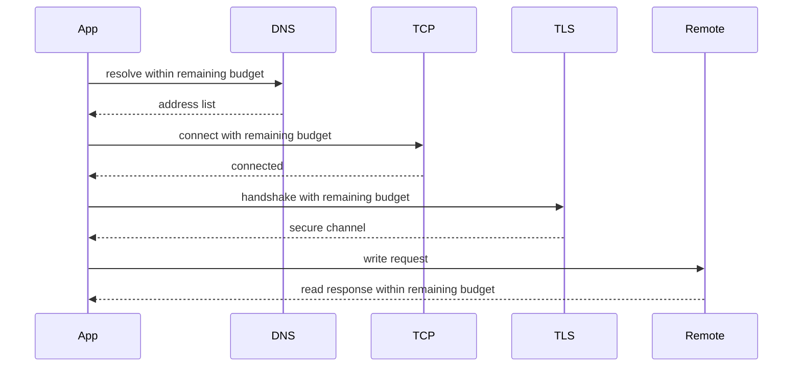
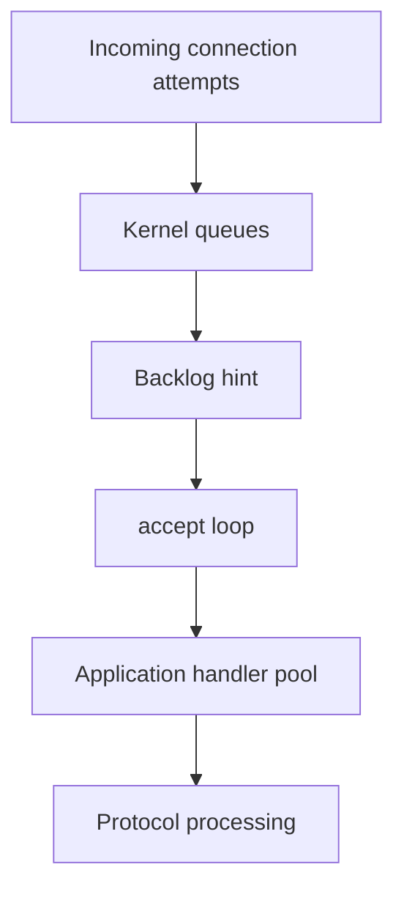
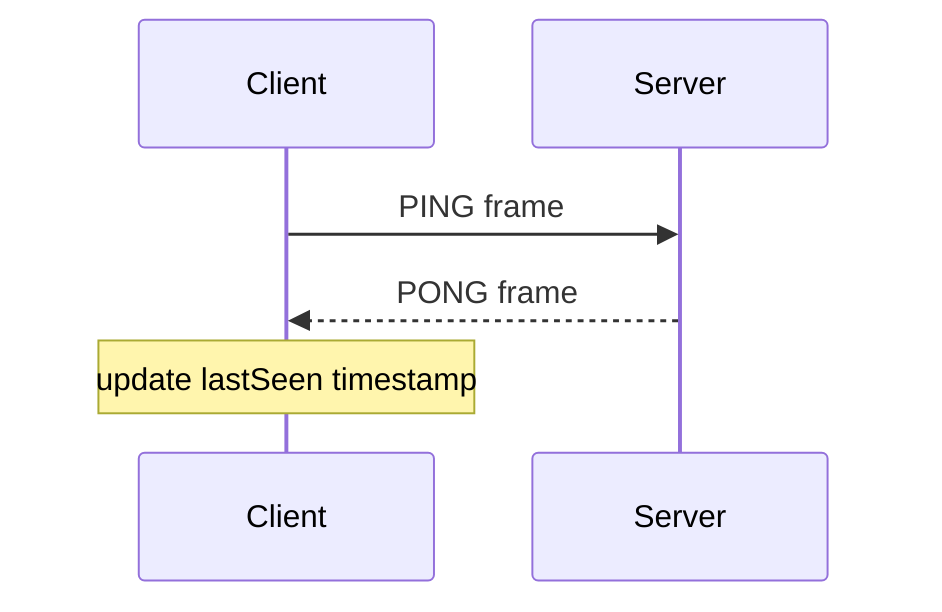
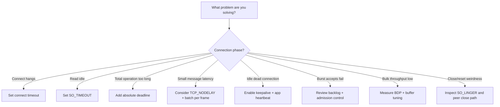

# Part 007 — Socket Options, Timeouts, Backlog, and Keepalive

## 1. Tujuan Part Ini

Part 006 membahas lifecycle `Socket` dan `ServerSocket`: connect, accept, read, write, shutdown, dan close. Part ini membahas lapisan yang sering menjadi pembeda antara kode demo dan kode production:

- timeout,
- backlog,
- buffer,
- address reuse,
- keepalive,
- `TCP_NODELAY`,
- `SO_LINGER`,
- accept timeout,
- connect timeout,
- read timeout,
- OS-specific behavior,
- tuning yang aman,
- tuning yang tampak pintar tapi sebenarnya berbahaya.

Tujuan akhirnya bukan menghafal setiap option, tetapi membangun mental model:

> Socket options are not magic performance switches. They are contracts between application intent, JVM API, OS socket implementation, and network reality.

Setelah menyelesaikan part ini, kamu harus mampu:

1. Membedakan timeout pada `connect`, `accept`, `read`, `write`, dan request-level deadline.
2. Menjelaskan mengapa blocking `Socket` tidak punya direct `write timeout` yang simetris dengan `read timeout`.
3. Memilih socket option berdasarkan failure mode, bukan folklore.
4. Menjelaskan backlog sebagai admission boundary, bukan capacity guarantee.
5. Menjelaskan kapan `TCP_NODELAY` membantu dan kapan batching lebih penting.
6. Menjelaskan mengapa OS keepalive bukan health check aplikasi.
7. Menghindari penggunaan `SO_LINGER` yang merusak graceful close.
8. Mendesain konfigurasi socket yang aman untuk client dan server.
9. Membaca gejala production: stuck read, stuck connect, `TIME_WAIT`, `CLOSE_WAIT`, reset, latency spike, queue overflow.
10. Membuat checklist tuning yang defensible.

---

## 2. Mental Model: Empat Layer Buffer dan Queue

Sebelum membahas option satu per satu, pahami bahwa data network tidak langsung berpindah dari object Java ke kabel.

Ada beberapa boundary:

```mermaid
flowchart LR
    A[Application Object] --> B[Java byte[] / ByteBuffer]
    B --> C[JVM / Native Boundary]
    C --> D[Kernel Socket Send Buffer]
    D --> E[NIC / Network]
    E --> F[Remote Kernel Receive Buffer]
    F --> G[Remote JVM Buffer]
    G --> H[Remote Application Parser]
```

Pada sisi server, koneksi masuk juga melewati queue:

```mermaid
flowchart TD
    A[Client SYN] --> B[Kernel pending connection queues]
    B --> C[ServerSocket listen backlog hint]
    C --> D[accept() returns Socket]
    D --> E[Application handler admission]
```

Important invariant:

> A socket option only affects one layer. It cannot repair a broken protocol, unbounded memory use, slow parser, missing deadline, or overloaded handler.

Contoh:

- `setSoTimeout(5000)` bisa mencegah read block selamanya, tetapi tidak menyelesaikan slow-client attack jika handler tetap dipertahankan tanpa admission policy.
- `setReceiveBufferSize(1 << 20)` bisa meningkatkan throughput untuk high bandwidth-delay product, tetapi bisa memperburuk memory pressure jika connection count besar.
- `setTcpNoDelay(true)` bisa menurunkan latency untuk request kecil, tetapi bisa meningkatkan packet overhead bila aplikasi melakukan many tiny writes.
- backlog besar bisa membantu menyerap burst connect, tetapi tidak membuat server mampu memproses lebih banyak request jika handler pool jenuh.

---

## 3. Taxonomy Socket Option

Cara paling efektif memahami socket option adalah mengelompokkannya berdasarkan masalah yang dikendalikan.

| Concern | Java API contoh | Digunakan untuk | Risiko salah pakai |
|---|---|---|---|
| Connection establishment | `connect(address, timeout)` | Membatasi waktu connect | Timeout terlalu besar membuat caller menggantung; terlalu kecil menyebabkan false failure saat jaringan lambat. |
| Accept loop | `ServerSocket#setSoTimeout` | Membuat `accept()` periodically unblock | Bisa membuat log noise jika timeout diperlakukan sebagai error. |
| Read idle | `Socket#setSoTimeout` | Membatasi blocking `read()` | Bukan request deadline total; hanya timeout antar read. |
| Latency small writes | `Socket#setTcpNoDelay` | Menonaktifkan Nagle | Bisa memperbanyak small packet jika aplikasi tidak batching. |
| Liveness idle connection | `Socket#setKeepAlive` | Kernel-level probe untuk idle TCP | Bukan app health check; timing OS-dependent. |
| Buffering | `setReceiveBufferSize`, `setSendBufferSize` | Throughput, BDP, memory control | Besar tidak selalu lebih cepat; bisa menaikkan memory footprint. |
| Address lifecycle | `setReuseAddress` | Restart server, bind behavior | Semantics OS-dependent; jangan dianggap load balancing. |
| Close behavior | `setSoLinger` | Mengatur close blocking/RST behavior | Sangat mudah menyebabkan data loss/reset. |
| Traffic class | `setTrafficClass` | DSCP/TOS hint | Sering diabaikan jaringan; jangan andalkan tanpa network policy. |

Rule:

> Start with correctness and bounded failure first. Tune for performance only after measuring.

---

## 4. Timeout Semantics: Jangan Campur Aduk

Salah satu sumber bug terbesar adalah menyebut semuanya “timeout” tanpa membedakan fase.

### 4.1 Connect Timeout

Connect timeout membatasi fase pembukaan koneksi.

```java
Socket socket = new Socket();
socket.connect(new InetSocketAddress("example.com", 443), 2_000);
```

Makna:

- jika koneksi tidak berhasil dibuka dalam 2 detik, Java melempar `SocketTimeoutException`,
- timeout ini hanya untuk connect,
- setelah connect sukses, timeout ini tidak mengatur read/write,
- DNS resolution bisa terjadi sebelum connect tergantung cara address dibuat.

Perhatikan perbedaan:

```java
// DNS lookup bisa terjadi di sini.
InetSocketAddress address = new InetSocketAddress("example.com", 443);

Socket socket = new Socket();
socket.connect(address, 2_000);
```

Jika ingin memahami total request latency, jangan hanya melihat connect timeout. Total bisa meliputi:

```text
DNS lookup + TCP connect + TLS handshake + request write + response first byte + response body read
```

Production invariant:

> Connect timeout is not a request timeout.

### 4.2 Read Timeout

Read timeout pada blocking socket diatur lewat `setSoTimeout`.

```java
socket.setSoTimeout(5_000);
int n = socket.getInputStream().read(buffer);
```

Makna:

- berlaku untuk blocking read pada input stream socket,
- jika tidak ada data selama interval timeout, read melempar `SocketTimeoutException`,
- socket belum otomatis closed,
- caller boleh retry read, close socket, atau abort request sesuai protocol.

Important detail:

> `SO_TIMEOUT` adalah idle timeout untuk operasi read, bukan deadline total untuk membaca seluruh response.

Contoh masalah:

```text
read timeout = 5s
server mengirim 1 byte setiap 4.9s
body total = 100MB
```

Read tidak pernah timeout, tetapi request bisa berlangsung sangat lama.

Karena itu production client biasanya butuh dua konsep:

| Timeout | Meaning |
|---|---|
| Idle read timeout | Tidak boleh ada jeda antar data lebih dari X. |
| Absolute deadline | Operasi total harus selesai sebelum waktu Y. |

### 4.3 Accept Timeout

`ServerSocket#setSoTimeout` membuat `accept()` tidak block selamanya.

```java
try (ServerSocket server = new ServerSocket(9090)) {
    server.setSoTimeout(1_000);

    while (running.get()) {
        try {
            Socket client = server.accept();
            dispatch(client);
        } catch (SocketTimeoutException timeout) {
            // Not an error. This is a periodic wakeup.
            performMaintenance();
        }
    }
}
```

Gunanya:

- membuat loop bisa check shutdown flag,
- melakukan periodic maintenance,
- menghindari thread accept stuck tanpa cara berhenti selain close dari thread lain.

Namun ada alternatif yang sering lebih sederhana:

```java
server.close(); // dari thread lain untuk unblock accept()
```

`accept()` yang sedang block akan gagal karena server socket closed.

### 4.4 Write Timeout

Blocking `Socket` tidak menyediakan `setWriteTimeout()` langsung.

```java
OutputStream out = socket.getOutputStream();
out.write(bytes); // bisa block jika peer/kernel/network tidak menerima cukup cepat
```

Kenapa ini penting?

- peer lambat membaca,
- remote receive buffer penuh,
- local send buffer penuh,
- network path bermasalah,
- TCP masih mencoba retransmission,
- write bisa block lebih lama dari yang kamu inginkan.

Strategi production:

| Strategy | Kapan dipakai | Trade-off |
|---|---|---|
| Gunakan request deadline dan close socket dari supervising thread | Blocking I/O tradisional | Lebih kasar, tetapi efektif. |
| Pakai virtual thread + deadline/cancellation policy | JDK modern | Model sederhana, tetap butuh close untuk unblock I/O tertentu. |
| Pakai NIO non-blocking write queue | High concurrency server | Lebih kompleks, bisa kontrol backpressure lebih baik. |
| Pakai `java.net.http.HttpClient` timeout untuk HTTP-level call | HTTP client modern | Lebih tinggi level, tidak berlaku untuk raw protocol. |

Bad assumption:

> Karena read timeout sudah diset, write juga aman.

Tidak. Read timeout tidak membatasi write.

---

## 5. Deadline: Model yang Lebih Aman dari Timeout Terpisah

Timeout lokal menjawab pertanyaan: “berapa lama operasi ini boleh idle?”

Deadline menjawab pertanyaan yang lebih penting:

> “Operasi bisnis ini harus selesai sebelum kapan?”

Contoh deadline sederhana:

```java
final class Deadline {
    private final long deadlineNanos;

    private Deadline(long deadlineNanos) {
        this.deadlineNanos = deadlineNanos;
    }

    static Deadline after(Duration duration) {
        return new Deadline(System.nanoTime() + duration.toNanos());
    }

    int remainingMillisClamped(int minMillis, int maxMillis) throws SocketTimeoutException {
        long remainingNanos = deadlineNanos - System.nanoTime();
        if (remainingNanos <= 0) {
            throw new SocketTimeoutException("deadline exceeded");
        }
        long millis = TimeUnit.NANOSECONDS.toMillis(remainingNanos);
        return (int) Math.max(minMillis, Math.min(maxMillis, millis));
    }
}
```

Penggunaan:

```java
Deadline deadline = Deadline.after(Duration.ofSeconds(3));

Socket socket = new Socket();
socket.connect(address, deadline.remainingMillisClamped(1, 2_000));

socket.setSoTimeout(deadline.remainingMillisClamped(1, 1_000));
readResponse(socket, deadline);
```

Pattern ini mencegah operasi multi-step melebihi budget total.

Diagram:



Dalam sistem kompleks, deadline seharusnya dipropagasikan lintas layer:

```text
controller request deadline
  -> service call budget
    -> network client deadline
      -> DNS/connect/TLS/read budget
```

---

## 6. Backlog: Admission Boundary, Bukan Kapasitas Server

`ServerSocket` constructor dan `bind` menerima backlog.

```java
ServerSocket server = new ServerSocket();
server.bind(new InetSocketAddress("0.0.0.0", 9090), 1024);
```

Backlog adalah request/hint ke OS untuk jumlah koneksi pending yang bisa ditahan sebelum aplikasi `accept()`.

Tetapi detailnya OS-dependent.

Mental model:



Key point:

> Backlog hanya membantu sebelum `accept()`. Setelah accepted, kapasitas ditentukan handler, CPU, memory, blocking dependencies, dan protocol parser.

### 6.1 Backlog Terlalu Kecil

Gejala:

- connection refused saat burst,
- client connect timeout,
- SYN retransmission,
- sporadic failure saat deploy/traffic spike,
- service tampak sehat tetapi client gagal connect.

### 6.2 Backlog Terlalu Besar

Backlog besar tidak gratis secara operasional.

Risiko:

- menyembunyikan overload,
- client menunggu terlalu lama sebelum fail,
- accepted connection menumpuk setelah server sudah tidak mampu memproses,
- latency naik diam-diam,
- failure menjadi tail latency, bukan fast failure.

Production principle:

> Backlog should absorb short bursts, not hide sustained overload.

### 6.3 Application-Level Admission Control

Backlog harus dipasangkan dengan admission control setelah `accept()`.

```java
final class BoundedSocketDispatcher {
    private final ExecutorService workers;
    private final Semaphore permits;

    BoundedSocketDispatcher(int maxConcurrentConnections) {
        this.workers = Executors.newFixedThreadPool(maxConcurrentConnections);
        this.permits = new Semaphore(maxConcurrentConnections);
    }

    void dispatch(Socket socket) {
        if (!permits.tryAcquire()) {
            closeQuietly(socket);
            return;
        }

        workers.execute(() -> {
            try (socket) {
                handle(socket);
            } catch (IOException e) {
                logConnectionFailure(e);
            } finally {
                permits.release();
            }
        });
    }
}
```

Tanpa admission control, server bisa menerima lebih banyak koneksi daripada yang bisa diproses.

---

## 7. `SO_TIMEOUT`: Idle Read Timeout

`Socket#setSoTimeout(int timeoutMillis)` mengatur timeout untuk blocking read.

```java
socket.setSoTimeout(10_000);
```

Jika `timeoutMillis == 0`, timeout disabled dan read bisa block tanpa batas.

Pattern aman:

```java
static int readAtLeastOne(Socket socket, byte[] buffer) throws IOException {
    int n = socket.getInputStream().read(buffer);
    if (n == -1) {
        throw new EOFException("peer closed connection");
    }
    return n;
}
```

Timeout handling:

```java
try {
    int n = socket.getInputStream().read(buffer);
    if (n == -1) {
        // graceful EOF from peer
    }
} catch (SocketTimeoutException e) {
    // no bytes arrived during read timeout
    // choose: retry, close, or fail request
}
```

A timeout is not always fatal. Itu tergantung protocol.

| Protocol behavior | Timeout decision |
|---|---|
| Request/response synchronous | Biasanya fail request dan close connection. |
| Long-polling | Timeout bisa expected, tergantung design. |
| Streaming | Perlu idle policy dan heartbeat. |
| Interactive protocol | Bisa retry read dengan heartbeat/liveness check. |

Bad pattern:

```java
while (true) {
    try {
        int n = in.read(buffer);
        // process
    } catch (SocketTimeoutException ignored) {
        // silently ignore forever
    }
}
```

Ini membuat zombie connection.

Lebih baik:

```java
int consecutiveTimeouts = 0;
while (running) {
    try {
        int n = in.read(buffer);
        if (n == -1) break;
        consecutiveTimeouts = 0;
        process(buffer, n);
    } catch (SocketTimeoutException e) {
        consecutiveTimeouts++;
        if (consecutiveTimeouts >= 3) {
            throw new SocketTimeoutException("idle connection exceeded timeout policy");
        }
        sendHeartbeatOrCheckDeadline();
    }
}
```

---

## 8. `TCP_NODELAY`: Nagle, Tiny Writes, dan Latency

`TCP_NODELAY` menonaktifkan Nagle algorithm.

```java
socket.setTcpNoDelay(true);
```

Nagle secara sederhana mencoba mengurangi jumlah packet kecil dengan menahan small writes tertentu sampai ada ACK atau cukup data.

Ini bisa baik untuk throughput, tetapi buruk untuk latency protocol kecil.

### 8.1 Kapan `TCP_NODELAY` Biasanya Membantu

- request/response kecil,
- RPC low-latency,
- interactive protocol,
- command protocol,
- game/control plane style traffic,
- aplikasi melakukan flush setelah setiap message kecil.

### 8.2 Kapan `TCP_NODELAY` Tidak Menyelesaikan Masalah

Jika aplikasi menulis seperti ini:

```java
out.write(headerPart1);
out.write(headerPart2);
out.write(headerPart3);
out.write(bodyPart1);
out.flush();
```

Lebih baik batching di application layer:

```java
ByteArrayOutputStream frame = new ByteArrayOutputStream();
frame.write(headerPart1);
frame.write(headerPart2);
frame.write(headerPart3);
frame.write(bodyPart1);
out.write(frame.toByteArray());
out.flush();
```

Atau dengan `ByteBuffer`/gathering write pada NIO.

Core invariant:

> `TCP_NODELAY` is not a substitute for writing complete frames efficiently.

### 8.3 Decision Rule

| Workload | Default recommendation |
|---|---|
| Low-latency small messages | Enable `TCP_NODELAY`, but still batch per logical frame. |
| Bulk file transfer | Usually less important; focus on buffer size and streaming. |
| Many tiny writes caused by poor code | Fix write pattern first. |
| HTTP client | Let implementation manage unless you control raw socket. |

---

## 9. `SO_KEEPALIVE`: Kernel Probe, Bukan App Heartbeat

Enable:

```java
socket.setKeepAlive(true);
```

Keepalive meminta OS melakukan TCP keepalive probe pada idle connection. Semantics dan timing sangat bergantung OS.

Important:

> TCP keepalive detects some dead peer/path cases eventually. It does not prove the remote application is healthy.

### 9.1 Apa yang Bisa Dideteksi

- peer host mati tanpa close,
- network path hilang,
- NAT/firewall drop idle connection tertentu,
- half-open TCP yang idle terlalu lama.

### 9.2 Apa yang Tidak Bisa Dideteksi

- remote app deadlock tetapi kernel masih hidup,
- remote app event loop stuck tetapi TCP stack masih ACK,
- protocol-level stuck,
- semantic failure,
- application overload,
- authorization/session invalidation.

### 9.3 Application Heartbeat

Untuk long-lived connection, biasanya perlu heartbeat pada protocol layer.



Application heartbeat bisa membawa makna:

- protocol version,
- connection id,
- last processed sequence,
- server load hint,
- drain notice,
- auth/session status.

Keepalive tidak bisa membawa itu.

### 9.4 Production Rule

| Need | Mechanism |
|---|---|
| Detect dead idle TCP eventually | TCP keepalive. |
| Detect app responsiveness | Application heartbeat. |
| Bound request latency | Request deadline. |
| Bound idle read | `SO_TIMEOUT`. |
| Survive NAT idle timeout | App heartbeat or configured keepalive shorter than NAT timeout. |

---

## 10. Send and Receive Buffer Size

Java exposes:

```java
socket.setReceiveBufferSize(256 * 1024);
socket.setSendBufferSize(256 * 1024);
```

For server listener:

```java
server.setReceiveBufferSize(256 * 1024);
```

Buffer sizing mempengaruhi kernel socket buffer. Tetapi OS bisa menyesuaikan, membatasi, atau menggandakan internal value.

### 10.1 Mental Model: Bandwidth-Delay Product

Untuk koneksi high throughput, ukuran buffer harus cukup untuk mengisi pipe.

```text
BDP = bandwidth * round-trip-time
```

Contoh kasar:

```text
1 Gbps link
RTT 50 ms
BDP = 1,000,000,000 bits/s * 0.05s = 50,000,000 bits = ~6.25 MB
```

Jika buffer terlalu kecil, sender mungkin tidak bisa menjaga throughput maksimal.

Namun sebagian besar service request/response kecil tidak bottleneck pada BDP.

### 10.2 Buffer Besar Bisa Berbahaya

Misal:

```text
receive buffer 1 MB
send buffer 1 MB
10,000 concurrent connections
potential kernel buffer footprint enormous
```

Real OS memory allocation bisa lazy/autotuned, tetapi jangan membuat konfigurasi tanpa memahami connection count.

### 10.3 Tuning Rule

| Symptom | Kemungkinan penyebab | Tindakan |
|---|---|---|
| Bulk transfer throughput rendah pada RTT tinggi | Buffer terlalu kecil | Uji buffer lebih besar, ukur throughput dan memory. |
| GC pressure tinggi | App buffer allocation, bukan kernel buffer | Profil allocation, pakai reuse/pooling hati-hati. |
| Latency tinggi saat overload | Buffer/queue terlalu besar | Kurangi queue, tambah admission control, fail fast. |
| Slow consumer membuat memory naik | Write queue app tidak dibatasi | Terapkan backpressure. |

Core principle:

> Bigger buffers often trade immediate failure for delayed failure.

---

## 11. `SO_REUSEADDR` dan Address Lifecycle

Enable:

```java
server.setReuseAddress(true);
server.bind(new InetSocketAddress("0.0.0.0", 9090));
```

Penting: set sebelum bind.

`SO_REUSEADDR` sering dipakai agar server bisa restart lebih cepat saat address/port masih terkait koneksi lama pada state tertentu.

Namun semantics berbeda antar OS.

Rule:

> Use `SO_REUSEADDR` intentionally for server restart behavior, not as a vague fix for “address already in use”.

### 11.1 Common Failure: Address Already in Use

Penyebab bisa beragam:

1. process lama masih bind port,
2. ada instance lain berjalan,
3. restart cepat dengan socket state OS tertentu,
4. bind address berbeda tetapi port conflict tergantung wildcard bind,
5. container port mapping conflict,
6. test suite paralel memakai fixed port.

Debug checklist:

```bash
# Linux examples
ss -ltnp 'sport = :9090'
lsof -iTCP:9090 -sTCP:LISTEN -n -P
```

Untuk test, lebih baik bind port `0`:

```java
try (ServerSocket server = new ServerSocket(0)) {
    int actualPort = server.getLocalPort();
    // use actualPort in test
}
```

### 11.2 `SO_REUSEPORT`

`SO_REUSEPORT` adalah option berbeda. Tujuannya bisa mengizinkan beberapa socket bind ke address/port yang sama untuk load distribution oleh kernel pada platform yang mendukung.

Jangan mengasumsikan:

- tersedia di semua OS,
- semantics sama antar OS,
- cocok untuk semua server Java,
- menggantikan load balancer atau acceptor design.

Untuk seri ini, gunakan `SO_REUSEPORT` hanya sebagai advanced platform-specific tuning, bukan baseline.

---

## 12. `SO_LINGER`: Option yang Harus Dicurigai

API:

```java
socket.setSoLinger(true, seconds);
```

Atau disable:

```java
socket.setSoLinger(false, 0);
```

`SO_LINGER` mempengaruhi behavior `close()` saat masih ada data yang belum terkirim.

Yang sering berbahaya:

```java
socket.setSoLinger(true, 0);
```

Ini sering menyebabkan close mengirim RST, bukan graceful FIN. Dampaknya:

- data yang belum dibaca peer bisa dianggap reset,
- remote melihat `Connection reset`,
- protocol graceful shutdown rusak,
- debugging menjadi sulit.

Production rule:

> Do not set `SO_LINGER` unless you can explain the exact TCP close behavior you want and have tested it across your deployment OS.

Kapan mungkin relevan?

- protocol membutuhkan abortive close,
- test failure injection,
- sistem low-level yang sengaja ingin reset connection,
- menghindari close block pada edge case tertentu dengan konsekuensi eksplisit.

Untuk kebanyakan application server/client: jangan set.

---

## 13. Traffic Class / DSCP Hint

Java menyediakan:

```java
socket.setTrafficClass(0x10);
```

Ini mengatur traffic class / TOS / DSCP hint.

Namun:

- OS bisa membatasi,
- network bisa rewrite/ignore,
- cloud/VPC policy bisa tidak mempertahankan,
- butuh koordinasi dengan network engineering,
- tidak boleh dianggap SLA.

Gunakan hanya jika ada network policy yang jelas.

---

## 14. Socket Option via Classic API vs NIO `SocketOption`

Classic API:

```java
Socket socket = new Socket();
socket.setTcpNoDelay(true);
socket.setKeepAlive(true);
socket.setSoTimeout(5_000);
```

NIO channel API:

```java
SocketChannel channel = SocketChannel.open();
channel.setOption(StandardSocketOptions.TCP_NODELAY, true);
channel.setOption(StandardSocketOptions.SO_KEEPALIVE, true);
channel.setOption(StandardSocketOptions.SO_RCVBUF, 256 * 1024);
channel.setOption(StandardSocketOptions.SO_SNDBUF, 256 * 1024);
```

`StandardSocketOptions` berisi opsi standar seperti:

- `SO_KEEPALIVE`,
- `SO_SNDBUF`,
- `SO_RCVBUF`,
- `SO_REUSEADDR`,
- `SO_REUSEPORT`,
- `TCP_NODELAY`,
- `IP_TOS`,
- multicast-related options.

Design rule:

> Prefer the option surface of the API model you are using. Do not mix classic socket and channel configuration casually unless you understand ownership.

---

## 15. Production Baseline: Client Socket Configuration

Contoh baseline raw TCP client:

```java
public final class TcpClientConfig {
    public final Duration connectTimeout;
    public final Duration readTimeout;
    public final boolean tcpNoDelay;
    public final boolean keepAlive;
    public final int receiveBufferBytes;
    public final int sendBufferBytes;

    public TcpClientConfig(
            Duration connectTimeout,
            Duration readTimeout,
            boolean tcpNoDelay,
            boolean keepAlive,
            int receiveBufferBytes,
            int sendBufferBytes
    ) {
        this.connectTimeout = connectTimeout;
        this.readTimeout = readTimeout;
        this.tcpNoDelay = tcpNoDelay;
        this.keepAlive = keepAlive;
        this.receiveBufferBytes = receiveBufferBytes;
        this.sendBufferBytes = sendBufferBytes;
    }
}
```

Factory:

```java
public final class TcpSockets {
    public static Socket connect(InetSocketAddress address, TcpClientConfig config) throws IOException {
        Socket socket = new Socket();
        boolean success = false;
        try {
            socket.setTcpNoDelay(config.tcpNoDelay);
            socket.setKeepAlive(config.keepAlive);

            if (config.receiveBufferBytes > 0) {
                socket.setReceiveBufferSize(config.receiveBufferBytes);
            }
            if (config.sendBufferBytes > 0) {
                socket.setSendBufferSize(config.sendBufferBytes);
            }

            socket.connect(address, Math.toIntExact(config.connectTimeout.toMillis()));
            socket.setSoTimeout(Math.toIntExact(config.readTimeout.toMillis()));
            success = true;
            return socket;
        } finally {
            if (!success) {
                try {
                    socket.close();
                } catch (IOException ignored) {
                    // best effort cleanup
                }
            }
        }
    }
}
```

Important notes:

- set options sebelum connect jika option mempengaruhi connection behavior,
- set read timeout setelah connect juga aman,
- close socket pada failed connect path,
- jangan expose raw socket tanpa ownership contract,
- config harus punya default aman, bukan default infinite.

Example default:

```java
TcpClientConfig config = new TcpClientConfig(
        Duration.ofSeconds(2),
        Duration.ofSeconds(5),
        true,
        true,
        0,
        0
);
```

`0` untuk buffer di config custom berarti “gunakan OS/JDK default”, bukan ukuran nol.

---

## 16. Production Baseline: Server Socket Configuration

```java
public final class TcpServerConfig {
    public final String bindHost;
    public final int port;
    public final int backlog;
    public final Duration acceptWakeupTimeout;
    public final Duration connectionReadTimeout;
    public final boolean reuseAddress;
    public final boolean tcpNoDelayForAcceptedSockets;
    public final boolean keepAliveForAcceptedSockets;

    public TcpServerConfig(
            String bindHost,
            int port,
            int backlog,
            Duration acceptWakeupTimeout,
            Duration connectionReadTimeout,
            boolean reuseAddress,
            boolean tcpNoDelayForAcceptedSockets,
            boolean keepAliveForAcceptedSockets
    ) {
        this.bindHost = bindHost;
        this.port = port;
        this.backlog = backlog;
        this.acceptWakeupTimeout = acceptWakeupTimeout;
        this.connectionReadTimeout = connectionReadTimeout;
        this.reuseAddress = reuseAddress;
        this.tcpNoDelayForAcceptedSockets = tcpNoDelayForAcceptedSockets;
        this.keepAliveForAcceptedSockets = keepAliveForAcceptedSockets;
    }
}
```

Server loop:

```java
public final class BlockingTcpServer implements AutoCloseable {
    private final TcpServerConfig config;
    private final AtomicBoolean running = new AtomicBoolean(true);
    private ServerSocket server;

    public BlockingTcpServer(TcpServerConfig config) {
        this.config = config;
    }

    public void start() throws IOException {
        server = new ServerSocket();
        server.setReuseAddress(config.reuseAddress);
        server.setSoTimeout(Math.toIntExact(config.acceptWakeupTimeout.toMillis()));
        server.bind(new InetSocketAddress(config.bindHost, config.port), config.backlog);

        while (running.get()) {
            try {
                Socket client = server.accept();
                configureAcceptedSocket(client);
                dispatch(client);
            } catch (SocketTimeoutException wakeup) {
                // normal: check running flag again
            }
        }
    }

    private void configureAcceptedSocket(Socket client) throws SocketException {
        client.setTcpNoDelay(config.tcpNoDelayForAcceptedSockets);
        client.setKeepAlive(config.keepAliveForAcceptedSockets);
        client.setSoTimeout(Math.toIntExact(config.connectionReadTimeout.toMillis()));
    }

    private void dispatch(Socket client) {
        // Implementation from Part 006 / later parts.
    }

    @Override
    public void close() throws IOException {
        running.set(false);
        if (server != null) {
            server.close();
        }
    }
}
```

Server-side invariant:

> Listener socket options and accepted socket options are different concerns.

A `ServerSocket` option does not automatically mean every accepted `Socket` has the desired per-connection behavior unless documented and tested. Configure accepted sockets explicitly.

---

## 17. Failure Matrix

| Symptom | Likely phase | Possible cause | What to inspect |
|---|---|---|---|
| `ConnectException: Connection refused` | connect | No listener, refused by host, backlog overflow behavior | Server listening, port, bind address, firewall, deploy state. |
| `SocketTimeoutException: connect timed out` | connect | Packet drop, firewall blackhole, wrong route, overloaded path | Route, security group, proxy, DNS result. |
| `SocketTimeoutException: Read timed out` | read | Peer slow/silent, protocol deadlock, missing response, idle stream | Peer logs, protocol state, deadline, packet capture. |
| `SocketException: Connection reset` | read/write | Peer sent RST, abortive close, process crash, proxy reset | Remote logs, `SO_LINGER`, proxy/LB idle timeout. |
| Many `CLOSE_WAIT` | local close handling | Remote closed, local app did not close socket | Resource ownership, read EOF path, try-with-resources. |
| Many `TIME_WAIT` | connection churn | Active closer accumulates TIME_WAIT | Pooling, keep-alive reuse, client churn, OS limits. |
| Accept loop alive but clients timeout | admission | Handler pool saturated, backlog full, CPU blocked | Thread dump, queue length, saturation metrics. |
| High tail latency | buffering/queueing | Queues too large, slow dependency, retransmission | Latency breakdown, TCP retransmits, app queue metrics. |

---

## 18. Anti-Patterns

### 18.1 Infinite Defaults Everywhere

```java
Socket socket = new Socket("host", 1234);
int n = socket.getInputStream().read(buffer);
```

Problems:

- constructor connect may use system behavior without explicit timeout,
- read can block forever,
- no request deadline,
- no ownership cleanup path shown.

Better:

```java
Socket socket = new Socket();
socket.connect(address, 2_000);
socket.setSoTimeout(5_000);
```

### 18.2 Treating Timeout as Retry Permission

```java
catch (SocketTimeoutException e) {
    retrySameRequest();
}
```

Retry requires:

- operation idempotency,
- protocol state known,
- request body replayable,
- connection state safe,
- retry budget,
- jitter/backoff,
- observability.

A read timeout after partial write is not automatically retry-safe.

### 18.3 Setting Huge Buffers Everywhere

```java
socket.setReceiveBufferSize(16 * 1024 * 1024);
socket.setSendBufferSize(16 * 1024 * 1024);
```

Without measurement, this can:

- increase memory footprint,
- hide backpressure,
- increase queueing latency,
- make overload harder to detect.

### 18.4 `SO_LINGER(true, 0)` as “Fast Close”

This often converts graceful close into reset. Use only when abortive close is intentionally desired.

### 18.5 Backlog as Server Capacity

```java
server.bind(address, 100_000);
```

A huge backlog does not make CPU, memory, handler thread pool, DB pool, or parser faster.

---

## 19. Practical Tuning Profiles

### 19.1 Low-Latency Internal RPC over Raw TCP

| Setting | Starting point |
|---|---|
| Connect timeout | 100ms–1000ms depending network locality. |
| Read timeout | Small bounded idle timeout plus absolute deadline. |
| `TCP_NODELAY` | Usually true. |
| Keepalive | True for pooled long-lived connections. |
| Buffers | Default first; tune after measurement. |
| Framing | Length-prefix binary frame. |
| Retry | Only idempotent operations with strict budget. |

### 19.2 Bulk Transfer

| Setting | Starting point |
|---|---|
| Connect timeout | Bounded but not ultra-low. |
| Read timeout | Idle timeout large enough for transfer behavior. |
| Deadline | Based on expected size and throughput floor. |
| `TCP_NODELAY` | Usually less important. |
| Buffers | Measure BDP; consider larger buffers. |
| Backpressure | Mandatory. |

### 19.3 Long-Lived Control Connection

| Setting | Starting point |
|---|---|
| Connect timeout | Bounded. |
| Read timeout | Idle read timeout with heartbeat handling. |
| Keepalive | True, but not sufficient alone. |
| App heartbeat | Mandatory. |
| Reconnect | Backoff + jitter. |
| State recovery | Sequence/offset/session resume design. |

### 19.4 Public-Facing TCP Server

| Setting | Starting point |
|---|---|
| Backlog | Enough for burst, measured with load test. |
| Accept timeout | Useful for shutdown/maintenance. |
| Per-connection read timeout | Mandatory. |
| Max frame size | Mandatory. |
| Admission control | Mandatory. |
| Keepalive | Optional; app heartbeat if long-lived. |
| `SO_LINGER` | Avoid. |

---

## 20. Observability: What to Log and Measure

Do not log every packet. Log lifecycle and policy decisions.

### 20.1 Client Metrics

- DNS duration if visible,
- connect duration,
- TLS handshake duration if applicable,
- bytes written,
- bytes read,
- time to first byte,
- full response duration,
- timeout type,
- remote address selected,
- retry count,
- connection reused or new,
- close reason.

### 20.2 Server Metrics

- accept rate,
- accepted connection count,
- active connection count,
- rejected due to admission control,
- read timeout count,
- protocol error count,
- average connection lifetime,
- bytes in/out,
- handler queue depth,
- graceful vs abortive close.

### 20.3 Structured Close Reason

```java
enum CloseReason {
    NORMAL_EOF,
    IDLE_TIMEOUT,
    DEADLINE_EXCEEDED,
    PROTOCOL_ERROR,
    FRAME_TOO_LARGE,
    ADMISSION_REJECTED,
    SERVER_SHUTDOWN,
    IO_ERROR
}
```

Use this in logs/metrics rather than only exception class.

---

## 21. Mermaid: Socket Configuration Decision Flow



---

## 22. Deliberate Practice

### Drill 1 — Connect Timeout

Buat client yang connect ke IP yang blackhole di environment test. Bandingkan:

1. constructor `new Socket(host, port)`,
2. `new Socket()` + `connect(address, timeout)`.

Catat:

- exception,
- durasi,
- thread state,
- cleanup behavior.

### Drill 2 — Read Timeout

Buat server yang accept koneksi tetapi tidak mengirim data. Client harus:

- connect sukses,
- read timeout setelah X ms,
- close socket,
- log close reason `IDLE_TIMEOUT`.

### Drill 3 — Slow Sender

Buat server mengirim 1 byte setiap 900ms. Client read timeout 1000ms, deadline 5s.

Expected:

- read timeout tidak terjadi,
- deadline tetap menghentikan operasi.

Lesson:

> Idle timeout is not total deadline.

### Drill 4 — Backlog Saturation

Buat server accept lambat:

```java
Socket client = server.accept();
Thread.sleep(10_000);
```

Jalankan banyak client parallel. Ubah backlog dan amati:

- connect success,
- connect timeout,
- refused,
- latency.

### Drill 5 — `TCP_NODELAY` and Tiny Writes

Buat protocol kecil yang menulis 5 bagian kecil. Uji:

1. Nagle default,
2. `TCP_NODELAY=true`,
3. batching single frame,
4. batching + `TCP_NODELAY=true`.

Amati latency dan packet count dengan packet capture lokal.

---

## 23. Checklist Production

Client raw socket:

- [ ] Menggunakan explicit connect timeout.
- [ ] Menggunakan read timeout.
- [ ] Menggunakan absolute deadline untuk operasi multi-step.
- [ ] Menutup socket pada semua failure path.
- [ ] Tidak retry tanpa idempotency dan state clarity.
- [ ] Memilih `TCP_NODELAY` berdasarkan workload.
- [ ] Tidak mengubah buffer size tanpa measurement.
- [ ] Keepalive tidak dianggap app health check.
- [ ] Memiliki metric connect/read/write/close reason.

Server raw socket:

- [ ] Bind address eksplisit.
- [ ] Backlog dipilih berdasarkan burst dan load test.
- [ ] Accept loop punya shutdown path.
- [ ] Accepted socket dikonfigurasi eksplisit.
- [ ] Ada per-connection read timeout.
- [ ] Ada admission control.
- [ ] Ada max frame/request size.
- [ ] Tidak memakai `SO_LINGER` sembarangan.
- [ ] Close reason terekam.
- [ ] Load test mencakup slow client dan burst connect.

---

## 24. Ringkasan

Socket option adalah boundary antara intent aplikasi dan behavior OS. Engineer yang kuat tidak bertanya “option apa yang harus selalu dinyalakan?”, tetapi:

1. Fase mana yang bisa block?
2. Timeout ini idle timeout atau total deadline?
3. Queue mana yang sedang saya perbesar?
4. Apakah saya menyembunyikan overload?
5. Apakah option ini portable?
6. Apa konsekuensi jika peer lambat, silent, reset, atau half-open?
7. Apakah retry aman setelah failure ini?
8. Apakah observability bisa membedakan connect timeout, read timeout, protocol timeout, dan deadline exceeded?

Core invariants:

- `connect` timeout bukan request timeout.
- `SO_TIMEOUT` adalah idle read timeout, bukan total deadline.
- Blocking socket tidak punya simple direct write timeout.
- Backlog bukan kapasitas server.
- Keepalive bukan application heartbeat.
- Buffer besar bisa menyembunyikan backpressure.
- `TCP_NODELAY` bukan pengganti batching frame.
- `SO_LINGER` bisa mengubah graceful close menjadi reset.

Part berikutnya membahas penyebab bug protocol paling umum dalam TCP: **framing**. TCP adalah byte stream, sehingga aplikasi harus mendefinisikan sendiri message boundary yang benar, aman, dan defensif.

---

## 25. Referensi Resmi

- Oracle Java SE 25 API — `java.net.Socket`
- Oracle Java SE 25 API — `java.net.ServerSocket`
- Oracle Java SE 25 API — `java.net.SocketOptions`
- Oracle Java SE 25 API — `java.net.StandardSocketOptions`
