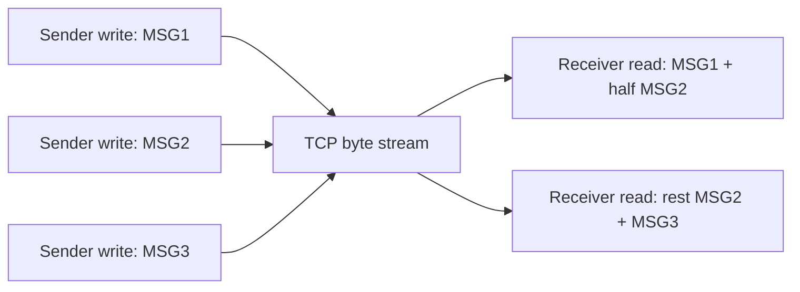
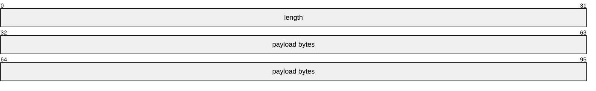
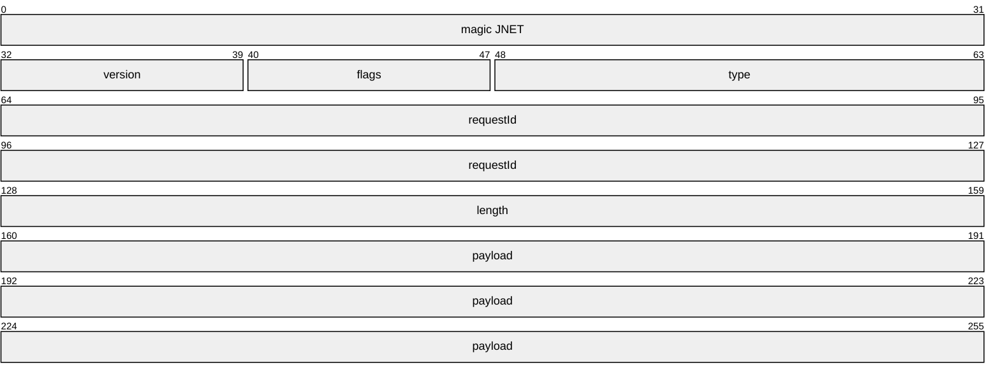
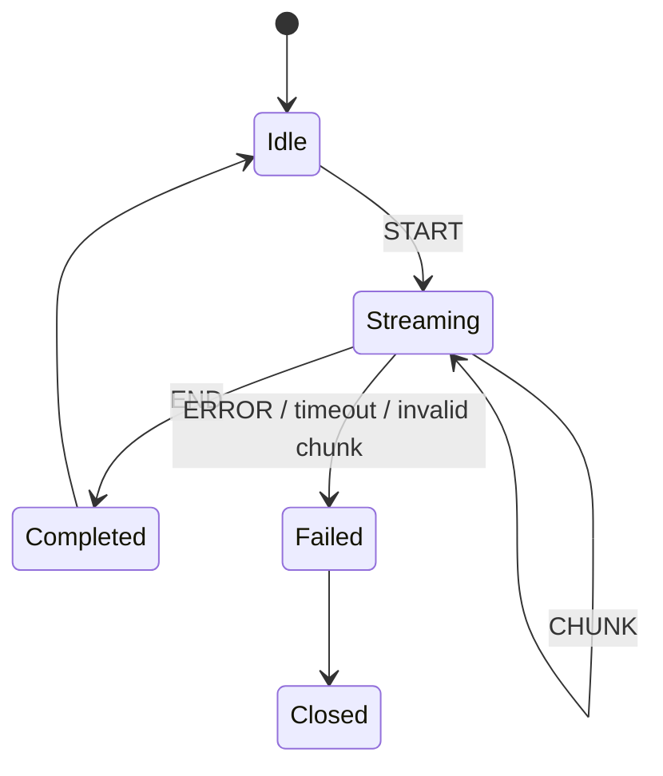
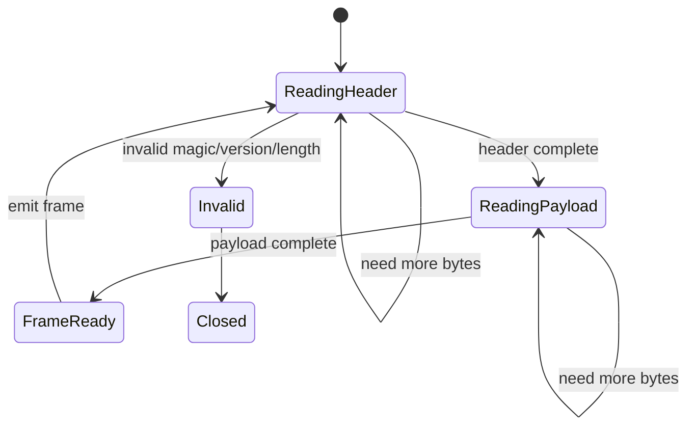
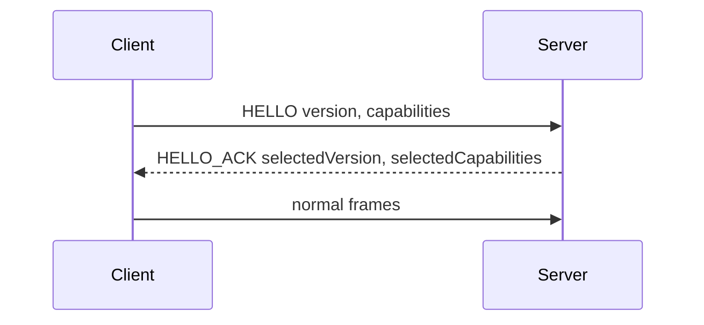
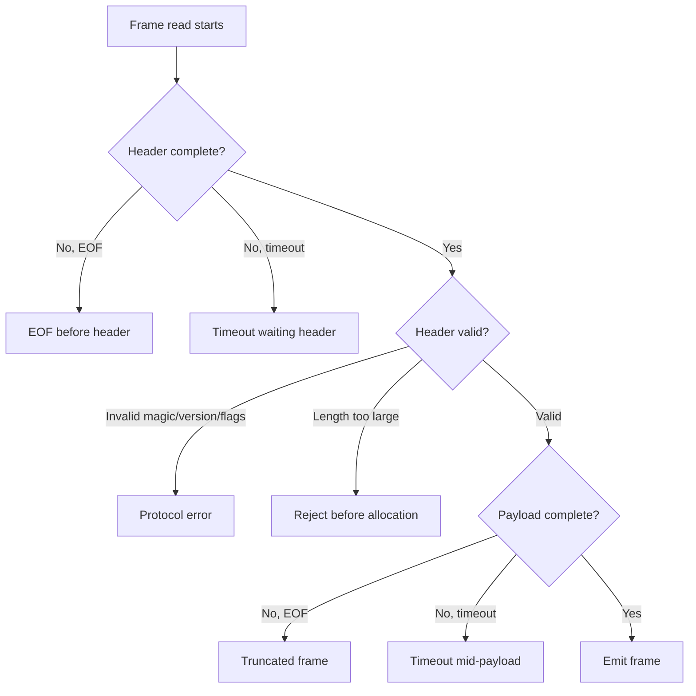

# Part 008 — Application Protocol Framing and Message Boundaries

## 1. Tujuan Part Ini

Part 005 sudah menegaskan bahwa TCP adalah reliable ordered byte stream, bukan message protocol. Part ini mengubah prinsip itu menjadi desain protocol yang benar.

Banyak bug networking bukan disebabkan oleh Java API, melainkan oleh asumsi salah seperti:

```text
one write == one read
one packet == one message
available() tells me full message size
read(buffer) fills the buffer
newline protocol is always safe
JSON object can be read by one read call
```

Semua asumsi itu salah untuk TCP.

Setelah menyelesaikan part ini, kamu harus mampu:

1. Menjelaskan mengapa TCP tidak menyediakan message boundary.
2. Mendesain framing protocol yang eksplisit.
3. Memilih antara fixed-length, delimiter, length-prefix, TLV, chunked, dan varint framing.
4. Membaca frame secara aman dari blocking `InputStream`.
5. Menulis frame secara aman ke `OutputStream`.
6. Menangani partial read, EOF mid-frame, timeout mid-frame, invalid frame, dan frame terlalu besar.
7. Membuat parser state machine untuk NIO/non-blocking di part berikutnya.
8. Menentukan max frame size, charset, byte order, versioning, dan error policy.
9. Menghindari memory bomb dan protocol desynchronization.
10. Mendesain protocol kecil yang debuggable, evolvable, dan production-safe.

Core invariant:

> If your application needs messages, your application protocol must define framing. TCP will not do it for you.

---

## 2. The Fundamental Problem: Stream vs Message

Ketika peer menulis:

```java
out.write(messageA);
out.write(messageB);
out.write(messageC);
```

Penerima bisa melihat:

```text
read #1: half of A
read #2: rest of A + B + part of C
read #3: rest of C
```

Atau:

```text
read #1: A + B + C
```

Atau:

```text
read #1: one byte
read #2: many bytes
```

TCP hanya menjamin urutan byte, bukan grouping write.

Diagram:



Aplikasi harus punya parser yang bisa menjawab:

1. Di mana message dimulai?
2. Di mana message berakhir?
3. Berapa panjang message?
4. Apa yang terjadi jika message belum lengkap?
5. Apa yang terjadi jika message invalid?
6. Apa limit maksimum?
7. Bagaimana parser recover atau menutup koneksi?

---

## 3. Gejala Salah Framing

Bug framing sering terlihat seperti bug acak.

| Gejala | Kemungkinan akar masalah |
|---|---|
| “Works on localhost, fails in production” | Localhost coalescing/timing berbeda; read kebetulan menerima full message. |
| JSON parse error sporadis | Parser menerima partial JSON atau multiple JSON sekaligus. |
| Request tertukar | Parser kehilangan boundary dan membaca byte milik message berikutnya. |
| Thread stuck di read | Menunggu delimiter/length yang tidak pernah datang. |
| Memory naik drastis | Length field tidak dibatasi atau delimiter tidak ditemukan. |
| `EOFException` mid-request | Peer close sebelum frame lengkap. |
| Latency spike | Reader menunggu more bytes karena framing ambigu. |
| Security issue | Attacker mengirim length besar, invalid encoding, atau frame yang tidak selesai. |

Production principle:

> Framing is part of your security boundary.

Parser yang tidak defensif bisa dipakai untuk memory exhaustion, CPU exhaustion, connection exhaustion, dan desynchronization attack.

---

## 4. Anti-Pattern: One Read Equals One Message

Kode salah:

```java
byte[] buffer = new byte[4096];
int n = socket.getInputStream().read(buffer);
String message = new String(buffer, 0, n, StandardCharsets.UTF_8);
handle(message);
```

Masalah:

- `read` bisa membaca partial message,
- `read` bisa membaca multiple message,
- UTF-8 character bisa terpotong di tengah,
- tidak ada max message size yang jelas,
- tidak ada handling EOF mid-frame,
- tidak ada delimiter/length validation,
- tidak ada protocol state.

Kode ini hanya aman jika protocol memang mendefinisikan bahwa semua data sampai EOF adalah satu message, seperti simple upload lalu close. Bahkan itu pun perlu size limit dan deadline.

---

## 5. Framing Strategy Taxonomy

| Strategy | Cara kerja | Cocok untuk | Risiko |
|---|---|---|---|
| Fixed-length | Semua message panjangnya sama | Binary telemetry sederhana | Boros/rigid, sulit untuk payload variabel. |
| Delimiter-based | Message berakhir dengan delimiter seperti `\n` | Text command, logs, line protocol | Escaping, max line length, charset issues. |
| Length-prefix | Header berisi panjang payload | Binary/RPC/internal protocol | Length harus divalidasi; endian/version harus jelas. |
| TLV | Type-Length-Value | Extensible binary protocol | Parser lebih kompleks. |
| Chunked | Payload dikirim sebagai potongan | Streaming data | State machine lebih kompleks. |
| Varint length-prefix | Length encoded variable size | Efisiensi untuk message kecil | Parser varint harus punya byte limit. |
| Close-delimited | EOF menandai akhir body | Simple one-shot transfer | Tidak cocok untuk keep-alive/multiple messages. |

Default yang kuat untuk internal binary protocol:

> length-prefix frame with magic, version, type, flags, length, and max-frame validation.

Default yang kuat untuk simple human-readable command protocol:

> newline-delimited UTF-8 line protocol with max line length and strict decoding.

---

## 6. Fixed-Length Frame

Fixed-length paling sederhana.

Misal setiap frame 32 bytes:

```java
static byte[] readFixedFrame(InputStream in, int frameSize) throws IOException {
    byte[] frame = in.readNBytes(frameSize);
    if (frame.length != frameSize) {
        throw new EOFException("EOF before fixed frame completed");
    }
    return frame;
}
```

Kelebihan:

- parser sangat sederhana,
- tidak perlu delimiter/length field,
- cocok untuk record kecil ukuran tetap,
- mudah diparse dengan offset.

Kekurangan:

- tidak fleksibel,
- padding boros,
- versioning sulit,
- payload variabel tidak cocok.

Use case:

- binary sensor sample fixed size,
- market data tertentu,
- embedded/control packet sederhana,
- fixed-width legacy protocol.

---

## 7. Delimiter-Based Framing

Contoh paling umum: newline-delimited protocol.

```text
PING\n
SET key value\n
GET key\n
```

### 7.1 Jangan Gunakan Unbounded `readLine()` untuk Public Input

`BufferedReader.readLine()` nyaman, tetapi line bisa sangat panjang. Jika tidak ada limit, attacker dapat mengirim data tanpa newline sampai memory membengkak.

Better: buat bounded line reader.

```java
public final class BoundedLineReader {
    private final InputStream in;
    private final int maxLineBytes;

    public BoundedLineReader(InputStream in, int maxLineBytes) {
        this.in = Objects.requireNonNull(in);
        this.maxLineBytes = maxLineBytes;
    }

    public String readUtf8Line() throws IOException {
        ByteArrayOutputStream line = new ByteArrayOutputStream();

        while (true) {
            int b = in.read();
            if (b == -1) {
                if (line.size() == 0) {
                    throw new EOFException("EOF before line");
                }
                throw new EOFException("EOF before line delimiter");
            }

            if (b == '\n') {
                byte[] bytes = line.toByteArray();
                int len = bytes.length;
                if (len > 0 && bytes[len - 1] == '\r') {
                    len--;
                }
                return new String(bytes, 0, len, StandardCharsets.UTF_8);
            }

            if (line.size() >= maxLineBytes) {
                throw new IOException("line too large: max=" + maxLineBytes);
            }

            line.write(b);
        }
    }
}
```

Catatan:

- ini sederhana, bukan parser tercepat,
- cukup untuk memahami invariant,
- production parser bisa memakai reusable byte buffer,
- tetap wajib punya `SO_TIMEOUT`/deadline.

### 7.2 Delimiter Escaping

Jika payload boleh mengandung delimiter, kamu butuh escaping atau encoding.

Misalnya CSV-like protocol:

```text
SET my-key hello\nworld\n
```

Ambigu: apakah `\n` bagian payload atau akhir message?

Solusi:

- escape delimiter,
- base64 payload,
- length-prefix payload,
- gunakan structured format dengan framing luar.

Decision rule:

> If payload can contain delimiter, delimiter alone is not enough.

---

## 8. Length-Prefix Framing

Length-prefix menulis panjang payload sebelum payload.

Format sederhana:

```text
uint32 length
byte[length] payload
```

Diagram:



### 8.1 Blocking Reader dengan `DataInputStream`

```java
public final class LengthPrefixedFrames {
    private static final int MAX_FRAME_BYTES = 1 * 1024 * 1024; // 1 MiB

    public static byte[] readFrame(InputStream raw) throws IOException {
        DataInputStream in = new DataInputStream(raw);
        int length = in.readInt();

        if (length < 0) {
            throw new IOException("negative frame length: " + length);
        }
        if (length > MAX_FRAME_BYTES) {
            throw new IOException("frame too large: " + length);
        }

        byte[] payload = new byte[length];
        in.readFully(payload);
        return payload;
    }

    public static void writeFrame(OutputStream raw, byte[] payload) throws IOException {
        if (payload.length > MAX_FRAME_BYTES) {
            throw new IOException("frame too large: " + payload.length);
        }

        DataOutputStream out = new DataOutputStream(raw);
        out.writeInt(payload.length);
        out.write(payload);
        out.flush();
    }
}
```

`DataInputStream.readFully` penting karena normal `read` tidak menjamin buffer terisi penuh.

### 8.2 Apa yang Kurang dari Format Sederhana Ini?

Format `length + payload` terlalu minimal untuk production protocol yang berevolusi.

Kekurangan:

- tidak ada magic number,
- tidak ada version,
- tidak ada message type,
- tidak ada flags,
- tidak ada checksum,
- tidak ada correlation id,
- sulit membedakan salah port/protocol,
- sulit debugging packet capture.

---

## 9. Production-Oriented Binary Frame Header

Contoh header internal sederhana:

```text
magic      4 bytes  ASCII "JNET"
version    1 byte
flags      1 byte
type       2 bytes unsigned
requestId  8 bytes signed/unsigned semantic
length     4 bytes signed int, validated as non-negative
payload    length bytes
```

Diagram:



Java representation:

```java
public record Frame(
        byte version,
        byte flags,
        short type,
        long requestId,
        byte[] payload
) {}
```

Reader:

```java
public final class BinaryFrameCodec {
    private static final int MAGIC = 0x4A4E4554; // JNET
    private static final int HEADER_BYTES = 4 + 1 + 1 + 2 + 8 + 4;
    private static final int MAX_FRAME_BYTES = 1 * 1024 * 1024;
    private static final byte SUPPORTED_VERSION = 1;

    public static Frame readFrame(InputStream raw) throws IOException {
        DataInputStream in = new DataInputStream(raw);

        int magic = in.readInt();
        if (magic != MAGIC) {
            throw new IOException("invalid magic: 0x" + Integer.toHexString(magic));
        }

        byte version = in.readByte();
        if (version != SUPPORTED_VERSION) {
            throw new IOException("unsupported version: " + version);
        }

        byte flags = in.readByte();
        short type = in.readShort();
        long requestId = in.readLong();
        int length = in.readInt();

        if (length < 0) {
            throw new IOException("negative frame length: " + length);
        }
        if (length > MAX_FRAME_BYTES) {
            throw new IOException("frame too large: " + length);
        }

        byte[] payload = new byte[length];
        in.readFully(payload);

        return new Frame(version, flags, type, requestId, payload);
    }

    public static void writeFrame(OutputStream raw, Frame frame) throws IOException {
        if (frame.payload().length > MAX_FRAME_BYTES) {
            throw new IOException("frame too large: " + frame.payload().length);
        }

        DataOutputStream out = new DataOutputStream(raw);
        out.writeInt(MAGIC);
        out.writeByte(frame.version());
        out.writeByte(frame.flags());
        out.writeShort(frame.type());
        out.writeLong(frame.requestId());
        out.writeInt(frame.payload().length);
        out.write(frame.payload());
        out.flush();
    }
}
```

Important invariant:

> Validate header before allocating payload memory.

Jangan lakukan:

```java
int length = in.readInt();
byte[] payload = new byte[length]; // dangerous before validation
```

---

## 10. Endianness and Numeric Encoding

Network protocols harus menentukan byte order.

`DataInputStream` / `DataOutputStream` menggunakan big-endian untuk primitive multi-byte. Big-endian sering disebut network byte order.

Dengan `ByteBuffer`, byte order bisa eksplisit:

```java
ByteBuffer buffer = ByteBuffer.allocate(4).order(ByteOrder.BIG_ENDIAN);
buffer.putInt(123);
```

Rule:

> Never leave byte order as an implicit tribal assumption in protocol documentation.

Dokumentasikan:

```text
All multi-byte integer fields are encoded in big-endian order.
```

---

## 11. Varint Length Prefix

Varint menyimpan integer kecil dengan byte lebih sedikit. Banyak protocol modern memakai varint untuk length atau field id.

Namun parser varint harus punya batas jumlah byte.

Bad parser:

```java
while (true) {
    int b = in.read();
    // no max byte count: attacker can stream continuation bytes forever
}
```

Safer conceptual parser for unsigned 32-bit varint:

```java
static int readVarInt32(InputStream in) throws IOException {
    int result = 0;
    for (int shift = 0; shift < 32; shift += 7) {
        int b = in.read();
        if (b == -1) {
            throw new EOFException("EOF while reading varint");
        }
        result |= (b & 0x7F) << shift;
        if ((b & 0x80) == 0) {
            return result;
        }
    }
    throw new IOException("varint too long");
}
```

Varint trade-off:

| Pros | Cons |
|---|---|
| Compact for small messages | More complex parser. |
| Useful for binary extensible protocol | Harder to inspect manually. |
| Common in schema-based formats | Must limit continuation bytes. |

Jika belum butuh, fixed 4-byte length lebih sederhana.

---

## 12. TLV: Type-Length-Value

TLV format:

```text
type   length   value
type   length   value
type   length   value
```

Cocok untuk extensibility karena parser bisa skip unknown type jika length diketahui.

Contoh:

```text
1  8   requestId
2  4   timeoutMillis
3  12  UTF-8 route name
```

Rule:

> TLV enables forward compatibility only if unknown fields can be skipped safely and length is validated.

Failure mode:

- duplicate field,
- unknown critical field,
- length mismatch,
- nested TLV recursion terlalu dalam,
- value type tidak sesuai,
- canonical encoding tidak ditegakkan.

Policy harus jelas:

| Condition | Possible policy |
|---|---|
| Unknown non-critical type | Skip. |
| Unknown critical type | Reject frame. |
| Duplicate singleton field | Reject or last-wins, but document. |
| Required field missing | Reject. |
| Length exceeds max | Reject and close. |

---

## 13. Chunked Framing for Streaming

Untuk payload besar atau streaming, satu frame besar bisa buruk.

Chunked protocol:

```text
START streamId metadata
CHUNK streamId length payload
CHUNK streamId length payload
END streamId checksum
```

State machine:



Kelebihan:

- memory bounded,
- progress observable,
- bisa backpressure per chunk,
- bisa resume jika protocol mendukung,
- cocok untuk large transfer.

Risiko:

- state machine lebih kompleks,
- stream id lifecycle harus jelas,
- interleaving stream butuh flow control,
- timeout per stream vs per connection harus jelas,
- checksum/integrity policy perlu dipikirkan.

---

## 14. Close-Delimited Framing

Close-delimited berarti akhir message ditandai oleh EOF.

```text
client connects
client sends bytes
client closes output
server reads until EOF
server processes one message
server responds or closes
```

Ini cocok untuk protocol one-shot sederhana.

Contoh:

```java
ByteArrayOutputStream body = new ByteArrayOutputStream();
byte[] buffer = new byte[8192];
int n;
while ((n = in.read(buffer)) != -1) {
    body.write(buffer, 0, n);
    if (body.size() > MAX_BYTES) {
        throw new IOException("body too large");
    }
}
```

Kekurangan:

- tidak cocok untuk connection reuse,
- tidak cocok untuk multiple request/response,
- peer harus close/half-close untuk menandai selesai,
- sulit membedakan slow sender vs body belum selesai tanpa timeout/deadline.

Production rule:

> Close-delimited framing is simple but prevents efficient persistent connections.

---

## 15. Charset and Text Protocols

Jika protocol text, charset harus eksplisit.

Good:

```text
All textual fields are UTF-8 encoded. Invalid UTF-8 is a protocol error.
```

Bad:

```java
new String(bytes); // uses platform default charset
```

Good:

```java
new String(bytes, StandardCharsets.UTF_8);
```

### 15.1 UTF-8 Character Boundary

Jika membaca arbitrary chunks, jangan decode setiap chunk sembarangan untuk text stream karena multi-byte character bisa terpotong.

Untuk line protocol, decode setelah delimiter ditemukan pada byte stream.

Untuk streaming text, gunakan `CharsetDecoder` yang bisa menangani partial input.

Simpler rule:

> Frame bytes first, decode text second.

---

## 16. Partial Writes

Pada blocking `OutputStream.write(byte[])`, method biasanya mencoba menulis semua byte atau throw exception. Namun tetap bisa block.

Pada NIO non-blocking, write bisa menulis sebagian.

Walaupun part NIO dibahas nanti, protocol design harus siap dengan partial write.

Frame writer harus punya konsep:

```text
pending outbound frame
current write offset
remaining bytes
flush readiness
backpressure policy
```

Untuk blocking stream, minimal tulis frame lengkap dalam satu method agar caller tidak interleave message.

Bad:

```java
out.writeInt(length); // imaginary on raw OutputStream
// another thread writes something here
out.write(payload);
```

Good:

```java
synchronized (connectionWriteLock) {
    BinaryFrameCodec.writeFrame(out, frame);
}
```

Better architecture:

- satu writer thread per connection,
- outbound queue bounded,
- no concurrent writes to same socket,
- frame serialized atomically by connection writer.

Core invariant:

> Concurrent writes to the same stream must be serialized at the protocol-frame level.

---

## 17. Parser State Machine

Blocking reader bisa terlihat linear. Non-blocking reader harus stateful.

Namun mental model state machine tetap berguna untuk keduanya.

Length-prefix parser:



State variables:

```text
state
headerBuffer
payloadBuffer
expectedPayloadLength
bytesRead
currentFrameMetadata
```

Even with blocking I/O, thinking this way prevents wrong assumptions.

---

## 18. Defensive Parsing Rules

A production parser must reject bad input early and cheaply.

Checklist:

- [ ] Magic number validated before deeper parsing.
- [ ] Version validated.
- [ ] Header length fixed or bounded.
- [ ] Payload length non-negative.
- [ ] Payload length <= configured max.
- [ ] Compression length checked after decompression too.
- [ ] Unknown flags rejected unless explicitly allowed.
- [ ] Reserved bits must be zero.
- [ ] Message type known or safely skippable.
- [ ] EOF mid-header is distinct from EOF mid-payload.
- [ ] Timeout mid-frame closes or resets protocol state.
- [ ] Parser never allocates unbounded memory from remote-controlled length.
- [ ] Parser never recurses unboundedly on nested structures.
- [ ] Parser exposes close reason.

---

## 19. Error Policy

When parser sees invalid input, what should happen?

| Error | Recommended policy |
|---|---|
| Invalid magic | Close connection; likely wrong protocol or attack. |
| Unsupported version | Send error if protocol supports it, then close. |
| Unknown non-critical type | Skip or reject depending protocol. |
| Frame too large | Send error if safe, close connection. |
| Negative length | Close immediately. |
| EOF before complete frame | Treat as truncated frame; close. |
| Timeout mid-frame | Close or mark connection unhealthy. |
| Invalid UTF-8 | Reject frame. |
| Unknown flag/reserved bit set | Reject unless negotiated. |

Do not continue parsing after desynchronization unless protocol has explicit resync mechanism.

Rule:

> For most internal protocols, invalid framing is connection-fatal.

---

## 20. Correlation ID and Multiplexing

Jika connection hanya memproses satu request at a time, correlation id tidak wajib.

Jika ingin pipelining atau multiplexing, wajib ada request id.

```text
requestId in header
response carries same requestId
client maps response to pending request
```

State:

```java
Map<Long, CompletableFuture<Response>> pending = new ConcurrentHashMap<>();
```

Risiko:

- response untuk unknown request id,
- duplicate response,
- request id reuse terlalu cepat,
- pending map leak jika timeout tidak cleanup,
- out-of-order response tidak ditangani,
- flow control per stream tidak ada.

HTTP/2, gRPC, database protocols, dan messaging systems punya desain kompleks di area ini. Untuk raw protocol, jangan menambah multiplexing tanpa alasan kuat.

Production rule:

> Multiplexing is not just adding requestId. It introduces flow control, fairness, cancellation, timeout, and memory isolation problems.

---

## 21. Compression and Encryption Boundary

Jika payload dikompresi, framing harus jelas apakah length adalah:

- compressed length,
- uncompressed length,
- keduanya,
- chunk length.

Risiko:

- compression bomb,
- memory allocation berdasarkan uncompressed length palsu,
- checksum sebelum/sesudah compression tidak jelas,
- error recovery sulit.

Minimal policy:

```text
max compressed bytes per frame
max uncompressed bytes per frame
allowed compression algorithms
compression flag negotiated
reserved flags rejected
```

Encryption/TLS biasanya berada di bawah application framing. Tetapi jika membuat app-level encryption, tentukan:

- nonce position,
- auth tag length,
- encrypted fields,
- authenticated header fields,
- replay policy.

Detail crypto tidak dibahas di sini karena sudah ada seri security. Yang penting untuk networking:

> Security transforms do not remove framing requirements. They usually make framing stricter.

---

## 22. Protocol Evolution

Protocol yang production harus bisa berubah.

Header minimal untuk evolusi:

- magic,
- version,
- flags,
- type,
- length.

Versioning strategies:

| Strategy | Description | Trade-off |
|---|---|---|
| Single version byte | Simple reject unsupported version | Mudah, tapi upgrade besar bisa disruptive. |
| Feature flags | Negotiate capabilities | Lebih fleksibel, lebih kompleks. |
| Type-specific evolution | Message type punya schema version | Cocok jika banyak message. |
| TLV optional fields | Unknown fields bisa diskip | Harus punya critical/non-critical policy. |

Handshake sederhana:



Rule:

> Add negotiation only when needed. But reserve header space for evolution early.

---

## 23. Java Implementation: Small Request/Response Protocol

Contoh minimal memakai frame binary dari atas.

Message types:

```java
public final class MessageTypes {
    public static final short PING = 1;
    public static final short PONG = 2;
    public static final short ERROR = 3;
}
```

Client:

```java
public final class PingClient {
    public String ping(InetSocketAddress address, String text) throws IOException {
        try (Socket socket = new Socket()) {
            socket.connect(address, 2_000);
            socket.setSoTimeout(3_000);
            socket.setTcpNoDelay(true);

            byte[] payload = text.getBytes(StandardCharsets.UTF_8);
            Frame request = new Frame((byte) 1, (byte) 0, MessageTypes.PING, 1L, payload);
            BinaryFrameCodec.writeFrame(socket.getOutputStream(), request);

            Frame response = BinaryFrameCodec.readFrame(socket.getInputStream());
            if (response.type() != MessageTypes.PONG) {
                throw new IOException("unexpected response type: " + response.type());
            }
            return new String(response.payload(), StandardCharsets.UTF_8);
        }
    }
}
```

Server handler:

```java
public final class PingHandler {
    public void handle(Socket socket) throws IOException {
        socket.setSoTimeout(5_000);
        socket.setTcpNoDelay(true);

        Frame request = BinaryFrameCodec.readFrame(socket.getInputStream());
        if (request.type() != MessageTypes.PING) {
            Frame error = new Frame(
                    (byte) 1,
                    (byte) 0,
                    MessageTypes.ERROR,
                    request.requestId(),
                    "unsupported message".getBytes(StandardCharsets.UTF_8)
            );
            BinaryFrameCodec.writeFrame(socket.getOutputStream(), error);
            return;
        }

        String text = new String(request.payload(), StandardCharsets.UTF_8);
        String reply = "pong: " + text;
        Frame response = new Frame(
                (byte) 1,
                (byte) 0,
                MessageTypes.PONG,
                request.requestId(),
                reply.getBytes(StandardCharsets.UTF_8)
        );
        BinaryFrameCodec.writeFrame(socket.getOutputStream(), response);
    }
}
```

Ini masih sederhana, tetapi sudah punya:

- magic,
- version,
- type,
- request id,
- length,
- max frame size,
- explicit UTF-8,
- timeout,
- no one-read-one-message assumption.

---

## 24. Testing Framing Correctness

Jangan hanya test happy path.

### 24.1 Partial Header

Input hanya 2 byte dari header. Expected:

- blocking parser eventually EOF/timeout,
- NIO parser remains `ReadingHeader`,
- tidak allocate payload.

### 24.2 Invalid Magic

Input magic salah. Expected:

- reject immediately,
- close connection,
- close reason `INVALID_MAGIC`.

### 24.3 Negative Length

Input length `-1`. Expected:

- reject before allocation.

### 24.4 Huge Length

Input length `Integer.MAX_VALUE`. Expected:

- reject before allocation,
- metric frame too large,
- no OOM.

### 24.5 Split Payload

Kirim payload dalam potongan kecil random. Expected:

- parser tetap menghasilkan satu frame utuh.

### 24.6 Coalesced Frames

Kirim dua frame dalam satu write. Expected:

- parser menghasilkan dua frame,
- tidak mencampur payload.

### 24.7 EOF Mid-Payload

Header length 100, payload hanya 20 byte lalu close. Expected:

- `EOFException` or protocol exception,
- close reason `TRUNCATED_FRAME`.

### 24.8 Slowloris Frame

Kirim satu byte tiap beberapa detik. Expected:

- idle timeout atau deadline menghentikan koneksi,
- server tidak mempertahankan unlimited connection.

---

## 25. Mermaid: Failure Taxonomy



---

## 26. Design Checklist for a New Protocol

Before implementing a raw TCP protocol, answer these:

1. Is this truly needed instead of HTTP/WebSocket/gRPC/database protocol?
2. Is the connection one-shot or persistent?
3. Can multiple messages exist on one connection?
4. Can responses arrive out of order?
5. What framing strategy is used?
6. What is max frame size?
7. What is max connection lifetime?
8. What is idle timeout?
9. What is request deadline?
10. What charset is used for text?
11. What byte order is used for integers?
12. Is there a magic number?
13. Is there a version?
14. Are there reserved flags?
15. What happens to unknown message type?
16. What happens to invalid frame?
17. Can the parser resync or must it close?
18. Are writes serialized?
19. Is there backpressure on outbound frames?
20. Are close reasons observable?
21. Is there a fuzz/invalid-input test suite?
22. Can large payload be streamed/chunked?
23. Is compression allowed?
24. Are compressed and uncompressed limits separate?
25. Is authentication/session state part of protocol or outer layer?

---

## 27. Common Production Recommendations

### 27.1 Prefer Existing Protocols Unless You Need Raw TCP

Raw protocol design is expensive. Prefer mature protocol layers when possible.

But if you build raw TCP because of latency, legacy integration, binary device protocol, gatewaying, or specialized transport, then framing must be treated as first-class architecture.

### 27.2 Use Length-Prefix for Binary Internal Protocol

A good baseline:

```text
magic + version + flags + type + requestId + length + payload
```

### 27.3 Use Line Protocol Only for Simple Commands

Line protocol is good when:

- human-readable debugging matters,
- command size small,
- delimiter escaping is simple,
- max line length is enforced.

### 27.4 Never Trust Remote Length

Remote-controlled length must be validated before allocation.

### 27.5 Separate Transport Timeout from Protocol Deadline

Socket timeout prevents idle read. Protocol deadline bounds operation.

### 27.6 Treat Invalid Framing as Fatal

Unless protocol has explicit recovery, close connection after invalid framing.

### 27.7 Make Parser Metrics Explicit

Measure:

- invalid magic,
- unsupported version,
- frame too large,
- EOF mid-frame,
- timeout mid-frame,
- unknown type,
- decode error,
- average frame size,
- max frame size seen,
- frames per connection.

---

## 28. Baeldung-Style Minimal Example: Length-Prefix Echo

Server handler:

```java
public final class EchoProtocol {
    public void handle(Socket socket) throws IOException {
        socket.setSoTimeout(5_000);
        while (!socket.isClosed()) {
            Frame frame;
            try {
                frame = BinaryFrameCodec.readFrame(socket.getInputStream());
            } catch (EOFException eof) {
                return;
            }

            Frame response = new Frame(
                    frame.version(),
                    (byte) 0,
                    frame.type(),
                    frame.requestId(),
                    frame.payload()
            );
            BinaryFrameCodec.writeFrame(socket.getOutputStream(), response);
        }
    }
}
```

Client:

```java
try (Socket socket = new Socket()) {
    socket.connect(new InetSocketAddress("127.0.0.1", 9090), 1_000);
    socket.setSoTimeout(2_000);
    socket.setTcpNoDelay(true);

    Frame request = new Frame(
            (byte) 1,
            (byte) 0,
            (short) 10,
            42L,
            "hello".getBytes(StandardCharsets.UTF_8)
    );

    BinaryFrameCodec.writeFrame(socket.getOutputStream(), request);
    Frame response = BinaryFrameCodec.readFrame(socket.getInputStream());

    System.out.println(new String(response.payload(), StandardCharsets.UTF_8));
}
```

Yang sengaja belum dibahas:

- non-blocking parser,
- write queue,
- connection multiplexing production,
- TLS wrapping,
- HTTP/2 flow control,
- backpressure detail.

Itu masuk part berikutnya.

---

## 29. Deliberate Practice

### Drill 1 — Break One-Read Assumption

Buat client mengirim message 100 byte dalam 100 write satu byte. Server naive yang menganggap satu read satu message harus gagal. Lalu ganti dengan length-prefix parser.

### Drill 2 — Coalesced Frames

Client menulis dua frame tanpa delay. Parser harus menghasilkan dua message, bukan satu payload gabungan.

### Drill 3 — Frame Too Large

Kirim header dengan length 100 MB sementara max 1 MB. Server harus reject sebelum allocation.

### Drill 4 — EOF Mid-Frame

Kirim header length 1000, payload 10 byte, lalu close. Parser harus menghasilkan truncated-frame error.

### Drill 5 — Slowloris

Kirim header satu byte tiap 10 detik. Server harus menghentikan connection berdasarkan timeout/deadline.

### Drill 6 — Invalid UTF-8

Untuk text payload, kirim byte invalid UTF-8. Parser harus reject jika protocol mensyaratkan UTF-8 valid.

### Drill 7 — Reserved Flag

Set reserved flag bit. Parser harus reject kecuali capability negotiation mengizinkan.

---

## 30. Ringkasan

TCP tidak punya message boundary. Semua protocol yang berjalan di atas TCP harus mendefinisikan framing sendiri.

Core invariants:

- `write()` boundary tidak terlihat oleh peer sebagai message boundary.
- `read()` bisa menerima partial, full, atau multiple message.
- Framing harus eksplisit.
- Length harus divalidasi sebelum allocation.
- Text harus punya charset eksplisit.
- Delimiter protocol harus punya max length.
- Invalid frame biasanya connection-fatal.
- Parser adalah security boundary.
- Concurrent writes harus diserialisasi pada frame boundary.
- Timeout idle tidak sama dengan deadline total.
- Protocol evolution butuh version/flags/type policy.

Part berikutnya membahas UDP: datagram, packet loss, reorder, MTU, fragmentation, multicast, dan kapan UDP masuk akal di Java.

---

## 31. Referensi Resmi

- Oracle Java SE 25 API — `java.io.InputStream`
- Oracle Java SE 25 API — `java.io.DataInputStream`
- Oracle Java SE 25 API — `java.io.DataOutputStream`
- Oracle Java SE 25 API — `java.net.Socket`
