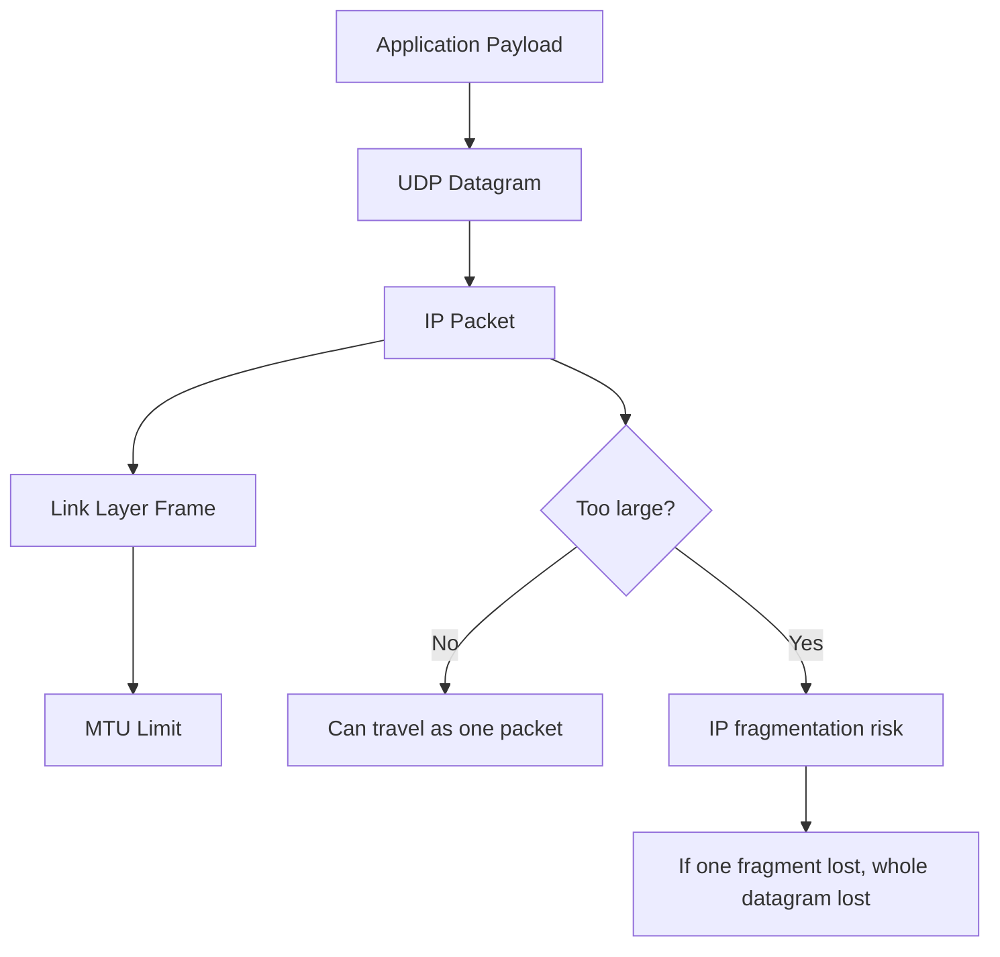
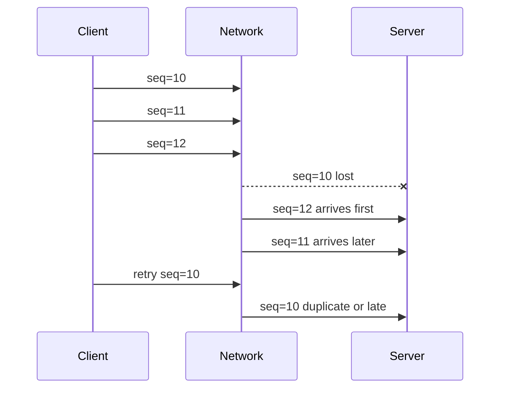
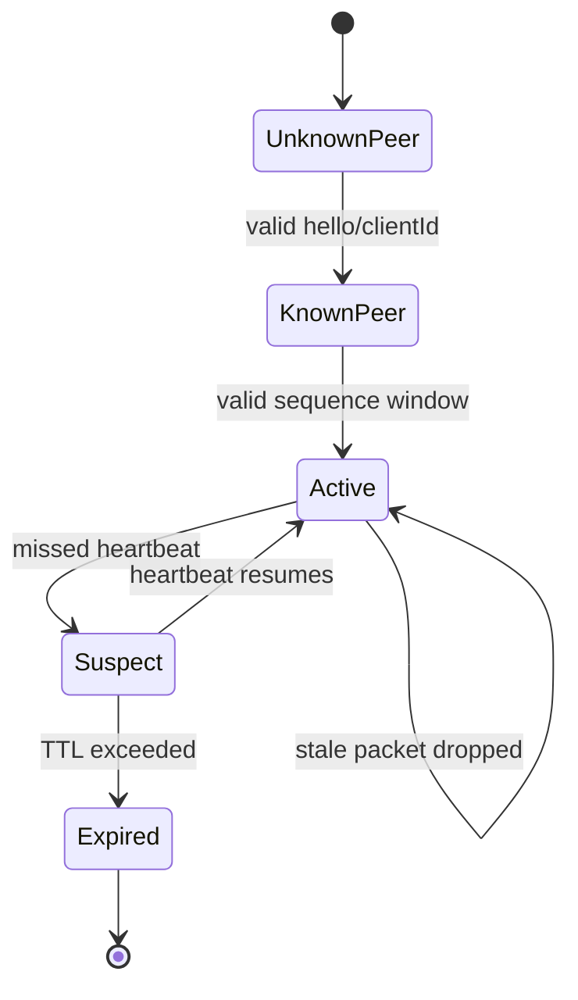
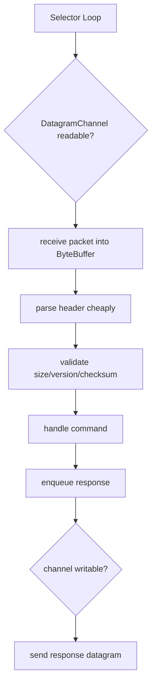
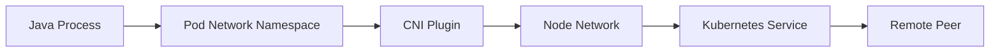

# Part 009 — UDP, Datagrams, Packet Loss, and Multicast

> Target utama bagian ini: kamu tidak hanya tahu cara memakai `DatagramSocket`, tetapi memahami kapan UDP adalah pilihan arsitektural yang benar, kapan berbahaya, dan invariant apa yang harus dijaga agar aplikasi tidak diam-diam korup di production.

UDP bukan versi “TCP yang lebih cepat”. UDP adalah primitive berbeda: **packet-oriented, connectionless, unreliable, unordered, message-preserving at API boundary, tetapi not delivery-preserving**.

Dalam TCP, kamu membangun framing karena stream tidak punya message boundary. Dalam UDP, message boundary ada, tetapi delivery-nya tidak dijamin. Jadi trade-off-nya bergeser:

- TCP: reliable stream, but no message boundary.
- UDP: message boundary, but no reliability/order/backpressure end-to-end.

Itu alasan bagian ini ditempatkan setelah TCP dan framing.

---

## 1. Kaufman Deconstruction

Skill “Java UDP networking” dipecah menjadi 8 sub-skill:

| Sub-skill | Pertanyaan yang harus bisa kamu jawab |
|---|---|
| Datagram semantics | Apa yang dijamin oleh UDP, dan apa yang sama sekali tidak dijamin? |
| Java UDP API | Kapan memakai `DatagramSocket`, `DatagramChannel`, atau `MulticastSocket`? |
| Packet sizing | Bagaimana MTU, fragmentation, dan buffer size bisa menjatuhkan sistem? |
| Loss/reorder/duplicate handling | Bagaimana protokol aplikasi tetap benar saat packet hilang, datang ulang, atau datang tidak berurutan? |
| Idempotency | Bagaimana receiver aman memproses datagram yang mungkin dikirim ulang? |
| Timing | Bagaimana timeout, heartbeat, sequence number, dan stale packet dikelola? |
| Multicast/broadcast | Kapan one-to-many packet distribution masuk akal, dan apa batasannya? |
| Operability | Bagaimana debug UDP ketika tidak ada connection state yang eksplisit? |

Deliberate practice-nya sederhana: buat protokol UDP kecil, lalu rusak dengan packet loss, reorder, duplicate, oversized packet, dan restart receiver.

---

## 2. UDP Mental Model

UDP mengirim **datagram**. Setiap datagram punya payload sendiri dan alamat tujuan sendiri.

```mermaid
flowchart LR
    AppA[Sender Application] -->|send datagram| KernelA[Sender Kernel]
    KernelA -->|IP packet(s)| Network[Network]
    Network -->|maybe delivered, dropped, reordered, duplicated| KernelB[Receiver Kernel]
    KernelB -->|receive datagram| AppB[Receiver Application]
```

Invariant utama:

> UDP preserves packet boundary when delivered, but does not promise that the packet will be delivered.

Konsekuensi:

- Satu `send()` kira-kira menjadi satu datagram.
- Satu `receive()` menerima satu datagram.
- Jika buffer receiver lebih kecil dari datagram, payload bisa terpotong.
- Packet bisa hilang tanpa exception di sender.
- Packet bisa datang lebih lambat dari packet yang dikirim setelahnya.
- Packet bisa datang lagi karena retry aplikasi atau perilaku jaringan tertentu.
- Tidak ada built-in congestion control seperti TCP.

UDP cocok saat aplikasi bisa menerima loss, atau saat aplikasi membangun reliability sendiri secara eksplisit.

---

## 3. UDP vs TCP: Jangan Salah Membandingkan

| Dimensi | TCP | UDP |
|---|---|---|
| Model data | Byte stream | Datagram/message |
| Connection | Connection-oriented | Connectionless, walau Java bisa `connect()` UDP socket untuk filter peer |
| Delivery | Reliable by protocol | Best effort |
| Ordering | Ordered | Not guaranteed |
| Duplicate handling | Hidden by TCP | Application responsibility |
| Flow control | Built-in | Application responsibility |
| Congestion control | Built-in | Application responsibility |
| Message boundary | Tidak ada | Ada per datagram |
| Failure visibility | Connection errors lebih eksplisit | Banyak failure silent |
| Use case umum | HTTP, DB, SSH, RPC reliable | DNS, telemetry, discovery, real-time media, gaming, custom low-latency protocols |

Kesalahan paling umum adalah memakai UDP untuk “lebih cepat” tanpa mendesain ulang correctness model.

Correct framing:

> UDP is not a performance optimization. UDP is a protocol-design commitment.

---

## 4. Java UDP API Landscape

Java menyediakan beberapa API utama:

| API | Model | Cocok untuk |
|---|---|---|
| `DatagramSocket` | Blocking packet socket | Client/server UDP sederhana, tooling, prototyping |
| `DatagramPacket` | Packet container | Alamat + payload + length |
| `DatagramChannel` | NIO channel untuk UDP | Non-blocking UDP, selector integration, direct buffer |
| `MulticastSocket` | Convenience API untuk multicast | Join group, receive multicast packets |
| `DatagramChannel` + `MulticastChannel` | NIO multicast | Multicast modern dengan channel dan network interface control |

`DatagramSocket` bagus untuk memahami semantics. `DatagramChannel` lebih cocok saat kamu butuh multiplexing, buffer management eksplisit, atau integrasi event loop.

---

## 5. Minimal UDP Echo dengan `DatagramSocket`

### Server

```java
import java.net.DatagramPacket;
import java.net.DatagramSocket;
import java.nio.charset.StandardCharsets;

public final class UdpEchoServer {
    public static void main(String[] args) throws Exception {
        int port = 9999;

        try (DatagramSocket socket = new DatagramSocket(port)) {
            byte[] buffer = new byte[2048];

            while (true) {
                DatagramPacket request = new DatagramPacket(buffer, buffer.length);
                socket.receive(request);

                String text = new String(
                        request.getData(),
                        request.getOffset(),
                        request.getLength(),
                        StandardCharsets.UTF_8
                );

                System.out.printf("from=%s:%d length=%d text=%s%n",
                        request.getAddress().getHostAddress(),
                        request.getPort(),
                        request.getLength(),
                        text);

                byte[] responseBytes = ("echo: " + text).getBytes(StandardCharsets.UTF_8);
                DatagramPacket response = new DatagramPacket(
                        responseBytes,
                        responseBytes.length,
                        request.getAddress(),
                        request.getPort()
                );
                socket.send(response);
            }
        }
    }
}
```

### Client

```java
import java.net.DatagramPacket;
import java.net.DatagramSocket;
import java.net.InetAddress;
import java.nio.charset.StandardCharsets;

public final class UdpEchoClient {
    public static void main(String[] args) throws Exception {
        InetAddress host = InetAddress.getByName("127.0.0.1");
        int port = 9999;

        try (DatagramSocket socket = new DatagramSocket()) {
            socket.setSoTimeout(1_000);

            byte[] payload = "hello udp".getBytes(StandardCharsets.UTF_8);
            DatagramPacket request = new DatagramPacket(payload, payload.length, host, port);
            socket.send(request);

            byte[] buffer = new byte[2048];
            DatagramPacket response = new DatagramPacket(buffer, buffer.length);
            socket.receive(response);

            String text = new String(
                    response.getData(),
                    response.getOffset(),
                    response.getLength(),
                    StandardCharsets.UTF_8
            );

            System.out.println(text);
        }
    }
}
```

Hal yang terlihat sederhana tetapi penting:

- Server memakai satu reusable buffer, tetapi langsung memproses sebelum `receive()` berikutnya.
- `getLength()` wajib dipakai; jangan decode seluruh array.
- Client memakai `SO_TIMEOUT`; tanpa timeout, `receive()` bisa menunggu selamanya.
- Sender tidak tahu apakah server menerima packet.

---

## 6. DatagramPacket: Offset, Length, dan Reuse Trap

`DatagramPacket` menyimpan:

- byte array,
- offset,
- length,
- source/destination address,
- source/destination port.

Bug umum:

```java
String wrong = new String(packet.getData(), StandardCharsets.UTF_8);
```

Ini salah karena array mungkin lebih besar dari payload aktual.

Yang benar:

```java
String correct = new String(
        packet.getData(),
        packet.getOffset(),
        packet.getLength(),
        StandardCharsets.UTF_8
);
```

Saat reuse `DatagramPacket`, hati-hati: setelah receive, length dapat berubah menjadi ukuran payload yang diterima. Untuk loop berikutnya, pastikan length diset kembali jika API usage-mu mengubah expectation.

Pola aman:

```java
byte[] buffer = new byte[2048];
while (running) {
    DatagramPacket packet = new DatagramPacket(buffer, buffer.length);
    socket.receive(packet);
    handle(packet);
}
```

Pola ini membuat packet object baru per receive, tetapi menghindari reuse-state bug. Untuk high-throughput path, kamu boleh reuse object, tetapi harus disiplin mengelola length.

---

## 7. Packet Size, MTU, dan Fragmentation

UDP bukan berarti payload bisa sebesar apa pun secara aman.

Mental model:



Prinsip production:

> Keep UDP payload small unless you fully control the network path and have tested the MTU behavior.

Rule of thumb engineering:

- Untuk internet umum, hindari datagram besar.
- Untuk LAN/internal DC, tetap validasi MTU aktual.
- Untuk discovery/heartbeat/telemetry kecil, UDP masuk akal.
- Untuk payload besar, TCP/HTTP streaming biasanya lebih benar.

Masalah fragmentation:

- Fragmentation meningkatkan probability loss.
- Banyak firewall/NAT memperlakukan fragment secara buruk.
- Receiver baru menerima datagram setelah semua fragment berhasil direassembly.
- Fragment loss tampak sebagai datagram loss total.

Design rule:

```text
If your UDP message can exceed safe MTU, your protocol needs fragmentation/reassembly at application layer or should not use UDP.
```

---

## 8. Receiver Buffer dan Silent Truncation

Jika datagram lebih besar dari buffer receive, aplikasi bisa kehilangan bagian payload.

Contoh rawan:

```java
byte[] buffer = new byte[512];
DatagramPacket packet = new DatagramPacket(buffer, buffer.length);
socket.receive(packet);
```

Jika sender mengirim 1500 byte, receiver tidak otomatis memanggil `receive()` kedua untuk “sisa data”. UDP bukan stream. Sisa payload datagram tidak tersedia sebagai message lanjutan.

Defensive protocol design:

- Tetapkan `MAX_DATAGRAM_SIZE` eksplisit.
- Include `version`, `messageType`, `sequence`, `payloadLength`, dan optional `checksum`.
- Reject packet yang tidak sesuai ukuran.
- Monitor count packet oversize/truncated jika bisa dideteksi dari header protocol.

Contoh header minimal:

```text
0               1               2               3
+---------------+---------------+---------------+---------------+
| version (1)   | type (1)      | flags (1)     | headerLen (1) |
+---------------+---------------+---------------+---------------+
| sequence number (8 bytes)                                     |
+---------------------------------------------------------------+
| payload length (4 bytes)                                      |
+---------------------------------------------------------------+
| payload ...                                                   |
+---------------------------------------------------------------+
```

---

## 9. Connected UDP Socket

UDP disebut connectionless, tetapi Java `DatagramSocket` dan `DatagramChannel` dapat di-`connect()` ke remote address.

Ini bukan TCP handshake. Connected UDP berarti socket dikaitkan dengan peer default.

Manfaat:

- `send()` tidak perlu menyertakan address setiap kali.
- Incoming packet dari address lain dapat difilter.
- Beberapa OS dapat melaporkan ICMP error tertentu ke socket.
- API lebih sederhana untuk client yang hanya bicara ke satu peer.

Contoh:

```java
import java.net.DatagramPacket;
import java.net.DatagramSocket;
import java.net.InetSocketAddress;
import java.nio.charset.StandardCharsets;

public final class ConnectedUdpClient {
    public static void main(String[] args) throws Exception {
        try (DatagramSocket socket = new DatagramSocket()) {
            socket.connect(new InetSocketAddress("127.0.0.1", 9999));
            socket.setSoTimeout(1_000);

            byte[] bytes = "ping".getBytes(StandardCharsets.UTF_8);
            socket.send(new DatagramPacket(bytes, bytes.length));

            byte[] buffer = new byte[1024];
            DatagramPacket response = new DatagramPacket(buffer, buffer.length);
            socket.receive(response);
        }
    }
}
```

Jangan salah paham: connected UDP tetap tidak menjamin delivery.

---

## 10. Loss, Duplicate, Reorder: Protocol-Level Correctness

UDP protocol aplikasi harus eksplisit terhadap tiga hal:



Aplikasi harus punya jawaban untuk:

- Apakah `seq=12` boleh diproses sebelum `seq=11`?
- Apakah `seq=10` yang terlambat masih valid?
- Apakah duplicate `seq=10` harus diabaikan?
- Apakah message punya expiry?
- Apakah receiver perlu ACK?
- Apakah sender retry? Berapa kali? Dengan backoff?

Pattern umum:

| Pattern | Fungsi |
|---|---|
| Sequence number | Deteksi reorder/loss/duplicate |
| Request ID | Deduplication dan idempotency |
| Timestamp/expiry | Drop stale datagram |
| ACK/NACK | Reliability ringan |
| Sliding window | Throughput lebih tinggi dengan kontrol urutan |
| Application checksum | Validasi payload selain checksum UDP |
| Versioned header | Evolusi protocol |

---

## 11. Idempotency di UDP

Karena sender mungkin retry, receiver harus aman terhadap duplicate.

Buruk:

```text
packet: debitAccount(account=123, amount=100)
```

Jika packet dikirim ulang, account bisa terdebit dua kali.

Lebih aman:

```text
packet: commandId=01HR..., debitAccount(account=123, amount=100)
```

Receiver menyimpan command result per `commandId` selama window tertentu.

```java
record CommandKey(String clientId, long sequence) {}
record CommandResult(boolean accepted, String response) {}
```

Pseudo-logic:

```java
CommandResult handle(CommandKey key, Command command) {
    CommandResult existing = dedupCache.get(key);
    if (existing != null) {
        return existing;
    }

    CommandResult result = apply(command);
    dedupCache.put(key, result);
    return result;
}
```

Rule:

> UDP retry without receiver-side idempotency is a correctness bug, not a reliability feature.

---

## 12. Timeout dan Retry untuk UDP Client

UDP client tidak mendapat exception saat packet hilang. Satu-satunya sinyal biasanya timeout saat menunggu response.

Contoh retry sederhana:

```java
import java.net.DatagramPacket;
import java.net.DatagramSocket;
import java.net.InetAddress;
import java.net.SocketTimeoutException;
import java.nio.charset.StandardCharsets;

public final class RetryingUdpClient {
    public static void main(String[] args) throws Exception {
        InetAddress host = InetAddress.getByName("127.0.0.1");
        int port = 9999;

        try (DatagramSocket socket = new DatagramSocket()) {
            socket.setSoTimeout(200);

            byte[] requestBytes = "seq=42;ping".getBytes(StandardCharsets.UTF_8);
            DatagramPacket request = new DatagramPacket(requestBytes, requestBytes.length, host, port);

            byte[] buffer = new byte[1024];
            DatagramPacket response = new DatagramPacket(buffer, buffer.length);

            int attempts = 3;
            for (int i = 1; i <= attempts; i++) {
                socket.send(request);
                try {
                    socket.receive(response);
                    System.out.println("received response");
                    return;
                } catch (SocketTimeoutException timeout) {
                    if (i == attempts) {
                        throw timeout;
                    }
                }
            }
        }
    }
}
```

Ini hanya skeleton. Production version butuh:

- request ID/sequence,
- response correlation,
- deadline global,
- backoff/jitter,
- deduplication,
- stale response discard,
- metrics per attempt,
- rate limiting agar retry tidak menjadi flood.

---

## 13. Deadline, Bukan Hanya Timeout per Attempt

Misal requirement: operasi maksimal 1 detik.

Buruk:

```text
3 retries × 1 second timeout = can take 3 seconds
```

Lebih benar:

```text
operation deadline = now + 1 second
attempt timeout = min(remainingDeadline, configuredMaxAttemptTimeout)
```

Pseudo-code:

```java
long deadlineNanos = System.nanoTime() + java.util.concurrent.TimeUnit.SECONDS.toNanos(1);

for (int attempt = 1; attempt <= 3; attempt++) {
    long remainingMillis = java.util.concurrent.TimeUnit.NANOSECONDS.toMillis(deadlineNanos - System.nanoTime());
    if (remainingMillis <= 0) {
        throw new java.net.SocketTimeoutException("deadline exceeded");
    }

    socket.setSoTimeout((int) Math.min(remainingMillis, 250));
    socket.send(request);
    try {
        socket.receive(response);
        return;
    } catch (java.net.SocketTimeoutException e) {
        // retry only if deadline remains
    }
}
```

Invariant:

> Retry policy must be bounded by an operation deadline.

---

## 14. UDP Server State Machine

Walaupun UDP tidak punya connection, aplikasi sering perlu session-like state.



Jangan menyimpan state tanpa expiry. Karena tidak ada TCP close, peer bisa hilang tanpa sinyal.

Setiap peer/session state harus punya:

- createdAt,
- lastSeenAt,
- lastSequence,
- dedup window,
- protocol version,
- rate limit counter,
- expiry policy.

---

## 15. Rate Limiting dan Abuse Resistance

UDP mudah dipalsukan di level source address pada beberapa kondisi jaringan. Ia juga tidak punya connection setup cost seperti TCP handshake.

Risiko:

- amplification attack,
- spoofed source,
- packet flood,
- CPU exhaustion via parsing,
- memory exhaustion via per-peer state,
- reflection attack jika server membalas lebih besar dari request.

Defensive rules:

- Jangan kirim response jauh lebih besar dari request ke peer yang belum tervalidasi.
- Rate limit per source IP/subnet.
- Batasi ukuran packet.
- Parse header murah dulu sebelum payload mahal.
- Jangan allocate besar berdasarkan field length dari packet tanpa validasi.
- Expire peer state agresif.
- Pertimbangkan token/cookie stateless untuk handshake ringan.

Contoh stateless cookie pattern:

```text
client -> server: hello(clientNonce)
server -> client: cookie = HMAC(secret, clientIp, clientPort, clientNonce, timeBucket)
client -> server: request(cookie, payload)
server: verify cookie before expensive work
```

---

## 16. `DatagramChannel` dengan NIO

`DatagramChannel` adalah channel untuk datagram socket. Ia bisa blocking atau non-blocking, dan dapat dipakai bersama `Selector`.

Contoh blocking `DatagramChannel`:

```java
import java.net.InetSocketAddress;
import java.nio.ByteBuffer;
import java.nio.channels.DatagramChannel;
import java.nio.charset.StandardCharsets;

public final class DatagramChannelEchoServer {
    public static void main(String[] args) throws Exception {
        try (DatagramChannel channel = DatagramChannel.open()) {
            channel.bind(new InetSocketAddress("0.0.0.0", 9999));

            ByteBuffer buffer = ByteBuffer.allocateDirect(2048);

            while (true) {
                buffer.clear();
                InetSocketAddress remote = (InetSocketAddress) channel.receive(buffer);
                if (remote == null) {
                    continue;
                }

                buffer.flip();
                String text = StandardCharsets.UTF_8.decode(buffer).toString();

                ByteBuffer response = StandardCharsets.UTF_8.encode("echo: " + text);
                channel.send(response, remote);
            }
        }
    }
}
```

Keuntungan channel:

- Bisa memakai `ByteBuffer`.
- Bisa non-blocking.
- Bisa selector-based.
- Bisa direct buffer.
- Lebih natural untuk event-loop architecture.

Trade-off:

- Buffer lifecycle lebih eksplisit.
- Parsing lebih raw.
- Salah `flip/clear/compact` menghasilkan bug halus.

---

## 17. Non-Blocking UDP dengan Selector: Preview

Detail selector akan dibahas di Part 011. Untuk UDP, modelnya begini:



Perbedaan dari TCP NIO:

- UDP tidak punya accept.
- UDP tidak punya per-connection channel.
- Satu channel bisa menerima banyak peer.
- State aplikasi harus diindeks oleh peer identity/protocol identity.
- Write readiness untuk UDP biasanya tidak sama kompleksnya dengan TCP, tetapi tetap bisa gagal/terbatas.

---

## 18. Broadcast vs Multicast

### Broadcast

Broadcast mengirim packet ke semua host pada broadcast domain tertentu.

Contoh use case:

- local discovery sederhana,
- development tooling,
- LAN-only device discovery.

Masalah:

- Biasanya tidak melewati router.
- Bisa diblokir jaringan.
- Berisik untuk semua host.
- Tidak cocok untuk cloud/Kubernetes modern.

### Multicast

Multicast mengirim packet ke group address. Host yang join group menerima packet.

Use case:

- market data internal,
- cluster discovery lama,
- telemetry/control-plane tertentu,
- LAN/media/distribution systems.

Masalah:

- Dukungan network harus benar.
- Interface selection penting.
- TTL/hop limit penting.
- Cloud/container environment sering membatasi multicast.
- Debug lebih sulit daripada unicast.

---

## 19. Minimal Multicast Receiver

```java
import java.net.InetAddress;
import java.net.InetSocketAddress;
import java.net.MulticastSocket;
import java.net.NetworkInterface;
import java.net.DatagramPacket;
import java.nio.charset.StandardCharsets;

public final class MulticastReceiver {
    public static void main(String[] args) throws Exception {
        InetAddress group = InetAddress.getByName("230.0.0.1");
        int port = 4446;
        NetworkInterface nif = NetworkInterface.getByInetAddress(InetAddress.getLocalHost());

        try (MulticastSocket socket = new MulticastSocket(port)) {
            socket.joinGroup(new InetSocketAddress(group, port), nif);

            byte[] buffer = new byte[1024];
            DatagramPacket packet = new DatagramPacket(buffer, buffer.length);
            socket.receive(packet);

            String text = new String(packet.getData(), packet.getOffset(), packet.getLength(), StandardCharsets.UTF_8);
            System.out.println(text);

            socket.leaveGroup(new InetSocketAddress(group, port), nif);
        }
    }
}
```

Catatan penting:

- Pilih `NetworkInterface` eksplisit.
- Jangan mengandalkan default interface di mesin multi-homed.
- IPv4 multicast dan IPv6 multicast punya address family berbeda.
- Perilaku lokal sangat tergantung OS/network.

---

## 20. Minimal Multicast Sender

```java
import java.net.DatagramPacket;
import java.net.InetAddress;
import java.net.MulticastSocket;
import java.nio.charset.StandardCharsets;

public final class MulticastSender {
    public static void main(String[] args) throws Exception {
        InetAddress group = InetAddress.getByName("230.0.0.1");
        int port = 4446;

        try (MulticastSocket socket = new MulticastSocket()) {
            socket.setTimeToLive(1); // keep within local network segment

            byte[] bytes = "hello multicast".getBytes(StandardCharsets.UTF_8);
            DatagramPacket packet = new DatagramPacket(bytes, bytes.length, group, port);
            socket.send(packet);
        }
    }
}
```

TTL/hop limit adalah architectural boundary. Jangan biarkan multicast menyebar tanpa alasan.

---

## 21. UDP dalam Container dan Kubernetes

UDP di container menambah boundary:



Hal yang perlu diuji:

- Apakah UDP service mapping bekerja?
- Apakah load balancer mendukung UDP?
- Apakah source IP dipertahankan?
- Apakah NAT timeout terlalu pendek?
- Apakah health check TCP dipakai untuk service UDP?
- Apakah conntrack table penuh?
- Apakah multicast/broadcast didukung? Sering kali tidak.

Jangan menganggap behavior UDP di laptop sama dengan behavior di cluster.

---

## 22. NAT dan UDP Timeout

NAT untuk UDP biasanya membuat mapping berdasarkan tuple:

```text
internal_ip:internal_port -> external_ip:external_port -> remote_ip:remote_port
```

Karena UDP tidak punya connection close, NAT mapping expired berdasarkan idle timeout.

Dampak:

- Response terlambat bisa tidak sampai.
- Peer-to-peer UDP butuh keepalive atau hole punching.
- Long-idle UDP association bisa silently broken.
- Metrics “request sent” tidak cukup; perlu response/liveness metrics.

Rule:

> Any UDP association crossing NAT must have an explicit liveness model.

---

## 23. Error Handling pada UDP

`send()` sukses berarti data diserahkan ke kernel, bukan berarti remote menerima.

Possible Java-level errors:

| Error | Makna umum |
|---|---|
| `SocketException` | Socket closed, bind failure, network issue, option failure |
| `SocketTimeoutException` | Blocking receive melewati `SO_TIMEOUT` |
| `PortUnreachableException` | Kadang muncul pada connected UDP saat ICMP port unreachable diterima; tidak universal |
| `IOException` pada channel | Channel/socket level failure |

Interpretasi harus hati-hati. Absennya exception bukan bukti delivery.

---

## 24. Observability untuk UDP

Minimal metrics:

| Metric | Kenapa penting |
|---|---|
| `udp.datagrams.sent` | Volume outbound |
| `udp.datagrams.received` | Volume inbound |
| `udp.datagrams.dropped.invalid_version` | Protocol compatibility issue |
| `udp.datagrams.dropped.oversize` | MTU/protocol abuse |
| `udp.datagrams.dropped.stale` | Late packet/reorder window |
| `udp.datagrams.duplicate` | Retry/replay/noisy network |
| `udp.request.timeout` | Loss/no response/server unavailable |
| `udp.retry.count` | Reliability pressure |
| `udp.peer.active` | State size/memory pressure |
| `udp.parse.error` | Corrupt/malicious/buggy sender |

Log sampling penting. UDP flood bisa membuat logging menjadi denial-of-service internal.

Structured log minimal:

```json
{
  "event": "udp_packet_dropped",
  "reason": "stale_sequence",
  "remote": "10.10.1.5:53210",
  "clientId": "pricing-feed-a",
  "sequence": 8821,
  "lastAcceptedSequence": 8830
}
```

---

## 25. Testing UDP dengan Failure Injection

Test case wajib:

| Test | Yang divalidasi |
|---|---|
| Packet loss 1%, 5%, 20% | Retry, timeout, stale handling |
| Packet reorder | Sequence/window correctness |
| Duplicate packet | Idempotency |
| Oversized packet | Safe reject/no memory spike |
| Receiver restart | Sender recovery/liveness |
| Sender burst | Rate limiting dan queue pressure |
| Invalid header | Defensive parser |
| NAT idle timeout simulation | Keepalive/liveness |
| Multicast wrong interface | Operability |
| IPv4/IPv6 mismatch | Address family handling |

Linux tools yang sering dipakai:

```bash
# packet loss simulation
sudo tc qdisc add dev lo root netem loss 10%

# cleanup
sudo tc qdisc del dev lo root
```

Gunakan hati-hati di environment non-production.

---

## 26. UDP Design Decision Matrix

Gunakan UDP jika sebagian besar jawaban adalah “ya”:

| Pertanyaan | Ya/Tidak |
|---|---|
| Apakah message kecil dan bounded? |  |
| Apakah loss bisa diterima atau reliability dibangun eksplisit? |  |
| Apakah ordering tidak wajib atau bisa dikelola aplikasi? |  |
| Apakah duplicate aman? |  |
| Apakah kamu punya timeout/deadline eksplisit? |  |
| Apakah protocol punya sequence/request ID? |  |
| Apakah receiver punya rate limit? |  |
| Apakah MTU sudah diuji di target network? |  |
| Apakah NAT/container/load balancer behavior sudah diuji? |  |
| Apakah observability cukup untuk silent failure? |  |

Jika banyak “tidak”, gunakan TCP/HTTP atau protokol existing yang sudah menyelesaikan reliability.

---

## 27. Common Pitfalls

| Pitfall | Dampak | Perbaikan |
|---|---|---|
| Menganggap UDP reliable | Data hilang diam-diam | Tambahkan ACK/retry atau pakai TCP |
| Decode seluruh buffer | Garbage bytes masuk payload | Pakai offset + length |
| Datagram terlalu besar | Fragmentation/loss | Batas ukuran dan test MTU |
| Retry tanpa idempotency | Double processing | Request ID + dedup cache |
| State peer tanpa expiry | Memory leak | TTL/lastSeen cleanup |
| Tidak ada timeout | Client hang | `SO_TIMEOUT` + deadline |
| Multicast tanpa interface eksplisit | Works on laptop, fails in prod | Pilih `NetworkInterface` |
| Logging per packet tanpa sampling | Log storm | Sampling/rate limit |
| Response lebih besar dari request | Amplification risk | Validate peer/token before large response |
| Mengabaikan NAT timeout | Association silent broken | Keepalive/liveness |

---

## 28. Production Checklist

Sebelum memakai UDP di sistem penting:

- [ ] Message size bounded dan documented.
- [ ] Protocol header punya version.
- [ ] Ada request ID atau sequence number.
- [ ] Receiver bisa detect duplicate/stale packet.
- [ ] Semua operation punya deadline.
- [ ] Retry policy bounded dan memakai jitter bila perlu.
- [ ] Parsing murah dilakukan sebelum alokasi mahal.
- [ ] Peer state punya TTL.
- [ ] Rate limiting tersedia.
- [ ] Packet loss/reorder/duplicate sudah diuji.
- [ ] NAT/container/LB behavior sudah diuji.
- [ ] Metrics dan sampled logs tersedia.
- [ ] Fallback atau degradation behavior jelas.

---

## 29. Mini Project: Reliable-ish UDP Ping Protocol

Bangun protokol kecil:

```text
Header:
- magic: 2 bytes
- version: 1 byte
- type: 1 byte
- clientId: 8 bytes
- sequence: 8 bytes
- timestampMillis: 8 bytes
- payloadLength: 2 bytes
```

Message types:

- `PING`
- `PONG`
- `ERROR`

Rules:

- Server drop packet jika magic/version salah.
- Server drop packet jika timestamp lebih tua dari 5 detik.
- Server simpan last sequence per client.
- Server ignore duplicate sequence.
- Client retry maksimal 3 kali dalam deadline 1 detik.
- Client discard response dengan sequence yang tidak cocok.
- Metrics minimal: sent, received, timeout, retry, duplicate, stale.

Extension:

- Tambahkan simulated packet loss di server.
- Tambahkan artificial reorder.
- Tambahkan HMAC ringan untuk header.
- Tambahkan rate limit per client ID.

---

## 30. Ringkasan

UDP memberi kontrol lebih langsung atas packet-level communication, tetapi memindahkan banyak tanggung jawab dari transport ke aplikasi.

Yang harus diingat:

- UDP preserves datagram boundary, not delivery.
- Absennya exception bukan bukti sukses end-to-end.
- Packet size adalah bagian dari desain protocol.
- Retry tanpa idempotency berbahaya.
- Receiver state harus bounded dan expirable.
- Multicast/broadcast bergantung kuat pada network environment.
- Observability UDP harus dirancang karena banyak failure silent.

Setelah memahami UDP, kita siap masuk ke NIO buffer/channel secara lebih fundamental. Itu penting karena `DatagramChannel`, `SocketChannel`, dan non-blocking server semuanya dibangun di atas model byte buffer dan channel.

---

## References

- Java SE 25 API — `DatagramChannel`: https://docs.oracle.com/en/java/javase/25/docs/api/java.base/java/nio/channels/DatagramChannel.html
- Java SE 25 API — `MulticastSocket`: https://docs.oracle.com/en/java/javase/25/docs/api/java.base/java/net/MulticastSocket.html
- Java SE 25 API — `DatagramSocket`: https://docs.oracle.com/en/java/javase/25/docs/api/java.base/java/net/DatagramSocket.html
- Java SE 25 API — `DatagramPacket`: https://docs.oracle.com/en/java/javase/25/docs/api/java.base/java/net/DatagramPacket.html
- Java SE 25 API — `StandardSocketOptions`: https://docs.oracle.com/en/java/javase/25/docs/api/java.base/java/net/StandardSocketOptions.html
