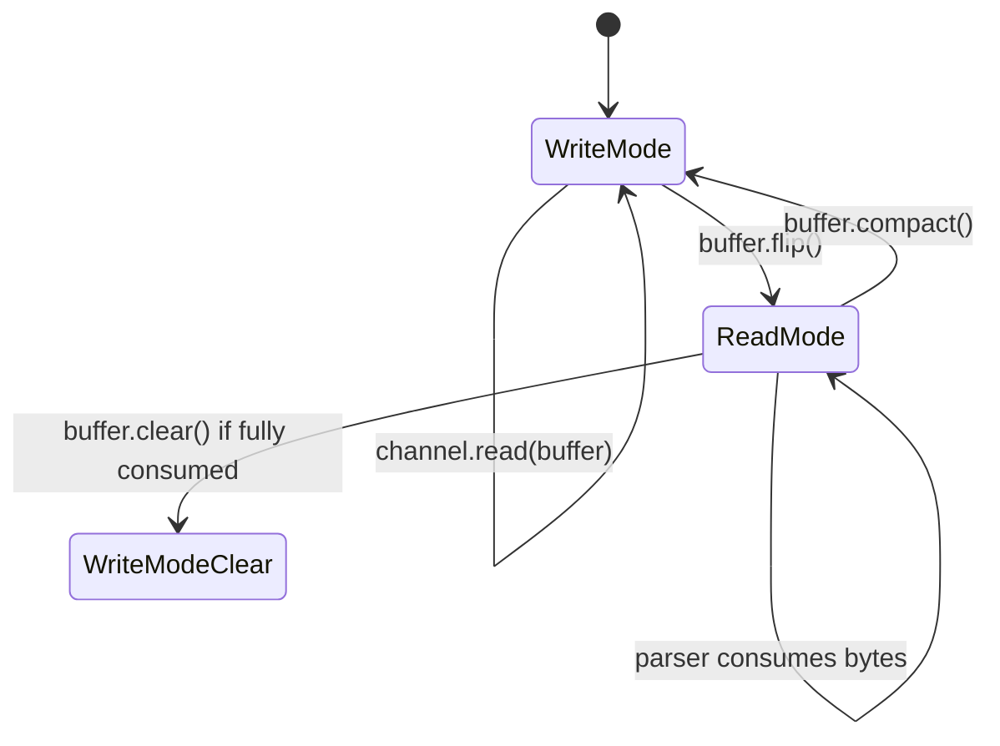
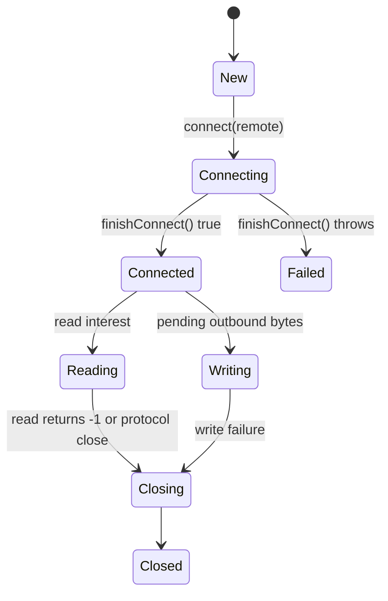
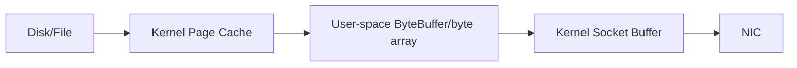
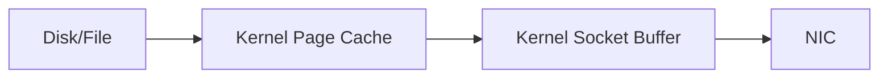

# Part 010 — NIO Buffers, Channels, and Byte-Oriented Design

> Target utama bagian ini: membangun mental model yang benar tentang `Buffer`, `ByteBuffer`, dan `Channel`, supaya saat masuk ke `Selector` dan non-blocking server, kamu tidak sekadar menghafal `flip()`/`clear()`, tetapi memahami invariant byte movement yang sedang terjadi.

Java NIO sering terasa sulit bukan karena API-nya banyak, tetapi karena ia memaksa kita berpikir seperti kernel boundary: **data bergerak dari channel ke buffer, lalu dari buffer ke parser, lalu dari encoder ke buffer, lalu dari buffer ke channel**.

Kalau blocking `InputStream` terasa seperti “read data”, NIO lebih eksplisit:

```text
read from channel into buffer
switch buffer from write-mode to read-mode
consume bytes from buffer
preserve unconsumed bytes if needed
write bytes from buffer into channel
handle partial writes
```

Bagian ini adalah pondasi untuk Part 011 dan Part 012.

---

## 1. Kaufman Deconstruction

Skill “Java NIO network programming” dipecah menjadi 9 sub-skill:

| Sub-skill | Yang harus dikuasai |
|---|---|
| Buffer state | `capacity`, `position`, `limit`, `remaining` |
| Buffer mode transition | `clear`, `flip`, `compact`, `rewind`, `mark/reset` |
| Byte-oriented protocol | Parse data yang datang parsial dan bertahap |
| Channel semantics | `read`/`write` bisa partial dan return value penting |
| SocketChannel lifecycle | `open`, `connect`, `finishConnect`, `read`, `write`, `close` |
| ServerSocketChannel lifecycle | `bind`, `accept`, blocking vs non-blocking |
| Direct vs heap buffer | Trade-off GC, native memory, syscall boundary |
| Byte order | Big-endian/network byte order vs little-endian internal format |
| Zero-copy mental model | Kapan data bisa dipindah lebih efisien dan kapan tidak |

Deliberate practice: implement length-prefixed protocol dengan `ByteBuffer`, lalu paksa read/write parsial.

---

## 2. Why NIO Exists

Classic `java.io` memberi stream abstraction. Itu nyaman untuk thread-per-connection blocking model.

NIO memberi abstraction yang lebih dekat ke OS I/O primitives:

- buffer eksplisit,
- channel eksplisit,
- selectable non-blocking channel,
- scatter/gather I/O,
- memory-mapped file,
- direct buffer,
- integration dengan selector.

Untuk networking, NIO penting karena:

- satu thread dapat mengelola banyak connection,
- aplikasi bisa mengontrol buffer dan backpressure lebih eksplisit,
- partial read/write menjadi visible,
- cocok untuk protocol parser state machine,
- dapat mengurangi allocation jika dikelola benar.

Tetapi NIO bukan otomatis lebih cepat. NIO yang salah bisa lebih lambat dan lebih rapuh daripada blocking socket sederhana.

---

## 3. Core Mental Model: Channel ↔ Buffer

Channel adalah sumber/tujuan I/O. Buffer adalah staging area di memory.

```mermaid
flowchart LR
    KernelRecv[Kernel Receive Queue] -->|channel.read(buffer)| ByteBuffer[ByteBuffer]
    ByteBuffer -->|parser consumes bytes| ProtocolParser[Protocol Parser]
    Encoder[Protocol Encoder] -->|put bytes| OutBuffer[ByteBuffer]
    OutBuffer -->|channel.write(buffer)| KernelSend[Kernel Send Queue]
```

Tidak ada `channel.read()` langsung menjadi object domain. Selalu ada byte boundary.

Invariant:

> Network I/O is byte movement first, protocol interpretation second.

---

## 4. Buffer State: Capacity, Position, Limit

`Buffer` punya tiga angka utama:

| Field | Makna |
|---|---|
| `capacity` | Ukuran total buffer, tidak berubah setelah dibuat |
| `position` | Index operasi berikutnya |
| `limit` | Batas operasi saat ini |
| `remaining()` | `limit - position` |

Saat menulis ke buffer:

```text
capacity = total size
position = where next byte will be put
limit = capacity
```

Saat membaca dari buffer:

```text
position = where next byte will be read
limit = end of meaningful data
```

Diagram:

```text
[0................position........limit........capacity]
```

Masalah utama pemula NIO adalah lupa bahwa `position` dan `limit` punya makna berbeda tergantung mode buffer.

---

## 5. `flip()`: Dari Write Mode ke Read Mode

Contoh:

```java
ByteBuffer buffer = ByteBuffer.allocate(8);

buffer.put((byte) 'O');
buffer.put((byte) 'K');

buffer.flip();

while (buffer.hasRemaining()) {
    System.out.println((char) buffer.get());
}
```

Sebelum `flip()`:

```text
capacity = 8
position = 2
limit    = 8
content  = O K _ _ _ _ _ _
```

Setelah `flip()`:

```text
capacity = 8
position = 0
limit    = 2
content  = O K _ _ _ _ _ _
```

`flip()` artinya:

```text
limit = position
position = 0
```

Rule:

> After writing bytes into a buffer, call `flip()` before reading them.

---

## 6. `clear()`: Siap Menulis Ulang, Bukan Menghapus Data

`clear()` tidak menghapus isi array/memory. Ia hanya mengubah state:

```text
position = 0
limit = capacity
```

Contoh:

```java
buffer.clear();
```

Artinya: “anggap semua byte lama tidak penting; buffer siap ditulis dari awal”.

Bug umum: mengira `clear()` menghapus data sensitif. Untuk secret material, kamu harus overwrite eksplisit.

---

## 7. `compact()`: Menyelamatkan Byte yang Belum Diproses

Network parser sering menerima data parsial:

```text
[length=10][only 4 bytes payload arrived]
```

Kamu tidak boleh discard bytes itu. `compact()` memindahkan remaining bytes ke awal buffer, lalu buffer siap ditulis lagi setelahnya.

```java
buffer.compact();
```

Sebelum compact dalam read mode:

```text
[consumed consumed remaining remaining _ _ _ _]
                  ^position          ^limit
```

Setelah compact:

```text
[remaining remaining _ _ _ _ _ _]
                    ^position        ^limit=capacity
```

Rule:

> Use `compact()` when a protocol parser cannot complete a frame and must preserve unconsumed bytes before the next read.

---

## 8. Buffer Lifecycle for Network Read

Canonical loop untuk blocking channel:

```java
int n = channel.read(buffer);     // write bytes into buffer
if (n == -1) {
    channel.close();
    return;
}

buffer.flip();                   // switch to read mode
parseAvailableFrames(buffer);     // consume complete frames
buffer.compact();                // preserve incomplete frame bytes
```

State flow:



Jika parser menghabiskan semua bytes, `clear()` juga bisa dipakai. Jika masih ada partial frame, pakai `compact()`.

---

## 9. `ByteBuffer` Primitive Methods

`ByteBuffer` bisa membaca/menulis primitive:

```java
ByteBuffer buffer = ByteBuffer.allocate(16);

buffer.putInt(42);
buffer.putLong(1000L);

buffer.flip();

int code = buffer.getInt();
long value = buffer.getLong();
```

Ini berguna untuk binary protocol, tetapi hati-hati:

- `getInt()` butuh 4 bytes remaining.
- `getLong()` butuh 8 bytes remaining.
- Jika frame parsial, jangan panggil primitive getter sebelum memastikan `remaining()` cukup.
- Byte order harus disepakati.

Defensive parser:

```java
if (buffer.remaining() < Integer.BYTES) {
    return NeedMoreData.INSTANCE;
}
int length = buffer.getInt();
```

---

## 10. Byte Order dan Network Protocol

Default `ByteBuffer` adalah big-endian. Banyak network protocol memakai “network byte order”, yaitu big-endian.

Tetapi beberapa custom binary protocol memakai little-endian untuk efisiensi atau interoperability.

Set byte order eksplisit:

```java
import java.nio.ByteBuffer;
import java.nio.ByteOrder;

ByteBuffer buffer = ByteBuffer.allocate(32);
buffer.order(ByteOrder.BIG_ENDIAN);
```

Rule:

> Protocol byte order is part of the contract. Never leave it implicit in a serious binary protocol.

Header spec harus menyatakan:

```text
All multi-byte integer fields are encoded as unsigned big-endian values.
```

Atau:

```text
All numeric fields are little-endian to match protocol X.
```

---

## 11. Heap Buffer vs Direct Buffer

### Heap buffer

```java
ByteBuffer heap = ByteBuffer.allocate(8192);
```

Karakteristik:

- Backed by Java heap array.
- Bisa diakses dengan `array()` jika supported.
- Allocation murah dibanding direct.
- GC melihat object-nya langsung.
- Saat I/O native, JVM/OS mungkin perlu copy ke native memory.

### Direct buffer

```java
ByteBuffer direct = ByteBuffer.allocateDirect(8192);
```

Karakteristik:

- Memory di luar Java heap.
- Cocok untuk I/O native path.
- Allocation/deallocation lebih mahal.
- Bisa mengurangi copy pada beberapa path.
- Tetap ada Java object wrapper.
- Native memory pressure perlu dimonitor.

Decision matrix:

| Situasi | Pilihan awal |
|---|---|
| Small temporary parsing buffer | Heap |
| High-throughput socket read/write reusable buffer | Direct candidate |
| Buffer sering dialokasikan per request | Heap or pooled direct, jangan allocate direct terus-menerus |
| Perlu akses array langsung | Heap |
| Large file/network transfer | Direct/channel transfer candidate |

Rule:

> Direct buffer is a resource strategy, not a magic speed switch.

---

## 12. Native Memory dan GC Pressure

Direct buffer mengurangi tekanan heap payload, tetapi menambah tekanan native memory.

Failure mode:

- Heap terlihat aman.
- Native memory naik.
- Allocation direct buffer makin lambat.
- Process terkena OOM native atau container memory limit.

Production checklist:

- Jangan allocate direct buffer per message.
- Reuse direct buffer pada connection/event-loop scope.
- Batasi max connection × buffer size.
- Monitor direct memory/native memory jika runtime mendukung.
- Pahami container memory limit.

Contoh sizing kasar:

```text
10_000 connections × 64 KiB read buffer = ~640 MiB buffer memory
```

Ini belum termasuk write queue, TLS buffers, object overhead, dan application state.

---

## 13. Channel Basics

`Channel` adalah abstraction untuk entity yang bisa melakukan I/O operation.

Untuk networking:

| Channel | Fungsi |
|---|---|
| `SocketChannel` | TCP client/accepted connection |
| `ServerSocketChannel` | TCP listening socket |
| `DatagramChannel` | UDP socket |
| `AsynchronousSocketChannel` | Async completion-based TCP |
| `AsynchronousServerSocketChannel` | Async TCP accept |

Channel bisa blocking atau non-blocking jika subclass-nya selectable.

```java
channel.configureBlocking(false);
```

Non-blocking artinya operasi tidak menunggu sampai bisa selesai penuh.

---

## 14. `SocketChannel` Blocking Client

```java
import java.net.InetSocketAddress;
import java.nio.ByteBuffer;
import java.nio.channels.SocketChannel;
import java.nio.charset.StandardCharsets;

public final class BlockingSocketChannelClient {
    public static void main(String[] args) throws Exception {
        try (SocketChannel channel = SocketChannel.open()) {
            channel.connect(new InetSocketAddress("example.com", 80));

            ByteBuffer request = StandardCharsets.US_ASCII.encode(
                    "GET / HTTP/1.1\r\nHost: example.com\r\nConnection: close\r\n\r\n"
            );

            while (request.hasRemaining()) {
                channel.write(request);
            }

            ByteBuffer response = ByteBuffer.allocate(8192);
            while (channel.read(response) != -1) {
                response.flip();
                System.out.print(StandardCharsets.UTF_8.decode(response));
                response.clear();
            }
        }
    }
}
```

Perhatikan:

- `write()` bisa tidak menulis semua bytes, maka loop `hasRemaining()` wajib.
- `read()` return `-1` berarti remote closed stream.
- Decode response HTTP seperti ini hanya demo; parser HTTP real jauh lebih kompleks.

---

## 15. Partial Write adalah Realitas

Bug umum:

```java
channel.write(buffer); // assume all bytes written
```

Yang benar:

```java
while (buffer.hasRemaining()) {
    channel.write(buffer);
}
```

Pada blocking channel, loop ini biasanya selesai. Pada non-blocking channel, loop seperti ini bisa spin jika `write()` return `0`. Untuk non-blocking, kamu perlu write queue dan selector interest `OP_WRITE`.

Rule:

> `write()` returning successfully does not mean the whole buffer was written. Check `hasRemaining()`.

---

## 16. Partial Read adalah Realitas

Bug umum pada length-prefixed protocol:

```java
ByteBuffer header = ByteBuffer.allocate(4);
channel.read(header);
header.flip();
int length = header.getInt(); // may fail or read incomplete header
```

Blocking channel pun tidak wajib memenuhi seluruh buffer dalam satu read.

Pola aman:

```java
static boolean readFully(SocketChannel channel, ByteBuffer buffer) throws java.io.IOException {
    while (buffer.hasRemaining()) {
        int n = channel.read(buffer);
        if (n == -1) {
            return false;
        }
    }
    return true;
}
```

Untuk non-blocking, jangan loop menunggu penuh. Simpan state, lanjut saat channel readable lagi.

---

## 17. `ServerSocketChannel` Blocking Server

```java
import java.net.InetSocketAddress;
import java.nio.ByteBuffer;
import java.nio.channels.ServerSocketChannel;
import java.nio.channels.SocketChannel;
import java.nio.charset.StandardCharsets;

public final class BlockingNioEchoServer {
    public static void main(String[] args) throws Exception {
        try (ServerSocketChannel server = ServerSocketChannel.open()) {
            server.bind(new InetSocketAddress("0.0.0.0", 9090));

            while (true) {
                try (SocketChannel client = server.accept()) {
                    ByteBuffer buffer = ByteBuffer.allocate(4096);

                    while (client.read(buffer) != -1) {
                        buffer.flip();
                        while (buffer.hasRemaining()) {
                            client.write(buffer);
                        }
                        buffer.clear();
                    }
                }
            }
        }
    }
}
```

Ini server blocking single-client-at-a-time. Bagus untuk memahami channel, buruk untuk production.

Masalah:

- Selama satu client aktif, client lain tidak diproses.
- Slow client memblokir accept berikutnya.
- Tidak ada timeout.
- Tidak ada protocol framing.
- Tidak ada graceful shutdown.

Part berikutnya akan memakai `Selector` agar satu thread bisa multiplex banyak channel.

---

## 18. Non-Blocking Connect Lifecycle

Untuk `SocketChannel` non-blocking:

```java
SocketChannel channel = SocketChannel.open();
channel.configureBlocking(false);
boolean connected = channel.connect(new InetSocketAddress("example.com", 80));

if (!connected) {
    // register OP_CONNECT with selector
}
```

Saat channel connect-ready:

```java
if (channel.finishConnect()) {
    // now connected; can register OP_READ/OP_WRITE
}
```

State machine:



Common pitfall: lupa memanggil `finishConnect()` lalu langsung read/write.

---

## 19. Scattering Read dan Gathering Write

NIO mendukung membaca ke beberapa buffer dan menulis dari beberapa buffer.

### Gathering write

Cocok untuk header + body tanpa menggabungkan copy manual:

```java
ByteBuffer header = ByteBuffer.allocate(4);
ByteBuffer body = StandardCharsets.UTF_8.encode("hello");

header.putInt(body.remaining());
header.flip();

ByteBuffer[] buffers = { header, body };
while (header.hasRemaining() || body.hasRemaining()) {
    channel.write(buffers);
}
```

### Scattering read

Bisa membaca header dan body ke buffer terpisah, tetapi harus tetap hati-hati partial read.

```java
ByteBuffer header = ByteBuffer.allocate(4);
ByteBuffer body = ByteBuffer.allocate(1024);
ByteBuffer[] buffers = { header, body };
channel.read(buffers);
```

Gathering write sering lebih berguna untuk network protocol encoder karena menghindari copy header+payload ke satu array besar.

---

## 20. Byte-Oriented Protocol Parser

Misal protocol:

```text
4-byte length prefix, followed by payload bytes
```

Parser harus menangani:

- header belum lengkap,
- body belum lengkap,
- beberapa frame dalam satu buffer,
- frame terlalu besar,
- invalid length,
- partial frame saat connection close.

Contoh parser sederhana:

```java
import java.nio.ByteBuffer;
import java.nio.charset.StandardCharsets;
import java.util.ArrayList;
import java.util.List;

public final class LengthPrefixedParser {
    private static final int MAX_FRAME_SIZE = 1024 * 1024;

    public static List<String> parseFrames(ByteBuffer buffer) {
        List<String> frames = new ArrayList<>();

        while (true) {
            buffer.mark();

            if (buffer.remaining() < Integer.BYTES) {
                buffer.reset();
                break;
            }

            int length = buffer.getInt();
            if (length < 0 || length > MAX_FRAME_SIZE) {
                throw new IllegalArgumentException("invalid frame length: " + length);
            }

            if (buffer.remaining() < length) {
                buffer.reset();
                break;
            }

            byte[] payload = new byte[length];
            buffer.get(payload);
            frames.add(new String(payload, StandardCharsets.UTF_8));
        }

        return frames;
    }
}
```

Usage:

```java
int n = channel.read(readBuffer);
if (n == -1) {
    closeConnection();
    return;
}

readBuffer.flip();
List<String> frames = LengthPrefixedParser.parseFrames(readBuffer);
readBuffer.compact();
```

`mark/reset` dipakai agar jika frame belum lengkap, parser kembali ke awal frame dan menunggu byte tambahan.

---

## 21. Write Queue Design

Untuk non-blocking network server, kamu tidak bisa langsung menulis semua response.

Per connection butuh write queue:

```java
import java.nio.ByteBuffer;
import java.util.ArrayDeque;
import java.util.Queue;

final class ConnectionState {
    final ByteBuffer readBuffer = ByteBuffer.allocateDirect(64 * 1024);
    final Queue<ByteBuffer> pendingWrites = new ArrayDeque<>();
    boolean closingAfterWrites;
}
```

Flush logic:

```java
static void flush(java.nio.channels.SocketChannel channel, ConnectionState state) throws java.io.IOException {
    while (!state.pendingWrites.isEmpty()) {
        ByteBuffer head = state.pendingWrites.peek();
        channel.write(head);

        if (head.hasRemaining()) {
            return; // socket send queue full; try again later
        }

        state.pendingWrites.remove();
    }
}
```

Invariant:

> Outbound data belongs to the connection state until the channel has actually consumed every byte.

---

## 22. Backpressure Starts at ByteBuffer

Backpressure bukan konsep abstrak saja. Di NIO, ia terlihat saat:

- write queue membesar,
- `write()` return `0`,
- read buffer sering penuh,
- parser tidak cukup cepat,
- downstream lambat,
- memory per connection naik.

Policy yang harus dipilih:

| Situation | Possible policy |
|---|---|
| Write queue exceeds limit | Close connection, drop low-priority message, apply app-level throttle |
| Read buffer full without complete frame | Reject frame as too large or protocol violation |
| Client sends faster than process rate | Stop reading temporarily or close |
| Server broadcasts to slow clients | Per-client queue limit and disconnect slow consumers |

NIO membuat hal ini eksplisit. Itu kekuatannya, sekaligus sumber kompleksitasnya.

---

## 23. Zero-Copy Mental Model

“Zero-copy” sering dipakai terlalu longgar. Yang penting adalah memahami di mana copy terjadi.

Simplified normal path:



Potential optimized path with transfer:



Java API yang relevan:

- `FileChannel.transferTo(...)`
- `FileChannel.transferFrom(...)`

Tetapi zero-copy bukan selalu berlaku:

- TLS bisa memaksa data masuk ke encryption path.
- Transformasi payload butuh user-space processing.
- OS/filesystem/NIC support berbeda.
- Small payload overhead bisa lebih besar dari manfaat.

Rule:

> Optimize copies only after you know the data path and have measured it.

---

## 24. Character Encoding: Jangan Decode Terlalu Awal

Network membawa bytes. Text hanyalah interpretasi.

Buruk:

```java
String chunk = StandardCharsets.UTF_8.decode(buffer).toString();
```

Jika UTF-8 multibyte character terpotong antar read, decode chunk-by-chunk bisa rusak.

Lebih aman:

- Parse frame sebagai bytes dulu.
- Setelah frame lengkap, decode payload.
- Untuk streaming text, pakai `CharsetDecoder` yang bisa menjaga state antar chunk.

Protocol rule:

> Decode text at message boundary, not arbitrary network read boundary.

---

## 25. Resource Ownership

Channel dan buffer punya ownership.

Pertanyaan desain:

- Siapa yang menutup channel?
- Siapa yang memiliki buffer?
- Apakah buffer boleh dishare antar thread?
- Kapan buffer dikembalikan ke pool?
- Apakah pending write buffer immutable setelah enqueue?

Rule aman:

```text
One connection state owns its read buffer.
Outbound ByteBuffer must not be mutated after enqueue unless ownership is exclusive.
Channel close must release connection state and queued buffers.
```

Untuk direct buffer pooling, ownership makin penting. Double release atau reuse sebelum write selesai bisa menyebabkan data korup.

---

## 26. Thread Safety

Banyak channel aman untuk operasi tertentu oleh beberapa thread, tetapi desain network server biasanya lebih mudah jika satu connection dimiliki oleh satu event loop.

Model yang disarankan untuk NIO selector server:

```text
one event loop thread owns many channels
application workers may produce responses
responses are handed back to event loop queue
only event loop mutates channel interest ops and per-connection I/O buffers
```

Ini mengurangi race pada:

- `SelectionKey` interest ops,
- write queue,
- connection close,
- buffer reuse,
- partial frame state.

---

## 27. Common NIO Buffer Bugs

| Bug | Gejala | Penyebab | Fix |
|---|---|---|---|
| Lupa `flip()` | Parser melihat 0 data atau data salah | Buffer masih write mode | `flip()` sebelum read dari buffer |
| Pakai `clear()` saat frame parsial | Protocol desync | Partial bytes dibuang | `compact()` |
| Tidak cek partial write | Response terpotong | `write()` tidak menulis semua bytes | Loop/queue sampai buffer habis |
| Tidak cek partial read | Header/body korup | `read()` tidak memenuhi buffer | State machine/readFully sesuai mode |
| Allocate direct per request | Latency spike/native memory pressure | Direct allocation mahal | Reuse/pool/bound |
| Decode UTF-8 per chunk | Karakter rusak | Multibyte char terpotong | Decode setelah frame lengkap |
| Shared mutable ByteBuffer | Data antar connection tercampur | Ownership tidak jelas | Per-connection buffer/immutable payload |
| Tidak limit frame size | OOM | Length prefix dipercaya mentah | `MAX_FRAME_SIZE` |
| Write queue tidak dibatasi | Memory leak under slow client | Tidak ada backpressure | Queue limit/drop/close |

---

## 28. Production Buffer Sizing

Buffer sizing bukan angka ajaib. Ia harus mengikuti protocol dan traffic.

Faktor:

- max frame size,
- typical frame size,
- connection count,
- TLS overhead jika ada,
- direct vs heap memory,
- read burst behavior,
- write queue policy,
- GC target,
- container memory limit.

Contoh:

```text
readBuffer = 64 KiB
maxConnections = 20,000
readBufferMemory = ~1.25 GiB
```

Jika ini terlalu besar:

- kurangi read buffer,
- gunakan adaptive buffer,
- batasi max connection,
- pisahkan large-payload protocol,
- gunakan streaming/backpressure,
- pool buffer hanya untuk active reads.

Jangan menentukan buffer size tanpa memory budget.

---

## 29. Mini Project: Length-Prefixed TCP Echo with SocketChannel

Build:

- blocking `ServerSocketChannel`,
- one thread per accepted client untuk sementara,
- protocol: 4-byte big-endian length + UTF-8 payload,
- `MAX_FRAME_SIZE = 1 MiB`,
- read buffer dengan `flip/compact`,
- write loop yang menangani partial write,
- graceful close saat remote EOF,
- reject invalid length.

Acceptance criteria:

- Bisa menerima satu frame.
- Bisa menerima frame yang datang dalam banyak read.
- Bisa menerima beberapa frame dalam satu read.
- Bisa menolak frame terlalu besar.
- Tidak decode UTF-8 sebelum frame lengkap.
- Tidak assume `write()` menulis semua bytes.

Test manual:

```bash
# gunakan custom client Java, bukan netcat, karena protocol binary length-prefix
```

Extension:

- Tambahkan metrics per connection.
- Tambahkan idle timeout.
- Tambahkan write queue limit.
- Migrasikan ke selector di Part 011.

---

## 30. Readiness Checklist

Sebelum masuk Selector:

- [ ] Bisa menjelaskan `capacity`, `position`, `limit` tanpa melihat dokumentasi.
- [ ] Bisa menjelaskan kapan memakai `flip`, `clear`, dan `compact`.
- [ ] Tidak assume read/write selalu complete.
- [ ] Bisa menulis parser length-prefixed yang tahan partial read.
- [ ] Bisa menulis write loop yang tahan partial write.
- [ ] Paham direct buffer bukan magic performance switch.
- [ ] Paham ownership buffer dan write queue.
- [ ] Bisa menghitung memory budget dari connection count × buffer size.
- [ ] Bisa menjelaskan kenapa decode text harus di message boundary.

---

## 31. Ringkasan

NIO networking adalah byte-oriented programming. API-nya memaksa kamu mengelola state yang sebelumnya disembunyikan oleh stream abstraction.

Poin inti:

- Channel memindahkan bytes; buffer menyimpan bytes sementara.
- `flip()` mengubah buffer dari write mode ke read mode.
- `clear()` membuang logical content; `compact()` menjaga remaining bytes.
- Read dan write bisa partial.
- Protocol parser harus stateful.
- Direct buffer adalah trade-off native memory dan I/O path.
- Write queue dan buffer limit adalah fondasi backpressure.
- Zero-copy harus dipahami sebagai data path, bukan slogan.

Part berikutnya akan memakai semua konsep ini untuk membangun `Selector`, event loop, readiness model, dan non-blocking I/O yang benar.

---

## References

- Java SE 25 API — `java.nio.channels` package: https://docs.oracle.com/en/java/javase/25/docs/api/java.base/java/nio/channels/package-summary.html
- Java SE 25 API — `ByteBuffer`: https://docs.oracle.com/en/java/javase/25/docs/api/java.base/java/nio/ByteBuffer.html
- Java SE 25 API — `SocketChannel`: https://docs.oracle.com/en/java/javase/25/docs/api/java.base/java/nio/channels/SocketChannel.html
- Java SE 25 API — `ServerSocketChannel`: https://docs.oracle.com/en/java/javase/25/docs/api/java.base/java/nio/channels/ServerSocketChannel.html
- Java SE 25 API — `FileChannel`: https://docs.oracle.com/en/java/javase/25/docs/api/java.base/java/nio/channels/FileChannel.html
