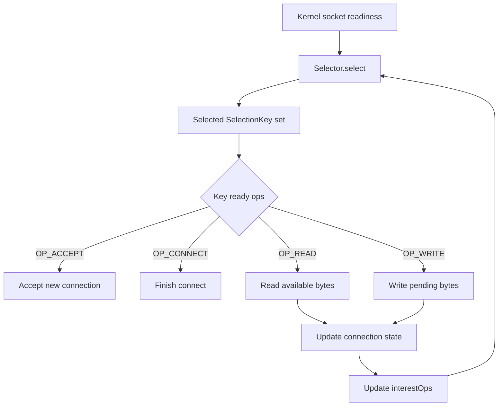
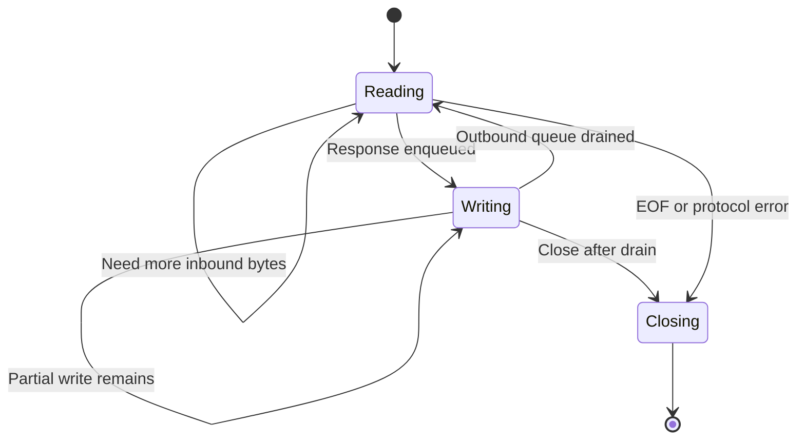

# Part 011 — Selector, Event Loop, and Non-Blocking I/O

> Goal utama part ini: kamu tidak hanya bisa menulis `Selector` loop, tetapi bisa menjelaskan **kenapa event loop bisa spin**, **kenapa `OP_WRITE` berbahaya jika selalu aktif**, **kenapa readiness bukan completion**, dan **bagaimana menjaga connection state tetap benar ketika read/write bersifat parsial**.

Di part sebelumnya kita membangun fondasi `ByteBuffer`, `SocketChannel`, `ServerSocketChannel`, dan byte-oriented design. Sekarang kita naik ke inti NIO networking: **satu thread mengelola banyak koneksi melalui readiness notification**.

Ini berbeda dari blocking socket dan berbeda juga dari asynchronous completion API. `Selector` bukan thread pool, bukan promise executor, dan bukan magic async runtime. Ia adalah **multiplexer readiness**: ia memberi tahu bahwa sebuah channel *mungkin* bisa melakukan operasi tertentu tanpa blocking.

Referensi resmi yang relevan:

- Java SE `java.nio.channels` mendefinisikan channel, selector, selectable channel, dan multiplexed non-blocking I/O.
- `Selector` mendeskripsikan selection operation, selected-key set, wakeup, dan lifecycle selector.
- `SelectionKey` mendeskripsikan interest set, ready set, validity, cancellation, dan attachment.
- `SocketChannel` dan `ServerSocketChannel` adalah selectable channel yang bisa dikonfigurasi non-blocking.

---

## 1. Kaufman Skill Deconstruction

Untuk menguasai non-blocking I/O, jangan mulai dari framework. Mulai dari unit kemampuan berikut.

| Sub-skill | Yang harus bisa dilakukan | Bukti kompetensi |
|---|---|---|
| Readiness mental model | Membedakan readiness, completion, dan blocking | Bisa menjelaskan kenapa `isReadable()` tidak berarti satu pesan lengkap tersedia |
| Selector lifecycle | Membuka selector, register channel, process selected keys, remove key, close | Bisa membuat event loop yang tidak spin dan tidak leak |
| Interest management | Mengubah `interestOps` berdasarkan state koneksi | `OP_WRITE` hanya aktif ketika ada pending outbound data |
| Connection state | Menyimpan parser buffer, outbound queue, protocol state, deadline | Tidak memakai variabel global untuk state tiap koneksi |
| Partial I/O | Menangani read/write 0, sebagian, EOF, dan backpressure | Tidak mengasumsikan satu read = satu request |
| Fairness | Membatasi kerja per key dan per loop | Satu koneksi lambat/besar tidak menguasai event loop |
| Cross-thread wakeup | Mengirim pekerjaan ke event loop dari worker lain dengan aman | Bisa menjelaskan kapan perlu `selector.wakeup()` |
| Failure handling | Menutup koneksi secara deterministik saat protocol/kernel/app error | Tidak meninggalkan key valid untuk channel yang sudah rusak |

Kaufman-style practice target untuk part ini:

1. Tulis echo server NIO yang benar.
2. Tambahkan length-prefixed protocol.
3. Tambahkan outbound write queue.
4. Simulasikan slow client.
5. Pastikan CPU tidak spin ketika 10.000 koneksi idle.
6. Pastikan server tetap responsif ketika satu koneksi mengirim payload besar.

---

## 2. The Core Mental Model

Blocking socket model:

```java
Socket socket = server.accept();
int n = socket.getInputStream().read(buffer); // thread waits here
```

Non-blocking selector model:

```java
selector.select();              // wait until at least one registered channel may progress
for (SelectionKey key : selectedKeys) {
    if (key.isReadable()) { ... } // attempt non-blocking read
}
```

Perbedaan fundamental:

| Blocking socket | Selector/NIO |
|---|---|
| Satu thread biasanya menunggu satu socket | Satu thread menunggu readiness banyak channel |
| `read()` boleh park/block | `read()` harus cepat dan mungkin return `0` |
| State bisa implisit di call stack | State harus eksplisit di attachment/connection object |
| Simpler control flow | Lebih kompleks karena semua koneksi interleaved |
| Mudah dipahami | Lebih mudah diskalakan untuk banyak idle connection |

NIO memindahkan kompleksitas dari thread scheduler ke application state machine.



Important: readiness means **try now**, not **the full operation will complete**.

---

## 3. Selector Objects and Their Roles

| API | Role | Production interpretation |
|---|---|---|
| `Selector` | Multiplexer of selectable channels | The event loop's wait primitive |
| `SelectableChannel` | Channel that can register with selector | Base for socket/server/datagram channels |
| `ServerSocketChannel` | Selectable listening socket | Generates `OP_ACCEPT` readiness |
| `SocketChannel` | Selectable TCP connection | Generates connect/read/write readiness |
| `DatagramChannel` | Selectable UDP endpoint | Generates read/write readiness for datagrams |
| `SelectionKey` | Registration between channel and selector | Also a good place to attach connection state |
| `interestOps` | Operations you want to be notified about | Dynamic demand signal |
| `readyOps` | Operations selector found ready | Snapshot, not a persistent truth contract |
| `attachment` | User object associated with key | Store per-connection state here |

The selector has three important sets conceptually:

1. **Registered key set**: all active registrations.
2. **Selected key set**: keys selected by the latest selection operation.
3. **Cancelled key set**: keys scheduled for cancellation.

Most bugs happen because engineers forget that **selected keys are not automatically removed after processing**.

---

## 4. Non-Blocking I/O Invariants

Treat these as correctness rules.

### Invariant 1 — A channel must be non-blocking before selector registration

```java
server.configureBlocking(false);
server.register(selector, SelectionKey.OP_ACCEPT);
```

A blocking selectable channel cannot be registered with a selector. This is not stylistic; it is the core contract of multiplexed I/O.

### Invariant 2 — The event loop must not perform blocking work

Bad:

```java
if (key.isReadable()) {
    callDatabase();
    callRemoteHttpService();
    parseHugeJsonSynchronously();
}
```

The selector thread is the shared progress engine. If it blocks, every connection assigned to it stalls.

Correct direction:

- Event loop reads bytes.
- Parser extracts complete frames.
- Application work is dispatched to workers if expensive.
- Response bytes are enqueued back to the connection.
- Event loop writes when socket is writable.

### Invariant 3 — Always remove processed selected keys

```java
Iterator<SelectionKey> it = selector.selectedKeys().iterator();
while (it.hasNext()) {
    SelectionKey key = it.next();
    it.remove();
    process(key);
}
```

If you forget `it.remove()`, the same key can be processed repeatedly, often causing CPU spin or duplicate handling.

### Invariant 4 — Never assume readiness means full progress

A readable socket may produce:

- positive bytes,
- zero bytes,
- `-1` EOF.

A writable socket may accept:

- all bytes,
- some bytes,
- zero bytes.

Therefore connection logic must be stateful.

### Invariant 5 — `OP_WRITE` should be demand-driven

Do not keep `OP_WRITE` always enabled.

Most TCP sockets are writable most of the time. If `OP_WRITE` is permanently in `interestOps`, the selector may wake continuously even when your application has nothing to write.

Correct rule:

- Enable `OP_WRITE` only when outbound queue is non-empty.
- Disable `OP_WRITE` when outbound queue is drained.

```java
void enableWrite(SelectionKey key) {
    key.interestOps(key.interestOps() | SelectionKey.OP_WRITE);
}

void disableWrite(SelectionKey key) {
    key.interestOps(key.interestOps() & ~SelectionKey.OP_WRITE);
}
```

### Invariant 6 — Connection state belongs to the key attachment

```java
ConnectionState state = new ConnectionState(channel);
SelectionKey key = channel.register(selector, SelectionKey.OP_READ, state);
state.key = key;
```

The attachment should contain at least:

- channel reference,
- inbound buffer,
- parser state,
- outbound queue,
- current protocol phase,
- last read/write timestamp,
- close/drain flags,
- counters for diagnostics.

### Invariant 7 — Cross-thread interest changes require coordination

If another thread enqueues data for a connection, the selector may be sleeping. You need a safe handoff pattern.

```java
state.enqueue(responseBuffer);
key.interestOps(key.interestOps() | SelectionKey.OP_WRITE);
selector.wakeup();
```

In production, avoid random threads mutating key state directly without event-loop ownership. Prefer enqueueing tasks into the event loop and calling `wakeup()`.

---

## 5. Selection Loop Anatomy

Canonical shape:

```java
while (running) {
    selector.select(timeoutMillis);
    runPendingTasks();
    processSelectedKeys();
    runScheduledTimeouts();
}
```

Why include timeout and pending tasks?

- `select()` without timeout can sleep forever if no I/O happens.
- Timers, idle checks, and cross-thread tasks need a periodic progress point.
- `wakeup()` can interrupt select, but a timeout is still useful as a safety net.

Detailed loop:

```java
private void eventLoop() throws IOException {
    while (running) {
        selector.select(1000);

        drainTaskQueue();

        Iterator<SelectionKey> it = selector.selectedKeys().iterator();
        while (it.hasNext()) {
            SelectionKey key = it.next();
            it.remove();

            if (!key.isValid()) {
                continue;
            }

            try {
                if (key.isAcceptable()) {
                    onAccept(key);
                }
                if (key.isValid() && key.isConnectable()) {
                    onConnect(key);
                }
                if (key.isValid() && key.isReadable()) {
                    onRead(key);
                }
                if (key.isValid() && key.isWritable()) {
                    onWrite(key);
                }
            } catch (IOException | RuntimeException ex) {
                closeKey(key, ex);
            }
        }

        expireIdleConnections();
    }
}
```

Notice the repeated `key.isValid()` checks. A handler may close or cancel the key. Continuing to process other operations after close is a common bug.

---

## 6. Accept Readiness

`OP_ACCEPT` belongs to `ServerSocketChannel`.

```java
private void onAccept(SelectionKey key) throws IOException {
    ServerSocketChannel server = (ServerSocketChannel) key.channel();

    while (true) {
        SocketChannel client = server.accept();
        if (client == null) {
            break;
        }

        client.configureBlocking(false);
        client.setOption(StandardSocketOptions.TCP_NODELAY, true);

        ConnectionState state = new ConnectionState(client);
        SelectionKey clientKey = client.register(selector, SelectionKey.OP_READ, state);
        state.key = clientKey;
    }
}
```

Why loop on `accept()`?

Because a single accept readiness notification may correspond to more than one pending connection. If you accept only one connection, others may wait until another readiness event. Loop until `accept()` returns `null`.

Production note: do not accept unlimited connections blindly. Part 012 expands admission control.

---

## 7. Connect Readiness

For non-blocking clients:

```java
SocketChannel channel = SocketChannel.open();
channel.configureBlocking(false);
boolean connected = channel.connect(remoteAddress);

int ops = connected ? SelectionKey.OP_READ : SelectionKey.OP_CONNECT;
channel.register(selector, ops, state);
```

Handler:

```java
private void onConnect(SelectionKey key) throws IOException {
    SocketChannel channel = (SocketChannel) key.channel();
    ConnectionState state = (ConnectionState) key.attachment();

    if (channel.finishConnect()) {
        state.connected = true;
        key.interestOps((key.interestOps() & ~SelectionKey.OP_CONNECT) | SelectionKey.OP_READ);
    }
}
```

Common bug: registering `OP_READ` before `finishConnect()` succeeds, or forgetting to remove `OP_CONNECT` afterward.

---

## 8. Read Readiness

A robust read handler must deal with:

- `n > 0`: bytes were read,
- `n == 0`: no bytes available now,
- `n == -1`: peer closed output side,
- parser extracted zero/one/many complete frames,
- inbound buffer full but no complete frame,
- malformed frame,
- oversized frame,
- application backpressure.

Example:

```java
private void onRead(SelectionKey key) throws IOException {
    SocketChannel channel = (SocketChannel) key.channel();
    ConnectionState state = (ConnectionState) key.attachment();

    int readBudget = 64 * 1024;

    while (readBudget > 0) {
        int n = channel.read(state.inbound);

        if (n > 0) {
            state.bytesRead += n;
            state.lastReadNanos = System.nanoTime();
            readBudget -= n;
        } else if (n == 0) {
            break;
        } else {
            state.peerClosedInput = true;
            closeAfterDrainingOrNow(key, state);
            return;
        }
    }

    state.inbound.flip();
    try {
        while (tryParseOneFrame(state)) {
            // frame handler may enqueue responses
        }
    } finally {
        state.inbound.compact();
    }

    if (state.outboundBytes() > 0) {
        key.interestOps(key.interestOps() | SelectionKey.OP_WRITE);
    }
}
```

The read budget prevents one busy connection from monopolizing the event loop.

---

## 9. Write Readiness

Outbound writing must support partial writes.

```java
private void onWrite(SelectionKey key) throws IOException {
    SocketChannel channel = (SocketChannel) key.channel();
    ConnectionState state = (ConnectionState) key.attachment();

    int writeBudget = 64 * 1024;

    while (writeBudget > 0 && !state.outbound.isEmpty()) {
        ByteBuffer current = state.outbound.peek();
        int before = current.remaining();
        int n = channel.write(current);

        if (n > 0) {
            state.bytesWritten += n;
            state.lastWriteNanos = System.nanoTime();
            writeBudget -= n;
        }

        if (current.hasRemaining()) {
            break;
        }

        state.outbound.poll();

        if (n == 0 && before > 0) {
            break;
        }
    }

    if (state.outbound.isEmpty()) {
        key.interestOps(key.interestOps() & ~SelectionKey.OP_WRITE);

        if (state.closeWhenDrained) {
            closeKey(key, null);
        }
    } else {
        key.interestOps(key.interestOps() | SelectionKey.OP_WRITE);
    }
}
```

Design rule: **application response generation produces buffers; event loop owns actual socket writes**.

---

## 10. Connection State Design

Minimal state object:

```java
final class ConnectionState {
    final SocketChannel channel;
    SelectionKey key;

    final ByteBuffer inbound = ByteBuffer.allocateDirect(64 * 1024);
    final ArrayDeque<ByteBuffer> outbound = new ArrayDeque<>();

    boolean connected;
    boolean peerClosedInput;
    boolean closeWhenDrained;

    long bytesRead;
    long bytesWritten;
    long lastReadNanos = System.nanoTime();
    long lastWriteNanos = System.nanoTime();

    ProtocolPhase phase = ProtocolPhase.READING_HEADER;
    int expectedPayloadBytes = -1;

    ConnectionState(SocketChannel channel) {
        this.channel = channel;
    }

    long outboundBytes() {
        long total = 0;
        for (ByteBuffer b : outbound) {
            total += b.remaining();
        }
        return total;
    }
}
```

Why explicit state matters:

- In blocking code, call stack stores progress.
- In non-blocking code, the connection can resume later after any operation.
- Therefore progress must live in heap state, not local variables.

---

## 11. Readiness Operations Deep Dive

| Operation | Channel type | What readiness means | What it does not mean |
|---|---|---|---|
| `OP_ACCEPT` | `ServerSocketChannel` | One or more connections may be pending | Accept will never fail or return null |
| `OP_CONNECT` | `SocketChannel` | Connection may be finishable | Connection definitely succeeded |
| `OP_READ` | `SocketChannel`, `DatagramChannel` | Read may make progress | Full request/message is available |
| `OP_WRITE` | `SocketChannel`, `DatagramChannel` | Write may make progress | Entire outbound queue can be flushed |

Readiness is a hint generated by OS-level readiness mechanisms. Your Java code still needs to perform the operation and handle the result.

---

## 12. InterestOps as Demand Signal

Think of `interestOps` as “what progress do I currently need from the kernel?”



Mapping to interest ops:

| Connection state | Interest ops |
|---|---|
| Waiting for inbound request | `OP_READ` |
| Has outbound bytes | `OP_READ | OP_WRITE`, or only `OP_WRITE` if input paused |
| Connecting | `OP_CONNECT` |
| Draining before close | `OP_WRITE` |
| Backpressured inbound | remove `OP_READ` temporarily |
| Closed | cancel key and close channel |

The ability to remove `OP_READ` is important. If the app layer cannot keep up, continuing to read just moves pressure from kernel buffers into your heap.

---

## 13. Event Loop Ownership

A clean production model assigns ownership:

| Resource | Owner |
|---|---|
| `Selector` | Event loop thread |
| Registered channels | Event loop thread |
| `SelectionKey.interestOps` | Event loop thread preferred |
| Connection inbound buffer | Event loop thread |
| Connection outbound queue | Event loop thread or guarded mailbox |
| Application business work | Worker pool |
| Cross-thread commands | Event-loop task queue |

Recommended handoff pattern:

```java
final class EventLoop {
    private final Selector selector;
    private final Queue<Runnable> pendingTasks = new ConcurrentLinkedQueue<>();

    void execute(Runnable task) {
        pendingTasks.add(task);
        selector.wakeup();
    }

    private void drainTaskQueue() {
        Runnable task;
        while ((task = pendingTasks.poll()) != null) {
            task.run();
        }
    }
}
```

Worker thread response path:

```java
workerPool.submit(() -> {
    ByteBuffer response = encodeResponse(request);
    eventLoop.execute(() -> {
        state.outbound.add(response);
        state.key.interestOps(state.key.interestOps() | SelectionKey.OP_WRITE);
    });
});
```

This avoids concurrent mutation of per-connection state.

---

## 14. CPU Spin Failure Modes

CPU spin means the loop wakes continuously without useful work.

| Cause | Symptom | Fix |
|---|---|---|
| Forgot `it.remove()` | Same selected key processed repeatedly | Remove every selected key after taking it |
| `OP_WRITE` always enabled | High CPU with idle connections | Enable only while outbound queue non-empty |
| Handler does not consume/read/write enough to clear readiness | Repeated same readiness | Drain within bounded budget |
| Exception swallowed without closing/cancelling key | Same failing key returns repeatedly | Close channel and cancel key on fatal error |
| Selector wakeup misuse | select returns immediately repeatedly | Drain task queue and avoid redundant wakeup loops |
| Zero-byte write loop | Busy loop inside `onWrite` | Break when write returns 0 |
| Invalid key processed | `CancelledKeyException` noise | Check `isValid()` after each handler |

Spin debugging checklist:

1. Count selected keys per second.
2. Count bytes read/written per second.
3. Count wakeups per second.
4. Track number of keys with `OP_WRITE` enabled.
5. Log key state on repeated zero progress.
6. Verify selected-key removal.

---

## 15. Fairness and Work Budgets

Without fairness, one hot connection can starve others.

Important budgets:

| Budget | Purpose |
|---|---|
| max bytes read per key per loop | Prevent one connection from monopolizing read path |
| max frames decoded per key per loop | Prevent parser starvation |
| max bytes written per key per loop | Prevent large response from monopolizing write path |
| max accepts per loop | Prevent accept storm from starving existing traffic |
| max tasks drained per loop | Prevent worker callbacks from starving I/O |

Example policy:

```java
static final int READ_BYTE_BUDGET = 64 * 1024;
static final int WRITE_BYTE_BUDGET = 128 * 1024;
static final int FRAME_BUDGET = 32;
static final int ACCEPT_BUDGET = 256;
static final int TASK_BUDGET = 1024;
```

Budgets are not arbitrary micro-optimizations. They are fairness controls.

---

## 16. Backpressure at Selector Level

Backpressure is not only a messaging concept. In networking, it appears as:

- kernel send buffer full,
- Java outbound queue growing,
- application worker queue growing,
- decoder buffer full,
- slow client consuming responses slowly,
- fast client sending requests faster than you process.

Selector-level tactics:

| Situation | Response |
|---|---|
| Outbound queue exceeds high watermark | Stop reading from that connection |
| Outbound queue drains below low watermark | Resume `OP_READ` |
| Worker queue saturated | Reject/close new requests or apply admission control |
| Inbound frame exceeds max size | Close with protocol error |
| Write returns 0 repeatedly | Keep `OP_WRITE`, but avoid busy loop |

High/low watermark avoids thrashing:

```java
if (state.outboundBytes() > HIGH_WATERMARK) {
    key.interestOps(key.interestOps() & ~SelectionKey.OP_READ);
}

if (state.outboundBytes() < LOW_WATERMARK) {
    key.interestOps(key.interestOps() | SelectionKey.OP_READ);
}
```

---

## 17. The Complete Minimal Server Skeleton

This is intentionally compact, not framework-grade. Use it as a reference for control flow.

```java
public final class NioEchoServer implements AutoCloseable {
    private final Selector selector;
    private final ServerSocketChannel server;
    private volatile boolean running = true;

    public NioEchoServer(InetSocketAddress bindAddress) throws IOException {
        this.selector = Selector.open();
        this.server = ServerSocketChannel.open();
        this.server.configureBlocking(false);
        this.server.bind(bindAddress);
        this.server.register(selector, SelectionKey.OP_ACCEPT);
    }

    public void run() throws IOException {
        while (running) {
            selector.select(1000);

            Iterator<SelectionKey> it = selector.selectedKeys().iterator();
            while (it.hasNext()) {
                SelectionKey key = it.next();
                it.remove();

                if (!key.isValid()) continue;

                try {
                    if (key.isAcceptable()) onAccept(key);
                    if (key.isValid() && key.isReadable()) onRead(key);
                    if (key.isValid() && key.isWritable()) onWrite(key);
                } catch (IOException | RuntimeException ex) {
                    closeKey(key);
                }
            }
        }
    }

    private void onAccept(SelectionKey key) throws IOException {
        ServerSocketChannel server = (ServerSocketChannel) key.channel();
        SocketChannel client;
        while ((client = server.accept()) != null) {
            client.configureBlocking(false);
            ConnectionState state = new ConnectionState(client);
            SelectionKey clientKey = client.register(selector, SelectionKey.OP_READ, state);
            state.key = clientKey;
        }
    }

    private void onRead(SelectionKey key) throws IOException {
        ConnectionState state = (ConnectionState) key.attachment();
        SocketChannel channel = state.channel;

        int n = channel.read(state.inbound);
        if (n == -1) {
            closeKey(key);
            return;
        }
        if (n == 0) {
            return;
        }

        state.inbound.flip();
        ByteBuffer echo = ByteBuffer.allocate(state.inbound.remaining());
        echo.put(state.inbound);
        echo.flip();
        state.inbound.clear();

        state.outbound.add(echo);
        key.interestOps(key.interestOps() | SelectionKey.OP_WRITE);
    }

    private void onWrite(SelectionKey key) throws IOException {
        ConnectionState state = (ConnectionState) key.attachment();
        SocketChannel channel = state.channel;

        while (!state.outbound.isEmpty()) {
            ByteBuffer buffer = state.outbound.peek();
            channel.write(buffer);
            if (buffer.hasRemaining()) {
                break;
            }
            state.outbound.poll();
        }

        if (state.outbound.isEmpty()) {
            key.interestOps(key.interestOps() & ~SelectionKey.OP_WRITE);
        }
    }

    private void closeKey(SelectionKey key) {
        try {
            key.cancel();
            key.channel().close();
        } catch (IOException ignored) {
            // best effort close
        }
    }

    @Override
    public void close() throws IOException {
        running = false;
        selector.wakeup();
        server.close();
        selector.close();
    }

    static final class ConnectionState {
        final SocketChannel channel;
        SelectionKey key;
        final ByteBuffer inbound = ByteBuffer.allocateDirect(8192);
        final ArrayDeque<ByteBuffer> outbound = new ArrayDeque<>();

        ConnectionState(SocketChannel channel) {
            this.channel = channel;
        }
    }
}
```

This server is not yet production-grade, but its event-loop shape is correct enough to extend.

---

## 18. Selector vs Virtual Threads

A modern Java engineer should not blindly choose NIO selector just because it sounds scalable.

| Model | Strength | Weakness |
|---|---|---|
| Blocking socket + platform thread | Simple mental model | High thread cost at many connections |
| Blocking socket + virtual thread | Simple model with much lower thread cost | Still must handle timeouts, backpressure, and pinning risks |
| Selector event loop | Very efficient for many idle connections, explicit backpressure | More complex state machine |
| Async channel completion model | Completion-style API | Harder composition, provider/platform nuances |
| Framework event loop | Mature patterns, TLS/protocol tooling | Framework-specific lifecycle and tuning |

Selector is valuable when:

- you are implementing protocols,
- you need high connection count with explicit state control,
- you need one/few threads per many sockets,
- you want to understand Netty/Undertow-style systems,
- you need precise control over read/write backpressure.

Virtual threads are valuable when:

- protocol is simple,
- blocking style makes correctness easier,
- you have many concurrent network operations but not necessarily custom event-loop needs,
- you want to reduce callback/state-machine complexity.

Top-tier skill is not “always use NIO.” Top-tier skill is knowing which complexity buys real value.

---

## 19. Common Misunderstandings

### Misunderstanding: “Non-blocking means faster.”

Not necessarily. Non-blocking I/O can reduce thread overhead, but it increases application-level complexity. Throughput depends on protocol, batching, buffer strategy, kernel behavior, CPU, GC, TLS, and business logic.

### Misunderstanding: “Selector is async.”

Selector is readiness-based multiplexing. Your code still performs read/write calls.

### Misunderstanding: “Readable means request ready.”

Readable means at least some bytes may be read. Request completion is a protocol parser decision.

### Misunderstanding: “Writable means I should write.”

Writable means socket send buffer may accept bytes. If you have no queued bytes, do nothing and disable `OP_WRITE`.

### Misunderstanding: “One selector thread is always enough.”

One selector thread may be enough for many idle connections, but not necessarily for high throughput, TLS, heavy parsing, or expensive application dispatch.

---

## 20. Failure Matrix

| Failure | Local symptom | Likely cause | Engineering response |
|---|---|---|---|
| CPU 100%, low traffic | Selector wakes constantly | `OP_WRITE` always enabled or selected keys not removed | Inspect interest ops and loop progress counters |
| Connection accepted but no reads | Channel not registered or wrong ops | Missing `OP_READ` after accept/connect | Verify registration path |
| `CancelledKeyException` | Handler uses invalid key | Key closed earlier in same loop | Check validity between operations |
| Memory grows with slow clients | Outbound queue unbounded | No high watermark/backpressure | Bound queue, pause reads, close slow clients |
| Protocol corruption | Parser assumes complete messages | TCP stream semantics ignored | Use framing parser with partial support |
| Stalled outbound data | `OP_WRITE` not enabled | Response enqueued without interest update/wakeup | Event-loop task queue + wakeup |
| Latency spikes for all clients | Event loop does heavy work | Parsing/business logic blocking loop | Move expensive work off loop |
| New connections delayed | Accept budget too low or loop busy | Accept not drained or event-loop starvation | Loop on accept with budget and monitor backlog |

---

## 21. Practical Drills

### Drill 1 — Echo server correctness

Build the skeleton above and verify:

- idle clients do not increase CPU,
- many concurrent clients can connect,
- large writes are echoed correctly,
- disconnect does not throw repeated exceptions.

### Drill 2 — Length-prefixed protocol

Replace raw echo with:

```text
4-byte big-endian length
N-byte payload
```

Acceptance criteria:

- one TCP read can contain half a frame,
- one TCP read can contain multiple frames,
- oversized frame is rejected,
- malformed length closes the connection.

### Drill 3 — Slow writer

Create a client that reads one byte per second. Server must:

- not allocate unbounded memory,
- not block event loop,
- eventually close or backpressure according to policy.

### Drill 4 — Worker handoff

Move request processing into a worker pool. Response must be enqueued through event-loop task queue, not by writing socket directly from worker thread.

### Drill 5 — Spin detection

Intentionally keep `OP_WRITE` always enabled. Observe CPU. Then fix it and confirm selected key rate drops.

---

## 22. Review Checklist

Before merging a selector-based server/client:

- [ ] Every registered channel is non-blocking.
- [ ] Selected keys are removed after processing.
- [ ] `OP_WRITE` is demand-driven.
- [ ] Read handler handles `-1`, `0`, and positive reads.
- [ ] Write handler handles partial and zero writes.
- [ ] Protocol parser handles partial and multiple frames.
- [ ] Per-connection state is explicit and attached.
- [ ] Event loop does not block on database, HTTP, file I/O, locks, or long CPU work.
- [ ] Cross-thread updates use event-loop task queue or safe wakeup pattern.
- [ ] Outbound queue is bounded or guarded by watermarks.
- [ ] Idle/deadline handling exists.
- [ ] Fatal exceptions close/cancel the key.
- [ ] Metrics expose keys, selected events, bytes, queue sizes, closes, errors, and loop lag.

---

## 23. Mental Compression

If you remember only one model:

```text
Selector = readiness multiplexer.
SelectionKey = registration + state handle.
interestOps = what progress I want.
readyOps = what may progress now.
attachment = connection state.
read/write = partial, repeatable, stateful.
OP_WRITE = enable only when there is data.
```

The moment you internalize that readiness is not completion, NIO becomes less mysterious. The hard part is not calling `select()`. The hard part is designing connection state so every partial operation can resume safely.

---

## 24. Where This Leads Next

Part 012 turns this low-level selector knowledge into server architecture:

- single-reactor vs multi-reactor,
- boss/worker loops,
- connection state machines,
- admission control,
- high/low watermark backpressure,
- graceful shutdown,
- production readiness criteria.

Part 011 gives you the mechanics. Part 012 gives you the production shape.
