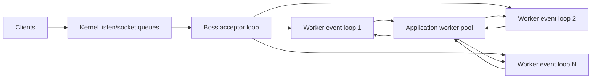
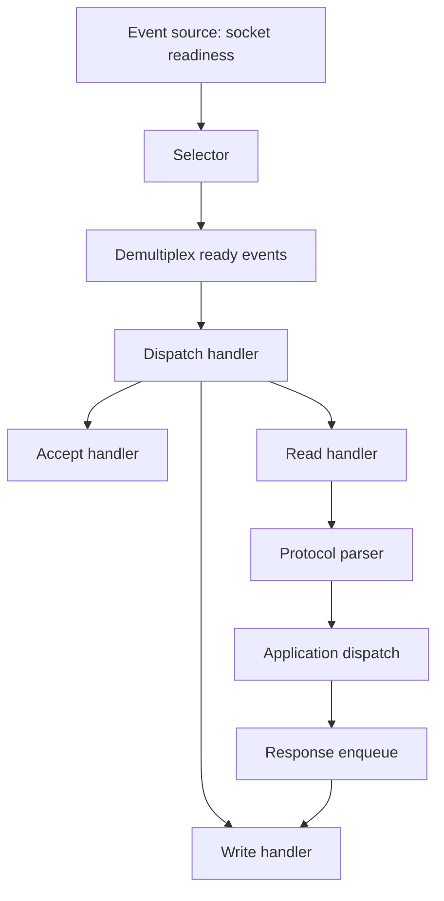
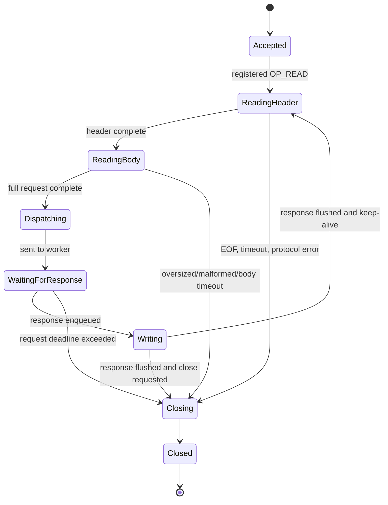
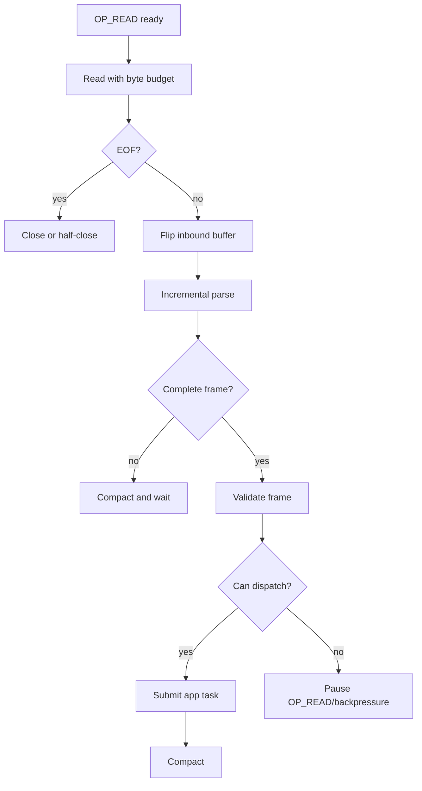
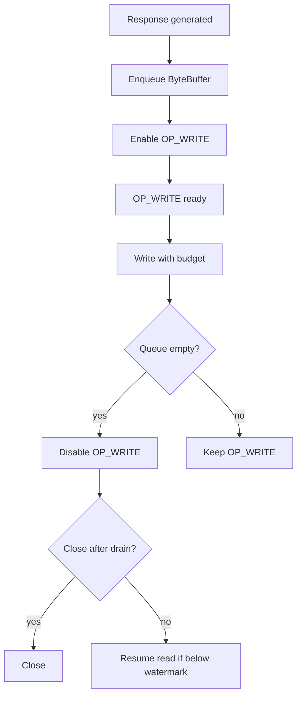
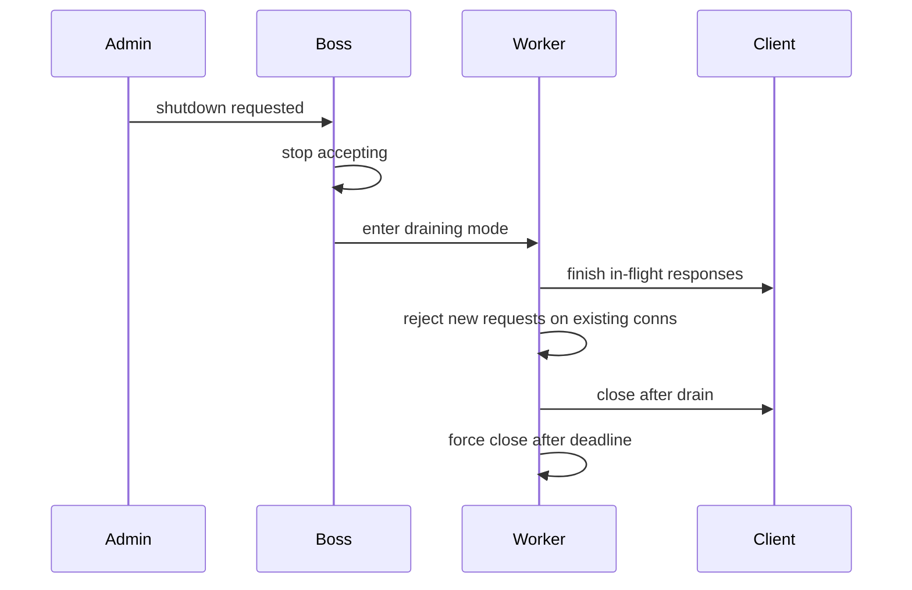

# Part 012 — Production NIO Server Patterns

> Goal utama part ini: mengubah pemahaman `Selector` dari Part 011 menjadi desain server yang defensible: punya ownership model, state machine, write queue, admission control, overload behavior, timeout, graceful close, dan failure matrix.

Part 011 menjawab “bagaimana selector bekerja.” Part ini menjawab “bagaimana membangun server NIO yang tidak rapuh ketika masuk dunia production.”

Kita tidak akan membahas REST framework, servlet container, Netty internals secara penuh, atau observability umum. Fokusnya adalah pola arsitektur networking mentah yang membuat kamu bisa membaca, mengevaluasi, atau membangun server event-loop sendiri.

---

## 1. Why Toy NIO Servers Fail in Production

Toy NIO server biasanya hanya melakukan:

```text
select -> accept -> read -> write -> close
```

Production server membutuhkan lebih dari itu:

| Concern | Toy server | Production server |
|---|---|---|
| Connection count | Tidak dibatasi | Admission control dan max connection |
| Request size | Diasumsikan kecil | Max frame/body/header size |
| Write behavior | Langsung write | Outbound queue + partial write |
| Slow client | Tidak dipikirkan | High/low watermark dan idle timeout |
| Expensive work | Dikerjakan di selector thread | Worker pool dengan safe handoff |
| Shutdown | Process mati | Stop accept, drain, close deadline |
| Error | Print stack trace | Classified close reason + metric |
| Fairness | Tidak ada budget | Read/write/frame/task budget |
| Protocol state | Satu buffer | Explicit state machine |
| Overload | Melambat sampai jatuh | Reject, shed, backpressure, degrade |

The production problem is not merely I/O. It is **state management under partial progress and failure**.

---

## 2. Architectural Mental Model

A production NIO server should be decomposed into these roles:



| Component | Responsibility |
|---|---|
| Boss loop | Owns listening socket, accepts connections, assigns to worker loops |
| Worker event loop | Owns connected channels, reads/writes bytes, manages connection state |
| Connection state | Parser, outbound queue, deadlines, counters, protocol phase |
| Application worker pool | Performs CPU/blocking business work outside event loop |
| Timer/timeout manager | Enforces idle/read/write/request deadlines |
| Admission controller | Decides whether to accept, reject, pause, or close |
| Metrics/logging hooks | Classify behavior and failures |

This split is common in high-performance networking systems: accept cheaply, then distribute connection ownership.

---

## 3. Reactor Pattern, Not Magic

The selector-based server is a Reactor:



Reactor means:

- wait for readiness,
- dispatch to handlers,
- handlers must not block the reactor,
- state is explicit,
- backpressure must be explicit.

Do not confuse Reactor with Proactor:

| Pattern | Meaning |
|---|---|
| Reactor | App is notified when operation can be attempted |
| Proactor | App is notified when operation has completed |

Java `Selector` is Reactor-style readiness. Java `AsynchronousSocketChannel` is closer to completion-style programming and is covered later.

---

## 4. Single Reactor vs Multi-Reactor

### Single reactor

```text
one selector thread handles accept + read + write for all connections
```

Good for:

- learning,
- simple servers,
- many idle connections,
- low business complexity.

Risk:

- one loop can become bottleneck,
- accept can starve read/write,
- all connections share one failure domain.

### Boss + worker reactors

```text
boss selector accepts only
worker selectors handle connected sockets
```

Good for:

- higher connection count,
- multi-core usage,
- isolating accept path,
- distributing connection load.

Risk:

- more cross-thread handoff complexity,
- more lifecycle complexity,
- harder metrics/debugging.

### Multiple listening sockets/processes

Often used with OS/container orchestration, load balancer, or `SO_REUSEPORT`-style designs. In pure Java standard API, the exact behavior is OS-dependent and should be treated carefully.

---

## 5. Event Loop Ownership Model

Production NIO collapses if ownership is unclear.

Recommended rule:

> A connection is owned by exactly one event-loop thread from registration until close.

That loop owns:

- `SelectionKey`,
- `SocketChannel`,
- inbound buffer,
- protocol parser,
- outbound queue,
- connection deadlines,
- connection-local counters,
- interestOps transitions.

Worker threads may compute responses, but they should not mutate channel state directly. They should submit tasks back to the owning loop.

```java
record LoopTask(ConnectionState state, ByteBuffer response) implements Runnable {
    @Override
    public void run() {
        state.outbound.add(response);
        state.enableWrite();
    }
}
```

This reduces data races and avoids expensive locking in the hot path.

---

## 6. Boss Acceptor Loop

The boss loop owns only the listening socket.

Responsibilities:

1. accept pending connections,
2. apply admission control,
3. configure socket options,
4. choose worker loop,
5. transfer registration to worker loop.

Sketch:

```java
final class BossLoop implements Runnable {
    private final Selector selector;
    private final ServerSocketChannel server;
    private final WorkerLoop[] workers;
    private int nextWorker;

    @Override
    public void run() {
        while (running) {
            selector.select(1000);
            Iterator<SelectionKey> it = selector.selectedKeys().iterator();
            while (it.hasNext()) {
                SelectionKey key = it.next();
                it.remove();
                if (key.isAcceptable()) {
                    acceptReadyConnections();
                }
            }
        }
    }

    private void acceptReadyConnections() throws IOException {
        int budget = 256;
        while (budget-- > 0) {
            SocketChannel channel = server.accept();
            if (channel == null) break;

            if (!admissionController.allow(channel)) {
                channel.close();
                continue;
            }

            channel.configureBlocking(false);
            channel.setOption(StandardSocketOptions.TCP_NODELAY, true);
            chooseWorker().register(channel);
        }
    }

    private WorkerLoop chooseWorker() {
        WorkerLoop worker = workers[nextWorker];
        nextWorker = (nextWorker + 1) % workers.length;
        return worker;
    }
}
```

Registration with a worker loop must be done in that worker's event loop or with proper wakeup coordination.

```java
final class WorkerLoop {
    private final Selector selector;
    private final Queue<Runnable> tasks = new ConcurrentLinkedQueue<>();

    void register(SocketChannel channel) {
        tasks.add(() -> doRegister(channel));
        selector.wakeup();
    }

    private void doRegister(SocketChannel channel) {
        try {
            ConnectionState state = new ConnectionState(channel, this);
            SelectionKey key = channel.register(selector, SelectionKey.OP_READ, state);
            state.key = key;
        } catch (IOException e) {
            closeQuietly(channel);
        }
    }
}
```

---

## 7. Worker Event Loop

A worker loop should have a stable shape:

```java
while (running) {
    selector.select(nextDeadlineMillis());
    drainTasks(TASK_BUDGET);
    processSelectedKeys(IO_BUDGETS);
    expireTimeouts(now);
    flushCloseQueue();
}
```

The ordering is intentional:

1. `select`: wait for I/O or wakeup.
2. `drainTasks`: register new channels and enqueue worker responses.
3. `processSelectedKeys`: advance network I/O.
4. `expireTimeouts`: enforce deadlines.
5. `flushCloseQueue`: clean resources deterministically.

Important: do not let task draining starve I/O. A huge worker callback storm can be as dangerous as I/O storm.

---

## 8. Connection State Machine

A connection should not be modeled as “has a buffer.” It should be modeled as a state machine.



Minimal enum:

```java
enum ConnectionPhase {
    READING_HEADER,
    READING_BODY,
    DISPATCHING,
    WAITING_FOR_RESPONSE,
    WRITING,
    CLOSING,
    CLOSED
}
```

State transition rules should be explicit. Hidden booleans eventually become inconsistent.

Bad state model:

```java
boolean reading;
boolean writing;
boolean done;
boolean closed;
boolean processing;
```

Better:

```java
ConnectionPhase phase;
CloseReason closeReason;
long deadlineNanos;
```

---

## 9. Protocol Parser Pattern

A production parser should be incremental.

```java
interface FrameParser {
    ParseResult parse(ByteBuffer input, List<Frame> out);
}

enum ParseResult {
    NEED_MORE_DATA,
    FRAME_AVAILABLE,
    PROTOCOL_ERROR,
    FRAME_TOO_LARGE
}
```

Read handler shape:

```java
private void onRead(ConnectionState c) throws IOException {
    int bytes = readWithBudget(c);
    if (bytes < 0) {
        close(c, CloseReason.PEER_CLOSED);
        return;
    }

    c.inbound.flip();
    try {
        int frameBudget = 32;
        while (frameBudget-- > 0) {
            ParseResult result = c.parser.parse(c.inbound, c.frames);
            if (result == ParseResult.NEED_MORE_DATA) break;
            if (result == ParseResult.PROTOCOL_ERROR || result == ParseResult.FRAME_TOO_LARGE) {
                close(c, CloseReason.PROTOCOL_ERROR);
                return;
            }
            dispatchReadyFrames(c);
        }
    } finally {
        c.inbound.compact();
    }
}
```

Parser invariants:

- never consume bytes unless a state transition is valid,
- never trust length fields without max limit,
- support partial header,
- support partial body,
- support multiple frames per read,
- report malformed input deterministically,
- keep parser memory bounded.

---

## 10. Read Path Design

Production read path:



Read path needs four kinds of limits:

| Limit | Why |
|---|---|
| Read byte budget | Prevent hot connection starvation |
| Frame count budget | Prevent one read from decoding unbounded frames |
| Max frame size | Prevent memory abuse |
| Request deadline | Prevent slowloris-style incomplete request |

Slowloris defense is not only HTTP-specific. Any protocol with incremental request body can be abused by sending bytes too slowly.

---

## 11. Write Path Design

Outbound path should be queue-based.

```java
final class OutboundQueue {
    private final ArrayDeque<ByteBuffer> buffers = new ArrayDeque<>();
    private long queuedBytes;

    void add(ByteBuffer buffer) {
        if (buffer.remaining() == 0) return;
        buffers.add(buffer);
        queuedBytes += buffer.remaining();
    }

    ByteBuffer peek() {
        return buffers.peek();
    }

    void removeFullyWritten(ByteBuffer bufferBeforeWrite) {
        if (!bufferBeforeWrite.hasRemaining()) {
            buffers.poll();
        }
    }

    long queuedBytes() {
        return queuedBytes;
    }
}
```

In real implementation, update `queuedBytes` by the actual bytes written, not only on removal.

Write path:



Write invariants:

- never block waiting for a socket to accept all bytes,
- never allocate unbounded response buffers,
- never keep `OP_WRITE` enabled without pending bytes,
- support partial writes,
- support close-after-drain,
- classify slow consumer separately from application errors.

---

## 12. Backpressure with High/Low Watermarks

Backpressure should be designed as a state transition, not an afterthought.

```java
static final long HIGH_WATERMARK = 8L * 1024 * 1024;
static final long LOW_WATERMARK = 2L * 1024 * 1024;

void afterEnqueue(ConnectionState c) {
    if (c.outboundBytes() >= HIGH_WATERMARK) {
        c.readPaused = true;
        c.key.interestOps(c.key.interestOps() & ~SelectionKey.OP_READ);
    }
    c.key.interestOps(c.key.interestOps() | SelectionKey.OP_WRITE);
}

void afterWrite(ConnectionState c) {
    if (c.readPaused && c.outboundBytes() <= LOW_WATERMARK) {
        c.readPaused = false;
        c.key.interestOps(c.key.interestOps() | SelectionKey.OP_READ);
    }

    if (c.outboundBytes() == 0) {
        c.key.interestOps(c.key.interestOps() & ~SelectionKey.OP_WRITE);
    }
}
```

Why high/low rather than a single threshold?

A single threshold causes flapping: pause/resume/pause/resume around the boundary. High/low creates hysteresis.

---

## 13. Admission Control

Admission control answers: “Should this server accept more work?”

Admission can happen at several layers:

| Layer | Control |
|---|---|
| Kernel listen queue | backlog parameter and OS tuning |
| Boss accept loop | max accepts per loop |
| Connection count | global/per-IP/per-tenant limits |
| Worker assignment | avoid overloaded worker |
| Protocol parser | reject oversized frames early |
| Application queue | reject if worker queue is saturated |
| Outbound queue | close/pause slow clients |

Example:

```java
final class AdmissionController {
    private final AtomicInteger activeConnections = new AtomicInteger();
    private final int maxConnections;

    boolean allow(SocketChannel channel) {
        int current = activeConnections.incrementAndGet();
        if (current > maxConnections) {
            activeConnections.decrementAndGet();
            return false;
        }
        return true;
    }

    void onClose() {
        activeConnections.decrementAndGet();
    }
}
```

In a regulated or high-integrity system, rejection behavior should be explicit:

- close immediately,
- send protocol-level “server busy,”
- return retry-after equivalent if protocol supports it,
- sample logs to avoid log amplification,
- metric close reason as `ADMISSION_REJECTED`.

---

## 14. Worker Pool Handoff

Event loop should not perform expensive business logic.

Bad:

```java
Frame request = decode(buffer);
Frame response = handler.handle(request); // may block or be expensive
state.outbound.add(encode(response));
```

Better:

```java
Frame request = decode(buffer);
state.phase = ConnectionPhase.DISPATCHING;

workerPool.execute(() -> {
    Response response;
    try {
        response = handler.handle(request);
    } catch (Throwable t) {
        response = errorResponse(t);
    }

    ByteBuffer encoded = encode(response);
    state.ownerLoop.execute(() -> {
        if (state.phase == ConnectionPhase.CLOSED) return;
        state.outbound.add(encoded);
        state.phase = ConnectionPhase.WRITING;
        state.enableWrite();
    });
});
```

Ordering problem:

If a connection can pipeline multiple requests, responses may complete out of order. You need a policy:

| Policy | Use case |
|---|---|
| No pipelining | Simpler request/response protocols |
| Ordered response queue | HTTP/1.1-like semantics |
| Stream/request IDs | Multiplexed protocol like HTTP/2 conceptually |
| Per-connection serial executor | Preserve order at cost of concurrency |

Do not accidentally introduce response reordering if protocol forbids it.

---

## 15. Timeout and Deadline Model

Timeouts are part of server correctness.

Types:

| Timeout | Meaning |
|---|---|
| Idle timeout | No read/write activity for too long |
| Read/header timeout | Request header/frame header not completed in time |
| Body timeout | Body transfer too slow |
| Application timeout | Handler took too long |
| Write timeout | Response cannot be drained to client |
| Graceful shutdown deadline | Drain period exceeded |

Connection state should carry deadline fields:

```java
long idleDeadlineNanos;
long readDeadlineNanos;
long appDeadlineNanos;
long writeDeadlineNanos;
```

Simple timeout scan:

```java
void expireTimeouts(long now) {
    for (SelectionKey key : selector.keys()) {
        if (!key.isValid()) continue;
        if (!(key.attachment() instanceof ConnectionState c)) continue;

        if (now >= c.currentDeadlineNanos()) {
            close(c, CloseReason.TIMEOUT);
        }
    }
}
```

For very high connection counts, scanning all keys every loop can be expensive. Use timing wheel, heap, or segmented scans. But do not skip timeout design.

---

## 16. Graceful Close and Half-Close

TCP close is not one thing. At application level, define close policy.

| Scenario | Policy |
|---|---|
| Protocol error | Close immediately, optionally send error frame first |
| Normal response complete | Drain outbound queue, then close if protocol says so |
| Peer EOF before full request | Close as incomplete request |
| Peer EOF after full request | Maybe write response then close |
| Server shutdown | Stop accept, drain existing, close after deadline |
| Slow consumer | Close after write timeout/high watermark breach |

Close-after-drain pattern:

```java
void closeAfterDrain(ConnectionState c, CloseReason reason) {
    c.closeReason = reason;
    c.closeWhenDrained = true;
    if (c.outboundBytes() == 0) {
        closeNow(c);
    } else {
        c.enableWrite();
    }
}
```

Immediate close pattern:

```java
void closeNow(ConnectionState c) {
    try {
        c.key.cancel();
        c.channel.close();
    } catch (IOException ignored) {
        // best effort
    } finally {
        c.phase = ConnectionPhase.CLOSED;
        metrics.connectionClosed(c.closeReason);
    }
}
```

Be careful with half-close semantics. `SocketChannel.read()` returning `-1` means the peer has closed its output side. Whether you still write depends on your protocol. Many servers simply close unless they are intentionally supporting half-close.

---

## 17. Graceful Shutdown Sequence

A robust shutdown does not just kill the process.



Server shutdown phases:

1. **Running**: accept and process normally.
2. **Draining**: stop accepting new connections; existing requests may finish.
3. **Closing**: close idle connections; close after response for active ones.
4. **Forced**: close everything after deadline.
5. **Stopped**: selectors and channels closed.

Shutdown state:

```java
enum ServerPhase {
    RUNNING,
    DRAINING,
    CLOSING,
    STOPPED
}
```

During draining:

- remove `OP_ACCEPT` or close listening channel,
- stop assigning new work,
- reject new frames on persistent connections if protocol allows,
- flush existing responses,
- enforce deadline.

---

## 18. Worker Assignment Strategies

When boss accepts a connection, it must choose a worker.

| Strategy | Pros | Cons |
|---|---|---|
| Round-robin | Simple, low overhead | Ignores load variance |
| Least connections | Better balance for long-lived idle conns | Does not measure throughput/load |
| Least queued tasks | Better under app callbacks | More shared state |
| Hash by remote/client ID | Affinity | Can skew badly |
| Dedicated tenant shard | Isolation | Operational complexity |

Default recommendation:

- Start with round-robin.
- Track per-worker active connections, selected events, loop lag, outbound bytes.
- Move to load-aware assignment only when metrics justify it.

---

## 19. Loop Lag as a Health Signal

Event loop lag means the loop is not waking/processing on time.

Simple measurement:

```java
long expectedWakeNanos = System.nanoTime() + timeoutNanos;
selector.select(timeoutMillis);
long lagNanos = Math.max(0, System.nanoTime() - expectedWakeNanos);
```

Better: schedule periodic tick tasks and measure delay.

Track:

| Metric | Meaning |
|---|---|
| active connections per loop | Load distribution |
| selected keys per second | I/O activity |
| bytes read/written per second | Throughput |
| OP_WRITE-enabled connections | Slow consumer/backpressure pressure |
| outbound queued bytes | Memory risk |
| task queue depth | Worker callback pressure |
| loop lag p50/p95/p99 | Event-loop saturation |
| close reason counts | Failure classification |
| accept rejects | Admission pressure |

Even if observability was covered in another series, for NIO server specifically these metrics are correctness sensors.

---

## 20. Production Close Reasons

Define close reasons as enum. This improves logs and metrics.

```java
enum CloseReason {
    NORMAL,
    PEER_CLOSED,
    PROTOCOL_ERROR,
    FRAME_TOO_LARGE,
    IDLE_TIMEOUT,
    READ_TIMEOUT,
    WRITE_TIMEOUT,
    APP_TIMEOUT,
    ADMISSION_REJECTED,
    BACKPRESSURE_LIMIT,
    SERVER_SHUTDOWN,
    IO_EXCEPTION,
    INTERNAL_ERROR
}
```

A mature system should answer:

- Are clients disconnecting normally?
- Are we closing because clients are too slow?
- Are we rejecting due to overload?
- Are protocol errors increasing after a deploy?
- Are write timeouts correlated with one tenant/network?

Without close reason, networking failures become noise.

---

## 21. Memory Model and Buffer Ownership

In NIO servers, buffer ownership is architecture.

Rules:

1. Inbound buffer belongs to connection/event loop.
2. Outbound buffers must not be mutated after enqueue.
3. If a worker produces a buffer, it transfers ownership to event loop.
4. Direct buffers should be bounded and reused carefully.
5. Never retain slices of a huge buffer indefinitely unless intentional.

Common bug:

```java
ByteBuffer response = sharedBuffer;
state.outbound.add(response); // another request mutates sharedBuffer before write completes
```

Correct:

```java
ByteBuffer response = ByteBuffer.wrap(encodedBytes).asReadOnlyBuffer();
state.outbound.add(response);
```

For high-performance systems, you may use buffer pooling. But pooling introduces ownership complexity:

- when is buffer returned?
- what if partial write remains?
- who owns reference after enqueue?
- what if connection closes before write completes?

Never introduce pooling before ownership is clear.

---

## 22. Designing the Server API Boundary

A clean internal API separates network protocol from application logic.

```java
interface ProtocolHandler {
    void onFrame(ConnectionContext ctx, Frame frame);
    void onConnected(ConnectionContext ctx);
    void onClosed(ConnectionContext ctx, CloseReason reason);
}

interface ConnectionContext {
    void write(Frame frame);
    void close();
    SocketAddress remoteAddress();
    long connectionId();
}
```

But `ConnectionContext.write()` should not write directly to the socket. It should enqueue onto owning event loop.

```java
public void write(Frame frame) {
    ByteBuffer encoded = encoder.encode(frame);
    ownerLoop.execute(() -> {
        if (!state.isClosed()) {
            state.outbound.add(encoded);
            state.enableWrite();
        }
    });
}
```

This makes the application API simple while preserving event-loop ownership internally.

---

## 23. Error Handling Policy

Do not let arbitrary exceptions determine protocol behavior.

| Error source | Example | Policy |
|---|---|---|
| I/O error | connection reset | close, metric as `IO_EXCEPTION` |
| Protocol error | invalid frame length | close as `PROTOCOL_ERROR` or send error frame then close |
| Application error | handler throws | protocol error response if possible, maybe keep connection |
| Overload | worker queue full | reject request or close as `BACKPRESSURE_LIMIT` |
| Timeout | incomplete frame | close as timeout |
| Bug/invariant violation | impossible phase transition | close connection, alert if systemic |

A strong invariant:

> No exception should leave a connection in an unknown state.

Either recover to a known phase or close.

---

## 24. Testing a Production NIO Server

Unit tests alone are insufficient. You need behavioral tests.

| Test | What it catches |
|---|---|
| Partial frame byte-by-byte | Parser state bugs |
| Multiple frames in one packet/read | Incorrect message boundary assumption |
| Slow reader client | Outbound queue leak |
| Slow writer client | Inbound timeout/backpressure bug |
| Abrupt reset | Close/error handling bug |
| 10k idle connections | Selector spin/resource leak |
| Worker pool saturation | Missing admission/backpressure |
| Graceful shutdown under load | Drain/close race |
| Random fuzz frames | Protocol validation weakness |
| Large response partial write | Write queue correctness |

Example byte-by-byte client behavior:

```text
connect
send first byte of length
sleep
send second byte
sleep
...
observe timeout or correct eventual parse
```

A server that passes only “happy path full request in one write” is not network-correct.

---

## 25. Failure Matrix

| Failure | Bad server behavior | Production behavior |
|---|---|---|
| Client sends huge frame length | Allocates huge buffer/OOM | Reject before allocation |
| Client reads slowly | Heap grows with outbound queue | Pause reads, enforce watermark, close if needed |
| Worker pool saturated | Event loop keeps reading and queuing | Apply admission/backpressure |
| Selector thread blocked | All connections stall | Move expensive work off-loop |
| Shutdown requested | Drops in-flight responses | Stop accept, drain, deadline, force close |
| Application handler throws | Connection leaks or loop dies | Catch, classify, respond/close |
| Connection reset | Stack traces flood logs | Sample/log classified close reason |
| OP_WRITE always enabled | CPU spin | Demand-driven write interest |
| Frame split across reads | Protocol fails | Incremental parser |
| Multiple frames per read | Drops/merges frames | Loop parser with frame budget |

---

## 26. Reference Implementation Skeleton

This skeleton shows structure, not every implementation detail.

```java
public final class ProductionNioServer implements AutoCloseable {
    private final BossLoop boss;
    private final WorkerLoop[] workers;
    private final ExecutorService appExecutor;

    public ProductionNioServer(
            InetSocketAddress bind,
            int workerCount,
            ExecutorService appExecutor
    ) throws IOException {
        this.appExecutor = appExecutor;
        this.workers = new WorkerLoop[workerCount];
        for (int i = 0; i < workerCount; i++) {
            workers[i] = new WorkerLoop("nio-worker-" + i, appExecutor);
        }
        this.boss = new BossLoop(bind, workers);
    }

    public void start() {
        for (WorkerLoop worker : workers) {
            new Thread(worker, worker.name()).start();
        }
        new Thread(boss, "nio-boss").start();
    }

    public void shutdownGracefully(Duration drainDeadline) {
        boss.stopAccepting();
        for (WorkerLoop worker : workers) {
            worker.beginDrain(drainDeadline);
        }
    }

    @Override
    public void close() {
        boss.close();
        for (WorkerLoop worker : workers) {
            worker.close();
        }
        appExecutor.shutdown();
    }
}
```

Worker loop concept:

```java
final class WorkerLoop implements Runnable, AutoCloseable {
    private final String name;
    private final Selector selector;
    private final Queue<Runnable> tasks = new ConcurrentLinkedQueue<>();
    private final ExecutorService appExecutor;
    private volatile boolean running = true;
    private volatile boolean draining;

    WorkerLoop(String name, ExecutorService appExecutor) throws IOException {
        this.name = name;
        this.selector = Selector.open();
        this.appExecutor = appExecutor;
    }

    String name() { return name; }

    void execute(Runnable task) {
        tasks.add(task);
        selector.wakeup();
    }

    void register(SocketChannel channel) {
        execute(() -> doRegister(channel));
    }

    @Override
    public void run() {
        while (running) {
            try {
                selector.select(1000);
                drainTasks(1024);
                processKeys();
                expireTimeouts();
                enforceDrainPolicy();
            } catch (IOException e) {
                // loop-level exception should be rare and visible
                reportLoopFailure(e);
            }
        }
        closeAllKeys();
    }

    private void doRegister(SocketChannel channel) {
        try {
            ConnectionState state = new ConnectionState(channel, this);
            SelectionKey key = channel.register(selector, SelectionKey.OP_READ, state);
            state.key = key;
        } catch (IOException e) {
            closeQuietly(channel);
        }
    }

    private void processKeys() throws IOException {
        Iterator<SelectionKey> it = selector.selectedKeys().iterator();
        while (it.hasNext()) {
            SelectionKey key = it.next();
            it.remove();
            if (!key.isValid()) continue;
            try {
                if (key.isReadable()) onRead((ConnectionState) key.attachment());
                if (key.isValid() && key.isWritable()) onWrite((ConnectionState) key.attachment());
            } catch (Throwable t) {
                close((ConnectionState) key.attachment(), CloseReason.INTERNAL_ERROR);
            }
        }
    }
}
```

A production implementation would complete the omitted methods with the policies described above.

---

## 27. Decision Matrix: Build Raw NIO or Use Framework?

| Situation | Recommendation |
|---|---|
| You need custom binary protocol and full control | Raw NIO or Netty-like framework |
| You need HTTP server | Use mature HTTP server/framework unless learning/building infrastructure |
| You need TLS-heavy protocol | Prefer framework unless `SSLEngine` expertise is required |
| You need maximum learning | Build raw NIO once |
| You need production delivery fast | Use proven framework |
| You need to debug framework internals | Understand raw NIO patterns deeply |
| You need many simple blocking operations | Consider virtual threads before raw selector |

Top 1% engineering judgment is knowing that raw NIO is powerful but expensive. You learn it to understand the machine, not to rewrite every server by hand.

---

## 28. Production Readiness Checklist

- [ ] Listener has explicit bind address, backlog, and socket options.
- [ ] Boss loop has accept budget and admission controller.
- [ ] Worker loops own connected channels exclusively.
- [ ] Cross-thread work uses event-loop task queue and wakeup.
- [ ] Connection state machine is explicit.
- [ ] Parser is incremental and bounded.
- [ ] Write queue supports partial writes.
- [ ] `OP_WRITE` is demand-driven.
- [ ] High/low watermarks protect memory.
- [ ] Slow readers and slow writers have policies.
- [ ] Timeouts exist for idle, read, app, write, and shutdown.
- [ ] Graceful shutdown stops accept before draining.
- [ ] Close reasons are classified and measured.
- [ ] Loop lag is measured.
- [ ] Worker saturation causes backpressure/rejection.
- [ ] Tests cover partial frames, slow clients, reset, overload, and shutdown.

---

## 29. Deliberate Practice Project

Build a small binary request/response server with this protocol:

```text
Request:
  magic: 2 bytes
  version: 1 byte
  requestId: 8 bytes
  operation: 1 byte
  payloadLength: 4 bytes
  payload: N bytes

Response:
  magic: 2 bytes
  version: 1 byte
  requestId: 8 bytes
  status: 1 byte
  payloadLength: 4 bytes
  payload: N bytes
```

Requirements:

1. Boss + 2 worker event loops.
2. Incremental parser.
3. Max payload size.
4. Worker-pool dispatch.
5. Ordered response per connection.
6. High/low outbound watermark.
7. Idle/read/write timeout.
8. Graceful shutdown.
9. Close reason metrics.
10. Slow client test.

Stretch goals:

- add per-IP connection limit,
- add request deadline propagation,
- add protocol error response before close,
- add fuzz test for frame parser,
- add loop-lag metric.

---

## 30. Mental Compression

A production NIO server is not a loop. It is a system of coordinated state machines:

```text
Boss loop: accepts and assigns.
Worker loop: owns connection I/O.
Connection state: remembers partial progress.
Parser: converts bytes into frames.
Application worker: performs expensive work.
Outbound queue: handles partial writes.
Watermarks: prevent memory death.
Timeouts: prevent infinite partial progress.
Shutdown: stops intake before draining.
Metrics: prove behavior under failure.
```

If Part 011 taught the selector mechanics, Part 012 teaches the architectural discipline needed to survive production. The next part moves to Java asynchronous socket channels and completion-oriented APIs, so you can compare readiness-based and completion-based models with the right mental model.
