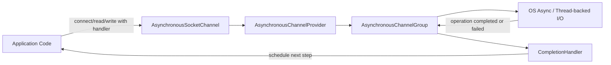
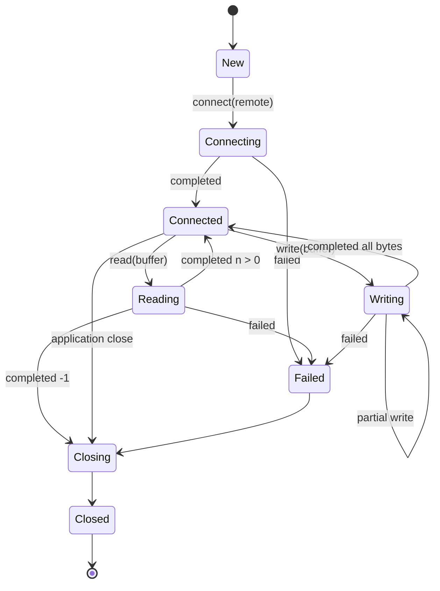
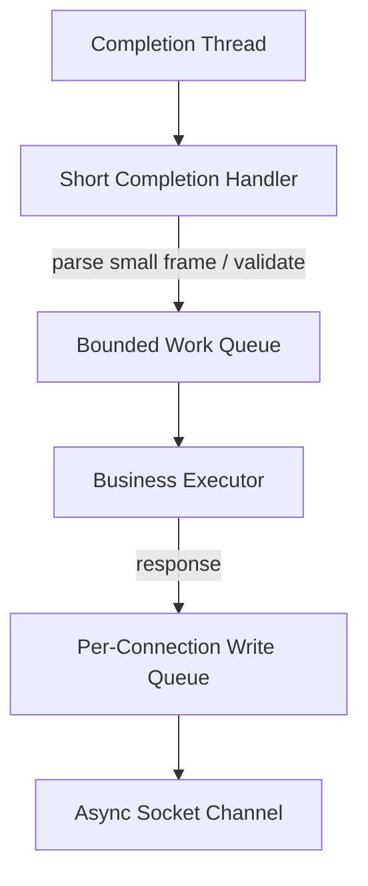
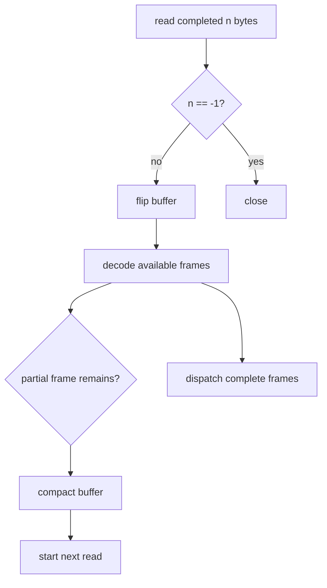
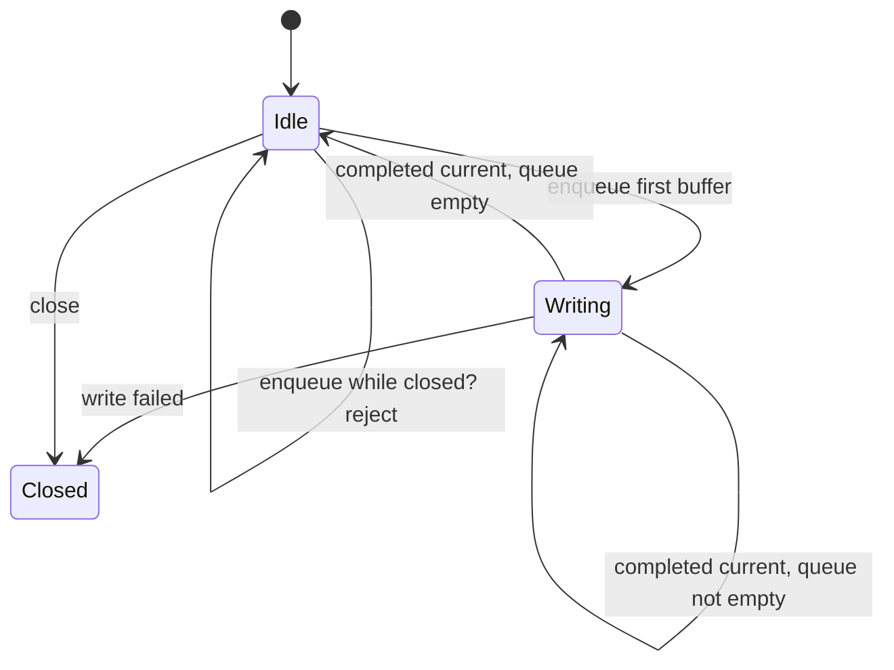

# Part 013 — Asynchronous SocketChannel and Completion Models

> Goal utama part ini: memahami `AsynchronousSocketChannel` dan `AsynchronousServerSocketChannel` sebagai model I/O berbasis completion, bukan readiness. Setelah part ini, kamu harus bisa menentukan kapan asynchronous channel masuk akal, kapan lebih baik memakai selector, dan kapan blocking socket + virtual thread justru lebih sederhana.

Part 011 dan Part 012 membahas NIO non-blocking dengan `Selector`. Di model itu, aplikasi bertanya: “channel mana yang *ready* untuk di-`read`/`write`?”

Di part ini modelnya berbeda. Dengan asynchronous channel, aplikasi memulai operasi dan menyerahkan continuation ke runtime:

```text
start operation -> return immediately -> later completion handler is invoked
```

Ini bukan sekadar “NIO dengan callback”. Ini model ownership, state, failure handling, dan backpressure yang berbeda.

---

## 1. The Skill We Are Building

Asynchronous socket programming di Java membutuhkan kemampuan berikut:

| Skill | Mengapa penting |
|---|---|
| Membedakan readiness vs completion | Banyak bug terjadi karena memperlakukan async channel seperti selector. |
| Memahami single outstanding operation invariant | `AsynchronousSocketChannel` membolehkan concurrent read dan write, tetapi hanya satu read dan satu write outstanding per channel. |
| Mendesain callback state machine | Handler harus melanjutkan operasi berikutnya tanpa kehilangan session state. |
| Mengelola buffer ownership | Buffer tidak boleh dipakai ulang sampai operasi selesai. |
| Mengelola timeout secara konservatif | Timeout async read/write bisa membuat state channel/buffer tidak aman untuk dipakai lanjut. |
| Menghindari blocking di completion thread | Completion thread adalah resource eksekusi; jangan dijadikan worker untuk pekerjaan berat. |
| Membandingkan dengan virtual threads | Tidak semua async API masih menjadi pilihan terbaik di Java modern. |

Mental model sederhananya:



Key point: aplikasi tidak lagi memegang event loop eksplisit seperti `Selector`. Namun kamu tetap perlu memegang **connection state machine** secara eksplisit.

---

## 2. Completion-Based I/O vs Readiness-Based I/O

### 2.1 Selector model: readiness

Dalam selector model:

```text
Kernel: "channel ini readable"
App:    "baik, saya akan read sampai EWOULDBLOCK / no more data"
```

Aplikasi bertanggung jawab untuk:

- memanggil `select()`;
- membaca readiness set;
- menghindari busy spin;
- menjaga interest ops;
- mengelola write queue;
- menjaga fairness antarkoneksi.

### 2.2 Async channel model: completion

Dalam async channel model:

```text
App:    "tolong baca ke buffer ini"
Runtime:"nanti saya panggil handler saat selesai atau gagal"
```

Aplikasi bertanggung jawab untuk:

- tidak memulai read kedua sebelum read pertama selesai;
- tidak memulai write kedua sebelum write pertama selesai;
- menjaga buffer hidup dan tidak disentuh selama operasi pending;
- memutuskan next operation dari callback;
- menutup channel pada failure/timeout yang tidak recoverable.

### 2.3 Konsekuensi arsitektur

| Concern | Selector | Async channel |
|---|---|---|
| Control loop | App-owned event loop | Provider/group-owned completion execution |
| Signal | Readiness | Completion/failure |
| State location | Often per-key attachment | Handler attachment/session object |
| Write backpressure | Interest `OP_WRITE` + queue | Sequential write queue + only one outstanding write |
| Read loop | Repeat read while ready | Submit next read after completion |
| Failure style | Synchronous exception or read/write result | Handler `failed(Throwable, attachment)` or failed `Future` |
| Debugging | Event loop trace | Completion trace and operation correlation |

Practical rule:

> Dengan selector, kamu mengatur kapan operasi dicoba. Dengan asynchronous channel, kamu mengatur operasi mana yang boleh pending dan apa yang terjadi setelah selesai.

---

## 3. API Surface That Matters

Kelas utama:

| Type | Role |
|---|---|
| `AsynchronousSocketChannel` | Client/accepted stream socket dengan operasi async connect/read/write. |
| `AsynchronousServerSocketChannel` | Listening socket dengan operasi async accept. |
| `AsynchronousChannelGroup` | Group untuk asynchronous channels; biasanya terkait thread pool/completion execution. |
| `CompletionHandler<V, A>` | Callback `completed(V result, A attachment)` dan `failed(Throwable exc, A attachment)`. |
| `Future<V>` | Alternatif operasi async yang dikonsumsi lewat `get()`, cancellation, atau bridging. |
| `ByteBuffer` | Buffer target/source read/write. Ownership menjadi critical. |

`AsynchronousSocketChannel` adalah stream-oriented, seperti TCP socket. Ini tetap byte stream. Semua pelajaran Part 005 dan Part 008 masih berlaku:

- tidak ada message boundary;
- read bisa partial;
- write bisa partial;
- EOF adalah `-1` pada read;
- protocol framing tetap tanggung jawab aplikasi.

---

## 4. The Most Important Invariants

### 4.1 One outstanding accept per server channel

Untuk `AsynchronousServerSocketChannel`, hanya boleh ada satu accept outstanding pada satu waktu. Pattern yang benar: submit accept berikutnya dari handler setelah accept sebelumnya selesai.

```java
server.accept(null, new CompletionHandler<>() {
    @Override
    public void completed(AsynchronousSocketChannel channel, Void ignored) {
        server.accept(null, this); // re-arm accept first or very early
        handle(channel);
    }

    @Override
    public void failed(Throwable exc, Void ignored) {
        logAcceptFailure(exc);
        if (server.isOpen()) {
            server.accept(null, this);
        }
    }
});
```

Do not do this:

```java
// Wrong: multiple outstanding accepts on the same server channel.
for (int i = 0; i < 100; i++) {
    server.accept(null, handler);
}
```

Itu akan menghasilkan desain yang salah karena server channel tidak memakai accept queue seperti task queue aplikasi.

### 4.2 One outstanding read and one outstanding write per socket channel

Satu `AsynchronousSocketChannel` boleh membaca dan menulis secara concurrent, tetapi jangan punya dua read pending atau dua write pending.

Correct mental model:

```text
allowed:     one read pending + one write pending
not allowed: two reads pending
not allowed: two writes pending
```

Desain writer harus memakai queue:

```text
enqueue message -> if no write active, start write -> on completion write remaining or next queued message
```

### 4.3 Buffer ownership belongs to the pending operation

Saat kamu memanggil:

```java
channel.read(buffer, state, handler);
```

`buffer` tidak boleh:

- dibaca aplikasi;
- ditulis aplikasi;
- di-`clear`;
- di-`flip`;
- dikembalikan ke pool;
- dipakai operasi lain;

sampai handler dipanggil.

This is not stylistic. Ini correctness invariant.

### 4.4 Completion handlers must be short

Completion handler bukan tempat untuk:

- parsing payload raksasa;
- blocking database call;
- synchronous HTTP call;
- CPU-heavy compression;
- logging blocking berlebihan;
- locking panjang.

Handler seharusnya:

1. update state;
2. schedule next I/O;
3. hand off work berat ke executor lain;
4. close channel bila failure.

### 4.5 Timeout means suspicion, not normal continuation

Async `read`/`write` punya overload dengan timeout. Tetapi bila timeout terjadi, implementasi mungkin tidak bisa menjamin apakah byte sudah terbaca/tertulis. Konsekuensinya: channel atau buffer bisa berada dalam state yang tidak aman untuk dilanjutkan.

Production rule:

> Treat async read/write timeout as a connection-level failure unless you have a very specific protocol-level reason and implementation evidence to continue.

---

## 5. Lifecycle of an Async Client

Async client lifecycle:



Code skeleton:

```java
import java.io.IOException;
import java.net.InetSocketAddress;
import java.nio.ByteBuffer;
import java.nio.channels.AsynchronousSocketChannel;
import java.nio.channels.CompletionHandler;
import java.nio.charset.StandardCharsets;

final class AsyncClientExample {
    public static void main(String[] args) throws IOException {
        var channel = AsynchronousSocketChannel.open();
        var state = new ClientState(channel);

        channel.connect(new InetSocketAddress("127.0.0.1", 9090), state,
            new CompletionHandler<Void, ClientState>() {
                @Override
                public void completed(Void result, ClientState s) {
                    s.enqueue(ByteBuffer.wrap("ping\n".getBytes(StandardCharsets.UTF_8)));
                    s.startWriteIfIdle();
                    s.startRead();
                }

                @Override
                public void failed(Throwable exc, ClientState s) {
                    s.close(exc);
                }
            });
    }
}
```

The actual complexity is not in `connect`. It is in `ClientState`.

---

## 6. Session State as the Center of Design

A robust async socket application should have an explicit session object.

```java
import java.nio.ByteBuffer;
import java.nio.channels.AsynchronousSocketChannel;
import java.nio.channels.CompletionHandler;
import java.util.ArrayDeque;
import java.util.Queue;
import java.util.concurrent.atomic.AtomicBoolean;

final class ClientState {
    private final AsynchronousSocketChannel channel;
    private final ByteBuffer readBuffer = ByteBuffer.allocateDirect(16 * 1024);
    private final Queue<ByteBuffer> writes = new ArrayDeque<>();
    private final AtomicBoolean closed = new AtomicBoolean(false);
    private boolean writeInProgress;

    ClientState(AsynchronousSocketChannel channel) {
        this.channel = channel;
    }

    synchronized void enqueue(ByteBuffer buffer) {
        if (closed.get()) {
            throw new IllegalStateException("connection closed");
        }
        writes.add(buffer);
    }

    synchronized void startWriteIfIdle() {
        if (writeInProgress || closed.get()) {
            return;
        }
        ByteBuffer current = writes.peek();
        if (current == null) {
            return;
        }
        writeInProgress = true;
        channel.write(current, this, writeHandler);
    }

    private final CompletionHandler<Integer, ClientState> writeHandler = new CompletionHandler<>() {
        @Override
        public void completed(Integer n, ClientState s) {
            synchronized (s) {
                ByteBuffer current = s.writes.peek();
                if (current == null) {
                    s.writeInProgress = false;
                    return;
                }
                if (current.hasRemaining()) {
                    s.channel.write(current, s, this);
                    return;
                }
                s.writes.remove();
                s.writeInProgress = false;
                s.startWriteIfIdle();
            }
        }

        @Override
        public void failed(Throwable exc, ClientState s) {
            s.close(exc);
        }
    };

    void startRead() {
        if (closed.get()) {
            return;
        }
        readBuffer.clear();
        channel.read(readBuffer, this, readHandler);
    }

    private final CompletionHandler<Integer, ClientState> readHandler = new CompletionHandler<>() {
        @Override
        public void completed(Integer n, ClientState s) {
            if (n == -1) {
                s.close(null);
                return;
            }
            s.readBuffer.flip();
            // Decode frames here or hand off to protocol parser.
            // Do not assume one read equals one message.
            s.readBuffer.compact();
            s.startRead();
        }

        @Override
        public void failed(Throwable exc, ClientState s) {
            s.close(exc);
        }
    };

    void close(Throwable cause) {
        if (closed.compareAndSet(false, true)) {
            try {
                channel.close();
            } catch (Exception ignored) {
                // close best effort
            }
        }
    }
}
```

Important observations:

- write is serialized;
- read is re-submitted only after completion;
- buffer is reused only after the pending operation completes;
- close is idempotent;
- protocol parser is not allowed to assume message boundary.

This is the minimum useful shape. Real production code would also add:

- deadlines;
- idle timeout;
- max inbound frame size;
- max outbound queue size;
- metrics;
- correlation ID;
- structured close reason;
- admission control.

---

## 7. Future API vs CompletionHandler API

`AsynchronousSocketChannel` offers `Future`-returning methods and `CompletionHandler` methods.

### 7.1 Future style

```java
var channel = AsynchronousSocketChannel.open();
var connectFuture = channel.connect(new InetSocketAddress("localhost", 9090));
connectFuture.get();

var buffer = ByteBuffer.allocate(1024);
var readFuture = channel.read(buffer);
int bytes = readFuture.get();
```

This looks simple, but notice the trap: if you call `get()` immediately, you have turned asynchronous I/O into blocking I/O with more complicated error handling.

Future style is useful for:

- bridging to existing blocking orchestration;
- tests;
- simple tools;
- integration with virtual threads;
- timeout via `Future.get(timeout, unit)` at orchestration layer.

Future style is weak for:

- high-throughput callback pipelines;
- careful continuation scheduling;
- per-operation attachment state;
- avoiding accidental blocking.

### 7.2 CompletionHandler style

```java
channel.read(buffer, session, new CompletionHandler<Integer, Session>() {
    @Override
    public void completed(Integer bytes, Session s) {
        s.onRead(bytes);
    }

    @Override
    public void failed(Throwable exc, Session s) {
        s.onFailure(exc);
    }
});
```

CompletionHandler style is better when:

- the next operation depends on the result;
- you need explicit state machine;
- you want no blocking orchestration thread;
- you are building a server or long-lived client.

### 7.3 CompletableFuture bridge

Sometimes the best API for application code is `CompletableFuture`, while the low-level implementation uses `CompletionHandler`.

```java
import java.net.SocketAddress;
import java.nio.ByteBuffer;
import java.nio.channels.AsynchronousSocketChannel;
import java.nio.channels.CompletionHandler;
import java.util.concurrent.CompletableFuture;

final class AsyncChannelFutures {
    static CompletableFuture<Void> connect(AsynchronousSocketChannel ch, SocketAddress remote) {
        var cf = new CompletableFuture<Void>();
        ch.connect(remote, null, new CompletionHandler<Void, Void>() {
            @Override
            public void completed(Void result, Void attachment) {
                cf.complete(null);
            }

            @Override
            public void failed(Throwable exc, Void attachment) {
                cf.completeExceptionally(exc);
            }
        });
        return cf;
    }

    static CompletableFuture<Integer> read(AsynchronousSocketChannel ch, ByteBuffer dst) {
        var cf = new CompletableFuture<Integer>();
        ch.read(dst, null, new CompletionHandler<Integer, Void>() {
            @Override
            public void completed(Integer result, Void attachment) {
                cf.complete(result);
            }

            @Override
            public void failed(Throwable exc, Void attachment) {
                cf.completeExceptionally(exc);
            }
        });
        return cf;
    }
}
```

But be careful: `CompletableFuture` does not remove the one-outstanding-read/write invariant. Your wrapper must still serialize operations per channel.

---

## 8. AsynchronousChannelGroup

`AsynchronousChannelGroup` is often ignored in tutorials, but it matters in production.

A group defines the execution context for channels opened against it. Depending on provider and platform, asynchronous I/O may be backed by OS facilities, thread pools, or a mixture.

Typical group creation:

```java
import java.nio.channels.AsynchronousChannelGroup;
import java.util.concurrent.Executors;

var executor = Executors.newFixedThreadPool(
    Runtime.getRuntime().availableProcessors(),
    r -> {
        Thread t = new Thread(r);
        t.setName("async-net-" + t.threadId());
        t.setDaemon(false);
        return t;
    }
);

AsynchronousChannelGroup group = AsynchronousChannelGroup.withThreadPool(executor);
```

Opening channels with the group:

```java
var server = AsynchronousServerSocketChannel.open(group);
var client = AsynchronousSocketChannel.open(group);
```

Design considerations:

| Question | Reason |
|---|---|
| Is the group shared by many components? | One noisy component can delay completions for another. |
| Are handlers short? | Long handlers consume completion threads. |
| Does shutdown close channels? | Group lifecycle should be owned by service lifecycle. |
| Are names observable? | Thread naming helps diagnosis. |
| Is executor bounded? | Unbounded completion execution can mask overload. |

Do not use channel group as a general business executor. Keep network completion and business work separated.



---

## 9. Async Server Pattern

A simple but defensible server uses:

- one server channel;
- one outstanding accept;
- per-connection session state;
- read loop per session;
- sequential write queue per session;
- explicit close.

```java
import java.io.IOException;
import java.net.InetSocketAddress;
import java.nio.ByteBuffer;
import java.nio.channels.AsynchronousChannelGroup;
import java.nio.channels.AsynchronousServerSocketChannel;
import java.nio.channels.AsynchronousSocketChannel;
import java.nio.channels.CompletionHandler;
import java.util.concurrent.Executors;

public final class AsyncEchoServer {
    public static void main(String[] args) throws Exception {
        var group = AsynchronousChannelGroup.withFixedThreadPool(
            Runtime.getRuntime().availableProcessors(),
            Executors.defaultThreadFactory()
        );

        var server = AsynchronousServerSocketChannel.open(group)
            .bind(new InetSocketAddress("127.0.0.1", 9090), 1024);

        server.accept(server, new CompletionHandler<AsynchronousSocketChannel, AsynchronousServerSocketChannel>() {
            @Override
            public void completed(AsynchronousSocketChannel channel, AsynchronousServerSocketChannel server) {
                server.accept(server, this);
                new EchoSession(channel).start();
            }

            @Override
            public void failed(Throwable exc, AsynchronousServerSocketChannel server) {
                if (server.isOpen()) {
                    server.accept(server, this);
                }
            }
        });

        Thread.currentThread().join();
    }

    static final class EchoSession {
        private final AsynchronousSocketChannel channel;
        private final ByteBuffer buffer = ByteBuffer.allocateDirect(8192);

        EchoSession(AsynchronousSocketChannel channel) {
            this.channel = channel;
        }

        void start() {
            read();
        }

        private void read() {
            buffer.clear();
            channel.read(buffer, this, new CompletionHandler<Integer, EchoSession>() {
                @Override
                public void completed(Integer n, EchoSession s) {
                    if (n == -1) {
                        s.close();
                        return;
                    }
                    s.buffer.flip();
                    s.write();
                }

                @Override
                public void failed(Throwable exc, EchoSession s) {
                    s.close();
                }
            });
        }

        private void write() {
            channel.write(buffer, this, new CompletionHandler<Integer, EchoSession>() {
                @Override
                public void completed(Integer n, EchoSession s) {
                    if (s.buffer.hasRemaining()) {
                        s.write();
                    } else {
                        s.read();
                    }
                }

                @Override
                public void failed(Throwable exc, EchoSession s) {
                    s.close();
                }
            });
        }

        private void close() {
            try {
                channel.close();
            } catch (IOException ignored) {
            }
        }
    }
}
```

This echo server is intentionally small. It is not yet production-grade because it lacks:

- max connection limit;
- frame parser;
- write queue limit;
- idle timeout;
- graceful shutdown;
- metrics;
- structured error taxonomy.

But the shape is correct: no concurrent read, no concurrent write, no buffer reuse while pending.

---

## 10. Protocol Parser Integration

Async channels do not change protocol parsing. You still need a decoder that can handle:

- zero, one, or many frames per read;
- partial frame;
- invalid frame;
- max frame size;
- EOF mid-frame;
- slow sender;
- oversized body.

A safe read path:



Important: do not start the next read until buffer state is valid for the next write into it.

Common bug:

```java
// Wrong: starts next read before parser has consumed/compacted buffer safely.
channel.read(buffer, state, handler);
parse(buffer);
```

Correct structure:

```java
// Right shape: completion -> parse -> compact -> submit next read.
void onReadComplete(int n) {
    if (n == -1) {
        close();
        return;
    }
    buffer.flip();
    decoder.decode(buffer, this::onFrame);
    buffer.compact();
    channel.read(buffer, this, readHandler);
}
```

---

## 11. Write Queue and Backpressure

Async write accepts a buffer and later tells you how many bytes were written. Partial writes are normal. A production writer must:

1. preserve order;
2. continue partial buffer;
3. avoid concurrent writes;
4. bound queue size;
5. close or reject on overload;
6. support cancellation/close.

### 11.1 Naive writer bug

```java
// Wrong: two writes can be pending at the same time.
channel.write(ByteBuffer.wrap(a), null, handler);
channel.write(ByteBuffer.wrap(b), null, handler);
```

Even if this seems to work in a test, it violates the model.

### 11.2 Better writer state machine



### 11.3 Backpressure policy

| Condition | Safe policy |
|---|---|
| Queue below limit | Enqueue and return. |
| Queue at limit, low-priority message | Reject or drop depending on protocol. |
| Queue at limit, required response | Close connection with overload reason. |
| Write timeout | Close connection. |
| Peer reads too slowly | Close after write backlog/age threshold. |

A slow reader must not be allowed to turn your server into an unbounded memory buffer.

---

## 12. Timeouts and Deadlines

Async channel timeout overloads are tempting:

```java
channel.read(buffer, 5, TimeUnit.SECONDS, state, handler);
channel.write(buffer, 5, TimeUnit.SECONDS, state, handler);
```

Use them carefully.

Production timeout taxonomy:

| Timeout | Scope | Typical action |
|---|---|---|
| Connect timeout | Establishing connection | Fail attempt; maybe retry at higher layer. |
| Read operation timeout | One async read did not complete | Close connection unless protocol says otherwise. |
| Write operation timeout | One async write did not complete | Close connection; peer likely slow or network stuck. |
| Idle timeout | No useful activity for too long | Close gracefully. |
| Request deadline | Whole request exceeded budget | Fail request; close if protocol state is ambiguous. |

Avoid mixing operation timeout and business deadline without clear semantics. A request deadline says “this operation no longer matters.” A socket timeout says “the transport operation did not complete.” Those are not the same failure.

---

## 13. Error Handling Model

Useful async network errors:

| Error class / symptom | Meaning | Typical action |
|---|---|---|
| `NotYetConnectedException` | I/O attempted before connect completion | Programming bug; fix state machine. |
| `ReadPendingException` | Second read submitted before first completed | Programming bug; serialize reads. |
| `WritePendingException` | Second write submitted before first completed | Programming bug; write queue. |
| `AcceptPendingException` | Second accept submitted before first completed | Programming bug; re-arm accept only on completion/failure. |
| `InterruptedByTimeoutException` | Async operation timeout elapsed | Treat channel as suspect; close. |
| `AsynchronousCloseException` | Channel closed while operation pending | Usually normal during shutdown/cancel. |
| EOF `-1` | Peer closed output | Protocol-dependent; usually close after flushing or close immediately. |
| `IOException` | Transport error | Close and classify. |

The important distinction:

- pending exceptions are usually **local state machine bugs**;
- I/O exceptions are usually **transport/peer/environment failures**;
- timeout is usually **ambiguous transport state**.

---

## 14. Cancellation Semantics

A `Future` can be cancelled:

```java
Future<Integer> f = channel.read(buffer);
f.cancel(true);
```

But cancellation of network I/O is not a clean business abstraction. If you cancel an operation, you must decide whether the connection remains safe.

Safe policy:

- for one-shot utility clients, close channel after cancellation;
- for long-lived protocol clients, avoid per-read cancellation unless protocol can resynchronize;
- for request timeout, prefer marking request failed and closing or draining according to protocol;
- never return a buffer to pool until you know the operation is completed/cancelled and no handler can access it.

---

## 15. Async Channel vs Selector vs Virtual Threads

This decision matters more in modern Java.

| Model | Best when | Avoid when |
|---|---|---|
| Blocking socket + platform threads | Few connections, simple tools, legacy code | Many idle connections with thread-per-connection cost. |
| Blocking socket + virtual threads | Many mostly-blocking connections, simple sequential code, Java 21+ baseline | Need manual event-loop-level control or native non-JDK async integration. |
| Selector NIO | Need explicit event-loop control, custom protocol server, very high connection count | Team cannot maintain event-loop complexity. |
| Async channel | Completion-driven integration, Windows IOCP-style model, existing completion architecture | Handlers become callback maze or you need strict event-loop predictability. |

For many Java 21+ services, virtual threads reduce the need to use callback-based async socket code for ordinary client/server workloads. But async channels remain important when:

- integrating with completion-based infrastructure;
- avoiding explicit selector loops;
- building libraries that expose async APIs;
- handling many pending operations with controlled completion groups;
- maintaining code that already uses async NIO.2.

Do not choose async channels because “async is faster.” Choose them because their execution model matches your problem.

---

## 16. Production Design Checklist

Before shipping an async socket component, answer these:

### Channel lifecycle

- Who owns the channel?
- Who closes it?
- Is close idempotent?
- What happens to pending operations on close?
- Are close reasons observable?

### Read path

- Is there only one outstanding read?
- Is the read buffer owned exclusively by the pending read?
- Is protocol framing robust against partial/multiple frames?
- Is max frame size enforced?
- Is EOF handled explicitly?

### Write path

- Is there only one outstanding write?
- Is outbound order preserved?
- Is queue memory bounded?
- What happens when peer is slow?
- Are partial writes handled?

### Execution

- Are completion handlers short?
- Is business work offloaded to a separate bounded executor?
- Are group threads named and observable?
- Is group lifecycle tied to service lifecycle?

### Failure

- Are pending-operation exceptions treated as programming bugs?
- Are timeouts treated conservatively?
- Are retries handled above the transport layer?
- Are metrics emitted per failure class?

---

## 17. Testing Strategy

You cannot validate async networking with only happy-path tests.

### 17.1 Unit tests

Test state machine methods without real network:

- enqueue while idle starts write;
- enqueue while writing does not start second write;
- partial write continues same buffer;
- EOF closes;
- failure closes once;
- max queue rejects.

### 17.2 Integration tests

Use real sockets:

- client connects and exchanges frames;
- server accepts multiple clients;
- peer closes output;
- peer stops reading;
- peer sends frame byte-by-byte;
- server shuts down while operations pending.

### 17.3 Failure injection

Test:

- connection refused;
- blackhole connect;
- slow reader;
- slow writer;
- handler exception;
- timeout;
- cancellation;
- abrupt close.

### 17.4 Handler exception rule

Do not allow handler exceptions to disappear silently. Wrap handler logic:

```java
@Override
public void completed(Integer n, Session s) {
    try {
        s.onRead(n);
    } catch (Throwable t) {
        s.close(t);
    }
}
```

This is not because you want to catch everything everywhere. It is because an exception escaping a callback often becomes a diagnosis problem rather than a clean connection failure.

---

## 18. Observability Hooks Specific to Async Channels

You do not need general observability theory here. You need operation-level correlation.

Emit events such as:

| Event | Useful fields |
|---|---|
| `async.connect.started` | remote, deadline, connection id |
| `async.connect.completed` | duration, local address, remote address |
| `async.connect.failed` | exception class, duration |
| `async.read.started` | connection id, buffer capacity |
| `async.read.completed` | bytes, duration |
| `async.write.enqueued` | bytes, queue depth |
| `async.write.completed` | bytes, remaining, queue depth |
| `async.timeout` | op type, timeout, connection state |
| `async.close` | reason, pending read/write flags |

For debugging, the most important question is:

```text
Which operation was pending when the connection failed?
```

So your session should track:

```java
record PendingOps(boolean readPending, boolean writePending, int outboundQueueDepth) {}
```

---

## 19. Common Anti-Patterns

### Anti-pattern 1: Callback nesting without state machine

```java
connect(... completed -> read(... completed -> write(... completed -> read(...))))
```

This becomes untestable. Use session methods and named state transitions.

### Anti-pattern 2: Blocking inside handler

```java
public void completed(Integer n, Session s) {
    repository.save(s.decode()); // blocking DB call in completion thread
    s.read();
}
```

Offload.

### Anti-pattern 3: Unbounded write queue

A slow peer can consume your heap.

### Anti-pattern 4: Treating timeout as harmless

After async read/write timeout, assume protocol state may be corrupted. Close unless proven otherwise.

### Anti-pattern 5: Reusing buffers too early

Returning a buffer to pool before completion is a data race in disguise.

### Anti-pattern 6: Hiding local programming bugs as network flakiness

`ReadPendingException`, `WritePendingException`, and `AcceptPendingException` are not flaky network. They are state machine defects.

---

## 20. Deliberate Practice Drills

### Drill 1 — One-read invariant

Build a small `Session` class that throws if `startRead()` is called while `readPending = true`. Write tests that prove the guard catches the bug.

### Drill 2 — Sequential writer

Implement a writer that accepts `ByteBuffer` messages and guarantees:

- order preserved;
- one pending write;
- partial write continuation;
- max queue bytes;
- close-on-failure.

### Drill 3 — Timeout policy

Add read timeout. On timeout:

- record close reason;
- close channel;
- discard buffer;
- emit metric.

Do not attempt to reuse the same connection.

### Drill 4 — Completion-to-CompletableFuture bridge

Expose `connectAsync`, `readAsync`, and `writeFullyAsync`, but keep per-channel serialization. The public API can be futures; the internal model must still protect channel invariants.

### Drill 5 — Compare implementations

Implement the same echo protocol with:

1. blocking socket + virtual thread;
2. selector NIO;
3. asynchronous channel.

Compare:

- code complexity;
- failure handling;
- backpressure clarity;
- testability;
- operational debuggability.

---

## 21. Summary

`AsynchronousSocketChannel` is not a magic faster socket. It is a different concurrency contract.

The essential rules:

1. One accept pending per async server channel.
2. One read and one write pending per async socket channel.
3. Buffer belongs to the pending operation.
4. Completion handler must be short.
5. Timeout is a suspicious transport state.
6. Use explicit session state machines.
7. Serialize writes with a bounded queue.
8. Choose async channels only when completion-based design fits.

If you internalize those rules, async channels become manageable. If you ignore them, the code looks elegant for the first 100 lines and becomes nearly impossible to debug under load.

---

## References

- Oracle Java SE 25 API — `AsynchronousSocketChannel`
- Oracle Java SE 25 API — `AsynchronousServerSocketChannel`
- Oracle Java SE 25 API — `AsynchronousChannelGroup`
- Oracle Java SE 25 API — `CompletionHandler`
- Java NIO.2 asynchronous channel API, introduced in Java 7

---

## Next Part

Part 014 akan membahas **Unix-Domain Sockets and Local IPC**: kapan memakai socket berbasis path file, bagaimana Java mendukungnya lewat `SocketChannel`/`ServerSocketChannel`, dan apa konsekuensi production-nya untuk cleanup, permission, container, latency, dan local sidecar architecture.
