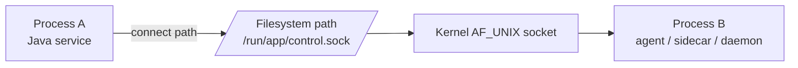
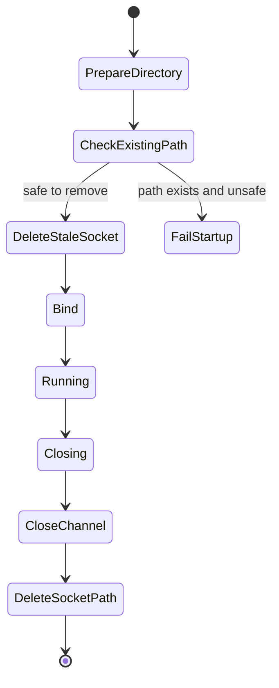
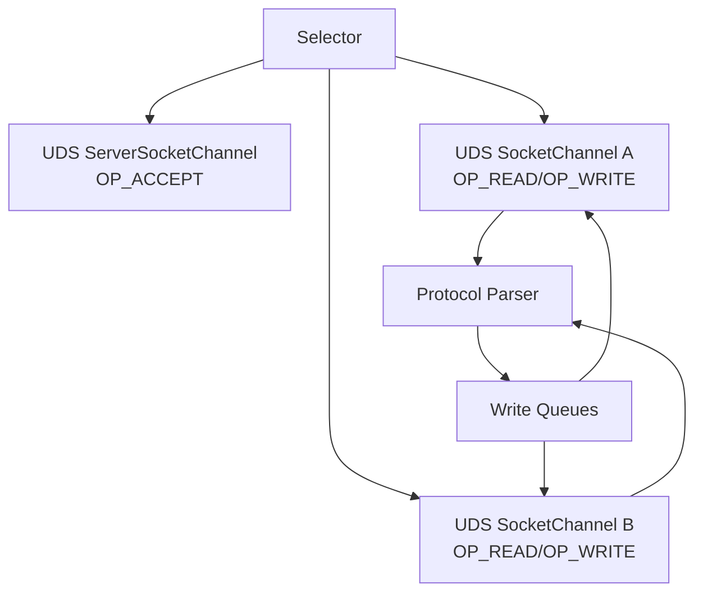
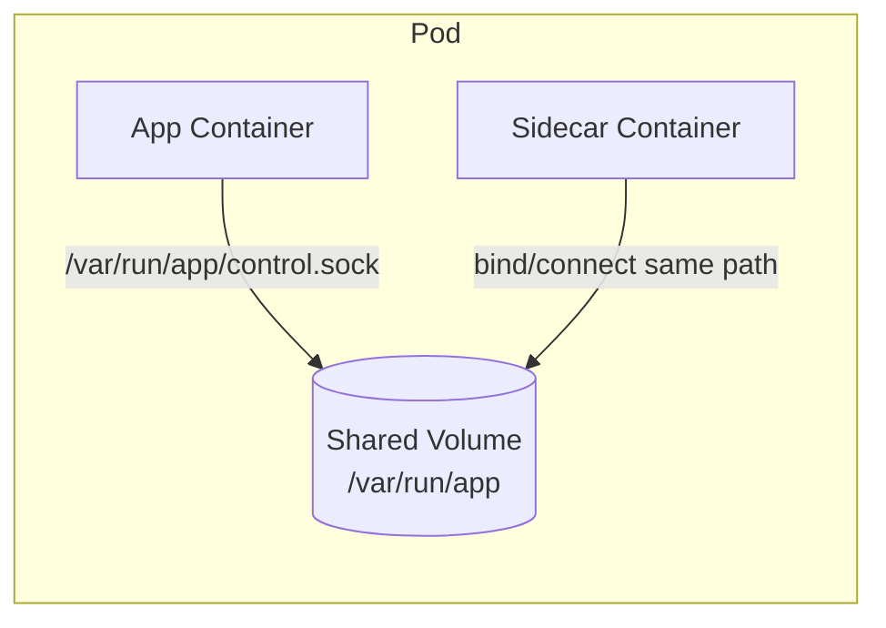

# Part 014 — Unix-Domain Sockets and Local IPC

> Goal utama part ini: memahami Unix-domain socket sebagai mekanisme local IPC yang didukung Java modern melalui NIO channel, serta mengetahui kapan ia lebih tepat daripada TCP loopback, pipe, file, HTTP lokal, atau message broker.

Unix-domain socket sering disalahpahami sebagai “socket yang lebih cepat”. Itu terlalu sempit. Yang lebih penting: Unix-domain socket mengubah **addressing**, **security boundary**, **deployment boundary**, dan **failure model**.

Dalam TCP/IP, endpoint adalah:

```text
IP address + port
```

Dalam Unix-domain socket, endpoint adalah:

```text
filesystem path
```

Di Java modern, ini berarti kamu bisa memakai `SocketChannel` dan `ServerSocketChannel` dengan `StandardProtocolFamily.UNIX` dan `UnixDomainSocketAddress` untuk komunikasi antarproses pada host yang sama.

---

## 1. Why This Part Exists

Kamu sudah mempelajari:

- TCP stream semantics;
- `Socket` / `ServerSocket`;
- NIO `SocketChannel` / `ServerSocketChannel`;
- selector dan event-loop;
- asynchronous channels.

Unix-domain socket memakai banyak mental model yang sama:

- tetap stream-oriented;
- tetap byte-oriented;
- tetap butuh framing;
- tetap bisa partial read/write;
- tetap butuh close handling;
- tetap bisa dipakai blocking atau non-blocking via NIO channel.

Yang berbeda:

- tidak ada IP/port;
- address berupa path file;
- permission filesystem bisa menjadi security boundary;
- socket file punya lifecycle sendiri;
- hanya untuk IPC lokal pada host yang sama;
- opsi socket berbeda dari TCP;
- path length dan cleanup menjadi production concern.

---

## 2. Mental Model



The path is not “the data file”. It is a name used to locate the kernel socket endpoint.

A common misconception:

```text
Wrong: data is written into /run/app/control.sock as normal file content.
Right: path identifies a socket endpoint managed by the OS.
```

---

## 3. When Unix-Domain Sockets Are Useful

Use Unix-domain sockets when the communication is:

- local to one host;
- between cooperating processes;
- latency-sensitive;
- not intended to be remotely accessible;
- easier to secure through filesystem permissions;
- deployed via sidecar/agent/daemon pattern;
- inconvenient to expose through TCP port management.

Common examples:

| Use case | Why UDS helps |
|---|---|
| App ↔ local proxy/sidecar | Avoid exposing TCP port; use filesystem permission. |
| App ↔ local agent | Agent control API can be local-only. |
| App ↔ local database socket | Some databases expose local socket path. |
| Container ↔ container on same host via shared volume | Path can be shared without service discovery. |
| Test harness ↔ server process | Avoid random port allocation conflicts. |
| Admin control plane | Local-only admin endpoint without binding network interface. |

Do not use Unix-domain socket when:

- clients are remote;
- service discovery requires network identity;
- load balancers must route traffic;
- Kubernetes Service abstraction is required directly;
- cross-host communication is needed;
- operations team cannot manage filesystem path/permission lifecycle.

---

## 4. Java API Overview

Key Java types:

| Type | Role |
|---|---|
| `StandardProtocolFamily.UNIX` | Protocol family for Unix-domain socket channels. |
| `UnixDomainSocketAddress` | Socket address backed by filesystem path. |
| `SocketChannel` | Client stream channel; can open/connect to UDS. |
| `ServerSocketChannel` | Server stream channel; can bind to UDS path. |
| `Selector` | Can multiplex UDS channels similarly to TCP channels. |

Important limitation for this series:

> Java's Unix-domain socket support is in the NIO channel family. Do not assume legacy `Socket` / `ServerSocket` APIs support the same addressing model.

The practical creation pattern:

```java
import java.net.StandardProtocolFamily;
import java.net.UnixDomainSocketAddress;
import java.nio.channels.ServerSocketChannel;
import java.nio.channels.SocketChannel;
import java.nio.file.Path;

Path path = Path.of("/tmp/my-service.sock");
var address = UnixDomainSocketAddress.of(path);

try (ServerSocketChannel server = ServerSocketChannel.open(StandardProtocolFamily.UNIX)) {
    server.bind(address);

    try (SocketChannel client = SocketChannel.open(StandardProtocolFamily.UNIX)) {
        client.connect(address);
    }
}
```

Convenience client open can infer protocol family from address:

```java
var address = UnixDomainSocketAddress.of("/tmp/my-service.sock");
try (SocketChannel client = SocketChannel.open(address)) {
    // connected
}
```

For a server, be explicit with `StandardProtocolFamily.UNIX`.

---

## 5. TCP Loopback vs Unix-Domain Socket

| Dimension | TCP loopback | Unix-domain socket |
|---|---|---|
| Address | `127.0.0.1:port`, `[::1]:port` | Filesystem path |
| Scope | Local by bind choice, but still IP stack | Local host IPC |
| Access control | Firewall, bind address, app auth | Filesystem permissions + app auth |
| Discovery | Port/service config | Path config |
| Cleanup | Port released on close, with TCP lifecycle caveats | Socket path may remain after close |
| Protocol | Byte stream | Byte stream |
| Framing need | Yes | Yes |
| Remote clients | Possible | No |
| Container sharing | Network namespace dependent | Shared volume/path dependent |
| Operational familiarity | Very high | Medium; requires path hygiene |

Do not choose UDS only for performance. Choose it when local-only identity and filesystem access control simplify the system.

---

## 6. Addressing and Filesystem Path Semantics

A Unix-domain socket address encapsulates a path.

```java
var a1 = UnixDomainSocketAddress.of("/run/myapp/admin.sock");
var a2 = UnixDomainSocketAddress.of(Path.of("/run", "myapp", "admin.sock"));
```

Production path guidelines:

| Guideline | Reason |
|---|---|
| Prefer `/run/<app>/<name>.sock` for runtime socket on Linux | Runtime files disappear across reboot and match operational convention. |
| Avoid deep long paths | Many OSes impose short AF_UNIX path limits. |
| Ensure parent directory exists | `bind` will not create parent directories for you. |
| Control parent directory permissions | Socket permission alone is not enough if directory is world-writable. |
| Avoid predictable path in unsafe shared dir | Symlink/path replacement attacks become possible. |
| Delete stale socket file on startup only after validation | Blind delete can remove someone else's file if path handling is unsafe. |

Example path setup:

```java
import java.nio.file.Files;
import java.nio.file.Path;
import java.nio.file.attribute.PosixFilePermissions;

Path dir = Path.of("/run/my-service");
Files.createDirectories(dir);

// On POSIX systems only. Guard this in portable code.
try {
    Files.setPosixFilePermissions(dir, PosixFilePermissions.fromString("rwx------"));
} catch (UnsupportedOperationException ignored) {
    // Non-POSIX filesystem. Use platform-specific permission strategy.
}
```

---

## 7. Socket File Lifecycle

TCP port lifecycle:

```text
bind port -> close socket -> port eventually reusable
```

Unix-domain socket path lifecycle:

```text
bind path -> close socket -> filesystem node may still exist -> must delete
```

This is one of the most important operational differences.

Safe server lifecycle:



A naive startup does this:

```java
Files.deleteIfExists(socketPath);
server.bind(address);
```

That is convenient, but not always safe. Production code should reason about:

- Who owns the directory?
- Can another user create a file at that path?
- Is the existing path actually a socket?
- Is a previous server still running?
- Is the path inside a shared volume?

For internal services in a locked-down runtime directory, `deleteIfExists` may be acceptable. In multi-user or shared environments, be stricter.

---

## 8. Minimal Blocking UDS Server

Although UDS is exposed through NIO channel, `SocketChannel` and `ServerSocketChannel` can operate in blocking mode.

```java
import java.io.IOException;
import java.net.StandardProtocolFamily;
import java.net.UnixDomainSocketAddress;
import java.nio.ByteBuffer;
import java.nio.channels.ServerSocketChannel;
import java.nio.channels.SocketChannel;
import java.nio.file.Files;
import java.nio.file.Path;

public final class UnixSocketEchoServer {
    public static void main(String[] args) throws IOException {
        Path path = Path.of("/tmp/java-networking-echo.sock");
        Files.deleteIfExists(path);

        var address = UnixDomainSocketAddress.of(path);

        try (ServerSocketChannel server = ServerSocketChannel.open(StandardProtocolFamily.UNIX)) {
            server.bind(address);
            System.out.println("listening on " + path);

            while (true) {
                try (SocketChannel client = server.accept()) {
                    echo(client);
                }
            }
        } finally {
            Files.deleteIfExists(path);
        }
    }

    private static void echo(SocketChannel client) throws IOException {
        ByteBuffer buffer = ByteBuffer.allocate(8192);
        while (true) {
            buffer.clear();
            int n = client.read(buffer);
            if (n == -1) {
                return;
            }
            buffer.flip();
            while (buffer.hasRemaining()) {
                client.write(buffer);
            }
        }
    }
}
```

This code is intentionally simple. It is useful for understanding mechanics, not for production concurrency.

Problems if used as-is:

- handles one client at a time;
- no framing;
- no max input size;
- no graceful shutdown signal;
- naive stale path deletion;
- no permission hardening;
- no observability.

---

## 9. Minimal UDS Client

```java
import java.io.IOException;
import java.net.UnixDomainSocketAddress;
import java.nio.ByteBuffer;
import java.nio.channels.SocketChannel;
import java.nio.charset.StandardCharsets;
import java.nio.file.Path;

public final class UnixSocketEchoClient {
    public static void main(String[] args) throws IOException {
        var address = UnixDomainSocketAddress.of(Path.of("/tmp/java-networking-echo.sock"));

        try (SocketChannel client = SocketChannel.open(address)) {
            ByteBuffer out = ByteBuffer.wrap("hello over uds\n".getBytes(StandardCharsets.UTF_8));
            while (out.hasRemaining()) {
                client.write(out);
            }

            ByteBuffer in = ByteBuffer.allocate(1024);
            int n = client.read(in);
            if (n > 0) {
                in.flip();
                System.out.println(StandardCharsets.UTF_8.decode(in));
            }
        }
    }
}
```

Notice what did **not** change:

- still `ByteBuffer`;
- still partial write loop;
- still read returns byte count;
- still EOF is `-1`;
- still no message boundary.

---

## 10. Non-Blocking UDS with Selector

One powerful feature: once you have a `SocketChannel` or `ServerSocketChannel`, much of the Part 011/012 selector architecture still applies.

```java
import java.net.StandardProtocolFamily;
import java.net.UnixDomainSocketAddress;
import java.nio.channels.SelectionKey;
import java.nio.channels.Selector;
import java.nio.channels.ServerSocketChannel;
import java.nio.file.Files;
import java.nio.file.Path;

Path path = Path.of("/tmp/java-networking-nio.sock");
Files.deleteIfExists(path);

Selector selector = Selector.open();
ServerSocketChannel server = ServerSocketChannel.open(StandardProtocolFamily.UNIX);
server.configureBlocking(false);
server.bind(UnixDomainSocketAddress.of(path));
server.register(selector, SelectionKey.OP_ACCEPT);
```

The event loop design remains similar:

```text
select -> accept UDS channel -> configure non-blocking -> register OP_READ -> decode stream
```

Architecture diagram:



This is why UDS can be introduced without rewriting your entire protocol stack, if your networking code is already address-family agnostic.

---

## 11. Protocol Design Over UDS

Unix-domain socket does not give message boundaries. Treat it like TCP stream.

Good protocol choices:

| Pattern | Fit |
|---|---|
| Length-prefixed binary frame | Best for internal high-throughput IPC. |
| Newline-delimited JSON | Simple admin/control APIs. |
| HTTP over UDS | Useful if stack supports custom transport; not directly `HttpClient` default. |
| Request-response binary protocol | Good for agent/service communication. |
| Streaming events | Possible, but needs backpressure and framing. |

Avoid:

- assuming one `write` equals one `read`;
- unbounded JSON parsing;
- no authentication because “it is local”; 
- world-writable socket directory;
- protocol without version field;
- no close handshake for admin operations.

Example length-prefixed control frame:

```text
+----------------+-----------------+--------------------+
| magic 2 bytes  | length 4 bytes  | payload N bytes    |
+----------------+-----------------+--------------------+
```

Minimal invariants:

- length must be non-negative;
- length must be below max frame size;
- magic/version must match;
- unknown command must fail gracefully;
- malformed frame closes connection.

---

## 12. Security Model

Unix-domain socket reduces remote exposure, but it is not a complete security system.

### 12.1 What it helps with

It can help ensure:

- service is not reachable from remote network;
- only local processes with filesystem access can connect;
- access can be limited by directory/socket permissions;
- port scanners cannot reach it through network interface;
- local sidecar communication avoids binding TCP ports.

### 12.2 What it does not solve

It does not automatically solve:

- compromised local user;
- compromised container sharing the volume;
- malicious process with same UID;
- confused deputy bugs;
- request authorization;
- payload validation;
- denial-of-service by allowed local peer;
- stale socket file replacement risks.

### 12.3 Practical hardening

| Control | Purpose |
|---|---|
| Private runtime directory | Prevent unauthorized path creation. |
| Strict directory permissions | Prevent symlink/path replacement. |
| Socket file permission strategy | Limit which user/group can connect. |
| Application-level auth for sensitive commands | Defense in depth. |
| Max connection count | Prevent local DoS. |
| Max frame size | Prevent memory abuse. |
| Audit logs for admin commands | Forensic value. |
| Startup path validation | Avoid binding/deleting unsafe path. |

A safe mental model:

> UDS changes the network boundary into a local filesystem boundary. You still need protocol-level trust decisions.

---

## 13. Container and Kubernetes Considerations

Unix-domain socket is local to a host/kernel context and represented through filesystem path. In containerized environments, the useful question is not “can Java open it?” but “do both processes see the same path?”

### 13.1 Same container

Simple:

```text
process A and process B share filesystem namespace -> same path visible
```

### 13.2 Sidecar containers in one pod

Potentially useful with shared volume:



But you must coordinate:

- volume mount path;
- startup ordering;
- readiness checks;
- file permissions inside containers;
- UID/GID mapping;
- stale socket cleanup;
- sidecar restart behavior.

### 13.3 Across hosts

UDS is not for cross-host communication. Use TCP/gRPC/HTTP/messaging/service mesh for that.

### 13.4 Readiness problem

With TCP, readiness checks often try to connect to a port. With UDS, readiness must check:

- socket path exists;
- connect succeeds;
- protocol health command succeeds.

Path existence alone is insufficient because stale socket file may remain.

---

## 14. Operational Failure Matrix

| Symptom | Likely cause | Diagnostic path | Fix |
|---|---|---|---|
| `NoSuchFileException` or connect fails path missing | Server not started or wrong path/mount | Check configured path and container mounts | Align config/startup/readiness. |
| Bind fails because file exists | Stale socket file or running server | Check process ownership and file type | Remove stale safely or fail startup. |
| Permission denied | Directory/socket permission or UID mismatch | Inspect dir ownership, mode, container UID | Set runtime directory and group correctly. |
| Works locally, fails in container | Path not mounted/shared | Inspect container filesystem | Use shared volume or same container. |
| Random startup race | Client connects before server bind | Add readiness handshake | Retry with deadline at client startup. |
| Long path error | OS AF_UNIX path limit | Print byte length of path | Use shorter runtime directory. |
| High memory use | Slow local peer and unbounded writes | Inspect write queue depth | Add queue limits and close slow consumers. |
| Protocol desync | Assumed message boundary | Packet/log frame decoder state | Implement framing correctly. |

---

## 15. Designing a Local Control Plane Over UDS

A common production use case: expose a local admin/control API without opening TCP.

Example commands:

- `GET_STATUS`
- `DRAIN_CONNECTIONS`
- `ROTATE_CERTIFICATES`
- `RELOAD_CONFIG`
- `DUMP_STATE`
- `SHUTDOWN_GRACEFULLY`

Architecture:

```mermaid
flowchart TD
    CLI[Local Admin CLI]
    Socket[/run/myservice/admin.sock]
    UdsServer[UDS Control Server]
    Auth[Local AuthZ / Command Policy]
    Service[Service Runtime]
    Audit[Audit Log]

    CLI --> Socket
    Socket --> UdsServer
    UdsServer --> Auth
    Auth --> Service
    Auth --> Audit
```

Design rules:

| Rule | Reason |
|---|---|
| Keep command set small | Admin APIs become dangerous quickly. |
| Require command version | Avoid CLI/server mismatch. |
| Return structured error | Operators need diagnosis. |
| Audit mutating commands | Local does not mean invisible. |
| Use deadline per command | Avoid stuck admin CLI. |
| Protect dump commands | State dumps can leak secrets. |
| Keep protocol stable | CLI and server may be deployed separately. |

Example NDJSON command:

```json
{"version":1,"command":"GET_STATUS","requestId":"01J..."}
```

Response:

```json
{"requestId":"01J...","ok":true,"status":"DRAINING","activeConnections":12}
```

NDJSON is not always the fastest, but for local admin control it is often easier to inspect and debug.

---

## 16. Migration Pattern: TCP Loopback to UDS

Suppose you have a local agent currently exposed at:

```text
127.0.0.1:8123
```

A safe migration path:

### Step 1 — Abstract endpoint

```java
sealed interface LocalEndpoint permits TcpEndpoint, UnixEndpoint {}
record TcpEndpoint(String host, int port) implements LocalEndpoint {}
record UnixEndpoint(Path path) implements LocalEndpoint {}
```

### Step 2 — Abstract channel creation

```java
SocketChannel open(LocalEndpoint endpoint) throws IOException {
    return switch (endpoint) {
        case TcpEndpoint tcp -> SocketChannel.open(
            new java.net.InetSocketAddress(tcp.host(), tcp.port())
        );
        case UnixEndpoint unix -> SocketChannel.open(
            UnixDomainSocketAddress.of(unix.path())
        );
    };
}
```

### Step 3 — Keep protocol unchanged

If your protocol is a clean byte-stream protocol with framing, it can stay unchanged.

### Step 4 — Run dual mode

Support both:

```text
agent.endpoint=tcp://127.0.0.1:8123
agent.endpoint=unix:///run/myagent/agent.sock
```

### Step 5 — Change default after operational readiness

Only flip default after:

- deployment creates runtime directory;
- permissions are validated;
- readiness checks connect via UDS;
- cleanup works on restart;
- rollback path exists.

---

## 17. Testing Unix-Domain Socket Code

### 17.1 Unit tests

Test endpoint parsing:

- valid `unix:///run/app/a.sock`;
- relative path rejection if policy disallows;
- max path length guard;
- unsafe directory rejection;
- TCP fallback.

### 17.2 Integration tests

Use temporary directory:

```java
Path dir = Files.createTempDirectory("uds-test-");
Path socket = dir.resolve("server.sock");
```

Test:

- server binds;
- client connects;
- echo frame roundtrip;
- stale socket cleanup;
- permission denied scenario where supported;
- restart server at same path;
- multiple clients;
- client before server readiness.

### 17.3 Cleanup test

Explicitly assert:

```java
assertFalse(Files.exists(socket), "socket path should be cleaned after server shutdown");
```

But be careful on platforms/filesystems where behavior differs. The production requirement is: no stale path prevents next bind.

---

## 18. Performance Considerations

UDS can reduce latency and CPU compared with TCP loopback because it avoids parts of the IP stack. But real performance depends on:

- payload size;
- framing;
- copies between user/kernel space;
- buffer allocation;
- context switches;
- batching;
- peer speed;
- protocol encoding cost;
- logging;
- TLS absence/presence in TCP equivalent;
- scheduler behavior.

Benchmark carefully.

Bad benchmark:

```text
send 1 byte, no warmup, no GC visibility, one run, compare average only
```

Better benchmark:

- warm up JVM;
- test realistic payloads;
- record p50/p95/p99;
- measure CPU;
- include serialization cost;
- include concurrent clients;
- test slow peer;
- test restart/cleanup overhead;
- compare with TCP loopback under same protocol.

Performance is a reason to evaluate UDS, not a reason to bypass design discipline.

---

## 19. Production Checklist

Before adopting UDS:

### API and compatibility

- Is Java runtime at least version supporting UDS channel API?
- Does target OS support required behavior?
- Are all deployments using compatible filesystem paths?
- Is your code using `SocketChannel` / `ServerSocketChannel`, not legacy `Socket` only?

### Path lifecycle

- Is parent directory created by deployment?
- Are permissions correct?
- Is stale socket cleanup safe?
- Is path short enough?
- Is socket deleted on shutdown?
- What happens after crash?

### Protocol

- Is framing explicit?
- Is max frame size enforced?
- Is protocol versioned?
- Are errors structured?
- Are slow clients handled?

### Security

- Is directory access restricted?
- Does app validate commands?
- Are sensitive commands authorized?
- Are mutating commands audited?
- Is path protected from symlink/replacement attacks?

### Operations

- Does readiness check perform actual connect?
- Are metrics emitted separately for UDS endpoint?
- Is there a rollback TCP endpoint or fallback strategy?
- Do logs include socket path and peer context where possible?
- Is restart behavior tested?

---

## 20. Common Anti-Patterns

### Anti-pattern 1: Assuming local means trusted

Local attacker, compromised sidecar, wrong UID, or shared volume mistake can still abuse the endpoint.

### Anti-pattern 2: Checking only `Files.exists(path)` for readiness

A stale socket path can exist while no server is listening. Readiness should connect and perform a protocol-level health check.

### Anti-pattern 3: Blindly deleting path in `/tmp`

World-writable directories require careful handling. Use a private runtime directory.

### Anti-pattern 4: Migrating bad protocol from TCP to UDS

UDS does not fix missing framing, unbounded payloads, or lack of backpressure.

### Anti-pattern 5: Ignoring path length

Deep container mount paths can exceed AF_UNIX path limits. Use short runtime paths.

### Anti-pattern 6: Treating UDS as cross-container magic

It only works if both processes see the same filesystem path and permissions allow access.

---

## 21. Deliberate Practice Drills

### Drill 1 — Echo over UDS

Build a blocking UDS echo server and client. Verify:

- socket file created on bind;
- client can connect;
- echo works;
- file deleted on shutdown;
- restart works at same path.

### Drill 2 — Length-prefixed local protocol

Implement a length-prefixed protocol over UDS:

```text
4-byte length + payload
```

Add:

- max frame size;
- partial read handling;
- invalid length rejection;
- EOF mid-frame handling.

### Drill 3 — Permission experiment

On POSIX system:

- create runtime directory with restrictive permission;
- run server as one user;
- attempt client from another user/group;
- observe failure mode.

### Drill 4 — TCP/UDS endpoint abstraction

Create one client protocol implementation that can connect to either:

- `tcp://127.0.0.1:9000`
- `unix:///run/myapp/app.sock`

Keep decoder/encoder unchanged.

### Drill 5 — Stale socket simulation

Crash server without cleanup or create a fake file at socket path. Ensure startup behavior is explicit:

- safe stale socket removed;
- unsafe path fails startup;
- log explains reason.

---

## 22. Summary

Unix-domain sockets are a local IPC mechanism with Java NIO channel support. They are useful not only because they may be faster than TCP loopback, but because they provide a different deployment and security shape:

- address is a filesystem path;
- access can be constrained by filesystem permissions;
- endpoint is local-only;
- protocol remains byte-stream and needs framing;
- socket file lifecycle must be managed;
- container sharing depends on mounted paths;
- production readiness must test actual connect and command response.

The high-level rule:

> Use Unix-domain sockets when locality, filesystem-based access control, and deployment simplicity are stronger than the operational familiarity of TCP loopback.

---

## References

- Oracle Java SE 25 API — `UnixDomainSocketAddress`
- Oracle Java SE 25 API — `SocketChannel`
- Oracle Java SE 25 API — `ServerSocketChannel`
- Inside Java — JEP 380: Unix-domain socket channels
- OpenJDK JEP 380 — Unix-Domain Socket Channels

---

## Next Part

Part 015 akan membahas **Virtual Threads for Network I/O**: bagaimana Java modern menghidupkan kembali thread-per-connection style, kapan blocking I/O dengan virtual thread lebih unggul daripada callback/selector, dan risiko seperti pinning, resource admission, timeout, dan structured shutdown.
