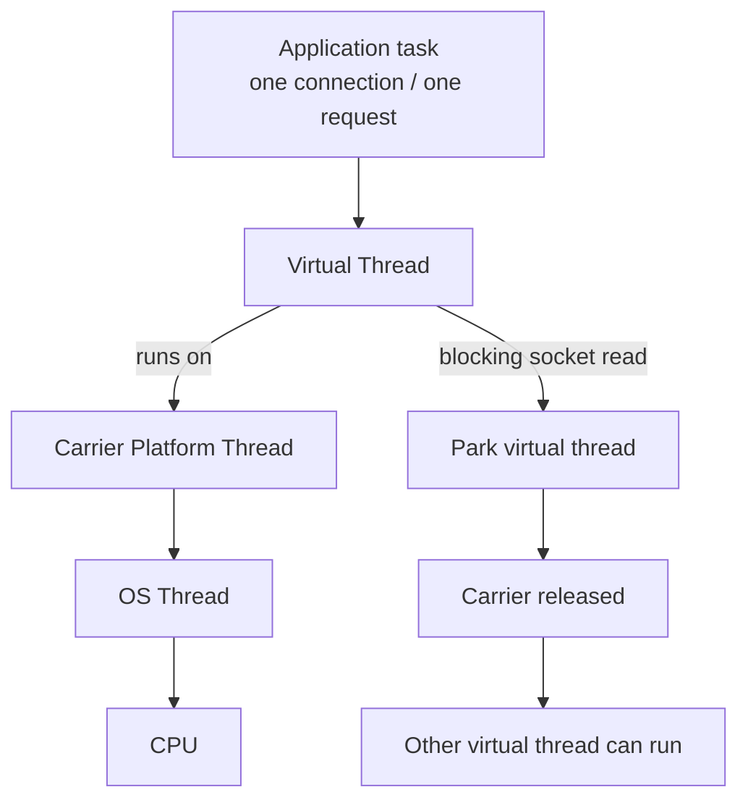
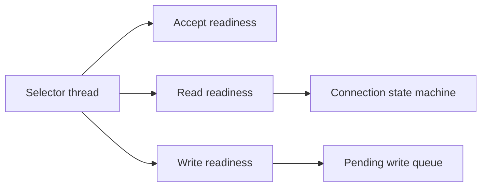
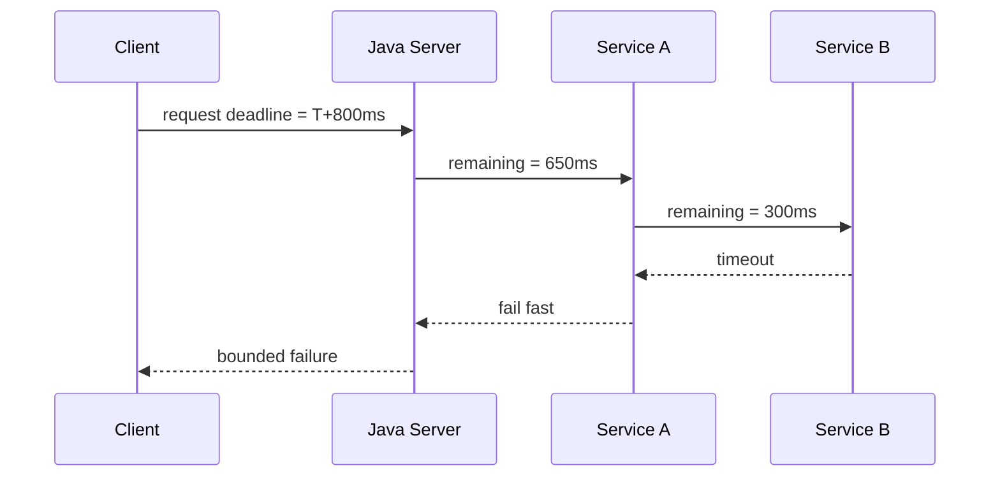
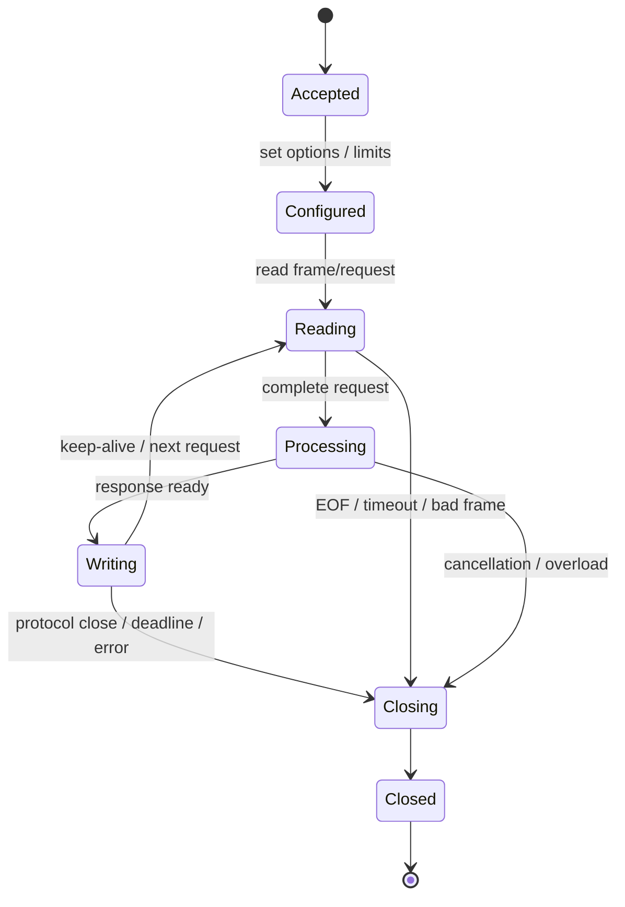

# Part 015 — Virtual Threads for Network I/O

> Goal utama part ini: memahami bagaimana virtual thread mengubah desain network I/O di Java tanpa menghapus kebutuhan terhadap timeout, backpressure, protocol framing, admission control, dan lifecycle management.

Virtual thread sering dijual terlalu sederhana sebagai “thread murah”. Untuk networking, framing yang lebih tepat adalah:

> Virtual thread membuat **blocking network I/O kembali ekonomis**, tetapi tidak membuat network I/O menjadi bebas biaya, bebas limit, atau otomatis benar.

Sebelum virtual thread, Java engineer sering dipaksa memilih:

1. **thread-per-connection**: sederhana, tetapi mahal ketika concurrency tinggi;
2. **selector/event-loop**: scalable, tetapi state machine kompleks;
3. **async callback/future**: tidak menahan thread, tetapi control flow dan cancellation lebih sulit;
4. **framework reactor**: powerful, tetapi menambah semantic layer dan operational complexity.

Virtual thread menggeser trade-off tersebut. Kita bisa menulis kode blocking yang sederhana, tetapi runtime dapat memarkir virtual thread ketika operasi I/O blocking menunggu kernel/network.

Namun, keputusan arsitektur tetap tidak hilang. Kamu masih harus menentukan:

- berapa banyak koneksi boleh diterima;
- kapan request dianggap deadline exceeded;
- kapan koneksi harus ditutup;
- kapan retry aman;
- bagaimana slow client dibatasi;
- bagaimana blocking call diamati;
- bagaimana resource eksternal dilindungi dari overload.

---

## 1. Kaufman Skill Slice

Dalam framework Josh Kaufman, part ini adalah titik “remove practice barriers”. Sebelum virtual thread, barrier terbesar untuk network server/client adalah kerumitan asynchronous state machine. Virtual thread menurunkan barrier itu sehingga kamu bisa lebih cepat membangun sistem jaringan yang benar secara mental model.

Tetapi skill yang ingin kita kuasai bukan “menggunakan virtual thread”. Skill yang benar adalah:

> Mendesain network I/O Java yang sederhana secara kode, tetapi tetap bounded, observable, cancellable, dan tahan failure.

### Skill decomposition

| Sub-skill | Pertanyaan yang harus bisa dijawab |
|---|---|
| Execution model | Apa bedanya platform thread, virtual thread, carrier thread, dan task? |
| Blocking semantics | Apa yang terjadi ketika virtual thread melakukan blocking socket read? |
| Server architecture | Kapan thread-per-connection dengan virtual thread cukup? |
| Resource bounding | Apa yang harus tetap dibatasi walaupun thread murah? |
| Pinning awareness | Operasi apa yang bisa membuat carrier thread tertahan? |
| Cancellation | Bagaimana timeout/deadline memutus blocking network I/O? |
| Migration | Bagaimana memindahkan blocking server/client lama ke virtual thread tanpa membuat overload baru? |

---

## 2. Mental Model: Thread Murah Bukan Resource Tak Terbatas

Virtual thread adalah thread Java. Ia terlihat seperti `Thread` bagi kode aplikasi, tetapi tidak dipetakan 1:1 secara permanen ke OS thread.



Model sederhananya:

- platform thread mahal karena biasanya berkaitan dengan OS thread;
- virtual thread murah karena runtime bisa menjadwalkannya di atas carrier thread;
- ketika virtual thread melakukan blocking operation yang didukung Loom, virtual thread dapat diparkir;
- carrier thread dapat dipakai untuk virtual thread lain;
- ketika I/O siap, virtual thread dilanjutkan.

Namun tetap ada resource nyata:

| Resource | Tetap terbatas? | Catatan |
|---|---:|---|
| File descriptor/socket | Ya | Setiap koneksi tetap memakai descriptor OS. |
| Kernel socket buffer | Ya | Setiap koneksi bisa memakai memory kernel. |
| Heap object per connection | Ya | Virtual thread murah, tetapi object state tetap ada. |
| Remote dependency capacity | Ya | Database/API downstream tetap bisa jebol. |
| CPU | Ya | Parsing, TLS, compression, JSON tetap CPU-bound. |
| Network bandwidth | Ya | Virtual thread tidak menambah bandwidth. |
| Ephemeral port | Ya | Client outbound tetap bisa exhausted. |

Invariant penting:

> Virtual thread mengurangi biaya **waiting**, bukan biaya **work**, **memory**, **socket**, atau **downstream capacity**.

---

## 3. Before Virtual Threads: Why Network Code Became Complex

### 3.1 Platform thread-per-connection

Model paling intuitif:

```text
accept connection
spawn thread
read request
process
write response
close or keep alive
```

Kelebihan:

- kode mudah dibaca;
- stack trace natural;
- blocking API mudah digunakan;
- satu koneksi/request punya control flow linear.

Kekurangan sebelum virtual thread:

- ribuan thread platform mahal;
- context switching tinggi;
- stack memory besar;
- thread pool sizing sulit;
- deadlock/starvation lebih mudah terjadi jika pool dipakai campur.

### 3.2 Selector/event-loop

NIO selector menghindari satu platform thread per connection.



Kelebihan:

- scalable untuk banyak idle connection;
- kontrol backpressure kuat;
- cocok untuk framework high-performance.

Kekurangan:

- kode menjadi state-machine heavy;
- parser harus incremental;
- blocking kecil bisa merusak event-loop;
- cancellation dan error propagation lebih sulit;
- business logic sering harus dipisah ke worker pool.

### 3.3 Async callback/future

Async I/O menghindari blocking thread, tetapi menggeser kompleksitas ke composition:

```text
connectAsync()
  -> thenCompose(send)
  -> thenCompose(read)
  -> exceptionally(handle)
```

Kelebihan:

- concurrency tinggi;
- cocok untuk non-blocking libraries;
- resource thread lebih rendah.

Kekurangan:

- cancellation bisa tidak intuitif;
- exception propagation tersebar;
- stack trace lebih sulit;
- flow control bisa terselubung;
- debugging sering lebih berat.

Virtual thread membuat pilihan keempat menjadi realistis:

> Kode blocking linear dengan cost waiting mendekati async untuk banyak kasus I/O-bound.

---

## 4. Thread-Per-Connection Revisited

Dengan virtual thread, model blocking server sederhana bisa ditulis seperti ini:

```java
import java.io.*;
import java.net.*;
import java.nio.charset.StandardCharsets;
import java.util.concurrent.*;

public final class VirtualThreadEchoServer {
    public static void main(String[] args) throws Exception {
        int port = 9090;

        try (ServerSocket server = new ServerSocket()) {
            server.setReuseAddress(true);
            server.bind(new InetSocketAddress("0.0.0.0", port), 512);

            try (ExecutorService executor = Executors.newVirtualThreadPerTaskExecutor()) {
                while (!Thread.currentThread().isInterrupted()) {
                    Socket socket = server.accept();
                    executor.submit(() -> handle(socket));
                }
            }
        }
    }

    private static void handle(Socket socket) {
        try (socket) {
            socket.setSoTimeout(30_000);

            BufferedReader in = new BufferedReader(
                new InputStreamReader(socket.getInputStream(), StandardCharsets.UTF_8)
            );
            BufferedWriter out = new BufferedWriter(
                new OutputStreamWriter(socket.getOutputStream(), StandardCharsets.UTF_8)
            );

            String line;
            while ((line = in.readLine()) != null) {
                if (line.equalsIgnoreCase("quit")) {
                    break;
                }
                out.write("echo: " + line);
                out.newLine();
                out.flush();
            }
        } catch (SocketTimeoutException e) {
            // idle connection timeout
        } catch (IOException e) {
            // peer reset, broken pipe, local close, or network-level failure
        }
    }
}
```

Kode ini mudah dibaca. Tetapi jangan tertipu: masih belum production-grade. Ia belum punya:

- admission control yang eksplisit;
- shutdown draining;
- protocol size limit;
- per-connection memory budget;
- max request time;
- slow writer protection;
- structured metrics;
- overload response;
- circuit boundary ke downstream.

Virtual thread membuat model ini layak, bukan otomatis aman.

---

## 5. Blocking Socket I/O with Virtual Threads

Dalam blocking socket API, operasi seperti ini bisa menunggu lama:

```java
int n = inputStream.read(buffer);
```

Kemungkinan hasil:

| Hasil | Arti |
|---|---|
| `n > 0` | Ada byte berhasil dibaca. Tidak berarti satu pesan lengkap. |
| `n == -1` | Peer melakukan orderly shutdown pada input stream. |
| `SocketTimeoutException` | Tidak ada data sebelum `SO_TIMEOUT`. |
| `SocketException: Connection reset` | Peer/kernel mengirim reset atau koneksi rusak. |
| `IOException` lain | Transport, local close, atau resource failure. |

Dengan virtual thread, blocking read tetap tampak blocking bagi kode. Perbedaannya ada pada scheduler. Ketika operasi dapat diparkir, virtual thread menunggu tanpa menahan carrier thread secara permanen.

Tetapi operasi blocking tetap harus punya batas:

```java
socket.setSoTimeout(10_000);
```

Tanpa timeout, virtual thread bisa menunggu sangat lama. Biayanya lebih murah daripada platform thread, tetapi koneksi, heap state, dan kernel buffer tetap tertahan.

---

## 6. Little's Law Still Applies

Virtual thread sering membuat engineer lupa matematika dasar kapasitas.

Little's Law:

```text
concurrency = throughput × latency
```

Jika service menerima:

```text
2,000 request/second
```

Dan rata-rata request butuh:

```text
500 ms = 0.5 second
```

Maka concurrency rata-rata:

```text
2,000 × 0.5 = 1,000 concurrent requests
```

Jika downstream melambat menjadi 5 detik:

```text
2,000 × 5 = 10,000 concurrent requests
```

Virtual thread membuat 10,000 concurrent waiting tasks lebih mungkin ditampung. Tapi apakah sistem aman?

Pertanyaan sebenarnya:

- apakah downstream bisa menerima 10,000 inflight requests?
- apakah heap cukup untuk 10,000 request context?
- apakah connection pool downstream cukup?
- apakah timeout memotong request yang sudah tidak berguna?
- apakah client sudah pergi tetapi server masih bekerja?
- apakah retry memperburuk antrian?

Invariant:

> Virtual thread menaikkan ceiling concurrency aplikasi, tetapi tidak menaikkan kapasitas dependency secara ajaib.

---

## 7. Bounded Virtual Thread Server

Jangan hanya membuat virtual thread sebanyak koneksi masuk. Tambahkan admission control.

```java
import java.io.*;
import java.net.*;
import java.util.concurrent.*;

public final class BoundedVirtualThreadServer {
    private static final int MAX_ACTIVE_CONNECTIONS = 10_000;

    public static void main(String[] args) throws Exception {
        Semaphore active = new Semaphore(MAX_ACTIVE_CONNECTIONS);

        try (ServerSocket server = new ServerSocket(9090);
             ExecutorService executor = Executors.newVirtualThreadPerTaskExecutor()) {

            while (!Thread.currentThread().isInterrupted()) {
                Socket socket = server.accept();

                if (!active.tryAcquire()) {
                    reject(socket);
                    continue;
                }

                executor.submit(() -> {
                    try {
                        handle(socket);
                    } finally {
                        active.release();
                    }
                });
            }
        }
    }

    private static void reject(Socket socket) {
        try (socket) {
            socket.getOutputStream().write("server busy\n".getBytes());
        } catch (IOException ignored) {
        }
    }

    private static void handle(Socket socket) {
        try (socket) {
            socket.setSoTimeout(15_000);
            InputStream in = socket.getInputStream();
            OutputStream out = socket.getOutputStream();

            byte[] buf = new byte[4096];
            int n = in.read(buf);
            if (n > 0) {
                out.write(buf, 0, n);
                out.flush();
            }
        } catch (IOException ignored) {
        }
    }
}
```

### Why semaphore still matters

Virtual thread murah, tetapi koneksi aktif tetap memakai:

- file descriptor;
- kernel buffer;
- heap buffer;
- protocol state;
- TLS state jika HTTPS/TLS;
- downstream resource;
- log/metric cardinality;
- CPU saat data benar-benar diproses.

Admission control adalah guardrail agar sistem gagal dengan terkendali, bukan collapse.

---

## 8. Thread Pool Mistake: Pooling Virtual Threads Like Platform Threads

Pattern lama:

```java
ExecutorService executor = Executors.newFixedThreadPool(200);
```

Dengan platform thread, pool sering dipakai untuk membatasi jumlah thread. Dengan virtual thread, `newVirtualThreadPerTaskExecutor()` tidak dimaksudkan sebagai pool terbatas. Ia membuat virtual thread baru per task.

Kesalahan umum:

```java
// Anti-pattern: menganggap virtual thread executor membatasi concurrency.
ExecutorService executor = Executors.newVirtualThreadPerTaskExecutor();
for (...) {
    executor.submit(task);
}
```

Executor ini tidak otomatis membatasi jumlah task aktif berdasarkan kapasitas bisnis. Pembatasan harus dilakukan di resource boundary:

- semaphore untuk active request;
- connection pool untuk database/downstream;
- rate limiter untuk egress;
- queue bounded untuk pekerjaan async;
- max body size untuk input;
- timeout/deadline untuk waktu.

Model yang lebih benar:

```java
Semaphore downstreamPermits = new Semaphore(200);

void callDownstream() throws Exception {
    if (!downstreamPermits.tryAcquire(100, TimeUnit.MILLISECONDS)) {
        throw new RejectedExecutionException("downstream saturated");
    }
    try {
        // blocking HTTP/database/socket call
    } finally {
        downstreamPermits.release();
    }
}
```

---

## 9. Deadlines, Not Just Timeouts

Timeout lokal menjawab:

```text
Berapa lama operasi ini boleh menunggu?
```

Deadline menjawab:

```text
Kapan seluruh pekerjaan ini sudah tidak berguna?
```

Dalam network system, deadline lebih kuat karena request bisa melewati banyak operasi:



Contoh deadline sederhana:

```java
import java.time.*;

record Deadline(Instant expiresAt) {
    static Deadline after(Duration duration) {
        return new Deadline(Instant.now().plus(duration));
    }

    Duration remaining() {
        Duration d = Duration.between(Instant.now(), expiresAt);
        return d.isNegative() ? Duration.ZERO : d;
    }

    boolean expired() {
        return !Instant.now().isBefore(expiresAt);
    }
}
```

Untuk socket blocking:

```java
void readWithDeadline(Socket socket, Deadline deadline, byte[] buffer) throws IOException {
    Duration remaining = deadline.remaining();
    if (remaining.isZero()) {
        throw new SocketTimeoutException("deadline exceeded before read");
    }

    int timeoutMillis = Math.toIntExact(Math.min(remaining.toMillis(), Integer.MAX_VALUE));
    socket.setSoTimeout(Math.max(timeoutMillis, 1));

    int n = socket.getInputStream().read(buffer);
    if (n < 0) {
        throw new EOFException("peer closed");
    }
}
```

Virtual thread memudahkan blocking flow, tetapi deadline tetap harus kamu desain.

---

## 10. Cancellation Semantics

Di Java networking, cancellation sering berarti menutup socket.

Meng-interrupt virtual thread saja tidak selalu cukup untuk membatalkan operasi blocking eksternal secara semantik. Desain yang lebih kuat:

```java
Future<?> f = executor.submit(() -> handle(socket));

// On timeout or shutdown:
f.cancel(true);
socket.close();
```

Tutup socket menyebabkan blocking read/write gagal dengan exception. Ini sering lebih deterministic daripada hanya berharap interrupt cukup.

Pattern server shutdown:

```java
final class ConnectionTask implements Runnable {
    private final Socket socket;

    ConnectionTask(Socket socket) {
        this.socket = socket;
    }

    @Override
    public void run() {
        try (socket) {
            socket.setSoTimeout(30_000);
            serve();
        } catch (IOException ignored) {
        }
    }

    void cancel() {
        try {
            socket.close();
        } catch (IOException ignored) {
        }
    }

    private void serve() throws IOException {
        // read/process/write loop
    }
}
```

Invariant:

> Untuk network I/O, cancellation yang reliabel biasanya butuh menutup resource, bukan hanya membatalkan task abstrak.

---

## 11. Carrier Pinning Risk

Virtual thread dapat diparkir ketika blocking operation kompatibel dengan Loom. Tetapi ada situasi yang membuat virtual thread **pin** carrier thread, yaitu carrier tidak bisa dilepas ketika virtual thread menunggu.

Secara praktis, kamu perlu waspada terhadap:

- blocking di dalam `synchronized` region;
- native call / foreign call tertentu;
- library lama yang melakukan blocking dengan mekanisme yang tidak Loom-friendly;
- lock besar yang menahan operasi I/O;
- critical section yang terlalu luas.

Anti-pattern:

```java
class BadSharedWriter {
    private final Object lock = new Object();

    void write(Socket socket, byte[] bytes) throws IOException {
        synchronized (lock) {
            // Bad: network I/O while holding monitor.
            socket.getOutputStream().write(bytes);
            socket.getOutputStream().flush();
        }
    }
}
```

Lebih baik:

```java
class BetterSharedWriter {
    private final Object lock = new Object();

    byte[] encodeMessage(Message message) {
        synchronized (lock) {
            return buildBytes(message); // short CPU-only critical section
        }
    }

    void write(Socket socket, Message message) throws IOException {
        byte[] bytes = encodeMessage(message);
        socket.getOutputStream().write(bytes);
        socket.getOutputStream().flush();
    }

    private byte[] buildBytes(Message message) {
        return message.payload();
    }
}

record Message(byte[] payload) {}
```

Rule:

> Jangan menahan monitor/lock besar saat melakukan network I/O.

---

## 12. Virtual Threads vs Selector: Decision Matrix

| Situation | Virtual thread blocking I/O | Selector/event-loop |
|---|---:|---:|
| Protocol sederhana request/response | Sangat cocok | Bisa overkill |
| Banyak idle connections | Cocok, selama resource bounded | Sangat cocok |
| Custom binary protocol incremental | Cocok jika framing sederhana | Sangat cocok untuk kontrol detail |
| Ultra-low allocation event loop | Kurang cocok | Cocok |
| Business logic blocking-heavy | Cocok | Harus offload ke worker |
| Butuh explicit per-connection state machine | Bisa, tetapi tidak wajib | Natural |
| Tim kecil butuh maintainability | Sangat cocok | Risiko kompleksitas |
| Framework networking internal | Tergantung target | Sering cocok |
| Backpressure byte-level sangat presisi | Bisa, manual | Lebih natural |

Kesimpulan:

- Gunakan virtual thread untuk application-level server/client yang ingin kode linear dan maintainable.
- Gunakan selector/event-loop ketika kamu membangun framework/proxy/gateway high-performance dengan kontrol byte-level ekstrem.
- Jangan memakai event-loop hanya karena takut blocking; di Java modern, blocking tidak otomatis buruk.

---

## 13. Virtual Threads for Network Clients

Contoh client fan-out sederhana:

```java
import java.net.*;
import java.io.*;
import java.util.*;
import java.util.concurrent.*;

public final class BlockingFanoutClient {
    public static void main(String[] args) throws Exception {
        List<InetSocketAddress> targets = List.of(
            new InetSocketAddress("127.0.0.1", 9001),
            new InetSocketAddress("127.0.0.1", 9002),
            new InetSocketAddress("127.0.0.1", 9003)
        );

        try (ExecutorService executor = Executors.newVirtualThreadPerTaskExecutor()) {
            List<Future<String>> futures = new ArrayList<>();
            for (InetSocketAddress target : targets) {
                futures.add(executor.submit(() -> query(target)));
            }

            for (Future<String> future : futures) {
                System.out.println(future.get(500, TimeUnit.MILLISECONDS));
            }
        }
    }

    static String query(InetSocketAddress target) throws IOException {
        try (Socket socket = new Socket()) {
            socket.connect(target, 200);
            socket.setSoTimeout(300);

            socket.getOutputStream().write("ping\n".getBytes());
            socket.getOutputStream().flush();

            return new BufferedReader(
                new InputStreamReader(socket.getInputStream())
            ).readLine();
        }
    }
}
```

Tetapi fan-out harus bounded:

```java
Semaphore maxConcurrentCalls = new Semaphore(100);

String safeQuery(InetSocketAddress target) throws Exception {
    if (!maxConcurrentCalls.tryAcquire(50, TimeUnit.MILLISECONDS)) {
        throw new RejectedExecutionException("egress concurrency limit reached");
    }
    try {
        return query(target);
    } finally {
        maxConcurrentCalls.release();
    }
}
```

Tanpa bound, virtual thread membuat client lebih mudah menciptakan self-inflicted DDoS ke dependency.

---

## 14. Interaction with HTTP Client

`java.net.http.HttpClient` sudah menyediakan API synchronous dan asynchronous:

```java
HttpResponse<String> response = client.send(request, BodyHandlers.ofString());
```

atau:

```java
CompletableFuture<HttpResponse<String>> future =
    client.sendAsync(request, BodyHandlers.ofString());
```

Dengan virtual thread, synchronous `send` menjadi jauh lebih menarik untuk application code karena control flow linear:

```java
try (ExecutorService executor = Executors.newVirtualThreadPerTaskExecutor()) {
    Future<HttpResponse<String>> f = executor.submit(() ->
        client.send(request, HttpResponse.BodyHandlers.ofString())
    );

    HttpResponse<String> response = f.get(2, TimeUnit.SECONDS);
}
```

Namun, `HttpClient` tetap punya resource semantics sendiri:

- client immutable setelah dibangun;
- client dapat mengelola connection pool sendiri;
- client sebaiknya direuse;
- timeout request/connect harus dikonfigurasi;
- async executor behavior harus dipahami jika memakai `sendAsync`.

Part 017 akan membahas `HttpClient` secara dalam. Di part ini, cukup pegang prinsip:

> Virtual thread sering membuat API synchronous kembali menjadi pilihan arsitektural yang bersih, selama resource boundary tetap eksplisit.

---

## 15. Slow Client Problem Still Exists

Misalnya server menulis response besar ke client lambat:

```java
out.write(largeResponse);
out.flush();
```

Dengan virtual thread, thread yang menunggu flush mungkin murah. Tetapi masalahnya bukan hanya thread:

- socket send buffer bisa penuh;
- heap bisa menahan response besar;
- koneksi tetap aktif;
- client lambat bisa menahan slot admission;
- bandwidth server bisa terpakai lama;
- request berikutnya bisa tertunda.

Solusi:

- streaming response secara chunk kecil;
- batasi ukuran response;
- batasi durasi write;
- batasi active connection;
- gunakan backpressure protocol-level;
- tutup koneksi slow consumer setelah threshold.

Contoh write dengan deadline kasar:

```java
void writeChunks(Socket socket, InputStream source, Deadline deadline) throws IOException {
    OutputStream out = socket.getOutputStream();
    byte[] buffer = new byte[16 * 1024];

    int n;
    while ((n = source.read(buffer)) >= 0) {
        if (deadline.expired()) {
            throw new SocketTimeoutException("write deadline exceeded");
        }
        out.write(buffer, 0, n);
        out.flush();
    }
}
```

Catatan: `SO_TIMEOUT` mengatur read timeout pada classic socket, bukan universal write timeout. Write deadline sering perlu cancellation/close dari luar atau desain protokol/pipeline yang membatasi durasi.

---

## 16. Connection Lifecycle State Machine

Walaupun kode blocking linear, lifecycle tetap state machine.



Virtual thread tidak menghapus state machine. Ia hanya membuat state machine bisa ditulis sebagai control flow linear.

---

## 17. Production Checklist

Sebelum memakai virtual thread untuk network I/O production, jawab ini:

### Execution model

- Apakah setiap koneksi/request punya virtual thread sendiri?
- Apakah ada task yang CPU-bound dan sebaiknya tidak dibuat tak terbatas?
- Apakah ada blocking dalam `synchronized` block?
- Apakah library yang dipakai Loom-friendly?

### Resource boundary

- Berapa max active connections?
- Berapa max active requests?
- Berapa max downstream calls?
- Berapa max body size?
- Berapa max response size?
- Berapa max idle duration?
- Berapa max request duration?

### Network correctness

- Apakah protocol framing aman terhadap partial read?
- Apakah EOF dibedakan dari timeout?
- Apakah reset/broken pipe ditangani sebagai network event normal?
- Apakah close idempotent?
- Apakah cancellation menutup socket?

### Operations

- Apakah active virtual thread count diamati?
- Apakah active connection count diamati?
- Apakah blocking duration diukur?
- Apakah timeout reason diklasifikasikan?
- Apakah overload menghasilkan failure yang jelas?

---

## 18. Migration Strategy from Platform Thread Pool

### Step 1 — Jangan ganti semua sekaligus

Mulai dari satu boundary:

- outbound client fan-out;
- internal blocking worker;
- simple TCP server;
- admin/control endpoint;
- batch network transfer.

### Step 2 — Pisahkan limit thread dari limit resource

Sebelum:

```java
ExecutorService pool = Executors.newFixedThreadPool(100);
```

Sering kali angka 100 sebenarnya berarti beberapa hal sekaligus:

- max concurrent request;
- max concurrent downstream call;
- max CPU work;
- max blocking I/O;
- max memory pressure.

Sesudah virtual thread, pecah menjadi limit eksplisit:

```java
ExecutorService vthreads = Executors.newVirtualThreadPerTaskExecutor();
Semaphore maxRequests = new Semaphore(1_000);
Semaphore maxDownstream = new Semaphore(100);
Semaphore maxLargeUploads = new Semaphore(20);
```

### Step 3 — Tambahkan deadline dan cancellation

Migrasi tanpa deadline sering menghasilkan sistem yang tampak “lebih kuat” sampai dependency lambat dan semua virtual thread menumpuk.

### Step 4 — Ukur sebelum dan sesudah

Bandingkan:

- throughput;
- p50/p95/p99 latency;
- active connections;
- active virtual threads;
- heap usage;
- direct memory;
- file descriptor count;
- downstream concurrency;
- timeout/error distribution.

---

## 19. Common Anti-Patterns

### Anti-pattern 1 — Unlimited fan-out

```java
for (URI uri : uris) {
    executor.submit(() -> call(uri));
}
```

Tanpa semaphore, ribuan virtual thread bisa menyerang dependency.

### Anti-pattern 2 — No socket timeout

```java
socket.getInputStream().read(buffer);
```

Koneksi bisa menggantung lama. Virtual thread murah tidak berarti request masih berguna.

### Anti-pattern 3 — Blocking while holding monitor

```java
synchronized (shared) {
    socket.getOutputStream().write(bytes);
}
```

Risiko pinning dan lock contention.

### Anti-pattern 4 — New HTTP client per request

```java
HttpClient.newHttpClient().send(request, BodyHandlers.ofString());
```

Ini membuang peluang reuse resource/pool. Bahas lebih detail di Part 017.

### Anti-pattern 5 — Treating virtual thread as backpressure

Jumlah virtual thread bukan backpressure. Backpressure harus diterapkan pada boundary data/resource.

---

## 20. Drill: Build a Bounded Echo Server

Target latihan:

1. Buat TCP echo server dengan virtual thread per connection.
2. Tambahkan max active connection memakai `Semaphore`.
3. Tambahkan idle timeout memakai `setSoTimeout`.
4. Tambahkan max line length.
5. Tambahkan graceful shutdown dengan menutup `ServerSocket`.
6. Tambahkan metric sederhana:
   - accepted connection;
   - rejected connection;
   - active connection;
   - timeout;
   - reset/error.

Acceptance criteria:

- server tidak membuat OOM ketika 50k client idle mencoba connect;
- server menolak koneksi baru saat limit aktif tercapai;
- koneksi idle diputus;
- input line terlalu panjang diputus;
- shutdown tidak menunggu selamanya;
- error network umum tidak memenuhi log sebagai stack trace besar.

---

## 21. Review Questions

1. Mengapa virtual thread tidak menghapus kebutuhan admission control?
2. Apa perbedaan timeout dan deadline?
3. Kenapa `newVirtualThreadPerTaskExecutor()` bukan concurrency limiter?
4. Bagaimana cara membatalkan blocking socket read secara reliabel?
5. Kapan selector masih lebih tepat daripada virtual thread?
6. Apa risiko melakukan network I/O dalam `synchronized` block?
7. Mengapa slow client tetap berbahaya walaupun virtual thread murah?
8. Resource apa saja yang tetap terbatas pada koneksi virtual-thread-per-connection?

---

## 22. Key Takeaways

- Virtual thread membuat blocking network I/O jauh lebih praktis untuk concurrency tinggi.
- Virtual thread mengurangi biaya menunggu, bukan biaya socket, heap, CPU, bandwidth, atau downstream capacity.
- Model thread-per-connection kembali layak untuk banyak application-level server.
- Jangan memakai thread pool size sebagai proxy resource boundary; gunakan semaphore/pool/deadline/rate limit eksplisit.
- Cancellation network I/O sering harus menutup socket/resource.
- Hindari blocking I/O dalam `synchronized` region.
- Selector/event-loop tetap relevan untuk framework, gateway, atau byte-level control ekstrem.
- Production-grade virtual-thread networking tetap membutuhkan timeout, framing, backpressure, observability, dan graceful shutdown.

---

## 23. References

- OpenJDK — JEP 444: Virtual Threads: https://openjdk.org/jeps/444
- Oracle Java SE 25 API — `Thread`: https://docs.oracle.com/en/java/javase/25/docs/api/java.base/java/lang/Thread.html
- Oracle Java SE 25 API — `Executors`: https://docs.oracle.com/en/java/javase/25/docs/api/java.base/java/util/concurrent/Executors.html
- Oracle Java SE 25 API — `Socket`: https://docs.oracle.com/en/java/javase/25/docs/api/java.base/java/net/Socket.html
- Oracle Java SE 25 API — `ServerSocket`: https://docs.oracle.com/en/java/javase/25/docs/api/java.base/java/net/ServerSocket.html
