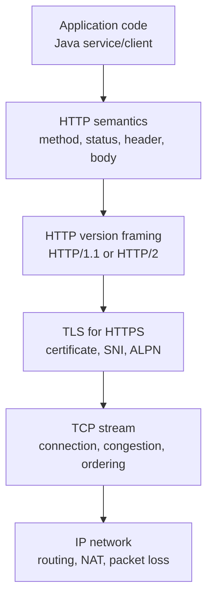
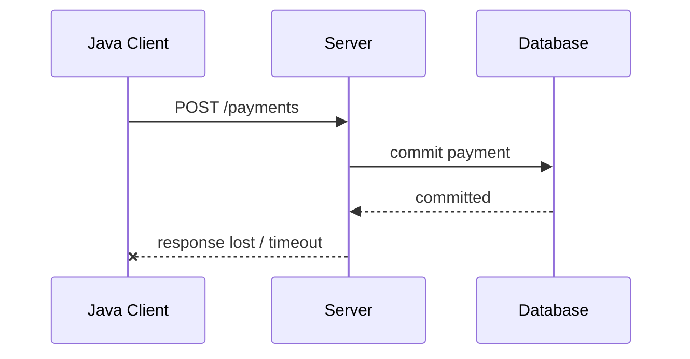
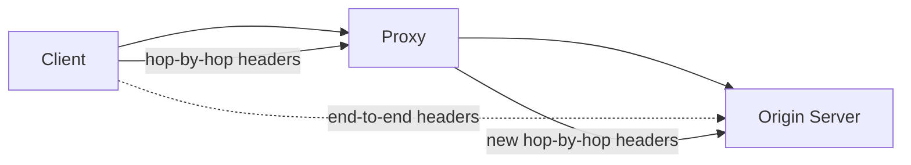
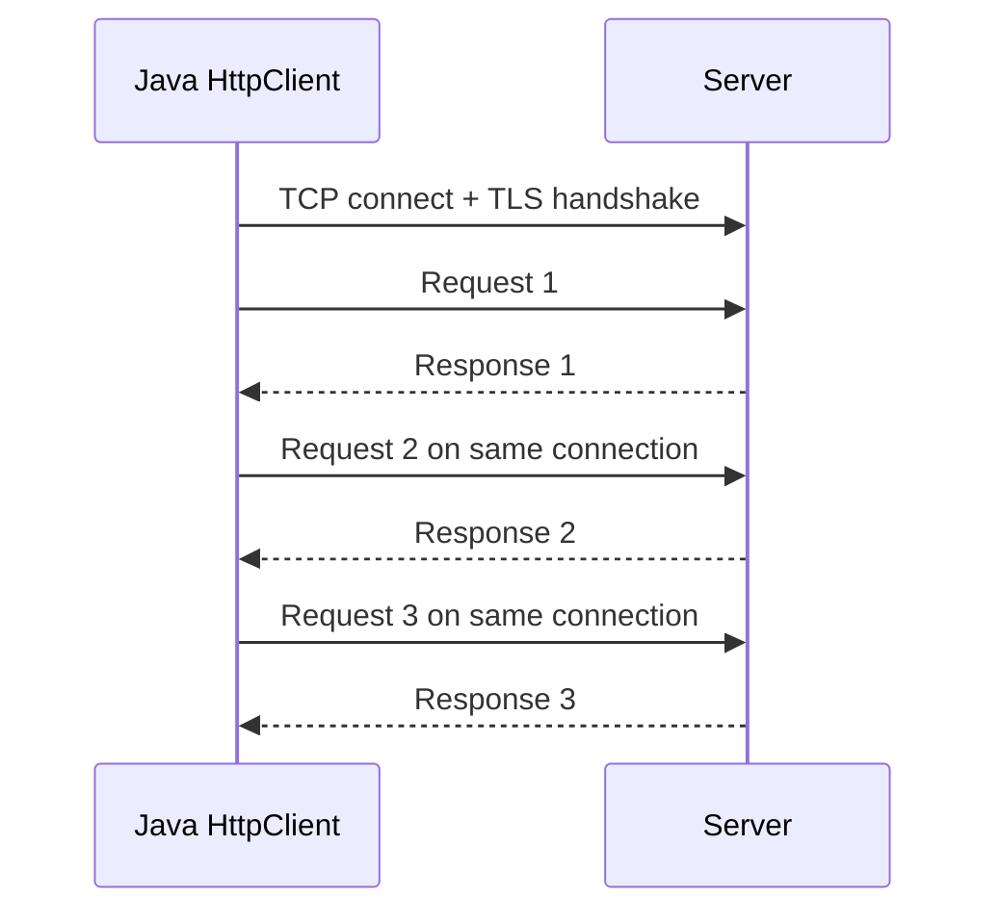
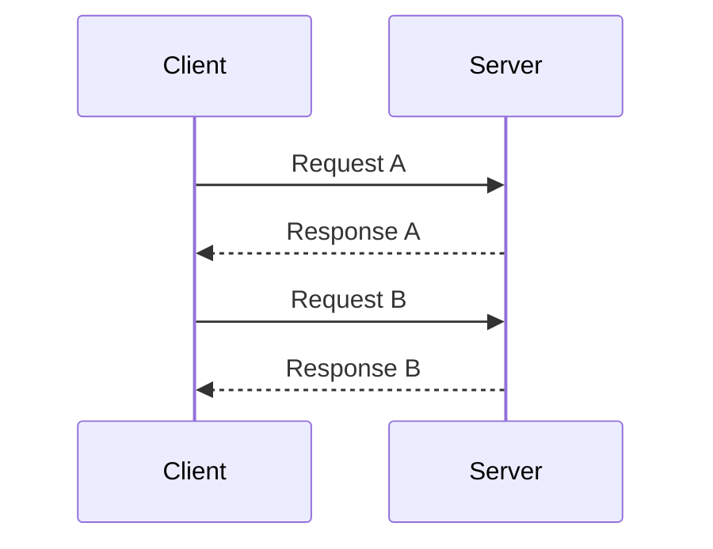
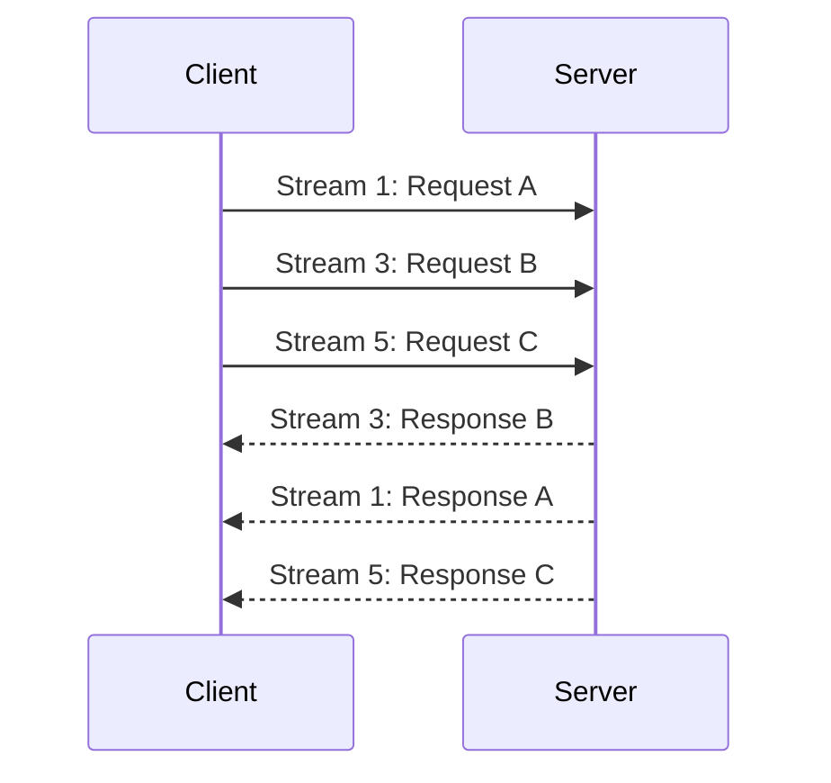
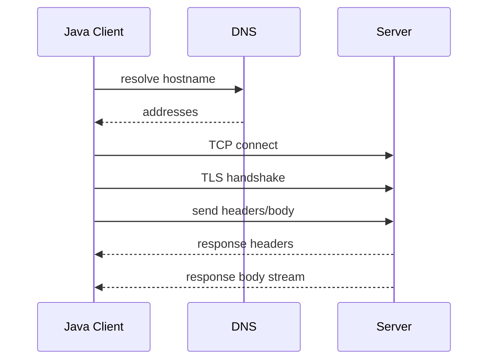
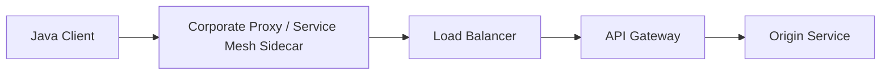
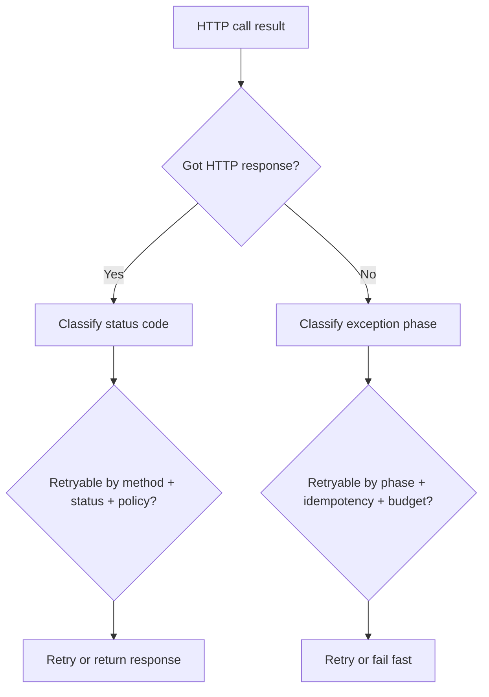

# Part 016 — HTTP Protocol Mechanics for Java Engineers

> Goal utama part ini: memahami HTTP sebagai protokol jaringan, bukan sekadar “REST call”, supaya ketika memakai `java.net.http.HttpClient` kamu bisa mendesain timeout, retry, streaming, connection reuse, error handling, dan observability dengan benar.

Banyak Java engineer bisa menulis:

```java
client.send(request, BodyHandlers.ofString());
```

Tetapi tidak bisa menjawab:

- apakah request ini aman di-retry?
- apakah response 500 berarti network failure?
- apakah timeout terjadi saat connect, write, read header, read body, atau pool wait?
- apakah connection bisa dipakai ulang?
- apakah body bisa streaming tanpa menahan heap besar?
- apa beda HTTP/1.1 head-of-line blocking dan HTTP/2 multiplexing?
- apa arti `Content-Length`, `Transfer-Encoding`, dan connection close?
- kapan redirect bisa menjadi security issue?

Part ini membangun mental model sebelum masuk deep dive `java.net.http.HttpClient` di Part 017.

---

## 1. Kaufman Skill Slice

Dalam framework Kaufman, ini adalah fase “learn enough to self-correct”. Tujuannya bukan menghafal seluruh RFC, tetapi memahami bagian protokol yang paling sering menyebabkan bug production.

### Sub-skill decomposition

| Sub-skill | Yang harus bisa kamu koreksi sendiri |
|---|---|
| Message model | Bisa membedakan start line, header, dan body. |
| Semantics | Bisa membedakan method safe, idempotent, cacheable, dan unsafe. |
| Framing | Bisa membaca konsekuensi `Content-Length`, chunked transfer, dan close-delimited body. |
| Connection lifecycle | Bisa memahami reuse, keep-alive, idle close, stale connection, dan pool behavior. |
| Failure taxonomy | Bisa membedakan DNS/connect/TLS/request/response/body failure. |
| Retry decision | Bisa menentukan kapan retry aman dan kapan berbahaya. |
| Streaming | Bisa mendesain upload/download besar tanpa OOM. |
| Version behavior | Bisa membedakan HTTP/1.1, HTTP/2, dan konsekuensi multiplexing. |

---

## 2. HTTP Is Not TCP, and HTTP Is Not REST

HTTP berjalan di atas transport. Transport yang paling umum:

```text
HTTP over TCP
HTTPS = HTTP over TLS over TCP
HTTP/2 commonly over TLS over TCP
HTTP/3 over QUIC/UDP
```

Seri ini fokus pada Java standard `java.net.http`, yang mendukung HTTP Client dan WebSocket API. Untuk HTTP/3, perhatikan bahwa standard JDK `HttpClient` tidak membuat semua mekanika HTTP/3 otomatis relevan untuk aplikasi Java biasa.

Layering praktis:



Kesalahan umum:

| Salah kaprah | Koreksi |
|---|---|
| HTTP request sama dengan TCP connection | Satu connection bisa membawa banyak request, tergantung versi dan reuse. |
| HTTP response lengkap saat header diterima | Body bisa streaming lama setelah header. |
| `POST` tidak boleh di-retry sama sekali | Default-nya berbahaya, tetapi bisa aman jika didesain idempotent dengan key. |
| 500 adalah network error | 500 adalah HTTP response valid dari server. |
| Timeout hanya satu jenis | Timeout bisa terjadi di DNS, connect, TLS, write, wait response, read body, atau deadline aplikasi. |
| HTTP/2 menghapus semua head-of-line blocking | HTTP/2 menghapus HOL pada layer HTTP stream, tetapi masih berjalan di atas satu TCP connection sehingga TCP-level HOL tetap ada. |

---

## 3. HTTP Message Structure

HTTP/1.1 request secara konseptual:

```http
POST /payments HTTP/1.1
Host: api.example.com
Content-Type: application/json
Content-Length: 42
Idempotency-Key: 9f68b4c2

{"amount":100000,"currency":"IDR"}
```

Komponen:

| Bagian | Fungsi |
|---|---|
| Request line | Method, target, HTTP version. |
| Headers | Metadata untuk routing, representation, auth, cache, negotiation, framing. |
| Empty line | Pemisah header dan body. |
| Body | Representation data. Tidak semua request punya body. |

HTTP/1.1 response:

```http
HTTP/1.1 201 Created
Content-Type: application/json
Content-Length: 31
Location: /payments/pmt_123

{"id":"pmt_123","status":"OK"}
```

Komponen:

| Bagian | Fungsi |
|---|---|
| Status line | HTTP version, status code, reason phrase. |
| Headers | Metadata response. |
| Empty line | Pemisah header dan body. |
| Body | Representation response. Tidak semua response boleh punya body. |

Untuk HTTP/2, format wire berbeda: binary frames, stream id, header compression, multiplexing. Tetapi semantic model method/status/header/body tetap dipertahankan.

---

## 4. Method Semantics: Safe, Idempotent, Cacheable

HTTP method bukan hanya nama operasi. Method membawa kontrak semantic.

| Method | Safe | Idempotent | Body umum? | Catatan produksi |
|---|---:|---:|---:|---|
| `GET` | Ya | Ya | Tidak umum | Ambil representasi; bisa di-cache; jangan punya side effect signifikan. |
| `HEAD` | Ya | Ya | Tidak | Sama seperti GET tanpa body response; berguna untuk metadata. |
| `OPTIONS` | Ya | Ya | Jarang | Capability discovery. |
| `PUT` | Tidak | Ya | Ya | Replace/set resource pada URI target. Retry lebih aman jika body sama. |
| `DELETE` | Tidak | Ya | Jarang | Idempotent secara efek target, tetapi response bisa berbeda. |
| `POST` | Tidak | Tidak default | Ya | Create/command/process; retry butuh idempotency design. |
| `PATCH` | Tidak | Tidak default | Ya | Partial modification; idempotency tergantung patch format. |

Definisi praktis:

- **safe**: client tidak meminta perubahan state sebagai tujuan utama;
- **idempotent**: mengirim request yang sama satu kali atau beberapa kali punya intended effect yang sama;
- **cacheable**: response boleh disimpan menurut aturan HTTP caching.

Retry logic harus dibangun di atas semantic ini.

---

## 5. Idempotency and Retry Design

Network failure sering ambigu. Contoh:



Client melihat timeout. Tetapi server mungkin sudah commit.

Jika client retry tanpa idempotency key:

```text
risk = double charge / duplicate side effect
```

Dengan idempotency key:

```http
POST /payments HTTP/1.1
Idempotency-Key: 9f68b4c2-0c9f-4b4e-b89b-588a8fcad4a5
```

Server bisa menyimpan hasil pertama dan mengembalikan hasil yang sama untuk retry.

### Retry decision matrix

| Kondisi | Retry default? | Catatan |
|---|---:|---|
| DNS temporary failure | Mungkin | Pakai budget dan jitter. |
| Connect timeout | Mungkin | Server kemungkinan belum menerima request. |
| TLS handshake failure | Jarang | Bisa config/cert issue; retry cepat sering tidak berguna. |
| Timeout before request body sent | Mungkin | Tergantung client bisa memastikan body belum terkirim. |
| Timeout after request body sent | Hati-hati | Server mungkin sudah memproses. |
| 408 Request Timeout | Mungkin | Server memberi sinyal timeout request. |
| 429 Too Many Requests | Ya, jika `Retry-After`/policy | Hormati rate limit. |
| 500 | Tergantung | Server error valid; retry hanya jika operation aman. |
| 502/503/504 | Sering mungkin | Tetap perlu budget/jitter/idempotency. |
| 400/401/403/404 | Umumnya tidak | Biasanya request/auth/resource issue. |

Invariant:

> Retry adalah semantic decision, bukan hanya transport decision.

---

## 6. Status Code Classes

Status code adalah response HTTP valid. Ia bukan exception jaringan.

| Class | Meaning | Production interpretation |
|---|---|---|
| 1xx | Informational | Jarang ditangani langsung oleh app biasa. |
| 2xx | Success | Request diterima/berhasil menurut server. |
| 3xx | Redirection | Bisa otomatis atau manual; perhatikan method/body/security. |
| 4xx | Client error | Request tidak valid, unauthorized, forbidden, not found, conflict, rate limited. |
| 5xx | Server error | Server/gateway gagal memenuhi request valid. |

Contoh status yang sering salah dibaca:

| Status | Meaning praktis |
|---|---|
| 200 OK | Success umum; tidak selalu berarti business operation final jika body punya status domain. |
| 201 Created | Resource dibuat; cek `Location`. |
| 202 Accepted | Diterima untuk diproses async; belum selesai. |
| 204 No Content | Sukses tanpa body. |
| 301/308 | Permanent redirect; 308 mempertahankan method. |
| 302/303/307 | Redirect; perhatikan perubahan method/body. |
| 400 | Request malformed/invalid. |
| 401 | Authentication dibutuhkan/gagal. |
| 403 | Authenticated mungkin, tetapi tidak authorized. |
| 404 | Resource tidak ditemukan atau sengaja disembunyikan. |
| 409 | Conflict state; sering terjadi pada optimistic concurrency. |
| 412 | Precondition failed; terkait conditional request. |
| 413 | Payload terlalu besar. |
| 415 | Unsupported media type. |
| 429 | Rate limited. |
| 500 | Server error umum. |
| 502 | Bad gateway; upstream response invalid/failure. |
| 503 | Service unavailable/overloaded/maintenance. |
| 504 | Gateway timeout. |

---

## 7. Headers Are Protocol Control Plane

Headers bukan “map string biasa”. Header mengontrol banyak aspek protocol.

| Header | Fungsi |
|---|---|
| `Host` | Authority target; wajib pada HTTP/1.1. |
| `Content-Type` | Media type body yang dikirim. |
| `Content-Length` | Ukuran body dalam byte. |
| `Transfer-Encoding` | Framing transfer, misalnya chunked pada HTTP/1.1. |
| `Accept` | Representasi yang diterima client. |
| `Authorization` | Credential. |
| `Connection` | Hop-by-hop connection behavior pada HTTP/1.1. |
| `Date` | Waktu response. |
| `Cache-Control` | Cache policy. |
| `ETag` | Entity tag untuk cache/conditional update. |
| `If-Match` | Precondition untuk update/delete aman. |
| `Retry-After` | Sinyal kapan retry boleh dilakukan. |
| `Location` | Target resource/redirect. |
| `Forwarded` / `X-Forwarded-*` | Proxy/original client metadata; jangan dipercaya sembarangan. |

### Hop-by-hop vs end-to-end

Header end-to-end berlaku dari client ke origin server. Header hop-by-hop hanya berlaku pada satu connection segment/proxy hop.



Production implication:

- gateway/proxy harus hati-hati meneruskan header;
- `Connection` bisa menandai header lain sebagai hop-by-hop;
- security header tidak boleh asal dipercaya dari internet;
- tracing header harus distandardisasi dan divalidasi.

---

## 8. Body Framing: How Does the Receiver Know the Body Ends?

Di TCP, tidak ada message boundary. HTTP harus membuat boundary sendiri.

HTTP/1.1 memakai beberapa mekanisme:

### 8.1 `Content-Length`

```http
Content-Length: 42
```

Receiver membaca tepat 42 byte setelah header.

Risiko:

- jika body lebih pendek, receiver menunggu sampai timeout/close;
- jika body lebih panjang, byte ekstra bisa merusak request berikutnya;
- mismatch bisa menjadi security issue pada proxy chain.

### 8.2 `Transfer-Encoding: chunked`

```http
Transfer-Encoding: chunked

4\r\n
Wiki\r\n
5\r\n
pedia\r\n
0\r\n
\r\n
```

Body dikirim sebagai chunk. Cocok untuk streaming ketika ukuran total belum diketahui.

### 8.3 Close-delimited body

Server menutup connection untuk menandai body selesai. Ini mengurangi peluang reuse dan membuat failure ambiguity lebih tinggi.

### 8.4 HTTP/2 framing

HTTP/2 memakai frame binary dengan stream id dan flow control. Body tidak ditentukan oleh `chunked`; framing ada di layer HTTP/2.

Invariant:

> Body framing adalah bagian correctness dan security, bukan detail parsing rendah.

---

## 9. Connection Reuse and Keep-Alive

Membuka TCP/TLS connection mahal:

- DNS lookup;
- TCP handshake;
- TLS handshake;
- congestion window warm-up;
- certificate validation;
- ALPN negotiation untuk HTTP/2.

Karena itu HTTP client production biasanya reuse connection.



Keuntungan:

- latency lebih rendah;
- CPU TLS lebih rendah;
- port churn lebih rendah;
- throughput lebih stabil.

Risiko:

- stale connection jika server/proxy menutup idle connection;
- connection pool leak jika body tidak dikonsumsi/ditutup;
- head-of-line blocking pada HTTP/1.1;
- affinity tidak sengaja ke backend lama;
- long-lived connection bisa melewati DNS update.

Prinsip:

> Reuse connection untuk efisiensi, tetapi desain failure seolah connection bisa mati kapan saja.

---

## 10. HTTP/1.1 vs HTTP/2

### HTTP/1.1

Karakteristik:

- text-based message format;
- satu request/response aktif per connection secara praktis;
- keep-alive memungkinkan reuse;
- pipelining ada secara konsep tetapi jarang dipakai luas karena head-of-line blocking;
- chunked transfer untuk streaming ukuran tidak diketahui.



Jika response A lambat, request B di connection yang sama menunggu.

### HTTP/2

Karakteristik:

- binary framing;
- multiple streams dalam satu connection;
- multiplexing;
- header compression;
- flow control;
- ALPN sering dipakai untuk negosiasi via TLS.



HTTP/2 mengurangi HTTP-level head-of-line blocking, tetapi karena banyak stream berbagi satu TCP connection, packet loss pada TCP dapat menahan semua stream sampai retransmission selesai.

---

## 11. Streaming Upload and Download

HTTP body bisa kecil atau besar. Kesalahan umum adalah menganggap body selalu bisa dimuat ke memory.

Bad default untuk payload besar:

```java
String body = response.body(); // if BodyHandlers.ofString() on huge response
```

Konsekuensi:

- heap pressure;
- GC pause;
- OOM;
- delayed processing;
- connection tidak cepat dilepas.

Streaming mindset:

```text
read small chunk -> process/write -> release -> repeat
```

Dalam `HttpClient`, detail BodyPublisher/BodyHandler akan dibahas di Part 018. Di part ini, pegang konsep:

| Use case | Body strategy |
|---|---|
| JSON kecil | Buffer ke memory masuk akal. |
| File besar | Stream ke file. |
| Export besar | Stream response, jangan build full string. |
| Upload besar | Stream dari file/input stream. |
| Unknown length | Chunked/streaming mechanism. |
| Slow consumer | Butuh backpressure/deadline. |

---

## 12. Timeout Taxonomy for HTTP

Satu “HTTP timeout” sebenarnya bisa berarti banyak hal.



Failure point:

| Phase | Failure example | Meaning |
|---|---|---|
| DNS | unknown host, resolver timeout | Hostname tidak resolve atau resolver gagal. |
| Connect | connect timeout, refused | Tidak bisa membuat TCP connection. |
| TLS | cert path failure, handshake timeout | HTTPS negotiation gagal. |
| Request write | broken pipe, timeout | Request tidak terkirim lengkap atau peer tutup. |
| Response header wait | request timeout | Server belum memberi response headers. |
| Response body read | body timeout/reset | Header sudah diterima, body gagal di tengah. |
| Pool wait | no available connection | Client-side resource saturation. |
| Application deadline | deadline exceeded | Seluruh operasi sudah tidak berguna. |

Production logging harus menangkap phase. Kalau hanya log `HTTP call failed`, debugging akan lambat.

---

## 13. Redirect Mechanics and Risk

Redirect adalah response 3xx dengan target baru, sering lewat `Location`.

Masalah engineering:

- apakah method dipertahankan?
- apakah body dikirim ulang?
- apakah header sensitif diteruskan?
- apakah redirect lintas host boleh?
- apakah redirect dari HTTPS ke HTTP boleh?
- apakah redirect bisa menuju private IP/internal host?
- apakah redirect loop dibatasi?

Security-sensitive client tidak boleh blindly follow redirect.

Policy yang lebih aman:

| Rule | Reason |
|---|---|
| Batasi jumlah redirect | Cegah loop. |
| Blok downgrade HTTPS ke HTTP | Cegah credential leakage. |
| Jangan teruskan `Authorization` lintas origin | Cegah token leak. |
| Validasi target host/IP | Cegah SSRF via redirect. |
| Re-evaluate method/body | Cegah duplicate unsafe operation. |

---

## 14. HTTP Through Proxies and Gateways

Dalam production, Java client jarang langsung bicara ke origin.



Setiap hop bisa:

- menutup idle connection;
- mengubah timeout;
- menambah header;
- menghapus header;
- melakukan TLS termination;
- retry diam-diam;
- buffering request/response;
- membatasi body size;
- menghasilkan 502/503/504.

Maka ketika melihat status 502/503/504, pertanyaan pertama:

```text
Siapa yang menghasilkan response ini?
```

Bisa origin, gateway, load balancer, proxy, sidecar, atau CDN.

---

## 15. Conditional Requests and Concurrency Control

HTTP punya mekanisme untuk update aman menggunakan precondition.

Contoh optimistic update:

```http
GET /accounts/123 HTTP/1.1
```

Response:

```http
HTTP/1.1 200 OK
ETag: "v7"

{"name":"Alice"}
```

Update:

```http
PUT /accounts/123 HTTP/1.1
If-Match: "v7"
Content-Type: application/json
Content-Length: 16

{"name":"Alicia"}
```

Jika resource sudah berubah:

```http
HTTP/1.1 412 Precondition Failed
```

Ini bukan hanya fitur caching. Ini bisa menjadi bagian dari defensible state transition untuk sistem case management/regulatory workflow.

---

## 16. Caching: Only the Network-Relevant Parts

Caching HTTP bisa sangat kompleks. Untuk seri networking ini, fokusnya:

- cache bisa mengubah apakah request benar-benar sampai origin;
- stale response bisa muncul jika policy salah;
- `Cache-Control: no-store` penting untuk data sensitif;
- `ETag` dan conditional request bisa menghemat bandwidth;
- shared cache berbeda dari private cache;
- intermediary cache bisa membuat debugging lebih sulit.

Headers yang perlu dikenal:

| Header | Use |
|---|---|
| `Cache-Control` | Policy utama cache. |
| `ETag` | Validator representasi. |
| `Last-Modified` | Validator berbasis waktu. |
| `If-None-Match` | Conditional GET. |
| `If-Modified-Since` | Conditional GET berbasis waktu. |
| `Vary` | Menentukan dimensi request header yang memengaruhi cache key. |

---

## 17. Authentication Is Header + Transport + Redirect Policy

HTTP auth sering terlihat seperti:

```http
Authorization: Bearer eyJ...
```

Tetapi keamanan aktual bergantung pada:

- TLS aktif dan benar;
- hostname verification benar;
- redirect policy aman;
- proxy tidak membocorkan credential;
- log tidak mencetak header sensitif;
- retry tidak mengirim token ke host salah;
- connection reuse tidak melewati boundary identity yang salah.

Rule praktis:

> Perlakukan `Authorization`, cookie, API key, dan signed header sebagai secret yang terikat ke origin dan transport policy.

---

## 18. Observability: What to Log and Measure

Minimal HTTP client metrics:

| Metric | Why |
|---|---|
| request count by method/host/status class | Traffic dan error profile. |
| latency total | User-visible cost. |
| DNS/connect/TLS/request/response phase latency | Root cause. |
| retry count and reason | Retry storm detection. |
| timeout count by phase | Capacity/failure signal. |
| active inflight requests | Backpressure signal. |
| connection pool usage | Saturation/stale connection debugging. |
| response body bytes | Bandwidth and memory planning. |
| error taxonomy | Avoid mixing HTTP error and network exception. |

Minimal structured log fields:

```json
{
  "event": "http_client_call_failed",
  "method": "POST",
  "scheme": "https",
  "host": "api.example.com",
  "path_template": "/payments",
  "attempt": 2,
  "phase": "response_body",
  "status": 503,
  "exception": null,
  "duration_ms": 812,
  "deadline_remaining_ms": 0,
  "retryable": false
}
```

Hindari log:

- full URL dengan secret query parameter;
- `Authorization`;
- cookie;
- body sensitif;
- unbounded response payload;
- high-cardinality path mentah seperti `/users/123456789` tanpa template.

---

## 19. Raw HTTP over Socket: Learning Exercise Only

Untuk memahami protocol, kita bisa menulis request HTTP/1.1 manual.

```java
import java.io.*;
import java.net.*;
import java.nio.charset.StandardCharsets;

public final class RawHttpGet {
    public static void main(String[] args) throws Exception {
        try (Socket socket = new Socket()) {
            socket.connect(new InetSocketAddress("example.com", 80), 1_000);
            socket.setSoTimeout(2_000);

            OutputStream out = socket.getOutputStream();
            out.write(("GET / HTTP/1.1\r\n" +
                       "Host: example.com\r\n" +
                       "Connection: close\r\n" +
                       "\r\n").getBytes(StandardCharsets.US_ASCII));
            out.flush();

            InputStream in = socket.getInputStream();
            in.transferTo(System.out);
        }
    }
}
```

Jangan pakai ini untuk production HTTP client. Gunakan `HttpClient` atau library yang benar. Tujuan exercise ini adalah memahami bahwa HTTP adalah byte protocol di atas TCP.

---

## 20. Failure Taxonomy: HTTP Response vs Exception

Pisahkan dua kategori:

### 20.1 HTTP response failure

Server/proxy mengirim response valid:

```text
HTTP/1.1 503 Service Unavailable
```

Client menerima status. Ini bukan network exception.

### 20.2 Transport/protocol exception

Tidak ada response HTTP lengkap:

- DNS gagal;
- connect refused;
- connection reset;
- TLS handshake gagal;
- response header malformed;
- body putus;
- timeout;
- protocol violation.

Decision logic harus berbeda:



---

## 21. Designing a Production HTTP Client Policy

Sebelum Part 017, tentukan policy konseptual:

```yaml
httpClientPolicy:
  connectTimeout: 300ms
  requestDeadline: 1500ms
  maxAttempts: 2
  retryBackoff: exponential_jitter
  retryOn:
    statuses: [502, 503, 504]
    exceptions: [connect_timeout, connection_reset_before_response]
  neverRetry:
    methodsWithoutIdempotency: [POST, PATCH]
  redirect:
    maxHops: 3
    allowHttpsToHttp: false
    forwardAuthorizationAcrossOrigins: false
  body:
    maxRequestBytes: 10MB
    maxBufferedResponseBytes: 2MB
    streamLargeResponses: true
  observability:
    logPhase: true
    recordStatusClass: true
    redactSensitiveHeaders: true
```

Ini belum Java API. Ini adalah contract engineering untuk client behavior. Implementasinya baru meaningful setelah policy jelas.

---

## 22. Common Production Bugs

### Bug 1 — Treating all IOException as retryable

`IOException` terlalu luas. Certificate failure, unknown host, connection reset, and body truncation punya arti berbeda.

### Bug 2 — Retrying unsafe POST after timeout

Timeout setelah body terkirim bisa berarti server sudah memproses. Butuh idempotency key.

### Bug 3 — Buffering huge response as String

Response besar menjadi heap pressure dan OOM.

### Bug 4 — New client per request

Connection reuse hilang. Latency dan port churn naik.

### Bug 5 — Blind redirect with credentials

Token bisa bocor ke origin lain.

### Bug 6 — Ignoring response body on error

Banyak API menaruh problem details dalam body 4xx/5xx. Tetapi body tetap harus dibatasi.

### Bug 7 — Confusing business failure with HTTP failure

`200 OK` dengan body `{ "status": "DECLINED" }` adalah HTTP success tetapi domain failure.

### Bug 8 — Logging raw URL/body/header

Credential leakage lewat log sering lebih berbahaya daripada network failure itu sendiri.

---

## 23. Drill: HTTP Call Classification Table

Ambil 20 contoh call dari sistem nyata atau buat simulasi. Untuk setiap call, isi tabel:

| Field | Example |
|---|---|
| Method | POST |
| Operation | create payment |
| Safe? | No |
| Idempotent? | Only with key |
| Request body size | 2 KB |
| Response body size | 1 KB |
| Deadline | 1.5 s |
| Retryable statuses | 502, 503, 504 |
| Retryable exceptions | connect timeout before write |
| Non-retryable exceptions | TLS cert failure, timeout after body without key |
| Redirect allowed? | No |
| Sensitive headers | Authorization, Idempotency-Key |
| Observability fields | status, phase, attempt, deadline remaining |

Acceptance criteria:

- setiap retry punya alasan semantic;
- setiap timeout punya phase;
- setiap body punya memory strategy;
- setiap redirect punya policy;
- setiap credential punya redaction rule.

---

## 24. Review Questions

1. Mengapa HTTP response 500 bukan network exception?
2. Apa perbedaan safe dan idempotent?
3. Mengapa timeout setelah request body terkirim ambigu?
4. Mengapa HTTP/2 multiplexing tidak menghapus TCP-level head-of-line blocking?
5. Bagaimana receiver HTTP/1.1 tahu body selesai?
6. Mengapa redirect bisa menjadi security issue?
7. Mengapa connection reuse penting untuk performance?
8. Apa risiko membuat `HttpClient` baru untuk setiap request?
9. Apa perbedaan response header received dan response body fully consumed?
10. Field observability apa yang wajib ada untuk debugging HTTP client production?

---

## 25. Key Takeaways

- HTTP adalah protokol aplikasi dengan semantic contract, bukan hanya transport wrapper.
- Method semantics menentukan retry safety.
- Status code adalah HTTP response valid; network exception adalah kategori berbeda.
- Body framing menentukan correctness, memory safety, dan security.
- Connection reuse penting untuk latency dan resource efficiency, tetapi stale connection harus dianggap normal.
- HTTP/2 memberi multiplexing, tetapi TCP-level behavior tetap relevan.
- Timeout harus diklasifikasikan berdasarkan phase.
- Redirect, proxy, dan credential forwarding harus punya policy eksplisit.
- Production HTTP client harus dimulai dari behavior policy sebelum masuk API Java.

---

## 26. References

- RFC 9110 — HTTP Semantics: https://www.rfc-editor.org/rfc/rfc9110
- RFC 9111 — HTTP Caching: https://www.rfc-editor.org/rfc/rfc9111
- RFC 9112 — HTTP/1.1: https://www.rfc-editor.org/rfc/rfc9112
- RFC 9113 — HTTP/2: https://www.rfc-editor.org/rfc/rfc9113
- Oracle Java SE 25 API — `java.net.http` module: https://docs.oracle.com/en/java/javase/25/docs/api/java.net.http/module-summary.html
- Oracle Java SE 25 API — `HttpClient`: https://docs.oracle.com/en/java/javase/25/docs/api/java.net.http/java/net/http/HttpClient.html
