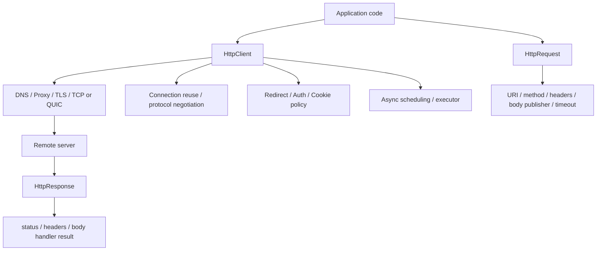
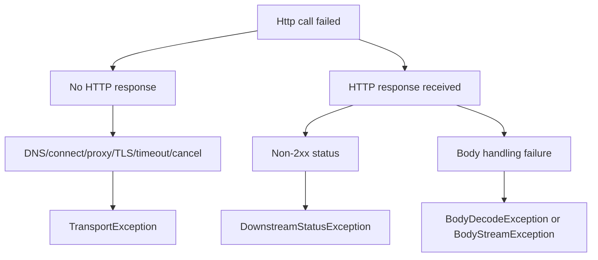
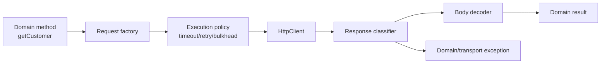

# Part 017 — Java `HttpClient` Deep Dive

> Goal utama part ini: mampu memakai `java.net.http.HttpClient` bukan sebagai helper untuk “hit endpoint”, tetapi sebagai komponen jaringan production-grade yang lifecycle, timeout, executor, proxy, redirect, cookies, authentication, cancellation, dan protocol behavior-nya dipahami dengan benar.

Pada Part 016 kita membangun mental model HTTP. Sekarang kita masuk ke API Java modern:

```java
HttpClient client = HttpClient.newBuilder()
        .connectTimeout(Duration.ofSeconds(2))
        .followRedirects(HttpClient.Redirect.NORMAL)
        .version(HttpClient.Version.HTTP_2)
        .build();

HttpRequest request = HttpRequest.newBuilder(URI.create("https://example.com/api/orders/123"))
        .timeout(Duration.ofSeconds(5))
        .header("Accept", "application/json")
        .GET()
        .build();

HttpResponse<String> response = client.send(request, HttpResponse.BodyHandlers.ofString());
```

Kode di atas terlihat sederhana. Tetapi keputusan desain di baliknya tidak sederhana:

- `HttpClient` sebaiknya dibuat sekali atau per request?
- Apa beda connect timeout dan request timeout?
- Siapa yang menjalankan task asynchronous?
- Apa konsekuensi memakai `BodyHandlers.ofString()` untuk payload besar?
- Kapan redirect otomatis aman?
- Apakah `sendAsync()` selalu lebih scalable daripada `send()`?
- Bagaimana proxy, authenticator, cookie handler, dan SSL context masuk ke boundary client?
- Apa yang sebenarnya terjadi saat `CompletableFuture.cancel(true)` dipanggil?
- Bagaimana HTTP/1.1, HTTP/2, dan HTTP/3 dipilih?

Part ini menjawabnya dari sudut pandang engineer yang harus mendesain client library, integration adapter, atau service-to-service SDK yang tahan production.

---

## 1. Kaufman Skill Slice

Dalam framework Kaufman, part ini berada pada fase **learn enough to self-correct** dan mulai masuk **deliberate practice**. Kamu tidak sedang menghafal seluruh API. Kamu sedang membangun kemampuan membaca behavior jaringan dari konfigurasi client.

### Sub-skill decomposition

| Sub-skill | Yang harus bisa kamu lakukan |
|---|---|
| Client lifecycle | Menentukan kapan client dibuat, dibagi, ditutup secara implisit oleh GC, atau dipisah per policy. |
| Request construction | Membuat request immutable dengan URI, method, header, body, timeout, dan protocol version yang benar. |
| Response handling | Memilih `BodyHandler` sesuai ukuran payload dan kebutuhan streaming. |
| Sync vs async | Memilih `send()` atau `sendAsync()` berdasarkan execution model, bukan ikut tren. |
| Timeout taxonomy | Membedakan connect timeout, request timeout, body-consumption timeout, dan external deadline. |
| Redirect policy | Menentukan kapan redirect otomatis aman atau harus manual. |
| Proxy/auth/cookies | Memahami state yang melekat di client dan risiko cross-tenant leakage. |
| Cancellation | Mendesain cancellation yang eksplisit dan tidak bergantung pada asumsi palsu. |
| Protocol preference | Memilih HTTP version secara sadar, termasuk Java 26 HTTP/3 boundary. |

---

## 2. What `HttpClient` Actually Is

`HttpClient` adalah **high-level HTTP client** di standard library Java. Sejak Java 11, module `java.net.http` mendefinisikan HTTP Client dan WebSocket API. Pada JDK 26, package ini menyediakan high-level client interface untuk HTTP/1.1, HTTP/2, dan HTTP/3, serta low-level WebSocket client interface.

Mental model:



Jadi `HttpClient` bukan hanya object untuk mengirim HTTP. Ia adalah **policy container** dan **resource-sharing boundary**.

Hal yang melekat pada client:

| Client configuration | Makna production |
|---|---|
| `connectTimeout` | Batas waktu membuka koneksi baru. Tidak sama dengan total request deadline. |
| `followRedirects` | Policy otomatis saat menerima response 3xx. Bisa berdampak security. |
| `version` | Preferred HTTP protocol version. Bukan jaminan absolut bila server/network tidak mendukung. |
| `proxy` | Egress path dan enterprise network boundary. |
| `authenticator` | Sumber credential untuk HTTP/proxy authentication. |
| `cookieHandler` | Shared mutable state untuk cookie. Berbahaya bila dipakai lintas tenant. |
| `sslContext` / `sslParameters` | Trust, key material, hostname/TLS behavior. |
| `executor` | Threading model untuk operasi async/dependent internal tertentu. |

### Invariant penting

> Buat `HttpClient` sebagai object jangka panjang untuk satu policy boundary. Jangan membuat client baru untuk setiap request kecuali memang butuh isolasi policy/resource.

Alasan:

- connection reuse butuh client yang hidup cukup lama;
- proxy, TLS, cookie, auth, dan executor adalah konfigurasi per client;
- client baru per request meningkatkan handshake, allocation, dan latency;
- client yang terlalu global bisa mencampur policy yang seharusnya terpisah.

Boundary yang masuk akal:

| Boundary | Rekomendasi |
|---|---|
| Satu downstream service dengan policy sama | Satu shared `HttpClient`. |
| Banyak tenant dengan cookie/credential berbeda | Pisahkan client atau pisahkan state handler secara ketat. |
| Egress proxy berbeda | Pisahkan client per proxy policy. |
| TLS truststore berbeda | Pisahkan client per trust boundary. |
| Test dengan fake executor/proxy | Client khusus test. |
| Request ad-hoc tanpa performance concern | `HttpClient.newHttpClient()` boleh, tapi jangan jadikan pola library. |

---

## 3. Minimum Correct Client Wrapper

Di production, jarang kita mengekspos `HttpClient` mentah ke seluruh codebase. Lebih baik bungkus sebagai adapter yang punya:

- base URI;
- timeout policy;
- default headers;
- correlation propagation;
- JSON mapper boundary;
- retry/deadline policy;
- error taxonomy;
- metrics/logging hooks;
- safe redirect policy;
- safe body size policy.

Contoh skeleton:

```java
public final class CatalogHttpClient {
    private final HttpClient client;
    private final URI baseUri;
    private final Duration requestTimeout;

    public CatalogHttpClient(HttpClient client, URI baseUri, Duration requestTimeout) {
        this.client = Objects.requireNonNull(client, "client");
        this.baseUri = Objects.requireNonNull(baseUri, "baseUri");
        this.requestTimeout = Objects.requireNonNull(requestTimeout, "requestTimeout");
    }

    public CatalogItem getItem(String itemId) throws IOException, InterruptedException {
        URI uri = baseUri.resolve("/items/" + URLEncoder.encode(itemId, StandardCharsets.UTF_8));

        HttpRequest request = HttpRequest.newBuilder(uri)
                .timeout(requestTimeout)
                .header("Accept", "application/json")
                .GET()
                .build();

        HttpResponse<String> response = client.send(request, HttpResponse.BodyHandlers.ofString(StandardCharsets.UTF_8));

        if (response.statusCode() == 404) {
            throw new CatalogItemNotFoundException(itemId);
        }
        if (response.statusCode() < 200 || response.statusCode() >= 300) {
            throw new DownstreamHttpException("catalog", response.statusCode(), response.body());
        }

        return parseCatalogItem(response.body());
    }
}
```

Ini masih sederhana, tetapi sudah punya boundary. Yang tidak boleh dilakukan:

```java
// Bad: random client per method call, no timeout, no policy ownership.
HttpResponse<String> response = HttpClient.newHttpClient()
        .send(HttpRequest.newBuilder(URI.create(url)).GET().build(), BodyHandlers.ofString());
```

---

## 4. `HttpClient` Builder Deep Dive

### 4.1 `newHttpClient()` vs `newBuilder()`

```java
HttpClient defaultClient = HttpClient.newHttpClient();

HttpClient configuredClient = HttpClient.newBuilder()
        .connectTimeout(Duration.ofSeconds(2))
        .followRedirects(HttpClient.Redirect.NORMAL)
        .build();
```

Gunakan `newHttpClient()` untuk contoh kecil atau tooling ringan. Gunakan `newBuilder()` untuk production karena kamu perlu eksplisit tentang:

- timeout;
- redirect;
- proxy;
- protocol;
- authenticator;
- cookie handler;
- SSL context;
- executor.

### 4.2 Immutability

Setelah `build()`, `HttpClient` immutable. Konfigurasi client tidak diubah per request. Kalau satu request butuh protocol version atau timeout berbeda, set di `HttpRequest.Builder`, bukan mutasi client.

```java
HttpRequest request = HttpRequest.newBuilder(uri)
        .version(HttpClient.Version.HTTP_2)
        .timeout(Duration.ofSeconds(3))
        .GET()
        .build();
```

Mental model:

```text
HttpClient = stable policy + resource sharing
HttpRequest = immutable exchange intent
BodyHandler = response body materialization strategy
HttpResponse<T> = received status/header/body result
```

---

## 5. Timeout Taxonomy in `HttpClient`

Timeout adalah sumber bug paling sering karena namanya terlihat jelas tetapi cakupannya sering disalahpahami.

### 5.1 Connect timeout

```java
HttpClient client = HttpClient.newBuilder()
        .connectTimeout(Duration.ofSeconds(2))
        .build();
```

Connect timeout membatasi waktu untuk membangun koneksi baru. Ini bukan batas total request. Bila connection sudah tersedia dari pool atau reuse, connect timeout mungkin tidak relevan untuk exchange tersebut.

### 5.2 Request timeout

```java
HttpRequest request = HttpRequest.newBuilder(uri)
        .timeout(Duration.ofSeconds(5))
        .GET()
        .build();
```

Request timeout melekat pada request. Di JDK 26, timeout request diperluas cakupannya sehingga juga mencakup konsumsi response body bila ada. Ini penting untuk download besar: timeout yang dulu cukup untuk “headers received” bisa menjadi terlalu pendek ketika body besar ikut masuk dalam cakupan timeout.

### 5.3 External deadline

Di service production, timeout request saja tidak cukup. Kamu sering punya absolute deadline dari upstream:

```text
API gateway deadline: 2_000 ms
service A budget: 1_500 ms
catalog client budget: 400 ms
payment client budget: 600 ms
fallback budget: 200 ms
```

Gunakan function yang menghitung remaining budget:

```java
public static Duration remainingOrThrow(Instant deadline, Clock clock) {
    Duration remaining = Duration.between(clock.instant(), deadline);
    if (remaining.isNegative() || remaining.isZero()) {
        throw new DeadlineExceededException();
    }
    return remaining;
}
```

Lalu set timeout request dari budget yang tersisa:

```java
Duration timeout = min(remainingOrThrow(deadline, clock), Duration.ofMillis(400));

HttpRequest request = HttpRequest.newBuilder(uri)
        .timeout(timeout)
        .GET()
        .build();
```

### 5.4 Failure mapping

| Symptom | Kemungkinan stage | Aksi |
|---|---|---|
| `HttpConnectTimeoutException` | Koneksi tidak terbentuk dalam batas waktu | Treat as connect failure; eligible retry jika request idempotent dan budget ada. |
| `HttpTimeoutException` | Response tidak diterima/selesai dalam request timeout | Cek JDK version semantics; treat as deadline failure. |
| `ConnectException` | Refused, unreachable, atau QUIC initial timeout | Bedakan dari HTTP status. |
| `SSLHandshakeException` | TLS negotiation/trust/hostname | Jangan retry blindly; biasanya config/cert issue. |
| `IOException` saat body read | Response sudah mulai tetapi body gagal | Retry hanya jika semantic aman dan response belum committed ke caller. |
| `InterruptedException` | Thread sync call diinterupsi | Restore interrupt flag dan propagate/cancel operation. |

---

## 6. Request Construction Without Footguns

### 6.1 URI building

`HttpRequest` memakai `URI`, bukan string URL mentah. Jangan concat query parameter secara manual untuk input user.

Bad:

```java
URI uri = URI.create(base + "/search?q=" + query);
```

Better minimal:

```java
String encoded = URLEncoder.encode(query, StandardCharsets.UTF_8);
URI uri = URI.create("https://api.example.com/search?q=" + encoded);
```

Untuk library production, gunakan utility URI builder yang jelas ownership-nya. Jangan biarkan setiap engineer membangun URL sendiri.

### 6.2 Header restrictions

Beberapa header dikontrol oleh client/protocol implementation. Contoh seperti `Host`, `Content-Length`, `Connection`, dan beberapa header hop-by-hop tidak seharusnya ditulis manual oleh aplikasi biasa. JDK menyediakan system property untuk mengizinkan restricted headers, tetapi dokumentasi menempatkannya sebagai mekanisme testing, bukan konfigurasi deployment normal.

Rule:

> Kalau kamu merasa perlu override `Host` atau `Content-Length`, kemungkinan kamu sedang menulis test harness, proxy/gateway, atau sedang melawan abstraction HTTP client.

### 6.3 Method and body

```java
HttpRequest get = HttpRequest.newBuilder(uri).GET().build();

HttpRequest post = HttpRequest.newBuilder(uri)
        .header("Content-Type", "application/json")
        .POST(HttpRequest.BodyPublishers.ofString(json, StandardCharsets.UTF_8))
        .build();

HttpRequest patch = HttpRequest.newBuilder(uri)
        .method("PATCH", HttpRequest.BodyPublishers.ofString(patchJson))
        .build();
```

Use `method()` untuk method yang tidak punya shortcut.

### 6.4 Idempotency key

Untuk POST yang bisa di-retry secara aman karena server mendukung deduplication, gunakan idempotency key:

```java
HttpRequest request = HttpRequest.newBuilder(uri)
        .timeout(Duration.ofSeconds(3))
        .header("Content-Type", "application/json")
        .header("Idempotency-Key", commandId.toString())
        .POST(HttpRequest.BodyPublishers.ofString(json))
        .build();
```

Tetapi header ini hanya berguna bila downstream benar-benar mendukung semantic idempotency key. Tanpa dukungan server, itu hanya string.

---

## 7. Sync `send()` vs Async `sendAsync()`

### 7.1 Synchronous send

```java
try {
    HttpResponse<String> response = client.send(request, BodyHandlers.ofString());
    return response.body();
} catch (InterruptedException e) {
    Thread.currentThread().interrupt();
    throw new RequestCancelledException(e);
}
```

`send()` cocok ketika:

- kamu ada di virtual thread;
- call graph kamu naturally synchronous;
- kamu butuh structured control flow sederhana;
- jumlah concurrent blocked platform thread tidak besar, atau sudah memakai virtual threads;
- error handling lebih penting daripada composition pipeline.

Dengan virtual threads, blocking network I/O kembali menjadi desain yang valid untuk banyak workload service-to-service. Tetapi tetap perlu timeout, budget, dan bulkhead.

### 7.2 Asynchronous send

```java
CompletableFuture<HttpResponse<String>> future = client.sendAsync(request, BodyHandlers.ofString());

future.thenApply(HttpResponse::body)
      .thenAccept(System.out::println)
      .exceptionally(ex -> {
          log.warn("request failed", ex);
          return null;
      });
```

`sendAsync()` cocok ketika:

- kamu perlu fan-out/fan-in beberapa request;
- kamu berada di event-driven layer;
- kamu ingin pipeline dengan `CompletableFuture`;
- kamu mengintegrasikan dengan reactive streams/body subscriber;
- kamu tidak ingin blocking caller thread.

Tetapi `sendAsync()` bukan magic scalability. Kamu tetap punya:

- connection limits;
- downstream capacity;
- body memory usage;
- executor behavior;
- cancellation ambiguity;
- retry amplification risk.

### 7.3 Fan-out dengan timeout budget

```java
public CompletableFuture<List<Item>> fetchAll(List<URI> uris, Duration timeout) {
    List<CompletableFuture<Item>> futures = uris.stream()
            .map(uri -> {
                HttpRequest request = HttpRequest.newBuilder(uri)
                        .timeout(timeout)
                        .GET()
                        .build();
                return client.sendAsync(request, BodyHandlers.ofString())
                        .thenApply(this::toItem);
            })
            .toList();

    return CompletableFuture.allOf(futures.toArray(CompletableFuture[]::new))
            .thenApply(ignored -> futures.stream()
                    .map(CompletableFuture::join)
                    .toList());
}
```

Masalah yang belum diselesaikan contoh ini:

- tidak ada concurrency limit;
- semua request memakai timeout sama, bukan remaining deadline;
- failure satu future membuat `join()` melempar;
- tidak ada cancellation terhadap sibling request;
- semua body masuk memory sebagai string.

Versi lebih defensif harus menambahkan semaphore/bulkhead dan aggregation policy.

---

## 8. Executor Behavior

`HttpClient.Builder.executor(Executor)` sering disalahpahami.

```java
ExecutorService executor = Executors.newFixedThreadPool(32);

HttpClient client = HttpClient.newBuilder()
        .executor(executor)
        .build();
```

Executor bukan “jumlah koneksi”. Executor juga bukan pengganti connection pool. Ia memengaruhi execution asynchronous/internal tasks sesuai implementasi API. Dependent stages pada `CompletableFuture` yang kamu tambahkan tanpa executor eksplisit mengikuti aturan `CompletableFuture` dan context completion.

Praktik aman:

```java
future.thenApplyAsync(this::decode, decodeExecutor)
      .thenAcceptAsync(this::persist, persistenceExecutor);
```

Jangan lakukan CPU-heavy JSON parsing besar di thread yang tidak kamu pahami ownership-nya.

### 8.1 Executor sizing heuristic

| Workload | Executor strategy |
|---|---|
| Mostly network wait, small body | Default client executor sering cukup, tapi tetap observasi. |
| Heavy JSON/XML decode | Pisahkan decode executor atau pakai virtual thread sync flow. |
| Large file streaming | Hindari executor kecil yang juga dipakai task control. |
| Multi-tenant SDK | Jangan share executor tanpa backpressure per tenant. |
| UI/desktop app | Jangan callback blocking di UI thread. |

### 8.2 Virtual thread alternative

Untuk request parallel yang ingin tetap synchronous:

```java
try (ExecutorService executor = Executors.newVirtualThreadPerTaskExecutor()) {
    List<Future<Item>> futures = uris.stream()
            .map(uri -> executor.submit(() -> fetchOne(uri)))
            .toList();

    List<Item> result = new ArrayList<>();
    for (Future<Item> future : futures) {
        result.add(future.get());
    }
    return result;
}
```

Ini sering lebih mudah di-debug daripada chain `CompletableFuture` panjang. Namun kamu tetap harus membatasi fan-out agar tidak menyerang downstream.

---

## 9. Protocol Version Preference

```java
HttpClient client = HttpClient.newBuilder()
        .version(HttpClient.Version.HTTP_2)
        .build();
```

`version()` adalah preferred version. Server support, TLS ALPN, proxy behavior, dan JDK version menentukan hasil aktual.

```java
HttpResponse<String> response = client.send(request, BodyHandlers.ofString());
System.out.println(response.version());
```

Selalu ukur actual response version ketika sedang tuning behavior.

### 9.1 HTTP/1.1 vs HTTP/2 vs HTTP/3

| Version | Transport umum | Hal penting |
|---|---|---|
| HTTP/1.1 | TCP | Connection reuse, possible head-of-line per connection, request/response sequentiality. |
| HTTP/2 | TCP + TLS umum | Multiplexing streams di satu connection, flow control, ALPN. |
| HTTP/3 | QUIC over UDP | Tidak memakai TCP; Java 26 menambahkan client-side support. |

HTTP/3 di Java 26 menambah `HttpClient.Version.HTTP_3` dan opsi discovery. Tetapi jangan jadikan default enterprise tanpa validasi:

- UDP egress sering dibatasi firewall;
- observability packet/network berbeda;
- proxy/middlebox support bisa berbeda;
- fallback behavior perlu diuji;
- performance benefit workload-dependent.

Dalam seri ini, detail HTTP/2/connection pooling/flow-control dibahas di Part 019. HTTP/3 dibahas sebagai extension modern di Part 019 dan Part 027/029 dari sisi debugging/failure injection.

---

## 10. Redirect Policy

```java
HttpClient client = HttpClient.newBuilder()
        .followRedirects(HttpClient.Redirect.NORMAL)
        .build();
```

Redirect terlihat convenience, tetapi ia mengubah tujuan request.

Policy umum:

| Redirect policy | Makna |
|---|---|
| `NEVER` | Tidak mengikuti redirect otomatis. Paling eksplisit dan aman untuk security-sensitive client. |
| `NORMAL` | Mengikuti redirect normal, dengan batasan tertentu. Umumnya pilihan reasonable untuk browser-like GET. |
| `ALWAYS` | Mengikuti lebih agresif. Hindari untuk client internal yang membawa credential. |

Risiko redirect otomatis:

- credential/header ikut ke host lain;
- downgrade scheme;
- SSRF bypass;
- request body non-repeatable;
- audit trail membingungkan karena target akhir berubah;
- policy allowlist diterapkan ke URI awal tetapi tidak ke URI final.

Rule production:

> Untuk internal service client, default aman adalah `Redirect.NEVER`, kecuali downstream contract memang mendefinisikan redirect dan kamu validate target akhir.

Manual redirect pattern:

```java
HttpResponse<Void> response = client.send(request, BodyHandlers.discarding());

if (response.statusCode() / 100 == 3) {
    Optional<String> location = response.headers().firstValue("Location");
    URI next = validateRedirectTarget(request.uri(), location.orElseThrow());
    // Build a new request explicitly.
}
```

---

## 11. Cookies and Shared State

```java
CookieManager cookieManager = new CookieManager();
cookieManager.setCookiePolicy(CookiePolicy.ACCEPT_ORIGINAL_SERVER);

HttpClient client = HttpClient.newBuilder()
        .cookieHandler(cookieManager)
        .build();
```

Cookie handler adalah stateful. Ini bisa benar untuk browser-like clients, tetapi berisiko untuk service-to-service clients.

Bahaya:

- cookie tenant A terbawa ke request tenant B;
- test flakiness karena state lintas test;
- redirect menulis cookie dari host tak terduga;
- cookie jar memory growth;
- debugging sulit karena header tidak terlihat di call site.

Praktik aman:

| Scenario | Policy |
|---|---|
| Internal API token auth | Jangan pakai cookie handler. |
| Browser automation/testing | Cookie manager per session. |
| Multi-tenant integration | Cookie jar per tenant/session, bukan global. |
| SDK stateless | Hindari cookie state kecuali explicit opt-in. |

---

## 12. Authentication

```java
Authenticator authenticator = new Authenticator() {
    @Override
    protected PasswordAuthentication getPasswordAuthentication() {
        return new PasswordAuthentication("user", "secret".toCharArray());
    }
};

HttpClient client = HttpClient.newBuilder()
        .authenticator(authenticator)
        .build();
```

`Authenticator` dapat dipakai untuk HTTP authentication/proxy authentication. Tetapi untuk API modern, bearer token sering lebih eksplisit di header:

```java
HttpRequest request = HttpRequest.newBuilder(uri)
        .header("Authorization", "Bearer " + token)
        .GET()
        .build();
```

Praktik aman:

- jangan log `Authorization`;
- jangan kirim credential lintas redirect host;
- jangan gunakan global authenticator untuk banyak trust boundary;
- rotate token di boundary provider, bukan di setiap call site;
- bedakan proxy auth dan origin server auth.

---

## 13. Proxy Integration

```java
HttpClient client = HttpClient.newBuilder()
        .proxy(ProxySelector.of(new InetSocketAddress("proxy.internal", 8080)))
        .build();
```

Proxy mengubah network path. Ini bukan detail kosmetik.

Efek proxy:

- DNS bisa terjadi di client atau proxy tergantung protocol/mode;
- TLS HTTPS biasanya lewat CONNECT tunnel;
- HTTP plain bisa di-forward sebagai absolute-form request;
- proxy bisa menambahkan latency dan error sendiri;
- authentication failure bisa berasal dari proxy, bukan origin;
- corporate proxy bisa memblokir method/header tertentu;
- HTTP/2/3 support bisa berubah.

Failure taxonomy proxy:

| Symptom | Bisa berarti |
|---|---|
| 407 | Proxy authentication required. |
| 502/503 dari proxy | Origin unreachable dari sisi proxy. |
| TLS handshake failure | CONNECT tunnel, MITM cert, SNI, atau truststore issue. |
| Connection timeout ke proxy | Egress/proxy down, bukan origin down. |
| Different DNS result | Proxy-side DNS, split horizon, atau PAC/proxy selector behavior. |

Part 021 akan membahas proxy lebih dalam.

---

## 14. SSL/TLS Configuration Boundary

```java
SSLContext sslContext = SSLContext.getInstance("TLS");
sslContext.init(keyManagers, trustManagers, secureRandom);

HttpClient client = HttpClient.newBuilder()
        .sslContext(sslContext)
        .build();
```

SSL context adalah trust boundary. Jangan share client dengan SSL context khusus untuk semua downstream.

Contoh boundary yang butuh client terpisah:

- public internet truststore;
- private PKI truststore;
- mTLS ke payment provider;
- test trust manager;
- certificate pinning wrapper;
- different hostname verification expectations.

Rule:

> Jangan pernah “mematikan hostname verification” sebagai fix production. Kalau TLS gagal, perbaiki SAN/certificate/trust chain, bukan hapus validasi.

Detail TLS akan dibahas di Part 022.

---

## 15. Response Handling Basics

```java
HttpResponse<String> response = client.send(request, BodyHandlers.ofString());

int status = response.statusCode();
HttpHeaders headers = response.headers();
String body = response.body();
```

`HttpResponse<T>` bukan selalu berarti success. Ia berarti HTTP response diterima dan body berhasil ditangani sesuai `BodyHandler`.

Jangan lakukan:

```java
return client.send(request, BodyHandlers.ofString()).body();
```

Karena kamu kehilangan:

- status code;
- headers;
- response version;
- previous response/redirect chain;
- URI final;
- body-size policy;
- error mapping.

Pattern:

```java
HttpResponse<String> response = client.send(request, BodyHandlers.ofString());

if (response.statusCode() >= 200 && response.statusCode() < 300) {
    return decode(response.body());
}

if (response.statusCode() == 404) {
    return Optional.empty();
}

throw mapError(response.statusCode(), response.headers(), response.body());
```

### 15.1 Do not over-read error bodies

Untuk error response, body bisa besar. Batasi ukuran error body yang disimpan di exception/log.

```java
static String abbreviate(String body, int maxChars) {
    if (body == null || body.length() <= maxChars) return body;
    return body.substring(0, maxChars) + "...<truncated>";
}
```

Part 018 akan membahas streaming dan body handler secara mendalam.

---

## 16. Cancellation and Interruption

### 16.1 Synchronous interruption

```java
try {
    return client.send(request, BodyHandlers.ofString());
} catch (InterruptedException e) {
    Thread.currentThread().interrupt();
    throw new RequestInterruptedException(e);
}
```

Invariant Java umum tetap berlaku:

> Bila menangkap `InterruptedException` dan tidak bisa menyelesaikan cancellation di method itu, restore interrupt flag.

### 16.2 Async cancellation

```java
CompletableFuture<HttpResponse<String>> future = client.sendAsync(request, BodyHandlers.ofString());
boolean accepted = future.cancel(true);
```

Jangan berasumsi cancellation selalu langsung menghentikan operasi jaringan pada semua stage. Dokumentasi package `java.net.http` menyatakan bahwa kecuali dispesifikkan lain, cancel pada `CompletableFuture` dari API ini mungkin tidak menginterupsi underlying operation, walau berguna untuk menyelesaikan dependent stages secara exceptional.

Desain yang benar:

- tetap set request timeout;
- propagate deadline;
- jangan hanya mengandalkan `cancel(true)`;
- desain body subscriber agar menghormati cancellation/backpressure;
- observasi apakah downstream tetap menerima request.

---

## 17. Error Taxonomy for `HttpClient`

Buat taxonomy eksplisit. Jangan semua error jadi `RuntimeException("failed")`.



Suggested exception model:

```java
sealed class DownstreamException extends Exception
        permits TransportFailure, DownstreamStatusFailure, ResponseDecodeFailure, DeadlineFailure {
    DownstreamException(String message, Throwable cause) { super(message, cause); }
}

final class TransportFailure extends DownstreamException { /* DNS/connect/TLS/reset */ }
final class DeadlineFailure extends DownstreamException { /* timeout/deadline */ }
final class DownstreamStatusFailure extends DownstreamException { /* status + safe body excerpt */ }
final class ResponseDecodeFailure extends DownstreamException { /* invalid JSON/schema */ }
```

Mapping examples:

| Case | Exception category | Retry? |
|---|---|---|
| Connect timeout | Deadline/transport | Maybe, if idempotent and budget remains. |
| TLS handshake | Transport config/security | Usually no. |
| 429 | Downstream status | Maybe after `Retry-After` and budget. |
| 500 | Downstream status | Maybe for idempotent operations. |
| 400 | Downstream status | No; caller/request bug. |
| Body JSON invalid | Decode failure | No unless downstream deploy issue and retry unlikely helps. |
| Interrupted | Cancellation | Propagate, usually no retry inside same call. |

---

## 18. Production Client Design Pattern

A production-grade HTTP client wrapper should separate:

- request creation;
- transport execution;
- response classification;
- body decoding;
- retry policy;
- observability;
- configuration.



### 18.1 Example: reusable execution method

```java
public final class HttpExchangeExecutor {
    private final HttpClient client;

    public HttpExchangeExecutor(HttpClient client) {
        this.client = Objects.requireNonNull(client);
    }

    public <T> T execute(
            HttpRequest request,
            HttpResponse.BodyHandler<String> bodyHandler,
            Function<HttpResponse<String>, T> successMapper
    ) throws IOException, InterruptedException {
        long start = System.nanoTime();
        try {
            HttpResponse<String> response = client.send(request, bodyHandler);
            int status = response.statusCode();

            if (status >= 200 && status < 300) {
                return successMapper.apply(response);
            }
            throw mapStatusFailure(response);
        } finally {
            long elapsedNanos = System.nanoTime() - start;
            recordLatency(request.uri(), elapsedNanos);
        }
    }
}
```

Ini belum lengkap, tetapi structure-nya benar: semua call melewati satu choke point.

### 18.2 Retry belongs outside raw `send()`

Jangan retry inline di setiap method.

Bad:

```java
try {
    return client.send(request, handler);
} catch (IOException e) {
    return client.send(request, handler);
}
```

Better:

```java
RetryPolicy policy = RetryPolicy.idempotentNetworkRetry();
return policy.execute(() -> client.send(request, handler));
```

Tapi policy harus tahu:

- method HTTP;
- body repeatability;
- idempotency key;
- deadline remaining;
- exception category;
- status code;
- retry-after;
- attempt count.

---

## 19. Body Repeatability and Retry

`HttpRequest.BodyPublisher` bisa repeatable atau tidak tergantung implementasi. `ofString()` dan `ofByteArray()` repeatable secara natural karena data sudah tersedia. Streaming dari input satu kali bisa tidak repeatable.

Rule:

> Jangan retry request dengan body non-repeatable kecuali kamu bisa membuat body baru untuk setiap attempt.

Pattern request factory:

```java
@FunctionalInterface
public interface RequestFactory {
    HttpRequest create(Duration timeout);
}

RequestFactory factory = timeout -> HttpRequest.newBuilder(uri)
        .timeout(timeout)
        .header("Content-Type", "application/json")
        .POST(BodyPublishers.ofString(json))
        .build();
```

Retry loop memanggil factory per attempt, bukan reuse object yang mungkin memegang publisher state berbahaya.

---

## 20. Observability Hooks

Minimum fields yang perlu dicatat:

| Field | Kenapa penting |
|---|---|
| downstream name | Aggregation metric. |
| method | Retry/idempotency analysis. |
| URI template, not raw URI | Hindari PII/cardinality explosion. |
| status class/code | Health/error rate. |
| exception category | Bedakan network failure dan HTTP error. |
| elapsed time | SLO dan timeout tuning. |
| attempt number | Retry amplification visibility. |
| response version | HTTP/1.1 vs HTTP/2/3 behavior. |
| body size estimate | Memory/performance debugging. |
| proxy route | Enterprise network issue. |

Jangan log:

- raw authorization header;
- cookies;
- full query string berisi PII;
- full response body tanpa redaction;
- TLS key material;
- high-cardinality raw URL.

Example sanitized log:

```text
http.client result=failed downstream=catalog method=GET uri_template=/items/{id} status=503 \
exception=downstream_status attempt=1 elapsed_ms=384 version=HTTP_2
```

---

## 21. Configuration Model

Gunakan config eksplisit:

```java
public record DownstreamHttpConfig(
        URI baseUri,
        Duration connectTimeout,
        Duration requestTimeout,
        HttpClient.Redirect redirectPolicy,
        HttpClient.Version preferredVersion,
        int maxConcurrency,
        boolean enableRetries
) {}
```

Validasi saat startup:

```java
public DownstreamHttpConfig {
    Objects.requireNonNull(baseUri);
    if (!"https".equalsIgnoreCase(baseUri.getScheme())) {
        throw new IllegalArgumentException("baseUri must use https");
    }
    if (connectTimeout.isNegative() || connectTimeout.isZero()) {
        throw new IllegalArgumentException("connectTimeout must be positive");
    }
    if (requestTimeout.compareTo(connectTimeout) < 0) {
        throw new IllegalArgumentException("requestTimeout should not be smaller than connectTimeout");
    }
    if (maxConcurrency <= 0) {
        throw new IllegalArgumentException("maxConcurrency must be positive");
    }
}
```

---

## 22. Safe Defaults

Untuk service-to-service client internal:

```java
HttpClient client = HttpClient.newBuilder()
        .connectTimeout(Duration.ofSeconds(2))
        .followRedirects(HttpClient.Redirect.NEVER)
        .version(HttpClient.Version.HTTP_2)
        .build();
```

Request:

```java
HttpRequest request = HttpRequest.newBuilder(uri)
        .timeout(Duration.ofSeconds(5))
        .header("Accept", "application/json")
        .GET()
        .build();
```

Safe default rationale:

| Decision | Rationale |
|---|---|
| HTTPS only | Protects confidentiality/integrity at transport boundary. |
| Redirect never | Avoids credential leakage and SSRF bypass. |
| Connect timeout | Avoids stuck connection establishment. |
| Request timeout | Avoids unbounded wait. |
| Shared client per downstream | Enables resource reuse while preserving policy. |
| Explicit body handler | Forces memory/streaming decision. |
| Explicit error taxonomy | Avoids conflating HTTP status with network failure. |

---

## 23. Common Anti-Patterns

### 23.1 Client per request

```java
HttpClient.newHttpClient().send(request, handler);
```

Consequence:

- poor connection reuse;
- inconsistent policy;
- harder debugging;
- more handshake overhead.

### 23.2 No timeout

```java
HttpRequest.newBuilder(uri).GET().build();
```

Consequence:

- threads/futures can wait too long;
- SLO violation propagates;
- cascading failure under partial outage.

### 23.3 `ofString()` for unknown large body

```java
BodyHandlers.ofString()
```

Consequence:

- body fully materialized as string;
- memory pressure;
- logs accidentally capture huge data.

### 23.4 Blind retry

```java
catch (IOException e) {
    return client.send(request, handler);
}
```

Consequence:

- duplicate writes;
- retry storm;
- hidden latency;
- inconsistent side effects.

### 23.5 Global mutable cookie jar

```java
static final CookieManager COOKIE_MANAGER = new CookieManager();
```

Consequence:

- cross-user state leakage;
- test pollution;
- unexpected auth/session behavior.

### 23.6 Redirect always

```java
.followRedirects(HttpClient.Redirect.ALWAYS)
```

Consequence:

- sends sensitive headers to unintended destinations;
- security policy bypass;
- observability points at original URL but call goes elsewhere.

---

## 24. Decision Matrix

| Requirement | Recommended approach |
|---|---|
| Simple CLI tool | `newHttpClient()`, request timeout, `ofString()` acceptable. |
| Internal service client | Shared configured client, redirect never, HTTPS, timeout, taxonomy. |
| Large downloads | `BodyHandlers.ofFile()` or streaming subscriber. |
| Large uploads | File/channel body publisher, avoid loading entire file. |
| High fan-out | Async or virtual threads plus explicit concurrency limit. |
| Multi-tenant cookies | Separate cookie state per tenant/session. |
| Corporate proxy | Explicit proxy selector and proxy observability. |
| mTLS | Separate client per key/trust boundary. |
| HTTP/3 experiment | Opt-in per request/client, observe actual version and fallback. |

---

## 25. Practice Drills

### Drill 1 — Build a safe downstream client

Implement a `CustomerDirectoryClient` with:

- shared `HttpClient`;
- base URI;
- connect timeout;
- request timeout;
- redirect disabled;
- method `findCustomerById(CustomerId)`;
- status mapping for 200, 404, 429, 5xx;
- exception taxonomy.

Acceptance criteria:

- no client per request;
- no raw string URL concat for user input;
- no blind retry;
- no full body in logs.

### Drill 2 — Sync vs async comparison

Create 100 GET requests against a local test server.

Implement both:

- `send()` with virtual threads;
- `sendAsync()` with `CompletableFuture`.

Measure:

- wall-clock latency;
- max concurrency;
- error behavior when 10% endpoint sleeps;
- cancellation behavior when global deadline expires.

Expected learning:

- async composition is not automatically simpler;
- virtual threads make sync flow practical;
- both require bulkhead/deadline.

### Drill 3 — Redirect safety test

Build a local server that returns:

```text
302 Location: https://evil.example/collect
```

Verify your client:

- does not follow redirect by default;
- validates target host before following;
- does not forward `Authorization` to unrelated host.

### Drill 4 — Timeout boundary

Create a server with modes:

- accepts connection but never responds;
- delays headers;
- sends headers then slow body;
- resets connection midway.

Observe which exception category your wrapper produces.

---

## 26. Production Checklist

Before approving a Java `HttpClient` usage:

- [ ] Is `HttpClient` lifecycle explicit and not per request?
- [ ] Is connect timeout configured?
- [ ] Is request timeout configured per request?
- [ ] Is there an external deadline/budget when called inside request path?
- [ ] Is redirect policy deliberate?
- [ ] Are cookies disabled or isolated?
- [ ] Are credentials scoped to one trust boundary?
- [ ] Is proxy behavior explicit where required?
- [ ] Is body handler chosen based on payload size?
- [ ] Is error taxonomy explicit?
- [ ] Is retry policy outside raw `send()`?
- [ ] Are retries limited by idempotency and deadline?
- [ ] Is cancellation handled for sync/async flows?
- [ ] Are logs sanitized?
- [ ] Is actual response protocol version observable?

---

## 27. What This Part Should Change in Your Thinking

Sebelum part ini, `HttpClient` mungkin terlihat seperti class convenience. Setelah part ini, seharusnya kamu melihatnya sebagai:

```text
HttpClient = network policy boundary + resource sharing container + protocol execution engine
HttpRequest = immutable intent for one exchange
BodyHandler = body materialization/streaming policy
HttpResponse = HTTP result, not necessarily business success
```

Skill yang harus mulai otomatis:

- membuat client per downstream policy, bukan per request;
- memisahkan connect timeout, request timeout, dan deadline;
- tidak memakai redirect/cookie/global auth tanpa alasan;
- memilih sync/async berdasarkan execution model;
- mengklasifikasikan HTTP status, network failure, timeout, dan decode failure secara terpisah;
- memperlakukan body handler sebagai keputusan memory/performance.

---

## 28. Reference Notes

Materi part ini merujuk pada:

- Java SE 26 `java.net.http` package documentation: module dan package ini mendefinisikan HTTP Client/WebSocket API serta high-level client interface untuk HTTP/1.1, HTTP/2, dan HTTP/3.
- Java SE 26 `HttpClient`, `HttpRequest`, `HttpResponse`, `BodyPublisher`, `BodyHandler`, dan `BodySubscriber` API documentation.
- Inside Java: HTTP Client updates in Java 26, termasuk HTTP/3 support, body publisher untuk file region, dan perubahan request timeout yang mencakup body consumption.
- RFC HTTP semantics yang dibahas di Part 016.

---

## 29. Bridge to Part 018

Part 017 membahas client lifecycle dan request/response execution. Part 018 akan masuk ke bagian yang sering paling mahal di production: **body publishing, body handling, streaming, memory safety, cancellation, dan large payload transfer**.

