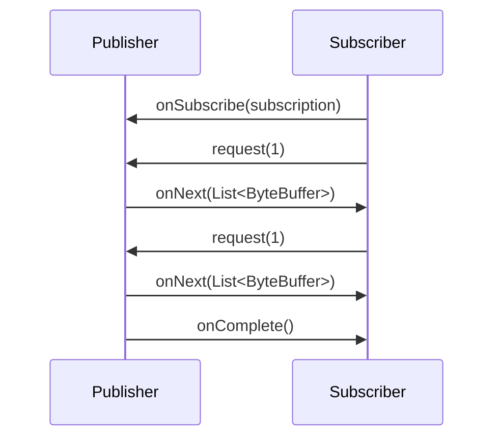
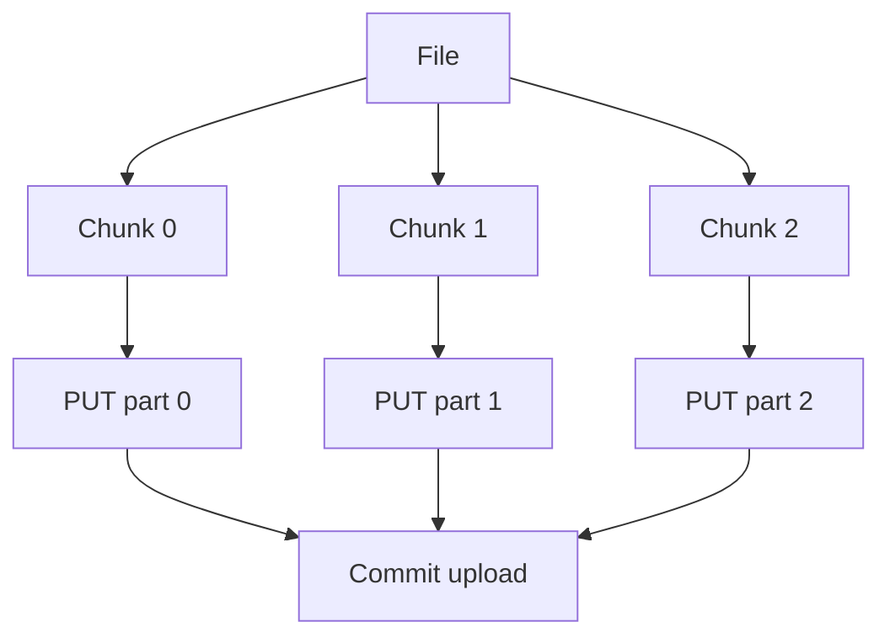

# Part 018 — `HttpClient` Body Publishers, Handlers, and Streaming

> Goal utama part ini: mampu memilih dan membangun request/response body strategy yang memory-safe, retry-aware, cancellation-aware, dan cocok untuk payload kecil maupun besar.

Pada Part 017 kita melihat `HttpClient` sebagai policy boundary. Sekarang kita membedah bagian yang sering membuat sistem production jatuh diam-diam: **body handling**.

Kode ini aman untuk response kecil:

```java
HttpResponse<String> response = client.send(request, BodyHandlers.ofString());
```

Tetapi bisa menjadi bug untuk response besar, stream panjang, download file, endpoint tak tepercaya, atau sistem dengan fan-out tinggi.

Pertanyaan yang harus bisa kamu jawab:

- apakah body masuk heap seluruhnya?
- apakah body bisa streaming ke file?
- apakah upload membaca file seluruhnya ke memory?
- apakah request body bisa dikirim ulang saat retry?
- bagaimana backpressure bekerja?
- kapan `BodyHandler` dipanggil?
- apa beda `BodyHandler` dan `BodySubscriber`?
- bagaimana membatasi ukuran body?
- bagaimana menangani response error dengan body besar?
- apa yang terjadi saat timeout/cancellation di tengah body?

---

## 1. Kaufman Skill Slice

Ini bagian **deliberate practice**. Kamu sedang melatih kemampuan mengubah HTTP call dari “ambil string” menjadi “atur aliran byte dengan konsekuensi memory, latency, dan failure yang jelas”.

### Sub-skill decomposition

| Sub-skill | Yang harus bisa dilakukan |
|---|---|
| Request body publishing | Memilih `BodyPublisher` yang repeatable, streaming, atau bounded. |
| Response body handling | Memilih `BodyHandler` yang materialize, discard, stream, atau custom. |
| Backpressure | Memahami bahwa body bytes diproses sebagai stream, bukan magic array. |
| Large payload | Upload/download file tanpa menahan seluruh payload di heap. |
| Error body | Membaca error body secara aman dan terbatas. |
| Retry safety | Mengetahui apakah body bisa dikirim ulang. |
| Cancellation | Mendesain subscriber/publisher yang bisa berhenti dengan benar. |
| Decode boundary | Memisahkan transport body dari JSON/XML/domain decoding. |

---

## 2. Body API Mental Model

Java HTTP Client memodelkan body sebagai flow of byte buffers.

```mermaid
flowchart LR
    A[Application object<br/>String/File/byte[]/custom stream] --> B[BodyPublisher]
    B --> C[HttpClient request pipeline]
    C --> D[Network]
    D --> E[HttpClient response pipeline]
    E --> F[BodyHandler]
    F --> G[BodySubscriber]
    G --> H[Application result<br/>String/File/InputStream/domain object]
```

Tiga konsep utama:

| Type | Role |
|---|---|
| `HttpRequest.BodyPublisher` | Mengubah object Java menjadi stream `ByteBuffer` untuk request body. |
| `HttpResponse.BodyHandler<T>` | Memilih `BodySubscriber<T>` setelah status/header awal response diterima. |
| `HttpResponse.BodySubscriber<T>` | Mengonsumsi bytes response dan menghasilkan body bertipe `T`. |

`BodyHandler` punya akses ke `ResponseInfo`, yaitu status dan header awal. Ini berarti kamu bisa memilih strategy berdasarkan status code/header sebelum body dibaca.

---

## 3. The Dangerous Convenience of `ofString()`

```java
HttpResponse<String> response = client.send(request, BodyHandlers.ofString());
```

Ini bagus untuk:

- payload kecil;
- config service;
- JSON kecil;
- endpoint internal yang size-nya dikontrol;
- CLI sederhana.

Ini buruk untuk:

- file besar;
- report export;
- endpoint publik/tidak tepercaya;
- response streaming;
- high fan-out;
- error body yang bisa sangat besar;
- payload yang tidak punya limit.

Mental model:

```text
BodyHandlers.ofString() = read entire response body -> decode bytes -> create String
```

Konsekuensi:

- seluruh body masuk memory;
- ada alokasi byte/string;
- charset matters;
- response besar bisa menekan GC;
- high concurrency mengalikan memory footprint.

Contoh risiko:

```text
100 concurrent requests × 20 MB body = 2 GB body bytes before object overhead
```

Jangan tunggu OOM untuk menyadari body handler adalah keputusan arsitektur.

---

## 4. Request Body Publishers

### 4.1 No body

```java
HttpRequest request = HttpRequest.newBuilder(uri)
        .GET()
        .build();
```

Atau eksplisit:

```java
HttpRequest request = HttpRequest.newBuilder(uri)
        .method("DELETE", BodyPublishers.noBody())
        .build();
```

### 4.2 String body

```java
HttpRequest request = HttpRequest.newBuilder(uri)
        .header("Content-Type", "application/json; charset=utf-8")
        .POST(BodyPublishers.ofString(json, StandardCharsets.UTF_8))
        .build();
```

Cocok untuk body kecil/sedang yang sudah ada sebagai string. Tidak cocok untuk file besar atau stream panjang.

### 4.3 Byte array body

```java
byte[] bytes = payload.toByteArray();

HttpRequest request = HttpRequest.newBuilder(uri)
        .header("Content-Type", "application/octet-stream")
        .POST(BodyPublishers.ofByteArray(bytes))
        .build();
```

Cocok untuk binary kecil. Tetapi tetap seluruh payload sudah ada di heap.

### 4.4 File body

```java
HttpRequest request = HttpRequest.newBuilder(uri)
        .header("Content-Type", "application/octet-stream")
        .POST(BodyPublishers.ofFile(path))
        .build();
```

Ini lebih baik untuk file besar karena client dapat membaca file sebagai stream, bukan harus membuat `byte[]` seluruh file.

Perhatikan:

- file harus tetap ada dan readable saat request dikirim;
- retry harus bisa membuka/membaca ulang file;
- permission error muncul sebagai failure body publishing;
- file berubah selama upload bisa membuat behavior tidak diinginkan;
- checksum/content-length policy perlu jelas untuk data kritikal.

### 4.5 Java 26 file region upload

JDK 26 menambahkan `BodyPublishers.ofFileChannel(FileChannel channel, long offset, long length)` untuk upload region tertentu dari file channel. Ini berguna untuk sliced upload, parallel chunk upload, atau resume upload design.

Conceptual usage:

```java
try (FileChannel channel = FileChannel.open(path, StandardOpenOption.READ)) {
    HttpRequest request = HttpRequest.newBuilder(uri)
            .header("Content-Type", "application/octet-stream")
            .POST(BodyPublishers.ofFileChannel(channel, offset, length))
            .build();

    HttpResponse<String> response = client.send(request, BodyHandlers.ofString());
}
```

Design implications:

- publisher membaca region tertentu;
- tidak perlu materialize seluruh file di memory;
- cocok untuk chunked/sliced transfer;
- channel lifecycle harus dikelola sampai request selesai;
- retry harus memastikan channel masih valid atau dibuat ulang per attempt.

Untuk retry, lebih aman pakai factory:

```java
public HttpRequest createChunkUploadRequest(Path path, long offset, long length) throws IOException {
    FileChannel channel = FileChannel.open(path, StandardOpenOption.READ);
    return HttpRequest.newBuilder(uploadUri)
            .header("Content-Type", "application/octet-stream")
            .POST(BodyPublishers.ofFileChannel(channel, offset, length))
            .build();
}
```

Tetapi pattern di atas harus menutup channel setelah exchange selesai. Wrapper production perlu resource ownership yang eksplisit.

### 4.6 InputStream supplier

```java
HttpRequest request = HttpRequest.newBuilder(uri)
        .POST(BodyPublishers.ofInputStream(() -> openSourceStream()))
        .build();
```

Kunci: supplier, bukan `InputStream` langsung. Itu memungkinkan publisher meminta stream saat dibutuhkan.

Risiko:

- supplier harus mengembalikan stream baru untuk setiap subscription/retry;
- stream bisa gagal di tengah upload;
- content length mungkin tidak diketahui;
- retry body bisa unsafe bila stream hanya sekali pakai;
- resource harus tertutup.

Bad:

```java
InputStream stream = socket.getInputStream();
BodyPublisher publisher = BodyPublishers.ofInputStream(() -> stream); // likely non-repeatable
```

Better:

```java
BodyPublisher publisher = BodyPublishers.ofInputStream(() -> Files.newInputStream(path));
```

---

## 5. Response Body Handlers

### 5.1 Discarding body

```java
HttpResponse<Void> response = client.send(request, BodyHandlers.discarding());
```

Cocok untuk:

- health endpoint;
- HEAD-like behavior;
- response body tidak penting;
- delete/update command yang status-only.

Tetapi jangan discard error body bila debugging/audit butuh excerpt. Gunakan bounded error body handler.

### 5.2 String body

```java
HttpResponse<String> response = client.send(request, BodyHandlers.ofString(StandardCharsets.UTF_8));
```

Gunakan charset eksplisit bila contract diketahui.

### 5.3 Byte array body

```java
HttpResponse<byte[]> response = client.send(request, BodyHandlers.ofByteArray());
```

Cocok untuk binary kecil. Hindari untuk file besar.

### 5.4 File body

```java
HttpResponse<Path> response = client.send(request, BodyHandlers.ofFile(downloadPath));
Path written = response.body();
```

Cocok untuk download besar. Pertimbangkan:

- lokasi temporary file;
- atomic move setelah sukses;
- cleanup saat failure;
- checksum verification;
- disk full;
- permission;
- path traversal bila filename dari server;
- partial file saat cancellation.

Production pattern:

```java
Path temp = Files.createTempFile("download-", ".tmp");
try {
    HttpResponse<Path> response = client.send(request, BodyHandlers.ofFile(temp));
    if (response.statusCode() >= 200 && response.statusCode() < 300) {
        verifyChecksum(temp, expectedSha256);
        Files.move(temp, finalPath, StandardCopyOption.ATOMIC_MOVE, StandardCopyOption.REPLACE_EXISTING);
    } else {
        Files.deleteIfExists(temp);
        throw new DownstreamStatusException(response.statusCode());
    }
} catch (Exception e) {
    Files.deleteIfExists(temp);
    throw e;
}
```

### 5.5 InputStream body

```java
HttpResponse<InputStream> response = client.send(request, BodyHandlers.ofInputStream());
try (InputStream body = response.body()) {
    process(body);
}
```

Ini memberikan streaming control ke caller. Tetapi ownership lebih berbahaya:

- caller wajib menutup stream;
- connection reuse bisa tertahan sampai body dikonsumsi/ditutup;
- timeout/cancellation harus dipahami;
- jangan return `InputStream` ke layer yang tidak tahu network lifecycle.

Rule:

> `ofInputStream()` adalah power tool. Bagus untuk streaming, buruk bila ownership tidak disiplin.

---

## 6. BodyHandler Chooses Based on Status

Karena `BodyHandler` menerima `ResponseInfo`, kamu bisa memilih body strategy berdasarkan status code.

Contoh: success stream ke file, error batasi sebagai string kecil.

```java
static BodyHandler<Either<Path, String>> successFileErrorString(Path target) {
    return responseInfo -> {
        int status = responseInfo.statusCode();
        if (status >= 200 && status < 300) {
            BodySubscriber<Path> fileSubscriber = BodySubscribers.ofFile(target);
            return BodySubscribers.mapping(fileSubscriber, Either::left);
        }

        BodySubscriber<String> errorSubscriber = BodySubscribers.ofString(StandardCharsets.UTF_8);
        return BodySubscribers.mapping(errorSubscriber, Either::right);
    };
}
```

Ini masih belum membatasi error body. Tetapi menunjukkan ide utama:

```text
status/header arrives -> choose subscriber -> consume body accordingly
```

---

## 7. Bounded Error Body Handler

Error body sering tidak perlu lengkap. Kita butuh excerpt.

Pseudocode design:

```text
if status is success:
    stream to target / decode normally
else:
    read up to maxErrorBytes
    cancel/discard remaining safely
    throw status exception with excerpt
```

Implementasi subscriber custom penuh cukup kompleks karena harus mematuhi `Flow.Subscriber<List<ByteBuffer>>`. Untuk production, sering lebih praktis:

- set max response size di gateway/server;
- gunakan endpoint contract agar error body kecil;
- gunakan `ofString()` untuk error hanya pada trusted bounded service;
- buat custom `BodySubscriber` untuk hard limit bila endpoint tidak trusted.

Skeleton bounded subscriber:

```java
public final class LimitedBytesSubscriber implements BodySubscriber<byte[]> {
    private final CompletableFuture<byte[]> result = new CompletableFuture<>();
    private final int maxBytes;
    private final ByteArrayOutputStream out;
    private Flow.Subscription subscription;
    private int total;

    public LimitedBytesSubscriber(int maxBytes) {
        this.maxBytes = maxBytes;
        this.out = new ByteArrayOutputStream(Math.min(maxBytes, 8192));
    }

    @Override
    public CompletionStage<byte[]> getBody() {
        return result;
    }

    @Override
    public void onSubscribe(Flow.Subscription subscription) {
        this.subscription = subscription;
        subscription.request(1);
    }

    @Override
    public void onNext(List<ByteBuffer> items) {
        try {
            for (ByteBuffer buffer : items) {
                int remaining = buffer.remaining();
                int allowed = maxBytes - total;
                if (allowed <= 0) {
                    subscription.cancel();
                    result.complete(out.toByteArray());
                    return;
                }

                int toRead = Math.min(remaining, allowed);
                byte[] chunk = new byte[toRead];
                buffer.get(chunk);
                out.write(chunk);
                total += toRead;

                if (remaining > toRead) {
                    subscription.cancel();
                    result.complete(out.toByteArray());
                    return;
                }
            }
            subscription.request(1);
        } catch (Throwable t) {
            subscription.cancel();
            result.completeExceptionally(t);
        }
    }

    @Override
    public void onError(Throwable throwable) {
        result.completeExceptionally(throwable);
    }

    @Override
    public void onComplete() {
        result.complete(out.toByteArray());
    }
}
```

Usage:

```java
BodyHandler<byte[]> limitedErrorBody = info -> new LimitedBytesSubscriber(16 * 1024);
```

Caveat: custom subscribers must be tested heavily. Backpressure bugs are subtle.

---

## 8. Reactive Streams and Backpressure Mental Model

`BodyPublisher` dan `BodySubscriber` memakai `java.util.concurrent.Flow` model. Prinsip dasarnya:

```text
Subscriber requests N items -> Publisher sends up to N items -> Subscriber requests more
```

Ini mencegah producer mengirim tanpa batas ketika consumer lambat.

Mermaid model:



Backpressure bukan berarti memory otomatis nol. Kamu tetap bisa OOM bila subscriber mengumpulkan semua bytes ke heap.

| Handler/subscriber | Backpressure ada? | Memory risk |
|---|---:|---:|
| `ofString()` | Ya, pipeline-level | Tinggi untuk body besar karena hasil dikumpulkan. |
| `ofByteArray()` | Ya | Tinggi untuk body besar. |
| `ofFile()` | Ya | Lebih rendah, pindah pressure ke disk. |
| `ofInputStream()` | Tergantung konsumsi caller | Risiko connection/resource leak. |
| custom mapping | Tergantung implementation | Bisa aman atau sangat buruk. |

---

## 9. Streaming Download Pattern

### 9.1 Simple file download

```java
public Path downloadToFile(URI uri, Path target) throws IOException, InterruptedException {
    HttpRequest request = HttpRequest.newBuilder(uri)
            .timeout(Duration.ofMinutes(5))
            .GET()
            .build();

    HttpResponse<Path> response = client.send(request, BodyHandlers.ofFile(target));

    if (response.statusCode() < 200 || response.statusCode() >= 300) {
        Files.deleteIfExists(target);
        throw new DownstreamStatusException(response.statusCode());
    }

    return response.body();
}
```

### 9.2 Safer atomic download

```java
public Path downloadAtomically(URI uri, Path finalPath, String expectedSha256)
        throws IOException, InterruptedException {

    Path temp = Files.createTempFile(finalPath.getParent(), finalPath.getFileName().toString(), ".tmp");
    boolean success = false;

    try {
        HttpRequest request = HttpRequest.newBuilder(uri)
                .timeout(Duration.ofMinutes(10))
                .GET()
                .build();

        HttpResponse<Path> response = client.send(request, BodyHandlers.ofFile(temp));
        if (response.statusCode() < 200 || response.statusCode() >= 300) {
            throw new DownstreamStatusException(response.statusCode());
        }

        verifySha256(temp, expectedSha256);
        Files.move(temp, finalPath, StandardCopyOption.REPLACE_EXISTING, StandardCopyOption.ATOMIC_MOVE);
        success = true;
        return finalPath;
    } finally {
        if (!success) {
            Files.deleteIfExists(temp);
        }
    }
}
```

Failure cases to test:

- disk full;
- permission denied;
- partial body then reset;
- timeout mid-body;
- checksum mismatch;
- target path exists;
- temp cleanup failure;
- response status non-2xx with body.

---

## 10. Streaming Upload Pattern

### 10.1 Upload file without heap copy

```java
public UploadResult uploadFile(Path path, URI uri) throws IOException, InterruptedException {
    long size = Files.size(path);

    HttpRequest request = HttpRequest.newBuilder(uri)
            .timeout(Duration.ofMinutes(10))
            .header("Content-Type", "application/octet-stream")
            .header("X-Content-Length", Long.toString(size))
            .POST(BodyPublishers.ofFile(path))
            .build();

    HttpResponse<String> response = client.send(request, BodyHandlers.ofString());
    return classifyUploadResponse(response);
}
```

### 10.2 Chunked/sliced upload mental model

For large files:



Each chunk needs:

- offset;
- length;
- checksum;
- part number;
- idempotency key;
- retry policy;
- concurrency limit;
- commit/finalize step.

JDK 26 `ofFileChannel(channel, offset, length)` directly supports this kind of file-region publisher.

### 10.3 Concurrency limit for chunk upload

```java
Semaphore permits = new Semaphore(4);

CompletableFuture<PartResult> uploadPart(Part part) {
    return CompletableFuture.runAsync(() -> permits.acquireUninterruptibly())
            .thenCompose(ignored -> sendPart(part))
            .whenComplete((r, t) -> permits.release());
}
```

Do not upload 1,000 chunks in parallel just because `sendAsync()` makes it syntactically easy.

---

## 11. Body Mapping and Decoding Boundary

`BodyHandlers.ofString()` gives string. It should not also imply “domain object valid”. Keep decode explicit.

```java
HttpResponse<String> response = client.send(request, BodyHandlers.ofString(StandardCharsets.UTF_8));

if (isSuccess(response)) {
    CustomerDto dto = objectMapper.readValue(response.body(), CustomerDto.class);
    return mapToDomain(dto);
}
```

Separate failures:

| Failure | Meaning |
|---|---|
| Network `IOException` | Transport/exchange failed. |
| HTTP 500 | Downstream returned error response. |
| JSON parse exception | Body received but invalid for expected schema. |
| Domain validation exception | Body parsed but violates business invariant. |

This separation matters for retry, alerting, and ownership.

### 11.1 Mapping subscriber

For small bodies, mapping subscriber can transform result:

```java
BodyHandler<CustomerDto> jsonBodyHandler(ObjectMapper mapper) {
    return info -> BodySubscribers.mapping(
            BodySubscribers.ofString(StandardCharsets.UTF_8),
            body -> readJson(mapper, body, CustomerDto.class)
    );
}
```

Caveat: this still materializes full string. For large JSON streams, use streaming parser from an `InputStream` or file.

---

## 12. `ofInputStream()` Ownership Pattern

```java
HttpResponse<InputStream> response = client.send(request, BodyHandlers.ofInputStream());

if (response.statusCode() == 200) {
    try (InputStream in = response.body()) {
        return parseLargeJsonStream(in);
    }
}
```

Do not return raw input stream to arbitrary caller unless the method contract screams ownership:

```java
public InputStream openReportStream(ReportId id); // dangerous unless documented
```

Better:

```java
public void streamReport(ReportId id, OutputStream target) throws IOException;
```

This keeps lifecycle local.

---

## 13. Handling Partial Failure

Partial body failure is different from no response.

```text
Case A: connect fails -> server may never have seen request
Case B: request sent, no response -> server may have processed it
Case C: response headers received, body fails -> server definitely responded, client lost body
```

Retry implications:

| Stage | Retry risk |
|---|---|
| Before connect established | Lower for idempotent request. |
| After request bytes sent | Side effect may have happened. |
| After response headers | Retrying may duplicate already successful server operation. |
| During file download | Usually safe to resume if server supports range/checksum. |
| During upload | Needs idempotent upload part protocol. |

Design resumable download:

- use `ETag`/checksum;
- use `Range` only if server supports it;
- verify final size/hash;
- avoid appending to wrong file version.

---

## 14. Timeout and Body Consumption

Request timeout must be chosen with body size in mind.

Bad:

```java
HttpRequest request = HttpRequest.newBuilder(bigReportUri)
        .timeout(Duration.ofSeconds(2))
        .GET()
        .build();
```

Maybe okay for headers, bad for 500 MB download.

Timeout model:

```text
connect timeout <= request/body timeout <= upstream deadline
```

For large transfer, prefer:

- separate endpoint-specific timeout;
- progress timeout at application layer;
- rate minimum alert;
- checksum verification;
- resumable protocol.

Example:

```java
Duration timeout = expectedSizeBytes < 10_000_000
        ? Duration.ofSeconds(5)
        : Duration.ofMinutes(10);
```

Better: base timeout on SLO and throughput minimum, not just file size.

---

## 15. Memory Budgeting

Memory is multiplied by concurrency.

```text
heap_pressure ≈ concurrent_responses × materialized_body_size × overhead_factor
```

If you use `ofString()` for 1 MB response at 500 concurrent requests, you may create hundreds of MB of transient heap, plus decoded domain objects.

Decision matrix:

| Body size | Recommended handler |
|---|---|
| < 64 KB | `ofString()` usually okay. |
| 64 KB–5 MB | `ofString()` okay only with concurrency and max-size control. |
| 5 MB–100 MB | Prefer `ofFile()` or streaming parse. |
| > 100 MB | Streaming/file/resumable protocol. |
| Untrusted unknown size | Bounded subscriber or reject based on headers. |

These thresholds are heuristics, not laws. Adjust to heap, concurrency, latency, and GC profile.

---

## 16. Content-Length and Defensive Handling

Before reading a body, inspect headers when possible:

```java
OptionalLong contentLength = response.headers().firstValueAsLong("Content-Length");
if (contentLength.isPresent() && contentLength.getAsLong() > maxAllowedBytes) {
    throw new ResponseTooLargeException(contentLength.getAsLong(), maxAllowedBytes);
}
```

But do not trust `Content-Length` fully:

- it may be absent;
- it may be wrong;
- transfer may be compressed;
- chunked/HTTP2 framing changes delivery details;
- malicious server can lie.

Use header check as early rejection, not the only enforcement.

---

## 17. Compression Considerations

HTTP body may be compressed depending on headers and implementation behavior. If you set:

```java
.header("Accept-Encoding", "gzip")
```

then you own decompression behavior unless client/library handles it for you in your chosen stack. Be explicit in client contract.

Risks:

- compressed small body expands huge after decompression;
- max compressed size differs from max decompressed size;
- checksum over compressed vs decompressed bytes differs;
- logs show decompressed body by accident;
- streaming parser may need decompression stream.

Production rule:

> Enforce limits on the representation that matters to your application, often decompressed bytes or parsed object count, not only wire bytes.

---

## 18. Custom BodyPublisher Pattern

Sometimes you need to generate bytes on demand: NDJSON, CSV export, encryption stream, or transformed content.

Implementing `BodyPublisher` directly is possible but easy to get wrong. Prefer existing publishers unless you need real streaming generation.

Safer pattern: use `BodyPublishers.fromPublisher(...)` with a well-tested `Flow.Publisher<ByteBuffer>`.

Conceptual skeleton:

```java
public final class NdjsonPublisher implements Flow.Publisher<ByteBuffer> {
    private final Iterator<String> lines;

    public NdjsonPublisher(Iterator<String> lines) {
        this.lines = lines;
    }

    @Override
    public void subscribe(Flow.Subscriber<? super ByteBuffer> subscriber) {
        subscriber.onSubscribe(new Flow.Subscription() {
            private volatile boolean cancelled;

            @Override
            public void request(long n) {
                if (n <= 0) {
                    subscriber.onError(new IllegalArgumentException("non-positive request"));
                    return;
                }
                long sent = 0;
                while (!cancelled && sent < n && lines.hasNext()) {
                    byte[] bytes = (lines.next() + "\n").getBytes(StandardCharsets.UTF_8);
                    subscriber.onNext(ByteBuffer.wrap(bytes));
                    sent++;
                }
                if (!cancelled && !lines.hasNext()) {
                    subscriber.onComplete();
                }
            }

            @Override
            public void cancel() {
                cancelled = true;
            }
        });
    }
}
```

Caveat:

- iterator state makes this publisher likely single-use;
- no async scheduling;
- no resource cleanup hook shown;
- request accounting is simplistic;
- production publisher must handle concurrency rules carefully.

---

## 19. Safe Error Response Strategy

For JSON APIs, a common response strategy:

| Status | Body strategy |
|---|---|
| 2xx small JSON | `ofString()` + decode. |
| 2xx large file | `ofFile()` + checksum. |
| 204 | `discarding()`. |
| 4xx | bounded error body excerpt. |
| 5xx | bounded error body excerpt. |
| Unknown huge body | reject/stream bounded. |

Example classifier:

```java
public <T> T executeJson(HttpRequest request, Class<T> type)
        throws IOException, InterruptedException {

    HttpResponse<String> response = client.send(request, BodyHandlers.ofString(StandardCharsets.UTF_8));
    int status = response.statusCode();

    if (status >= 200 && status < 300) {
        return decodeJson(response.body(), type);
    }

    String excerpt = abbreviate(response.body(), 4096);
    throw new DownstreamStatusException(status, excerpt);
}
```

This is acceptable only when both success and error bodies are contractually bounded.

---

## 20. Streaming NDJSON Response

For newline-delimited JSON streams, do not wait for entire response.

```java
HttpResponse<InputStream> response = client.send(request, BodyHandlers.ofInputStream());

if (response.statusCode() != 200) {
    throw new DownstreamStatusException(response.statusCode());
}

try (BufferedReader reader = new BufferedReader(new InputStreamReader(response.body(), StandardCharsets.UTF_8))) {
    String line;
    while ((line = reader.readLine()) != null) {
        Event event = objectMapper.readValue(line, Event.class);
        handle(event);
    }
}
```

Failure model:

- stream may end normally;
- stream may fail mid-object;
- server may stall forever unless timeout/progress handling exists;
- handler may be slower than server;
- partial processing needs checkpoint/idempotency.

---

## 21. Progress and Throughput Monitoring

For large transfer, measure progress:

```text
bytes_received_total
bytes_sent_total
last_progress_time
transfer_rate_bytes_per_second
```

You can instrument at:

- file size after download;
- custom subscriber byte count;
- wrapping `InputStream`;
- server-side logs;
- packet capture in debugging.

Progress timeout differs from request timeout:

```text
request timeout = total allowed exchange duration
progress timeout = maximum duration without receiving/sending useful bytes
```

For long-running downloads, progress timeout is often more useful than one huge total timeout.

---

## 22. Retry with Body Publishers

Retry-safe body rules:

| Body source | Retry-safe? | Notes |
|---|---|---|
| `ofString()` | Usually yes | Data already materialized. |
| `ofByteArray()` | Usually yes | Data already materialized. |
| `ofFile(path)` | Usually yes if file stable | File must still exist and not change. |
| `ofInputStream(() -> Files.newInputStream(path))` | Usually yes | Supplier returns new stream. |
| `ofInputStream(() -> sameStream)` | No | Stream may already be consumed. |
| custom publisher with mutable iterator | Usually no | Unless recreated per attempt. |
| file channel region | Maybe | Channel lifecycle and position semantics must be controlled. |

Best practice:

```java
@FunctionalInterface
interface RequestAttemptFactory {
    HttpRequest newRequest(Duration timeout) throws IOException;
}
```

Retry loop:

```java
for (int attempt = 1; attempt <= maxAttempts; attempt++) {
    Duration timeout = remainingBudget(deadline);
    HttpRequest request = factory.newRequest(timeout);
    try {
        return client.send(request, handler);
    } catch (IOException e) {
        if (!shouldRetry(e, attempt, deadline)) throw e;
    }
}
```

Request is recreated per attempt, including body publisher.

---

## 23. Cancellation Cleanup

When a request is cancelled mid-body, think about:

- temporary file cleanup;
- stream closure;
- file channel closure;
- subscriber future completion;
- partially processed records;
- downstream operation possibly continuing.

Pattern:

```java
CompletableFuture<HttpResponse<Path>> future = client.sendAsync(request, BodyHandlers.ofFile(temp));

future.orTimeout(30, TimeUnit.SECONDS)
        .whenComplete((response, failure) -> {
            if (failure != null) {
                tryDelete(temp);
            }
        });
```

But do not rely only on `orTimeout`. Also set `HttpRequest.timeout()` and cleanup in outer workflow.

---

## 24. Security Boundary for Body Handling

Body handling is security-sensitive.

Risks:

- memory exhaustion via large response;
- disk exhaustion via file download;
- decompression bomb;
- path traversal if filename comes from `Content-Disposition`;
- content-type confusion;
- malicious JSON depth/object explosion;
- logging sensitive body;
- SSRF client reading internal metadata body;
- upload of wrong file due to path confusion.

Controls:

- max body size;
- max decompressed size;
- allowed content types;
- checksum/signature;
- temp directory quota;
- sanitized filename;
- JSON parser limits;
- no full body logs;
- explicit redirect/egress policy.

---

## 25. Testing Strategy

### 25.1 Test server behaviors

Build a local test server that can:

- return small JSON;
- return huge body;
- omit `Content-Length`;
- send wrong `Content-Length`;
- stream slowly;
- close mid-body;
- return gzip body;
- return 500 with 50 MB body;
- delay headers;
- delay body chunks;
- accept upload then reset.

### 25.2 Assertions

For each case assert:

- exception category;
- temp file cleanup;
- no OOM;
- timeout respected;
- body limit enforced;
- retry only when safe;
- partial data not committed;
- metrics/logs sanitized.

---

## 26. Common Anti-Patterns

### 26.1 Always `ofString()`

```java
client.send(request, BodyHandlers.ofString());
```

Fine for tutorials, unsafe as universal platform default.

### 26.2 Decode before status check

```java
Customer c = mapper.readValue(response.body(), Customer.class);
if (response.statusCode() != 200) ...
```

Error body may not match success schema.

### 26.3 Return raw `InputStream` without lifecycle contract

```java
return client.send(request, BodyHandlers.ofInputStream()).body();
```

Caller may leak network connection.

### 26.4 Retry with consumed stream

```java
InputStream in = Files.newInputStream(path);
BodyPublisher p = BodyPublishers.ofInputStream(() -> in);
```

Second attempt may upload empty/partial stream.

### 26.5 Download directly to final path

```java
BodyHandlers.ofFile(finalPath)
```

If transfer fails, final path may contain partial/corrupt data.

---

## 27. Decision Matrix

| Use case | Recommended body strategy |
|---|---|
| Small JSON request | `BodyPublishers.ofString(json, UTF_8)`. |
| Small JSON response | `BodyHandlers.ofString(UTF_8)` with size contract. |
| No response body needed | `BodyHandlers.discarding()`. |
| File upload | `BodyPublishers.ofFile(path)`. |
| File region upload on JDK 26 | `BodyPublishers.ofFileChannel(channel, offset, length)`. |
| Large file download | `BodyHandlers.ofFile(temp)` then verify/move. |
| Stream processing | `BodyHandlers.ofInputStream()` with local ownership. |
| Untrusted body | Custom bounded subscriber or reject by size/content-type. |
| Retryable upload | Request factory creates fresh publisher per attempt. |
| NDJSON stream | InputStream + line parser + checkpoint. |

---

## 28. Practice Drills

### Drill 1 — Replace unsafe `ofString()`

Take an existing client method that downloads a report with `ofString()`.

Refactor it to:

- stream to temp file;
- validate status;
- verify checksum;
- atomic move;
- cleanup on failure;
- avoid full body log.

### Drill 2 — Bounded error body

Implement an error body policy:

- max 8 KB excerpt;
- include status code;
- include content type;
- truncate safely;
- never log authorization/cookie;
- test with 50 MB error body.

### Drill 3 — Retry-safe upload

Implement upload retry using request factory:

- attempt 1 fails mid-upload;
- attempt 2 creates fresh body publisher;
- verify server receives full correct bytes once or deduplicates with idempotency key.

### Drill 4 — Slow streaming endpoint

Create endpoint that emits one line per second.

Client must:

- process lines incrementally;
- stop after deadline;
- checkpoint last processed line;
- close stream;
- avoid materializing full body.

---

## 29. Production Checklist

Before approving body handling:

- [ ] Is expected body size known?
- [ ] Is max body size enforced or contractually bounded?
- [ ] Is `ofString()` only used for small/controlled payloads?
- [ ] Are file downloads written to temp then moved atomically?
- [ ] Are partial files cleaned up?
- [ ] Are uploads streamed without unnecessary heap copy?
- [ ] Is request body repeatable if retry is enabled?
- [ ] Is body publisher recreated per retry attempt?
- [ ] Is error body bounded?
- [ ] Is response decoded only after status classification?
- [ ] Is `InputStream` ownership local and closed?
- [ ] Are compressed/decompressed size risks handled?
- [ ] Are content type and checksum verified where needed?
- [ ] Are body logs redacted/truncated?
- [ ] Are cancellation and timeout cleanup paths tested?

---

## 30. What This Part Should Change in Your Thinking

Body handling is not a minor detail. It is where network design touches:

- heap;
- disk;
- backpressure;
- retries;
- cancellation;
- partial failure;
- security;
- correctness;
- observability.

Mental model to keep:

```text
Small trusted payload -> materialize
Large payload -> stream
Untrusted payload -> bound and validate
Retryable payload -> recreate publisher per attempt
File transfer -> temp + verify + atomic commit
```

---

## 31. Reference Notes

Materi part ini merujuk pada:

- Java SE 26 `java.net.http` package documentation: `BodyPublisher` mengubah object Java menjadi flow of byte buffers; `BodyHandler` memilih handler body; `BodySubscriber` mengonsumsi bytes menjadi tipe Java.
- Java SE 26 module documentation untuk system properties dan behavior HTTP Client modern.
- Oracle JDK 26 release notes dan Inside Java update yang mencatat `BodyPublishers.ofFileChannel(FileChannel, long, long)` untuk upload region file serta perubahan cakupan request timeout agar mencakup response body consumption.
- Java `Flow`/reactive-streams mental model yang digunakan oleh request/response body pipeline.

---

## 32. Bridge to Part 019

Part 018 menutup body publishing/handling. Part 019 akan membahas **HTTP/2, HTTP/3, connection pooling, multiplexing, and flow control**: bagaimana banyak request berbagi koneksi, kapan pooling membantu, kapan multiplexing tetap bottleneck, dan bagaimana protocol version memengaruhi latency/failure.

