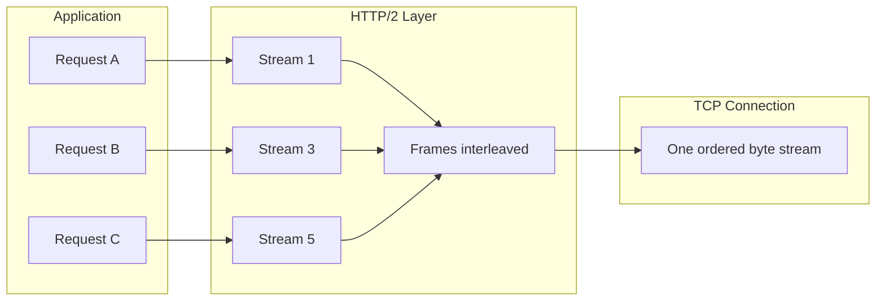
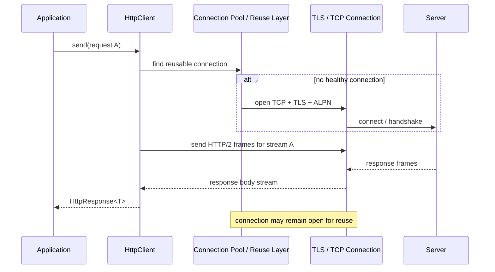
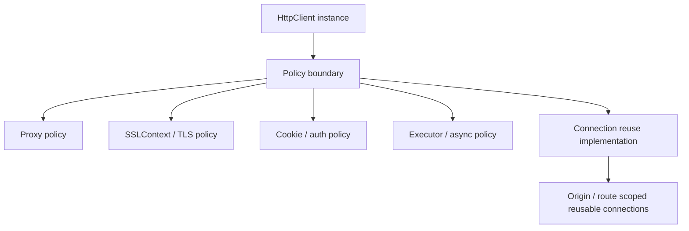
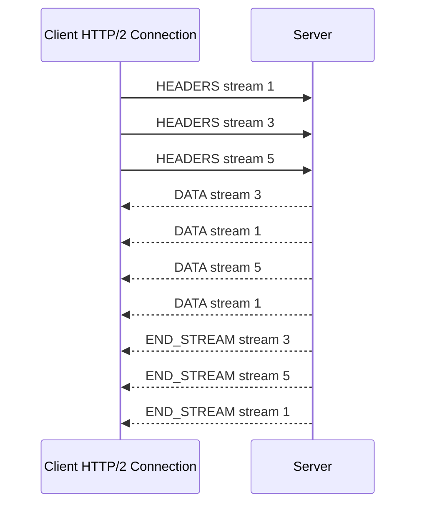
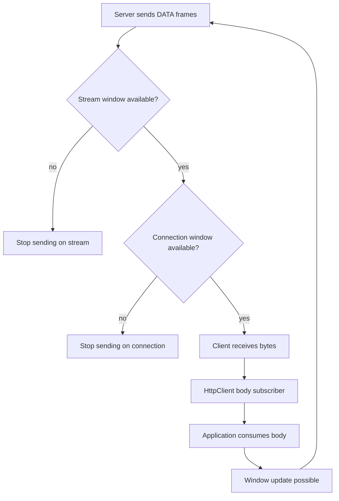
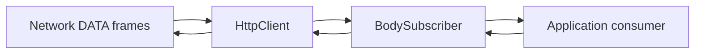
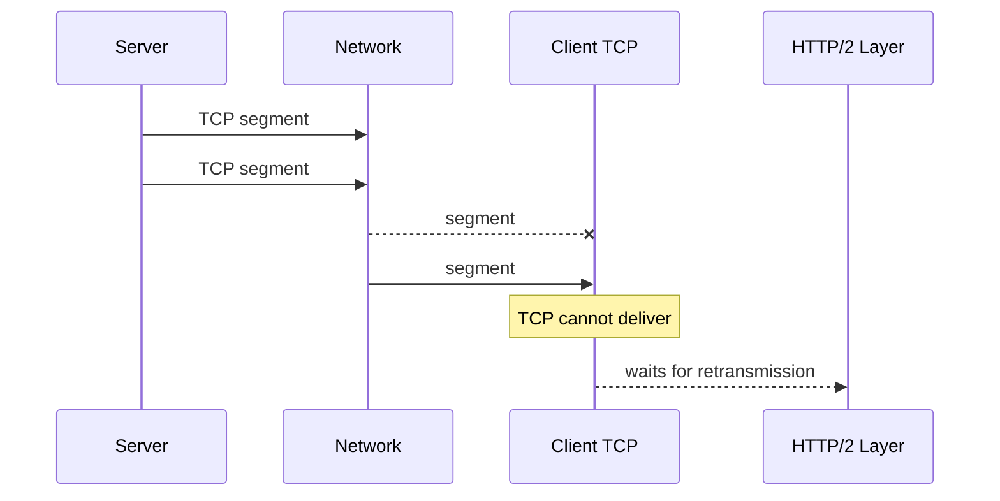
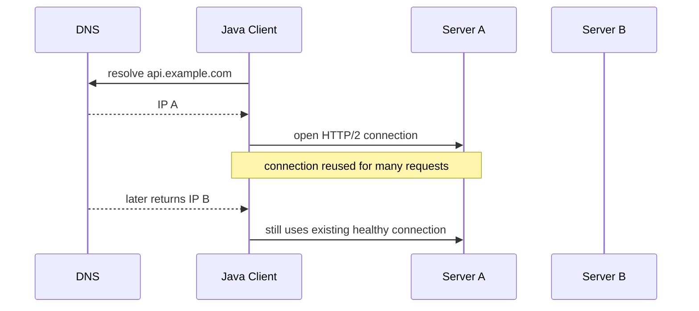
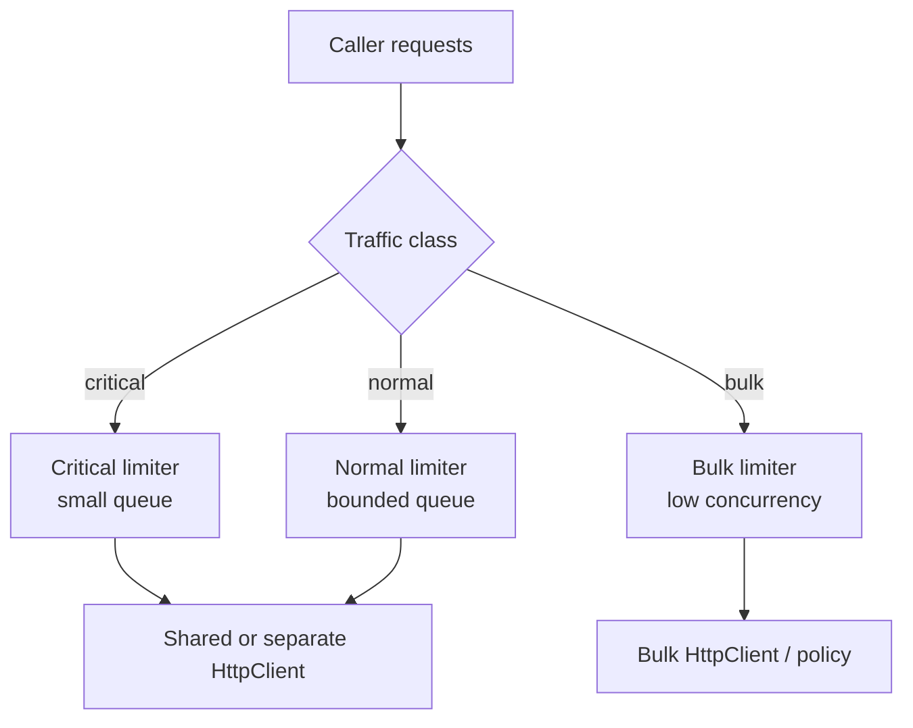

# Part 019 — HTTP/2, Connection Pooling, and Flow Control

> Goal utama part ini: mampu menjelaskan dan mendesain penggunaan `HttpClient` untuk HTTP/2 secara benar: kapan multiplexing membantu, kapan tidak, bagaimana connection reuse bekerja secara mental model, bagaimana flow control menahan producer, dan bagaimana failure satu koneksi bisa berdampak ke banyak request.

Pada Part 017 kita memosisikan `HttpClient` sebagai **policy boundary**. Pada Part 018 kita membedah body streaming. Sekarang kita masuk ke bagian yang sering disalahpahami:

- HTTP/2 bukan sekadar “HTTP yang lebih cepat”.
- HTTP/2 tidak menghapus bottleneck TCP.
- HTTP/2 connection reuse bisa memperbaiki latency, tetapi juga bisa memperbesar blast radius.
- Multiplexing tidak berarti unlimited concurrency.
- Flow control tidak sama dengan application backpressure, tetapi keduanya saling memengaruhi.
- Java `HttpClient` menyembunyikan banyak detail pool; justru karena itu desain client harus hati-hati.

Materi ini tidak mengulang desain API REST. Kita hanya melihat **network behavior** dari HTTP/2 dan konsekuensinya untuk Java client production.

---

## 1. Kaufman Skill Slice

Di fase Kaufman, ini bagian **deliberate practice**: kamu sudah tahu API dasar, sekarang kamu harus bisa mengoreksi asumsi yang salah saat sistem production melambat, timeout, atau overload.

### Sub-skill decomposition

| Sub-skill | Kompetensi yang harus dikuasai |
|---|---|
| HTTP/2 mental model | Memahami stream, frame, multiplexing, connection-level state, dan flow-control window. |
| Java `HttpClient` version policy | Mengerti `HTTP_1_1`, `HTTP_2`, dan negotiation. |
| Connection reuse | Membedakan client lifecycle, TCP connection lifecycle, TLS session, dan request lifecycle. |
| Pool boundary | Mengetahui bahwa pool adalah implementation detail; desain tidak boleh bergantung pada knob yang tidak publik. |
| Multiplexing trade-off | Mengerti kapan satu koneksi dipakai banyak request dan kapan itu berbahaya. |
| Flow control | Menjelaskan stream window, connection window, demand dari body subscriber, dan slow consumer. |
| Failure blast radius | Menilai dampak GOAWAY, reset, idle close, timeout, dan TCP failure pada request aktif. |
| Tuning | Menentukan strategi reuse, sharding client, timeout, concurrency limit, dan load-test scenario. |

### Output yang ditargetkan

Setelah part ini kamu harus bisa:

1. memilih HTTP/1.1 atau HTTP/2 berdasarkan behavior, bukan hype;
2. mendesain `HttpClient` singleton/per-route reuse dengan aman;
3. membuat concurrency limiter di luar `HttpClient`;
4. membaca gejala flow-control stall;
5. membedakan latency karena server lambat, body consumer lambat, pool exhaustion, TCP HOL, dan retry storm;
6. menulis checklist production untuk high-throughput Java HTTP client.

---

## 2. HTTP/2 in One Mental Model

HTTP/1.1 pada dasarnya mengirim request/response sebagai sequence di atas TCP connection. Tanpa pipelining yang realistis, satu connection biasanya efektif menangani satu active response pada satu waktu.

HTTP/2 mengubah payload HTTP menjadi **frames** dan mengizinkan banyak logical **streams** aktif dalam satu TCP connection.



Key idea:

> HTTP/2 multiplexes HTTP streams, but TCP still delivers one ordered byte stream.

Artinya:

- HTTP/2 bisa mengurangi kebutuhan banyak TCP connection.
- HTTP/2 bisa mengurangi handshake overhead.
- HTTP/2 bisa menghindari HTTP/1.1 application-level head-of-line blocking.
- Tetapi HTTP/2 masih bisa terkena TCP-level head-of-line blocking jika packet loss terjadi.
- Satu TCP failure dapat memengaruhi banyak logical request sekaligus.

---

## 3. HTTP/1.1 vs HTTP/2: Practical Comparison

| Area | HTTP/1.1 | HTTP/2 |
|---|---|---|
| Unit utama | Request/response text-like message | Binary frames di atas stream |
| Parallelism | Umumnya butuh banyak connection | Banyak stream dalam satu connection |
| Header overhead | Header dikirim berulang | Header compression |
| HOL blocking | Ada di request/response sequencing per connection | Hilang di HTTP layer, masih ada di TCP layer |
| Failure blast radius | Satu connection biasanya sedikit request aktif | Satu connection bisa banyak request aktif |
| Debuggability | Lebih mudah dibaca manual | Perlu tooling/protocol awareness |
| Flow control | Terutama TCP dan application behavior | TCP + HTTP/2 stream/connection flow control |
| Tuning model | Pool size banyak connection | Stream concurrency + connection health |

HTTP/2 lebih kuat ketika:

- banyak request kecil ke origin yang sama;
- latency handshake mahal;
- TLS connection reuse penting;
- header besar dan repetitif;
- client melakukan high fan-out ke service yang sama;
- server/proxy benar-benar mendukung HTTP/2 secara matang.

HTTP/1.1 masih masuk akal ketika:

- middlebox/proxy tidak stabil dengan HTTP/2;
- server HTTP/2 implementation bermasalah;
- request besar dan panjang mendominasi sehingga multiplexing tidak banyak membantu;
- kamu perlu isolasi failure yang lebih sederhana;
- observability/tooling internal lebih matang untuk HTTP/1.1.

---

## 4. Java `HttpClient` Version Policy

Contoh client yang **meminta** HTTP/2:

```java
HttpClient client = HttpClient.newBuilder()
        .version(HttpClient.Version.HTTP_2)
        .connectTimeout(Duration.ofSeconds(3))
        .build();

HttpRequest request = HttpRequest.newBuilder()
        .uri(URI.create("https://api.example.com/accounts/123"))
        .timeout(Duration.ofSeconds(5))
        .GET()
        .build();

HttpResponse<String> response = client.send(
        request,
        HttpResponse.BodyHandlers.ofString()
);

System.out.println(response.version());
```

Yang penting:

- `version(HTTP_2)` adalah preference/policy, bukan jaminan absolut bahwa setiap request pasti HTTP/2.
- Response punya `response.version()`; gunakan ini saat debugging.
- Untuk HTTPS, HTTP/2 biasanya dinegosiasikan lewat TLS ALPN.
- Untuk HTTP plain-text, behavior bergantung pada support client/server dan konfigurasi.
- Banyak enterprise proxy bisa memutus atau menurunkan versi protocol.

Decision rule:

> Jangan mengasumsikan HTTP/2 hanya karena client dibangun dengan `Version.HTTP_2`. Observasi versi response di telemetry.

Contoh logging aman:

```java
HttpResponse<byte[]> response = client.send(request, HttpResponse.BodyHandlers.ofByteArray());

log.info("http_outbound method={} uri_host={} status={} version={} body_bytes={}",
        request.method(),
        request.uri().getHost(),
        response.statusCode(),
        response.version(),
        response.body().length);
```

Hindari log raw URI penuh jika query string bisa mengandung token, PII, atau signature.

---

## 5. Connection Lifecycle vs Request Lifecycle

Banyak engineer menyamakan `send()` dengan “buka koneksi, kirim, tutup”. Itu model yang salah untuk modern HTTP client.

Mental model yang lebih benar:



Empat lifecycle berbeda:

| Lifecycle | Contoh | Siapa yang mengelola |
|---|---|---|
| Application client object | `HttpClient` instance | Aplikasi |
| Request | `HttpRequest` + `send/sendAsync` | Aplikasi + HttpClient |
| HTTP/2 stream | Logical request/response di connection | HttpClient + server |
| TCP/TLS connection | Socket fisik/logis ke origin | HttpClient implementation + OS + network |

Production invariant:

> Buat `HttpClient` sebagai long-lived object per policy boundary. Jangan membuat client baru untuk setiap request kecuali kamu sengaja ingin memutus reuse dan membayar ulang biaya pool/TLS/resource.

---

## 6. What Is the Pool Boundary?

Java `HttpClient` melakukan connection reuse, tetapi detail connection pool bukan public stable API yang harus kamu jadikan kontrak desain.

Artinya:

- jangan menulis logic yang mengandalkan jumlah connection internal tertentu;
- jangan menganggap satu `HttpClient` pasti satu TCP connection;
- jangan menganggap satu origin pasti satu connection;
- jangan menganggap semua idle connection akan bertahan selama durasi tertentu;
- jangan menganggap proxy/TLS/authenticator/cookie policy tidak memengaruhi reuse.

Lebih aman berpikir begini:



`HttpClient` instance adalah **policy container**. Pool adalah bagian dari policy container, tetapi bukan API yang kamu tune secara eksplisit seperti HikariCP.

### Practical design consequence

Jika kamu perlu isolasi, buat client terpisah berdasarkan policy yang memang berbeda:

| Boundary | Pisahkan client? | Alasan |
|---|---:|---|
| Public internet vs internal service | Ya | Timeout, proxy, TLS trust, retry, observability berbeda. |
| Different truststore/mTLS identity | Ya | TLS identity adalah policy boundary keras. |
| Same service, same policy, high reuse | Tidak | Reuse satu client lebih efisien. |
| Noisy low-priority traffic vs critical traffic | Biasanya ya | Untuk menghindari resource interference. |
| Per tenant | Hati-hati | Bisa meledakkan resource; lebih baik limiter per tenant di atas shared client. |

---

## 7. HTTP/2 Multiplexing: Benefit and Hidden Cost

HTTP/2 stream memungkinkan request aktif bersamaan dalam satu connection.



### Benefit

- Fewer TCP/TLS handshakes.
- Better utilization of existing connection.
- Less connection churn.
- Less need for large connection pools.
- Better performance for many small requests.

### Hidden cost

- One bad TCP connection can hurt many active requests.
- One slow body consumer can interact with flow control.
- Server stream concurrency limit can cap throughput.
- Packet loss causes TCP-level blocking for all streams on that connection.
- Debugging is harder: multiple logical requests share one transport.

### Top 1% mental model

HTTP/2 changes the concurrency unit from **connection count** to a combination of:

```text
usable throughput ≈ min(
    client concurrency budget,
    server max concurrent streams,
    connection flow-control capacity,
    stream flow-control capacity,
    TCP congestion window,
    server CPU / IO capacity,
    body producer/consumer speed,
    application deadline budget
)
```

Jika hanya menaikkan jumlah async request tanpa limiter, kamu bukan “memanfaatkan HTTP/2”; kamu sedang memindahkan antrian ke tempat yang lebih sulit diamati.

---

## 8. Stream Concurrency Is Not Infinite

HTTP/2 memiliki konsep concurrent streams. Server dapat membatasi jumlah stream aktif.

Aplikasi Java tidak boleh mengirim request tanpa batas hanya karena `sendAsync()` murah.

Contoh anti-pattern:

```java
List<CompletableFuture<HttpResponse<String>>> futures = ids.stream()
        .map(id -> client.sendAsync(requestFor(id), BodyHandlers.ofString()))
        .toList();

CompletableFuture.allOf(futures.toArray(CompletableFuture[]::new)).join();
```

Masalah:

- semua request dibuat sekaligus;
- memory untuk future/request/body bisa naik tajam;
- server/proxy bisa overload;
- deadline tiap request bisa habis sambil menunggu antrian internal;
- retry bisa menggandakan traffic;
- sulit melakukan fairness antar tenant.

Gunakan limiter eksplisit.

```java
public final class HttpConcurrencyLimiter {
    private final Semaphore permits;

    public HttpConcurrencyLimiter(int maxInFlight) {
        this.permits = new Semaphore(maxInFlight);
    }

    public <T> CompletableFuture<T> submit(Supplier<CompletableFuture<T>> action) {
        if (!permits.tryAcquire()) {
            return CompletableFuture.failedFuture(
                    new RejectedExecutionException("outbound concurrency limit reached"));
        }

        CompletableFuture<T> future;
        try {
            future = action.get();
        } catch (Throwable t) {
            permits.release();
            return CompletableFuture.failedFuture(t);
        }

        return future.whenComplete((value, error) -> permits.release());
    }
}
```

Pemakaian:

```java
HttpConcurrencyLimiter limiter = new HttpConcurrencyLimiter(64);

CompletableFuture<HttpResponse<String>> result = limiter.submit(() ->
        client.sendAsync(request, HttpResponse.BodyHandlers.ofString())
);
```

Invariant:

> Concurrency limit adalah application policy. Jangan berharap HTTP client internal menyelamatkan domain kamu dari overload.

---

## 9. Flow Control: The Missing Concept

HTTP/2 punya flow control di dua level:

1. **stream-level flow control** — membatasi data untuk satu stream;
2. **connection-level flow control** — membatasi total data semua stream pada connection.



Flow control mencegah receiver dibanjiri data yang tidak bisa diproses. Tetapi flow control juga bisa membuat throughput turun jika consumer lambat.

Contoh:

- Server mengirim response besar untuk stream A.
- Client application lambat menulis body ke disk.
- Body subscriber tidak cepat meminta/menyelesaikan konsumsi buffer.
- Window tidak terbuka cukup cepat.
- Server berhenti mengirim DATA pada stream itu.
- Jika connection-level window juga tertahan, stream lain bisa ikut terdampak.

---

## 10. Java Body Backpressure Meets HTTP/2 Flow Control

Pada Part 018 kita melihat bahwa response body memakai `BodySubscriber`. Di bawahnya ada `Flow`-style demand.

Mental model:



Jika aplikasi memilih handler yang materialize seluruh body:

```java
BodyHandlers.ofByteArray()
```

maka pressure berpindah ke heap. Ini bisa cepat untuk payload kecil, tetapi buruk untuk payload besar.

Jika aplikasi memilih streaming ke file:

```java
BodyHandlers.ofFile(Path.of("report.bin"))
```

maka pressure berpindah ke disk I/O. Kalau disk lambat, network stream juga bisa tertahan.

Jika aplikasi memilih `ofInputStream()`:

```java
HttpResponse<InputStream> response = client.send(request, BodyHandlers.ofInputStream());
try (InputStream in = response.body()) {
    in.transferTo(outputStream);
}
```

maka application thread menjadi bagian dari backpressure chain. Jika thread tidak membaca, connection dapat tertahan.

Invariant:

> Dalam HTTP/2, response body consumer bukan detail lokal. Consumer speed bisa memengaruhi flow-control behavior connection.

---

## 11. Head-of-Line Blocking: HTTP Layer vs TCP Layer

HTTP/2 menyelesaikan HTTP/1.1 request sequencing problem, tetapi tidak menyelesaikan TCP ordering problem.

Misal ada tiga stream dalam satu TCP connection:

```text
TCP byte stream:
[frame S1][frame S3][frame S5][frame S1][frame S3]...
```

Jika satu TCP segment hilang, TCP receiver tidak bisa menyerahkan byte setelah gap ke HTTP/2 layer sampai retransmission berhasil. Akibatnya, stream yang secara logical tidak bermasalah tetap bisa menunggu.



Production implication:

- HTTP/2 is often excellent in low-loss networks.
- In lossy networks, many streams sharing one TCP connection can suffer together.
- HTTP/3/QUIC addresses a different set of transport constraints, but that is outside this part.

---

## 12. Connection Pooling and Blast Radius

With HTTP/1.1:

```text
100 concurrent requests -> maybe many TCP connections
```

With HTTP/2:

```text
100 concurrent requests -> maybe fewer TCP connections, many streams
```

That can improve efficiency. It can also concentrate failure.

### Failure blast radius matrix

| Failure | HTTP/1.1 impact | HTTP/2 impact |
|---|---|---|
| One idle connection closed | Usually one future request retries/reconnects | Similar, if idle only |
| One active connection reset | Usually one/few requests fail | Many active streams may fail |
| Packet loss | Affects one connection | Affects all streams on that connection |
| Server sends GOAWAY | Connection stops accepting new streams | In-flight/new stream handling becomes important |
| Slow body consumer | One response usually affected | Can interact with connection flow control |
| TLS renegotiation/session issue | Per connection | Shared by streams on connection |

Decision rule:

> HTTP/2 reduces connection count, not failure thinking. You still need per-request deadline, retry eligibility, and idempotency classification.

---

## 13. GOAWAY, Reset, and Graceful Drain

HTTP/2 has connection-level and stream-level error concepts.

Simplified view:

| Signal | Meaning |
|---|---|
| Stream reset | One logical stream is terminated. |
| Connection error | Whole HTTP/2 connection is unusable. |
| GOAWAY | Endpoint asks peer to stop creating new streams on this connection. |

What should application code do?

Usually not parse HTTP/2 frames directly. Java `HttpClient` abstracts that. But application must classify resulting failure:

- was request sent?
- was response status received?
- was body partially received?
- is method idempotent?
- is body publisher repeatable?
- is deadline still available?
- is retry safe?

Example retry classification skeleton:

```java
public enum RetryDecision {
    RETRY,
    DO_NOT_RETRY,
    RETRY_ONLY_IF_IDEMPOTENT_AND_BODY_REPEATABLE
}

public RetryDecision classify(Throwable failure, HttpRequest request, boolean responseStarted) {
    if (responseStarted) {
        return RetryDecision.DO_NOT_RETRY;
    }

    String method = request.method();
    boolean idempotent = switch (method) {
        case "GET", "HEAD", "PUT", "DELETE", "OPTIONS", "TRACE" -> true;
        default -> false;
    };

    if (!idempotent) {
        return RetryDecision.DO_NOT_RETRY;
    }

    return RetryDecision.RETRY_ONLY_IF_IDEMPOTENT_AND_BODY_REPEATABLE;
}
```

This is deliberately conservative. A top-tier SDK may have richer classification, but the invariant remains:

> Retry is a semantic decision, not a transport reflex.

---

## 14. Timeout Semantics in HTTP/2

Timeouts yang relevan:

| Timeout | Meaning |
|---|---|
| Connect timeout | Waktu membuka TCP/TLS route awal. |
| Request timeout | Budget request dari perspektif API Java request. |
| Body consumption timeout | Batas waktu menyelesaikan body. Di JDK terbaru, request timeout semakin penting karena body consumption juga harus diperhitungkan. |
| Application deadline | Absolute end-to-end budget dari caller. |
| Idle timeout | Kebijakan client/server/proxy untuk idle connection. |

Contoh:

```java
HttpClient client = HttpClient.newBuilder()
        .connectTimeout(Duration.ofSeconds(2))
        .version(HttpClient.Version.HTTP_2)
        .build();

HttpRequest request = HttpRequest.newBuilder()
        .uri(URI.create("https://api.example.com/v1/profile"))
        .timeout(Duration.ofSeconds(4))
        .GET()
        .build();
```

Production rule:

> Request timeout bukan pengganti deadline propagation. Request timeout hanya satu layer dari budget.

Contoh deadline wrapper:

```java
public final class Deadline {
    private final Instant expiresAt;

    public Deadline(Instant expiresAt) {
        this.expiresAt = Objects.requireNonNull(expiresAt);
    }

    public Duration remainingOrThrow() {
        Duration remaining = Duration.between(Instant.now(), expiresAt);
        if (remaining.isNegative() || remaining.isZero()) {
            throw new TimeoutException("deadline already expired");
        }
        return remaining;
    }
}
```

Saat membuat request:

```java
Duration remaining = deadline.remainingOrThrow();
HttpRequest request = baseBuilder
        .timeout(remaining.compareTo(Duration.ofSeconds(3)) < 0
                ? remaining
                : Duration.ofSeconds(3))
        .build();
```

---

## 15. Pool Reuse and DNS Changes

Satu masalah production yang halus: DNS berubah, tetapi koneksi lama tetap hidup.

Scenario:



Ini tidak selalu bug. Reusing healthy connections is normal. Tetapi konsekuensinya:

- DNS-based failover tidak selalu langsung memindahkan traffic;
- long-lived HTTP/2 connection bisa melewati perubahan endpoint;
- load balancer drain policy harus mempertimbangkan connection lifetime;
- client harus punya timeout, retry, dan reconnect path.

Jika operational model mengandalkan DNS failover cepat, jangan hanya mengatur TTL. Uji juga:

- idle connection close behavior;
- server drain/GOAWAY behavior;
- failure after IP removal;
- client reconnect latency;
- retry safety;
- cache behavior di JVM dan OS.

---

## 16. HTTP/2 and Large Uploads

Large upload dengan HTTP/2 perlu desain khusus.

Masalah yang muncul:

- request body publisher lambat;
- server flow-control window kecil;
- client connection digunakan banyak stream;
- satu upload besar bisa mengonsumsi connection-level window;
- retry upload mungkin tidak repeatable;
- cancellation harus menutup source resource.

Contoh upload file:

```java
HttpRequest request = HttpRequest.newBuilder()
        .uri(URI.create("https://files.example.com/upload"))
        .timeout(Duration.ofMinutes(2))
        .header("Content-Type", "application/octet-stream")
        .POST(HttpRequest.BodyPublishers.ofFile(Path.of("payload.bin")))
        .build();
```

Checklist upload besar:

| Check | Why it matters |
|---|---|
| Body repeatable? | Diperlukan untuk retry aman. |
| Deadline cukup? | Upload duration tergantung bandwidth. |
| Concurrency limit berbeda? | Upload besar tidak boleh mengalahkan request kecil. |
| Separate client/policy? | Kadang perlu isolasi dari traffic latency-sensitive. |
| Progress/observability? | Upload stuck harus terlihat. |
| Cancellation closes file? | Menghindari resource leak. |

Design pattern:

- Pisahkan limiter untuk upload besar dan request kecil.
- Jangan campurkan traffic bulk dan latency-sensitive tanpa fairness.
- Gunakan idempotency key untuk upload yang bisa diulang secara domain.
- Pastikan server mendukung resume jika ukuran sangat besar.

---

## 17. HTTP/2 and Large Downloads

Large download dengan HTTP/2 juga punya blast radius.

Gunakan streaming target:

```java
HttpResponse<Path> response = client.send(
        request,
        HttpResponse.BodyHandlers.ofFile(Path.of("download.bin"))
);
```

Atau jika butuh validasi header lebih dahulu:

```java
HttpResponse.BodyHandler<Path> boundedFileHandler = responseInfo -> {
    OptionalLong length = responseInfo.headers()
            .firstValueAsLong("Content-Length");

    if (length.isPresent() && length.getAsLong() > 500_000_000L) {
        return HttpResponse.BodySubscribers.replacing(Path.of(""));
    }

    return HttpResponse.BodySubscribers.ofFile(Path.of("download.bin"));
};
```

Versi di atas hanya contoh konseptual. Untuk production, jangan `replacing` path kosong; lebih baik buat subscriber yang membatalkan body dengan error domain yang jelas.

Risk matrix:

| Risk | Mitigation |
|---|---|
| Heap blowup | Hindari `ofByteArray`/`ofString` untuk payload besar. |
| Disk full | Validasi size, lokasi, quota, dan error handling. |
| Slow disk | Concurrency limit dan metric write latency. |
| Partial file | Tulis ke temp file lalu atomic move. |
| Corrupt body | Checksum atau content digest. |
| Stuck body | Deadline dan cancellation. |

---

## 18. Sharding Clients: When and Why

Default yang sehat:

```text
one long-lived HttpClient per policy boundary
```

Tetapi kadang kamu perlu beberapa client.

### Valid reasons to split clients

| Reason | Example |
|---|---|
| Different TLS identity | mTLS cert berbeda untuk partner berbeda. |
| Different proxy | Internal service vs internet egress. |
| Different timeout class | Payment auth 2s vs report export 2min. |
| Different priority | Critical request vs batch sync. |
| Different executor policy | Async callback isolation. |
| Different cookie/auth policy | Browser-like flow vs service-to-service. |

### Bad reasons to split clients

| Reason | Why bad |
|---|---|
| One client per request | Membunuh reuse dan menaikkan resource cost. |
| One client per user tanpa alasan | Bisa meledakkan connection/resource cardinality. |
| Mencari “pool size” dengan membuat banyak client | Tidak stabil dan sulit diuji. |
| Menutupi timeout bug | Menambah client bukan solusi deadline. |

---

## 19. External Concurrency Control Pattern

`HttpClient` tidak boleh menjadi satu-satunya defense terhadap overload. Buat outbound gateway dengan limiter.

```java
public final class OutboundHttpGateway {
    private final HttpClient client;
    private final Semaphore inFlight;

    public OutboundHttpGateway(HttpClient client, int maxInFlight) {
        this.client = Objects.requireNonNull(client);
        this.inFlight = new Semaphore(maxInFlight);
    }

    public <T> CompletableFuture<HttpResponse<T>> sendAsync(
            HttpRequest request,
            HttpResponse.BodyHandler<T> handler
    ) {
        if (!inFlight.tryAcquire()) {
            return CompletableFuture.failedFuture(
                    new RejectedExecutionException("outbound_http_inflight_limit"));
        }

        return client.sendAsync(request, handler)
                .whenComplete((response, error) -> inFlight.release());
    }
}
```

Enhancement production:

- limit per route;
- limit per tenant;
- separate bulk vs interactive traffic;
- queue with bounded size;
- fast rejection with explicit error;
- metric: `outbound.inflight`, `outbound.rejected`, `outbound.duration`, `outbound.protocol.version`.

---

## 20. Priority and Fairness

HTTP/2 priority exists at protocol level, but aplikasi Java production sebaiknya tidak bergantung pada priority frame sebagai mekanisme fairness utama. Banyak stack/proxy/server tidak memberi behavior yang kamu harapkan.

Application-level fairness lebih dapat dikendalikan.



Rule of thumb:

| Traffic | Concurrency | Timeout | Retry | Notes |
|---|---:|---:|---|---|
| Critical read | Low/medium | Short | Conservative | Protect latency. |
| Normal API | Medium | Medium | Idempotent only | General workload. |
| Bulk download | Low | Long | Resume/checkpoint | Protect memory/disk. |
| Bulk upload | Low | Long | Idempotency key | Protect bandwidth. |
| Webhook delivery | Bounded | Medium | Retry with backoff | Avoid retry storm. |

---

## 21. Observability: What to Measure

Minimum telemetry untuk Java HTTP/2 client:

| Metric/log field | Why |
|---|---|
| `http.version` | Membuktikan HTTP/2 benar-benar dipakai. |
| `target.host` | Route-level diagnosis. |
| `method` | Retry/idempotency analysis. |
| `status.code` | Server behavior. |
| `duration.total` | End-to-end request time. |
| `duration.connect` jika tersedia | Connect bottleneck. |
| `body.bytes.in/out` | Payload pressure. |
| `inflight` | Client-side load. |
| `rejected_by_limiter` | Admission control. |
| `timeout.type` | Connect vs request vs deadline. |
| `exception.class` | Failure taxonomy. |
| `retry.count` | Retry amplification. |

Java standard `HttpClient` tidak memberi semua detail internal pool sebagai API publik. Itu berarti kamu harus mengukur di boundary yang kamu kontrol:

- sebelum submit request;
- setelah headers diterima;
- setelah body selesai;
- saat exception;
- saat retry;
- saat limiter reject.

---

## 22. Debugging Checklist

### Symptom: p95 latency naik, CPU normal

Possible causes:

- server slow;
- flow-control stall karena body consumer lambat;
- connection-level HOL karena packet loss;
- server max concurrent streams tercapai;
- proxy buffering;
- DNS/connect churn;
- limiter queue menunggu.

Data yang perlu:

- HTTP version distribution;
- response body size distribution;
- in-flight count;
- queue wait time;
- timeout classification;
- packet loss / retransmission dari host metric;
- proxy logs;
- server stream/concurrency logs jika ada.

### Symptom: banyak timeout saat deploy server

Possible causes:

- server close connection tanpa graceful drain;
- load balancer idle timeout lebih pendek;
- DNS shift tidak diikuti connection drain;
- GOAWAY/reset handling muncul sebagai failed request;
- client retry terlalu agresif.

Mitigation:

- server sends graceful drain/GOAWAY where supported;
- client has safe retry for idempotent requests;
- reduce idle timeout mismatch;
- stagger deploy;
- monitor failed request by exception class and protocol version.

### Symptom: memory naik saat HTTP/2 traffic tinggi

Possible causes:

- unbounded `sendAsync` futures;
- `ofString`/`ofByteArray` untuk large body;
- retry duplicates bodies;
- queues tidak bounded;
- body subscriber lambat;
- application accumulates partial responses.

Mitigation:

- external concurrency limiter;
- stream large bodies;
- cap response size;
- separate bulk traffic;
- add cancellation and timeout;
- load test with realistic payload size.

---

## 23. Production Pattern: Route-Aware Gateway

```java
public final class RouteKey {
    private final String scheme;
    private final String host;
    private final int port;

    public RouteKey(URI uri) {
        this.scheme = uri.getScheme();
        this.host = uri.getHost();
        this.port = uri.getPort() == -1
                ? defaultPort(uri.getScheme())
                : uri.getPort();
    }

    private static int defaultPort(String scheme) {
        return switch (scheme) {
            case "http" -> 80;
            case "https" -> 443;
            default -> throw new IllegalArgumentException("unsupported scheme: " + scheme);
        };
    }

    // equals/hashCode omitted for brevity
}
```

Route-aware limiter:

```java
public final class RouteLimiters {
    private final ConcurrentHashMap<RouteKey, Semaphore> byRoute = new ConcurrentHashMap<>();
    private final int perRouteLimit;

    public RouteLimiters(int perRouteLimit) {
        this.perRouteLimit = perRouteLimit;
    }

    public Permit tryAcquire(RouteKey key) {
        Semaphore semaphore = byRoute.computeIfAbsent(key, k -> new Semaphore(perRouteLimit));
        if (!semaphore.tryAcquire()) {
            throw new RejectedExecutionException("route limit reached: " + key);
        }
        return new Permit(semaphore);
    }

    public static final class Permit implements AutoCloseable {
        private final Semaphore semaphore;
        private boolean closed;

        private Permit(Semaphore semaphore) {
            this.semaphore = semaphore;
        }

        @Override
        public void close() {
            if (!closed) {
                closed = true;
                semaphore.release();
            }
        }
    }
}
```

Usage with async:

```java
public <T> CompletableFuture<HttpResponse<T>> send(
        HttpRequest request,
        HttpResponse.BodyHandler<T> handler
) {
    RouteLimiters.Permit permit;
    try {
        permit = routeLimiters.tryAcquire(new RouteKey(request.uri()));
    } catch (RejectedExecutionException e) {
        return CompletableFuture.failedFuture(e);
    }

    return client.sendAsync(request, handler)
            .whenComplete((r, e) -> permit.close());
}
```

This pattern makes hidden pool behavior less dangerous because admission is explicit.

---

## 24. HTTP/2 Performance Load Test Design

Untuk membuktikan HTTP/2 behavior, jangan hanya benchmark happy path.

### Test matrix

| Scenario | What it reveals |
|---|---|
| Many small GETs | Multiplexing benefit. |
| Few huge downloads | Flow control and disk pressure. |
| Mixed small + huge | Fairness and starvation. |
| Server slow response headers | Request queue and timeout. |
| Server slow body | Body timeout/deadline. |
| Client slow body consumer | Flow-control pressure. |
| Packet loss | TCP HOL impact. |
| Connection reset mid-body | Retry/cancellation correctness. |
| Server deploy/drain | GOAWAY/reset behavior. |
| Proxy downgrade to HTTP/1.1 | Version observability. |

### Metrics to capture

- response version;
- status distribution;
- latency p50/p95/p99;
- in-flight request count;
- queue wait;
- bytes/sec in/out;
- error class distribution;
- retry count;
- CPU;
- heap/direct memory;
- socket states;
- retransmission/packet loss where available.

---

## 25. Anti-Patterns

### Anti-pattern 1: Create `HttpClient` per request

```java
HttpClient.newHttpClient().send(request, BodyHandlers.ofString());
```

Why bad:

- loses reuse;
- increases allocation;
- defeats pooling;
- hides lifecycle;
- can amplify connection churn.

### Anti-pattern 2: Unlimited `sendAsync`

```java
ids.forEach(id -> client.sendAsync(requestFor(id), BodyHandlers.ofString()));
```

Why bad:

- moves queue into hidden layers;
- can overload server;
- can blow memory;
- makes deadline meaningless.

### Anti-pattern 3: Assume HTTP/2 means no connection bottleneck

Wrong. One TCP connection still has:

- congestion window;
- packet loss behavior;
- kernel buffers;
- TLS record behavior;
- connection-level flow control;
- server-side limits.

### Anti-pattern 4: Ignore response version

If proxy downgrades or server does not support HTTP/2, your mental model is wrong unless telemetry shows actual version.

### Anti-pattern 5: Treat all retryable network failures equally

A reset before request body is sent is not the same as a reset after partial response body. Your retry model must know what phase failed.

---

## 26. Decision Matrix: HTTP/2 or HTTP/1.1?

| Question | Prefer HTTP/2 when... | Prefer/allow HTTP/1.1 when... |
|---|---|---|
| Many small calls to same host? | Yes | Less important |
| Middlebox path known? | HTTP/2 stable | Proxy breaks/downgrades HTTP/2 |
| Need easy manual debug? | Tooling available | Human-readable simplicity matters |
| Large streaming transfer? | Works, but isolate | Simpler isolation may be preferred |
| Lossy network? | Test carefully | Multiple connections may isolate better |
| Server stream limit known? | Can tune concurrency | Unknown and problematic |
| Operational maturity? | Metrics/version visible | HTTP/1.1 only monitored |

Default modern stance:

> Prefer HTTP/2 for service-to-service HTTPS when both ends and middleboxes support it well, but keep version observability and do not remove admission control.

---

## 27. Practice Drills

### Drill 1 — Observe negotiated version

Build a small client that calls three endpoints and logs `response.version()`, status, duration, and body bytes. Run through:

- direct internet;
- corporate proxy if available;
- internal service;
- local mock server.

Goal: prove that configured version and negotiated version are not always the same.

### Drill 2 — Unlimited async vs limiter

Create 10,000 `sendAsync` calls to a local endpoint that sleeps 100ms. Compare:

- unlimited async;
- global limiter 100;
- route limiter 50.

Measure heap, p99 latency, and rejected count.

### Drill 3 — Large body consumer

Serve 1GB file from local server. Download using:

- `ofByteArray()`;
- `ofFile()`;
- `ofInputStream()` with slow consumer.

Observe memory and duration.

### Drill 4 — Mixed workload fairness

Run:

- 1000 small JSON requests;
- 10 large downloads;
- same `HttpClient` and same limiter;
- then separate limiter for bulk.

Goal: show how bulk traffic can starve small traffic if policy is not explicit.

### Drill 5 — Failure injection

Inject:

- connection reset mid-response;
- server delay before headers;
- server delay during body;
- DNS switch;
- proxy close.

Classify each error by phase.

---

## 28. Engineering Checklist

Before using Java `HttpClient` for high-throughput HTTP/2 traffic, answer:

- [ ] Is `HttpClient` long-lived and reused?
- [ ] Is HTTP version logged from actual response?
- [ ] Is there explicit concurrency limiting?
- [ ] Are bulk and latency-sensitive traffic separated?
- [ ] Are request deadlines propagated?
- [ ] Are retries restricted by idempotency and body repeatability?
- [ ] Are response bodies bounded or streamed?
- [ ] Are large upload/download paths tested?
- [ ] Is proxy behavior known?
- [ ] Is DNS failover behavior tested with persistent connections?
- [ ] Are timeout types distinguishable?
- [ ] Are cancellation paths tested?
- [ ] Are server deploy/drain scenarios tested?
- [ ] Are HTTP/2 failure modes represented in load tests?

---

## 29. Key Takeaways

- HTTP/2 multiplexes logical streams over a connection; TCP remains an ordered byte stream.
- Java `HttpClient` can prefer HTTP/2, but actual response version must be observed.
- Connection pooling is useful but mostly implementation detail; design explicit policy above it.
- Multiplexing reduces connection count but can increase failure blast radius.
- Flow control connects protocol-level windows with application body consumption.
- Unlimited `sendAsync()` is not a scalability strategy.
- Large upload/download traffic needs separate concurrency and memory policy.
- Production-grade clients require deadline, limiter, retry classification, and protocol-version telemetry.

Part berikutnya membahas WebSocket dengan `java.net.http`: handshake, listener lifecycle, frames, `request(n)` backpressure, close semantics, reconnect, heartbeat, dan state-machine design.
