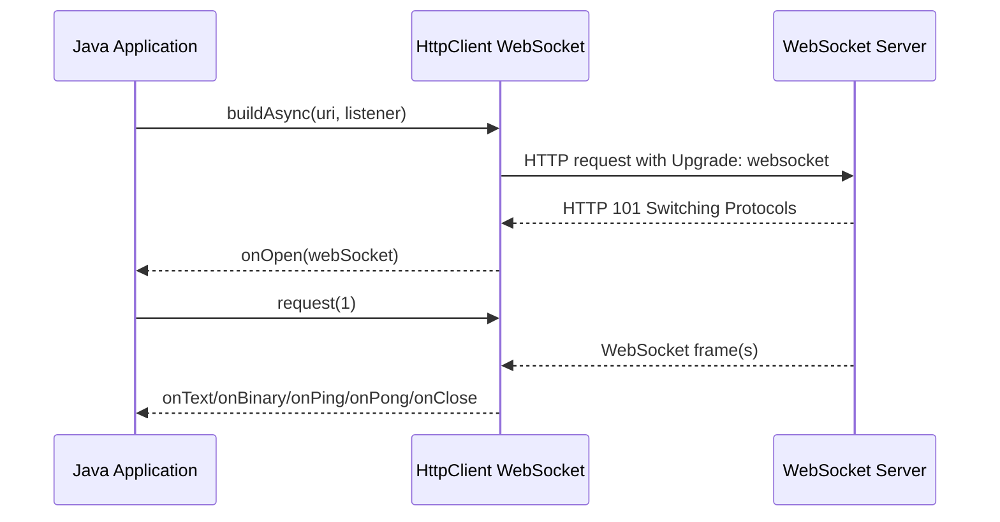
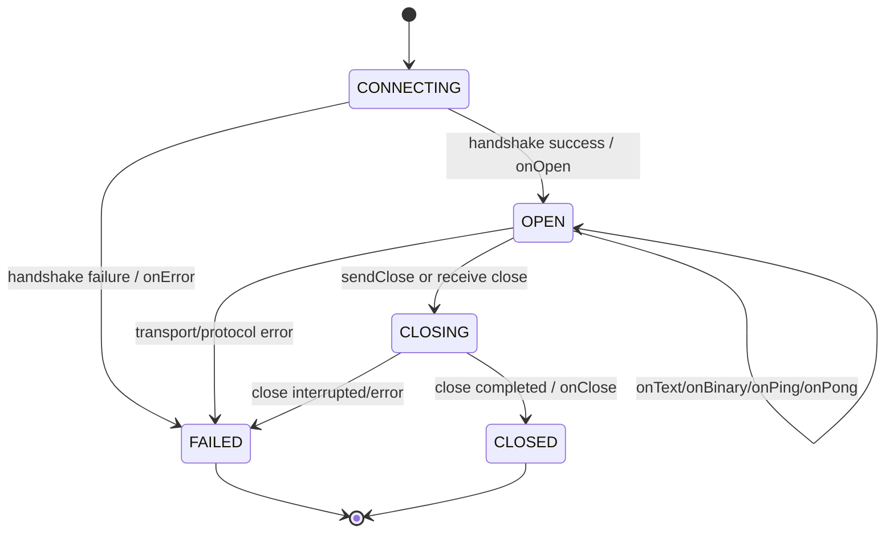
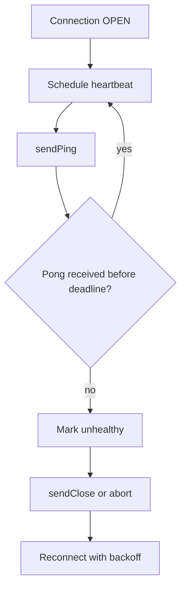
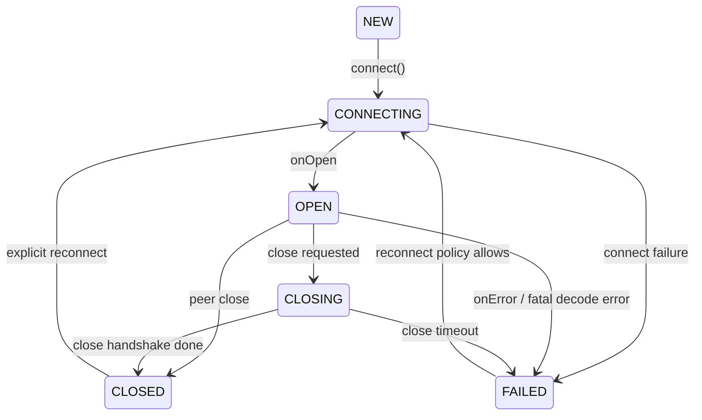
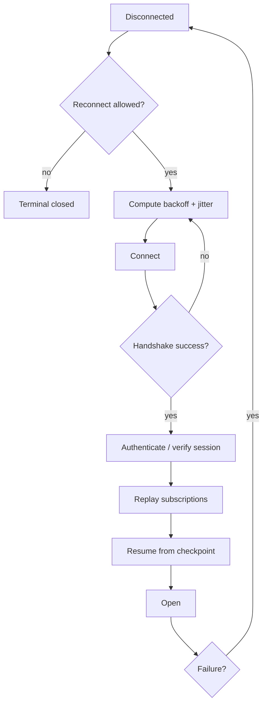
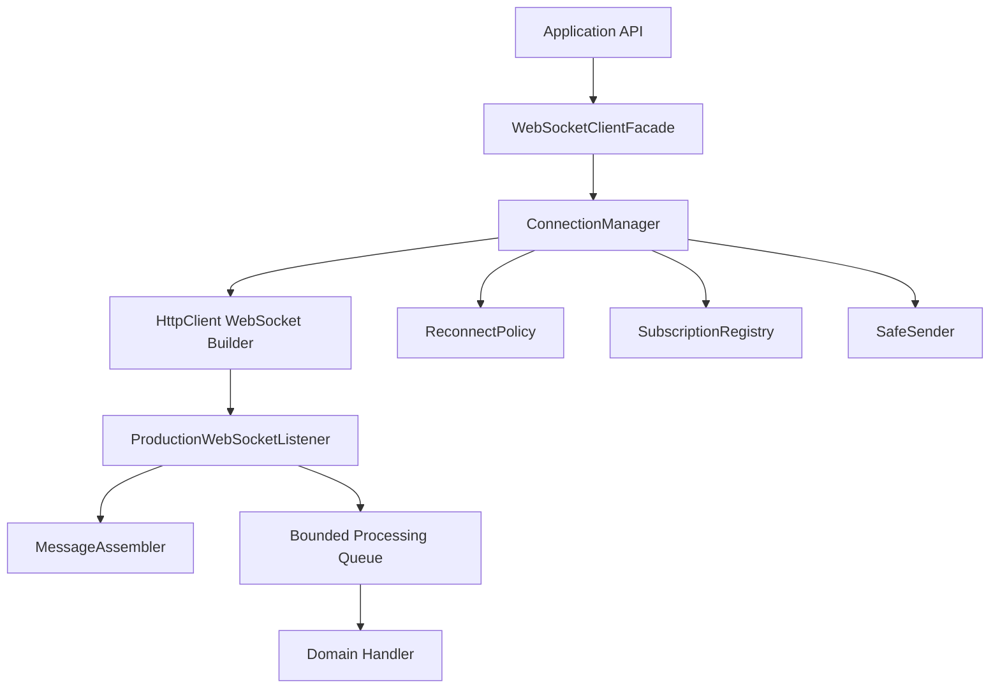

# Part 020 — WebSocket with `java.net.http`

> Goal utama part ini: mampu membangun WebSocket client Java yang benar secara lifecycle, backpressure-aware, reconnect-aware, dan aman untuk production; bukan hanya “connect lalu kirim string”.

WebSocket sering terlihat sederhana:

```java
client.newWebSocketBuilder()
        .buildAsync(uri, listener);
```

Tetapi production WebSocket adalah sistem stateful:

- connection long-lived;
- message bisa fragmented;
- callback asynchronous;
- receive harus diminta dengan `request(n)`;
- send operation menghasilkan `CompletableFuture`;
- close handshake berbeda dari TCP close;
- ping/pong adalah control frame, bukan sekadar text message;
- reconnect harus menjaga ordering, authentication, subscription, dan deduplication;
- slow consumer bisa membunuh stability.

Part ini fokus pada Java built-in WebSocket API di package `java.net.http`.

---

## 1. Kaufman Skill Slice

Ini bagian **applied skill**. Tujuannya bukan hafal method, tetapi membangun mental model event-driven connection.

### Sub-skill decomposition

| Sub-skill | Kompetensi yang harus dikuasai |
|---|---|
| Protocol mechanics | Memahami HTTP upgrade, frame, fragmentation, ping/pong, close. |
| Java builder API | Membangun WebSocket dengan header, subprotocol, timeout, dan listener. |
| Listener lifecycle | Mengerti urutan callback, `CompletionStage`, dan error path. |
| Receive backpressure | Menggunakan `webSocket.request(n)` secara sengaja. |
| Send ordering | Mengelola future dari `sendText`, `sendBinary`, `sendPing`, `sendClose`. |
| State machine | Memodelkan `CONNECTING`, `OPEN`, `CLOSING`, `CLOSED`, `FAILED`. |
| Reconnect | Mendesain reconnect dengan backoff, resubscribe, dedupe, dan deadline. |
| Production safety | Heartbeat, max message size, slow consumer protection, observability. |

### Output yang ditargetkan

Setelah part ini kamu harus bisa:

1. menulis WebSocket listener yang tidak kehilangan message;
2. menjelaskan kapan memanggil `request(1)` dan kenapa;
3. menggabungkan fragmented text/binary message;
4. membedakan protocol ping/pong dan application heartbeat;
5. menutup connection secara graceful;
6. mendesain reconnect loop yang tidak menciptakan reconnect storm;
7. membuat client wrapper dengan state machine eksplisit.

---

## 2. WebSocket Mental Model

WebSocket dimulai sebagai HTTP request lalu beralih menjadi full-duplex frame-based protocol.



Setelah upgrade berhasil, koneksi menjadi:

- full-duplex: client dan server bisa mengirim secara independen;
- frame-based: data dikirim sebagai frame, bukan stream text biasa;
- long-lived: connection dapat bertahan lama;
- stateful: server sering menyimpan subscription/session state;
- sensitive to slow consumer: receiver harus mampu memproses message.

---

## 3. WebSocket Is Not “TCP Socket with JSON”

WebSocket berjalan di atas TCP, tetapi punya protocol layer sendiri.

| Concept | TCP Socket | WebSocket |
|---|---|---|
| Unit data | Byte stream | Message/frame |
| Message boundary | Tidak ada | Ada text/binary message, bisa fragmented |
| Handshake | TCP handshake | HTTP upgrade + WebSocket handshake |
| Close | FIN/RST | WebSocket close frame + TCP close |
| Keepalive | TCP keepalive optional | Ping/pong control frames |
| Metadata | Tidak ada | Opcode, close code, subprotocol, extensions |
| Browser compatibility | Tidak langsung | Native browser API |

Konsekuensi:

- Jangan parsing raw TCP semantics untuk WebSocket.
- Jangan menganggap satu callback selalu satu complete logical message kecuali `last == true`.
- Jangan membuat “ping” sebagai text message lalu mengira itu protocol ping.
- Jangan menutup underlying TCP socket secara kasar jika bisa melakukan close handshake.

---

## 4. Minimal Java WebSocket Client

```java
HttpClient client = HttpClient.newHttpClient();
URI uri = URI.create("wss://stream.example.com/events");

CompletableFuture<WebSocket> connected = client.newWebSocketBuilder()
        .header("Authorization", "Bearer " + token)
        .connectTimeout(Duration.ofSeconds(5))
        .buildAsync(uri, new WebSocket.Listener() {
            @Override
            public void onOpen(WebSocket webSocket) {
                System.out.println("opened");
                webSocket.request(1);
            }

            @Override
            public CompletionStage<?> onText(WebSocket webSocket, CharSequence data, boolean last) {
                System.out.println("text: " + data + ", last=" + last);
                webSocket.request(1);
                return CompletableFuture.completedFuture(null);
            }

            @Override
            public CompletionStage<?> onClose(WebSocket webSocket, int statusCode, String reason) {
                System.out.println("closed: " + statusCode + " " + reason);
                return CompletableFuture.completedFuture(null);
            }

            @Override
            public void onError(WebSocket webSocket, Throwable error) {
                error.printStackTrace();
            }
        });

WebSocket webSocket = connected.join();
webSocket.sendText("hello", true).join();
```

This works as a starting point. It is not yet production-grade.

Masalah yang belum ditangani:

- message fragmentation;
- max message size;
- send ordering;
- reconnect;
- close semantics;
- ping/pong;
- authentication refresh;
- subscription recovery;
- bounded processing queue;
- observability.

---

## 5. Listener Lifecycle

Java WebSocket listener adalah callback contract.

Core callbacks:

| Callback | Meaning |
|---|---|
| `onOpen(WebSocket)` | Connection berhasil dibuka. |
| `onText(WebSocket, CharSequence, boolean)` | Text data diterima. `last` menandakan akhir message. |
| `onBinary(WebSocket, ByteBuffer, boolean)` | Binary data diterima. `last` menandakan akhir message. |
| `onPing(WebSocket, ByteBuffer)` | Ping control frame diterima. |
| `onPong(WebSocket, ByteBuffer)` | Pong control frame diterima. |
| `onClose(WebSocket, int, String)` | Close frame/lifecycle close diterima. |
| `onError(WebSocket, Throwable)` | Error terjadi. |

Important mental model:



A production client should represent these states explicitly. Jangan menyebar boolean seperti `isConnected`, `isClosed`, `shouldReconnect` tanpa state invariant.

---

## 6. Receive Backpressure with `request(n)`

Ini bagian paling sering terlewat.

`WebSocket` punya method:

```java
webSocket.request(1);
```

Itu bukan HTTP request. Itu artinya:

> “Saya siap menerima sejumlah invocation listener berikutnya.”

Jika kamu tidak memanggil `request`, callback berikutnya tidak akan terus mengalir sesuai demand.

### Simple one-at-a-time pattern

```java
@Override
public CompletionStage<?> onText(WebSocket webSocket, CharSequence data, boolean last) {
    try {
        handleText(data, last);
        return CompletableFuture.completedFuture(null);
    } finally {
        webSocket.request(1);
    }
}
```

Masalah: jika `handleText` blocking lama, listener tertahan.

### Async processing pattern

```java
@Override
public CompletionStage<?> onText(WebSocket webSocket, CharSequence data, boolean last) {
    CompletableFuture<Void> processed = CompletableFuture.runAsync(() -> {
        handleText(data, last);
    }, messageExecutor);

    return processed.whenComplete((ignored, error) -> {
        if (error == null) {
            webSocket.request(1);
        } else {
            webSocket.abort();
        }
    });
}
```

Caution:

- Jangan langsung `request(Long.MAX_VALUE)` kecuali kamu benar-benar punya downstream backpressure.
- Jangan `request(1)` sebelum message diproses jika queue kamu tidak bounded.
- Jangan menjalankan kerja berat pada callback thread tanpa memahami executor behavior.

Invariant:

> `request(n)` adalah receive admission control. Treat it like a permit system.

---

## 7. Fragmented Messages and `last`

WebSocket message bisa datang dalam beberapa fragment.

Java callback memberi parameter `last`:

```java
onText(WebSocket webSocket, CharSequence data, boolean last)
```

Jika `last == false`, data tersebut belum tentu complete logical message.

Bad parser:

```java
@Override
public CompletionStage<?> onText(WebSocket webSocket, CharSequence data, boolean last) {
    Event event = objectMapper.readValue(data.toString(), Event.class); // risky
    handle(event);
    webSocket.request(1);
    return CompletableFuture.completedFuture(null);
}
```

Jika JSON terfragmentasi, parser gagal.

Better:

```java
public final class TextMessageAssembler {
    private final StringBuilder current = new StringBuilder();
    private final int maxChars;

    public TextMessageAssembler(int maxChars) {
        this.maxChars = maxChars;
    }

    public Optional<String> append(CharSequence chunk, boolean last) {
        if (current.length() + chunk.length() > maxChars) {
            throw new IllegalStateException("websocket message too large");
        }

        current.append(chunk);

        if (!last) {
            return Optional.empty();
        }

        String complete = current.toString();
        current.setLength(0);
        return Optional.of(complete);
    }
}
```

Listener usage:

```java
private final TextMessageAssembler assembler = new TextMessageAssembler(1_000_000);

@Override
public CompletionStage<?> onText(WebSocket webSocket, CharSequence data, boolean last) {
    try {
        assembler.append(data, last).ifPresent(this::handleCompleteMessage);
        webSocket.request(1);
        return CompletableFuture.completedFuture(null);
    } catch (RuntimeException e) {
        return webSocket.sendClose(WebSocket.NORMAL_CLOSURE, "invalid message")
                .thenRun(webSocket::abort);
    }
}
```

Production notes:

- enforce max message size;
- reset assembler after close/error;
- validate UTF-8/text semantics if relevant;
- separate transport message from domain event decoding;
- handle `last` consistently for binary too.

---

## 8. Binary Messages

Binary callback:

```java
@Override
public CompletionStage<?> onBinary(WebSocket webSocket, ByteBuffer data, boolean last) {
    ByteBuffer copy = ByteBuffer.allocate(data.remaining());
    copy.put(data);
    copy.flip();

    binaryAssembler.append(copy, last).ifPresent(this::handleBinaryMessage);
    webSocket.request(1);
    return CompletableFuture.completedFuture(null);
}
```

Why copy?

Because you should not assume the callback buffer remains valid forever if you process asynchronously. If processing is synchronous and immediate, copy might not be needed. For production clarity, copy before handing to another thread.

Binary assembler pattern:

```java
public final class BinaryMessageAssembler {
    private final ByteArrayOutputStream out = new ByteArrayOutputStream();
    private final int maxBytes;

    public BinaryMessageAssembler(int maxBytes) {
        this.maxBytes = maxBytes;
    }

    public Optional<byte[]> append(ByteBuffer chunk, boolean last) {
        int n = chunk.remaining();
        if (out.size() + n > maxBytes) {
            throw new IllegalStateException("binary websocket message too large");
        }

        byte[] bytes = new byte[n];
        chunk.get(bytes);
        out.writeBytes(bytes);

        if (!last) {
            return Optional.empty();
        }

        byte[] complete = out.toByteArray();
        out.reset();
        return Optional.of(complete);
    }
}
```

For very large binary streams, do not assemble into heap. Use protocol-level chunking with application sequence IDs and write to bounded storage.

---

## 9. Send Operations and Ordering

Java WebSocket send methods are asynchronous and return `CompletableFuture<WebSocket>`.

Examples:

```java
CompletableFuture<WebSocket> sent = webSocket.sendText("message", true);
```

```java
webSocket.sendBinary(ByteBuffer.wrap(bytes), true);
```

```java
webSocket.sendPing(ByteBuffer.wrap(new byte[] {1, 2, 3}));
```

```java
webSocket.sendClose(WebSocket.NORMAL_CLOSURE, "bye");
```

Do not ignore send futures in production. They are your signal for failure/backpressure/order.

### Bad send pattern

```java
for (String message : messages) {
    webSocket.sendText(message, true);
}
```

This launches sends without explicit failure handling.

### Ordered send chain

```java
public final class OrderedWebSocketSender {
    private final WebSocket webSocket;
    private CompletableFuture<WebSocket> tail = CompletableFuture.completedFuture(null);

    public OrderedWebSocketSender(WebSocket webSocket) {
        this.webSocket = webSocket;
    }

    public synchronized CompletableFuture<WebSocket> sendText(String text) {
        tail = tail.thenCompose(ws -> webSocket.sendText(text, true));
        return tail;
    }
}
```

Better with error state:

```java
public final class SafeSender {
    private final WebSocket webSocket;
    private final AtomicBoolean failed = new AtomicBoolean(false);
    private CompletableFuture<WebSocket> tail = CompletableFuture.completedFuture(null);

    public SafeSender(WebSocket webSocket) {
        this.webSocket = webSocket;
    }

    public synchronized CompletableFuture<WebSocket> sendText(String text) {
        if (failed.get()) {
            return CompletableFuture.failedFuture(new IllegalStateException("sender failed"));
        }

        tail = tail.thenCompose(ws -> webSocket.sendText(text, true))
                .whenComplete((ws, error) -> {
                    if (error != null) {
                        failed.set(true);
                    }
                });

        return tail;
    }
}
```

Invariant:

> Sending is not “fire and forget” unless message loss is acceptable and explicitly modeled.

---

## 10. Ping/Pong: Protocol Heartbeat vs Application Heartbeat

WebSocket protocol defines ping and pong control frames.

Java exposes callbacks:

```java
@Override
public CompletionStage<?> onPing(WebSocket webSocket, ByteBuffer message) {
    webSocket.request(1);
    return CompletableFuture.completedFuture(null);
}

@Override
public CompletionStage<?> onPong(WebSocket webSocket, ByteBuffer message) {
    webSocket.request(1);
    return CompletableFuture.completedFuture(null);
}
```

And send:

```java
webSocket.sendPing(ByteBuffer.wrap(new byte[] {42}));
```

Important:

- Ping/pong frames are protocol control frames.
- A text message like `"ping"` is not a protocol ping.
- Some servers use application heartbeat messages instead of protocol ping.
- Some intermediaries may have idle timeouts regardless of application-level traffic.

### Heartbeat strategy



Caution:

- Do not send ping too frequently.
- Add jitter to heartbeat scheduling across many clients.
- Do not reconnect all clients at the same time.
- Treat missing pong as signal, not proof of server bug; network/proxy may be involved.

---

## 11. Close Semantics

WebSocket close is a protocol handshake, not just TCP close.

Normal close:

```java
webSocket.sendClose(WebSocket.NORMAL_CLOSURE, "client shutdown")
        .orTimeout(2, TimeUnit.SECONDS)
        .exceptionally(error -> {
            webSocket.abort();
            return null;
        });
```

Callback:

```java
@Override
public CompletionStage<?> onClose(WebSocket webSocket, int statusCode, String reason) {
    state.compareAndSet(State.OPEN, State.CLOSED);
    return CompletableFuture.completedFuture(null);
}
```

Difference:

| Operation | Meaning |
|---|---|
| `sendClose` | Try graceful WebSocket close handshake. |
| `abort` | Abruptly close connection. Use for unrecoverable error or timeout. |

Production rule:

> Use graceful close when you control shutdown. Use abort when protocol state is corrupted, peer is stuck, or deadline is expired.

---

## 12. State Machine Design

A WebSocket client should have explicit states.

```java
public enum WsState {
    NEW,
    CONNECTING,
    OPEN,
    CLOSING,
    CLOSED,
    FAILED
}
```

State transitions:



State invariant examples:

| State | Allowed operations |
|---|---|
| `NEW` | connect |
| `CONNECTING` | cancel connect |
| `OPEN` | send, request receive, close |
| `CLOSING` | wait, abort after timeout |
| `CLOSED` | reconnect or dispose |
| `FAILED` | reconnect or dispose |

Do not let any random caller call `sendText` without checking state.

```java
public CompletableFuture<Void> publish(String message) {
    if (state.get() != WsState.OPEN) {
        return CompletableFuture.failedFuture(new IllegalStateException("websocket not open"));
    }

    return sender.sendText(message).thenApply(ws -> null);
}
```

---

## 13. Production Listener Skeleton

```java
public final class ProductionWebSocketListener implements WebSocket.Listener {
    private final AtomicReference<WsState> state;
    private final TextMessageAssembler textAssembler;
    private final Executor processor;
    private final Consumer<String> messageHandler;

    public ProductionWebSocketListener(
            AtomicReference<WsState> state,
            Executor processor,
            Consumer<String> messageHandler
    ) {
        this.state = state;
        this.processor = processor;
        this.messageHandler = messageHandler;
        this.textAssembler = new TextMessageAssembler(1_000_000);
    }

    @Override
    public void onOpen(WebSocket webSocket) {
        state.set(WsState.OPEN);
        webSocket.request(1);
    }

    @Override
    public CompletionStage<?> onText(WebSocket webSocket, CharSequence data, boolean last) {
        CompletableFuture<Void> processed = CompletableFuture.runAsync(() -> {
            Optional<String> complete = textAssembler.append(data, last);
            complete.ifPresent(messageHandler);
        }, processor);

        return processed.whenComplete((ignored, error) -> {
            if (error == null && state.get() == WsState.OPEN) {
                webSocket.request(1);
            } else {
                state.set(WsState.FAILED);
                webSocket.abort();
            }
        });
    }

    @Override
    public CompletionStage<?> onClose(WebSocket webSocket, int statusCode, String reason) {
        state.compareAndSet(WsState.OPEN, WsState.CLOSED);
        state.compareAndSet(WsState.CLOSING, WsState.CLOSED);
        return CompletableFuture.completedFuture(null);
    }

    @Override
    public void onError(WebSocket webSocket, Throwable error) {
        state.set(WsState.FAILED);
    }
}
```

Notes:

- This is a skeleton, not final SDK code.
- It demonstrates explicit state, bounded message size, async processing, and demand control.
- A real implementation needs structured logging, metrics, reconnect, and shutdown coordination.

---

## 14. Reconnect Strategy

Reconnect is not just “while true connect again”.

You need to answer:

- should all close codes reconnect?
- is auth token still valid?
- should subscriptions be replayed?
- can replay create duplicate events?
- where is last processed sequence stored?
- how to avoid thundering herd?
- what is max reconnect delay?
- when should caller be notified that session is dead?

### Reconnect state machine



### Backoff helper

```java
public final class Backoff {
    private final Duration initial;
    private final Duration max;
    private final ThreadLocalRandom random = ThreadLocalRandom.current();
    private int attempt;

    public Backoff(Duration initial, Duration max) {
        this.initial = initial;
        this.max = max;
    }

    public Duration nextDelay() {
        long baseMillis = initial.toMillis();
        long capped = Math.min(max.toMillis(), baseMillis << Math.min(attempt, 10));
        attempt++;
        long jitter = random.nextLong(Math.max(1, capped / 2), capped + 1);
        return Duration.ofMillis(jitter);
    }

    public void reset() {
        attempt = 0;
    }
}
```

Use jitter. Without jitter, 10,000 clients can reconnect at the same time after a regional blip.

---

## 15. Subscription Recovery

Many WebSocket APIs are subscription-based:

```json
{"type":"subscribe","topic":"orders"}
```

When reconnecting, you need to restore state.

Bad approach:

```text
connect -> assume server remembers subscriptions
```

Better:

```text
connect -> authenticate -> replay desired subscriptions -> resume from cursor/checkpoint
```

Maintain desired state client-side:

```java
public final class SubscriptionRegistry {
    private final Set<String> desiredTopics = ConcurrentHashMap.newKeySet();

    public void add(String topic) {
        desiredTopics.add(topic);
    }

    public List<String> snapshot() {
        return List.copyOf(desiredTopics);
    }
}
```

Replay:

```java
for (String topic : registry.snapshot()) {
    sender.sendText("{\"type\":\"subscribe\",\"topic\":\"" + topic + "\"}");
}
```

In production, avoid manual JSON string building; use a safe serializer. The focus here is state recovery.

---

## 16. Deduplication and Ordering

Reconnect can cause duplicates or gaps.

If server sends sequence IDs:

```json
{"topic":"orders","sequence":928372,"payload":{}}
```

Client should track:

- last processed sequence per topic/partition;
- duplicate sequence;
- gap detection;
- replay request;
- out-of-order tolerance.

Example:

```java
public final class SequenceTracker {
    private final ConcurrentHashMap<String, Long> lastByTopic = new ConcurrentHashMap<>();

    public boolean shouldProcess(String topic, long sequence) {
        return lastByTopic.compute(topic, (t, last) -> {
            if (last == null || sequence > last) {
                return sequence;
            }
            return last;
        }) == sequence;
    }
}
```

The example is simplistic and not enough for gap detection, but it shows the invariant:

> A reconnectable WebSocket consumer must have application-level continuity semantics. Transport reconnect alone is not recovery.

---

## 17. Authentication Refresh

Long-lived WebSocket connections interact badly with short-lived tokens.

Patterns:

| Pattern | Notes |
|---|---|
| Token in handshake header | Simple, but reconnect needed after expiry. |
| Application auth message after open | More flexible, protocol-specific. |
| Server sends auth-expiring event | Client reconnects or refreshes. |
| mTLS | Identity at TLS layer; still may need app auth. |

Avoid:

- logging full WebSocket URI if token is in query string;
- putting long-lived secrets in URL;
- reconnect storm when token service is down;
- refreshing token independently in thousands of connections at same instant.

Design rule:

> Treat auth refresh as part of connection state machine, not as a random side effect.

---

## 18. Bounded Processing Queue

If message processing is slower than inbound rate, you need a policy.

Options:

| Policy | Use when |
|---|---|
| Backpressure with `request(1)` only after processing | You can slow sender/connection. |
| Bounded queue + request while capacity exists | You need parallel processing. |
| Drop latest | Telemetry/price tick where newest is enough. |
| Drop oldest | Dashboard state updates. |
| Close connection | Correctness requires no loss and consumer is too slow. |
| Spill to disk | Rare; for durable ingestion, use log/queue architecture instead. |

Bounded queue pattern:

```java
public final class MessageBuffer {
    private final BlockingQueue<String> queue;

    public MessageBuffer(int capacity) {
        this.queue = new ArrayBlockingQueue<>(capacity);
    }

    public boolean offer(String message) {
        return queue.offer(message);
    }

    public String take() throws InterruptedException {
        return queue.take();
    }
}
```

Listener:

```java
@Override
public CompletionStage<?> onText(WebSocket webSocket, CharSequence data, boolean last) {
    try {
        Optional<String> complete = assembler.append(data, last);
        if (complete.isPresent() && !buffer.offer(complete.get())) {
            return webSocket.sendClose(WebSocket.NORMAL_CLOSURE, "client overloaded")
                    .thenRun(webSocket::abort);
        }
        webSocket.request(1);
        return CompletableFuture.completedFuture(null);
    } catch (RuntimeException e) {
        webSocket.abort();
        return CompletableFuture.failedFuture(e);
    }
}
```

This protects heap. It also makes overload explicit.

---

## 19. Error Taxonomy

Classify failures by phase.

| Phase | Example | Recovery |
|---|---|---|
| DNS/connect | host unavailable | retry with backoff if allowed |
| TLS/handshake | cert/auth failure | usually terminal until config fixed |
| HTTP upgrade | 401/403/404/426 | auth/config/protocol issue |
| Open session | onError mid-stream | reconnect if policy allows |
| Decode | invalid message | close or drop based on protocol |
| Consumer overload | queue full | backpressure/drop/close |
| Heartbeat missed | no pong | close/abort/reconnect |
| Graceful close | server close code | depends on code/reason |
| Client shutdown | app closes | no reconnect |

A production client should log structured context:

- state;
- close code;
- reason category;
- URI host, not secret query;
- reconnect attempt;
- session ID if safe;
- last sequence/cursor;
- messages received;
- queue depth;
- last pong time.

---

## 20. Close Code Policy

WebSocket close codes carry meaning. You do not need to memorize every code for this course, but you need a policy table.

Example policy:

| Category | Reconnect? | Notes |
|---|---:|---|
| Normal closure | Maybe | Depends whether client initiated. |
| Going away | Yes with backoff | Server deploy/restart. |
| Protocol error | No until bug fixed | Client/server incompatible. |
| Unsupported data | No or downgrade | Payload mismatch. |
| Policy violation | Usually no | Auth/authorization/rate limit. |
| Message too large | No until config/protocol fixed | Enforce size before server kills connection. |
| Abnormal/no close frame | Yes with backoff | Network/proxy failure likely. |
| Internal server error | Yes with backoff | Avoid reconnect storm. |

Implement policy as data, not scattered `if` statements.

```java
public enum ReconnectAction {
    RECONNECT,
    DO_NOT_RECONNECT,
    RECONNECT_AFTER_AUTH_REFRESH
}

public ReconnectAction classifyClose(int code, boolean clientInitiated) {
    if (clientInitiated) {
        return ReconnectAction.DO_NOT_RECONNECT;
    }
    return switch (code) {
        case WebSocket.NORMAL_CLOSURE -> ReconnectAction.RECONNECT;
        default -> ReconnectAction.RECONNECT;
    };
}
```

The example is intentionally conservative and incomplete. Production policy should map known server-specific close codes.

---

## 21. WebSocket over Proxies and Load Balancers

WebSocket can fail because intermediaries are not passive pipes.

Common issues:

- proxy does not support upgrade;
- idle timeout closes connection;
- load balancer drains connection;
- sticky session required but missing;
- HTTP/2-to-WebSocket behavior differs by proxy;
- TLS termination changes headers;
- corporate proxy blocks `wss` target;
- server closes if ping interval absent.

Checklist:

- test through the real egress path;
- know idle timeout of each hop;
- set heartbeat below idle timeout but not too aggressive;
- log close code/reason;
- validate sticky/session requirement;
- test rolling deploy;
- test proxy restart;
- test token expiry while connection is open.

---

## 22. WebSocket vs SSE vs Polling

This series focuses Java networking, so here is the decision lens.

| Requirement | WebSocket | SSE | Polling |
|---|---|---|---|
| Full-duplex | Strong | Server-to-client only | Weak |
| Browser support | Strong | Strong | Strong |
| Backpressure model | Requires care | Simpler stream | Request-based |
| Enterprise proxy compatibility | Variable | Often easier | Easiest |
| Message ordering | Per connection | Per stream | Per request |
| Reconnect complexity | High | Medium | Low |
| Binary | Yes | No native binary | Yes via response body |
| Client-to-server frequent messages | Good | Not suitable | Possible but inefficient |

Choose WebSocket when you need long-lived bidirectional communication. Do not choose it just because “real-time” sounds modern.

---

## 23. Production Wrapper Shape

A clean wrapper separates API, connection, listener, and policy.



Responsibilities:

| Component | Responsibility |
|---|---|
| Facade | Public API: connect, publish, subscribe, close. |
| ConnectionManager | State machine, reconnect, lifecycle. |
| Listener | WebSocket callbacks and demand. |
| Sender | Send ordering and failure handling. |
| Registry | Desired subscriptions. |
| Assembler | Fragmented message assembly. |
| Processor | Domain message handling. |
| Policy | Backoff, heartbeat, max message, close behavior. |

---

## 24. Reference Implementation Sketch

```java
public final class ManagedWebSocketClient {
    private final HttpClient httpClient;
    private final URI uri;
    private final AtomicReference<WsState> state = new AtomicReference<>(WsState.NEW);
    private final ScheduledExecutorService scheduler;
    private final Executor messageExecutor;
    private volatile WebSocket webSocket;
    private volatile SafeSender sender;

    public ManagedWebSocketClient(
            HttpClient httpClient,
            URI uri,
            ScheduledExecutorService scheduler,
            Executor messageExecutor
    ) {
        this.httpClient = httpClient;
        this.uri = uri;
        this.scheduler = scheduler;
        this.messageExecutor = messageExecutor;
    }

    public CompletableFuture<Void> connect() {
        if (!state.compareAndSet(WsState.NEW, WsState.CONNECTING)
                && !state.compareAndSet(WsState.CLOSED, WsState.CONNECTING)
                && !state.compareAndSet(WsState.FAILED, WsState.CONNECTING)) {
            return CompletableFuture.failedFuture(new IllegalStateException("invalid state: " + state.get()));
        }

        ProductionWebSocketListener listener = new ProductionWebSocketListener(
                state,
                messageExecutor,
                this::handleMessage
        );

        return httpClient.newWebSocketBuilder()
                .connectTimeout(Duration.ofSeconds(5))
                .buildAsync(uri, listener)
                .thenAccept(ws -> {
                    this.webSocket = ws;
                    this.sender = new SafeSender(ws);
                })
                .whenComplete((ignored, error) -> {
                    if (error != null) {
                        state.set(WsState.FAILED);
                    }
                });
    }

    public CompletableFuture<Void> send(String message) {
        SafeSender current = sender;
        if (state.get() != WsState.OPEN || current == null) {
            return CompletableFuture.failedFuture(new IllegalStateException("websocket not open"));
        }
        return current.sendText(message).thenApply(ws -> null);
    }

    public CompletableFuture<Void> close() {
        WebSocket current = webSocket;
        if (current == null) {
            state.set(WsState.CLOSED);
            return CompletableFuture.completedFuture(null);
        }

        state.set(WsState.CLOSING);
        return current.sendClose(WebSocket.NORMAL_CLOSURE, "client shutdown")
                .orTimeout(3, TimeUnit.SECONDS)
                .exceptionally(error -> {
                    current.abort();
                    return current;
                })
                .thenApply(ws -> {
                    state.set(WsState.CLOSED);
                    return null;
                });
    }

    private void handleMessage(String raw) {
        // Decode, validate, and dispatch domain event.
    }
}
```

This is intentionally compact. A full implementation would add reconnect scheduling, heartbeat, subscription recovery, metrics, and structured logs.

---

## 25. Observability

Minimum metrics:

| Metric | Meaning |
|---|---|
| `websocket.connection.state` | Current state. |
| `websocket.connect.attempts` | Reconnect pressure. |
| `websocket.connect.failures` | Handshake/connect issues. |
| `websocket.messages.received` | Inbound throughput. |
| `websocket.messages.sent` | Outbound throughput. |
| `websocket.message.bytes` | Payload size distribution. |
| `websocket.message.fragments` | Fragmentation visibility. |
| `websocket.queue.depth` | Consumer pressure. |
| `websocket.queue.rejected` | Overload. |
| `websocket.ping.sent` | Heartbeat activity. |
| `websocket.pong.missed` | Health signal. |
| `websocket.close.code` | Close reason classification. |
| `websocket.reconnect.delay` | Backoff behavior. |

Minimum logs:

- connection opened;
- handshake failed;
- close received with code/reason category;
- reconnect scheduled;
- reconnect succeeded;
- message too large;
- decode failure;
- queue full;
- heartbeat missed;
- graceful shutdown.

Do not log:

- secrets in URI query;
- raw auth headers;
- full payloads unless explicitly safe;
- unbounded message content.

---

## 26. Testing Strategy

### Unit tests

- assembler handles fragmented text;
- assembler rejects oversized message;
- sender preserves order;
- state machine rejects invalid send;
- close policy classifies close codes;
- backoff has jitter and max cap;
- subscription registry replays expected desired state.

### Integration tests

- successful connection;
- authentication failure;
- server closes normally;
- server sends fragmented message;
- server sends huge message;
- server does not pong;
- server restarts;
- proxy idle close;
- reconnect and resubscribe;
- duplicate event after reconnect.

### Chaos tests

- network blackhole;
- TCP reset;
- DNS change;
- TLS cert expiry;
- token service down;
- slow message handler;
- queue full;
- mass reconnect after server restart.

---

## 27. Common Anti-Patterns

### Anti-pattern 1: Forgetting `request(1)`

Symptom: connection opens, first callback maybe happens, then nothing.

Fix: call `request(n)` intentionally after readiness to receive.

### Anti-pattern 2: `request(Long.MAX_VALUE)` with unbounded processing

Symptom: memory climbs under high message rate.

Fix: bounded queue or process-before-request pattern.

### Anti-pattern 3: Ignoring `last`

Symptom: JSON parse randomly fails.

Fix: assemble fragments until `last == true`.

### Anti-pattern 4: Fire-and-forget sends

Symptom: message loss invisible.

Fix: observe send futures and model ordering/failure.

### Anti-pattern 5: Reconnect loop without backoff

Symptom: outage becomes self-inflicted DDoS.

Fix: exponential backoff with jitter and max cap.

### Anti-pattern 6: No subscription recovery

Symptom: reconnect succeeds but client silently stops receiving expected topics.

Fix: desired-state registry + replay.

### Anti-pattern 7: Treating close as always failure

Symptom: noisy alerts during normal deploy/shutdown.

Fix: close code policy and client/server initiated context.

---

## 28. Design Checklist

Before shipping Java WebSocket client:

- [ ] Is connection state explicit?
- [ ] Is receive demand controlled with `request(n)`?
- [ ] Are fragmented messages assembled?
- [ ] Is max message size enforced?
- [ ] Are send futures observed?
- [ ] Is send ordering defined?
- [ ] Is close graceful with abort fallback?
- [ ] Is heartbeat strategy defined?
- [ ] Is reconnect backoff jittered?
- [ ] Are subscriptions replayed after reconnect?
- [ ] Is deduplication/gap handling defined?
- [ ] Are auth refresh semantics defined?
- [ ] Is processing queue bounded?
- [ ] Are proxy/load balancer idle timeouts known?
- [ ] Are close codes classified?
- [ ] Are secrets excluded from logs?
- [ ] Are chaos scenarios tested?

---

## 29. Key Takeaways

- Java WebSocket is event-driven and demand-controlled; `request(n)` is central.
- WebSocket has message boundaries, but messages can be fragmented.
- Protocol ping/pong is not the same as sending a text message named `ping`.
- Close handshake should be graceful when possible; `abort` is for failure/deadline cases.
- Reconnect must restore application state, not only transport connection.
- Production WebSocket requires state machine, bounded queues, heartbeat, close policy, and observability.
- A robust WebSocket client is closer to a small replicated state machine than to a simple socket wrapper.

Part berikutnya membahas proxies, egress control, and enterprise network behavior: HTTP proxy, CONNECT tunnel, corporate outbound rules, service mesh sidecars, no-proxy handling, and proxy-induced failure debugging.
