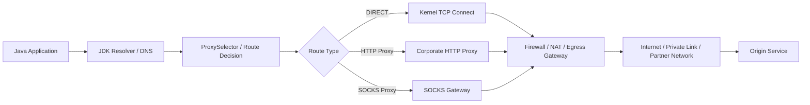
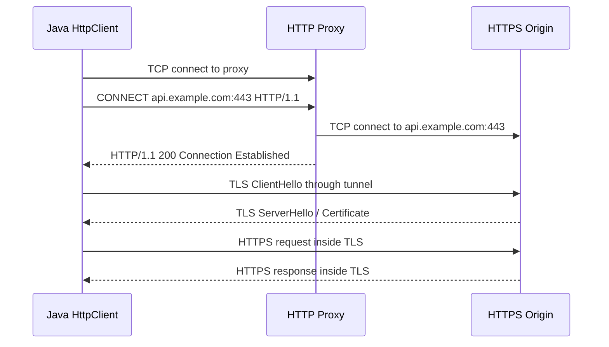
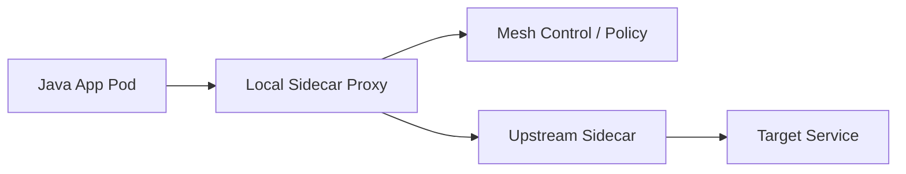
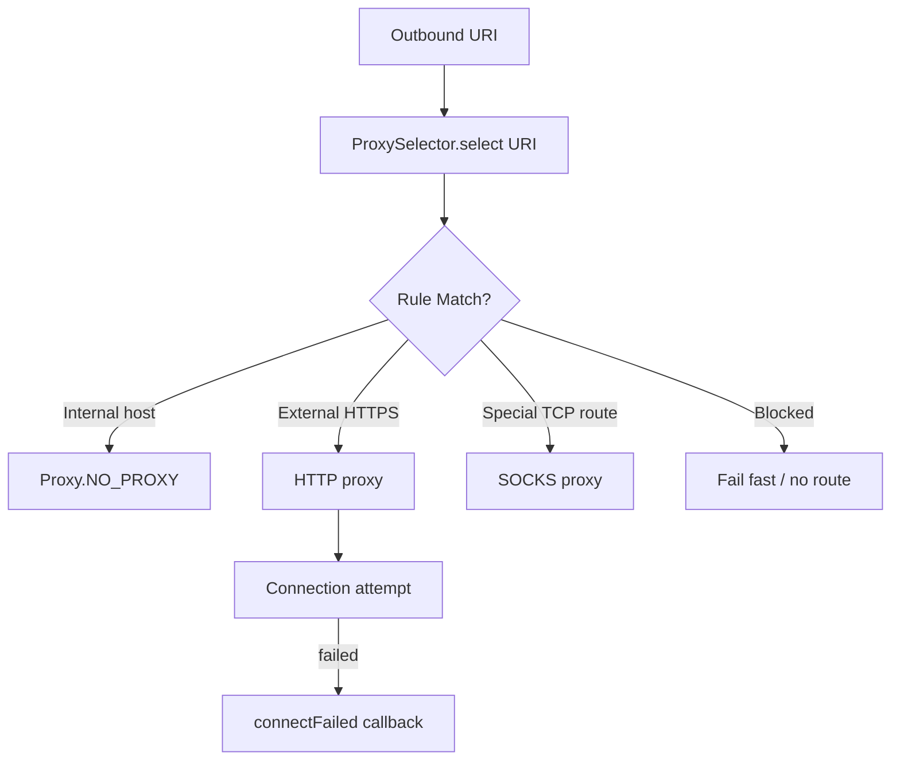
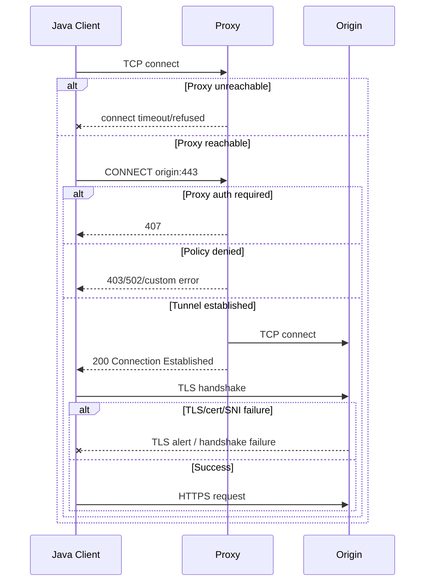
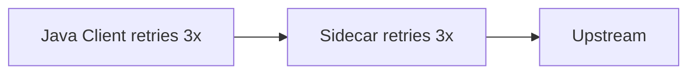

# Part 021 — Proxies, Egress Control, and Enterprise Networks

> Goal utama part ini: mampu mendesain, mengonfigurasi, dan men-debug Java network client yang berjalan di enterprise network: proxy, firewall, egress gateway, corporate authentication, service mesh, container network, dan policy boundary.

Pada laptop developer, network call sering terlihat sederhana:

```java
HttpClient.newHttpClient()
        .send(request, BodyHandlers.ofString());
```

Di production enterprise, call yang sama bisa melewati:

- DNS resolver internal;
- outbound firewall;
- HTTP proxy;
- TLS inspection proxy;
- service mesh sidecar;
- Kubernetes egress gateway;
- cloud NAT gateway;
- identity-aware proxy;
- WAF/API gateway upstream;
- private link/VPC endpoint;
- audit/logging boundary.

Karena itu, bug networking enterprise sering bukan bug Java API saja. Ia adalah bug **route + policy + protocol + identity**.

Part ini fokus ke sisi Java client: bagaimana Java memilih proxy, bagaimana `HttpClient` memakai `ProxySelector`, bagaimana proxy authentication bekerja, bagaimana HTTPS memakai CONNECT tunnel, dan bagaimana membuat desain egress yang tidak fragile.

---

## 1. Kaufman Skill Slice

Ini bagian **environment realism**. Kita sudah memahami socket, DNS, TCP, NIO, HTTP, HTTP Client, dan WebSocket. Sekarang skill-nya adalah melihat network call sebagai perjalanan melewati beberapa boundary.

### Sub-skill decomposition

| Sub-skill | Kompetensi yang harus dikuasai |
|---|---|
| Proxy model | Membedakan direct connection, HTTP proxy, SOCKS proxy, reverse proxy, transparent proxy, service mesh sidecar. |
| Java configuration | Menggunakan `Proxy`, `ProxySelector`, system properties, `HttpClient.Builder.proxy`, dan `Authenticator`. |
| CONNECT tunneling | Memahami bagaimana HTTPS melewati HTTP proxy tanpa proxy membaca payload end-to-end TLS. |
| No-proxy rules | Mendesain bypass untuk localhost, internal domain, metadata service, VPC endpoint, dan private network. |
| Egress policy | Memisahkan allowlist aplikasi, network policy, firewall, audit, dan runtime enforcement. |
| Enterprise auth | Memahami proxy auth, origin auth, credential scoping, dan secret handling. |
| Failure diagnosis | Membedakan DNS failure, proxy refusal, proxy auth failure, firewall drop, TLS intercept failure, dan upstream error. |
| Production design | Membuat network client yang configurable, observable, policy-aware, dan aman terhadap misrouting. |

### Output yang ditargetkan

Setelah part ini kamu harus bisa:

1. menjelaskan jalur request dari JVM ke external service di enterprise network;
2. memilih konfigurasi proxy yang benar untuk `HttpClient`;
3. membuat `ProxySelector` custom yang policy-aware;
4. membedakan `407 Proxy Authentication Required` dan `401 Unauthorized`;
5. membaca failure proxy/TLS/firewall dari gejala;
6. mendesain egress layer yang tidak hard-code environment;
7. membuat checklist production untuk outbound Java network calls.

---

## 2. Mental Model: Outbound Request Is a Path Through Policy

Jangan memodelkan outbound call sebagai:

```text
Java app -> target service
```

Model yang lebih realistis:



Setiap edge punya failure mode berbeda.

| Boundary | Pertanyaan desain |
|---|---|
| DNS | Resolver mana yang dipakai? Split-horizon? Cache TTL? |
| Route decision | Direct, proxy, sidecar, or gateway? |
| Proxy | HTTP, HTTPS via CONNECT, SOCKS? Auth? Audit? |
| Firewall | Allowlist berdasarkan IP, FQDN, port, SNI, atau identity? |
| NAT | Ada ephemeral-port exhaustion? Idle timeout? |
| TLS | End-to-end, inspected, mTLS, SNI, ALPN? |
| Origin | Auth, rate limit, redirect, response size, protocol version? |

Production Java networking sering gagal karena konfigurasi hanya mengatur satu boundary sementara boundary lain berubah.

---

## 3. Proxy Taxonomy

Kata “proxy” sering ambigu. Bedakan beberapa tipe berikut.

### 3.1 Forward proxy

Forward proxy digunakan client untuk mencapai server lain.

```text
Java client -> forward proxy -> external service
```

Use case:

- corporate egress control;
- audit outbound traffic;
- block unknown destinations;
- proxy authentication;
- outbound allowlist;
- caching untuk beberapa traffic.

Java client perlu tahu proxy ini, kecuali proxy bersifat transparent.

### 3.2 Reverse proxy

Reverse proxy berada di depan server.

```text
Java client -> reverse proxy/API gateway -> backend service
```

Use case:

- ingress routing;
- TLS termination;
- rate limiting;
- WAF;
- auth;
- load balancing.

Dari sisi Java client, reverse proxy sering terlihat seperti origin server biasa.

### 3.3 HTTP proxy

HTTP proxy memahami HTTP request.

Untuk plain HTTP:

```text
GET http://example.com/resource HTTP/1.1
Host: example.com
```

Proxy menerima absolute-form URI dan meneruskan request ke origin.

Untuk HTTPS, HTTP proxy biasanya memakai CONNECT.

### 3.4 CONNECT tunnel

HTTPS lewat HTTP proxy biasanya:

```text
Java client -> proxy: CONNECT api.partner.com:443
proxy -> api.partner.com:443: TCP tunnel
Java client <-> origin: TLS handshake through tunnel
```



Important consequence:

- proxy tahu destination host dan port;
- proxy bisa tahu SNI jika tidak dienkripsi oleh extension modern;
- proxy tidak tahu HTTP path/body/header di dalam TLS end-to-end;
- kecuali ada TLS interception/enterprise MITM yang memasang corporate root CA.

### 3.5 SOCKS proxy

SOCKS bekerja lebih rendah dari HTTP proxy. Ia meneruskan TCP connection ke target tertentu tanpa memahami HTTP semantic.

Use case:

- generic TCP tunneling;
- non-HTTP protocols;
- local tunnel;
- jump host style access.

Java punya `Proxy.Type.SOCKS` dan system property `socksProxyHost`/`socksProxyPort`.

### 3.6 Transparent proxy

Transparent proxy tidak dikonfigurasi di aplikasi. Network device mengintercept traffic.

Masalahnya: aplikasi melihat seolah direct connection, tetapi behavior berubah.

Gejala umum:

- TLS handshake failure karena interception;
- certificate chain tidak sesuai ekspektasi;
- request tertentu diblok tanpa response jelas;
- latency bertambah tanpa terlihat di client config;
- packet capture menunjukkan peer IP bukan target asli.

### 3.7 Service mesh sidecar

Dalam Kubernetes/service mesh, aplikasi bisa connect ke `localhost` atau target service, tetapi traffic dialihkan ke sidecar.



Kunci mental model:

- Java app bukan satu-satunya tempat timeout/retry/TLS terjadi;
- sidecar bisa menambah retry, circuit breaking, mTLS, header injection;
- double retry antara Java client dan mesh bisa menciptakan retry storm;
- observability harus menggabungkan app metrics dan proxy metrics.

---

## 4. Java Proxy APIs Overview

Java punya beberapa jalur konfigurasi proxy.

| Mechanism | Scope | Cocok untuk |
|---|---|---|
| `java.net.Proxy` | Per connection/API call tertentu | `Socket`, `URLConnection`, custom client logic. |
| `ProxySelector` | Route decision berdasarkan URI | Centralized policy untuk banyak request. |
| System properties | Process-wide default | Simple deployment config, legacy APIs. |
| `HttpClient.Builder.proxy(...)` | Per `HttpClient` instance | Modern, explicit, safer untuk production. |
| `Authenticator` | Credential callback | Proxy auth/origin auth, dengan hati-hati. |
| Environment variables | Tidak otomatis seragam untuk semua Java API | Container/cloud conventions, perlu mapping. |

Prinsip production:

> Prefer explicit `HttpClient` configuration over global mutable process-wide behavior.

System property berguna, tetapi berbahaya kalau satu JVM punya banyak client dengan policy berbeda.

---

## 5. `java.net.Proxy`

`Proxy` merepresentasikan proxy endpoint.

```java
Proxy proxy = new Proxy(
        Proxy.Type.HTTP,
        new InetSocketAddress("proxy.corp.local", 8080)
);
```

Tipe umum:

| Type | Meaning |
|---|---|
| `DIRECT` | No proxy. |
| `HTTP` | HTTP proxy. |
| `SOCKS` | SOCKS proxy. |

Untuk API lama:

```java
URL url = URI.create("https://api.example.com/data").toURL();
URLConnection connection = url.openConnection(proxy);
connection.setConnectTimeout(2_000);
connection.setReadTimeout(5_000);
```

Untuk raw socket SOCKS/HTTP tergantung support API:

```java
Socket socket = new Socket(proxy);
socket.connect(new InetSocketAddress("example.com", 443), 2_000);
```

Namun untuk modern HTTP, gunakan `HttpClient`.

---

## 6. `ProxySelector`: Route Decision as Policy

`ProxySelector` memilih proxy berdasarkan `URI`.

Core method:

```java
public abstract List<Proxy> select(URI uri);
public abstract void connectFailed(URI uri, SocketAddress sa, IOException ioe);
```

Mental model:



Default selector can be influenced by networking properties. Custom selector gives explicit control.

### 6.1 Simple fixed proxy selector

```java
URI proxyUri = URI.create("http://proxy.corp.local:8080");
ProxySelector selector = ProxySelector.of(
        new InetSocketAddress(proxyUri.getHost(), proxyUri.getPort())
);

HttpClient client = HttpClient.newBuilder()
        .proxy(selector)
        .connectTimeout(Duration.ofSeconds(3))
        .build();
```

This routes all eligible requests through the same proxy.

### 6.2 Policy-aware selector

```java
final class CorporateProxySelector extends ProxySelector {
    private final Proxy httpProxy = new Proxy(
            Proxy.Type.HTTP,
            InetSocketAddress.createUnresolved("proxy.corp.local", 8080)
    );

    @Override
    public List<Proxy> select(URI uri) {
        Objects.requireNonNull(uri, "uri");

        String host = normalizeHost(uri.getHost());
        String scheme = normalizeScheme(uri.getScheme());

        if (host == null || scheme == null) {
            return List.of(Proxy.NO_PROXY);
        }

        if (isLocalhost(host) || isInternalDomain(host) || isMetadataService(host)) {
            return List.of(Proxy.NO_PROXY);
        }

        if (scheme.equals("http") || scheme.equals("https")) {
            return List.of(httpProxy);
        }

        return List.of(Proxy.NO_PROXY);
    }

    @Override
    public void connectFailed(URI uri, SocketAddress sa, IOException ioe) {
        // In production, log sanitized destination, proxy address, exception class, and correlation id.
        System.err.printf("proxy_connect_failed uri=%s proxy=%s error=%s%n",
                safeUri(uri), sa, ioe.toString());
    }

    private static String normalizeHost(String host) {
        return host == null ? null : host.toLowerCase(Locale.ROOT);
    }

    private static String normalizeScheme(String scheme) {
        return scheme == null ? null : scheme.toLowerCase(Locale.ROOT);
    }

    private static boolean isLocalhost(String host) {
        return host.equals("localhost") || host.equals("127.0.0.1") || host.equals("::1");
    }

    private static boolean isInternalDomain(String host) {
        return host.endsWith(".corp.local") || host.endsWith(".svc.cluster.local");
    }

    private static boolean isMetadataService(String host) {
        return host.equals("169.254.169.254") || host.equals("metadata.google.internal");
    }

    private static String safeUri(URI uri) {
        if (uri == null) return "null";
        return uri.getScheme() + "://" + uri.getHost() + ":" + uri.getPort();
    }
}
```

Design notes:

- use `createUnresolved` if you want the proxy host resolved later by the connection logic;
- sanitize URI before logging because query parameters may contain secrets;
- no-proxy decision must be deliberate;
- selector should not perform slow remote calls;
- selector should be deterministic and easy to test.

---

## 7. `HttpClient` with Proxy

Modern Java HTTP client supports per-client proxy configuration.

```java
HttpClient client = HttpClient.newBuilder()
        .proxy(ProxySelector.of(new InetSocketAddress("proxy.corp.local", 8080)))
        .connectTimeout(Duration.ofSeconds(3))
        .followRedirects(HttpClient.Redirect.NORMAL)
        .build();
```

Then request remains normal:

```java
HttpRequest request = HttpRequest.newBuilder()
        .uri(URI.create("https://api.partner.example/v1/accounts"))
        .timeout(Duration.ofSeconds(10))
        .GET()
        .build();

HttpResponse<String> response = client.send(request, BodyHandlers.ofString());
```

Important distinction:

| Timeout | Meaning |
|---|---|
| `connectTimeout` on `HttpClient` | Time to establish TCP connection to proxy or origin depending on route. |
| request `timeout` | Overall request deadline according to JDK behavior. |
| proxy idle timeout | Controlled by proxy, not Java. |
| NAT idle timeout | Controlled by network infrastructure. |
| origin timeout | Controlled by upstream service/load balancer. |

When using proxy, `connectTimeout` may only cover connection to proxy. Failure to connect from proxy to origin may appear as HTTP proxy error, tunnel failure, or timeout depending on proxy behavior.

---

## 8. Proxy Authentication

HTTP proxy authentication is not the same as origin authentication.

| Auth type | Header/status | Who validates it? |
|---|---|---|
| Proxy auth | `Proxy-Authorization`, `407 Proxy Authentication Required` | Forward proxy. |
| Origin auth | `Authorization`, `401 Unauthorized` | Target service. |

Java `HttpClient` can use an `Authenticator`.

```java
Authenticator proxyAuthenticator = new Authenticator() {
    @Override
    protected PasswordAuthentication getPasswordAuthentication() {
        if (getRequestorType() == RequestorType.PROXY) {
            return new PasswordAuthentication(
                    System.getenv("PROXY_USER"),
                    System.getenv("PROXY_PASSWORD").toCharArray()
            );
        }
        return null;
    }
};

HttpClient client = HttpClient.newBuilder()
        .proxy(ProxySelector.of(new InetSocketAddress("proxy.corp.local", 8080)))
        .authenticator(proxyAuthenticator)
        .connectTimeout(Duration.ofSeconds(3))
        .build();
```

### Production rules for proxy credentials

Do not:

```java
// Bad: hard-coded secret
new PasswordAuthentication("alice", "password123".toCharArray());
```

Do:

- load credentials from secret manager or injected environment;
- scope credentials to proxy only;
- avoid logging `Proxy-Authorization`;
- rotate credentials;
- avoid global default authenticator when multiple trust zones share one JVM;
- prefer workload identity where platform supports it.

### Auth failure interpretation

| Symptom | Likely meaning |
|---|---|
| `407 Proxy Authentication Required` | Proxy did not receive/accept proxy credentials. |
| `401 Unauthorized` | Origin rejected origin credentials. |
| `403 Forbidden` from proxy | Proxy recognized client but policy blocks destination. |
| TLS failure after CONNECT | Tunnel established, TLS to origin failed. |
| Timeout before response | Proxy unreachable, firewall drop, or proxy cannot reach origin. |

---

## 9. System Properties for Proxies

Java supports networking properties for proxy configuration. They are useful for simple deployments and legacy code.

Common properties:

```bash
-Dhttp.proxyHost=proxy.corp.local
-Dhttp.proxyPort=8080
-Dhttps.proxyHost=proxy.corp.local
-Dhttps.proxyPort=8080
-Dhttp.nonProxyHosts="localhost|127.*|*.corp.local|*.svc.cluster.local"
-DsocksProxyHost=socks.corp.local
-DsocksProxyPort=1080
-Djava.net.useSystemProxies=true
```

Important nuance:

- system properties are JVM-wide;
- they can affect APIs differently;
- `http.nonProxyHosts` pattern syntax is not the same as shell glob everywhere;
- environment variables like `HTTP_PROXY`/`NO_PROXY` are not a universal Java standard;
- process-wide defaults are risky in multi-tenant services.

### When system properties are acceptable

| Scenario | Acceptable? | Reason |
|---|---:|---|
| Single-purpose batch job | Yes | One outbound policy for whole process. |
| Legacy application with `URLConnection` | Often | Minimal code change. |
| Multi-tenant platform service | Usually no | Different tenants/destinations need different policy. |
| SDK/library code | No | Libraries should not mutate process global settings. |
| Integration test | Yes | Easy to inject fake proxy. |

---

## 10. No-Proxy Rules Are Security-Sensitive

No-proxy rules are not just performance optimization. They define which destinations bypass the proxy control point.

Common bypass targets:

- `localhost` / loopback;
- Kubernetes cluster DNS suffixes;
- internal service domains;
- VPC endpoint domains;
- metadata service endpoints;
- private partner network domains;
- health-check services.

But overly broad bypass is dangerous.

```text
Bad:
*.com
10.*
*
```

Better:

```text
localhost
127.0.0.1
::1
*.svc.cluster.local
*.corp.local
metadata.google.internal
169.254.169.254
```

Even better: put this into tested config, not ad-hoc shell strings.

### Java-side no-proxy policy object

```java
record NoProxyRule(Set<String> exactHosts, List<String> suffixes) {
    boolean matches(String host) {
        String h = host.toLowerCase(Locale.ROOT);
        if (exactHosts.contains(h)) {
            return true;
        }
        for (String suffix : suffixes) {
            if (h.endsWith(suffix)) {
                return true;
            }
        }
        return false;
    }
}
```

Testing matters:

```java
@Test
void bypassesClusterLocalButNotLookalike() {
    NoProxyRule rule = new NoProxyRule(
            Set.of("localhost", "127.0.0.1"),
            List.of(".svc.cluster.local", ".corp.local")
    );

    assertTrue(rule.matches("orders.default.svc.cluster.local"));
    assertFalse(rule.matches("orders.default.svc.cluster.local.evil.example"));
}
```

The second assertion is the real reason to write tests.

---

## 11. CONNECT Tunnel Failure Modes

For HTTPS via proxy, failures happen in phases.



### Failure taxonomy

| Phase | Java symptom | Likely cause |
|---|---|---|
| Connect to proxy | `ConnectException: Connection refused` | Proxy host reachable but port closed. |
| Connect to proxy | `HttpConnectTimeoutException` / timeout | Proxy unreachable or firewall drop. |
| CONNECT request | HTTP 407 | Proxy credentials missing/wrong. |
| CONNECT request | HTTP 403 | Proxy policy blocks destination. |
| CONNECT request | HTTP 502/504 | Proxy cannot reach origin. |
| TLS after CONNECT | `SSLHandshakeException` | Certificate, SNI, protocol, cipher, inspection issue. |
| Request after TLS | HTTP 401/403 | Origin auth/policy, not proxy auth. |

The debugging mistake is treating all these as “HTTPS failure”. They are different phases.

---

## 12. Enterprise TLS Inspection

Some corporate networks intercept TLS by acting as a man-in-the-middle with an enterprise root certificate installed on managed machines.

From Java perspective:

```text
Expected:
Java -> TLS -> origin certificate chain

Interception:
Java -> TLS -> corporate proxy certificate for origin host
Proxy -> TLS -> real origin
```

If Java truststore does not trust the corporate root, you see certificate path errors.

This is not fixed by disabling certificate validation. It is fixed by:

- importing the corporate root into the correct truststore;
- using a dedicated truststore for that environment;
- verifying hostname/SAN remains correct;
- documenting inspection boundary;
- avoiding inspection for high-sensitivity/mTLS connections where policy requires end-to-end identity.

Part 022 goes deep on TLS.

---

## 13. Service Mesh and Double Policy

In service mesh, Java client and sidecar may both implement:

- retries;
- timeouts;
- circuit breakers;
- TLS/mTLS;
- metrics;
- access control;
- connection pooling.

This creates duplicate policy risk.

### Example: retry amplification



One logical call can become 9 upstream attempts.

If a gateway also retries, it can become worse.

### Rule

> Pick one primary retry owner per boundary, then make other layers conservative.

Recommended split:

| Concern | Prefer owner |
|---|---|
| Business/idempotency-aware retry | Java client/application. |
| Low-level transient connection retry | Mesh/proxy, small count. |
| Authentication refresh | Java client/application. |
| mTLS between services | Mesh or platform. |
| Deadline propagation | Java client/application. |
| Egress allowlist | Platform/network + app config validation. |
| Per-call semantic metrics | Java client/application. |
| L4/L7 transport metrics | Mesh/proxy. |

---

## 14. Container and Kubernetes Egress

Java code may be correct locally but fail in Kubernetes because egress path changes.

Common variables:

- pod DNS config;
- cluster DNS suffix search;
- NetworkPolicy;
- namespace egress rule;
- sidecar injection;
- node NAT;
- cloud NAT gateway;
- private endpoint routing;
- egress proxy environment variables;
- TLS truststore image contents.

### Container-specific pitfalls

| Pitfall | Explanation |
|---|---|
| Truststore mismatch | Base image may not include corporate CA. |
| Env var ignored | Java API may not automatically honor `HTTPS_PROXY` unless mapped. |
| `localhost` confusion | In pod, `localhost` is container/pod namespace, not host machine. |
| DNS search suffix | Short names may resolve differently. |
| Sidecar port capture | Packet route differs from Java-visible destination. |
| NAT idle timeout | Long-lived idle connections get reset. |
| Ephemeral port exhaustion | High outbound concurrency + short-lived connections. |

### Production startup diagnostics

At startup, log sanitized network config:

```text
network.proxy.mode=explicit
network.proxy.http=proxy.corp.local:8080
network.proxy.no_proxy=[localhost, 127.0.0.1, *.svc.cluster.local]
network.tls.truststore.source=custom-mounted
network.dns.cache.ttl=60
network.egress.policy.version=2026-06-30.1
```

Do not log passwords, tokens, private keys, or full URLs with query strings.

---

## 15. Designing a Configurable Egress Client

Do not scatter proxy logic across business code.

Bad:

```java
HttpClient client = HttpClient.newBuilder()
        .proxy(ProxySelector.of(new InetSocketAddress("proxy-prod-01", 8080)))
        .build();
```

Better:

```java
record EgressConfig(
        ProxyMode proxyMode,
        Optional<InetSocketAddress> httpProxy,
        List<String> noProxySuffixes,
        Duration connectTimeout,
        Duration requestTimeout
) {}

enum ProxyMode {
    DIRECT,
    FIXED_HTTP_PROXY,
    POLICY_SELECTOR
}
```

Factory:

```java
final class EgressHttpClientFactory {
    HttpClient create(EgressConfig config, Optional<Authenticator> authenticator) {
        HttpClient.Builder builder = HttpClient.newBuilder()
                .connectTimeout(config.connectTimeout());

        switch (config.proxyMode()) {
            case DIRECT -> builder.proxy(ProxySelector.of(null));
            case FIXED_HTTP_PROXY -> builder.proxy(
                    ProxySelector.of(config.httpProxy()
                            .orElseThrow(() -> new IllegalArgumentException("httpProxy required")))
            );
            case POLICY_SELECTOR -> builder.proxy(new CorporateProxySelector());
        }

        authenticator.ifPresent(builder::authenticator);
        return builder.build();
    }
}
```

Note: depending on JDK behavior and API overload, direct route is often expressed by returning `Proxy.NO_PROXY` from a selector. Keep this factory covered by integration tests with a fake proxy.

---

## 16. Fail Fast on Unsafe Destination

A production egress client should validate destination before sending.

```java
final class EgressPolicy {
    private final Set<String> allowedHosts;

    EgressPolicy(Set<String> allowedHosts) {
        this.allowedHosts = Set.copyOf(allowedHosts);
    }

    void validate(URI uri) {
        if (!"https".equalsIgnoreCase(uri.getScheme())) {
            throw new IllegalArgumentException("Only HTTPS egress is allowed");
        }
        String host = uri.getHost();
        if (host == null || !allowedHosts.contains(host.toLowerCase(Locale.ROOT))) {
            throw new IllegalArgumentException("Destination host is not allowed: " + host);
        }
        if (uri.getUserInfo() != null) {
            throw new IllegalArgumentException("Userinfo in URI is not allowed");
        }
    }
}
```

This is not a full SSRF defense. That is covered deeper in Part 026. But it is a necessary habit: outbound destination is a security boundary.

---

## 17. Proxy-Aware Redirect Handling

Redirects can change destination.

```text
https://api.partner.example/start
    -> 302 Location: https://login.partner.example/auth
    -> 302 Location: https://cdn.partner-assets.example/file
```

If redirect is enabled, your client may contact more hosts than the original URI.

### Rule

> Redirect policy must be combined with egress policy.

You need to decide:

| Redirect target | Should follow? |
|---|---:|
| Same host, same scheme | Usually yes. |
| Same registrable domain, HTTPS | Maybe, if allowlisted. |
| HTTP downgrade | Usually no. |
| Unknown external host | No unless explicit. |
| Private IP / metadata host | No. |

With Java `HttpClient`, automatic redirects are convenient but can hide destination changes. For high-control egress, consider `Redirect.NEVER` and handle redirects explicitly.

```java
HttpClient client = HttpClient.newBuilder()
        .followRedirects(HttpClient.Redirect.NEVER)
        .proxy(proxySelector)
        .build();
```

---

## 18. Testing with a Fake Proxy

Unit tests are not enough. You need at least one integration test that proves traffic goes through proxy.

A minimal fake proxy can assert:

- request reaches proxy;
- direct origin is not contacted;
- `CONNECT` is issued for HTTPS;
- proxy auth header is present when expected;
- no-proxy host bypasses proxy;
- timeout is bounded when proxy blackholes.

Test matrix:

| Test | Expected |
|---|---|
| HTTP external host | Proxy receives absolute-form request. |
| HTTPS external host | Proxy receives CONNECT host:port. |
| Proxy returns 407 | Client surfaces proxy auth failure. |
| Proxy returns 403 | Client surfaces policy denial. |
| Internal no-proxy host | Proxy receives nothing. |
| Proxy not listening | Connect failure within configured timeout. |
| Redirect to unknown host | Client blocks or does not follow. |

---

## 19. Operational Metrics for Egress

At minimum, tag outbound requests with route info.

Useful dimensions:

| Metric dimension | Example |
|---|---|
| `egress.route` | `direct`, `http_proxy`, `socks`, `sidecar` |
| `proxy.host` | sanitized logical proxy name |
| `destination.host` | `api.partner.example` |
| `destination.port` | `443` |
| `scheme` | `https` |
| `result.phase` | `dns`, `proxy_connect`, `connect_tunnel`, `tls`, `request`, `response_body` |
| `exception.class` | `SSLHandshakeException` |
| `http.status` | `407`, `403`, `502`, `504` |

Do not put high-cardinality full URL paths into metrics unless bounded and sanitized.

---

## 20. Troubleshooting Playbook

### 20.1 Does Java use the expected proxy?

Check:

- `HttpClient` builder config;
- `ProxySelector.getDefault()` if using defaults;
- `http.proxyHost` / `https.proxyHost` system properties;
- container env var mapping;
- no-proxy match;
- sidecar interception.

### 20.2 Is the failure before or after CONNECT?

Indicators:

| Evidence | Phase |
|---|---|
| No HTTP status, connect timeout | TCP to proxy/origin. |
| `407` | Proxy auth. |
| `403` from proxy body | Proxy policy. |
| `200 Connection Established` then TLS error | TLS to origin. |
| Origin status after TLS | Application/origin layer. |

### 20.3 Is DNS resolved by Java or proxy?

For HTTP proxy:

- with CONNECT target host, proxy may resolve origin;
- Java still resolves proxy host;
- direct route resolves origin locally;
- SOCKS behavior can vary by unresolved/resolved address.

This matters for split-horizon DNS.

### 20.4 Is TLS inspection happening?

Check certificate issuer in failure/debug logs. If issuer is corporate CA, traffic is intercepted. If Java truststore lacks that CA, certificate path fails.

### 20.5 Is no-proxy too broad?

A too broad no-proxy bypasses audit/control. A too narrow no-proxy sends internal traffic to proxy and may fail or leak metadata.

---

## 21. Decision Matrix

| Situation | Recommended approach |
|---|---|
| Simple service, all outbound through one proxy | `HttpClient.Builder.proxy(ProxySelector.of(...))`. |
| Mixed internal/external destinations | Custom `ProxySelector` with tested no-proxy rules. |
| Legacy URLConnection app | System properties, but document process-wide impact. |
| SDK/library | Accept `HttpClient` or config from caller; do not set globals. |
| Kubernetes with sidecar | Coordinate retry/timeout/TLS policy with mesh config. |
| High-security egress | Explicit allowlist, redirect control, proxy audit, TLS validation. |
| Debugging proxy issue | Classify phase: DNS, proxy TCP, CONNECT, auth, TLS, origin. |

---

## 22. Anti-Patterns

| Anti-pattern | Why it fails |
|---|---|
| Hard-coding proxy host in business code | Environment-specific and hard to rotate. |
| Global system properties in shared JVM | Hidden coupling between clients. |
| Disabling TLS validation to pass proxy inspection | Converts network issue into security vulnerability. |
| Treating `407` as origin auth failure | Wrong owner and wrong fix. |
| Blindly enabling redirects | Can bypass egress intent. |
| Duplicating retries in Java and mesh | Retry amplification. |
| Logging full proxied URL | Token/query leakage. |
| Assuming `HTTP_PROXY` works automatically | Java behavior depends on API/configuration. |
| Using one timeout | Different phases need different budgets. |
| Ignoring no-proxy tests | Lookalike host and suffix bugs become security bugs. |

---

## 23. Production Checklist

Before shipping Java outbound networking in enterprise environment:

- [ ] Destination allowlist defined.
- [ ] Proxy route explicit and environment-configurable.
- [ ] No-proxy rules tested.
- [ ] Redirect policy constrained.
- [ ] Proxy credentials scoped and loaded from secret manager.
- [ ] No secrets in logs.
- [ ] TLS validation enabled.
- [ ] Corporate CA/truststore story documented if TLS inspection exists.
- [ ] Connect timeout and request timeout configured.
- [ ] Retry owner decided between app and mesh/proxy.
- [ ] Metrics include route and failure phase.
- [ ] Integration test proves proxy route.
- [ ] Failure playbook documents `407`, `403`, `502`, `504`, TLS errors.
- [ ] Container/Kubernetes DNS and truststore verified.

---

## 24. Deliberate Practice

### Drill 1 — Build a route classifier

Write a method:

```java
Route classify(URI uri)
```

Rules:

- `localhost`, `127.0.0.1`, `*.svc.cluster.local` => direct;
- `https://*.partner.example` => HTTP proxy;
- unknown host => reject;
- HTTP scheme => reject unless explicitly allowed.

Add tests for:

- case-insensitive host;
- suffix lookalike;
- missing host;
- userinfo in URI;
- IPv6 literal.

### Drill 2 — Fake proxy integration test

Implement a tiny TCP server that accepts connection and records first line.

For HTTP request through proxy, expect:

```text
GET http://example.test/path HTTP/1.1
```

For HTTPS through proxy, expect:

```text
CONNECT example.test:443 HTTP/1.1
```

### Drill 3 — Failure phase classifier

Given exception/status samples, classify into:

- proxy TCP connect;
- proxy authentication;
- proxy policy;
- tunnel establishment;
- TLS handshake;
- origin application response.

### Drill 4 — Mesh retry calculation

If Java retries 2 times, sidecar retries 2 times, and gateway retries 2 times, calculate max attempts. Then redesign to keep max attempts <= 3.

---

## 25. Key Takeaways

1. Enterprise outbound networking is route + policy + protocol + identity, not just `send(request)`.
2. Java offers `Proxy`, `ProxySelector`, system properties, and `HttpClient.Builder.proxy`; production code should prefer explicit per-client configuration.
3. HTTPS through HTTP proxy uses CONNECT; failures before and after CONNECT mean different things.
4. `407` belongs to proxy authentication; `401` belongs to origin authentication.
5. No-proxy rules are security-sensitive and must be tested.
6. Service mesh can duplicate retry, TLS, and timeout behavior; coordinate policy ownership.
7. Debugging requires phase classification: DNS, proxy connect, CONNECT, TLS, request, response.
8. Never fix enterprise proxy/TLS issues by disabling certificate validation.

---

## 26. References

- Java SE 25 API — `HttpClient.Builder`, `proxy`, `authenticator`, `sslContext`, `sslParameters`.
- Java SE 25 API — `ProxySelector`, `Proxy`, networking properties.
- Java SE 25 Networking Properties — proxy system properties and `ProxySelector.select(URI)` behavior.
- Java SE 25 JSSE Reference Guide — TLS, SNI, ALPN, key/trust manager behavior.

---

## 27. Next Part

Part 022 membahas **TLS, HTTPS, mTLS, and Certificate Path Troubleshooting**: `SSLContext`, truststore/keystore, JSSE, hostname verification, SNI, ALPN, mTLS, `SSLHandshakeException`, dan cara membaca `javax.net.debug` tanpa tersesat.
