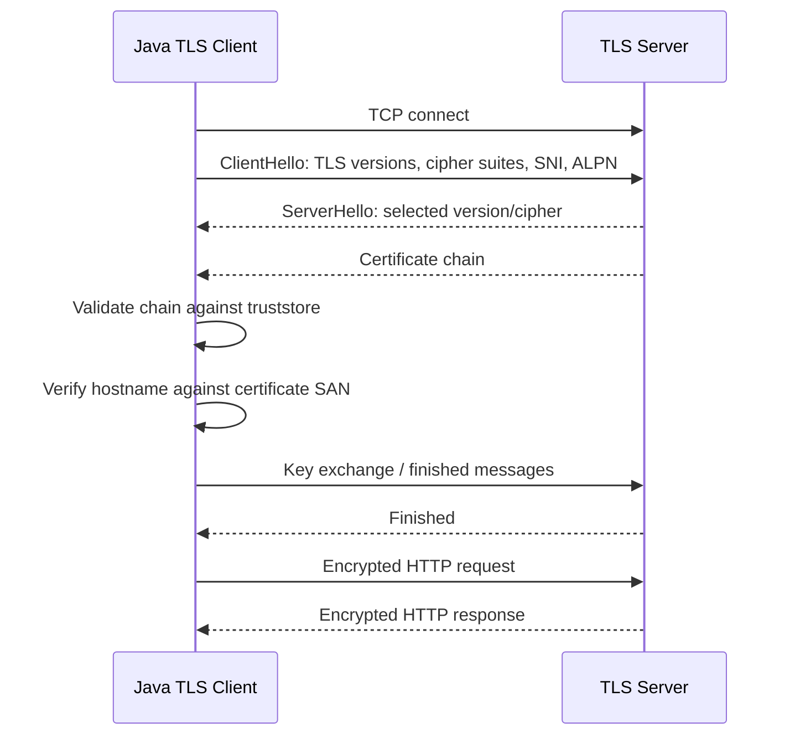
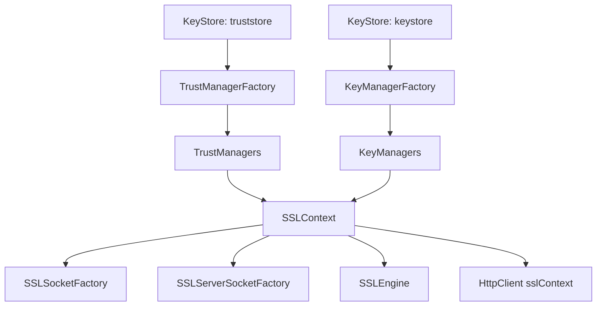
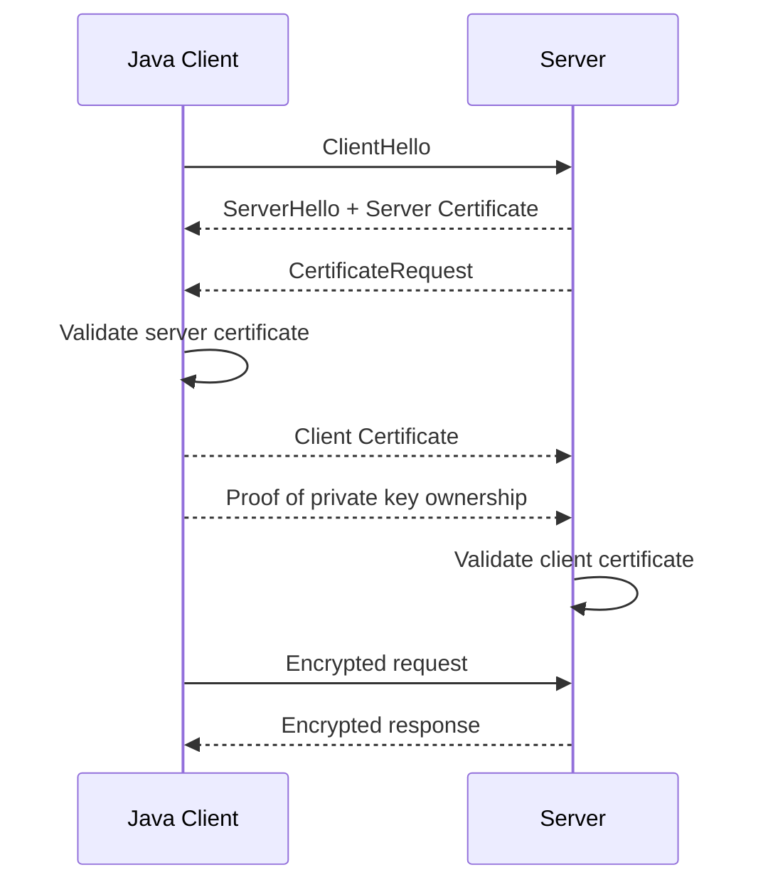
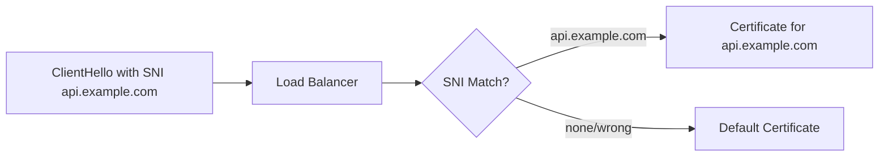
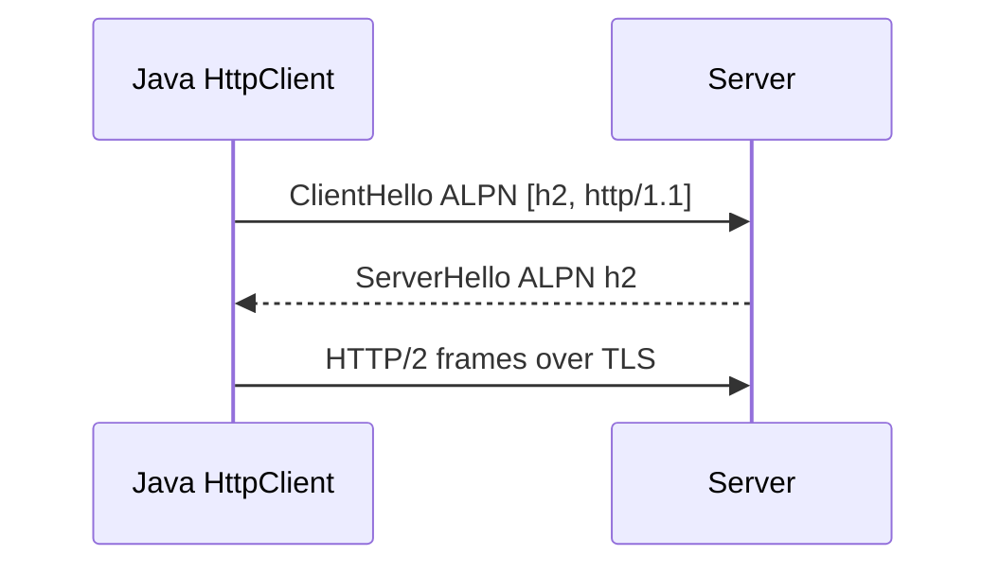
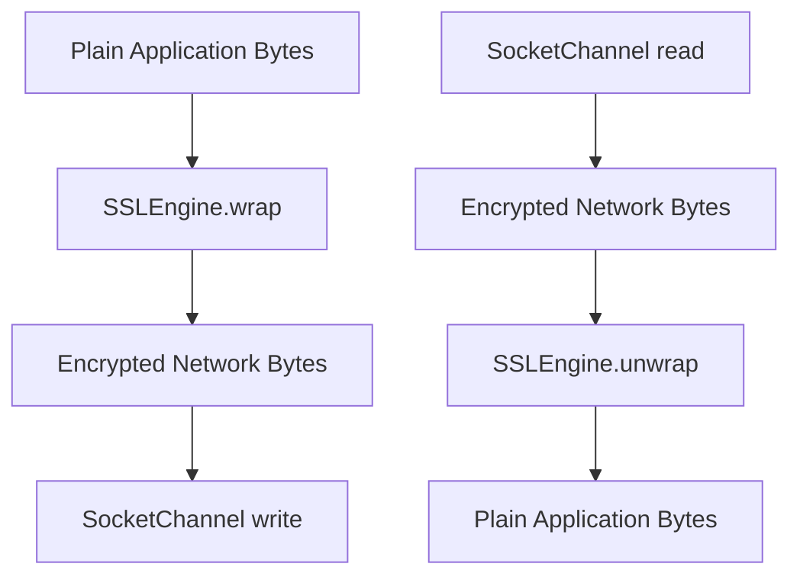
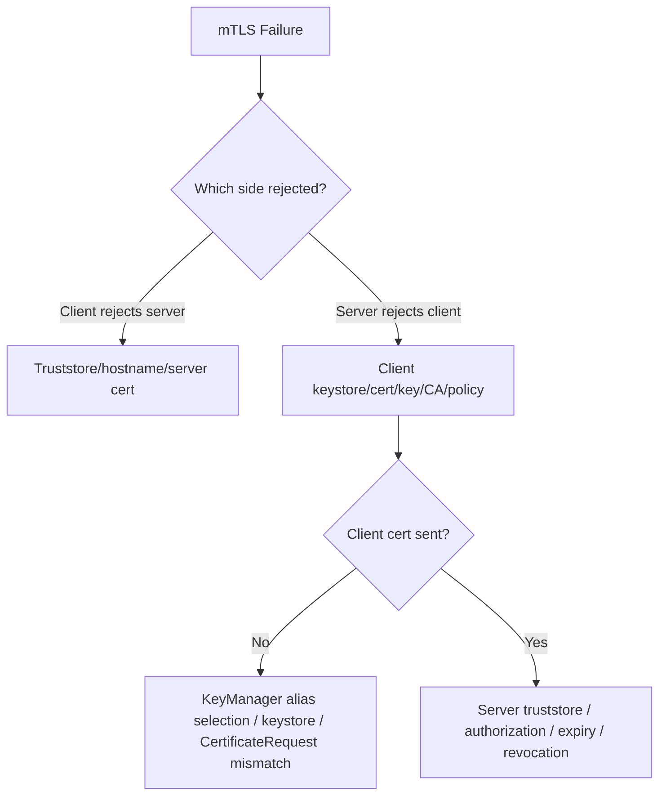

# Part 022 — TLS, HTTPS, mTLS, and Certificate Path Troubleshooting

> Goal utama part ini: mampu mengonfigurasi, menjelaskan, dan men-debug TLS/HTTPS/mTLS di Java dengan benar, tanpa “solusi” berbahaya seperti trust-all certificate atau disable hostname verification.

Banyak engineer memperlakukan TLS sebagai checkbox:

```text
Use HTTPS.
```

Untuk production Java networking, TLS adalah runtime protocol dengan banyak moving parts:

- certificate chain;
- trust anchor;
- hostname verification;
- protocol version;
- cipher suite;
- SNI;
- ALPN;
- session resumption;
- keystore;
- truststore;
- key manager;
- trust manager;
- mTLS client certificate;
- proxy/tunnel/inspection interaction;
- revocation and expiry;
- provider and algorithm constraints.

Part ini tidak mengulang cryptography umum. Fokusnya adalah **network-facing TLS behavior in Java**.

---

## 1. Kaufman Skill Slice

Ini bagian **failure literacy**. TLS error biasanya muncul sebagai exception pendek, tetapi root cause-nya bisa berada di certificate, identity, route, proxy, clock, protocol negotiation, atau deployment artifact.

### Sub-skill decomposition

| Sub-skill | Kompetensi yang harus dikuasai |
|---|---|
| TLS handshake model | Menjelaskan urutan high-level client hello, server certificate, key agreement, verification, and secure channel. |
| JSSE architecture | Memahami `SSLContext`, `KeyManager`, `TrustManager`, `SSLSocket`, `SSLServerSocket`, `SSLEngine`, `SSLParameters`. |
| Truststore | Mengelola trusted CA/root/intermediate untuk validasi server. |
| Keystore | Mengelola private key + certificate chain untuk server identity atau mTLS client identity. |
| Hostname verification | Memahami kenapa certificate valid secara chain tetap bisa gagal karena SAN mismatch. |
| SNI and ALPN | Mengerti server name selection dan protocol negotiation untuk HTTPS/HTTP2. |
| mTLS | Mendesain client certificate authentication tanpa bocor private key. |
| Troubleshooting | Membaca `SSLHandshakeException`, PKIX errors, TLS alerts, and JSSE debug output. |

### Output yang ditargetkan

Setelah part ini kamu harus bisa:

1. membuat `HttpClient` dengan custom truststore yang benar;
2. membuat client mTLS dengan keystore + truststore;
3. membedakan trust failure, hostname failure, protocol failure, and client-cert failure;
4. membaca `PKIX path building failed` dengan benar;
5. menjelaskan kapan `SSLContext`, `SSLParameters`, `SSLSocket`, dan `SSLEngine` digunakan;
6. membuat TLS troubleshooting checklist untuk production incident.

---

## 2. TLS Mental Model

TLS memberi secure channel di atas transport TCP.



High-level invariants:

1. TLS does not make an untrusted endpoint trusted by magic.
2. Trust comes from certificate chain ending at a trusted anchor.
3. Identity comes from hostname verification against certificate subject alternative names.
4. Confidentiality starts only after handshake succeeds.
5. mTLS adds client identity, not just server identity.
6. Proxy and load balancer boundaries can terminate or tunnel TLS.

---

## 3. HTTPS Is HTTP Over TLS, Not “HTTP with a Flag”

For Java `HttpClient`:

```text
URI scheme https -> establish TCP -> perform TLS -> send HTTP inside TLS
```

For HTTPS through HTTP proxy:

```text
TCP to proxy -> CONNECT target:443 -> TLS through tunnel -> HTTP inside TLS
```

For reverse proxy/API gateway:

```text
Java -> TLS to gateway -> gateway -> backend
```

TLS endpoint may be:

- actual origin service;
- load balancer;
- API gateway;
- service mesh sidecar;
- corporate inspection proxy;
- ingress controller;
- local development server.

The certificate must match the endpoint identity the Java client believes it is talking to.

---

## 4. JSSE Architecture

Java TLS is implemented through JSSE: Java Secure Socket Extension.

Core objects:

| Component | Role |
|---|---|
| `SSLContext` | Factory/configuration root for TLS sockets/engines. |
| `TrustManager` | Decides whether peer certificate chain is trusted. |
| `KeyManager` | Chooses local certificate/private key for server identity or mTLS client identity. |
| `KeyStore` | Storage abstraction for certificates/private keys. |
| `TrustManagerFactory` | Builds trust managers from truststore. |
| `KeyManagerFactory` | Builds key managers from keystore. |
| `SSLSocket` | TLS over blocking socket. |
| `SSLServerSocket` | Server-side TLS socket. |
| `SSLEngine` | Transport-independent TLS engine, used by NIO/frameworks. |
| `SSLParameters` | Protocols, cipher suites, endpoint identification, SNI, ALPN, client auth flags, etc. |



### Key distinction

| Store | Contains | Used for |
|---|---|---|
| Truststore | CA/root/intermediate certificates you trust | Validate peer certificate. |
| Keystore | Your private key + certificate chain | Present your identity. |

For normal HTTPS client:

- client needs truststore;
- client usually does not need keystore.

For mTLS client:

- client needs truststore to verify server;
- client needs keystore to present client certificate.

For TLS server:

- server needs keystore to present server certificate;
- server needs truststore only if it verifies client certificate.

---

## 5. Default TLS in Java

A simple client:

```java
HttpClient client = HttpClient.newHttpClient();
```

For `https://` URIs, Java uses default TLS configuration from the runtime:

- default truststore;
- default security providers;
- enabled TLS versions/cipher suites according to JDK security policy;
- default hostname verification behavior for HTTPS;
- default algorithm constraints.

This is usually correct for public internet HTTPS when running on a well-maintained JDK/container image.

Default becomes insufficient when:

- corporate CA must be trusted;
- private CA signs internal services;
- mTLS client cert is required;
- old server only supports disabled protocols/ciphers;
- compliance requires explicit truststore;
- service mesh uses custom CA;
- container image truststore differs from host.

---

## 6. Loading a Custom Truststore

Use case: your Java service must trust internal CA certificates.

```java
static SSLContext sslContextFromTruststore(Path truststorePath, char[] password)
        throws Exception {
    KeyStore truststore = KeyStore.getInstance("PKCS12");
    try (InputStream in = Files.newInputStream(truststorePath)) {
        truststore.load(in, password);
    }

    TrustManagerFactory tmf = TrustManagerFactory.getInstance(
            TrustManagerFactory.getDefaultAlgorithm()
    );
    tmf.init(truststore);

    SSLContext context = SSLContext.getInstance("TLS");
    context.init(null, tmf.getTrustManagers(), null);
    return context;
}
```

Use it with `HttpClient`:

```java
SSLContext sslContext = sslContextFromTruststore(
        Path.of("/etc/app/truststore.p12"),
        System.getenv("TRUSTSTORE_PASSWORD").toCharArray()
);

HttpClient client = HttpClient.newBuilder()
        .sslContext(sslContext)
        .connectTimeout(Duration.ofSeconds(3))
        .build();
```

Production rules:

- prefer PKCS12 for portable stores;
- mount truststore as secret/config artifact;
- rotate CA bundle intentionally;
- never put password in source code;
- log truststore source/version, not secrets;
- test certificate chain in CI/staging.

---

## 7. Loading Client Certificate for mTLS

mTLS requires the client to present a certificate/private key.

```java
static SSLContext sslContextForMtls(
        Path clientKeystorePath,
        char[] clientKeystorePassword,
        Path truststorePath,
        char[] truststorePassword
) throws Exception {
    KeyStore keyStore = KeyStore.getInstance("PKCS12");
    try (InputStream in = Files.newInputStream(clientKeystorePath)) {
        keyStore.load(in, clientKeystorePassword);
    }

    KeyManagerFactory kmf = KeyManagerFactory.getInstance(
            KeyManagerFactory.getDefaultAlgorithm()
    );
    kmf.init(keyStore, clientKeystorePassword);

    KeyStore trustStore = KeyStore.getInstance("PKCS12");
    try (InputStream in = Files.newInputStream(truststorePath)) {
        trustStore.load(in, truststorePassword);
    }

    TrustManagerFactory tmf = TrustManagerFactory.getInstance(
            TrustManagerFactory.getDefaultAlgorithm()
    );
    tmf.init(trustStore);

    SSLContext context = SSLContext.getInstance("TLS");
    context.init(kmf.getKeyManagers(), tmf.getTrustManagers(), null);
    return context;
}
```

Use with `HttpClient`:

```java
HttpClient client = HttpClient.newBuilder()
        .sslContext(sslContextForMtls(
                Path.of("/etc/app/client-identity.p12"),
                System.getenv("CLIENT_KEYSTORE_PASSWORD").toCharArray(),
                Path.of("/etc/app/truststore.p12"),
                System.getenv("TRUSTSTORE_PASSWORD").toCharArray()
        ))
        .connectTimeout(Duration.ofSeconds(3))
        .build();
```

### mTLS handshake mental model



mTLS proves the client controls private key corresponding to its certificate. It does not automatically solve authorization. Server must map certificate identity to permissions.

---

## 8. Hostname Verification

Certificate chain validation answers:

```text
Was this certificate issued by a trusted CA and is it valid under policy?
```

Hostname verification answers:

```text
Is this certificate valid for the host I intended to call?
```

Example:

```text
Request URI: https://payments.partner.example
Certificate SAN: api.partner.example
```

Even if the certificate chain is trusted, hostname verification should fail.

### Common hostname failures

| Failure | Explanation |
|---|---|
| SAN missing target host | Certificate not issued for requested DNS name. |
| CN-only legacy cert | Modern verification relies on SAN. |
| Wildcard mismatch | `*.example.com` does not match every nested subdomain. |
| IP address URI | Certificate must contain IP SAN, not only DNS SAN. |
| Internal alias | Calling `https://service` but cert is for `service.namespace.svc.cluster.local`. |
| Proxy/inspection cert mismatch | Intercepting proxy generated wrong certificate. |

### Do not disable hostname verification

Bad pattern:

```java
// Do not do this in production.
// Trust-all managers or disabled hostname verification destroy endpoint identity.
```

Correct fixes:

- call the service using the DNS name in certificate SAN;
- issue certificate with correct SAN;
- configure SNI/virtual host correctly;
- fix service discovery alias;
- fix corporate inspection CA/certificate generation.

---

## 9. `SSLParameters`

`SSLParameters` configures details of TLS handshake.

Examples of what it can carry:

- enabled protocols;
- cipher suites;
- endpoint identification algorithm;
- server names/SNI;
- application protocols/ALPN;
- client authentication requirement for server sockets;
- algorithm constraints.

For `HttpClient`:

```java
SSLParameters params = new SSLParameters();
params.setProtocols(new String[] { "TLSv1.3", "TLSv1.2" });

HttpClient client = HttpClient.newBuilder()
        .sslParameters(params)
        .build();
```

Do not casually pin cipher suites/protocols unless you have compatibility and compliance reason. Overly narrow config breaks interoperability and future upgrades.

---

## 10. SNI: Server Name Indication

SNI lets client tell server which hostname it wants during TLS handshake.

Why it matters:

- many hosts share one IP;
- load balancer selects certificate based on SNI;
- mTLS policy may depend on SNI;
- wrong SNI can return default certificate;
- missing SNI can cause hostname mismatch.



With standard HTTPS URI, Java normally has enough information to set SNI. Problems arise with:

- connecting by IP while expecting DNS certificate;
- custom sockets;
- unusual proxy/tunnel setups;
- manually configured `SSLParameters` that override names;
- test environments with aliases.

---

## 11. ALPN: Application-Layer Protocol Negotiation

ALPN lets client and server negotiate application protocol during TLS handshake.

For HTTPS, this commonly determines:

- `h2` for HTTP/2;
- `http/1.1` for HTTP/1.1.



If ALPN negotiation does not select HTTP/2, Java client may use HTTP/1.1 depending on configuration/server support.

ALPN can be affected by:

- TLS termination at proxy/load balancer;
- old server TLS stack;
- corporate TLS inspection;
- disabled protocols/ciphers;
- custom `SSLParameters`.

---

## 12. `SSLSocket` vs `SSLEngine`

### `SSLSocket`

Use when you want blocking socket-style TLS.

```java
SSLSocketFactory factory = sslContext.getSocketFactory();
try (SSLSocket socket = (SSLSocket) factory.createSocket("api.example.com", 443)) {
    socket.startHandshake();
    socket.getOutputStream().write("...".getBytes(StandardCharsets.UTF_8));
}
```

Good for:

- simple custom protocols;
- blocking thread-per-connection;
- tests and diagnostics;
- educational code.

### `SSLEngine`

`SSLEngine` is transport-independent TLS state machine.

It does not perform network I/O itself. Frameworks feed encrypted bytes in/out.

Good for:

- NIO event loops;
- Netty-style frameworks;
- custom high-performance servers;
- TLS over non-standard transport;
- explicit buffer/state control.

Mental model:



If you are not building a framework, prefer `HttpClient`, `SSLSocket`, or a mature networking framework rather than implementing `SSLEngine` handling manually.

---

## 13. Certificate Path Validation

When server presents certificate chain, Java tries to build a path:

```text
Leaf certificate -> Intermediate CA -> Root CA in truststore
```

If it cannot build a valid path, you often see:

```text
javax.net.ssl.SSLHandshakeException:
  PKIX path building failed:
  sun.security.provider.certpath.SunCertPathBuilderException:
  unable to find valid certification path to requested target
```

This means Java could not establish trust chain to a trusted anchor.

### Common causes

| Cause | Explanation | Correct fix |
|---|---|---|
| Private CA missing | Internal service cert signed by private CA absent from truststore. | Add CA to truststore. |
| Corporate TLS inspection | Proxy cert signed by corporate CA absent from JVM truststore. | Add corporate CA if policy allows. |
| Missing intermediate | Server did not send intermediate cert. | Fix server chain. |
| Wrong truststore loaded | App uses different JDK/container truststore than expected. | Verify runtime config. |
| Expired cert | Leaf/intermediate/root expired. | Renew/rotate cert. |
| Not yet valid | Clock skew or cert validity start in future. | Fix time/cert issuance. |
| Algorithm disabled | Cert uses disabled algorithm/key size. | Reissue with compliant algorithm. |

### Do not fix PKIX by trust-all

Bad:

```java
TrustManager[] trustAll = new TrustManager[] {
    new X509TrustManager() {
        public void checkClientTrusted(X509Certificate[] chain, String authType) {}
        public void checkServerTrusted(X509Certificate[] chain, String authType) {}
        public X509Certificate[] getAcceptedIssuers() { return new X509Certificate[0]; }
    }
};
```

This removes certificate trust validation. In production it is a security defect.

---

## 14. TLS Exception Taxonomy

| Symptom | Likely meaning |
|---|---|
| `PKIX path building failed` | Trust chain cannot be built to trusted CA. |
| `No subject alternative DNS name matching ... found` | Hostname verification failed. |
| `Received fatal alert: handshake_failure` | Protocol/cipher/client-cert/SNI/ALPN mismatch; server rejected handshake. |
| `bad_certificate` | Peer rejected certificate, common in mTLS. |
| `certificate_unknown` | Peer cannot validate certificate. |
| `No available authentication scheme` | Client cannot produce required certificate/key for mTLS. |
| `Remote host terminated the handshake` | Peer closed during handshake; check server/proxy logs. |
| `Unsupported or unrecognized SSL message` | Plain HTTP sent to HTTPS port or wrong endpoint/proxy mode. |
| `Connection reset` during TLS | Network/proxy/server aborted connection. |

Do not stop at exception class. Identify phase and peer.

---

## 15. Debugging with `javax.net.debug`

JSSE has debug logging via system property.

Examples:

```bash
java -Djavax.net.debug=ssl,handshake -jar app.jar
```

More verbose:

```bash
java -Djavax.net.debug=ssl,handshake,certpath -jar app.jar
```

Very verbose:

```bash
java -Djavax.net.debug=all -jar app.jar
```

Use carefully in production because logs can be large and may expose sensitive metadata.

### What to look for

| Debug clue | Meaning |
|---|---|
| `ClientHello` | Client attempted TLS; check SNI, protocols, ALPN. |
| `ServerHello` | Server selected protocol/cipher. |
| `Certificate` | Inspect presented chain. |
| `X509TrustManager` / certpath | Trust validation process. |
| `*** CertificateRequest` | Server requested client cert. |
| `No X.509 cert selected` | Client did not find suitable mTLS cert. |
| `application_protocol` | ALPN negotiation. |
| `fatal alert` | Peer or local TLS stack aborted. |

### Debugging workflow

1. Reproduce with one request, not full traffic.
2. Capture destination host/port and route: direct/proxy/sidecar.
3. Enable handshake debug in controlled environment.
4. Identify presented certificate chain.
5. Check trust anchor and hostname.
6. Check client certificate selection if mTLS.
7. Check protocol/cipher/ALPN only after trust/identity are clear.

---

## 16. mTLS Failure Diagnosis

mTLS adds another identity path.

Server validates client certificate, and client validates server certificate.



### Common mTLS issues

| Issue | Symptom | Fix |
|---|---|---|
| Client keystore missing private key | No cert selected or key error | Use proper PKCS12 with private key + chain. |
| Wrong key password | KeyManager init fails | Correct secret handling. |
| Server CA not in client truststore | Client PKIX failure | Add server CA. |
| Client CA not trusted by server | Server sends bad certificate / handshake failure | Add client CA to server truststore. |
| Certificate expired | Handshake failure | Rotate cert. |
| Wrong EKU | Server rejects client cert | Issue cert with clientAuth EKU. |
| Wrong alias selected | Server rejects identity | Configure/select correct alias. |
| Missing intermediate | Peer cannot build path | Include full chain. |

---

## 17. Choosing Client Certificate Alias

When keystore contains multiple identities, default key manager chooses based on server request and algorithms. Sometimes you need explicit alias selection.

Conceptual wrapper:

```java
final class FixedAliasKeyManager extends X509ExtendedKeyManager {
    private final X509ExtendedKeyManager delegate;
    private final String alias;

    FixedAliasKeyManager(X509ExtendedKeyManager delegate, String alias) {
        this.delegate = delegate;
        this.alias = alias;
    }

    @Override
    public String chooseEngineClientAlias(String[] keyType, Principal[] issuers, SSLEngine engine) {
        return alias;
    }

    @Override
    public String chooseClientAlias(String[] keyType, Principal[] issuers, Socket socket) {
        return alias;
    }

    @Override
    public X509Certificate[] getCertificateChain(String alias) {
        return delegate.getCertificateChain(alias);
    }

    @Override
    public PrivateKey getPrivateKey(String alias) {
        return delegate.getPrivateKey(alias);
    }

    @Override
    public String[] getClientAliases(String keyType, Principal[] issuers) {
        return delegate.getClientAliases(keyType, issuers);
    }

    @Override
    public String[] getServerAliases(String keyType, Principal[] issuers) {
        return delegate.getServerAliases(keyType, issuers);
    }

    @Override
    public String chooseServerAlias(String keyType, Principal[] issuers, Socket socket) {
        return delegate.chooseServerAlias(keyType, issuers, socket);
    }
}
```

Production caution:

- only force alias when config requires it;
- verify alias exists at startup;
- avoid logging certificate private details;
- expose certificate subject/serial/fingerprint as sanitized diagnostics.

---

## 18. TLS with Raw Server Socket

Minimal TLS server:

```java
SSLContext context = sslContextFromServerKeystore(
        Path.of("server.p12"),
        password
);

SSLServerSocketFactory factory = context.getServerSocketFactory();
try (SSLServerSocket server = (SSLServerSocket) factory.createServerSocket(8443)) {
    server.setNeedClientAuth(false);

    while (true) {
        SSLSocket socket = (SSLSocket) server.accept();
        Thread.ofVirtual().start(() -> handle(socket));
    }
}
```

For mTLS server:

```java
server.setNeedClientAuth(true);
```

But real production server should also handle:

- accept loop shutdown;
- connection limits;
- handshake timeout;
- protocol/cipher policy;
- client cert authorization;
- metrics;
- graceful close;
- private key rotation.

---

## 19. Building Server `SSLContext`

```java
static SSLContext sslContextFromServerKeystore(Path keystorePath, char[] password)
        throws Exception {
    KeyStore keyStore = KeyStore.getInstance("PKCS12");
    try (InputStream in = Files.newInputStream(keystorePath)) {
        keyStore.load(in, password);
    }

    KeyManagerFactory kmf = KeyManagerFactory.getInstance(
            KeyManagerFactory.getDefaultAlgorithm()
    );
    kmf.init(keyStore, password);

    SSLContext context = SSLContext.getInstance("TLS");
    context.init(kmf.getKeyManagers(), null, null);
    return context;
}
```

If server requires client certificate, initialize trust managers too.

---

## 20. HTTPS, Proxy, and TLS: Combined Failure Matrix

| Route | TLS endpoint seen by Java | Common failure |
|---|---|---|
| Direct HTTPS | Origin/load balancer | PKIX, hostname, protocol mismatch. |
| HTTP proxy + CONNECT | Origin through tunnel | Proxy CONNECT errors before TLS; TLS errors after tunnel. |
| TLS inspection proxy | Corporate proxy cert | Corporate CA missing or generated cert mismatch. |
| Service mesh outbound TLS | Sidecar or upstream depending mode | Double TLS, mTLS policy mismatch. |
| Reverse proxy gateway | Gateway certificate | Backend cert invisible to Java client. |
| Private link endpoint | Private DNS cert must match URI | Hostname/SAN mismatch due to alias. |

When debugging, identify the actual TLS peer. The URI host is not always the certificate issuer boundary you expect.

---

## 21. Certificate Rotation and Runtime Behavior

Certificate rotation can fail even when new files are mounted.

Why:

- `SSLContext` was built once at startup;
- `HttpClient` is immutable and holds SSL context;
- connection pool reuses existing TLS sessions/connections;
- truststore file changed but JVM did not reload it;
- sidecar/gateway rotates separately.

Strategies:

| Strategy | Use when |
|---|---|
| Restart service on cert change | Simple and reliable. |
| Rebuild `SSLContext` and `HttpClient` | Long-running service needing live reload. |
| Shorter connection lifetime | Need faster adoption of new certs. |
| Overlap old/new CA trust | CA rotation without outage. |
| Expose cert expiry metrics | Prevent surprise expiry. |

### Cert expiry metric

At startup, inspect own client/server cert and emit:

```text
tls.certificate.not_after=2026-09-01T00:00:00Z
tls.certificate.days_remaining=63
tls.certificate.subject=CN=client-a,O=Example
tls.certificate.issuer=CN=Example Internal CA
tls.certificate.serial_hash=...
```

Avoid logging private key or full raw certificate if policy disallows.

---

## 22. Practical Startup Validation

Failing at first real request is expensive. Validate TLS config at startup.

For mTLS client:

- truststore file exists;
- keystore file exists;
- keystore contains private key entry;
- certificate chain exists;
- certificate not expired;
- certificate has expected EKU if required;
- truststore has expected CA alias/fingerprint;
- `SSLContext` can initialize;
- optional: perform controlled handshake to known health endpoint.

Example validation:

```java
static void validateKeyStore(Path path, char[] password) throws Exception {
    KeyStore ks = KeyStore.getInstance("PKCS12");
    try (InputStream in = Files.newInputStream(path)) {
        ks.load(in, password);
    }

    Enumeration<String> aliases = ks.aliases();
    boolean foundPrivateKey = false;

    while (aliases.hasMoreElements()) {
        String alias = aliases.nextElement();
        if (ks.isKeyEntry(alias)) {
            Certificate[] chain = ks.getCertificateChain(alias);
            if (chain == null || chain.length == 0) {
                throw new IllegalStateException("Key entry has no certificate chain: " + alias);
            }
            foundPrivateKey = true;
        }
    }

    if (!foundPrivateKey) {
        throw new IllegalStateException("No private key entry found in keystore");
    }
}
```

---

## 23. Secure Defaults for Java Network Clients

Recommended baseline:

```java
HttpClient client = HttpClient.newBuilder()
        .connectTimeout(Duration.ofSeconds(3))
        .sslContext(sslContext)
        .version(HttpClient.Version.HTTP_2)
        .build();
```

But do not assume HTTP/2 will always be selected. Treat version as preference; server/TLS/ALPN determine actual protocol.

For high-security outbound:

- enforce HTTPS URI;
- restrict allowed hosts;
- use explicit truststore;
- disable automatic redirect or validate redirect target;
- use mTLS when required;
- keep hostname verification enabled;
- log failure phase;
- expose cert expiry;
- test with expired/wrong certs;
- test with proxy route if production uses proxy.

---

## 24. Anti-Patterns

| Anti-pattern | Why it is dangerous |
|---|---|
| Trust-all `X509TrustManager` | Any attacker with network position can impersonate server. |
| Disable hostname verification | Trusted cert for wrong host becomes accepted. |
| Import leaf cert only without rotation plan | Breaks when server renews certificate. |
| Store private key in image layer | Key leaks through image distribution/cache. |
| Use same client cert across all services | No least privilege or blast-radius control. |
| Ignore certificate expiry | Predictable outage. |
| Debug TLS in prod with full `all` logs casually | Sensitive metadata/log explosion. |
| Force old TLS versions | Creates security and compatibility risk. |
| Treat all `SSLHandshakeException` as same | Wrong root-cause analysis. |
| Forget proxy/TLS interaction | Misdiagnose CONNECT or inspection issue as origin issue. |

---

## 25. Troubleshooting Playbook

### Step 1 — Identify route

- Direct?
- HTTP proxy with CONNECT?
- TLS inspection?
- Service mesh?
- Reverse proxy?

### Step 2 — Identify TLS peer

- What host did Java connect to?
- What certificate was presented?
- Who issued it?
- Does SAN match URI host?

### Step 3 — Identify validation failure

| Validation step | Question |
|---|---|
| Chain | Does chain end in trusted CA? |
| Time | Is cert currently valid and system clock correct? |
| Hostname | Does SAN match requested host? |
| Algorithm | Is key/signature allowed by JDK policy? |
| Client cert | Did server request and accept client certificate? |
| Protocol | Did both sides support TLS version/cipher? |
| ALPN | Was HTTP/2 negotiated if required? |

### Step 4 — Check stores

- Which truststore is loaded?
- Which keystore is loaded?
- Does alias exist?
- Is private key present?
- Is chain complete?
- Are passwords correct?
- Are mounted files updated in running container?

### Step 5 — Use targeted debug

```bash
-Djavax.net.debug=ssl,handshake,certpath
```

Avoid `all` unless necessary.

---

## 26. Incident Examples

### Example 1 — Works on laptop, fails in container

Symptom:

```text
PKIX path building failed
```

Likely cause:

- laptop has corporate root CA;
- container base image does not.

Fix:

- mount or bake correct truststore;
- configure JVM/app to use it;
- document CA bundle version.

### Example 2 — Works by DNS, fails by IP

Symptom:

```text
No subject alternative names matching IP address ... found
```

Cause:

- certificate has DNS SAN but no IP SAN.

Fix:

- call by DNS name;
- or issue certificate with IP SAN if IP addressing is required.

### Example 3 — mTLS handshake failure after rotation

Symptom:

```text
Received fatal alert: bad_certificate
```

Possible causes:

- server does not trust new client CA;
- client sends wrong alias;
- cert missing clientAuth EKU;
- cert expired/not yet valid;
- chain missing intermediate.

Fix:

- inspect client certificate actually sent;
- check server truststore/policy;
- verify EKU and chain.

### Example 4 — HTTP/2 expected but HTTP/1.1 used

Cause candidates:

- server does not advertise `h2` via ALPN;
- TLS inspection proxy terminates and downgrades;
- custom SSL parameters removed ALPN support;
- server disables HTTP/2 for that virtual host.

Fix:

- inspect ALPN debug;
- check actual response version;
- validate load balancer/TLS config.

---

## 27. Production Checklist

- [ ] HTTPS enforced for external calls.
- [ ] Host allowlist configured.
- [ ] Hostname verification remains enabled.
- [ ] Truststore source documented.
- [ ] Keystore source documented for mTLS.
- [ ] Private keys never stored in source code/image layer.
- [ ] Cert expiry monitored.
- [ ] CA rotation process tested.
- [ ] mTLS certificate identity mapped to authorization.
- [ ] TLS debug procedure documented.
- [ ] Proxy/CONNECT/TLS inspection route documented.
- [ ] Failure taxonomy included in runbook.
- [ ] Integration tests cover wrong CA, wrong hostname, expired cert, missing client cert.
- [ ] Startup validation checks store integrity.

---

## 28. Deliberate Practice

### Drill 1 — Custom truststore client

Create a local HTTPS server with self-signed CA. Build a Java client that fails with default truststore, then succeeds with custom truststore.

Expected learning:

- what truststore does;
- why trust-all is wrong;
- how PKIX failure disappears when trust anchor is correct.

### Drill 2 — Hostname mismatch

Issue certificate for `api.local.test`. Call it as `https://127.0.0.1`.

Expected:

- trust may pass if CA trusted;
- hostname verification should fail.

### Drill 3 — mTLS client cert

Configure server requiring client certificate. Test:

- no client cert;
- wrong client cert;
- correct client cert;
- expired client cert.

### Drill 4 — JSSE debug reading

Enable:

```bash
-Djavax.net.debug=ssl,handshake,certpath
```

Find:

- ClientHello;
- SNI;
- ALPN;
- presented certificate chain;
- CertificateRequest for mTLS;
- failure alert.

### Drill 5 — Rotation simulation

Build `HttpClient` from `SSLContext`, rotate truststore file, and observe whether existing client picks up changes. Then implement controlled client reload.

---

## 29. Key Takeaways

1. TLS is not one setting; it is trust, identity, negotiation, and runtime policy.
2. Truststore validates peer certificate chain; keystore presents your identity.
3. mTLS requires both server trust and client identity, plus authorization mapping.
4. Hostname verification is separate from certificate chain validation.
5. SNI selects the server certificate; ALPN selects application protocol like HTTP/2.
6. `SSLSocket` is socket-style TLS; `SSLEngine` is transport-independent TLS for event loops/frameworks.
7. `PKIX path building failed` means Java cannot build trust path to a trusted anchor.
8. Do not fix TLS by disabling trust or hostname verification.
9. Debug TLS by phase: route, peer, chain, hostname, client cert, protocol, ALPN.
10. Certificate rotation must consider `SSLContext`, immutable clients, and connection reuse.

---

## 30. References

- Java SE 25 API — `SSLContext`, `SSLParameters`, `SSLSocket`, `SSLServerSocket`, `SSLEngine`.
- Java SE 25 API — `HttpClient.Builder.sslContext` and `sslParameters`.
- Java SE 25 JSSE Reference Guide — key managers, trust managers, SNI, ALPN, TLS behavior.
- Oracle JSSE debugging documentation — `javax.net.debug` usage and debug output interpretation.

---

## 31. Next Part

Part 023 membahas **IPv6, Dual Stack, Address Selection, and Network Portability**: IPv4/IPv6 behavior, bind/listen semantics, localhost surprises, container networking, Kubernetes DNS, and portability across OS/cloud environments.
