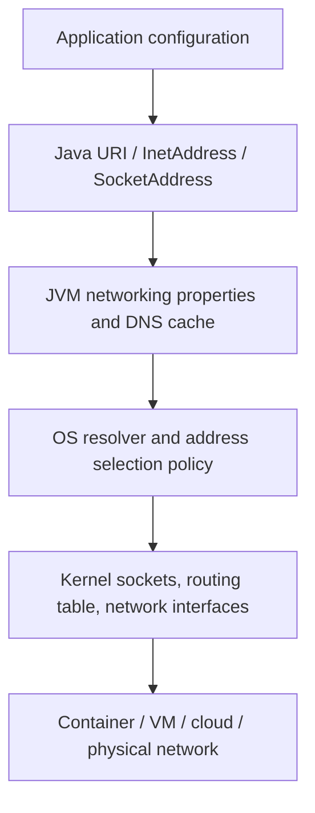
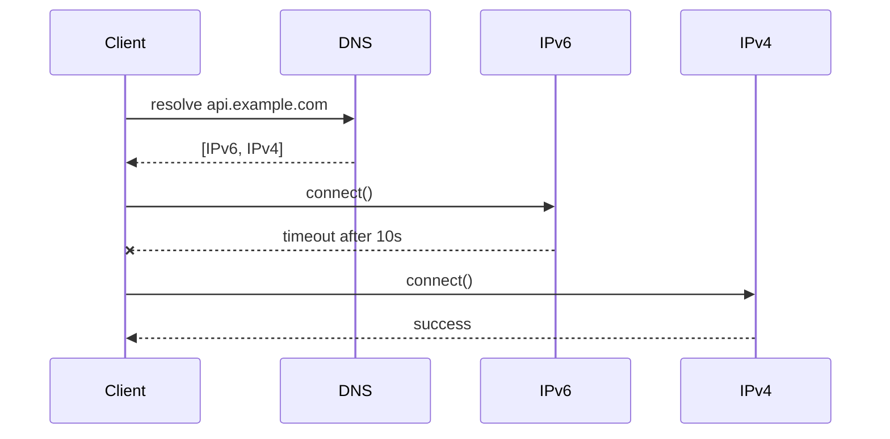
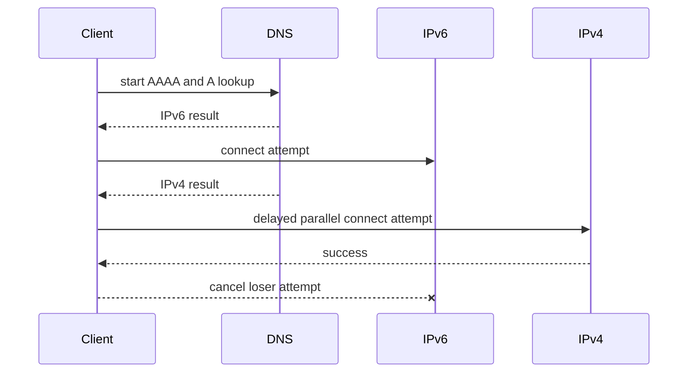
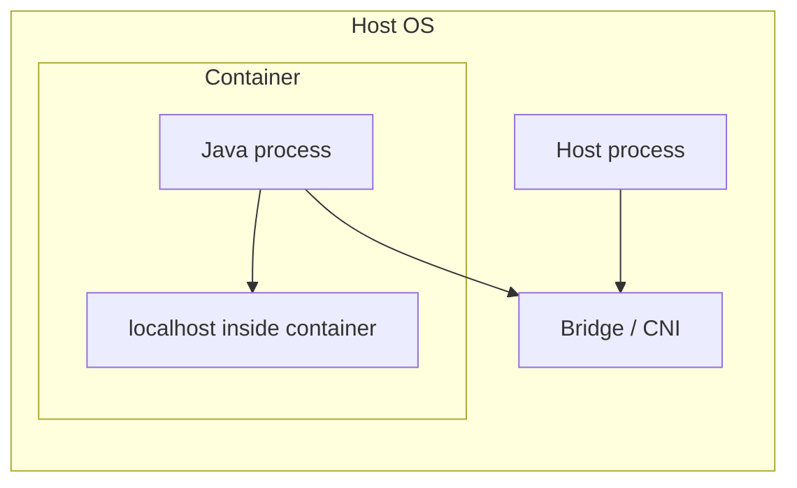
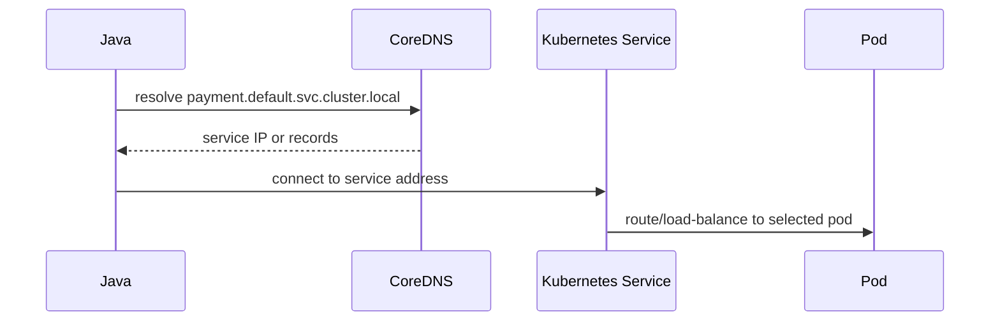

# Part 023 — IPv6, Dual Stack, Address Selection, and Network Portability

> Goal: make Java network code portable across IPv4-only, IPv6-only, dual-stack, containerized, Kubernetes, corporate, and cloud environments without hiding address-family bugs behind “works on my machine”.

This part is not about memorizing IPv6 syntax. It is about designing Java clients and servers that behave correctly when a hostname has more than one possible address, when `localhost` does not mean what the engineer assumes, when the process is inside a container, when DNS returns IPv6 first, or when the platform chooses a different socket stack than the test machine.

A top-tier Java engineer treats address family as a deployment dimension, not a trivia detail.

---

## 1. Kaufman Deconstruction

### 1.1 The skill we are building

You should be able to answer these questions from symptoms, code, and runtime configuration:

1. Why does `localhost` connect on one machine but fail on another?
2. Why does a service bind successfully but remain unreachable?
3. Why does the client try IPv6 even though the team expected IPv4?
4. Why does `0.0.0.0` not mean the same thing as a real reachable address?
5. Why does a Kubernetes service resolve differently from a local process?
6. Why does a containerized Java app see different network interfaces from the host?
7. When should you use hostname-based configuration instead of literal IPs?
8. How should you test IPv4-only, IPv6-only, and dual-stack behavior?

### 1.2 What to avoid

Do not solve every networking problem with:

```bash
-Djava.net.preferIPv4Stack=true
```

That can be a tactical workaround, but as a default architecture rule it often masks portability problems and makes the application unable to communicate with IPv6-only destinations.

### 1.3 Minimum useful theory

Java networking code is affected by four layers of address-family decision making:



The important point: Java does not control the whole decision. Java asks the platform for resolution, creates sockets, and then the kernel routes packets according to the actual network environment.

---

## 2. The Address Family Mental Model

### 2.1 IPv4 vs IPv6 at application level

IPv4 and IPv6 are different address families:

| Family | Example | Common Java type | Notes |
|---|---|---|---|
| IPv4 | `192.0.2.10` | `Inet4Address` | 32-bit address, dotted decimal. |
| IPv6 | `2001:db8::10` | `Inet6Address` | 128-bit address, colon hexadecimal, supports scope IDs for link-local addresses. |
| Hostname | `api.example.com` | `InetAddress[]` after lookup | May resolve to one, many, or zero addresses across families. |

A hostname is not an address. A hostname is a late-bound identity that may map to different addresses depending on resolver, network, time, region, VPN, service mesh, container, or DNS policy.

### 2.2 `InetAddress` is not just a string parser

`InetAddress.getByName("api.example.com")` can trigger name resolution. `InetAddress.getAllByName(...)` may return multiple addresses. The returned order matters because many clients attempt addresses in order unless they implement address racing.

A production Java app should treat DNS resolution as a potentially slow, failing, cached, environment-dependent operation.

### 2.3 Literal address vs hostname

Prefer hostname configuration for deployable services:

```properties
payment.endpoint=https://payment.internal.example
```

Avoid freezing addresses into application config unless the address is genuinely stable and owned by the deployment boundary:

```properties
# brittle
payment.endpoint=https://10.20.31.42
```

Literal IPs bypass DNS-based failover, regional steering, service discovery, and certificate hostname verification expectations.

---

## 3. Java IPv4 / IPv6 Runtime Properties

Java exposes system properties that influence address-family behavior.

| Property | Common value | Effect | Risk |
|---|---:|---|---|
| `java.net.preferIPv4Stack` | `true` / `false` | When true, prefer IPv4-only socket stack. | IPv6-only destinations become unreachable. |
| `java.net.preferIPv6Addresses` | `true` / `false` / `system` | Influences preferred address order for dual-family hosts. | Can change which endpoint is tried first. |

These properties are normally startup-level decisions. Do not assume changing them dynamically will repair already-created clients, already-resolved names, or existing sockets.

### 3.1 Decision guidance

| Situation | Recommendation |
|---|---|
| Legacy IPv4-only application with broken IPv6 environment | Consider `-Djava.net.preferIPv4Stack=true` as a temporary operational workaround. |
| Modern cloud service | Keep dual-stack capable unless there is a measured reason not to. |
| IPv6-only target environment | Test explicitly with IPv4 disabled or unavailable. |
| Corporate network with inconsistent IPv6 routing | Prefer fixing network/DNS policy; use JVM properties only as controlled mitigation. |
| Library code | Do not set global JVM networking properties. Document assumptions instead. |

### 3.2 Why global switches are dangerous

Global JVM switches affect all networking in the process:

- your client calls,
- embedded servers,
- metrics exporters,
- JDBC drivers,
- message clients,
- service discovery clients,
- license/telemetry clients,
- internal framework calls.

A networking property that fixes one dependency can break another.

---

## 4. Bind Semantics: The Most Common Server-Side Trap

Binding is not advertising.

A server bind address controls which local interfaces can accept connections. It does not tell clients what address to use.

### 4.1 Common bind addresses

| Bind address | Meaning | Client usage |
|---|---|---|
| `127.0.0.1` | IPv4 loopback only | Only same network namespace. |
| `::1` | IPv6 loopback only | Only same network namespace. |
| `localhost` | Resolver-dependent loopback name | Could resolve to IPv4, IPv6, or both. |
| `0.0.0.0` | All IPv4 interfaces | Not a valid remote destination in normal client config. |
| `::` | All IPv6 interfaces; may also accept IPv4-mapped connections depending on OS/config | Not a valid remote destination in normal client config. |
| Specific private IP | One selected interface | Reachable only if routing/firewall allows it. |

### 4.2 Wrong mental model

```java
server.bind(new InetSocketAddress("0.0.0.0", 8080));
System.out.println("Service is at http://0.0.0.0:8080"); // wrong for clients
```

`0.0.0.0` means “listen on all IPv4 interfaces”. It is not the identity clients should use. Clients need a routable address or DNS name.

### 4.3 Better startup logging

```java
try (ServerSocket server = new ServerSocket()) {
    server.bind(new InetSocketAddress("0.0.0.0", 8080));

    System.out.println("Listening on all IPv4 interfaces, port 8080");
    for (NetworkInterface nif : java.util.Collections.list(NetworkInterface.getNetworkInterfaces())) {
        if (!nif.isUp() || nif.isLoopback()) continue;
        for (InetAddress address : java.util.Collections.list(nif.getInetAddresses())) {
            System.out.printf("Candidate address: %s on %s%n", address.getHostAddress(), nif.getName());
        }
    }
}
```

The log says “candidate address”, not “official service URL”. In real systems, the service URL should come from deployment metadata: Kubernetes Service, ingress, load balancer, DNS, service registry, or runtime config.

---

## 5. `localhost` Is Not a Deployment Contract

### 5.1 The trap

On one machine:

```text
localhost -> 127.0.0.1
```

On another:

```text
localhost -> ::1, 127.0.0.1
```

A server bound only to `127.0.0.1` may not accept a client that tries `::1` first.

### 5.2 Reproducible test

```java
import java.net.*;
import java.util.Arrays;

public class LocalhostResolution {
    public static void main(String[] args) throws Exception {
        InetAddress[] addresses = InetAddress.getAllByName("localhost");
        Arrays.stream(addresses)
                .forEach(a -> System.out.printf("%s -> %s (%s)%n",
                        a.getHostName(),
                        a.getHostAddress(),
                        a.getClass().getSimpleName()));
    }
}
```

### 5.3 Better local configuration

For tests, be explicit:

| Goal | Use |
|---|---|
| IPv4 loopback only | `127.0.0.1` |
| IPv6 loopback only | `[::1]` in URI, `::1` as address |
| Name-resolution behavior test | `localhost` |
| Container-to-host test | host-specific mechanism, not blindly `localhost` |

### 5.4 URI syntax for IPv6

IPv6 literal addresses in URIs require brackets:

```text
http://[::1]:8080/health
http://[2001:db8::10]:8443/api
```

Without brackets, the colon separators conflict with URI port syntax.

---

## 6. Dual-Stack Client Behavior

A dual-stack hostname can produce both A and AAAA records:

```text
api.example.com.  A     198.51.100.10
api.example.com.  AAAA  2001:db8::10
```

A robust client must consider:

1. DNS query timing,
2. returned address order,
3. address-family preference,
4. connect timeout per attempt,
5. fallback behavior,
6. cancellation of loser connection attempts,
7. metrics by address family.

### 6.1 Sequential connect problem

Naive strategy:



The application appears slow even though IPv4 was healthy.

### 6.2 Happy Eyeballs mental model

Happy Eyeballs reduces user-visible delay by querying/ordering address families and racing connection attempts carefully.



Do not implement ad-hoc connection racing unless you have a strong reason. Prefer platform/client behavior where available. If you build a custom low-level client, model this explicitly.

### 6.3 Metrics you need

For dual-stack production clients, record:

| Metric | Why it matters |
|---|---|
| DNS duration by hostname | Distinguishes resolver delay from connect delay. |
| Resolved address count | Reveals missing A/AAAA records. |
| Selected address family | Shows IPv4 vs IPv6 usage. |
| Connect duration by address family | Finds broken IPv6 routing or slow fallback. |
| Connect failure reason | Separates timeout, refused, unreachable, reset. |
| Final remote address | Helps correlate with load balancer or service endpoint. |

---

## 7. Server Portability Across Address Families

### 7.1 Binding strategy matrix

| Requirement | Bind strategy | Notes |
|---|---|---|
| Local dev only, IPv4 | `127.0.0.1` | Simple and explicit. |
| Local dev only, IPv6 | `::1` | Good IPv6 test. |
| Container service | Usually `0.0.0.0` or `::` | Container runtime handles publication. |
| Kubernetes pod server | Usually all interfaces | Service object selects pods; app should not bind only loopback. |
| Host-level daemon | Specific interface or all interfaces | Security/firewall requirement decides. |
| Sensitive admin endpoint | Loopback or private interface | Never assume firewall is enough. |

### 7.2 Dual-stack bind caveat

Binding to IPv6 wildcard `::` may or may not also accept IPv4 connections depending on operating system and socket configuration. Do not rely on unspecified cross-platform behavior. Test the exact deployment OS/container base image.

### 7.3 Explicit multiple listeners

For highly portable low-level servers, you may run separate listeners:

```java
try (ServerSocket ipv4 = new ServerSocket()) {
    ipv4.bind(new InetSocketAddress(InetAddress.getByName("0.0.0.0"), 8080));
    // accept loop omitted
}
```

and separately:

```java
try (ServerSocket ipv6 = new ServerSocket()) {
    ipv6.bind(new InetSocketAddress(InetAddress.getByName("::"), 8080));
    // accept loop omitted
}
```

However, this can fail if the platform treats one bind as covering both families. Production frameworks often encapsulate these details; when writing raw socket servers, verify on Linux, macOS, and Windows if portability matters.

---

## 8. Network Interfaces in Java

`NetworkInterface` exposes local interface metadata. It is useful for diagnostics, but dangerous as business logic.

```java
import java.net.*;
import java.util.Collections;

public class InterfacesDump {
    public static void main(String[] args) throws Exception {
        for (NetworkInterface nif : Collections.list(NetworkInterface.getNetworkInterfaces())) {
            System.out.printf("%s display=%s up=%s loopback=%s virtual=%s mtu=%d%n",
                    nif.getName(),
                    nif.getDisplayName(),
                    nif.isUp(),
                    nif.isLoopback(),
                    nif.isVirtual(),
                    nif.getMTU());

            for (InetAddress address : Collections.list(nif.getInetAddresses())) {
                System.out.printf("  %s %s%n",
                        address.getClass().getSimpleName(),
                        address.getHostAddress());
            }
        }
    }
}
```

### 8.1 Do not infer public identity from local interfaces

A machine can have:

- private VPC addresses,
- pod addresses,
- loopback addresses,
- link-local IPv6 addresses,
- Docker bridge addresses,
- VPN addresses,
- temporary IPv6 privacy addresses,
- multiple NICs,
- NAT in front of it,
- load balancer in front of it.

Local interface enumeration does not tell you the URL clients should use.

### 8.2 Safe uses

Use `NetworkInterface` for:

- diagnostics,
- binding to a known interface,
- multicast interface selection,
- health/debug endpoints,
- startup sanity checks,
- failure reports.

Avoid using it to construct externally visible service URLs unless your deployment model explicitly guarantees that mapping.

---

## 9. Containers Change the Meaning of Localhost

Inside a container, `localhost` means the container network namespace, not the host machine.



If a Java process inside a container calls `http://localhost:5432`, it is looking for port `5432` inside the same container unless special host networking is configured.

### 9.1 Container checklist

| Check | Why |
|---|---|
| Does the server bind to `0.0.0.0`, not just `127.0.0.1`? | Required for container port publication. |
| Is the port exposed/published/mapped? | Binding inside container is not enough. |
| Is the client using service DNS, not container-local `localhost`? | Avoid accidental self-calls. |
| Is IPv6 enabled in the container network? | Host IPv6 support does not imply container IPv6 support. |
| Are health checks using the same path and address family as real traffic? | Avoid false positives. |

### 9.2 Anti-pattern

```properties
# inside container; usually wrong for another service
inventory.url=http://localhost:8081
```

Better:

```properties
inventory.url=http://inventory-service:8081
```

Then let the orchestrator/service discovery layer resolve `inventory-service`.

---

## 10. Kubernetes and Service DNS

In Kubernetes, a pod usually should call another service by DNS name, not pod IP:

```properties
payment.url=http://payment.default.svc.cluster.local:8080
```

or shorter inside the same namespace:

```properties
payment.url=http://payment:8080
```

### 10.1 What Java sees

Java sees a hostname. It does not know that the name came from Kubernetes unless your code or platform integration tells it.



The application should not assume that a DNS result is a permanent instance identity. Kubernetes service routing and endpoint membership can change.

### 10.2 Kubernetes-specific traps

| Trap | Symptom | Fix direction |
|---|---|---|
| App binds to `127.0.0.1` | Service cannot reach pod. | Bind to all pod interfaces unless intentionally local-only. |
| Client uses pod IP | Breaks on reschedule. | Use service DNS. |
| Long JVM DNS cache | Client keeps stale address. | Align JVM DNS caching with service discovery strategy. |
| IPv4-only assumptions | Dual-stack cluster behaves differently. | Test address family explicitly. |
| Readiness not tied to listener | Pod receives traffic before socket is ready. | Health check should validate listener readiness. |

---

## 11. Link-Local IPv6 and Scope IDs

IPv6 link-local addresses often look like:

```text
fe80::1%en0
fe80::a00:27ff:fe4e:66a1%eth0
```

The suffix after `%` is the scope/interface identifier. Link-local addresses are only meaningful on a specific link. A raw `fe80::...` address without scope may be ambiguous.

### 11.1 Java implications

`Inet6Address` can carry scope information. If you work with link-local addresses, you need to know which interface applies. This is common in low-level tools, diagnostics, multicast, local network discovery, and embedded environments. It is uncommon for normal enterprise service-to-service calls.

### 11.2 Rule

Do not use link-local IPv6 addresses as normal service configuration unless you fully control the interface and routing context.

---

## 12. URI, Certificate, and Hostname Verification Interactions

Literal IPs can break TLS expectations.

Example:

```text
https://10.20.31.42:8443
```

If the server certificate is issued for `api.internal.example`, hostname verification can fail unless the certificate also contains the IP address as a subject alternative name.

Better:

```text
https://api.internal.example:8443
```

### 12.1 Why this belongs in networking

This is not “just TLS”. Address choice changes:

- DNS behavior,
- SNI value,
- certificate hostname verification,
- proxy routing,
- load-balancer routing,
- service-mesh policy,
- logging and metrics labels.

Network identity is a cross-layer concern.

---

## 13. Client-Side Address Selection Patterns

### 13.1 Pattern: Let the platform/client decide

For normal HTTP clients:

```java
HttpClient client = HttpClient.newBuilder()
        .connectTimeout(java.time.Duration.ofSeconds(2))
        .build();

HttpRequest request = HttpRequest.newBuilder()
        .uri(URI.create("https://api.internal.example/v1/health"))
        .timeout(java.time.Duration.ofSeconds(5))
        .GET()
        .build();
```

This keeps hostname resolution and connection establishment inside the client implementation.

### 13.2 Pattern: Explicitly test all resolved addresses

For diagnostics:

```java
import java.net.*;
import java.util.Arrays;

public class ResolveDiagnostic {
    public static void main(String[] args) throws Exception {
        String host = args.length > 0 ? args[0] : "example.com";
        InetAddress[] addresses = InetAddress.getAllByName(host);

        Arrays.stream(addresses).forEach(a -> System.out.printf(
                "host=%s address=%s type=%s reachableHint=%s%n",
                host,
                a.getHostAddress(),
                a.getClass().getSimpleName(),
                a.isAnyLocalAddress() ? "any-local" :
                a.isLoopbackAddress() ? "loopback" :
                a.isLinkLocalAddress() ? "link-local" :
                a.isSiteLocalAddress() ? "site-local" : "global-or-other"
        ));
    }
}
```

Do not use `isReachable()` as a reliable business health check. It may depend on ICMP permissions, TCP echo behavior, firewall policy, and OS support.

### 13.3 Pattern: Validate endpoint configuration before use

```java
import java.net.*;
import java.util.List;

public final class EndpointPolicy {
    public static URI requireServiceUri(String raw) {
        URI uri = URI.create(raw);
        if (uri.getScheme() == null || uri.getHost() == null) {
            throw new IllegalArgumentException("Endpoint must include scheme and host: " + raw);
        }
        if (uri.getHost().equals("0.0.0.0") || uri.getHost().equals("::")) {
            throw new IllegalArgumentException("Wildcard bind address is not a valid remote endpoint: " + raw);
        }
        return uri;
    }

    public static void rejectLoopbackForProduction(URI uri, boolean production) {
        if (!production) return;
        String host = uri.getHost();
        if (host == null) return;
        if (host.equals("localhost") || host.equals("127.0.0.1") || host.equals("::1")) {
            throw new IllegalArgumentException("Loopback endpoint is not allowed in production: " + uri);
        }
    }
}
```

This is not a full SSRF defense. That comes later. Here the goal is to stop obvious portability mistakes.

---

## 14. Failure Taxonomy: IPv6 and Dual-Stack

| Symptom | Likely cause | Diagnostic |
|---|---|---|
| `Connection refused` to `localhost` | Client tried address family where server is not listening. | Resolve `localhost`; inspect server bind. |
| Long connect delay then success | Broken first address family fallback. | Log resolved addresses and connect timings. |
| Works on host, fails in container | Different network namespace or bind address. | Exec into container and test from there. |
| Works by IP, fails by hostname | DNS, proxy, TLS SNI, or certificate mismatch. | Compare resolution, request logs, TLS debug. |
| Works by hostname, fails by IP | Certificate SAN/SNI/load-balancer route depends on hostname. | Check TLS cert and LB routing policy. |
| IPv6 address logged with `%eth0` | Link-local scoped address. | Check whether service config wrongly uses link-local. |
| Service reachable locally but not externally | Bound to loopback or firewall/security group blocks. | Inspect bind address, listening sockets, security rules. |
| Only some pods fail | Pod DNS cache, node routing, CNI, or endpoint skew. | Compare pod node, DNS result, route, address family. |

---

## 15. Testing Strategy for Portability

### 15.1 Test matrix

| Environment | What to verify |
|---|---|
| IPv4-only | App does not require IPv6 records or IPv6 bind. |
| IPv6-only | App does not hard-code IPv4 literals. |
| Dual-stack IPv4-preferred | App remains correct with IPv4 first. |
| Dual-stack IPv6-preferred | App remains correct with IPv6 first. |
| Container bridge network | `localhost` assumptions are caught. |
| Kubernetes service DNS | DNS caching and endpoint changes are acceptable. |
| Corporate proxy/VPN | Address selection and proxy bypass rules are not contradictory. |

### 15.2 Unit tests are not enough

Address-family bugs are environment bugs. You need:

- unit tests for endpoint parsing,
- integration tests for bind/connect behavior,
- container tests for namespace behavior,
- deployment tests for service DNS,
- smoke tests for IPv4 and IPv6 endpoints,
- metrics in production by remote address family.

### 15.3 A minimal dual-stack smoke script

```bash
# Resolve both families if available
getent ahosts api.internal.example || true

# Force IPv4 with curl
curl -4 -v --connect-timeout 2 https://api.internal.example/health

# Force IPv6 with curl
curl -6 -v --connect-timeout 2 https://api.internal.example/health
```

For Java-specific diagnostics, run a small resolver and connector utility using the same JDK, container image, JVM flags, truststore, proxy config, and DNS environment as production.

---

## 16. Architecture Rules

### Rule 1 — Separate bind address from advertised address

Server config should distinguish:

```properties
server.bind-address=0.0.0.0
server.port=8080
service.public-url=https://orders.internal.example
```

Do not reuse bind address as client-facing URL.

### Rule 2 — Prefer DNS names for services

DNS names preserve service identity, load-balancing, TLS verification, routing policy, and operational flexibility.

### Rule 3 — Log resolved address family only at boundaries

Log enough to debug, but do not explode cardinality in metrics. Use labels like `address_family=ipv4|ipv6|unknown`, and put exact IPs in debug logs or sampled structured events.

### Rule 4 — Do not set global JVM networking properties in libraries

Application owners decide process-wide networking policy. Libraries should not mutate global behavior.

### Rule 5 — Treat IPv6 as normal, not exotic

Even if your current production is IPv4-only, code that assumes dotted decimal strings will eventually break in containers, cloud, VPNs, or future migrations.

---

## 17. Anti-Patterns

### 17.1 String-based IP validation

Bad:

```java
boolean isIp = host.matches("\\d+\\.\\d+\\.\\d+\\.\\d+");
```

This ignores IPv6, bracketed URI syntax, IDNs, hostnames, DNS rebinding, and numeric edge cases.

### 17.2 Replacing DNS with static IPs to “fix reliability”

This often disables:

- failover,
- load balancing,
- region steering,
- certificate verification,
- service discovery,
- blue/green rollout control.

### 17.3 Binding admin endpoints to all interfaces by accident

```properties
management.server.address=0.0.0.0
```

This may expose sensitive endpoints unless network policy protects them. Prefer loopback/private interface plus explicit ingress rules.

### 17.4 Assuming container and host have the same interfaces

They do not. Network namespace is part of your runtime environment.

---

## 18. Deep-Dive Example: Diagnosing a Localhost Bug

### 18.1 Symptom

A test starts a server:

```java
server.bind(new InetSocketAddress("127.0.0.1", 9090));
```

Then the client calls:

```java
URI.create("http://localhost:9090/test")
```

It passes on CI worker A and fails on CI worker B.

### 18.2 Hypothesis

On worker B, `localhost` resolves to `::1` first. The server is bound only to IPv4 loopback.

### 18.3 Verification

Print:

```java
System.out.println(Arrays.toString(InetAddress.getAllByName("localhost")));
```

Inspect listening socket:

```bash
ss -ltnp | grep 9090
```

### 18.4 Fix options

| Fix | Good when |
|---|---|
| Use `127.0.0.1` in client test too | Test is IPv4-specific. |
| Bind server to `localhost` and use actual bound address | Test should follow resolver behavior. |
| Run separate IPv4/IPv6 tests | You want explicit portability coverage. |
| Bind dual-stack/all interfaces | Integration test simulates service behavior, with security controls. |

### 18.5 Best test pattern

Let the OS allocate the port, then pass the actual host explicitly:

```java
ServerSocket server = new ServerSocket();
server.bind(new InetSocketAddress(InetAddress.getByName("127.0.0.1"), 0));
int port = server.getLocalPort();
URI uri = URI.create("http://127.0.0.1:" + port + "/test");
```

Do not hard-code ports in tests unless there is a reason.

---

## 19. Code Review Checklist

Use this checklist when reviewing Java networking code.

### 19.1 Client config

- [ ] Uses hostname rather than hard-coded IP where service identity matters.
- [ ] Does not use `0.0.0.0` or `::` as a remote endpoint.
- [ ] Handles bracketed IPv6 URI syntax correctly.
- [ ] Has explicit connect/request timeout.
- [ ] Logs address family and failure phase at boundary.
- [ ] Does not assume `localhost` means IPv4.
- [ ] Does not set global JVM networking properties from library code.

### 19.2 Server config

- [ ] Bind address is separate from advertised/public URL.
- [ ] Loopback bind is intentional.
- [ ] Container/Kubernetes bind is reachable through service routing.
- [ ] Admin endpoint exposure is intentional.
- [ ] Startup logs show bound address and port clearly.
- [ ] Readiness check validates the real listener.

### 19.3 Deployment

- [ ] IPv4-only and IPv6-only assumptions are documented.
- [ ] DNS caching strategy matches service-discovery behavior.
- [ ] TLS certificate names match configured hostnames.
- [ ] Proxy/no-proxy policy handles IPv4, IPv6, and hostnames.
- [ ] Smoke tests run from the same network namespace as the app.

---

## 20. Deliberate Practice

### Drill 1 — Localhost matrix

Write a test program that:

1. starts a server bound to `127.0.0.1`,
2. starts a server bound to `::1`,
3. resolves `localhost`,
4. attempts client connections to `localhost`, `127.0.0.1`, and `[::1]`,
5. records which combinations succeed.

Explain every result using address family and bind semantics.

### Drill 2 — Container namespace proof

Run a Java HTTP server in a container. Test these from inside and outside the container:

- server bound to `127.0.0.1`,
- server bound to `0.0.0.0`,
- client using `localhost`,
- client using service/container name,
- client using published host port.

Create a table of outcomes.

### Drill 3 — DNS order sensitivity

Create a diagnostic client that prints all resolved addresses and attempts connection to each address with a short timeout. Run it against:

- a public dual-stack domain,
- an internal service name,
- `localhost`,
- a Kubernetes service if available.

### Drill 4 — Review real config

Pick one production service and classify every network endpoint config as:

- bind address,
- advertised address,
- upstream dependency,
- proxy endpoint,
- callback URL,
- health-check URL.

Find at least one ambiguous config key and rename it.

---

## 21. Summary

IPv6 and dual-stack support are not separate features bolted onto networking. They affect DNS lookup, address ordering, socket creation, bind semantics, TLS verification, proxy behavior, containers, Kubernetes, and diagnostics.

The high-value invariants are:

1. hostname is not address;
2. bind address is not advertised address;
3. `localhost` is resolver- and namespace-dependent;
4. wildcard bind addresses are not client destinations;
5. dual-stack clients need observability by address family;
6. JVM-wide networking properties are operational policy, not library behavior;
7. portability must be tested in environments, not only unit tests.

The next part builds on this by classifying network failures and turning timeout/retry behavior into explicit engineering policy instead of scattered constants.

---

## References

- Java Networking Properties: `java.net.preferIPv4Stack`, `java.net.preferIPv6Addresses`, proxy properties — https://docs.oracle.com/en/java/javase/17/docs/api/java.base/java/net/doc-files/net-properties.html
- Java `InetAddress` API — https://docs.oracle.com/en/java/javase/25/docs/api/java.base/java/net/InetAddress.html
- Java `NetworkInterface` API — https://docs.oracle.com/en/java/javase/25/docs/api/java.base/java/net/NetworkInterface.html
- RFC 8305: Happy Eyeballs Version 2 — https://datatracker.ietf.org/doc/html/rfc8305
