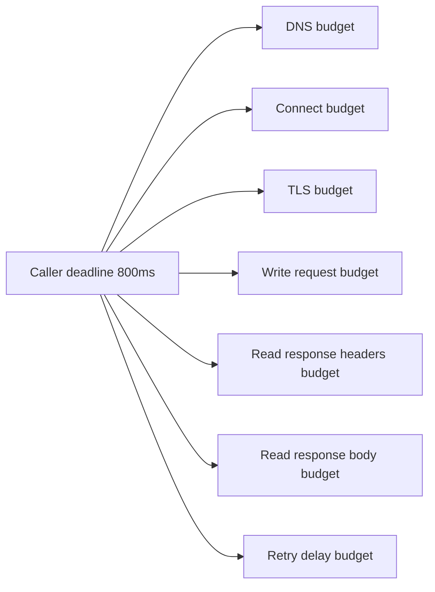
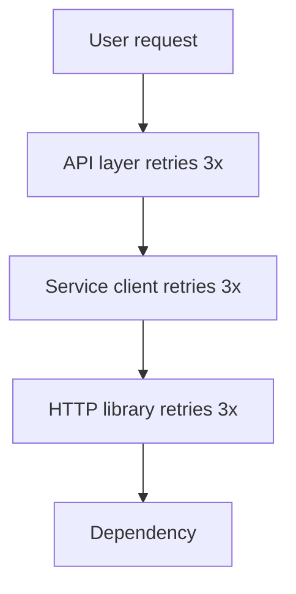
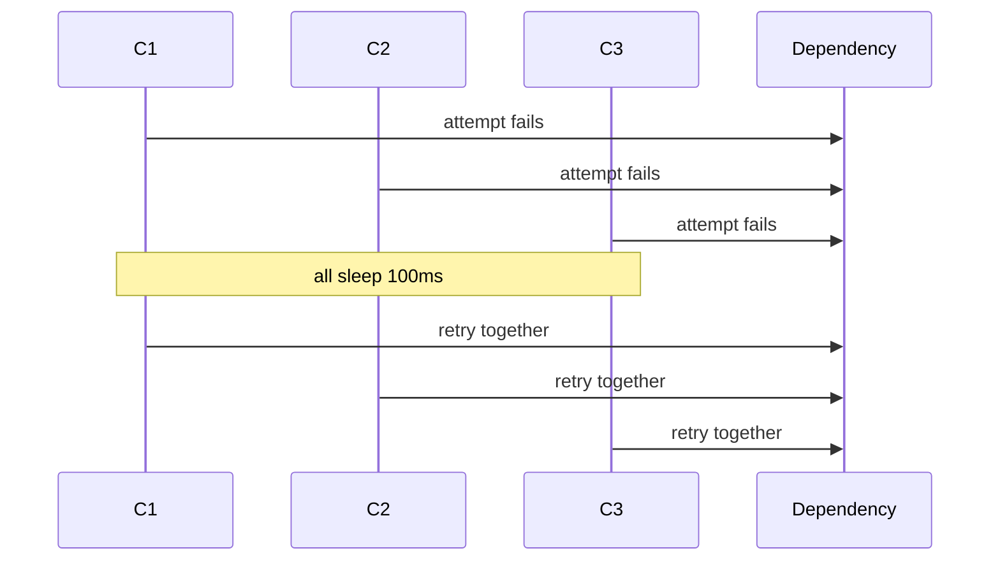
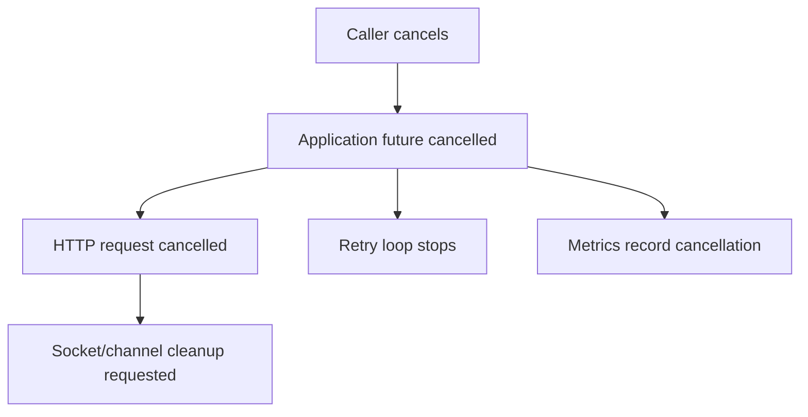
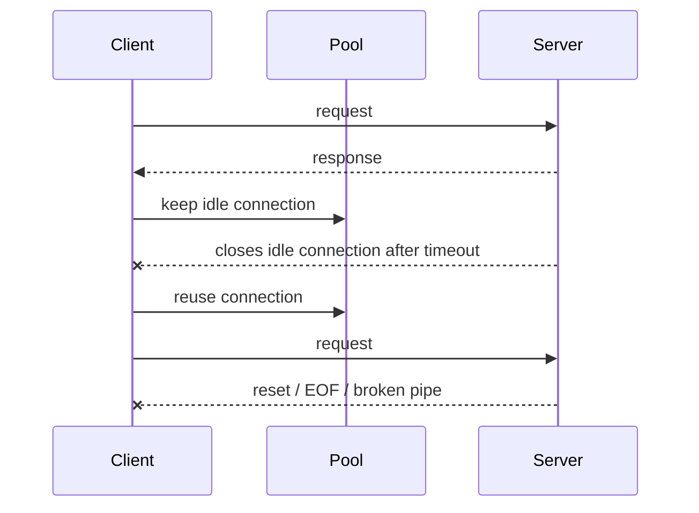

# Part 024 — Timeouts, Deadlines, Retries, and Network Failure Taxonomy

> Goal: design Java network clients that fail predictably, retry safely, preserve caller deadlines, avoid retry storms, and produce enough diagnostics to classify failures without guessing.

Most production network incidents are not caused by a single missing timeout. They are caused by a mismatched timeout model:

- connect timeout exists, but request timeout does not;
- request timeout exists, but response body streaming is unbounded;
- retries ignore idempotency;
- each layer retries independently;
- cancellation does not propagate;
- DNS and TLS are not measured separately;
- stale pooled connections turn into bursts of user-visible failures;
- a slow dependency causes thread, connection, and queue exhaustion upstream.

This part builds a rigorous model.

---

## 1. Kaufman Deconstruction

### 1.1 The skill we are building

You should be able to design and review network calls with explicit answers to:

1. What is the maximum time the caller is willing to wait?
2. Which phases are included in that time?
3. Can the operation be retried safely?
4. Who owns cancellation?
5. How many attempts are allowed?
6. How is retry delay calculated?
7. How is the remaining deadline propagated downstream?
8. What metrics prove which phase failed?
9. What happens when the dependency is slow, blackholed, overloaded, or partially failing?
10. What is the worst-case amplification under retry?

### 1.2 The core invariant

A network call must have one controlling deadline, and every sub-operation must fit inside it.



Without a controlling deadline, per-phase timeouts can add up to a user-visible latency far beyond the caller's intention.

---

## 2. Network Failure Taxonomy

### 2.1 Failure phases

Classify failures by phase, not just exception class.

| Phase | Examples | Typical symptoms |
|---|---|---|
| Configuration | Invalid URI, bad port, missing proxy, wrong truststore | Immediate failure before network I/O. |
| Resolution | DNS timeout, NXDOMAIN, stale cache, no A/AAAA record | Cannot map name to address. |
| Address selection | Broken IPv6 first, wrong route, proxy bypass mistake | Slow fallback or unreachable first address. |
| Connect | Timeout, refused, unreachable, ephemeral port exhaustion | No TCP connection established. |
| TLS | Certificate path failure, hostname mismatch, protocol/cipher mismatch | HTTPS fails after TCP connect. |
| Request write | Broken pipe, reset while sending, slow upload | Request may be partially sent. |
| Response wait | Server slow, queueing, no response headers | Ambiguous whether server received request. |
| Response body | Slow stream, truncated body, decompression failure | Status may be known, payload incomplete. |
| Pool reuse | Stale idle connection, server closed keepalive | First request after idle fails. |
| Cancellation | Caller interrupt, timeout cancellation, future cancelled | Work may still be in flight briefly. |
| Protocol | Malformed response, HTTP/2 stream reset, frame error | Transport exists but protocol state failed. |

### 2.2 Why exception class alone is insufficient

`IOException` can represent many different failure phases. `SocketTimeoutException` can mean read timeout on a connected socket, not necessarily connect timeout. `ConnectException` can mean the remote actively refused. `SSLHandshakeException` may be certificate, protocol, trust, or hostname-related.

Good client code wraps low-level exceptions in domain-specific failure metadata:

```java
public enum NetworkPhase {
    CONFIGURATION,
    DNS,
    CONNECT,
    TLS_HANDSHAKE,
    REQUEST_WRITE,
    RESPONSE_HEADERS,
    RESPONSE_BODY,
    POOL_REUSE,
    CANCELLATION,
    PROTOCOL
}

public record NetworkFailure(
        NetworkPhase phase,
        String dependency,
        String method,
        URI uri,
        int attempt,
        Duration elapsed,
        boolean retryable,
        Throwable cause
) {}
```

Do not throw away phase information at the boundary.

---

## 3. Timeout Types

### 3.1 Timeout vocabulary

| Timeout | Meaning | Common Java mechanism |
|---|---|---|
| Connect timeout | Maximum time to establish TCP connection. | `Socket.connect(address, timeout)`, `HttpClient.Builder.connectTimeout(...)`. |
| Read timeout / SO timeout | Maximum blocking wait for socket read. | `Socket.setSoTimeout(...)`. |
| Request timeout | Maximum time for a logical HTTP request. | `HttpRequest.Builder.timeout(...)`. |
| Pool acquisition timeout | Maximum wait for a reusable connection slot. | Library/framework-specific. |
| Write timeout | Maximum time to write request bytes. | Often custom or library-specific. |
| Idle timeout | Maximum idle time before closing connection. | Server/client/library-specific. |
| Absolute deadline | Latest allowed completion time for whole operation. | Usually custom application policy. |

### 3.2 Timeout is not cancellation unless implemented

A timeout is a decision point. It must be paired with cancellation/resource cleanup.

For blocking socket code, closing the socket is often how another thread unblocks a pending read/write. For `HttpClient.send(...)`, interruption attempts to cancel the exchange, but exact timing is not guaranteed. For `sendAsync(...)`, cancelling the returned future requests cancellation, but underlying cleanup may happen asynchronously.

### 3.3 Connect timeout is necessary but insufficient

```java
HttpClient client = HttpClient.newBuilder()
        .connectTimeout(Duration.ofMillis(300))
        .build();
```

This limits connection establishment. It does not by itself define the total operation budget for DNS, TLS, request transmission, server processing, and response body consumption in every possible case.

Add request timeout:

```java
HttpRequest request = HttpRequest.newBuilder()
        .uri(URI.create("https://risk.internal.example/v1/score"))
        .timeout(Duration.ofMillis(800))
        .POST(HttpRequest.BodyPublishers.ofString("{}"))
        .build();
```

For streaming bodies, still decide whether the timeout must include complete body consumption, first byte, or only headers. Your user-facing SLA decides the answer.

---

## 4. Deadlines vs Timeouts

### 4.1 Relative timeout

A relative timeout says:

```text
this operation may take 500ms from now
```

If every layer adds its own relative timeout, total latency can explode.

### 4.2 Absolute deadline

An absolute deadline says:

```text
this request must finish by 10:15:30.800
```

Every downstream call computes remaining time from the same deadline.

```java
public final class Deadline {
    private final long deadlineNanos;

    private Deadline(long deadlineNanos) {
        this.deadlineNanos = deadlineNanos;
    }

    public static Deadline after(Duration duration) {
        return new Deadline(System.nanoTime() + duration.toNanos());
    }

    public Duration remaining() {
        long remaining = deadlineNanos - System.nanoTime();
        return remaining <= 0 ? Duration.ZERO : Duration.ofNanos(remaining);
    }

    public boolean expired() {
        return remaining().isZero();
    }

    public Duration cap(Duration max) {
        Duration remaining = remaining();
        return remaining.compareTo(max) < 0 ? remaining : max;
    }
}
```

Use `System.nanoTime()` for elapsed/deadline measurement inside a process. Do not use wall-clock time for elapsed duration logic.

### 4.3 Budget slicing

Example policy:

```java
public record NetworkBudget(
        Duration total,
        Duration connectCap,
        Duration perAttemptCap,
        Duration maxBackoff
) {
    public static NetworkBudget paymentRead() {
        return new NetworkBudget(
                Duration.ofMillis(900),
                Duration.ofMillis(200),
                Duration.ofMillis(450),
                Duration.ofMillis(100)
        );
    }
}
```

This does not mean every call takes 900ms. It means all attempts, delays, and cleanup must respect a 900ms ceiling.

---

## 5. Retry Eligibility

### 5.1 Retry is a semantic decision

A retry is not safe just because an exception occurred. A retry is safe when the operation semantics allow it.

| Operation | Usually retryable? | Reason |
|---|---:|---|
| `GET /resource` | Often yes | Should be safe if server obeys HTTP semantics. |
| `PUT /resource/{id}` | Often yes | Idempotent if same representation and same ID. |
| `DELETE /resource/{id}` | Often yes | Idempotent semantics, but side effects/logging may matter. |
| `POST /payments` | Usually no without idempotency key | Could create duplicate payment. |
| `POST /payments` with idempotency key | Often yes | Server can deduplicate. |
| Streaming upload | Usually risky | Partial write ambiguity. |
| Non-idempotent RPC | Usually no | Duplicate execution risk. |

### 5.2 Failure phase affects retryability

| Failure phase | Retry implication |
|---|---|
| DNS failure | Retry may help if transient, but aggressive retries amplify resolver load. |
| Connect timeout | Often retryable if operation not sent. |
| Connection refused | Retry only if service may be starting or LB endpoint stale. |
| TLS certificate failure | Usually not retryable until config/cert changes. |
| Write failure before any bytes | Maybe retryable. |
| Write failure after partial bytes | Ambiguous; retry only with idempotency guarantees. |
| No response headers | Ambiguous; server may have processed request. |
| HTTP 429 | Retry according to `Retry-After` and quota policy. |
| HTTP 503 | Retry if dependency policy allows and budget remains. |
| HTTP 400/401/403/404 | Usually not retryable without input/auth change. |
| HTTP/2 stream reset | Depends on reset reason and method semantics. |

### 5.3 Idempotency keys

For operations that create state, use idempotency keys when the server supports them:

```java
HttpRequest request = HttpRequest.newBuilder()
        .uri(URI.create("https://payments.internal.example/v1/payments"))
        .header("Idempotency-Key", paymentCommandId.toString())
        .timeout(deadline.remaining())
        .POST(HttpRequest.BodyPublishers.ofString(json))
        .build();
```

The client key is only half the solution. The server must persist and enforce deduplication correctly.

---

## 6. Retry Storms and Amplification

### 6.1 Multiplicative retry problem

If three layers each retry three times, one user request can become:

```text
3 x 3 x 3 = 27 dependency attempts
```



This is how a small brownout becomes a self-inflicted outage.

### 6.2 Retry budget rule

Retries must be bounded by:

1. total deadline,
2. maximum attempts,
3. global retry budget or token bucket,
4. dependency-specific policy,
5. idempotency semantics,
6. concurrency/bulkhead limits.

### 6.3 Example retry policy

```java
public record RetryPolicy(
        int maxAttempts,
        Duration initialBackoff,
        Duration maxBackoff,
        double jitterRatio
) {
    public static RetryPolicy conservative() {
        return new RetryPolicy(2, Duration.ofMillis(50), Duration.ofMillis(150), 0.2);
    }
}
```

Two attempts total often outperform large retry counts under load because they reduce tail amplification.

---

## 7. Backoff and Jitter

### 7.1 Why fixed delay is dangerous

If all clients retry after exactly 100ms, they synchronize:



Jitter spreads retries over time.

### 7.2 Simple jittered backoff

```java
import java.time.Duration;
import java.util.concurrent.ThreadLocalRandom;

public final class Backoff {
    public static Duration exponentialJitter(
            Duration initial,
            Duration max,
            int attemptIndex,
            double jitterRatio
    ) {
        long baseMillis = initial.toMillis() * (1L << Math.min(attemptIndex, 10));
        long capped = Math.min(baseMillis, max.toMillis());
        long jitter = Math.round(capped * jitterRatio);
        long min = Math.max(0, capped - jitter);
        long upperExclusive = capped + jitter + 1;
        long chosen = ThreadLocalRandom.current().nextLong(min, upperExclusive);
        return Duration.ofMillis(chosen);
    }
}
```

In real systems, prefer a well-tested resilience library when available. The important skill is knowing which policy you are implementing and why.

---

## 8. A Deadline-Aware HTTP Client Wrapper

This example demonstrates policy shape, not a complete SDK.

```java
import java.io.IOException;
import java.net.URI;
import java.net.http.*;
import java.time.Duration;

public final class DeadlineHttpClient {
    private final HttpClient client;
    private final RetryPolicy retryPolicy;

    public DeadlineHttpClient(HttpClient client, RetryPolicy retryPolicy) {
        this.client = client;
        this.retryPolicy = retryPolicy;
    }

    public HttpResponse<String> get(URI uri, Deadline deadline)
            throws IOException, InterruptedException {
        IOException lastIo = null;
        InterruptedException lastInterrupted = null;

        for (int attempt = 1; attempt <= retryPolicy.maxAttempts(); attempt++) {
            Duration remaining = deadline.remaining();
            if (remaining.isZero()) {
                throw new IOException("Deadline expired before attempt " + attempt, lastIo);
            }

            HttpRequest request = HttpRequest.newBuilder()
                    .uri(uri)
                    .timeout(remaining)
                    .GET()
                    .build();

            long started = System.nanoTime();
            try {
                HttpResponse<String> response = client.send(request, HttpResponse.BodyHandlers.ofString());
                if (!shouldRetryStatus(response.statusCode()) || attempt == retryPolicy.maxAttempts()) {
                    return response;
                }
            } catch (InterruptedException e) {
                Thread.currentThread().interrupt();
                lastInterrupted = e;
                throw e;
            } catch (IOException e) {
                lastIo = e;
                if (attempt == retryPolicy.maxAttempts() || !isRetryableIOException(e)) {
                    throw e;
                }
            }

            Duration elapsed = Duration.ofNanos(System.nanoTime() - started);
            Duration delay = Backoff.exponentialJitter(
                    retryPolicy.initialBackoff(),
                    retryPolicy.maxBackoff(),
                    attempt - 1,
                    retryPolicy.jitterRatio()
            );

            if (deadline.remaining().compareTo(delay) <= 0) {
                throw new IOException("Deadline expired after attempt " + attempt + ", elapsed=" + elapsed, lastIo);
            }

            Thread.sleep(delay.toMillis());
        }

        if (lastInterrupted != null) throw lastInterrupted;
        throw new IOException("Unreachable retry loop state", lastIo);
    }

    private static boolean shouldRetryStatus(int status) {
        return status == 429 || status == 502 || status == 503 || status == 504;
    }

    private static boolean isRetryableIOException(IOException e) {
        // Real code should classify by phase and exception type.
        // This placeholder means "transport failure before a usable response".
        return true;
    }
}
```

### 8.1 What this wrapper gets right

- One caller-supplied deadline controls all attempts.
- Each request timeout is capped by remaining deadline.
- Interrupt is preserved.
- Retry count is bounded.
- Retry delay consumes budget.
- Retry status codes are explicit.

### 8.2 What production code still needs

- dependency-specific policy,
- idempotency classification,
- request body replayability check,
- structured metrics,
- tracing,
- retry budget,
- circuit/bulkhead integration,
- response body size limits,
- phase-level exception classification,
- async variant if needed.

---

## 9. Socket-Level Timeout Patterns

### 9.1 Connect timeout

```java
Socket socket = new Socket();
socket.connect(new InetSocketAddress("example.com", 443), 300);
```

Without connect timeout, a connect can wait much longer than the caller expects depending on OS/network behavior.

### 9.2 Read timeout

```java
socket.setSoTimeout(500);
InputStream in = socket.getInputStream();
int b = in.read(); // may throw SocketTimeoutException
```

A read timeout is not an end-to-end request timeout. It is a maximum blocking wait for a read operation. A peer that sends one byte every 400ms can keep the call alive indefinitely unless you also enforce an absolute deadline or body budget.

### 9.3 Deadline-aware blocking read

```java
public static int readWithDeadline(InputStream in, Socket socket, Deadline deadline)
        throws IOException {
    Duration remaining = deadline.remaining();
    if (remaining.isZero()) {
        throw new java.net.SocketTimeoutException("deadline expired before read");
    }
    int timeoutMillis = (int) Math.min(Integer.MAX_VALUE, Math.max(1, remaining.toMillis()));
    socket.setSoTimeout(timeoutMillis);
    return in.read();
}
```

This still does not solve every blocking write case. Socket write timeout support is less uniform in plain Java blocking APIs, so high-volume clients should prefer APIs/libraries with explicit write timeout or use non-blocking I/O where necessary.

---

## 10. Request Body Replayability

Retries require replayable requests.

| Body type | Replayable? | Notes |
|---|---:|---|
| Small string/byte array | Usually yes | Safe to rebuild. |
| File body | Often yes | If file is stable and readable again. |
| One-shot `InputStream` | Usually no | Once consumed, cannot replay. |
| Live stream | No | Retrying duplicates or loses stream state. |
| Generated body from deterministic command | Maybe | Rebuild from source command if bounded. |

In Java `HttpClient`, choose body publishers with replay semantics in mind. A request that cannot be resent should have a stricter retry policy.

---

## 11. HTTP Status and Retry Policy

### 11.1 Common status classification

| Status | Retry default | Notes |
|---:|---|---|
| 200–299 | No retry | Success; validate body separately. |
| 301/302/307/308 | Follow only if redirect policy allows and target is safe. | Redirect can change host and method semantics. |
| 400 | No | Caller input problem. |
| 401/403 | No automatic retry | Auth/config issue unless token refresh policy applies. |
| 404 | Usually no | Could be eventual consistency in specific systems. |
| 408 | Maybe | Request timeout at server/proxy; method semantics matter. |
| 409 | Domain-specific | Could be conflict, not transient. |
| 425 | Maybe later | Server asks not to risk early data. |
| 429 | Yes with policy | Respect `Retry-After`; also rate-limit client. |
| 500 | Maybe | Depends on dependency contract. |
| 502/503/504 | Often yes | Gateway/service unavailable/timeout; bound attempts. |

### 11.2 Retry-After handling

```java
static Duration retryAfter(HttpResponse<?> response, Duration fallback) {
    return response.headers()
            .firstValue("Retry-After")
            .flatMap(value -> {
                try {
                    return java.util.Optional.of(Duration.ofSeconds(Long.parseLong(value.trim())));
                } catch (NumberFormatException ignored) {
                    return java.util.Optional.empty();
                }
            })
            .orElse(fallback);
}
```

HTTP-date formatted `Retry-After` also exists; production code should handle both numeric seconds and dates if the dependency uses them.

---

## 12. Cancellation Semantics

### 12.1 Synchronous calls

With blocking APIs, interruption must be handled deliberately:

```java
try {
    HttpResponse<String> response = client.send(request, HttpResponse.BodyHandlers.ofString());
} catch (InterruptedException e) {
    Thread.currentThread().interrupt();
    throw e;
}
```

Swallowing interrupt is a correctness bug. It prevents cooperative cancellation and can delay shutdown.

### 12.2 Async calls

```java
CompletableFuture<HttpResponse<String>> future = client.sendAsync(
        request,
        HttpResponse.BodyHandlers.ofString()
);

// On caller cancellation / deadline expiry:
future.cancel(true);
```

Cancellation is a request, not a magic guarantee that no bytes were sent or no server-side work happened. For non-idempotent operations, assume ambiguity unless the server protocol gives a stronger guarantee.

### 12.3 Propagation rule

If caller cancels, every downstream operation must be told:



Do not continue retrying after the caller has given up.

---

## 13. Stale Connections and Pool Reuse

Connection pools create a specific failure class: the connection was valid when stored, but invalid when reused.

### 13.1 Typical sequence



### 13.2 Policy

| Situation | Recommended behavior |
|---|---|
| Safe idempotent request fails on stale connection before response | Retry once quickly. |
| Non-idempotent request may have been sent | Do not blindly retry without idempotency key. |
| Frequent stale reuse failures | Align client/server idle timeout, reduce pool idle TTL, or validate on lease if library supports it. |
| Burst after deployment/LB change | Close pools on topology/config change where possible. |

### 13.3 Java HttpClient note

`HttpClient` manages its own connection reuse. System properties can tune aspects such as keepalive timeout and pool size, but application design should still classify failures and bound retries.

---

## 14. Deadline Propagation Across Services

### 14.1 The problem

Service A receives a request with 1 second left. It calls B with 1 second. B calls C with 1 second. The user waits much longer than intended.


### 14.2 Better model

Each service passes remaining budget:


In HTTP, this is often implemented using headers such as:

```text
X-Request-Deadline: 2026-06-30T10:15:30.800Z
X-Request-Timeout-Ms: 800
```

Use a standard within your organization. Avoid ambiguous combinations where both absolute deadline and relative timeout disagree.

---

## 15. Observability Fields for Network Calls

At minimum, record:

| Field | Example |
|---|---|
| `dependency` | `payment-service` |
| `operation` | `POST /v1/payments` |
| `attempt` | `1`, `2` |
| `max_attempts` | `2` |
| `phase` | `connect`, `tls`, `response_body` |
| `elapsed_ms` | `347` |
| `remaining_deadline_ms` | `553` |
| `timeout_ms` | `800` |
| `retryable` | `true` / `false` |
| `status_code` | `503` |
| `exception_class` | `java.net.SocketTimeoutException` |
| `address_family` | `ipv4` / `ipv6` |
| `remote_address` | sampled/debug only |
| `cancelled` | `true` / `false` |

### 15.1 Metrics to chart

- request latency by dependency,
- connect latency,
- DNS latency if measured,
- TLS handshake latency if measured,
- retry attempts per call,
- retry success rate,
- timeout count by phase,
- cancellation count,
- pool reuse failure count,
- status code distribution,
- in-flight calls,
- queued calls,
- rejected calls due to deadline/bulkhead.

---

## 16. Configuration Model

Avoid scattered constants:

```java
public record DependencyNetworkConfig(
        String dependencyName,
        URI baseUri,
        Duration totalTimeout,
        Duration connectTimeout,
        int maxAttempts,
        Duration initialBackoff,
        Duration maxBackoff,
        boolean retryGet,
        boolean retryPostWithIdempotencyKey,
        int maxResponseBytes
) {}
```

### 16.1 Good config principles

- Defaults are conservative.
- Every dependency can override policy.
- Timeouts are shorter than upstream caller SLA.
- Retry policy is visible in config and metrics.
- Non-idempotent retries require explicit opt-in.
- Config reload does not mutate already-unsafe clients unexpectedly.
- Timeout values are tested under failure injection, not chosen by vibes.

---

## 17. Failure Injection Scenarios

Before trusting a network client, test these:

| Scenario | Expected behavior |
|---|---|
| DNS name does not exist | Fast classified DNS/config failure. |
| DNS server slow | Deadline preserved; no thread exhaustion. |
| Target IP blackholed | Connect timeout enforced. |
| Target port closed | Refused classified separately from timeout. |
| TLS cert expired | No retry storm; config/security error surfaced. |
| Server accepts but never responds | Request timeout/deadline enforced. |
| Server streams body forever slowly | Absolute deadline or body policy stops it. |
| Server returns 429 with Retry-After | Retry only if budget and rate policy allow. |
| Server returns 503 to many clients | Jitter prevents synchronized retry wave. |
| Caller cancels | Downstream retry loop stops. |
| Idle pooled connection stale | Safe retry once for idempotent requests. |

---

## 18. Common Bad Designs

### 18.1 Only connect timeout

```java
HttpClient.newBuilder()
        .connectTimeout(Duration.ofSeconds(2))
        .build();
```

This is incomplete without logical request deadline/timeout.

### 18.2 Infinite retry on transient errors

```java
while (true) {
    try { return call(); }
    catch (IOException ignored) {}
}
```

This turns a dependency outage into caller resource exhaustion.

### 18.3 Retrying POST without idempotency

```java
retry(() -> createPayment(command)); // dangerous
```

If the first request reached the server but the response was lost, retry can duplicate the operation.

### 18.4 Timeout longer than caller SLA

If the API gateway times out after 1 second, a downstream client timeout of 5 seconds guarantees wasted work after the caller has gone away.

### 18.5 Independent retries in every layer

Retries must be coordinated. Library defaults, service client defaults, and application retries can multiply.

---

## 19. Production Decision Matrix

| Dependency type | Timeout style | Retry policy | Notes |
|---|---|---|---|
| Low-latency internal read | Short deadline, 1 retry max | Retry idempotent failures only | Prefer fail-fast. |
| Payment creation | Deadline + idempotency key | Retry only with server dedupe | Avoid duplicate money movement. |
| Search/query | Deadline + bounded response | Retry GET/503/timeout once | User can usually retry manually too. |
| File download | Connect timeout + body deadline + size limits | Resume/retry only if protocol supports range/checksum | Avoid partial corrupt data. |
| Event callback | Deadline + retry outside request path | Use durable outbox rather than synchronous infinite retry | Do not block user request. |
| Admin/control-plane call | Conservative retry | Prefer clear operator-visible failure | Avoid hidden repeated mutation. |

---

## 20. Code Review Checklist

### 20.1 Timeout and deadline

- [ ] There is a total operation deadline.
- [ ] Connect timeout is set.
- [ ] Request/body timeout semantics are explicit.
- [ ] Timeout values fit the caller SLA.
- [ ] Retry delays consume the same deadline.
- [ ] Streaming operations have body size/time policy.

### 20.2 Retry

- [ ] Max attempts are bounded.
- [ ] Retry eligibility is based on operation semantics.
- [ ] Non-idempotent operations require idempotency key or no retry.
- [ ] Retry uses jitter.
- [ ] Retry budget/concurrency protection exists for high-volume clients.
- [ ] Library/framework automatic retries are understood.

### 20.3 Cancellation

- [ ] Interrupt is preserved.
- [ ] Async future cancellation is propagated.
- [ ] Retry loop stops after cancellation.
- [ ] Resources are closed or released.

### 20.4 Observability

- [ ] Metrics include attempts and phase.
- [ ] Logs include dependency, operation, attempt, elapsed, timeout, and cause.
- [ ] Exact remote IP is sampled or debug-level if high cardinality.
- [ ] Status codes and exception classes are not collapsed into one “failed” counter.

---

## 21. Deliberate Practice

### Drill 1 — Phase classifier

Write a wrapper that classifies these failures:

1. invalid URI,
2. unknown hostname,
3. refused port,
4. blackholed IP,
5. TLS handshake failure,
6. server accepts but never responds,
7. server sends headers then stalls body.

Return `(phase, exception, elapsed, retryable)`.

### Drill 2 — Deadline propagation

Build a tiny service chain:

```text
A -> B -> C
```

Pass a remaining timeout header from A to B to C. Verify that C never starts work if the remaining budget is already too small.

### Drill 3 — Retry storm simulation

Simulate 1,000 clients calling a dependency that returns `503` for 5 seconds. Compare:

- no retry,
- fixed 100ms retry,
- exponential backoff without jitter,
- exponential backoff with jitter.

Graph request rate against dependency.

### Drill 4 — POST idempotency

Implement a fake payment server that sometimes processes a request but drops the response. Show the difference between:

- retrying POST without idempotency key,
- retrying POST with idempotency key and server-side dedupe.

---

## 22. Summary

Timeouts, deadlines, and retries are not constants. They are a distributed-systems contract between caller, client library, network, dependency, and user-facing SLA.

The core rules:

1. one logical operation needs one controlling deadline;
2. connect timeout is required but not enough;
3. request/body timeout semantics must be explicit;
4. retries require semantic safety, not just transport failure;
5. retry delays must use jitter and consume budget;
6. cancellation must stop retries and release resources;
7. failures must be classified by phase;
8. stale pooled connections are a normal failure class;
9. every retry policy must be observable;
10. failure injection is the only way to prove the policy.

The next part uses this policy foundation to go deeper into backpressure, flow control, and large data transfer.

---

## References

- Java `HttpClient` API: `connectTimeout`, `send`, cancellation notes — https://docs.oracle.com/en/java/javase/25/docs/api/java.net.http/java/net/http/HttpClient.html
- Java `HttpRequest.Builder.timeout` API — https://docs.oracle.com/en/java/javase/25/docs/api/java.net.http/java/net/http/HttpRequest.Builder.html
- Java `Socket` API: connect timeout and `setSoTimeout` — https://docs.oracle.com/en/java/javase/25/docs/api/java.base/java/net/Socket.html
- Java `SocketTimeoutException` API — https://docs.oracle.com/en/java/javase/25/docs/api/java.base/java/net/SocketTimeoutException.html
- Java HTTP Client module properties: keepalive timeout, pool size, retry-related properties, logging — https://docs.oracle.com/en/java/javase/25/docs/api/java.net.http/module-summary.html
- RFC 9110: HTTP Semantics — https://www.rfc-editor.org/rfc/rfc9110.html
