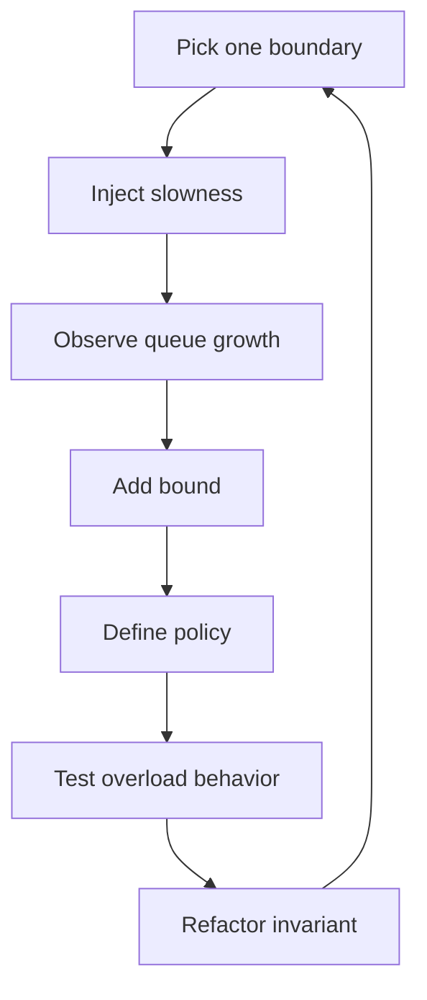
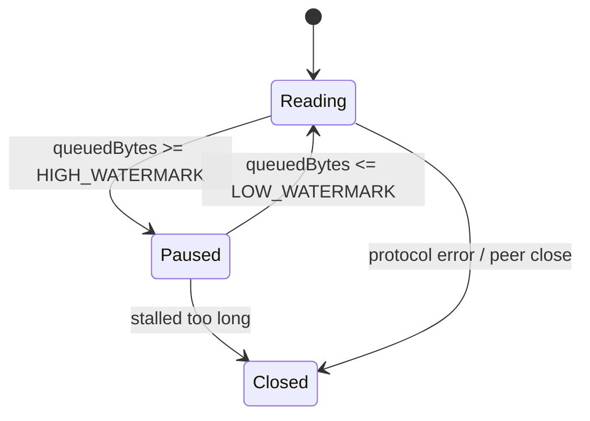
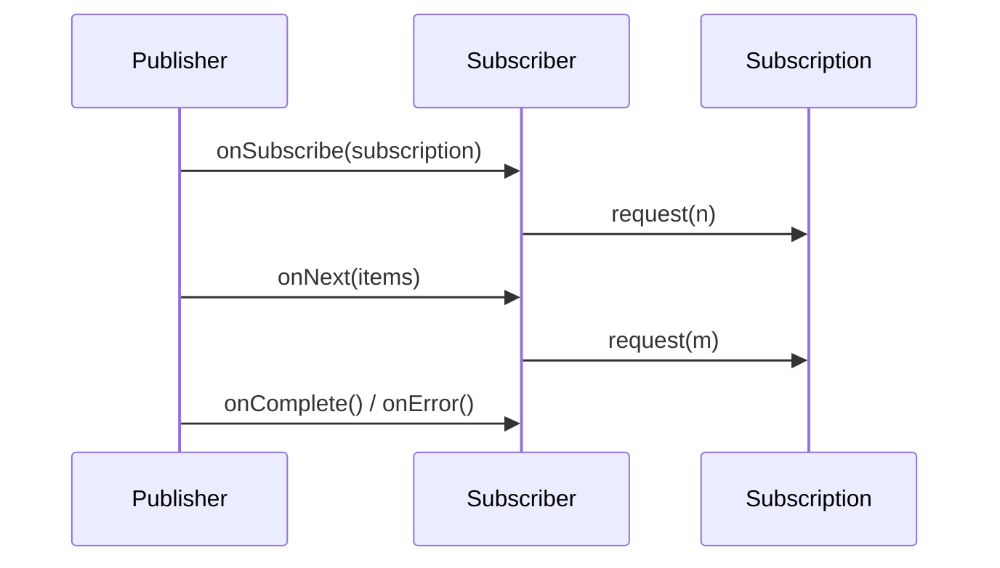
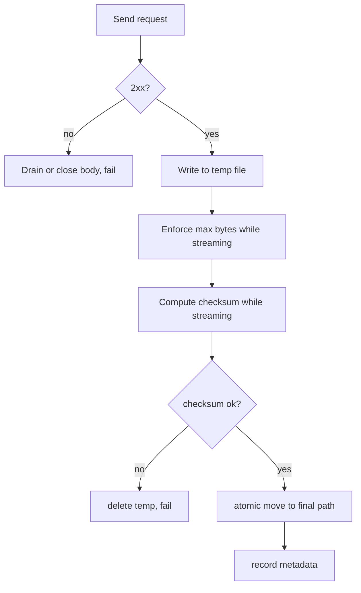
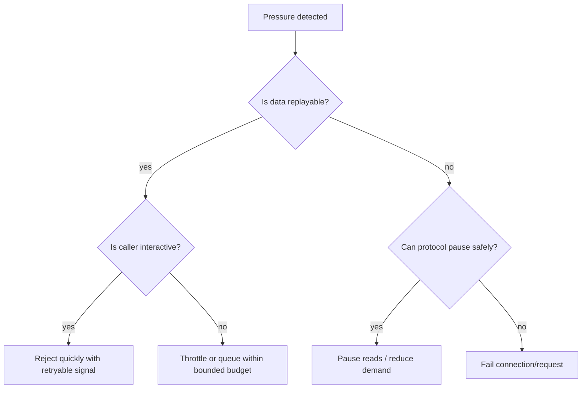
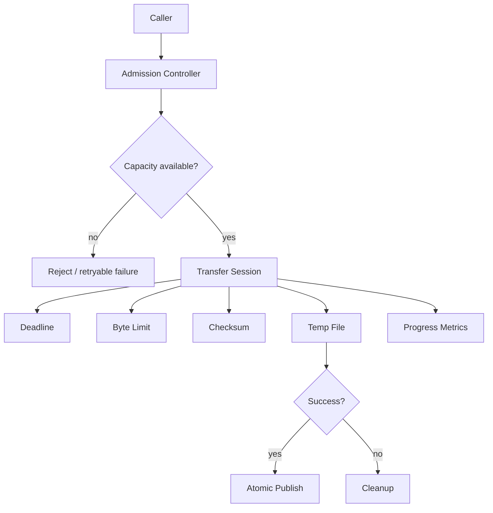

# Part 025 — Backpressure, Flow Control, and Large Data Transfer

> **Core thesis:** a production networking system fails less often because it is fast, and more often because it knows **when to stop accepting, reading, buffering, writing, retrying, or expanding memory**.

This part is about the engineering discipline that prevents a networked Java service from turning temporary slowness into memory exhaustion, GC collapse, retry storms, stalled event loops, corrupted protocol state, or downstream overload.

Backpressure is not a library feature. It is a **system invariant**.

```mermaid
flowchart LR
    A[Producer] --> B[Application Queue]
    B --> C[Encoder / Serializer]
    C --> D[JVM Buffer]
    D --> E[Kernel Send Buffer]
    E --> F[Network]
    F --> G[Kernel Receive Buffer]
    G --> H[JVM Buffer]
    H --> I[Decoder / Parser]
    I --> J[Consumer]

    J -. slow .-> I
    I -. pressure .-> H
    H -. pressure .-> G
    G -. TCP window .-> F
    F -. congestion .-> E
    E -. write stalls .-> D
    D -. queue grows .-> C
    C -. backpressure .-> B
    B -. reject/pause .-> A
```



If you remember only one idea from this part:

> **Every networking boundary is a queue. Every queue needs a bound. Every bound needs a policy.**

---

## 1. Kaufman Skill Map

Based on Josh Kaufman's acquisition model, this part decomposes backpressure into a few subskills you can deliberately practice.

### 1.1 Target capability

After this part, you should be able to design and review Java networking code that:

- streams large payloads without loading them fully into memory;
- prevents per-connection queues from growing without limit;
- detects slow readers and slow writers;
- separates **flow control**, **backpressure**, **rate limiting**, and **load shedding**;
- uses blocking I/O, NIO, and HTTP Client streaming with clear memory ownership;
- applies high/low watermarks to pause reads and resume safely;
- maps application pressure to observable metrics and failure decisions;
- avoids turning network latency into heap growth or GC pressure.

### 1.2 Subskills

| Subskill | Why it matters | Practice target |
|---|---|---|
| Understand byte-stream pressure | TCP has no message boundary and may stall writes | Explain why `write()` does not mean “peer consumed it” |
| Bound memory | Large transfer bugs are often memory bugs | Design max bytes per connection and global in-flight bytes |
| Use streaming APIs | Avoid full buffering | Build file upload/download without `byte[]` aggregation |
| Design NIO write queues | Non-blocking write is partial by design | Implement queue + `OP_WRITE` toggling |
| Pause reads | Prevent outbound pressure from becoming inbound OOM | Add high/low watermark read suspension |
| Protect slow consumers | Keep one slow client from hurting all clients | Apply timeout, byte budget, and queue limits |
| Observe pressure | You cannot tune what you cannot see | Emit queue depth, pending bytes, stalled duration |

### 1.3 Practice loop

The fastest way to internalize this topic is to repeatedly create a small network service, slow one side down, and watch which queue grows.



Do not start with a framework. Start with a small Java program where the failure is visible.

---

## 2. Vocabulary: Similar Words, Different Controls

Engineers often use these terms interchangeably. That causes poor designs.

| Term | Meaning | Question answered | Typical mechanism |
|---|---|---|---|
| **Flow control** | Receiver controls how much sender may transmit | “Can the receiver keep up?” | TCP receive window, HTTP/2 window, Reactive Streams demand |
| **Backpressure** | Downstream pressure propagates upstream | “Should the producer slow down?” | Bounded queue, `request(n)`, pause read, reject request |
| **Rate limiting** | Limit work rate by policy | “How much is this caller allowed?” | token bucket, leaky bucket, quota |
| **Load shedding** | Reject work to preserve system health | “What do we drop under overload?” | 503, connection close, queue rejection |
| **Throttling** | Intentionally slow transfer | “How fast may this stream move?” | sleep, byte budget, bandwidth shaping |
| **Admission control** | Decide whether new work may enter | “Should we accept this connection/request?” | max connections, max in-flight bytes, circuit/bulkhead |

A top-level invariant:

> **Flow control protects the receiver. Backpressure protects the system. Load shedding protects survival.**

---

## 3. The Queue Model of Java Networking

A Java network path contains more queues than the code usually shows.

```mermaid
flowchart LR
    subgraph JVM_Sender[JVM Sender]
        A1[Application Objects]
        A2[Encode Buffer]
        A3[Write Queue]
    end

    subgraph Kernel_Sender[Sender Kernel]
        K1[Socket Send Buffer]
        K2[TCP Congestion / Retransmit State]
    end

    subgraph Network[Network]
        N1[Router Queues]
        N2[Packet Loss / Delay]
    end

    subgraph Kernel_Receiver[Receiver Kernel]
        R1[Socket Receive Buffer]
    end

    subgraph JVM_Receiver[JVM Receiver]
        J1[Read Buffer]
        J2[Decode Queue]
        J3[Application Consumer]
    end

    A1 --> A2 --> A3 --> K1 --> K2 --> N1 --> N2 --> R1 --> J1 --> J2 --> J3
```



The bug is usually not “the network is slow”. The bug is that one of these queues was allowed to grow without a bound.

### 3.1 Typical pressure propagation

| Symptom | Likely growing queue | Common root cause |
|---|---|---|
| Heap grows during download | `byte[]`, `List<ByteBuffer>`, response aggregation | Full buffering instead of streaming |
| Event loop CPU spikes | selected-key spin or repeated zero-byte writes | Incorrect readiness handling |
| Latency rises before OOM | application queue | Producer not stopped when consumer slows |
| Many established sockets, low throughput | kernel send buffers / receiver slowness | Slow clients or downstream bottleneck |
| GC pause rises under load | short-lived buffer allocations | no buffer reuse / full body copies |
| Upload succeeds locally but fails in prod | proxy/load balancer buffering | different transfer path and body limits |

### 3.2 Important Java-specific point

In Java networking, **method return does not necessarily mean the remote application consumed data**.

For example:

- `OutputStream.write(...)` may return after bytes are copied into JVM/native/kernel path, not after business processing on the peer;
- `SocketChannel.write(...)` may write only some bytes;
- non-blocking `SocketChannel.write(...)` may write zero bytes;
- HTTP Client may complete headers before body consumption depending on handler style;
- WebSocket send completion means frame handing at the API boundary, not that the other service processed the event.

The safe mental model:

> **A write confirms local progress, not remote processing.**

---

## 4. Backpressure Invariants

Use these as review rules.

### 4.1 Queue invariants

1. Every queue has a maximum size.
2. The maximum is expressed in **bytes**, not only item count.
3. Per-connection limits exist.
4. Global process-wide limits exist.
5. Limits have explicit behavior: pause, reject, shed, close, or spill.
6. Re-enabling happens at a lower watermark, not immediately at the maximum.
7. Pressure is observable.

### 4.2 Streaming invariants

1. Large payloads are not represented as a single `byte[]` or `String`.
2. The body is consumed exactly once.
3. Cancellation closes the underlying resource.
4. Partial transfer is a first-class failure mode.
5. Temporary files have lifecycle ownership.
6. Checksums and size limits are evaluated while streaming, not after full buffering.

### 4.3 Network-client invariants

1. The client has a request deadline.
2. Upload and download sizes are bounded.
3. Response body consumption is controlled.
4. Retries do not duplicate unbounded bodies.
5. Idle pooled connections are treated as suspect after long silence.
6. A slow downstream cannot consume all executor threads, virtual threads, buffers, or connections.

---

## 5. Blocking I/O Backpressure

Blocking I/O is simple, but not magically safe.

```java
try (Socket socket = new Socket()) {
    socket.connect(new InetSocketAddress(host, port), connectTimeoutMillis);
    socket.setSoTimeout(readTimeoutMillis);

    OutputStream out = socket.getOutputStream();
    InputStream in = socket.getInputStream();

    out.write(requestBytes);
    out.flush();

    // Dangerous for large or unknown responses if it grows unbounded.
    byte[] response = in.readAllBytes();
}
```

The bug here is not that blocking I/O is bad. The bug is that `readAllBytes()` makes memory proportional to remote response size.

### 5.1 Safer streaming copy

```java
static long copyBounded(InputStream in, OutputStream out, long maxBytes) throws IOException {
    byte[] buffer = new byte[64 * 1024];
    long total = 0;

    while (true) {
        int read = in.read(buffer);
        if (read == -1) {
            return total;
        }

        total += read;
        if (total > maxBytes) {
            throw new IOException("response too large: " + total + " > " + maxBytes);
        }

        out.write(buffer, 0, read);
    }
}
```

This is still blocking, but memory is bounded by:

```text
buffer size + output destination buffer + stream implementation overhead
```

not by full payload size.

### 5.2 Blocking write pressure

If the receiver is slow, `OutputStream.write(...)` may block. With platform threads, too many blocked writes can exhaust thread pools. With virtual threads, blocked I/O is cheaper, but the system can still exhaust:

- sockets;
- file descriptors;
- heap buffers;
- kernel buffers;
- remote capacity;
- request deadlines;
- downstream quota.

Virtual threads reduce the cost of waiting. They do not remove the need for admission control.

### 5.3 Blocking server slow-consumer protection

For a blocking server, use simple limits:

```java
final class ConnectionLimits {
    final int readBufferBytes = 64 * 1024;
    final long maxRequestBytes = 10L * 1024 * 1024;
    final long maxResponseBytesQueued = 1L * 1024 * 1024;
    final int readTimeoutMillis = 10_000;
    final int writeTimeoutMillis = 10_000; // requires design; Socket has read timeout, not direct write timeout
}
```

Java `Socket` exposes read timeout via `setSoTimeout`, but write timeout is usually enforced structurally:

- run connection work under a deadline;
- close the socket on timeout/cancellation;
- avoid unbounded response generation before writing;
- stream response generation as the socket accepts data;
- cap total response size per request.

---

## 6. Non-Blocking I/O Backpressure

In NIO, backpressure becomes explicit.

A non-blocking `SocketChannel.write(buffer)` can return:

- positive number: some bytes accepted;
- zero: socket not currently writable;
- exception: connection failure.

It is incorrect to assume one `write` drains the full buffer.

### 6.1 Incorrect NIO write

```java
// Broken: may write only part of the buffer.
channel.write(buffer);
if (!buffer.hasRemaining()) {
    done();
}
```

This code may silently drop bytes if the remaining buffer is not preserved.

### 6.2 Correct NIO write queue shape

```java
final class ConnectionState {
    final SocketChannel channel;
    final ArrayDeque<ByteBuffer> outbound = new ArrayDeque<>();
    long queuedBytes;
    boolean readPaused;

    ConnectionState(SocketChannel channel) {
        this.channel = channel;
    }
}
```

```java
static final long HIGH_WATERMARK = 1L * 1024 * 1024;     // 1 MiB per connection
static final long LOW_WATERMARK  = 512L * 1024;          // resume below 512 KiB

static void enqueue(ConnectionState c, SelectionKey key, ByteBuffer encoded) {
    int bytes = encoded.remaining();

    if (c.queuedBytes + bytes > HIGH_WATERMARK) {
        // Policy choice: reject this message, close connection, or pause inbound reads.
        pauseReads(c, key);
        throw new IllegalStateException("connection outbound queue full");
    }

    c.outbound.add(encoded);
    c.queuedBytes += bytes;
    key.interestOps(key.interestOps() | SelectionKey.OP_WRITE);
}

static void onWritable(ConnectionState c, SelectionKey key) throws IOException {
    while (!c.outbound.isEmpty()) {
        ByteBuffer head = c.outbound.peek();
        int before = head.remaining();
        int written = c.channel.write(head);
        int after = head.remaining();
        c.queuedBytes -= (before - after);

        if (written == 0) {
            break;
        }

        if (!head.hasRemaining()) {
            c.outbound.remove();
        }
    }

    if (c.outbound.isEmpty()) {
        key.interestOps(key.interestOps() & ~SelectionKey.OP_WRITE);
    }

    if (c.readPaused && c.queuedBytes < LOW_WATERMARK) {
        resumeReads(c, key);
    }
}

static void pauseReads(ConnectionState c, SelectionKey key) {
    c.readPaused = true;
    key.interestOps(key.interestOps() & ~SelectionKey.OP_READ);
}

static void resumeReads(ConnectionState c, SelectionKey key) {
    c.readPaused = false;
    key.interestOps(key.interestOps() | SelectionKey.OP_READ);
}
```

The important decisions are not the exact numbers. The important invariant is:

> **When outbound pressure grows, inbound reads eventually stop.**

Otherwise, the connection keeps reading requests that it cannot answer.

### 6.3 Why high/low watermarks matter

Do not pause at `1 MiB` and resume at `1 MiB - 1 byte`. That creates thrashing.

Use hysteresis:

```text
below LOW_WATERMARK       => reads allowed
between LOW and HIGH      => keep current state
above HIGH_WATERMARK      => pause reads / reject / close
```



### 6.4 OP_WRITE trap

`OP_WRITE` is usually ready most of the time. If you keep it enabled permanently, your selector may wake repeatedly and waste CPU.

Rule:

> Enable `OP_WRITE` only while there is pending outbound data. Disable it when the queue is empty.

---

## 7. HTTP Client Streaming

The `java.net.http.HttpClient` API gives you multiple body strategies. The main design question is:

> Do you want the response body as one materialized value, a file, an input stream, or a subscriber-driven stream?

### 7.1 Dangerous for large responses

```java
HttpResponse<String> response = client.send(
    request,
    HttpResponse.BodyHandlers.ofString()
);
```

This is fine for small bounded responses. It is poor for unknown-size large downloads.

For binary data, this is also dangerous:

```java
HttpResponse<byte[]> response = client.send(
    request,
    HttpResponse.BodyHandlers.ofByteArray()
);
```

It materializes the full body.

### 7.2 Safer: download to file

```java
HttpResponse<Path> response = client.send(
    request,
    HttpResponse.BodyHandlers.ofFile(targetPath)
);

if (response.statusCode() / 100 != 2) {
    Files.deleteIfExists(targetPath);
    throw new IOException("download failed: " + response.statusCode());
}
```

This bounds heap usage, but you still need:

- disk space budget;
- max response size if possible;
- checksum validation;
- temporary-file lifecycle;
- atomic move after successful validation.

### 7.3 Safer: stream through `InputStream`

```java
HttpResponse<InputStream> response = client.send(
    request,
    HttpResponse.BodyHandlers.ofInputStream()
);

try (InputStream body = response.body();
     OutputStream file = Files.newOutputStream(tempFile)) {
    copyBounded(body, file, 500L * 1024 * 1024); // 500 MiB cap
}
```

This gives explicit consumption control. The body must be closed.

### 7.4 Built-in limiting body subscriber

Java's HTTP response body subscriber utilities include a limiting subscriber that caps delivered body bytes before passing to a downstream subscriber.

Conceptually:

```java
HttpResponse.BodyHandler<byte[]> handler = responseInfo ->
    HttpResponse.BodySubscribers.limiting(
        HttpResponse.BodySubscribers.ofByteArray(),
        10L * 1024 * 1024
    );
```

Use this for responses that are expected to be small but must be defended against unbounded payloads.

Do not use `ofByteArray()` for genuinely large payloads even with a large limit. Use file or stream handling.

---

## 8. Java Flow, Reactive Streams, and HTTP Body Subscribers

HTTP Client body subscribers are built on Java's `Flow` model.

At a high level:



The core backpressure mechanism is demand:

> A subscriber requests how much it is ready to receive.

### 8.1 Common mistake

```java
@Override
public void onSubscribe(Flow.Subscription subscription) {
    this.subscription = subscription;
    subscription.request(Long.MAX_VALUE); // effectively disables subscriber-level backpressure
}
```

This may be acceptable only if the downstream is already bounded and fast enough. Otherwise, it says: “send me everything”.

### 8.2 Bounded subscriber skeleton

```java
final class BoundedByteBufferSubscriber implements Flow.Subscriber<List<ByteBuffer>> {
    private final long maxBufferedBytes;
    private Flow.Subscription subscription;
    private long bufferedBytes;

    BoundedByteBufferSubscriber(long maxBufferedBytes) {
        this.maxBufferedBytes = maxBufferedBytes;
    }

    @Override
    public void onSubscribe(Flow.Subscription subscription) {
        this.subscription = subscription;
        subscription.request(1);
    }

    @Override
    public void onNext(List<ByteBuffer> items) {
        long batchBytes = items.stream().mapToLong(ByteBuffer::remaining).sum();
        if (bufferedBytes + batchBytes > maxBufferedBytes) {
            subscription.cancel();
            throw new IllegalStateException("subscriber buffer limit exceeded");
        }

        bufferedBytes += batchBytes;
        try {
            process(items);
        } finally {
            bufferedBytes -= batchBytes;
        }

        subscription.request(1);
    }

    @Override
    public void onError(Throwable throwable) {
        // record failure and release resources
    }

    @Override
    public void onComplete() {
        // finalize resource
    }

    private void process(List<ByteBuffer> items) {
        // Copy or consume before returning if buffers are not owned past callback.
    }
}
```

Production code needs careful error handling because throwing from callbacks may not produce the control flow you expect. Prefer explicit cancellation and completion of a result object.

---

## 9. Large Uploads

Large upload safety is different from large download safety.

For upload, you need to bound:

- source file size;
- request deadline;
- retry behavior;
- body replayability;
- connection stall duration;
- authentication token lifetime;
- server response consumption.

### 9.1 Upload from file

```java
HttpRequest request = HttpRequest.newBuilder(uri)
    .timeout(Duration.ofMinutes(5))
    .header("Content-Type", "application/octet-stream")
    .POST(HttpRequest.BodyPublishers.ofFile(path))
    .build();

HttpResponse<Void> response = client.send(
    request,
    HttpResponse.BodyHandlers.discarding()
);
```

This avoids loading the whole file into memory.

### 9.2 Retry risk with upload

A retry after partial upload may duplicate side effects unless the operation is designed for it.

Use one of these patterns:

| Pattern | Use when | Requirement |
|---|---|---|
| Idempotency key | Create/update request may be retried | Server deduplicates key |
| Multipart upload | Very large objects | Parts have checksums and resumable IDs |
| Content-addressed upload | Object identity is hash | Server treats same hash as same object |
| No automatic retry | Non-idempotent stream | Operator/client decides |

### 9.3 Upload backpressure

The upload source may be faster than the network. Do not let source reads outrun network writes.

Bad shape:

```text
read entire file -> encode entire body -> queue all -> write slowly
```

Better shape:

```text
read chunk -> publish chunk -> wait for demand/write progress -> read next chunk
```

---

## 10. Large Downloads

Large download bugs usually appear as:

- `OutOfMemoryError`;
- full disk;
- partial file treated as complete;
- checksum not verified;
- timeout not applied to full transfer;
- connection leaked because body stream was not closed;
- retry restarts from byte zero.

### 10.1 Robust download workflow



### 10.2 Bounded streaming with checksum

```java
static DownloadResult download(
    HttpClient client,
    HttpRequest request,
    Path temp,
    Path target,
    long maxBytes,
    MessageDigest digest
) throws IOException, InterruptedException {
    HttpResponse<InputStream> response = client.send(request, HttpResponse.BodyHandlers.ofInputStream());

    if (response.statusCode() / 100 != 2) {
        try (InputStream ignored = response.body()) {
            // Optionally consume small error body with a separate cap.
        }
        throw new IOException("download failed: HTTP " + response.statusCode());
    }

    long total = 0;
    byte[] buffer = new byte[128 * 1024];

    try (InputStream in = response.body();
         OutputStream out = Files.newOutputStream(temp, StandardOpenOption.CREATE, StandardOpenOption.TRUNCATE_EXISTING)) {
        while (true) {
            int read = in.read(buffer);
            if (read == -1) break;

            total += read;
            if (total > maxBytes) {
                throw new IOException("download exceeds max bytes: " + maxBytes);
            }

            digest.update(buffer, 0, read);
            out.write(buffer, 0, read);
        }
    } catch (Throwable t) {
        Files.deleteIfExists(temp);
        throw t;
    }

    Files.move(temp, target, StandardCopyOption.ATOMIC_MOVE, StandardCopyOption.REPLACE_EXISTING);
    return new DownloadResult(total, HexFormat.of().formatHex(digest.digest()));
}

record DownloadResult(long bytes, String sha256) {}
```

This pattern avoids exposing partial files as complete artifacts.

---

## 11. Backpressure Policies

When pressure crosses a threshold, you need a policy. “Keep buffering” is not a policy. It is a delayed outage.

| Policy | Behavior | Best for | Risk |
|---|---|---|---|
| Pause read | Stop consuming inbound bytes temporarily | Protocols where peer can tolerate TCP-level slowing | May deadlock if peer waits for response before sending less |
| Reject message | Keep connection but reject request | Multiplexed or request/response protocol | Requires protocol-level error response |
| Close connection | Fail fast | Abusive/slow clients, protocol violation | Can be harsh for transient slowness |
| Shed globally | Reject new work | System overload | Requires good admission signals |
| Spill to disk | Move pressure from heap to disk | Large temporary payloads | Disk exhaustion and cleanup complexity |
| Throttle | Slow producer | Controlled batch jobs | Increases latency |

### 11.1 Decision heuristic



---

## 12. Slow Consumer Protection

A slow consumer is not necessarily malicious. It may be:

- mobile client on poor network;
- overloaded downstream service;
- client with small receive window;
- proxy buffering oddly;
- consumer intentionally reading one byte per second;
- network path with high packet loss.

Your service must protect itself either way.

### 12.1 Per-connection budget

Track:

```text
connection.pendingOutboundBytes
connection.lastSuccessfulWriteTime
connection.totalBytesRead
connection.totalBytesWritten
connection.requestsInFlight
connection.readPaused
```

Close or degrade when:

```text
pendingOutboundBytes > maxPendingBytes
AND
now - lastSuccessfulWriteTime > maxStallDuration
```

### 12.2 Global budget

Per-connection limits are insufficient. Ten thousand connections each with 1 MiB pending is still 10 GiB.

Track process-wide:

```text
globalPendingOutboundBytes
globalPendingInboundBytes
globalActiveDownloads
globalActiveUploads
globalTempFileBytes
globalOpenConnections
```

Admission control should check global capacity before accepting new large transfer work.

### 12.3 Slowloris-style inbound protection

For inbound request bodies, protect:

- minimum data rate;
- header read timeout;
- body read timeout;
- max header size;
- max body size;
- max idle time between chunks.

Even if you use framework servers elsewhere, the invariant belongs in your architecture review.

---

## 13. Buffering and GC Pressure

Buffering policy affects latency and GC.

### 13.1 Heap buffer

Pros:

- easy to allocate;
- visible to GC;
- simple API usage.

Cons:

- large transient allocations increase GC pressure;
- copying may be required across native boundary;
- accidental retention is common.

### 13.2 Direct buffer

Pros:

- useful for native I/O paths;
- may reduce copying;
- common in high-performance network libraries.

Cons:

- allocation/deallocation is more expensive;
- memory is outside normal heap sizing intuition;
- leaks or retention are harder to notice;
- pooling requires strict ownership discipline.

### 13.3 Practical rule

Start with simple bounded heap buffers unless profiling proves the buffer path is a bottleneck.

Use direct buffers when:

- you have sustained high-throughput I/O;
- buffer lifecycle is explicit;
- allocation is amortized or pooled;
- off-heap memory is monitored;
- benchmarks represent production payloads.

---

## 14. Memory Budgeting Example

Suppose a Java gateway supports:

```text
maxConnections = 2,000
perConnectionOutboundHighWatermark = 512 KiB
perConnectionInboundBuffer = 64 KiB
```

Worst-case buffer pressure:

```text
2,000 * (512 KiB + 64 KiB)
= 2,000 * 576 KiB
= 1,152,000 KiB
≈ 1.1 GiB
```

That excludes:

- request objects;
- decoded messages;
- TLS buffers;
- HTTP parser state;
- application queues;
- file buffers;
- logging allocations;
- framework overhead;
- thread stacks or virtual-thread metadata;
- direct memory.

Therefore, a “small” per-connection queue can become a large process-wide memory commitment.

### 14.1 Budget formula

```text
peak_network_memory ≈
  connections * (inbound_buffer + outbound_queue_limit + protocol_state + tls_state)
+ active_large_transfers * transfer_buffer
+ global_queues
+ safety_margin
```

Set limits from this formula, not from vibes.

---

## 15. HTTP/2 Flow Control vs Application Backpressure

HTTP/2 has protocol-level flow control, but it does not automatically protect your application model.

HTTP/2 can regulate bytes on streams and connections. Your application still needs limits for:

- decoded objects;
- request fan-out;
- response aggregation;
- per-user quota;
- expensive business processing;
- downstream dependencies.

Protocol flow control answers:

> “How many bytes may move?”

Application backpressure answers:

> “How much work may exist?”

Do not confuse them.

---

## 16. Backpressure in Protocol Design

If you design a custom protocol, include pressure semantics explicitly.

### 16.1 Useful protocol signals

| Signal | Meaning |
|---|---|
| `BUSY` | Receiver is alive but overloaded |
| `RETRY_AFTER` | Sender may retry after delay |
| `WINDOW_UPDATE` | Receiver grants more bytes/messages |
| `CANCEL` | Stop producing current stream |
| `MAX_FRAME_SIZE` | Sender must chunk below this size |
| `TOO_LARGE` | Payload exceeds policy |
| `DRAINING` | Server is shutting down gracefully |

### 16.2 Bad protocol shape

```text
client sends unlimited messages
server queues unlimited responses
only failure is connection reset
```

This forces overload to appear as random network errors.

### 16.3 Better protocol shape

```text
client opens stream
server grants window
client sends chunks within window
server updates window after consuming
client can cancel
server can reject early
both sides have max frame and max stream size
```

---

## 17. Observability: Pressure Signals

Backpressure without observability becomes guesswork.

### 17.1 Metrics

| Metric | Type | Why it matters |
|---|---|---|
| `network.connections.active` | gauge | capacity and admission control |
| `network.connection.pending_outbound_bytes` | distribution | slow consumers |
| `network.connection.pending_inbound_bytes` | distribution | slow processors |
| `network.write.zero_count` | counter | socket not accepting bytes |
| `network.write.stalled_duration` | timer | slow/blocked peer |
| `network.read.paused` | gauge/counter | active backpressure |
| `network.transfer.active` | gauge | large transfer pressure |
| `network.transfer.bytes` | counter | throughput |
| `network.transfer.cancelled` | counter | timeout/user cancellation |
| `network.limit.rejected` | counter | load shedding/admission |
| `network.temp_file.bytes` | gauge | disk pressure |

### 17.2 Logs

Log transitions, not every byte.

Good events:

```text
connection_read_paused: queuedBytes=1048576 highWatermark=1048576
connection_read_resumed: queuedBytes=262144 lowWatermark=524288
connection_closed_slow_consumer: pendingBytes=2097152 stalledMs=30000
large_download_rejected: contentLength=734003200 maxBytes=524288000
```

Bad logs:

```text
read 8192 bytes
read 8192 bytes
read 8192 bytes
...
```

They destroy performance and hide the signal.

---

## 18. Testing Backpressure

Backpressure must be tested with intentionally slow peers.

### 18.1 Slow reader test

Create a client that reads one byte every 100 ms from your server.

Expected behavior:

- server outbound queue rises;
- server pauses reads or closes connection;
- server memory remains bounded;
- other clients remain healthy.

### 18.2 Slow writer test

Create a client that uploads request body very slowly.

Expected behavior:

- server enforces read deadline or minimum data rate;
- connection closes predictably;
- worker pool is not exhausted.

### 18.3 Huge response test

Mock server returns 10 GiB with no content length.

Expected behavior:

- client enforces max bytes while streaming;
- temp file is deleted;
- heap remains bounded;
- error is classified as size-limit violation, not generic I/O failure.

### 18.4 HTTP retry + large upload test

Simulate connection reset after server receives 80% of upload.

Expected behavior:

- non-idempotent upload is not automatically retried;
- idempotent upload uses idempotency key or resumable protocol;
- duplicate side effects are prevented.

---

## 19. Review Checklist

Use this checklist when reviewing Java networking code.

### 19.1 Memory

- [ ] Are request and response size limits explicit?
- [ ] Is any `byte[]`, `String`, `List<ByteBuffer>`, or `ByteArrayOutputStream` proportional to remote input?
- [ ] Are per-connection and global byte budgets defined?
- [ ] Are temporary files bounded and cleaned up?
- [ ] Are direct buffers monitored if used?

### 19.2 Flow/backpressure

- [ ] Can downstream pressure pause upstream reads?
- [ ] Are high/low watermarks used instead of a single threshold?
- [ ] Is `OP_WRITE` enabled only when needed?
- [ ] Are partial writes handled?
- [ ] Are slow consumers disconnected or degraded predictably?

### 19.3 HTTP

- [ ] Are large responses streamed to file or `InputStream`?
- [ ] Are small responses capped?
- [ ] Is response body always consumed or closed?
- [ ] Are upload retries safe?
- [ ] Does request timeout cover the full operation you care about?

### 19.4 Observability

- [ ] Are pending bytes visible?
- [ ] Are read-pause/resume transitions logged?
- [ ] Are limit rejections counted?
- [ ] Are slow-consumer closes distinguishable from network resets?
- [ ] Can you identify whether pressure is inbound, outbound, disk, executor, or downstream?

---

## 20. Deliberate Practice

### Drill 1 — Bounded TCP echo server

Build a TCP echo server with:

- length-prefixed frames;
- max frame size;
- per-connection outbound queue limit;
- pause/resume reads;
- slow-consumer close.

Then test with a client that sends quickly and reads slowly.

### Drill 2 — Memory-safe downloader

Build a downloader using `HttpClient` that:

- streams body to temp file;
- enforces max bytes;
- computes SHA-256 while streaming;
- atomically moves final file;
- deletes temp file on error;
- exposes metrics.

### Drill 3 — Large upload policy

Build a file uploader that supports:

- no retry for non-idempotent upload;
- retry with idempotency key for safe upload;
- request deadline;
- upload progress callback;
- cancellation.

### Drill 4 — Backpressure dashboard

Expose and chart:

- pending outbound bytes;
- active connections;
- read-paused connections;
- rejected requests;
- transfer throughput;
- stalled writes.

Your goal is to see pressure before the process fails.

---

## 21. Production Design Pattern: Bounded Transfer Service

A production-grade large transfer component should look like this:



Key properties:

- one component owns temp file cleanup;
- one component owns byte accounting;
- one component owns cancellation;
- caller cannot accidentally materialize the body;
- metrics are emitted at transfer-session level;
- retry policy is explicit and tied to idempotency.

---

## 22. Mental Model Summary

Backpressure is not primarily about APIs. It is about preserving invariants when one side moves faster than another.

Remember:

1. TCP flow control does not bound your heap.
2. HTTP/2 flow control does not bound your decoded objects.
3. Virtual threads do not bound your sockets, buffers, or downstream capacity.
4. Streaming APIs do not help if you aggregate the stream yourself.
5. Non-blocking I/O is unsafe without write queues and memory limits.
6. Large transfer correctness requires cleanup, checksum, size cap, and cancellation.
7. A slow peer is normal. Unbounded buffering is the bug.

The senior-engineering move is to ask, for every network boundary:

> **What is the queue, what is the bound, what is the pressure signal, and what happens when the bound is crossed?**

---

## References

- Java SE 25 API — `java.net.http.HttpResponse.BodySubscriber` and `BodySubscribers`: https://docs.oracle.com/en/java/javase/25/docs/api/java.net.http/java/net/http/class-use/HttpResponse.BodySubscriber.html
- Java SE 25 API — `java.nio.channels` package: https://docs.oracle.com/en/java/javase/25/docs/api/java.base/java/nio/channels/package-summary.html
- Java SE API — `SocketChannel`: https://docs.oracle.com/en/java/javase/25/docs/api/java.base/java/nio/channels/SocketChannel.html
- RFC 9113 — HTTP/2: https://www.rfc-editor.org/rfc/rfc9113.html
