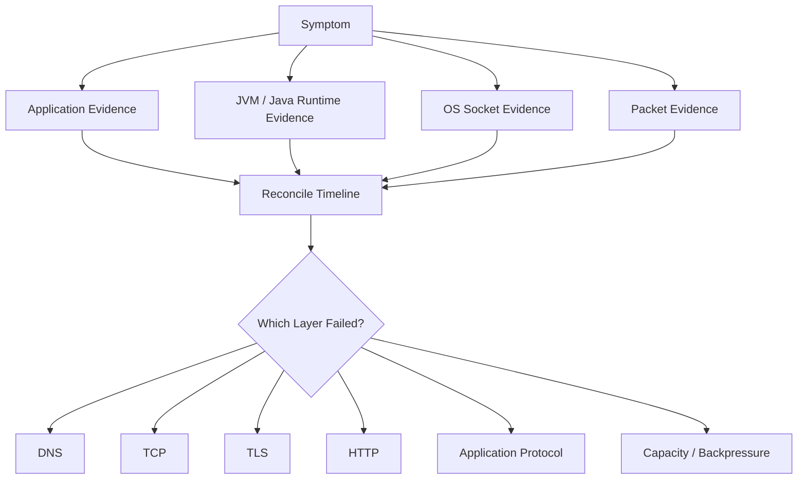
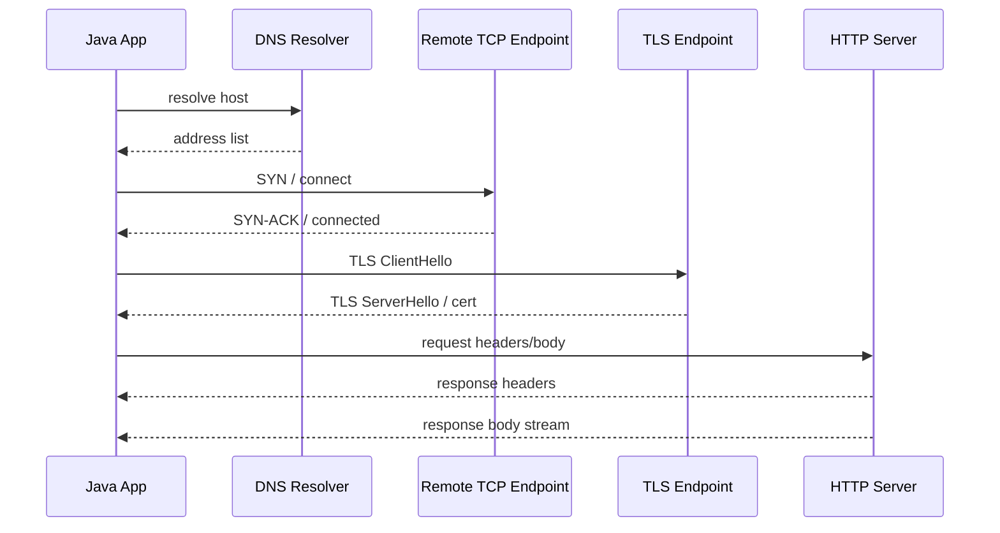
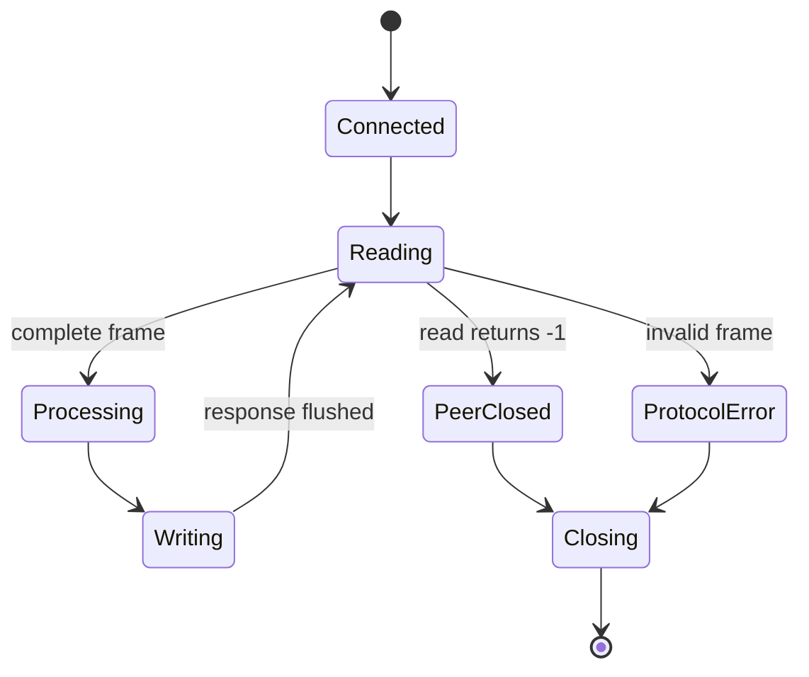
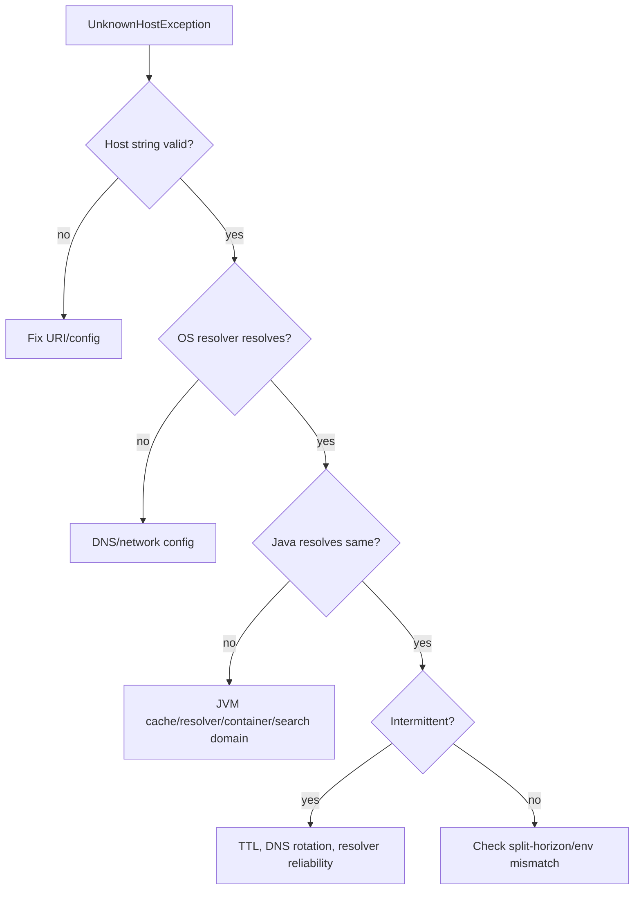
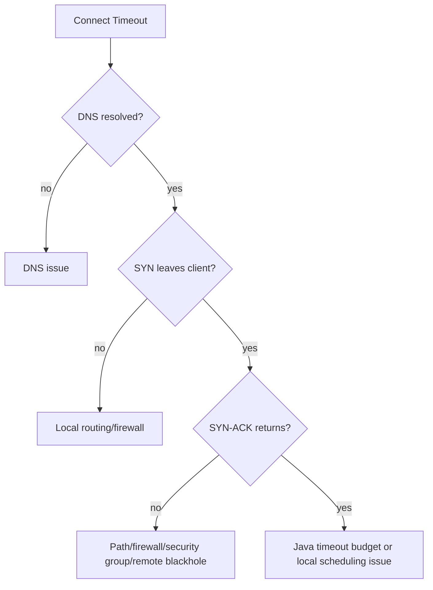

# Part 027 — Network Observability and Packet-Level Debugging

> **Core thesis:** networking bugs are rarely solved by staring at Java stack traces alone. You need a layered evidence model: application intent, Java runtime behavior, OS socket state, DNS/TLS/HTTP semantics, and packet-level facts.

This part is about **diagnosing Java networking systems in production**. It does not repeat the general observability series. The scope here is narrower and deeper:

- What exactly did the Java process try to connect to?
- Which address was selected after DNS?
- Did the connection fail before TCP, during TCP, during TLS, during HTTP, or while streaming the body?
- Was latency caused by DNS, connect, TLS handshake, server processing, response body transfer, backpressure, or client-side queuing?
- Did timeout/cancellation close the socket as expected?
- Is the packet trace consistent with what the application logs claim?

A top-tier engineer treats a network incident as an evidence-reconciliation exercise, not as guesswork.



The practical objective is simple:

> Given a production networking incident, you should be able to build a timeline that explains what happened without relying on folklore.

---

## 1. Kaufman Skill Map

### 1.1 Target capability

After this part, you should be able to:

- classify network failures by layer and phase;
- instrument Java clients and servers without leaking secrets;
- decompose latency into DNS, connect, TLS, request, first byte, and body transfer;
- use Java Flight Recorder for socket and HTTP-adjacent diagnosis;
- enable `java.net.http` logging safely in non-production or scoped production windows;
- correlate application logs with packet captures;
- read TCP-level evidence such as SYN, SYN-ACK, FIN, RST, retransmission, zero window, and TLS handshake boundaries;
- distinguish client timeout, server close, proxy reset, firewall drop, and DNS failure;
- produce incident notes that are defensible and reproducible.

### 1.2 Subskills

| Subskill | Why it matters | Practice target |
|---|---|---|
| Failure phase classification | Different fixes apply at different layers | Label every error as DNS, connect, TLS, HTTP, stream, or app protocol |
| Timeline correlation | Logs alone lie by omission | Align app timestamp, JFR event, OS socket state, and packet timestamp |
| Latency decomposition | “Slow network” is not actionable | Measure connect, handshake, TTFB, and body duration separately |
| Safe logging | Network data can contain secrets | Redact headers, query params, tokens, payload fragments |
| Packet capture | Sometimes packets are the source of truth | Capture minimal traffic with filters and interpret basic TCP behavior |
| JFR diagnostics | JVM evidence is lower-overhead than ad-hoc logging | Record socket read/write stalls and allocation pressure |
| Exception interpretation | Java wraps many network failures | Map exception type and message to probable phase |
| Production playbooks | Incidents need repeatable steps | Build a checklist for DNS/TCP/TLS/HTTP/body/backpressure |

### 1.3 Anti-goals

This part is not about:

- general logging frameworks;
- full OpenTelemetry setup;
- complete Wireshark mastery;
- deep TCP congestion-control theory;
- replacing infrastructure telemetry;
- blaming the network without proof.

---

## 2. The Layered Evidence Model

When a Java network call fails, there are at least six layers of evidence.

| Layer | Typical evidence | Questions answered |
|---|---|---|
| Application | operation name, target logical service, deadline, correlation id | What did the code intend to do? |
| Java API | URI, timeout, proxy, redirect, body publisher/subscriber, exception | What did the JDK client/socket API experience? |
| JVM runtime | JFR socket events, allocation, GC, thread state | Was the process blocked, allocating, or stalled? |
| OS socket | local port, remote address, state, queue sizes | Did the kernel have an open connection and where? |
| Network path | packet capture, NAT, proxy, firewall logs | Did packets leave/return? Who reset/dropped? |
| Peer/proxy | server logs, load balancer logs, TLS logs, upstream metrics | Did the remote endpoint receive and process it? |

The invariant:

> **Do not conclude from one layer when another layer can falsify it.**

For example:

- Java says `SocketTimeoutException`.
- Packet capture shows the server sent response bytes after the client deadline.
- Application logs show a 300 ms deadline on a call that usually takes 800 ms.

The correct conclusion is not “server down”. The likely conclusion is **client deadline too aggressive** or **deadline not propagated with enough budget**.

---

## 3. Failure Phase Taxonomy

A production-grade network incident should be classified by phase.



| Phase | Common Java symptom | Likely root classes |
|---|---|---|
| URI parse | `IllegalArgumentException`, `URISyntaxException` | malformed URI, bad encoding, unsupported scheme |
| DNS | `UnknownHostException`, long first-call latency | resolver failure, bad search domain, split-horizon DNS, negative cache |
| Address selection | connects to wrong family/address | IPv4/IPv6 preference, stale DNS, unexpected localhost resolution |
| TCP connect | `ConnectException`, `SocketTimeoutException` on connect | service down, firewall reject/drop, backlog saturation, wrong port |
| TLS handshake | `SSLHandshakeException`, cert path errors | truststore, hostname verification, protocol/cipher/SNI/mTLS issue |
| HTTP protocol | status codes, protocol exception, stream reset | proxy/server behavior, HTTP/2 stream reset, malformed response |
| Body upload | timeout while writing, broken pipe | slow receiver, request too large, server/proxy closed |
| Body download | timeout while reading, partial file | slow sender, client not consuming, stream cancellation |
| Pool reuse | sporadic reset on first write/read | stale idle connection, proxy/load balancer idle timeout |
| Cancellation | future cancelled but socket still busy | cancellation semantics, body subscriber not closed, blocking code ignored deadline |

### 3.1 Interpret exceptions by phase, not just by type

The same exception type may occur in multiple phases.

| Exception | Possible phase | Diagnostic question |
|---|---|---|
| `SocketTimeoutException` | connect, read, TLS, HTTP body | Which timeout fired and at what timestamp? |
| `ConnectException: Connection refused` | TCP connect | Did remote host actively reject with RST? |
| `ConnectException: Network is unreachable` | routing/address family | Is route missing or IPv6 selected unexpectedly? |
| `UnknownHostException` | DNS | Was hostname invalid, resolver unavailable, or search domain wrong? |
| `SSLHandshakeException` | TLS | Is it trust, hostname, SNI, protocol, cipher, or client cert? |
| `EOFException` | protocol/body | Did peer close cleanly before expected bytes? |
| `IOException: Broken pipe` | write | Did peer close before/during upload? |
| `Connection reset` | TCP | Who sent RST: client, server, proxy, firewall? |

A good incident report says:

> “The request failed during TLS certificate validation after TCP connect succeeded.”

Not:

> “The API is down.”

---

## 4. What to Log in Java Networking Code

Network logging must be useful under stress and safe under audit.

### 4.1 Minimum client-side call record

Every outbound network call should have a structured record like this:

```json
{
  "event": "network.client.call",
  "operation": "partner-risk-score.lookup",
  "correlationId": "case-721-req-92",
  "targetService": "risk-score-api",
  "scheme": "https",
  "host": "api.partner.example",
  "port": 443,
  "method": "POST",
  "httpVersionRequested": "HTTP_2",
  "connectTimeoutMs": 500,
  "requestTimeoutMs": 2500,
  "deadlineRemainingMsAtStart": 2310,
  "attempt": 1,
  "retryable": false
}
```

### 4.2 Minimum completion record

```json
{
  "event": "network.client.complete",
  "operation": "partner-risk-score.lookup",
  "correlationId": "case-721-req-92",
  "targetService": "risk-score-api",
  "durationMs": 184,
  "phase": "http.response",
  "status": 200,
  "responseBytes": 4182,
  "reusedConnection": "unknown",
  "attempt": 1
}
```

### 4.3 Minimum failure record

```json
{
  "event": "network.client.failure",
  "operation": "partner-risk-score.lookup",
  "correlationId": "case-721-req-92",
  "targetService": "risk-score-api",
  "durationMs": 503,
  "phase": "tcp.connect",
  "exceptionClass": "java.net.http.HttpConnectTimeoutException",
  "messageClass": "connect-timeout",
  "attempt": 1,
  "retryable": true,
  "deadlineRemainingMsAtFailure": 1807
}
```

Do **not** blindly log:

- full URL with query string;
- Authorization headers;
- cookies;
- client certificates;
- request/response bodies;
- signed URLs;
- PII in payload fragments.

### 4.4 Structured Java wrapper around `HttpClient`

```java
import java.io.IOException;
import java.net.URI;
import java.net.http.HttpClient;
import java.net.http.HttpRequest;
import java.net.http.HttpResponse;
import java.time.Duration;
import java.time.Instant;
import java.util.Objects;

public final class ObservedHttpClient {
    private final HttpClient client;

    public ObservedHttpClient(HttpClient client) {
        this.client = Objects.requireNonNull(client);
    }

    public <T> HttpResponse<T> send(
            String operation,
            HttpRequest request,
            HttpResponse.BodyHandler<T> bodyHandler
    ) throws IOException, InterruptedException {
        URI uri = request.uri();
        Instant start = Instant.now();

        logStart(operation, request, uri);

        try {
            HttpResponse<T> response = client.send(request, bodyHandler);
            long durationMs = Duration.between(start, Instant.now()).toMillis();
            logSuccess(operation, uri, response.statusCode(), durationMs);
            return response;
        } catch (IOException | InterruptedException e) {
            long durationMs = Duration.between(start, Instant.now()).toMillis();
            logFailure(operation, uri, classify(e), e, durationMs);
            throw e;
        }
    }

    private static void logStart(String operation, HttpRequest request, URI uri) {
        System.out.printf(
                "event=network.client.start operation=%s scheme=%s host=%s port=%d method=%s timeout=%s%n",
                safe(operation),
                uri.getScheme(),
                uri.getHost(),
                effectivePort(uri),
                request.method(),
                request.timeout().map(Duration::toString).orElse("none")
        );
    }

    private static void logSuccess(String operation, URI uri, int status, long durationMs) {
        System.out.printf(
                "event=network.client.success operation=%s host=%s status=%d durationMs=%d%n",
                safe(operation), uri.getHost(), status, durationMs
        );
    }

    private static void logFailure(
            String operation,
            URI uri,
            String phase,
            Exception e,
            long durationMs
    ) {
        System.out.printf(
                "event=network.client.failure operation=%s host=%s phase=%s exception=%s durationMs=%d%n",
                safe(operation), uri.getHost(), phase, e.getClass().getName(), durationMs
        );
    }

    private static String classify(Exception e) {
        String name = e.getClass().getName();
        String msg = String.valueOf(e.getMessage()).toLowerCase();

        if (name.contains("UnknownHost")) return "dns";
        if (name.contains("HttpConnectTimeout")) return "tcp.connect.timeout";
        if (name.contains("SocketTimeout")) return "socket.timeout";
        if (name.contains("SSL")) return "tls";
        if (msg.contains("connection reset")) return "tcp.reset";
        if (msg.contains("broken pipe")) return "tcp.write.closed";
        return "unknown";
    }

    private static int effectivePort(URI uri) {
        if (uri.getPort() >= 0) return uri.getPort();
        return switch (String.valueOf(uri.getScheme()).toLowerCase()) {
            case "http" -> 80;
            case "https" -> 443;
            default -> -1;
        };
    }

    private static String safe(String value) {
        return value.replaceAll("[^a-zA-Z0-9_.:-]", "_");
    }
}
```

This wrapper is intentionally simple. In real systems, replace `System.out.printf` with structured logging and metrics.

---

## 5. Latency Decomposition

A single `durationMs` is necessary but insufficient.

For network calls, decompose latency into phases:

| Phase | Meaning | Common cause when high |
|---|---|---|
| Queue wait | time before call starts | local bulkhead, executor saturation, virtual-thread pinning, rate limiter |
| DNS | hostname resolution | resolver latency, search domains, negative cache, split DNS |
| TCP connect | SYN to established connection | firewall drop, remote overload, route issue, backlog saturation |
| TLS handshake | ClientHello to secure session | cert chain, OCSP/CRL, mTLS, SNI, ALPN, CPU |
| Request headers | writing headers | connection flow control, proxy buffering |
| Request body | upload | slow receiver, large body, backpressure |
| TTFB | time to first response byte | server processing, upstream latency, proxy buffering |
| Response body | download and consume | large response, slow client, decompression, body handler allocation |

### 5.1 Why `HttpClient` makes this non-trivial

The JDK `HttpClient` gives a high-level API. It does not expose a first-class per-phase timing object like some specialized HTTP clients.

Therefore, you usually combine:

- application timing around `send` / `sendAsync`;
- operation-level metrics;
- JFR events;
- HTTP client logging when needed;
- server/proxy timing headers if available;
- packet capture for disputed cases.

### 5.2 Add timing where you control the body

For large responses, body consumption may dominate total latency.

```java
import java.io.IOException;
import java.io.InputStream;
import java.net.http.HttpResponse;
import java.nio.file.Files;
import java.nio.file.Path;
import java.time.Duration;
import java.time.Instant;

public final class TimedDownload {
    public static HttpResponse.BodyHandler<Path> toFileWithTiming(Path target) {
        return responseInfo -> HttpResponse.BodySubscribers.mapping(
                HttpResponse.BodySubscribers.ofInputStream(),
                in -> copyWithTiming(in, target)
        );
    }

    private static Path copyWithTiming(InputStream in, Path target) {
        Instant start = Instant.now();
        long bytes = 0;
        byte[] buffer = new byte[64 * 1024];

        try (InputStream input = in; var output = Files.newOutputStream(target)) {
            int read;
            while ((read = input.read(buffer)) != -1) {
                output.write(buffer, 0, read);
                bytes += read;
            }
            long ms = Duration.between(start, Instant.now()).toMillis();
            System.out.printf("event=network.download.complete bytes=%d bodyMs=%d%n", bytes, ms);
            return target;
        } catch (IOException e) {
            long ms = Duration.between(start, Instant.now()).toMillis();
            System.out.printf("event=network.download.failure bytes=%d bodyMs=%d exception=%s%n",
                    bytes, ms, e.getClass().getName());
            throw new RuntimeException(e);
        }
    }
}
```

The key idea: for streaming, “request duration” and “body consumption duration” may not be the same operational problem.

---

## 6. Java Flight Recorder for Network Diagnosis

Java Flight Recorder is often the best first low-overhead JVM-side evidence source.

It can help answer:

- which threads were blocked in socket reads/writes;
- whether socket operations were long-running;
- whether GC or allocation pressure overlapped with network latency;
- whether virtual threads were parked or carrier threads were saturated;
- whether file/network I/O spikes correlate with latency;
- whether exceptions increased during a window.

### 6.1 Start a bounded recording

For a running process:

```bash
jcmd <pid> JFR.start name=network-debug settings=profile duration=120s filename=/tmp/network-debug.jfr
```

For process startup:

```bash
java \
  -XX:StartFlightRecording=name=network-debug,settings=profile,duration=120s,filename=/tmp/network-debug.jfr \
  -jar app.jar
```

For ongoing production environments, prefer operationally approved templates and time-bounded recordings.

### 6.2 What to inspect

| JFR area | What to look for | Interpretation |
|---|---|---|
| Socket read events | long reads, low bytes, repeated timeouts | slow peer, stalled response, client waiting |
| Socket write events | long writes, small writes | slow receiver, flow-control pressure, upload bottleneck |
| Thread states | blocked/parked/waiting threads | I/O wait vs CPU saturation |
| Allocation | frequent buffer/string allocations | body handling or logging pressure |
| GC pauses | GC overlap with network spikes | local runtime issue, not network path |
| Exceptions | repeated network exceptions | classify by phase and target |
| Method profiling | hot encode/decode paths | protocol parser or body processing cost |

### 6.3 JFR does not replace packet capture

JFR sees JVM events. It usually will not prove:

- whether SYN packets left the host;
- whether a firewall silently dropped traffic;
- who sent a TCP reset;
- whether TLS records are fragmented in a specific way;
- whether retransmission happened on the wire;
- whether NAT/proxy changed the path.

Use JFR to narrow the hypothesis. Use packet evidence when the path itself is disputed.

---

## 7. `java.net.http` Diagnostic Logging

The JDK HTTP Client has a system property for high-level logging through the platform logging API:

```bash
-Djdk.httpclient.HttpClient.log=errors,requests,headers,frames,ssl,trace,channel
```

Use it carefully.

### 7.1 Safe usage rules

| Rule | Reason |
|---|---|
| Prefer lower environments first | HTTP logs may expose metadata and operational details |
| Never enable broad body/content logging casually | Payloads may contain PII or credentials |
| Scope by short duration in production | Logging can add volume and overhead |
| Redact before sharing logs | Headers and URLs may contain secrets |
| Align timestamps with app logs and packet capture | Logging is useful only when correlated |

### 7.2 What HTTP client logs can answer

| Evidence | Useful for |
|---|---|
| request line and headers | confirming method, authority, redirects, protocol |
| frame logs | HTTP/2 stream-level behavior |
| SSL logs | TLS handshake path and negotiation hints |
| channel logs | connection/channel lifecycle |
| errors | internal client failures and transport events |

### 7.3 What HTTP client logs cannot safely answer

They are not a replacement for:

- peer server logs;
- TLS certificate-chain inspection;
- packet capture;
- DNS resolver logs;
- proxy/firewall logs;
- application-level business causality.

---

## 8. JSSE/TLS Debugging

For TLS problems, Java can emit detailed JSSE diagnostics.

Typical command:

```bash
-Djavax.net.debug=ssl,handshake
```

More verbose variants may include certificate and key manager details, but they should be used carefully.

### 8.1 TLS debugging questions

| Question | Evidence |
|---|---|
| Did TCP connect succeed? | TLS logs start only after a socket exists |
| Was SNI sent? | ClientHello details |
| Which protocol was negotiated? | TLS version in handshake |
| Was ALPN negotiated? | HTTP/2 vs HTTP/1.1 negotiation evidence |
| Which certificate chain was received? | certificate debug output |
| Why did trust validation fail? | cert path validation exception |
| Was a client certificate requested? | CertificateRequest message |
| Was a client cert selected? | key manager debug output |

### 8.2 Common TLS conclusions

| Symptom | Likely conclusion |
|---|---|
| `PKIX path building failed` | truststore does not trust issuer chain |
| `No subject alternative DNS name matching ...` | hostname verification failure |
| server closes after ClientHello | SNI/protocol/cipher mismatch or middlebox behavior |
| HTTP/2 expected but HTTP/1.1 used | ALPN not negotiated or server/proxy limitation |
| mTLS handshake fails after cert request | client cert/key missing, wrong alias, or unacceptable CA |

Do not disable hostname verification or trust all certificates to “fix” production. That changes the security property of the system.

---

## 9. OS-Level Socket Evidence

From the OS, you can answer questions Java does not expose directly.

### 9.1 Useful Linux commands

```bash
# Established connections and listening sockets
ss -tunap

# Connections involving a specific port
ss -tanp '( sport = :8080 or dport = :8080 )'

# Listening sockets
ss -ltnp

# Process file descriptors
ls -l /proc/<pid>/fd

# Per-process open TCP sockets through lsof, if available
lsof -Pan -p <pid> -i
```

### 9.2 What socket states imply

| State | Meaning | Typical Java-level symptom |
|---|---|---|
| `LISTEN` | server socket bound and accepting | service has an open listener |
| `SYN-SENT` | client sent SYN, waiting | connect in progress or timeout soon |
| `SYN-RECV` | server received SYN, handshake incomplete | SYN backlog pressure possible |
| `ESTAB` | TCP established | Java may be reading/writing/application-stalled |
| `FIN-WAIT-1/2` | local close in progress | graceful close path |
| `CLOSE-WAIT` | peer closed, local app has not closed | Java code leaked close handling |
| `TIME-WAIT` | closed connection retained temporarily | high churn or no pooling |

### 9.3 `CLOSE-WAIT` is usually an application smell

If a process has many `CLOSE-WAIT` sockets, the peer already closed but your process has not closed its side.

Common causes:

- not closing response body streams;
- not closing raw socket streams;
- leaked WebSocket/session lifecycle;
- forgotten error path;
- server protocol state machine does not handle EOF;
- thread stuck before cleanup.

A correct server treats EOF as a state transition.



---

## 10. Packet Capture Workflow

Packet capture is the most concrete evidence for path behavior.

### 10.1 Minimal `tcpdump` examples

Capture traffic to a host and port:

```bash
tcpdump -i any -nn host 203.0.113.10 and port 443
```

Write to a file for Wireshark:

```bash
tcpdump -i any -nn -s 0 -w /tmp/capture.pcap host 203.0.113.10 and port 443
```

Capture a specific local service:

```bash
tcpdump -i any -nn -s 0 -w /tmp/service-8080.pcap port 8080
```

### 10.2 Capture rules

| Rule | Why |
|---|---|
| Filter aggressively | Production packet capture can be huge and sensitive |
| Capture both client and server side if possible | NAT/proxy/firewall may change the path |
| Record exact time window | Needed to correlate with logs |
| Avoid payload capture unless approved | Payload can contain secrets/PII |
| Prefer metadata-first analysis | SYN/RST/FIN/retransmit often enough |

### 10.3 Reading the TCP handshake

Normal connect:

```text
Client -> Server  SYN
Server -> Client  SYN, ACK
Client -> Server  ACK
```

Connection refused:

```text
Client -> Server  SYN
Server -> Client  RST, ACK
```

Silent drop/firewall blackhole:

```text
Client -> Server  SYN
Client -> Server  SYN retransmission
Client -> Server  SYN retransmission
...
```

The Java symptom may be the same broad “connect failed”, but the fix is different:

| Wire behavior | Likely fix direction |
|---|---|
| RST immediately | service not listening, wrong port, active reject |
| SYN retransmits | firewall drop, routing, security group, blackhole |
| handshake succeeds then RST | protocol/TLS/proxy/server close |
| data retransmits | packet loss, congestion, MTU/path issue |
| zero window | receiver not consuming fast enough |

### 10.4 FIN vs RST

| Signal | Meaning | Java interpretation |
|---|---|---|
| FIN | graceful close; no more bytes from sender | read eventually returns EOF (`-1`) |
| RST | abortive close; connection reset | `Connection reset`, stream failure |

A reset is not automatically a network outage. It can be:

- peer process crash;
- proxy idle timeout;
- server rejects malformed protocol;
- client wrote after peer closed;
- load balancer reset;
- firewall policy;
- application intentionally aborting.

---

## 11. Correlation ID Across Network Boundaries

Packet capture tells you packets. It does not tell you business operation.

A network call should carry a correlation identifier when protocol allows it.

For HTTP:

```java
HttpRequest request = HttpRequest.newBuilder()
        .uri(URI.create("https://api.partner.example/risk-score"))
        .header("X-Correlation-Id", correlationId)
        .header("Accept", "application/json")
        .timeout(Duration.ofSeconds(2))
        .POST(HttpRequest.BodyPublishers.ofString(payload))
        .build();
```

For raw protocols, include a request id in your frame header.

```text
| magic | version | requestId | type | length | payload |
```

This lets you reconcile:

- caller log;
- callee log;
- proxy/load balancer log;
- packet timestamp;
- JFR event.

---

## 12. Server-Side Network Observability

A production Java server should log and measure connection lifecycle, not only request lifecycle.

### 12.1 Raw TCP server lifecycle events

| Event | Useful fields |
|---|---|
| accepted | local address, remote address, connection id |
| first byte received | time since accept |
| frame decoded | request id, frame type, size |
| protocol error | reason, bytes consumed, remote address |
| response queued | queue bytes, queue depth |
| write completed | bytes written, duration |
| peer closed | state, outstanding request count |
| closed | close reason, lifetime, bytes in/out |

### 12.2 Example connection id wrapper

```java
import java.net.SocketAddress;
import java.nio.channels.SocketChannel;
import java.util.concurrent.atomic.AtomicLong;

public final class ConnectionIdentity {
    private static final AtomicLong SEQUENCE = new AtomicLong();

    public static String assign(SocketChannel channel) {
        long id = SEQUENCE.incrementAndGet();
        SocketAddress remote;
        try {
            remote = channel.getRemoteAddress();
        } catch (Exception e) {
            remote = null;
        }
        return "conn-" + id + " remote=" + remote;
    }
}
```

The connection id should be propagated through read/write logs for that channel.

### 12.3 Server metrics that matter

| Metric | Why it matters |
|---|---|
| active connections | saturation, leaks, slow clients |
| accepts/sec | traffic rate and connection churn |
| accept failures | file descriptor, backlog, permission, OS errors |
| bytes read/sec | inbound throughput |
| bytes written/sec | outbound throughput |
| protocol decode failures | malformed clients or parser bugs |
| write queue bytes | backpressure and slow consumer indicator |
| connection lifetime | churn vs long-lived sessions |
| close reason distribution | EOF, timeout, protocol error, server shutdown |
| event-loop lag | NIO server health |

---

## 13. Client-Side Metrics That Matter

| Metric | Dimension | Why |
|---|---|---|
| calls total | operation, target, method | baseline volume |
| failures total | phase, exception class | root-cause grouping |
| latency histogram | operation, target | SLO, tail latency |
| retries total | operation, reason | retry storms |
| timeout total | timeout type | budget misconfiguration |
| response body bytes | operation | payload growth |
| request body bytes | operation | upload pressure |
| in-flight calls | target | saturation |
| queued calls | bulkhead/executor | local bottleneck |
| cancellation total | operation | deadline pressure |
| DNS failures | host | resolver or config issue |

Avoid high-cardinality dimensions:

- full URL;
- user id;
- raw IP for internet traffic at high scale;
- exception message with dynamic text;
- request id.

Use controlled labels:

- target service name;
- operation name;
- failure phase;
- retry decision;
- status class, not every status if volume is high.

---

## 14. Debugging DNS from Java

DNS problems are often hidden behind `UnknownHostException` or long connection setup.

### 14.1 Java probe

```java
import java.net.InetAddress;
import java.time.Duration;
import java.time.Instant;
import java.util.Arrays;

public final class DnsProbe {
    public static void main(String[] args) throws Exception {
        String host = args.length == 0 ? "example.com" : args[0];
        Instant start = Instant.now();
        InetAddress[] addresses = InetAddress.getAllByName(host);
        long ms = Duration.between(start, Instant.now()).toMillis();

        System.out.printf("host=%s lookupMs=%d addresses=%s%n",
                host, ms, Arrays.toString(addresses));
    }
}
```

### 14.2 Compare with OS tools

```bash
getent hosts api.partner.example
nslookup api.partner.example
dig api.partner.example
```

Mismatch between Java and OS tools may indicate:

- JVM DNS cache;
- different resolver configuration in container;
- search domain behavior;
- IPv6 vs IPv4 preference;
- custom name-service provider or resolver SPI;
- split-horizon DNS depending on network namespace.

---

## 15. Debugging TLS from Java

### 15.1 Minimal TLS probe

```java
import javax.net.ssl.SSLContext;
import javax.net.ssl.SSLSocket;
import java.net.Socket;

public final class TlsProbe {
    public static void main(String[] args) throws Exception {
        String host = args.length > 0 ? args[0] : "example.com";
        int port = args.length > 1 ? Integer.parseInt(args[1]) : 443;

        try (SSLSocket socket = (SSLSocket) SSLContext.getDefault()
                .getSocketFactory()
                .createSocket(host, port)) {
            socket.startHandshake();
            System.out.println("protocol=" + socket.getSession().getProtocol());
            System.out.println("cipher=" + socket.getSession().getCipherSuite());
            System.out.println("peer=" + socket.getSession().getPeerPrincipal());
        }
    }
}
```

Run with:

```bash
java -Djavax.net.debug=ssl,handshake TlsProbe api.partner.example 443
```

### 15.2 Compare with OpenSSL

```bash
openssl s_client -connect api.partner.example:443 -servername api.partner.example -showcerts
```

If OpenSSL succeeds and Java fails, suspect:

- different trust store;
- hostname verification differences;
- missing intermediate certificate;
- JDK disabled algorithm constraints;
- mTLS/client cert configuration;
- proxy inspection certificate not trusted by Java.

---

## 16. Debugging HTTP/2 Problems

HTTP/2 adds stream-level behavior that can confuse traditional connection-level thinking.

| Symptom | Possible cause |
|---|---|
| One request fails but connection remains open | stream reset, not TCP reset |
| Many streams slow together | TCP head-of-line blocking, flow-control window, server saturation |
| HTTP/1.1 used unexpectedly | ALPN negotiation failed or server/proxy limitation |
| Large download stalls | response flow control or client not consuming body |
| Upload stalls | server/proxy not reading request body |
| GOAWAY received | server draining connection or rejecting new streams |

Debug workflow:

1. Confirm negotiated protocol.
2. Check whether failure is stream-level or connection-level.
3. Inspect response body consumption.
4. Check client/server/proxy HTTP/2 settings.
5. Correlate frame logs with server/load balancer logs.

---

## 17. Debugging WebSocket Problems

WebSocket failures are connection-lifecycle failures plus message-protocol failures.

| Symptom | Likely area |
|---|---|
| handshake fails | HTTP upgrade/auth/proxy/TLS |
| connection closes after idle | missing ping/pong, proxy idle timeout |
| messages stop arriving | listener demand not requested, app backpressure |
| memory grows | inbound messages buffered faster than processed |
| close code abnormal | network break, proxy reset, peer crash |
| reconnect storm | no backoff or bad close classification |

For Java `WebSocket.Listener`, remember demand:

```java
@Override
public CompletionStage<?> onText(WebSocket webSocket, CharSequence data, boolean last) {
    try {
        handle(data, last);
    } finally {
        webSocket.request(1); // ask for the next message/frame after processing capacity is available
    }
    return CompletableFuture.completedFuture(null);
}
```

The diagnostic invariant:

> If your listener does not request more demand, the connection may look “stuck” even though the network is fine.

---

## 18. Production-Safe Troubleshooting Playbooks

### 18.1 `UnknownHostException`



Checklist:

- print normalized host;
- compare Java `InetAddress.getAllByName` with `getent`/`dig`;
- check container `/etc/resolv.conf`;
- check JVM DNS cache/security properties;
- check search domain expansion;
- check IPv4/IPv6 address family;
- check if failures align with deploy or DNS change.

### 18.2 Connect timeout



Checklist:

- confirm effective host/port;
- check `ss` for `SYN-SENT`;
- run packet capture on client;
- check security group/firewall/load balancer;
- test from same network namespace/container;
- compare with `curl --connect-timeout` from same host;
- inspect backlog/accept pressure on server.

### 18.3 Connection refused

Likely facts:

- packet reached a host;
- host or intermediary actively rejected;
- port is closed or policy rejects.

Checklist:

- verify remote service is listening;
- verify correct port and protocol;
- verify container port mapping;
- verify load balancer target health;
- check deploy timing;
- check firewall reject vs drop policy.

### 18.4 TLS certificate failure

Checklist:

- confirm hostname in URI matches certificate SAN;
- inspect chain with `openssl s_client`;
- check Java truststore used by the process;
- check missing intermediate CA;
- check corporate TLS inspection;
- check mTLS client certificate and key alias;
- enable JSSE debug for a bounded window;
- do not disable validation as a fix.

### 18.5 Sporadic reset on reused connections

Likely causes:

- server/load balancer idle timeout shorter than client reuse;
- proxy closes idle connection;
- pooled stale socket reused;
- peer restarts/drains;
- NAT mapping expired.

Checklist:

- correlate resets with idle age;
- compare with keepalive timeout settings;
- reduce client keepalive below infrastructure idle timeout;
- retry only safe idempotent operations;
- check load balancer drain/GOAWAY behavior;
- capture packet to identify RST sender.

### 18.6 Slow download

Checklist:

- check response size;
- check if body handler buffers whole response;
- measure TTFB vs body duration;
- inspect client CPU/decompression;
- inspect disk write speed if saving file;
- check TCP zero-window evidence;
- check server throttling/proxy buffering;
- inspect GC/allocation around response body.

---

## 19. Packet-Level Patterns and Java Meaning

| Packet pattern | Java symptom | Meaning |
|---|---|---|
| SYN retransmits, no SYN-ACK | connect timeout | blackhole/drop/path issue |
| RST after SYN | connection refused | no listener or active reject |
| FIN after response | normal EOF | graceful peer close |
| RST during write | broken pipe/reset | peer aborted or proxy reset |
| ACKs but no app data | read timeout | peer idle, server stuck, or app not sending |
| repeated small packets | poor batching/Nagle/flush behavior | inefficient write pattern |
| zero window from client | slow Java consumer | application/backpressure issue |
| zero window from server | slow peer/proxy | upload or peer processing issue |
| retransmissions under load | packet loss/congestion | path or saturation issue |

---

## 20. Avoiding Misleading Diagnostics

### 20.1 “Ping works” is weak evidence

Ping uses ICMP, not TCP, TLS, HTTP, proxy, SNI, ALPN, or application authentication.

Better tests:

```bash
curl -v --connect-timeout 2 https://api.partner.example/health
openssl s_client -connect api.partner.example:443 -servername api.partner.example
nc -vz api.partner.example 443
```

But even these are not perfect because your Java app may use:

- different truststore;
- different proxy;
- different DNS cache;
- different source IP;
- different container namespace;
- different headers/auth;
- different HTTP version.

### 20.2 “It works from my laptop” is usually irrelevant

Production failures are path-specific.

You need to test from:

- same pod/container;
- same node;
- same VPC/subnet;
- same service account/network policy;
- same proxy configuration;
- same DNS resolver;
- same JDK configuration.

### 20.3 “CPU is low, so app is fine” is false

A Java networking process can be unhealthy while CPU is low:

- blocked in socket reads;
- waiting on DNS;
- stuck behind backpressure;
- out of file descriptors;
- leaking connections;
- stalled due to GC or allocation throttling;
- waiting in executor/bulkhead queue;
- blocked on disk while streaming response body.

---

## 21. Incident Evidence Template

Use this during real incidents.

```md
## Incident: <short name>

### User-visible symptom
- Start time:
- End time:
- Impact:
- Affected operations:

### Network call classification
- Direction: inbound / outbound
- Protocol: TCP / TLS / HTTP/1.1 / HTTP/2 / WebSocket / custom
- Target service:
- Host/port:
- Proxy path:
- Timeout/deadline:

### Failure phase
- URI / DNS / TCP connect / TLS / HTTP headers / upload / TTFB / download / close / unknown

### Evidence
- Application logs:
- JFR:
- OS socket state:
- Packet capture:
- DNS evidence:
- Proxy/load balancer logs:
- Peer service logs:

### Timeline
| Time | Evidence | Interpretation |
|---|---|---|
| | | |

### Root cause

### Why existing controls did not prevent/detect it

### Fix

### Regression test / chaos test

### Follow-up observability improvement
```

---

## 22. Deliberate Practice Drills

### Drill 1 — DNS failure lab

Build a small Java program that calls a hostname. Then test:

- valid host;
- invalid host;
- host changed in `/etc/hosts`;
- IPv4-only host;
- IPv6-only host;
- container with different resolver.

Record:

- Java exception;
- lookup duration;
- OS resolver result;
- final conclusion.

### Drill 2 — connect refused vs connect timeout

Create two targets:

- closed local port: expect refusal;
- blackholed IP or firewall-dropped path: expect timeout.

Compare:

- Java exception;
- `ss` state;
- packet capture.

### Drill 3 — TLS certificate path

Call an endpoint with:

- valid cert;
- wrong hostname;
- self-signed cert;
- missing intermediate;
- mTLS requirement.

Document exact Java failure mode.

### Drill 4 — slow body consumer

Create a server that streams large response bytes. Make the client consume slowly.

Observe:

- body duration;
- memory usage;
- TCP window behavior if visible;
- JFR socket read/write events.

### Drill 5 — stale pooled connection

Set server/load-balancer idle timeout lower than client keepalive expectation. Wait, then send another request.

Observe:

- reset behavior;
- retry safety;
- packet-level RST sender;
- mitigation by reducing keepalive or safe retry.

---

## 23. Production Readiness Checklist

A production Java networking component should have:

- [ ] operation-level network metrics;
- [ ] structured start/success/failure logs;
- [ ] failure phase classification;
- [ ] timeout/deadline values in logs;
- [ ] target service name separate from raw host;
- [ ] safe redaction for URL/query/header/body;
- [ ] correlation id propagation;
- [ ] bounded debug logging capability;
- [ ] documented JFR capture procedure;
- [ ] documented packet capture procedure;
- [ ] DNS probe procedure;
- [ ] TLS probe procedure;
- [ ] server connection lifecycle metrics;
- [ ] close reason metrics;
- [ ] runbook for `UnknownHostException`;
- [ ] runbook for connect timeout/refused;
- [ ] runbook for TLS handshake failure;
- [ ] runbook for slow body transfer;
- [ ] runbook for connection reset;
- [ ] incident template that reconciles logs/JFR/OS/packets.

---

## 24. Key Takeaways

1. Java network debugging must be layered: application, JDK, JVM, OS, packet path, peer.
2. Always classify failures by phase: DNS, connect, TLS, HTTP, upload, download, close.
3. A single duration number is not enough; decompose latency when possible.
4. JFR is often the safest first runtime evidence source.
5. `java.net.http` logging and JSSE debug are powerful but must be scoped and redacted.
6. Packet captures are for resolving disputed path behavior, not for casual logging.
7. `CLOSE-WAIT`, resets, retransmissions, and zero-window patterns each imply different fixes.
8. Production runbooks should be written before incidents, not during them.

---

## 25. References

- Java SE 25 — JDK Flight Recorder troubleshooting documentation.
- Java SE 25 — `java.net.http` API and module documentation.
- Java SE 25 — JSSE Reference Guide.
- Java SE 25 — `java.net`, `java.nio.channels`, `Socket`, `SocketChannel`, `ServerSocketChannel` API documentation.
- RFC 9110 — HTTP Semantics.
- RFC 9113 — HTTP/2.
- RFC 6455 — The WebSocket Protocol.

---

**Series status:** belum selesai. Lanjut ke Part 028.
