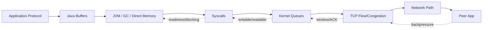
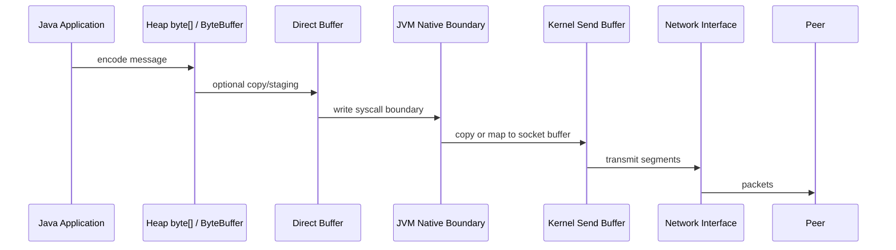
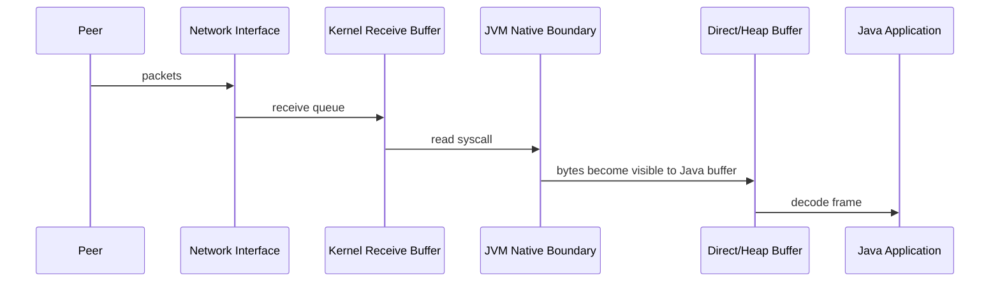
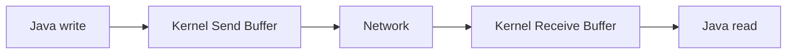
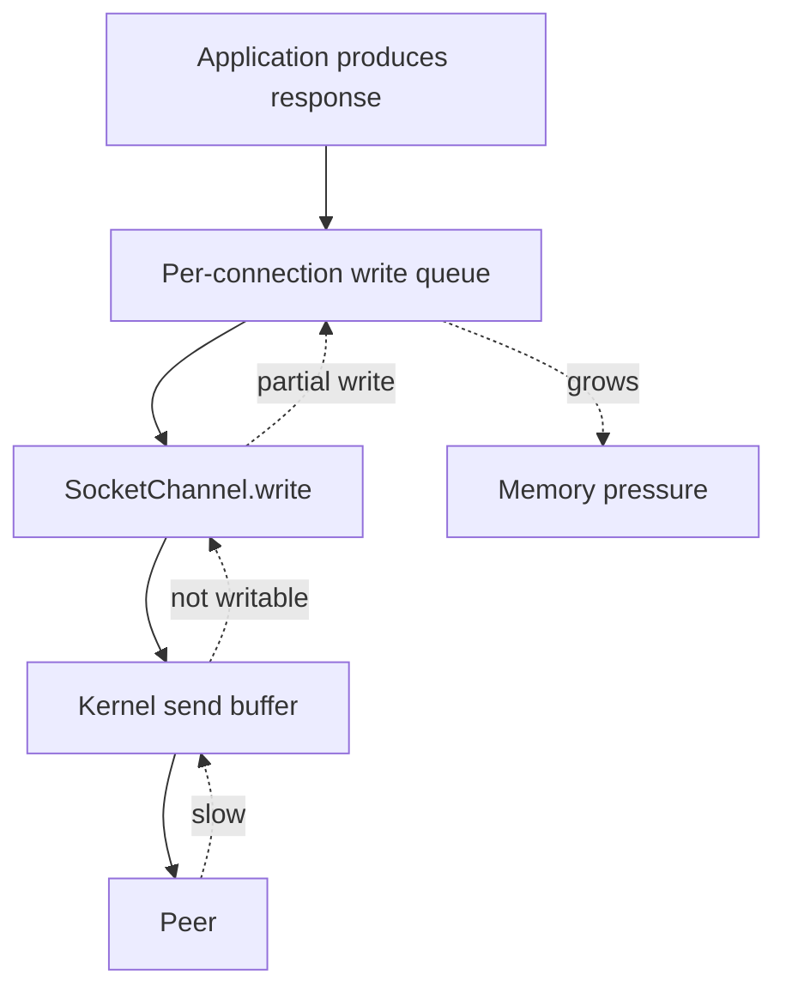
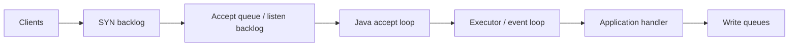
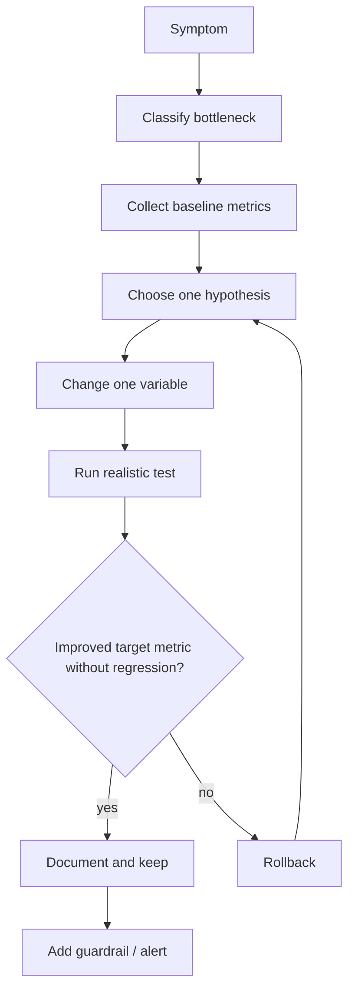

# Part 028 — Performance, Buffering, Kernel Queues, and GC Pressure

> **Core thesis:** Java networking performance is not one knob. It is the interaction between application framing, buffer ownership, syscall frequency, kernel queues, TCP behavior, allocation pressure, GC, and peer backpressure.

This part focuses on **networking-specific performance**. It does not repeat general JVM performance tuning or general concurrency. The goal is to build a practical model for why Java network clients and servers become slow, memory-heavy, or unstable under load.

A top-tier engineer does not tune sockets by superstition. They first identify which boundary is saturated.



The performance invariant:

> **Before tuning, locate the bottleneck: application CPU, allocation/GC, Java buffering, syscall overhead, kernel queue, TCP path, proxy, or peer.**

---

## 1. Kaufman Skill Map

### 1.1 Target capability

After this part, you should be able to:

- reason about heap vs direct buffers in Java networking;
- identify when allocation pressure is caused by networking code;
- reduce syscall overhead with batching, buffering, gathering writes, and streaming;
- understand what socket send/receive buffers can and cannot fix;
- diagnose slow consumers and write queue growth;
- understand Nagle, delayed ACK, small writes, and latency trade-offs;
- avoid connection churn and ephemeral port exhaustion;
- design realistic throughput and latency tests;
- produce safe tuning changes with rollback criteria.

### 1.2 Subskills

| Subskill | Why it matters | Practice target |
|---|---|---|
| Buffer model | Byte movement dominates high-throughput systems | Track ownership, lifetime, and copy points |
| Heap vs direct | Memory location affects syscall and GC behavior | Choose buffer type by workload, not dogma |
| Syscall economics | Tiny reads/writes are expensive | Batch protocol writes and avoid accidental flush loops |
| Kernel queues | Java write success does not mean peer consumed | Interpret send/receive buffer pressure |
| Flow control | Slow peer eventually becomes local memory pressure | Bound write queues and reject early |
| Nagle/delayed ACK | Small-message latency can be surprising | Decide `TCP_NODELAY` based on framing and batching |
| Connection lifecycle | Churn creates CPU, TIME_WAIT, TLS, and port pressure | Reuse connections safely |
| Benchmark design | Fake benchmarks produce wrong tuning | Test with real payload, concurrency, RTT, and slow peers |

---

## 2. The Data Path: Where Bytes Move

A simplified outbound path:



Inbound path:



Every extra copy, allocation, syscall, flush, decode, and queue has cost.

### 2.1 The four common copy points

| Copy point | Example | Risk |
|---|---|---|
| Application encoding | object -> JSON/String/byte[] | allocation and CPU |
| Framework buffering | body publisher/subscriber buffering | hidden memory growth |
| JVM/native boundary | heap buffer staged for native I/O | copy cost |
| Kernel/user boundary | socket read/write | syscall and copy cost |

### 2.2 The real question

Do not ask:

> “Should I use direct buffers everywhere?”

Ask:

> “Where are bytes allocated, copied, queued, and retained under peak load?”

---

## 3. Heap Buffers vs Direct Buffers

Java `ByteBuffer` has two broad operational families:

- **heap buffers**: backed by JVM heap memory, often accessible through an array;
- **direct buffers**: usually allocated outside normal heap and designed for efficient native I/O interaction.

### 3.1 Heap buffers

Pros:

- cheap allocation relative to direct buffers;
- normal GC visibility;
- easy array access;
- simple for small messages;
- good for protocol parsing and short-lived data.

Cons:

- may require native staging/copy for I/O;
- high churn can create GC pressure;
- large retained arrays can inflate heap;
- accidental `String`/JSON conversions multiply allocation.

### 3.2 Direct buffers

Pros:

- often better for long-lived I/O buffers;
- can reduce copying at native boundary;
- useful for NIO channels;
- useful for large or repeated socket operations.

Cons:

- higher allocation/deallocation cost;
- memory may live outside ordinary heap accounting;
- leaks/retention can be less obvious;
- too many direct buffers can create native memory pressure;
- pooling can introduce fragmentation and lifecycle bugs.

### 3.3 Decision matrix

| Workload | Prefer | Reason |
|---|---|---|
| small request/response business API | heap or framework default | simplicity usually wins |
| high-throughput NIO server | direct reusable buffers | reduce repeated native-boundary overhead |
| short-lived tiny buffers | heap | direct allocation overhead not worth it |
| large file/network transfer | streaming/direct/transfer APIs | avoid whole-body heap retention |
| protocol parser needing array operations | heap slice or staged decode | easier parsing, fewer mistakes |
| long-lived pooled socket buffers | direct with strict ownership | stable I/O path, bounded allocation |

### 3.4 Buffer ownership invariant

> **A buffer must have one clear owner at a time.**

Ambiguous buffer ownership causes:

- data corruption;
- accidental reuse before write completion;
- leaking sensitive data between connections;
- races in NIO write queues;
- unbounded retention by pending operations.

For NIO, never reuse or mutate a `ByteBuffer` that is still queued for writing.

```java
record PendingWrite(ByteBuffer buffer) {
    PendingWrite {
        if (buffer == null) throw new IllegalArgumentException("buffer is required");
    }
}
```

The object is tiny, but the invariant is large: queued bytes are immutable from the application point of view.

---

## 4. ByteBuffer Lifecycle Performance

### 4.1 Correct lifecycle

```java
ByteBuffer buffer = ByteBuffer.allocateDirect(64 * 1024);

// write data into buffer
buffer.put(data);

// switch to read-from-buffer mode
buffer.flip();

// channel consumes bytes
while (buffer.hasRemaining()) {
    channel.write(buffer);
}

// switch back to write-into-buffer mode
buffer.clear();
```

### 4.2 Common performance bugs

| Bug | Consequence |
|---|---|
| allocate buffer per read | allocation/GC/native memory churn |
| allocate direct buffer per request | expensive direct-memory churn |
| call `array()` on direct buffer | fails or forces fallback design |
| forget `flip()` | writes zero bytes or wrong bytes |
| forget `compact()` for partial frame | loses partial data or copies too much |
| keep large buffer per idle connection | memory grows with connection count |
| queue mutable buffer then reuse | corrupted outbound data |

### 4.3 Partial write loop

`SocketChannel.write` may write fewer bytes than requested, especially in non-blocking mode.

```java
while (buffer.hasRemaining()) {
    int written = channel.write(buffer);
    if (written == 0) {
        // Non-blocking channel cannot accept more now.
        // Register OP_WRITE and resume later.
        break;
    }
}
```

A performance bug often starts as a correctness bug: assuming writes are always complete.

---

## 5. Syscall Economics

Every socket `read` or `write` crosses the user/kernel boundary. That has cost.

The goal is not “minimize syscalls at all costs”. The goal is:

> **Use syscalls to move meaningful units of work without inflating latency or memory.**

### 5.1 Small write pathology

Bad:

```java
out.write(headerMagic);
out.write(version);
out.write(type);
out.write(lengthBytes);
out.write(payload);
out.flush();
```

This may produce multiple writes and tiny packets depending on buffering layers.

Better:

```java
ByteBuffer frame = ByteBuffer.allocate(HEADER_SIZE + payload.length);
frame.putInt(MAGIC);
frame.put((byte) VERSION);
frame.put((byte) type);
frame.putInt(payload.length);
frame.put(payload);
frame.flip();

while (frame.hasRemaining()) {
    channel.write(frame);
}
```

Or use gathering writes:

```java
ByteBuffer header = encodeHeader(payload.length);
ByteBuffer body = ByteBuffer.wrap(payload);

while (header.hasRemaining() || body.hasRemaining()) {
    channel.write(new ByteBuffer[] { header, body });
}
```

### 5.2 Batching trade-off

| More batching | Less batching |
|---|---|
| higher throughput | lower per-message latency |
| fewer syscalls | simpler latency model |
| better packet efficiency | faster flush for interactive protocols |
| risk of queue delay | more overhead under high rate |

For request/response systems, measure both:

- p50/p95/p99 latency;
- throughput;
- CPU per request;
- bytes per syscall if you can estimate it;
- packetization behavior if needed.

---

## 6. Nagle, Delayed ACK, and `TCP_NODELAY`

`TCP_NODELAY` disables Nagle's algorithm. In Java, this is exposed through socket options such as `setTcpNoDelay(true)` or `StandardSocketOptions.TCP_NODELAY` where supported.

### 6.1 Why this matters

Small-message protocols can suffer latency when tiny writes interact badly with TCP batching and delayed acknowledgments.

But disabling Nagle is not a universal win.

| Situation | Likely choice |
|---|---|
| interactive low-latency small messages | consider `TCP_NODELAY=true` |
| application already frames/batches well | either may be fine; measure |
| bulk transfer | Nagle usually less relevant |
| many tiny accidental writes | fix write pattern first |
| high packet rate causing overhead | batching may beat `TCP_NODELAY` |

### 6.2 Critical invariant

> `TCP_NODELAY` is not a substitute for sane application framing.

If the application emits 12 tiny writes per message, fixing the framing often beats toggling Nagle.

---

## 7. Kernel Socket Buffers

Socket buffers sit between Java and the network path.



### 7.1 Send buffer mental model

When Java writes successfully, bytes are usually accepted by the kernel. That does **not** mean the peer application has processed them.

Consequences:

- writes may look fast until the kernel send buffer fills;
- once filled, blocking writes block and non-blocking writes return zero/partial;
- an unbounded application write queue can grow before the kernel applies pressure;
- successful write is not an application-level acknowledgement.

### 7.2 Receive buffer mental model

If Java does not read fast enough:

- kernel receive buffer fills;
- TCP receive window shrinks;
- peer slows down;
- packet capture may show zero-window behavior;
- application may blame network when local consumer is slow.

### 7.3 Socket buffer options

| Option | What it influences | What it does not solve |
|---|---|---|
| `SO_SNDBUF` | kernel send buffer size hint | slow peer, unbounded app queue, bad retries |
| `SO_RCVBUF` | kernel receive buffer size hint | slow decoder, blocked event loop, memory leak |
| `SO_BACKLOG` / bind backlog | pending connection queue hint | application not accepting, SYN flood, OS caps |
| `SO_KEEPALIVE` | idle connection liveness probing | request deadline, app-level health |
| `TCP_NODELAY` | small-write batching behavior | inefficient protocol framing |

Buffer sizes are hints and may be capped or adjusted by the OS.

---

## 8. Application Write Queues

The most dangerous memory structure in a custom NIO server is often the per-connection write queue.



### 8.1 Bounded write queue pattern

```java
import java.nio.ByteBuffer;
import java.util.ArrayDeque;
import java.util.Queue;

public final class ConnectionWriteQueue {
    private final Queue<ByteBuffer> queue = new ArrayDeque<>();
    private final long maxQueuedBytes;
    private long queuedBytes;

    public ConnectionWriteQueue(long maxQueuedBytes) {
        this.maxQueuedBytes = maxQueuedBytes;
    }

    public boolean offer(ByteBuffer immutableOutboundBuffer) {
        int bytes = immutableOutboundBuffer.remaining();
        if (queuedBytes + bytes > maxQueuedBytes) {
            return false;
        }
        queue.add(immutableOutboundBuffer);
        queuedBytes += bytes;
        return true;
    }

    public ByteBuffer peek() {
        return queue.peek();
    }

    public void removeFullyWrittenHead(ByteBuffer head) {
        if (head.hasRemaining()) {
            throw new IllegalStateException("head still has remaining bytes");
        }
        ByteBuffer removed = queue.remove();
        queuedBytes -= removed.limit(); // assumes position started at 0 and limit represented original length
    }

    public long queuedBytes() {
        return queuedBytes;
    }

    public boolean isEmpty() {
        return queue.isEmpty();
    }
}
```

In production, track original length explicitly instead of relying on buffer limit. The important design is the bounded byte budget.

### 8.2 Slow-consumer policy

When the queue is full, options include:

| Policy | Use when |
|---|---|
| reject new request on connection | request/response protocol can signal overload |
| close connection gracefully | peer is too slow or protocol cannot recover |
| drop low-priority messages | telemetry/event stream with loss tolerance |
| apply per-tenant quota | multi-tenant fairness required |
| shed load globally | system is overloaded, not one peer |

Never let slow consumers create unbounded memory growth.

---

## 9. Read-Side Backpressure and Decoder Pressure

Inbound bytes are not free.

A high-throughput server can be overwhelmed by:

- reading faster than it can decode;
- decoding faster than business logic can process;
- accepting new frames while prior frames are still queued;
- buffering large incomplete frames;
- allowing many connections to each hold partial large frames.

### 9.1 Defensive decoder limits

Every protocol decoder needs:

- maximum frame length;
- maximum header length;
- maximum metadata count;
- maximum in-flight requests per connection;
- maximum aggregate pending bytes per connection;
- timeout for incomplete frame;
- close reason for limit violation.

```java
public final class FrameLimits {
    public static final int MAX_FRAME_BYTES = 1 * 1024 * 1024;
    public static final int MAX_HEADER_BYTES = 16 * 1024;
    public static final int MAX_IN_FLIGHT = 64;
    public static final long MAX_PENDING_BYTES = 8L * 1024 * 1024;
}
```

### 9.2 Large incomplete frame attack

If a client sends a frame length of 500 MB and then slowly sends bytes, a naïve decoder may allocate 500 MB or retain a growing buffer.

Correct behavior:

1. read length field;
2. validate length against policy;
3. reject before allocation;
4. close or drain according to protocol;
5. log close reason safely.

---

## 10. Connection Churn and Pooling

Opening a connection is expensive:

- DNS lookup;
- TCP handshake;
- TLS handshake;
- authentication/proxy negotiation;
- kernel state;
- file descriptor;
- ephemeral port;
- TIME_WAIT after close;
- CPU and allocation in Java and peer.

Connection reuse can improve performance dramatically, but stale reuse can cause resets.

### 10.1 Pooling trade-off

| More reuse | Less reuse |
|---|---|
| lower handshake overhead | fewer stale idle surprises |
| better throughput | simpler failure semantics |
| less port churn | lower long-lived resource retention |
| can multiplex HTTP/2 | avoids cross-request coupling |

### 10.2 Churn symptoms

| Symptom | Possible cause |
|---|---|
| many `TIME-WAIT` sockets | no pooling, short-lived connections |
| ephemeral port exhaustion | too many outbound connections to same tuple |
| high TLS CPU | connection reuse disabled or low |
| sporadic reset after idle | pool keeps sockets longer than infrastructure |
| load balancer unevenness | long-lived pools stick to old backend set |

### 10.3 Practical rule

> Reuse connections, but make idle lifetime shorter than the least predictable infrastructure idle timeout, and retry only safe operations.

---

## 11. File Descriptors and Accept Pressure

Every socket consumes a file descriptor. A high-scale Java server needs operational limits.

### 11.1 Symptoms of descriptor pressure

- `Too many open files`;
- accept failures;
- inability to open files/logs;
- outbound connection failures;
- many leaked sockets;
- `CLOSE-WAIT` buildup;
- stuck graceful shutdown.

### 11.2 Basic checks

```bash
ulimit -n
ls /proc/<pid>/fd | wc -l
lsof -Pan -p <pid> -i
ss -tanp | grep <pid>
```

### 11.3 Server accept-loop invariant

> A server must be able to reject, drain, or close under overload. Merely accepting everything moves the overload into application memory.

Admission control points:

- listen backlog;
- accept loop rate;
- max active connections;
- per-IP/tenant connection limit;
- TLS handshake limit;
- max in-flight requests;
- write queue budget;
- graceful overload response.

---

## 12. HTTP Client Performance Traps

### 12.1 `BodyHandlers.ofString()` on large responses

Convenient:

```java
HttpResponse<String> response = client.send(request, HttpResponse.BodyHandlers.ofString());
```

Dangerous for large bodies:

- full body retained in memory;
- byte-to-char decoding allocation;
- possible duplicate copies;
- logs may accidentally print huge response;
- GC pressure grows with payload size and concurrency.

Prefer streaming/file handlers for large responses.

```java
HttpResponse<Path> response = client.send(
        request,
        HttpResponse.BodyHandlers.ofFile(Path.of("/tmp/download.bin"))
);
```

### 12.2 `BodyPublishers.ofString()` for large uploads

For large uploads, avoid prebuilding giant `String` payloads when possible.

Prefer:

- `ofFile` for file upload;
- streaming publisher for generated content;
- chunked/streaming design when protocol allows;
- bounded producer.

### 12.3 Async is not automatically faster

`sendAsync` improves composition and non-blocking API style. It does not remove:

- network latency;
- server bottleneck;
- body buffering;
- executor contention;
- memory pressure;
- backpressure responsibilities.

Virtual threads may be simpler for many blocking request/response workloads. NIO/async can be better for massive multiplexing or event-driven designs, but only if backpressure is implemented correctly.

---

## 13. Raw Socket Performance Traps

| Trap | Why it hurts | Better design |
|---|---|---|
| one thread per connection with platform threads at huge scale | stack/thread scheduling overhead | virtual threads or NIO depending workload |
| unbounded executor after accept | overload becomes queue explosion | bounded executor/admission control |
| `BufferedReader.readLine()` for untrusted protocol | line length unbounded, charset ambiguity | explicit frame length and decoder limits |
| `PrintWriter` auto-flush tiny writes | packet/syscall overhead | explicit framing/batching |
| allocate byte array per message | GC pressure | reusable buffers or controlled pooling |
| read full body before validating | memory exhaustion | validate length early and stream |
| write queue stores business objects | retention and serialization delay | encode bounded immutable byte buffers |

---

## 14. GC Pressure from Networking

Networking code creates GC pressure through:

- per-request byte arrays;
- temporary `String` conversions;
- JSON/XML serialization;
- header maps;
- log message construction;
- exception stack traces under failure storms;
- buffering full request/response bodies;
- wrapper objects in async pipelines;
- per-frame allocations in custom protocols.

### 14.1 Allocation amplification example

A 1 MB JSON response may become:

- 1 MB network byte buffer;
- 1 MB byte array;
- 2 MB+ UTF-16 `String` depending representation and content;
- parsed object graph;
- logging copy or substring;
- validation/error copy;
- cache copy.

The network payload size is not the heap cost.

### 14.2 GC-aware network design

| Design rule | Why |
|---|---|
| Stream large bodies | avoid full heap retention |
| Decode incrementally | reduce peak memory |
| Avoid body logging | prevents massive accidental allocation |
| Bound concurrency by bytes, not only requests | 100 x 100 MB is not like 100 x 1 KB |
| Use histograms for payload size | average hides dangerous tails |
| Prefer reusable buffers for stable hot paths | reduce allocation churn |
| Avoid pooling tiny short-lived objects blindly | pool overhead can exceed GC cost |

### 14.3 Track bytes in flight

Concurrency limits should include payload size.

```java
import java.util.concurrent.Semaphore;

public final class ByteBudget {
    private final Semaphore permits;
    private final int chunkSize;

    public ByteBudget(long maxBytes, int chunkSize) {
        this.chunkSize = chunkSize;
        this.permits = new Semaphore(Math.toIntExact(maxBytes / chunkSize));
    }

    public Lease acquire(long bytes) throws InterruptedException {
        int units = Math.max(1, Math.toIntExact((bytes + chunkSize - 1) / chunkSize));
        permits.acquire(units);
        return new Lease(units);
    }

    public final class Lease implements AutoCloseable {
        private final int units;
        private boolean closed;

        private Lease(int units) {
            this.units = units;
        }

        @Override
        public void close() {
            if (!closed) {
                closed = true;
                permits.release(units);
            }
        }
    }
}
```

This is a crude pattern, but the principle matters: large transfers need byte-level admission control.

---

## 15. Buffer Pooling: Useful but Dangerous

Buffer pooling can reduce allocation churn. It can also create severe bugs.

### 15.1 Pool only when evidence supports it

Good reasons:

- allocation profile shows hot buffer allocation;
- buffers are large and frequently reused;
- lifetime is clear;
- contention is low;
- ownership can be enforced;
- leak detection exists.

Bad reasons:

- “pooling is always faster”;
- avoiding GC without measuring;
- pooling tiny objects;
- sharing mutable buffers across threads;
- no maximum pool size;
- no cleanup on error path.

### 15.2 Minimal lease pattern

```java
import java.nio.ByteBuffer;
import java.util.ArrayDeque;

public final class SimpleBufferPool {
    private final ArrayDeque<ByteBuffer> pool = new ArrayDeque<>();
    private final int bufferSize;
    private final int maxPoolSize;

    public SimpleBufferPool(int bufferSize, int maxPoolSize) {
        this.bufferSize = bufferSize;
        this.maxPoolSize = maxPoolSize;
    }

    public synchronized Lease acquire() {
        ByteBuffer buffer = pool.pollFirst();
        if (buffer == null) {
            buffer = ByteBuffer.allocateDirect(bufferSize);
        }
        buffer.clear();
        return new Lease(buffer);
    }

    private synchronized void release(ByteBuffer buffer) {
        buffer.clear();
        if (pool.size() < maxPoolSize) {
            pool.addFirst(buffer);
        }
    }

    public final class Lease implements AutoCloseable {
        private ByteBuffer buffer;

        private Lease(ByteBuffer buffer) {
            this.buffer = buffer;
        }

        public ByteBuffer buffer() {
            if (buffer == null) throw new IllegalStateException("released");
            return buffer;
        }

        @Override
        public void close() {
            if (buffer != null) {
                ByteBuffer b = buffer;
                buffer = null;
                release(b);
            }
        }
    }
}
```

This is not a recommendation to use this exact pool. It demonstrates required invariants:

- bounded pool size;
- explicit lease;
- clear-on-acquire/release;
- no use after release;
- no unbounded retention.

---

## 16. Zero-Copy and File Transfer

Zero-copy means avoiding unnecessary copies between user space and kernel space. In Java, file/channel APIs may allow optimized transfer paths depending on OS, filesystem, channel type, and TLS/protocol layers.

### 16.1 `FileChannel.transferTo`

```java
try (FileChannel file = FileChannel.open(path);
     SocketChannel socket = SocketChannel.open(remote)) {

    long position = 0;
    long size = file.size();

    while (position < size) {
        long sent = file.transferTo(position, size - position, socket);
        if (sent == 0) {
            // For non-blocking sockets, register OP_WRITE and resume later.
            // For blocking sockets, investigate if this repeats unexpectedly.
            Thread.onSpinWait();
        } else {
            position += sent;
        }
    }
}
```

### 16.2 Caveats

| Caveat | Why |
|---|---|
| TLS may prevent simple zero-copy | bytes must be encrypted in user/JVM space or engine path |
| non-blocking transfer can return zero | socket not writable now |
| OS-specific limits exist | one call may not transfer all bytes |
| application framing may need headers/trailers | use gathering writes or protocol-aware transfer |
| send success still does not mean peer consumed | kernel accepted bytes |

Zero-copy is useful for large file serving, but it does not eliminate protocol, backpressure, or timeout design.

---

## 17. Kernel Queues and Backlog

A Java server sits behind several queues.



### 17.1 Queue failure modes

| Queue | Saturation symptom | Fix direction |
|---|---|---|
| SYN backlog | connection attempts vanish or retry | OS/network tuning, SYN flood protection, capacity |
| accept queue | clients connect slowly or time out | accept faster, increase backlog, reduce handler blocking |
| executor queue | accepted but not processed | bounded executor, backpressure, virtual threads, admission control |
| app queue | requests wait internally | capacity model, shed load |
| write queue | memory grows, slow clients | per-connection byte budget, close/reject |

### 17.2 Backlog is not capacity planning

A larger backlog can absorb bursts, but it does not make the application process faster.

If the handler is slow, backlog only changes where waiting happens.

---

## 18. Throughput vs Tail Latency

Networking performance work often fails because teams optimize only throughput.

| Optimization | Throughput effect | Tail-latency risk |
|---|---|---|
| large batches | improves | messages wait longer |
| large buffers | improves burst absorption | hides slow consumers and increases memory |
| high concurrency | improves utilization | queueing and GC pressure |
| aggressive pooling | reduces allocation | contention/leaks/retention |
| long keepalive | reduces handshakes | stale connection resets/load imbalance |
| compression | reduces bytes | increases CPU and latency variance |

For production services, p99 behavior is often more important than peak throughput.

---

## 19. Benchmarking Java Networking Correctly

### 19.1 Bad benchmark signs

- localhost only;
- no TLS when production uses TLS;
- no proxy/load balancer when production has one;
- fixed tiny payload only;
- no slow consumers;
- no packet loss/RTT simulation;
- no GC/JFR capture;
- average latency only;
- no warmup;
- no connection churn scenario;
- client and server on same overloaded machine;
- debug logging enabled accidentally;
- unrealistic concurrency distribution.

### 19.2 Minimum benchmark matrix

| Dimension | Values to test |
|---|---|
| payload size | p50, p95, max realistic |
| concurrency | normal, peak, overload |
| protocol | HTTP/1.1, HTTP/2, raw TCP if relevant |
| TLS | on, same config as production |
| RTT | local, same-region, cross-region if relevant |
| consumer speed | normal, slow, stalled |
| connection lifecycle | warm pool, cold start, churn |
| failure | reset, timeout, partial body, DNS delay |
| runtime | GC logs/JFR enabled for observation |

### 19.3 Metrics to collect

| Category | Metrics |
|---|---|
| Application | throughput, p50/p95/p99/p999 latency, errors, retries |
| Network | bytes/sec, packets/sec, retransmits, resets, connection count |
| JVM | allocation rate, GC pauses, direct memory, thread count, JFR socket events |
| OS | CPU, context switches, file descriptors, socket states, queue drops |
| Protocol | HTTP status, stream resets, body bytes, queue time |

---

## 20. Tuning Workflow

Never tune randomly.



### 20.1 Tuning decision table

| Symptom | First hypothesis | Evidence | Possible change |
|---|---|---|---|
| high GC during downloads | full body buffering | allocation/JFR heap profile | stream to file or process chunks |
| high CPU with tiny writes | syscall/packet overhead | packet capture, profiler | batch frame writes, gathering write |
| high p99 under slow clients | write queue growth | queued bytes, zero window | bound queue, close slow consumers |
| connect timeouts under burst | accept/backlog/network path | SYN/accept queue, server load | admission control, backlog/accept tuning |
| resets after idle | stale pooled connection | reset aligns with idle age | lower keepalive, safe retry |
| direct memory pressure | direct buffer churn/leak | NMT/JFR/allocation | reuse, bound pool, reduce direct allocation |
| port exhaustion | connection churn | TIME_WAIT, ephemeral port use | pool/reuse, reduce churn, scale source IPs |
| HTTP/2 stalls | flow-control/body consumption | frame logs, body timing | consume faster, tune concurrency, split workloads |

---

## 21. Practical Java Patterns

### 21.1 Bounded streaming download

```java
import java.io.InputStream;
import java.net.http.HttpResponse;
import java.nio.file.Files;
import java.nio.file.Path;

public final class BoundedFileBodyHandler {
    public static HttpResponse.BodyHandler<Path> toFile(Path target, long maxBytes) {
        return responseInfo -> HttpResponse.BodySubscribers.mapping(
                HttpResponse.BodySubscribers.ofInputStream(),
                input -> copy(input, target, maxBytes)
        );
    }

    private static Path copy(InputStream input, Path target, long maxBytes) {
        long total = 0;
        byte[] buffer = new byte[64 * 1024];
        try (InputStream in = input; var out = Files.newOutputStream(target)) {
            int read;
            while ((read = in.read(buffer)) != -1) {
                total += read;
                if (total > maxBytes) {
                    throw new IllegalStateException("response body too large");
                }
                out.write(buffer, 0, read);
            }
            return target;
        } catch (Exception e) {
            throw new RuntimeException(e);
        }
    }
}
```

### 21.2 Batching encoder

```java
import java.nio.ByteBuffer;
import java.nio.charset.StandardCharsets;

public final class FrameEncoder {
    private static final int MAGIC = 0xCAFE_BABE;

    public static ByteBuffer encode(byte type, String payload) {
        byte[] body = payload.getBytes(StandardCharsets.UTF_8);
        ByteBuffer buffer = ByteBuffer.allocate(4 + 1 + 4 + body.length);
        buffer.putInt(MAGIC);
        buffer.put(type);
        buffer.putInt(body.length);
        buffer.put(body);
        buffer.flip();
        return buffer.asReadOnlyBuffer();
    }
}
```

### 21.3 Per-connection byte budget

```java
public final class ConnectionBudget {
    private final long maxQueuedBytes;
    private long queued;

    public ConnectionBudget(long maxQueuedBytes) {
        this.maxQueuedBytes = maxQueuedBytes;
    }

    public boolean reserve(long bytes) {
        if (bytes < 0) throw new IllegalArgumentException("bytes must be non-negative");
        if (queued + bytes > maxQueuedBytes) return false;
        queued += bytes;
        return true;
    }

    public void release(long bytes) {
        queued -= bytes;
        if (queued < 0) queued = 0;
    }

    public long queued() {
        return queued;
    }
}
```

---

## 22. Performance Anti-Patterns

| Anti-pattern | Why it fails |
|---|---|
| “Increase all buffers” | hides bottleneck and increases memory |
| “Use async everywhere” | moves complexity without removing network limits |
| “Use direct buffers everywhere” | direct allocation/leak pressure |
| “Disable Nagle always” | may increase packets without fixing framing |
| “Log full payload under load” | destroys latency and leaks data |
| “Retry all network errors” | amplifies overload |
| “Benchmark on localhost only” | ignores RTT, TLS, proxy, congestion |
| “Unbounded queue to protect callers” | converts backpressure into OOM |
| “One timeout for everything” | hides phase and budget problems |
| “Trust average latency” | tail latency is where network systems fail |

---

## 23. Deliberate Practice Drills

### Drill 1 — Small write benchmark

Implement two raw TCP clients:

1. writes header fields separately;
2. writes one encoded frame.

Measure:

- throughput;
- p99 latency;
- CPU;
- packet count;
- syscall profile if available.

### Drill 2 — Slow consumer pressure

Create a server that accepts responses but reads slowly.

Observe:

- Java write duration;
- NIO partial writes;
- write queue bytes;
- packet zero-window behavior if visible;
- heap/direct memory.

### Drill 3 — Heap vs direct buffer allocation

Run three variants:

- allocate heap buffer per request;
- allocate direct buffer per request;
- reuse bounded direct buffers.

Measure:

- allocation rate;
- GC pauses;
- direct/native memory;
- throughput;
- tail latency.

### Drill 4 — Large HTTP response handling

Compare:

- `BodyHandlers.ofString()`;
- `BodyHandlers.ofByteArray()`;
- `BodyHandlers.ofFile()`;
- custom streaming subscriber.

Use payloads: 100 KB, 10 MB, 500 MB.

### Drill 5 — Connection churn

Compare:

- new connection per request;
- pooled HTTP/1.1;
- HTTP/2 multiplexing if supported.

Measure:

- TLS handshakes/sec;
- TIME_WAIT count;
- CPU;
- latency;
- reset behavior after idle.

---

## 24. Production Readiness Checklist

A production Java networking component should have:

- [ ] bounded request body size;
- [ ] bounded response body size;
- [ ] bounded per-connection write queue;
- [ ] bounded global bytes in flight;
- [ ] timeout/deadline per operation;
- [ ] clear heap vs direct buffer strategy;
- [ ] no direct buffer allocation in hot path unless measured;
- [ ] no full-body buffering for large payloads;
- [ ] no unbounded `String` conversion for network bodies;
- [ ] payload-size histograms;
- [ ] allocation-rate metrics/JFR profile;
- [ ] socket state monitoring for `TIME-WAIT`/`CLOSE-WAIT`;
- [ ] file descriptor usage monitoring;
- [ ] connection pool lifecycle policy;
- [ ] safe retry policy for stale connections;
- [ ] slow-consumer policy;
- [ ] benchmark matrix matching production path;
- [ ] rollback plan for every tuning change;
- [ ] documented performance invariants.

---

## 25. Key Takeaways

1. Java networking performance is a cross-boundary problem: app, buffer, JVM, syscall, kernel, TCP, peer.
2. Heap buffers are simple; direct buffers can be efficient but have higher allocation cost and less obvious memory footprint.
3. Partial reads/writes are both correctness and performance concerns.
4. Socket buffers absorb bursts; they do not prove peer consumption.
5. Unbounded write queues are one of the fastest paths to production OOM.
6. `TCP_NODELAY` can help small-message latency, but framing and batching matter more.
7. Connection reuse reduces handshake and port pressure but introduces stale-idle failure modes.
8. Benchmarks must include realistic payloads, TLS, RTT, concurrency, slow consumers, and failure.
9. Tune one hypothesis at a time and keep rollback criteria.

---

## 26. References

- Java SE 25 — `ByteBuffer` API documentation.
- Java SE 25 — `java.nio.channels` package documentation.
- Java SE 25 — `Socket`, `SocketChannel`, `ServerSocketChannel`, and `StandardSocketOptions` API documentation.
- Java SE 25 — `java.net.http` API documentation.
- Java SE 25 — JDK Flight Recorder troubleshooting documentation.
- RFC 9293 — Transmission Control Protocol.
- RFC 9110 — HTTP Semantics.
- RFC 9113 — HTTP/2.

---

**Series status:** belum selesai. Lanjut ke Part 029.
