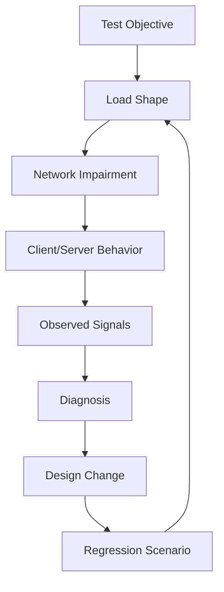
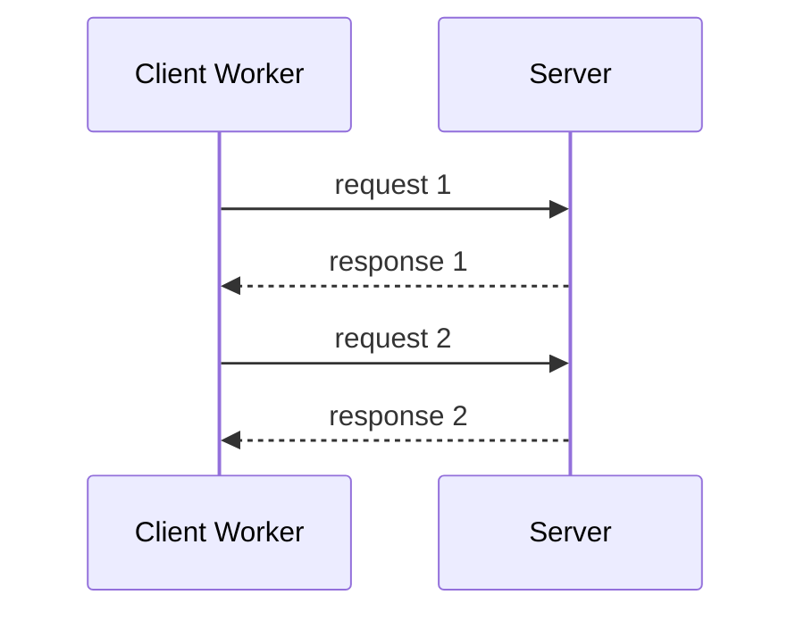
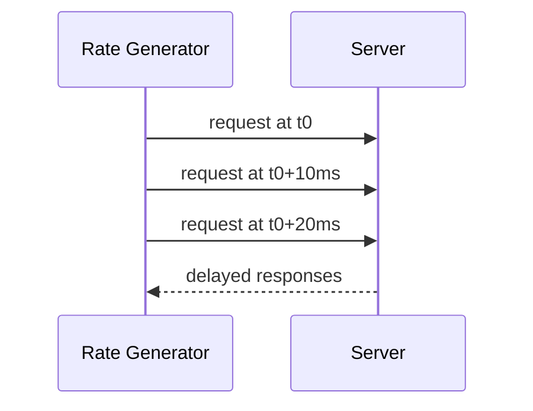
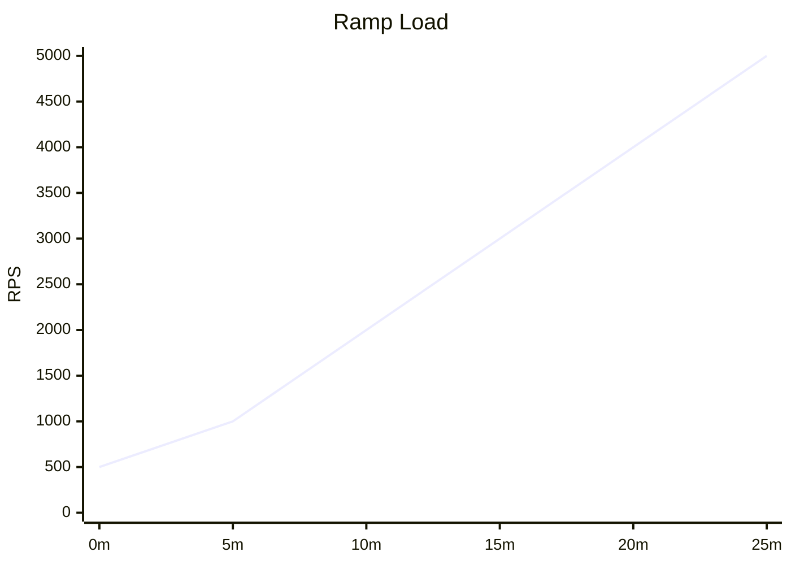
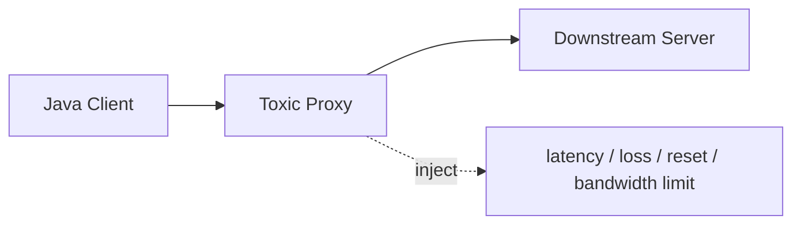
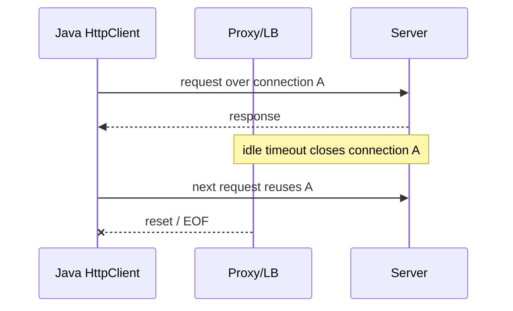
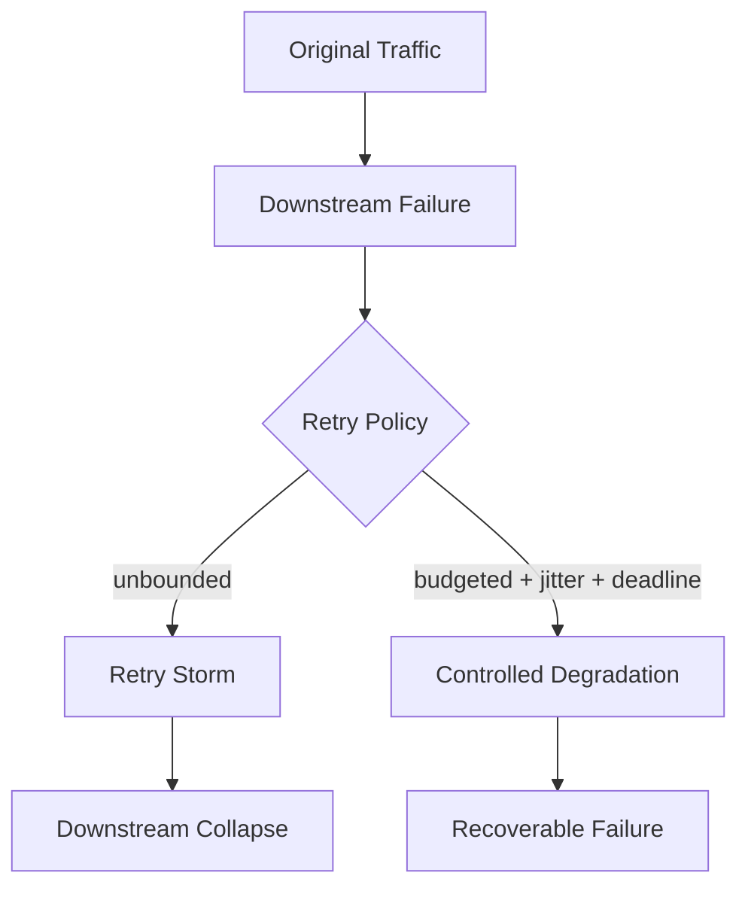
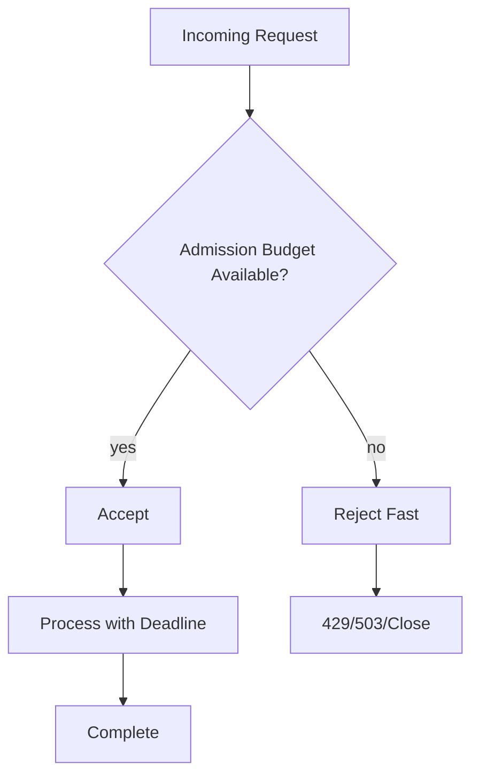
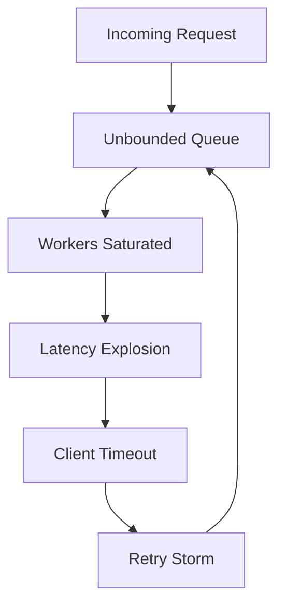
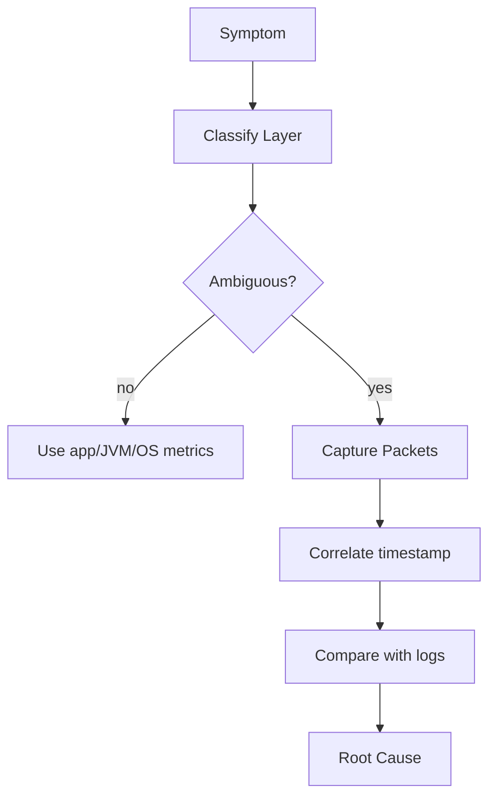

# Part 029 — Load Testing, Chaos, and Failure Injection

> Goal: kamu tidak hanya bisa menjalankan load test, tetapi bisa membuktikan bahwa network client/server Java tetap benar saat latency naik, DNS bermasalah, TCP reset terjadi, proxy mati, TLS gagal, koneksi bocor, dan downstream mulai lambat.

Part sebelumnya membahas performance path: buffer, kernel queue, syscall, GC pressure, dan benchmark trap. Part ini menjawab pertanyaan berikutnya: **bagaimana kita tahu desain networking kita benar ketika dunia nyata tidak ideal?**

Di lingkungan production, network jarang gagal secara bersih. Ia bisa lambat, partial, flapping, asymmetric, overloaded, proxied, stale, misconfigured, atau terlihat sehat di satu layer tetapi rusak di layer lain. Engineer level senior tidak menunggu incident untuk belajar pola kegagalan tersebut. Ia membangun test harness yang memaksa sistem mengalami kondisi buruk secara terkontrol.

---

## 1. Kaufman Skill Deconstruction

Menurut pendekatan Kaufman, skill kompleks harus dipecah menjadi sub-skill kecil yang bisa dilatih. Untuk load testing dan failure injection pada Java networking, sub-skill-nya adalah:

| Sub-skill | Yang harus dikuasai | Output praktis |
|---|---|---|
| Define target behavior | Menentukan SLO, invariant, limit, dan acceptable degradation | Test objective yang bukan sekadar RPS |
| Model network failure | Memetakan failure di DNS, TCP, TLS, HTTP, proxy, app protocol | Failure matrix |
| Build load shape | Membuat baseline, ramp, spike, soak, burst, dan overload | Load profile yang realistis |
| Instrument before testing | Menyiapkan metrics, logs, traces, JFR, OS counters, packet evidence | Observability-ready test |
| Inject impairment | Delay, jitter, packet loss, reset, blackhole, DNS failure, TLS failure | Controlled failure environment |
| Interpret result | Membedakan capacity limit, bug, overload, queueing, dan client misuse | Root cause hypothesis |
| Stabilize design | Deadline, retry budget, pooling, backpressure, admission control | Remediation yang terarah |

### Learning objective

Setelah part ini kamu harus bisa:

1. Mendesain load test yang menguji **correctness under pressure**, bukan hanya throughput.
2. Membedakan test untuk **capacity**, **latency**, **resilience**, **soak**, dan **chaos**.
3. Menginjeksi failure network secara aman di local, staging, dan controlled production.
4. Membaca gejala Java networking dari sisi client, server, JVM, OS, dan wire.
5. Mengubah hasil test menjadi keputusan arsitektur yang defensible.

---

## 2. Core Mental Model: Load Test Is a Controlled Contract Trial

Load test bukan perlombaan angka RPS. Load test adalah sidang pembuktian kontrak:

- client contract: apakah client punya timeout, deadline, retry budget, dan cancellation yang benar?
- server contract: apakah server punya admission control, bounded queue, graceful degradation, dan close semantics?
- protocol contract: apakah framing, stream consumption, WebSocket close, dan HTTP status behavior benar?
- resource contract: apakah CPU, heap, direct memory, FD, ephemeral port, socket buffer, dan thread dipakai sesuai batas?
- failure contract: apakah sistem gagal secara eksplisit dan recoverable, bukan silent corruption?



Invariant utamanya:

> Test yang baik menghasilkan keputusan. Kalau setelah test kamu hanya punya grafik, tetapi tidak tahu apa yang harus diubah, test itu belum selesai.

---

## 3. Load Testing vs Chaos vs Failure Injection

Ketiganya sering dicampur, padahal tujuan dan risikonya berbeda.

| Practice | Tujuan | Pertanyaan utama | Contoh |
|---|---|---|---|
| Load testing | Mengukur behavior di bawah beban tertentu | Berapa throughput/latency/error rate pada load X? | 1000 concurrent HTTP calls selama 30 menit |
| Stress testing | Mencari batas patah | Di titik mana sistem degrade atau collapse? | Naikkan concurrency sampai p99 meledak |
| Soak testing | Mencari leak dan drift jangka panjang | Apakah sistem stabil selama durasi panjang? | 8 jam traffic stabil |
| Spike testing | Menguji burst | Apa yang terjadi saat traffic naik tiba-tiba? | 10x load dalam 30 detik |
| Failure injection | Menguji failure spesifik | Apakah timeout/retry/deadline bekerja? | Inject 5% TCP reset |
| Chaos engineering | Menguji ketahanan sistem terhadap real-world uncertainty | Apakah invariant bisnis tetap aman saat dependency kacau? | Matikan satu proxy/zone/downstream |

Failure injection adalah teknik. Chaos adalah disiplin eksperimen. Load testing adalah lingkungan tekanan. Untuk Java networking, ketiganya saling melengkapi.

---

## 4. Jangan Mulai dari Tool, Mulai dari Invariant

Kesalahan umum: langsung memilih JMeter, Gatling, k6, wrk, vegeta, tc, toxiproxy, atau chaos mesh tanpa mendefinisikan invariant.

Invariant adalah kondisi yang harus tetap benar meskipun load/failure berubah.

Contoh invariant untuk network client:

- tidak ada request tanpa deadline;
- retry tidak boleh melewati retry budget;
- cancellation harus menghentikan work yang tidak perlu;
- response body harus selalu dikonsumsi atau dibatalkan dengan benar;
- connection pool tidak boleh tumbuh tak terkendali;
- error harus diklasifikasi, bukan semua jadi `RuntimeException` generik;
- retry hanya untuk operation yang aman atau punya idempotency key;
- private/internal destination tidak boleh bisa diakses lewat user-controlled URL.

Contoh invariant untuk network server:

- accept loop tidak boleh menerima lebih cepat dari kemampuan proses;
- backlog penuh harus degrade secara eksplisit;
- per-connection memory bounded;
- slow client tidak boleh memblokir semua worker;
- graceful shutdown harus menghentikan accept, drain request aktif, dan close idle connection;
- parser tidak boleh membaca payload tak terbatas;
- partial frame tidak boleh dianggap message valid;
- overload tidak boleh menghasilkan data corruption.

---

## 5. Failure Matrix untuk Java Networking

Sebelum menulis test, buat failure matrix. Ini adalah peta kegagalan dari layer bawah sampai aplikasi.

| Layer | Failure | Gejala Java | Risiko desain | Test injection |
|---|---|---|---|---|
| DNS | NXDOMAIN | `UnknownHostException` | retry salah target, cache negatif terlalu lama | resolver palsu, hosts override |
| DNS | slow lookup | request timeout tampak tidak konsisten | thread tertahan sebelum connect | DNS proxy delay |
| TCP connect | refused | `ConnectException: Connection refused` | service discovery salah, retry storm | connect ke port tertutup |
| TCP connect | blackhole | connect timeout | thread/socket tertahan | firewall drop / `tc` blackhole |
| TCP established | reset | `SocketException: Connection reset` | pooled connection stale | proxy reset |
| TCP established | slow read | request timeout / read timeout | queueing, resource retention | delayed response body |
| TCP established | slow write | write blocked / NIO write queue tumbuh | OOM karena outbound queue | slow receiver |
| TLS | bad cert | `SSLHandshakeException` | fallback tidak aman | cert self-signed/expired |
| TLS | SNI mismatch | handshake failure | host verification salah | virtual host cert mismatch |
| HTTP | 503 | HTTP response valid tapi unavailable | retry overload | fake downstream 503 |
| HTTP | partial body | EOF / protocol exception | parser/data corruption | close mid-body |
| Proxy | proxy auth fail | 407 / connect fail | hidden egress dependency | proxy requiring auth |
| Pool | stale idle | first request fails after idle | no retry-once policy | close idle server side |
| Client | no deadline | hung futures | resource leak | never-ending body |
| Server | overload | p99/p999 runaway | unbounded queue | open loop load |

Gunakan matrix ini sebagai regression suite. Setiap incident networking yang pernah terjadi harus menjadi baris baru.

---

## 6. Load Shape: Closed Loop vs Open Loop

Load test networking sering salah karena tidak memahami perbedaan closed loop dan open loop.

### Closed-loop load

Client berikutnya dikirim setelah response sebelumnya selesai.



Karakteristik:

- mudah dibuat;
- cocok untuk latency baseline;
- throughput turun otomatis saat server lambat;
- bisa menyembunyikan overload karena arrival rate ikut melambat.

### Open-loop load

Request dikirim berdasarkan rate eksternal, tidak menunggu response sebelumnya selesai.



Karakteristik:

- lebih realistis untuk arrival-driven traffic;
- bisa menunjukkan queue buildup;
- lebih berbahaya karena bisa menghancurkan sistem;
- wajib punya safety limit.

Untuk production-grade testing, gunakan keduanya:

- closed-loop untuk mencari latency per-user experience;
- open-loop untuk menguji admission control dan overload behavior.

---

## 7. Load Profile yang Wajib Dimiliki

### 7.1 Baseline test

Tujuan: mengetahui behavior normal.

Parameter:

- concurrency rendah sampai sedang;
- no impairment;
- warm-up cukup;
- data payload representatif;
- metrics lengkap.

Output:

- p50/p95/p99 latency;
- throughput;
- error rate;
- CPU, heap, direct memory;
- connection count;
- FD count;
- GC behavior;
- socket states.

### 7.2 Ramp test

Tujuan: menemukan titik nonlinear.



Cari titik ketika:

- p99 mulai naik lebih cepat dari throughput;
- error rate muncul;
- queue length naik;
- CPU belum penuh tetapi latency naik, tanda bottleneck I/O/pool/downstream;
- FD atau ephemeral port mendekati batas.

### 7.3 Spike test

Tujuan: melihat shock absorber.

Pertanyaan:

- Apakah connection pool meledak?
- Apakah retry langsung memperparah spike?
- Apakah server punya admission control?
- Apakah p999 kembali normal setelah spike selesai?

### 7.4 Soak test

Tujuan: mencari leak.

Durasi minimal tergantung sistem, tetapi untuk jaringan biasanya cukup panjang untuk melewati:

- beberapa rotasi DNS TTL;
- idle connection timeout;
- TLS session lifecycle;
- proxy idle timeout;
- GC full cycle;
- log rotation;
- token refresh jika client memakai auth.

Cari drift:

- FD count naik terus;
- established connection tidak turun;
- direct memory naik;
- pending future naik;
- WebSocket listener stuck;
- response body not consumed;
- executor queue naik.

### 7.5 Overload test

Tujuan: membuktikan sistem gagal dengan aman.

Tanda overload sehat:

- request baru ditolak cepat;
- error eksplisit seperti 429/503;
- latency request yang diterima tetap bounded;
- memory tidak naik tak terkendali;
- recovery cepat setelah load turun.

Tanda overload buruk:

- semua request melambat;
- timeout terjadi di client, bukan ditolak di server;
- retry storm;
- connection leak;
- GC thrash;
- thread starvation;
- server butuh restart untuk recovery.

---

## 8. Metrics Minimal untuk Network Load Test

Jangan menjalankan load/failure test tanpa telemetry. Tanpa telemetry, kamu hanya tahu bahwa sesuatu lambat, bukan kenapa.

### Client metrics

| Metric | Kenapa penting |
|---|---|
| request rate | arrival pressure |
| success/error count by category | failure classification |
| connect latency | network/path/service availability |
| TLS handshake latency | certificate/proxy/CPU issue |
| time to first byte | server queue/downstream latency |
| body transfer duration | slow stream/backpressure |
| total deadline exceeded | budget violation |
| retry count | amplification risk |
| in-flight requests | concurrency pressure |
| connection pool stats | reuse/churn/stale connections |
| cancellation count | cleanup behavior |

### Server metrics

| Metric | Kenapa penting |
|---|---|
| accepted connection rate | front-door pressure |
| active connection count | resource pressure |
| rejected/admitted requests | admission behavior |
| request queue depth | overload early signal |
| read/write bytes | throughput and slow peers |
| parser errors | malformed/partial traffic |
| write queue size | slow consumer |
| close reason | graceful vs reset vs timeout |
| FD usage | OS limit |
| heap/direct memory | buffer pressure |

### OS/network metrics

| Metric | Makna |
|---|---|
| `ESTABLISHED` sockets | live connections |
| `TIME_WAIT` | connection churn |
| `SYN-SENT` | connect path issue |
| `CLOSE_WAIT` | application not closing socket |
| retransmits | packet loss/congestion |
| dropped packets | kernel queue or network issue |
| send/receive queue | slow reader/writer |
| ephemeral port usage | client-side exhaustion risk |
| file descriptors | socket/resource leak |

---

## 9. Java Test Harness: Bounded HttpClient Load

Berikut contoh minimal untuk closed-loop bounded load dengan `HttpClient`. Ini bukan full load testing tool, tetapi berguna untuk memahami struktur yang benar.

```java
import java.net.URI;
import java.net.http.HttpClient;
import java.net.http.HttpRequest;
import java.net.http.HttpResponse;
import java.time.Duration;
import java.util.ArrayList;
import java.util.List;
import java.util.concurrent.Executors;
import java.util.concurrent.Semaphore;
import java.util.concurrent.atomic.AtomicInteger;

public final class BoundedHttpLoad {
    private final HttpClient client;
    private final URI target;
    private final Semaphore permits;
    private final AtomicInteger ok = new AtomicInteger();
    private final AtomicInteger failed = new AtomicInteger();

    public BoundedHttpLoad(URI target, int maxInFlight) {
        this.target = target;
        this.permits = new Semaphore(maxInFlight);
        this.client = HttpClient.newBuilder()
                .connectTimeout(Duration.ofSeconds(2))
                .build();
    }

    public void run(int totalRequests) throws InterruptedException {
        try (var executor = Executors.newVirtualThreadPerTaskExecutor()) {
            List<Runnable> tasks = new ArrayList<>(totalRequests);

            for (int i = 0; i < totalRequests; i++) {
                tasks.add(() -> {
                    try {
                        permits.acquire();
                        sendOne();
                    } catch (InterruptedException e) {
                        Thread.currentThread().interrupt();
                        failed.incrementAndGet();
                    } finally {
                        permits.release();
                    }
                });
            }

            for (Runnable task : tasks) {
                executor.submit(task);
            }
        }

        System.out.printf("ok=%d failed=%d%n", ok.get(), failed.get());
    }

    private void sendOne() {
        var request = HttpRequest.newBuilder(target)
                .timeout(Duration.ofSeconds(3))
                .GET()
                .build();

        try {
            var response = client.send(request, HttpResponse.BodyHandlers.discarding());
            if (response.statusCode() >= 200 && response.statusCode() < 300) {
                ok.incrementAndGet();
            } else {
                failed.incrementAndGet();
            }
        } catch (Exception e) {
            failed.incrementAndGet();
        }
    }
}
```

Design notes:

- `HttpClient` dibuat sekali agar connection reuse bisa terjadi.
- `connectTimeout` berbeda dari request timeout.
- `Semaphore` membatasi in-flight, bukan jumlah thread.
- Virtual thread boleh banyak, tapi in-flight network operation tetap harus dibatasi.
- Response body memakai `discarding()` agar body tetap dikonsumsi dan connection dapat dipakai ulang bila memungkinkan.

Anti-pattern:

```java
// Buruk: membuat HttpClient baru per request menghancurkan pooling/reuse.
HttpClient.newHttpClient().send(request, HttpResponse.BodyHandlers.ofString());
```

---

## 10. Open-Loop Rate Generator dengan Virtual Thread

Open-loop generator harus mengirim request berdasarkan jadwal, bukan berdasarkan response completion.

```java
import java.time.Duration;
import java.time.Instant;
import java.util.concurrent.Executors;
import java.util.concurrent.atomic.AtomicLong;
import java.net.URI;
import java.net.http.*;

public final class OpenLoopHttpLoad {
    private final HttpClient client = HttpClient.newBuilder()
            .connectTimeout(Duration.ofSeconds(2))
            .build();

    public void run(URI target, int rps, Duration duration) throws InterruptedException {
        long intervalNanos = 1_000_000_000L / rps;
        long total = rps * duration.toSeconds();
        AtomicLong sent = new AtomicLong();
        AtomicLong completed = new AtomicLong();
        AtomicLong failed = new AtomicLong();

        try (var executor = Executors.newVirtualThreadPerTaskExecutor()) {
            Instant start = Instant.now();
            long next = System.nanoTime();

            for (long i = 0; i < total; i++) {
                long now = System.nanoTime();
                long sleep = next - now;
                if (sleep > 0) {
                    Thread.sleep(Duration.ofNanos(sleep));
                }
                next += intervalNanos;

                sent.incrementAndGet();
                executor.submit(() -> {
                    var req = HttpRequest.newBuilder(target)
                            .timeout(Duration.ofSeconds(3))
                            .GET()
                            .build();
                    try {
                        client.send(req, HttpResponse.BodyHandlers.discarding());
                        completed.incrementAndGet();
                    } catch (Exception e) {
                        failed.incrementAndGet();
                    }
                });
            }

            System.out.printf("started=%s sent=%d completed=%d failed=%d%n",
                    start, sent.get(), completed.get(), failed.get());
        }
    }
}
```

Caution:

- Ini hanya educational harness.
- Production-grade load testing butuh coordinated omission correction, histogram, warm-up, pacing accuracy, distributed generators, dan resource isolation.
- Namun struktur ini sudah menunjukkan invariant penting: send schedule terpisah dari completion schedule.

---

## 11. Coordinated Omission: Bug Statistik yang Berbahaya

Coordinated omission terjadi saat load generator berhenti mengirim request ketika sistem lambat, sehingga latency buruk tidak terukur.

Contoh:

- generator closed-loop mengirim request;
- server freeze 10 detik;
- generator juga menunggu 10 detik;
- hanya satu request tercatat latency 10 detik;
- request yang seharusnya datang selama 10 detik tidak pernah dikirim;
- histogram terlihat lebih baik dari kenyataan.

Mitigasi:

- gunakan open-loop untuk capacity/overload;
- gunakan histogram yang mempertimbangkan expected interval;
- laporkan both observed latency dan corrected latency bila tool mendukung;
- jangan hanya percaya p99 tanpa memahami generator model.

---

## 12. Failure Injection Local dengan Fake Server

Beberapa failure bisa dibuat tanpa tool eksternal.

### 12.1 Slow response body

```java
import com.sun.net.httpserver.HttpServer;
import java.io.OutputStream;
import java.net.InetSocketAddress;
import java.nio.charset.StandardCharsets;

public final class SlowBodyServer {
    public static void main(String[] args) throws Exception {
        HttpServer server = HttpServer.create(new InetSocketAddress(8080), 0);
        server.createContext("/slow-body", exchange -> {
            exchange.sendResponseHeaders(200, 0);
            try (OutputStream out = exchange.getResponseBody()) {
                for (int i = 0; i < 10; i++) {
                    out.write(("chunk-" + i + "\n").getBytes(StandardCharsets.UTF_8));
                    out.flush();
                    Thread.sleep(1_000);
                }
            } catch (InterruptedException e) {
                Thread.currentThread().interrupt();
            }
        });
        server.start();
    }
}
```

Test yang harus dilakukan:

- request timeout lebih pendek dari total body;
- client membatalkan stream;
- connection tidak leak;
- retry tidak otomatis untuk non-idempotent operation.

### 12.2 Partial response then close

```java
server.createContext("/partial", exchange -> {
    byte[] body = "this body will be cut".getBytes(StandardCharsets.UTF_8);
    exchange.sendResponseHeaders(200, body.length + 100);
    OutputStream out = exchange.getResponseBody();
    out.write(body);
    out.flush();
    exchange.close();
});
```

Expected behavior:

- client tidak menganggap response valid;
- error diklasifikasi sebagai incomplete response / transport failure;
- downstream side effect tidak di-retry sembarangan.

### 12.3 Never-ending response

```java
server.createContext("/never-ending", exchange -> {
    exchange.sendResponseHeaders(200, 0);
    OutputStream out = exchange.getResponseBody();
    int i = 0;
    while (true) {
        out.write(("tick-" + i++ + "\n").getBytes(StandardCharsets.UTF_8));
        out.flush();
        Thread.sleep(1_000);
    }
});
```

Expected behavior:

- client punya deadline atau explicit stream lifecycle;
- caller tidak menunggu tanpa batas;
- body subscriber tidak menyimpan seluruh stream ke memory.

---

## 13. Failure Injection dengan Proxy/Toxic Layer

Untuk skenario yang lebih realistis, letakkan toxic proxy di antara client dan server.



Failure yang berguna:

| Toxic | Yang diuji |
|---|---|
| latency | timeout, deadline propagation, p99 behavior |
| bandwidth limit | streaming/backpressure, large transfer |
| connection reset | stale pool, retry-once behavior |
| timeout/blackhole | cancellation, resource cleanup |
| partial body | parser correctness |
| intermittent failure | retry budget dan circuit boundary |

Prinsip:

- injeksi satu failure dulu;
- ukur baseline sebelum injeksi;
- pastikan failure bisa direproduksi;
- simpan scenario sebagai regression test;
- jangan menjalankan chaos acak sebelum observability siap.

---

## 14. Failure Injection dengan Linux Traffic Control / NetEm

Di Linux, `tc netem` bisa mensimulasikan impairment jaringan seperti delay, packet loss, duplication, corruption, dan reordering pada interface tertentu.

Contoh konseptual:

```bash
# Tambah 100ms delay dan 20ms jitter ke egress interface.
sudo tc qdisc add dev eth0 root netem delay 100ms 20ms

# Tambah packet loss 2%.
sudo tc qdisc change dev eth0 root netem delay 100ms 20ms loss 2%

# Hapus impairment.
sudo tc qdisc del dev eth0 root
```

Gunakan hati-hati:

- jalankan di isolated namespace/container kalau bisa;
- jangan sembarangan pada interface host utama;
- catat rule sebelum dan sesudah;
- selalu sediakan cleanup command;
- pisahkan traffic test dari traffic control plane.

### Apa yang bisa diuji dengan `tc netem`

| Impairment | Relevansi Java networking |
|---|---|
| delay | timeout terlalu agresif, p99 growth |
| jitter | deadline stability, retry sensitivity |
| loss | retransmission, throughput collapse |
| duplicate | UDP/idempotency handling |
| corrupt | checksum/protocol validation |
| reorder | UDP protocol robustness |
| rate limit | backpressure and slow transfer |

---

## 15. DNS Failure Injection

DNS failure sering lebih tricky daripada TCP failure, karena terjadi sebelum connect dan bisa dipengaruhi cache JVM/OS.

Skenario yang wajib diuji:

| Scenario | Expected Java behavior |
|---|---|
| hostname tidak ada | fail cepat dengan classification jelas |
| DNS lambat | request deadline mencakup lookup atau caller timeout membatasi total operation |
| IP berubah | client tidak mengunci IP terlalu lama tanpa alasan |
| negative cache | failure tidak bertahan lebih lama dari policy |
| split-horizon DNS | environment-specific config jelas |
| DNS rebinding | safe egress menolak private/internal resolved address |

### Test idea: resolver dependency abstraction

Jangan mengikat semua production client langsung ke `InetAddress.getAllByName()` di logic bisnis. Buat abstraction kecil untuk testability.

```java
import java.net.InetAddress;
import java.net.UnknownHostException;
import java.util.List;

public interface HostResolver {
    List<InetAddress> resolve(String host) throws UnknownHostException;
}

public final class JdkHostResolver implements HostResolver {
    @Override
    public List<InetAddress> resolve(String host) throws UnknownHostException {
        return List.of(InetAddress.getAllByName(host));
    }
}
```

Untuk safe egress atau custom client, abstraction ini memungkinkan:

- fake NXDOMAIN;
- fake slow DNS;
- fake private IP;
- deterministic address ordering;
- test DNS rebinding policy.

---

## 16. TLS Failure Injection

TLS failure harus diuji karena sering muncul saat deployment, certificate rotation, mTLS onboarding, atau proxy changes.

Skenario:

| Scenario | Expected behavior |
|---|---|
| expired certificate | fail closed, actionable error |
| unknown CA | fail closed, no insecure fallback |
| hostname mismatch | fail closed |
| missing client cert | mTLS handshake fails clearly |
| wrong client cert | access denied / handshake fail |
| unsupported protocol/cipher | explicit compatibility failure |
| SNI mismatch | handshake/cert selection issue observable |

Java symptom umum:

- `SSLHandshakeException`;
- `PKIX path building failed`;
- `No subject alternative names present`;
- `Received fatal alert: bad_certificate`;
- `handshake_failure`.

Design invariant:

> TLS failure tidak boleh diatasi dengan mematikan certificate validation di production.

Untuk test, gunakan test CA internal atau local server dengan cert sengaja salah. Simpan cert/test fixture secara aman, dan jangan campur dengan production truststore.

---

## 17. Ephemeral Port Exhaustion Test

Client Java yang membuat koneksi baru terlalu sering bisa menghabiskan ephemeral port. Ini biasanya terjadi ketika:

- membuat `HttpClient` baru per request;
- men-disable keep-alive tanpa alasan;
- terlalu banyak target host/port;
- timeout pendek memicu retry agresif;
- connection close menghasilkan banyak `TIME_WAIT`;
- NAT gateway membatasi port lebih ketat daripada host lokal.

Gejala:

- connect gagal meskipun server sehat;
- banyak socket `TIME_WAIT`;
- throughput turun saat concurrency tinggi;
- error intermittent;
- NAT/egress gateway exhausted.

Test:

1. Jalankan client dengan pooling benar.
2. Catat socket states.
3. Jalankan versi anti-pattern yang membuat client baru per request.
4. Bandingkan `TIME_WAIT`, connect latency, error rate, dan CPU.

Expected conclusion:

- pooled/reused connections jauh lebih stabil;
- per-request client creation adalah red flag untuk traffic tinggi;
- retry tidak memperbaiki port exhaustion, justru memperparah.

---

## 18. Stale Connection Test

Idle pooled connection bisa ditutup oleh server, load balancer, proxy, NAT, atau firewall. Client baru tahu saat koneksi dipakai lagi.

Skenario:



Expected client design:

- classify as transport failure;
- retry once only if operation safe;
- enforce total deadline;
- do not retry non-idempotent operation unless idempotency key exists;
- observe stale-connection rate.

Anti-pattern:

```java
catch (IOException e) {
    while (true) {
        retry();
    }
}
```

Correct principle:

> Retry is a budgeted policy, not an exception handler reflex.

---

## 19. Retry Storm Test

Retry storm terjadi saat banyak client retry bersamaan ketika downstream lambat atau gagal.

Failure injection:

- downstream returns 503 for 30 seconds;
- downstream has 2s delay;
- downstream randomly resets 20% connections;
- proxy drops 10% requests.

Metrics:

- original request rate;
- retry request rate;
- total downstream request rate;
- retry attempts per operation;
- success after retry;
- deadline exceeded;
- downstream saturation.

Expected healthy behavior:

- retry rate bounded;
- jitter spreads retry;
- retry stops when deadline nearly expired;
- circuit/bulkhead prevents global thread/resource exhaustion;
- caller receives clear failure instead of indefinite wait.



---

## 20. Backpressure Failure Test

Backpressure harus diuji dengan slow consumer dan large body.

### Server-to-client slow consumer

- server mengirim response besar;
- client membaca sangat lambat atau tidak membaca;
- server write queue mulai tumbuh.

Expected server behavior:

- per-connection outbound queue bounded;
- close slow client setelah threshold;
- tidak menyimpan seluruh response di memory;
- worker tidak habis menunggu write.

### Client-to-server slow upload

- client upload body besar perlahan;
- server parser menunggu partial body;
- request slot tertahan lama.

Expected server behavior:

- read timeout atau idle timeout;
- max body size;
- max header size;
- admission control;
- cancellation safe.

---

## 21. WebSocket Failure Injection

WebSocket perlu test khusus karena long-lived dan stateful.

Skenario:

| Scenario | Yang harus diamati |
|---|---|
| server silent | heartbeat timeout |
| missing pong | close/reconnect policy |
| close frame normal | state cleanup |
| abrupt TCP reset | listener error path |
| slow message consumer | demand/backpressure |
| fragmented large message | aggregation limit |
| reconnect storm | jitter and session budget |

Invariant WebSocket:

- receive demand tidak boleh unbounded;
- reconnect harus punya backoff;
- session state harus idempotent terhadap duplicate connect/disconnect;
- close reason harus dicatat;
- ping/pong bukan pengganti application-level liveness jika aplikasi butuh semantic heartbeat.

---

## 22. Server Overload and Admission Control Test

Server networking production harus memilih antara:

1. menerima semua request lalu timeout massal;
2. menolak sebagian request lebih awal agar request yang diterima tetap selesai.

Pilihan kedua hampir selalu lebih baik.

Test overload:

- naikkan open-loop arrival rate di atas capacity;
- observe queue length;
- observe accepted vs rejected;
- observe p99 accepted request;
- observe recovery setelah traffic turun.

Healthy overload response:



Unhealthy overload response:



---

## 23. Graceful Shutdown Test

Graceful shutdown networking sering gagal karena hanya mematikan JVM process tanpa memikirkan connection lifecycle.

Test scenario:

1. Mulai traffic stabil.
2. Trigger shutdown.
3. Pastikan server stop accepting new connection/request.
4. Existing request diberi waktu drain.
5. Idle connection ditutup.
6. Long-running request diberi deadline.
7. Process exit setelah semua selesai atau deadline habis.

Metrics:

- accepted after shutdown signal harus 0;
- in-flight turun ke 0 atau forced close setelah deadline;
- no data corruption;
- client error class jelas;
- no stuck process.

---

## 24. Packet-Level Debugging During Failure Test

Packet capture bukan default untuk semua test, tetapi sangat berguna saat gejala ambigu.

Gunakan packet evidence untuk menjawab:

- Apakah SYN keluar?
- Apakah SYN-ACK kembali?
- Siapa mengirim RST?
- Apakah TLS ClientHello keluar?
- Apakah server mengirim certificate chain?
- Apakah response body benar-benar partial?
- Apakah client menutup duluan karena timeout?

Workflow:



Rule:

> Packet capture menjawab apa yang terjadi di wire. Ia tidak menjawab kenapa aplikasi memilih melakukan itu. Korelasikan dengan logs/traces/metrics.

---

## 25. Test Result Interpretation

### 25.1 Latency naik, CPU rendah

Kemungkinan:

- connection pool exhausted;
- downstream slow;
- DNS slow;
- lock/queue contention;
- socket read/write blocked;
- proxy bottleneck;
- open-loop queueing.

Jangan langsung tambah CPU.

### 25.2 Error naik setelah idle period

Kemungkinan:

- stale pooled connection;
- proxy idle timeout;
- server keepalive lebih pendek dari client expectation;
- NAT/firewall idle expiry;
- TLS session/cache behavior.

### 25.3 `CLOSE_WAIT` naik

Artinya peer sudah menutup, tetapi aplikasi lokal belum close socket.

Kemungkinan:

- response body tidak ditutup/dikonsumsi;
- exception path tidak close resource;
- WebSocket/listener cleanup tidak jalan;
- stream wrapper tidak memakai try-with-resources.

### 25.4 `TIME_WAIT` naik ekstrem

Kemungkinan:

- connection churn tinggi;
- no pooling/reuse;
- short-lived connections;
- load balancer/proxy behavior;
- per-request client creation.

### 25.5 p99 buruk tetapi p50 bagus

Kemungkinan:

- tail latency dari queueing;
- GC pause;
- DNS occasional slow;
- connection creation spikes;
- TLS handshake spikes;
- noisy neighbor;
- retry tail amplification.

---

## 26. Experiment Design Template

Gunakan template ini untuk setiap failure test.

```md
# Experiment: <name>

## Hypothesis
If <failure> happens, the system will <expected behavior> while preserving <invariant>.

## Scope
- Environment:
- Services:
- Client version:
- Server version:
- Traffic source:

## Baseline
- RPS:
- Concurrency:
- p50/p95/p99:
- Error rate:
- CPU/heap/direct memory:
- FD/socket states:

## Failure Injection
- Failure type:
- Magnitude:
- Duration:
- Blast radius:
- Cleanup command:

## Success Criteria
- Functional:
- Latency:
- Error classification:
- Resource usage:
- Recovery:

## Abort Criteria
- Error rate above:
- CPU above:
- Memory above:
- Downstream saturation:

## Results
- Observations:
- Graphs:
- Logs:
- Packet evidence:

## Decision
- Keep design:
- Change design:
- Add regression:
```

---

## 27. Safety Rules for Chaos and Failure Tests

Chaos tanpa safety bukan engineering, itu gambling.

Minimum guardrail:

- run in staging first;
- define blast radius;
- define abort criteria;
- ensure rollback/cleanup;
- notify affected teams;
- exclude critical production windows;
- monitor user-facing SLO;
- record experiment timeline;
- never inject unknown failure randomly before targeted experiments exist.

For production:

- start with read-only/low-risk dependency;
- inject small magnitude;
- inject short duration;
- use canary slice;
- have manual stop;
- stop if observability becomes blind.

---

## 28. What Excellent Looks Like

A top-tier Java networking team has:

- reusable failure matrix;
- load profiles committed in repo;
- traffic generator isolated from system under test;
- synthetic downstreams for latency/reset/partial body;
- DNS/TLS/proxy failure fixtures;
- dashboards for client/server/OS metrics;
- regression tests for previous network incidents;
- runbooks mapping symptom to layer;
- clear retry/deadline policy;
- documented capacity envelope;
- regular game days.

---

## 29. Common Anti-Patterns

| Anti-pattern | Why dangerous | Better approach |
|---|---|---|
| Only test happy path | Misses real production failure | Inject realistic failures |
| Only measure average latency | Hides tail collapse | Track p95/p99/p999 |
| Closed-loop only | Masks overload | Add open-loop tests |
| No deadline | Hung resources | Deadline per operation |
| Unlimited retry | Amplifies failure | Retry budget + jitter |
| New client per request | Destroys pooling | Reuse client lifecycle |
| No body consumption | Pool leak / CLOSE_WAIT | Consume/discard/cancel body |
| Chaos without baseline | No diagnosis | Baseline first |
| Random chaos first | Unsafe and low learning | Targeted experiment first |
| Ignore OS metrics | Misdiagnosis | Include socket/FD counters |

---

## 30. Deliberate Practice

### Drill 1 — Stale connection

- Create HTTP server with keep-alive shorter than client idle reuse.
- Send request, wait beyond server idle timeout, send again.
- Observe first failure after idle.
- Implement safe retry-once only for idempotent GET.

### Drill 2 — Slow body

- Server sends response chunks every second.
- Client request timeout is 3 seconds.
- Verify cancellation and no leaked connection.

### Drill 3 — Retry storm

- Downstream returns 503 for 60 seconds.
- Compare no retry, fixed retry, exponential backoff with jitter.
- Plot total downstream requests.

### Drill 4 — Slow consumer

- NIO server writes large response to a client that reads slowly.
- Add bounded write queue.
- Close connection when queue exceeds threshold.

### Drill 5 — DNS failure

- Inject fake `UnknownHostException` and slow resolver.
- Ensure error classification and deadline behavior.

### Drill 6 — TLS cert failure

- Use expired/self-signed cert in test server.
- Ensure fail-closed and actionable message.

---

## 31. Production Checklist

Before approving a Java networking component, verify:

- [ ] Load test includes baseline, ramp, spike, soak, and overload.
- [ ] Failure matrix covers DNS, TCP, TLS, HTTP, proxy, pool, timeout, and cancellation.
- [ ] Each request has a deadline or explicit stream lifecycle.
- [ ] Retry is bounded by attempt count, elapsed time, and idempotency.
- [ ] Load generator model is documented: closed-loop or open-loop.
- [ ] Metrics include latency histogram, error taxonomy, in-flight, retry, pool, and socket states.
- [ ] Test observes FD count, connection states, heap, direct memory, and GC.
- [ ] Slow body and partial body are tested.
- [ ] Stale pooled connection is tested.
- [ ] DNS and TLS failure are tested.
- [ ] Proxy/egress failure is tested if environment uses proxy.
- [ ] Overload behavior rejects fast rather than queueing indefinitely.
- [ ] Graceful shutdown is tested under active traffic.
- [ ] Regression scenarios exist for previous network incidents.

---

## 32. Key Takeaways

- Load testing is not just RPS; it is correctness validation under pressure.
- Failure injection should be structured around explicit invariants.
- Open-loop and closed-loop load answer different questions.
- Java networking failures must be interpreted across JVM, OS, protocol, and dependency layers.
- Retry, timeout, pooling, and backpressure are inseparable under failure.
- A good test result ends with a design decision or a regression scenario.

In the next part, we turn these lessons into a production-grade Java network client design: lifecycle, config, pooling, deadlines, retries, circuit boundaries, observability hooks, safe egress, and SDK-quality API ergonomics.

