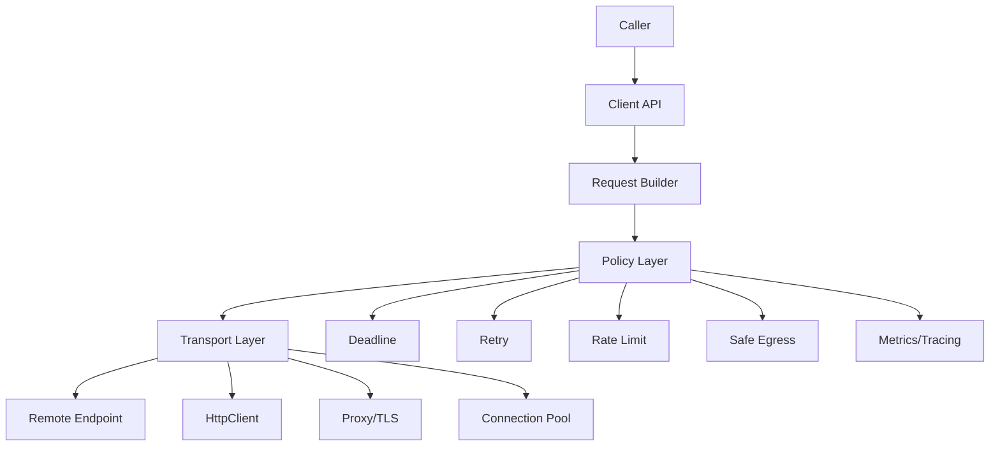
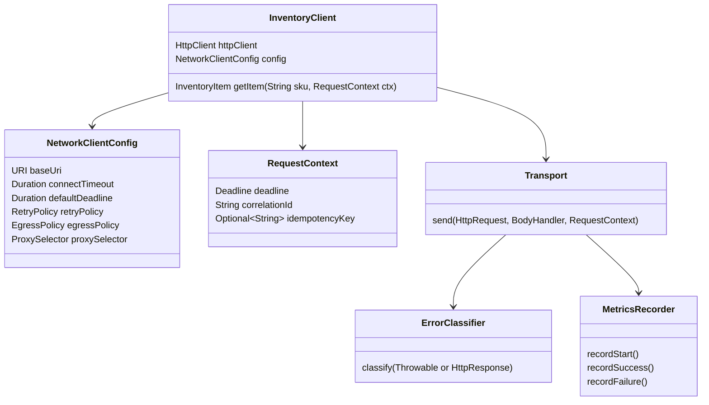
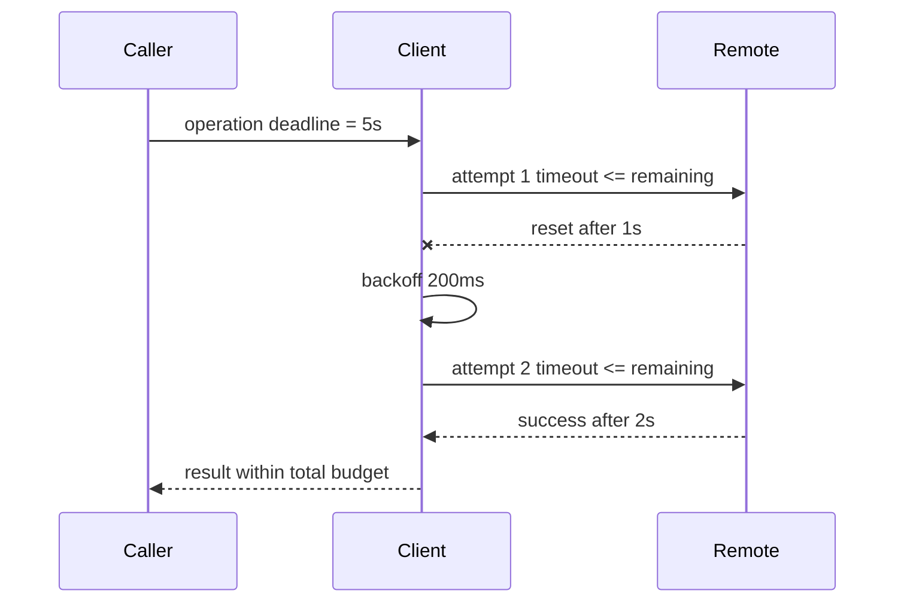
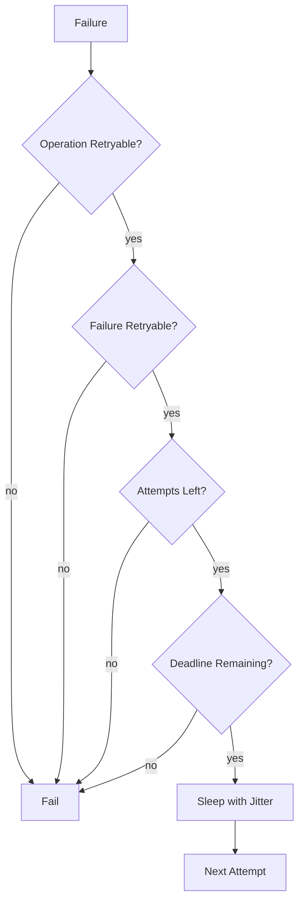
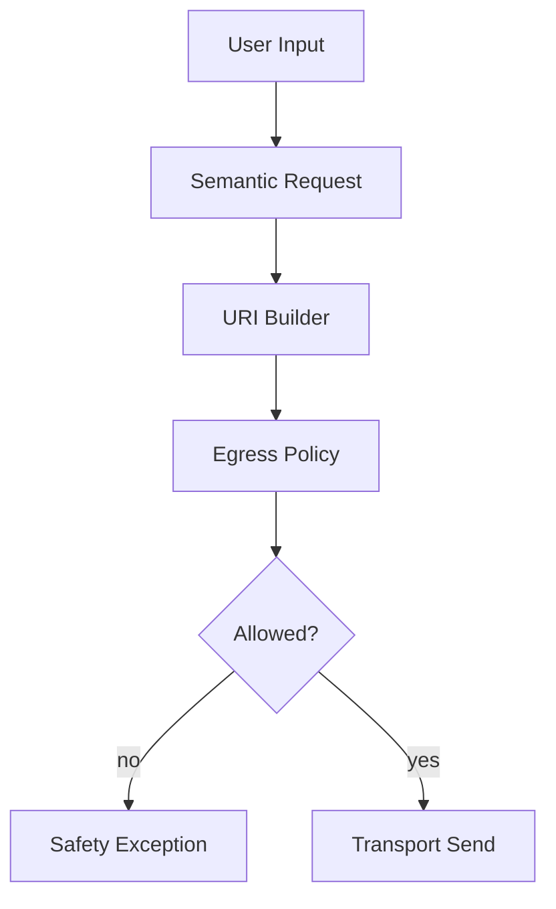
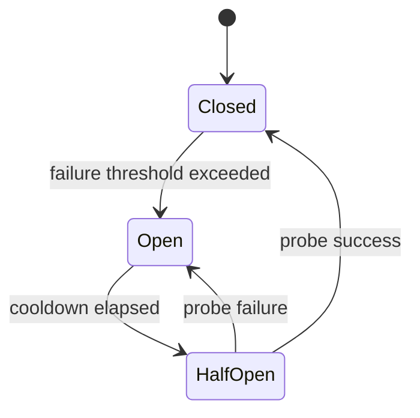
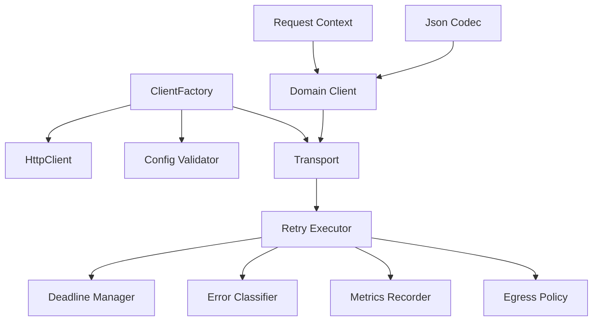

# Part 030 — Designing Production-Grade Network Clients

> Goal: membangun network client Java yang bisa dipakai di sistem enterprise: jelas lifecycle-nya, aman konfigurasi default-nya, bounded resource usage-nya, observable, testable, retry-safe, dan tidak membuat insiden tersembunyi saat traffic naik.

Banyak bug networking bukan berasal dari TCP, HTTP, atau TLS itu sendiri. Bug sering berasal dari **abstraksi client yang buruk**: timeout tidak lengkap, retry tak terkendali, `HttpClient` dibuat per request, response body tidak dikonsumsi, error tidak diklasifikasi, egress tidak dibatasi, dan API client memaksa caller mengerti detail network yang seharusnya disembunyikan.

Part ini membahas cara mendesain Java network client seperti internal SDK yang layak dipakai banyak service.

---

## 1. Kaufman Skill Deconstruction

Network client production-grade terdiri dari beberapa sub-skill:

| Sub-skill | Fokus | Output |
|---|---|---|
| Lifecycle design | kapan client dibuat, dishare, ditutup | no per-request client creation |
| Configuration model | timeout, proxy, TLS, pool, retry, limit | explicit and safe defaults |
| Deadline propagation | total budget per operation | no infinite wait |
| Error taxonomy | DNS/TCP/TLS/HTTP/protocol/app | actionable failure |
| Retry policy | idempotency, jitter, budget | no retry storm |
| Streaming discipline | body consumption/cancellation | no memory/connection leak |
| Pooling strategy | reuse, stale connection, idle behavior | stable resource use |
| Safe egress | scheme/host/port/IP validation | SSRF-resistant client |
| Observability hooks | metrics, logs, trace, event | debuggable production behavior |
| Testability | fake transport, failure injection | regression-ready client |

---

## 2. What Is a Network Client?

A network client is not just a wrapper around `HttpClient.send()`.

A production network client is a boundary object that owns:

- endpoint identity;
- transport configuration;
- timeout/deadline semantics;
- retry semantics;
- connection reuse;
- serialization boundary;
- authentication boundary;
- observability;
- error classification;
- resource lifecycle;
- safety policy.



Invariant:

> Caller should express intent. Client should enforce network policy.

---

## 3. Core Design Principles

### Principle 1 — Reuse client instances

`HttpClient` instances are intended to carry configuration and manage reusable resources such as connection pools. Creating a new client per operation usually prevents useful connection reuse and increases connection churn.

Bad:

```java
public String fetch(URI uri) throws Exception {
    HttpClient client = HttpClient.newHttpClient();
    return client.send(
            HttpRequest.newBuilder(uri).GET().build(),
            HttpResponse.BodyHandlers.ofString()
    ).body();
}
```

Better:

```java
public final class InventoryClient {
    private final HttpClient httpClient;
    private final URI baseUri;

    public InventoryClient(HttpClient httpClient, URI baseUri) {
        this.httpClient = httpClient;
        this.baseUri = baseUri;
    }
}
```

### Principle 2 — Separate connect timeout from operation deadline

Connect timeout answers: how long can connection establishment take?

Operation deadline answers: how long may the whole operation take, including DNS, queueing, connect, TLS, request send, response headers, body consumption, retry, and application decoding?

```java
HttpClient client = HttpClient.newBuilder()
        .connectTimeout(Duration.ofSeconds(2))
        .build();

HttpRequest request = HttpRequest.newBuilder(uri)
        .timeout(Duration.ofSeconds(5))
        .GET()
        .build();
```

But even request timeout is not always enough for multi-attempt operations. A client wrapper should carry a total deadline.

### Principle 3 — Retry only when safe

Retry is allowed only when:

- operation is idempotent; or
- caller supplies idempotency key; and
- failure is retryable; and
- deadline still has enough budget; and
- retry budget is not exhausted.

### Principle 4 — Always classify errors

Do not expose raw `IOException` as the only abstraction.

Caller needs to know whether the failure is:

- invalid request;
- DNS failure;
- connect failure;
- timeout/deadline exceeded;
- TLS failure;
- HTTP status failure;
- protocol violation;
- decoding failure;
- remote unavailable;
- client-side safety rejection.

### Principle 5 — Make unsafe behavior hard

A production client should make these difficult:

- no timeout;
- unbounded body buffering;
- unbounded retry;
- user-controlled URL without validation;
- per-request `HttpClient`;
- silent redirect to unsafe destination;
- swallowing cancellation;
- ignoring response body.

---

## 4. Client Architecture Reference



This structure separates concerns:

- domain client builds semantic operations;
- transport sends network request;
- policy layer enforces deadline/retry/safety;
- classifier maps raw failures;
- observability layer records signals.

---

## 5. Configuration Model

A good config object should be explicit, immutable, validated, and safe by default.

```java
import java.net.ProxySelector;
import java.net.URI;
import java.time.Duration;
import java.util.Objects;

public record NetworkClientConfig(
        URI baseUri,
        Duration connectTimeout,
        Duration defaultDeadline,
        int maxAttempts,
        Duration initialBackoff,
        Duration maxBackoff,
        boolean followRedirects,
        ProxySelector proxySelector
) {
    public NetworkClientConfig {
        Objects.requireNonNull(baseUri, "baseUri");
        Objects.requireNonNull(connectTimeout, "connectTimeout");
        Objects.requireNonNull(defaultDeadline, "defaultDeadline");
        Objects.requireNonNull(initialBackoff, "initialBackoff");
        Objects.requireNonNull(maxBackoff, "maxBackoff");

        if (!baseUri.getScheme().equals("https")) {
            throw new IllegalArgumentException("baseUri must use https");
        }
        if (connectTimeout.isNegative() || connectTimeout.isZero()) {
            throw new IllegalArgumentException("connectTimeout must be positive");
        }
        if (defaultDeadline.compareTo(connectTimeout) < 0) {
            throw new IllegalArgumentException("deadline must be >= connectTimeout");
        }
        if (maxAttempts < 1 || maxAttempts > 5) {
            throw new IllegalArgumentException("maxAttempts must be between 1 and 5");
        }
        if (maxBackoff.compareTo(initialBackoff) < 0) {
            throw new IllegalArgumentException("maxBackoff must be >= initialBackoff");
        }
    }
}
```

Default recommendation:

| Config | Default stance |
|---|---|
| scheme | prefer HTTPS only |
| connect timeout | short and explicit |
| operation deadline | explicit per call or default bounded |
| redirect | disabled unless required |
| retry | disabled or conservative by default |
| body max size | bounded |
| streaming | explicit API, not accidental |
| proxy | explicit from environment/config |
| TLS | default validation, no insecure trust manager |

---

## 6. Deadline as a First-Class Concept

Timeout per attempt is not enough. Multi-attempt clients need a total deadline.



Implementation sketch:

```java
import java.time.Clock;
import java.time.Duration;
import java.time.Instant;

public final class Deadline {
    private final Clock clock;
    private final Instant expiresAt;

    private Deadline(Clock clock, Instant expiresAt) {
        this.clock = clock;
        this.expiresAt = expiresAt;
    }

    public static Deadline after(Clock clock, Duration duration) {
        return new Deadline(clock, clock.instant().plus(duration));
    }

    public Duration remaining() {
        Duration remaining = Duration.between(clock.instant(), expiresAt);
        return remaining.isNegative() ? Duration.ZERO : remaining;
    }

    public boolean expired() {
        return remaining().isZero();
    }

    public void throwIfExpired() {
        if (expired()) {
            throw new ClientDeadlineExceededException("deadline exceeded");
        }
    }
}
```

Use it for:

- request timeout;
- retry eligibility;
- backoff sleep;
- body consumption;
- downstream call chain propagation;
- cancellation.

---

## 7. Request Context

A network operation should carry context explicitly.

```java
import java.util.Optional;

public record RequestContext(
        Deadline deadline,
        String correlationId,
        Optional<String> idempotencyKey
) {
    public static RequestContext withDeadline(Deadline deadline, String correlationId) {
        return new RequestContext(deadline, correlationId, Optional.empty());
    }

    public RequestContext withIdempotencyKey(String key) {
        return new RequestContext(deadline, correlationId, Optional.of(key));
    }
}
```

What belongs here:

- deadline;
- correlation ID;
- idempotency key;
- tenant/account ID if needed for metrics tags with care;
- cancellation token if your architecture uses one.

What should not belong here:

- raw password/token if avoidable;
- huge request payload;
- mutable global state;
- low-level socket object.

---

## 8. Error Taxonomy

Raw exceptions are too low-level for application callers.

Design a hierarchy:

```java
public sealed class NetworkClientException extends RuntimeException
        permits ClientDeadlineExceededException,
                ClientTransportException,
                ClientTlsException,
                ClientHttpStatusException,
                ClientProtocolException,
                ClientSafetyPolicyException,
                ClientDecodingException {

    protected NetworkClientException(String message, Throwable cause) {
        super(message, cause);
    }

    protected NetworkClientException(String message) {
        super(message);
    }
}

final class ClientDeadlineExceededException extends NetworkClientException {
    ClientDeadlineExceededException(String message) { super(message); }
}

final class ClientTransportException extends NetworkClientException {
    ClientTransportException(String message, Throwable cause) { super(message, cause); }
}

final class ClientTlsException extends NetworkClientException {
    ClientTlsException(String message, Throwable cause) { super(message, cause); }
}

final class ClientHttpStatusException extends NetworkClientException {
    private final int statusCode;

    ClientHttpStatusException(int statusCode, String message) {
        super(message);
        this.statusCode = statusCode;
    }

    public int statusCode() {
        return statusCode;
    }
}

final class ClientProtocolException extends NetworkClientException {
    ClientProtocolException(String message, Throwable cause) { super(message, cause); }
}

final class ClientSafetyPolicyException extends NetworkClientException {
    ClientSafetyPolicyException(String message) { super(message); }
}

final class ClientDecodingException extends NetworkClientException {
    ClientDecodingException(String message, Throwable cause) { super(message, cause); }
}
```

Classification table:

| Raw signal | Client classification | Retry? |
|---|---|---|
| `UnknownHostException` | DNS/transport | maybe, bounded |
| `ConnectException` refused | transport unavailable | maybe |
| connect timeout | deadline/transport | maybe |
| request timeout | deadline exceeded | usually no if total deadline exhausted |
| `SSLHandshakeException` | TLS | no |
| HTTP 408 | remote timeout | maybe if safe |
| HTTP 429 | throttled | maybe after `Retry-After` |
| HTTP 500/502/503/504 | remote failure | maybe if safe |
| HTTP 400/401/403/404 | request/auth/not found | usually no |
| malformed body | decoding/protocol | no unless known transient |
| private IP blocked | safety policy | no |

---

## 9. Retry Policy Design

Retry policy is one of the highest-risk parts of a network client.

A robust retry decision needs:



### Retry policy record

```java
import java.time.Duration;
import java.util.Set;

public record RetryPolicy(
        int maxAttempts,
        Duration initialBackoff,
        Duration maxBackoff,
        Set<Integer> retryableStatuses
) {
    public boolean canRetryStatus(int status) {
        return retryableStatuses.contains(status);
    }
}
```

### Backoff with jitter

```java
import java.time.Duration;
import java.util.concurrent.ThreadLocalRandom;

public final class Backoff {
    public static Duration exponentialWithJitter(
            Duration initial,
            Duration max,
            int attemptIndex
    ) {
        long baseMillis = initial.toMillis();
        long maxMillis = max.toMillis();
        long exponential = baseMillis * (1L << Math.min(attemptIndex, 10));
        long capped = Math.min(exponential, maxMillis);
        long jittered = ThreadLocalRandom.current().nextLong(capped + 1);
        return Duration.ofMillis(jittered);
    }
}
```

Use full jitter or decorrelated jitter. Avoid synchronized fixed sleep across many clients.

---

## 10. Transport Wrapper Around HttpClient

```java
import java.io.IOException;
import java.net.http.HttpClient;
import java.net.http.HttpRequest;
import java.net.http.HttpResponse;
import java.time.Duration;

public final class JdkHttpTransport {
    private final HttpClient client;
    private final RetryPolicy retryPolicy;

    public JdkHttpTransport(HttpClient client, RetryPolicy retryPolicy) {
        this.client = client;
        this.retryPolicy = retryPolicy;
    }

    public <T> HttpResponse<T> send(
            HttpRequest original,
            HttpResponse.BodyHandler<T> bodyHandler,
            RequestContext context,
            boolean operationRetryable
    ) {
        int attempt = 1;
        Throwable lastFailure = null;

        while (attempt <= retryPolicy.maxAttempts()) {
            context.deadline().throwIfExpired();
            Duration remaining = context.deadline().remaining();

            HttpRequest request = cloneWithTimeout(original, remaining, context);

            try {
                HttpResponse<T> response = client.send(request, bodyHandler);
                if (isSuccessful(response.statusCode())) {
                    return response;
                }
                if (!shouldRetryStatus(response.statusCode(), operationRetryable, attempt, context)) {
                    throw new ClientHttpStatusException(
                            response.statusCode(),
                            "remote returned HTTP " + response.statusCode()
                    );
                }
            } catch (IOException e) {
                lastFailure = e;
                if (!shouldRetryException(e, operationRetryable, attempt, context)) {
                    throw classifyIOException(e);
                }
            } catch (InterruptedException e) {
                Thread.currentThread().interrupt();
                throw new ClientTransportException("interrupted while waiting for response", e);
            }

            sleepBeforeRetry(attempt, context);
            attempt++;
        }

        throw new ClientTransportException("retry attempts exhausted", lastFailure);
    }

    private static boolean isSuccessful(int status) {
        return status >= 200 && status < 300;
    }

    private boolean shouldRetryStatus(
            int status,
            boolean operationRetryable,
            int attempt,
            RequestContext context
    ) {
        return operationRetryable
                && retryPolicy.canRetryStatus(status)
                && attempt < retryPolicy.maxAttempts()
                && !context.deadline().expired();
    }

    private boolean shouldRetryException(
            IOException e,
            boolean operationRetryable,
            int attempt,
            RequestContext context
    ) {
        return operationRetryable
                && attempt < retryPolicy.maxAttempts()
                && !context.deadline().expired();
    }

    private void sleepBeforeRetry(int attempt, RequestContext context) {
        Duration sleep = Backoff.exponentialWithJitter(
                retryPolicy.initialBackoff(),
                retryPolicy.maxBackoff(),
                attempt - 1
        );
        if (sleep.compareTo(context.deadline().remaining()) > 0) {
            throw new ClientDeadlineExceededException("not enough deadline remaining for retry backoff");
        }
        try {
            Thread.sleep(sleep);
        } catch (InterruptedException e) {
            Thread.currentThread().interrupt();
            throw new ClientTransportException("interrupted during retry backoff", e);
        }
    }

    private static NetworkClientException classifyIOException(IOException e) {
        if (e instanceof javax.net.ssl.SSLException) {
            return new ClientTlsException("TLS failure", e);
        }
        return new ClientTransportException("transport failure", e);
    }

    private static HttpRequest cloneWithTimeout(
            HttpRequest original,
            Duration timeout,
            RequestContext context
    ) {
        HttpRequest.Builder builder = HttpRequest.newBuilder(original.uri())
                .timeout(timeout);

        original.headers().map().forEach((name, values) ->
                values.forEach(value -> builder.header(name, value))
        );

        builder.header("X-Correlation-Id", context.correlationId());
        context.idempotencyKey().ifPresent(key -> builder.header("Idempotency-Key", key));

        // For simplicity, this sketch only supports requests without custom BodyPublisher cloning.
        // Production code must model request bodies explicitly because not every body is repeatable.
        builder.method(original.method(), HttpRequest.BodyPublishers.noBody());
        return builder.build();
    }
}
```

Important caveat:

> Retrying request bodies is hard. A body publisher may not be repeatable. Production clients must explicitly model whether the request body can be replayed.

---

## 11. Repeatable vs Non-Repeatable Request Bodies

Retry safety depends on body repeatability.

| Body type | Repeatable? | Notes |
|---|---|---|
| no body | yes | safe for GET-like operations |
| byte array | yes | memory bounded only if small |
| string | yes | same as byte array |
| file path | usually yes | file may change unless controlled |
| input stream | often no | stream may be consumed once |
| live generated stream | no | cannot replay safely |
| large upload | depends | needs idempotency and resumability |

Design pattern:

```java
public sealed interface RequestBodySpec permits EmptyBody, JsonBody, FileBody, StreamBody {
    boolean repeatable();
    HttpRequest.BodyPublisher publisher();
}

public record EmptyBody() implements RequestBodySpec {
    public boolean repeatable() { return true; }
    public HttpRequest.BodyPublisher publisher() {
        return HttpRequest.BodyPublishers.noBody();
    }
}

public record JsonBody(String json) implements RequestBodySpec {
    public boolean repeatable() { return true; }
    public HttpRequest.BodyPublisher publisher() {
        return HttpRequest.BodyPublishers.ofString(json);
    }
}
```

If body is not repeatable, retry should usually be disabled unless protocol supports resumable/idempotent semantics.

---

## 12. Domain-Level Client API

A good client exposes domain operations, not low-level URLs everywhere.

Bad:

```java
client.call("GET", "https://inventory.example.com/items/ABC?includeStock=true");
```

Better:

```java
InventoryItem item = inventoryClient.getItem(
        new GetItemRequest("ABC", true),
        requestContext
);
```

Example:

```java
public record GetItemRequest(String sku, boolean includeStock) {}

public record InventoryItem(String sku, String name, int availableQuantity) {}

public final class InventoryClient {
    private final URI baseUri;
    private final JdkHttpTransport transport;
    private final JsonCodec jsonCodec;

    public InventoryClient(URI baseUri, JdkHttpTransport transport, JsonCodec jsonCodec) {
        this.baseUri = baseUri;
        this.transport = transport;
        this.jsonCodec = jsonCodec;
    }

    public InventoryItem getItem(GetItemRequest input, RequestContext context) {
        URI uri = baseUri.resolve("/items/" + Urls.pathSegment(input.sku())
                + "?includeStock=" + input.includeStock());

        HttpRequest request = HttpRequest.newBuilder(uri)
                .GET()
                .header("Accept", "application/json")
                .build();

        HttpResponse<String> response = transport.send(
                request,
                HttpResponse.BodyHandlers.ofString(),
                context,
                true
        );

        try {
            return jsonCodec.decode(response.body(), InventoryItem.class);
        } catch (Exception e) {
            throw new ClientDecodingException("failed to decode inventory item", e);
        }
    }
}
```

Note: URL encoding must be correct. Do not concatenate raw user input into URI path/query without encoding.

---

## 13. URL and URI Construction

URI construction bugs can become both correctness and security bugs.

Rules:

- base URI should be configured, not supplied per call;
- path segment must be encoded as path segment, not query parameter;
- query parameter must be encoded as query value;
- avoid `String.format` for URL construction;
- block absolute URL override unless explicitly supported;
- normalize and validate resolved URI.

Danger:

```java
URI uri = baseUri.resolve(userSuppliedPath);
```

If `userSuppliedPath` is absolute or begins with `//`, it may override host semantics depending on input. Production clients should constrain caller input to semantic fields, not raw URL fragments.

---

## 14. Safe Egress Policy

If a client can reach URLs influenced by user input, it must enforce safe egress.

Policy dimensions:

| Dimension | Rule |
|---|---|
| scheme | allow only `https` unless internal exception |
| host | positive allowlist for known services |
| port | allow only expected ports |
| redirect | disabled or revalidated after each redirect |
| DNS | resolved IP must be validated |
| private ranges | block unless explicitly internal client |
| credentials | never forward arbitrary headers to arbitrary host |
| proxy | ensure proxy cannot bypass policy |

Architecture:



Do not rely only on string prefix checks.

---

## 15. Redirect Policy

Redirects are not harmless.

Risks:

- redirect from HTTPS to HTTP;
- redirect to different host;
- redirect to private/internal IP;
- redirect loop;
- credentials leaked to wrong host;
- POST changes method depending on status/client behavior.

Default recommendation:

- disable redirects for internal service clients;
- if enabled, revalidate every redirected URI;
- limit max redirects;
- do not forward sensitive headers across host boundary;
- record redirect count and target host in telemetry.

```java
HttpClient client = HttpClient.newBuilder()
        .followRedirects(HttpClient.Redirect.NEVER)
        .build();
```

---

## 16. Pooling and Client Lifecycle

`HttpClient` connection pools are generally associated with the client instance. Therefore:

- create one client per distinct transport config;
- share it across operations;
- do not create per request;
- avoid too many client instances for same destination;
- understand JVM-wide HTTP client properties where used.

### Lifecycle options

| Pattern | Use when | Risk |
|---|---|---|
| singleton client per service | most internal SDKs | config changes require restart/rebuild |
| client per tenant | tenant-specific TLS/proxy/auth | too many pools |
| client per request | almost never | no reuse, port exhaustion |
| global raw client | simple apps | weak policy separation |

### Shutdown

Modern `HttpClient` has lifecycle methods in recent JDKs. If your runtime exposes shutdown/close semantics, use them in application shutdown. If not, manage the executor you supplied and avoid creating unnecessary clients.

---

## 17. Rate Limiting and Bulkheading

A client should protect both caller and downstream.

### Bulkhead by remote dependency

Do not let one bad dependency consume all concurrency.

```java
import java.util.concurrent.Semaphore;

public final class ClientBulkhead {
    private final Semaphore permits;

    public ClientBulkhead(int maxConcurrent) {
        this.permits = new Semaphore(maxConcurrent);
    }

    public <T> T execute(CheckedSupplier<T> supplier) throws Exception {
        if (!permits.tryAcquire()) {
            throw new ClientTransportException("client bulkhead full", null);
        }
        try {
            return supplier.get();
        } finally {
            permits.release();
        }
    }

    public interface CheckedSupplier<T> {
        T get() throws Exception;
    }
}
```

### Rate limit by dependency

Use rate limit when downstream has known quota. Use bulkhead when downstream can hang or slow.

| Control | Protects against |
|---|---|
| timeout/deadline | infinite wait |
| bulkhead | concurrency exhaustion |
| rate limit | quota/traffic overload |
| retry budget | amplification |
| circuit boundary | repeated known failure |

---

## 18. Circuit Boundary Without Magic

Circuit breaker is often overused. It should be a boundary around repeated known failure, not a substitute for timeout.

A simple state model:



Use circuit boundary when:

- downstream is expensive to call during outage;
- failure is repeated and measurable;
- callers can tolerate fast failure;
- recovery probe is safe;
- state is observable.

Avoid circuit breaker when:

- failure is per-request validation;
- traffic is too low to infer health;
- no fallback exists and fast failure harms more than waiting;
- it hides root cause.

---

## 19. Observability Hook Design

Client telemetry should answer:

- which dependency is slow?
- which operation is failing?
- where time is spent?
- how many retries occurred?
- how many attempts succeeded after retry?
- which errors are DNS/TCP/TLS/HTTP/decoding?
- how many calls are blocked by bulkhead/rate-limit?
- are deadlines too short or downstream too slow?

### Metrics names example

| Metric | Tags |
|---|---|
| `client.requests.total` | dependency, operation, outcome |
| `client.request.duration` | dependency, operation, status_class |
| `client.attempts.total` | dependency, operation, attempt, outcome |
| `client.retries.total` | dependency, operation, reason |
| `client.deadlines.exceeded` | dependency, operation |
| `client.bulkhead.rejected` | dependency |
| `client.response.bytes` | dependency, operation |

Avoid high-cardinality tags:

- full URL;
- raw user ID;
- request ID;
- exception message;
- dynamic path with IDs.

Use low-cardinality operation names:

- `InventoryClient.getItem`;
- `PaymentClient.authorize`;
- `DocumentClient.upload`.

---

## 20. Structured Logging

Log at operation boundary, not every byte.

Recommended fields:

- correlation ID;
- dependency;
- operation;
- method;
- sanitized path template;
- attempt number;
- status code;
- failure category;
- duration;
- deadline remaining;
- retry decision;
- remote host alias, not sensitive full URL.

Do not log:

- authorization headers;
- cookies;
- full request/response body by default;
- mTLS private key material;
- raw PII in query/path.

---

## 21. Async API vs Blocking API

With virtual threads, blocking API can be perfectly reasonable.

### Blocking domain API

```java
InventoryItem item = inventoryClient.getItem(request, context);
```

Pros:

- simple caller code;
- easy error handling;
- works well with virtual threads;
- stack traces are understandable.

Cons:

- caller must manage concurrency externally;
- cancellation must interrupt or propagate deadline correctly.

### Async domain API

```java
CompletableFuture<InventoryItem> future = inventoryClient.getItemAsync(request, context);
```

Pros:

- fits reactive/event-driven call chains;
- can compose many calls;
- avoids blocking platform threads.

Cons:

- cancellation semantics are harder;
- error wrapping is harder;
- executor behavior must be explicit;
- backpressure is often lost with naive futures.

Recommendation:

- provide blocking API for most service-to-service clients on virtual-thread-capable runtimes;
- provide async API only when there is a clear composition need;
- keep the same policy layer for both.

---

## 22. Streaming API Design

Do not hide streaming behind `String` or `byte[]`.

Bad:

```java
byte[] downloadReport(String reportId);
```

This forces full buffering.

Better:

```java
void downloadReport(String reportId, RequestContext context, java.nio.file.Path destination);
```

or:

```java
InputStream openReportStream(String reportId, RequestContext context);
```

But if returning `InputStream`, document ownership:

- caller must close stream;
- deadline semantics must still apply;
- connection is held until stream is closed/consumed;
- metrics should record stream completion/failure.

Safer high-level API:

```java
public void downloadToFile(String reportId, RequestContext context, Path destination) {
    // Client owns stream lifecycle and can guarantee cleanup.
}
```

---

## 23. Response Body Handling

Response handling choices:

| Handler | Use when | Risk |
|---|---|---|
| `ofString()` | small text response | memory blowup if unbounded |
| `ofByteArray()` | small binary response | memory blowup |
| `ofFile()` | direct download to file | partial file cleanup needed |
| `discarding()` | status-only response | ensure body irrelevant |
| custom subscriber | streaming/backpressure | complexity |

Production rule:

> A client API must state max response size or stream ownership.

For JSON APIs, enforce size at gateway/server if possible, and still defend client against unexpectedly large response.

---

## 24. Authentication Boundary

Network client usually adds auth headers/tokens. This is part of boundary design.

Rules:

- token provider should be injected;
- token refresh should have its own timeout;
- auth failure classification should distinguish 401/403 from transport;
- do not retry 401 blindly unless refresh semantics are explicit;
- do not forward auth headers across redirect host boundary;
- do not log auth values.

```java
public interface TokenProvider {
    String bearerToken(RequestContext context);
}
```

If token acquisition itself calls network, avoid deadlock:

- separate client/bulkhead for auth;
- deadline budget includes token acquisition or has explicit sub-budget;
- no recursive dependency cycle.

---

## 25. Proxy and Enterprise Network Support

A production Java client often runs behind:

- HTTP proxy;
- CONNECT proxy for HTTPS;
- service mesh sidecar;
- egress gateway;
- firewall/NAT;
- corporate TLS inspection in non-production.

Design config must expose:

- proxy selector;
- authenticator if needed;
- no-proxy rules;
- explicit environment behavior;
- debug mode for proxy path.

But avoid exposing proxy details into business operation methods.

Bad:

```java
getItem(sku, proxyHost, proxyPort, trustAllCerts)
```

Better:

```java
InventoryClient client = InventoryClientFactory.create(config);
client.getItem(request, context);
```

---

## 26. TLS Configuration

Use default TLS validation unless you have a strong reason.

Client config may need:

- custom truststore;
- client certificate for mTLS;
- hostname verification settings;
- TLS protocol restrictions;
- ALPN behavior through HTTP client;
- debug diagnostics.

Dangerous anti-pattern:

```java
// Any TrustManager that accepts all certificates is not acceptable in production.
```

Instead:

- use environment-specific truststore;
- rotate certificates with test coverage;
- test expired/unknown/mismatch cert failure;
- keep certificate validation fail-closed.

---

## 27. Client Factory

Centralize client creation.

```java
import java.net.http.HttpClient;
import java.time.Duration;

public final class NetworkClientFactory {
    public static HttpClient createHttpClient(NetworkClientConfig config) {
        HttpClient.Builder builder = HttpClient.newBuilder()
                .connectTimeout(config.connectTimeout())
                .followRedirects(config.followRedirects()
                        ? HttpClient.Redirect.NORMAL
                        : HttpClient.Redirect.NEVER);

        if (config.proxySelector() != null) {
            builder.proxy(config.proxySelector());
        }

        return builder.build();
    }
}
```

Factory benefits:

- consistent default;
- consistent TLS/proxy behavior;
- easier migration;
- one place for JDK-specific tuning;
- avoids accidental per-request clients.

---

## 28. SDK Ergonomics

A good internal SDK should be hard to misuse.

### Good method design

```java
PaymentAuthorization authorize(
        AuthorizePaymentCommand command,
        RequestContext context
);
```

### Poor method design

```java
String post(String url, String body, int timeoutMillis, boolean retry);
```

Problems with poor design:

- caller controls raw URL;
- timeout semantics unclear;
- retry semantics unclear;
- response decoding left to caller;
- no operation name for metrics;
- easy to leak secrets;
- no idempotency model.

---

## 29. API Surface Checklist

For each operation, define:

| Question | Example |
|---|---|
| Is it idempotent? | `getItem` yes, `createPayment` no unless idempotency key |
| What is max request size? | 1 MB JSON |
| What is max response size? | 2 MB JSON or streaming file |
| What status codes are expected? | 200, 404 |
| Which status codes are retryable? | 429, 502, 503, 504 |
| Does it require auth? | bearer token |
| Does it require mTLS? | yes/no |
| What deadline applies? | default 3s, override allowed up to 10s |
| What metrics operation name? | `InventoryClient.getItem` |
| What errors can caller handle? | not found, unavailable, deadline exceeded |

---

## 30. Test Strategy for Network Client

### Unit tests

Test without real network:

- URI construction;
- config validation;
- retry decision;
- deadline expiration;
- error classification;
- safe egress policy;
- idempotency rule;
- body repeatability.

### Integration tests

Use fake server:

- success response;
- 400/401/403/404;
- 429 with retry-after;
- 500/502/503/504;
- slow headers;
- slow body;
- partial body;
- malformed JSON;
- connection reset;
- TLS cert mismatch if supported.

### Load/failure tests

Use part 029 scenarios:

- stale connection;
- retry storm;
- proxy failure;
- DNS failure;
- large transfer;
- cancellation;
- soak test.

---

## 31. Example Testable Transport Interface

Avoid making domain client impossible to test.

```java
public interface HttpTransport {
    <T> HttpResponse<T> send(
            HttpRequest request,
            HttpResponse.BodyHandler<T> bodyHandler,
            RequestContext context,
            boolean retryable
    );
}
```

Fake implementation:

```java
import java.net.URI;
import java.net.http.HttpHeaders;
import java.net.http.HttpRequest;
import java.net.http.HttpResponse;
import javax.net.ssl.SSLSession;
import java.util.Optional;

public final class FakeHttpResponse<T> implements HttpResponse<T> {
    private final int status;
    private final T body;
    private final HttpRequest request;

    public FakeHttpResponse(int status, T body, HttpRequest request) {
        this.status = status;
        this.body = body;
        this.request = request;
    }

    public int statusCode() { return status; }
    public T body() { return body; }
    public HttpRequest request() { return request; }
    public Optional<HttpResponse<T>> previousResponse() { return Optional.empty(); }
    public HttpHeaders headers() { return HttpHeaders.of(java.util.Map.of(), (a, b) -> true); }
    public URI uri() { return request.uri(); }
    public Version version() { return Version.HTTP_1_1; }
    public Optional<SSLSession> sslSession() { return Optional.empty(); }
}
```

This enables deterministic tests without sleeping, sockets, or real DNS.

---

## 32. Configuration Validation Examples

Bad config should fail at startup, not during incident.

Reject:

- base URI without host;
- non-HTTPS URI for external dependency;
- zero/negative timeout;
- deadline smaller than connect timeout;
- unbounded retry;
- redirect enabled with user-controlled destination;
- trust-all TLS mode;
- max response size missing for buffered APIs;
- per-tenant client count without upper bound.

---

## 33. Production Readiness Review

Before shipping a Java network client, ask:

### Lifecycle

- Is `HttpClient` reused?
- How many client instances exist per process?
- Is lifecycle/shutdown defined?
- Is custom executor managed?

### Timeout and deadline

- Is connect timeout set?
- Is operation deadline set?
- Does retry respect deadline?
- Does streaming have lifecycle limit?

### Retry

- Is operation idempotency modeled?
- Are retryable errors explicit?
- Is backoff jittered?
- Is retry budget bounded?
- Is retry telemetry present?

### Safety

- Is base URI fixed/configured?
- Are redirects disabled or revalidated?
- Are scheme/host/port validated?
- Are private/internal addresses blocked where needed?
- Are auth headers protected across redirects?

### Observability

- Are metrics low-cardinality?
- Are errors classified?
- Are correlation IDs propagated?
- Is attempt count visible?
- Is body size visible where relevant?

### Testing

- Are DNS/TCP/TLS/HTTP failures tested?
- Is stale pool behavior tested?
- Is slow/partial body tested?
- Is retry storm tested?
- Is cancellation tested?

---

## 34. Reference Implementation Blueprint



Suggested package layout:

```text
com.example.network
  config/
    NetworkClientConfig.java
    RetryPolicy.java
  context/
    Deadline.java
    RequestContext.java
  errors/
    NetworkClientException.java
    ClientTransportException.java
    ClientHttpStatusException.java
  policy/
    EgressPolicy.java
    RetryDecider.java
    RedirectPolicy.java
  transport/
    HttpTransport.java
    JdkHttpTransport.java
  observability/
    ClientMetrics.java
    ClientLogger.java
  codec/
    JsonCodec.java
  inventory/
    InventoryClient.java
    GetItemRequest.java
    InventoryItem.java
```

---

## 35. Common Anti-Patterns

| Anti-pattern | Consequence | Fix |
|---|---|---|
| `HttpClient.newHttpClient()` per call | no pooling, port exhaustion | shared client |
| no request timeout | hung calls | deadline per operation |
| fixed retry sleep | synchronized retry storm | jittered backoff |
| retry POST blindly | duplicate side effects | idempotency key |
| expose raw URL in domain API | SSRF/config bugs | semantic request object |
| follow redirects blindly | credential leak/SSRF | disable or revalidate |
| buffer all responses | memory blowup | max size or stream |
| return raw `IOException` | poor handling | error taxonomy |
| high-cardinality metrics | monitoring pain | operation name/path template |
| swallow interrupt | bad cancellation | restore interrupt |
| trust-all TLS | security breach | proper truststore |
| no fake transport | hard tests | transport abstraction |

---

## 36. Deliberate Practice

### Drill 1 — Build a minimal typed client

Create `CatalogClient.getProduct(productId, context)` using:

- shared `HttpClient`;
- fixed base URI;
- request deadline;
- JSON decoding;
- error taxonomy.

### Drill 2 — Add retry policy

Add retry for:

- 502/503/504;
- transport reset;
- only idempotent GET;
- max 3 attempts;
- full jitter;
- total deadline respected.

### Drill 3 — Add safe egress

Reject:

- non-HTTPS;
- unknown host;
- private IP;
- redirect to different host.

### Drill 4 — Add streaming download

Implement `downloadReport(reportId, destination, context)`:

- no full buffering;
- cleanup partial file on failure;
- timeout/deadline;
- metrics for bytes downloaded.

### Drill 5 — Add fake transport tests

Test:

- 200 success;
- 404 domain not found;
- 503 retry then success;
- timeout;
- malformed JSON;
- safety rejection.

---

## 37. Key Takeaways

- A production network client is a policy boundary, not a thin HTTP wrapper.
- Reuse `HttpClient` and model lifecycle explicitly.
- Deadline, retry, idempotency, and body repeatability must be designed together.
- Error taxonomy is essential for operability.
- Safe egress matters whenever destination can be influenced by input.
- Streaming API must define ownership and memory bounds.
- Observability should be built into the client, not added after incidents.
- Testability requires transport abstraction and failure fixtures.

Next, we move from client-side design to server/gateway design: accept loops, admission control, overload behavior, graceful shutdown, protocol negotiation, connection draining, streaming proxying, and safe degradation.

