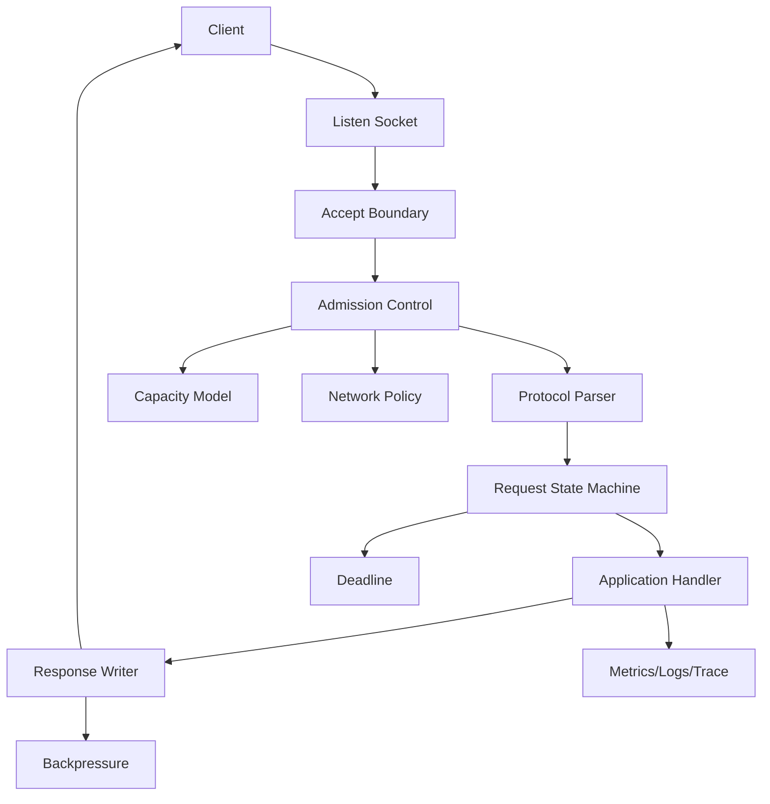
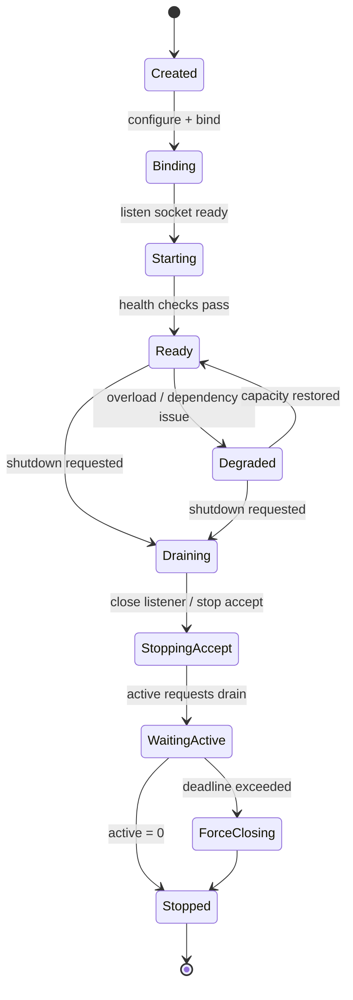
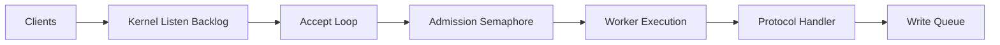
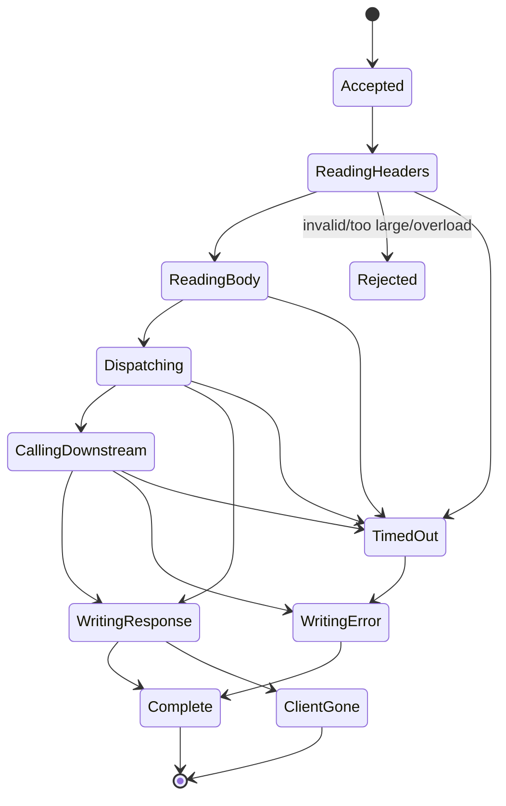
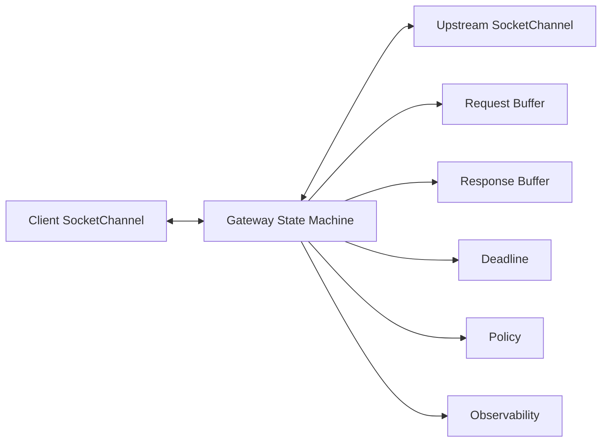
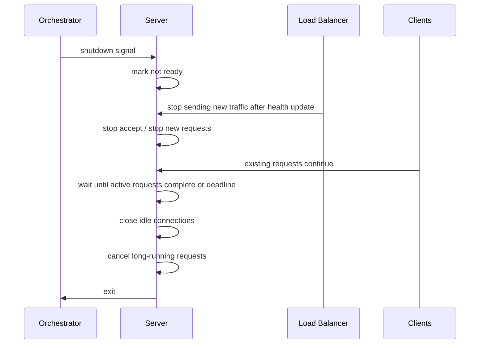
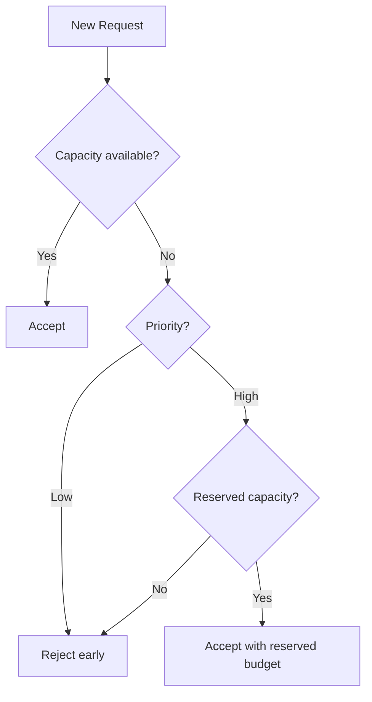
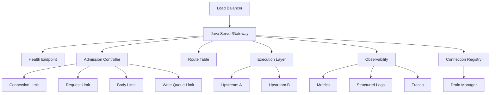

# Part 031 — Designing Production-Grade Network Servers and Gateways

> Goal: mampu mendesain server/gateway Java yang tidak hanya “bisa menerima koneksi”, tetapi juga punya admission control, overload semantics, graceful shutdown, draining, deadline propagation, protocol boundary yang defensif, dan degradation strategy yang jelas.

Part sebelumnya membahas production-grade network client. Part ini membalik perspektif: ketika aplikasi Java menjadi **network server** atau **gateway**, ia bukan hanya menjalankan handler. Ia menjadi **traffic boundary** yang harus menjaga kapasitas, fairness, isolation, security, dan correctness di bawah kondisi normal maupun buruk.

Server production-grade yang baik tidak diukur dari throughput maksimum di benchmark kosong. Server yang baik adalah yang tetap bisa menjawab pertanyaan ini ketika sistem sedang kacau:

- koneksi baru harus diterima atau ditolak?
- request yang sedang berjalan boleh selesai atau harus diputus?
- kapan server dianggap ready?
- kapan server dianggap overloaded?
- bagaimana mencegah slow client menghabiskan memory?
- bagaimana gateway meneruskan response streaming tanpa buffering seluruh payload?
- bagaimana shutdown dilakukan tanpa merusak transaksi yang masih legal?
- bagaimana memberi sinyal kegagalan yang bisa dipahami client?

---

## 1. Kaufman Skill Deconstruction

Untuk mencapai keluwesan top-tier, skill server/gateway networking harus dipecah menjadi beberapa sub-skill yang bisa dilatih terpisah.

| Sub-skill | Pertanyaan inti | Output engineer yang matang |
|---|---|---|
| Listen lifecycle | kapan bind, accept, stop accept, close? | startup/shutdown bisa diprediksi |
| Admission control | siapa yang boleh masuk saat kapasitas menipis? | overload tidak berubah menjadi collapse |
| Connection state | apa status setiap koneksi? | no zombie connection, no hidden leak |
| Request lifecycle | kapan request dianggap diterima, diproses, selesai, gagal? | handler punya state machine jelas |
| Deadline propagation | berapa sisa waktu request? | tidak ada infinite work |
| Backpressure | bagaimana slow client/server dikendalikan? | memory bounded, fairness terjaga |
| Graceful shutdown | apa yang dihentikan duluan? | rolling deploy aman |
| Gateway semantics | apa yang diteruskan, diubah, ditolak? | proxy behavior eksplisit |
| Failure mapping | error internal menjadi sinyal network apa? | client bisa self-correct |
| Observability | bukti apa yang dikumpulkan? | insiden bisa didiagnosis cepat |

Mental model Kaufman-nya sederhana: jangan berlatih “membuat server”. Berlatihlah membuat **server yang tahu kapan harus berkata tidak**.

---

## 2. Server Is a Boundary, Not a Handler Container

Kesalahan umum: menganggap server adalah loop yang menerima request lalu menjalankan fungsi bisnis.

Model yang lebih benar:



Server adalah boundary yang mengubah koneksi mentah menjadi pekerjaan aplikasi. Boundary ini harus melakukan:

1. **acceptance** — menerima atau menolak koneksi;
2. **classification** — memahami jenis traffic;
3. **admission** — menentukan apakah kapasitas tersedia;
4. **parsing** — membentuk request dari byte stream/frame;
5. **execution** — menjalankan handler dengan deadline dan isolation;
6. **response** — menulis hasil tanpa meledakkan buffer;
7. **termination** — menutup koneksi secara benar;
8. **observation** — menghasilkan evidence untuk debugging.

Jika salah satu boundary hilang, bug production biasanya muncul sebagai latency spike, connection leak, memory pressure, thread exhaustion, atau retry storm dari client.

---

## 3. Production Server Invariants

Sebelum memilih API Java, tetapkan invariant.

| Invariant | Makna | Anti-pattern |
|---|---|---|
| Bounded concurrency | jumlah pekerjaan aktif terbatas | unbounded thread per request |
| Bounded memory | buffer/request/queue punya limit | read body penuh ke memory |
| Bounded wait | semua stage punya timeout/deadline | infinite accept/read/write/handler |
| Explicit ownership | tiap socket/request punya owner lifecycle | socket ditutup dari banyak tempat tanpa aturan |
| Fail before collapse | overload ditolak sebelum sistem runtuh | menerima semua traffic sampai OOM |
| Drain before stop | shutdown memisahkan stop-accept dan finish-active | langsung `System.exit`/kill |
| Observable states | state penting bisa dilihat | hanya log error saat sudah terlambat |
| Protocol correctness | parser defensif terhadap input jahat/rusak | percaya client selalu valid |
| Isolation | slow/bad client tidak mengganggu semua client | shared lock/global queue besar |
| Deterministic degradation | mode gagal sudah dirancang | random timeout dan partial response |

Invariant ini lebih penting daripada framework. Framework bisa membantu, tetapi tidak menggantikan keputusan boundary.

---

## 4. Java Server Implementation Choices

Java menyediakan beberapa level API untuk membuat server/gateway.

| Approach | API | Cocok untuk | Trade-off |
|---|---|---|---|
| Blocking socket | `ServerSocket`, `Socket` | protocol kecil, lab, internal tool, virtual-thread server | mudah dipahami, harus disiplin deadline/resource |
| Non-blocking NIO | `ServerSocketChannel`, `SocketChannel`, `Selector` | server high-connection, custom protocol, gateway low-level | kompleks, state machine eksplisit |
| Async channel | `AsynchronousServerSocketChannel` | completion model, Windows IOCP-style abstraction | tidak selalu lebih sederhana dari NIO |
| Embedded HTTP server JDK | `com.sun.net.httpserver.HttpServer` | test server, admin endpoint, lightweight embedded server | bukan full production web framework |
| Framework | Netty/Undertow/Jetty/Tomcat/etc. | production HTTP/gateway systems | perlu paham model internal agar tidak salah konfigurasi |

Dalam seri ini kita tidak mendalami framework eksternal. Fokusnya mental model yang tetap berlaku saat memakai framework mana pun.

---

## 5. Server Lifecycle State Machine

Server yang baik punya state machine eksplisit.



Key distinction:

- **not started**: belum bind;
- **live but not ready**: process hidup tetapi belum boleh menerima traffic;
- **ready**: boleh menerima traffic;
- **degraded**: masih menerima sebagian traffic dengan pembatasan;
- **draining**: tidak menerima traffic baru, menyelesaikan yang aktif;
- **force closing**: menutup paksa karena shutdown budget habis;
- **stopped**: semua resource ditutup.

Banyak outage saat rolling deploy terjadi karena server hanya punya dua state: “up” dan “down”. Itu terlalu kasar.

---

## 6. Accept Loop Design

Accept loop adalah pintu pertama.

Pada blocking model:

```java
public final class BlockingTcpServer implements AutoCloseable {
    private final ServerSocket serverSocket;
    private final ExecutorService workers;
    private final AtomicBoolean accepting = new AtomicBoolean(true);
    private final Semaphore admission;

    public BlockingTcpServer(int port, int maxActiveConnections) throws IOException {
        this.serverSocket = new ServerSocket();
        this.serverSocket.setReuseAddress(true);
        this.serverSocket.bind(new InetSocketAddress(port), 512);
        this.workers = Executors.newVirtualThreadPerTaskExecutor();
        this.admission = new Semaphore(maxActiveConnections);
    }

    public void serve() throws IOException {
        while (accepting.get()) {
            Socket socket = serverSocket.accept();

            if (!admission.tryAcquire()) {
                reject(socket, "server overloaded\n");
                continue;
            }

            workers.submit(() -> {
                try (socket) {
                    configureAcceptedSocket(socket);
                    handleConnection(socket);
                } catch (IOException e) {
                    // classify and log at connection boundary
                } finally {
                    admission.release();
                }
            });
        }
    }

    private static void configureAcceptedSocket(Socket socket) throws SocketException {
        socket.setTcpNoDelay(true);
        socket.setSoTimeout(30_000);
        socket.setKeepAlive(true);
    }

    private static void reject(Socket socket, String message) {
        try (socket) {
            socket.setSoTimeout(2_000);
            socket.getOutputStream().write(message.getBytes(StandardCharsets.UTF_8));
        } catch (IOException ignored) {
            // reject path must be best-effort
        }
    }

    private void handleConnection(Socket socket) throws IOException {
        // protocol-specific state machine
    }

    @Override
    public void close() throws IOException {
        accepting.set(false);
        serverSocket.close();
        workers.shutdown();
    }
}
```

Important: server tidak langsung melempar semua accepted socket ke worker tanpa admission. Kalau worker queue unbounded, accept loop bisa terus menerima koneksi sampai memory penuh.

---

## 7. Backlog Is Not Admission Control

`backlog` pada listen socket sering disalahpahami sebagai “max connections”. Itu bukan admission policy aplikasi.

| Layer | Queue | Yang dikendalikan |
|---|---|---|
| Kernel listen backlog | pending connection before accept | koneksi yang menunggu diterima proses |
| Application accept loop | accepted connection | koneksi yang sudah masuk proses |
| Worker queue | submitted task | pekerjaan yang menunggu dieksekusi |
| Protocol queue | parsed request/message | pekerjaan logical aplikasi |
| Write queue | pending response bytes | output yang belum terkirim |

Backlog hanya satu antrian di kernel. Admission control production harus ada di aplikasi juga.



Jika hanya mengandalkan backlog:

- server bisa menerima lebih banyak koneksi daripada kapasitas handler;
- worker queue bisa tumbuh tanpa batas;
- latency naik diam-diam;
- client mulai retry;
- retry membuat lebih banyak koneksi;
- server collapse.

---

## 8. Admission Control Patterns

Admission control harus didefinisikan per resource yang langka.

| Resource | Contoh limit | Failure response |
|---|---:|---|
| active connection | 10k TCP connection | close early / 503 equivalent |
| active request | 1k concurrent request | 503 with `Retry-After` if HTTP |
| body memory | 256 MiB total buffered | 413 / close protocol |
| write backlog | 64 MiB pending writes | slow client disconnect |
| downstream calls | 200 active outbound calls | local fail-fast |
| CPU work | worker capacity | 429/503 depending semantics |

Admission harus terjadi **sebelum** resource mahal dialokasikan.

Anti-pattern:

```java
byte[] body = socket.getInputStream().readAllBytes(); // unbounded body first
if (!admission.tryAcquire()) {
    reject();
}
```

Pattern yang benar:

```java
if (!admission.tryAcquire()) {
    rejectEarly(socket);
    return;
}
try {
    readBoundedRequest(socket, maxBytes, deadline);
} finally {
    admission.release();
}
```

---

## 9. Request State Machine

Untuk server/gateway, request bukan method call biasa. Request adalah stateful lifecycle.



Kenapa state machine penting?

Karena setiap state punya timeout, memory limit, cancellation behavior, dan metric berbeda.

| State | Timeout | Limit | Metric |
|---|---:|---:|---|
| Reading headers | short | max header bytes | header read latency |
| Reading body | medium | max body bytes | body bytes received |
| Dispatching | short | executor queue | queue wait |
| Downstream call | deadline remainder | outbound concurrency | downstream latency |
| Writing response | bounded | write queue bytes | bytes sent / client abort |

Tanpa state machine, semua kegagalan akan terlihat seperti “request timeout”. Itu tidak cukup untuk debugging.

---

## 10. Thread-per-Connection with Virtual Threads

Virtual thread membuat blocking I/O kembali realistis untuk banyak server custom Java. Tetapi ini bukan izin untuk menghilangkan limit.

Model yang baik:

```java
ExecutorService connections = Executors.newVirtualThreadPerTaskExecutor();
Semaphore maxConnections = new Semaphore(20_000);

while (running) {
    Socket socket = serverSocket.accept();

    if (!maxConnections.tryAcquire()) {
        closeQuietly(socket);
        continue;
    }

    connections.submit(() -> {
        try (socket) {
            socket.setSoTimeout(15_000);
            serveProtocol(socket);
        } finally {
            maxConnections.release();
        }
    });
}
```

Virtual thread membantu ketika banyak thread menunggu I/O. Namun resource lain tetap nyata:

- file descriptor;
- socket buffer;
- heap object per connection;
- native memory;
- downstream capacity;
- database pool;
- CPU;
- log volume;
- metric cardinality.

Rule:

> Virtual threads reduce the cost of waiting. They do not remove the cost of accepting unbounded work.

---

## 11. NIO Gateway Design

Gateway sering butuh NIO karena harus menghubungkan dua koneksi: inbound client dan outbound upstream.



Gateway state harus merepresentasikan dua arah data:

| Direction | Risk |
|---|---|
| client -> gateway | slow upload, oversized body, invalid protocol |
| gateway -> upstream | connect delay, DNS failure, TLS failure |
| upstream -> gateway | slow response, partial body, reset |
| gateway -> client | slow download, client abort |

NIO gateway yang benar harus punya:

- inbound read budget;
- outbound connect timeout;
- per-connection deadline;
- bounded buffer per direction;
- explicit close propagation;
- half-close policy;
- cancellation on either side failure;
- correlation ID per proxied exchange.

---

## 12. Streaming Proxy Without Full Buffering

Anti-pattern gateway:

```java
byte[] requestBody = clientInput.readAllBytes();
byte[] upstreamBody = callUpstream(requestBody);
clientOutput.write(upstreamBody);
```

Ini gagal untuk large payload, slow client, dan memory pressure.

Streaming gateway harus mengalirkan data dalam bounded chunks.

```java
static void copyBounded(InputStream in, OutputStream out, long maxBytes) throws IOException {
    byte[] buffer = new byte[64 * 1024];
    long total = 0;

    while (true) {
        int n = in.read(buffer);
        if (n == -1) {
            return;
        }
        total += n;
        if (total > maxBytes) {
            throw new IOException("payload too large");
        }
        out.write(buffer, 0, n);
        out.flush(); // choose carefully; excessive flush hurts throughput
    }
}
```

Untuk HTTP gateway, jangan buffering seluruh response sebelum menulis ke client kecuali memang ada requirement seperti content transformation kecil.

Decision rule:

| Requirement | Strategy |
|---|---|
| pass-through large object | streaming |
| inspect small JSON | bounded buffering |
| transform compressed payload | decompress with strict limits |
| retry after partial upload | usually impossible safely |
| retry before body sent | possible for idempotent request |

---

## 13. Gateway Is Not Just Forwarding

Gateway membuat keputusan semantic.

| Responsibility | Example |
|---|---|
| Normalize | remove hop-by-hop headers |
| Authenticate | validate caller identity |
| Authorize | enforce route-level policy |
| Route | choose upstream based on path/header/tenant |
| Limit | cap concurrency/rate/body size |
| Transform | rewrite path/header/body if allowed |
| Observe | trace one inbound request across outbound calls |
| Protect | block SSRF/internal destinations |
| Degrade | fallback/reject/shed load |

Sebagai engineer, tentukan mana behavior gateway yang eksplisit dan mana yang dilarang.

Contoh policy table:

| Input | Gateway behavior |
|---|---|
| unknown host | reject |
| private IP resolved from public host | reject |
| redirect to unapproved domain | reject |
| large body without content length | stream with cap |
| upstream 503 | preserve or map to gateway 502/503 by policy |
| client disconnect | cancel upstream |
| upstream slow body | abort on deadline |

---

## 14. Protocol Negotiation and Versioning

Server/gateway sering berada di boundary antar versi protocol.

| Protocol aspect | Risk |
|---|---|
| HTTP/1.1 vs HTTP/2 | different connection and multiplexing semantics |
| TLS ALPN | client/server disagree on protocol |
| SNI | certificate selection fails |
| compression | decompression bomb |
| chunked transfer | body length unknown up front |
| WebSocket upgrade | state moves from HTTP request to bidirectional channel |
| custom binary version | parser mismatch |

Design principle:

> Negotiate explicitly, fail loudly, and record the negotiated result.

Log/metric attributes worth capturing:

- local address;
- remote address;
- protocol version;
- TLS version;
- cipher suite;
- SNI hostname;
- ALPN result;
- request route;
- upstream target;
- response status;
- request/response bytes;
- close reason.

---

## 15. Graceful Shutdown

Graceful shutdown bukan hanya `server.close()`.

Urutan yang benar:



Server perlu membedakan:

| Action | Meaning |
|---|---|
| mark unready | load balancer should stop routing new traffic |
| stop accept | process stops accepting new connections |
| reject new request | existing keep-alive connection gets no new work |
| drain active | let accepted work finish |
| close idle | free unused connections |
| force cancel | shutdown budget exhausted |

Pseudo-code:

```java
public final class ServerLifecycle {
    private final AtomicBoolean ready = new AtomicBoolean(false);
    private final AtomicBoolean accepting = new AtomicBoolean(false);
    private final LongAdder activeRequests = new LongAdder();

    public boolean isReady() {
        return ready.get();
    }

    public boolean canAcceptNewWork() {
        return ready.get() && accepting.get();
    }

    public void beginShutdown(Duration drainBudget) {
        ready.set(false);       // remove from LB
        accepting.set(false);   // stop new work locally

        Instant deadline = Instant.now().plus(drainBudget);
        while (activeRequests.sum() > 0 && Instant.now().isBefore(deadline)) {
            LockSupport.parkNanos(Duration.ofMillis(50).toNanos());
        }

        // Force-close remaining connections by connection registry.
    }
}
```

---

## 16. Readiness and Liveness

Health checks harus punya arti operasional.

| Check | Question | Should fail when |
|---|---|---|
| Liveness | process should be restarted? | deadlock, unrecoverable state |
| Readiness | should receive new traffic? | dependency unavailable, draining, overload |
| Startup | has boot completed? | config/load/migration not ready |

Anti-pattern:

```java
boolean health() {
    return true;
}
```

Better readiness:

```java
boolean ready() {
    return lifecycle.isReady()
        && admission.availablePermits() > minConnectionHeadroom
        && executorQueueDepth() < maxQueueDepth
        && dependencyGate.allCriticalHealthy()
        && memoryPressureBelowThreshold();
}
```

Readiness must fail during drain. Otherwise load balancer keeps sending traffic while the process is trying to stop.

---

## 17. Overload Behavior

Overload policy harus deterministic.



Common overload strategies:

| Strategy | Use case | Risk |
|---|---|---|
| fail-fast | preserve system | caller must retry sanely |
| queue small | absorb tiny bursts | queue can hide overload |
| shed low priority | protect critical traffic | priority model must be trusted |
| degrade response | serve cached/partial response | semantic correctness risk |
| close idle | reclaim connection resource | client reconnect storm |
| reduce keep-alive | reduce FD pressure | more handshakes later |

Good overload response for HTTP often uses:

- `503 Service Unavailable` for temporary capacity issue;
- `429 Too Many Requests` for caller-specific rate limit;
- `Retry-After` only when retry is actually encouraged;
- small response body;
- connection close if needed.

For custom TCP protocol, define equivalent error frames.

---

## 18. Slow Client Protection

Slow clients can kill servers.

Failure modes:

| Slow behavior | Impact |
|---|---|
| slow header | connection slot occupied |
| slow body upload | worker/thread held |
| slow response download | write buffer grows |
| read but never finish | request never dispatches |
| half-open connection | resource leak |

Defenses:

- header read timeout;
- body read timeout or minimum data rate;
- max header size;
- max body size;
- max active connection per source/tenant;
- bounded write queue;
- disconnect slow readers;
- never buffer unlimited response per connection.

For NIO server, write queue limit is mandatory:

```java
final class ConnectionState {
    private final Deque<ByteBuffer> pendingWrites = new ArrayDeque<>();
    private long pendingBytes;
    private final long maxPendingBytes = 1_000_000;

    boolean enqueue(ByteBuffer buffer) {
        int bytes = buffer.remaining();
        if (pendingBytes + bytes > maxPendingBytes) {
            return false;
        }
        pendingWrites.add(buffer);
        pendingBytes += bytes;
        return true;
    }

    void onWritten(int bytes) {
        pendingBytes -= bytes;
    }
}
```

If pending writes exceed limit, close gracefully if possible. Keeping slow clients forever is not fairness; it is resource capture.

---

## 19. Failure Mapping for Servers and Gateways

A gateway must map internal failures into external signals carefully.

| Internal failure | HTTP-ish mapping | Notes |
|---|---|---|
| invalid client request | 400 | caller can fix |
| unauthorized | 401 | auth missing/invalid |
| forbidden | 403 | auth ok, policy denies |
| body too large | 413 | include limit if safe |
| caller rate exceeded | 429 | caller-specific |
| local overload | 503 | system capacity issue |
| upstream DNS failure | 502/503 | depends whether route is misconfigured or temporary |
| upstream connect timeout | 504 | gateway waited for upstream |
| upstream TLS failure | 502 | bad gateway to upstream |
| upstream response timeout | 504 | response not timely |
| upstream invalid protocol | 502 | upstream broken/mismatch |
| gateway deadline exceeded | 504 | total budget exhausted |
| client disconnected | often no response | record as client abort |

Do not map everything to 500. That destroys client behavior and debugging signal.

---

## 20. Connection Draining

Connection draining matters for HTTP keep-alive, HTTP/2, WebSocket, and long polling.

During drain:

| Connection type | Drain behavior |
|---|---|
| idle HTTP/1.1 keep-alive | close or send connection close signal |
| active HTTP/1.1 request | let finish until drain deadline |
| HTTP/2 connection | stop new streams, drain active streams |
| WebSocket | send close frame with reason if possible |
| raw TCP protocol | send protocol close/error frame if defined |
| streaming upload/download | apply policy: finish if short, abort if long |

Draining without stopping new work is not draining.

---

## 21. Designing a Custom TCP Server Protocol Boundary

A custom protocol should define:

- magic/version;
- frame type;
- length;
- correlation/request ID;
- flags;
- payload;
- checksum/integrity if needed;
- error frame;
- close frame;
- max frame size;
- timeout per frame;
- compatibility rule.

Example header:

```text
0                   1                   2                   3
0 1 2 3 4 5 6 7 8 9 0 1 2 3 4 5 6 7 8 9 0 1 2 3 4 5 6 7 8 9 0 1
+-+-+-+-+-+-+-+-+-+-+-+-+-+-+-+-+-+-+-+-+-+-+-+-+-+-+-+-+-+-+-+-+
| Magic(16)     | Version(8)    | Type(8)       | Length(32)   |
+-+-+-+-+-+-+-+-+-+-+-+-+-+-+-+-+-+-+-+-+-+-+-+-+-+-+-+-+-+-+-+-+
| RequestId(64)                                                   |
+-+-+-+-+-+-+-+-+-+-+-+-+-+-+-+-+-+-+-+-+-+-+-+-+-+-+-+-+-+-+-+-+
| Payload...                                                     |
+-+-+-+-+-+-+-+-+-+-+-+-+-+-+-+-+-+-+-+-+-+-+-+-+-+-+-+-+-+-+-+-+
```

Rule: length is not trusted until validated against maximum allowed size.

```java
int length = in.readInt();
if (length < 0 || length > maxFrameBytes) {
    throw new ProtocolException("invalid frame length: " + length);
}
```

---

## 22. Server Observability Contract

A production server should emit evidence for each boundary.

| Boundary | Metric/log/trace |
|---|---|
| accept | accepted/rejected connections, remote address class |
| admission | active permits, rejection reason |
| parser | invalid frame/header count, parse latency |
| request execution | queue wait, handler latency, deadline remaining |
| downstream | target, connect latency, response latency |
| response write | bytes, write latency, client abort |
| shutdown | active count, drain duration, forced close count |
| overload | shed count, priority, capacity dimension |

Avoid high-cardinality labels like raw IP or full URL path in metric labels. Put them in structured logs or traces with sampling/redaction.

---

## 23. Security at Server Boundary

Networking server security is not only TLS.

| Risk | Defense |
|---|---|
| oversized header/body | strict limits |
| slowloris-style behavior | read timeout/min data rate |
| protocol smuggling | strict parser, no ambiguous framing |
| request queue exhaustion | admission control |
| log injection | sanitize untrusted values |
| path/host confusion | canonical route matching |
| unexpected proxy headers | trust only from known proxy boundary |
| IP spoof assumptions | do not trust source IP behind proxy unless verified |
| decompression bomb | compressed/uncompressed ratio limits |
| WebSocket abuse | message size and idle timeout |

Gateway-specific: never trust `X-Forwarded-*` headers unless they come from a trusted upstream proxy boundary. Public clients can set those headers too.

---

## 24. Designing Gateway Routing Policy

Gateway route should be data-driven and explicit.

```yaml
routes:
  - id: account-read
    match:
      method: GET
      pathPrefix: /accounts/
    upstream:
      scheme: https
      host: account-service.internal
      port: 8443
    policy:
      maxBodyBytes: 0
      deadlineMs: 800
      retry:
        enabled: true
        maxAttempts: 2
        onlyBeforeResponseStarted: true
      safeEgress:
        allowPrivate: true
        allowedHosts:
          - account-service.internal
```

Do not let arbitrary user input become upstream URL.

Bad:

```java
URI upstream = URI.create(request.queryParam("url"));
```

Better:

```java
Route route = routeTable.match(request.method(), request.path())
    .orElseThrow(NotFoundException::new);
URI upstream = route.buildUpstreamUri(request.pathVariables());
```

---

## 25. Gateway Retry Rules

Gateway retry is dangerous because gateway may sit between a caller and a side-effecting upstream.

Retry may be reasonable when:

- method/operation is idempotent;
- request body has not been partially sent, or body is replayable;
- upstream did not produce response headers/body;
- failure is likely transient;
- retry budget remains;
- caller deadline remains;
- retry will not amplify overload.

Retry should usually not happen when:

- request performed side effect without idempotency key;
- body streaming already started and cannot replay;
- upstream returns deterministic 4xx;
- local server is overloaded;
- downstream explicitly says do not retry;
- global retry budget exhausted.

Gateway retry pseudo-policy:

```java
boolean canRetry(Exchange x, Failure f) {
    return x.operation().isIdempotent()
        && x.requestBody().isReplayable()
        && !x.responseStarted()
        && f.isTransientNetworkFailure()
        && x.attempts() < x.route().maxAttempts()
        && x.deadline().hasTimeForAnotherAttempt()
        && retryBudget.tryAcquire();
}
```

---

## 26. Server Capacity Model

Capacity model harus menjawab “bottleneck mana yang habis duluan?”

| Dimension | Example metric | Symptom when exhausted |
|---|---|---|
| file descriptors | open sockets | accept/connect fails |
| CPU | run queue, CPU utilization | latency rises globally |
| heap | allocation rate, old gen | GC pause/OOM |
| direct memory | direct buffer usage | native OOM, allocation failure |
| worker | active tasks/queue | queue wait increases |
| downstream pool | pending calls | request timeout |
| log I/O | log backlog | CPU/disk pressure |
| accept rate | connection churn | SYN/backlog issues |

Throughput target without capacity model is theatre.

---

## 27. Practical Server/Gateway Architecture Blueprint



Minimum modules:

1. `LifecycleManager`
2. `ConnectionRegistry`
3. `AdmissionController`
4. `DeadlineManager`
5. `RouteTable`
6. `ProtocolParser`
7. `RequestDispatcher`
8. `ResponseWriter`
9. `DownstreamClient`
10. `OverloadPolicy`
11. `DrainManager`
12. `ServerTelemetry`

---

## 28. Implementation Checklist

Before calling a Java server/gateway production-ready, verify:

- [ ] listen address explicit, not accidentally `0.0.0.0` when it should be localhost;
- [ ] backlog configured based on traffic profile;
- [ ] accepted socket options documented;
- [ ] max active connections enforced;
- [ ] max active requests enforced;
- [ ] header/body size limits enforced;
- [ ] read timeout and request deadline enforced;
- [ ] write queue bounded;
- [ ] slow client behavior tested;
- [ ] graceful shutdown has drain budget;
- [ ] readiness fails during drain;
- [ ] liveness does not flap during dependency outage;
- [ ] overload returns deterministic signal;
- [ ] gateway route policy is explicit;
- [ ] retry policy is idempotency-aware;
- [ ] upstream timeout smaller than caller deadline;
- [ ] client abort cancels downstream work;
- [ ] structured logs include close/failure reason;
- [ ] metrics do not contain unbounded label cardinality;
- [ ] packet-level debugging plan exists;
- [ ] load/chaos tests cover DNS/TCP/TLS/slow body/client abort.

---

## 29. Common Production Incidents and Root Causes

| Incident | Likely root cause | Fix direction |
|---|---|---|
| rolling deploy causes 5xx spike | readiness not changed before shutdown | drain sequence |
| latency climbs before crash | unbounded worker/write queue | admission + bounded queues |
| memory grows with slow clients | response buffering per connection | write queue cap + disconnect |
| gateway retries cause outage | retry storm | retry budget + idempotency policy |
| clients see random reset | force close during active request | graceful drain + close semantics |
| only IPv6 clients fail | bind/address selection issue | dual-stack test matrix |
| TLS errors after cert rotation | missing trust/SNI/chain update | TLS diagnostic playbook |
| high CPU with low throughput | tiny writes/syscall amplification | batching + buffer tuning |
| server “healthy” but unusable | health check too shallow | readiness based on capacity |
| thread count fine but server stuck | downstream pool exhausted | bulkhead + deadline propagation |

---

## 30. Deliberate Practice Drills

### Drill 1 — Graceful Shutdown

Build a blocking socket or simple HTTP server that:

- marks not ready on shutdown;
- stops accepting new work;
- drains active requests for 30 seconds;
- force closes remaining work;
- logs drain summary.

Success criteria:

- new requests rejected after drain begins;
- existing short requests complete;
- long requests cancelled after budget;
- process exits cleanly.

### Drill 2 — Slow Client Defense

Create a test client that sends one byte per second.

Server must:

- reject slow header;
- cap body size;
- not grow memory;
- not occupy all worker capacity.

### Drill 3 — Gateway Streaming

Build a gateway that streams a 1 GiB file from upstream to client using bounded memory.

Success criteria:

- heap stable;
- client abort cancels upstream;
- deadline abort works;
- no full-body buffering.

### Drill 4 — Overload Experiment

Run load test above capacity.

Success criteria:

- server rejects early;
- p99 does not grow without bound;
- memory remains stable;
- error ratio is explicit and explained;
- recovery after load stops is fast.

---

## 31. What Top 1% Engineers Notice

A strong engineer does not ask only “berapa RPS server ini?” They ask:

- what happens when accepted connection exceeds worker capacity?
- what is the maximum memory per connection?
- can a single slow reader pin response buffers?
- does shutdown stop new work before closing old work?
- what error does a client see during overload?
- can retry amplify a dependency outage?
- can request body be replayed safely?
- can the gateway stream without full buffering?
- are route policies safe from user-controlled upstream URLs?
- can we tell DNS failure from TCP timeout from TLS failure?
- how do we prove the server recovered after chaos?

This is the difference between server code and server engineering.

---

## 32. Summary

Production-grade Java network server/gateway design is about controlling boundaries:

- **listen boundary** controls who can connect;
- **admission boundary** controls who can consume capacity;
- **protocol boundary** controls byte-to-message correctness;
- **execution boundary** controls concurrency and deadline;
- **write boundary** controls backpressure;
- **gateway boundary** controls routing, retry, and egress;
- **shutdown boundary** controls deploy safety;
- **observability boundary** controls diagnosability.

The server is not complete when it can answer requests. It is complete when it can survive invalid traffic, slow clients, dependency failure, overload, deployment, and partial network collapse without becoming the next failure amplifier.

---

## References

- Java SE `java.nio.channels` package: selectable channels, selectors, socket channels.
- Java SE `java.net` package: sockets, addresses, proxy, network interfaces.
- Java SE `java.net.http` module: HTTP Client and WebSocket APIs.
- Java SE `jdk.httpserver` module: lightweight embedded HTTP server API.
- RFC 9110: HTTP Semantics.
- RFC 9112: HTTP/1.1.
- RFC 9113: HTTP/2.
- RFC 6455: WebSocket Protocol.
