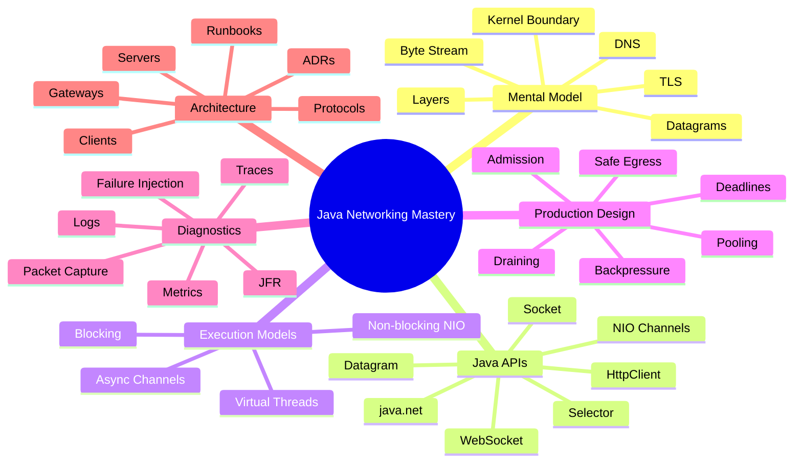
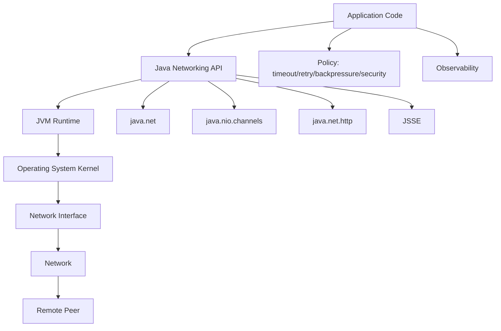
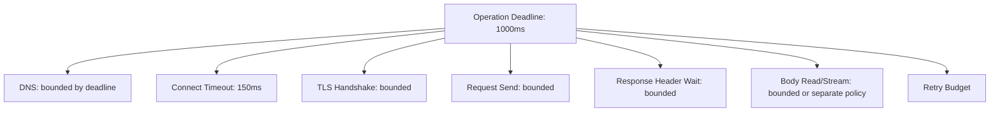
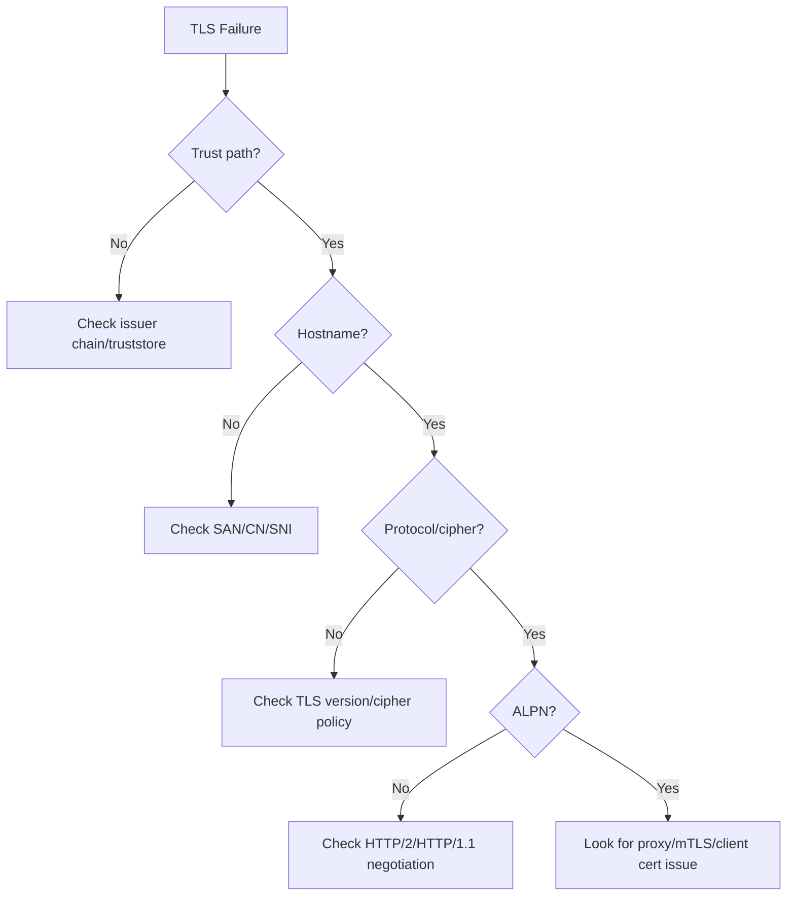

# Part 032 — Capstone: Enterprise Java Networking Handbook

> Goal: menyatukan seluruh seri menjadi handbook operasional: decision framework, failure matrix, architecture checklist, troubleshooting playbook, ADR template, reference implementation map, dan project latihan akhir untuk membangun keluwesan engineering.

Ini adalah part terakhir seri **Learn Java Networking**.

Jika Part 001 adalah peta belajar, Part 032 adalah **operating manual**. Tujuannya bukan mengulang semua materi, tetapi mengubahnya menjadi alat pengambilan keputusan dan praktik engineering.

Seorang engineer top-tier tidak hanya tahu API seperti `Socket`, `SocketChannel`, `HttpClient`, atau `WebSocket`. Mereka bisa menjawab:

- apa boundary jaringan sistem ini?
- siapa pemilik lifecycle koneksi?
- berapa deadline end-to-end?
- apa yang terjadi jika DNS lambat?
- apa yang terjadi jika TLS gagal?
- apa yang terjadi jika client lambat membaca?
- apa yang terjadi jika upstream mengirim response parsial?
- apa yang terjadi saat rolling deploy?
- bagaimana membuktikan teori insiden dengan evidence?

Part ini adalah rangkuman praktis untuk menjawab pertanyaan-pertanyaan itu.

---

## 1. Final Kaufman Skill Model

Kaufman menekankan deconstruction, enough learning to self-correct, removing barriers, deliberate practice, dan fast feedback. Untuk Java networking, bentuk akhirnya seperti ini:



The real skill is not memorizing APIs. The real skill is **choosing the smallest correct networking model for the problem and proving it under failure**.

---

## 2. The Whole-Series Mental Model

Java networking sits across multiple boundaries.



Troubleshooting harus bergerak melalui boundary ini secara sistematis:

1. apakah aplikasi membangun request yang benar?
2. apakah API Java dikonfigurasi benar?
3. apakah JVM/network properties memengaruhi behavior?
4. apakah OS socket state mendukung dugaan?
5. apakah packet capture menunjukkan traffic sesuai teori?
6. apakah remote peer benar-benar menerima/menjawab?

---

## 3. Networking Design Decision Framework

Gunakan pertanyaan ini sebelum memilih API atau framework.

### 3.1 What Is the Communication Shape?

| Shape | Typical Java choice | Notes |
|---|---|---|
| request/response HTTP | `java.net.http.HttpClient` or framework server | start here unless custom protocol needed |
| streaming HTTP download/upload | `BodyPublisher`/`BodySubscriber` streaming | avoid full buffering |
| bidirectional real-time | WebSocket | model lifecycle explicitly |
| custom TCP protocol | `Socket` + virtual threads or NIO | define framing first |
| high connection custom server | NIO selector or specialized framework | state machine required |
| local IPC | Unix-domain socket channel | useful for sidecar/local daemon |
| best-effort datagram | UDP/datagram channel | design loss/reorder handling |

### 3.2 What Is the Failure Budget?

| Question | Required decision |
|---|---|
| maximum end-to-end latency? | deadline |
| maximum connect wait? | connect timeout |
| maximum idle read wait? | read timeout |
| maximum body size? | memory/body limit |
| can operation be retried? | idempotency policy |
| can body be replayed? | buffering/replay strategy |
| what happens during overload? | fail-fast/degrade/shed |
| what happens during shutdown? | drain plan |

### 3.3 What Is the Trust Boundary?

| Boundary | Risk | Required control |
|---|---|---|
| user-provided URL | SSRF | safe egress allowlist |
| public client | protocol abuse | strict limits/timeouts |
| corporate proxy | hidden routing behavior | explicit proxy config/logging |
| TLS peer | wrong host/cert | hostname verification/truststore |
| gateway headers | spoofed identity | trusted proxy policy |
| DNS | rebinding/split-horizon | revalidation and IP policy |

---

## 4. API Selection Matrix

| Need | Prefer | Avoid |
|---|---|---|
| simple outbound HTTP | shared immutable `HttpClient` | per-request client creation |
| many blocking I/O tasks | virtual threads + bounded admission | unbounded platform threads |
| custom binary server | `Socket` for simple, NIO for high fan-in | mixing message assumptions into TCP stream |
| multiplexed custom I/O | `Selector`/NIO | blocking reads inside event loop |
| local daemon IPC | Unix-domain sockets | exposing localhost TCP without need |
| embedded test/admin HTTP | `jdk.httpserver` | using it as full-featured internet-facing framework without hardening |
| large file transfer | streaming/channel copy | `readAllBytes()` |
| WebSocket client | `java.net.http.WebSocket` | treating callbacks as unlimited push without demand/backpressure |

---

## 5. Golden Rules of Java Networking

1. **TCP is a byte stream, not a message queue.** Define framing.
2. **A timeout is not a deadline.** Compose the whole operation budget.
3. **A retry is a new request, not magic recovery.** Prove idempotency.
4. **Buffers are capacity commitments.** Bound them.
5. **Backpressure must be explicit.** Slow peers are normal.
6. **DNS is runtime behavior.** Cache, TTL, resolver, and address family matter.
7. **TLS failure is not one thing.** Separate trust, hostname, SNI, ALPN, protocol, and cipher issues.
8. **Connection pools are shared infrastructure.** Lifecycle and body consumption matter.
9. **Virtual threads reduce waiting cost, not resource limits.** Still bound work.
10. **Graceful shutdown is a state machine.** Stop accepting before force closing.
11. **Packet capture is evidence, not the first tool.** Use after forming testable hypotheses.
12. **Production readiness means behavior under failure is designed.** Happy path is not enough.

---

## 6. Failure Matrix

Use this matrix during design review and incidents.

| Failure | Symptom | Java-level signal | Evidence to collect | Design control |
|---|---|---|---|---|
| DNS NXDOMAIN | immediate name failure | `UnknownHostException` | resolver log, DNS query | endpoint config validation |
| DNS slow | connect delayed before socket | request timeout before connect | timing breakdown | resolver cache/deadline |
| wrong address family | works on one host, fails on another | connect timeout/refused | resolved addresses | dual-stack test |
| connection refused | peer not listening | `ConnectException` | SYN/RST, OS state | health/routing check |
| connect timeout | no TCP handshake | `HttpConnectTimeoutException` or timeout | SYN retries/blackhole | connect timeout + failover |
| TCP reset | connection aborted | `SocketException: Connection reset` | packet capture RST | retry if safe/classify |
| read timeout | no bytes in time | `SocketTimeoutException` | idle duration | read timeout/deadline |
| partial read | incomplete message | parser waits/fails | byte count | framing/read loop |
| partial write | data not fully written | remaining buffer | write metrics | write loop/backpressure |
| TLS trust failure | cert path invalid | `SSLHandshakeException` | cert chain/debug | truststore management |
| TLS hostname failure | cert not matching host | `SSLHandshakeException` | SNI/host/cert SAN | hostname verification |
| ALPN mismatch | wrong protocol negotiated | protocol error | TLS debug | config compatibility |
| proxy auth failure | cannot egress | 407/handshake failure | proxy logs | proxy config/auth |
| stale pooled connection | first reuse fails | reset/EOF | pool logs | retry once if safe |
| slow client | server memory/thread pressure | write blocks/pending queue | write queue metrics | slow-client limit |
| slow upstream | gateway request timeout | deadline exceeded | upstream timing | deadline/bulkhead |
| overload | p99 spike/errors | 503/429/timeouts | queue depth/admission | shed load early |
| retry storm | traffic amplification | many attempts | attempt metrics | retry budget/jitter |
| shutdown abort | resets during deploy | client resets | deploy timeline | drain protocol |

---

## 7. Timeout and Deadline Blueprint

Every network operation should have a budget hierarchy.



Example policy:

```java
record NetworkPolicy(
    Duration totalDeadline,
    Duration connectTimeout,
    Duration idleReadTimeout,
    int maxAttempts,
    long maxRequestBytes,
    long maxResponseBytes
) {}
```

Rule:

> The sum of attempts must fit inside the caller deadline. Never let each retry get a fresh full timeout unless that is explicitly intended and bounded.

---

## 8. Retry Decision Table

| Operation | Failure before side effect? | Body replayable? | Idempotent? | Retry? |
|---|---:|---:|---:|---:|
| GET account | likely | yes | yes | yes, bounded |
| POST create payment without idempotency key | unknown | yes | no | no |
| POST create payment with idempotency key | maybe | yes | application-idempotent | maybe |
| streaming upload half sent | no/unknown | no | depends | usually no |
| connect timeout before request sent | yes | yes | depends | maybe |
| TLS handshake failure | yes | yes | no point unless failover/config variant | usually no immediate retry |
| response header timeout | unknown | yes | depends | cautious |
| connection reset on pooled idle before request | likely | yes | yes | retry once if safe |

Retry policy should be part of the client/gateway API, not hidden inside random helper methods.

---

## 9. Backpressure and Memory Budget Blueprint

Define budgets explicitly.

| Budget | Example |
|---|---:|
| max active requests | 1,000 |
| max request body in memory | 1 MiB |
| max streaming body | 1 GiB with chunked processing |
| max per-connection write queue | 1 MiB |
| max total pending write bytes | 512 MiB |
| max direct buffer pool | 256 MiB |
| max response aggregation | 4 MiB |
| max log body preview | 4 KiB |

Bad design:

```java
byte[] response = httpClient.send(request, BodyHandlers.ofByteArray()).body();
```

Good design for large/unknown response:

```java
Path target = Path.of("download.bin");
HttpResponse<Path> response = httpClient.send(
    request,
    HttpResponse.BodyHandlers.ofFile(target)
);
```

For custom NIO, budget write queues and remove `OP_WRITE` interest when there is nothing to write.

---

## 10. Safe Egress Checklist

For any Java code that calls user-influenced network destinations:

- [ ] allow only approved schemes, usually `https`;
- [ ] normalize URI before validation;
- [ ] reject userinfo in URI unless explicitly needed;
- [ ] validate host as host, not raw string substring;
- [ ] resolve DNS and check resulting IP range;
- [ ] block loopback/link-local/private/metadata IP ranges unless explicitly allowed;
- [ ] re-check after redirects;
- [ ] limit redirect count;
- [ ] do not allow protocol downgrade;
- [ ] do not trust DNS once forever if long-lived operation;
- [ ] use route table for upstreams where possible;
- [ ] log policy decision safely.

Safe egress belongs in a reusable client boundary, not duplicated across feature code.

---

## 11. TLS Troubleshooting Playbook

When TLS fails, classify before changing truststores.



Evidence:

- endpoint hostname and port;
- resolved IP;
- SNI hostname;
- certificate chain;
- truststore used;
- client certificate alias if mTLS;
- TLS protocol version;
- cipher suite;
- ALPN result;
- proxy presence.

Do not disable hostname verification to “fix” TLS. That converts a diagnosed failure into a security vulnerability.

---

## 12. DNS Troubleshooting Playbook

DNS is often hidden inside “connect took too long”.

Questions:

1. what hostname did Java resolve?
2. what addresses were returned?
3. IPv4 or IPv6 first?
4. what TTL/caching behavior applies?
5. is negative caching involved?
6. does container DNS differ from host DNS?
7. does split-horizon DNS apply?
8. does service mesh or proxy intercept resolution?

Java probe:

```java
InetAddress[] addresses = InetAddress.getAllByName("example.com");
for (InetAddress address : addresses) {
    System.out.printf("%s -> %s%n", address.getHostName(), address.getHostAddress());
}
```

Never assume your laptop DNS result equals production DNS result.

---

## 13. Socket/NIO Troubleshooting Playbook

| Symptom | Ask | Tool/evidence |
|---|---|---|
| accept slow | listen backlog full? worker blocked? | OS socket state, accept metrics |
| read blocks | peer sent bytes? parser waiting for full frame? | packet capture, byte counters |
| write blocks | peer reading slowly? send buffer full? | pending write bytes |
| selector spin | interest ops wrong? key cancelled? | event loop CPU/profile |
| high GC | buffer allocation per read/write? | allocation profile/JFR |
| many CLOSE_WAIT | app not closing socket after peer close? | OS socket state |
| many TIME_WAIT | connection churn? no pooling? | connection metrics |
| connection reset | who sent RST? | packet capture |

Packet capture should answer: “did bytes exist on the wire?” It should not replace application logs, metrics, or code inspection.

---

## 14. Observability Minimum Viable Set

For clients:

- request count by operation/outcome;
- connect latency;
- TLS handshake latency if available;
- time to first byte;
- response body duration;
- retry attempts;
- timeout category;
- DNS failure count;
- connection reset/EOF count;
- safe egress rejection count;
- bytes sent/received.

For servers/gateways:

- accepted/rejected connections;
- active connections;
- active requests;
- admission rejection reason;
- request queue wait;
- handler duration;
- downstream duration;
- response write duration;
- client abort count;
- slow-client disconnect count;
- drain duration;
- forced close count.

Logs should include correlation IDs, sanitized endpoint identity, failure class, attempt number, deadline remaining, and close reason.

---

## 15. Architecture Decision Record Template

Use this ADR template for networking decisions.

```md
# ADR: <Networking Decision Title>

## Status
Proposed | Accepted | Deprecated | Superseded

## Context
What system boundary does this decision affect?
What traffic shape exists?
What are latency, throughput, payload, and failure requirements?

## Decision
What Java API/framework/model are we choosing?
What timeout, deadline, retry, pooling, TLS, proxy, and backpressure policies apply?

## Alternatives Considered
- Option A
- Option B
- Option C

## Consequences
Positive:
- ...

Negative/trade-offs:
- ...

## Failure Model
How does the system behave under:
- DNS failure
- connect timeout
- TLS failure
- partial read/write
- upstream slow response
- client abort
- overload
- shutdown

## Operational Evidence
What logs, metrics, traces, JFR events, or packet capture workflow prove correctness?

## Test Plan
What unit, integration, load, and failure-injection tests validate the decision?
```

---

## 16. Design Review Checklist

Before approving a networking design:

### Endpoint and Identity

- [ ] endpoint scheme/host/port explicit;
- [ ] DNS behavior understood;
- [ ] IPv4/IPv6 behavior tested;
- [ ] proxy behavior explicit;
- [ ] TLS hostname/trust boundary documented.

### Timeout and Deadline

- [ ] connect timeout set;
- [ ] request deadline set;
- [ ] body streaming timeout/limit defined;
- [ ] retry attempts fit deadline;
- [ ] cancellation behavior tested.

### Resource Bounds

- [ ] max active requests/connections;
- [ ] max body size;
- [ ] max queued bytes;
- [ ] max worker queue;
- [ ] max pool size / reuse policy;
- [ ] direct/heap buffer strategy.

### Protocol Correctness

- [ ] framing defined;
- [ ] parser handles partial read;
- [ ] writer handles partial write;
- [ ] invalid input rejected;
- [ ] version negotiation defined.

### Resilience

- [ ] retry only when safe;
- [ ] jitter/budget applied;
- [ ] overload behavior deterministic;
- [ ] graceful shutdown defined;
- [ ] client abort cancels work.

### Security

- [ ] safe egress enforced;
- [ ] redirects controlled;
- [ ] private IP policy defined;
- [ ] header trust boundary defined;
- [ ] TLS/mTLS configuration reviewed.

### Observability

- [ ] failure taxonomy represented in metrics/logs;
- [ ] timeout category clear;
- [ ] attempt number recorded;
- [ ] deadline remaining recorded;
- [ ] packet capture/JFR workflow documented.

---

## 17. Reference Implementation Map

Build these packages for a serious internal Java networking lab.

```text
com.example.networking
├── client
│   ├── NetworkClient.java
│   ├── NetworkClientConfig.java
│   ├── Deadline.java
│   ├── RetryPolicy.java
│   ├── RetryBudget.java
│   ├── FailureClassifier.java
│   ├── SafeEgressPolicy.java
│   └── HttpTransport.java
├── server
│   ├── ServerLifecycle.java
│   ├── AdmissionController.java
│   ├── ConnectionRegistry.java
│   ├── GracefulShutdown.java
│   └── HealthState.java
├── protocol
│   ├── Frame.java
│   ├── FrameReader.java
│   ├── FrameWriter.java
│   ├── ProtocolException.java
│   └── VersionNegotiator.java
├── gateway
│   ├── RouteTable.java
│   ├── GatewayExchange.java
│   ├── DownstreamClient.java
│   ├── StreamingProxy.java
│   └── HeaderPolicy.java
├── observability
│   ├── NetworkEvent.java
│   ├── NetworkMetrics.java
│   ├── NetworkLogger.java
│   └── TraceContext.java
└── testkit
    ├── SlowServer.java
    ├── ResetServer.java
    ├── BlackholeServer.java
    ├── TlsTestServer.java
    └── PacketCaptureNotes.md
```

Each package should enforce one boundary. Avoid creating `NetworkingUtils` as a junk drawer.

---

## 18. Capstone Project: Enterprise Network Gateway Lab

Build a Java gateway with these features:

### Required Capabilities

1. Accept inbound HTTP requests.
2. Route to configured upstreams only.
3. Use a shared `HttpClient`.
4. Enforce safe egress.
5. Enforce request deadline.
6. Enforce max request/response size.
7. Stream large response to client.
8. Retry only safe idempotent operations.
9. Expose readiness/liveness.
10. Support graceful shutdown and drain.
11. Emit structured logs and metrics.
12. Include failure-injection tests.

### Failure Scenarios to Test

| Scenario | Expected result |
|---|---|
| upstream DNS failure | classified gateway failure |
| upstream connect timeout | bounded response time |
| upstream TLS failure | clear error metric/log |
| upstream slow header | deadline failure |
| upstream slow body | stream timeout/cancel |
| client abort | upstream cancelled |
| large body | rejected before memory blow-up |
| route to internal IP via redirect | blocked |
| overload | early 503/429, stable memory |
| shutdown during active request | drain then forced cancel |

### Success Criteria

- no unbounded queue;
- no unbounded body buffer;
- no per-request `HttpClient` creation;
- all network failures classified;
- all retries have attempt number and budget;
- p99 remains bounded under overload;
- memory remains stable under slow client;
- shutdown produces deterministic logs;
- design documented by ADR.

---

## 19. Deliberate Practice Plan

### Week 1 — Raw Mechanics

- implement length-prefixed TCP echo server;
- test partial read/write;
- add max frame size;
- add timeout;
- add graceful close frame.

### Week 2 — NIO and Backpressure

- implement selector-based server;
- add bounded write queue;
- simulate slow client;
- measure allocation rate;
- fix selector spin bug if introduced.

### Week 3 — HTTP Client and Safe Egress

- build reusable `HttpClient` wrapper;
- classify DNS/TCP/TLS/HTTP failures;
- implement deadline propagation;
- implement safe egress allowlist;
- test redirect attack cases.

### Week 4 — Gateway and Production Behavior

- build streaming gateway;
- add admission control;
- add retry budget;
- add graceful shutdown;
- run load and chaos tests;
- write ADR and runbook.

This is aligned with Kaufman’s idea: practice high-value sub-skills directly, shorten feedback loops, and measure whether behavior improves.

---

## 20. Common Anti-Patterns to Eliminate

| Anti-pattern | Replacement |
|---|---|
| `readAllBytes()` on unknown network body | bounded streaming |
| per-request `HttpClient.newHttpClient()` | shared configured client |
| retry all exceptions | classified retry policy |
| timeout per attempt only | total deadline |
| unbounded executor queue | admission control |
| trusting user URL | route table + safe egress |
| disabling TLS verification | fix trust/hostname/SNI properly |
| logging full payload | bounded redacted preview |
| health check always true | readiness based on capacity/lifecycle |
| direct socket close on deploy | graceful drain |
| assuming TCP preserves messages | explicit framing |
| assuming virtual threads remove limits | resource budgeting |
| NIO write without queue cap | bounded pending bytes |
| treating proxy as transparent | explicit proxy policy |
| mapping all errors to 500 | failure taxonomy |

---

## 21. Interview-Level Questions You Should Now Handle

You should be able to answer these deeply:

1. Why does TCP not preserve application message boundaries?
2. What is the difference between connect timeout, read timeout, request timeout, and deadline?
3. When is retrying a network failure unsafe?
4. Why can HTTP/2 reduce connection count but still suffer TCP-level head-of-line blocking?
5. How does a slow client cause server memory pressure?
6. Why is backlog not sufficient for admission control?
7. How do Java direct buffers affect performance and memory observability?
8. Why is `HttpClient` usually shared?
9. What happens if response body is not consumed or cancelled?
10. How do DNS caching and address selection create production-only bugs?
11. How do you debug TLS cert path vs hostname vs SNI problems?
12. What does graceful shutdown mean for long-lived connections?
13. How do you design a custom binary protocol parser safely?
14. How do you prevent SSRF in a Java network client?
15. How would you prove whether RST came from client, server, proxy, or kernel?

If your answer includes invariants, failure signals, and evidence, you are thinking at the right level.

---

## 22. Final Compression: The One-Page Handbook

Use this as the quick reference.

```text
Before sending or accepting network traffic:

1. Identity
   - scheme, host, port, address family, proxy, TLS host

2. Lifecycle
   - who creates, owns, reuses, drains, and closes the connection/client/server?

3. Bounds
   - timeout, deadline, body size, queue size, concurrency, buffer memory

4. Semantics
   - framing, idempotency, retry eligibility, redirect behavior, close behavior

5. Failure
   - DNS, connect, TLS, write, read, protocol, timeout, reset, overload, shutdown

6. Security
   - safe egress, trusted headers, TLS verification, private IP policy

7. Backpressure
   - slow peer behavior, write queue cap, streaming strategy

8. Observability
   - metric/log/trace/JFR/packet capture evidence

9. Test
   - slow peer, reset, blackhole, DNS failure, TLS failure, overload, drain

10. Documentation
   - ADR + runbook + failure matrix
```

---

## 23. Series Completion Summary

This series covered:

1. Kaufman skill map;
2. network stack mental model;
3. endpoint identity/address/routing;
4. DNS and `InetAddress`;
5. TCP semantics;
6. `Socket` and `ServerSocket`;
7. socket options/timeouts/backlog/keepalive;
8. application framing;
9. UDP/datagram/multicast;
10. NIO buffers/channels;
11. selector/event loop;
12. production NIO server patterns;
13. asynchronous socket channels;
14. Unix-domain sockets;
15. virtual threads for network I/O;
16. HTTP mechanics;
17. Java `HttpClient`;
18. body publishers/handlers/streaming;
19. HTTP/2 pooling/flow control;
20. WebSocket;
21. proxies and enterprise egress;
22. TLS/HTTPS/mTLS troubleshooting;
23. IPv6/dual-stack portability;
24. timeouts/deadlines/retries/failure taxonomy;
25. backpressure and large transfer;
26. network boundary security/safe egress;
27. network observability and packet debugging;
28. performance/buffering/kernel queues/GC pressure;
29. load testing/chaos/failure injection;
30. production-grade network clients;
31. production-grade network servers/gateways;
32. enterprise networking handbook.

---

## 24. Final Mastery Standard

You are not done when you can write socket code.

You are done when you can:

- choose the right Java networking abstraction;
- define protocol and lifecycle invariants;
- bound resource use;
- design deadline/retry/backpressure semantics;
- secure network boundaries;
- observe and classify failures;
- reproduce failures with controlled experiments;
- write ADRs that make trade-offs explicit;
- operate systems safely under deploy, overload, and dependency failure.

That is the practical bar for Java networking at internal engineering handbook level.

---

## References

- Java SE `java.net` package: networking applications, sockets, addresses, proxies, network interfaces.
- Java SE `java.nio.channels` package: channels, selectors, selectable channels, socket channels.
- Java SE `java.net.http` module: HTTP Client and WebSocket APIs.
- Java Secure Socket Extension Reference Guide: TLS/SSL, `SSLContext`, `SSLSocket`, `SSLEngine`, SNI, ALPN.
- Java Flight Recorder documentation: runtime performance diagnostics.
- RFC 9110: HTTP Semantics.
- RFC 9112: HTTP/1.1.
- RFC 9113: HTTP/2.
- RFC 6455: WebSocket Protocol.
- OWASP SSRF Prevention Cheat Sheet.
- Linux `tc-netem` manual for network impairment experiments.
