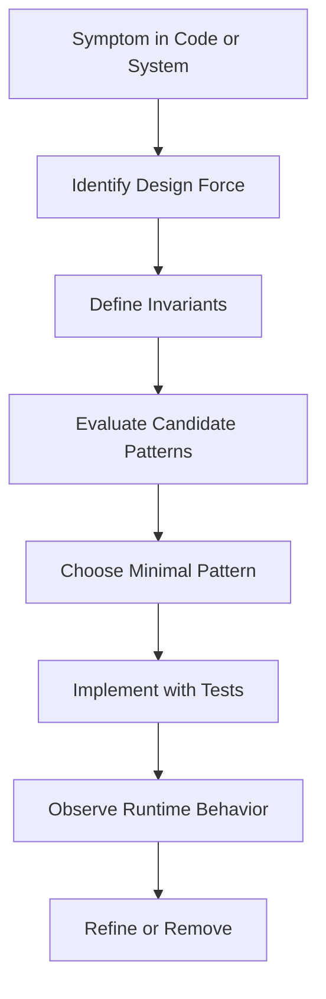
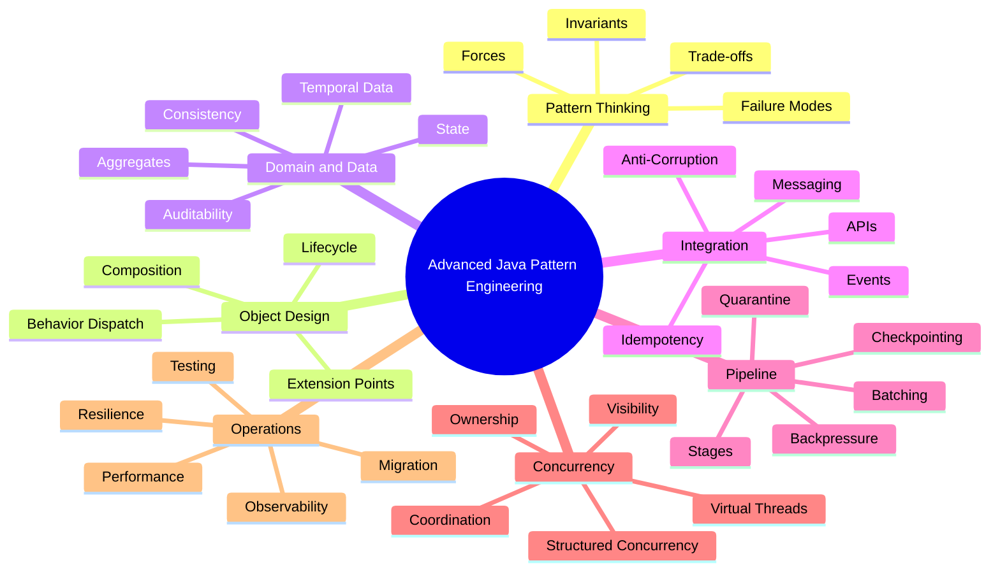
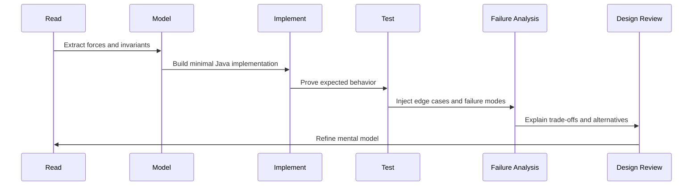
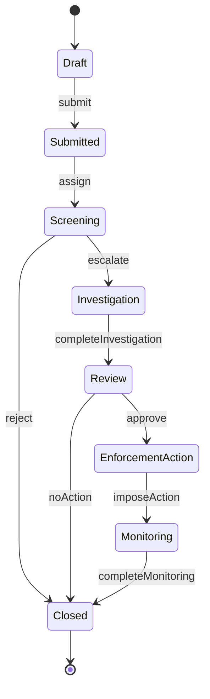

------
title: Learn Java Patterns - Part 001
description: Skill map, learning contract, deliberate practice system, and mental model foundation for advanced Java pattern engineering.
series: learn-java-patterns
seriesTitle: Learn Java Patterns, Data Patterns, Pipeline Patterns, Concurrency Patterns, Common Patterns, and Anti-Patterns
order: 1
partTitle: Kaufman Skill Map
tags:
- java
- patterns
- architecture
- advanced-java
- deliberate-practice
date: 2026-06-27
---

# Learn Java Patterns - Part 001: Kaufman Skill Map

## 1. Tujuan Part Ini

Part ini bukan katalog pattern. Part ini adalah **sistem belajar** untuk seri lengkap `learn-java-patterns`.

Kita akan memakai pendekatan Josh Kaufman dari *The First 20 Hours* sebagai kerangka praktis:

1. Tentukan target skill secara spesifik.
2. Pecah skill besar menjadi sub-skill kecil.
3. Pelajari cukup teori untuk bisa praktik dan mengoreksi diri.
4. Hilangkan hambatan praktik.
5. Latih sub-skill paling penting dengan feedback cepat.

Dalam konteks Java pattern engineering, target kita bukan sekadar:

> "Saya tahu Factory, Strategy, Observer, Repository, dan Circuit Breaker."

Target kita adalah:

> "Saya bisa membaca tekanan desain sebuah sistem, memilih pattern yang tepat, menolak pattern yang tidak perlu, menggabungkan beberapa pattern tanpa over-engineering, menguji konsekuensinya, dan menjaga sistem tetap bisa berevolusi."

Itu adalah skill yang jauh lebih bernilai daripada hafalan katalog.

---

## 2. Kontrak Seri

Seri ini dirancang untuk engineer yang sudah melewati basic Java, DSA, dan konsep OOP umum. Karena itu, materi tidak akan membuang waktu pada:

- syntax dasar Java;
- perbedaan `ArrayList` vs `LinkedList`;
- definisi OOP permukaan seperti inheritance, encapsulation, polymorphism;
- latihan algoritma dasar;
- tutorial framework spesifik seperti Spring Boot dari nol.

Kita akan fokus pada level yang lebih tinggi:

- design force;
- boundary;
- lifecycle;
- consistency;
- concurrency;
- pipeline;
- data movement;
- failure mode;
- observability;
- reversibility;
- operational cost;
- refactoring path.

Pattern akan diperlakukan sebagai **alat berpikir**, bukan dekorasi arsitektur.

---

## 3. Target Skill yang Spesifik

Skill utama seri ini:

> Mendesain dan mengevaluasi solusi Java production-grade menggunakan pattern secara sadar, minimal, testable, observable, dan evolvable.

Agar target ini tidak abstrak, kita pecah menjadi kemampuan konkret.

Setelah menyelesaikan seri ini, kamu diharapkan mampu:

1. Mengidentifikasi problem desain di balik gejala kode.
2. Membedakan problem object lifecycle, behavior dispatch, data consistency, workflow, concurrency, integration, dan resilience.
3. Memilih pattern berdasarkan *force*, bukan berdasarkan nama yang terdengar familiar.
4. Menjelaskan konsekuensi pattern terhadap coupling, cohesion, latency, throughput, memory, operability, dan testability.
5. Menggabungkan pattern tanpa menciptakan accidental complexity.
6. Menulis implementasi Java yang idiomatic untuk pattern tersebut.
7. Mengetahui kapan pattern harus dihindari.
8. Mendeteksi anti-pattern sebelum menjadi beban organisasi.
9. Melakukan refactoring menuju pattern secara bertahap tanpa rewrite besar.
10. Membuat design review yang defensible.

---

## 4. Mental Model: Pattern Sebagai Resolusi Tekanan

Pattern muncul karena ada tekanan desain yang berulang.

Contoh:

| Tekanan | Gejala | Pattern yang Mungkin Relevan |
|---|---|---|
| Object creation rumit | Constructor terlalu panjang, object invalid sementara | Builder, Factory, Assembler |
| Behavior bervariasi | Banyak `if/else` berdasarkan tipe atau status | Strategy, Policy, State |
| Sistem harus audit-able | Perubahan state harus bisa ditelusuri | Event, Audit Trail, State Machine |
| Konsumen lebih lambat dari produsen | Queue membesar, latency naik | Backpressure, Bounded Queue, Rate Limit |
| External service tidak stabil | Request menggantung, retry storm | Timeout, Circuit Breaker, Bulkhead |
| Data perlu konsisten antar service | Dual-write failure | Outbox, Inbox, Idempotent Receiver |
| Banyak workflow lintas tahap | Status kacau, transition tidak jelas | State Machine, Saga, Process Manager |

Pattern bukan jawaban pertama. Pattern adalah jawaban setelah kita memahami tekanan.



Prinsip penting:

> Pattern yang baik mengurangi kekacauan yang nyata. Pattern yang buruk menambah struktur tanpa mengurangi risiko.

---

## 5. Skill Decomposition

Menguasai pattern engineering bukan satu skill. Ini gabungan beberapa sub-skill.



Kita tidak akan belajar semua sub-skill sekaligus. Kita akan melatihnya dalam urutan yang membangun kemampuan.

---

## 6. Urutan Belajar dalam Seri Ini

Seri ini disusun menjadi 7 fase besar.

### Fase 1: Pattern Thinking Foundation

Part terkait:

- Part 001: Kaufman Skill Map
- Part 002: Pattern Thinking Beyond Catalogs
- Part 003: Java Pattern Building Blocks

Fokus:

- memahami pattern sebagai alat berpikir;
- membedakan essential complexity dan accidental complexity;
- melihat Java feature sebagai bahan baku pattern.

### Fase 2: Object and Behavioral Design

Part terkait:

- Part 004: Object Lifecycle and Construction Patterns
- Part 005: Composition, Boundary, and Structural Patterns
- Part 006: Behavioral Dispatch Patterns

Fokus:

- creation;
- composition;
- boundary;
- dispatch;
- extensibility.

### Fase 3: Domain, Data, and Workflow

Part terkait:

- Part 007 sampai Part 010.

Fokus:

- domain modeling;
- data modeling;
- transaction boundary;
- workflow state machine.

### Fase 4: Integration and Pipeline

Part terkait:

- Part 011 sampai Part 015.

Fokus:

- events;
- messaging;
- integration;
- pipeline;
- stream;
- batch;
- restartability.

### Fase 5: Concurrency and Throughput

Part terkait:

- Part 016 sampai Part 022.

Fokus:

- memory visibility;
- lock strategy;
- task coordination;
- virtual threads;
- structured concurrency;
- actors;
- partition ownership.

### Fase 6: Production Hardening

Part terkait:

- Part 023 sampai Part 031.

Fokus:

- cache;
- resilience;
- API boundary;
- security;
- observability;
- testing;
- performance;
- modularity.

### Fase 7: Judgment, Refactoring, Anti-Pattern, Capstone

Part terkait:

- Part 032 sampai Part 035.

Fokus:

- refactoring to patterns;
- anti-pattern detection;
- pattern selection framework;
- end-to-end architecture.

---

## 7. What “Top 1%” Means Here

Istilah “top 1%” mudah berubah menjadi slogan kosong. Dalam seri ini, kita definisikan secara operasional.

Engineer pattern-level yang sangat kuat bukan orang yang paling banyak menyebut nama pattern. Ia punya kemampuan berikut.

### 7.1 Menemukan Problem yang Benar

Banyak desain gagal karena engineer menyelesaikan problem yang salah.

Contoh buruk:

```text
Problem stated: "We need to use Strategy Pattern."
Real problem:   "Business rules change frequently and are currently mixed with orchestration code."
```

Pattern tidak boleh menjadi problem statement.

Problem statement yang baik:

```text
When a regulatory case enters a new status, the allowed actions depend on case type,
risk level, jurisdiction, and previous enforcement history. The rules change often,
but the orchestration flow must remain stable and auditable.
```

Dari problem seperti itu, barulah kita bisa mengevaluasi:

- Strategy;
- Specification;
- Policy Object;
- State Machine;
- Rules Engine;
- Decision Table;
- kombinasi beberapa pattern.

### 7.2 Melihat Konsekuensi Jangka Panjang

Pattern punya biaya.

| Pattern | Manfaat | Biaya |
|---|---|---|
| Factory | creation logic tersembunyi dan konsisten | bisa menyembunyikan dependency terlalu banyak |
| Strategy | behavior mudah diganti | class explosion jika variasi kecil |
| Repository | domain decoupled dari persistence | query kompleks bisa bocor atau menjadi lemah |
| Event-driven | loose coupling dan async processing | ordering, idempotency, observability lebih sulit |
| Circuit Breaker | mencegah cascading failure | fallback salah bisa menyembunyikan outage |
| Cache-aside | latency rendah | invalidation dan staleness sulit |

Engineer senior tidak hanya bertanya:

> Pattern apa yang cocok?

Ia bertanya:

> Biaya apa yang saya terima jika memilih pattern ini, dan apakah biaya itu lebih kecil daripada risiko problem aslinya?

### 7.3 Menjaga Reversibility

Salah satu tanda desain matang adalah mudah diubah ketika asumsi berubah.

Pattern yang baik seharusnya memberi opsi, bukan mengunci sistem.

Contoh:

- Mulai dari simple `Policy` interface sebelum menggunakan rules engine.
- Mulai dari in-process event sebelum external message broker.
- Mulai dari single-writer table sebelum full event sourcing.
- Mulai dari explicit workflow transition sebelum engine BPMN.

Prinsip:

> Jangan membeli kompleksitas masa depan dengan uang desain hari ini kecuali probabilitas dan dampaknya cukup jelas.

---

## 8. Core Learning Loop

Setiap part dalam seri ini akan memakai learning loop yang sama.



Tujuannya bukan membaca banyak materi. Tujuannya adalah membuat otak terbiasa bertanya:

1. Apa tekanan desainnya?
2. Apa invariant yang tidak boleh rusak?
3. Apa opsi paling sederhana?
4. Apa failure mode-nya?
5. Bagaimana saya membuktikan desain ini benar?
6. Bagaimana desain ini gagal di production?
7. Bagaimana saya memigrasikan desain ini jika asumsi berubah?

---

## 9. Pattern Decision Kernel

Kita akan memakai format berpikir berikut di semua part.

```text
Context:
  Situasi sistem yang sedang dihadapi.

Problem:
  Masalah desain yang benar-benar perlu diselesaikan.

Forces:
  Tekanan yang saling bertentangan.

Invariants:
  Hal yang wajib selalu benar.

Candidate Patterns:
  Opsi pattern yang mungkin.

Decision:
  Pattern yang dipilih dan batas penerapannya.

Consequences:
  Biaya, risiko, dan efek samping.

Failure Modes:
  Cara desain bisa gagal.

Tests:
  Bukti minimal bahwa desain bekerja.

Operational Signals:
  Metrik/log/trace yang menunjukkan desain sehat atau rusak.

Refactoring Path:
  Cara masuk dan keluar dari pattern tanpa big bang rewrite.
```

Template ini lebih penting daripada menghafal nama pattern.

---

## 10. Case Study Berulang: Regulatory Case Processing Kernel

Agar latihan tidak terasa artifisial, kita akan memakai domain latihan yang cukup kompleks: **case processing kernel**.

Ini bukan aplikasi lengkap. Ini adalah mini-domain untuk melatih pattern.

### 10.1 Domain Minimal

Sistem menangani case yang memiliki:

- identifier;
- subject;
- jurisdiction;
- risk level;
- status;
- assigned officer;
- evidence;
- decision;
- audit trail;
- escalation history;
- deadline;
- external notifications.

### 10.2 Contoh Lifecycle



### 10.3 Invariant Domain

Beberapa invariant:

1. Case yang sudah `Closed` tidak boleh menerima evidence baru kecuali melalui reopening process.
2. Enforcement action tidak boleh dibuat tanpa review approval.
3. Setiap perubahan status harus menghasilkan audit event.
4. Deadline escalation tidak boleh hilang walau external notification gagal.
5. Retry notification tidak boleh membuat duplicate legal notice.
6. Concurrent update pada case yang sama harus terdeteksi atau diserialisasi.

Domain ini cukup kaya untuk melatih:

- State Pattern;
- State Machine;
- Repository;
- Unit of Work;
- Outbox;
- Idempotent Receiver;
- Saga;
- Specification;
- Policy Object;
- Strategy;
- Command;
- Pipeline;
- Actor-like single writer;
- Audit Trail;
- Cache;
- Resilience;
- Observability;
- Anti-pattern detection.

---

## 11. Practice Repository Structure

Jika kamu ingin praktik secara konsisten, gunakan struktur repository seperti ini.

```text
learn-java-patterns-lab/
  build.gradle.kts
  settings.gradle.kts
  src/
    main/
      java/
        dev/patterns/
          casekernel/
            domain/
            application/
            infrastructure/
            integration/
            pipeline/
            concurrency/
            observability/
    test/
      java/
        dev/patterns/
          casekernel/
            domain/
            application/
            integration/
            concurrency/
```

Struktur ini sengaja menyerupai boundary production:

- `domain`: aturan bisnis dan invariant;
- `application`: orchestration use case;
- `infrastructure`: persistence, messaging, clock, ID generator;
- `integration`: external API adapter;
- `pipeline`: stage processing;
- `concurrency`: worker, queue, coordination;
- `observability`: structured event, metrics, tracing abstraction.

Kita tidak memakai framework berat di awal karena framework bisa menyembunyikan pattern. Framework akan lebih mudah dipahami setelah pattern dasarnya jelas.

---

## 12. Tooling Minimum

Gunakan tooling sederhana:

```text
JDK: 21+ minimum, 25 ideal untuk structured concurrency/scoped values experiment
Build: Gradle atau Maven
Test: JUnit 5
Assertions: AssertJ optional
Benchmark: JMH untuk part performance
Static analysis: Error Prone, SpotBugs, ArchUnit optional
```

Catatan:

- Virtual threads tersedia stabil sejak Java 21.
- Structured concurrency dan scoped values dibahas dalam konteks Java modern karena keduanya memengaruhi cara kita mendesain concurrency boundary.
- Reactive Streams dibahas sebagai model standar backpressure, bukan sebagai keharusan memakai framework tertentu.

---

## 13. Minimum Java Baseline untuk Seri Ini

Kamu perlu nyaman dengan konsep berikut.

### 13.1 Language Constructs

- `interface` dan default method;
- `record`;
- `sealed interface` dan `sealed class`;
- generics;
- lambda dan method reference;
- `Optional` secara bijak;
- exception hierarchy;
- annotation dasar;
- `try-with-resources`;
- `var` dalam konteks lokal;
- pattern matching modern Java.

### 13.2 Concurrency Constructs

- `Thread`;
- `ExecutorService`;
- `CompletableFuture`;
- `BlockingQueue`;
- `ConcurrentHashMap`;
- `AtomicReference`;
- `ReentrantLock`;
- `Semaphore`;
- `CountDownLatch`;
- `Phaser`;
- virtual threads;
- cancellation dan timeout.

### 13.3 Design Concepts

- cohesion;
- coupling;
- dependency direction;
- boundary;
- immutability;
- idempotency;
- consistency;
- transaction boundary;
- failure isolation.

Jika sebagian belum kuat, tidak masalah. Seri ini akan menjelaskan konsep saat digunakan, tetapi tidak akan berhenti lama pada level dasar.

---

## 14. Pattern Maturity Ladder

Kita akan menilai pemahaman pattern dengan ladder berikut.

| Level | Kemampuan | Contoh |
|---:|---|---|
| 1 | Mengenali nama pattern | “Ini Strategy Pattern.” |
| 2 | Mengimplementasikan template | Membuat interface dan beberapa implementation |
| 3 | Menjelaskan problem | “Behavior berubah berdasarkan policy bisnis.” |
| 4 | Menjelaskan trade-off | “Strategy mengurangi conditional tapi menambah class count.” |
| 5 | Menentukan batas | “Gunakan Strategy hanya untuk variasi stabil, bukan untuk setiap if kecil.” |
| 6 | Menggabungkan pattern | Strategy + Specification + State Machine |
| 7 | Menguji failure mode | Test rule conflict, missing strategy, invalid transition |
| 8 | Mengoperasikan di production | Metrics, logs, tracing, audit, rollback path |
| 9 | Menghapus pattern saat tidak perlu | Simplify abstraction setelah kebutuhan berubah |

Target seri ini adalah minimal Level 7, dengan beberapa topik mencapai Level 8 dan 9.

---

## 15. Deliberate Practice Plan

Membaca pattern tidak cukup. Kita butuh latihan yang terstruktur.

### 15.1 Format Latihan Per Part

Untuk setiap part, lakukan 4 putaran:

1. **Recognition**: temukan gejala problem.
2. **Construction**: implementasikan pattern minimal.
3. **Stress**: tambahkan edge case dan failure mode.
4. **Review**: tulis keputusan desain dan alternatif yang ditolak.

### 15.2 Durasi Praktik

Format efektif:

| Aktivitas | Durasi |
|---|---:|
| Baca mental model | 15 menit |
| Implementasi minimal | 30 menit |
| Tambah test edge case | 20 menit |
| Refactor atau simplify | 20 menit |
| Tulis design note | 10 menit |

Total sekitar 95 menit per part jika dipraktikkan penuh.

Tidak semua part harus dipraktikkan penuh. Tetapi part yang berkaitan dengan concurrency, pipeline, transaction, dan resilience sebaiknya benar-benar dikodekan.

---

## 16. “Learn Enough to Self-Correct” untuk Pattern

Dalam konteks Kaufman, kita tidak perlu membaca semua buku pattern sebelum praktik. Kita perlu cukup teori untuk bisa mendeteksi kesalahan.

Untuk pattern engineering, self-correction berarti bisa menjawab pertanyaan ini:

1. Apakah pattern menyelesaikan problem nyata?
2. Apakah abstraction boundary-nya benar?
3. Apakah dependency direction-nya stabil?
4. Apakah invariant domain terlindungi?
5. Apakah failure mode-nya diketahui?
6. Apakah test membuktikan behavior penting?
7. Apakah observability cukup untuk debugging production?
8. Apakah pattern bisa dipindah, diganti, atau dihapus?

Jika jawabanmu tidak jelas, kamu belum punya feedback loop yang cukup.

---

## 17. Pattern Review Checklist

Gunakan checklist ini setiap kali menerapkan pattern.

```text
[ ] Problem statement ditulis tanpa menyebut nama pattern.
[ ] Invariant utama jelas.
[ ] Minimal dua alternatif dipertimbangkan.
[ ] Biaya pattern dijelaskan.
[ ] Failure mode utama disebutkan.
[ ] Test membuktikan behavior utama, bukan hanya coverage.
[ ] Boundary dependency tidak bocor.
[ ] Tidak ada abstraction hanya untuk "mungkin nanti".
[ ] Runtime signal tersedia: log, metric, trace, audit event.
[ ] Ada refactoring path jika asumsi berubah.
```

Checklist ini akan muncul berkali-kali dalam seri.

---

## 18. Common Mistakes Saat Belajar Pattern

### 18.1 Menghafal Diagram UML Tanpa Force

Diagram bukan desain. Diagram hanya representasi.

Jika kamu bisa menggambar class diagram Strategy tetapi tidak bisa menjelaskan mengapa Strategy lebih baik daripada `switch`, pemahamanmu masih dangkal.

### 18.2 Menganggap Semua Conditional Itu Buruk

Banyak engineer terlalu cepat mengganti `if` dengan Strategy, State, atau polymorphism.

Conditional kecil yang stabil sering lebih baik daripada abstraction besar.

Contoh conditional yang masih sehat:

```java
if (caseFile.isClosed()) {
    throw new CaseAlreadyClosedException(caseFile.id());
}
```

Ini bukan code smell. Ini invariant guard.

Conditional yang mulai berbahaya:

```java
if (jurisdiction.equals("A") && risk == HIGH && productType == INSURANCE) {
    // 40 lines
} else if (jurisdiction.equals("B") && risk == MEDIUM && hasPriorViolation) {
    // 50 lines
} else if (...) {
    // many more
}
```

Di sini problemnya bukan `if` itu sendiri. Problemnya adalah policy variation bercampur dengan orchestration.

### 18.3 Memakai Pattern untuk Terlihat Senior

Pattern yang tidak mengurangi risiko adalah noise.

Kode sederhana yang jelas lebih baik daripada arsitektur berlapis yang tidak punya tekanan nyata.

### 18.4 Mengabaikan Operability

Pattern yang terlihat bagus di code review bisa gagal di production jika tidak observable.

Contoh:

- retry tanpa metric;
- outbox tanpa lag monitoring;
- cache tanpa hit ratio dan invalidation signal;
- circuit breaker tanpa state transition log;
- pipeline tanpa per-stage latency.

### 18.5 Mengabaikan Migration Path

Pattern production jarang diterapkan dari nol. Biasanya kita memperbaiki sistem yang sudah berjalan.

Karena itu, pattern harus punya jalan masuk bertahap:

1. Tambahkan seam.
2. Tambahkan test characterization.
3. Ekstrak behavior kecil.
4. Ganti caller secara bertahap.
5. Hapus jalur lama.

---

## 19. Pattern Learning Anti-Goals

Agar efisien, kita sengaja tidak mengejar beberapa hal.

### Anti-Goal 1: Menggunakan Semua Pattern

Menggunakan banyak pattern bukan tanda desain bagus. Tanda desain bagus adalah problem penting terselesaikan dengan struktur minimal.

### Anti-Goal 2: Framework Worship

Framework seperti Spring, Reactor, Akka, Kafka client, Hibernate, atau workflow engine bisa membantu. Tetapi framework bukan pengganti mental model.

Kita akan memahami pattern di balik framework agar tidak menjadi pengguna pasif.

### Anti-Goal 3: Purity Over Delivery

Desain yang terlalu “murni” tetapi sulit dipahami tim bisa gagal secara sosial.

Pattern harus mempertimbangkan:

- skill tim;
- deadline;
- debugging cost;
- onboarding;
- operational maturity;
- compliance/audit need.

---

## 20. Mini Diagnostic: Seberapa Kuat Pattern Thinking Kamu?

Coba jawab tanpa melihat referensi.

1. Kapan `switch` lebih baik daripada Strategy?
2. Kapan Repository justru menyembunyikan query yang seharusnya eksplisit?
3. Apa bedanya domain event dan integration event?
4. Bagaimana cara mencegah duplicate message processing?
5. Mengapa retry tanpa timeout berbahaya?
6. Kapan virtual threads tidak menyelesaikan bottleneck?
7. Apa bedanya backpressure dan rate limiting?
8. Apa invariant paling penting dalam state machine?
9. Kapan cache-aside menghasilkan stale read yang tidak dapat diterima?
10. Bagaimana cara menguji bahwa sebuah pipeline restartable?

Jika sebagian besar belum otomatis, seri ini akan membangun fondasinya.

---

## 21. Working Definition of Pattern Categories

Sepanjang seri, kita akan memakai kategori berikut.

### 21.1 Design Pattern

Pattern untuk struktur object, behavior, dan dependency.

Contoh:

- Factory;
- Builder;
- Strategy;
- Command;
- Adapter;
- Facade;
- Decorator;
- State.

### 21.2 Data Pattern

Pattern untuk representasi, konsistensi, historisasi, dan perubahan data.

Contoh:

- Entity;
- Value Object;
- Audit Trail;
- Temporal Table;
- Snapshot;
- Event Sourcing;
- Outbox;
- Inbox.

### 21.3 Pipeline Pattern

Pattern untuk aliran data atau pekerjaan melalui stage.

Contoh:

- Pipes and Filters;
- Splitter;
- Aggregator;
- Router;
- Bounded Queue;
- Backpressure;
- Checkpoint;
- Quarantine.

### 21.4 Concurrency Pattern

Pattern untuk ownership, coordination, parallelism, dan liveness.

Contoh:

- Producer-Consumer;
- Work Stealing;
- Single Writer;
- Actor;
- Lock Striping;
- Fork-Join;
- Structured Concurrency.

### 21.5 Common Enterprise Pattern

Pattern yang sering muncul dalam aplikasi bisnis production.

Contoh:

- Repository;
- Unit of Work;
- Transaction Script;
- Service Layer;
- Anti-Corruption Layer;
- Gateway;
- DTO;
- BFF.

### 21.6 Resilience Pattern

Pattern untuk mencegah failure menyebar.

Contoh:

- Timeout;
- Retry;
- Circuit Breaker;
- Bulkhead;
- Rate Limit;
- Fallback;
- Load Shedding.

### 21.7 Anti-Pattern

Solusi yang terlihat masuk akal tetapi biasanya memperburuk sistem.

Contoh:

- God Service;
- Distributed Monolith;
- Anemic Domain Model;
- Golden Hammer;
- Chatty Service;
- Retry Storm;
- Cache Everything;
- Leaky Abstraction.

---

## 22. First Principle: Pattern Harus Melindungi Invariant

Invariant adalah aturan yang harus selalu benar.

Pattern yang tidak melindungi invariant sering hanya merapikan bentuk kode, bukan memperbaiki desain.

Contoh invariant:

```text
A case cannot move from Draft directly to EnforcementAction.
```

Implementasi buruk:

```java
caseFile.setStatus(Status.ENFORCEMENT_ACTION);
```

Masalah:

- caller bisa mengubah status sembarang;
- tidak ada guard;
- tidak ada audit;
- tidak ada transition reason;
- tidak ada enforcement of lifecycle.

Implementasi lebih baik:

```java
public final class CaseFile {
    private CaseStatus status;
    private final List<CaseEvent> events = new ArrayList<>();

    public void approveForEnforcement(Officer reviewer, DecisionReason reason, Clock clock) {
        if (status != CaseStatus.REVIEW) {
            throw new InvalidCaseTransitionException(status, CaseStatus.ENFORCEMENT_ACTION);
        }

        this.status = CaseStatus.ENFORCEMENT_ACTION;
        this.events.add(CaseEvent.enforcementApproved(id, reviewer.id(), reason, clock.instant()));
    }
}
```

Di sini kita belum menyebut pattern. Tetapi kita sudah melakukan hal penting:

- behavior dekat dengan data yang dijaga;
- transition dibatasi;
- event tercatat;
- invariant eksplisit.

Pattern formal seperti State Machine baru diperlukan jika transition bertambah kompleks.

---

## 23. Second Principle: Boundary Lebih Penting daripada Class Count

Desain buruk bukan selalu class terlalu banyak atau terlalu sedikit. Desain buruk biasanya punya boundary yang salah.

Contoh boundary bocor:

```java
public class CaseService {
    public void approve(UUID caseId) {
        var row = jdbcTemplate.queryForMap("select * from cases where id = ?", caseId);
        var status = row.get("status");
        // business rule
        // SQL update
        // HTTP notification
        // audit insert
        // retry handling
    }
}
```

Masalahnya bukan hanya method panjang. Masalahnya adalah boundary bercampur:

- persistence;
- domain rule;
- orchestration;
- integration;
- audit;
- retry;
- transaction.

Pattern yang mungkin membantu:

- Repository untuk persistence boundary;
- Domain Model untuk rule;
- Application Service untuk orchestration;
- Outbox untuk notification;
- Audit Trail untuk traceability;
- Retry/Circuit Breaker untuk integration failure.

Namun penerapannya harus bertahap, bukan langsung membuat 50 class.

---

## 24. Third Principle: Concurrency Adalah Ownership Problem

Banyak bug concurrency bukan karena engineer tidak tahu API. Masalahnya karena ownership tidak jelas.

Pertanyaan utama:

> Siapa yang boleh membaca, menulis, dan memutuskan urutan perubahan state?

Contoh buruk:

```java
caseFile.setRisk(HIGH);
caseFile.setStatus(INVESTIGATION);
caseFile.addEvidence(evidence);
```

Jika object yang sama disentuh banyak thread, kita butuh jawaban:

- apakah object immutable?
- apakah update diserialisasi?
- apakah lock melindungi semua invariant?
- apakah version check digunakan?
- apakah event diproses dengan key affinity?
- apakah single-writer pattern lebih cocok?

Concurrency pattern akan selalu dikaitkan dengan ownership.

---

## 25. Fourth Principle: Production Pattern Harus Observable

Pattern yang tidak bisa diamati akan sulit dipercaya.

Contoh signals:

| Pattern | Signal Minimum |
|---|---|
| Retry | attempt count, final outcome, delay, exhausted retry |
| Circuit Breaker | state transition, open duration, rejected calls |
| Outbox | pending count, oldest pending age, publish failures |
| Pipeline | per-stage latency, queue depth, dropped item, poison item |
| Cache | hit ratio, miss ratio, evictions, stale read incidents |
| State Machine | invalid transition, transition count by type, stuck state |
| Repository | query latency, optimistic lock conflict, transaction rollback |

Rule:

> Jika sebuah pattern mengubah runtime behavior, ia perlu runtime signal.

---

## 26. Fifth Principle: Pattern Harus Bisa Dihapus

Ini jarang dibahas, tetapi sangat penting.

Pattern yang bagus punya exit strategy.

Contoh:

- Strategy bisa digabung kembali menjadi simple method jika variasi hilang.
- Outbox bisa diganti broker transaction jika platform mendukung dan cost-nya layak.
- Cache bisa dihapus jika source latency membaik.
- Workflow engine bisa diganti explicit state machine jika proses menyederhana.

Desain yang tidak bisa disederhanakan adalah utang.

---

## 27. Latihan Part 001

### Exercise 1: Pattern Problem Statement

Ambil satu service di codebase nyata atau imajiner. Tulis ulang problem statement-nya tanpa menyebut nama pattern.

Buruk:

```text
We need Repository Pattern.
```

Baik:

```text
Domain logic currently depends on SQL details, making business rule tests slow and fragile.
We need a boundary that lets the domain express persistence needs without knowing storage details.
```

### Exercise 2: Invariant Inventory

Untuk domain case processing, tulis minimal 10 invariant.

Contoh:

```text
A closed case cannot be assigned to a new officer unless it is reopened.
```

### Exercise 3: Failure Mode Table

Pilih satu pattern yang kamu kenal. Buat tabel:

| Pattern | Failure Mode | Prevention | Runtime Signal |
|---|---|---|---|

### Exercise 4: Simplification Drill

Cari satu abstraction yang terlalu dini. Tulis cara menghapusnya tanpa merusak behavior.

---

## 28. Summary

Part ini membangun fondasi belajar seri.

Poin penting:

1. Pattern adalah alat untuk menyelesaikan tekanan desain, bukan tujuan.
2. Skill pattern engineering harus dipecah menjadi sub-skill.
3. Target kita adalah judgment, bukan hafalan.
4. Pattern harus melindungi invariant.
5. Boundary lebih penting daripada jumlah class.
6. Concurrency harus dipahami sebagai ownership problem.
7. Production pattern harus observable.
8. Pattern yang baik punya refactoring path dan exit strategy.

Di part berikutnya, kita akan masuk ke inti cara berpikir pattern: **Pattern Thinking Beyond Catalogs**.

---

## 29. References

- Josh Kaufman, *The First 20 Hours: How to Learn Anything... Fast*.
- Oracle Java Documentation: Virtual Threads, https://docs.oracle.com/en/java/javase/21/core/virtual-threads.html
- Oracle Java Documentation: Structured Concurrency, https://docs.oracle.com/en/java/javase/25/core/structured-concurrency.html
- Oracle Java API: StructuredTaskScope, https://docs.oracle.com/en/java/javase/25/docs/api/java.base/java/util/concurrent/StructuredTaskScope.html
- Reactive Streams JVM Specification, https://github.com/reactive-streams/reactive-streams-jvm
