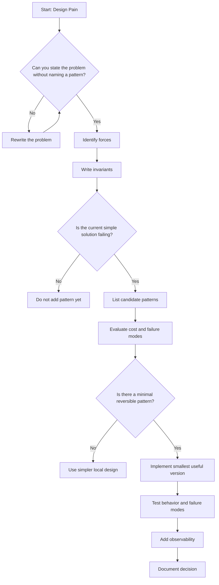
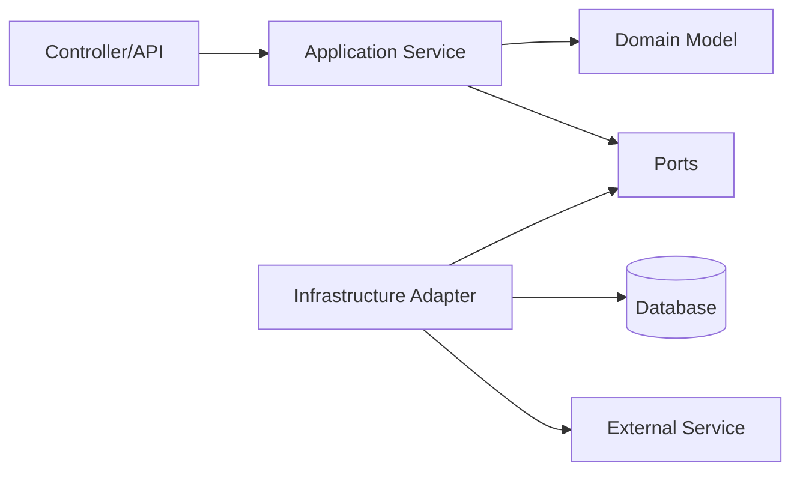
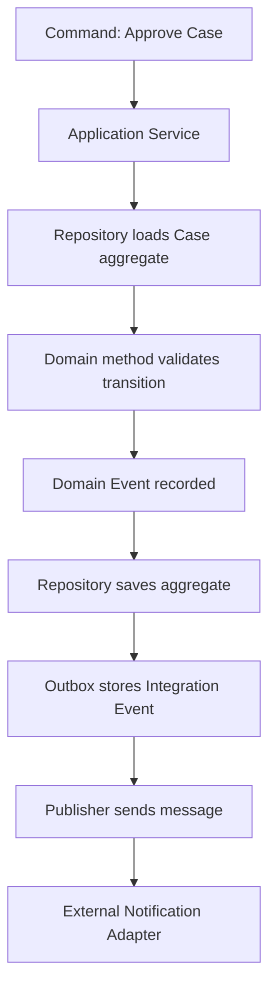
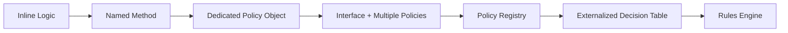

------
title: Learn Java Patterns - Part 002
description: Pattern thinking as a decision discipline: forces, invariants, boundaries, trade-offs, failure modes, and when not to use patterns.
series: learn-java-patterns
seriesTitle: Learn Java Patterns, Data Patterns, Pipeline Patterns, Concurrency Patterns, Common Patterns, and Anti-Patterns
order: 2
partTitle: Pattern Thinking Beyond Catalogs
tags:
- java
- patterns
- architecture
- design-thinking
- anti-patterns
date: 2026-06-27
---

# Learn Java Patterns - Part 002: Pattern Thinking Beyond Catalogs

## 1. Tujuan Part Ini

Part ini membangun cara berpikir sebelum kita masuk ke katalog pattern konkret.

Banyak engineer belajar pattern dengan urutan seperti ini:

1. Lihat nama pattern.
2. Lihat diagram UML.
3. Hafal class yang terlibat.
4. Coba cocokkan ke kode.

Urutan itu sering menghasilkan over-engineering.

Urutan yang lebih baik:

1. Pahami problem desain.
2. Identifikasi force yang saling bertentangan.
3. Tentukan invariant yang harus dilindungi.
4. Pilih boundary yang stabil.
5. Evaluasi beberapa solusi.
6. Gunakan pattern hanya jika ia mengurangi risiko nyata.
7. Uji konsekuensinya.

Part ini akan mengajarkan pattern sebagai **decision discipline**.

---

## 2. Pattern Bukan Template

Pattern sering dipahami sebagai template class.

Contoh pemahaman dangkal:

```text
Strategy Pattern = interface + multiple implementations.
Factory Pattern = class that creates objects.
Observer Pattern = subject + observers.
Repository Pattern = interface for database access.
```

Definisi itu tidak sepenuhnya salah, tetapi terlalu rendah.

Pattern yang sebenarnya memiliki struktur seperti ini:

```text
Pattern = recurring context + recurring problem + forces + solution shape + consequences
```

Jika kamu hanya menyalin shape tanpa memahami context dan forces, kamu belum menerapkan pattern. Kamu hanya menambah bentuk.

---

## 3. Anatomy of a Pattern

Setiap pattern yang berguna punya anatomi berikut.

| Elemen | Pertanyaan |
|---|---|
| Context | Dalam situasi apa problem ini muncul? |
| Problem | Masalah apa yang berulang? |
| Forces | Tekanan apa yang saling bertentangan? |
| Invariants | Hal apa yang harus tetap benar? |
| Solution | Struktur apa yang menyelesaikan forces? |
| Consequences | Biaya apa yang muncul? |
| Failure Modes | Bagaimana solusi ini bisa gagal? |
| Related Patterns | Pattern apa yang sering dikombinasikan atau menjadi alternatif? |

Mari lihat contoh.

### 3.1 Strategy Pattern Secara Dangkal

```java
public interface RiskScoringStrategy {
    RiskScore score(CaseFile caseFile);
}
```

Ini baru shape.

### 3.2 Strategy Pattern Secara Desain

```text
Context:
  Cara menghitung risk score berubah berdasarkan jurisdiction, case type, dan regulatory program.

Problem:
  Orchestration case intake berubah setiap kali risk scoring rule berubah.

Forces:
  - Business rule sering berubah.
  - Intake flow harus stabil.
  - Rule harus bisa dites terpisah.
  - Rule selection harus eksplisit dan auditable.
  - Terlalu banyak class kecil bisa membingungkan.

Invariant:
  Setiap submitted case harus memiliki risk score yang dihitung oleh policy yang valid untuk jurisdiction-nya.

Solution:
  Pisahkan variasi scoring ke policy/strategy object.

Consequences:
  + Rule lebih mudah diganti.
  + Test lebih fokus.
  - Perlu mekanisme pemilihan strategy.
  - Bisa terjadi class explosion.
```

Di sini pattern menjadi keputusan desain, bukan template.

---

## 4. Forces: Pusat dari Pattern Thinking

Force adalah tekanan desain yang mendorong solusi ke arah berbeda.

Contoh forces umum:

| Force | Dorongan |
|---|---|
| Simplicity | Kode harus mudah dibaca sekarang |
| Flexibility | Sistem harus mudah berubah nanti |
| Safety | Invariant tidak boleh rusak |
| Performance | Latency/throughput harus memenuhi target |
| Isolation | Failure tidak boleh menyebar |
| Consistency | Data harus benar meski ada concurrency/failure |
| Observability | Sistem harus bisa didiagnosis |
| Delivery Speed | Solusi harus bisa dikirim cepat |
| Team Familiarity | Tim harus bisa maintain |
| Compliance | Perubahan harus dapat diaudit |

Pattern bagus biasanya menyeimbangkan force yang bertentangan.

Contoh:

```text
Simplicity vs Flexibility
Consistency vs Availability
Throughput vs Ordering
Encapsulation vs Query Expressiveness
Abstraction vs Debuggability
Reuse vs Local Clarity
```

---

## 5. Essential Complexity vs Accidental Complexity

Sebelum memilih pattern, bedakan dua jenis kompleksitas.

### 5.1 Essential Complexity

Kompleksitas yang berasal dari domain atau requirement nyata.

Contoh:

- aturan enforcement berbeda per jurisdiction;
- perubahan status harus audit-able;
- deadline escalation memiliki konsekuensi hukum;
- external notification bisa gagal tetapi case transition tetap harus tercatat;
- beberapa officer bisa mencoba update case yang sama.

Essential complexity tidak bisa dihapus. Ia harus dimodelkan.

### 5.2 Accidental Complexity

Kompleksitas yang muncul karena implementasi buruk.

Contoh:

- class terlalu besar;
- SQL bercampur dengan business rule;
- retry tersebar di setiap caller;
- object bisa berada dalam state invalid;
- nama interface terlalu generik;
- abstraction dibuat tanpa variasi nyata.

Pattern seharusnya mengurangi accidental complexity tanpa menyembunyikan essential complexity.

---

## 6. Pattern Decision Flow

Gunakan flow ini sebelum menerapkan pattern.



Key idea:

> Pattern selection is a filtering process, not a naming contest.

---

## 7. Problem Statement Rules

A good problem statement should not mention pattern names.

### 7.1 Bad Problem Statements

```text
We need Factory Pattern.
```

```text
We should use Observer Pattern here.
```

```text
This needs Repository and Unit of Work.
```

These are not problem statements. They are proposed solutions.

### 7.2 Better Problem Statements

```text
Object construction requires validation, defaulting, dependency injection, and derived fields.
Callers are duplicating this logic and sometimes create invalid objects.
```

```text
Multiple parts of the system need to react when a case changes status.
The case transition code should not directly depend on all downstream actions.
```

```text
Business logic is tightly coupled to SQL queries, making domain tests slow and causing persistence details to leak into use cases.
```

Better problem statements expose forces and alternatives.

---

## 8. Pattern as Boundary Stabilizer

Salah satu fungsi pattern paling penting adalah menstabilkan boundary.

Boundary adalah garis pemisah antara hal yang berubah dengan kecepatan berbeda.

Contoh:

| Boundary | Yang Stabil | Yang Berubah |
|---|---|---|
| Strategy | Orchestration flow | Business algorithm |
| Repository | Domain need | Storage mechanism |
| Adapter | Internal contract | External API format |
| Facade | Client use case | Subsystem complexity |
| State Machine | Lifecycle rule | Transition actions |
| Outbox | Local transaction | External message delivery |
| Circuit Breaker | Caller behavior | Remote service health |

Pattern yang baik biasanya berkata:

> Bagian ini boleh berubah tanpa membuat bagian lain ikut berubah.

---

## 9. Dependency Direction

Pattern sering gagal karena dependency direction salah.

Contoh buruk:

```java
public class CaseFile {
    private final JdbcTemplate jdbcTemplate;
    private final NotificationClient notificationClient;
}
```

Domain object bergantung pada database dan external client. Ini membuat domain sulit dites dan sulit dipindahkan.

Arah dependency yang lebih baik:



Domain tidak perlu tahu database. Application layer mengorkestrasi. Infrastructure memenuhi port.

Pattern terkait:

- Ports and Adapters;
- Repository;
- Adapter;
- Anti-Corruption Layer;
- Dependency Inversion.

Namun jangan langsung membuat layer hanya karena diagram terlihat rapi. Buat boundary karena ada perubahan, testability, atau integration risk yang nyata.

---

## 10. Pattern and Invariants

Invariant adalah alat untuk membedakan desain yang benar dan desain yang hanya terlihat rapi.

### 10.1 Example: Invalid State Mutation

Buruk:

```java
public class CaseFile {
    public CaseStatus status;
}
```

Caller bisa melakukan:

```java
caseFile.status = CaseStatus.CLOSED;
```

Tanpa:

- validation;
- transition guard;
- audit;
- domain event;
- reason;
- authorization check.

### 10.2 Better: Explicit Transition Method

```java
public final class CaseFile {
    private final CaseId id;
    private CaseStatus status;
    private final List<CaseDomainEvent> events = new ArrayList<>();

    public void close(CloseReason reason, OfficerId officerId, Clock clock) {
        if (!status.canMoveTo(CaseStatus.CLOSED)) {
            throw new InvalidTransitionException(status, CaseStatus.CLOSED);
        }

        this.status = CaseStatus.CLOSED;
        this.events.add(new CaseClosed(id, reason, officerId, clock.instant()));
    }

    public CaseStatus status() {
        return status;
    }

    public List<CaseDomainEvent> pullEvents() {
        var copy = List.copyOf(events);
        events.clear();
        return copy;
    }
}
```

Kita belum memakai pattern formal besar. Tetapi kita sudah menjaga invariant.

### 10.3 When to Move to State Pattern or State Machine

Gunakan State Pattern atau State Machine jika:

- transition semakin banyak;
- rule per status berbeda jauh;
- transition membutuhkan guard/action/audit konsisten;
- invalid transition sering terjadi;
- lifecycle harus didokumentasikan dan diverifikasi.

Jangan gunakan State Pattern jika hanya ada dua status dan dua transisi sederhana.

---

## 11. Pattern Selection Example: Business Rules

Misal problem:

```text
Allowed action for a case depends on status, risk level, jurisdiction, and assigned role.
Rules change every month. Current code has a large conditional block in CaseActionService.
```

Candidate patterns:

| Candidate | Cocok Jika | Risiko |
|---|---|---|
| Simple conditional | Rule sedikit dan stabil | Akan membesar jika variasi naik |
| Strategy | Variasi behavior jelas per policy | Perlu selection mechanism |
| Specification | Rule adalah predicate yang bisa dikombinasikan | Bisa sulit dibaca jika komposisi berlebihan |
| Chain of Responsibility | Rule dievaluasi berurutan dan bisa short-circuit | Ordering bug sulit dilacak |
| Decision Table | Rule banyak dan business-readable | Butuh governance table |
| Rules Engine | Rule sangat dinamis dan dikelola non-developer | Kompleksitas operasional tinggi |
| State Machine | Rule terutama lifecycle transition | Kurang cocok untuk scoring multi-dimensi |

Keputusan tidak bisa dibuat hanya dari nama pattern. Kita butuh force ranking.

### 11.1 Force Ranking

```text
Safety/Auditability: very high
Change frequency: high
Performance: medium
Team familiarity: medium
Rule count: growing
Business ownership: maybe later
```

Solusi awal yang reversible:

- gunakan `Policy` interface;
- gunakan `Specification` untuk predicate kecil;
- simpan decision log;
- jangan langsung rules engine.

---

## 12. Java Example: Policy + Specification

### 12.1 Domain Types

```java
public enum CaseStatus {
    DRAFT,
    SUBMITTED,
    SCREENING,
    INVESTIGATION,
    REVIEW,
    ENFORCEMENT_ACTION,
    CLOSED
}

public enum RiskLevel {
    LOW,
    MEDIUM,
    HIGH
}

public record CaseContext(
        CaseStatus status,
        RiskLevel riskLevel,
        String jurisdiction,
        String officerRole,
        boolean hasPriorViolation
) {}
```

### 12.2 Specification

```java
@FunctionalInterface
public interface Specification<T> {
    boolean isSatisfiedBy(T value);

    default Specification<T> and(Specification<T> other) {
        return value -> this.isSatisfiedBy(value) && other.isSatisfiedBy(value);
    }

    default Specification<T> or(Specification<T> other) {
        return value -> this.isSatisfiedBy(value) || other.isSatisfiedBy(value);
    }

    default Specification<T> not() {
        return value -> !this.isSatisfiedBy(value);
    }
}
```

### 12.3 Policy

```java
public interface CaseActionPolicy {
    boolean allows(CaseAction action, CaseContext context);

    String policyName();
}
```

### 12.4 Implementation

```java
public final class HighRiskInvestigationPolicy implements CaseActionPolicy {
    private final Specification<CaseContext> eligible =
            isHighRisk()
                    .and(isInScreening())
                    .and(isSupervisor());

    @Override
    public boolean allows(CaseAction action, CaseContext context) {
        return action == CaseAction.ESCALATE_TO_INVESTIGATION
                && eligible.isSatisfiedBy(context);
    }

    @Override
    public String policyName() {
        return "high-risk-investigation-policy";
    }

    private static Specification<CaseContext> isHighRisk() {
        return context -> context.riskLevel() == RiskLevel.HIGH;
    }

    private static Specification<CaseContext> isInScreening() {
        return context -> context.status() == CaseStatus.SCREENING;
    }

    private static Specification<CaseContext> isSupervisor() {
        return context -> "SUPERVISOR".equals(context.officerRole());
    }
}
```

### 12.5 Why This Is Better Than a Giant Conditional

Manfaat:

- rule punya nama;
- rule bisa dites secara isolated;
- orchestration tidak tahu detail predicate;
- audit bisa mencatat policy yang digunakan;
- rule baru bisa ditambah tanpa mengubah service besar.

Biaya:

- lebih banyak type;
- perlu policy registry;
- perlu aturan konflik jika dua policy memberi jawaban berbeda;
- bisa menjadi terlalu abstrak jika rule sedikit.

---

## 13. Pattern Conflict

Pattern bisa saling bertabrakan.

Contoh:

### 13.1 Strategy vs Decision Table

Strategy cocok jika behavior berisi logic procedural yang berbeda.

Decision Table cocok jika rule berupa kombinasi kondisi dan outcome yang relatif deklaratif.

Jika memakai Strategy untuk ribuan kombinasi kondisi, class akan meledak.

Jika memakai Decision Table untuk behavior kompleks yang butuh side effect, table akan menjadi pseudo-code buruk.

### 13.2 Repository vs Query Object

Repository cocok untuk aggregate persistence.

Query Object atau read model lebih cocok untuk query reporting kompleks.

Memaksa semua query masuk repository bisa menghasilkan method seperti:

```java
findOpenHighRiskCasesAssignedToOfficerWithExpiredDeadlineAndNoRecentNotification(...)
```

Itu tanda boundary salah.

### 13.3 Event-Driven vs Transactional Simplicity

Event-driven cocok untuk decoupling dan async workflows.

Tetapi jika operation harus langsung konsisten dalam satu transaction kecil, event-driven bisa menambah complexity tanpa manfaat.

---

## 14. Pattern Composition

Di production, pattern jarang berdiri sendiri.

Contoh untuk case transition:



Pattern yang terlibat:

- Command;
- Application Service;
- Repository;
- Aggregate;
- State Transition;
- Domain Event;
- Outbox;
- Adapter;
- Idempotent Receiver.

Komposisi pattern harus punya alasan. Jangan menggabungkan pattern hanya karena semua terlihat relevan.

---

## 15. Decision Records for Patterns

Setiap pattern non-trivial sebaiknya punya design note singkat.

Format praktis:

```mdx
# ADR: Use Outbox for Case Notification Events

## Context
Case status transition and external notification must not be lost.
Direct HTTP call inside transaction can fail after DB commit or delay transaction completion.

## Decision
Store integration event in an outbox table in the same transaction as case transition.
A background publisher sends pending events.

## Consequences
Positive:
- Case transition and event persistence are atomic.
- External notification failure can be retried.

Negative:
- Notification is eventually consistent.
- Need outbox lag monitoring.
- Need idempotent receiver.

## Alternatives Considered
- Direct HTTP call in transaction.
- Message broker transaction.
- Polling case table directly.
```

ADR tidak harus panjang. Yang penting decision bisa dipahami ulang enam bulan kemudian.

---

## 16. Pattern Smells

Pattern smell adalah tanda bahwa pattern mungkin salah atau berlebihan.

### 16.1 Interface with One Implementation Forever

Tidak selalu buruk. Tetapi curigai jika interface dibuat tanpa kebutuhan:

```java
public interface CaseService {
    void approve(CaseId id);
}

public class CaseServiceImpl implements CaseService {
    // only implementation forever
}
```

Interface berguna jika:

- ada variasi implementation;
- boundary crossing;
- testing seam diperlukan;
- module dependency butuh inversion;
- plugin extension point.

Jika tidak, interface bisa menjadi ceremony.

### 16.2 AbstractFactoryFactory

Jika pattern creation berlapis-lapis dan caller sulit tahu object apa yang dibuat, kemungkinan desain terlalu generik.

### 16.3 Manager/Helper/Util Explosion

Nama seperti `Manager`, `Helper`, `Util`, `Processor` sering menandakan responsibility belum jelas.

Tidak semua salah, tetapi harus ditantang.

Pertanyaan:

- Apa domain concept-nya?
- Apa invariant yang dijaga?
- Apa input dan output-nya?
- Apakah ini orchestration, policy, adapter, atau pure function?

### 16.4 Pattern Without Failure Mode

Jika engineer tidak bisa menjawab bagaimana pattern bisa gagal, kemungkinan ia belum memahami pattern tersebut.

Contoh:

```text
Pattern: Retry
Missing failure mode: retry storm, duplicate side effect, increased tail latency.
```

---

## 17. When Not to Use Patterns

Pattern tidak diperlukan jika:

1. Problem hanya muncul sekali dan kecil.
2. Variation belum nyata.
3. Conditional lebih jelas daripada polymorphism.
4. Domain rule masih sangat stabil.
5. Tim belum punya kapasitas maintain abstraction.
6. Pattern membuat debugging jauh lebih sulit.
7. Pattern tidak punya runtime signal.
8. Pattern dipakai hanya untuk memenuhi preferensi estetika.

Rule praktis:

> Start with the simplest design that protects the invariant. Add pattern when the design pressure becomes real.

---

## 18. “Simple” Tidak Sama dengan “Naive”

Desain sederhana tetap bisa kuat.

Contoh simple tapi tidak naive:

```java
public final class CaseDeadlinePolicy {
    public Deadline calculate(CaseFile caseFile, Clock clock) {
        return switch (caseFile.riskLevel()) {
            case HIGH -> Deadline.afterBusinessDays(clock.instant(), 3);
            case MEDIUM -> Deadline.afterBusinessDays(clock.instant(), 7);
            case LOW -> Deadline.afterBusinessDays(clock.instant(), 14);
        };
    }
}
```

Ini bukan over-engineered. Ini cukup baik jika:

- rule sedikit;
- variasi hanya berdasarkan risk level;
- tidak ada kebutuhan konfigurasi runtime;
- test jelas;
- rule punya nama.

Jika kemudian rule berbeda per jurisdiction, kita bisa refactor ke Strategy atau Decision Table.

---

## 19. Evolutionary Pattern Adoption

Pattern production sebaiknya diadopsi secara evolusioner.



Tidak semua sistem perlu sampai ujung kanan.

Maturity bukan berarti memakai solusi paling kompleks. Maturity berarti tahu kapan berhenti.

---

## 20. Pattern Thinking in Code Review

Saat review kode yang memakai pattern, jangan hanya komentar style.

Gunakan pertanyaan ini:

1. Problem apa yang pattern ini selesaikan?
2. Invariant apa yang sekarang lebih terlindungi?
3. Bagian mana yang menjadi lebih mudah berubah?
4. Bagian mana yang menjadi lebih sulit dipahami?
5. Apakah abstraction name sesuai domain?
6. Apakah test membuktikan behavior, bukan implementation detail?
7. Apa failure mode baru?
8. Apakah observability cukup?
9. Apakah ada solusi lebih sederhana?
10. Bagaimana kita menghapus pattern ini jika tidak lagi perlu?

Komentar code review yang kuat:

```text
I agree with extracting this rule from the service, but I do not think we need a Strategy interface yet.
There is only one variation and no runtime selection. A named Policy class with focused tests should give us
the seam we need without introducing a registry. We can add the interface when the second jurisdiction rule lands.
```

Ini jauh lebih bernilai daripada:

```text
Use Strategy Pattern.
```

---

## 21. Pattern Thinking for Architecture Review

Dalam review arsitektur, pattern harus dievaluasi bersama operational model.

Contoh pertanyaan:

### Untuk Outbox

- Berapa toleransi delay event?
- Apa yang terjadi jika publisher mati 2 jam?
- Bagaimana mendeteksi outbox lag?
- Bagaimana idempotency di receiver?
- Bagaimana event schema berevolusi?

### Untuk Cache

- Data boleh stale berapa lama?
- Siapa yang invalidasi?
- Apa fallback jika cache down?
- Apakah cache miss bisa membanjiri database?
- Apakah key cardinality terkendali?

### Untuk Circuit Breaker

- Failure apa yang dihitung?
- Apa fallback behavior?
- Apakah fallback legal secara bisnis?
- Apa metric state transition?
- Bagaimana menghindari semua instance half-open bersamaan?

Pattern tanpa operational question adalah desain setengah matang.

---

## 22. A Small Taxonomy of Pattern Forces

Gunakan taxonomy berikut untuk membaca desain.

### 22.1 Change Forces

- rule sering berubah;
- vendor API berubah;
- data schema berubah;
- business process berubah;
- scale berubah.

Pattern terkait:

- Strategy;
- Adapter;
- Facade;
- Repository;
- Anti-Corruption Layer;
- Plugin;
- Feature Toggle.

### 22.2 Safety Forces

- invariant harus selalu benar;
- invalid transition harus dicegah;
- duplicate side effect harus dihindari;
- authorization harus konsisten;
- audit tidak boleh hilang.

Pattern terkait:

- Aggregate;
- State Machine;
- Specification;
- Policy;
- Idempotency Key;
- Outbox;
- Unit of Work.

### 22.3 Flow Forces

- input lebih cepat dari output;
- stage processing berbeda latency;
- item bisa gagal sebagian;
- batch perlu restart;
- order penting.

Pattern terkait:

- Pipeline;
- Bounded Queue;
- Backpressure;
- Splitter;
- Aggregator;
- Checkpoint;
- Dead Letter Queue.

### 22.4 Runtime Forces

- remote dependency lambat;
- service failure menyebar;
- thread habis;
- memory naik;
- latency tail buruk.

Pattern terkait:

- Timeout;
- Retry;
- Circuit Breaker;
- Bulkhead;
- Rate Limit;
- Load Shedding;
- Pooling;
- Virtual Threads.

### 22.5 Organizational Forces

- banyak tim mengubah kode yang sama;
- ownership tidak jelas;
- release cadence berbeda;
- compliance review wajib;
- onboarding sulit.

Pattern terkait:

- Module Boundary;
- API Contract;
- Ownership Boundary;
- ADR;
- Internal Platform Abstraction;
- Strangler Fig.

---

## 23. Pattern Thinking and Java Features

Modern Java memberi bahan baku yang mengubah cara kita menerapkan pattern.

### 23.1 Records

Records cocok untuk value carrier yang immutable secara shallow.

Contoh:

```java
public record CaseId(UUID value) {
    public CaseId {
        Objects.requireNonNull(value, "value");
    }
}
```

Pattern impact:

- Value Object lebih ringan;
- DTO lebih eksplisit;
- event envelope lebih jelas.

### 23.2 Sealed Types

Sealed types cocok untuk domain hierarchy yang tertutup.

```java
public sealed interface CaseCommand permits SubmitCase, ApproveCase, CloseCase {
    CaseId caseId();
}
```

Pattern impact:

- Command hierarchy lebih aman;
- State/event type bisa dibatasi;
- exhaustive handling lebih mudah.

### 23.3 Lambdas

Lambdas membuat Strategy kecil lebih murah.

```java
RiskScorer scorer = caseFile -> RiskScore.high("prior violation");
```

Tetapi jangan semua strategy dibuat lambda jika butuh:

- nama domain;
- dependency;
- testing terpisah;
- observability;
- audit.

### 23.4 Virtual Threads

Virtual threads membuat thread-per-task lebih feasible untuk banyak workload blocking I/O. Namun virtual threads bukan pengganti backpressure, timeout, atau database capacity planning.

Pattern impact:

- beberapa desain async callback bisa disederhanakan;
- blocking style bisa tetap scalable untuk I/O-bound tasks;
- concurrency boundary tetap harus jelas.

### 23.5 Structured Concurrency

Structured concurrency membantu mengelola lifetime subtasks sebagai scope. Ini relevan untuk fan-out/fan-in, cancellation, dan failure propagation.

Pattern impact:

- async composition lebih terstruktur;
- cancellation tree lebih jelas;
- resource lifetime lebih mudah dipahami.

---

## 24. Pattern Thinking Example: Fan-Out Case Enrichment

Problem:

```text
During case intake, the system enriches a case by calling identity service, sanctions service,
prior violation service, and risk profile service. Calls are independent. The final decision
needs all required responses or a controlled partial failure.
```

Naive solution:

```java
var identity = identityClient.lookup(subjectId);
var sanctions = sanctionsClient.check(subjectId);
var prior = priorViolationClient.find(subjectId);
var risk = riskProfileClient.load(subjectId);
```

Masalah:

- latency total adalah penjumlahan semua call;
- timeout per dependency mungkin tidak jelas;
- partial failure tidak terdokumentasi;
- cancellation tidak jelas;
- observability per dependency bisa hilang.

Candidate patterns:

- CompletableFuture fan-out/fan-in;
- Structured Concurrency;
- Bulkhead;
- Timeout;
- Fallback;
- Circuit Breaker;
- Result Aggregator.

Pattern thinking:

```text
Invariant:
  Case intake must not approve high-risk subject without sanctions result.

Force:
  Latency should be low, but safety requires critical checks.

Decision:
  Run enrichment calls concurrently, but classify dependencies as critical or optional.
  Critical failure blocks intake. Optional failure creates manual review flag.
```

Yang penting bukan API mana yang dipakai. Yang penting adalah policy failure-nya jelas.

---

## 25. Pattern Thinking Example: External Notification

Problem:

```text
When a case reaches EnforcementAction, a legal notice must be sent to an external notification system.
The case transition must be durable even if the notification service is down.
Duplicate notices are not allowed.
```

Bad direct implementation:

```java
caseRepository.save(caseFile);
notificationClient.sendLegalNotice(caseFile.id());
```

Failure modes:

| Failure | Result |
|---|---|
| DB save succeeds, HTTP call fails | Case updated, notice missing |
| DB save fails, HTTP call already sent | Notice for transition that did not commit |
| Retry sends twice | Duplicate legal notice |
| HTTP slow | transaction or request thread blocked too long |

Candidate pattern composition:

- transaction boundary;
- outbox;
- idempotency key;
- retry with backoff;
- dead-letter queue;
- observability.

Decision shape:

```text
Within the same DB transaction:
  - save case transition
  - save outbox event with deterministic event id

Outside transaction:
  - publisher sends event
  - receiver deduplicates by event id or business idempotency key
```

Pattern thinking turns a vague “send notification” feature into reliable data movement.

---

## 26. Pattern Documentation Template

Use this lightweight template in real projects.

```mdx
# Pattern Decision: <Name>

## Problem
<Write the problem without naming the pattern.>

## Forces
- <force 1>
- <force 2>
- <force 3>

## Invariants
- <invariant 1>
- <invariant 2>

## Decision
<What pattern/structure we use and where its boundary is.>

## Alternatives
| Alternative | Why Not |
|---|---|
| <alternative> | <reason> |

## Consequences
Positive:
- ...

Negative:
- ...

## Failure Modes
| Failure Mode | Mitigation | Signal |
|---|---|---|

## Reversal Plan
<How to simplify or replace this if assumptions change.>
```

Dokumentasi seperti ini membantu pattern tetap menjadi keputusan, bukan dogma.

---

## 27. Pattern Thinking Exercise

### Exercise 1: Rewrite Pattern-First Statements

Ubah kalimat berikut menjadi problem statement yang benar.

1. “We need Observer Pattern.”
2. “We should use CQRS.”
3. “This service needs Circuit Breaker.”
4. “Use Factory for this object.”
5. “We need an event-driven architecture.”

Contoh jawaban untuk nomor 3:

```text
Calls to the external registry sometimes hang or fail repeatedly. When this happens,
our request threads pile up and downstream failures spread to unrelated case operations.
We need a boundary that limits waiting time and stops sending traffic temporarily when
failure rate is high.
```

### Exercise 2: Force Ranking

Untuk problem berikut, ranking force dari paling penting ke kurang penting.

```text
A case search endpoint is slow because it joins many tables. Product wants sub-300ms response.
The data may be stale up to 5 minutes, but authorization filtering must be correct.
```

Candidate forces:

- latency;
- freshness;
- authorization correctness;
- implementation speed;
- storage cost;
- operational complexity.

### Exercise 3: Pattern Cost Table

Pilih satu pattern dan isi tabel ini.

| Pattern | Benefit | Cost | Failure Mode | Signal |
|---|---|---|---|---|

### Exercise 4: Remove a Pattern

Bayangkan ada `PaymentStrategy`, `PaymentStrategyFactory`, `PaymentStrategyRegistry`, tetapi hanya ada satu payment method. Tulis refactoring path untuk menyederhanakan tanpa mengubah behavior.

---

## 28. Part Summary

Poin utama:

1. Pattern bukan template class.
2. Pattern adalah cara menyelesaikan recurring design forces.
3. Problem statement harus bisa ditulis tanpa nama pattern.
4. Invariant adalah pusat desain.
5. Boundary harus mengikuti arah perubahan.
6. Pattern punya biaya dan failure mode.
7. Pattern production harus observable.
8. Pattern yang baik bisa diadopsi bertahap dan bisa dihapus.
9. Modern Java mengubah biaya penerapan pattern, tetapi tidak menghapus kebutuhan berpikir.

Di part berikutnya, kita akan membahas bahan baku Java modern yang akan dipakai untuk menerapkan pattern secara idiomatic: **Java Pattern Building Blocks**.

---

## 29. References

- Josh Kaufman, *The First 20 Hours: How to Learn Anything... Fast*.
- Oracle Java Documentation: Virtual Threads, https://docs.oracle.com/en/java/javase/21/core/virtual-threads.html
- Oracle Java Documentation: Structured Concurrency, https://docs.oracle.com/en/java/javase/25/core/structured-concurrency.html
- Oracle Java API: StructuredTaskScope, https://docs.oracle.com/en/java/javase/25/docs/api/java.base/java/util/concurrent/StructuredTaskScope.html
- Oracle Java API: ScopedValue, https://docs.oracle.com/en/java/javase/25/docs/api/java.base/java/lang/ScopedValue.html
- Reactive Streams JVM Specification, https://github.com/reactive-streams/reactive-streams-jvm
