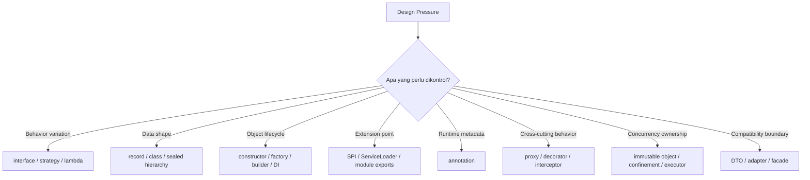
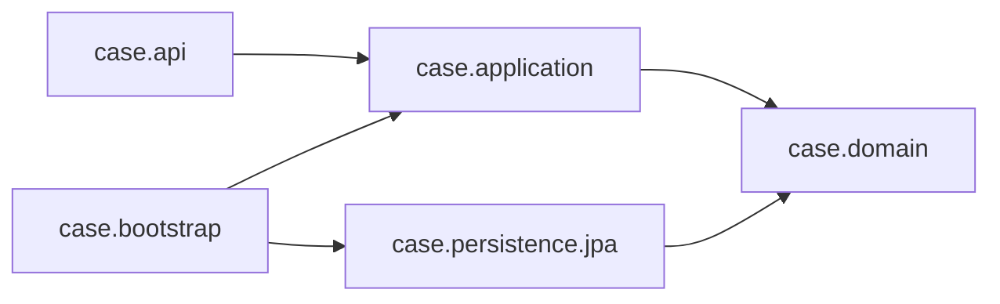
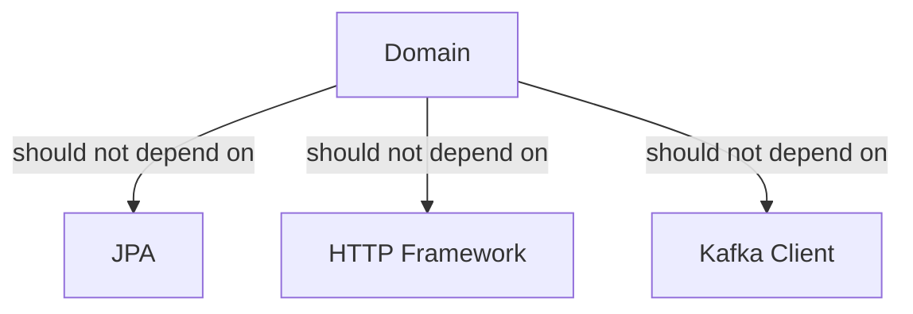
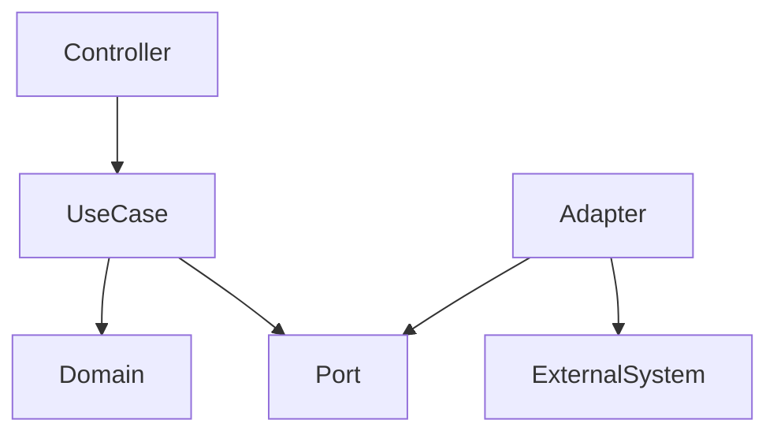

------
title: Learn Java Patterns - Part 003
description: Fondasi Java modern yang menjadi bahan baku pattern engineering: interface, records, sealed types, generics, lambdas, annotations, ServiceLoader, JPMS, dan boundary design.
series: learn-java-patterns
seriesTitle: Learn Java Patterns, Data Patterns, Pipeline Patterns, Concurrency Patterns, Common Patterns, and Anti-Patterns
order: 3
partTitle: Java Pattern Building Blocks
tags:
- java
- patterns
- architecture
- advanced-java
- modern-java
- design-patterns
date: 2026-06-27
---

# Learn Java Patterns - Part 003: Java Pattern Building Blocks

## 1. Tujuan Part Ini

Part ini membahas **bahan baku** yang dipakai untuk membangun pattern di Java modern.

Kita belum masuk Factory, Strategy, Repository, Pipeline, Actor, atau Circuit Breaker secara penuh. Sebelum itu, kita perlu memastikan bahwa kita memakai fitur Java sebagai **alat desain**, bukan sekadar syntax.

Banyak engineer gagal menerapkan pattern bukan karena tidak tahu nama pattern, tetapi karena salah memilih primitive:

- memakai inheritance saat yang dibutuhkan adalah composition;
- memakai class mutable saat domain butuh immutable fact;
- memakai annotation saat kontrak runtime tidak bisa diverifikasi compile-time;
- memakai reflection saat Service Provider Interface lebih eksplisit;
- memakai enum saat state membutuhkan data dan behavior;
- memakai `Map<String, Object>` saat boundary membutuhkan schema;
- memakai generic terlalu rumit sampai API tidak bisa dibaca;
- memakai framework magic untuk menutup desain yang sebenarnya lemah.

Pattern yang baik muncul dari kombinasi tepat antara:

1. **abstraction**,
2. **encapsulation**,
3. **immutability**,
4. **type safety**,
5. **runtime dispatch**,
6. **module boundary**,
7. **controlled extension**, dan
8. **failure visibility**.

Tujuan part ini adalah membentuk mental model untuk memilih primitive Java yang tepat sebelum menerapkan pattern.

---

## 2. Kaufman Lens: Sub-Skill yang Dilatih

Dalam pendekatan Josh Kaufman, kita tidak mempelajari semua fitur Java sebagai ensiklopedia. Kita memilih sub-skill yang langsung menaikkan kemampuan desain.

Untuk part ini, sub-skill yang dilatih adalah:

| Sub-Skill | Target Praktis |
|---|---|
| Interface design | Mampu membuat kontrak yang stabil, kecil, dan tidak bocor implementasi |
| Composition design | Mampu mengganti inheritance dengan object collaboration |
| Data carrier design | Mampu memilih antara class, record, enum, sealed hierarchy |
| Extension control | Mampu menentukan mana yang boleh di-extend dan mana yang harus ditutup |
| Generic API design | Mampu membuat API reusable tanpa membuat type system menjadi beban |
| Functional boundary | Mampu memakai lambda sebagai policy, callback, mapper, atau deferred behavior |
| Annotation use | Mampu membedakan metadata sehat vs framework magic yang berbahaya |
| SPI design | Mampu membuat sistem extensible tanpa compile-time dependency ke semua implementation |
| Module boundary | Mampu menyatakan dependency dan encapsulation di level package/module |

Kita akan memakai prinsip:

> Jangan pakai fitur karena modern. Pakai fitur karena memperjelas invariant desain.

---

## 3. Mental Model: Java Feature sebagai Design Primitive

Fitur Java dapat dipetakan ke jenis keputusan desain.



Setiap kali kita ingin menerapkan pattern, tanyakan:

1. Apakah variasinya berada pada **behavior** atau **data**?
2. Apakah variasi harus diketahui saat compile-time atau runtime?
3. Apakah caller boleh tahu implementation?
4. Apakah object boleh berubah setelah dibuat?
5. Apakah extension harus bebas atau dibatasi?
6. Apakah dependency direction sudah benar?
7. Apakah kegagalan akan terlihat atau tersembunyi?

Jawaban dari pertanyaan ini menentukan primitive Java yang tepat.

---

## 4. Interface sebagai Contract, Bukan Tempat Menumpuk Method

### 4.1 Masalah yang Diselesaikan

Interface menyelesaikan masalah:

> Caller perlu bergantung pada kemampuan, bukan implementasi konkret.

Contoh buruk:

```java
public class CaseService {
    private final PostgresCaseRepository repository;

    public CaseService(PostgresCaseRepository repository) {
        this.repository = repository;
    }
}
```

Kode ini mengikat domain service ke detail persistence.

Versi lebih baik:

```java
public interface CaseRepository {
    Optional<CaseRecord> findById(CaseId id);
    void save(CaseRecord record);
}

public final class CaseService {
    private final CaseRepository repository;

    public CaseService(CaseRepository repository) {
        this.repository = Objects.requireNonNull(repository);
    }
}
```

Sekarang `CaseService` bergantung pada kontrak.

Namun interface bukan otomatis baik. Interface yang salah justru menjadi sumber coupling.

---

### 4.2 Interface yang Baik Itu Kecil dan Berbasis Peran

Interface buruk biasanya berbasis objek besar:

```java
public interface CaseManager {
    CaseRecord create(CreateCaseCommand command);
    void assign(CaseId id, OfficerId officerId);
    void escalate(CaseId id, EscalationReason reason);
    void close(CaseId id, CloseReason reason);
    List<CaseRecord> search(CaseSearchCriteria criteria);
    byte[] exportReport(CaseId id);
    void sendNotification(CaseId id);
}
```

Masalahnya:

- caller yang hanya butuh assign tetap melihat semua operasi;
- testing menjadi berat;
- implementasi cenderung menjadi god service;
- boundary tidak menjelaskan capability;
- perubahan satu method memengaruhi banyak caller.

Lebih baik pecah berdasarkan peran:

```java
public interface CaseCreator {
    CaseRecord create(CreateCaseCommand command);
}

public interface CaseAssigner {
    void assign(CaseId id, OfficerId officerId);
}

public interface CaseEscalator {
    void escalate(CaseId id, EscalationReason reason);
}

public interface CaseCloser {
    void close(CaseId id, CloseReason reason);
}
```

Prinsipnya:

> Interface harus mewakili role yang dibutuhkan caller, bukan semua kemampuan object.

---

### 4.3 Interface sebagai Anti-Corruption Boundary

Interface juga bisa menjadi boundary untuk melindungi domain dari dunia luar.

Misalnya sistem kita memanggil external sanction screening API.

Jangan biarkan domain mengenal payload vendor:

```java
public final class SanctionService {
    private final VendorScreeningClient client;

    public ScreeningDecision screen(Person person) {
        VendorRequest request = new VendorRequest(...);
        VendorResponse response = client.call(request);
        return convert(response);
    }
}
```

Lebih baik domain melihat port:

```java
public interface SanctionScreeningPort {
    ScreeningDecision screen(ScreeningSubject subject);
}
```

Adapter vendor berada di luar:

```java
public final class AcmeSanctionScreeningAdapter implements SanctionScreeningPort {
    private final AcmeScreeningClient client;

    @Override
    public ScreeningDecision screen(ScreeningSubject subject) {
        AcmeRequest request = AcmeMapper.toRequest(subject);
        AcmeResponse response = client.screen(request);
        return AcmeMapper.toDecision(response);
    }
}
```

Interface di sini bukan dekorasi OOP. Ia adalah firewall semantik.

---

### 4.4 Default Method: Hati-Hati dengan Evolution Shortcut

Default method berguna untuk evolusi interface:

```java
public interface CaseRepository {
    Optional<CaseRecord> findById(CaseId id);

    default CaseRecord getRequired(CaseId id) {
        return findById(id).orElseThrow(() -> new CaseNotFoundException(id));
    }
}
```

Ini valid jika default method adalah convenience behavior yang sepenuhnya bergantung pada method kontrak.

Berbahaya jika default method menjadi tempat business logic besar:

```java
public interface CaseRepository {
    Optional<CaseRecord> findById(CaseId id);
    void save(CaseRecord record);

    default void escalate(CaseId id, EscalationReason reason) {
        CaseRecord record = findById(id).orElseThrow();
        // complex business rules here
        save(record.escalate(reason));
    }
}
```

Masalah:

- repository berubah menjadi domain service;
- transaction boundary tidak jelas;
- implementasi persistence membawa business behavior;
- testing menjadi membingungkan.

Rule of thumb:

> Default method boleh menambah convenience, tetapi jangan mengambil alih ownership layer lain.

---

## 5. Abstract Class: Template atau Coupling Trap?

Abstract class sering dipakai untuk reuse, tetapi reuse via inheritance adalah trade-off mahal.

Abstract class cocok ketika:

- ada skeleton algorithm yang stabil;
- subclass hanya mengisi step tertentu;
- state protected benar-benar bagian dari invariant bersama;
- jumlah subclass terkendali;
- kita memang ingin inheritance hierarchy.

Contoh sehat: template method untuk import pipeline kecil.

```java
public abstract class AbstractFileImporter<T> {

    public final ImportResult importFile(Path path) {
        List<String> lines = readLines(path);
        List<T> records = parse(lines);
        ValidationReport report = validate(records);

        if (report.hasErrors()) {
            return ImportResult.rejected(report);
        }

        persist(records);
        return ImportResult.accepted(records.size());
    }

    protected abstract List<T> parse(List<String> lines);

    protected abstract ValidationReport validate(List<T> records);

    protected abstract void persist(List<T> records);

    private List<String> readLines(Path path) {
        try {
            return Files.readAllLines(path);
        } catch (IOException e) {
            throw new ImportFailureException(path, e);
        }
    }
}
```

Namun abstract class buruk jika hanya untuk berbagi utilitas:

```java
public abstract class BaseService {
    protected void logAudit(String action) { ... }
    protected void validateTenant() { ... }
    protected String normalize(String value) { ... }
    protected Clock clock() { ... }
}
```

Ini biasanya berubah menjadi hidden dependency container.

Alternatif lebih baik:

```java
public final class AuditRecorder { ... }
public final class TenantGuard { ... }
public final class TextNormalizer { ... }
```

Lalu inject sesuai kebutuhan.

```java
public final class CaseAssignmentService {
    private final TenantGuard tenantGuard;
    private final AuditRecorder auditRecorder;

    public CaseAssignmentService(TenantGuard tenantGuard, AuditRecorder auditRecorder) {
        this.tenantGuard = tenantGuard;
        this.auditRecorder = auditRecorder;
    }
}
```

Prinsip:

> Pakai abstract class untuk skeleton algorithm yang benar-benar stabil. Pakai composition untuk dependency dan reusable capability.

---

## 6. Composition: Primitive Paling Penting dalam Pattern Engineering

Sebagian besar pattern modern adalah variasi composition.

- Strategy: object memakai policy object.
- Decorator: object membungkus object lain.
- Adapter: object menerjemahkan kontrak lain.
- Facade: object menyederhanakan subsystem.
- Pipeline: stage disusun menjadi flow.
- Repository: service memakai persistence abstraction.
- Circuit breaker: client dibungkus resilience object.
- Observer: publisher menyimpan subscriber.

Composition membuat behavior bisa dirakit tanpa subclass explosion.

### 6.1 Contoh: Policy Composition

```java
public interface EscalationPolicy {
    EscalationDecision evaluate(CaseSnapshot snapshot);
}
```

Implementasi policy:

```java
public final class SeverityEscalationPolicy implements EscalationPolicy {
    @Override
    public EscalationDecision evaluate(CaseSnapshot snapshot) {
        if (snapshot.severity() == Severity.CRITICAL) {
            return EscalationDecision.required("Critical severity");
        }
        return EscalationDecision.notRequired();
    }
}

public final class AgeEscalationPolicy implements EscalationPolicy {
    private final Duration maxAge;
    private final Clock clock;

    public AgeEscalationPolicy(Duration maxAge, Clock clock) {
        this.maxAge = Objects.requireNonNull(maxAge);
        this.clock = Objects.requireNonNull(clock);
    }

    @Override
    public EscalationDecision evaluate(CaseSnapshot snapshot) {
        Duration age = Duration.between(snapshot.createdAt(), clock.instant());
        if (age.compareTo(maxAge) > 0) {
            return EscalationDecision.required("Case age exceeded " + maxAge);
        }
        return EscalationDecision.notRequired();
    }
}
```

Composite policy:

```java
public final class AnyMatchEscalationPolicy implements EscalationPolicy {
    private final List<EscalationPolicy> policies;

    public AnyMatchEscalationPolicy(List<EscalationPolicy> policies) {
        this.policies = List.copyOf(policies);
    }

    @Override
    public EscalationDecision evaluate(CaseSnapshot snapshot) {
        return policies.stream()
                .map(policy -> policy.evaluate(snapshot))
                .filter(EscalationDecision::required)
                .findFirst()
                .orElseGet(EscalationDecision::notRequired);
    }
}
```

Composition ini lebih fleksibel daripada inheritance seperti:

```java
CriticalSeverityAndOldCaseEscalationPolicy
CriticalSeverityOrOldCaseEscalationPolicy
CriticalSeverityAndHighRiskAndOldCaseEscalationPolicy
```

Inheritance menciptakan class explosion. Composition menciptakan assembly.

---

## 7. Records: Value Carrier dengan Invariant Ringan

Record cocok untuk immutable data carrier.

```java
public record CaseId(String value) {
    public CaseId {
        if (value == null || value.isBlank()) {
            throw new IllegalArgumentException("CaseId must not be blank");
        }
    }
}
```

Record memberi:

- constructor utama;
- accessor;
- `equals`;
- `hashCode`;
- `toString`;
- final field;
- intent bahwa object adalah data aggregate sederhana.

### 7.1 Kapan Record Cocok

Record cocok untuk:

- value object;
- command;
- query;
- event;
- DTO immutable;
- snapshot;
- key;
- configuration data;
- intermediate pipeline item.

Contoh command:

```java
public record AssignCaseCommand(
        CaseId caseId,
        OfficerId officerId,
        UserId requestedBy,
        Instant requestedAt
) {
    public AssignCaseCommand {
        Objects.requireNonNull(caseId);
        Objects.requireNonNull(officerId);
        Objects.requireNonNull(requestedBy);
        Objects.requireNonNull(requestedAt);
    }
}
```

Contoh event:

```java
public record CaseAssignedEvent(
        EventId eventId,
        CaseId caseId,
        OfficerId officerId,
        UserId assignedBy,
        Instant occurredAt
) implements DomainEvent {
    public CaseAssignedEvent {
        Objects.requireNonNull(eventId);
        Objects.requireNonNull(caseId);
        Objects.requireNonNull(officerId);
        Objects.requireNonNull(assignedBy);
        Objects.requireNonNull(occurredAt);
    }
}
```

---

### 7.2 Kapan Record Tidak Cocok

Record tidak cocok jika object:

- punya identity mutable yang panjang;
- punya lifecycle kompleks;
- membutuhkan lazy mutation internal yang signifikan;
- harus mengontrol equality bukan berdasarkan semua field;
- harus menyembunyikan representasi internal secara kuat;
- memiliki banyak invariant lintas operasi.

Contoh buruk:

```java
public record CaseAggregate(
        CaseId id,
        CaseStatus status,
        OfficerId assignedOfficer,
        List<CaseNote> notes,
        List<DomainEvent> pendingEvents
) {
    public CaseAggregate assignTo(OfficerId officerId) {
        pendingEvents.add(new CaseAssignedEvent(...)); // broken: mutable list hidden inside record
        return new CaseAggregate(id, CaseStatus.ASSIGNED, officerId, notes, pendingEvents);
    }
}
```

Record terlihat immutable, tetapi field `List` masih bisa mutable jika tidak disalin.

Versi lebih aman:

```java
public record CaseSnapshot(
        CaseId id,
        CaseStatus status,
        Optional<OfficerId> assignedOfficer,
        List<CaseNote> notes
) {
    public CaseSnapshot {
        Objects.requireNonNull(id);
        Objects.requireNonNull(status);
        Objects.requireNonNull(assignedOfficer);
        notes = List.copyOf(notes);
    }
}
```

Untuk aggregate dengan behavior lifecycle, class biasa sering lebih jelas.

```java
public final class CaseAggregate {
    private final CaseId id;
    private CaseStatus status;
    private OfficerId assignedOfficer;
    private final List<DomainEvent> pendingEvents = new ArrayList<>();

    public void assignTo(OfficerId officerId, UserId actor, Instant now) {
        if (status == CaseStatus.CLOSED) {
            throw new InvalidCaseTransitionException(id, status, CaseStatus.ASSIGNED);
        }
        this.assignedOfficer = Objects.requireNonNull(officerId);
        this.status = CaseStatus.ASSIGNED;
        this.pendingEvents.add(new CaseAssignedEvent(EventId.newId(), id, officerId, actor, now));
    }
}
```

Rule:

> Record bagus untuk membawa data valid. Class lebih baik untuk menjaga lifecycle kompleks.

---

## 8. Sealed Types: Menutup Hierarchy agar Reasoning Selesai

Sealed class/interface membatasi siapa yang boleh mengimplementasi atau mewarisi.

Ini sangat berguna saat domain memiliki varian terbatas.

Contoh result:

```java
public sealed interface ScreeningResult
        permits ScreeningResult.Clear,
                ScreeningResult.PotentialMatch,
                ScreeningResult.ServiceUnavailable {

    record Clear(String referenceId) implements ScreeningResult {}

    record PotentialMatch(String referenceId, RiskScore score) implements ScreeningResult {}

    record ServiceUnavailable(String provider, String reason) implements ScreeningResult {}
}
```

Dengan sealed hierarchy, caller bisa memproses semua varian secara eksplisit.

```java
public ScreeningDecision decide(ScreeningResult result) {
    return switch (result) {
        case ScreeningResult.Clear clear -> ScreeningDecision.approve(clear.referenceId());
        case ScreeningResult.PotentialMatch match -> ScreeningDecision.review(match.score());
        case ScreeningResult.ServiceUnavailable unavailable -> ScreeningDecision.defer(unavailable.reason());
    };
}
```

### 8.1 Masalah yang Diselesaikan

Tanpa sealed type, hierarchy terbuka:

```java
public interface ScreeningResult {}
```

Siapa pun bisa membuat implementation baru. Akibatnya:

- exhaustive reasoning sulit;
- switch/dispatch tidak tahu semua kemungkinan;
- invariants domain bisa bocor;
- plugin liar bisa muncul tanpa review;
- testing tidak mencakup semua subtype.

Sealed type membuat extension menjadi keputusan sadar.

---

### 8.2 Sealed Type untuk Error Modeling

Java sering memakai exception untuk error. Tetapi tidak semua error harus exception.

Untuk expected outcome, sealed result lebih eksplisit.

```java
public sealed interface AssignmentResult
        permits AssignmentResult.Assigned,
                AssignmentResult.CaseClosed,
                AssignmentResult.OfficerUnavailable,
                AssignmentResult.PermissionDenied {

    record Assigned(CaseId caseId, OfficerId officerId) implements AssignmentResult {}
    record CaseClosed(CaseId caseId) implements AssignmentResult {}
    record OfficerUnavailable(OfficerId officerId) implements AssignmentResult {}
    record PermissionDenied(UserId userId, String reason) implements AssignmentResult {}
}
```

Pemakaian:

```java
AssignmentResult result = service.assign(command);

String message = switch (result) {
    case AssignmentResult.Assigned assigned -> "Assigned to " + assigned.officerId();
    case AssignmentResult.CaseClosed closed -> "Case already closed";
    case AssignmentResult.OfficerUnavailable unavailable -> "Officer unavailable";
    case AssignmentResult.PermissionDenied denied -> "Permission denied: " + denied.reason();
};
```

Ini lebih jujur daripada:

```java
try {
    service.assign(command);
} catch (Exception e) {
    // guess expected vs unexpected failure
}
```

Rule:

> Pakai sealed result untuk outcome bisnis yang expected. Pakai exception untuk failure yang melanggar asumsi operasi normal atau infrastruktur.

---

## 9. Enum: Finite Constant, Bukan Always State Machine

Enum cocok untuk finite set sederhana.

```java
public enum CaseStatus {
    DRAFT,
    SUBMITTED,
    ASSIGNED,
    UNDER_REVIEW,
    ESCALATED,
    CLOSED
}
```

Tetapi enum sering dipakai terlalu jauh.

### 9.1 Enum dengan Behavior

Kadang enum behavior berguna:

```java
public enum CasePriority {
    LOW(Duration.ofDays(10)),
    MEDIUM(Duration.ofDays(5)),
    HIGH(Duration.ofDays(2)),
    CRITICAL(Duration.ofHours(4));

    private final Duration responseSla;

    CasePriority(Duration responseSla) {
        this.responseSla = responseSla;
    }

    public Duration responseSla() {
        return responseSla;
    }
}
```

Ini sehat karena behavior melekat pada constant.

### 9.2 Enum sebagai State Machine Besar

Ini mulai berbahaya:

```java
public enum CaseStatus {
    DRAFT {
        @Override boolean canAssign() { return false; }
        @Override boolean canClose() { return false; }
    },
    ASSIGNED {
        @Override boolean canAssign() { return true; }
        @Override boolean canClose() { return true; }
    };

    abstract boolean canAssign();
    abstract boolean canClose();
}
```

Untuk state machine sederhana, masih bisa. Namun ketika transition butuh actor, timestamp, reason, audit, policy, dan side effect, enum menjadi sempit.

Lebih baik pindah ke state transition policy atau workflow engine internal.

```java
public interface CaseTransitionPolicy {
    boolean allows(CaseStatus from, CaseStatus to, TransitionContext context);
}
```

Rule:

> Enum bagus untuk vocabulary. Jangan jadikan enum sebagai tempat menumpuk orchestration.

---

## 10. Generics: Type Safety tanpa Membebani Caller

Generics memungkinkan reusable abstraction.

Contoh generic repository:

```java
public interface Repository<ID, T> {
    Optional<T> findById(ID id);
    void save(T entity);
}
```

Namun generic berlebihan membuat API sulit dipakai.

Contoh buruk:

```java
public interface Handler<
        C extends Command<R, E>,
        R extends Result<E>,
        E extends ErrorCode,
        CTX extends ExecutionContext<C, R, E>> {

    R handle(C command, CTX context);
}
```

Ini mungkin type-safe, tetapi cognitive load tinggi.

### 10.1 Generic yang Baik Memindahkan Error ke Compile-Time

Contoh event handler:

```java
public interface EventHandler<E extends DomainEvent> {
    Class<E> eventType();
    void handle(E event);
}
```

Registry:

```java
public final class EventHandlerRegistry {
    private final Map<Class<? extends DomainEvent>, List<EventHandler<? extends DomainEvent>>> handlers;

    public EventHandlerRegistry(List<EventHandler<? extends DomainEvent>> handlers) {
        this.handlers = handlers.stream()
                .collect(Collectors.groupingBy(EventHandler::eventType));
    }

    public <E extends DomainEvent> void publish(E event) {
        List<EventHandler<? extends DomainEvent>> matched = handlers.getOrDefault(event.getClass(), List.of());
        for (EventHandler<? extends DomainEvent> handler : matched) {
            invoke(handler, event);
        }
    }

    @SuppressWarnings("unchecked")
    private <E extends DomainEvent> void invoke(EventHandler<? extends DomainEvent> handler, E event) {
        ((EventHandler<E>) handler).handle(event);
    }
}
```

Komprominya jelas:

- public API cukup type-safe;
- unchecked cast dilokalisasi di registry;
- caller tidak melihat kompleksitas generic;
- risiko runtime dikurung di satu tempat.

Prinsip:

> Generic complexity boleh ada di dalam infrastructure, tetapi jangan bocor ke semua caller.

---

### 10.2 Bounded Generic untuk Pipeline

```java
public interface PipelineStage<I, O> {
    O process(I input);
}
```

Composition:

```java
public final class Pipeline<I, O> {
    private final Function<I, O> function;

    private Pipeline(Function<I, O> function) {
        this.function = function;
    }

    public static <T> Pipeline<T, T> start() {
        return new Pipeline<>(Function.identity());
    }

    public <NO> Pipeline<I, NO> then(PipelineStage<O, NO> stage) {
        Objects.requireNonNull(stage);
        return new Pipeline<>(input -> stage.process(function.apply(input)));
    }

    public O execute(I input) {
        return function.apply(input);
    }
}
```

Pemakaian:

```java
Pipeline<RawCaseImportRow, ValidatedCaseRecord> pipeline = Pipeline
        .<RawCaseImportRow>start()
        .then(new ParseCaseRowStage())
        .then(new NormalizeCaseStage())
        .then(new ValidateCaseStage());
```

Type system mencegah stage salah urutan.

---

## 11. Lambda dan Functional Interface: Behavior sebagai Data

Lambda memungkinkan behavior diperlakukan seperti nilai.

Ini sangat berguna untuk pattern:

- Strategy;
- Command;
- Callback;
- Predicate;
- Mapper;
- Retry action;
- Transaction boundary;
- Pipeline stage;
- Event filtering.

### 11.1 Lambda untuk Policy Kecil

```java
@FunctionalInterface
public interface CasePredicate {
    boolean test(CaseSnapshot snapshot);
}
```

Pemakaian:

```java
CasePredicate highRisk = snapshot -> snapshot.riskScore().value() >= 80;
CasePredicate stale = snapshot -> snapshot.age().toDays() > 30;
```

Composition:

```java
public final class CasePredicates {
    public static CasePredicate and(CasePredicate left, CasePredicate right) {
        return snapshot -> left.test(snapshot) && right.test(snapshot);
    }

    public static CasePredicate or(CasePredicate left, CasePredicate right) {
        return snapshot -> left.test(snapshot) || right.test(snapshot);
    }
}
```

Namun lambda buruk jika behavior butuh nama, dependency, observability, atau test sendiri.

Buruk:

```java
var decision = cases.stream()
        .filter(c -> c.status() != CLOSED && c.riskScore().value() > 80 &&
                Duration.between(c.createdAt(), clock.instant()).toDays() > 14 &&
                permissionService.canEscalate(actor, c.id()))
        .toList();
```

Lebih baik:

```java
public final class EscalationCandidatePolicy {
    private final Clock clock;
    private final PermissionService permissionService;

    public boolean isCandidate(UserId actor, CaseSnapshot snapshot) {
        return snapshot.status() != CaseStatus.CLOSED
                && snapshot.riskScore().value() > 80
                && Duration.between(snapshot.createdAt(), clock.instant()).toDays() > 14
                && permissionService.canEscalate(actor, snapshot.id());
    }
}
```

Rule:

> Lambda bagus untuk behavior kecil. Beri nama class jika behavior memiliki domain meaning, dependency, atau failure mode.

---

## 12. Optional: Boundary Return, Bukan Field Default

`Optional<T>` cocok sebagai return type untuk kemungkinan absence.

```java
public interface CaseRepository {
    Optional<CaseRecord> findById(CaseId id);
}
```

Namun penggunaan sebagai field sering tidak perlu:

```java
public record CaseSnapshot(
        CaseId id,
        Optional<OfficerId> assignedOfficer
) {}
```

Ini bisa diterima pada DTO internal, tetapi sering lebih jelas dengan domain method:

```java
public final class CaseSnapshot {
    private final OfficerId assignedOfficer;

    public Optional<OfficerId> assignedOfficer() {
        return Optional.ofNullable(assignedOfficer);
    }

    public boolean isAssigned() {
        return assignedOfficer != null;
    }
}
```

Untuk external API, `Optional` di DTO sering mengganggu serialization. Lebih baik eksplisit di contract JSON/OpenAPI.

Rule:

> Optional paling sehat sebagai return type. Jangan jadikan Optional sebagai pengganti modeling absence yang lebih bermakna.

---

## 13. Exceptions: Unexpected Failure vs Business Outcome

Exception sering menjadi control flow tersembunyi.

Gunakan exception untuk:

- invariant violation;
- infrastructure failure;
- impossible state;
- programming error;
- failure yang tidak bisa ditangani lokal secara normal.

Gunakan result type untuk:

- validation error;
- permission denied;
- expected business rejection;
- user-correctable error;
- alternate path yang domain-aware.

### 13.1 Pattern: Domain Exception dengan Context

Buruk:

```java
throw new IllegalStateException("Invalid status");
```

Baik:

```java
public final class InvalidCaseTransitionException extends RuntimeException {
    private final CaseId caseId;
    private final CaseStatus from;
    private final CaseStatus to;

    public InvalidCaseTransitionException(CaseId caseId, CaseStatus from, CaseStatus to) {
        super("Invalid case transition: caseId=%s, from=%s, to=%s".formatted(caseId, from, to));
        this.caseId = caseId;
        this.from = from;
        this.to = to;
    }
}
```

Exception harus membawa informasi untuk diagnosis.

---

## 14. Annotations: Metadata, Bukan Pengganti Design

Annotation berguna untuk metadata:

```java
@Target(ElementType.TYPE)
@Retention(RetentionPolicy.RUNTIME)
public @interface UseCase {
    String value();
}
```

```java
@UseCase("assign-case")
public final class AssignCaseHandler implements CommandHandler<AssignCaseCommand, AssignmentResult> {
    ...
}
```

Annotation juga berguna untuk framework integration:

```java
@RestController
@RequestMapping("/cases")
public final class CaseController {
    ...
}
```

Tetapi annotation bisa menjadi anti-pattern jika business logic disembunyikan dalam reflection magic.

Contoh rawan:

```java
@EscalateWhen(status = "OPEN", olderThanDays = 10, severity = "HIGH")
public final class CaseRecord { ... }
```

Masalah:

- logic sulit diuji tanpa runtime processor;
- rule tidak terlihat sebagai object;
- refactor string rawan;
- debugging tidak langsung;
- order eksekusi sering implisit.

Lebih baik:

```java
public final class HighSeverityStaleCasePolicy implements EscalationPolicy {
    ...
}
```

Rule:

> Annotation bagus untuk metadata dan integration. Untuk domain decision, object policy biasanya lebih jujur.

---

## 15. Reflection: Power Tool yang Harus Dikurung

Reflection memungkinkan inspect dan invoke runtime structure.

Ia berguna untuk:

- framework;
- serialization;
- dependency injection container;
- test utility;
- plugin discovery tertentu;
- mapping generic.

Namun reflection mahal secara reasoning:

- compile-time safety turun;
- IDE refactor bisa gagal;
- runtime error meningkat;
- module access bisa bermasalah;
- security dan observability lebih rumit.

Pattern sehat:

> Jika reflection diperlukan, kurung di infrastructure layer dan expose API type-safe ke domain.

Contoh mapper reflection internal:

```java
public interface RowMapper<T> {
    T map(Row row);
}
```

Domain hanya melihat `RowMapper<T>`. Reflection detail tidak bocor.

---

## 16. Service Provider Interface dan ServiceLoader

SPI berguna saat kita ingin aplikasi bisa diperluas tanpa aplikasi utama tahu semua implementation.

Contoh: export report ke format berbeda.

```java
public interface ReportExporter {
    String format();
    byte[] export(ReportData data);
}
```

Implementation:

```java
public final class PdfReportExporter implements ReportExporter {
    @Override
    public String format() {
        return "pdf";
    }

    @Override
    public byte[] export(ReportData data) {
        return ...;
    }
}
```

Registry:

```java
public final class ReportExporterRegistry {
    private final Map<String, ReportExporter> exporters;

    public ReportExporterRegistry() {
        this.exporters = ServiceLoader.load(ReportExporter.class).stream()
                .map(ServiceLoader.Provider::get)
                .collect(Collectors.toUnmodifiableMap(ReportExporter::format, Function.identity()));
    }

    public ReportExporter get(String format) {
        ReportExporter exporter = exporters.get(format);
        if (exporter == null) {
            throw new UnsupportedReportFormatException(format);
        }
        return exporter;
    }
}
```

With JPMS, provider module can declare:

```java
module report.export.pdf {
    requires report.api;
    provides com.acme.report.ReportExporter
        with com.acme.report.pdf.PdfReportExporter;
}
```

Consumer module:

```java
module report.app {
    requires report.api;
    uses com.acme.report.ReportExporter;
}
```

SPI cocok untuk:

- plugin;
- driver;
- format exporter/importer;
- rule provider;
- integration provider;
- authentication provider;
- storage backend.

SPI tidak cocok jika:

- implementation harus dikonfigurasi per request;
- lifecycle dependency kompleks;
- urutan provider penting tetapi tidak dikontrol;
- provider butuh context besar;
- plugin tidak dipercaya secara security.

Rule:

> SPI adalah extension boundary. Jangan pakai SPI untuk dependency injection biasa.

---

## 17. JPMS: Module Boundary sebagai Architectural Constraint

Java Platform Module System membantu menyatakan dependency antar module.

Tanpa module boundary, package sering menjadi konvensi saja. Semua public class bisa dipakai siapa pun.

Dengan JPMS:

```java
module case.domain {
    exports com.acme.case.domain.api;
    exports com.acme.case.domain.model;
}
```

```java
module case.persistence.jpa {
    requires case.domain;
    requires jakarta.persistence;

    exports com.acme.case.persistence.jpa;
}
```

Aplikasi:

```java
module case.application {
    requires case.domain;
    requires case.persistence.jpa;
}
```

### 17.1 Boundary Rule

Desain yang baik membuat dependency mengarah ke abstraction stabil.



Domain tidak bergantung ke persistence.



JPMS memaksa desain ini lebih eksplisit.

---

## 18. Package Design: Sebelum Module, Benahi Package

Banyak codebase belum memakai JPMS. Namun package design tetap penting.

Package buruk berdasarkan technical layer global:

```text
com.acme.controller
com.acme.service
com.acme.repository
com.acme.model
com.acme.util
```

Masalah:

- fitur domain tersebar;
- coupling horizontal tinggi;
- ownership kabur;
- package tidak menunjukkan business capability.

Lebih baik package by capability:

```text
com.acme.caseassignment
  api
  application
  domain
  infrastructure

com.acme.caseescalation
  api
  application
  domain
  infrastructure
```

Atau untuk bounded context:

```text
com.acme.enforcement.casefile
com.acme.enforcement.assignment
com.acme.enforcement.escalation
com.acme.enforcement.audit
```

Rule:

> Package adalah architecture boundary paling murah. Kalau package kacau, pattern di atasnya akan rapuh.

---

## 19. Immutability: Pattern Stabilitas Paling Murah

Immutable object mengurangi banyak bug:

- race condition;
- accidental mutation;
- aliasing;
- invalid intermediate state;
- cache inconsistency;
- unexpected side effect.

Record membantu, tetapi immutability perlu disiplin.

Buruk:

```java
public record CaseSnapshot(List<CaseNote> notes) {}
```

Caller masih bisa mutate list asal.

Baik:

```java
public record CaseSnapshot(List<CaseNote> notes) {
    public CaseSnapshot {
        notes = List.copyOf(notes);
    }
}
```

Untuk nested mutable object, perlu defensive copy lebih dalam.

Rule:

> Immutable boundary harus menyalin mutable input dan tidak mengekspos mutable internal state.

---

## 20. Builders: Ketika Constructor Mulai Kehilangan Makna

Builder akan dibahas lebih detail di Part 004, tetapi sebagai primitive, builder menyelesaikan object construction dengan banyak optional parameter.

Buruk:

```java
new CaseSearchCriteria(null, null, List.of(), null, true, false, 0, 50);
```

Baik:

```java
CaseSearchCriteria criteria = CaseSearchCriteria.builder()
        .status(CaseStatus.OPEN)
        .assignedTo(officerId)
        .includeEscalated(true)
        .page(0)
        .size(50)
        .build();
```

Tetapi builder juga bisa menutupi object yang terlalu besar.

Jika builder punya 40 field, masalahnya mungkin bukan constructor. Masalahnya mungkin object boundary salah.

---

## 21. Static Factory Method: Nama sebagai Design Signal

Constructor tidak punya nama selain nama class.

Static factory memberi nama intent.

```java
public final class Money {
    private final BigDecimal amount;
    private final Currency currency;

    private Money(BigDecimal amount, Currency currency) {
        this.amount = amount;
        this.currency = currency;
    }

    public static Money of(BigDecimal amount, Currency currency) {
        return new Money(amount, currency);
    }

    public static Money zero(Currency currency) {
        return new Money(BigDecimal.ZERO, currency);
    }
}
```

Nama factory bisa membedakan policy:

```java
public static CaseRecord draft(CaseId id, UserId createdBy, Instant now) { ... }
public static CaseRecord imported(CaseId id, ExternalReference ref, Instant importedAt) { ... }
public static CaseRecord restored(CaseSnapshot snapshot) { ... }
```

Rule:

> Gunakan static factory saat construction memiliki makna domain berbeda atau perlu menjaga invariant.

---

## 22. Naming as Pattern Primitive

Nama adalah bagian dari design. Pattern yang benar dengan nama buruk tetap sulit dipakai.

Bandingkan:

```java
public interface Processor<T> {
    void process(T value);
}
```

Dengan:

```java
public interface CaseAssignmentPolicy {
    AssignmentDecision evaluate(AssignmentRequest request);
}
```

Nama kedua menjawab:

- domain apa;
- keputusan apa;
- input apa;
- output apa.

Guideline:

| Buruk | Lebih Baik |
|---|---|
| `Manager` | `CaseAssignmentCoordinator` |
| `Processor` | `PaymentSettlementHandler` |
| `Helper` | `CaseNumberFormatter` |
| `Util` | `DeadlineCalculator` |
| `Data` | `CaseSnapshot` |
| `Info` | `OfficerAvailability` |
| `Result` | `ScreeningDecision` |

Rule:

> Nama harus mengurangi jumlah dokumentasi yang dibutuhkan untuk memahami object.

---

## 23. Type Alias Tidak Ada di Java: Gunakan Tiny Type

Java tidak punya type alias seperti beberapa bahasa lain. Banyak code memakai `String` untuk semua identifier.

Buruk:

```java
public void assign(String caseId, String officerId, String userId) { ... }
```

Caller bisa tertukar.

Lebih baik:

```java
public record CaseId(String value) {
    public CaseId {
        if (value == null || value.isBlank()) {
            throw new IllegalArgumentException("CaseId must not be blank");
        }
    }
}

public record OfficerId(String value) {}
public record UserId(String value) {}
```

Sekarang compile-time membantu:

```java
assign(caseId, officerId, userId); // jelas
```

Tiny type cocok untuk:

- ID;
- code;
- reference number;
- currency;
- email;
- tenant;
- permission;
- risk score;
- percentage;
- duration policy.

Trade-off:

- lebih banyak type;
- mapping persistence/JSON perlu converter;
- tim harus disiplin.

Untuk sistem regulatori, tiny type sangat berharga karena salah ID atau salah actor bisa menjadi masalah audit.

---

## 24. Time Primitive: Jangan Sebar `Instant.now()`

Time adalah dependency.

Buruk:

```java
public boolean isOverdue(CaseRecord record) {
    return record.dueAt().isBefore(Instant.now());
}
```

Masalah:

- test tidak deterministik;
- timezone boundary kabur;
- replay event sulit;
- audit simulation sulit.

Baik:

```java
public final class DeadlinePolicy {
    private final Clock clock;

    public DeadlinePolicy(Clock clock) {
        this.clock = Objects.requireNonNull(clock);
    }

    public boolean isOverdue(CaseRecord record) {
        return record.dueAt().isBefore(clock.instant());
    }
}
```

Rule:

> Waktu harus diinjeksi sebagai dependency pada domain/policy yang butuh determinisme.

---

## 25. Null Handling: Buat Absence Menjadi Keputusan Desain

Null adalah bagian dari Java, tetapi jangan biarkan null menjadi protokol diam-diam.

Bad:

```java
public OfficerId assignedOfficer() {
    return assignedOfficer; // may be null
}
```

Better:

```java
public Optional<OfficerId> assignedOfficer() {
    return Optional.ofNullable(assignedOfficer);
}
```

Even better if domain has named state:

```java
public boolean isAssigned() {
    return assignedOfficer != null;
}

public OfficerId requireAssignedOfficer() {
    if (assignedOfficer == null) {
        throw new CaseNotAssignedException(id);
    }
    return assignedOfficer;
}
```

Rule:

> Null boleh ada di implementation detail, tetapi public contract harus menjelaskan absence.

---

## 26. Visibility: `public` adalah Commitment

Dalam Java, `public` sering diberikan terlalu mudah.

Setiap public class/method berarti:

- caller boleh menggunakannya;
- refactor lebih mahal;
- backward compatibility harus dipikirkan;
- API surface membesar;
- testing contract bertambah.

Gunakan visibility minimum:

```java
final class CaseNumberParser {
    CaseNumber parse(String raw) { ... }
}
```

Jika hanya dipakai dalam package, jangan public.

Pattern internal sering lebih sehat jika package-private.

```text
caseassignment/
  AssignCaseUseCase.java          public
  AssignmentPolicy.java           package-private
  AssignmentValidator.java        package-private
  AssignmentAuditMapper.java      package-private
```

Rule:

> Public API adalah hutang kompatibilitas. Jangan expose sebelum perlu.

---

## 27. Mutability Boundary: Command vs Aggregate vs Snapshot

Salah satu fondasi desain adalah membedakan jenis object.

| Object Type | Mutability | Identity | Behavior | Contoh |
|---|---:|---:|---:|---|
| Command | immutable | no | minimal validation | `AssignCaseCommand` |
| Query | immutable | no | none/minimal | `CaseSearchQuery` |
| Event | immutable | yes/event id | none/minimal | `CaseAssignedEvent` |
| Value Object | immutable | no | validation + value logic | `Money`, `RiskScore` |
| Entity | mutable lifecycle | yes | domain behavior | `CaseAggregate` |
| Snapshot | immutable | maybe | read model logic | `CaseSnapshot` |
| DTO | usually immutable | no | serialization shape | `CaseResponse` |

Pattern akan kacau jika semua object diperlakukan sama.

Contoh buruk:

```java
public class CaseDto {
    public String id;
    public String status;
    public String assignedOfficer;

    public void assign(String officerId) {
        this.assignedOfficer = officerId;
        this.status = "ASSIGNED";
    }
}
```

DTO berubah menjadi domain entity.

Lebih jelas:

```java
public record CaseResponse(String id, String status, String assignedOfficer) {}
```

Domain behavior berada di aggregate/use case.

---

## 28. Dependency Direction: Primitive untuk Clean Pattern

Pattern yang baik menjaga dependency direction.



Port/interface dimiliki oleh layer yang membutuhkan abstraction, bukan oleh implementation.

Buruk:

```text
infrastructure/
  EmailSender.java       // interface
  SmtpEmailSender.java
application/
  NotificationUseCase.java imports infrastructure.EmailSender
```

Lebih baik:

```text
application/
  NotificationPort.java
  NotificationUseCase.java
infrastructure/
  SmtpNotificationAdapter.java implements NotificationPort
```

Rule:

> Interface harus tinggal dekat dengan policy yang membutuhkannya, bukan otomatis dekat implementasi.

---

## 29. Pattern Building Block Matrix

| Design Need | Java Primitive | Pattern yang Muncul |
|---|---|---|
| Vary behavior | interface, lambda | Strategy, Command, Policy |
| Wrap behavior | composition | Decorator, Proxy, Circuit Breaker |
| Translate boundary | class + interface | Adapter, Anti-Corruption Layer |
| Hide subsystem | class facade | Facade, Gateway |
| Fixed variants | sealed interface + records | Result, State, Domain Event |
| Immutable fact | record | Event, Snapshot, DTO |
| Lifecycle object | final class | Aggregate, Entity |
| Runtime extension | SPI + ServiceLoader | Plugin, Provider |
| Module encapsulation | JPMS | Modular Monolith, Plugin Architecture |
| Cross-cutting metadata | annotation | Framework Integration, Interceptor |
| Ordered transformation | generics + function | Pipeline, Chain |
| Optional absence | Optional/result | Repository, Lookup |
| Deterministic time | Clock | Policy, Testable Workflow |

---

## 30. Common Failure Modes

### 30.1 Interface Everywhere

Gejala:

- setiap class punya interface satu-ke-satu;
- tidak ada multiple implementation;
- tidak ada boundary reason;
- nama interface hanya `IThing` atau `ThingService`.

Dampak:

- codebase membesar;
- navigation sulit;
- abstraction palsu;
- testing tidak otomatis lebih baik.

Perbaikan:

- buat interface hanya saat ada boundary, role, atau variasi behavior;
- biarkan class konkret jika tidak ada abstraction pressure.

---

### 30.2 Record untuk Semua Hal

Gejala:

- aggregate domain dibuat record;
- mutable collection disimpan dalam record;
- invariant kompleks masuk compact constructor panjang;
- behavior lifecycle tersebar di service.

Dampak:

- anemic domain;
- mutation bocor;
- validation tidak konsisten.

Perbaikan:

- pakai record untuk value/data carrier;
- pakai class untuk entity/lifecycle object.

---

### 30.3 Annotation-Driven Business Logic

Gejala:

- business rule ada di annotation string;
- processor runtime sulit ditelusuri;
- test harus boot framework besar;
- error muncul saat runtime.

Perbaikan:

- pindahkan decision logic ke policy object;
- annotation cukup menjadi metadata/integration marker.

---

### 30.4 Generic Gymnastics

Gejala:

- signature generic terlalu panjang;
- caller perlu memahami type parameter internal;
- error compiler sulit dibaca;
- type safety tidak sebanding dengan kompleksitas.

Perbaikan:

- sembunyikan generic kompleks di infrastructure;
- expose API sederhana;
- gunakan named domain type.

---

### 30.5 Public API Leakage

Gejala:

- semua class public;
- internal helper dipakai lintas module;
- refactor kecil memecahkan banyak caller;
- package tidak punya boundary.

Perbaikan:

- package-private by default;
- public hanya untuk contract yang memang stable;
- gunakan module export jika memungkinkan.

---

## 31. Practice Drill

### Drill 1: Tiny Type Conversion

Ambil method ini:

```java
void assign(String caseId, String officerId, String actorId)
```

Ubah menjadi:

```java
void assign(CaseId caseId, OfficerId officerId, UserId actorId)
```

Tambahkan:

- validation di constructor;
- `toString` aman untuk logging;
- unit test untuk invalid value.

Target skill:

- type safety;
- invariant placement;
- readable domain API.

---

### Drill 2: Replace Enum Logic with Policy

Ambil enum status yang memiliki method `canEscalate()`.

Ubah menjadi:

```java
public interface EscalationPolicy {
    EscalationDecision evaluate(CaseSnapshot snapshot, UserId actor);
}
```

Buat minimal 3 policy:

1. status-based policy;
2. age-based policy;
3. permission-based policy.

Gabungkan dengan composite policy.

Target skill:

- composition;
- policy object;
- testable behavior.

---

### Drill 3: Sealed Result

Ganti method ini:

```java
void assign(AssignCaseCommand command) throws Exception
```

Menjadi:

```java
AssignmentResult assign(AssignCaseCommand command)
```

Dengan sealed result:

- `Assigned`;
- `CaseNotFound`;
- `CaseClosed`;
- `OfficerUnavailable`;
- `PermissionDenied`.

Target skill:

- expected outcome modeling;
- exhaustive handling;
- error clarity.

---

### Drill 4: Package Boundary Review

Ambil satu module/service existing.

Tandai class menjadi:

- public API;
- package-private internal;
- infrastructure adapter;
- domain object;
- DTO;
- policy;
- utility.

Lalu tanyakan:

1. Class apa yang seharusnya tidak public?
2. Interface mana yang palsu?
3. DTO mana yang membawa domain behavior?
4. Domain mana yang tahu detail framework?
5. Utility mana yang seharusnya menjadi named service?

---

## 32. Checklist: Memilih Java Building Block

Gunakan checklist ini sebelum membuat class baru.

### 32.1 Data Shape

- Apakah object hanya membawa data immutable?
- Apakah equality berdasarkan semua field?
- Apakah field mutable collection sudah disalin?
- Apakah object memiliki lifecycle?
- Apakah object memiliki identity domain?

Jika data immutable sederhana, pertimbangkan record.
Jika lifecycle kompleks, pertimbangkan final class.

### 32.2 Behavior Variation

- Apakah behavior akan bervariasi?
- Apakah variasi dipilih compile-time atau runtime?
- Apakah caller butuh abstraction?
- Apakah lambda cukup atau perlu named class?

Jika behavior kecil, lambda cukup.
Jika behavior punya domain meaning, buat policy/strategy class.

### 32.3 Extension

- Apakah extension bebas aman?
- Apakah varian harus fixed?
- Apakah plugin runtime diperlukan?
- Apakah provider harus ditemukan otomatis?

Jika fixed, gunakan sealed type.
Jika runtime plugin, gunakan SPI/ServiceLoader.

### 32.4 Boundary

- Apakah object menyeberangi layer?
- Apakah object menyeberangi network?
- Apakah object disimpan ke database?
- Apakah object bagian dari public contract?

Jika boundary external, jangan bocorkan domain entity langsung.

### 32.5 Failure

- Apakah failure expected business outcome?
- Apakah failure infrastructure/unexpected?
- Apakah caller bisa recover?
- Apakah failure perlu audit?

Expected outcome: result/sealed result.
Unexpected failure: exception dengan context.

---

## 33. Baeldung-Style Summary

Dalam Java pattern engineering, fitur bahasa bukan tujuan. Fitur bahasa adalah bahan untuk membuat desain lebih eksplisit.

Poin penting:

- Interface adalah role contract, bukan file wajib untuk setiap class.
- Abstract class cocok untuk skeleton algorithm, bukan shared utility dump.
- Composition adalah fondasi mayoritas pattern modern.
- Record cocok untuk immutable data carrier, value object, command, event, dan snapshot.
- Sealed type cocok untuk varian finite yang perlu exhaustive reasoning.
- Enum cocok untuk vocabulary finite, tetapi jangan dipaksa menjadi workflow engine besar.
- Generic harus meningkatkan type safety tanpa membebani caller.
- Lambda bagus untuk behavior kecil; named class lebih baik untuk behavior domain penting.
- Annotation bagus untuk metadata/integration, bukan pengganti business logic.
- Reflection harus dikurung di infrastructure.
- SPI/ServiceLoader cocok untuk plugin/provider boundary.
- JPMS membantu menjadikan architecture boundary lebih eksplisit.
- Package design adalah modularity paling murah.
- Immutability adalah pattern stabilitas paling murah.
- Public API adalah commitment jangka panjang.

Jika part ini berhasil, saat melihat sebuah pattern kita tidak lagi bertanya:

> Pattern ini class diagram-nya seperti apa?

Tetapi:

> Design pressure apa yang sedang diselesaikan, dan primitive Java mana yang paling tepat untuk menyatakannya?

---

## 34. Referensi

- Oracle Java Documentation: Record Classes  
  https://docs.oracle.com/en/java/javase/17/language/records.html
- Oracle Java Documentation: Sealed Classes and Interfaces  
  https://docs.oracle.com/en/java/javase/17/language/sealed-classes-and-interfaces.html
- Oracle Java API: ServiceLoader  
  https://docs.oracle.com/en/java/javase/11/docs/api/java.base/java/util/ServiceLoader.html
- Oracle Java Tutorial: Creating Extensible Applications with SPI  
  https://docs.oracle.com/javase/tutorial/ext/basics/spi.html
- Oracle Java SE 25 API Index  
  https://docs.oracle.com/en/java/javase/25/docs/api/allclasses-index.html
