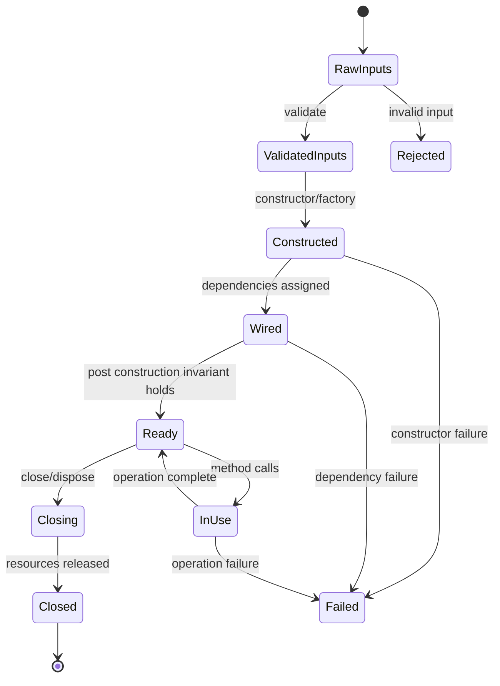
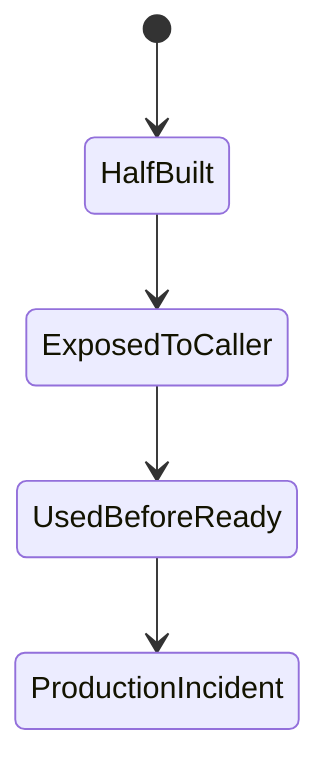
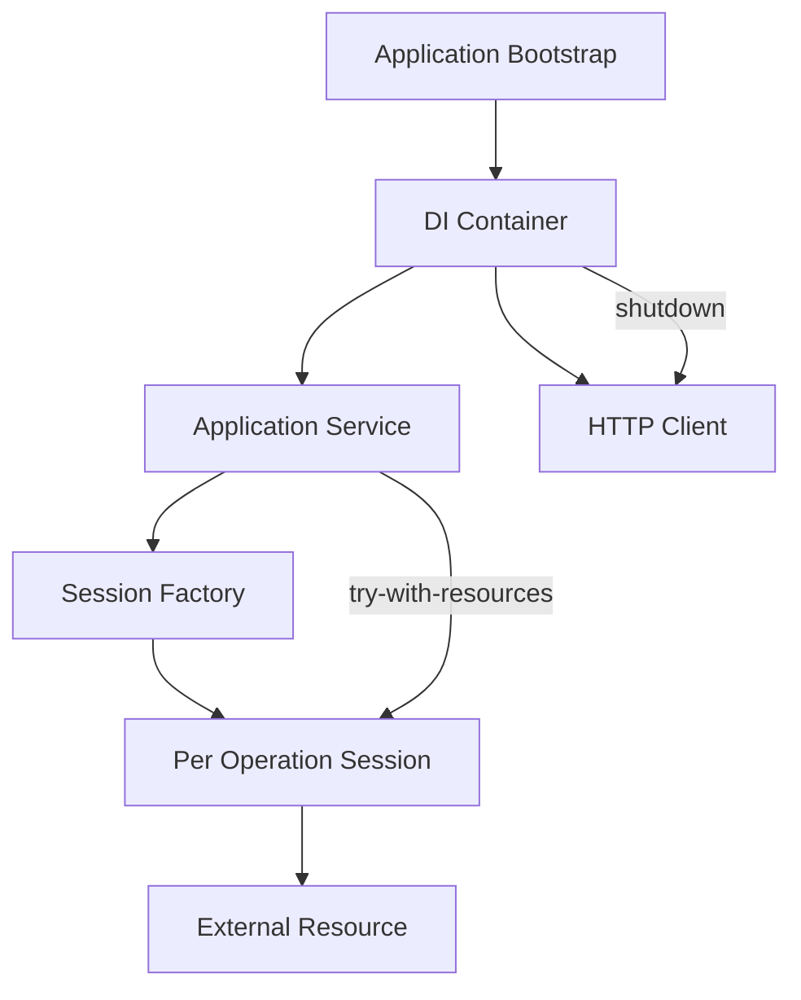

------
title: Learn Java Patterns - Part 004
description: Pattern konstruksi dan lifecycle object di Java: constructor, static factory, builder, factory method, abstract factory, prototype, dependency injection, lifecycle ownership, validation, dan destruction boundary.
series: learn-java-patterns
seriesTitle: Learn Java Patterns, Data Patterns, Pipeline Patterns, Concurrency Patterns, Common Patterns, and Anti-Patterns
order: 4
partTitle: Object Lifecycle and Construction Patterns
tags:
- java
- patterns
- architecture
- advanced-java
- construction-patterns
- lifecycle
date: 2026-06-27
---

# Learn Java Patterns - Part 004: Object Lifecycle and Construction Patterns

## 1. Tujuan Part Ini

Part ini membahas pattern yang mengatur **bagaimana object dibuat, divalidasi, dimiliki, digunakan, dan dihancurkan**.

Banyak bug production tidak berasal dari algoritma kompleks. Banyak bug berasal dari object yang:

- dibuat dalam keadaan tidak valid;
- dependency-nya diam-diam null;
- lifecycle-nya tidak jelas;
- resource-nya tidak ditutup;
- constructor-nya terlalu banyak melakukan pekerjaan;
- builder-nya mengizinkan kombinasi field invalid;
- factory-nya menyembunyikan side effect;
- object framework dibuat tanpa invariant domain;
- singleton menyimpan state global;
- dependency injection dipakai tanpa ownership model.

Construction pattern bukan hanya soal “cara membuat object”. Construction pattern adalah soal:

> Di titik mana invariant mulai berlaku, siapa yang bertanggung jawab atas dependency, dan kapan resource harus dilepaskan?

Kita akan membahas:

1. constructor;
2. static factory method;
3. factory method;
4. abstract factory;
5. builder;
6. step builder;
7. prototype/copy;
8. dependency injection;
9. provider/lazy factory;
10. object pool;
11. singleton;
12. lifecycle ownership;
13. destruction/cleanup pattern;
14. anti-pattern terkait construction.

---

## 2. Kaufman Lens: Sub-Skill yang Dilatih

Dalam framework Kaufman, kita latih sub-skill yang langsung berguna di sistem nyata.

| Sub-Skill | Target Praktis |
|---|---|
| Constructor discipline | Mampu membuat object valid sejak lahir |
| Factory naming | Mampu memberi nama jalur creation yang berbeda secara domain |
| Builder design | Mampu mengelola optional parameter tanpa membuka state invalid |
| Lifecycle ownership | Mampu menentukan siapa membuat, siapa memakai, siapa menutup |
| Dependency injection | Mampu membedakan dependency stabil, runtime parameter, dan ambient context |
| Resource management | Mampu menghindari leak dengan `AutoCloseable` dan scope yang jelas |
| Framework boundary | Mampu menjaga invariant meski object dibuat oleh framework |
| Anti-pattern detection | Mampu mengenali singleton abuse, service locator, telescoping constructor, dan god factory |

Tujuan latihan:

> Setelah part ini, setiap kali membuat object baru, kita bisa menjelaskan invariant, dependency, lifecycle, dan failure mode-nya.

---

## 3. Mental Model: Object Lifecycle sebagai State Machine

Object lifecycle dapat dipahami sebagai state machine.



Pattern construction bertugas memastikan object tidak masuk ke state invalid seperti:



Prinsip utama:

> Jangan pernah membiarkan object yang belum valid terlihat oleh caller.

---

## 4. Constructor: Tempat Invariant Minimal

Constructor adalah boundary pertama.

Constructor sebaiknya menjamin:

- required dependency tidak null;
- required value valid;
- collection disalin jika perlu immutable;
- object siap dipakai setelah constructor selesai;
- tidak ada side effect eksternal besar.

Contoh sehat:

```java
public final class CaseAssignmentService {
    private final CaseRepository caseRepository;
    private final OfficerRepository officerRepository;
    private final AssignmentPolicy assignmentPolicy;
    private final Clock clock;

    public CaseAssignmentService(
            CaseRepository caseRepository,
            OfficerRepository officerRepository,
            AssignmentPolicy assignmentPolicy,
            Clock clock
    ) {
        this.caseRepository = Objects.requireNonNull(caseRepository, "caseRepository");
        this.officerRepository = Objects.requireNonNull(officerRepository, "officerRepository");
        this.assignmentPolicy = Objects.requireNonNull(assignmentPolicy, "assignmentPolicy");
        this.clock = Objects.requireNonNull(clock, "clock");
    }
}
```

Constructor tidak membuka ambiguity.

---

### 4.1 Constructor Jangan Melakukan I/O Berat

Buruk:

```java
public final class CaseRepository {
    private final Connection connection;

    public CaseRepository(String url) {
        this.connection = DriverManager.getConnection(url); // checked exception omitted
        runMigrations();
        warmUpCache();
    }
}
```

Masalah:

- object construction lambat;
- test sulit;
- failure di constructor sulit dikelola;
- resource ownership kabur;
- constructor memiliki side effect eksternal.

Lebih baik pisahkan:

```java
public final class JdbcCaseRepository implements CaseRepository {
    private final DataSource dataSource;

    public JdbcCaseRepository(DataSource dataSource) {
        this.dataSource = Objects.requireNonNull(dataSource);
    }
}
```

Connection diperoleh per operasi atau dari transaction boundary.

```java
@Override
public Optional<CaseRecord> findById(CaseId id) {
    try (Connection connection = dataSource.getConnection()) {
        ...
    }
}
```

Rule:

> Constructor harus membuat object siap pakai, bukan menjalankan workflow eksternal besar.

---

### 4.2 Telescoping Constructor Anti-Pattern

Buruk:

```java
public CaseSearchCriteria(
        CaseStatus status,
        OfficerId assignedTo,
        Instant createdAfter,
        Instant createdBefore,
        boolean includeClosed,
        boolean includeEscalated,
        int page,
        int size
) { ... }
```

Caller:

```java
new CaseSearchCriteria(null, officerId, null, null, false, true, 0, 100);
```

Masalah:

- parameter positional mudah tertukar;
- null punya banyak arti;
- boolean flag tidak self-documenting;
- constructor menjadi tidak readable.

Solusi umum:

- static factory untuk jalur creation tertentu;
- builder untuk banyak optional parameter;
- parameter object yang lebih kecil;
- pecah object jika field terlalu banyak.

---

## 5. Static Factory Method: Construction dengan Nama

Static factory memberi nama pada intent.

```java
public final class CaseRecord {
    private final CaseId id;
    private final CaseStatus status;
    private final UserId createdBy;
    private final Instant createdAt;

    private CaseRecord(CaseId id, CaseStatus status, UserId createdBy, Instant createdAt) {
        this.id = Objects.requireNonNull(id);
        this.status = Objects.requireNonNull(status);
        this.createdBy = Objects.requireNonNull(createdBy);
        this.createdAt = Objects.requireNonNull(createdAt);
    }

    public static CaseRecord draft(CaseId id, UserId createdBy, Instant now) {
        return new CaseRecord(id, CaseStatus.DRAFT, createdBy, now);
    }

    public static CaseRecord imported(CaseId id, UserId importedBy, Instant importedAt) {
        return new CaseRecord(id, CaseStatus.SUBMITTED, importedBy, importedAt);
    }
}
```

Dua jalur creation punya arti berbeda:

- `draft`: dibuat manual dan masih draft;
- `imported`: masuk dari sistem lain dan langsung submitted.

Constructor tidak bisa memberi nama jalur seperti ini.

---

### 5.1 Naming Convention Static Factory

| Nama | Makna Umum | Contoh |
|---|---|---|
| `of` | membuat dari nilai biasa | `Money.of(amount, currency)` |
| `from` | konversi dari representasi lain | `CaseId.from(raw)` |
| `parse` | parsing string/input | `CaseNumber.parse(raw)` |
| `newX` | instance baru dengan identity baru | `EventId.newId()` |
| `empty` | instance kosong valid | `ValidationReport.empty()` |
| `zero` | nilai nol domain | `Money.zero(currency)` |
| `draft` | creation state spesifik | `CaseRecord.draft(...)` |
| `restore` | rehydrate dari persistence | `CaseAggregate.restore(snapshot)` |

Rule:

> Nama factory harus menjelaskan jalur creation dan invariant yang dihasilkan.

---

### 5.2 Static Factory untuk Rehydration

Domain entity sering punya dua jalur creation:

1. membuat object baru dari command;
2. menghidupkan object dari database/event store.

Jangan campur keduanya.

```java
public final class CaseAggregate {
    private final CaseId id;
    private CaseStatus status;
    private Optional<OfficerId> assignedOfficer;
    private final List<DomainEvent> pendingEvents;

    private CaseAggregate(
            CaseId id,
            CaseStatus status,
            Optional<OfficerId> assignedOfficer,
            List<DomainEvent> pendingEvents
    ) {
        this.id = Objects.requireNonNull(id);
        this.status = Objects.requireNonNull(status);
        this.assignedOfficer = Objects.requireNonNull(assignedOfficer);
        this.pendingEvents = new ArrayList<>(pendingEvents);
    }

    public static CaseAggregate openNew(CaseId id, UserId createdBy, Instant now) {
        CaseAggregate aggregate = new CaseAggregate(id, CaseStatus.DRAFT, Optional.empty(), List.of());
        aggregate.pendingEvents.add(new CaseOpenedEvent(EventId.newId(), id, createdBy, now));
        return aggregate;
    }

    public static CaseAggregate restore(CaseSnapshot snapshot) {
        return new CaseAggregate(
                snapshot.id(),
                snapshot.status(),
                snapshot.assignedOfficer(),
                List.of()
        );
    }
}
```

`openNew` menghasilkan domain event. `restore` tidak.

Ini sangat penting. Jika rehydration dari database menghasilkan event baru, sistem akan mengirim event palsu.

Rule:

> Creation baru dan restoration lama adalah jalur lifecycle berbeda. Beri factory berbeda.

---

## 6. Factory Method Pattern

Factory Method memindahkan keputusan subclass/implementation ke method yang bisa dioverride atau dipilih oleh creator.

Versi klasik memakai inheritance. Dalam Java modern, sering lebih baik memakai composition, tetapi factory method masih relevan.

Contoh sederhana:

```java
public abstract class CaseReportJob {

    public final ReportResult run(CaseId caseId) {
        ReportData data = loadData(caseId);
        ReportRenderer renderer = createRenderer();
        byte[] bytes = renderer.render(data);
        return store(bytes);
    }

    protected abstract ReportRenderer createRenderer();

    private ReportData loadData(CaseId caseId) { ... }

    private ReportResult store(byte[] bytes) { ... }
}
```

Subclass:

```java
public final class PdfCaseReportJob extends CaseReportJob {
    @Override
    protected ReportRenderer createRenderer() {
        return new PdfReportRenderer();
    }
}
```

Masalahnya: inheritance mengikat extension ke class hierarchy.

Versi composition:

```java
public final class CaseReportJob {
    private final ReportRendererFactory rendererFactory;

    public CaseReportJob(ReportRendererFactory rendererFactory) {
        this.rendererFactory = Objects.requireNonNull(rendererFactory);
    }

    public ReportResult run(CaseId caseId, ReportFormat format) {
        ReportData data = loadData(caseId);
        ReportRenderer renderer = rendererFactory.create(format);
        byte[] bytes = renderer.render(data);
        return store(bytes);
    }
}
```

Factory interface:

```java
public interface ReportRendererFactory {
    ReportRenderer create(ReportFormat format);
}
```

Rule:

> Pakai factory method inheritance jika skeleton algorithm dan subclass model stabil. Jika variasi runtime lebih penting, gunakan composition factory.

---

## 7. Abstract Factory: Keluarga Object yang Harus Konsisten

Abstract Factory membuat keluarga object terkait.

Masalah:

> Kita perlu membuat beberapa object yang harus berasal dari varian yang sama.

Contoh: multi-channel notification.

```java
public interface NotificationProviderFactory {
    NotificationSender sender();
    NotificationTemplateRenderer templateRenderer();
    NotificationDeliveryTracker deliveryTracker();
}
```

Email provider:

```java
public final class EmailNotificationProviderFactory implements NotificationProviderFactory {
    @Override
    public NotificationSender sender() {
        return new EmailSender();
    }

    @Override
    public NotificationTemplateRenderer templateRenderer() {
        return new EmailTemplateRenderer();
    }

    @Override
    public NotificationDeliveryTracker deliveryTracker() {
        return new EmailDeliveryTracker();
    }
}
```

SMS provider:

```java
public final class SmsNotificationProviderFactory implements NotificationProviderFactory {
    @Override
    public NotificationSender sender() {
        return new SmsSender();
    }

    @Override
    public NotificationTemplateRenderer templateRenderer() {
        return new SmsTemplateRenderer();
    }

    @Override
    public NotificationDeliveryTracker deliveryTracker() {
        return new SmsDeliveryTracker();
    }
}
```

Pemakaian:

```java
public final class NotificationWorkflow {
    private final NotificationProviderFactory factory;

    public NotificationWorkflow(NotificationProviderFactory factory) {
        this.factory = Objects.requireNonNull(factory);
    }

    public void send(NotificationRequest request) {
        String body = factory.templateRenderer().render(request.template(), request.model());
        DeliveryReceipt receipt = factory.sender().send(request.recipient(), body);
        factory.deliveryTracker().track(receipt);
    }
}
```

Abstract Factory mencegah kombinasi invalid seperti:

- SMS sender + email template renderer;
- email tracker + push notification sender.

Rule:

> Abstract Factory cocok saat beberapa product harus konsisten sebagai satu family.

---

## 8. Builder Pattern

Builder menyelesaikan construction object dengan banyak optional parameter atau kombinasi konfigurasi.

Contoh:

```java
public final class CaseSearchCriteria {
    private final Optional<CaseStatus> status;
    private final Optional<OfficerId> assignedTo;
    private final Optional<Instant> createdAfter;
    private final Optional<Instant> createdBefore;
    private final boolean includeClosed;
    private final boolean includeEscalated;
    private final PageRequest pageRequest;

    private CaseSearchCriteria(Builder builder) {
        this.status = Optional.ofNullable(builder.status);
        this.assignedTo = Optional.ofNullable(builder.assignedTo);
        this.createdAfter = Optional.ofNullable(builder.createdAfter);
        this.createdBefore = Optional.ofNullable(builder.createdBefore);
        this.includeClosed = builder.includeClosed;
        this.includeEscalated = builder.includeEscalated;
        this.pageRequest = new PageRequest(builder.page, builder.size);
        validate();
    }

    public static Builder builder() {
        return new Builder();
    }

    private void validate() {
        if (createdAfter.isPresent() && createdBefore.isPresent()
                && createdAfter.get().isAfter(createdBefore.get())) {
            throw new IllegalArgumentException("createdAfter must not be after createdBefore");
        }
    }

    public static final class Builder {
        private CaseStatus status;
        private OfficerId assignedTo;
        private Instant createdAfter;
        private Instant createdBefore;
        private boolean includeClosed;
        private boolean includeEscalated;
        private int page = 0;
        private int size = 50;

        public Builder status(CaseStatus status) {
            this.status = status;
            return this;
        }

        public Builder assignedTo(OfficerId assignedTo) {
            this.assignedTo = assignedTo;
            return this;
        }

        public Builder createdAfter(Instant createdAfter) {
            this.createdAfter = createdAfter;
            return this;
        }

        public Builder createdBefore(Instant createdBefore) {
            this.createdBefore = createdBefore;
            return this;
        }

        public Builder includeClosed(boolean includeClosed) {
            this.includeClosed = includeClosed;
            return this;
        }

        public Builder includeEscalated(boolean includeEscalated) {
            this.includeEscalated = includeEscalated;
            return this;
        }

        public Builder page(int page) {
            this.page = page;
            return this;
        }

        public Builder size(int size) {
            this.size = size;
            return this;
        }

        public CaseSearchCriteria build() {
            return new CaseSearchCriteria(this);
        }
    }
}
```

Pemakaian:

```java
CaseSearchCriteria criteria = CaseSearchCriteria.builder()
        .status(CaseStatus.SUBMITTED)
        .assignedTo(officerId)
        .includeEscalated(true)
        .size(100)
        .build();
```

### 8.1 Builder Strengths

Builder bagus karena:

- call site readable;
- optional field tidak perlu constructor panjang;
- default value bisa dikelola;
- validation bisa ditempatkan di `build()`;
- object final bisa tetap immutable.

### 8.2 Builder Risks

Builder buruk jika:

- semua field optional padahal sebagian required;
- `build()` tidak validasi;
- builder reuse menyebabkan state bocor;
- object terlalu besar;
- builder menjadi mini service dengan dependency dan I/O.

Buruk:

```java
CaseRecord record = CaseRecord.builder()
        .status(CaseStatus.CLOSED)
        .build(); // missing id, createdBy, createdAt, close reason
```

Builder seperti ini membiarkan invalid state sampai runtime jauh.

---

## 9. Step Builder: Compile-Time Required Field

Step Builder memaksa urutan required field.

```java
public final class CaseCreationCommand {
    private final CaseId caseId;
    private final UserId createdBy;
    private final CasePriority priority;
    private final String description;

    private CaseCreationCommand(
            CaseId caseId,
            UserId createdBy,
            CasePriority priority,
            String description
    ) {
        this.caseId = caseId;
        this.createdBy = createdBy;
        this.priority = priority;
        this.description = description;
    }

    public static CaseIdStep builder() {
        return caseId -> createdBy -> new OptionalStep(caseId, createdBy);
    }

    public interface CaseIdStep {
        CreatedByStep caseId(CaseId caseId);
    }

    public interface CreatedByStep {
        OptionalStep createdBy(UserId createdBy);
    }

    public static final class OptionalStep {
        private final CaseId caseId;
        private final UserId createdBy;
        private CasePriority priority = CasePriority.MEDIUM;
        private String description = "";

        private OptionalStep(CaseId caseId, UserId createdBy) {
            this.caseId = Objects.requireNonNull(caseId);
            this.createdBy = Objects.requireNonNull(createdBy);
        }

        public OptionalStep priority(CasePriority priority) {
            this.priority = Objects.requireNonNull(priority);
            return this;
        }

        public OptionalStep description(String description) {
            this.description = Objects.requireNonNull(description);
            return this;
        }

        public CaseCreationCommand build() {
            return new CaseCreationCommand(caseId, createdBy, priority, description);
        }
    }
}
```

Pemakaian:

```java
CaseCreationCommand command = CaseCreationCommand.builder()
        .caseId(caseId)
        .createdBy(userId)
        .priority(CasePriority.HIGH)
        .description("Potential compliance breach")
        .build();
```

Step Builder cocok jika:

- object public API penting;
- required fields banyak dan sering salah;
- compile-time guidance bernilai;
- verbosity masih bisa diterima.

Tidak cocok jika object internal sederhana.

Rule:

> Step Builder meningkatkan correctness tetapi menambah kompleksitas. Pakai untuk boundary object penting, bukan semua DTO.

---

## 10. Prototype dan Copy Pattern

Prototype membuat object baru dari object existing.

Di Java, ini sering lebih sehat dilakukan dengan copy method daripada `Cloneable`.

### 10.1 Jangan Terburu-buru Memakai Cloneable

`Cloneable` punya sejarah API yang kurang nyaman:

- `clone()` berasal dari `Object`;
- default-nya shallow copy;
- constructor tidak dipanggil;
- final field dan mutable nested object perlu perhatian;
- semantics sering tidak jelas.

Lebih eksplisit:

```java
public final class CaseSearchCriteria {
    private final Optional<CaseStatus> status;
    private final Optional<OfficerId> assignedTo;
    private final PageRequest pageRequest;

    public Builder toBuilder() {
        return builder()
                .status(status.orElse(null))
                .assignedTo(assignedTo.orElse(null))
                .page(pageRequest.page())
                .size(pageRequest.size());
    }
}
```

Pemakaian:

```java
CaseSearchCriteria nextPage = criteria.toBuilder()
        .page(criteria.pageRequest().page() + 1)
        .build();
```

Rule:

> Untuk copy pattern, prefer copy constructor, `withX`, atau `toBuilder()` dibanding `Cloneable`.

---

### 10.2 Wither untuk Immutable Object

Record bisa memakai wither manual.

```java
public record CaseSnapshot(
        CaseId id,
        CaseStatus status,
        Optional<OfficerId> assignedOfficer
) {
    public CaseSnapshot withStatus(CaseStatus newStatus) {
        return new CaseSnapshot(id, newStatus, assignedOfficer);
    }

    public CaseSnapshot assignedTo(OfficerId officerId) {
        return new CaseSnapshot(id, CaseStatus.ASSIGNED, Optional.of(officerId));
    }
}
```

Wither cocok untuk immutable transition sederhana. Untuk lifecycle kompleks, method domain di aggregate lebih baik.

---

## 11. Dependency Injection Pattern

Dependency Injection berarti object menerima dependency dari luar, bukan membuatnya sendiri.

Buruk:

```java
public final class CaseAssignmentService {
    private final CaseRepository repository = new JdbcCaseRepository();
    private final Clock clock = Clock.systemUTC();
}
```

Masalah:

- dependency tersembunyi;
- test sulit;
- configuration hardcoded;
- lifecycle repository tidak jelas.

Baik:

```java
public final class CaseAssignmentService {
    private final CaseRepository repository;
    private final AssignmentPolicy policy;
    private final Clock clock;

    public CaseAssignmentService(CaseRepository repository, AssignmentPolicy policy, Clock clock) {
        this.repository = Objects.requireNonNull(repository);
        this.policy = Objects.requireNonNull(policy);
        this.clock = Objects.requireNonNull(clock);
    }
}
```

### 11.1 Constructor Injection sebagai Default

Constructor injection paling jelas karena:

- required dependency terlihat;
- object tidak bisa dibuat tanpa dependency;
- field bisa final;
- test bisa mudah memasukkan fake;
- lifecycle lebih eksplisit.

Field injection buruk untuk core domain/application:

```java
public final class CaseAssignmentService {
    @Autowired
    private CaseRepository repository;
}
```

Masalah:

- object bisa ada dalam state setengah jadi;
- dependency tidak terlihat dari constructor;
- final field tidak bisa digunakan;
- test tanpa container lebih sulit.

Rule:

> Untuk application/domain service, constructor injection adalah default yang paling aman.

---

### 11.2 Dependency vs Runtime Parameter

Tidak semua hal harus diinjeksi.

Dependency adalah collaborator stabil:

```java
public CaseAssignmentService(CaseRepository repository, AssignmentPolicy policy, Clock clock) { ... }
```

Runtime parameter adalah input operasi:

```java
public AssignmentResult assign(AssignCaseCommand command) { ... }
```

Buruk:

```java
public final class CaseAssignmentService {
    private AssignCaseCommand currentCommand;
}
```

Service menjadi stateful tanpa perlu.

Rule:

> Dependency masuk constructor. Request-specific data masuk method parameter.

---

### 11.3 Ambient Context: Hati-Hati

Ambient context adalah data yang tersedia secara implisit, misalnya:

- current user;
- tenant;
- correlation ID;
- locale;
- request ID;
- transaction context.

Framework sering menyimpannya di ThreadLocal.

Masalah:

- dependency tersembunyi;
- test sulit;
- virtual threads dan async boundary perlu perhatian;
- context leak mungkin terjadi;
- method signature tampak bersih tetapi sebenarnya tidak jujur.

Lebih eksplisit:

```java
public record RequestContext(
        TenantId tenantId,
        UserId actor,
        CorrelationId correlationId,
        Instant requestTime
) {}
```

Method:

```java
public AssignmentResult assign(RequestContext context, AssignCaseCommand command) { ... }
```

Rule:

> Untuk domain/application decision, context eksplisit lebih mudah diaudit daripada ambient context.

---

## 12. Provider dan Lazy Construction

Kadang dependency mahal dibuat atau harus dibuat per request.

Gunakan provider/factory.

```java
public interface ReportSessionFactory {
    ReportSession openSession();
}
```

```java
public final class ReportGenerationService {
    private final ReportSessionFactory sessionFactory;

    public ReportGenerationService(ReportSessionFactory sessionFactory) {
        this.sessionFactory = Objects.requireNonNull(sessionFactory);
    }

    public ReportResult generate(ReportRequest request) {
        try (ReportSession session = sessionFactory.openSession()) {
            return session.generate(request);
        }
    }
}
```

Provider cocok jika:

- object harus baru per operasi;
- object mahal;
- object punya resource yang harus ditutup;
- creation tergantung runtime parameter;
- dependency circular perlu diputus, tetapi hati-hati.

Provider buruk jika hanya menyembunyikan service locator.

Buruk:

```java
public final class CaseService {
    private final Provider<Object> provider;

    public void assign(...) {
        CaseRepository repository = (CaseRepository) provider.get("caseRepository");
    }
}
```

Rule:

> Provider harus typed dan sempit. Jangan jadikan provider sebagai map global dependency.

---

## 13. Service Locator Anti-Pattern

Service Locator menyediakan global registry untuk mengambil dependency.

```java
public final class Services {
    public static <T> T get(Class<T> type) { ... }
}
```

Pemakaian:

```java
public final class CaseAssignmentService {
    public AssignmentResult assign(AssignCaseCommand command) {
        CaseRepository repository = Services.get(CaseRepository.class);
        AssignmentPolicy policy = Services.get(AssignmentPolicy.class);
        ...
    }
}
```

Masalah:

- dependency tersembunyi;
- compile-time tidak menunjukkan kebutuhan object;
- test harus setup global state;
- runtime failure muncul saat service tidak registered;
- sulit memahami lifecycle;
- cenderung menjadi global mutable state.

Service Locator kadang muncul di plugin/framework infrastructure, tetapi jangan biarkan masuk domain/application core.

Rule:

> Dependency yang diperlukan object harus terlihat dari constructor atau method signature.

---

## 14. Singleton Pattern: Antara Valid dan Berbahaya

Singleton memastikan hanya ada satu instance.

Namun sering dipakai untuk alasan yang salah.

### 14.1 Singleton yang Relatif Aman

Singleton aman jika object:

- stateless;
- immutable;
- tidak tergantung environment;
- tidak menyimpan request state;
- tidak perlu mocking berat;
- tidak mengelola resource eksternal.

Contoh:

```java
public enum CaseNumberNormalizer {
    INSTANCE;

    public String normalize(String raw) {
        return raw == null ? "" : raw.trim().toUpperCase(Locale.ROOT);
    }
}
```

Namun bahkan ini sering cukup sebagai static method.

### 14.2 Singleton Berbahaya

Buruk:

```java
public final class CurrentUser {
    private static UserId userId;

    public static void set(UserId userId) {
        CurrentUser.userId = userId;
    }

    public static UserId get() {
        return userId;
    }
}
```

Masalah:

- global mutable state;
- race condition;
- test saling mengganggu;
- request leak;
- audit bisa salah actor.

Buruk juga:

```java
public final class DatabaseConnectionSingleton {
    private static final Connection CONNECTION = ...;
}
```

Masalah:

- connection lifecycle salah;
- pooling diabaikan;
- failure recovery sulit.

Rule:

> Singleton untuk stateless immutable utility masih bisa. Singleton untuk state, context, atau resource eksternal hampir selalu berbahaya.

---

## 15. Object Pool Pattern

Object pool menyimpan object untuk dipakai ulang.

Dulu object pool sering dipakai untuk mengurangi allocation. Di Java modern, pooling object biasa sering kontraproduktif karena GC sudah sangat baik untuk short-lived objects.

Object pool masih cocok untuk resource mahal:

- database connection;
- network connection;
- thread pool/platform thread;
- parser native mahal;
- limited external license/session;
- buffer besar dalam kasus tertentu.

Contoh conceptual pool:

```java
public interface ResourcePool<T extends AutoCloseable> {
    PooledResource<T> acquire();
}

public interface PooledResource<T extends AutoCloseable> extends AutoCloseable {
    T value();

    @Override
    void close(); // returns to pool, not necessarily closes underlying resource
}
```

Pemakaian:

```java
try (PooledResource<ExternalSession> pooled = sessionPool.acquire()) {
    ExternalSession session = pooled.value();
    session.call(...);
}
```

Risiko pool:

- leak jika resource tidak dikembalikan;
- stale state;
- contention;
- pool exhaustion;
- lifecycle rumit;
- timeout perlu jelas;
- health check diperlukan.

Rule:

> Pool resource mahal, bukan object domain biasa.

---

## 16. AutoCloseable dan Resource Scope

Resource yang harus ditutup sebaiknya implement `AutoCloseable`.

```java
public final class ReportSession implements AutoCloseable {
    private final ExternalReportClient client;
    private boolean closed;

    public ReportResult generate(ReportRequest request) {
        ensureOpen();
        return client.generate(request);
    }

    @Override
    public void close() {
        if (!closed) {
            client.close();
            closed = true;
        }
    }

    private void ensureOpen() {
        if (closed) {
            throw new IllegalStateException("ReportSession is already closed");
        }
    }
}
```

Pemakaian:

```java
try (ReportSession session = reportSessionFactory.openSession()) {
    return session.generate(request);
}
```

Rule:

> Jika object memegang resource eksternal, scope penggunaannya harus terlihat di call site.

---

## 17. Lifecycle Ownership

Pertanyaan penting:

> Siapa yang membuat object, siapa yang memilikinya, dan siapa yang menutupnya?

Ownership matrix:

| Object | Created By | Owned By | Closed By |
|---|---|---|---|
| Domain value object | caller/factory | caller | tidak perlu |
| Application service | DI container/bootstrap | application | container/shutdown hook |
| DB connection | DataSource/pool | operation scope | try-with-resources/pool |
| HTTP client | bootstrap/container | application | shutdown |
| Report session | factory | operation scope | caller via try-with-resources |
| Thread pool | bootstrap/container | application | shutdown |
| Event batch | pipeline stage | pipeline | GC |

Jika ownership tidak jelas, leak dan race condition muncul.

### 17.1 Diagram Ownership



Rule:

> Object yang membuka resource harus punya owner yang jelas untuk menutupnya.

---

## 18. Framework-Managed Object Boundary

Dalam Spring/Jakarta/Micronaut/Quarkus, banyak object dibuat framework.

Itu berguna, tetapi invariant tetap tanggung jawab kita.

Controller boleh framework-managed:

```java
@RestController
@RequestMapping("/cases")
public final class CaseController {
    private final AssignCaseUseCase assignCaseUseCase;

    public CaseController(AssignCaseUseCase assignCaseUseCase) {
        this.assignCaseUseCase = Objects.requireNonNull(assignCaseUseCase);
    }
}
```

Domain object jangan terlalu bergantung pada framework annotation.

Buruk:

```java
@Entity
public class CaseAggregate {
    @Autowired
    private AssignmentPolicy assignmentPolicy;

    public void assign(OfficerId officerId) {
        if (!assignmentPolicy.allows(...)) { ... }
    }
}
```

Masalah:

- entity persistence menjadi service-aware;
- lifecycle JPA dan domain bercampur;
- testing domain perlu container;
- aggregate tidak lagi plain domain object.

Lebih baik:

```java
public final class AssignCaseUseCase {
    private final CaseRepository repository;
    private final AssignmentPolicy policy;

    public AssignmentResult assign(AssignCaseCommand command) {
        CaseAggregate aggregate = repository.get(command.caseId());
        AssignmentDecision decision = policy.evaluate(aggregate.snapshot(), command.officerId());
        aggregate.assign(command.officerId(), decision);
        repository.save(aggregate);
        return AssignmentResult.assigned(command.caseId(), command.officerId());
    }
}
```

Rule:

> Framework boleh mengelola wiring. Domain tetap harus menjaga invariant tanpa bergantung pada container.

---

## 19. Construction Failure Strategy

Object creation bisa gagal karena:

- invalid input;
- dependency missing;
- configuration invalid;
- resource unavailable;
- unsupported mode;
- incompatible version.

Strategi berbeda untuk tiap jenis failure.

| Failure | Strategy |
|---|---|
| Invalid programmer input | throw `IllegalArgumentException` / domain exception |
| Missing required dependency | fail fast with `NullPointerException` via `requireNonNull` |
| Invalid configuration at startup | fail application startup |
| Resource temporarily unavailable | defer to operation with retry/timeout policy |
| Unsupported runtime option | explicit exception/result |
| User-correctable validation error | validation result, not constructor exception if batch input |

Contoh config validation:

```java
public record RetryConfig(int maxAttempts, Duration initialDelay, Duration maxDelay) {
    public RetryConfig {
        if (maxAttempts < 1) {
            throw new IllegalArgumentException("maxAttempts must be >= 1");
        }
        if (initialDelay.isNegative() || initialDelay.isZero()) {
            throw new IllegalArgumentException("initialDelay must be positive");
        }
        if (maxDelay.compareTo(initialDelay) < 0) {
            throw new IllegalArgumentException("maxDelay must be >= initialDelay");
        }
    }
}
```

Rule:

> Invalid configuration harus gagal cepat. Temporary external failure sebaiknya tidak terjadi di constructor.

---

## 20. Validation Placement

Di mana validation diletakkan?

### 20.1 Value Object Validation

```java
public record RiskScore(int value) {
    public RiskScore {
        if (value < 0 || value > 100) {
            throw new IllegalArgumentException("RiskScore must be between 0 and 100");
        }
    }
}
```

Karena `RiskScore` tidak pernah valid di luar range, validation ada di constructor.

### 20.2 Command Validation

Command bisa punya validation structural:

```java
public record AssignCaseCommand(CaseId caseId, OfficerId officerId, UserId actor) {
    public AssignCaseCommand {
        Objects.requireNonNull(caseId);
        Objects.requireNonNull(officerId);
        Objects.requireNonNull(actor);
    }
}
```

Business validation tetap di use case/policy:

```java
if (!policy.canAssign(actor, officer, caseRecord)) {
    return AssignmentResult.permissionDenied(actor);
}
```

### 20.3 Batch Import Validation

Untuk batch import, jangan throw di record pertama lalu stop jika user butuh semua error.

Gunakan validation report.

```java
public record ValidationError(int rowNumber, String field, String message) {}

public record ValidationReport(List<ValidationError> errors) {
    public ValidationReport {
        errors = List.copyOf(errors);
    }

    public boolean isValid() {
        return errors.isEmpty();
    }
}
```

Rule:

> Constructor cocok untuk invariant absolut. Validation report cocok untuk input user/batch yang butuh banyak error sekaligus.

---

## 21. God Factory Anti-Pattern

Factory bisa tumbuh menjadi pusat semua creation.

Buruk:

```java
public final class ApplicationFactory {
    public CaseService createCaseService() { ... }
    public PaymentService createPaymentService() { ... }
    public UserService createUserService() { ... }
    public ReportService createReportService() { ... }
    public KafkaProducer createKafkaProducer() { ... }
    public DataSource createDataSource() { ... }
    public ObjectMapper createObjectMapper() { ... }
}
```

Masalah:

- central coupling;
- sulit test;
- berubah terus;
- ownership terlalu luas;
- dependency graph tersembunyi.

Lebih baik:

- gunakan DI container untuk application wiring;
- gunakan factory domain kecil untuk creation domain tertentu;
- gunakan provider typed untuk resource per operation;
- gunakan module-specific configuration.

Factory sebaiknya punya satu alasan berubah.

```java
public final class CaseAggregateFactory {
    private final CaseIdGenerator idGenerator;
    private final Clock clock;

    public CaseAggregate openDraft(UserId actor) {
        return CaseAggregate.openNew(idGenerator.nextId(), actor, clock.instant());
    }
}
```

Rule:

> Factory harus punya bounded responsibility. God Factory adalah service locator dengan nama lain.

---

## 22. Configuration Object Pattern

Configuration dengan banyak parameter sebaiknya dibuat sebagai object tervalidasi.

Buruk:

```java
public RetryingCaseClient(String url, int attempts, long timeoutMs, long backoffMs, boolean jitter) { ... }
```

Baik:

```java
public record CaseClientConfig(
        URI baseUri,
        Duration timeout,
        RetryConfig retry,
        boolean enableJitter
) {
    public CaseClientConfig {
        Objects.requireNonNull(baseUri);
        Objects.requireNonNull(timeout);
        Objects.requireNonNull(retry);
        if (timeout.isNegative() || timeout.isZero()) {
            throw new IllegalArgumentException("timeout must be positive");
        }
    }
}
```

Client:

```java
public final class CaseClient {
    private final HttpClient httpClient;
    private final CaseClientConfig config;

    public CaseClient(HttpClient httpClient, CaseClientConfig config) {
        this.httpClient = Objects.requireNonNull(httpClient);
        this.config = Objects.requireNonNull(config);
    }
}
```

Rule:

> Configuration object membuat construction lebih readable dan config validation lebih terpusat.

---

## 23. Fluent API: Readability vs Hidden Mutation

Fluent API mirip builder, tetapi bisa dipakai untuk operasi.

Contoh query builder:

```java
CaseQuery query = CaseQuery.where()
        .status(CaseStatus.OPEN)
        .assignedTo(officerId)
        .orderBy(CaseSort.CREATED_AT_DESC)
        .limit(50);
```

Risiko:

- fluent object mutable;
- reuse tidak aman;
- urutan call memengaruhi behavior tersembunyi;
- error baru muncul saat execute.

Immutable fluent lebih aman:

```java
public record CaseQuery(
        Optional<CaseStatus> status,
        Optional<OfficerId> assignedTo,
        int limit
) {
    public static CaseQuery empty() {
        return new CaseQuery(Optional.empty(), Optional.empty(), 50);
    }

    public CaseQuery status(CaseStatus status) {
        return new CaseQuery(Optional.of(status), assignedTo, limit);
    }

    public CaseQuery assignedTo(OfficerId officerId) {
        return new CaseQuery(status, Optional.of(officerId), limit);
    }

    public CaseQuery limit(int limit) {
        if (limit < 1 || limit > 500) {
            throw new IllegalArgumentException("limit must be between 1 and 500");
        }
        return new CaseQuery(status, assignedTo, limit);
    }
}
```

Rule:

> Fluent API harus tetap menjaga invariant. Jangan menukar readability dengan hidden mutable state.

---

## 24. Construction Pattern Decision Matrix

| Problem | Pattern | Catatan |
|---|---|---|
| Required dependency jelas | Constructor | Default terbaik |
| Banyak optional parameter | Builder | Validasi di `build()` |
| Required field harus compile-time | Step Builder | Untuk boundary penting |
| Jalur creation punya makna domain | Static Factory | Nama menjelaskan invariant |
| Keluarga object harus konsisten | Abstract Factory | Hindari mismatch product |
| Implementation dipilih runtime | Factory/Provider | Jangan sembunyikan dependency |
| Resource per operation | Factory + AutoCloseable | Scope harus eksplisit |
| Copy immutable object | Wither/toBuilder | Hindari `Cloneable` kecuali sangat perlu |
| Dependency application-wide | DI container/bootstrap | Constructor injection |
| Object stateless immutable tunggal | Singleton/static | Jangan simpan mutable state |
| Resource mahal terbatas | Object Pool | Pool resource, bukan domain object |

---

## 25. Example: End-to-End Construction Design

Kita desain use case assignment.

### 25.1 Command

```java
public record AssignCaseCommand(
        CaseId caseId,
        OfficerId officerId,
        UserId actor,
        Instant requestedAt
) {
    public AssignCaseCommand {
        Objects.requireNonNull(caseId);
        Objects.requireNonNull(officerId);
        Objects.requireNonNull(actor);
        Objects.requireNonNull(requestedAt);
    }
}
```

### 25.2 Result

```java
public sealed interface AssignmentResult
        permits AssignmentResult.Assigned,
                AssignmentResult.CaseNotFound,
                AssignmentResult.CaseClosed,
                AssignmentResult.OfficerUnavailable,
                AssignmentResult.PermissionDenied {

    record Assigned(CaseId caseId, OfficerId officerId) implements AssignmentResult {}
    record CaseNotFound(CaseId caseId) implements AssignmentResult {}
    record CaseClosed(CaseId caseId) implements AssignmentResult {}
    record OfficerUnavailable(OfficerId officerId) implements AssignmentResult {}
    record PermissionDenied(UserId actor, String reason) implements AssignmentResult {}
}
```

### 25.3 Aggregate Factory

```java
public final class CaseAggregateFactory {
    private final CaseIdGenerator idGenerator;
    private final Clock clock;

    public CaseAggregateFactory(CaseIdGenerator idGenerator, Clock clock) {
        this.idGenerator = Objects.requireNonNull(idGenerator);
        this.clock = Objects.requireNonNull(clock);
    }

    public CaseAggregate openDraft(UserId actor) {
        return CaseAggregate.openNew(idGenerator.nextId(), actor, clock.instant());
    }
}
```

### 25.4 Use Case Construction

```java
public final class AssignCaseUseCase {
    private final CaseRepository caseRepository;
    private final OfficerRepository officerRepository;
    private final AssignmentPolicy assignmentPolicy;
    private final Clock clock;

    public AssignCaseUseCase(
            CaseRepository caseRepository,
            OfficerRepository officerRepository,
            AssignmentPolicy assignmentPolicy,
            Clock clock
    ) {
        this.caseRepository = Objects.requireNonNull(caseRepository);
        this.officerRepository = Objects.requireNonNull(officerRepository);
        this.assignmentPolicy = Objects.requireNonNull(assignmentPolicy);
        this.clock = Objects.requireNonNull(clock);
    }

    public AssignmentResult assign(AssignCaseCommand command) {
        Objects.requireNonNull(command);

        Optional<CaseAggregate> maybeCase = caseRepository.findById(command.caseId());
        if (maybeCase.isEmpty()) {
            return new AssignmentResult.CaseNotFound(command.caseId());
        }

        CaseAggregate aggregate = maybeCase.get();
        if (aggregate.isClosed()) {
            return new AssignmentResult.CaseClosed(command.caseId());
        }

        Optional<Officer> maybeOfficer = officerRepository.findById(command.officerId());
        if (maybeOfficer.isEmpty() || !maybeOfficer.get().isAvailable()) {
            return new AssignmentResult.OfficerUnavailable(command.officerId());
        }

        AssignmentDecision decision = assignmentPolicy.evaluate(
                aggregate.snapshot(),
                maybeOfficer.get().snapshot(),
                command.actor()
        );

        if (!decision.allowed()) {
            return new AssignmentResult.PermissionDenied(command.actor(), decision.reason());
        }

        aggregate.assignTo(command.officerId(), command.actor(), clock.instant());
        caseRepository.save(aggregate);
        return new AssignmentResult.Assigned(command.caseId(), command.officerId());
    }
}
```

Construction clarity:

- use case dependency via constructor;
- command immutable;
- result sealed;
- clock injected;
- aggregate lifecycle controlled;
- factory only for creation, not assignment workflow.

---

## 26. Testing Construction Pattern

### 26.1 Constructor Test

```java
class RetryConfigTest {

    @Test
    void rejectsZeroAttempts() {
        assertThrows(IllegalArgumentException.class,
                () -> new RetryConfig(0, Duration.ofMillis(100), Duration.ofSeconds(1)));
    }
}
```

### 26.2 Factory Test

```java
class CaseAggregateFactoryTest {

    @Test
    void opensDraftWithGeneratedIdAndClockTime() {
        CaseIdGenerator idGenerator = () -> new CaseId("CASE-1");
        Clock clock = Clock.fixed(Instant.parse("2026-06-27T00:00:00Z"), ZoneOffset.UTC);
        CaseAggregateFactory factory = new CaseAggregateFactory(idGenerator, clock);

        CaseAggregate aggregate = factory.openDraft(new UserId("user-1"));

        assertEquals(new CaseId("CASE-1"), aggregate.id());
        assertEquals(CaseStatus.DRAFT, aggregate.status());
    }
}
```

### 26.3 Builder Test

```java
class CaseSearchCriteriaTest {

    @Test
    void rejectsInvalidDateRange() {
        assertThrows(IllegalArgumentException.class, () -> CaseSearchCriteria.builder()
                .createdAfter(Instant.parse("2026-02-01T00:00:00Z"))
                .createdBefore(Instant.parse("2026-01-01T00:00:00Z"))
                .build());
    }
}
```

### 26.4 Resource Scope Test

```java
class ReportGenerationServiceTest {

    @Test
    void closesSessionAfterGenerate() {
        FakeReportSession session = new FakeReportSession();
        ReportGenerationService service = new ReportGenerationService(() -> session);

        service.generate(new ReportRequest(...));

        assertTrue(session.closed());
    }
}
```

Testing construction bukan hanya coverage. Testing construction memastikan lifecycle contract benar.

---

## 27. Anti-Pattern Catalog

### 27.1 Half-Built Object

Gejala:

```java
CaseService service = new CaseService();
service.setRepository(repository);
service.setPolicy(policy);
service.assign(command);
```

Masalah:

- object bisa dipakai sebelum dependency lengkap;
- field tidak final;
- thread safety turun;
- invariant tidak jelas.

Fix:

```java
new CaseService(repository, policy);
```

---

### 27.2 Constructor Does Everything

Gejala:

- constructor connect DB;
- load config remote;
- call API;
- start thread;
- register global listener.

Fix:

- pisahkan construction dan start lifecycle;
- gunakan factory/bootstrap untuk resource berat;
- fail startup secara eksplisit.

---

### 27.3 Builder Without Validation

Gejala:

```java
User user = User.builder().build();
```

Fix:

- required field via constructor/static factory;
- validation di `build()`;
- step builder untuk public API penting.

---

### 27.4 Singleton as Hidden Dependency

Gejala:

```java
AuditLogger.getInstance().log(...);
```

Fix:

```java
public CaseService(AuditRecorder auditRecorder) { ... }
```

---

### 27.5 Service Locator Masquerading as Factory

Gejala:

```java
factory.get("caseRepository")
```

Fix:

- typed factory;
- constructor injection;
- explicit dependency.

---

### 27.6 Object Pool for Cheap Objects

Gejala:

- pooling DTO;
- pooling command;
- pooling small object untuk menghindari GC tanpa data profiling.

Fix:

- profile dulu;
- pool hanya resource mahal;
- gunakan allocation biasa untuk domain object kecil.

---

### 27.7 Framework Entity with Business Dependencies

Gejala:

- JPA entity inject service;
- entity memanggil repository;
- entity publish event langsung ke broker.

Fix:

- entity menjaga invariant lokal;
- use case orchestrates repository/policy/event publication.

---

## 28. Refactoring Path

Jika codebase sudah punya construction problem, jangan rewrite besar. Lakukan bertahap.

### Step 1: Identifikasi Object Invalid

Cari:

- no-arg constructor + setter banyak;
- method `init()`;
- field non-final untuk dependency;
- null check berulang di method;
- object yang butuh call urutan tertentu.

### Step 2: Pindahkan Required Dependency ke Constructor

Before:

```java
public class Service {
    private Repository repository;

    public void setRepository(Repository repository) {
        this.repository = repository;
    }
}
```

After:

```java
public final class Service {
    private final Repository repository;

    public Service(Repository repository) {
        this.repository = Objects.requireNonNull(repository);
    }
}
```

### Step 3: Beri Nama Jalur Creation

Before:

```java
new CaseAggregate(id, status, officer, events)
```

After:

```java
CaseAggregate.openNew(id, actor, now)
CaseAggregate.restore(snapshot)
```

### Step 4: Tambahkan Validation di Boundary

- value object constructor;
- config record;
- builder `build()`;
- command structural validation.

### Step 5: Tegaskan Ownership Resource

- implement `AutoCloseable`;
- pakai try-with-resources;
- pindahkan resource application-wide ke bootstrap/container;
- matikan global singleton mutable.

---

## 29. Practice Drill

### Drill 1: Replace Telescoping Constructor

Ambil constructor dengan minimal 6 parameter.

Ubah menjadi builder.

Syarat:

- required field tetap wajib;
- default value jelas;
- validation ada di `build()`;
- test invalid combination.

---

### Drill 2: Separate Creation and Restoration

Ambil aggregate/entity yang sama dipakai untuk create baru dan load dari database.

Buat:

```java
openNew(...)
restore(...)
```

Pastikan:

- `openNew` menghasilkan domain event;
- `restore` tidak menghasilkan domain event;
- test membedakan keduanya.

---

### Drill 3: Kill One Service Locator

Cari satu penggunaan global service locator/static registry.

Refactor ke constructor injection.

Pastikan:

- dependency terlihat di constructor;
- test bisa pakai fake;
- tidak ada global mutable state.

---

### Drill 4: Resource Scope Audit

Cari object yang punya method `close`, `disconnect`, `shutdown`, atau memegang client external.

Tentukan:

1. siapa owner;
2. kapan dibuat;
3. kapan ditutup;
4. apa yang terjadi jika operasi gagal;
5. bagaimana test memastikan close dipanggil.

---

## 30. Checklist: Construction Review

Sebelum merge class baru, jawab:

### 30.1 Object Validity

- Apakah object valid setelah constructor/factory selesai?
- Apakah required dependency final?
- Apakah null ditolak di boundary?
- Apakah collection mutable disalin?
- Apakah constructor terlalu banyak melakukan side effect?

### 30.2 Creation Path

- Apakah ada lebih dari satu makna creation?
- Apakah nama factory menjelaskan invariant?
- Apakah create baru dan restore lama dipisah?
- Apakah builder mengizinkan invalid state?

### 30.3 Dependency

- Apakah dependency terlihat dari constructor?
- Apakah runtime input tidak disimpan sebagai field?
- Apakah ambient context memang diperlukan?
- Apakah provider typed dan sempit?

### 30.4 Resource

- Apakah object memegang resource eksternal?
- Apakah object implement `AutoCloseable`?
- Apakah caller memakai try-with-resources?
- Apakah owner shutdown jelas?

### 30.5 Framework

- Apakah domain object bebas dari framework lifecycle?
- Apakah annotation hanya integration concern?
- Apakah object bisa dites tanpa container jika seharusnya domain/application core?

---

## 31. Baeldung-Style Summary

Construction pattern adalah fondasi desain yang sering diremehkan.

Poin penting:

- Constructor harus menghasilkan object valid, bukan object setengah jadi.
- Static factory memberi nama pada jalur creation dan invariant.
- Creation baru dan restoration dari persistence harus dipisah.
- Factory Method cocok untuk variasi creation dalam skeleton algorithm, tetapi composition sering lebih fleksibel.
- Abstract Factory cocok saat beberapa product harus konsisten sebagai family.
- Builder cocok untuk optional parameter, tetapi wajib validasi di `build()`.
- Step Builder berguna untuk boundary object penting yang butuh compile-time guidance.
- Copy pattern lebih baik memakai `toBuilder`, copy constructor, atau wither daripada `Cloneable`.
- Constructor injection adalah default terbaik untuk dependency stabil.
- Provider harus typed dan sempit, bukan service locator global.
- Singleton aman hanya untuk stateless immutable object; singleton stateful adalah sumber bug.
- Object pool hanya masuk akal untuk resource mahal, bukan object domain kecil.
- Resource lifecycle harus eksplisit dengan owner dan `AutoCloseable`.
- Framework boleh mengelola wiring, tetapi domain tetap harus menjaga invariant sendiri.

Jika part ini berhasil, setiap object dalam sistem bisa dijawab dengan jelas:

> Dibuat oleh siapa, valid sejak kapan, dipakai oleh siapa, dan ditutup oleh siapa?

Itulah dasar dari desain Java yang tahan production.

---

## 32. Referensi

- Oracle Java Documentation: try-with-resources  
  https://docs.oracle.com/javase/tutorial/essential/exceptions/tryResourceClose.html
- Oracle Java API: AutoCloseable  
  https://docs.oracle.com/en/java/javase/25/docs/api/java.base/java/lang/AutoCloseable.html
- Oracle Java API: Objects.requireNonNull  
  https://docs.oracle.com/en/java/javase/25/docs/api/java.base/java/util/Objects.html
- Oracle Java API: ServiceLoader  
  https://docs.oracle.com/en/java/javase/11/docs/api/java.base/java/util/ServiceLoader.html
- Oracle Java Documentation: Record Classes  
  https://docs.oracle.com/en/java/javase/17/language/records.html
