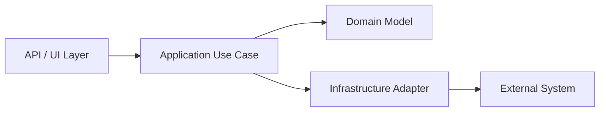
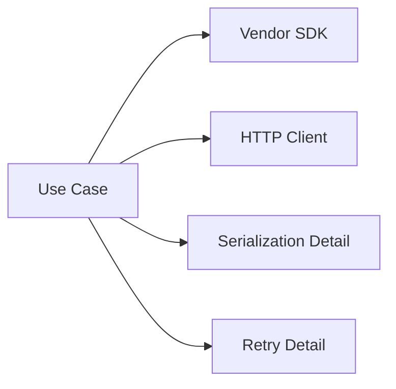
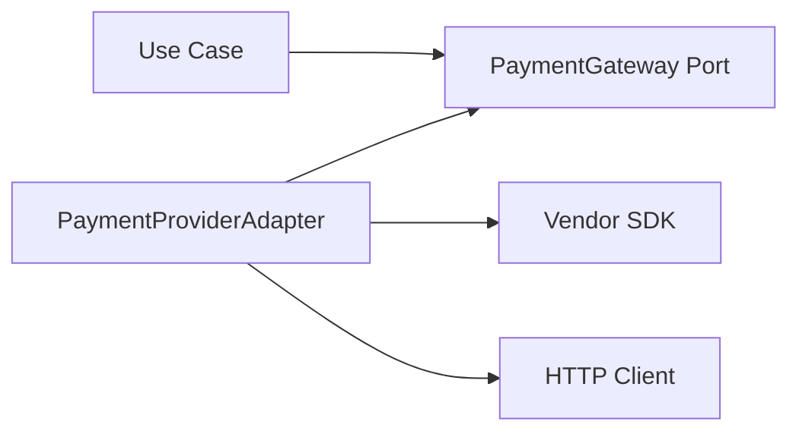
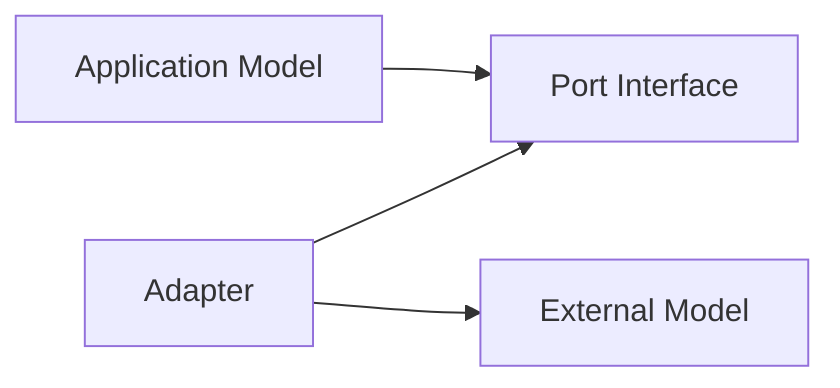
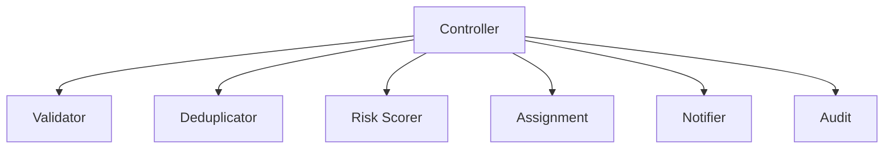
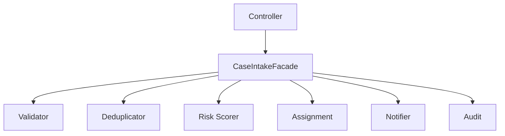
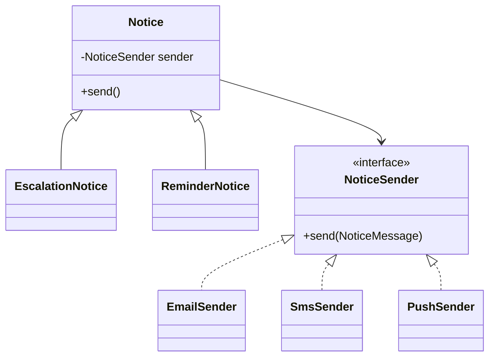
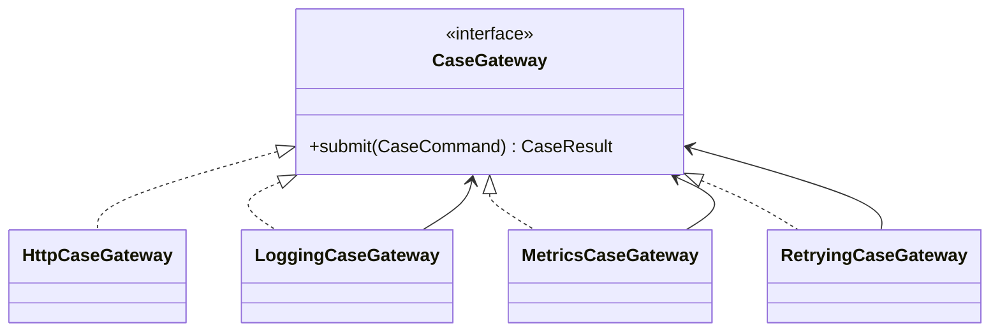
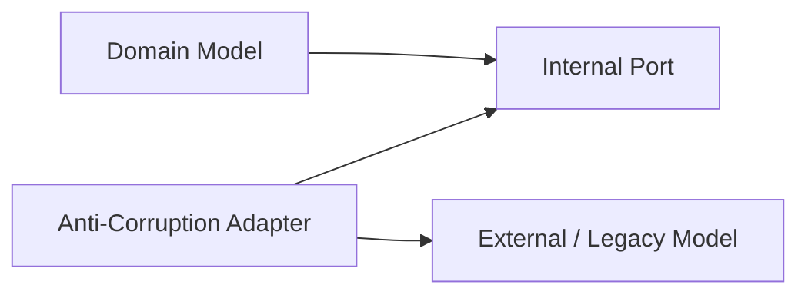

------
title: Learn Java Patterns - Part 005
description: Structural patterns untuk membangun boundary yang stabil: adapter, facade, bridge, proxy, decorator, composite, wrapper, dan anti-corruption layer ringan dalam Java production systems.
series: learn-java-patterns
seriesTitle: Learn Java Patterns, Data Patterns, Pipeline Patterns, Concurrency Patterns, Common Patterns, and Anti-Patterns
order: 5
partTitle: Composition, Boundary, and Structural Patterns
tags:
- java
- patterns
- architecture
- advanced-java
- design-patterns
- structural-patterns
date: 2026-06-27
---

# Learn Java Patterns - Part 005: Composition, Boundary, and Structural Patterns

## 1. Tujuan Part Ini

Part ini membahas **structural patterns**: pattern yang mengatur bagaimana object, interface, subsystem, dependency, dan boundary disusun agar sistem tetap bisa berevolusi.

Di level junior, structural pattern sering dipelajari sebagai katalog GoF:

- Adapter,
- Facade,
- Bridge,
- Proxy,
- Decorator,
- Composite,
- Flyweight.

Di level production, pertanyaannya bukan lagi “apa definisi pattern ini?”, tetapi:

- boundary mana yang harus stabil?
- dependency mana yang harus dibalik?
- perubahan mana yang harus dilokalisasi?
- object mana yang boleh tahu detail object lain?
- kontrak mana yang harus disederhanakan?
- kapan wrapper membantu, dan kapan wrapper hanya menambah indirection?
- kapan facade menjadi boundary sehat, dan kapan menjadi God service?
- kapan proxy memperjelas operational concern, dan kapan menyembunyikan latency/failure?

Structural pattern adalah alat untuk mengendalikan **shape of coupling**.

> Pattern struktural yang baik membuat perubahan mahal menjadi lokal, dan membuat hubungan antar komponen eksplisit.

Part ini tidak akan mengulang OOP dasar. Kita akan fokus pada mental model desain, trade-off, Java implementation, failure mode, dan refactoring path.

---

## 2. Kaufman Lens: Sub-Skill yang Dilatih

Dalam pendekatan Josh Kaufman, skill besar harus dipecah menjadi sub-skill kecil yang bisa dilatih. Untuk structural pattern, sub-skill utamanya adalah:

| Sub-Skill | Target Praktis |
|---|---|
| Boundary recognition | Mengenali batas antara domain, application, infrastructure, external system, dan framework |
| Coupling shaping | Memilih bentuk dependency yang paling murah untuk diubah |
| Interface extraction | Mengekstrak interface yang merepresentasikan kebutuhan caller, bukan detail implementation |
| Wrapper discipline | Membungkus dependency tanpa menyembunyikan failure semantics |
| Composition design | Menyusun object dari collaborator kecil, bukan inheritance hierarchy rapuh |
| Contract simplification | Menyederhanakan API rumit menjadi use-case-oriented API |
| Extension control | Membuka extension point tanpa membuat sistem bebas berubah liar |
| Refactoring safety | Memindahkan boundary tanpa big-bang rewrite |

Latihan utama part ini:

> Ambil dependency nyata, lalu desain boundary yang mengurangi coupling tanpa menghilangkan visibility terhadap failure.

---

## 3. Mental Model: Structural Pattern sebagai Boundary Engineering

Structural pattern tidak hanya tentang “menghubungkan class”. Ia tentang mengatur **jarak kognitif** dan **jarak perubahan**.

Sebuah sistem Java production biasanya memiliki beberapa zona:



Yang berbahaya bukan dependency itu sendiri. Yang berbahaya adalah dependency yang:

1. berubah dengan alasan berbeda,
2. bocor ke terlalu banyak tempat,
3. membawa detail runtime ke domain,
4. menyembunyikan latency,
5. menyembunyikan error semantics,
6. membuat testing bergantung pada sistem eksternal,
7. memaksa semua caller memahami API yang terlalu umum.

Structural pattern membantu kita mengubah ini:



menjadi ini:



Boundary yang sehat bukan berarti “semua diberi interface”. Boundary yang sehat berarti:

- caller hanya melihat hal yang ia butuhkan;
- implementation detail punya tempat sendiri;
- perubahan eksternal tidak menyebar;
- failure tetap bisa diamati;
- test bisa dibuat tanpa real dependency;
- contract cukup kecil untuk dipahami.

---

## 4. Vocabulary: Composition, Boundary, Wrapper, Adapter, Facade

Sebelum masuk pattern, kita perlu membedakan beberapa istilah yang sering dicampur.

| Istilah | Makna | Fokus |
|---|---|---|
| Composition | Object memakai object lain untuk menyelesaikan kerja | Collaboration |
| Boundary | Garis konseptual antara dua model/concern | Ownership dan change control |
| Wrapper | Object yang membungkus object lain | Indirection |
| Adapter | Wrapper yang mengubah interface satu model ke model lain | Compatibility |
| Facade | Interface sederhana ke subsystem kompleks | Simplification |
| Proxy | Pengganti object yang mengontrol akses ke target | Access control / operational concern |
| Decorator | Pembungkus yang menambah behavior tanpa mengubah contract | Behavior layering |
| Bridge | Pemisahan abstraction dan implementation agar keduanya bisa berubah independen | Dimensional variation |
| Composite | Struktur tree yang memperlakukan leaf dan group secara seragam | Hierarchy |

Kesalahan umum: menganggap semua wrapper adalah adapter. Tidak benar.

Contoh:

```java
public final class LoggingPaymentGateway implements PaymentGateway {
    private final PaymentGateway delegate;

    public LoggingPaymentGateway(PaymentGateway delegate) {
        this.delegate = Objects.requireNonNull(delegate);
    }

    @Override
    public PaymentResult charge(PaymentRequest request) {
        System.out.println("Charging " + request.orderId());
        return delegate.charge(request);
    }
}
```

Itu lebih tepat disebut **Decorator**, bukan Adapter, karena interface input dan output tetap sama.

Sedangkan ini Adapter:

```java
public final class StripePaymentAdapter implements PaymentGateway {
    private final StripeClient stripeClient;

    public StripePaymentAdapter(StripeClient stripeClient) {
        this.stripeClient = Objects.requireNonNull(stripeClient);
    }

    @Override
    public PaymentResult charge(PaymentRequest request) {
        StripeChargeCommand command = new StripeChargeCommand(
                request.amount().value(),
                request.amount().currency(),
                request.customerReference()
        );

        StripeChargeResponse response = stripeClient.createCharge(command);

        return new PaymentResult(
                response.chargeId(),
                mapStatus(response.status()),
                response.failureReason()
        );
    }
}
```

Interface caller adalah `PaymentGateway`; interface vendor adalah `StripeClient`. Adapter menerjemahkan dua model yang berbeda.

---

## 5. Pattern 1: Adapter

### 5.1 Problem

Adapter dipakai saat satu bagian sistem membutuhkan contract tertentu, tetapi dependency yang tersedia memiliki contract berbeda.

Problem intinya:

> Caller tidak seharusnya berubah hanya karena provider berubah.

Contoh situasi:

- mengganti payment provider;
- membungkus legacy SOAP service;
- memakai vendor SDK yang model datanya buruk;
- mengubah database driver menjadi repository-specific contract;
- menghubungkan domain model dengan message schema eksternal;
- memindahkan sistem dari REST client ke gRPC client;
- membuat test double untuk external dependency.

### 5.2 Mental Model

Adapter adalah **translator at boundary**.



Adapter bukan sekadar pass-through. Ia biasanya bertanggung jawab atas:

- mapping request;
- mapping response;
- mapping error;
- normalization;
- validation boundary;
- defaulting;
- unit conversion;
- protocol-specific concern;
- translating external vocabulary into internal vocabulary.

### 5.3 Java Example: External Risk Service Adapter

Kita punya use case enforcement yang butuh menilai risiko case.

```java
public interface RiskScoringGateway {
    RiskScore score(CaseRiskProfile profile);
}

public record CaseRiskProfile(
        String caseId,
        String subjectId,
        int priorViolationCount,
        boolean crossBorderImpact,
        BigDecimal estimatedHarm
) {}

public record RiskScore(
        String caseId,
        RiskLevel level,
        int score,
        String reason
) {}

public enum RiskLevel {
    LOW,
    MEDIUM,
    HIGH,
    CRITICAL
}
```

Vendor client punya API berbeda:

```java
public final class VendorRiskClient {
    public VendorRiskResponse evaluate(VendorRiskRequest request) {
        // HTTP / SDK call
        throw new UnsupportedOperationException("example");
    }
}

public record VendorRiskRequest(
        String entity,
        int history,
        String jurisdictionFlag,
        String exposureAmount
) {}

public record VendorRiskResponse(
        String ref,
        String category,
        int numericScore,
        String explanation
) {}
```

Adapter:

```java
public final class VendorRiskScoringAdapter implements RiskScoringGateway {
    private final VendorRiskClient client;

    public VendorRiskScoringAdapter(VendorRiskClient client) {
        this.client = Objects.requireNonNull(client);
    }

    @Override
    public RiskScore score(CaseRiskProfile profile) {
        VendorRiskRequest request = new VendorRiskRequest(
                profile.subjectId(),
                profile.priorViolationCount(),
                profile.crossBorderImpact() ? "CROSS_BORDER" : "LOCAL",
                profile.estimatedHarm().toPlainString()
        );

        VendorRiskResponse response = client.evaluate(request);

        return new RiskScore(
                profile.caseId(),
                mapLevel(response.category()),
                response.numericScore(),
                response.explanation()
        );
    }

    private RiskLevel mapLevel(String category) {
        return switch (category) {
            case "A" -> RiskLevel.LOW;
            case "B" -> RiskLevel.MEDIUM;
            case "C" -> RiskLevel.HIGH;
            case "D" -> RiskLevel.CRITICAL;
            default -> throw new IllegalArgumentException("Unknown risk category: " + category);
        };
    }
}
```

### 5.4 Adapter Boundary Rule

Adapter harus berada di sisi yang **paling tahu kedua model**.

Application use case tahu internal model.
Vendor SDK tahu external model.
Adapter tahu keduanya.
Domain model sebaiknya tidak tahu vendor model.

Buruk:

```java
public final class EscalateCaseUseCase {
    public void execute(VendorRiskResponse response) {
        if (response.category().equals("D")) {
            // domain logic polluted by vendor vocabulary
        }
    }
}
```

Lebih baik:

```java
public final class EscalateCaseUseCase {
    private final RiskScoringGateway riskScoringGateway;

    public EscalateCaseUseCase(RiskScoringGateway riskScoringGateway) {
        this.riskScoringGateway = Objects.requireNonNull(riskScoringGateway);
    }

    public void execute(CaseRiskProfile profile) {
        RiskScore score = riskScoringGateway.score(profile);
        if (score.level() == RiskLevel.CRITICAL) {
            // internal domain decision
        }
    }
}
```

### 5.5 Failure Modes

Adapter sering gagal karena:

| Failure | Dampak |
|---|---|
| Pass-through adapter | Tidak benar-benar mengisolasi external model |
| Over-generic adapter | Contract terlalu luas dan sulit dipakai |
| Silent mapping fallback | Data salah tetapi tidak terlihat |
| Exception swallowing | Failure hilang dari observability |
| Vendor vocabulary leak | Domain menjadi tergantung provider |
| Bidirectional adapter chaos | Tidak jelas model mana canonical |

### 5.6 Checklist Adapter

Gunakan Adapter jika:

- ada dua model berbeda;
- caller tidak seharusnya tahu provider detail;
- provider kemungkinan berubah;
- external schema tidak cocok dengan internal language;
- testing butuh fake implementation;
- mapping error harus dikendalikan.

Hindari Adapter jika:

- interface sama persis dan wrapper hanya menambah noise;
- dependency tidak mungkin berubah dan tidak menyebar;
- abstraction terlalu dini membuat debugging sulit;
- adapter hanya menyembunyikan design debt tanpa memperbaiki boundary.

---

## 6. Pattern 2: Facade

### 6.1 Problem

Facade dipakai saat subsystem terlalu kompleks untuk dikonsumsi langsung oleh caller.

Problem intinya:

> Banyak caller tidak seharusnya memahami orchestration internal subsystem.

Contoh:

- case creation membutuhkan validation, deduplication, risk scoring, assignment, notification;
- report generation membutuhkan query, aggregation, rendering, storage;
- onboarding user membutuhkan identity, permission, profile, audit;
- payment settlement membutuhkan ledger, fraud check, external capture, receipt.

Tanpa facade, caller harus tahu terlalu banyak langkah.



Dengan facade:



### 6.2 Facade vs Application Service

Di Java enterprise, Facade sering mirip dengan Application Service. Perbedaannya bukan mutlak, tetapi useful:

| Type | Fokus |
|---|---|
| Facade | Menyederhanakan akses ke subsystem |
| Application Service | Mengorkestrasi use case aplikasi |
| Domain Service | Mengandung domain logic yang tidak natural menjadi method entity/value object |
| Gateway | Boundary ke external dependency |

Dalam praktik, sebuah `CaseIntakeService` bisa berfungsi sebagai facade dan application service sekaligus. Yang penting adalah clarity:

- apakah class ini menyederhanakan subsystem?
- apakah class ini menjalankan use case?
- apakah class ini memuat domain decision?
- apakah class ini hanya transaction script?

### 6.3 Java Example: Case Intake Facade

```java
public final class CaseIntakeFacade {
    private final CaseDraftValidator validator;
    private final DuplicateCaseFinder duplicateCaseFinder;
    private final RiskScoringGateway riskScoringGateway;
    private final CaseAssignmentPolicy assignmentPolicy;
    private final CaseRepository caseRepository;
    private final AuditLog auditLog;

    public CaseIntakeFacade(
            CaseDraftValidator validator,
            DuplicateCaseFinder duplicateCaseFinder,
            RiskScoringGateway riskScoringGateway,
            CaseAssignmentPolicy assignmentPolicy,
            CaseRepository caseRepository,
            AuditLog auditLog
    ) {
        this.validator = Objects.requireNonNull(validator);
        this.duplicateCaseFinder = Objects.requireNonNull(duplicateCaseFinder);
        this.riskScoringGateway = Objects.requireNonNull(riskScoringGateway);
        this.assignmentPolicy = Objects.requireNonNull(assignmentPolicy);
        this.caseRepository = Objects.requireNonNull(caseRepository);
        this.auditLog = Objects.requireNonNull(auditLog);
    }

    public CaseIntakeResult submit(CaseDraft draft) {
        ValidationResult validation = validator.validate(draft);
        if (!validation.isValid()) {
            return CaseIntakeResult.rejected(validation.errors());
        }

        Optional<CaseId> duplicate = duplicateCaseFinder.findDuplicate(draft);
        if (duplicate.isPresent()) {
            return CaseIntakeResult.duplicate(duplicate.get());
        }

        RiskScore riskScore = riskScoringGateway.score(draft.toRiskProfile());
        Assignment assignment = assignmentPolicy.assign(draft, riskScore);

        CaseRecord record = CaseRecord.open(draft, riskScore, assignment);
        caseRepository.save(record);

        auditLog.append(AuditEvent.caseOpened(record.id(), record.status()));

        return CaseIntakeResult.accepted(record.id(), assignment.ownerTeam());
    }
}
```

### 6.4 Facade Failure Mode: God Facade

Facade menjadi buruk saat ia berubah menjadi class raksasa yang tahu semua hal.

Gejala:

- method terlalu banyak;
- setiap use case baru ditambahkan ke facade yang sama;
- facade punya puluhan dependency;
- logic domain tersebar di facade;
- test setup sangat berat;
- tidak ada cohesion;
- semua transaction melewati satu class.

Contoh buruk:

```java
public final class CaseManagementFacade {
    public void createCase(...) {}
    public void escalateCase(...) {}
    public void closeCase(...) {}
    public void assignCase(...) {}
    public void reopenCase(...) {}
    public void generateReport(...) {}
    public void exportData(...) {}
    public void importLegacyData(...) {}
    public void calculatePenalty(...) {}
    public void notifyAllParties(...) {}
}
```

Nama `Facade` tidak menyelamatkan desain. Jika class menjadi dumping ground, pattern berubah menjadi anti-pattern.

### 6.5 Facade Design Rules

Facade yang sehat:

- punya cohesive purpose;
- menyembunyikan urutan internal yang tidak relevan untuk caller;
- tidak menyembunyikan outcome penting;
- return value jelas;
- dependency masih bisa dipahami;
- tidak menjadi tempat semua domain rule;
- punya boundary transaksi yang jelas;
- mudah dites dengan collaborator fake.

---

## 7. Pattern 3: Bridge

### 7.1 Problem

Bridge dipakai saat ada dua dimensi variasi yang berubah secara independen.

Problem intinya:

> Jangan buat inheritance explosion untuk kombinasi variasi.

Misalnya sistem notifikasi:

- tipe notifikasi: enforcement notice, reminder, escalation notice;
- channel: email, SMS, push, in-app;
- format: plain text, HTML, template-based;
- delivery provider: internal SMTP, third-party API.

Inheritance naif:

```text
EmailEscalationNotice
SmsEscalationNotice
PushEscalationNotice
EmailReminderNotice
SmsReminderNotice
PushReminderNotice
HtmlEmailReminderNotice
HtmlEmailEscalationNotice
...
```

Ini kombinatorial.

Bridge memisahkan abstraction dari implementation.



### 7.2 Java Example

```java
public interface NoticeSender {
    void send(NoticeMessage message);
}

public record NoticeMessage(
        String recipient,
        String subject,
        String body
) {}

public abstract class Notice {
    private final NoticeSender sender;

    protected Notice(NoticeSender sender) {
        this.sender = Objects.requireNonNull(sender);
    }

    public final void sendTo(String recipient) {
        sender.send(render(recipient));
    }

    protected abstract NoticeMessage render(String recipient);
}

public final class EscalationNotice extends Notice {
    private final CaseId caseId;
    private final RiskLevel riskLevel;

    public EscalationNotice(NoticeSender sender, CaseId caseId, RiskLevel riskLevel) {
        super(sender);
        this.caseId = Objects.requireNonNull(caseId);
        this.riskLevel = Objects.requireNonNull(riskLevel);
    }

    @Override
    protected NoticeMessage render(String recipient) {
        return new NoticeMessage(
                recipient,
                "Case escalation required",
                "Case " + caseId.value() + " has risk level " + riskLevel
        );
    }
}

public final class EmailNoticeSender implements NoticeSender {
    @Override
    public void send(NoticeMessage message) {
        // SMTP or email API
    }
}

public final class SmsNoticeSender implements NoticeSender {
    @Override
    public void send(NoticeMessage message) {
        // SMS provider API
    }
}
```

### 7.3 Bridge vs Strategy

Bridge dan Strategy sama-sama memakai composition. Bedanya:

| Pattern | Fokus |
|---|---|
| Bridge | Memisahkan dua abstraction hierarchy atau variasi besar yang berubah independen |
| Strategy | Mengganti algorithm/policy dalam satu behavior |

Jika variasinya adalah “bagaimana menghitung penalty”, itu Strategy.
Jika variasinya adalah “jenis notice” dan “channel delivery” yang dua-duanya punya lifecycle sendiri, itu Bridge.

### 7.4 Failure Modes

Bridge gagal saat:

- variasi sebenarnya hanya satu dimensi;
- abstraction dibuat terlalu awal;
- semua implementation tetap harus tahu semua subclass abstraction;
- bridge interface terlalu general;
- caller tetap harus memilih kombinasi secara manual di banyak tempat.

Bridge cocok saat kombinasi variasi mulai tumbuh dan arah perubahan mulai jelas.

---

## 8. Pattern 4: Proxy

### 8.1 Problem

Proxy dipakai saat kita ingin mengontrol akses ke object target tanpa mengubah contract utamanya.

Problem intinya:

> Caller berbicara dengan interface yang sama, tetapi akses ke target melewati kontrol tambahan.

Jenis proxy:

| Jenis | Tujuan |
|---|---|
| Remote Proxy | Mewakili object/service yang berada di proses/mesin lain |
| Virtual Proxy | Menunda pembuatan object mahal sampai dibutuhkan |
| Protection Proxy | Mengecek permission sebelum akses |
| Caching Proxy | Menyimpan hasil untuk mengurangi cost |
| Metrics Proxy | Mengukur latency/error |
| Retry Proxy | Menambahkan retry policy |
| Transaction Proxy | Menjalankan method dalam transaction boundary |

Dalam Java enterprise, proxy sangat umum: AOP, dynamic proxy, framework proxy, transaction proxy, security proxy.

### 8.2 Java Manual Proxy Example

```java
public interface CaseRepository {
    Optional<CaseRecord> findById(CaseId id);
    void save(CaseRecord record);
}

public final class AuthorizationCheckingCaseRepository implements CaseRepository {
    private final CaseRepository delegate;
    private final AuthorizationService authorizationService;
    private final CurrentUser currentUser;

    public AuthorizationCheckingCaseRepository(
            CaseRepository delegate,
            AuthorizationService authorizationService,
            CurrentUser currentUser
    ) {
        this.delegate = Objects.requireNonNull(delegate);
        this.authorizationService = Objects.requireNonNull(authorizationService);
        this.currentUser = Objects.requireNonNull(currentUser);
    }

    @Override
    public Optional<CaseRecord> findById(CaseId id) {
        authorizationService.requirePermission(currentUser.id(), Permission.READ_CASE, id);
        return delegate.findById(id);
    }

    @Override
    public void save(CaseRecord record) {
        authorizationService.requirePermission(currentUser.id(), Permission.WRITE_CASE, record.id());
        delegate.save(record);
    }
}
```

Ini Proxy karena contract `CaseRepository` tetap sama, tetapi akses dikontrol.

### 8.3 Dynamic Proxy Example

Java menyediakan dynamic proxy untuk interface-based proxy.

```java
public final class TimingProxy {
    @SuppressWarnings("unchecked")
    public static <T> T wrap(Class<T> type, T target) {
        Objects.requireNonNull(type);
        Objects.requireNonNull(target);

        return (T) Proxy.newProxyInstance(
                type.getClassLoader(),
                new Class<?>[] { type },
                (proxy, method, args) -> {
                    long start = System.nanoTime();
                    try {
                        return method.invoke(target, args);
                    } finally {
                        long duration = System.nanoTime() - start;
                        System.out.println(method.getName() + " took " + duration + " ns");
                    }
                }
        );
    }
}
```

Usage:

```java
CaseRepository repository = new JdbcCaseRepository(dataSource);
CaseRepository timedRepository = TimingProxy.wrap(CaseRepository.class, repository);
```

### 8.4 Proxy Danger: Hidden Operational Semantics

Proxy bisa membuat kode terlihat sederhana tetapi runtime menjadi tidak terlihat.

Contoh:

```java
CaseRecord record = caseRepository.findById(id).orElseThrow();
```

Call itu tampak seperti local object call. Padahal jika repository diproxy oleh remote call, retry, transaction, cache, dan security layer, maka ada banyak semantics tersembunyi:

- latency;
- timeout;
- partial failure;
- retry amplification;
- permission check;
- stale cache;
- transaction propagation;
- serialization error.

Proxy sehat tidak boleh membuat failure terlihat mustahil. Ia boleh menyederhanakan access, tetapi tidak boleh menghapus mental model bahwa operasi tersebut mahal atau bisa gagal.

### 8.5 Checklist Proxy

Gunakan Proxy jika:

- contract sama, tetapi akses perlu dikontrol;
- concern bersifat cross-cutting;
- caller tidak perlu tahu implementasi detail;
- behavior tambahan konsisten untuk semua method;
- operational behavior terdokumentasi.

Hindari Proxy jika:

- behavior tambahan berbeda-beda per call dan butuh explicitness;
- proxy menyembunyikan remote call sebagai local call;
- debugging menjadi sulit;
- stack trace menjadi tidak bermakna;
- proxy chaining terlalu panjang.

---

## 9. Pattern 5: Decorator

### 9.1 Problem

Decorator dipakai saat kita ingin menambah behavior ke object tanpa mengubah class aslinya dan tanpa membuat inheritance hierarchy baru.

Problem intinya:

> Tambahkan kemampuan secara composable, bukan dengan subclass explosion.

Contoh:

- logging;
- metrics;
- caching;
- validation;
- retry;
- authorization;
- compression;
- encryption;
- tracing;
- rate limiting.

### 9.2 Decorator Structure



### 9.3 Java Example: Decorator Chain

```java
public interface ExternalCaseGateway {
    ExternalCaseResult submit(ExternalCaseCommand command);
}

public final class HttpExternalCaseGateway implements ExternalCaseGateway {
    @Override
    public ExternalCaseResult submit(ExternalCaseCommand command) {
        // real HTTP call
        return ExternalCaseResult.accepted("remote-123");
    }
}

public final class LoggingExternalCaseGateway implements ExternalCaseGateway {
    private final ExternalCaseGateway delegate;

    public LoggingExternalCaseGateway(ExternalCaseGateway delegate) {
        this.delegate = Objects.requireNonNull(delegate);
    }

    @Override
    public ExternalCaseResult submit(ExternalCaseCommand command) {
        System.out.println("Submitting external case " + command.caseId());
        try {
            ExternalCaseResult result = delegate.submit(command);
            System.out.println("External case result " + result.status());
            return result;
        } catch (RuntimeException ex) {
            System.out.println("External case submission failed: " + ex.getMessage());
            throw ex;
        }
    }
}

public final class MetricsExternalCaseGateway implements ExternalCaseGateway {
    private final ExternalCaseGateway delegate;
    private final Metrics metrics;

    public MetricsExternalCaseGateway(ExternalCaseGateway delegate, Metrics metrics) {
        this.delegate = Objects.requireNonNull(delegate);
        this.metrics = Objects.requireNonNull(metrics);
    }

    @Override
    public ExternalCaseResult submit(ExternalCaseCommand command) {
        long start = System.nanoTime();
        try {
            ExternalCaseResult result = delegate.submit(command);
            metrics.increment("external_case.submit.success");
            return result;
        } catch (RuntimeException ex) {
            metrics.increment("external_case.submit.failure");
            throw ex;
        } finally {
            metrics.recordDuration("external_case.submit.duration", System.nanoTime() - start);
        }
    }
}
```

Composition:

```java
ExternalCaseGateway gateway = new MetricsExternalCaseGateway(
        new LoggingExternalCaseGateway(
                new HttpExternalCaseGateway()
        ),
        metrics
);
```

### 9.4 Decorator Ordering Matters

Decorator chain tidak selalu commutative.

```text
Metrics(Retry(Http))
```

mengukur total latency setelah retry.

```text
Retry(Metrics(Http))
```

mengukur tiap attempt secara terpisah.

```text
Cache(Auth(Http))
```

berbahaya jika cache key tidak menyertakan authorization scope.

```text
Auth(Cache(Http))
```

mungkin lebih aman, tetapi tetap harus memastikan stale data tidak melanggar policy.

Pattern bukan hanya structure. Urutan composition adalah behavior.

### 9.5 Decorator vs Proxy

| Decorator | Proxy |
|---|---|
| Menambah behavior secara composable | Mengontrol akses ke target |
| Biasanya banyak decorator bisa disusun | Biasanya satu proxy mengatur satu access concern |
| Fokus pada behavior layering | Fokus pada access mediation |
| Caller sadar atau tidak sadar tetap memakai interface sama | Caller juga memakai interface sama |

Dalam praktik, batasnya bisa kabur. Logging proxy juga bisa disebut decorator. Yang penting adalah niat desain:

- apakah kita layering behavior?
- apakah kita controlling access?

### 9.6 Failure Modes

Decorator gagal saat:

- chain terlalu panjang;
- urutan tidak terdokumentasi;
- decorator mengubah semantics diam-diam;
- exception mapping tidak konsisten;
- setiap decorator punya configuration sendiri-sendiri;
- debugging sulit karena banyak frame delegasi;
- metric/logging menghasilkan noise.

---

## 10. Pattern 6: Composite

### 10.1 Problem

Composite dipakai saat kita memiliki struktur tree di mana leaf dan group harus diperlakukan secara seragam.

Contoh:

- permission tree;
- policy rule tree;
- validation rule group;
- UI component hierarchy;
- organization hierarchy;
- workflow step group;
- expression tree;
- document section tree.

Problem intinya:

> Caller tidak ingin membedakan leaf dan group untuk operasi tertentu.

### 10.2 Java Example: Policy Rule Composite

```java
public interface PolicyRule {
    PolicyDecision evaluate(PolicyContext context);
}

public record PolicyContext(
        String userId,
        String caseId,
        Set<String> roles,
        BigDecimal exposureAmount,
        RiskLevel riskLevel
) {}

public enum PolicyDecision {
    ALLOW,
    DENY,
    ABSTAIN
}

public final class RoleRule implements PolicyRule {
    private final String requiredRole;

    public RoleRule(String requiredRole) {
        this.requiredRole = Objects.requireNonNull(requiredRole);
    }

    @Override
    public PolicyDecision evaluate(PolicyContext context) {
        return context.roles().contains(requiredRole)
                ? PolicyDecision.ALLOW
                : PolicyDecision.DENY;
    }
}

public final class RiskLimitRule implements PolicyRule {
    @Override
    public PolicyDecision evaluate(PolicyContext context) {
        return context.riskLevel() == RiskLevel.CRITICAL
                ? PolicyDecision.DENY
                : PolicyDecision.ALLOW;
    }
}

public final class AllOfRule implements PolicyRule {
    private final List<PolicyRule> rules;

    public AllOfRule(List<PolicyRule> rules) {
        this.rules = List.copyOf(rules);
    }

    @Override
    public PolicyDecision evaluate(PolicyContext context) {
        boolean sawAbstain = false;

        for (PolicyRule rule : rules) {
            PolicyDecision decision = rule.evaluate(context);
            if (decision == PolicyDecision.DENY) {
                return PolicyDecision.DENY;
            }
            if (decision == PolicyDecision.ABSTAIN) {
                sawAbstain = true;
            }
        }

        return sawAbstain ? PolicyDecision.ABSTAIN : PolicyDecision.ALLOW;
    }
}
```

Usage:

```java
PolicyRule rule = new AllOfRule(List.of(
        new RoleRule("SENIOR_INVESTIGATOR"),
        new RiskLimitRule()
));

PolicyDecision decision = rule.evaluate(context);
```

### 10.3 Composite with Sealed Types

Java sealed types bisa membuat hierarchy lebih terkendali.

```java
public sealed interface RuleNode permits LeafRule, AllRule, AnyRule, NotRule {
    PolicyDecision evaluate(PolicyContext context);
}

public record LeafRule(String name, Predicate<PolicyContext> predicate) implements RuleNode {
    @Override
    public PolicyDecision evaluate(PolicyContext context) {
        return predicate.test(context) ? PolicyDecision.ALLOW : PolicyDecision.DENY;
    }
}

public record AllRule(List<RuleNode> children) implements RuleNode {
    public AllRule {
        children = List.copyOf(children);
    }

    @Override
    public PolicyDecision evaluate(PolicyContext context) {
        for (RuleNode child : children) {
            if (child.evaluate(context) == PolicyDecision.DENY) {
                return PolicyDecision.DENY;
            }
        }
        return PolicyDecision.ALLOW;
    }
}

public record AnyRule(List<RuleNode> children) implements RuleNode {
    public AnyRule {
        children = List.copyOf(children);
    }

    @Override
    public PolicyDecision evaluate(PolicyContext context) {
        for (RuleNode child : children) {
            if (child.evaluate(context) == PolicyDecision.ALLOW) {
                return PolicyDecision.ALLOW;
            }
        }
        return PolicyDecision.DENY;
    }
}

public record NotRule(RuleNode child) implements RuleNode {
    @Override
    public PolicyDecision evaluate(PolicyContext context) {
        return child.evaluate(context) == PolicyDecision.ALLOW
                ? PolicyDecision.DENY
                : PolicyDecision.ALLOW;
    }
}
```

### 10.4 Composite Failure Modes

Composite gagal saat:

- tree terlalu dalam dan sulit dianalisis;
- evaluation order tidak jelas;
- short-circuit behavior tidak terdokumentasi;
- node punya side effect;
- cycle tidak dicegah;
- serialization format tidak stabil;
- debugging hasil evaluasi sulit.

Untuk rule engine production, composite sering butuh explainability:

```java
public record EvaluationTrace(
        String ruleName,
        PolicyDecision decision,
        List<EvaluationTrace> children
) {}
```

Jika keputusan berdampak regulatory, “hasilnya deny” tidak cukup. Sistem perlu menjelaskan **rule mana yang menyebabkan deny**.

---

## 11. Pattern 7: Flyweight

### 11.1 Problem

Flyweight dipakai saat banyak object memiliki state yang sama dan dapat dibagi untuk mengurangi memory footprint.

Problem intinya:

> Jangan duplikasi intrinsic state yang immutable dan reusable.

Contoh:

- code table/reference data;
- country/currency metadata;
- permission descriptor;
- validation rule descriptor;
- parsed template;
- compiled regex;
- immutable configuration snapshot;
- enum-like domain object yang tidak cukup direpresentasikan enum.

### 11.2 Intrinsic vs Extrinsic State

Flyweight memisahkan:

| State | Makna |
|---|---|
| Intrinsic | Shared, immutable, reusable |
| Extrinsic | Context-specific, supplied by caller |

Contoh:

```java
public record ViolationType(
        String code,
        String description,
        Severity defaultSeverity
) {}

public final class ViolationTypeRegistry {
    private final Map<String, ViolationType> byCode;

    public ViolationTypeRegistry(List<ViolationType> types) {
        this.byCode = types.stream()
                .collect(Collectors.toUnmodifiableMap(ViolationType::code, Function.identity()));
    }

    public ViolationType get(String code) {
        ViolationType type = byCode.get(code);
        if (type == null) {
            throw new IllegalArgumentException("Unknown violation type: " + code);
        }
        return type;
    }
}
```

Case record tidak perlu menyimpan deskripsi violation berulang-ulang. Ia cukup menyimpan code atau referensi ke shared immutable object.

```java
public record ViolationFinding(
        String caseId,
        ViolationType violationType,
        LocalDate detectedDate,
        String evidenceSummary
) {}
```

### 11.3 Flyweight Failure Modes

Flyweight berbahaya jika:

- shared object ternyata mutable;
- cache tidak punya lifecycle jelas;
- memory leak karena registry tumbuh tanpa batas;
- equality semantics membingungkan;
- reference data berubah tetapi object lama masih dipakai;
- optimization terlalu dini.

Gunakan Flyweight saat memory pressure nyata atau reference identity memang penting. Jangan menjadikannya default.

---

## 12. Anti-Corruption Layer Ringan

Anti-Corruption Layer akan dibahas lagi dalam API boundary part. Namun di structural pattern, kita perlu memahami bentuk ringannya: boundary yang mencegah model luar mencemari model dalam.



Adapter biasa menerjemahkan interface. Anti-corruption layer menambahkan niat yang lebih kuat:

> External model dianggap tidak boleh menentukan bahasa internal.

Contoh external status:

```text
N, P, R, X, Z
```

Jangan biarkan status itu menyebar ke domain.

Buruk:

```java
if (legacyCase.status().equals("Z")) {
    caseRecord.close();
}
```

Lebih baik:

```java
public enum CaseLifecycleSignal {
    OPENED,
    UPDATED,
    REJECTED,
    CLOSED,
    UNKNOWN
}

public final class LegacyCaseStatusTranslator {
    public CaseLifecycleSignal translate(String status) {
        return switch (status) {
            case "N" -> CaseLifecycleSignal.OPENED;
            case "P" -> CaseLifecycleSignal.UPDATED;
            case "R" -> CaseLifecycleSignal.REJECTED;
            case "Z" -> CaseLifecycleSignal.CLOSED;
            default -> CaseLifecycleSignal.UNKNOWN;
        };
    }
}
```

Jika external model berubah, translator yang berubah, bukan seluruh domain.

---

## 13. Boundary Granularity: Terlalu Tipis vs Terlalu Tebal

Boundary terlalu tipis:

```java
public interface ExternalClientWrapper {
    VendorResponse call(VendorRequest request);
}
```

Ini hanya mengganti nama vendor. Model vendor tetap bocor.

Boundary terlalu tebal:

```java
public interface UniversalExternalSystemFacade {
    Object execute(String system, String operation, Map<String, Object> payload);
}
```

Ini menghapus type safety dan menjadikan boundary seperti mini-platform tidak jelas.

Boundary yang lebih sehat:

```java
public interface SanctionScreeningGateway {
    ScreeningResult screen(SubjectProfile subjectProfile);
}
```

Contract mengikuti kebutuhan aplikasi.

### 13.1 Rule of Thumb

Buat boundary berdasarkan:

1. use case yang stabil;
2. vocabulary internal;
3. failure semantics yang eksplisit;
4. data yang benar-benar dibutuhkan caller;
5. testing seam;
6. kemungkinan provider berubah.

Jangan buat boundary berdasarkan:

- nama vendor;
- endpoint external;
- table database;
- framework class;
- struktur organisasi tim;
- dugaan abstraksi masa depan yang belum nyata.

---

## 14. Structural Pattern Decision Matrix

| Problem | Pattern Kandidat | Pertanyaan Kunci |
|---|---|---|
| Interface tidak cocok | Adapter | Apakah ada dua model yang perlu diterjemahkan? |
| Subsystem terlalu kompleks | Facade | Apakah caller tahu terlalu banyak langkah internal? |
| Dua dimensi variasi tumbuh | Bridge | Apakah inheritance mulai kombinatorial? |
| Akses perlu dikontrol | Proxy | Apakah contract sama tetapi akses perlu mediasi? |
| Behavior tambahan composable | Decorator | Apakah behavior bisa dilapiskan tanpa mengubah target? |
| Struktur tree | Composite | Apakah leaf dan group perlu diperlakukan seragam? |
| Banyak immutable shared state | Flyweight | Apakah memory duplication nyata dan state bisa dibagi aman? |

---

## 15. Refactoring Path: Dari Coupled Code ke Boundary Sehat

Misalnya controller langsung memakai vendor SDK.

```java
public final class CaseController {
    private final VendorRiskClient client;

    public CaseController(VendorRiskClient client) {
        this.client = client;
    }

    public Response submit(CaseRequest request) {
        VendorRiskResponse risk = client.evaluate(new VendorRiskRequest(...));
        if (risk.category().equals("D")) {
            // escalation
        }
        return Response.ok();
    }
}
```

Refactoring bertahap:

### Step 1: Extract Internal Result

```java
public record RiskScore(RiskLevel level, int score, String reason) {}
```

### Step 2: Extract Internal Port

```java
public interface RiskScoringGateway {
    RiskScore score(CaseRiskProfile profile);
}
```

### Step 3: Move Mapping into Adapter

```java
public final class VendorRiskScoringAdapter implements RiskScoringGateway {
    // mapping here
}
```

### Step 4: Inject Port into Use Case

```java
public final class SubmitCaseUseCase {
    private final RiskScoringGateway riskScoringGateway;
}
```

### Step 5: Add Decorators Explicitly

```java
RiskScoringGateway gateway = new MetricsRiskScoringGateway(
        new RetryingRiskScoringGateway(
                new VendorRiskScoringAdapter(client)
        ),
        metrics
);
```

### Step 6: Add Contract Tests

Test adapter mapping and failure semantics.

```java
class VendorRiskScoringAdapterTest {
    @Test
    void mapsCriticalVendorCategoryToCriticalRiskLevel() {
        FakeVendorRiskClient client = new FakeVendorRiskClient(
                new VendorRiskResponse("r1", "D", 99, "severe")
        );

        RiskScoringGateway gateway = new VendorRiskScoringAdapter(client);

        RiskScore score = gateway.score(exampleProfile());

        assertEquals(RiskLevel.CRITICAL, score.level());
        assertEquals(99, score.score());
    }
}
```

---

## 16. Production Concerns

### 16.1 Observability

Structural patterns introduce indirection. Indirection without observability creates debugging pain.

Add:

- correlation ID propagation;
- structured logs at boundary;
- metrics for external calls;
- error classification;
- mapping failure count;
- cache hit/miss if using caching decorator/proxy;
- trace span around adapters.

### 16.2 Failure Semantics

Do not hide important failure modes.

Bad:

```java
public RiskScore score(CaseRiskProfile profile) {
    try {
        return callVendor(profile);
    } catch (Exception ex) {
        return new RiskScore(profile.caseId(), RiskLevel.LOW, 0, "default");
    }
}
```

This creates false safety.

Better:

```java
public sealed interface RiskScoreOutcome permits RiskScoreAvailable, RiskScoreUnavailable {}

public record RiskScoreAvailable(RiskScore score) implements RiskScoreOutcome {}

public record RiskScoreUnavailable(String reason, boolean retryable) implements RiskScoreOutcome {}
```

Jika business rule membutuhkan fallback, fallback harus eksplisit, bukan silent.

### 16.3 Transaction Boundary

Jangan masukkan remote call ke transaction database tanpa sadar.

Buruk:

```java
@Transactional
public void submit(CaseDraft draft) {
    repository.save(caseRecord);
    externalGateway.submit(caseRecord); // remote call inside transaction
}
```

Risiko:

- transaction terbuka lama;
- lock tertahan;
- retry bisa menggandakan side effect;
- rollback database tidak membatalkan remote side effect.

Lebih baik gunakan outbox/integration event untuk kasus tertentu. Ini akan dibahas di event-driven part.

---

## 17. Structural Anti-Patterns

### 17.1 Wrapper Without Meaning

```java
public final class UserServiceWrapper {
    private final UserService userService;

    public User find(String id) {
        return userService.find(id);
    }
}
```

Jika tidak menyederhanakan, menerjemahkan, mengontrol, atau menambah behavior, wrapper hanya noise.

### 17.2 Interface for Every Class

```java
public interface CaseService {}
public class CaseServiceImpl implements CaseService {}
```

Jika hanya ada satu implementation dan tidak ada boundary/testing/extension reason, interface bisa menjadi ceremony.

### 17.3 Facade as Dumping Ground

Facade besar yang menerima semua use case adalah God object.

### 17.4 Adapter That Leaks Vendor Types

```java
public interface RiskGateway {
    VendorRiskResponse score(VendorRiskRequest request);
}
```

Ini bukan boundary internal. Ini vendor API dengan nama lain.

### 17.5 Decorator That Changes Contract

Decorator seharusnya tidak diam-diam mengubah semantics.

Jika `CaseRepository.findById()` semula membaca dari source of truth, lalu caching decorator mengembalikan stale data tanpa dokumentasi, contract berubah.

### 17.6 Proxy That Hides Remote Calls

Local-looking method yang sebenarnya remote call bisa membuat caller salah desain timeout, batching, dan error handling.

---

## 18. Practice Drill

### Drill 1: Adapter Extraction

Ambil kode yang langsung memakai external SDK. Lakukan:

1. tulis internal port;
2. tulis internal request/response;
3. pindahkan mapping ke adapter;
4. tambahkan test untuk mapping normal;
5. tambahkan test untuk unknown external status;
6. tambahkan test untuk external failure.

### Drill 2: Facade Slimming

Ambil service besar. Kelompokkan method berdasarkan use case. Pecah menjadi facade/use-case service yang cohesive.

Checklist:

- apakah setiap class punya alasan berubah yang jelas?
- apakah dependency count turun?
- apakah test setup menjadi lebih kecil?
- apakah domain rule pindah ke tempat yang lebih tepat?

### Drill 3: Decorator Ordering

Buat chain:

```text
Metrics -> Retry -> Timeout -> HTTP
```

Lalu ubah menjadi:

```text
Retry -> Metrics -> Timeout -> HTTP
```

Bandingkan metric yang dihasilkan. Jelaskan perbedaannya.

### Drill 4: Composite Explainability

Buat composite rule yang tidak hanya menghasilkan `ALLOW` atau `DENY`, tetapi juga trace rule mana yang menyebabkan keputusan.

---

## 19. Review Checklist

Sebelum memakai structural pattern, jawab:

- Apa boundary yang sedang dilindungi?
- Apa perubahan yang ingin dilokalisasi?
- Apakah abstraction mengikuti kebutuhan caller atau bentuk provider?
- Apakah failure semantics tetap terlihat?
- Apakah wrapper menambah makna atau hanya ceremony?
- Apakah indirection membuat testing lebih mudah?
- Apakah debugging masih masuk akal?
- Apakah contract terlalu luas?
- Apakah order decorator penting dan terdokumentasi?
- Apakah facade cohesive atau mulai menjadi God object?

---

## 20. Ringkasan

Structural pattern adalah alat untuk mengendalikan coupling dan boundary.

- **Adapter** menerjemahkan model/interface yang tidak cocok.
- **Facade** menyederhanakan subsystem kompleks.
- **Bridge** memisahkan dua dimensi variasi.
- **Proxy** mengontrol akses ke target dengan contract yang sama.
- **Decorator** menambah behavior secara composable.
- **Composite** menyamakan perlakuan leaf dan group dalam tree.
- **Flyweight** membagi immutable intrinsic state untuk efisiensi.

Ukuran keberhasilan structural pattern bukan apakah bentuk class diagram sesuai buku, tetapi apakah sistem menjadi:

- lebih mudah berubah;
- lebih mudah diuji;
- lebih eksplisit boundary-nya;
- lebih kecil blast radius-nya;
- lebih jelas failure semantics-nya;
- lebih rendah coupling-nya.

Pattern yang menambah indirection tanpa mengurangi coupling adalah debt, bukan design.

---

## 21. Transisi ke Part 006

Part berikutnya membahas **Behavioral Dispatch Patterns**: Strategy, Command, Chain of Responsibility, Template Method, Mediator, Visitor, Observer ringan, dan policy dispatch.

Jika structural pattern mengatur **bentuk hubungan object**, behavioral pattern mengatur **bagaimana keputusan dan perilaku dipilih, dieksekusi, dikombinasikan, dan diperluas**.
