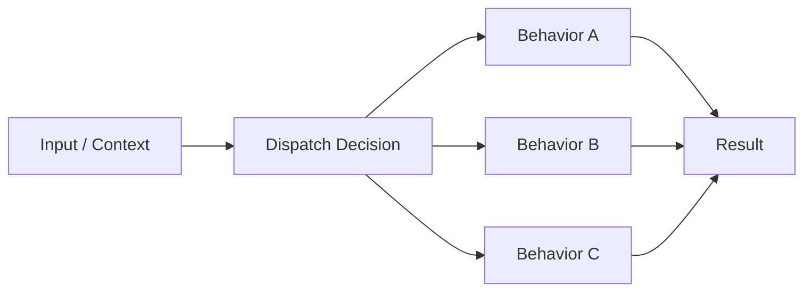
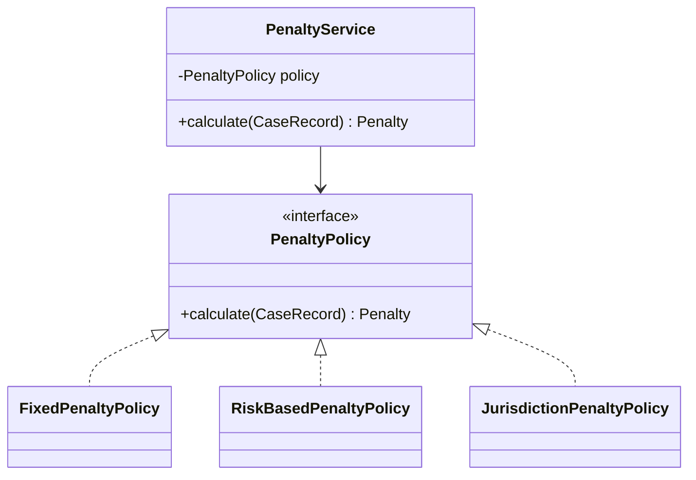
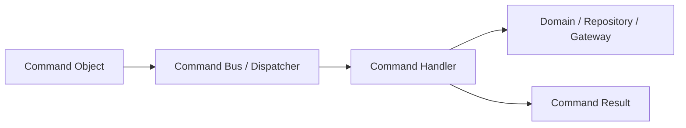
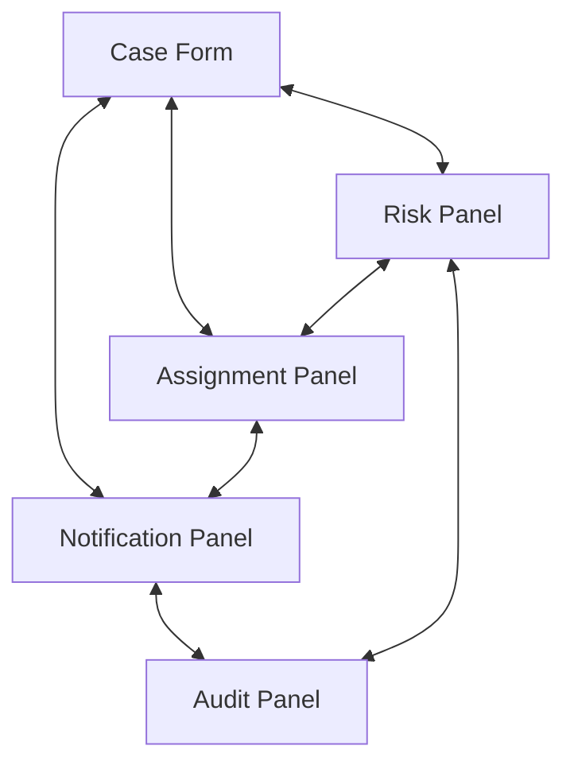
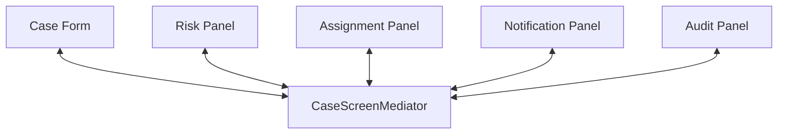
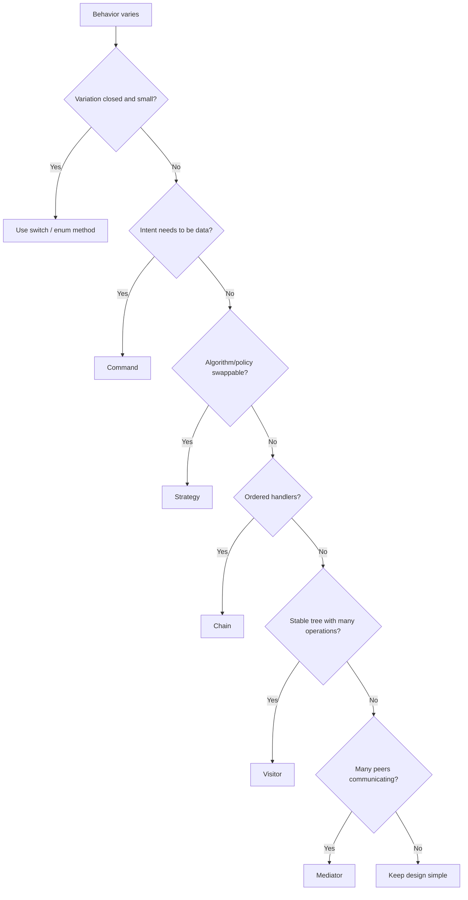

------
title: Learn Java Patterns - Part 006
description: Behavioral dispatch patterns untuk memilih, mengeksekusi, menggabungkan, dan memperluas perilaku di Java: strategy, command, template method, chain of responsibility, mediator, visitor, observer ringan, dan policy dispatch.
series: learn-java-patterns
seriesTitle: Learn Java Patterns, Data Patterns, Pipeline Patterns, Concurrency Patterns, Common Patterns, and Anti-Patterns
order: 6
partTitle: Behavioral Dispatch Patterns
tags:
- java
- patterns
- architecture
- advanced-java
- design-patterns
- behavioral-patterns
date: 2026-06-27
---

# Learn Java Patterns - Part 006: Behavioral Dispatch Patterns

## 1. Tujuan Part Ini

Part ini membahas **behavioral dispatch patterns**: pattern untuk menentukan perilaku mana yang dijalankan, kapan dijalankan, oleh siapa, dalam urutan apa, dan bagaimana hasilnya dikombinasikan.

Di sistem nyata, kompleksitas jarang hanya berasal dari struktur data. Kompleksitas sering muncul dari variasi perilaku:

- aturan penalty berbeda per violation type;
- eligibility berbeda per jurisdiction;
- escalation berbeda per risk profile;
- workflow action berbeda per state;
- validation berbeda per command;
- notification berbeda per event;
- approval berbeda per role;
- retry/fallback berbeda per external service;
- export berbeda per format;
- authorization berbeda per resource.

Jika variasi perilaku tidak dikendalikan, sistem berubah menjadi conditional jungle:

```java
if (type.equals("A") && risk.equals("HIGH") && user.hasRole("X")) {
    ...
} else if (type.equals("B") && region.equals("EU")) {
    ...
} else if (...) {
    ...
}
```

Behavioral pattern membantu mengubah conditional chaos menjadi model dispatch yang eksplisit.

> Behavioral pattern bukan cara menghindari `if`. Behavioral pattern adalah cara memberi struktur pada alasan mengapa perilaku berbeda.

---

## 2. Kaufman Lens: Sub-Skill yang Dilatih

Sub-skill utama pada part ini:

| Sub-Skill | Target Praktis |
|---|---|
| Variation recognition | Mengenali jenis variasi perilaku: algorithm, command, rule, workflow action, visitor operation |
| Dispatch design | Memilih mekanisme dispatch: polymorphism, map lookup, chain, visitor, mediator, event notification |
| Policy extraction | Memindahkan decision logic dari conditional ke policy object |
| Execution modeling | Memodelkan command, result, failure, retry, dan idempotency |
| Ordering reasoning | Menentukan apakah urutan handler penting |
| Side-effect control | Memisahkan pure decision dari effectful execution |
| Extensibility control | Membuka extension tanpa membuat behavior liar |
| Testability | Membuat perilaku bisa diuji secara isolated dan composable |

Target setelah part ini:

> Anda bisa melihat conditional besar dan tahu apakah harus memakai Strategy, Command, Chain, Template Method, Visitor, Mediator, atau cukup switch expression biasa.

---

## 3. Mental Model: Dispatch adalah Routing of Behavior

Dispatch berarti memilih target behavior berdasarkan informasi tertentu.



Dispatch bisa terjadi melalui:

| Mekanisme | Contoh |
|---|---|
| Polymorphism | `penaltyPolicy.calculate(case)` |
| Map lookup | `handlers.get(command.type()).handle(command)` |
| Switch expression | `switch (status) { ... }` |
| Chain | Handler mencoba satu per satu |
| Visitor | Operation dipilih berdasarkan concrete element type |
| Mediator | Object berbicara lewat koordinator |
| Event notification | Banyak listener bereaksi terhadap event |
| Template method | Skeleton tetap, step tertentu di-subclass |

Tidak semua dispatch butuh pattern rumit.

Switch kecil dan closed bisa lebih baik daripada hierarchy besar.

```java
return switch (riskLevel) {
    case LOW -> 1;
    case MEDIUM -> 2;
    case HIGH -> 3;
    case CRITICAL -> 4;
};
```

Pattern dibutuhkan saat variasi:

- sering berubah;
- butuh testing terpisah;
- butuh injection/configuration;
- memiliki dependency berbeda;
- punya lifecycle berbeda;
- perlu extension oleh modul lain;
- membuat conditional sulit dipahami.

---

## 4. Pattern 1: Strategy

### 4.1 Problem

Strategy dipakai saat satu behavior memiliki beberapa algorithm atau policy yang bisa dipertukarkan.

Problem intinya:

> Caller ingin menjalankan satu intent, tetapi cara menjalankannya bervariasi.

Contoh:

- penalty calculation policy;
- case assignment policy;
- prioritization policy;
- discount policy;
- fraud scoring algorithm;
- routing policy;
- retry backoff policy;
- serialization strategy;
- sorting/ranking strategy.

### 4.2 Strategy Structure



### 4.3 Java Example: Penalty Strategy

```java
public interface PenaltyPolicy {
    Penalty calculate(CaseRecord record);
}

public record Penalty(BigDecimal amount, String reason) {}

public final class FixedPenaltyPolicy implements PenaltyPolicy {
    private final BigDecimal amount;

    public FixedPenaltyPolicy(BigDecimal amount) {
        this.amount = Objects.requireNonNull(amount);
    }

    @Override
    public Penalty calculate(CaseRecord record) {
        return new Penalty(amount, "Fixed penalty");
    }
}

public final class RiskBasedPenaltyPolicy implements PenaltyPolicy {
    @Override
    public Penalty calculate(CaseRecord record) {
        BigDecimal base = new BigDecimal("1000");
        BigDecimal multiplier = switch (record.riskLevel()) {
            case LOW -> new BigDecimal("1.0");
            case MEDIUM -> new BigDecimal("1.5");
            case HIGH -> new BigDecimal("2.0");
            case CRITICAL -> new BigDecimal("3.0");
        };
        return new Penalty(base.multiply(multiplier), "Risk-based penalty");
    }
}
```

Service memakai policy:

```java
public final class PenaltyService {
    private final PenaltyPolicy penaltyPolicy;

    public PenaltyService(PenaltyPolicy penaltyPolicy) {
        this.penaltyPolicy = Objects.requireNonNull(penaltyPolicy);
    }

    public Penalty calculate(CaseRecord record) {
        return penaltyPolicy.calculate(record);
    }
}
```

### 4.4 Strategy Selection

Strategy bisa dipilih:

1. at construction time;
2. per request;
3. via registry;
4. via configuration;
5. via domain rule.

Per-request strategy registry:

```java
public final class PenaltyPolicyRegistry {
    private final Map<ViolationType, PenaltyPolicy> policies;

    public PenaltyPolicyRegistry(Map<ViolationType, PenaltyPolicy> policies) {
        this.policies = Map.copyOf(policies);
    }

    public PenaltyPolicy policyFor(ViolationType violationType) {
        PenaltyPolicy policy = policies.get(violationType);
        if (policy == null) {
            throw new IllegalArgumentException("No penalty policy for " + violationType);
        }
        return policy;
    }
}
```

Usage:

```java
PenaltyPolicy policy = registry.policyFor(record.violationType());
Penalty penalty = policy.calculate(record);
```

### 4.5 Strategy vs Simple Function

Kadang Strategy interface terlalu berat. Java functional interface bisa cukup.

```java
public final class PenaltyCalculator {
    private final Function<CaseRecord, Penalty> calculation;

    public PenaltyCalculator(Function<CaseRecord, Penalty> calculation) {
        this.calculation = Objects.requireNonNull(calculation);
    }

    public Penalty calculate(CaseRecord record) {
        return calculation.apply(record);
    }
}
```

Gunakan class Strategy jika:

- policy punya dependency;
- policy butuh nama/metadata;
- policy butuh test class terpisah;
- policy cukup kompleks;
- policy menjadi domain concept.

Gunakan lambda/function jika:

- behavior kecil;
- tidak banyak dependency;
- tidak perlu identity;
- tidak butuh traceability kuat.

### 4.6 Failure Modes

Strategy gagal saat:

- terlalu banyak strategy kecil tanpa naming meaningful;
- selection logic tetap tersebar di banyak tempat;
- policy object punya side effect tersembunyi;
- strategy terlalu generic;
- caller harus tahu semua strategy detail;
- registry tidak punya default/error policy jelas.

---

## 5. Pattern 2: Command

### 5.1 Problem

Command dipakai saat sebuah aksi perlu direpresentasikan sebagai object.

Problem intinya:

> Jadikan intent sebagai data yang bisa divalidasi, dijadwalkan, dicatat, diulang, dikirim, atau dibatalkan.

Contoh:

- create case command;
- assign investigator command;
- escalate case command;
- approve penalty command;
- send notification command;
- import batch command;
- retry failed integration command;
- compensate transaction command.

### 5.2 Command Mental Model

Command memisahkan:

- intent;
- handler;
- result;
- side effect;
- audit;
- authorization;
- idempotency;
- validation.



### 5.3 Java Example: Command and Handler

```java
public sealed interface CaseCommand permits AssignCaseCommand, EscalateCaseCommand {}

public record AssignCaseCommand(
        CaseId caseId,
        InvestigatorId investigatorId,
        String requestedBy
) implements CaseCommand {}

public record EscalateCaseCommand(
        CaseId caseId,
        EscalationReason reason,
        String requestedBy
) implements CaseCommand {}

public interface CommandHandler<C extends CaseCommand, R> {
    R handle(C command);
}

public final class AssignCaseHandler implements CommandHandler<AssignCaseCommand, AssignmentResult> {
    private final CaseRepository repository;
    private final AuthorizationService authorizationService;
    private final AuditLog auditLog;

    public AssignCaseHandler(
            CaseRepository repository,
            AuthorizationService authorizationService,
            AuditLog auditLog
    ) {
        this.repository = Objects.requireNonNull(repository);
        this.authorizationService = Objects.requireNonNull(authorizationService);
        this.auditLog = Objects.requireNonNull(auditLog);
    }

    @Override
    public AssignmentResult handle(AssignCaseCommand command) {
        authorizationService.requirePermission(
                command.requestedBy(),
                Permission.ASSIGN_CASE,
                command.caseId()
        );

        CaseRecord record = repository.findById(command.caseId()).orElseThrow();
        record.assignTo(command.investigatorId());
        repository.save(record);

        auditLog.append(AuditEvent.caseAssigned(
                command.caseId(),
                command.investigatorId(),
                command.requestedBy()
        ));

        return AssignmentResult.assigned(command.caseId(), command.investigatorId());
    }
}
```

### 5.4 Command Bus

Command bus bisa mengurangi coupling antara caller dan handler.

```java
public final class CommandBus {
    private final Map<Class<?>, CommandHandler<?, ?>> handlers;

    public CommandBus(Map<Class<?>, CommandHandler<?, ?>> handlers) {
        this.handlers = Map.copyOf(handlers);
    }

    @SuppressWarnings("unchecked")
    public <C extends CaseCommand, R> R dispatch(C command) {
        CommandHandler<C, R> handler = (CommandHandler<C, R>) handlers.get(command.getClass());
        if (handler == null) {
            throw new IllegalArgumentException("No handler for " + command.getClass().getName());
        }
        return handler.handle(command);
    }
}
```

Usage:

```java
AssignmentResult result = commandBus.dispatch(
        new AssignCaseCommand(caseId, investigatorId, currentUser.id())
);
```

### 5.5 Command Bus Trade-Off

Command bus membantu saat:

- banyak command;
- cross-cutting behavior konsisten;
- caller tidak perlu tahu handler;
- command bisa dicatat, di-retry, atau dikirim async;
- middleware seperti authorization, validation, transaction, metrics bisa distandardisasi.

Command bus berbahaya saat:

- dispatch menjadi magical;
- type safety hilang;
- stack trace sulit;
- dependency graph tersembunyi;
- handler discovery tidak jelas;
- semua use case dipaksa masuk satu abstraction.

### 5.6 Command vs Method Call

Tidak semua action butuh Command object.

Cukup method call jika:

- aksi sederhana;
- tidak perlu audit/retry/queue;
- tidak perlu uniform middleware;
- caller dan handler memang dekat;
- tidak ada value dari intent-as-data.

Gunakan Command jika intent perlu hidup sebagai entity data.

---

## 6. Pattern 3: Template Method

### 6.1 Problem

Template Method dipakai saat skeleton algorithm tetap, tetapi beberapa step dapat divariasikan oleh subclass.

Problem intinya:

> Urutan proses stabil, detail beberapa langkah berbeda.

Contoh:

- import file workflow;
- report generation;
- validation pipeline;
- approval workflow;
- document rendering;
- data export.

### 6.2 Java Example: Import Template

```java
public abstract class CaseImportTemplate {
    public final ImportResult importFile(Path path) {
        RawFile rawFile = read(path);
        List<RawRow> rows = parse(rawFile);
        List<CaseDraft> drafts = mapRows(rows);
        ValidationSummary validation = validate(drafts);

        if (validation.hasErrors()) {
            return ImportResult.rejected(validation);
        }

        persist(drafts);
        afterPersist(drafts);
        return ImportResult.accepted(drafts.size());
    }

    protected RawFile read(Path path) {
        // common file reading
        return RawFile.from(path);
    }

    protected abstract List<RawRow> parse(RawFile rawFile);

    protected abstract List<CaseDraft> mapRows(List<RawRow> rows);

    protected ValidationSummary validate(List<CaseDraft> drafts) {
        // common validation
        return ValidationSummary.ok();
    }

    protected abstract void persist(List<CaseDraft> drafts);

    protected void afterPersist(List<CaseDraft> drafts) {
        // optional hook
    }
}
```

CSV implementation:

```java
public final class CsvCaseImport extends CaseImportTemplate {
    @Override
    protected List<RawRow> parse(RawFile rawFile) {
        // CSV parse
        return List.of();
    }

    @Override
    protected List<CaseDraft> mapRows(List<RawRow> rows) {
        // CSV-specific mapping
        return List.of();
    }

    @Override
    protected void persist(List<CaseDraft> drafts) {
        // save drafts
    }
}
```

### 6.3 Template Method vs Strategy

Template Method uses inheritance. Strategy uses composition.

| Template Method | Strategy |
|---|---|
| Skeleton fixed in base class | Algorithm selected by composition |
| Variation via subclass override | Variation via injected object |
| Useful when lifecycle/order must be protected | Useful when behavior should be swappable |
| Can become fragile base class | More flexible but can need more wiring |

Prefer Strategy/composition when possible. Use Template Method when controlling sequence is the main value.

### 6.4 Failure Modes

Template Method gagal saat:

- base class terlalu banyak hook;
- subclass harus tahu internal sequence detail;
- overriding step melanggar invariant;
- inheritance hierarchy menjadi kaku;
- test sulit karena behavior tersebar antara base dan subclass;
- lifecycle berubah tetapi subclass lama tidak kompatibel.

Rule:

> Template Method cocok untuk framework-like flow kecil dan stabil. Jangan gunakan untuk domain variation yang sering berubah liar.

---

## 7. Pattern 4: Chain of Responsibility

### 7.1 Problem

Chain of Responsibility dipakai saat request dapat diproses oleh salah satu atau beberapa handler dalam urutan tertentu.

Problem intinya:

> Pengirim request tidak perlu tahu handler mana yang akan menangani.

Contoh:

- validation chain;
- authorization check chain;
- escalation rule chain;
- exception handler chain;
- message processing pipeline;
- support ticket routing;
- HTTP filter chain.

### 7.2 Two Types of Chain

Ada dua bentuk umum:

| Tipe | Behavior |
|---|---|
| First match wins | Handler pertama yang cocok menangani dan chain berhenti |
| Pipeline chain | Semua handler relevan berjalan berurutan |

Jangan campur tanpa eksplisit.

### 7.3 First Match Chain Example

```java
public interface EscalationHandler {
    boolean canHandle(CaseRecord record);
    EscalationDecision handle(CaseRecord record);
}

public final class CriticalRiskEscalationHandler implements EscalationHandler {
    @Override
    public boolean canHandle(CaseRecord record) {
        return record.riskLevel() == RiskLevel.CRITICAL;
    }

    @Override
    public EscalationDecision handle(CaseRecord record) {
        return EscalationDecision.escalateTo("Executive Enforcement Board");
    }
}

public final class HighValueEscalationHandler implements EscalationHandler {
    @Override
    public boolean canHandle(CaseRecord record) {
        return record.estimatedHarm().compareTo(new BigDecimal("1000000")) > 0;
    }

    @Override
    public EscalationDecision handle(CaseRecord record) {
        return EscalationDecision.escalateTo("Senior Investigation Team");
    }
}

public final class EscalationChain {
    private final List<EscalationHandler> handlers;

    public EscalationChain(List<EscalationHandler> handlers) {
        this.handlers = List.copyOf(handlers);
    }

    public EscalationDecision decide(CaseRecord record) {
        for (EscalationHandler handler : handlers) {
            if (handler.canHandle(record)) {
                return handler.handle(record);
            }
        }
        return EscalationDecision.noEscalation();
    }
}
```

### 7.4 Pipeline Chain Example

```java
public interface CaseValidationRule {
    void validate(CaseDraft draft, ValidationErrors errors);
}

public final class CaseValidator {
    private final List<CaseValidationRule> rules;

    public CaseValidator(List<CaseValidationRule> rules) {
        this.rules = List.copyOf(rules);
    }

    public ValidationResult validate(CaseDraft draft) {
        ValidationErrors errors = new ValidationErrors();
        for (CaseValidationRule rule : rules) {
            rule.validate(draft, errors);
        }
        return errors.toResult();
    }
}
```

This is chain-like, but not first-match. It is validation pipeline.

### 7.5 Ordering Is a Contract

Chain ordering is not implementation detail if result depends on order.

Bad:

```java
new EscalationChain(List.of(handlerA, handlerB, handlerC));
```

Better:

```java
public enum EscalationPriority {
    CRITICAL_RISK,
    HIGH_VALUE,
    REPEAT_OFFENDER,
    DEFAULT
}

public interface OrderedEscalationHandler extends EscalationHandler {
    EscalationPriority priority();
}
```

Sort once:

```java
this.handlers = handlers.stream()
        .sorted(Comparator.comparing(OrderedEscalationHandler::priority))
        .toList();
```

### 7.6 Failure Modes

Chain gagal saat:

- order implicit;
- handler punya side effect sebelum chain selesai;
- first-match dan pipeline semantics tercampur;
- no-handler case tidak jelas;
- handler terlalu banyak dan sulit trace;
- chain menjadi rule engine mini tanpa explainability;
- performance turun karena semua handler evaluate mahal.

---

## 8. Pattern 5: Mediator

### 8.1 Problem

Mediator dipakai saat banyak object saling berkomunikasi secara langsung sehingga dependency menjadi mesh.

Problem intinya:

> Kurangi many-to-many coupling dengan memperkenalkan koordinator.

Tanpa mediator:



Dengan mediator:



### 8.2 Java Example

```java
public final class CaseWorkflowMediator {
    private final CaseRepository repository;
    private final RiskScoringGateway riskScoringGateway;
    private final AssignmentPolicy assignmentPolicy;
    private final NotificationGateway notificationGateway;

    public CaseWorkflowMediator(
            CaseRepository repository,
            RiskScoringGateway riskScoringGateway,
            AssignmentPolicy assignmentPolicy,
            NotificationGateway notificationGateway
    ) {
        this.repository = Objects.requireNonNull(repository);
        this.riskScoringGateway = Objects.requireNonNull(riskScoringGateway);
        this.assignmentPolicy = Objects.requireNonNull(assignmentPolicy);
        this.notificationGateway = Objects.requireNonNull(notificationGateway);
    }

    public void onCaseSubmitted(CaseId caseId) {
        CaseRecord record = repository.findById(caseId).orElseThrow();
        RiskScore score = riskScoringGateway.score(record.toRiskProfile());
        Assignment assignment = assignmentPolicy.assign(record, score);

        record.assignTo(assignment.investigatorId());
        repository.save(record);

        notificationGateway.notifyAssignment(record.id(), assignment.investigatorId());
    }
}
```

### 8.3 Mediator vs Facade

| Mediator | Facade |
|---|---|
| Coordinates peer components | Simplifies subsystem access |
| Reduces many-to-many communication | Reduces caller complexity |
| Often event/callback driven | Often request/response use-case driven |
| Can become workflow brain | Can become God facade |

### 8.4 Failure Modes

Mediator gagal saat:

- semua logic pindah ke mediator;
- mediator menjadi God object;
- domain rule tersembunyi di coordination layer;
- event ordering tidak jelas;
- mediator terlalu banyak dependency;
- peer components menjadi passive dumb objects.

Mediator harus mengatur collaboration, bukan menyerap seluruh domain.

---

## 9. Pattern 6: Visitor

### 9.1 Problem

Visitor dipakai saat kita punya object structure relatif stabil, tetapi ingin menambahkan operation baru tanpa mengubah setiap caller.

Problem intinya:

> Pisahkan operasi dari object structure, terutama ketika operation bervariasi lebih sering daripada element type.

Contoh:

- expression tree evaluation;
- AST processing;
- rule tree rendering;
- document export;
- policy explanation;
- validation/reporting atas node hierarchy.

### 9.2 Classic Visitor Example

```java
public interface RuleVisitor<R> {
    R visitRoleRule(RoleRule rule);
    R visitRiskLimitRule(RiskLimitRule rule);
    R visitAllRule(AllRule rule);
}

public interface VisitableRule {
    <R> R accept(RuleVisitor<R> visitor);
}

public final class RoleRule implements VisitableRule {
    private final String role;

    public RoleRule(String role) {
        this.role = Objects.requireNonNull(role);
    }

    public String role() {
        return role;
    }

    @Override
    public <R> R accept(RuleVisitor<R> visitor) {
        return visitor.visitRoleRule(this);
    }
}

public final class RiskLimitRule implements VisitableRule {
    @Override
    public <R> R accept(RuleVisitor<R> visitor) {
        return visitor.visitRiskLimitRule(this);
    }
}

public final class AllRule implements VisitableRule {
    private final List<VisitableRule> children;

    public AllRule(List<VisitableRule> children) {
        this.children = List.copyOf(children);
    }

    public List<VisitableRule> children() {
        return children;
    }

    @Override
    public <R> R accept(RuleVisitor<R> visitor) {
        return visitor.visitAllRule(this);
    }
}
```

Visitor for rendering:

```java
public final class RuleDescriptionVisitor implements RuleVisitor<String> {
    @Override
    public String visitRoleRule(RoleRule rule) {
        return "requires role " + rule.role();
    }

    @Override
    public String visitRiskLimitRule(RiskLimitRule rule) {
        return "risk must be within limit";
    }

    @Override
    public String visitAllRule(AllRule rule) {
        return rule.children().stream()
                .map(child -> child.accept(this))
                .collect(Collectors.joining(" AND ", "(", ")"));
    }
}
```

### 9.3 Visitor with Sealed Types and Switch

Modern Java sealed types can reduce need for classic visitor in some cases.

```java
public sealed interface Rule permits RoleRule, RiskLimitRule, AllRule {}

public record RoleRule(String role) implements Rule {}

public record RiskLimitRule(BigDecimal limit) implements Rule {}

public record AllRule(List<Rule> children) implements Rule {
    public AllRule {
        children = List.copyOf(children);
    }
}
```

Renderer:

```java
public final class RuleRenderer {
    public String render(Rule rule) {
        return switch (rule) {
            case RoleRule roleRule -> "requires role " + roleRule.role();
            case RiskLimitRule riskRule -> "risk limit " + riskRule.limit();
            case AllRule allRule -> allRule.children().stream()
                    .map(this::render)
                    .collect(Collectors.joining(" AND ", "(", ")"));
        };
    }
}
```

Classic Visitor is still useful when:

- operations are numerous and need their own classes;
- double dispatch is valuable;
- language version or style avoids pattern matching;
- element classes should own dispatch;
- operation needs strong type-specific methods.

### 9.4 Visitor Trade-Off

Visitor makes adding operations easy, but adding new element types harder.

| Change | Visitor Cost |
|---|---|
| Add new operation | Add new visitor class |
| Add new element type | Update visitor interface and all visitors |

Visitor cocok jika object structure stabil.

---

## 10. Pattern 7: Observer Ringan

### 10.1 Problem

Observer dipakai saat satu event perlu memberi tahu beberapa subscriber tanpa producer tahu detail subscriber.

Problem intinya:

> Producer tidak seharusnya tergantung pada semua consumer.

Contoh:

- case opened event triggers audit, notification, indexing;
- penalty approved event triggers ledger, email, report update;
- user role changed event triggers permission cache invalidation;
- import completed event triggers summary notification.

### 10.2 In-Process Observer Example

```java
public interface DomainEvent {}

public record CaseOpenedEvent(CaseId caseId, Instant occurredAt) implements DomainEvent {}

public interface DomainEventListener<E extends DomainEvent> {
    void on(E event);
}

public final class InProcessEventPublisher {
    private final Map<Class<?>, List<DomainEventListener<?>>> listeners;

    public InProcessEventPublisher(Map<Class<?>, List<DomainEventListener<?>>> listeners) {
        this.listeners = Map.copyOf(listeners);
    }

    @SuppressWarnings("unchecked")
    public <E extends DomainEvent> void publish(E event) {
        List<DomainEventListener<?>> eventListeners = listeners.getOrDefault(
                event.getClass(),
                List.of()
        );

        for (DomainEventListener<?> listener : eventListeners) {
            ((DomainEventListener<E>) listener).on(event);
        }
    }
}
```

Listeners:

```java
public final class AuditCaseOpenedListener implements DomainEventListener<CaseOpenedEvent> {
    private final AuditLog auditLog;

    public AuditCaseOpenedListener(AuditLog auditLog) {
        this.auditLog = Objects.requireNonNull(auditLog);
    }

    @Override
    public void on(CaseOpenedEvent event) {
        auditLog.append(AuditEvent.caseOpened(event.caseId(), event.occurredAt()));
    }
}

public final class NotifyCaseOpenedListener implements DomainEventListener<CaseOpenedEvent> {
    private final NotificationGateway notificationGateway;

    public NotifyCaseOpenedListener(NotificationGateway notificationGateway) {
        this.notificationGateway = Objects.requireNonNull(notificationGateway);
    }

    @Override
    public void on(CaseOpenedEvent event) {
        notificationGateway.notifyCaseOpened(event.caseId());
    }
}
```

### 10.3 Observer Is Not Automatically Event-Driven Architecture

In-process observer is not the same as distributed messaging.

In-process observer:

- same process;
- usually same transaction boundary unless separated;
- failure can bubble up;
- ordering may be deterministic if list ordered;
- simple but coupled to runtime.

Distributed event-driven architecture:

- cross process;
- requires serialization;
- requires delivery semantics;
- needs idempotency;
- needs outbox/inbox;
- ordering and retries matter;
- consumer failures isolated.

Part 011 and 012 will cover event-driven and messaging patterns in depth. Here we only use Observer as behavioral dispatch.

### 10.4 Failure Modes

Observer gagal saat:

- listener side effect tidak terlihat;
- producer tidak tahu publish menyebabkan operasi mahal;
- listener failure membuat use case gagal tanpa disengaja;
- ordering antar listener penting tapi tidak dikontrol;
- event terlalu generic;
- event dipakai untuk menyembunyikan flow yang seharusnya eksplisit.

---

## 11. Pattern 8: Policy Dispatch

### 11.1 Problem

Policy dispatch adalah bentuk praktis yang sering muncul di enterprise systems: pilih policy berdasarkan context, lalu jalankan policy.

Ia menggabungkan Strategy, Specification, Registry, dan kadang Chain.

Contoh:

- authorization policy per resource;
- escalation policy per case type;
- penalty policy per regulation;
- retention policy per data category;
- notification policy per channel and severity.

### 11.2 Java Example: Policy Resolver

```java
public interface EscalationPolicy {
    boolean supports(CaseRecord record);
    EscalationDecision decide(CaseRecord record);
}

public final class RegulationBasedEscalationPolicy implements EscalationPolicy {
    private final RegulationCode regulationCode;

    public RegulationBasedEscalationPolicy(RegulationCode regulationCode) {
        this.regulationCode = Objects.requireNonNull(regulationCode);
    }

    @Override
    public boolean supports(CaseRecord record) {
        return record.regulationCode().equals(regulationCode);
    }

    @Override
    public EscalationDecision decide(CaseRecord record) {
        if (record.riskLevel() == RiskLevel.CRITICAL) {
            return EscalationDecision.escalateTo("Regulatory Board");
        }
        return EscalationDecision.noEscalation();
    }
}

public final class EscalationPolicyResolver {
    private final List<EscalationPolicy> policies;

    public EscalationPolicyResolver(List<EscalationPolicy> policies) {
        this.policies = List.copyOf(policies);
    }

    public EscalationPolicy resolve(CaseRecord record) {
        List<EscalationPolicy> matches = policies.stream()
                .filter(policy -> policy.supports(record))
                .toList();

        if (matches.isEmpty()) {
            throw new IllegalStateException("No escalation policy for " + record.regulationCode());
        }
        if (matches.size() > 1) {
            throw new IllegalStateException("Ambiguous escalation policies: " + matches.size());
        }
        return matches.getFirst();
    }
}
```

### 11.3 Ambiguity Must Be a First-Class Failure

Policy dispatch often fails because multiple policies match and the system silently picks the first.

Bad:

```java
return policies.stream()
        .filter(policy -> policy.supports(record))
        .findFirst()
        .orElse(defaultPolicy);
```

This hides ambiguity.

Better:

- no match is explicit;
- multiple matches are explicit;
- default policy is intentional;
- priority is documented;
- trace shows selected policy and reason.

```java
public record PolicyResolution<T>(
        T policy,
        String reason,
        List<String> evaluatedPolicies
) {}
```

Policy systems need explainability, especially when decisions affect enforcement, money, eligibility, or rights.

---

## 12. Choosing Dispatch Mechanism

| Situation | Candidate | Why |
|---|---|---|
| Small closed enum decision | Switch expression | Simple, readable, exhaustive |
| Algorithm varies and is swappable | Strategy | Behavior encapsulated behind common interface |
| Intent must be data | Command | Can validate, queue, audit, retry |
| Fixed process skeleton | Template Method | Sequence protected in base class |
| Ordered handlers | Chain of Responsibility | Dispatch through prioritized handlers |
| Many peer components communicate | Mediator | Reduces mesh coupling |
| Stable tree, many operations | Visitor | Add operations without scattering logic |
| One producer, many consumers | Observer | Decouple notification from consumers |
| Context chooses policy | Policy Resolver | Centralized and explainable selection |

---

## 13. Refactoring Conditional Logic

### 13.1 Starting Point

```java
public Penalty calculate(CaseRecord record) {
    if (record.violationType().equals("LATE_REPORTING")) {
        return new Penalty(new BigDecimal("500"), "Late reporting");
    }
    if (record.violationType().equals("MISREPRESENTATION")) {
        if (record.riskLevel() == RiskLevel.CRITICAL) {
            return new Penalty(new BigDecimal("10000"), "Critical misrepresentation");
        }
        return new Penalty(new BigDecimal("5000"), "Misrepresentation");
    }
    if (record.violationType().equals("DATA_BREACH")) {
        return new Penalty(record.estimatedHarm().multiply(new BigDecimal("0.1")), "Data breach");
    }
    throw new IllegalArgumentException("Unknown violation type");
}
```

### 13.2 Extract Policies

```java
public interface ViolationPenaltyPolicy {
    ViolationType violationType();
    Penalty calculate(CaseRecord record);
}
```

```java
public final class LateReportingPenaltyPolicy implements ViolationPenaltyPolicy {
    @Override
    public ViolationType violationType() {
        return ViolationType.LATE_REPORTING;
    }

    @Override
    public Penalty calculate(CaseRecord record) {
        return new Penalty(new BigDecimal("500"), "Late reporting");
    }
}
```

```java
public final class MisrepresentationPenaltyPolicy implements ViolationPenaltyPolicy {
    @Override
    public ViolationType violationType() {
        return ViolationType.MISREPRESENTATION;
    }

    @Override
    public Penalty calculate(CaseRecord record) {
        if (record.riskLevel() == RiskLevel.CRITICAL) {
            return new Penalty(new BigDecimal("10000"), "Critical misrepresentation");
        }
        return new Penalty(new BigDecimal("5000"), "Misrepresentation");
    }
}
```

### 13.3 Registry

```java
public final class ViolationPenaltyPolicyRegistry {
    private final Map<ViolationType, ViolationPenaltyPolicy> byType;

    public ViolationPenaltyPolicyRegistry(List<ViolationPenaltyPolicy> policies) {
        this.byType = policies.stream().collect(Collectors.toUnmodifiableMap(
                ViolationPenaltyPolicy::violationType,
                Function.identity()
        ));
    }

    public Penalty calculate(CaseRecord record) {
        ViolationPenaltyPolicy policy = byType.get(record.violationType());
        if (policy == null) {
            throw new IllegalArgumentException("No policy for " + record.violationType());
        }
        return policy.calculate(record);
    }
}
```

### 13.4 What Improved?

- each policy can be tested alone;
- new violation type does not modify giant method;
- registry centralizes dispatch;
- unknown type fails explicitly;
- policy names become domain vocabulary;
- code review can focus on one policy at a time.

### 13.5 What Did Not Automatically Improve?

- policy conflict still needs governance;
- too many policies can become hard to discover;
- registry wiring can become hidden magic;
- if policies share duplicated logic, extraction may be needed;
- if policy data changes often, code-based strategy may be wrong and a rule table may be better.

Pattern is not a free win. It moves complexity into a shape that should be easier to control.

---

## 14. Side Effects and Purity

A strong behavioral design separates **decision** from **execution**.

Bad:

```java
public final class EscalationPolicy {
    public void evaluate(CaseRecord record) {
        if (record.riskLevel() == RiskLevel.CRITICAL) {
            emailGateway.send(...);
            repository.save(...);
            auditLog.append(...);
        }
    }
}
```

Better:

```java
public final class EscalationPolicy {
    public EscalationDecision decide(CaseRecord record) {
        if (record.riskLevel() == RiskLevel.CRITICAL) {
            return EscalationDecision.escalateTo("Executive Board");
        }
        return EscalationDecision.noEscalation();
    }
}
```

Execution happens elsewhere:

```java
public final class EscalationExecutor {
    public void execute(CaseRecord record, EscalationDecision decision) {
        if (!decision.shouldEscalate()) {
            return;
        }
        record.escalate(decision.targetTeam());
        repository.save(record);
        notificationGateway.notifyEscalation(record.id(), decision.targetTeam());
        auditLog.append(AuditEvent.caseEscalated(record.id(), decision.targetTeam()));
    }
}
```

Benefits:

- policy is easy to unit test;
- execution side effects are explicit;
- decision can be audited before execution;
- retry semantics are clearer;
- compensation can be designed separately.

---

## 15. Dispatch Observability

Behavioral dispatch systems need traceability.

For each dispatch, log or capture:

- input classification;
- selected handler/policy;
- reason for selection;
- no-match or multi-match condition;
- execution duration;
- outcome;
- failure type;
- correlation ID.

Example:

```java
public record DispatchTrace(
        String dispatcher,
        String inputType,
        String selectedHandler,
        String reason,
        Duration duration,
        String outcome
) {}
```

For regulatory systems, traceability is not just debugging. It supports defensibility:

- why was a case escalated?
- which policy selected the investigator?
- which rule caused denial?
- what version of policy ran?
- what data was used?

---

## 16. Testing Behavioral Patterns

### 16.1 Strategy Test

```java
class RiskBasedPenaltyPolicyTest {
    @Test
    void criticalRiskGetsHighestMultiplier() {
        PenaltyPolicy policy = new RiskBasedPenaltyPolicy();
        CaseRecord record = CaseRecordFixture.withRisk(RiskLevel.CRITICAL);

        Penalty penalty = policy.calculate(record);

        assertEquals(new BigDecimal("3000.0"), penalty.amount());
    }
}
```

### 16.2 Command Handler Test

```java
class AssignCaseHandlerTest {
    @Test
    void assignsCaseAndWritesAudit() {
        InMemoryCaseRepository repository = new InMemoryCaseRepository();
        CapturingAuditLog auditLog = new CapturingAuditLog();
        AuthorizationService authorization = AuthorizationService.allowAll();

        CaseRecord record = CaseRecordFixture.open();
        repository.save(record);

        AssignCaseHandler handler = new AssignCaseHandler(repository, authorization, auditLog);

        AssignmentResult result = handler.handle(new AssignCaseCommand(
                record.id(),
                new InvestigatorId("inv-1"),
                "user-1"
        ));

        assertTrue(result.assigned());
        assertEquals(new InvestigatorId("inv-1"), repository.findById(record.id()).orElseThrow().investigatorId());
        assertTrue(auditLog.containsEvent("caseAssigned"));
    }
}
```

### 16.3 Chain Test

Test ordering explicitly.

```java
class EscalationChainTest {
    @Test
    void criticalRiskHandlerWinsBeforeHighValueHandler() {
        EscalationChain chain = new EscalationChain(List.of(
                new CriticalRiskEscalationHandler(),
                new HighValueEscalationHandler()
        ));

        CaseRecord record = CaseRecordFixture.criticalAndHighValue();

        EscalationDecision decision = chain.decide(record);

        assertEquals("Executive Enforcement Board", decision.targetTeam());
    }
}
```

### 16.4 Policy Resolver Test

Test no match and ambiguous match.

```java
class EscalationPolicyResolverTest {
    @Test
    void throwsWhenMultiplePoliciesMatch() {
        EscalationPolicy first = record -> true;
        EscalationPolicy second = record -> true;

        EscalationPolicyResolver resolver = new EscalationPolicyResolver(List.of(first, second));

        assertThrows(IllegalStateException.class,
                () -> resolver.resolve(CaseRecordFixture.open()));
    }
}
```

The exact code shape may differ, but the testing intent is critical: dispatch ambiguity must not be invisible.

---

## 17. Behavioral Anti-Patterns

### 17.1 Strategy Explosion

Too many tiny strategy classes can make code harder to navigate than a simple switch.

Symptom:

- 30 classes with one-line methods;
- no meaningful names;
- registry magic;
- business rules scattered.

Solution:

- group cohesive rules;
- use switch for closed simple variation;
- use data-driven config if variation is mostly data;
- reserve Strategy for behavior with real complexity.

### 17.2 Command Everything

Not every method call needs command object.

Over-commanding creates ceremony:

```text
GetUserNameCommand
GetUserNameCommandHandler
GetUserNameCommandResult
```

Use command when intent-as-data has value.

### 17.3 Chain Without Trace

A chain that silently selects handler is dangerous when decision matters.

Add trace:

```java
public record HandlerEvaluation(String handlerName, boolean matched, String reason) {}
```

### 17.4 Mediator God Object

Mediator that absorbs all business rules becomes worse than direct coupling.

### 17.5 Observer as Hidden Control Flow

If a listener performs core business action that caller depends on, event publication may hide essential control flow.

### 17.6 Visitor for Unstable Types

Visitor is painful if element types change often. Every new type breaks all visitors.

---

## 18. Practice Drill

### Drill 1: Replace Conditional with Strategy

Take a method with at least five branches. Classify each branch:

- same algorithm with parameter difference?
- different policy?
- different side effect?
- different validation rule?

Only extract Strategy for branches that represent real policy variation.

### Drill 2: Model Command Explicitly

Take one use case and create:

- command record;
- command handler;
- result type;
- validation rule;
- authorization point;
- audit event;
- idempotency key if relevant.

### Drill 3: Build Chain with Trace

Build an escalation chain that returns:

- selected handler;
- evaluated handlers;
- reason for match/no match;
- final decision.

### Drill 4: Split Decision from Execution

Take a policy class with side effects. Refactor into:

- pure decision object;
- executor object;
- audit trail.

### Drill 5: Visitor vs Switch

Build small rule tree with sealed interface. Implement:

1. classic visitor;
2. pattern-matching switch renderer.

Compare readability, extensibility, and change cost.

---

## 19. Review Checklist

Before choosing behavioral pattern, answer:

- What exactly varies?
- Is variation open or closed?
- Is dispatch based on type, data, state, priority, or event?
- Does behavior need dependency injection?
- Does intent need to be stored, queued, audited, retried, or serialized?
- Is ordering important?
- What happens if no handler matches?
- What happens if multiple handlers match?
- Are decisions separated from side effects?
- Is traceability required?
- Is a simple switch better?
- Are we reducing complexity or just distributing it across files?

---

## 20. Summary

Behavioral dispatch patterns organize how behavior is selected and executed.

- **Strategy** encapsulates interchangeable algorithms/policies.
- **Command** turns intent into an object that can be handled, audited, retried, queued, or validated.
- **Template Method** fixes process skeleton while allowing selected steps to vary.
- **Chain of Responsibility** routes request through ordered handlers.
- **Mediator** reduces many-to-many component coupling.
- **Visitor** separates operations from stable object structures.
- **Observer** notifies multiple consumers without direct producer dependency.
- **Policy Dispatch** centralizes context-based policy selection.

The main skill is not knowing the names. The main skill is diagnosing the variation:



A top-tier engineer does not replace every `if` with a pattern. They understand which `if` is accidental complexity, which `if` is clear domain logic, and which `if` is hiding a missing concept.

---

## 21. Transisi ke Part 007

Part berikutnya masuk ke **Domain Modeling Patterns**: Entity, Value Object, Aggregate, Domain Service, Specification, Policy, Domain Event, dan domain language.

Part 005 dan 006 membangun fondasi structure dan behavior. Part 007 akan mengikat keduanya ke domain model agar pattern tidak hanya menjadi technical abstraction, tetapi juga representasi aturan bisnis yang benar.
