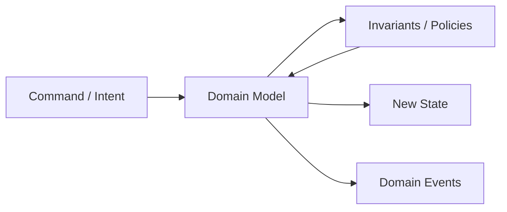
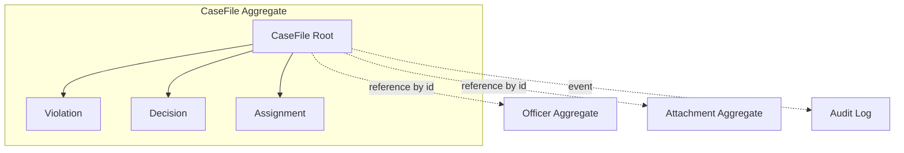
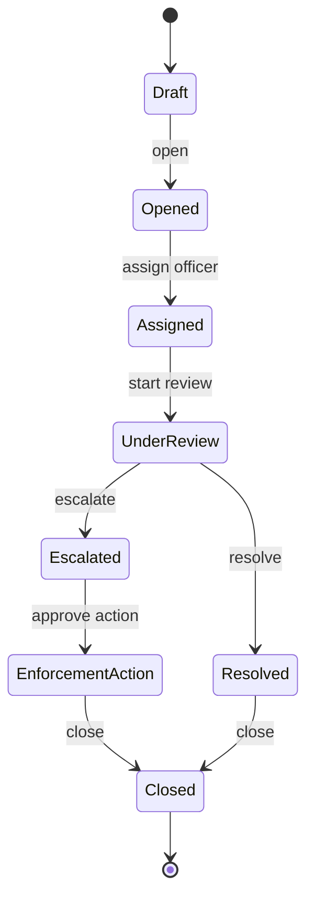
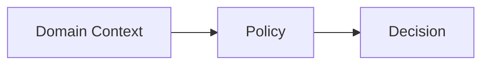
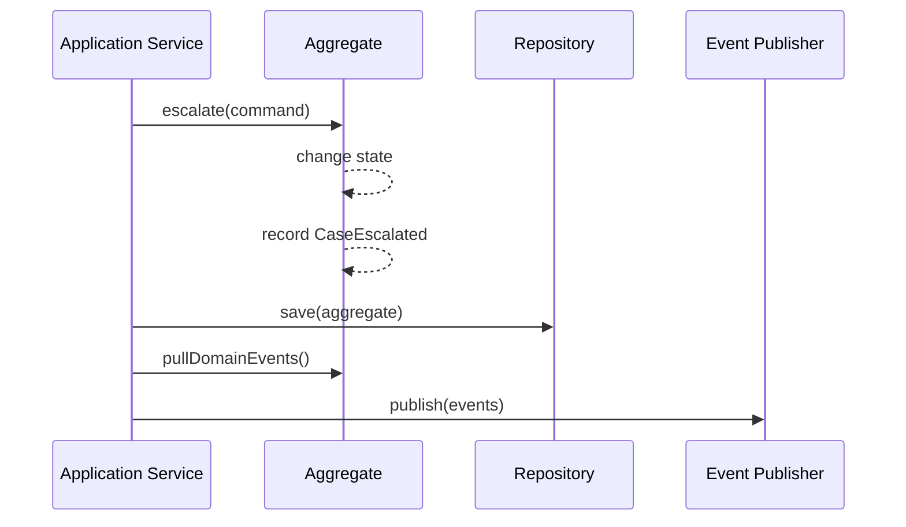

------
title: Learn Java Patterns - Part 007
description: Domain modeling patterns untuk membangun model domain Java yang menjaga invariant, lifecycle, policy, aggregate boundary, domain event, dan decision logic tanpa berubah menjadi anemic model atau god service.
series: learn-java-patterns
seriesTitle: Learn Java Patterns, Data Patterns, Pipeline Patterns, Concurrency Patterns, Common Patterns, and Anti-Patterns
order: 7
partTitle: Domain Modeling Patterns
tags:
- java
- patterns
- architecture
- advanced-java
- domain-driven-design
- domain-modeling
date: 2026-06-27
---

# Learn Java Patterns - Part 007: Domain Modeling Patterns

## 1. Tujuan Part Ini

Part ini membahas **domain modeling patterns**: cara memodelkan aturan bisnis, lifecycle, identity, state transition, dan keputusan domain agar sistem tidak hanya menjadi CRUD layer di atas database.

Di sistem production, domain model yang buruk biasanya tidak gagal karena syntax Java. Ia gagal karena:

- aturan bisnis tersebar di controller, service, validator, mapper, listener, job, dan stored procedure;
- object hanya menjadi data bag tanpa perilaku;
- semua perubahan melewati `CaseService` raksasa;
- validasi state tidak konsisten antar entry point;
- audit trail tidak menjelaskan mengapa keputusan terjadi;
- workflow dan lifecycle tidak punya model eksplisit;
- policy sulit diuji karena bercampur dengan I/O;
- boundary aggregate terlalu besar sehingga concurrency dan transaction menjadi mahal;
- boundary aggregate terlalu kecil sehingga invariant penting tidak terlindungi.

Domain modeling pattern membantu kita menjawab pertanyaan yang lebih fundamental daripada “class apa yang perlu dibuat?”

> Domain model yang baik adalah model yang membuat illegal state sulit terjadi, keputusan penting terlihat, dan perubahan aturan bisa dilakukan tanpa merusak seluruh sistem.

---

## 2. Kaufman Lens: Sub-Skill yang Dilatih

Berdasarkan pendekatan Josh Kaufman, kita tidak mulai dari katalog istilah DDD. Kita pecah kemampuan domain modeling menjadi sub-skill yang bisa dilatih.

| Sub-Skill | Target Praktis |
|---|---|
| Ubiquitous language extraction | Mengubah istilah domain menjadi object, action, state, dan event yang eksplisit |
| Invariant discovery | Menemukan aturan yang harus selalu benar, bukan hanya validasi form |
| Boundary selection | Menentukan entity mana yang harus konsisten dalam satu transaksi |
| Lifecycle modeling | Memodelkan status, transition, guard, dan terminal state |
| Behavior placement | Memutuskan apakah logic masuk entity, value object, aggregate, policy, specification, atau domain service |
| Pure decision separation | Memisahkan keputusan domain dari I/O, persistence, messaging, dan framework |
| Domain event design | Merekam fakta domain yang sudah terjadi tanpa mencampurnya dengan integration concern |
| Refactoring from CRUD | Mengubah transaction script/service procedural menjadi model domain bertahap |

Target setelah part ini:

> Anda bisa melihat requirement bisnis dan menentukan bagian mana yang seharusnya menjadi Value Object, Entity, Aggregate, Policy, Specification, Domain Service, atau Domain Event.

---

## 3. Mental Model: Domain Model adalah Executable Business Boundary

Domain model bukan sekadar representasi tabel.

Domain model adalah boundary yang menjalankan aturan.



Perhatikan urutannya.

Command masuk ke domain model. Domain model memeriksa invariant dan policy. Jika valid, state berubah dan event domain dicatat. Persistence, messaging, audit sink, dan external system adalah concern di luar domain decision.

Model domain yang kuat biasanya memiliki karakteristik berikut:

| Karakteristik | Arti |
|---|---|
| Intent-based API | Method menyatakan maksud bisnis, bukan setter teknis |
| Invariant internal | Object menjaga aturan pentingnya sendiri |
| Explicit lifecycle | State dan transition terlihat |
| Small transaction boundary | Aggregate tidak terlalu besar |
| Side-effect aware | Domain decision tidak langsung memanggil email, HTTP, queue, atau database |
| Testable without framework | Aturan bisa diuji tanpa Spring, database, Kafka, atau web server |

Contoh API yang lemah:

```java
caseRecord.setStatus("ESCALATED");
caseRecord.setEscalatedAt(Instant.now());
caseRecord.setEscalationReason(reason);
caseRepository.save(caseRecord);
```

Contoh API yang lebih kuat:

```java
caseFile.escalate(EscalationReason.of(reason), actor, clock.instant());
caseRepository.save(caseFile);
```

Perbedaannya bukan kosmetik. Pada versi pertama, caller bertanggung jawab menjaga aturan. Pada versi kedua, aggregate bertanggung jawab menjaga aturan.

---

## 4. Domain Object Taxonomy

Domain model biasanya terdiri dari beberapa jenis object. Kesalahan umum adalah memakai satu jenis object untuk semua hal.

| Pattern | Digunakan Untuk | Identity | Mutable? | Contoh |
|---|---|---:|---:|---|
| Value Object | Nilai bermakna dengan validasi | Tidak | Biasanya immutable | Money, Email, RiskScore, CaseNumber |
| Entity | Object dengan identity dan lifecycle | Ya | Bisa | CaseFile, Person, Inspection |
| Aggregate | Consistency boundary yang mengatur beberapa entity/value | Ya | Bisa | CaseFile dengan violations dan decisions |
| Aggregate Root | Entry point modifikasi aggregate | Ya | Bisa | CaseFile |
| Domain Service | Operasi domain yang tidak natural menjadi method entity/value | Tidak | Stateless | RiskClassificationService |
| Policy | Aturan keputusan yang bisa bervariasi | Tidak | Stateless | EscalationPolicy |
| Specification | Predicate domain yang bisa dikombinasikan | Tidak | Stateless | IsHighRiskCase |
| Domain Event | Fakta domain yang sudah terjadi | Event identity optional | Immutable | CaseEscalated |

Pattern ini bukan layer. Ini vocabulary untuk menempatkan logic.

---

## 5. Value Object Pattern

### 5.1 Problem

Primitive obsession membuat aturan domain tersembunyi di banyak tempat.

```java
public void assignOfficer(String officerEmail, String caseNumber, int riskScore) {
    if (officerEmail == null || !officerEmail.contains("@")) {
        throw new IllegalArgumentException("Invalid email");
    }
    if (riskScore < 0 || riskScore > 100) {
        throw new IllegalArgumentException("Invalid risk score");
    }
    ...
}
```

Masalahnya bukan hanya repetisi. Masalahnya adalah hilangnya makna.

`String` tidak mengatakan apakah ia email, case number, external reference, username, atau free text.

### 5.2 Mental Model

Value Object adalah **semantic type**.

Ia menjawab:

- nilai ini berarti apa;
- aturan validitasnya apa;
- operasi domain apa yang sah atas nilai ini;
- apakah dua nilai dianggap sama berdasarkan value, bukan identity.

### 5.3 Java Implementation dengan Record

```java
import java.util.Locale;
import java.util.Objects;
import java.util.regex.Pattern;

public record EmailAddress(String value) {
    private static final Pattern BASIC_EMAIL = Pattern.compile("^[^@\\s]+@[^@\\s]+\\.[^@\\s]+$");

    public EmailAddress {
        Objects.requireNonNull(value, "email value must not be null");
        var normalized = value.trim().toLowerCase(Locale.ROOT);
        if (!BASIC_EMAIL.matcher(normalized).matches()) {
            throw new IllegalArgumentException("Invalid email address: " + value);
        }
        value = normalized;
    }

    public String domain() {
        return value.substring(value.indexOf('@') + 1);
    }
}
```

Record cocok untuk banyak value object karena:

- immutable by default untuk component reference;
- equality berbasis value;
- compact constructor memusatkan validasi;
- representasi data kecil menjadi eksplisit.

Namun record bukan silver bullet. Jika value object punya invariant kompleks, derived state, atau collection mutable, tetap perlu desain hati-hati.

### 5.4 Value Object untuk Domain Decision

```java
public record RiskScore(int value) implements Comparable<RiskScore> {
    public RiskScore {
        if (value < 0 || value > 100) {
            throw new IllegalArgumentException("Risk score must be between 0 and 100");
        }
    }

    public boolean isHigh() {
        return value >= 75;
    }

    public boolean isCritical() {
        return value >= 90;
    }

    @Override
    public int compareTo(RiskScore other) {
        return Integer.compare(this.value, other.value);
    }
}
```

Keputusan `isHigh()` lebih baik hidup dekat dengan konsep risk daripada tersebar sebagai `score >= 75` di banyak tempat.

### 5.5 Failure Modes

| Failure Mode | Gejala | Koreksi |
|---|---|---|
| Value object terlalu tipis | Hanya wrapper tanpa validasi/behavior | Tambahkan invariant dan operation bermakna |
| Value object terlalu pintar | Memanggil repository/API/framework | Pindahkan ke domain service/application service |
| Equality salah | Menggunakan identity untuk nilai | Pastikan equality berbasis value |
| Mutable inner collection | Record terlihat immutable tapi isi list bisa berubah | Copy defensively dengan `List.copyOf` |

Contoh defensive copy:

```java
import java.util.List;

public record ViolationCodes(List<String> values) {
    public ViolationCodes {
        if (values == null || values.isEmpty()) {
            throw new IllegalArgumentException("At least one violation code is required");
        }
        values = List.copyOf(values);
    }
}
```

---

## 6. Entity Pattern

### 6.1 Problem

Beberapa object tidak didefinisikan oleh atributnya, tetapi oleh identity dan lifecycle.

Dua case bisa punya atribut sama, tetapi tetap dua case berbeda.

```java
CaseFile caseA = new CaseFile(CaseId.of("C-100"));
CaseFile caseB = new CaseFile(CaseId.of("C-101"));
```

Entity adalah object yang tetap “sama” selama identity-nya sama, walaupun state berubah.

### 6.2 Entity Identity Rule

Entity equality perlu hati-hati.

Untuk domain entity yang persisted, umumnya identity domain lebih aman daripada equality semua field.

```java
public final class Officer {
    private final OfficerId id;
    private String displayName;
    private EmailAddress email;

    public Officer(OfficerId id, String displayName, EmailAddress email) {
        this.id = Objects.requireNonNull(id);
        this.displayName = requireText(displayName);
        this.email = Objects.requireNonNull(email);
    }

    public OfficerId id() {
        return id;
    }

    public void changeEmail(EmailAddress newEmail) {
        this.email = Objects.requireNonNull(newEmail);
    }

    @Override
    public boolean equals(Object other) {
        return other instanceof Officer officer && id.equals(officer.id);
    }

    @Override
    public int hashCode() {
        return id.hashCode();
    }

    private static String requireText(String value) {
        if (value == null || value.isBlank()) {
            throw new IllegalArgumentException("Text must not be blank");
        }
        return value.trim();
    }
}
```

### 6.3 Entity API: Intent, Not Setter

Setter membuka terlalu banyak kemungkinan.

```java
caseFile.setStatus(CLOSED);
caseFile.setClosedAt(now);
caseFile.setClosureReason(reason);
```

Method intent lebih aman:

```java
caseFile.close(ClosureReason.resolved(), actor, now);
```

Method domain bisa memeriksa:

- apakah case sudah closed;
- apakah actor punya authority;
- apakah required decision sudah ada;
- apakah closure reason valid;
- apakah timestamp masuk akal;
- event apa yang perlu dicatat.

### 6.4 Failure Modes

| Failure Mode | Gejala | Koreksi |
|---|---|---|
| Entity menjadi DTO | Field public/getter-setter tanpa behavior | Tambahkan method intent dan invariant |
| Entity memanggil infrastructure | Entity memanggil repository, HTTP, Kafka | Pindahkan orchestration ke application service |
| Equality berubah saat field berubah | Entity dipakai di `HashSet`, lalu field equality berubah | Equality berbasis identity immutable |
| Constructor membiarkan invalid state | Object dibuat tidak valid lalu diisi bertahap | Gunakan factory/builder dengan invariant |

---

## 7. Aggregate Pattern

### 7.1 Problem

Dalam sistem kompleks, kita perlu tahu object mana yang harus konsisten bersama.

Contoh case management:

- case punya status;
- case punya daftar violation;
- case punya assignment officer;
- case punya decision;
- case punya escalation;
- case punya notes;
- case punya attachments;
- case punya audit trail.

Apakah semua harus berada dalam satu aggregate?

Tidak selalu.

Aggregate adalah **transactional consistency boundary**, bukan sekadar object graph.

### 7.2 Mental Model



Di dalam aggregate, invariant bisa dijaga secara synchronous dalam satu transaction.

Di luar aggregate, invariant biasanya harus dijaga dengan eventual consistency, process manager, saga, atau policy async.

### 7.3 Aggregate Root Rule

Modifikasi aggregate harus melewati aggregate root.

```java
public final class CaseFile {
    private final CaseId id;
    private CaseStatus status;
    private RiskScore riskScore;
    private OfficerId assignedOfficerId;
    private final List<Violation> violations;
    private final List<DomainEvent> domainEvents = new ArrayList<>();

    private CaseFile(CaseId id, RiskScore riskScore, List<Violation> violations) {
        this.id = Objects.requireNonNull(id);
        this.riskScore = Objects.requireNonNull(riskScore);
        this.violations = new ArrayList<>(violations);
        this.status = CaseStatus.OPEN;
    }

    public static CaseFile open(CaseId id, RiskScore riskScore, List<Violation> violations, Instant now) {
        if (violations == null || violations.isEmpty()) {
            throw new IllegalArgumentException("Case must have at least one violation");
        }
        var caseFile = new CaseFile(id, riskScore, violations);
        caseFile.record(new CaseOpened(id, now));
        return caseFile;
    }

    public void assignTo(OfficerId officerId, Actor actor, Instant now) {
        requireOpen();
        requireAuthorized(actor, "ASSIGN_CASE");
        this.assignedOfficerId = Objects.requireNonNull(officerId);
        record(new CaseAssigned(id, officerId, actor.id(), now));
    }

    public void escalate(EscalationReason reason, Actor actor, Instant now) {
        requireOpen();
        requireAuthorized(actor, "ESCALATE_CASE");
        if (!riskScore.isHigh()) {
            throw new DomainRuleViolation("Only high-risk cases can be escalated");
        }
        this.status = CaseStatus.ESCALATED;
        record(new CaseEscalated(id, reason, actor.id(), now));
    }

    public List<DomainEvent> pullDomainEvents() {
        var copy = List.copyOf(domainEvents);
        domainEvents.clear();
        return copy;
    }

    private void requireOpen() {
        if (status != CaseStatus.OPEN) {
            throw new DomainRuleViolation("Case is not open: " + status);
        }
    }

    private static void requireAuthorized(Actor actor, String permission) {
        if (!actor.hasPermission(permission)) {
            throw new DomainRuleViolation("Actor lacks permission: " + permission);
        }
    }

    private void record(DomainEvent event) {
        domainEvents.add(event);
    }
}
```

### 7.4 Aggregate Size Heuristic

Aggregate terlalu besar:

- transaction lama;
- locking berat;
- conflict tinggi;
- object graph sulit dimuat;
- concurrency rendah;
- perubahan kecil menyentuh banyak state.

Aggregate terlalu kecil:

- invariant penting tidak terjaga;
- terlalu banyak orchestration di service;
- race condition antar aggregate;
- eventual consistency dipakai untuk aturan yang sebenarnya harus kuat.

Gunakan pertanyaan ini:

| Pertanyaan | Implikasi |
|---|---|
| Apakah aturan ini harus selalu benar segera setelah command selesai? | Kandidat satu aggregate |
| Apakah object ini sering berubah bersamaan? | Kandidat satu aggregate |
| Apakah conflict update tinggi jika digabung? | Pecah aggregate |
| Apakah object hanya perlu direferensikan? | Referensi by ID, bukan object langsung |
| Apakah aturan bisa diperbaiki async? | Bisa lintas aggregate |

### 7.5 Aggregate Boundary untuk Regulatory Case

Misalnya ada regulatory case dengan enforcement lifecycle:



Pertanyaan aggregate:

- Apakah `CaseFile` dan `EnforcementAction` harus konsisten dalam satu transaction?
- Apakah `Attachment` perlu berada di aggregate yang sama?
- Apakah `AuditEntry` perlu menjadi child entity atau append-only log terpisah?
- Apakah `Officer` entity perlu dimuat, atau cukup `OfficerId`?
- Apakah `CaseNote` mempengaruhi lifecycle invariant?

Kemungkinan desain:

| Concept | Boundary |
|---|---|
| CaseFile | Aggregate root utama untuk lifecycle case |
| Violation | Child entity/value di dalam CaseFile jika mempengaruhi decision |
| Decision | Child entity jika decision tidak hidup tanpa case |
| EnforcementAction | Aggregate terpisah jika punya lifecycle, approval, dan ownership sendiri |
| Attachment | Aggregate/resource terpisah, direferensikan by ID |
| AuditLog | Append-only stream terpisah berdasarkan domain event |
| Officer | Aggregate terpisah, direferensikan by OfficerId |

---

## 8. Invariant Pattern

### 8.1 Problem

Validasi sering disalahartikan sebagai form checking.

Padahal invariant adalah aturan yang harus selalu benar untuk menjaga integritas domain.

Contoh validasi form:

- `name` tidak kosong;
- `email` format valid;
- `riskScore` antara 0 dan 100.

Contoh invariant domain:

- closed case tidak boleh menerima new violation;
- case tidak boleh escalated tanpa assigned officer;
- enforcement action tidak boleh approved oleh officer yang sama dengan creator;
- penalty final tidak boleh lebih rendah dari minimum statutory penalty;
- decision tidak boleh diubah setelah notification dikirim.

### 8.2 Kategori Invariant

| Jenis Invariant | Contoh | Lokasi Umum |
|---|---|---|
| Value invariant | Risk score 0..100 | Value object |
| Entity invariant | Closed case tidak bisa reopen tanpa reason | Entity/Aggregate |
| Aggregate invariant | Case tidak bisa close tanpa decision | Aggregate root |
| Cross-aggregate invariant | Officer tidak boleh punya > N active critical cases | Domain service / process / policy |
| Temporal invariant | Appeal hanya boleh dalam 14 hari | Policy + clock |
| Authorization invariant | Actor harus punya permission | Policy / aggregate guard |
| Regulatory invariant | Action harus defensible dan auditable | Aggregate + audit/event |

### 8.3 Invariant Placement

```java
public void close(ClosureReason reason, Actor actor, Instant now) {
    requireAssigned();
    requireAtLeastOneDecision();
    requireNotEscalatedWithoutAction();
    requireAuthorized(actor, "CLOSE_CASE");

    this.status = CaseStatus.CLOSED;
    record(new CaseClosed(id, reason, actor.id(), now));
}
```

Beberapa invariant boleh berada di aggregate. Tetapi jika invariant membutuhkan query besar atau external system, jangan paksa masuk entity.

Contoh cross-aggregate policy:

```java
public final class AssignmentApplicationService {
    private final CaseRepository caseRepository;
    private final OfficerWorkloadRepository workloadRepository;
    private final AssignmentPolicy assignmentPolicy;
    private final Clock clock;

    public void assign(AssignCaseCommand command) {
        var caseFile = caseRepository.get(command.caseId());
        var workload = workloadRepository.get(command.officerId());

        assignmentPolicy.checkAssignable(caseFile, workload, command.actor());

        caseFile.assignTo(command.officerId(), command.actor(), clock.instant());
        caseRepository.save(caseFile);
    }
}
```

`AssignmentPolicy` membuat keputusan domain. Application service mengorkestrasi loading dan saving.

---

## 9. Domain Service Pattern

### 9.1 Problem

Tidak semua behavior natural berada di satu entity.

Contoh:

- menghitung risk classification berdasarkan case, history, dan regulatory profile;
- menentukan assignment officer berdasarkan workload dan jurisdiction;
- mengevaluasi eligibility enforcement action berdasarkan beberapa aggregate;
- menghitung penalty berdasarkan matrix policy yang berubah per periode.

Jika logic dipaksa masuk entity, entity jadi terlalu besar atau membutuhkan dependency infrastructure.

### 9.2 Mental Model

Domain service adalah **stateless domain operation**.

Ia berbeda dari application service.

| Jenis Service | Tanggung Jawab |
|---|---|
| Application Service | Transaction boundary, orchestration, repository, command handling |
| Domain Service | Keputusan/operasi domain yang tidak natural dimiliki satu entity |
| Infrastructure Service | Email, HTTP client, database adapter, queue producer |

### 9.3 Java Example

```java
public final class EscalationEligibilityService {
    private final EscalationPolicy policy;

    public EscalationEligibilityService(EscalationPolicy policy) {
        this.policy = Objects.requireNonNull(policy);
    }

    public EscalationDecision evaluate(CaseFile caseFile, OfficerWorkload workload, Instant now) {
        if (caseFile.isClosed()) {
            return EscalationDecision.rejected("Closed case cannot be escalated");
        }
        if (!caseFile.riskScore().isHigh()) {
            return EscalationDecision.rejected("Risk score is not high enough");
        }
        if (!policy.withinEscalationWindow(caseFile, now)) {
            return EscalationDecision.rejected("Escalation window has expired");
        }
        if (workload.isOverloaded()) {
            return EscalationDecision.rejected("Assigned officer is overloaded");
        }
        return EscalationDecision.approved();
    }
}
```

### 9.4 Domain Service Smell

Domain service bisa menjadi tempat sampah baru.

Warning signs:

- namanya terlalu generik: `CaseDomainService`, `CaseManager`, `CaseProcessor`;
- punya banyak dependency repository;
- method tidak punya konsep domain yang jelas;
- hanya pass-through ke entity;
- memuat banyak branching unrelated;
- sulit diuji tanpa Spring context.

Domain service yang baik punya nama spesifik dan API kecil.

---

## 10. Policy Pattern

### 10.1 Problem

Aturan bisnis sering berubah dan sering bervariasi.

Contoh:

- escalation threshold berbeda per risk category;
- approval rule berbeda per jurisdiction;
- penalty calculation berbeda per regulation version;
- SLA berbeda per case type;
- notification rule berbeda per enforcement stage.

Jika aturan ditanam di aggregate, aggregate menjadi sering berubah dan sulit dikontrol.

### 10.2 Mental Model

Policy adalah object yang merepresentasikan aturan keputusan.



Policy idealnya:

- stateless;
- deterministic;
- mudah diuji;
- punya input eksplisit;
- menghasilkan decision object, bukan langsung side effect;
- bisa di-versioning jika aturan regulasi berubah.

### 10.3 Java Example

```java
public interface EscalationPolicy {
    EscalationDecision decide(EscalationContext context);
}

public record EscalationContext(
        CaseStatus status,
        RiskScore riskScore,
        boolean assigned,
        Duration age,
        Jurisdiction jurisdiction
) {}

public record EscalationDecision(boolean approved, String reason) {
    public static EscalationDecision approved() {
        return new EscalationDecision(true, "Approved");
    }

    public static EscalationDecision rejected(String reason) {
        return new EscalationDecision(false, reason);
    }
}

public final class DefaultEscalationPolicy implements EscalationPolicy {
    @Override
    public EscalationDecision decide(EscalationContext context) {
        if (context.status() != CaseStatus.OPEN) {
            return EscalationDecision.rejected("Case must be open");
        }
        if (!context.assigned()) {
            return EscalationDecision.rejected("Case must be assigned first");
        }
        if (!context.riskScore().isHigh()) {
            return EscalationDecision.rejected("Risk score is below escalation threshold");
        }
        return EscalationDecision.approved();
    }
}
```

Aggregate bisa memakai policy tanpa tahu detail rule:

```java
public void escalate(EscalationPolicy policy, Actor actor, Instant now) {
    var context = new EscalationContext(
            status,
            riskScore,
            assignedOfficerId != null,
            Duration.between(openedAt, now),
            jurisdiction
    );

    var decision = policy.decide(context);
    if (!decision.approved()) {
        throw new DomainRuleViolation(decision.reason());
    }

    this.status = CaseStatus.ESCALATED;
    record(new CaseEscalated(id, decision.reason(), actor.id(), now));
}
```

### 10.4 Policy Versioning

Untuk domain regulasi, policy version sangat penting.

```java
public interface PenaltyPolicy {
    RegulationVersion version();

    Penalty calculate(PenaltyContext context);
}
```

Simpan version yang dipakai dalam decision:

```java
public record PenaltyCalculated(
        CaseId caseId,
        Money amount,
        RegulationVersion policyVersion,
        OfficerId calculatedBy,
        Instant occurredAt
) implements DomainEvent {}
```

Ini membuat keputusan defensible: kita bisa menjelaskan aturan versi mana yang dipakai pada saat keputusan dibuat.

---

## 11. Specification Pattern

### 11.1 Problem

Beberapa aturan berbentuk predicate dan perlu dikombinasikan.

Contoh:

- case high risk;
- case belum assigned;
- case berada di jurisdiction tertentu;
- case melewati SLA;
- case punya violation tertentu;
- actor boleh approve.

Jika predicate tersebar sebagai `if`, reuse dan testability buruk.

### 11.2 Specification Interface

```java
@FunctionalInterface
public interface Specification<T> {
    boolean isSatisfiedBy(T candidate);

    default Specification<T> and(Specification<T> other) {
        return candidate -> this.isSatisfiedBy(candidate) && other.isSatisfiedBy(candidate);
    }

    default Specification<T> or(Specification<T> other) {
        return candidate -> this.isSatisfiedBy(candidate) || other.isSatisfiedBy(candidate);
    }

    default Specification<T> not() {
        return candidate -> !this.isSatisfiedBy(candidate);
    }
}
```

Contoh specification:

```java
public final class HighRiskCaseSpec implements Specification<CaseFile> {
    @Override
    public boolean isSatisfiedBy(CaseFile candidate) {
        return candidate.riskScore().isHigh();
    }
}

public final class OpenCaseSpec implements Specification<CaseFile> {
    @Override
    public boolean isSatisfiedBy(CaseFile candidate) {
        return candidate.status() == CaseStatus.OPEN;
    }
}
```

Komposisi:

```java
var eligibleForEscalation = new OpenCaseSpec()
        .and(new HighRiskCaseSpec())
        .and(new AssignedCaseSpec());

if (!eligibleForEscalation.isSatisfiedBy(caseFile)) {
    throw new DomainRuleViolation("Case is not eligible for escalation");
}
```

### 11.3 Specification vs Policy

| Aspect | Specification | Policy |
|---|---|---|
| Output | Boolean | Decision/result kaya informasi |
| Cocok untuk | Eligibility sederhana, filter, predicate | Keputusan dengan reason, calculation, version |
| Komposisi | `and/or/not` | Strategy/chain/table/rule matrix |
| Risiko | Boolean kehilangan alasan | Bisa terlalu besar |

Jika user perlu tahu mengapa gagal, gunakan decision object atau policy, bukan boolean specification polos.

---

## 12. Domain Event Pattern

### 12.1 Problem

Sistem perlu tahu bahwa sesuatu telah terjadi:

- case opened;
- case assigned;
- case escalated;
- decision approved;
- notification sent;
- enforcement action closed.

Tanpa domain event, side effect sering ditempel langsung di method domain:

```java
public void escalate(...) {
    this.status = ESCALATED;
    emailClient.send(...);
    auditRepository.save(...);
    kafkaTemplate.send(...);
}
```

Ini buruk karena domain object bergantung pada infrastructure.

### 12.2 Mental Model

Domain event adalah fakta domain yang sudah terjadi.



Domain event tidak harus langsung berarti Kafka event. Domain event adalah fakta internal domain. Integration event adalah kontrak keluar sistem. Keduanya boleh berbeda.

### 12.3 Java Example

```java
public sealed interface DomainEvent permits CaseOpened, CaseAssigned, CaseEscalated {
    Instant occurredAt();
}

public record CaseOpened(CaseId caseId, Instant occurredAt) implements DomainEvent {}

public record CaseAssigned(
        CaseId caseId,
        OfficerId officerId,
        ActorId assignedBy,
        Instant occurredAt
) implements DomainEvent {}

public record CaseEscalated(
        CaseId caseId,
        EscalationReason reason,
        ActorId escalatedBy,
        Instant occurredAt
) implements DomainEvent {}
```

Aggregate menyimpan event sementara:

```java
private final List<DomainEvent> domainEvents = new ArrayList<>();

private void record(DomainEvent event) {
    domainEvents.add(event);
}

public List<DomainEvent> pullDomainEvents() {
    var copy = List.copyOf(domainEvents);
    domainEvents.clear();
    return copy;
}
```

### 12.4 Domain Event Failure Modes

| Failure Mode | Gejala | Koreksi |
|---|---|---|
| Event sebagai command terselubung | `EscalateCaseEvent` berarti instruksi, bukan fakta | Gunakan past tense: `CaseEscalated` |
| Event terlalu teknis | `CaseTableUpdated` | Pakai bahasa domain |
| Event terlalu besar | Snapshot seluruh aggregate | Kirim fakta minimal + reference ID |
| Event langsung dipublish dari entity | Entity butuh Kafka/email dependency | Record event, publish di application layer |
| Domain event = integration event | Internal model bocor ke external contract | Map ke integration event eksplisit |

---

## 13. Domain Exception dan Result Pattern

### 13.1 Problem

Ketika rule gagal, bagaimana domain memberi tahu caller?

Ada dua pendekatan umum:

1. throw exception untuk rule violation;
2. return decision/result object.

Keduanya valid, tergantung konteks.

### 13.2 Exception untuk Guard Keras

```java
public final class DomainRuleViolation extends RuntimeException {
    public DomainRuleViolation(String message) {
        super(message);
    }
}
```

Cocok ketika:

- caller tidak diharapkan melanjutkan;
- violation adalah illegal operation;
- API domain ingin menjaga invariant keras;
- failure bukan bagian dari branching normal yang kompleks.

### 13.3 Result untuk Decision yang Perlu Dijelaskan

```java
public sealed interface Decision permits Decision.Approved, Decision.Rejected {
    record Approved() implements Decision {}
    record Rejected(String reason) implements Decision {}
}
```

Cocok ketika:

- UI perlu menampilkan alasan;
- workflow punya beberapa cabang;
- rule engine/policy menghasilkan banyak possible outcome;
- keputusan perlu diaudit.

### 13.4 Practical Rule

| Situation | Prefer |
|---|---|
| Invariant internal dilanggar | Exception |
| Eligibility check untuk user decision | Result |
| Policy calculation dengan reason | Result |
| Bug/programmer error | Exception |
| Batch validation banyak error | Result dengan daftar violation |

---

## 14. Application Service vs Domain Model

### 14.1 Problem

Banyak Java application berakhir dengan service procedural:

```java
@Transactional
public void escalate(String caseId, String reason, String actorId) {
    var entity = repository.findById(caseId).orElseThrow();
    if (!entity.getStatus().equals("OPEN")) throw ...;
    if (entity.getRiskScore() < 75) throw ...;
    entity.setStatus("ESCALATED");
    entity.setReason(reason);
    repository.save(entity);
    audit.save(...);
    notification.send(...);
}
```

Ini disebut transaction script. Kadang cukup. Tetapi untuk domain kompleks, ia membuat logic tersebar dan sulit diuji.

### 14.2 Better Split

```java
public final class EscalateCaseUseCase {
    private final CaseRepository caseRepository;
    private final EscalationPolicy escalationPolicy;
    private final DomainEventPublisher eventPublisher;
    private final Clock clock;

    @Transactional
    public void handle(EscalateCaseCommand command) {
        var caseFile = caseRepository.get(command.caseId());
        caseFile.escalate(escalationPolicy, command.reason(), command.actor(), clock.instant());
        caseRepository.save(caseFile);
        eventPublisher.publish(caseFile.pullDomainEvents());
    }
}
```

Application service bertugas:

- membuka transaction;
- load aggregate;
- load dependency input yang dibutuhkan policy;
- memanggil domain behavior;
- save aggregate;
- publish event;
- melakukan authorization coarse-grained jika perlu.

Domain model bertugas:

- menjaga invariant;
- menjalankan transition;
- membuat keputusan domain;
- merekam event domain;
- menyembunyikan state mutation internal.

---

## 15. Rich Domain Model vs Anemic Domain Model

### 15.1 Anemic Model

Anemic model adalah object domain yang hanya berisi data, sementara semua behavior berada di service.

```java
public class CaseEntity {
    private String status;
    private int riskScore;
    private String assignedOfficerId;
    private String escalationReason;

    public String getStatus() { return status; }
    public void setStatus(String status) { this.status = status; }
    public int getRiskScore() { return riskScore; }
    public void setRiskScore(int riskScore) { this.riskScore = riskScore; }
}
```

Anemic model tidak selalu salah. Untuk CRUD sederhana, ia bisa cukup. Tetapi untuk domain dengan lifecycle dan aturan kompleks, anemic model menyebabkan service raksasa.

### 15.2 Rich Model

Rich model memindahkan behavior penting ke object yang punya data tersebut.

```java
public final class CaseFile {
    public void startReview(Actor actor, Instant now) { ... }
    public void assignTo(OfficerId officerId, Actor actor, Instant now) { ... }
    public void escalate(EscalationPolicy policy, EscalationReason reason, Actor actor, Instant now) { ... }
    public void close(ClosureReason reason, Actor actor, Instant now) { ... }
}
```

Rich model bukan berarti semua logic masuk entity. Rich model berarti behavior ditempatkan di domain layer dengan ownership jelas.

### 15.3 Balanced Rule

| Logic | Tempat Umum |
|---|---|
| Field format | Value object |
| State transition internal | Entity/Aggregate |
| Invariant dalam satu aggregate | Aggregate root |
| Predicate reusable | Specification |
| Rule bervariasi | Policy |
| Calculation lintas concept | Domain service |
| Transaction orchestration | Application service |
| Persistence query | Repository |
| External call | Infrastructure adapter |

---

## 16. Modeling Lifecycle dengan State

Lifecycle adalah bagian domain, bukan hanya kolom `status`.

### 16.1 Weak Lifecycle

```java
caseFile.setStatus("CLOSED");
```

Masalah:

- semua status bisa diset dari mana saja;
- transition illegal tidak dicegah;
- reason/timestamp/actor bisa lupa dicatat;
- audit event tidak konsisten.

### 16.2 Strong Lifecycle

```java
public enum CaseStatus {
    DRAFT,
    OPEN,
    ASSIGNED,
    UNDER_REVIEW,
    ESCALATED,
    RESOLVED,
    CLOSED
}
```

```java
public void startReview(Actor actor, Instant now) {
    if (status != CaseStatus.ASSIGNED) {
        throw new DomainRuleViolation("Only assigned cases can start review");
    }
    requireAuthorized(actor, "START_REVIEW");

    status = CaseStatus.UNDER_REVIEW;
    record(new CaseReviewStarted(id, actor.id(), now));
}
```

### 16.3 Transition Table

Untuk workflow kompleks, dokumentasikan transition table.

| From | Command | Guard | To | Event |
|---|---|---|---|---|
| Draft | open | has violations | Open | CaseOpened |
| Open | assign | officer active | Assigned | CaseAssigned |
| Assigned | startReview | actor authorized | UnderReview | CaseReviewStarted |
| UnderReview | escalate | high risk | Escalated | CaseEscalated |
| UnderReview | resolve | decision exists | Resolved | CaseResolved |
| Resolved | close | notification sent | Closed | CaseClosed |

Transition table membantu reviewer melihat apakah lifecycle lengkap.

---

## 17. Authorization dalam Domain Model

Authorization sering salah ditempatkan.

Ada dua jenis:

| Jenis | Contoh | Lokasi |
|---|---|---|
| Technical access control | User boleh call endpoint? | API/application boundary |
| Domain authority | Officer pembuat action tidak boleh approve action yang sama | Domain policy/model |

Jangan semua authorization dimasukkan ke security filter. Banyak aturan authorization sebenarnya domain rule.

```java
public void approve(Actor actor, Instant now) {
    if (actor.id().equals(createdBy)) {
        throw new DomainRuleViolation("Creator cannot approve own action");
    }
    if (!actor.hasRole(Role.SUPERVISOR)) {
        throw new DomainRuleViolation("Only supervisor can approve action");
    }
    this.status = ApprovalStatus.APPROVED;
    record(new EnforcementActionApproved(id, actor.id(), now));
}
```

Untuk policy kompleks, gunakan policy object:

```java
public interface ApprovalPolicy {
    ApprovalDecision decide(ApprovalContext context);
}
```

---

## 18. Time sebagai Domain Dependency

Waktu adalah sumber bug domain.

Jangan memanggil `Instant.now()` tersebar di domain object jika ingin testable dan deterministic.

```java
public void expire(Instant now) {
    if (now.isBefore(dueAt)) {
        throw new DomainRuleViolation("Case is not due yet");
    }
    status = CaseStatus.EXPIRED;
    record(new CaseExpired(id, now));
}
```

Application service menyediakan waktu dari `Clock`.

```java
caseFile.expire(clock.instant());
```

Pattern ini membuat temporal rule bisa diuji.

```java
@Test
void cannotExpireBeforeDueDate() {
    var caseFile = CaseFile.open(...);
    assertThrows(DomainRuleViolation.class,
            () -> caseFile.expire(Instant.parse("2026-06-01T00:00:00Z")));
}
```

---

## 19. Persistence Ignorance: Berguna, Tapi Jangan Dogmatis

Domain model idealnya tidak tahu detail persistence.

Tetapi Java enterprise sering memakai ORM seperti JPA/Hibernate, yang punya constraint:

- no-arg constructor;
- proxy;
- lazy loading;
- entity lifecycle callback;
- mutable collection;
- persistence annotations;
- identity generation.

Ada beberapa pendekatan:

| Pendekatan | Kelebihan | Kekurangan |
|---|---|---|
| Domain object = JPA entity | Simple, sedikit mapping | Domain tercemar persistence concern |
| Domain object terpisah dari persistence entity | Domain bersih | Mapping lebih banyak |
| Hybrid | Pragmatic | Perlu disiplin boundary |

Untuk domain kompleks, memisahkan domain model dari persistence model sering lebih maintainable walau ada mapping cost.

Rule praktis:

- jangan biarkan lazy loading menentukan boundary domain;
- jangan biarkan setter public hanya demi ORM;
- jangan expose collection mutable;
- jangan desain aggregate berdasarkan foreign key saja;
- jangan campur query model besar dengan command aggregate.

---

## 20. Example: Regulatory Case Domain Model

### 20.1 Value Objects

```java
public record CaseId(String value) {
    public CaseId {
        if (value == null || value.isBlank()) {
            throw new IllegalArgumentException("CaseId must not be blank");
        }
        value = value.trim();
    }
}

public record OfficerId(String value) {
    public OfficerId {
        if (value == null || value.isBlank()) {
            throw new IllegalArgumentException("OfficerId must not be blank");
        }
    }
}

public record EscalationReason(String value) {
    public EscalationReason {
        if (value == null || value.isBlank()) {
            throw new IllegalArgumentException("Escalation reason is required");
        }
        if (value.length() > 500) {
            throw new IllegalArgumentException("Escalation reason is too long");
        }
    }
}
```

### 20.2 Aggregate

```java
public final class RegulatoryCase {
    private final CaseId id;
    private final Jurisdiction jurisdiction;
    private final Instant openedAt;
    private CaseStatus status;
    private OfficerId assignedOfficer;
    private RiskScore riskScore;
    private final List<Violation> violations;
    private final List<DomainEvent> events = new ArrayList<>();

    private RegulatoryCase(
            CaseId id,
            Jurisdiction jurisdiction,
            RiskScore riskScore,
            List<Violation> violations,
            Instant openedAt
    ) {
        this.id = Objects.requireNonNull(id);
        this.jurisdiction = Objects.requireNonNull(jurisdiction);
        this.riskScore = Objects.requireNonNull(riskScore);
        this.violations = new ArrayList<>(List.copyOf(violations));
        this.openedAt = Objects.requireNonNull(openedAt);
        this.status = CaseStatus.OPEN;
    }

    public static RegulatoryCase open(
            CaseId id,
            Jurisdiction jurisdiction,
            RiskScore riskScore,
            List<Violation> violations,
            Actor actor,
            Instant now
    ) {
        if (violations == null || violations.isEmpty()) {
            throw new DomainRuleViolation("Regulatory case requires at least one violation");
        }
        var result = new RegulatoryCase(id, jurisdiction, riskScore, violations, now);
        result.record(new RegulatoryCaseOpened(id, actor.id(), now));
        return result;
    }

    public void assign(OfficerId officerId, Actor actor, Instant now) {
        requireStatus(CaseStatus.OPEN);
        requirePermission(actor, "CASE_ASSIGN");
        this.assignedOfficer = Objects.requireNonNull(officerId);
        this.status = CaseStatus.ASSIGNED;
        record(new RegulatoryCaseAssigned(id, officerId, actor.id(), now));
    }

    public void escalate(EscalationPolicy policy, EscalationReason reason, Actor actor, Instant now) {
        requireStatus(CaseStatus.ASSIGNED, CaseStatus.UNDER_REVIEW);
        requirePermission(actor, "CASE_ESCALATE");

        var decision = policy.decide(new EscalationContext(
                id,
                jurisdiction,
                status,
                riskScore,
                assignedOfficer != null,
                Duration.between(openedAt, now)
        ));

        if (!decision.approved()) {
            throw new DomainRuleViolation(decision.reason());
        }

        this.status = CaseStatus.ESCALATED;
        record(new RegulatoryCaseEscalated(id, reason, actor.id(), now, decision.reason()));
    }

    private void requireStatus(CaseStatus... allowed) {
        for (var candidate : allowed) {
            if (status == candidate) {
                return;
            }
        }
        throw new DomainRuleViolation("Invalid status for operation: " + status);
    }

    private static void requirePermission(Actor actor, String permission) {
        if (!actor.hasPermission(permission)) {
            throw new DomainRuleViolation("Missing permission: " + permission);
        }
    }

    private void record(DomainEvent event) {
        events.add(event);
    }

    public List<DomainEvent> pullEvents() {
        var copy = List.copyOf(events);
        events.clear();
        return copy;
    }
}
```

### 20.3 Review

Apa yang sudah lebih baik?

- state transition tidak bisa sembarang diset;
- reason, actor, timestamp, dan event dibuat dalam satu method intent;
- escalation rule bisa diubah lewat policy;
- aggregate tidak memanggil repository atau message broker;
- domain event merekam fakta yang terjadi;
- test bisa dibuat tanpa database.

---

## 21. Refactoring dari Service Procedural ke Domain Model

Jangan rewrite besar-besaran.

Gunakan langkah incremental.

### Step 1: Temukan Conditional Terpenting

Cari service method dengan banyak `if`, status check, dan field mutation.

```java
if (caseEntity.getStatus() != OPEN) ...
if (caseEntity.getRiskScore() < 75) ...
caseEntity.setStatus(ESCALATED);
```

### Step 2: Bungkus Primitive dengan Value Object

Ubah `String caseId`, `int riskScore`, `String reason` menjadi type domain.

### Step 3: Tambahkan Method Intent

Pindahkan mutation ke entity/aggregate.

```java
caseFile.escalate(reason, actor, now);
```

### Step 4: Extract Policy

Jika rule bervariasi, keluarkan ke policy.

```java
caseFile.escalate(policy, reason, actor, now);
```

### Step 5: Tambahkan Domain Event

Record fakta domain.

```java
record(new CaseEscalated(...));
```

### Step 6: Kunci Setter

Kurangi setter public. Berikan method domain yang eksplisit.

### Step 7: Tambahkan Tests

Test domain tanpa Spring dan database.

---

## 22. Testing Domain Model

Domain model harus mudah diuji.

### 22.1 Value Object Test

```java
@Test
void riskScoreRejectsOutOfRangeValue() {
    assertThrows(IllegalArgumentException.class, () -> new RiskScore(101));
}
```

### 22.2 Aggregate Transition Test

```java
@Test
void highRiskAssignedCaseCanBeEscalated() {
    var caseFile = RegulatoryCase.open(
            new CaseId("CASE-1"),
            Jurisdiction.ID,
            new RiskScore(90),
            List.of(new Violation("V-1")),
            actorWith("CASE_OPEN"),
            Instant.parse("2026-06-01T00:00:00Z")
    );

    caseFile.assign(new OfficerId("OFF-1"), actorWith("CASE_ASSIGN"), Instant.parse("2026-06-02T00:00:00Z"));
    caseFile.escalate(
            new DefaultEscalationPolicy(),
            new EscalationReason("High risk and repeated violation"),
            actorWith("CASE_ESCALATE"),
            Instant.parse("2026-06-03T00:00:00Z")
    );

    assertEquals(CaseStatus.ESCALATED, caseFile.status());
    assertTrue(caseFile.pullEvents().stream().anyMatch(RegulatoryCaseEscalated.class::isInstance));
}
```

### 22.3 Policy Test

```java
@Test
void escalationRequiresHighRisk() {
    var policy = new DefaultEscalationPolicy();

    var decision = policy.decide(new EscalationContext(
            new CaseId("CASE-1"),
            Jurisdiction.ID,
            CaseStatus.ASSIGNED,
            new RiskScore(50),
            true,
            Duration.ofDays(2)
    ));

    assertFalse(decision.approved());
    assertEquals("Risk score is below escalation threshold", decision.reason());
}
```

---

## 23. Anti-Patterns dalam Domain Modeling

### 23.1 God Aggregate

Semua hal dimasukkan ke satu aggregate.

Gejala:

- aggregate punya ratusan field;
- load lambat;
- konflik update tinggi;
- method terlalu banyak;
- sulit dipartisi;
- transaction besar.

Koreksi:

- pisahkan lifecycle yang independen;
- reference by ID;
- gunakan domain event untuk sinkronisasi;
- bedakan command model dan read model.

### 23.2 Anemic Domain Model

Semua logic ada di service.

Gejala:

- entity hanya getter/setter;
- service punya banyak conditional;
- invariant duplicated;
- test harus lewat service besar.

Koreksi:

- pindahkan invariant lokal ke value object/entity;
- buat method intent;
- extract policy/specification.

### 23.3 Repository-Driven Domain

Model domain dibentuk mengikuti query dan foreign key.

Gejala:

- aggregate boundary mengikuti join table;
- lazy loading menentukan behavior;
- transaction boundary kabur;
- entity dipakai langsung sebagai API response.

Koreksi:

- desain aggregate berdasarkan invariant;
- buat read model terpisah untuk query;
- mapping eksplisit.

### 23.4 Event Everything

Semua operasi diubah menjadi event tanpa kejelasan boundary.

Gejala:

- sulit tahu state final;
- debugging berat;
- consistency tidak jelas;
- event dipakai sebagai command;
- business process tersebar di listener.

Koreksi:

- gunakan aggregate untuk invariant kuat;
- gunakan event untuk fakta yang sudah terjadi;
- gunakan process manager untuk long-running flow;
- dokumentasikan ownership event.

### 23.5 Over-DDD

Semua hal diberi pattern walaupun CRUD sederhana cukup.

Gejala:

- banyak class kecil tanpa manfaat;
- domain service kosong;
- value object hanya wrapper;
- development lambat tanpa complexity nyata.

Koreksi:

- gunakan domain modeling intensif di bagian high complexity;
- CRUD sederhana boleh tetap sederhana;
- pattern harus membayar biaya kompleksitasnya.

---

## 24. Decision Matrix

| Problem | Pattern Utama | Jangan Pakai Jika |
|---|---|---|
| Primitive bermakna dan punya validasi | Value Object | Nilai benar-benar incidental dan tidak punya rule |
| Object punya identity dan lifecycle | Entity | Object hanya nilai immutable |
| Beberapa object harus konsisten dalam satu transaction | Aggregate | Consistency bisa eventual dan update conflict tinggi |
| Operasi domain tidak cocok di satu entity | Domain Service | Service hanya CRUD orchestration |
| Aturan bervariasi dan perlu diganti | Policy | Rule sederhana dan stabil |
| Predicate domain reusable | Specification | Perlu reason/detail decision kaya |
| Fakta domain perlu direkam | Domain Event | Sebenarnya command/instruksi masa depan |
| Lifecycle kompleks | State/Transition Model | Status hanya label pasif |

---

## 25. Checklist Production Domain Model

Gunakan checklist ini saat review desain domain.

### 25.1 Language

- Apakah nama class/method memakai bahasa domain?
- Apakah method menyatakan intent, bukan mutation teknis?
- Apakah istilah penting punya type sendiri?

### 25.2 Invariant

- Invariant apa yang dijaga value object?
- Invariant apa yang dijaga aggregate?
- Invariant apa yang lintas aggregate?
- Apakah invariant critical diuji?

### 25.3 Boundary

- Apa aggregate root-nya?
- Object apa yang tidak boleh dimodifikasi langsung?
- Apakah boundary dipilih karena invariant, bukan karena tabel?
- Apakah aggregate terlalu besar?
- Apakah aggregate terlalu kecil?

### 25.4 Lifecycle

- Apakah transition legal eksplisit?
- Apakah terminal state dilindungi?
- Apakah actor, reason, dan timestamp dicatat?
- Apakah illegal transition mustahil atau mudah terdeteksi?

### 25.5 Side Effect

- Apakah domain object bebas dari repository, HTTP, email, queue?
- Apakah domain event dipublish di boundary yang tepat?
- Apakah integration event dipisah dari domain event?

### 25.6 Testability

- Bisakah rule utama diuji tanpa Spring?
- Bisakah policy diuji sebagai pure function?
- Bisakah aggregate transition diuji tanpa database?
- Apakah time dikontrol dengan `Clock`/`Instant` input?

---

## 26. Practice Drill

Latihan berikut dibuat untuk membangun fluency, bukan sekadar membaca.

### Drill 1: Primitive to Value Object

Ambil method service nyata dengan parameter primitive:

```java
void approve(String caseId, String officerId, String reason, int riskScore)
```

Ubah menjadi:

```java
void approve(CaseId caseId, OfficerId officerId, ApprovalReason reason, RiskScore riskScore)
```

Tambahkan validasi di masing-masing value object.

### Drill 2: Setter to Intent Method

Cari object yang punya setter status.

Ubah:

```java
setStatus(APPROVED)
```

menjadi:

```java
approve(actor, now)
```

Tambahkan guard transition.

### Drill 3: Extract Policy

Cari conditional rule yang mungkin berubah.

Ubah menjadi interface policy.

```java
interface ApprovalPolicy {
    ApprovalDecision decide(ApprovalContext context);
}
```

Test minimal 3 skenario approve/reject.

### Drill 4: Aggregate Boundary Review

Pilih satu aggregate kandidat. Tulis:

- invariant yang harus dijaga;
- child entity/value;
- external aggregate reference;
- event yang dikeluarkan;
- field yang tidak perlu ada di aggregate.

### Drill 5: Domain Event Audit

Untuk 5 command penting, tulis event fakta domain:

| Command | Domain Event |
|---|---|
| openCase | CaseOpened |
| assignCase | CaseAssigned |
| startReview | CaseReviewStarted |
| escalateCase | CaseEscalated |
| closeCase | CaseClosed |

Pastikan event memakai past tense.

---

## 27. Ringkasan

Domain modeling pattern membantu kita membangun software yang tidak hanya menyimpan data, tetapi menjaga aturan.

Inti part ini:

- Value Object memberi makna dan validasi pada nilai.
- Entity memberi identity dan lifecycle.
- Aggregate memberi transactional consistency boundary.
- Aggregate Root menjadi pintu modifikasi.
- Invariant adalah aturan yang harus selalu benar.
- Domain Service dipakai untuk operasi domain yang tidak natural berada di satu entity.
- Policy memisahkan aturan yang bervariasi.
- Specification memodelkan predicate domain reusable.
- Domain Event mencatat fakta domain yang sudah terjadi.
- Application Service mengorkestrasi; domain model memutuskan.
- Rich domain model berguna untuk domain kompleks, tetapi CRUD sederhana tidak perlu dipaksa over-engineered.

Part berikutnya akan membahas **Data Modeling Patterns**: identity, versioning, audit trail, temporal data, soft delete, immutable facts, reference data, dan cara membuat data model yang defensible untuk sistem production.
