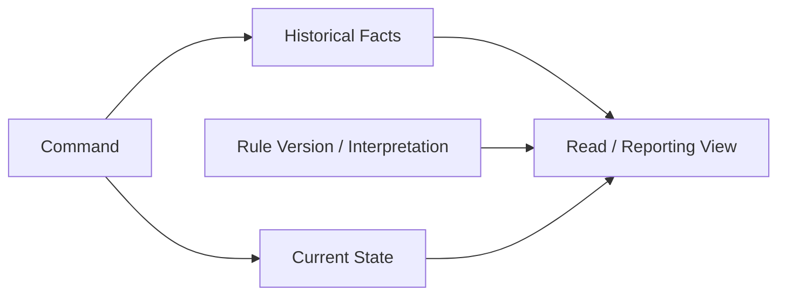
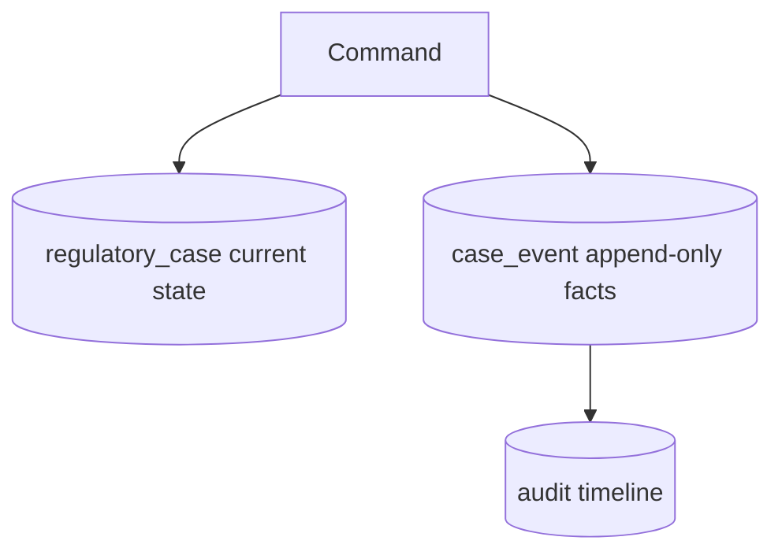
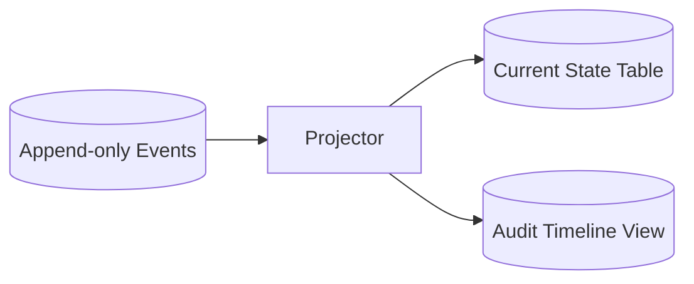
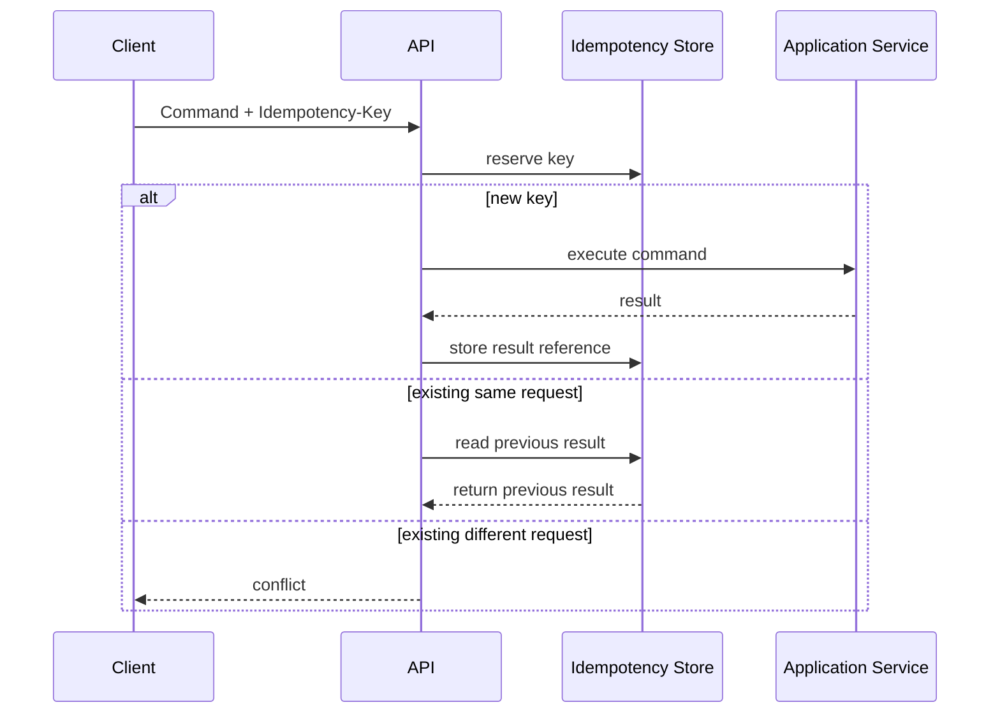
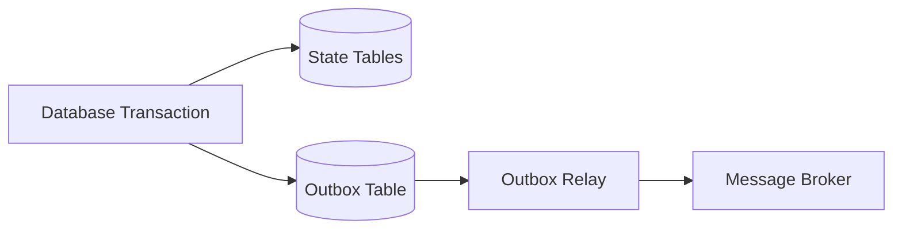
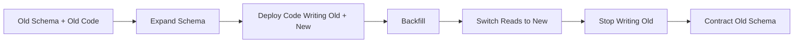

------
title: Learn Java Patterns - Part 008
description: Data modeling patterns untuk sistem Java production: identity, versioning, audit trail, temporal data, soft delete, immutable facts, reference data, schema evolution, dan defensible persistence model.
series: learn-java-patterns
seriesTitle: Learn Java Patterns, Data Patterns, Pipeline Patterns, Concurrency Patterns, Common Patterns, and Anti-Patterns
order: 8
partTitle: Data Modeling Patterns
tags:
- java
- patterns
- architecture
- advanced-java
- data-modeling
- persistence
date: 2026-06-27
---

# Learn Java Patterns - Part 008: Data Modeling Patterns

## 1. Tujuan Part Ini

Part ini membahas **data modeling patterns** untuk sistem Java production: bagaimana mendesain data agar identity, lifecycle, audit, temporalitas, consistency, query, dan evolusi schema tetap terkendali.

Kalau Part 007 fokus pada model domain sebagai penjaga invariant, part ini fokus pada model data sebagai **rekaman durable** dari fakta, state, relasi, dan keputusan.

Data model yang buruk biasanya menghasilkan masalah yang muncul terlambat:

- data tidak bisa diaudit;
- status berubah tapi alasan tidak tercatat;
- deleted record dibutuhkan kembali untuk investigasi;
- update terakhir menimpa keputusan penting;
- perubahan regulasi tidak bisa direkonstruksi;
- query laporan terlalu mahal;
- schema berubah tanpa migration path;
- reference data berubah dan merusak historical interpretation;
- event replay tidak mungkin karena data lama tidak lengkap;
- integration contract sulit dipertahankan karena model internal bocor.

> Data modeling bukan hanya membuat tabel. Data modeling adalah mendesain memori jangka panjang sistem.

---

## 2. Kaufman Lens: Sub-Skill yang Dilatih

Sub-skill utama pada part ini:

| Sub-Skill | Target Praktis |
|---|---|
| Identity modeling | Memilih identifier yang stabil, unik, dan sesuai boundary |
| State vs fact separation | Membedakan current state, historical fact, dan derived view |
| Version reasoning | Mengelola optimistic concurrency, schema version, rule version, dan event version |
| Temporal modeling | Memahami valid time, transaction time, effective date, dan bitemporal need |
| Auditability design | Merekam who/what/when/why/how secara defensible |
| Deletion semantics | Memilih hard delete, soft delete, tombstone, archival, atau legal hold |
| Reference data control | Mengelola lookup, enum, code table, dan historical meaning |
| Query model design | Memisahkan write model, read model, projection, dan reporting model |
| Evolution planning | Membuat data model bisa berubah tanpa big-bang migration berisiko |

Target setelah part ini:

> Anda bisa melihat data model dan menilai apakah ia aman untuk concurrency, audit, historical reconstruction, regulatory review, reporting, dan perubahan jangka panjang.

---

## 3. Mental Model: Data adalah State, Fact, dan Interpretation

Banyak desain data gagal karena semua hal diperlakukan sebagai “row terbaru”.

Padahal sistem production punya tiga bentuk data penting:

| Bentuk | Pertanyaan yang Dijawab | Contoh |
|---|---|---|
| Current State | Sekarang statusnya apa? | Case status = ESCALATED |
| Historical Fact | Apa yang pernah terjadi? | CaseEscalated pada tanggal X oleh actor Y |
| Interpretation | Apa arti data menurut versi aturan tertentu? | Penalty dihitung memakai Regulation v2026.1 |

Ketiganya tidak sama.



Data model yang kuat sengaja memisahkan:

- apa yang benar sekarang;
- apa yang pernah benar;
- kapan data itu berlaku;
- kapan sistem mengetahuinya;
- aturan versi mana yang dipakai;
- siapa yang membuat perubahan;
- alasan perubahan;
- apakah data boleh diubah atau hanya ditambahkan.

---

## 4. Identity Pattern

### 4.1 Problem

Tanpa identity yang stabil, semua relasi, audit, event, cache, idempotency, dan integration menjadi rapuh.

Identity bukan sekadar primary key.

Ada beberapa jenis identity:

| Jenis | Contoh | Kelebihan | Risiko |
|---|---|---|---|
| Surrogate ID | UUID, sequence, snowflake-like ID | Stabil, tidak bergantung domain meaning | Tidak bermakna bagi user |
| Natural ID | Tax number, email, license number | Bermakna domain | Bisa berubah, bisa salah, bisa sensitif |
| Business Reference | Case number, ticket number | Baik untuk komunikasi manusia | Format bisa berubah |
| Composite ID | jurisdiction + code + year | Mewakili uniqueness domain | Sulit dipakai lintas sistem |
| External ID | ID dari sistem lain | Memudahkan integration | Ownership bukan di sistem kita |

### 4.2 Rule Praktis

Gunakan identity internal yang stabil untuk relasi teknis, dan business reference untuk manusia.

```java
public record CaseId(UUID value) {
    public CaseId {
        Objects.requireNonNull(value, "case id must not be null");
    }

    public static CaseId newId() {
        return new CaseId(UUID.randomUUID());
    }
}

public record CaseNumber(String value) {
    public CaseNumber {
        if (value == null || value.isBlank()) {
            throw new IllegalArgumentException("case number must not be blank");
        }
        value = value.trim().toUpperCase(Locale.ROOT);
    }
}
```

Data table bisa menyimpan keduanya:

```sql
CREATE TABLE regulatory_case (
    id UUID PRIMARY KEY,
    case_number VARCHAR(64) NOT NULL UNIQUE,
    status VARCHAR(32) NOT NULL,
    created_at TIMESTAMP NOT NULL
);
```

### 4.3 Identity Failure Modes

| Failure Mode | Gejala | Dampak | Koreksi |
|---|---|---|---|
| Email sebagai primary key | User ganti email | Relasi rusak | Pakai immutable internal ID |
| ID bermakna terlalu banyak | Format ID mengandung status/type | Perubahan domain merusak ID | Pisahkan ID dari classification |
| ID dibuat database saja | Tidak bisa buat event/idempotency sebelum insert | Coupling persistence | Pertimbangkan application-generated ID |
| External ID sebagai ID utama | External system berubah/merge | Ownership kabur | Simpan external ID sebagai mapping |
| Composite ID bocor ke semua layer | Signature API berat | Coupling tinggi | Bungkus dengan value object |

---

## 5. Versioning Pattern

Versioning muncul di banyak level. Jangan campur semuanya menjadi satu field `version` tanpa makna.

| Version Type | Tujuan | Contoh |
|---|---|---|
| Row version | Optimistic concurrency | `record_version` increment |
| Domain version | Versi aggregate/event sequence | `case_version` |
| Schema version | Evolusi struktur data | migration version |
| Event version | Evolusi event contract | `event_type`, `event_version` |
| Rule/policy version | Audit keputusan | `regulation_version` |
| API version | Compatibility client | `/v1/cases` |

### 5.1 Optimistic Concurrency Version

Digunakan untuk mencegah lost update.

```sql
CREATE TABLE regulatory_case (
    id UUID PRIMARY KEY,
    status VARCHAR(32) NOT NULL,
    assigned_officer_id UUID,
    record_version BIGINT NOT NULL,
    updated_at TIMESTAMP NOT NULL
);
```

Update dengan expected version:

```sql
UPDATE regulatory_case
SET status = ?, assigned_officer_id = ?, record_version = record_version + 1, updated_at = ?
WHERE id = ? AND record_version = ?;
```

Jika affected row = 0, berarti ada concurrent modification.

Java repository bisa memodelkannya eksplisit:

```java
public interface CaseRepository {
    CaseFile get(CaseId id);

    void save(CaseFile caseFile, Version expectedVersion) throws OptimisticConflictException;
}
```

### 5.2 Domain Version / Aggregate Sequence

Untuk event, projection, dan audit, urutan perubahan aggregate sangat penting.

```java
public record AggregateVersion(long value) {
    public AggregateVersion {
        if (value < 0) {
            throw new IllegalArgumentException("version must not be negative");
        }
    }

    public AggregateVersion next() {
        return new AggregateVersion(value + 1);
    }
}
```

Event envelope:

```java
public record DomainEventEnvelope(
        UUID eventId,
        String aggregateType,
        UUID aggregateId,
        long aggregateVersion,
        String eventType,
        int eventVersion,
        Instant occurredAt,
        String actorId,
        String payloadJson
) {}
```

### 5.3 Policy Version

Untuk sistem regulasi, keputusan harus bisa dijelaskan berdasarkan aturan yang berlaku saat itu.

```sql
CREATE TABLE penalty_decision (
    id UUID PRIMARY KEY,
    case_id UUID NOT NULL,
    amount NUMERIC(19, 2) NOT NULL,
    currency CHAR(3) NOT NULL,
    regulation_version VARCHAR(64) NOT NULL,
    calculated_by UUID NOT NULL,
    calculated_at TIMESTAMP NOT NULL
);
```

Tanpa `regulation_version`, audit masa depan sulit menjawab mengapa amount itu sah.

---

## 6. State vs Fact Pattern

### 6.1 Problem

Current state memudahkan query, tetapi buruk untuk audit jika menimpa fakta lama.

```sql
UPDATE regulatory_case SET status = 'ESCALATED' WHERE id = ?;
```

Query current state mudah, tetapi pertanyaan berikut tidak bisa dijawab tanpa log tambahan:

- siapa yang mengubah status?
- kapan berubah?
- dari status apa?
- alasannya apa?
- apakah perubahan pernah dibatalkan?
- aturan apa yang dipakai?

### 6.2 Pattern: State Table + Fact Table



Current table:

```sql
CREATE TABLE regulatory_case (
    id UUID PRIMARY KEY,
    case_number VARCHAR(64) NOT NULL UNIQUE,
    status VARCHAR(32) NOT NULL,
    assigned_officer_id UUID,
    record_version BIGINT NOT NULL,
    opened_at TIMESTAMP NOT NULL,
    updated_at TIMESTAMP NOT NULL
);
```

Fact/event table:

```sql
CREATE TABLE case_event (
    event_id UUID PRIMARY KEY,
    case_id UUID NOT NULL,
    aggregate_version BIGINT NOT NULL,
    event_type VARCHAR(128) NOT NULL,
    event_version INT NOT NULL,
    actor_id UUID,
    reason TEXT,
    occurred_at TIMESTAMP NOT NULL,
    payload_json TEXT NOT NULL,
    UNIQUE (case_id, aggregate_version)
);
```

### 6.3 When to Use

Gunakan state + fact jika:

- audit penting;
- lifecycle kompleks;
- regulatory defensibility penting;
- laporan historical perlu akurat;
- integration downstream membutuhkan event;
- replay/projection mungkin dibutuhkan.

Jangan overuse untuk CRUD trivial yang tidak butuh history.

---

## 7. Audit Trail Pattern

### 7.1 Problem

Audit trail sering hanya berupa `created_at` dan `updated_at`. Itu tidak cukup untuk sistem enforcement, finance, healthcare, legal, atau regulated workflow.

Audit yang defensible biasanya perlu menjawab:

| Pertanyaan | Data yang Dibutuhkan |
|---|---|
| Siapa yang melakukan? | actor id, role, delegation context |
| Kapan dilakukan? | occurred_at, recorded_at |
| Apa yang berubah? | event type, before/after, changed fields |
| Mengapa dilakukan? | reason, policy decision, approval note |
| Dari mana dilakukan? | channel, request id, source system |
| Berdasarkan aturan apa? | policy/regulation version |
| Apakah authorized? | permission/role snapshot atau decision reference |

### 7.2 Audit Entry Model

```java
public record AuditEntry(
        UUID auditId,
        String subjectType,
        UUID subjectId,
        String action,
        ActorSnapshot actor,
        String reason,
        String requestId,
        Instant occurredAt,
        Instant recordedAt,
        Map<String, Object> metadata
) {}

public record ActorSnapshot(
        UUID actorId,
        String displayName,
        Set<String> roles
) {
    public ActorSnapshot {
        roles = Set.copyOf(roles);
    }
}
```

Mengapa snapshot actor? Karena role/name bisa berubah. Audit masa depan perlu konteks saat tindakan terjadi.

### 7.3 Audit Granularity

| Granularity | Kelebihan | Kekurangan |
|---|---|---|
| Field-level diff | Detail tinggi | Payload besar, kompleks |
| Event-level audit | Bahasa domain jelas | Tidak selalu menunjukkan semua field |
| Request-level audit | Mudah trace | Kurang detail domain |
| Hybrid | Kuat untuk investigasi | Perlu desain disiplin |

Untuk domain penting, event-level audit + metadata request biasanya efektif.

### 7.4 Audit Anti-Pattern

```sql
CREATE TABLE audit_log (
    id BIGINT PRIMARY KEY,
    message TEXT NOT NULL,
    created_at TIMESTAMP NOT NULL
);
```

Masalah:

- message free text sulit di-query;
- actor tidak structured;
- subject tidak jelas;
- reason tidak konsisten;
- tidak ada event type;
- tidak ada correlation id.

Lebih baik:

```sql
CREATE TABLE audit_log (
    id UUID PRIMARY KEY,
    subject_type VARCHAR(64) NOT NULL,
    subject_id UUID NOT NULL,
    action VARCHAR(128) NOT NULL,
    actor_id UUID,
    actor_snapshot_json TEXT,
    reason TEXT,
    request_id VARCHAR(128),
    occurred_at TIMESTAMP NOT NULL,
    recorded_at TIMESTAMP NOT NULL,
    metadata_json TEXT NOT NULL
);
```

---

## 8. Temporal Data Pattern

### 8.1 Problem

Banyak data tidak hanya punya satu waktu.

Contoh:

- license valid dari 1 Januari sampai 31 Desember;
- sistem baru mengetahui perubahan pada 5 Februari;
- keputusan dibuat 10 Februari berdasarkan data yang berlaku 1 Februari;
- correction dimasukkan 20 Februari karena data sebelumnya salah.

Jika hanya punya `created_at` dan `updated_at`, pertanyaan historical menjadi ambigu.

### 8.2 Valid Time vs Transaction Time

| Time | Arti | Contoh |
|---|---|---|
| Valid Time | Kapan fakta berlaku di dunia domain | License berlaku 2026-01-01 sampai 2026-12-31 |
| Transaction Time | Kapan sistem mencatat fakta | Data dimasukkan 2026-02-05 |
| Occurred Time | Kapan event terjadi | Case escalated 2026-02-10 |
| Recorded Time | Kapan event diterima/disimpan | Event tercatat 2026-02-10 10:01 |

### 8.3 Effective-Dated Table

```sql
CREATE TABLE officer_assignment_history (
    id UUID PRIMARY KEY,
    case_id UUID NOT NULL,
    officer_id UUID NOT NULL,
    valid_from TIMESTAMP NOT NULL,
    valid_to TIMESTAMP,
    recorded_at TIMESTAMP NOT NULL,
    recorded_by UUID NOT NULL
);
```

Query officer yang berlaku pada waktu tertentu:

```sql
SELECT *
FROM officer_assignment_history
WHERE case_id = ?
  AND valid_from <= ?
  AND (valid_to IS NULL OR valid_to > ?);
```

### 8.4 Bitemporal Pattern

Bitemporal data menyimpan valid time dan transaction time.

```sql
CREATE TABLE license_status_history (
    id UUID PRIMARY KEY,
    license_id UUID NOT NULL,
    status VARCHAR(32) NOT NULL,
    valid_from DATE NOT NULL,
    valid_to DATE,
    tx_from TIMESTAMP NOT NULL,
    tx_to TIMESTAMP,
    recorded_by UUID NOT NULL,
    reason TEXT
);
```

Ini menjawab dua pertanyaan berbeda:

- “Apa status license yang berlaku pada 1 Februari?”
- “Apa yang sistem kita tahu pada 1 Februari?”

Bitemporal tidak murah. Gunakan saat historical correction dan legal/audit reconstruction penting.

---

## 9. Soft Delete, Tombstone, Archive, dan Legal Hold

### 9.1 Problem

`DELETE FROM table WHERE id = ?` sederhana, tetapi sering tidak sesuai untuk sistem yang butuh audit.

Deletion punya makna berbeda:

| Pattern | Arti |
|---|---|
| Hard Delete | Data dihapus secara fisik |
| Soft Delete | Data disembunyikan dengan flag/timestamp |
| Tombstone | Record minimal tersisa untuk menandai pernah ada |
| Archive | Data dipindah ke storage historis |
| Legal Hold | Data tidak boleh dihapus karena kewajiban legal/audit |
| Redaction | Data sensitif dihapus sebagian, fakta tetap ada |

### 9.2 Soft Delete Pattern

```sql
ALTER TABLE regulatory_case
ADD COLUMN deleted_at TIMESTAMP,
ADD COLUMN deleted_by UUID,
ADD COLUMN deletion_reason TEXT;
```

Query aktif harus eksplisit:

```sql
SELECT * FROM regulatory_case
WHERE deleted_at IS NULL;
```

### 9.3 Soft Delete Failure Modes

| Failure Mode | Gejala | Koreksi |
|---|---|---|
| Query lupa filter deleted | Data “terhapus” muncul lagi | Default scope/repository method jelas |
| Unique constraint rusak | Tidak bisa recreate record dengan natural key | Partial unique index jika DB mendukung |
| Soft delete dipakai untuk semua | Table membengkak, query lambat | Archive policy |
| Tidak ada reason | Audit tidak defensible | Wajibkan deletion reason |
| Delete event tidak dicatat | Downstream tidak tahu | Emit domain/integration event |

### 9.4 Tombstone Pattern

Tombstone berguna untuk distributed system dan sync.

```sql
CREATE TABLE case_tombstone (
    case_id UUID PRIMARY KEY,
    deleted_at TIMESTAMP NOT NULL,
    deleted_by UUID,
    reason TEXT,
    last_known_case_number VARCHAR(64)
);
```

Tombstone menjawab:

- record ini pernah ada;
- sudah dihapus;
- kapan dihapus;
- agar downstream tidak membuat ulang secara keliru.

### 9.5 Redaction Pattern

Untuk data sensitif, kadang yang diperlukan bukan menghapus seluruh record, tetapi menghapus field tertentu.

```sql
UPDATE person_subject
SET full_name = '[REDACTED]',
    email = NULL,
    redacted_at = ?,
    redacted_reason = ?
WHERE id = ?;
```

Tetap simpan event/audit bahwa redaction terjadi.

---

## 10. Immutable Facts Pattern

### 10.1 Problem

Beberapa data seharusnya tidak di-update, hanya ditambahkan.

Contoh:

- audit entry;
- ledger transaction;
- domain event;
- notification sent record;
- approval decision;
- enforcement action history.

Jika fakta penting bisa di-update, forensic reconstruction menjadi lemah.

### 10.2 Append-Only Table

```sql
CREATE TABLE approval_decision_event (
    event_id UUID PRIMARY KEY,
    action_id UUID NOT NULL,
    decision VARCHAR(32) NOT NULL,
    decided_by UUID NOT NULL,
    reason TEXT,
    occurred_at TIMESTAMP NOT NULL,
    sequence_number BIGINT NOT NULL,
    UNIQUE (action_id, sequence_number)
);
```

Tidak ada update untuk mengubah keputusan lama. Jika perlu koreksi, tambahkan event baru.

```text
ApprovalRequested
ApprovalRejected
ApprovalReopened
ApprovalApproved
```

### 10.3 Current State dari Facts

Current state bisa disimpan sebagai projection.



Projection bisa rebuilt jika event lengkap.

### 10.4 Trade-Off

| Kelebihan | Biaya |
|---|---|
| Audit kuat | Query current state butuh projection |
| Forensic reconstruction | Storage lebih besar |
| Event replay mungkin | Migration event sulit |
| Tidak kehilangan history | Developer perlu memahami sequence |

Gunakan append-only untuk fakta penting, bukan untuk semua field kecil tanpa nilai audit.

---

## 11. Reference Data Pattern

### 11.1 Problem

Reference data terlihat sederhana, tetapi sering menyebabkan bug historical.

Contoh:

- violation code;
- jurisdiction;
- regulation version;
- risk category;
- penalty type;
- case status;
- officer role;
- document type.

Pertanyaan penting:

- Apakah daftar ini berubah?
- Apakah perubahan berlaku ke data lama?
- Apakah code perlu effective date?
- Apakah external system bergantung pada code?
- Apakah enum Java cukup?

### 11.2 Enum vs Table

| Pilihan | Cocok Untuk | Jangan Jika |
|---|---|---|
| Java enum | Daftar kecil, stabil, bagian logic code | Data sering berubah atau dikelola admin |
| Database lookup table | Dikelola runtime/admin, perlu metadata | Logic compile-time bergantung kuat |
| Versioned reference table | Meaning berubah per periode | Tidak butuh historical meaning |
| External master data | Ownership di sistem lain | Availability/latency tidak diterima |

### 11.3 Stable Code + Display Name

```sql
CREATE TABLE violation_type (
    code VARCHAR(64) PRIMARY KEY,
    display_name VARCHAR(255) NOT NULL,
    description TEXT,
    active BOOLEAN NOT NULL,
    valid_from DATE NOT NULL,
    valid_to DATE
);
```

Simpan code pada transactional data, bukan display name saja.

```sql
CREATE TABLE case_violation (
    id UUID PRIMARY KEY,
    case_id UUID NOT NULL,
    violation_code VARCHAR(64) NOT NULL,
    recorded_at TIMESTAMP NOT NULL
);
```

### 11.4 Historical Snapshot

Jika meaning reference data bisa berubah, simpan snapshot pada decision penting.

```java
public record ViolationSnapshot(
        String code,
        String displayName,
        String regulationVersion
) {}
```

Ini membuat historical decision tetap bisa dijelaskan walau lookup table berubah.

---

## 12. Status Modeling Pattern

### 12.1 Problem

Kolom status sering menjadi dumping ground.

```sql
status VARCHAR(32) NOT NULL
```

Masalahnya bukan kolomnya. Masalahnya adalah tidak ada model transition.

### 12.2 Status sebagai Lifecycle State

Status harus punya:

- allowed transitions;
- owner command;
- required metadata;
- terminal behavior;
- visibility/query implication.

Transition table:

| Current | Command | Next | Required Data |
|---|---|---|---|
| OPEN | assign | ASSIGNED | officer_id, actor_id |
| ASSIGNED | start_review | UNDER_REVIEW | actor_id |
| UNDER_REVIEW | escalate | ESCALATED | reason, actor_id |
| UNDER_REVIEW | resolve | RESOLVED | decision_id |
| RESOLVED | close | CLOSED | closure_reason |

### 12.3 Status History Table

```sql
CREATE TABLE case_status_history (
    id UUID PRIMARY KEY,
    case_id UUID NOT NULL,
    from_status VARCHAR(32),
    to_status VARCHAR(32) NOT NULL,
    changed_by UUID NOT NULL,
    reason TEXT,
    changed_at TIMESTAMP NOT NULL,
    command_id UUID
);
```

Current status tetap disimpan di main table untuk query cepat. History menyimpan transition.

### 12.4 Status Anti-Pattern

| Anti-Pattern | Gejala | Koreksi |
|---|---|---|
| Boolean explosion | `isClosed`, `isApproved`, `isEscalated` saling konflik | Gunakan explicit state |
| Magic string status | Typo runtime | Enum/value object + constraint |
| Status tanpa reason | Audit lemah | Transition event/history wajib reason untuk status penting |
| Any-to-any transition | Workflow tidak terlindungi | Transition guard |
| Status dipakai untuk banyak dimensi | `PENDING_APPROVAL_AND_ASSIGNED` | Pisah state dimension |

---

## 13. Relationship Modeling Pattern

### 13.1 Problem

Relasi database tidak selalu sama dengan relasi domain.

Foreign key menjawab integritas referensial. Aggregate boundary menjawab consistency dan ownership.

### 13.2 Relationship Types

| Relationship | Contoh | Modeling Hint |
|---|---|---|
| Ownership | Case owns violations | Child dalam aggregate/table dengan cascade terbatas |
| Reference | Case assigned to officer | Simpan `officer_id`, officer aggregate terpisah |
| Association history | Officer assignment berubah | History table |
| Many-to-many | Case linked to related cases | Join table dengan metadata |
| External reference | Case linked to external complaint | Mapping table |

### 13.3 Avoid Object Graph Trap

Jangan memuat seluruh graph hanya karena ada foreign key.

```java
class CaseFile {
    private Officer assignedOfficer; // berisiko memuat aggregate lain
}
```

Lebih baik:

```java
class CaseFile {
    private OfficerId assignedOfficerId;
}
```

Untuk read model, join/projection boleh digunakan.

Command model menjaga boundary. Read model mengoptimalkan query.

---

## 14. Snapshot Pattern

### 14.1 Problem

Kadang data eksternal atau reference berubah, tetapi decision masa lalu harus tetap memakai konteks lama.

Contoh:

- officer role saat approve;
- regulation text saat penalty dihitung;
- subject address saat notice dikirim;
- violation display name saat decision dibuat.

Jika hanya menyimpan foreign key, historical view bisa berubah.

### 14.2 Snapshot Value

```java
public record OfficerDecisionSnapshot(
        UUID officerId,
        String displayName,
        Set<String> roles,
        String unitName
) {
    public OfficerDecisionSnapshot {
        roles = Set.copyOf(roles);
    }
}
```

Decision table:

```sql
CREATE TABLE enforcement_decision (
    id UUID PRIMARY KEY,
    case_id UUID NOT NULL,
    decision VARCHAR(32) NOT NULL,
    decided_by UUID NOT NULL,
    decided_by_snapshot_json TEXT NOT NULL,
    reason TEXT NOT NULL,
    decided_at TIMESTAMP NOT NULL
);
```

### 14.3 Snapshot Trade-Off

| Kelebihan | Biaya |
|---|---|
| Historical accuracy | Data duplicate |
| Audit kuat | Snapshot schema perlu versioning |
| Tidak tergantung lookup saat replay | Bisa stale untuk current view |

Gunakan snapshot untuk decision/audit penting, bukan semua relasi.

---

## 15. Idempotency Data Pattern

### 15.1 Problem

Command bisa dikirim ulang karena retry, timeout, user double click, atau message redelivery.

Tanpa idempotency, sistem bisa membuat duplicate case, duplicate payment, duplicate notification, atau duplicate enforcement action.

### 15.2 Idempotency Key Table

```sql
CREATE TABLE idempotency_record (
    idempotency_key VARCHAR(128) PRIMARY KEY,
    command_type VARCHAR(128) NOT NULL,
    request_hash VARCHAR(128) NOT NULL,
    response_reference VARCHAR(256),
    status VARCHAR(32) NOT NULL,
    created_at TIMESTAMP NOT NULL,
    expires_at TIMESTAMP
);
```

Flow:



### 15.3 Java Sketch

```java
public interface IdempotencyStore {
    IdempotencyReservation reserve(String key, String commandType, String requestHash);

    void complete(String key, String responseReference);
}

public sealed interface IdempotencyReservation {
    record New() implements IdempotencyReservation {}
    record Existing(String responseReference) implements IdempotencyReservation {}
    record Conflict() implements IdempotencyReservation {}
}
```

Idempotency adalah data pattern karena perlu durable record dan uniqueness constraint.

---

## 16. Outbox-Like Data Boundary Preview

Outbox akan dibahas lebih dalam di Part 011. Di part ini, kita hanya melihatnya sebagai data modeling problem.

### 16.1 Problem

Kita ingin menyimpan state dan mengirim event. Jika database commit berhasil tapi publish gagal, downstream tidak tahu. Jika publish berhasil tapi database rollback, downstream melihat event palsu.

### 16.2 Outbox Table

```sql
CREATE TABLE outbox_message (
    id UUID PRIMARY KEY,
    aggregate_type VARCHAR(128) NOT NULL,
    aggregate_id UUID NOT NULL,
    event_type VARCHAR(128) NOT NULL,
    event_version INT NOT NULL,
    payload_json TEXT NOT NULL,
    headers_json TEXT NOT NULL,
    occurred_at TIMESTAMP NOT NULL,
    published_at TIMESTAMP,
    publish_attempts INT NOT NULL DEFAULT 0
);
```

State update dan outbox insert terjadi dalam satu transaction.



Data model harus mendukung retry, ordering, failure, dan deduplication.

---

## 17. Read Model / Projection Pattern

### 17.1 Problem

Write model yang baik untuk invariant sering buruk untuk query.

Contoh:

- dashboard butuh case number, status, officer name, last event, SLA, risk label;
- data tersebar di banyak aggregate;
- query join berat;
- security filtering kompleks;
- report butuh denormalized shape.

Jangan rusak aggregate hanya agar query mudah.

### 17.2 Projection Table

```sql
CREATE TABLE case_dashboard_projection (
    case_id UUID PRIMARY KEY,
    case_number VARCHAR(64) NOT NULL,
    status VARCHAR(32) NOT NULL,
    risk_score INT NOT NULL,
    risk_label VARCHAR(32) NOT NULL,
    assigned_officer_name VARCHAR(255),
    last_activity_at TIMESTAMP NOT NULL,
    sla_due_at TIMESTAMP,
    search_text TEXT
);
```

Projection di-update dari event atau application transaction.

### 17.3 Read Model Rules

| Rule | Alasan |
|---|---|
| Read model boleh denormalized | Tujuannya query cepat |
| Read model tidak menjadi source of truth | Hindari conflicting writes |
| Rebuild path harus ada jika derived | Projection bisa rusak |
| Staleness harus diketahui | Eventual consistency mempengaruhi UX |
| Security harus tetap dihormati | Jangan bocorkan data lewat projection |

---

## 18. Schema Evolution Pattern

### 18.1 Problem

Data model berubah. Production database tidak bisa diperlakukan seperti object memory yang bebas diganti.

Perubahan berisiko:

- rename column;
- split table;
- change enum value;
- change JSON shape;
- add non-null column;
- backfill besar;
- change unique constraint;
- migrate reference data.

### 18.2 Expand-Contract Pattern



Contoh rename column aman:

1. add new column;
2. write both old and new;
3. backfill new column;
4. read from new column;
5. stop writing old;
6. drop old after safe window.

### 18.3 Non-Null Column Safe Migration

Buruk:

```sql
ALTER TABLE regulatory_case ADD COLUMN jurisdiction VARCHAR(32) NOT NULL;
```

Jika table sudah berisi data, ini bisa gagal atau lock besar.

Lebih aman:

```sql
ALTER TABLE regulatory_case ADD COLUMN jurisdiction VARCHAR(32);
-- deploy code writing jurisdiction
-- backfill in chunks
-- validate no nulls
ALTER TABLE regulatory_case ALTER COLUMN jurisdiction SET NOT NULL;
```

### 18.4 JSON Payload Versioning

Jika menyimpan JSON event/audit, versioning wajib.

```json
{
  "eventType": "CaseEscalated",
  "eventVersion": 2,
  "caseId": "...",
  "reason": "High risk",
  "policyVersion": "REG-2026.1"
}
```

Event reader harus bisa membaca versi lama atau melalui upcaster.

---

## 19. Data Integrity Pattern

### 19.1 Problem

Sebagian developer menaruh semua validasi di application code dan lupa database constraint.

Application validation penting, tetapi database adalah last line of defense.

### 19.2 Constraint Types

| Constraint | Contoh |
|---|---|
| Primary key | `id UUID PRIMARY KEY` |
| Unique | `case_number UNIQUE` |
| Foreign key | `case_id REFERENCES regulatory_case(id)` |
| Not null | `status NOT NULL` |
| Check | `risk_score BETWEEN 0 AND 100` |
| Exclusion/partial index | unique only active rows |
| Optimistic version | `record_version` expected update |

### 19.3 Double Validation Rule

| Rule Type | Domain Code | Database |
|---|---:|---:|
| User-friendly validation | Ya | Tidak cukup |
| Critical invariant within row | Ya | Ya |
| Referential integrity | Ya | Ya jika feasible |
| Cross-aggregate business policy | Ya | Kadang tidak |
| Regulatory/audit required field | Ya | Ya |

Example:

```sql
CREATE TABLE regulatory_case (
    id UUID PRIMARY KEY,
    case_number VARCHAR(64) NOT NULL UNIQUE,
    status VARCHAR(32) NOT NULL,
    risk_score INT NOT NULL CHECK (risk_score BETWEEN 0 AND 100),
    opened_at TIMESTAMP NOT NULL
);
```

---

## 20. Data Classification Pattern

### 20.1 Problem

Tidak semua data punya sensitivity dan retention yang sama.

Dalam sistem case/enforcement, data bisa mencakup:

- personally identifiable information;
- confidential investigation notes;
- public decision records;
- internal risk scoring;
- legal hold records;
- system metadata;
- audit log.

Data model harus mencerminkan classification.

### 20.2 Classification Columns

```sql
CREATE TABLE case_document (
    id UUID PRIMARY KEY,
    case_id UUID NOT NULL,
    document_type VARCHAR(64) NOT NULL,
    classification VARCHAR(64) NOT NULL,
    storage_key VARCHAR(512) NOT NULL,
    uploaded_by UUID NOT NULL,
    uploaded_at TIMESTAMP NOT NULL,
    retention_until DATE,
    legal_hold BOOLEAN NOT NULL DEFAULT FALSE
);
```

### 20.3 Why It Matters

Classification mempengaruhi:

- authorization;
- encryption;
- retention;
- redaction;
- audit;
- search indexing;
- export;
- backup/restore policy;
- observability log filtering.

Jangan biarkan data sensitivity hanya ada di dokumen kebijakan. Buat terlihat di model.

---

## 21. Data Ownership Pattern

### 21.1 Problem

Sistem besar sering memiliki data yang sama di banyak tempat.

Contoh:

- officer name ada di identity service, case projection, audit snapshot, report export;
- violation code ada di reference service, case event, decision snapshot;
- case status ada di case service, notification service, dashboard projection.

Pertanyaan utama: siapa source of truth?

### 21.2 Ownership Matrix

| Data | Owner | Copy Allowed? | Copy Type |
|---|---|---:|---|
| Officer profile | Identity service | Ya | Snapshot/projection |
| Case lifecycle | Case service | Ya | Event/projection |
| Violation code | Reference data service | Ya | Versioned snapshot |
| Notification delivery status | Notification service | Ya | Summary projection |
| Audit event | Audit service/log | Ya | Append-only record |

### 21.3 Copy Semantics

Tidak semua copy salah. Yang penting adalah semantics:

| Copy Type | Tujuan |
|---|---|
| Cache | Performance, boleh expire |
| Projection | Query, bisa rebuild |
| Snapshot | Historical accuracy, tidak mengikuti source update |
| Replica | Availability, sync semantics jelas |
| Export | External consumption, immutable once delivered |

---

## 22. Java Persistence Model Patterns

### 22.1 Domain Model vs Persistence Model

Ada dua pendekatan umum.

#### Option A: Single Model

```java
@Entity
@Table(name = "regulatory_case")
public class CaseJpaEntity {
    @Id
    private UUID id;

    @Column(nullable = false)
    private String status;

    @Version
    private long version;
}
```

Kelebihan:

- cepat dibuat;
- sedikit mapping;
- cocok untuk CRUD sederhana.

Kekurangan:

- domain logic mudah tercampur ORM;
- lazy loading bisa bocor;
- setter dibuka demi framework;
- aggregate boundary bisa mengikuti schema.

#### Option B: Separate Domain and Persistence

```java
public final class CaseFile {
    private final CaseId id;
    private CaseStatus status;
    private RiskScore riskScore;
    // domain behavior
}

@Entity
@Table(name = "regulatory_case")
public class CaseRecord {
    @Id
    UUID id;
    String status;
    int riskScore;
    long version;
}
```

Mapper:

```java
public final class CaseMapper {
    public CaseFile toDomain(CaseRecord record) {
        return CaseFile.restore(
                new CaseId(record.id),
                CaseStatus.valueOf(record.status),
                new RiskScore(record.riskScore),
                new Version(record.version)
        );
    }

    public void updateRecord(CaseFile domain, CaseRecord record) {
        record.status = domain.status().name();
        record.riskScore = domain.riskScore().value();
    }
}
```

Kelebihan:

- domain lebih bersih;
- persistence bisa berubah;
- aggregate lebih eksplisit.

Kekurangan:

- mapping cost;
- duplicate model;
- perlu discipline.

### 22.2 Practical Rule

| Context | Pilihan yang Masuk Akal |
|---|---|
| CRUD sederhana | Single JPA model cukup |
| Domain kompleks dengan lifecycle | Separate atau hybrid |
| High-performance read path | Projection/read model terpisah |
| Event/audit heavy system | Domain event + state table + outbox |
| Legacy DB | Persistence model terpisah sering lebih aman |

---

## 23. Data Model Review: Case Management Example

Misalnya kita punya regulatory enforcement case.

### 23.1 Core Tables

```sql
CREATE TABLE regulatory_case (
    id UUID PRIMARY KEY,
    case_number VARCHAR(64) NOT NULL UNIQUE,
    jurisdiction VARCHAR(32) NOT NULL,
    status VARCHAR(32) NOT NULL,
    risk_score INT NOT NULL CHECK (risk_score BETWEEN 0 AND 100),
    assigned_officer_id UUID,
    record_version BIGINT NOT NULL,
    opened_at TIMESTAMP NOT NULL,
    updated_at TIMESTAMP NOT NULL,
    deleted_at TIMESTAMP
);

CREATE TABLE case_violation (
    id UUID PRIMARY KEY,
    case_id UUID NOT NULL REFERENCES regulatory_case(id),
    violation_code VARCHAR(64) NOT NULL,
    severity VARCHAR(32) NOT NULL,
    recorded_at TIMESTAMP NOT NULL
);

CREATE TABLE case_status_history (
    id UUID PRIMARY KEY,
    case_id UUID NOT NULL,
    from_status VARCHAR(32),
    to_status VARCHAR(32) NOT NULL,
    changed_by UUID NOT NULL,
    reason TEXT,
    changed_at TIMESTAMP NOT NULL
);

CREATE TABLE case_event (
    event_id UUID PRIMARY KEY,
    case_id UUID NOT NULL,
    aggregate_version BIGINT NOT NULL,
    event_type VARCHAR(128) NOT NULL,
    event_version INT NOT NULL,
    actor_id UUID,
    occurred_at TIMESTAMP NOT NULL,
    payload_json TEXT NOT NULL,
    UNIQUE (case_id, aggregate_version)
);
```

### 23.2 Why This Shape Works

| Requirement | Supported By |
|---|---|
| Query current status | `regulatory_case.status` |
| Audit transition | `case_status_history` |
| Replay facts | `case_event` |
| Prevent lost update | `record_version` |
| Explain risk | `risk_score`, event payload, policy version if needed |
| Link violations | `case_violation` |
| Soft delete | `deleted_at` |
| Historical event ordering | `(case_id, aggregate_version)` |

### 23.3 Missing Depending on Domain

Mungkin masih perlu:

- `case_assignment_history` jika assignment history penting;
- `outbox_message` untuk integration event;
- `case_document` untuk attachment metadata;
- `decision_snapshot` untuk approval/penalty;
- `legal_hold` untuk retention;
- `case_dashboard_projection` untuk query cepat.

---

## 24. Failure Modeling untuk Data Design

Sebelum finalisasi data model, lakukan failure modeling.

| Failure Scenario | Pertanyaan Data Design |
|---|---|
| Concurrent officer assignment | Apakah ada optimistic version? |
| Retry command setelah timeout | Apakah ada idempotency key? |
| Case status salah diubah | Apakah ada status history dan actor? |
| Policy berubah tahun depan | Apakah decision menyimpan policy version? |
| Reference code rename | Apakah historical snapshot dibutuhkan? |
| User minta delete | Hard delete, redaction, atau legal hold? |
| Downstream missed event | Apakah outbox/replay tersedia? |
| Projection corrupt | Apakah bisa rebuild dari fact/event? |
| Audit investigation | Bisakah timeline direkonstruksi? |
| Schema migration gagal | Apakah expand-contract dipakai? |

---

## 25. Anti-Patterns dalam Data Modeling

### 25.1 One Table to Rule Them All

Semua data dimasukkan ke satu table besar.

Gejala:

- banyak nullable columns;
- status menentukan field mana yang valid;
- query lambat;
- locking tinggi;
- migration sulit;
- lifecycle berbeda tercampur.

Koreksi:

- pisahkan child table/lifecycle;
- buat projection untuk query;
- gunakan event/history untuk audit.

### 25.2 Audit as Text Blob

Audit hanya free text.

Koreksi:

- structured event type;
- subject id/type;
- actor snapshot;
- occurred_at;
- reason;
- metadata.

### 25.3 Status Without History

Current status ada, tetapi history tidak.

Koreksi:

- status history table;
- domain event;
- transition reason.

### 25.4 Mutable Reference Meaning

Lookup display berubah dan historical report ikut berubah.

Koreksi:

- stable code;
- effective dating;
- snapshot untuk decision penting.

### 25.5 JSON Dump Without Contract

Semua data disimpan sebagai JSON karena “flexible”.

Risiko:

- constraint lemah;
- query sulit;
- schema tidak jelas;
- migration tersembunyi;
- data quality turun.

Koreksi:

- gunakan JSON untuk metadata yang memang fleksibel;
- field penting tetap structured;
- simpan `payload_version`;
- validasi schema di application.

### 25.6 No Deletion Semantics

Delete hanya dianggap technical operation.

Koreksi:

- definisikan hard delete/soft delete/archive/redaction/legal hold;
- simpan reason;
- emit event;
- pastikan query aktif konsisten.

---

## 26. Decision Matrix

| Problem | Pattern | Pertanyaan Kritis |
|---|---|---|
| Need stable reference | Surrogate ID + business reference | Apakah natural key bisa berubah? |
| Prevent lost update | Optimistic version | Apa conflict resolution-nya? |
| Need audit timeline | Event/audit table | Apakah event structured? |
| Need current query fast | State table/projection | Apakah projection source of truth? |
| Need historical meaning | Snapshot/versioned reference | Apa yang boleh berubah? |
| Need temporal correction | Effective-dated/bitemporal | Valid time atau transaction time? |
| Need deletion trace | Soft delete/tombstone | Apakah legal hold berlaku? |
| Need reliable publish | Outbox | Bagaimana dedupe downstream? |
| Need retry safety | Idempotency record | Apa request hash-nya? |
| Need schema change | Expand-contract | Apa rollback path-nya? |

---

## 27. Checklist Production Data Model

### 27.1 Identity

- Apakah setiap aggregate/entity punya identity stabil?
- Apakah business reference dipisah dari technical ID?
- Apakah external ID disimpan dengan ownership jelas?
- Apakah uniqueness constraint ada di database?

### 27.2 Versioning

- Apakah optimistic concurrency diperlukan?
- Apakah event sequence perlu dijaga?
- Apakah policy/rule version disimpan pada decision?
- Apakah JSON/event payload punya version?

### 27.3 Audit

- Apakah actor, reason, timestamp, request ID tercatat?
- Apakah audit structured, bukan text blob saja?
- Apakah actor snapshot dibutuhkan?
- Apakah timeline bisa direkonstruksi?

### 27.4 Temporal

- Apakah data punya effective date?
- Apakah correction historical mungkin?
- Apakah valid time dan transaction time perlu dibedakan?
- Apakah report historical akan berubah jika lookup berubah?

### 27.5 Deletion and Retention

- Apakah hard delete aman?
- Apakah soft delete cukup?
- Apakah tombstone dibutuhkan untuk sync?
- Apakah redaction lebih tepat daripada delete?
- Apakah legal hold perlu?

### 27.6 Query and Projection

- Apakah write model dipaksa melayani query berat?
- Apakah read model/projection dibutuhkan?
- Apakah projection bisa rebuild?
- Apakah staleness acceptable?

### 27.7 Evolution

- Apakah migration bisa expand-contract?
- Apakah backfill bisa chunked?
- Apakah old code dan new code bisa berjalan bersamaan selama deploy?
- Apakah rollback path jelas?

---

## 28. Practice Drill

### Drill 1: Identity Review

Ambil satu entity penting. Tulis:

- internal ID;
- business reference;
- natural keys;
- external IDs;
- uniqueness rule;
- apakah masing-masing bisa berubah.

### Drill 2: Audit Timeline

Untuk command `escalateCase`, tulis data yang harus tercatat:

- case id;
- from status;
- to status;
- actor;
- reason;
- occurred_at;
- policy version;
- request id;
- event id.

### Drill 3: Temporal Modeling

Pilih satu data yang punya effective date, misalnya assignment officer atau license status.

Buat table dengan:

- `valid_from`;
- `valid_to`;
- `recorded_at`;
- `recorded_by`;
- `reason`.

Tulis query “data yang berlaku pada tanggal X”.

### Drill 4: Soft Delete Decision

Untuk 5 entity, tentukan deletion semantics.

| Entity | Delete Strategy | Reason |
|---|---|---|
| Case | Soft delete/legal hold | Audit penting |
| Attachment | Archive/redaction | Sensitive data |
| Audit log | No delete/legal hold | Forensic |
| Draft note | Hard delete mungkin | Low regulatory value |
| Projection | Rebuild/delete allowed | Derived data |

### Drill 5: Expand-Contract Migration

Ambil field `assigned_officer_name` yang ingin diganti menjadi `assigned_officer_id`.

Tulis langkah:

1. add new column;
2. dual write;
3. backfill;
4. dual read or read new;
5. stop old write;
6. drop old column.

---

## 29. Ringkasan

Data modeling pattern membantu sistem bertahan dalam jangka panjang.

Inti part ini:

- Identity harus stabil dan ownership-nya jelas.
- Business reference berbeda dari technical ID.
- Versioning terjadi di banyak level: row, aggregate, event, schema, policy, API.
- Current state dan historical fact sebaiknya tidak dicampur sembarangan.
- Audit trail harus structured dan defensible.
- Temporal data perlu membedakan valid time, transaction time, occurred time, dan recorded time.
- Soft delete bukan satu-satunya deletion strategy; ada tombstone, archive, redaction, dan legal hold.
- Immutable facts cocok untuk audit, ledger, event, dan decision history.
- Reference data perlu stable code, effective date, dan kadang snapshot.
- Read model/projection boleh denormalized, tetapi bukan source of truth.
- Schema evolution perlu expand-contract agar aman di production.
- Database constraint tetap penting sebagai last line of defense.

Part berikutnya akan membahas **Repository, Unit of Work, and Transaction Patterns**: bagaimana domain model dan data model dihubungkan melalui repository, transaction boundary, optimistic/pessimistic locking, consistency, dan persistence orchestration.
